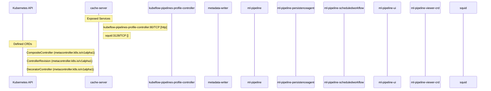

# data-science-pipelines: Dataflow

## Controller Watches

Kubernetes resources this controller monitors for changes. Each watch triggers reconciliation when the watched resource is created, updated, or deleted.

| Type | GVK | Source |
|------|-----|--------|

### Programmatic Resource Operations

| Verb | Kind | Group | Condition |
|------|------|-------|----------|
| create | Deployment | apps |  |
| create | Service |  |  |

## Reconciliation Flow

How the controller interacts with the Kubernetes API during reconciliation.

### HTTP Endpoints

| Method | Path | Source |
|--------|------|--------|
| * | / | [`.gopath-loader/pkg/mod/github.com/argoproj/argo-workflows/v3@v3.7.11/server/apiserver/argoserver.go:440`](https://github.com/kubeflow/data-science-pipelines/blob/b73cf65084cbcc8ed3c331e92ae28553a3e67b03/.gopath-loader/pkg/mod/github.com/argoproj/argo-workflows/v3@v3.7.11/server/apiserver/argoserver.go#L440) |
| * | / | [`.gopath-loader/pkg/mod/github.com/aws/aws-sdk-go-v2@v1.41.3/internal/awstesting/certificate_utils.go:225`](https://github.com/kubeflow/data-science-pipelines/blob/b73cf65084cbcc8ed3c331e92ae28553a3e67b03/.gopath-loader/pkg/mod/github.com/aws/aws-sdk-go-v2@v1.41.3/internal/awstesting/certificate_utils.go#L225) |
| * | / | [`.gomod-cache/golang.org/x/net@v0.51.0/webdav/litmus_test_server.go:83`](https://github.com/kubeflow/data-science-pipelines/blob/b73cf65084cbcc8ed3c331e92ae28553a3e67b03/.gomod-cache/golang.org/x/net@v0.51.0/webdav/litmus_test_server.go#L83) |
| * | / | [`.gopath-loader/pkg/mod/golang.org/toolchain@v0.0.1-go1.25.7.linux-amd64/src/cmd/trace/main.go:188`](https://github.com/kubeflow/data-science-pipelines/blob/b73cf65084cbcc8ed3c331e92ae28553a3e67b03/.gopath-loader/pkg/mod/golang.org/toolchain@v0.0.1-go1.25.7.linux-amd64/src/cmd/trace/main.go#L188) |
| * | / | [`.gopath-loader/pkg/mod/gocloud.dev@v0.40.0/server/server.go:122`](https://github.com/kubeflow/data-science-pipelines/blob/b73cf65084cbcc8ed3c331e92ae28553a3e67b03/.gopath-loader/pkg/mod/gocloud.dev@v0.40.0/server/server.go#L122) |
| * | / | [`.gomod-cache/golang.org/toolchain@v0.0.1-go1.25.7.linux-amd64/src/cmd/trace/main.go:188`](https://github.com/kubeflow/data-science-pipelines/blob/b73cf65084cbcc8ed3c331e92ae28553a3e67b03/.gomod-cache/golang.org/toolchain@v0.0.1-go1.25.7.linux-amd64/src/cmd/trace/main.go#L188) |
| * | / | [`.gomod-cache/gocloud.dev@v0.40.0/server/server.go:122`](https://github.com/kubeflow/data-science-pipelines/blob/b73cf65084cbcc8ed3c331e92ae28553a3e67b03/.gomod-cache/gocloud.dev@v0.40.0/server/server.go#L122) |
| * | / | [`.gomod-cache/golang.org/x/tools@v0.41.0/cmd/present/dir.go:23`](https://github.com/kubeflow/data-science-pipelines/blob/b73cf65084cbcc8ed3c331e92ae28553a3e67b03/.gomod-cache/golang.org/x/tools@v0.41.0/cmd/present/dir.go#L23) |
| * | / | [`.gomod-cache/github.com/aws/aws-sdk-go-v2@v1.41.3/internal/awstesting/certificate_utils.go:225`](https://github.com/kubeflow/data-science-pipelines/blob/b73cf65084cbcc8ed3c331e92ae28553a3e67b03/.gomod-cache/github.com/aws/aws-sdk-go-v2@v1.41.3/internal/awstesting/certificate_utils.go#L225) |
| * | / | [`.gomod-cache/golang.org/x/tools@v0.41.0/go/types/internal/play/play.go:47`](https://github.com/kubeflow/data-science-pipelines/blob/b73cf65084cbcc8ed3c331e92ae28553a3e67b03/.gomod-cache/golang.org/x/tools@v0.41.0/go/types/internal/play/play.go#L47) |
| * | / | [`.gomod-cache/github.com/google/pprof@v0.0.0-20250403155104-27863c87afa6/internal/driver/webui.go:212`](https://github.com/kubeflow/data-science-pipelines/blob/b73cf65084cbcc8ed3c331e92ae28553a3e67b03/.gomod-cache/github.com/google/pprof@v0.0.0-20250403155104-27863c87afa6/internal/driver/webui.go#L212) |
| * | / | [`.gomod-cache/github.com/google/s2a-go@v0.1.9/tools/internal_ci/test_gae/main.go:79`](https://github.com/kubeflow/data-science-pipelines/blob/b73cf65084cbcc8ed3c331e92ae28553a3e67b03/.gomod-cache/github.com/google/s2a-go@v0.1.9/tools/internal_ci/test_gae/main.go#L79) |
| * | / | [`.gomod-cache/github.com/gorilla/mux@v1.8.1/doc.go:33`](https://github.com/kubeflow/data-science-pipelines/blob/b73cf65084cbcc8ed3c331e92ae28553a3e67b03/.gomod-cache/github.com/gorilla/mux@v1.8.1/doc.go#L33) |
| * | / | [`.gopath-loader/pkg/mod/github.com/gorilla/mux@v1.8.1/doc.go:33`](https://github.com/kubeflow/data-science-pipelines/blob/b73cf65084cbcc8ed3c331e92ae28553a3e67b03/.gopath-loader/pkg/mod/github.com/gorilla/mux@v1.8.1/doc.go#L33) |
| * | / | [`.gopath-loader/pkg/mod/github.com/google/s2a-go@v0.1.9/tools/internal_ci/test_gae/main.go:79`](https://github.com/kubeflow/data-science-pipelines/blob/b73cf65084cbcc8ed3c331e92ae28553a3e67b03/.gopath-loader/pkg/mod/github.com/google/s2a-go@v0.1.9/tools/internal_ci/test_gae/main.go#L79) |
| * | / | [`.gomod-cache/golang.org/toolchain@v0.0.1-go1.25.7.linux-amd64/src/net/http/triv.go:130`](https://github.com/kubeflow/data-science-pipelines/blob/b73cf65084cbcc8ed3c331e92ae28553a3e67b03/.gomod-cache/golang.org/toolchain@v0.0.1-go1.25.7.linux-amd64/src/net/http/triv.go#L130) |
| * | / | [`.gopath-loader/pkg/mod/github.com/google/pprof@v0.0.0-20250403155104-27863c87afa6/internal/driver/webui.go:212`](https://github.com/kubeflow/data-science-pipelines/blob/b73cf65084cbcc8ed3c331e92ae28553a3e67b03/.gopath-loader/pkg/mod/github.com/google/pprof@v0.0.0-20250403155104-27863c87afa6/internal/driver/webui.go#L212) |
| * | / | [`.gopath-loader/pkg/mod/golang.org/x/tools@v0.41.0/go/types/internal/play/play.go:47`](https://github.com/kubeflow/data-science-pipelines/blob/b73cf65084cbcc8ed3c331e92ae28553a3e67b03/.gopath-loader/pkg/mod/golang.org/x/tools@v0.41.0/go/types/internal/play/play.go#L47) |
| * | / | [`.gomod-cache/github.com/argoproj/argo-workflows/v3@v3.7.11/server/apiserver/argoserver.go:440`](https://github.com/kubeflow/data-science-pipelines/blob/b73cf65084cbcc8ed3c331e92ae28553a3e67b03/.gomod-cache/github.com/argoproj/argo-workflows/v3@v3.7.11/server/apiserver/argoserver.go#L440) |
| * | / | [`.gopath-loader/pkg/mod/golang.org/toolchain@v0.0.1-go1.25.7.linux-amd64/src/net/http/triv.go:130`](https://github.com/kubeflow/data-science-pipelines/blob/b73cf65084cbcc8ed3c331e92ae28553a3e67b03/.gopath-loader/pkg/mod/golang.org/toolchain@v0.0.1-go1.25.7.linux-amd64/src/net/http/triv.go#L130) |
| * | / | [`.gomod-cache/github.com/aws/aws-sdk-go@v1.55.5/awstesting/certificate_utils.go:218`](https://github.com/kubeflow/data-science-pipelines/blob/b73cf65084cbcc8ed3c331e92ae28553a3e67b03/.gomod-cache/github.com/aws/aws-sdk-go@v1.55.5/awstesting/certificate_utils.go#L218) |
| * | / | [`.gopath-loader/pkg/mod/github.com/aws/aws-sdk-go@v1.55.5/awstesting/certificate_utils.go:218`](https://github.com/kubeflow/data-science-pipelines/blob/b73cf65084cbcc8ed3c331e92ae28553a3e67b03/.gopath-loader/pkg/mod/github.com/aws/aws-sdk-go@v1.55.5/awstesting/certificate_utils.go#L218) |
| * | / | [`.gopath-loader/pkg/mod/golang.org/x/tools@v0.41.0/cmd/present/dir.go:23`](https://github.com/kubeflow/data-science-pipelines/blob/b73cf65084cbcc8ed3c331e92ae28553a3e67b03/.gopath-loader/pkg/mod/golang.org/x/tools@v0.41.0/cmd/present/dir.go#L23) |
| * | / | [`.gopath-loader/pkg/mod/golang.org/x/net@v0.51.0/webdav/litmus_test_server.go:83`](https://github.com/kubeflow/data-science-pipelines/blob/b73cf65084cbcc8ed3c331e92ae28553a3e67b03/.gopath-loader/pkg/mod/golang.org/x/net@v0.51.0/webdav/litmus_test_server.go#L83) |
| * | /abort | [`.gopath-loader/pkg/mod/github.com/onsi/ginkgo/v2@v2.27.2/internal/parallel_support/http_server.go:63`](https://github.com/kubeflow/data-science-pipelines/blob/b73cf65084cbcc8ed3c331e92ae28553a3e67b03/.gopath-loader/pkg/mod/github.com/onsi/ginkgo/v2@v2.27.2/internal/parallel_support/http_server.go#L63) |
| * | /abort | [`.gomod-cache/github.com/onsi/ginkgo/v2@v2.27.2/internal/parallel_support/http_server.go:63`](https://github.com/kubeflow/data-science-pipelines/blob/b73cf65084cbcc8ed3c331e92ae28553a3e67b03/.gomod-cache/github.com/onsi/ginkgo/v2@v2.27.2/internal/parallel_support/http_server.go#L63) |
| * | /aggregated-nonprimary-procs-report | [`.gomod-cache/github.com/onsi/ginkgo/v2@v2.27.2/internal/parallel_support/http_server.go:60`](https://github.com/kubeflow/data-science-pipelines/blob/b73cf65084cbcc8ed3c331e92ae28553a3e67b03/.gomod-cache/github.com/onsi/ginkgo/v2@v2.27.2/internal/parallel_support/http_server.go#L60) |
| * | /aggregated-nonprimary-procs-report | [`.gopath-loader/pkg/mod/github.com/onsi/ginkgo/v2@v2.27.2/internal/parallel_support/http_server.go:60`](https://github.com/kubeflow/data-science-pipelines/blob/b73cf65084cbcc8ed3c331e92ae28553a3e67b03/.gopath-loader/pkg/mod/github.com/onsi/ginkgo/v2@v2.27.2/internal/parallel_support/http_server.go#L60) |
| * | /api/ | [`.gopath-loader/pkg/mod/github.com/argoproj/argo-workflows/v3@v3.7.11/server/apiserver/argoserver.go:405`](https://github.com/kubeflow/data-science-pipelines/blob/b73cf65084cbcc8ed3c331e92ae28553a3e67b03/.gopath-loader/pkg/mod/github.com/argoproj/argo-workflows/v3@v3.7.11/server/apiserver/argoserver.go#L405) |
| * | /api/ | [`.gomod-cache/github.com/argoproj/argo-workflows/v3@v3.7.11/server/apiserver/argoserver.go:405`](https://github.com/kubeflow/data-science-pipelines/blob/b73cf65084cbcc8ed3c331e92ae28553a3e67b03/.gomod-cache/github.com/argoproj/argo-workflows/v3@v3.7.11/server/apiserver/argoserver.go#L405) |
| * | /apis/v1beta1/runs/{run_id}/nodes/{node_id}/artifacts/{artifact_name}:read | [`backend/src/apiserver/main.go:523`](https://github.com/kubeflow/data-science-pipelines/blob/b73cf65084cbcc8ed3c331e92ae28553a3e67b03/backend/src/apiserver/main.go#L523) |
| * | /apis/v2beta1/runs/{run_id}/nodes/{node_id}/artifacts/{artifact_name}:read | [`backend/src/apiserver/main.go:524`](https://github.com/kubeflow/data-science-pipelines/blob/b73cf65084cbcc8ed3c331e92ae28553a3e67b03/backend/src/apiserver/main.go#L524) |
| * | /args | [`.gomod-cache/golang.org/toolchain@v0.0.1-go1.25.7.linux-amd64/src/net/http/triv.go:136`](https://github.com/kubeflow/data-science-pipelines/blob/b73cf65084cbcc8ed3c331e92ae28553a3e67b03/.gomod-cache/golang.org/toolchain@v0.0.1-go1.25.7.linux-amd64/src/net/http/triv.go#L136) |
| * | /args | [`.gopath-loader/pkg/mod/golang.org/toolchain@v0.0.1-go1.25.7.linux-amd64/src/net/http/triv.go:136`](https://github.com/kubeflow/data-science-pipelines/blob/b73cf65084cbcc8ed3c331e92ae28553a3e67b03/.gopath-loader/pkg/mod/golang.org/toolchain@v0.0.1-go1.25.7.linux-amd64/src/net/http/triv.go#L136) |
| * | /artifact-files/ | [`.gopath-loader/pkg/mod/github.com/argoproj/argo-workflows/v3@v3.7.11/server/apiserver/argoserver.go:417`](https://github.com/kubeflow/data-science-pipelines/blob/b73cf65084cbcc8ed3c331e92ae28553a3e67b03/.gopath-loader/pkg/mod/github.com/argoproj/argo-workflows/v3@v3.7.11/server/apiserver/argoserver.go#L417) |
| * | /artifact-files/ | [`.gomod-cache/github.com/argoproj/argo-workflows/v3@v3.7.11/server/apiserver/argoserver.go:417`](https://github.com/kubeflow/data-science-pipelines/blob/b73cf65084cbcc8ed3c331e92ae28553a3e67b03/.gomod-cache/github.com/argoproj/argo-workflows/v3@v3.7.11/server/apiserver/argoserver.go#L417) |
| * | /artifacts-by-uid/ | [`.gopath-loader/pkg/mod/github.com/argoproj/argo-workflows/v3@v3.7.11/server/apiserver/argoserver.go:415`](https://github.com/kubeflow/data-science-pipelines/blob/b73cf65084cbcc8ed3c331e92ae28553a3e67b03/.gopath-loader/pkg/mod/github.com/argoproj/argo-workflows/v3@v3.7.11/server/apiserver/argoserver.go#L415) |
| * | /artifacts-by-uid/ | [`.gomod-cache/github.com/argoproj/argo-workflows/v3@v3.7.11/server/apiserver/argoserver.go:415`](https://github.com/kubeflow/data-science-pipelines/blob/b73cf65084cbcc8ed3c331e92ae28553a3e67b03/.gomod-cache/github.com/argoproj/argo-workflows/v3@v3.7.11/server/apiserver/argoserver.go#L415) |
| * | /artifacts/ | [`.gopath-loader/pkg/mod/github.com/argoproj/argo-workflows/v3@v3.7.11/server/apiserver/argoserver.go:413`](https://github.com/kubeflow/data-science-pipelines/blob/b73cf65084cbcc8ed3c331e92ae28553a3e67b03/.gopath-loader/pkg/mod/github.com/argoproj/argo-workflows/v3@v3.7.11/server/apiserver/argoserver.go#L413) |
| * | /artifacts/ | [`.gomod-cache/github.com/argoproj/argo-workflows/v3@v3.7.11/server/apiserver/argoserver.go:413`](https://github.com/kubeflow/data-science-pipelines/blob/b73cf65084cbcc8ed3c331e92ae28553a3e67b03/.gomod-cache/github.com/argoproj/argo-workflows/v3@v3.7.11/server/apiserver/argoserver.go#L413) |
| * | /authority.cer | [`.gopath-loader/pkg/mod/cloud.google.com/go@v0.121.2/httpreplay/cmd/httpr/httpr.go:76`](https://github.com/kubeflow/data-science-pipelines/blob/b73cf65084cbcc8ed3c331e92ae28553a3e67b03/.gopath-loader/pkg/mod/cloud.google.com/go@v0.121.2/httpreplay/cmd/httpr/httpr.go#L76) |
| * | /authority.cer | [`.gomod-cache/cloud.google.com/go@v0.121.2/httpreplay/cmd/httpr/httpr.go:76`](https://github.com/kubeflow/data-science-pipelines/blob/b73cf65084cbcc8ed3c331e92ae28553a3e67b03/.gomod-cache/cloud.google.com/go@v0.121.2/httpreplay/cmd/httpr/httpr.go#L76) |
| * | /bar | [`.gomod-cache/golang.org/toolchain@v0.0.1-go1.25.7.linux-amd64/src/net/http/doc.go:67`](https://github.com/kubeflow/data-science-pipelines/blob/b73cf65084cbcc8ed3c331e92ae28553a3e67b03/.gomod-cache/golang.org/toolchain@v0.0.1-go1.25.7.linux-amd64/src/net/http/doc.go#L67) |
| * | /bar | [`.gopath-loader/pkg/mod/golang.org/toolchain@v0.0.1-go1.25.7.linux-amd64/src/net/http/doc.go:67`](https://github.com/kubeflow/data-science-pipelines/blob/b73cf65084cbcc8ed3c331e92ae28553a3e67b03/.gopath-loader/pkg/mod/golang.org/toolchain@v0.0.1-go1.25.7.linux-amd64/src/net/http/doc.go#L67) |
| * | /before-suite-completed | [`.gomod-cache/github.com/onsi/ginkgo/v2@v2.27.2/internal/parallel_support/http_server.go:57`](https://github.com/kubeflow/data-science-pipelines/blob/b73cf65084cbcc8ed3c331e92ae28553a3e67b03/.gomod-cache/github.com/onsi/ginkgo/v2@v2.27.2/internal/parallel_support/http_server.go#L57) |
| * | /before-suite-completed | [`.gopath-loader/pkg/mod/github.com/onsi/ginkgo/v2@v2.27.2/internal/parallel_support/http_server.go:57`](https://github.com/kubeflow/data-science-pipelines/blob/b73cf65084cbcc8ed3c331e92ae28553a3e67b03/.gopath-loader/pkg/mod/github.com/onsi/ginkgo/v2@v2.27.2/internal/parallel_support/http_server.go#L57) |
| * | /before-suite-state | [`.gopath-loader/pkg/mod/github.com/onsi/ginkgo/v2@v2.27.2/internal/parallel_support/http_server.go:58`](https://github.com/kubeflow/data-science-pipelines/blob/b73cf65084cbcc8ed3c331e92ae28553a3e67b03/.gopath-loader/pkg/mod/github.com/onsi/ginkgo/v2@v2.27.2/internal/parallel_support/http_server.go#L58) |
| * | /before-suite-state | [`.gomod-cache/github.com/onsi/ginkgo/v2@v2.27.2/internal/parallel_support/http_server.go:58`](https://github.com/kubeflow/data-science-pipelines/blob/b73cf65084cbcc8ed3c331e92ae28553a3e67b03/.gomod-cache/github.com/onsi/ginkgo/v2@v2.27.2/internal/parallel_support/http_server.go#L58) |
| * | /block | [`.gopath-loader/pkg/mod/golang.org/toolchain@v0.0.1-go1.25.7.linux-amd64/src/cmd/trace/main.go:210`](https://github.com/kubeflow/data-science-pipelines/blob/b73cf65084cbcc8ed3c331e92ae28553a3e67b03/.gopath-loader/pkg/mod/golang.org/toolchain@v0.0.1-go1.25.7.linux-amd64/src/cmd/trace/main.go#L210) |
| * | /block | [`.gomod-cache/golang.org/toolchain@v0.0.1-go1.25.7.linux-amd64/src/cmd/trace/main.go:210`](https://github.com/kubeflow/data-science-pipelines/blob/b73cf65084cbcc8ed3c331e92ae28553a3e67b03/.gomod-cache/golang.org/toolchain@v0.0.1-go1.25.7.linux-amd64/src/cmd/trace/main.go#L210) |
| * | /chan | [`.gopath-loader/pkg/mod/golang.org/toolchain@v0.0.1-go1.25.7.linux-amd64/src/net/http/triv.go:134`](https://github.com/kubeflow/data-science-pipelines/blob/b73cf65084cbcc8ed3c331e92ae28553a3e67b03/.gopath-loader/pkg/mod/golang.org/toolchain@v0.0.1-go1.25.7.linux-amd64/src/net/http/triv.go#L134) |
| * | /chan | [`.gomod-cache/golang.org/toolchain@v0.0.1-go1.25.7.linux-amd64/src/net/http/triv.go:134`](https://github.com/kubeflow/data-science-pipelines/blob/b73cf65084cbcc8ed3c331e92ae28553a3e67b03/.gomod-cache/golang.org/toolchain@v0.0.1-go1.25.7.linux-amd64/src/net/http/triv.go#L134) |
| * | /compile | [`.gopath-loader/pkg/mod/golang.org/x/tools@v0.41.0/playground/playground.go:23`](https://github.com/kubeflow/data-science-pipelines/blob/b73cf65084cbcc8ed3c331e92ae28553a3e67b03/.gopath-loader/pkg/mod/golang.org/x/tools@v0.41.0/playground/playground.go#L23) |
| * | /compile | [`.gomod-cache/golang.org/x/tools@v0.41.0/playground/playground.go:23`](https://github.com/kubeflow/data-science-pipelines/blob/b73cf65084cbcc8ed3c331e92ae28553a3e67b03/.gomod-cache/golang.org/x/tools@v0.41.0/playground/playground.go#L23) |
| * | /counter | [`.gopath-loader/pkg/mod/github.com/onsi/ginkgo/v2@v2.27.2/internal/parallel_support/http_server.go:61`](https://github.com/kubeflow/data-science-pipelines/blob/b73cf65084cbcc8ed3c331e92ae28553a3e67b03/.gopath-loader/pkg/mod/github.com/onsi/ginkgo/v2@v2.27.2/internal/parallel_support/http_server.go#L61) |
| * | /counter | [`.gomod-cache/github.com/onsi/ginkgo/v2@v2.27.2/internal/parallel_support/http_server.go:61`](https://github.com/kubeflow/data-science-pipelines/blob/b73cf65084cbcc8ed3c331e92ae28553a3e67b03/.gomod-cache/github.com/onsi/ginkgo/v2@v2.27.2/internal/parallel_support/http_server.go#L61) |
| * | /counter | [`.gopath-loader/pkg/mod/golang.org/toolchain@v0.0.1-go1.25.7.linux-amd64/src/net/http/triv.go:129`](https://github.com/kubeflow/data-science-pipelines/blob/b73cf65084cbcc8ed3c331e92ae28553a3e67b03/.gopath-loader/pkg/mod/golang.org/toolchain@v0.0.1-go1.25.7.linux-amd64/src/net/http/triv.go#L129) |
| * | /counter | [`.gomod-cache/golang.org/toolchain@v0.0.1-go1.25.7.linux-amd64/src/net/http/triv.go:129`](https://github.com/kubeflow/data-science-pipelines/blob/b73cf65084cbcc8ed3c331e92ae28553a3e67b03/.gomod-cache/golang.org/toolchain@v0.0.1-go1.25.7.linux-amd64/src/net/http/triv.go#L129) |
| * | /date | [`.gopath-loader/pkg/mod/golang.org/toolchain@v0.0.1-go1.25.7.linux-amd64/src/net/http/triv.go:138`](https://github.com/kubeflow/data-science-pipelines/blob/b73cf65084cbcc8ed3c331e92ae28553a3e67b03/.gopath-loader/pkg/mod/golang.org/toolchain@v0.0.1-go1.25.7.linux-amd64/src/net/http/triv.go#L138) |
| * | /date | [`.gomod-cache/golang.org/toolchain@v0.0.1-go1.25.7.linux-amd64/src/net/http/triv.go:138`](https://github.com/kubeflow/data-science-pipelines/blob/b73cf65084cbcc8ed3c331e92ae28553a3e67b03/.gomod-cache/golang.org/toolchain@v0.0.1-go1.25.7.linux-amd64/src/net/http/triv.go#L138) |
| * | /debug/pprof/ | [`.gomod-cache/sigs.k8s.io/controller-runtime@v0.23.3/pkg/manager/internal.go:329`](https://github.com/kubeflow/data-science-pipelines/blob/b73cf65084cbcc8ed3c331e92ae28553a3e67b03/.gomod-cache/sigs.k8s.io/controller-runtime@v0.23.3/pkg/manager/internal.go#L329) |
| * | /debug/pprof/ | [`.gopath-loader/pkg/mod/github.com/argoproj/argo-workflows/v3@v3.7.11/util/pprof/pprof.go:16`](https://github.com/kubeflow/data-science-pipelines/blob/b73cf65084cbcc8ed3c331e92ae28553a3e67b03/.gopath-loader/pkg/mod/github.com/argoproj/argo-workflows/v3@v3.7.11/util/pprof/pprof.go#L16) |
| * | /debug/pprof/ | [`.gopath-loader/pkg/mod/sigs.k8s.io/controller-runtime@v0.23.3/pkg/manager/internal.go:329`](https://github.com/kubeflow/data-science-pipelines/blob/b73cf65084cbcc8ed3c331e92ae28553a3e67b03/.gopath-loader/pkg/mod/sigs.k8s.io/controller-runtime@v0.23.3/pkg/manager/internal.go#L329) |
| * | /debug/pprof/ | [`.gomod-cache/github.com/argoproj/argo-workflows/v3@v3.7.11/util/pprof/pprof.go:16`](https://github.com/kubeflow/data-science-pipelines/blob/b73cf65084cbcc8ed3c331e92ae28553a3e67b03/.gomod-cache/github.com/argoproj/argo-workflows/v3@v3.7.11/util/pprof/pprof.go#L16) |
| * | /debug/pprof/cmdline | [`.gopath-loader/pkg/mod/github.com/argoproj/argo-workflows/v3@v3.7.11/util/pprof/pprof.go:17`](https://github.com/kubeflow/data-science-pipelines/blob/b73cf65084cbcc8ed3c331e92ae28553a3e67b03/.gopath-loader/pkg/mod/github.com/argoproj/argo-workflows/v3@v3.7.11/util/pprof/pprof.go#L17) |
| * | /debug/pprof/cmdline | [`.gopath-loader/pkg/mod/sigs.k8s.io/controller-runtime@v0.23.3/pkg/manager/internal.go:330`](https://github.com/kubeflow/data-science-pipelines/blob/b73cf65084cbcc8ed3c331e92ae28553a3e67b03/.gopath-loader/pkg/mod/sigs.k8s.io/controller-runtime@v0.23.3/pkg/manager/internal.go#L330) |
| * | /debug/pprof/cmdline | [`.gomod-cache/sigs.k8s.io/controller-runtime@v0.23.3/pkg/manager/internal.go:330`](https://github.com/kubeflow/data-science-pipelines/blob/b73cf65084cbcc8ed3c331e92ae28553a3e67b03/.gomod-cache/sigs.k8s.io/controller-runtime@v0.23.3/pkg/manager/internal.go#L330) |
| * | /debug/pprof/cmdline | [`.gomod-cache/github.com/argoproj/argo-workflows/v3@v3.7.11/util/pprof/pprof.go:17`](https://github.com/kubeflow/data-science-pipelines/blob/b73cf65084cbcc8ed3c331e92ae28553a3e67b03/.gomod-cache/github.com/argoproj/argo-workflows/v3@v3.7.11/util/pprof/pprof.go#L17) |
| * | /debug/pprof/profile | [`.gopath-loader/pkg/mod/github.com/argoproj/argo-workflows/v3@v3.7.11/util/pprof/pprof.go:18`](https://github.com/kubeflow/data-science-pipelines/blob/b73cf65084cbcc8ed3c331e92ae28553a3e67b03/.gopath-loader/pkg/mod/github.com/argoproj/argo-workflows/v3@v3.7.11/util/pprof/pprof.go#L18) |
| * | /debug/pprof/profile | [`.gomod-cache/sigs.k8s.io/controller-runtime@v0.23.3/pkg/manager/internal.go:331`](https://github.com/kubeflow/data-science-pipelines/blob/b73cf65084cbcc8ed3c331e92ae28553a3e67b03/.gomod-cache/sigs.k8s.io/controller-runtime@v0.23.3/pkg/manager/internal.go#L331) |
| * | /debug/pprof/profile | [`.gopath-loader/pkg/mod/sigs.k8s.io/controller-runtime@v0.23.3/pkg/manager/internal.go:331`](https://github.com/kubeflow/data-science-pipelines/blob/b73cf65084cbcc8ed3c331e92ae28553a3e67b03/.gopath-loader/pkg/mod/sigs.k8s.io/controller-runtime@v0.23.3/pkg/manager/internal.go#L331) |
| * | /debug/pprof/profile | [`.gomod-cache/github.com/argoproj/argo-workflows/v3@v3.7.11/util/pprof/pprof.go:18`](https://github.com/kubeflow/data-science-pipelines/blob/b73cf65084cbcc8ed3c331e92ae28553a3e67b03/.gomod-cache/github.com/argoproj/argo-workflows/v3@v3.7.11/util/pprof/pprof.go#L18) |
| * | /debug/pprof/symbol | [`.gopath-loader/pkg/mod/github.com/argoproj/argo-workflows/v3@v3.7.11/util/pprof/pprof.go:19`](https://github.com/kubeflow/data-science-pipelines/blob/b73cf65084cbcc8ed3c331e92ae28553a3e67b03/.gopath-loader/pkg/mod/github.com/argoproj/argo-workflows/v3@v3.7.11/util/pprof/pprof.go#L19) |
| * | /debug/pprof/symbol | [`.gomod-cache/sigs.k8s.io/controller-runtime@v0.23.3/pkg/manager/internal.go:332`](https://github.com/kubeflow/data-science-pipelines/blob/b73cf65084cbcc8ed3c331e92ae28553a3e67b03/.gomod-cache/sigs.k8s.io/controller-runtime@v0.23.3/pkg/manager/internal.go#L332) |
| * | /debug/pprof/symbol | [`.gopath-loader/pkg/mod/sigs.k8s.io/controller-runtime@v0.23.3/pkg/manager/internal.go:332`](https://github.com/kubeflow/data-science-pipelines/blob/b73cf65084cbcc8ed3c331e92ae28553a3e67b03/.gopath-loader/pkg/mod/sigs.k8s.io/controller-runtime@v0.23.3/pkg/manager/internal.go#L332) |
| * | /debug/pprof/symbol | [`.gomod-cache/github.com/argoproj/argo-workflows/v3@v3.7.11/util/pprof/pprof.go:19`](https://github.com/kubeflow/data-science-pipelines/blob/b73cf65084cbcc8ed3c331e92ae28553a3e67b03/.gomod-cache/github.com/argoproj/argo-workflows/v3@v3.7.11/util/pprof/pprof.go#L19) |
| * | /debug/pprof/trace | [`.gopath-loader/pkg/mod/github.com/argoproj/argo-workflows/v3@v3.7.11/util/pprof/pprof.go:20`](https://github.com/kubeflow/data-science-pipelines/blob/b73cf65084cbcc8ed3c331e92ae28553a3e67b03/.gopath-loader/pkg/mod/github.com/argoproj/argo-workflows/v3@v3.7.11/util/pprof/pprof.go#L20) |
| * | /debug/pprof/trace | [`.gomod-cache/github.com/argoproj/argo-workflows/v3@v3.7.11/util/pprof/pprof.go:20`](https://github.com/kubeflow/data-science-pipelines/blob/b73cf65084cbcc8ed3c331e92ae28553a3e67b03/.gomod-cache/github.com/argoproj/argo-workflows/v3@v3.7.11/util/pprof/pprof.go#L20) |
| * | /debug/pprof/trace | [`.gomod-cache/sigs.k8s.io/controller-runtime@v0.23.3/pkg/manager/internal.go:333`](https://github.com/kubeflow/data-science-pipelines/blob/b73cf65084cbcc8ed3c331e92ae28553a3e67b03/.gomod-cache/sigs.k8s.io/controller-runtime@v0.23.3/pkg/manager/internal.go#L333) |
| * | /debug/pprof/trace | [`.gopath-loader/pkg/mod/sigs.k8s.io/controller-runtime@v0.23.3/pkg/manager/internal.go:333`](https://github.com/kubeflow/data-science-pipelines/blob/b73cf65084cbcc8ed3c331e92ae28553a3e67b03/.gopath-loader/pkg/mod/sigs.k8s.io/controller-runtime@v0.23.3/pkg/manager/internal.go#L333) |
| * | /debug/vars | [`.gomod-cache/golang.org/toolchain@v0.0.1-go1.25.7.linux-amd64/src/expvar/expvar.go:382`](https://github.com/kubeflow/data-science-pipelines/blob/b73cf65084cbcc8ed3c331e92ae28553a3e67b03/.gomod-cache/golang.org/toolchain@v0.0.1-go1.25.7.linux-amd64/src/expvar/expvar.go#L382) |
| * | /debug/vars | [`.gopath-loader/pkg/mod/golang.org/toolchain@v0.0.1-go1.25.7.linux-amd64/src/expvar/expvar.go:382`](https://github.com/kubeflow/data-science-pipelines/blob/b73cf65084cbcc8ed3c331e92ae28553a3e67b03/.gopath-loader/pkg/mod/golang.org/toolchain@v0.0.1-go1.25.7.linux-amd64/src/expvar/expvar.go#L382) |
| * | /did-run | [`.gopath-loader/pkg/mod/github.com/onsi/ginkgo/v2@v2.27.2/internal/parallel_support/http_server.go:49`](https://github.com/kubeflow/data-science-pipelines/blob/b73cf65084cbcc8ed3c331e92ae28553a3e67b03/.gopath-loader/pkg/mod/github.com/onsi/ginkgo/v2@v2.27.2/internal/parallel_support/http_server.go#L49) |
| * | /did-run | [`.gomod-cache/github.com/onsi/ginkgo/v2@v2.27.2/internal/parallel_support/http_server.go:49`](https://github.com/kubeflow/data-science-pipelines/blob/b73cf65084cbcc8ed3c331e92ae28553a3e67b03/.gomod-cache/github.com/onsi/ginkgo/v2@v2.27.2/internal/parallel_support/http_server.go#L49) |
| * | /emit-output | [`.gopath-loader/pkg/mod/github.com/onsi/ginkgo/v2@v2.27.2/internal/parallel_support/http_server.go:51`](https://github.com/kubeflow/data-science-pipelines/blob/b73cf65084cbcc8ed3c331e92ae28553a3e67b03/.gopath-loader/pkg/mod/github.com/onsi/ginkgo/v2@v2.27.2/internal/parallel_support/http_server.go#L51) |
| * | /emit-output | [`.gomod-cache/github.com/onsi/ginkgo/v2@v2.27.2/internal/parallel_support/http_server.go:51`](https://github.com/kubeflow/data-science-pipelines/blob/b73cf65084cbcc8ed3c331e92ae28553a3e67b03/.gomod-cache/github.com/onsi/ginkgo/v2@v2.27.2/internal/parallel_support/http_server.go#L51) |
| * | /flags | [`.gomod-cache/golang.org/toolchain@v0.0.1-go1.25.7.linux-amd64/src/net/http/triv.go:135`](https://github.com/kubeflow/data-science-pipelines/blob/b73cf65084cbcc8ed3c331e92ae28553a3e67b03/.gomod-cache/golang.org/toolchain@v0.0.1-go1.25.7.linux-amd64/src/net/http/triv.go#L135) |
| * | /flags | [`.gopath-loader/pkg/mod/golang.org/toolchain@v0.0.1-go1.25.7.linux-amd64/src/net/http/triv.go:135`](https://github.com/kubeflow/data-science-pipelines/blob/b73cf65084cbcc8ed3c331e92ae28553a3e67b03/.gopath-loader/pkg/mod/golang.org/toolchain@v0.0.1-go1.25.7.linux-amd64/src/net/http/triv.go#L135) |
| * | /foo | [`.gopath-loader/pkg/mod/golang.org/toolchain@v0.0.1-go1.25.7.linux-amd64/src/net/http/doc.go:65`](https://github.com/kubeflow/data-science-pipelines/blob/b73cf65084cbcc8ed3c331e92ae28553a3e67b03/.gopath-loader/pkg/mod/golang.org/toolchain@v0.0.1-go1.25.7.linux-amd64/src/net/http/doc.go#L65) |
| * | /foo | [`.gomod-cache/golang.org/toolchain@v0.0.1-go1.25.7.linux-amd64/src/net/http/doc.go:65`](https://github.com/kubeflow/data-science-pipelines/blob/b73cf65084cbcc8ed3c331e92ae28553a3e67b03/.gomod-cache/golang.org/toolchain@v0.0.1-go1.25.7.linux-amd64/src/net/http/doc.go#L65) |
| * | /go/ | [`.gopath-loader/pkg/mod/golang.org/toolchain@v0.0.1-go1.25.7.linux-amd64/src/net/http/triv.go:132`](https://github.com/kubeflow/data-science-pipelines/blob/b73cf65084cbcc8ed3c331e92ae28553a3e67b03/.gopath-loader/pkg/mod/golang.org/toolchain@v0.0.1-go1.25.7.linux-amd64/src/net/http/triv.go#L132) |
| * | /go/ | [`.gomod-cache/golang.org/toolchain@v0.0.1-go1.25.7.linux-amd64/src/net/http/triv.go:132`](https://github.com/kubeflow/data-science-pipelines/blob/b73cf65084cbcc8ed3c331e92ae28553a3e67b03/.gomod-cache/golang.org/toolchain@v0.0.1-go1.25.7.linux-amd64/src/net/http/triv.go#L132) |
| * | /go/hello | [`.gopath-loader/pkg/mod/golang.org/toolchain@v0.0.1-go1.25.7.linux-amd64/src/net/http/triv.go:137`](https://github.com/kubeflow/data-science-pipelines/blob/b73cf65084cbcc8ed3c331e92ae28553a3e67b03/.gopath-loader/pkg/mod/golang.org/toolchain@v0.0.1-go1.25.7.linux-amd64/src/net/http/triv.go#L137) |
| * | /go/hello | [`.gomod-cache/golang.org/toolchain@v0.0.1-go1.25.7.linux-amd64/src/net/http/triv.go:137`](https://github.com/kubeflow/data-science-pipelines/blob/b73cf65084cbcc8ed3c331e92ae28553a3e67b03/.gomod-cache/golang.org/toolchain@v0.0.1-go1.25.7.linux-amd64/src/net/http/triv.go#L137) |
| * | /goroutine | [`.gopath-loader/pkg/mod/golang.org/toolchain@v0.0.1-go1.25.7.linux-amd64/src/cmd/trace/main.go:203`](https://github.com/kubeflow/data-science-pipelines/blob/b73cf65084cbcc8ed3c331e92ae28553a3e67b03/.gopath-loader/pkg/mod/golang.org/toolchain@v0.0.1-go1.25.7.linux-amd64/src/cmd/trace/main.go#L203) |
| * | /goroutine | [`.gomod-cache/golang.org/toolchain@v0.0.1-go1.25.7.linux-amd64/src/cmd/trace/main.go:203`](https://github.com/kubeflow/data-science-pipelines/blob/b73cf65084cbcc8ed3c331e92ae28553a3e67b03/.gomod-cache/golang.org/toolchain@v0.0.1-go1.25.7.linux-amd64/src/cmd/trace/main.go#L203) |
| * | /goroutines | [`.gopath-loader/pkg/mod/golang.org/toolchain@v0.0.1-go1.25.7.linux-amd64/src/cmd/trace/main.go:202`](https://github.com/kubeflow/data-science-pipelines/blob/b73cf65084cbcc8ed3c331e92ae28553a3e67b03/.gopath-loader/pkg/mod/golang.org/toolchain@v0.0.1-go1.25.7.linux-amd64/src/cmd/trace/main.go#L202) |
| * | /goroutines | [`.gomod-cache/golang.org/toolchain@v0.0.1-go1.25.7.linux-amd64/src/cmd/trace/main.go:202`](https://github.com/kubeflow/data-science-pipelines/blob/b73cf65084cbcc8ed3c331e92ae28553a3e67b03/.gomod-cache/golang.org/toolchain@v0.0.1-go1.25.7.linux-amd64/src/cmd/trace/main.go#L202) |
| * | /have-nonprimary-procs-finished | [`.gomod-cache/github.com/onsi/ginkgo/v2@v2.27.2/internal/parallel_support/http_server.go:59`](https://github.com/kubeflow/data-science-pipelines/blob/b73cf65084cbcc8ed3c331e92ae28553a3e67b03/.gomod-cache/github.com/onsi/ginkgo/v2@v2.27.2/internal/parallel_support/http_server.go#L59) |
| * | /have-nonprimary-procs-finished | [`.gopath-loader/pkg/mod/github.com/onsi/ginkgo/v2@v2.27.2/internal/parallel_support/http_server.go:59`](https://github.com/kubeflow/data-science-pipelines/blob/b73cf65084cbcc8ed3c331e92ae28553a3e67b03/.gopath-loader/pkg/mod/github.com/onsi/ginkgo/v2@v2.27.2/internal/parallel_support/http_server.go#L59) |
| * | /healthz | [`.gopath-loader/pkg/mod/github.com/argoproj/argo-workflows/v3@v3.7.11/cmd/workflow-controller/main.go:180`](https://github.com/kubeflow/data-science-pipelines/blob/b73cf65084cbcc8ed3c331e92ae28553a3e67b03/.gopath-loader/pkg/mod/github.com/argoproj/argo-workflows/v3@v3.7.11/cmd/workflow-controller/main.go#L180) |
| * | /healthz | [`.gomod-cache/github.com/argoproj/argo-workflows/v3@v3.7.11/cmd/workflow-controller/main.go:180`](https://github.com/kubeflow/data-science-pipelines/blob/b73cf65084cbcc8ed3c331e92ae28553a3e67b03/.gomod-cache/github.com/argoproj/argo-workflows/v3@v3.7.11/cmd/workflow-controller/main.go#L180) |
| * | /initial | [`.gopath-loader/pkg/mod/cloud.google.com/go@v0.121.2/httpreplay/cmd/httpr/httpr.go:77`](https://github.com/kubeflow/data-science-pipelines/blob/b73cf65084cbcc8ed3c331e92ae28553a3e67b03/.gopath-loader/pkg/mod/cloud.google.com/go@v0.121.2/httpreplay/cmd/httpr/httpr.go#L77) |
| * | /initial | [`.gomod-cache/cloud.google.com/go@v0.121.2/httpreplay/cmd/httpr/httpr.go:77`](https://github.com/kubeflow/data-science-pipelines/blob/b73cf65084cbcc8ed3c331e92ae28553a3e67b03/.gomod-cache/cloud.google.com/go@v0.121.2/httpreplay/cmd/httpr/httpr.go#L77) |
| * | /input-artifacts-by-uid/ | [`.gomod-cache/github.com/argoproj/argo-workflows/v3@v3.7.11/server/apiserver/argoserver.go:416`](https://github.com/kubeflow/data-science-pipelines/blob/b73cf65084cbcc8ed3c331e92ae28553a3e67b03/.gomod-cache/github.com/argoproj/argo-workflows/v3@v3.7.11/server/apiserver/argoserver.go#L416) |
| * | /input-artifacts-by-uid/ | [`.gopath-loader/pkg/mod/github.com/argoproj/argo-workflows/v3@v3.7.11/server/apiserver/argoserver.go:416`](https://github.com/kubeflow/data-science-pipelines/blob/b73cf65084cbcc8ed3c331e92ae28553a3e67b03/.gopath-loader/pkg/mod/github.com/argoproj/argo-workflows/v3@v3.7.11/server/apiserver/argoserver.go#L416) |
| * | /input-artifacts/ | [`.gomod-cache/github.com/argoproj/argo-workflows/v3@v3.7.11/server/apiserver/argoserver.go:414`](https://github.com/kubeflow/data-science-pipelines/blob/b73cf65084cbcc8ed3c331e92ae28553a3e67b03/.gomod-cache/github.com/argoproj/argo-workflows/v3@v3.7.11/server/apiserver/argoserver.go#L414) |
| * | /input-artifacts/ | [`.gopath-loader/pkg/mod/github.com/argoproj/argo-workflows/v3@v3.7.11/server/apiserver/argoserver.go:414`](https://github.com/kubeflow/data-science-pipelines/blob/b73cf65084cbcc8ed3c331e92ae28553a3e67b03/.gopath-loader/pkg/mod/github.com/argoproj/argo-workflows/v3@v3.7.11/server/apiserver/argoserver.go#L414) |
| * | /io | [`.gopath-loader/pkg/mod/golang.org/toolchain@v0.0.1-go1.25.7.linux-amd64/src/cmd/trace/main.go:209`](https://github.com/kubeflow/data-science-pipelines/blob/b73cf65084cbcc8ed3c331e92ae28553a3e67b03/.gopath-loader/pkg/mod/golang.org/toolchain@v0.0.1-go1.25.7.linux-amd64/src/cmd/trace/main.go#L209) |
| * | /io | [`.gomod-cache/golang.org/toolchain@v0.0.1-go1.25.7.linux-amd64/src/cmd/trace/main.go:209`](https://github.com/kubeflow/data-science-pipelines/blob/b73cf65084cbcc8ed3c331e92ae28553a3e67b03/.gomod-cache/golang.org/toolchain@v0.0.1-go1.25.7.linux-amd64/src/cmd/trace/main.go#L209) |
| * | /jsontrace | [`.gomod-cache/golang.org/toolchain@v0.0.1-go1.25.7.linux-amd64/src/cmd/trace/main.go:198`](https://github.com/kubeflow/data-science-pipelines/blob/b73cf65084cbcc8ed3c331e92ae28553a3e67b03/.gomod-cache/golang.org/toolchain@v0.0.1-go1.25.7.linux-amd64/src/cmd/trace/main.go#L198) |
| * | /jsontrace | [`.gopath-loader/pkg/mod/golang.org/toolchain@v0.0.1-go1.25.7.linux-amd64/src/cmd/trace/main.go:198`](https://github.com/kubeflow/data-science-pipelines/blob/b73cf65084cbcc8ed3c331e92ae28553a3e67b03/.gopath-loader/pkg/mod/golang.org/toolchain@v0.0.1-go1.25.7.linux-amd64/src/cmd/trace/main.go#L198) |
| * | /main.css | [`.gopath-loader/pkg/mod/golang.org/x/tools@v0.41.0/go/types/internal/play/play.go:49`](https://github.com/kubeflow/data-science-pipelines/blob/b73cf65084cbcc8ed3c331e92ae28553a3e67b03/.gopath-loader/pkg/mod/golang.org/x/tools@v0.41.0/go/types/internal/play/play.go#L49) |
| * | /main.css | [`.gomod-cache/golang.org/x/tools@v0.41.0/go/types/internal/play/play.go:49`](https://github.com/kubeflow/data-science-pipelines/blob/b73cf65084cbcc8ed3c331e92ae28553a3e67b03/.gomod-cache/golang.org/x/tools@v0.41.0/go/types/internal/play/play.go#L49) |
| * | /main.js | [`.gomod-cache/golang.org/x/tools@v0.41.0/go/types/internal/play/play.go:48`](https://github.com/kubeflow/data-science-pipelines/blob/b73cf65084cbcc8ed3c331e92ae28553a3e67b03/.gomod-cache/golang.org/x/tools@v0.41.0/go/types/internal/play/play.go#L48) |
| * | /main.js | [`.gopath-loader/pkg/mod/golang.org/x/tools@v0.41.0/go/types/internal/play/play.go:48`](https://github.com/kubeflow/data-science-pipelines/blob/b73cf65084cbcc8ed3c331e92ae28553a3e67b03/.gopath-loader/pkg/mod/golang.org/x/tools@v0.41.0/go/types/internal/play/play.go#L48) |
| * | /metrics | [`.gopath-loader/pkg/mod/github.com/argoproj/argo-workflows/v3@v3.7.11/server/apiserver/argoserver.go:421`](https://github.com/kubeflow/data-science-pipelines/blob/b73cf65084cbcc8ed3c331e92ae28553a3e67b03/.gopath-loader/pkg/mod/github.com/argoproj/argo-workflows/v3@v3.7.11/server/apiserver/argoserver.go#L421) |
| * | /metrics | [`backend/src/crd/controller/scheduledworkflow/main.go:170`](https://github.com/kubeflow/data-science-pipelines/blob/b73cf65084cbcc8ed3c331e92ae28553a3e67b03/backend/src/crd/controller/scheduledworkflow/main.go#L170) |
| * | /metrics | [`.gomod-cache/github.com/argoproj/argo-workflows/v3@v3.7.11/server/apiserver/argoserver.go:421`](https://github.com/kubeflow/data-science-pipelines/blob/b73cf65084cbcc8ed3c331e92ae28553a3e67b03/.gomod-cache/github.com/argoproj/argo-workflows/v3@v3.7.11/server/apiserver/argoserver.go#L421) |
| * | /mmu | [`.gopath-loader/pkg/mod/golang.org/toolchain@v0.0.1-go1.25.7.linux-amd64/src/cmd/trace/main.go:206`](https://github.com/kubeflow/data-science-pipelines/blob/b73cf65084cbcc8ed3c331e92ae28553a3e67b03/.gopath-loader/pkg/mod/golang.org/toolchain@v0.0.1-go1.25.7.linux-amd64/src/cmd/trace/main.go#L206) |
| * | /mmu | [`.gomod-cache/golang.org/toolchain@v0.0.1-go1.25.7.linux-amd64/src/cmd/trace/main.go:206`](https://github.com/kubeflow/data-science-pipelines/blob/b73cf65084cbcc8ed3c331e92ae28553a3e67b03/.gomod-cache/golang.org/toolchain@v0.0.1-go1.25.7.linux-amd64/src/cmd/trace/main.go#L206) |
| * | /oauth2/callback | [`.gopath-loader/pkg/mod/github.com/argoproj/argo-workflows/v3@v3.7.11/server/apiserver/argoserver.go:420`](https://github.com/kubeflow/data-science-pipelines/blob/b73cf65084cbcc8ed3c331e92ae28553a3e67b03/.gopath-loader/pkg/mod/github.com/argoproj/argo-workflows/v3@v3.7.11/server/apiserver/argoserver.go#L420) |
| * | /oauth2/callback | [`.gomod-cache/github.com/argoproj/argo-workflows/v3@v3.7.11/server/apiserver/argoserver.go:420`](https://github.com/kubeflow/data-science-pipelines/blob/b73cf65084cbcc8ed3c331e92ae28553a3e67b03/.gomod-cache/github.com/argoproj/argo-workflows/v3@v3.7.11/server/apiserver/argoserver.go#L420) |
| * | /oauth2/redirect | [`.gomod-cache/github.com/argoproj/argo-workflows/v3@v3.7.11/server/apiserver/argoserver.go:419`](https://github.com/kubeflow/data-science-pipelines/blob/b73cf65084cbcc8ed3c331e92ae28553a3e67b03/.gomod-cache/github.com/argoproj/argo-workflows/v3@v3.7.11/server/apiserver/argoserver.go#L419) |
| * | /oauth2/redirect | [`.gopath-loader/pkg/mod/github.com/argoproj/argo-workflows/v3@v3.7.11/server/apiserver/argoserver.go:419`](https://github.com/kubeflow/data-science-pipelines/blob/b73cf65084cbcc8ed3c331e92ae28553a3e67b03/.gopath-loader/pkg/mod/github.com/argoproj/argo-workflows/v3@v3.7.11/server/apiserver/argoserver.go#L419) |
| * | /play.js | [`.gomod-cache/golang.org/x/tools@v0.41.0/cmd/present/play.go:43`](https://github.com/kubeflow/data-science-pipelines/blob/b73cf65084cbcc8ed3c331e92ae28553a3e67b03/.gomod-cache/golang.org/x/tools@v0.41.0/cmd/present/play.go#L43) |
| * | /play.js | [`.gopath-loader/pkg/mod/golang.org/x/tools@v0.41.0/cmd/present/play.go:43`](https://github.com/kubeflow/data-science-pipelines/blob/b73cf65084cbcc8ed3c331e92ae28553a3e67b03/.gopath-loader/pkg/mod/golang.org/x/tools@v0.41.0/cmd/present/play.go#L43) |
| * | /progress-report | [`.gomod-cache/github.com/onsi/ginkgo/v2@v2.27.2/internal/parallel_support/http_server.go:52`](https://github.com/kubeflow/data-science-pipelines/blob/b73cf65084cbcc8ed3c331e92ae28553a3e67b03/.gomod-cache/github.com/onsi/ginkgo/v2@v2.27.2/internal/parallel_support/http_server.go#L52) |
| * | /progress-report | [`.gopath-loader/pkg/mod/github.com/onsi/ginkgo/v2@v2.27.2/internal/parallel_support/http_server.go:52`](https://github.com/kubeflow/data-science-pipelines/blob/b73cf65084cbcc8ed3c331e92ae28553a3e67b03/.gopath-loader/pkg/mod/github.com/onsi/ginkgo/v2@v2.27.2/internal/parallel_support/http_server.go#L52) |
| * | /regionblock | [`.gomod-cache/golang.org/toolchain@v0.0.1-go1.25.7.linux-amd64/src/cmd/trace/main.go:216`](https://github.com/kubeflow/data-science-pipelines/blob/b73cf65084cbcc8ed3c331e92ae28553a3e67b03/.gomod-cache/golang.org/toolchain@v0.0.1-go1.25.7.linux-amd64/src/cmd/trace/main.go#L216) |
| * | /regionblock | [`.gopath-loader/pkg/mod/golang.org/toolchain@v0.0.1-go1.25.7.linux-amd64/src/cmd/trace/main.go:216`](https://github.com/kubeflow/data-science-pipelines/blob/b73cf65084cbcc8ed3c331e92ae28553a3e67b03/.gopath-loader/pkg/mod/golang.org/toolchain@v0.0.1-go1.25.7.linux-amd64/src/cmd/trace/main.go#L216) |
| * | /regionio | [`.gopath-loader/pkg/mod/golang.org/toolchain@v0.0.1-go1.25.7.linux-amd64/src/cmd/trace/main.go:215`](https://github.com/kubeflow/data-science-pipelines/blob/b73cf65084cbcc8ed3c331e92ae28553a3e67b03/.gopath-loader/pkg/mod/golang.org/toolchain@v0.0.1-go1.25.7.linux-amd64/src/cmd/trace/main.go#L215) |
| * | /regionio | [`.gomod-cache/golang.org/toolchain@v0.0.1-go1.25.7.linux-amd64/src/cmd/trace/main.go:215`](https://github.com/kubeflow/data-science-pipelines/blob/b73cf65084cbcc8ed3c331e92ae28553a3e67b03/.gomod-cache/golang.org/toolchain@v0.0.1-go1.25.7.linux-amd64/src/cmd/trace/main.go#L215) |
| * | /regionsched | [`.gomod-cache/golang.org/toolchain@v0.0.1-go1.25.7.linux-amd64/src/cmd/trace/main.go:218`](https://github.com/kubeflow/data-science-pipelines/blob/b73cf65084cbcc8ed3c331e92ae28553a3e67b03/.gomod-cache/golang.org/toolchain@v0.0.1-go1.25.7.linux-amd64/src/cmd/trace/main.go#L218) |
| * | /regionsched | [`.gopath-loader/pkg/mod/golang.org/toolchain@v0.0.1-go1.25.7.linux-amd64/src/cmd/trace/main.go:218`](https://github.com/kubeflow/data-science-pipelines/blob/b73cf65084cbcc8ed3c331e92ae28553a3e67b03/.gopath-loader/pkg/mod/golang.org/toolchain@v0.0.1-go1.25.7.linux-amd64/src/cmd/trace/main.go#L218) |
| * | /regionsyscall | [`.gopath-loader/pkg/mod/golang.org/toolchain@v0.0.1-go1.25.7.linux-amd64/src/cmd/trace/main.go:217`](https://github.com/kubeflow/data-science-pipelines/blob/b73cf65084cbcc8ed3c331e92ae28553a3e67b03/.gopath-loader/pkg/mod/golang.org/toolchain@v0.0.1-go1.25.7.linux-amd64/src/cmd/trace/main.go#L217) |
| * | /regionsyscall | [`.gomod-cache/golang.org/toolchain@v0.0.1-go1.25.7.linux-amd64/src/cmd/trace/main.go:217`](https://github.com/kubeflow/data-science-pipelines/blob/b73cf65084cbcc8ed3c331e92ae28553a3e67b03/.gomod-cache/golang.org/toolchain@v0.0.1-go1.25.7.linux-amd64/src/cmd/trace/main.go#L217) |
| * | /report-before-suite-completed | [`.gopath-loader/pkg/mod/github.com/onsi/ginkgo/v2@v2.27.2/internal/parallel_support/http_server.go:55`](https://github.com/kubeflow/data-science-pipelines/blob/b73cf65084cbcc8ed3c331e92ae28553a3e67b03/.gopath-loader/pkg/mod/github.com/onsi/ginkgo/v2@v2.27.2/internal/parallel_support/http_server.go#L55) |
| * | /report-before-suite-completed | [`.gomod-cache/github.com/onsi/ginkgo/v2@v2.27.2/internal/parallel_support/http_server.go:55`](https://github.com/kubeflow/data-science-pipelines/blob/b73cf65084cbcc8ed3c331e92ae28553a3e67b03/.gomod-cache/github.com/onsi/ginkgo/v2@v2.27.2/internal/parallel_support/http_server.go#L55) |
| * | /report-before-suite-state | [`.gopath-loader/pkg/mod/github.com/onsi/ginkgo/v2@v2.27.2/internal/parallel_support/http_server.go:56`](https://github.com/kubeflow/data-science-pipelines/blob/b73cf65084cbcc8ed3c331e92ae28553a3e67b03/.gopath-loader/pkg/mod/github.com/onsi/ginkgo/v2@v2.27.2/internal/parallel_support/http_server.go#L56) |
| * | /report-before-suite-state | [`.gomod-cache/github.com/onsi/ginkgo/v2@v2.27.2/internal/parallel_support/http_server.go:56`](https://github.com/kubeflow/data-science-pipelines/blob/b73cf65084cbcc8ed3c331e92ae28553a3e67b03/.gomod-cache/github.com/onsi/ginkgo/v2@v2.27.2/internal/parallel_support/http_server.go#L56) |
| * | /sched | [`.gopath-loader/pkg/mod/golang.org/toolchain@v0.0.1-go1.25.7.linux-amd64/src/cmd/trace/main.go:212`](https://github.com/kubeflow/data-science-pipelines/blob/b73cf65084cbcc8ed3c331e92ae28553a3e67b03/.gopath-loader/pkg/mod/golang.org/toolchain@v0.0.1-go1.25.7.linux-amd64/src/cmd/trace/main.go#L212) |
| * | /sched | [`.gomod-cache/golang.org/toolchain@v0.0.1-go1.25.7.linux-amd64/src/cmd/trace/main.go:212`](https://github.com/kubeflow/data-science-pipelines/blob/b73cf65084cbcc8ed3c331e92ae28553a3e67b03/.gomod-cache/golang.org/toolchain@v0.0.1-go1.25.7.linux-amd64/src/cmd/trace/main.go#L212) |
| * | /select.json | [`.gopath-loader/pkg/mod/golang.org/x/tools@v0.41.0/go/types/internal/play/play.go:50`](https://github.com/kubeflow/data-science-pipelines/blob/b73cf65084cbcc8ed3c331e92ae28553a3e67b03/.gopath-loader/pkg/mod/golang.org/x/tools@v0.41.0/go/types/internal/play/play.go#L50) |
| * | /select.json | [`.gomod-cache/golang.org/x/tools@v0.41.0/go/types/internal/play/play.go:50`](https://github.com/kubeflow/data-science-pipelines/blob/b73cf65084cbcc8ed3c331e92ae28553a3e67b03/.gomod-cache/golang.org/x/tools@v0.41.0/go/types/internal/play/play.go#L50) |
| * | /socket | [`.gomod-cache/golang.org/x/tools@v0.41.0/cmd/present/play.go:59`](https://github.com/kubeflow/data-science-pipelines/blob/b73cf65084cbcc8ed3c331e92ae28553a3e67b03/.gomod-cache/golang.org/x/tools@v0.41.0/cmd/present/play.go#L59) |
| * | /socket | [`.gopath-loader/pkg/mod/golang.org/x/tools@v0.41.0/cmd/present/play.go:59`](https://github.com/kubeflow/data-science-pipelines/blob/b73cf65084cbcc8ed3c331e92ae28553a3e67b03/.gopath-loader/pkg/mod/golang.org/x/tools@v0.41.0/cmd/present/play.go#L59) |
| * | /static/ | [`.gomod-cache/golang.org/x/tools@v0.41.0/cmd/present/main.go:98`](https://github.com/kubeflow/data-science-pipelines/blob/b73cf65084cbcc8ed3c331e92ae28553a3e67b03/.gomod-cache/golang.org/x/tools@v0.41.0/cmd/present/main.go#L98) |
| * | /static/ | [`.gopath-loader/pkg/mod/golang.org/x/tools@v0.41.0/cmd/present/main.go:98`](https://github.com/kubeflow/data-science-pipelines/blob/b73cf65084cbcc8ed3c331e92ae28553a3e67b03/.gopath-loader/pkg/mod/golang.org/x/tools@v0.41.0/cmd/present/main.go#L98) |
| * | /static/ | [`.gopath-loader/pkg/mod/golang.org/toolchain@v0.0.1-go1.25.7.linux-amd64/src/cmd/trace/main.go:199`](https://github.com/kubeflow/data-science-pipelines/blob/b73cf65084cbcc8ed3c331e92ae28553a3e67b03/.gopath-loader/pkg/mod/golang.org/toolchain@v0.0.1-go1.25.7.linux-amd64/src/cmd/trace/main.go#L199) |
| * | /static/ | [`.gomod-cache/golang.org/toolchain@v0.0.1-go1.25.7.linux-amd64/src/cmd/trace/main.go:199`](https://github.com/kubeflow/data-science-pipelines/blob/b73cf65084cbcc8ed3c331e92ae28553a3e67b03/.gomod-cache/golang.org/toolchain@v0.0.1-go1.25.7.linux-amd64/src/cmd/trace/main.go#L199) |
| * | /suite-did-end | [`.gomod-cache/github.com/onsi/ginkgo/v2@v2.27.2/internal/parallel_support/http_server.go:50`](https://github.com/kubeflow/data-science-pipelines/blob/b73cf65084cbcc8ed3c331e92ae28553a3e67b03/.gomod-cache/github.com/onsi/ginkgo/v2@v2.27.2/internal/parallel_support/http_server.go#L50) |
| * | /suite-did-end | [`.gopath-loader/pkg/mod/github.com/onsi/ginkgo/v2@v2.27.2/internal/parallel_support/http_server.go:50`](https://github.com/kubeflow/data-science-pipelines/blob/b73cf65084cbcc8ed3c331e92ae28553a3e67b03/.gopath-loader/pkg/mod/github.com/onsi/ginkgo/v2@v2.27.2/internal/parallel_support/http_server.go#L50) |
| * | /suite-will-begin | [`.gomod-cache/github.com/onsi/ginkgo/v2@v2.27.2/internal/parallel_support/http_server.go:48`](https://github.com/kubeflow/data-science-pipelines/blob/b73cf65084cbcc8ed3c331e92ae28553a3e67b03/.gomod-cache/github.com/onsi/ginkgo/v2@v2.27.2/internal/parallel_support/http_server.go#L48) |
| * | /suite-will-begin | [`.gopath-loader/pkg/mod/github.com/onsi/ginkgo/v2@v2.27.2/internal/parallel_support/http_server.go:48`](https://github.com/kubeflow/data-science-pipelines/blob/b73cf65084cbcc8ed3c331e92ae28553a3e67b03/.gopath-loader/pkg/mod/github.com/onsi/ginkgo/v2@v2.27.2/internal/parallel_support/http_server.go#L48) |
| * | /syscall | [`.gopath-loader/pkg/mod/golang.org/toolchain@v0.0.1-go1.25.7.linux-amd64/src/cmd/trace/main.go:211`](https://github.com/kubeflow/data-science-pipelines/blob/b73cf65084cbcc8ed3c331e92ae28553a3e67b03/.gopath-loader/pkg/mod/golang.org/toolchain@v0.0.1-go1.25.7.linux-amd64/src/cmd/trace/main.go#L211) |
| * | /syscall | [`.gomod-cache/golang.org/toolchain@v0.0.1-go1.25.7.linux-amd64/src/cmd/trace/main.go:211`](https://github.com/kubeflow/data-science-pipelines/blob/b73cf65084cbcc8ed3c331e92ae28553a3e67b03/.gomod-cache/golang.org/toolchain@v0.0.1-go1.25.7.linux-amd64/src/cmd/trace/main.go#L211) |
| * | /trace | [`.gopath-loader/pkg/mod/golang.org/toolchain@v0.0.1-go1.25.7.linux-amd64/src/cmd/trace/main.go:197`](https://github.com/kubeflow/data-science-pipelines/blob/b73cf65084cbcc8ed3c331e92ae28553a3e67b03/.gopath-loader/pkg/mod/golang.org/toolchain@v0.0.1-go1.25.7.linux-amd64/src/cmd/trace/main.go#L197) |
| * | /trace | [`.gomod-cache/golang.org/toolchain@v0.0.1-go1.25.7.linux-amd64/src/cmd/trace/main.go:197`](https://github.com/kubeflow/data-science-pipelines/blob/b73cf65084cbcc8ed3c331e92ae28553a3e67b03/.gomod-cache/golang.org/toolchain@v0.0.1-go1.25.7.linux-amd64/src/cmd/trace/main.go#L197) |
| * | /ui/ | [`.gopath-loader/pkg/mod/github.com/google/pprof@v0.0.0-20250403155104-27863c87afa6/internal/driver/webui.go:211`](https://github.com/kubeflow/data-science-pipelines/blob/b73cf65084cbcc8ed3c331e92ae28553a3e67b03/.gopath-loader/pkg/mod/github.com/google/pprof@v0.0.0-20250403155104-27863c87afa6/internal/driver/webui.go#L211) |
| * | /ui/ | [`.gomod-cache/github.com/google/pprof@v0.0.0-20250403155104-27863c87afa6/internal/driver/webui.go:211`](https://github.com/kubeflow/data-science-pipelines/blob/b73cf65084cbcc8ed3c331e92ae28553a3e67b03/.gomod-cache/github.com/google/pprof@v0.0.0-20250403155104-27863c87afa6/internal/driver/webui.go#L211) |
| * | /up | [`.gomod-cache/github.com/onsi/ginkgo/v2@v2.27.2/internal/parallel_support/http_server.go:62`](https://github.com/kubeflow/data-science-pipelines/blob/b73cf65084cbcc8ed3c331e92ae28553a3e67b03/.gomod-cache/github.com/onsi/ginkgo/v2@v2.27.2/internal/parallel_support/http_server.go#L62) |
| * | /up | [`.gopath-loader/pkg/mod/github.com/onsi/ginkgo/v2@v2.27.2/internal/parallel_support/http_server.go:62`](https://github.com/kubeflow/data-science-pipelines/blob/b73cf65084cbcc8ed3c331e92ae28553a3e67b03/.gopath-loader/pkg/mod/github.com/onsi/ginkgo/v2@v2.27.2/internal/parallel_support/http_server.go#L62) |
| * | /userregion | [`.gopath-loader/pkg/mod/golang.org/toolchain@v0.0.1-go1.25.7.linux-amd64/src/cmd/trace/main.go:222`](https://github.com/kubeflow/data-science-pipelines/blob/b73cf65084cbcc8ed3c331e92ae28553a3e67b03/.gopath-loader/pkg/mod/golang.org/toolchain@v0.0.1-go1.25.7.linux-amd64/src/cmd/trace/main.go#L222) |
| * | /userregion | [`.gomod-cache/golang.org/toolchain@v0.0.1-go1.25.7.linux-amd64/src/cmd/trace/main.go:222`](https://github.com/kubeflow/data-science-pipelines/blob/b73cf65084cbcc8ed3c331e92ae28553a3e67b03/.gomod-cache/golang.org/toolchain@v0.0.1-go1.25.7.linux-amd64/src/cmd/trace/main.go#L222) |
| * | /userregions | [`.gomod-cache/golang.org/toolchain@v0.0.1-go1.25.7.linux-amd64/src/cmd/trace/main.go:221`](https://github.com/kubeflow/data-science-pipelines/blob/b73cf65084cbcc8ed3c331e92ae28553a3e67b03/.gomod-cache/golang.org/toolchain@v0.0.1-go1.25.7.linux-amd64/src/cmd/trace/main.go#L221) |
| * | /userregions | [`.gopath-loader/pkg/mod/golang.org/toolchain@v0.0.1-go1.25.7.linux-amd64/src/cmd/trace/main.go:221`](https://github.com/kubeflow/data-science-pipelines/blob/b73cf65084cbcc8ed3c331e92ae28553a3e67b03/.gopath-loader/pkg/mod/golang.org/toolchain@v0.0.1-go1.25.7.linux-amd64/src/cmd/trace/main.go#L221) |
| * | /usertask | [`.gomod-cache/golang.org/toolchain@v0.0.1-go1.25.7.linux-amd64/src/cmd/trace/main.go:226`](https://github.com/kubeflow/data-science-pipelines/blob/b73cf65084cbcc8ed3c331e92ae28553a3e67b03/.gomod-cache/golang.org/toolchain@v0.0.1-go1.25.7.linux-amd64/src/cmd/trace/main.go#L226) |
| * | /usertask | [`.gopath-loader/pkg/mod/golang.org/toolchain@v0.0.1-go1.25.7.linux-amd64/src/cmd/trace/main.go:226`](https://github.com/kubeflow/data-science-pipelines/blob/b73cf65084cbcc8ed3c331e92ae28553a3e67b03/.gopath-loader/pkg/mod/golang.org/toolchain@v0.0.1-go1.25.7.linux-amd64/src/cmd/trace/main.go#L226) |
| * | /usertasks | [`.gomod-cache/golang.org/toolchain@v0.0.1-go1.25.7.linux-amd64/src/cmd/trace/main.go:225`](https://github.com/kubeflow/data-science-pipelines/blob/b73cf65084cbcc8ed3c331e92ae28553a3e67b03/.gomod-cache/golang.org/toolchain@v0.0.1-go1.25.7.linux-amd64/src/cmd/trace/main.go#L225) |
| * | /usertasks | [`.gopath-loader/pkg/mod/golang.org/toolchain@v0.0.1-go1.25.7.linux-amd64/src/cmd/trace/main.go:225`](https://github.com/kubeflow/data-science-pipelines/blob/b73cf65084cbcc8ed3c331e92ae28553a3e67b03/.gopath-loader/pkg/mod/golang.org/toolchain@v0.0.1-go1.25.7.linux-amd64/src/cmd/trace/main.go#L225) |
| GET | /{user-id} | [`.gopath-loader/pkg/mod/github.com/emicklei/go-restful/v3@v3.12.2/doc.go:83`](https://github.com/kubeflow/data-science-pipelines/blob/b73cf65084cbcc8ed3c331e92ae28553a3e67b03/.gopath-loader/pkg/mod/github.com/emicklei/go-restful/v3@v3.12.2/doc.go#L83) |
| GET | /{user-id} | [`.gopath-loader/pkg/mod/github.com/emicklei/go-restful/v3@v3.12.2/doc.go:19`](https://github.com/kubeflow/data-science-pipelines/blob/b73cf65084cbcc8ed3c331e92ae28553a3e67b03/.gopath-loader/pkg/mod/github.com/emicklei/go-restful/v3@v3.12.2/doc.go#L19) |
| GET | /{user-id} | [`.gomod-cache/github.com/emicklei/go-restful/v3@v3.12.2/doc.go:83`](https://github.com/kubeflow/data-science-pipelines/blob/b73cf65084cbcc8ed3c331e92ae28553a3e67b03/.gomod-cache/github.com/emicklei/go-restful/v3@v3.12.2/doc.go#L83) |
| GET | /{user-id} | [`.gomod-cache/github.com/emicklei/go-restful/v3@v3.12.2/doc.go:19`](https://github.com/kubeflow/data-science-pipelines/blob/b73cf65084cbcc8ed3c331e92ae28553a3e67b03/.gomod-cache/github.com/emicklei/go-restful/v3@v3.12.2/doc.go#L19) |
| * | DELETE | [`.gopath-loader/pkg/mod/github.com/argoproj/argo-workflows/v3@v3.7.11/pkg/apiclient/workflowarchive/workflow-archive.pb.gw.go:676`](https://github.com/kubeflow/data-science-pipelines/blob/b73cf65084cbcc8ed3c331e92ae28553a3e67b03/.gopath-loader/pkg/mod/github.com/argoproj/argo-workflows/v3@v3.7.11/pkg/apiclient/workflowarchive/workflow-archive.pb.gw.go#L676) |
| * | DELETE | [`.gopath-loader/pkg/mod/github.com/argoproj/argo-workflows/v3@v3.7.11/pkg/apiclient/clusterworkflowtemplate/cluster-workflow-template.pb.gw.go:619`](https://github.com/kubeflow/data-science-pipelines/blob/b73cf65084cbcc8ed3c331e92ae28553a3e67b03/.gopath-loader/pkg/mod/github.com/argoproj/argo-workflows/v3@v3.7.11/pkg/apiclient/clusterworkflowtemplate/cluster-workflow-template.pb.gw.go#L619) |
| * | DELETE | [`.gomod-cache/github.com/argoproj/argo-workflows/v3@v3.7.11/pkg/apiclient/workflow/workflow.pb.gw.go:1456`](https://github.com/kubeflow/data-science-pipelines/blob/b73cf65084cbcc8ed3c331e92ae28553a3e67b03/.gomod-cache/github.com/argoproj/argo-workflows/v3@v3.7.11/pkg/apiclient/workflow/workflow.pb.gw.go#L1456) |
| * | DELETE | [`.gomod-cache/github.com/argoproj/argo-workflows/v3@v3.7.11/pkg/apiclient/workflow/workflow.pb.gw.go:1841`](https://github.com/kubeflow/data-science-pipelines/blob/b73cf65084cbcc8ed3c331e92ae28553a3e67b03/.gomod-cache/github.com/argoproj/argo-workflows/v3@v3.7.11/pkg/apiclient/workflow/workflow.pb.gw.go#L1841) |
| * | DELETE | [`.gomod-cache/github.com/argoproj/argo-workflows/v3@v3.7.11/pkg/apiclient/sensor/sensor.pb.gw.go:639`](https://github.com/kubeflow/data-science-pipelines/blob/b73cf65084cbcc8ed3c331e92ae28553a3e67b03/.gomod-cache/github.com/argoproj/argo-workflows/v3@v3.7.11/pkg/apiclient/sensor/sensor.pb.gw.go#L639) |
| * | DELETE | [`.gomod-cache/github.com/argoproj/argo-workflows/v3@v3.7.11/pkg/apiclient/workflowarchive/workflow-archive.pb.gw.go:480`](https://github.com/kubeflow/data-science-pipelines/blob/b73cf65084cbcc8ed3c331e92ae28553a3e67b03/.gomod-cache/github.com/argoproj/argo-workflows/v3@v3.7.11/pkg/apiclient/workflowarchive/workflow-archive.pb.gw.go#L480) |
| * | DELETE | [`.gopath-loader/pkg/mod/github.com/argoproj/argo-workflows/v3@v3.7.11/pkg/apiclient/workflowtemplate/workflow-template.pb.gw.go:793`](https://github.com/kubeflow/data-science-pipelines/blob/b73cf65084cbcc8ed3c331e92ae28553a3e67b03/.gopath-loader/pkg/mod/github.com/argoproj/argo-workflows/v3@v3.7.11/pkg/apiclient/workflowtemplate/workflow-template.pb.gw.go#L793) |
| * | DELETE | [`.gopath-loader/pkg/mod/github.com/argoproj/argo-workflows/v3@v3.7.11/pkg/apiclient/workflowtemplate/workflow-template.pb.gw.go:626`](https://github.com/kubeflow/data-science-pipelines/blob/b73cf65084cbcc8ed3c331e92ae28553a3e67b03/.gopath-loader/pkg/mod/github.com/argoproj/argo-workflows/v3@v3.7.11/pkg/apiclient/workflowtemplate/workflow-template.pb.gw.go#L626) |
| * | DELETE | [`.gomod-cache/github.com/argoproj/argo-workflows/v3@v3.7.11/pkg/apiclient/workflowtemplate/workflow-template.pb.gw.go:793`](https://github.com/kubeflow/data-science-pipelines/blob/b73cf65084cbcc8ed3c331e92ae28553a3e67b03/.gomod-cache/github.com/argoproj/argo-workflows/v3@v3.7.11/pkg/apiclient/workflowtemplate/workflow-template.pb.gw.go#L793) |
| * | DELETE | [`.gopath-loader/pkg/mod/github.com/argoproj/argo-workflows/v3@v3.7.11/pkg/apiclient/workflowarchive/workflow-archive.pb.gw.go:480`](https://github.com/kubeflow/data-science-pipelines/blob/b73cf65084cbcc8ed3c331e92ae28553a3e67b03/.gopath-loader/pkg/mod/github.com/argoproj/argo-workflows/v3@v3.7.11/pkg/apiclient/workflowarchive/workflow-archive.pb.gw.go#L480) |
| * | DELETE | [`.gopath-loader/pkg/mod/github.com/argoproj/argo-workflows/v3@v3.7.11/pkg/apiclient/workflow/workflow.pb.gw.go:1841`](https://github.com/kubeflow/data-science-pipelines/blob/b73cf65084cbcc8ed3c331e92ae28553a3e67b03/.gopath-loader/pkg/mod/github.com/argoproj/argo-workflows/v3@v3.7.11/pkg/apiclient/workflow/workflow.pb.gw.go#L1841) |
| * | DELETE | [`.gopath-loader/pkg/mod/github.com/argoproj/argo-workflows/v3@v3.7.11/pkg/apiclient/workflow/workflow.pb.gw.go:1456`](https://github.com/kubeflow/data-science-pipelines/blob/b73cf65084cbcc8ed3c331e92ae28553a3e67b03/.gopath-loader/pkg/mod/github.com/argoproj/argo-workflows/v3@v3.7.11/pkg/apiclient/workflow/workflow.pb.gw.go#L1456) |
| * | DELETE | [`.gomod-cache/github.com/argoproj/argo-workflows/v3@v3.7.11/pkg/apiclient/workflowarchive/workflow-archive.pb.gw.go:676`](https://github.com/kubeflow/data-science-pipelines/blob/b73cf65084cbcc8ed3c331e92ae28553a3e67b03/.gomod-cache/github.com/argoproj/argo-workflows/v3@v3.7.11/pkg/apiclient/workflowarchive/workflow-archive.pb.gw.go#L676) |
| * | DELETE | [`.gomod-cache/github.com/argoproj/argo-workflows/v3@v3.7.11/pkg/apiclient/eventsource/eventsource.pb.gw.go:748`](https://github.com/kubeflow/data-science-pipelines/blob/b73cf65084cbcc8ed3c331e92ae28553a3e67b03/.gomod-cache/github.com/argoproj/argo-workflows/v3@v3.7.11/pkg/apiclient/eventsource/eventsource.pb.gw.go#L748) |
| * | DELETE | [`.gomod-cache/github.com/argoproj/argo-workflows/v3@v3.7.11/pkg/apiclient/eventsource/eventsource.pb.gw.go:584`](https://github.com/kubeflow/data-science-pipelines/blob/b73cf65084cbcc8ed3c331e92ae28553a3e67b03/.gomod-cache/github.com/argoproj/argo-workflows/v3@v3.7.11/pkg/apiclient/eventsource/eventsource.pb.gw.go#L584) |
| * | DELETE | [`.gopath-loader/pkg/mod/github.com/argoproj/argo-workflows/v3@v3.7.11/pkg/apiclient/sensor/sensor.pb.gw.go:826`](https://github.com/kubeflow/data-science-pipelines/blob/b73cf65084cbcc8ed3c331e92ae28553a3e67b03/.gopath-loader/pkg/mod/github.com/argoproj/argo-workflows/v3@v3.7.11/pkg/apiclient/sensor/sensor.pb.gw.go#L826) |
| * | DELETE | [`.gopath-loader/pkg/mod/github.com/argoproj/argo-workflows/v3@v3.7.11/pkg/apiclient/sensor/sensor.pb.gw.go:639`](https://github.com/kubeflow/data-science-pipelines/blob/b73cf65084cbcc8ed3c331e92ae28553a3e67b03/.gopath-loader/pkg/mod/github.com/argoproj/argo-workflows/v3@v3.7.11/pkg/apiclient/sensor/sensor.pb.gw.go#L639) |
| * | DELETE | [`.gopath-loader/pkg/mod/github.com/argoproj/argo-workflows/v3@v3.7.11/pkg/apiclient/eventsource/eventsource.pb.gw.go:748`](https://github.com/kubeflow/data-science-pipelines/blob/b73cf65084cbcc8ed3c331e92ae28553a3e67b03/.gopath-loader/pkg/mod/github.com/argoproj/argo-workflows/v3@v3.7.11/pkg/apiclient/eventsource/eventsource.pb.gw.go#L748) |
| * | DELETE | [`.gopath-loader/pkg/mod/github.com/argoproj/argo-workflows/v3@v3.7.11/pkg/apiclient/eventsource/eventsource.pb.gw.go:584`](https://github.com/kubeflow/data-science-pipelines/blob/b73cf65084cbcc8ed3c331e92ae28553a3e67b03/.gopath-loader/pkg/mod/github.com/argoproj/argo-workflows/v3@v3.7.11/pkg/apiclient/eventsource/eventsource.pb.gw.go#L584) |
| * | DELETE | [`.gomod-cache/github.com/argoproj/argo-workflows/v3@v3.7.11/pkg/apiclient/clusterworkflowtemplate/cluster-workflow-template.pb.gw.go:452`](https://github.com/kubeflow/data-science-pipelines/blob/b73cf65084cbcc8ed3c331e92ae28553a3e67b03/.gomod-cache/github.com/argoproj/argo-workflows/v3@v3.7.11/pkg/apiclient/clusterworkflowtemplate/cluster-workflow-template.pb.gw.go#L452) |
| * | DELETE | [`.gopath-loader/pkg/mod/github.com/argoproj/argo-workflows/v3@v3.7.11/pkg/apiclient/clusterworkflowtemplate/cluster-workflow-template.pb.gw.go:452`](https://github.com/kubeflow/data-science-pipelines/blob/b73cf65084cbcc8ed3c331e92ae28553a3e67b03/.gopath-loader/pkg/mod/github.com/argoproj/argo-workflows/v3@v3.7.11/pkg/apiclient/clusterworkflowtemplate/cluster-workflow-template.pb.gw.go#L452) |
| * | DELETE | [`.gomod-cache/github.com/argoproj/argo-workflows/v3@v3.7.11/pkg/apiclient/clusterworkflowtemplate/cluster-workflow-template.pb.gw.go:619`](https://github.com/kubeflow/data-science-pipelines/blob/b73cf65084cbcc8ed3c331e92ae28553a3e67b03/.gomod-cache/github.com/argoproj/argo-workflows/v3@v3.7.11/pkg/apiclient/clusterworkflowtemplate/cluster-workflow-template.pb.gw.go#L619) |
| * | DELETE | [`.gomod-cache/github.com/argoproj/argo-workflows/v3@v3.7.11/pkg/apiclient/workflowtemplate/workflow-template.pb.gw.go:626`](https://github.com/kubeflow/data-science-pipelines/blob/b73cf65084cbcc8ed3c331e92ae28553a3e67b03/.gomod-cache/github.com/argoproj/argo-workflows/v3@v3.7.11/pkg/apiclient/workflowtemplate/workflow-template.pb.gw.go#L626) |
| * | DELETE | [`.gomod-cache/github.com/argoproj/argo-workflows/v3@v3.7.11/pkg/apiclient/cronworkflow/cron-workflow.pb.gw.go:1043`](https://github.com/kubeflow/data-science-pipelines/blob/b73cf65084cbcc8ed3c331e92ae28553a3e67b03/.gomod-cache/github.com/argoproj/argo-workflows/v3@v3.7.11/pkg/apiclient/cronworkflow/cron-workflow.pb.gw.go#L1043) |
| * | DELETE | [`.gomod-cache/github.com/argoproj/argo-workflows/v3@v3.7.11/pkg/apiclient/sensor/sensor.pb.gw.go:826`](https://github.com/kubeflow/data-science-pipelines/blob/b73cf65084cbcc8ed3c331e92ae28553a3e67b03/.gomod-cache/github.com/argoproj/argo-workflows/v3@v3.7.11/pkg/apiclient/sensor/sensor.pb.gw.go#L826) |
| * | DELETE | [`.gopath-loader/pkg/mod/github.com/argoproj/argo-workflows/v3@v3.7.11/pkg/apiclient/cronworkflow/cron-workflow.pb.gw.go:833`](https://github.com/kubeflow/data-science-pipelines/blob/b73cf65084cbcc8ed3c331e92ae28553a3e67b03/.gopath-loader/pkg/mod/github.com/argoproj/argo-workflows/v3@v3.7.11/pkg/apiclient/cronworkflow/cron-workflow.pb.gw.go#L833) |
| * | DELETE | [`.gomod-cache/github.com/argoproj/argo-workflows/v3@v3.7.11/pkg/apiclient/cronworkflow/cron-workflow.pb.gw.go:833`](https://github.com/kubeflow/data-science-pipelines/blob/b73cf65084cbcc8ed3c331e92ae28553a3e67b03/.gomod-cache/github.com/argoproj/argo-workflows/v3@v3.7.11/pkg/apiclient/cronworkflow/cron-workflow.pb.gw.go#L833) |
| * | DELETE | [`.gopath-loader/pkg/mod/github.com/argoproj/argo-workflows/v3@v3.7.11/pkg/apiclient/cronworkflow/cron-workflow.pb.gw.go:1043`](https://github.com/kubeflow/data-science-pipelines/blob/b73cf65084cbcc8ed3c331e92ae28553a3e67b03/.gopath-loader/pkg/mod/github.com/argoproj/argo-workflows/v3@v3.7.11/pkg/apiclient/cronworkflow/cron-workflow.pb.gw.go#L1043) |
| * | G | [`.gopath-loader/pkg/mod/golang.org/toolchain@v0.0.1-go1.25.7.linux-amd64/src/testing/slogtest/slogtest.go:225`](https://github.com/kubeflow/data-science-pipelines/blob/b73cf65084cbcc8ed3c331e92ae28553a3e67b03/.gopath-loader/pkg/mod/golang.org/toolchain@v0.0.1-go1.25.7.linux-amd64/src/testing/slogtest/slogtest.go#L225) |
| * | G | [`.gomod-cache/golang.org/x/exp@v0.0.0-20260112195511-716be5621a96/slog/slogtest/slogtest.go:102`](https://github.com/kubeflow/data-science-pipelines/blob/b73cf65084cbcc8ed3c331e92ae28553a3e67b03/.gomod-cache/golang.org/x/exp@v0.0.0-20260112195511-716be5621a96/slog/slogtest/slogtest.go#L102) |
| * | G | [`.gopath-loader/pkg/mod/golang.org/x/exp@v0.0.0-20260112195511-716be5621a96/slog/slogtest/slogtest.go:113`](https://github.com/kubeflow/data-science-pipelines/blob/b73cf65084cbcc8ed3c331e92ae28553a3e67b03/.gopath-loader/pkg/mod/golang.org/x/exp@v0.0.0-20260112195511-716be5621a96/slog/slogtest/slogtest.go#L113) |
| * | G | [`.gopath-loader/pkg/mod/golang.org/x/exp@v0.0.0-20260112195511-716be5621a96/slog/slogtest/slogtest.go:102`](https://github.com/kubeflow/data-science-pipelines/blob/b73cf65084cbcc8ed3c331e92ae28553a3e67b03/.gopath-loader/pkg/mod/golang.org/x/exp@v0.0.0-20260112195511-716be5621a96/slog/slogtest/slogtest.go#L102) |
| * | G | [`.gomod-cache/golang.org/toolchain@v0.0.1-go1.25.7.linux-amd64/src/testing/slogtest/slogtest.go:97`](https://github.com/kubeflow/data-science-pipelines/blob/b73cf65084cbcc8ed3c331e92ae28553a3e67b03/.gomod-cache/golang.org/toolchain@v0.0.1-go1.25.7.linux-amd64/src/testing/slogtest/slogtest.go#L97) |
| * | G | [`.gomod-cache/golang.org/toolchain@v0.0.1-go1.25.7.linux-amd64/src/testing/slogtest/slogtest.go:109`](https://github.com/kubeflow/data-science-pipelines/blob/b73cf65084cbcc8ed3c331e92ae28553a3e67b03/.gomod-cache/golang.org/toolchain@v0.0.1-go1.25.7.linux-amd64/src/testing/slogtest/slogtest.go#L109) |
| * | G | [`.gopath-loader/pkg/mod/golang.org/x/exp@v0.0.0-20260112195511-716be5621a96/slog/slogtest/slogtest.go:171`](https://github.com/kubeflow/data-science-pipelines/blob/b73cf65084cbcc8ed3c331e92ae28553a3e67b03/.gopath-loader/pkg/mod/golang.org/x/exp@v0.0.0-20260112195511-716be5621a96/slog/slogtest/slogtest.go#L171) |
| * | G | [`.gomod-cache/golang.org/toolchain@v0.0.1-go1.25.7.linux-amd64/src/testing/slogtest/slogtest.go:203`](https://github.com/kubeflow/data-science-pipelines/blob/b73cf65084cbcc8ed3c331e92ae28553a3e67b03/.gomod-cache/golang.org/toolchain@v0.0.1-go1.25.7.linux-amd64/src/testing/slogtest/slogtest.go#L203) |
| * | G | [`.gopath-loader/pkg/mod/golang.org/x/exp@v0.0.0-20260112195511-716be5621a96/slog/slogtest/slogtest.go:191`](https://github.com/kubeflow/data-science-pipelines/blob/b73cf65084cbcc8ed3c331e92ae28553a3e67b03/.gopath-loader/pkg/mod/golang.org/x/exp@v0.0.0-20260112195511-716be5621a96/slog/slogtest/slogtest.go#L191) |
| * | G | [`.gomod-cache/golang.org/toolchain@v0.0.1-go1.25.7.linux-amd64/src/testing/slogtest/slogtest.go:225`](https://github.com/kubeflow/data-science-pipelines/blob/b73cf65084cbcc8ed3c331e92ae28553a3e67b03/.gomod-cache/golang.org/toolchain@v0.0.1-go1.25.7.linux-amd64/src/testing/slogtest/slogtest.go#L225) |
| * | G | [`.gomod-cache/golang.org/x/exp@v0.0.0-20260112195511-716be5621a96/slog/slogtest/slogtest.go:113`](https://github.com/kubeflow/data-science-pipelines/blob/b73cf65084cbcc8ed3c331e92ae28553a3e67b03/.gomod-cache/golang.org/x/exp@v0.0.0-20260112195511-716be5621a96/slog/slogtest/slogtest.go#L113) |
| * | G | [`.gomod-cache/golang.org/x/exp@v0.0.0-20260112195511-716be5621a96/slog/slogtest/slogtest.go:171`](https://github.com/kubeflow/data-science-pipelines/blob/b73cf65084cbcc8ed3c331e92ae28553a3e67b03/.gomod-cache/golang.org/x/exp@v0.0.0-20260112195511-716be5621a96/slog/slogtest/slogtest.go#L171) |
| * | G | [`.gomod-cache/golang.org/x/exp@v0.0.0-20260112195511-716be5621a96/slog/slogtest/slogtest.go:191`](https://github.com/kubeflow/data-science-pipelines/blob/b73cf65084cbcc8ed3c331e92ae28553a3e67b03/.gomod-cache/golang.org/x/exp@v0.0.0-20260112195511-716be5621a96/slog/slogtest/slogtest.go#L191) |
| * | G | [`.gopath-loader/pkg/mod/golang.org/toolchain@v0.0.1-go1.25.7.linux-amd64/src/testing/slogtest/slogtest.go:203`](https://github.com/kubeflow/data-science-pipelines/blob/b73cf65084cbcc8ed3c331e92ae28553a3e67b03/.gopath-loader/pkg/mod/golang.org/toolchain@v0.0.1-go1.25.7.linux-amd64/src/testing/slogtest/slogtest.go#L203) |
| * | G | [`.gopath-loader/pkg/mod/golang.org/toolchain@v0.0.1-go1.25.7.linux-amd64/src/testing/slogtest/slogtest.go:109`](https://github.com/kubeflow/data-science-pipelines/blob/b73cf65084cbcc8ed3c331e92ae28553a3e67b03/.gopath-loader/pkg/mod/golang.org/toolchain@v0.0.1-go1.25.7.linux-amd64/src/testing/slogtest/slogtest.go#L109) |
| * | G | [`.gopath-loader/pkg/mod/golang.org/toolchain@v0.0.1-go1.25.7.linux-amd64/src/testing/slogtest/slogtest.go:97`](https://github.com/kubeflow/data-science-pipelines/blob/b73cf65084cbcc8ed3c331e92ae28553a3e67b03/.gopath-loader/pkg/mod/golang.org/toolchain@v0.0.1-go1.25.7.linux-amd64/src/testing/slogtest/slogtest.go#L97) |
| * | GET | [`.gomod-cache/github.com/argoproj/argo-workflows/v3@v3.7.11/pkg/apiclient/workflowtemplate/workflow-template.pb.gw.go:580`](https://github.com/kubeflow/data-science-pipelines/blob/b73cf65084cbcc8ed3c331e92ae28553a3e67b03/.gomod-cache/github.com/argoproj/argo-workflows/v3@v3.7.11/pkg/apiclient/workflowtemplate/workflow-template.pb.gw.go#L580) |
| * | GET | [`.gomod-cache/github.com/argoproj/argo-workflows/v3@v3.7.11/pkg/apiclient/sensor/sensor.pb.gw.go:726`](https://github.com/kubeflow/data-science-pipelines/blob/b73cf65084cbcc8ed3c331e92ae28553a3e67b03/.gomod-cache/github.com/argoproj/argo-workflows/v3@v3.7.11/pkg/apiclient/sensor/sensor.pb.gw.go#L726) |
| * | GET | [`.gomod-cache/github.com/argoproj/argo-workflows/v3@v3.7.11/pkg/apiclient/clusterworkflowtemplate/cluster-workflow-template.pb.gw.go:383`](https://github.com/kubeflow/data-science-pipelines/blob/b73cf65084cbcc8ed3c331e92ae28553a3e67b03/.gomod-cache/github.com/argoproj/argo-workflows/v3@v3.7.11/pkg/apiclient/clusterworkflowtemplate/cluster-workflow-template.pb.gw.go#L383) |
| * | GET | [`.gomod-cache/github.com/argoproj/argo-workflows/v3@v3.7.11/pkg/apiclient/clusterworkflowtemplate/cluster-workflow-template.pb.gw.go:406`](https://github.com/kubeflow/data-science-pipelines/blob/b73cf65084cbcc8ed3c331e92ae28553a3e67b03/.gomod-cache/github.com/argoproj/argo-workflows/v3@v3.7.11/pkg/apiclient/clusterworkflowtemplate/cluster-workflow-template.pb.gw.go#L406) |
| * | GET | [`.gomod-cache/github.com/argoproj/argo-workflows/v3@v3.7.11/pkg/apiclient/clusterworkflowtemplate/cluster-workflow-template.pb.gw.go:559`](https://github.com/kubeflow/data-science-pipelines/blob/b73cf65084cbcc8ed3c331e92ae28553a3e67b03/.gomod-cache/github.com/argoproj/argo-workflows/v3@v3.7.11/pkg/apiclient/clusterworkflowtemplate/cluster-workflow-template.pb.gw.go#L559) |
| * | GET | [`.gomod-cache/github.com/argoproj/argo-workflows/v3@v3.7.11/pkg/apiclient/clusterworkflowtemplate/cluster-workflow-template.pb.gw.go:579`](https://github.com/kubeflow/data-science-pipelines/blob/b73cf65084cbcc8ed3c331e92ae28553a3e67b03/.gomod-cache/github.com/argoproj/argo-workflows/v3@v3.7.11/pkg/apiclient/clusterworkflowtemplate/cluster-workflow-template.pb.gw.go#L579) |
| * | GET | [`.gomod-cache/github.com/argoproj/argo-workflows/v3@v3.7.11/pkg/apiclient/cronworkflow/cron-workflow.pb.gw.go:764`](https://github.com/kubeflow/data-science-pipelines/blob/b73cf65084cbcc8ed3c331e92ae28553a3e67b03/.gomod-cache/github.com/argoproj/argo-workflows/v3@v3.7.11/pkg/apiclient/cronworkflow/cron-workflow.pb.gw.go#L764) |
| * | GET | [`.gomod-cache/github.com/argoproj/argo-workflows/v3@v3.7.11/pkg/apiclient/cronworkflow/cron-workflow.pb.gw.go:787`](https://github.com/kubeflow/data-science-pipelines/blob/b73cf65084cbcc8ed3c331e92ae28553a3e67b03/.gomod-cache/github.com/argoproj/argo-workflows/v3@v3.7.11/pkg/apiclient/cronworkflow/cron-workflow.pb.gw.go#L787) |
| * | GET | [`.gomod-cache/github.com/argoproj/argo-workflows/v3@v3.7.11/pkg/apiclient/cronworkflow/cron-workflow.pb.gw.go:983`](https://github.com/kubeflow/data-science-pipelines/blob/b73cf65084cbcc8ed3c331e92ae28553a3e67b03/.gomod-cache/github.com/argoproj/argo-workflows/v3@v3.7.11/pkg/apiclient/cronworkflow/cron-workflow.pb.gw.go#L983) |
| * | GET | [`.gomod-cache/github.com/argoproj/argo-workflows/v3@v3.7.11/pkg/apiclient/cronworkflow/cron-workflow.pb.gw.go:1003`](https://github.com/kubeflow/data-science-pipelines/blob/b73cf65084cbcc8ed3c331e92ae28553a3e67b03/.gomod-cache/github.com/argoproj/argo-workflows/v3@v3.7.11/pkg/apiclient/cronworkflow/cron-workflow.pb.gw.go#L1003) |
| * | GET | [`.gomod-cache/github.com/argoproj/argo-workflows/v3@v3.7.11/pkg/apiclient/event/event.pb.gw.go:229`](https://github.com/kubeflow/data-science-pipelines/blob/b73cf65084cbcc8ed3c331e92ae28553a3e67b03/.gomod-cache/github.com/argoproj/argo-workflows/v3@v3.7.11/pkg/apiclient/event/event.pb.gw.go#L229) |
| * | GET | [`.gomod-cache/github.com/argoproj/argo-workflows/v3@v3.7.11/pkg/apiclient/event/event.pb.gw.go:313`](https://github.com/kubeflow/data-science-pipelines/blob/b73cf65084cbcc8ed3c331e92ae28553a3e67b03/.gomod-cache/github.com/argoproj/argo-workflows/v3@v3.7.11/pkg/apiclient/event/event.pb.gw.go#L313) |
| * | GET | [`.gomod-cache/github.com/argoproj/argo-workflows/v3@v3.7.11/pkg/apiclient/eventsource/eventsource.pb.gw.go:561`](https://github.com/kubeflow/data-science-pipelines/blob/b73cf65084cbcc8ed3c331e92ae28553a3e67b03/.gomod-cache/github.com/argoproj/argo-workflows/v3@v3.7.11/pkg/apiclient/eventsource/eventsource.pb.gw.go#L561) |
| * | GET | [`.gomod-cache/github.com/argoproj/argo-workflows/v3@v3.7.11/pkg/apiclient/eventsource/eventsource.pb.gw.go:630`](https://github.com/kubeflow/data-science-pipelines/blob/b73cf65084cbcc8ed3c331e92ae28553a3e67b03/.gomod-cache/github.com/argoproj/argo-workflows/v3@v3.7.11/pkg/apiclient/eventsource/eventsource.pb.gw.go#L630) |
| * | GET | [`.gomod-cache/github.com/argoproj/argo-workflows/v3@v3.7.11/pkg/apiclient/eventsource/eventsource.pb.gw.go:653`](https://github.com/kubeflow/data-science-pipelines/blob/b73cf65084cbcc8ed3c331e92ae28553a3e67b03/.gomod-cache/github.com/argoproj/argo-workflows/v3@v3.7.11/pkg/apiclient/eventsource/eventsource.pb.gw.go#L653) |
| * | GET | [`.gomod-cache/github.com/argoproj/argo-workflows/v3@v3.7.11/pkg/apiclient/eventsource/eventsource.pb.gw.go:660`](https://github.com/kubeflow/data-science-pipelines/blob/b73cf65084cbcc8ed3c331e92ae28553a3e67b03/.gomod-cache/github.com/argoproj/argo-workflows/v3@v3.7.11/pkg/apiclient/eventsource/eventsource.pb.gw.go#L660) |
| * | GET | [`.gomod-cache/github.com/argoproj/argo-workflows/v3@v3.7.11/pkg/apiclient/eventsource/eventsource.pb.gw.go:728`](https://github.com/kubeflow/data-science-pipelines/blob/b73cf65084cbcc8ed3c331e92ae28553a3e67b03/.gomod-cache/github.com/argoproj/argo-workflows/v3@v3.7.11/pkg/apiclient/eventsource/eventsource.pb.gw.go#L728) |
| * | GET | [`.gomod-cache/github.com/argoproj/argo-workflows/v3@v3.7.11/pkg/apiclient/eventsource/eventsource.pb.gw.go:788`](https://github.com/kubeflow/data-science-pipelines/blob/b73cf65084cbcc8ed3c331e92ae28553a3e67b03/.gomod-cache/github.com/argoproj/argo-workflows/v3@v3.7.11/pkg/apiclient/eventsource/eventsource.pb.gw.go#L788) |
| * | GET | [`.gomod-cache/github.com/argoproj/argo-workflows/v3@v3.7.11/pkg/apiclient/eventsource/eventsource.pb.gw.go:808`](https://github.com/kubeflow/data-science-pipelines/blob/b73cf65084cbcc8ed3c331e92ae28553a3e67b03/.gomod-cache/github.com/argoproj/argo-workflows/v3@v3.7.11/pkg/apiclient/eventsource/eventsource.pb.gw.go#L808) |
| * | GET | [`.gomod-cache/github.com/argoproj/argo-workflows/v3@v3.7.11/pkg/apiclient/eventsource/eventsource.pb.gw.go:828`](https://github.com/kubeflow/data-science-pipelines/blob/b73cf65084cbcc8ed3c331e92ae28553a3e67b03/.gomod-cache/github.com/argoproj/argo-workflows/v3@v3.7.11/pkg/apiclient/eventsource/eventsource.pb.gw.go#L828) |
| * | GET | [`.gomod-cache/github.com/argoproj/argo-workflows/v3@v3.7.11/pkg/apiclient/workflowtemplate/workflow-template.pb.gw.go:753`](https://github.com/kubeflow/data-science-pipelines/blob/b73cf65084cbcc8ed3c331e92ae28553a3e67b03/.gomod-cache/github.com/argoproj/argo-workflows/v3@v3.7.11/pkg/apiclient/workflowtemplate/workflow-template.pb.gw.go#L753) |
| * | GET | [`.gomod-cache/github.com/argoproj/argo-workflows/v3@v3.7.11/pkg/apiclient/workflowtemplate/workflow-template.pb.gw.go:733`](https://github.com/kubeflow/data-science-pipelines/blob/b73cf65084cbcc8ed3c331e92ae28553a3e67b03/.gomod-cache/github.com/argoproj/argo-workflows/v3@v3.7.11/pkg/apiclient/workflowtemplate/workflow-template.pb.gw.go#L733) |
| * | GET | [`.gomod-cache/github.com/argoproj/argo-workflows/v3@v3.7.11/pkg/apiclient/info/info.pb.gw.go:130`](https://github.com/kubeflow/data-science-pipelines/blob/b73cf65084cbcc8ed3c331e92ae28553a3e67b03/.gomod-cache/github.com/argoproj/argo-workflows/v3@v3.7.11/pkg/apiclient/info/info.pb.gw.go#L130) |
| * | GET | [`.gomod-cache/github.com/argoproj/argo-workflows/v3@v3.7.11/pkg/apiclient/info/info.pb.gw.go:153`](https://github.com/kubeflow/data-science-pipelines/blob/b73cf65084cbcc8ed3c331e92ae28553a3e67b03/.gomod-cache/github.com/argoproj/argo-workflows/v3@v3.7.11/pkg/apiclient/info/info.pb.gw.go#L153) |
| * | GET | [`.gopath-loader/pkg/mod/github.com/argoproj/argo-workflows/v3@v3.7.11/pkg/apiclient/clusterworkflowtemplate/cluster-workflow-template.pb.gw.go:383`](https://github.com/kubeflow/data-science-pipelines/blob/b73cf65084cbcc8ed3c331e92ae28553a3e67b03/.gopath-loader/pkg/mod/github.com/argoproj/argo-workflows/v3@v3.7.11/pkg/apiclient/clusterworkflowtemplate/cluster-workflow-template.pb.gw.go#L383) |
| * | GET | [`.gopath-loader/pkg/mod/github.com/argoproj/argo-workflows/v3@v3.7.11/pkg/apiclient/clusterworkflowtemplate/cluster-workflow-template.pb.gw.go:406`](https://github.com/kubeflow/data-science-pipelines/blob/b73cf65084cbcc8ed3c331e92ae28553a3e67b03/.gopath-loader/pkg/mod/github.com/argoproj/argo-workflows/v3@v3.7.11/pkg/apiclient/clusterworkflowtemplate/cluster-workflow-template.pb.gw.go#L406) |
| * | GET | [`.gomod-cache/github.com/argoproj/argo-workflows/v3@v3.7.11/pkg/apiclient/info/info.pb.gw.go:176`](https://github.com/kubeflow/data-science-pipelines/blob/b73cf65084cbcc8ed3c331e92ae28553a3e67b03/.gomod-cache/github.com/argoproj/argo-workflows/v3@v3.7.11/pkg/apiclient/info/info.pb.gw.go#L176) |
| * | GET | [`.gomod-cache/github.com/argoproj/argo-workflows/v3@v3.7.11/pkg/apiclient/info/info.pb.gw.go:263`](https://github.com/kubeflow/data-science-pipelines/blob/b73cf65084cbcc8ed3c331e92ae28553a3e67b03/.gomod-cache/github.com/argoproj/argo-workflows/v3@v3.7.11/pkg/apiclient/info/info.pb.gw.go#L263) |
| * | GET | [`.gomod-cache/github.com/argoproj/argo-workflows/v3@v3.7.11/pkg/apiclient/info/info.pb.gw.go:283`](https://github.com/kubeflow/data-science-pipelines/blob/b73cf65084cbcc8ed3c331e92ae28553a3e67b03/.gomod-cache/github.com/argoproj/argo-workflows/v3@v3.7.11/pkg/apiclient/info/info.pb.gw.go#L283) |
| * | GET | [`.gomod-cache/github.com/argoproj/argo-workflows/v3@v3.7.11/pkg/apiclient/info/info.pb.gw.go:303`](https://github.com/kubeflow/data-science-pipelines/blob/b73cf65084cbcc8ed3c331e92ae28553a3e67b03/.gomod-cache/github.com/argoproj/argo-workflows/v3@v3.7.11/pkg/apiclient/info/info.pb.gw.go#L303) |
| * | GET | [`.gopath-loader/pkg/mod/github.com/argoproj/argo-workflows/v3@v3.7.11/pkg/apiclient/clusterworkflowtemplate/cluster-workflow-template.pb.gw.go:559`](https://github.com/kubeflow/data-science-pipelines/blob/b73cf65084cbcc8ed3c331e92ae28553a3e67b03/.gopath-loader/pkg/mod/github.com/argoproj/argo-workflows/v3@v3.7.11/pkg/apiclient/clusterworkflowtemplate/cluster-workflow-template.pb.gw.go#L559) |
| * | GET | [`.gopath-loader/pkg/mod/github.com/argoproj/argo-workflows/v3@v3.7.11/pkg/apiclient/clusterworkflowtemplate/cluster-workflow-template.pb.gw.go:579`](https://github.com/kubeflow/data-science-pipelines/blob/b73cf65084cbcc8ed3c331e92ae28553a3e67b03/.gopath-loader/pkg/mod/github.com/argoproj/argo-workflows/v3@v3.7.11/pkg/apiclient/clusterworkflowtemplate/cluster-workflow-template.pb.gw.go#L579) |
| * | GET | [`.gomod-cache/github.com/argoproj/argo-workflows/v3@v3.7.11/pkg/apiclient/sensor/sensor.pb.gw.go:556`](https://github.com/kubeflow/data-science-pipelines/blob/b73cf65084cbcc8ed3c331e92ae28553a3e67b03/.gomod-cache/github.com/argoproj/argo-workflows/v3@v3.7.11/pkg/apiclient/sensor/sensor.pb.gw.go#L556) |
| * | GET | [`.gomod-cache/github.com/argoproj/argo-workflows/v3@v3.7.11/pkg/apiclient/sensor/sensor.pb.gw.go:579`](https://github.com/kubeflow/data-science-pipelines/blob/b73cf65084cbcc8ed3c331e92ae28553a3e67b03/.gomod-cache/github.com/argoproj/argo-workflows/v3@v3.7.11/pkg/apiclient/sensor/sensor.pb.gw.go#L579) |
| * | GET | [`.gomod-cache/github.com/argoproj/argo-workflows/v3@v3.7.11/pkg/apiclient/sensor/sensor.pb.gw.go:586`](https://github.com/kubeflow/data-science-pipelines/blob/b73cf65084cbcc8ed3c331e92ae28553a3e67b03/.gomod-cache/github.com/argoproj/argo-workflows/v3@v3.7.11/pkg/apiclient/sensor/sensor.pb.gw.go#L586) |
| * | GET | [`.gomod-cache/github.com/argoproj/argo-workflows/v3@v3.7.11/pkg/apiclient/sensor/sensor.pb.gw.go:662`](https://github.com/kubeflow/data-science-pipelines/blob/b73cf65084cbcc8ed3c331e92ae28553a3e67b03/.gomod-cache/github.com/argoproj/argo-workflows/v3@v3.7.11/pkg/apiclient/sensor/sensor.pb.gw.go#L662) |
| * | GET | [`.gomod-cache/github.com/argoproj/argo-workflows/v3@v3.7.11/pkg/apiclient/sensor/sensor.pb.gw.go:746`](https://github.com/kubeflow/data-science-pipelines/blob/b73cf65084cbcc8ed3c331e92ae28553a3e67b03/.gomod-cache/github.com/argoproj/argo-workflows/v3@v3.7.11/pkg/apiclient/sensor/sensor.pb.gw.go#L746) |
| * | GET | [`.gopath-loader/pkg/mod/github.com/argoproj/argo-workflows/v3@v3.7.11/pkg/apiclient/cronworkflow/cron-workflow.pb.gw.go:764`](https://github.com/kubeflow/data-science-pipelines/blob/b73cf65084cbcc8ed3c331e92ae28553a3e67b03/.gopath-loader/pkg/mod/github.com/argoproj/argo-workflows/v3@v3.7.11/pkg/apiclient/cronworkflow/cron-workflow.pb.gw.go#L764) |
| * | GET | [`.gopath-loader/pkg/mod/github.com/argoproj/argo-workflows/v3@v3.7.11/pkg/apiclient/cronworkflow/cron-workflow.pb.gw.go:787`](https://github.com/kubeflow/data-science-pipelines/blob/b73cf65084cbcc8ed3c331e92ae28553a3e67b03/.gopath-loader/pkg/mod/github.com/argoproj/argo-workflows/v3@v3.7.11/pkg/apiclient/cronworkflow/cron-workflow.pb.gw.go#L787) |
| * | GET | [`.gomod-cache/github.com/argoproj/argo-workflows/v3@v3.7.11/pkg/apiclient/sensor/sensor.pb.gw.go:766`](https://github.com/kubeflow/data-science-pipelines/blob/b73cf65084cbcc8ed3c331e92ae28553a3e67b03/.gomod-cache/github.com/argoproj/argo-workflows/v3@v3.7.11/pkg/apiclient/sensor/sensor.pb.gw.go#L766) |
| * | GET | [`.gomod-cache/github.com/argoproj/argo-workflows/v3@v3.7.11/pkg/apiclient/workflowtemplate/workflow-template.pb.gw.go:557`](https://github.com/kubeflow/data-science-pipelines/blob/b73cf65084cbcc8ed3c331e92ae28553a3e67b03/.gomod-cache/github.com/argoproj/argo-workflows/v3@v3.7.11/pkg/apiclient/workflowtemplate/workflow-template.pb.gw.go#L557) |
| * | GET | [`.gomod-cache/github.com/argoproj/argo-workflows/v3@v3.7.11/pkg/apiclient/sensor/sensor.pb.gw.go:846`](https://github.com/kubeflow/data-science-pipelines/blob/b73cf65084cbcc8ed3c331e92ae28553a3e67b03/.gomod-cache/github.com/argoproj/argo-workflows/v3@v3.7.11/pkg/apiclient/sensor/sensor.pb.gw.go#L846) |
| * | GET | [`.gomod-cache/github.com/argoproj/argo-workflows/v3@v3.7.11/pkg/apiclient/workflow/workflow.pb.gw.go:1396`](https://github.com/kubeflow/data-science-pipelines/blob/b73cf65084cbcc8ed3c331e92ae28553a3e67b03/.gomod-cache/github.com/argoproj/argo-workflows/v3@v3.7.11/pkg/apiclient/workflow/workflow.pb.gw.go#L1396) |
| * | GET | [`.gomod-cache/github.com/argoproj/argo-workflows/v3@v3.7.11/pkg/apiclient/workflow/workflow.pb.gw.go:1419`](https://github.com/kubeflow/data-science-pipelines/blob/b73cf65084cbcc8ed3c331e92ae28553a3e67b03/.gomod-cache/github.com/argoproj/argo-workflows/v3@v3.7.11/pkg/apiclient/workflow/workflow.pb.gw.go#L1419) |
| * | GET | [`.gomod-cache/github.com/argoproj/argo-workflows/v3@v3.7.11/pkg/apiclient/workflow/workflow.pb.gw.go:1442`](https://github.com/kubeflow/data-science-pipelines/blob/b73cf65084cbcc8ed3c331e92ae28553a3e67b03/.gomod-cache/github.com/argoproj/argo-workflows/v3@v3.7.11/pkg/apiclient/workflow/workflow.pb.gw.go#L1442) |
| * | GET | [`.gopath-loader/pkg/mod/github.com/argoproj/argo-workflows/v3@v3.7.11/pkg/apiclient/cronworkflow/cron-workflow.pb.gw.go:983`](https://github.com/kubeflow/data-science-pipelines/blob/b73cf65084cbcc8ed3c331e92ae28553a3e67b03/.gopath-loader/pkg/mod/github.com/argoproj/argo-workflows/v3@v3.7.11/pkg/apiclient/cronworkflow/cron-workflow.pb.gw.go#L983) |
| * | GET | [`.gopath-loader/pkg/mod/github.com/argoproj/argo-workflows/v3@v3.7.11/pkg/apiclient/cronworkflow/cron-workflow.pb.gw.go:1003`](https://github.com/kubeflow/data-science-pipelines/blob/b73cf65084cbcc8ed3c331e92ae28553a3e67b03/.gopath-loader/pkg/mod/github.com/argoproj/argo-workflows/v3@v3.7.11/pkg/apiclient/cronworkflow/cron-workflow.pb.gw.go#L1003) |
| * | GET | [`.gomod-cache/github.com/argoproj/argo-workflows/v3@v3.7.11/pkg/apiclient/workflow/workflow.pb.gw.go:1449`](https://github.com/kubeflow/data-science-pipelines/blob/b73cf65084cbcc8ed3c331e92ae28553a3e67b03/.gomod-cache/github.com/argoproj/argo-workflows/v3@v3.7.11/pkg/apiclient/workflow/workflow.pb.gw.go#L1449) |
| * | GET | [`.gomod-cache/github.com/argoproj/argo-workflows/v3@v3.7.11/pkg/apiclient/workflow/workflow.pb.gw.go:1663`](https://github.com/kubeflow/data-science-pipelines/blob/b73cf65084cbcc8ed3c331e92ae28553a3e67b03/.gomod-cache/github.com/argoproj/argo-workflows/v3@v3.7.11/pkg/apiclient/workflow/workflow.pb.gw.go#L1663) |
| * | GET | [`.gomod-cache/github.com/argoproj/argo-workflows/v3@v3.7.11/pkg/apiclient/workflow/workflow.pb.gw.go:1670`](https://github.com/kubeflow/data-science-pipelines/blob/b73cf65084cbcc8ed3c331e92ae28553a3e67b03/.gomod-cache/github.com/argoproj/argo-workflows/v3@v3.7.11/pkg/apiclient/workflow/workflow.pb.gw.go#L1670) |
| * | GET | [`.gomod-cache/github.com/argoproj/argo-workflows/v3@v3.7.11/pkg/apiclient/workflow/workflow.pb.gw.go:1761`](https://github.com/kubeflow/data-science-pipelines/blob/b73cf65084cbcc8ed3c331e92ae28553a3e67b03/.gomod-cache/github.com/argoproj/argo-workflows/v3@v3.7.11/pkg/apiclient/workflow/workflow.pb.gw.go#L1761) |
| * | GET | [`.gomod-cache/github.com/argoproj/argo-workflows/v3@v3.7.11/pkg/apiclient/workflow/workflow.pb.gw.go:1781`](https://github.com/kubeflow/data-science-pipelines/blob/b73cf65084cbcc8ed3c331e92ae28553a3e67b03/.gomod-cache/github.com/argoproj/argo-workflows/v3@v3.7.11/pkg/apiclient/workflow/workflow.pb.gw.go#L1781) |
| * | GET | [`.gopath-loader/pkg/mod/github.com/argoproj/argo-workflows/v3@v3.7.11/pkg/apiclient/event/event.pb.gw.go:229`](https://github.com/kubeflow/data-science-pipelines/blob/b73cf65084cbcc8ed3c331e92ae28553a3e67b03/.gopath-loader/pkg/mod/github.com/argoproj/argo-workflows/v3@v3.7.11/pkg/apiclient/event/event.pb.gw.go#L229) |
| * | GET | [`.gomod-cache/github.com/argoproj/argo-workflows/v3@v3.7.11/pkg/apiclient/workflow/workflow.pb.gw.go:1801`](https://github.com/kubeflow/data-science-pipelines/blob/b73cf65084cbcc8ed3c331e92ae28553a3e67b03/.gomod-cache/github.com/argoproj/argo-workflows/v3@v3.7.11/pkg/apiclient/workflow/workflow.pb.gw.go#L1801) |
| * | GET | [`.gopath-loader/pkg/mod/github.com/argoproj/argo-workflows/v3@v3.7.11/pkg/apiclient/event/event.pb.gw.go:313`](https://github.com/kubeflow/data-science-pipelines/blob/b73cf65084cbcc8ed3c331e92ae28553a3e67b03/.gopath-loader/pkg/mod/github.com/argoproj/argo-workflows/v3@v3.7.11/pkg/apiclient/event/event.pb.gw.go#L313) |
| * | GET | [`.gomod-cache/github.com/argoproj/argo-workflows/v3@v3.7.11/pkg/apiclient/workflow/workflow.pb.gw.go:1821`](https://github.com/kubeflow/data-science-pipelines/blob/b73cf65084cbcc8ed3c331e92ae28553a3e67b03/.gomod-cache/github.com/argoproj/argo-workflows/v3@v3.7.11/pkg/apiclient/workflow/workflow.pb.gw.go#L1821) |
| * | GET | [`.gopath-loader/pkg/mod/github.com/argoproj/argo-workflows/v3@v3.7.11/pkg/apiclient/eventsource/eventsource.pb.gw.go:561`](https://github.com/kubeflow/data-science-pipelines/blob/b73cf65084cbcc8ed3c331e92ae28553a3e67b03/.gopath-loader/pkg/mod/github.com/argoproj/argo-workflows/v3@v3.7.11/pkg/apiclient/eventsource/eventsource.pb.gw.go#L561) |
| * | GET | [`.gomod-cache/github.com/argoproj/argo-workflows/v3@v3.7.11/pkg/apiclient/workflow/workflow.pb.gw.go:2021`](https://github.com/kubeflow/data-science-pipelines/blob/b73cf65084cbcc8ed3c331e92ae28553a3e67b03/.gomod-cache/github.com/argoproj/argo-workflows/v3@v3.7.11/pkg/apiclient/workflow/workflow.pb.gw.go#L2021) |
| * | GET | [`.gomod-cache/github.com/argoproj/argo-workflows/v3@v3.7.11/pkg/apiclient/workflow/workflow.pb.gw.go:2041`](https://github.com/kubeflow/data-science-pipelines/blob/b73cf65084cbcc8ed3c331e92ae28553a3e67b03/.gomod-cache/github.com/argoproj/argo-workflows/v3@v3.7.11/pkg/apiclient/workflow/workflow.pb.gw.go#L2041) |
| * | GET | [`.gopath-loader/pkg/mod/github.com/argoproj/argo-workflows/v3@v3.7.11/pkg/apiclient/eventsource/eventsource.pb.gw.go:630`](https://github.com/kubeflow/data-science-pipelines/blob/b73cf65084cbcc8ed3c331e92ae28553a3e67b03/.gopath-loader/pkg/mod/github.com/argoproj/argo-workflows/v3@v3.7.11/pkg/apiclient/eventsource/eventsource.pb.gw.go#L630) |
| * | GET | [`.gopath-loader/pkg/mod/github.com/argoproj/argo-workflows/v3@v3.7.11/pkg/apiclient/eventsource/eventsource.pb.gw.go:653`](https://github.com/kubeflow/data-science-pipelines/blob/b73cf65084cbcc8ed3c331e92ae28553a3e67b03/.gopath-loader/pkg/mod/github.com/argoproj/argo-workflows/v3@v3.7.11/pkg/apiclient/eventsource/eventsource.pb.gw.go#L653) |
| * | GET | [`.gopath-loader/pkg/mod/github.com/argoproj/argo-workflows/v3@v3.7.11/pkg/apiclient/eventsource/eventsource.pb.gw.go:660`](https://github.com/kubeflow/data-science-pipelines/blob/b73cf65084cbcc8ed3c331e92ae28553a3e67b03/.gopath-loader/pkg/mod/github.com/argoproj/argo-workflows/v3@v3.7.11/pkg/apiclient/eventsource/eventsource.pb.gw.go#L660) |
| * | GET | [`.gomod-cache/github.com/argoproj/argo-workflows/v3@v3.7.11/pkg/apiclient/workflowarchive/workflow-archive.pb.gw.go:434`](https://github.com/kubeflow/data-science-pipelines/blob/b73cf65084cbcc8ed3c331e92ae28553a3e67b03/.gomod-cache/github.com/argoproj/argo-workflows/v3@v3.7.11/pkg/apiclient/workflowarchive/workflow-archive.pb.gw.go#L434) |
| * | GET | [`.gopath-loader/pkg/mod/github.com/argoproj/argo-workflows/v3@v3.7.11/pkg/apiclient/eventsource/eventsource.pb.gw.go:728`](https://github.com/kubeflow/data-science-pipelines/blob/b73cf65084cbcc8ed3c331e92ae28553a3e67b03/.gopath-loader/pkg/mod/github.com/argoproj/argo-workflows/v3@v3.7.11/pkg/apiclient/eventsource/eventsource.pb.gw.go#L728) |
| * | GET | [`.gomod-cache/github.com/argoproj/argo-workflows/v3@v3.7.11/pkg/apiclient/workflowarchive/workflow-archive.pb.gw.go:457`](https://github.com/kubeflow/data-science-pipelines/blob/b73cf65084cbcc8ed3c331e92ae28553a3e67b03/.gomod-cache/github.com/argoproj/argo-workflows/v3@v3.7.11/pkg/apiclient/workflowarchive/workflow-archive.pb.gw.go#L457) |
| * | GET | [`.gomod-cache/github.com/argoproj/argo-workflows/v3@v3.7.11/pkg/apiclient/workflowarchive/workflow-archive.pb.gw.go:503`](https://github.com/kubeflow/data-science-pipelines/blob/b73cf65084cbcc8ed3c331e92ae28553a3e67b03/.gomod-cache/github.com/argoproj/argo-workflows/v3@v3.7.11/pkg/apiclient/workflowarchive/workflow-archive.pb.gw.go#L503) |
| * | GET | [`.gopath-loader/pkg/mod/github.com/argoproj/argo-workflows/v3@v3.7.11/pkg/apiclient/eventsource/eventsource.pb.gw.go:788`](https://github.com/kubeflow/data-science-pipelines/blob/b73cf65084cbcc8ed3c331e92ae28553a3e67b03/.gopath-loader/pkg/mod/github.com/argoproj/argo-workflows/v3@v3.7.11/pkg/apiclient/eventsource/eventsource.pb.gw.go#L788) |
| * | GET | [`.gopath-loader/pkg/mod/github.com/argoproj/argo-workflows/v3@v3.7.11/pkg/apiclient/eventsource/eventsource.pb.gw.go:808`](https://github.com/kubeflow/data-science-pipelines/blob/b73cf65084cbcc8ed3c331e92ae28553a3e67b03/.gopath-loader/pkg/mod/github.com/argoproj/argo-workflows/v3@v3.7.11/pkg/apiclient/eventsource/eventsource.pb.gw.go#L808) |
| * | GET | [`.gopath-loader/pkg/mod/github.com/argoproj/argo-workflows/v3@v3.7.11/pkg/apiclient/eventsource/eventsource.pb.gw.go:828`](https://github.com/kubeflow/data-science-pipelines/blob/b73cf65084cbcc8ed3c331e92ae28553a3e67b03/.gopath-loader/pkg/mod/github.com/argoproj/argo-workflows/v3@v3.7.11/pkg/apiclient/eventsource/eventsource.pb.gw.go#L828) |
| * | GET | [`.gopath-loader/pkg/mod/github.com/argoproj/argo-workflows/v3@v3.7.11/pkg/apiclient/info/info.pb.gw.go:130`](https://github.com/kubeflow/data-science-pipelines/blob/b73cf65084cbcc8ed3c331e92ae28553a3e67b03/.gopath-loader/pkg/mod/github.com/argoproj/argo-workflows/v3@v3.7.11/pkg/apiclient/info/info.pb.gw.go#L130) |
| * | GET | [`.gopath-loader/pkg/mod/github.com/argoproj/argo-workflows/v3@v3.7.11/pkg/apiclient/info/info.pb.gw.go:153`](https://github.com/kubeflow/data-science-pipelines/blob/b73cf65084cbcc8ed3c331e92ae28553a3e67b03/.gopath-loader/pkg/mod/github.com/argoproj/argo-workflows/v3@v3.7.11/pkg/apiclient/info/info.pb.gw.go#L153) |
| * | GET | [`.gopath-loader/pkg/mod/github.com/argoproj/argo-workflows/v3@v3.7.11/pkg/apiclient/info/info.pb.gw.go:176`](https://github.com/kubeflow/data-science-pipelines/blob/b73cf65084cbcc8ed3c331e92ae28553a3e67b03/.gopath-loader/pkg/mod/github.com/argoproj/argo-workflows/v3@v3.7.11/pkg/apiclient/info/info.pb.gw.go#L176) |
| * | GET | [`.gopath-loader/pkg/mod/github.com/argoproj/argo-workflows/v3@v3.7.11/pkg/apiclient/workflowtemplate/workflow-template.pb.gw.go:753`](https://github.com/kubeflow/data-science-pipelines/blob/b73cf65084cbcc8ed3c331e92ae28553a3e67b03/.gopath-loader/pkg/mod/github.com/argoproj/argo-workflows/v3@v3.7.11/pkg/apiclient/workflowtemplate/workflow-template.pb.gw.go#L753) |
| * | GET | [`.gopath-loader/pkg/mod/github.com/argoproj/argo-workflows/v3@v3.7.11/pkg/apiclient/info/info.pb.gw.go:263`](https://github.com/kubeflow/data-science-pipelines/blob/b73cf65084cbcc8ed3c331e92ae28553a3e67b03/.gopath-loader/pkg/mod/github.com/argoproj/argo-workflows/v3@v3.7.11/pkg/apiclient/info/info.pb.gw.go#L263) |
| * | GET | [`.gopath-loader/pkg/mod/github.com/argoproj/argo-workflows/v3@v3.7.11/pkg/apiclient/info/info.pb.gw.go:283`](https://github.com/kubeflow/data-science-pipelines/blob/b73cf65084cbcc8ed3c331e92ae28553a3e67b03/.gopath-loader/pkg/mod/github.com/argoproj/argo-workflows/v3@v3.7.11/pkg/apiclient/info/info.pb.gw.go#L283) |
| * | GET | [`.gopath-loader/pkg/mod/github.com/argoproj/argo-workflows/v3@v3.7.11/pkg/apiclient/info/info.pb.gw.go:303`](https://github.com/kubeflow/data-science-pipelines/blob/b73cf65084cbcc8ed3c331e92ae28553a3e67b03/.gopath-loader/pkg/mod/github.com/argoproj/argo-workflows/v3@v3.7.11/pkg/apiclient/info/info.pb.gw.go#L303) |
| * | GET | [`.gopath-loader/pkg/mod/github.com/argoproj/argo-workflows/v3@v3.7.11/pkg/apiclient/workflowtemplate/workflow-template.pb.gw.go:733`](https://github.com/kubeflow/data-science-pipelines/blob/b73cf65084cbcc8ed3c331e92ae28553a3e67b03/.gopath-loader/pkg/mod/github.com/argoproj/argo-workflows/v3@v3.7.11/pkg/apiclient/workflowtemplate/workflow-template.pb.gw.go#L733) |
| * | GET | [`.gopath-loader/pkg/mod/github.com/argoproj/argo-workflows/v3@v3.7.11/pkg/apiclient/sensor/sensor.pb.gw.go:556`](https://github.com/kubeflow/data-science-pipelines/blob/b73cf65084cbcc8ed3c331e92ae28553a3e67b03/.gopath-loader/pkg/mod/github.com/argoproj/argo-workflows/v3@v3.7.11/pkg/apiclient/sensor/sensor.pb.gw.go#L556) |
| * | GET | [`.gopath-loader/pkg/mod/github.com/argoproj/argo-workflows/v3@v3.7.11/pkg/apiclient/sensor/sensor.pb.gw.go:579`](https://github.com/kubeflow/data-science-pipelines/blob/b73cf65084cbcc8ed3c331e92ae28553a3e67b03/.gopath-loader/pkg/mod/github.com/argoproj/argo-workflows/v3@v3.7.11/pkg/apiclient/sensor/sensor.pb.gw.go#L579) |
| * | GET | [`.gopath-loader/pkg/mod/github.com/argoproj/argo-workflows/v3@v3.7.11/pkg/apiclient/sensor/sensor.pb.gw.go:586`](https://github.com/kubeflow/data-science-pipelines/blob/b73cf65084cbcc8ed3c331e92ae28553a3e67b03/.gopath-loader/pkg/mod/github.com/argoproj/argo-workflows/v3@v3.7.11/pkg/apiclient/sensor/sensor.pb.gw.go#L586) |
| * | GET | [`.gomod-cache/github.com/argoproj/argo-workflows/v3@v3.7.11/pkg/apiclient/workflowarchive/workflow-archive.pb.gw.go:526`](https://github.com/kubeflow/data-science-pipelines/blob/b73cf65084cbcc8ed3c331e92ae28553a3e67b03/.gomod-cache/github.com/argoproj/argo-workflows/v3@v3.7.11/pkg/apiclient/workflowarchive/workflow-archive.pb.gw.go#L526) |
| * | GET | [`.gopath-loader/pkg/mod/github.com/argoproj/argo-workflows/v3@v3.7.11/pkg/apiclient/workflowtemplate/workflow-template.pb.gw.go:580`](https://github.com/kubeflow/data-science-pipelines/blob/b73cf65084cbcc8ed3c331e92ae28553a3e67b03/.gopath-loader/pkg/mod/github.com/argoproj/argo-workflows/v3@v3.7.11/pkg/apiclient/workflowtemplate/workflow-template.pb.gw.go#L580) |
| * | GET | [`.gomod-cache/github.com/argoproj/argo-workflows/v3@v3.7.11/pkg/apiclient/workflowarchive/workflow-archive.pb.gw.go:716`](https://github.com/kubeflow/data-science-pipelines/blob/b73cf65084cbcc8ed3c331e92ae28553a3e67b03/.gomod-cache/github.com/argoproj/argo-workflows/v3@v3.7.11/pkg/apiclient/workflowarchive/workflow-archive.pb.gw.go#L716) |
| * | GET | [`.gopath-loader/pkg/mod/github.com/argoproj/argo-workflows/v3@v3.7.11/pkg/apiclient/sensor/sensor.pb.gw.go:662`](https://github.com/kubeflow/data-science-pipelines/blob/b73cf65084cbcc8ed3c331e92ae28553a3e67b03/.gopath-loader/pkg/mod/github.com/argoproj/argo-workflows/v3@v3.7.11/pkg/apiclient/sensor/sensor.pb.gw.go#L662) |
| * | GET | [`.gopath-loader/pkg/mod/github.com/argoproj/argo-workflows/v3@v3.7.11/pkg/apiclient/sensor/sensor.pb.gw.go:726`](https://github.com/kubeflow/data-science-pipelines/blob/b73cf65084cbcc8ed3c331e92ae28553a3e67b03/.gopath-loader/pkg/mod/github.com/argoproj/argo-workflows/v3@v3.7.11/pkg/apiclient/sensor/sensor.pb.gw.go#L726) |
| * | GET | [`.gopath-loader/pkg/mod/github.com/argoproj/argo-workflows/v3@v3.7.11/pkg/apiclient/sensor/sensor.pb.gw.go:746`](https://github.com/kubeflow/data-science-pipelines/blob/b73cf65084cbcc8ed3c331e92ae28553a3e67b03/.gopath-loader/pkg/mod/github.com/argoproj/argo-workflows/v3@v3.7.11/pkg/apiclient/sensor/sensor.pb.gw.go#L746) |
| * | GET | [`.gopath-loader/pkg/mod/github.com/argoproj/argo-workflows/v3@v3.7.11/pkg/apiclient/sensor/sensor.pb.gw.go:766`](https://github.com/kubeflow/data-science-pipelines/blob/b73cf65084cbcc8ed3c331e92ae28553a3e67b03/.gopath-loader/pkg/mod/github.com/argoproj/argo-workflows/v3@v3.7.11/pkg/apiclient/sensor/sensor.pb.gw.go#L766) |
| * | GET | [`.gopath-loader/pkg/mod/github.com/argoproj/argo-workflows/v3@v3.7.11/pkg/apiclient/workflowtemplate/workflow-template.pb.gw.go:557`](https://github.com/kubeflow/data-science-pipelines/blob/b73cf65084cbcc8ed3c331e92ae28553a3e67b03/.gopath-loader/pkg/mod/github.com/argoproj/argo-workflows/v3@v3.7.11/pkg/apiclient/workflowtemplate/workflow-template.pb.gw.go#L557) |
| * | GET | [`.gopath-loader/pkg/mod/github.com/argoproj/argo-workflows/v3@v3.7.11/pkg/apiclient/workflowarchive/workflow-archive.pb.gw.go:716`](https://github.com/kubeflow/data-science-pipelines/blob/b73cf65084cbcc8ed3c331e92ae28553a3e67b03/.gopath-loader/pkg/mod/github.com/argoproj/argo-workflows/v3@v3.7.11/pkg/apiclient/workflowarchive/workflow-archive.pb.gw.go#L716) |
| * | GET | [`.gomod-cache/github.com/argoproj/argo-workflows/v3@v3.7.11/pkg/apiclient/workflowarchive/workflow-archive.pb.gw.go:696`](https://github.com/kubeflow/data-science-pipelines/blob/b73cf65084cbcc8ed3c331e92ae28553a3e67b03/.gomod-cache/github.com/argoproj/argo-workflows/v3@v3.7.11/pkg/apiclient/workflowarchive/workflow-archive.pb.gw.go#L696) |
| * | GET | [`.gopath-loader/pkg/mod/github.com/argoproj/argo-workflows/v3@v3.7.11/pkg/apiclient/sensor/sensor.pb.gw.go:846`](https://github.com/kubeflow/data-science-pipelines/blob/b73cf65084cbcc8ed3c331e92ae28553a3e67b03/.gopath-loader/pkg/mod/github.com/argoproj/argo-workflows/v3@v3.7.11/pkg/apiclient/sensor/sensor.pb.gw.go#L846) |
| * | GET | [`.gopath-loader/pkg/mod/github.com/argoproj/argo-workflows/v3@v3.7.11/pkg/apiclient/workflowarchive/workflow-archive.pb.gw.go:696`](https://github.com/kubeflow/data-science-pipelines/blob/b73cf65084cbcc8ed3c331e92ae28553a3e67b03/.gopath-loader/pkg/mod/github.com/argoproj/argo-workflows/v3@v3.7.11/pkg/apiclient/workflowarchive/workflow-archive.pb.gw.go#L696) |
| * | GET | [`.gopath-loader/pkg/mod/github.com/argoproj/argo-workflows/v3@v3.7.11/pkg/apiclient/workflow/workflow.pb.gw.go:1396`](https://github.com/kubeflow/data-science-pipelines/blob/b73cf65084cbcc8ed3c331e92ae28553a3e67b03/.gopath-loader/pkg/mod/github.com/argoproj/argo-workflows/v3@v3.7.11/pkg/apiclient/workflow/workflow.pb.gw.go#L1396) |
| * | GET | [`.gopath-loader/pkg/mod/github.com/argoproj/argo-workflows/v3@v3.7.11/pkg/apiclient/workflow/workflow.pb.gw.go:1419`](https://github.com/kubeflow/data-science-pipelines/blob/b73cf65084cbcc8ed3c331e92ae28553a3e67b03/.gopath-loader/pkg/mod/github.com/argoproj/argo-workflows/v3@v3.7.11/pkg/apiclient/workflow/workflow.pb.gw.go#L1419) |
| * | GET | [`.gopath-loader/pkg/mod/github.com/argoproj/argo-workflows/v3@v3.7.11/pkg/apiclient/workflow/workflow.pb.gw.go:1442`](https://github.com/kubeflow/data-science-pipelines/blob/b73cf65084cbcc8ed3c331e92ae28553a3e67b03/.gopath-loader/pkg/mod/github.com/argoproj/argo-workflows/v3@v3.7.11/pkg/apiclient/workflow/workflow.pb.gw.go#L1442) |
| * | GET | [`.gopath-loader/pkg/mod/github.com/argoproj/argo-workflows/v3@v3.7.11/pkg/apiclient/workflow/workflow.pb.gw.go:1449`](https://github.com/kubeflow/data-science-pipelines/blob/b73cf65084cbcc8ed3c331e92ae28553a3e67b03/.gopath-loader/pkg/mod/github.com/argoproj/argo-workflows/v3@v3.7.11/pkg/apiclient/workflow/workflow.pb.gw.go#L1449) |
| * | GET | [`.gomod-cache/github.com/argoproj/argo-workflows/v3@v3.7.11/pkg/apiclient/workflowarchive/workflow-archive.pb.gw.go:656`](https://github.com/kubeflow/data-science-pipelines/blob/b73cf65084cbcc8ed3c331e92ae28553a3e67b03/.gomod-cache/github.com/argoproj/argo-workflows/v3@v3.7.11/pkg/apiclient/workflowarchive/workflow-archive.pb.gw.go#L656) |
| * | GET | [`.gopath-loader/pkg/mod/github.com/argoproj/argo-workflows/v3@v3.7.11/pkg/apiclient/workflowarchive/workflow-archive.pb.gw.go:656`](https://github.com/kubeflow/data-science-pipelines/blob/b73cf65084cbcc8ed3c331e92ae28553a3e67b03/.gopath-loader/pkg/mod/github.com/argoproj/argo-workflows/v3@v3.7.11/pkg/apiclient/workflowarchive/workflow-archive.pb.gw.go#L656) |
| * | GET | [`.gopath-loader/pkg/mod/github.com/argoproj/argo-workflows/v3@v3.7.11/pkg/apiclient/workflowarchive/workflow-archive.pb.gw.go:636`](https://github.com/kubeflow/data-science-pipelines/blob/b73cf65084cbcc8ed3c331e92ae28553a3e67b03/.gopath-loader/pkg/mod/github.com/argoproj/argo-workflows/v3@v3.7.11/pkg/apiclient/workflowarchive/workflow-archive.pb.gw.go#L636) |
| * | GET | [`.gopath-loader/pkg/mod/github.com/argoproj/argo-workflows/v3@v3.7.11/pkg/apiclient/workflowarchive/workflow-archive.pb.gw.go:526`](https://github.com/kubeflow/data-science-pipelines/blob/b73cf65084cbcc8ed3c331e92ae28553a3e67b03/.gopath-loader/pkg/mod/github.com/argoproj/argo-workflows/v3@v3.7.11/pkg/apiclient/workflowarchive/workflow-archive.pb.gw.go#L526) |
| * | GET | [`.gopath-loader/pkg/mod/github.com/argoproj/argo-workflows/v3@v3.7.11/pkg/apiclient/workflowarchive/workflow-archive.pb.gw.go:503`](https://github.com/kubeflow/data-science-pipelines/blob/b73cf65084cbcc8ed3c331e92ae28553a3e67b03/.gopath-loader/pkg/mod/github.com/argoproj/argo-workflows/v3@v3.7.11/pkg/apiclient/workflowarchive/workflow-archive.pb.gw.go#L503) |
| * | GET | [`.gopath-loader/pkg/mod/github.com/argoproj/argo-workflows/v3@v3.7.11/pkg/apiclient/workflowarchive/workflow-archive.pb.gw.go:457`](https://github.com/kubeflow/data-science-pipelines/blob/b73cf65084cbcc8ed3c331e92ae28553a3e67b03/.gopath-loader/pkg/mod/github.com/argoproj/argo-workflows/v3@v3.7.11/pkg/apiclient/workflowarchive/workflow-archive.pb.gw.go#L457) |
| * | GET | [`.gopath-loader/pkg/mod/github.com/argoproj/argo-workflows/v3@v3.7.11/pkg/apiclient/workflowarchive/workflow-archive.pb.gw.go:434`](https://github.com/kubeflow/data-science-pipelines/blob/b73cf65084cbcc8ed3c331e92ae28553a3e67b03/.gopath-loader/pkg/mod/github.com/argoproj/argo-workflows/v3@v3.7.11/pkg/apiclient/workflowarchive/workflow-archive.pb.gw.go#L434) |
| * | GET | [`.gopath-loader/pkg/mod/github.com/argoproj/argo-workflows/v3@v3.7.11/pkg/apiclient/workflow/workflow.pb.gw.go:2041`](https://github.com/kubeflow/data-science-pipelines/blob/b73cf65084cbcc8ed3c331e92ae28553a3e67b03/.gopath-loader/pkg/mod/github.com/argoproj/argo-workflows/v3@v3.7.11/pkg/apiclient/workflow/workflow.pb.gw.go#L2041) |
| * | GET | [`.gopath-loader/pkg/mod/github.com/argoproj/argo-workflows/v3@v3.7.11/pkg/apiclient/workflow/workflow.pb.gw.go:2021`](https://github.com/kubeflow/data-science-pipelines/blob/b73cf65084cbcc8ed3c331e92ae28553a3e67b03/.gopath-loader/pkg/mod/github.com/argoproj/argo-workflows/v3@v3.7.11/pkg/apiclient/workflow/workflow.pb.gw.go#L2021) |
| * | GET | [`.gopath-loader/pkg/mod/github.com/argoproj/argo-workflows/v3@v3.7.11/pkg/apiclient/workflow/workflow.pb.gw.go:1663`](https://github.com/kubeflow/data-science-pipelines/blob/b73cf65084cbcc8ed3c331e92ae28553a3e67b03/.gopath-loader/pkg/mod/github.com/argoproj/argo-workflows/v3@v3.7.11/pkg/apiclient/workflow/workflow.pb.gw.go#L1663) |
| * | GET | [`.gopath-loader/pkg/mod/github.com/argoproj/argo-workflows/v3@v3.7.11/pkg/apiclient/workflow/workflow.pb.gw.go:1670`](https://github.com/kubeflow/data-science-pipelines/blob/b73cf65084cbcc8ed3c331e92ae28553a3e67b03/.gopath-loader/pkg/mod/github.com/argoproj/argo-workflows/v3@v3.7.11/pkg/apiclient/workflow/workflow.pb.gw.go#L1670) |
| * | GET | [`.gomod-cache/github.com/argoproj/argo-workflows/v3@v3.7.11/pkg/apiclient/workflowarchive/workflow-archive.pb.gw.go:636`](https://github.com/kubeflow/data-science-pipelines/blob/b73cf65084cbcc8ed3c331e92ae28553a3e67b03/.gomod-cache/github.com/argoproj/argo-workflows/v3@v3.7.11/pkg/apiclient/workflowarchive/workflow-archive.pb.gw.go#L636) |
| * | GET | [`.gopath-loader/pkg/mod/github.com/argoproj/argo-workflows/v3@v3.7.11/pkg/apiclient/workflow/workflow.pb.gw.go:1821`](https://github.com/kubeflow/data-science-pipelines/blob/b73cf65084cbcc8ed3c331e92ae28553a3e67b03/.gopath-loader/pkg/mod/github.com/argoproj/argo-workflows/v3@v3.7.11/pkg/apiclient/workflow/workflow.pb.gw.go#L1821) |
| * | GET | [`.gopath-loader/pkg/mod/github.com/argoproj/argo-workflows/v3@v3.7.11/pkg/apiclient/workflow/workflow.pb.gw.go:1761`](https://github.com/kubeflow/data-science-pipelines/blob/b73cf65084cbcc8ed3c331e92ae28553a3e67b03/.gopath-loader/pkg/mod/github.com/argoproj/argo-workflows/v3@v3.7.11/pkg/apiclient/workflow/workflow.pb.gw.go#L1761) |
| * | GET | [`.gopath-loader/pkg/mod/github.com/argoproj/argo-workflows/v3@v3.7.11/pkg/apiclient/workflow/workflow.pb.gw.go:1781`](https://github.com/kubeflow/data-science-pipelines/blob/b73cf65084cbcc8ed3c331e92ae28553a3e67b03/.gopath-loader/pkg/mod/github.com/argoproj/argo-workflows/v3@v3.7.11/pkg/apiclient/workflow/workflow.pb.gw.go#L1781) |
| * | GET | [`.gopath-loader/pkg/mod/github.com/argoproj/argo-workflows/v3@v3.7.11/pkg/apiclient/workflow/workflow.pb.gw.go:1801`](https://github.com/kubeflow/data-science-pipelines/blob/b73cf65084cbcc8ed3c331e92ae28553a3e67b03/.gopath-loader/pkg/mod/github.com/argoproj/argo-workflows/v3@v3.7.11/pkg/apiclient/workflow/workflow.pb.gw.go#L1801) |
| * | GET /debug/vars | [`.gomod-cache/golang.org/toolchain@v0.0.1-go1.25.7.linux-amd64/src/expvar/expvar.go:384`](https://github.com/kubeflow/data-science-pipelines/blob/b73cf65084cbcc8ed3c331e92ae28553a3e67b03/.gomod-cache/golang.org/toolchain@v0.0.1-go1.25.7.linux-amd64/src/expvar/expvar.go#L384) |
| * | GET /debug/vars | [`.gopath-loader/pkg/mod/golang.org/toolchain@v0.0.1-go1.25.7.linux-amd64/src/expvar/expvar.go:384`](https://github.com/kubeflow/data-science-pipelines/blob/b73cf65084cbcc8ed3c331e92ae28553a3e67b03/.gopath-loader/pkg/mod/golang.org/toolchain@v0.0.1-go1.25.7.linux-amd64/src/expvar/expvar.go#L384) |
| * | POST | [`.gopath-loader/pkg/mod/github.com/argoproj/argo-workflows/v3@v3.7.11/pkg/apiclient/cronworkflow/cron-workflow.pb.gw.go:963`](https://github.com/kubeflow/data-science-pipelines/blob/b73cf65084cbcc8ed3c331e92ae28553a3e67b03/.gopath-loader/pkg/mod/github.com/argoproj/argo-workflows/v3@v3.7.11/pkg/apiclient/cronworkflow/cron-workflow.pb.gw.go#L963) |
| * | POST | [`.gopath-loader/pkg/mod/github.com/argoproj/argo-workflows/v3@v3.7.11/pkg/apiclient/workflow/workflow.pb.gw.go:1677`](https://github.com/kubeflow/data-science-pipelines/blob/b73cf65084cbcc8ed3c331e92ae28553a3e67b03/.gopath-loader/pkg/mod/github.com/argoproj/argo-workflows/v3@v3.7.11/pkg/apiclient/workflow/workflow.pb.gw.go#L1677) |
| * | POST | [`.gomod-cache/github.com/argoproj/argo-workflows/v3@v3.7.11/pkg/apiclient/clusterworkflowtemplate/cluster-workflow-template.pb.gw.go:360`](https://github.com/kubeflow/data-science-pipelines/blob/b73cf65084cbcc8ed3c331e92ae28553a3e67b03/.gomod-cache/github.com/argoproj/argo-workflows/v3@v3.7.11/pkg/apiclient/clusterworkflowtemplate/cluster-workflow-template.pb.gw.go#L360) |
| * | POST | [`.gomod-cache/github.com/argoproj/argo-workflows/v3@v3.7.11/pkg/apiclient/clusterworkflowtemplate/cluster-workflow-template.pb.gw.go:475`](https://github.com/kubeflow/data-science-pipelines/blob/b73cf65084cbcc8ed3c331e92ae28553a3e67b03/.gomod-cache/github.com/argoproj/argo-workflows/v3@v3.7.11/pkg/apiclient/clusterworkflowtemplate/cluster-workflow-template.pb.gw.go#L475) |
| * | POST | [`.gomod-cache/github.com/argoproj/argo-workflows/v3@v3.7.11/pkg/apiclient/clusterworkflowtemplate/cluster-workflow-template.pb.gw.go:539`](https://github.com/kubeflow/data-science-pipelines/blob/b73cf65084cbcc8ed3c331e92ae28553a3e67b03/.gomod-cache/github.com/argoproj/argo-workflows/v3@v3.7.11/pkg/apiclient/clusterworkflowtemplate/cluster-workflow-template.pb.gw.go#L539) |
| * | POST | [`.gomod-cache/github.com/argoproj/argo-workflows/v3@v3.7.11/pkg/apiclient/clusterworkflowtemplate/cluster-workflow-template.pb.gw.go:639`](https://github.com/kubeflow/data-science-pipelines/blob/b73cf65084cbcc8ed3c331e92ae28553a3e67b03/.gomod-cache/github.com/argoproj/argo-workflows/v3@v3.7.11/pkg/apiclient/clusterworkflowtemplate/cluster-workflow-template.pb.gw.go#L639) |
| * | POST | [`.gomod-cache/github.com/argoproj/argo-workflows/v3@v3.7.11/pkg/apiclient/cronworkflow/cron-workflow.pb.gw.go:718`](https://github.com/kubeflow/data-science-pipelines/blob/b73cf65084cbcc8ed3c331e92ae28553a3e67b03/.gomod-cache/github.com/argoproj/argo-workflows/v3@v3.7.11/pkg/apiclient/cronworkflow/cron-workflow.pb.gw.go#L718) |
| * | POST | [`.gomod-cache/github.com/argoproj/argo-workflows/v3@v3.7.11/pkg/apiclient/cronworkflow/cron-workflow.pb.gw.go:741`](https://github.com/kubeflow/data-science-pipelines/blob/b73cf65084cbcc8ed3c331e92ae28553a3e67b03/.gomod-cache/github.com/argoproj/argo-workflows/v3@v3.7.11/pkg/apiclient/cronworkflow/cron-workflow.pb.gw.go#L741) |
| * | POST | [`.gomod-cache/github.com/argoproj/argo-workflows/v3@v3.7.11/pkg/apiclient/cronworkflow/cron-workflow.pb.gw.go:943`](https://github.com/kubeflow/data-science-pipelines/blob/b73cf65084cbcc8ed3c331e92ae28553a3e67b03/.gomod-cache/github.com/argoproj/argo-workflows/v3@v3.7.11/pkg/apiclient/cronworkflow/cron-workflow.pb.gw.go#L943) |
| * | POST | [`.gopath-loader/pkg/mod/github.com/argoproj/argo-workflows/v3@v3.7.11/pkg/apiclient/workflow/workflow.pb.gw.go:2001`](https://github.com/kubeflow/data-science-pipelines/blob/b73cf65084cbcc8ed3c331e92ae28553a3e67b03/.gopath-loader/pkg/mod/github.com/argoproj/argo-workflows/v3@v3.7.11/pkg/apiclient/workflow/workflow.pb.gw.go#L2001) |
| * | POST | [`.gopath-loader/pkg/mod/github.com/argoproj/argo-workflows/v3@v3.7.11/pkg/apiclient/workflow/workflow.pb.gw.go:1640`](https://github.com/kubeflow/data-science-pipelines/blob/b73cf65084cbcc8ed3c331e92ae28553a3e67b03/.gopath-loader/pkg/mod/github.com/argoproj/argo-workflows/v3@v3.7.11/pkg/apiclient/workflow/workflow.pb.gw.go#L1640) |
| * | POST | [`.gomod-cache/github.com/argoproj/argo-workflows/v3@v3.7.11/pkg/apiclient/cronworkflow/cron-workflow.pb.gw.go:963`](https://github.com/kubeflow/data-science-pipelines/blob/b73cf65084cbcc8ed3c331e92ae28553a3e67b03/.gomod-cache/github.com/argoproj/argo-workflows/v3@v3.7.11/pkg/apiclient/cronworkflow/cron-workflow.pb.gw.go#L963) |
| * | POST | [`.gopath-loader/pkg/mod/github.com/argoproj/argo-workflows/v3@v3.7.11/pkg/apiclient/workflow/workflow.pb.gw.go:2061`](https://github.com/kubeflow/data-science-pipelines/blob/b73cf65084cbcc8ed3c331e92ae28553a3e67b03/.gopath-loader/pkg/mod/github.com/argoproj/argo-workflows/v3@v3.7.11/pkg/apiclient/workflow/workflow.pb.gw.go#L2061) |
| * | POST | [`.gomod-cache/github.com/argoproj/argo-workflows/v3@v3.7.11/pkg/apiclient/event/event.pb.gw.go:206`](https://github.com/kubeflow/data-science-pipelines/blob/b73cf65084cbcc8ed3c331e92ae28553a3e67b03/.gomod-cache/github.com/argoproj/argo-workflows/v3@v3.7.11/pkg/apiclient/event/event.pb.gw.go#L206) |
| * | POST | [`.gomod-cache/github.com/argoproj/argo-workflows/v3@v3.7.11/pkg/apiclient/event/event.pb.gw.go:293`](https://github.com/kubeflow/data-science-pipelines/blob/b73cf65084cbcc8ed3c331e92ae28553a3e67b03/.gomod-cache/github.com/argoproj/argo-workflows/v3@v3.7.11/pkg/apiclient/event/event.pb.gw.go#L293) |
| * | POST | [`.gomod-cache/github.com/argoproj/argo-workflows/v3@v3.7.11/pkg/apiclient/eventsource/eventsource.pb.gw.go:538`](https://github.com/kubeflow/data-science-pipelines/blob/b73cf65084cbcc8ed3c331e92ae28553a3e67b03/.gomod-cache/github.com/argoproj/argo-workflows/v3@v3.7.11/pkg/apiclient/eventsource/eventsource.pb.gw.go#L538) |
| * | POST | [`.gomod-cache/go.opentelemetry.io/proto/otlp@v1.7.1/collector/trace/v1/trace_service.pb.gw.go:140`](https://github.com/kubeflow/data-science-pipelines/blob/b73cf65084cbcc8ed3c331e92ae28553a3e67b03/.gomod-cache/go.opentelemetry.io/proto/otlp@v1.7.1/collector/trace/v1/trace_service.pb.gw.go#L140) |
| * | POST | [`.gomod-cache/go.opentelemetry.io/proto/otlp@v1.7.1/collector/trace/v1/trace_service.pb.gw.go:74`](https://github.com/kubeflow/data-science-pipelines/blob/b73cf65084cbcc8ed3c331e92ae28553a3e67b03/.gomod-cache/go.opentelemetry.io/proto/otlp@v1.7.1/collector/trace/v1/trace_service.pb.gw.go#L74) |
| * | POST | [`.gomod-cache/go.opentelemetry.io/proto/otlp@v1.7.1/collector/metrics/v1/metrics_service.pb.gw.go:140`](https://github.com/kubeflow/data-science-pipelines/blob/b73cf65084cbcc8ed3c331e92ae28553a3e67b03/.gomod-cache/go.opentelemetry.io/proto/otlp@v1.7.1/collector/metrics/v1/metrics_service.pb.gw.go#L140) |
| * | POST | [`.gomod-cache/go.opentelemetry.io/proto/otlp@v1.7.1/collector/metrics/v1/metrics_service.pb.gw.go:74`](https://github.com/kubeflow/data-science-pipelines/blob/b73cf65084cbcc8ed3c331e92ae28553a3e67b03/.gomod-cache/go.opentelemetry.io/proto/otlp@v1.7.1/collector/metrics/v1/metrics_service.pb.gw.go#L74) |
| * | POST | [`.gomod-cache/github.com/argoproj/argo-workflows/v3@v3.7.11/pkg/apiclient/eventsource/eventsource.pb.gw.go:708`](https://github.com/kubeflow/data-science-pipelines/blob/b73cf65084cbcc8ed3c331e92ae28553a3e67b03/.gomod-cache/github.com/argoproj/argo-workflows/v3@v3.7.11/pkg/apiclient/eventsource/eventsource.pb.gw.go#L708) |
| * | POST | [`.gomod-cache/go.opentelemetry.io/proto/otlp@v1.7.1/collector/logs/v1/logs_service.pb.gw.go:140`](https://github.com/kubeflow/data-science-pipelines/blob/b73cf65084cbcc8ed3c331e92ae28553a3e67b03/.gomod-cache/go.opentelemetry.io/proto/otlp@v1.7.1/collector/logs/v1/logs_service.pb.gw.go#L140) |
| * | POST | [`.gopath-loader/pkg/mod/github.com/argoproj/argo-workflows/v3@v3.7.11/pkg/apiclient/workflow/workflow.pb.gw.go:1373`](https://github.com/kubeflow/data-science-pipelines/blob/b73cf65084cbcc8ed3c331e92ae28553a3e67b03/.gopath-loader/pkg/mod/github.com/argoproj/argo-workflows/v3@v3.7.11/pkg/apiclient/workflow/workflow.pb.gw.go#L1373) |
| * | POST | [`.gomod-cache/go.opentelemetry.io/proto/otlp@v1.7.1/collector/logs/v1/logs_service.pb.gw.go:74`](https://github.com/kubeflow/data-science-pipelines/blob/b73cf65084cbcc8ed3c331e92ae28553a3e67b03/.gomod-cache/go.opentelemetry.io/proto/otlp@v1.7.1/collector/logs/v1/logs_service.pb.gw.go#L74) |
| * | POST | [`.gomod-cache/github.com/argoproj/argo-workflows/v3@v3.7.11/pkg/apiclient/workflowtemplate/workflow-template.pb.gw.go:813`](https://github.com/kubeflow/data-science-pipelines/blob/b73cf65084cbcc8ed3c331e92ae28553a3e67b03/.gomod-cache/github.com/argoproj/argo-workflows/v3@v3.7.11/pkg/apiclient/workflowtemplate/workflow-template.pb.gw.go#L813) |
| * | POST | [`.gopath-loader/pkg/mod/github.com/argoproj/argo-workflows/v3@v3.7.11/pkg/apiclient/workflowtemplate/workflow-template.pb.gw.go:534`](https://github.com/kubeflow/data-science-pipelines/blob/b73cf65084cbcc8ed3c331e92ae28553a3e67b03/.gopath-loader/pkg/mod/github.com/argoproj/argo-workflows/v3@v3.7.11/pkg/apiclient/workflowtemplate/workflow-template.pb.gw.go#L534) |
| * | POST | [`.gopath-loader/pkg/mod/github.com/argoproj/argo-workflows/v3@v3.7.11/pkg/apiclient/sensor/sensor.pb.gw.go:786`](https://github.com/kubeflow/data-science-pipelines/blob/b73cf65084cbcc8ed3c331e92ae28553a3e67b03/.gopath-loader/pkg/mod/github.com/argoproj/argo-workflows/v3@v3.7.11/pkg/apiclient/sensor/sensor.pb.gw.go#L786) |
| * | POST | [`.gomod-cache/github.com/argoproj/argo-workflows/v3@v3.7.11/pkg/apiclient/workflowtemplate/workflow-template.pb.gw.go:713`](https://github.com/kubeflow/data-science-pipelines/blob/b73cf65084cbcc8ed3c331e92ae28553a3e67b03/.gomod-cache/github.com/argoproj/argo-workflows/v3@v3.7.11/pkg/apiclient/workflowtemplate/workflow-template.pb.gw.go#L713) |
| * | POST | [`.gopath-loader/pkg/mod/github.com/argoproj/argo-workflows/v3@v3.7.11/pkg/apiclient/clusterworkflowtemplate/cluster-workflow-template.pb.gw.go:360`](https://github.com/kubeflow/data-science-pipelines/blob/b73cf65084cbcc8ed3c331e92ae28553a3e67b03/.gopath-loader/pkg/mod/github.com/argoproj/argo-workflows/v3@v3.7.11/pkg/apiclient/clusterworkflowtemplate/cluster-workflow-template.pb.gw.go#L360) |
| * | POST | [`.gopath-loader/pkg/mod/github.com/argoproj/argo-workflows/v3@v3.7.11/pkg/apiclient/sensor/sensor.pb.gw.go:593`](https://github.com/kubeflow/data-science-pipelines/blob/b73cf65084cbcc8ed3c331e92ae28553a3e67b03/.gopath-loader/pkg/mod/github.com/argoproj/argo-workflows/v3@v3.7.11/pkg/apiclient/sensor/sensor.pb.gw.go#L593) |
| * | POST | [`.gopath-loader/pkg/mod/github.com/argoproj/argo-workflows/v3@v3.7.11/pkg/apiclient/workflowtemplate/workflow-template.pb.gw.go:649`](https://github.com/kubeflow/data-science-pipelines/blob/b73cf65084cbcc8ed3c331e92ae28553a3e67b03/.gopath-loader/pkg/mod/github.com/argoproj/argo-workflows/v3@v3.7.11/pkg/apiclient/workflowtemplate/workflow-template.pb.gw.go#L649) |
| * | POST | [`.gopath-loader/pkg/mod/github.com/argoproj/argo-workflows/v3@v3.7.11/pkg/apiclient/workflowtemplate/workflow-template.pb.gw.go:713`](https://github.com/kubeflow/data-science-pipelines/blob/b73cf65084cbcc8ed3c331e92ae28553a3e67b03/.gopath-loader/pkg/mod/github.com/argoproj/argo-workflows/v3@v3.7.11/pkg/apiclient/workflowtemplate/workflow-template.pb.gw.go#L713) |
| * | POST | [`.gopath-loader/pkg/mod/github.com/argoproj/argo-workflows/v3@v3.7.11/pkg/apiclient/info/info.pb.gw.go:323`](https://github.com/kubeflow/data-science-pipelines/blob/b73cf65084cbcc8ed3c331e92ae28553a3e67b03/.gopath-loader/pkg/mod/github.com/argoproj/argo-workflows/v3@v3.7.11/pkg/apiclient/info/info.pb.gw.go#L323) |
| * | POST | [`.gopath-loader/pkg/mod/github.com/argoproj/argo-workflows/v3@v3.7.11/pkg/apiclient/info/info.pb.gw.go:199`](https://github.com/kubeflow/data-science-pipelines/blob/b73cf65084cbcc8ed3c331e92ae28553a3e67b03/.gopath-loader/pkg/mod/github.com/argoproj/argo-workflows/v3@v3.7.11/pkg/apiclient/info/info.pb.gw.go#L199) |
| * | POST | [`.gopath-loader/pkg/mod/github.com/argoproj/argo-workflows/v3@v3.7.11/pkg/apiclient/workflow/workflow.pb.gw.go:1741`](https://github.com/kubeflow/data-science-pipelines/blob/b73cf65084cbcc8ed3c331e92ae28553a3e67b03/.gopath-loader/pkg/mod/github.com/argoproj/argo-workflows/v3@v3.7.11/pkg/apiclient/workflow/workflow.pb.gw.go#L1741) |
| * | POST | [`.gomod-cache/github.com/argoproj/argo-workflows/v3@v3.7.11/pkg/apiclient/info/info.pb.gw.go:199`](https://github.com/kubeflow/data-science-pipelines/blob/b73cf65084cbcc8ed3c331e92ae28553a3e67b03/.gomod-cache/github.com/argoproj/argo-workflows/v3@v3.7.11/pkg/apiclient/info/info.pb.gw.go#L199) |
| * | POST | [`.gopath-loader/pkg/mod/github.com/argoproj/argo-workflows/v3@v3.7.11/pkg/apiclient/workflowtemplate/workflow-template.pb.gw.go:813`](https://github.com/kubeflow/data-science-pipelines/blob/b73cf65084cbcc8ed3c331e92ae28553a3e67b03/.gopath-loader/pkg/mod/github.com/argoproj/argo-workflows/v3@v3.7.11/pkg/apiclient/workflowtemplate/workflow-template.pb.gw.go#L813) |
| * | POST | [`.gomod-cache/github.com/argoproj/argo-workflows/v3@v3.7.11/pkg/apiclient/workflowtemplate/workflow-template.pb.gw.go:649`](https://github.com/kubeflow/data-science-pipelines/blob/b73cf65084cbcc8ed3c331e92ae28553a3e67b03/.gomod-cache/github.com/argoproj/argo-workflows/v3@v3.7.11/pkg/apiclient/workflowtemplate/workflow-template.pb.gw.go#L649) |
| * | POST | [`.gopath-loader/pkg/mod/github.com/argoproj/argo-workflows/v3@v3.7.11/pkg/apiclient/eventsource/eventsource.pb.gw.go:708`](https://github.com/kubeflow/data-science-pipelines/blob/b73cf65084cbcc8ed3c331e92ae28553a3e67b03/.gopath-loader/pkg/mod/github.com/argoproj/argo-workflows/v3@v3.7.11/pkg/apiclient/eventsource/eventsource.pb.gw.go#L708) |
| * | POST | [`.gomod-cache/github.com/argoproj/argo-workflows/v3@v3.7.11/pkg/apiclient/workflow/workflow.pb.gw.go:2061`](https://github.com/kubeflow/data-science-pipelines/blob/b73cf65084cbcc8ed3c331e92ae28553a3e67b03/.gomod-cache/github.com/argoproj/argo-workflows/v3@v3.7.11/pkg/apiclient/workflow/workflow.pb.gw.go#L2061) |
| * | POST | [`.gopath-loader/pkg/mod/github.com/argoproj/argo-workflows/v3@v3.7.11/pkg/apiclient/clusterworkflowtemplate/cluster-workflow-template.pb.gw.go:475`](https://github.com/kubeflow/data-science-pipelines/blob/b73cf65084cbcc8ed3c331e92ae28553a3e67b03/.gopath-loader/pkg/mod/github.com/argoproj/argo-workflows/v3@v3.7.11/pkg/apiclient/clusterworkflowtemplate/cluster-workflow-template.pb.gw.go#L475) |
| * | POST | [`.gopath-loader/pkg/mod/github.com/argoproj/argo-workflows/v3@v3.7.11/pkg/apiclient/clusterworkflowtemplate/cluster-workflow-template.pb.gw.go:539`](https://github.com/kubeflow/data-science-pipelines/blob/b73cf65084cbcc8ed3c331e92ae28553a3e67b03/.gopath-loader/pkg/mod/github.com/argoproj/argo-workflows/v3@v3.7.11/pkg/apiclient/clusterworkflowtemplate/cluster-workflow-template.pb.gw.go#L539) |
| * | POST | [`.gomod-cache/github.com/argoproj/argo-workflows/v3@v3.7.11/pkg/apiclient/workflow/workflow.pb.gw.go:2001`](https://github.com/kubeflow/data-science-pipelines/blob/b73cf65084cbcc8ed3c331e92ae28553a3e67b03/.gomod-cache/github.com/argoproj/argo-workflows/v3@v3.7.11/pkg/apiclient/workflow/workflow.pb.gw.go#L2001) |
| * | POST | [`.gomod-cache/github.com/argoproj/argo-workflows/v3@v3.7.11/pkg/apiclient/info/info.pb.gw.go:323`](https://github.com/kubeflow/data-science-pipelines/blob/b73cf65084cbcc8ed3c331e92ae28553a3e67b03/.gomod-cache/github.com/argoproj/argo-workflows/v3@v3.7.11/pkg/apiclient/info/info.pb.gw.go#L323) |
| * | POST | [`.gopath-loader/pkg/mod/github.com/argoproj/argo-workflows/v3@v3.7.11/pkg/apiclient/clusterworkflowtemplate/cluster-workflow-template.pb.gw.go:639`](https://github.com/kubeflow/data-science-pipelines/blob/b73cf65084cbcc8ed3c331e92ae28553a3e67b03/.gopath-loader/pkg/mod/github.com/argoproj/argo-workflows/v3@v3.7.11/pkg/apiclient/clusterworkflowtemplate/cluster-workflow-template.pb.gw.go#L639) |
| * | POST | [`.gomod-cache/github.com/argoproj/argo-workflows/v3@v3.7.11/pkg/apiclient/sensor/sensor.pb.gw.go:593`](https://github.com/kubeflow/data-science-pipelines/blob/b73cf65084cbcc8ed3c331e92ae28553a3e67b03/.gomod-cache/github.com/argoproj/argo-workflows/v3@v3.7.11/pkg/apiclient/sensor/sensor.pb.gw.go#L593) |
| * | POST | [`.gopath-loader/pkg/mod/github.com/argoproj/argo-workflows/v3@v3.7.11/pkg/apiclient/cronworkflow/cron-workflow.pb.gw.go:718`](https://github.com/kubeflow/data-science-pipelines/blob/b73cf65084cbcc8ed3c331e92ae28553a3e67b03/.gopath-loader/pkg/mod/github.com/argoproj/argo-workflows/v3@v3.7.11/pkg/apiclient/cronworkflow/cron-workflow.pb.gw.go#L718) |
| * | POST | [`.gopath-loader/pkg/mod/github.com/argoproj/argo-workflows/v3@v3.7.11/pkg/apiclient/cronworkflow/cron-workflow.pb.gw.go:741`](https://github.com/kubeflow/data-science-pipelines/blob/b73cf65084cbcc8ed3c331e92ae28553a3e67b03/.gopath-loader/pkg/mod/github.com/argoproj/argo-workflows/v3@v3.7.11/pkg/apiclient/cronworkflow/cron-workflow.pb.gw.go#L741) |
| * | POST | [`.gopath-loader/pkg/mod/go.opentelemetry.io/proto/otlp@v1.7.1/collector/trace/v1/trace_service.pb.gw.go:140`](https://github.com/kubeflow/data-science-pipelines/blob/b73cf65084cbcc8ed3c331e92ae28553a3e67b03/.gopath-loader/pkg/mod/go.opentelemetry.io/proto/otlp@v1.7.1/collector/trace/v1/trace_service.pb.gw.go#L140) |
| * | POST | [`.gopath-loader/pkg/mod/go.opentelemetry.io/proto/otlp@v1.7.1/collector/trace/v1/trace_service.pb.gw.go:74`](https://github.com/kubeflow/data-science-pipelines/blob/b73cf65084cbcc8ed3c331e92ae28553a3e67b03/.gopath-loader/pkg/mod/go.opentelemetry.io/proto/otlp@v1.7.1/collector/trace/v1/trace_service.pb.gw.go#L74) |
| * | POST | [`.gopath-loader/pkg/mod/github.com/argoproj/argo-workflows/v3@v3.7.11/pkg/apiclient/eventsource/eventsource.pb.gw.go:538`](https://github.com/kubeflow/data-science-pipelines/blob/b73cf65084cbcc8ed3c331e92ae28553a3e67b03/.gopath-loader/pkg/mod/github.com/argoproj/argo-workflows/v3@v3.7.11/pkg/apiclient/eventsource/eventsource.pb.gw.go#L538) |
| * | POST | [`.gopath-loader/pkg/mod/github.com/argoproj/argo-workflows/v3@v3.7.11/pkg/apiclient/event/event.pb.gw.go:293`](https://github.com/kubeflow/data-science-pipelines/blob/b73cf65084cbcc8ed3c331e92ae28553a3e67b03/.gopath-loader/pkg/mod/github.com/argoproj/argo-workflows/v3@v3.7.11/pkg/apiclient/event/event.pb.gw.go#L293) |
| * | POST | [`.gopath-loader/pkg/mod/github.com/argoproj/argo-workflows/v3@v3.7.11/pkg/apiclient/event/event.pb.gw.go:206`](https://github.com/kubeflow/data-science-pipelines/blob/b73cf65084cbcc8ed3c331e92ae28553a3e67b03/.gopath-loader/pkg/mod/github.com/argoproj/argo-workflows/v3@v3.7.11/pkg/apiclient/event/event.pb.gw.go#L206) |
| * | POST | [`.gopath-loader/pkg/mod/go.opentelemetry.io/proto/otlp@v1.7.1/collector/metrics/v1/metrics_service.pb.gw.go:140`](https://github.com/kubeflow/data-science-pipelines/blob/b73cf65084cbcc8ed3c331e92ae28553a3e67b03/.gopath-loader/pkg/mod/go.opentelemetry.io/proto/otlp@v1.7.1/collector/metrics/v1/metrics_service.pb.gw.go#L140) |
| * | POST | [`.gomod-cache/github.com/argoproj/argo-workflows/v3@v3.7.11/pkg/apiclient/workflow/workflow.pb.gw.go:1741`](https://github.com/kubeflow/data-science-pipelines/blob/b73cf65084cbcc8ed3c331e92ae28553a3e67b03/.gomod-cache/github.com/argoproj/argo-workflows/v3@v3.7.11/pkg/apiclient/workflow/workflow.pb.gw.go#L1741) |
| * | POST | [`.gomod-cache/github.com/argoproj/argo-workflows/v3@v3.7.11/pkg/apiclient/workflow/workflow.pb.gw.go:1677`](https://github.com/kubeflow/data-science-pipelines/blob/b73cf65084cbcc8ed3c331e92ae28553a3e67b03/.gomod-cache/github.com/argoproj/argo-workflows/v3@v3.7.11/pkg/apiclient/workflow/workflow.pb.gw.go#L1677) |
| * | POST | [`.gopath-loader/pkg/mod/go.opentelemetry.io/proto/otlp@v1.7.1/collector/metrics/v1/metrics_service.pb.gw.go:74`](https://github.com/kubeflow/data-science-pipelines/blob/b73cf65084cbcc8ed3c331e92ae28553a3e67b03/.gopath-loader/pkg/mod/go.opentelemetry.io/proto/otlp@v1.7.1/collector/metrics/v1/metrics_service.pb.gw.go#L74) |
| * | POST | [`.gomod-cache/github.com/argoproj/argo-workflows/v3@v3.7.11/pkg/apiclient/workflowtemplate/workflow-template.pb.gw.go:534`](https://github.com/kubeflow/data-science-pipelines/blob/b73cf65084cbcc8ed3c331e92ae28553a3e67b03/.gomod-cache/github.com/argoproj/argo-workflows/v3@v3.7.11/pkg/apiclient/workflowtemplate/workflow-template.pb.gw.go#L534) |
| * | POST | [`.gomod-cache/github.com/argoproj/argo-workflows/v3@v3.7.11/pkg/apiclient/workflow/workflow.pb.gw.go:1640`](https://github.com/kubeflow/data-science-pipelines/blob/b73cf65084cbcc8ed3c331e92ae28553a3e67b03/.gomod-cache/github.com/argoproj/argo-workflows/v3@v3.7.11/pkg/apiclient/workflow/workflow.pb.gw.go#L1640) |
| * | POST | [`.gopath-loader/pkg/mod/go.opentelemetry.io/proto/otlp@v1.7.1/collector/logs/v1/logs_service.pb.gw.go:140`](https://github.com/kubeflow/data-science-pipelines/blob/b73cf65084cbcc8ed3c331e92ae28553a3e67b03/.gopath-loader/pkg/mod/go.opentelemetry.io/proto/otlp@v1.7.1/collector/logs/v1/logs_service.pb.gw.go#L140) |
| * | POST | [`.gopath-loader/pkg/mod/go.opentelemetry.io/proto/otlp@v1.7.1/collector/logs/v1/logs_service.pb.gw.go:74`](https://github.com/kubeflow/data-science-pipelines/blob/b73cf65084cbcc8ed3c331e92ae28553a3e67b03/.gopath-loader/pkg/mod/go.opentelemetry.io/proto/otlp@v1.7.1/collector/logs/v1/logs_service.pb.gw.go#L74) |
| * | POST | [`.gomod-cache/github.com/argoproj/argo-workflows/v3@v3.7.11/pkg/apiclient/sensor/sensor.pb.gw.go:786`](https://github.com/kubeflow/data-science-pipelines/blob/b73cf65084cbcc8ed3c331e92ae28553a3e67b03/.gomod-cache/github.com/argoproj/argo-workflows/v3@v3.7.11/pkg/apiclient/sensor/sensor.pb.gw.go#L786) |
| * | POST | [`.gomod-cache/github.com/argoproj/argo-workflows/v3@v3.7.11/pkg/apiclient/workflow/workflow.pb.gw.go:1373`](https://github.com/kubeflow/data-science-pipelines/blob/b73cf65084cbcc8ed3c331e92ae28553a3e67b03/.gomod-cache/github.com/argoproj/argo-workflows/v3@v3.7.11/pkg/apiclient/workflow/workflow.pb.gw.go#L1373) |
| * | POST | [`.gopath-loader/pkg/mod/github.com/argoproj/argo-workflows/v3@v3.7.11/pkg/apiclient/cronworkflow/cron-workflow.pb.gw.go:943`](https://github.com/kubeflow/data-science-pipelines/blob/b73cf65084cbcc8ed3c331e92ae28553a3e67b03/.gopath-loader/pkg/mod/github.com/argoproj/argo-workflows/v3@v3.7.11/pkg/apiclient/cronworkflow/cron-workflow.pb.gw.go#L943) |
| * | PUT | [`.gopath-loader/pkg/mod/github.com/argoproj/argo-workflows/v3@v3.7.11/pkg/apiclient/workflowtemplate/workflow-template.pb.gw.go:773`](https://github.com/kubeflow/data-science-pipelines/blob/b73cf65084cbcc8ed3c331e92ae28553a3e67b03/.gopath-loader/pkg/mod/github.com/argoproj/argo-workflows/v3@v3.7.11/pkg/apiclient/workflowtemplate/workflow-template.pb.gw.go#L773) |
| * | PUT | [`.gopath-loader/pkg/mod/github.com/argoproj/argo-workflows/v3@v3.7.11/pkg/apiclient/workflow/workflow.pb.gw.go:1502`](https://github.com/kubeflow/data-science-pipelines/blob/b73cf65084cbcc8ed3c331e92ae28553a3e67b03/.gopath-loader/pkg/mod/github.com/argoproj/argo-workflows/v3@v3.7.11/pkg/apiclient/workflow/workflow.pb.gw.go#L1502) |
| * | PUT | [`.gopath-loader/pkg/mod/github.com/argoproj/argo-workflows/v3@v3.7.11/pkg/apiclient/cronworkflow/cron-workflow.pb.gw.go:1023`](https://github.com/kubeflow/data-science-pipelines/blob/b73cf65084cbcc8ed3c331e92ae28553a3e67b03/.gopath-loader/pkg/mod/github.com/argoproj/argo-workflows/v3@v3.7.11/pkg/apiclient/cronworkflow/cron-workflow.pb.gw.go#L1023) |
| * | PUT | [`.gomod-cache/github.com/argoproj/argo-workflows/v3@v3.7.11/pkg/apiclient/workflow/workflow.pb.gw.go:1502`](https://github.com/kubeflow/data-science-pipelines/blob/b73cf65084cbcc8ed3c331e92ae28553a3e67b03/.gomod-cache/github.com/argoproj/argo-workflows/v3@v3.7.11/pkg/apiclient/workflow/workflow.pb.gw.go#L1502) |
| * | PUT | [`.gomod-cache/github.com/argoproj/argo-workflows/v3@v3.7.11/pkg/apiclient/workflow/workflow.pb.gw.go:1525`](https://github.com/kubeflow/data-science-pipelines/blob/b73cf65084cbcc8ed3c331e92ae28553a3e67b03/.gomod-cache/github.com/argoproj/argo-workflows/v3@v3.7.11/pkg/apiclient/workflow/workflow.pb.gw.go#L1525) |
| * | PUT | [`.gopath-loader/pkg/mod/github.com/argoproj/argo-workflows/v3@v3.7.11/pkg/apiclient/cronworkflow/cron-workflow.pb.gw.go:879`](https://github.com/kubeflow/data-science-pipelines/blob/b73cf65084cbcc8ed3c331e92ae28553a3e67b03/.gopath-loader/pkg/mod/github.com/argoproj/argo-workflows/v3@v3.7.11/pkg/apiclient/cronworkflow/cron-workflow.pb.gw.go#L879) |
| * | PUT | [`.gomod-cache/github.com/argoproj/argo-workflows/v3@v3.7.11/pkg/apiclient/workflow/workflow.pb.gw.go:1548`](https://github.com/kubeflow/data-science-pipelines/blob/b73cf65084cbcc8ed3c331e92ae28553a3e67b03/.gomod-cache/github.com/argoproj/argo-workflows/v3@v3.7.11/pkg/apiclient/workflow/workflow.pb.gw.go#L1548) |
| * | PUT | [`.gopath-loader/pkg/mod/github.com/argoproj/argo-workflows/v3@v3.7.11/pkg/apiclient/cronworkflow/cron-workflow.pb.gw.go:856`](https://github.com/kubeflow/data-science-pipelines/blob/b73cf65084cbcc8ed3c331e92ae28553a3e67b03/.gopath-loader/pkg/mod/github.com/argoproj/argo-workflows/v3@v3.7.11/pkg/apiclient/cronworkflow/cron-workflow.pb.gw.go#L856) |
| * | PUT | [`.gomod-cache/github.com/argoproj/argo-workflows/v3@v3.7.11/pkg/apiclient/sensor/sensor.pb.gw.go:806`](https://github.com/kubeflow/data-science-pipelines/blob/b73cf65084cbcc8ed3c331e92ae28553a3e67b03/.gomod-cache/github.com/argoproj/argo-workflows/v3@v3.7.11/pkg/apiclient/sensor/sensor.pb.gw.go#L806) |
| * | PUT | [`.gomod-cache/github.com/argoproj/argo-workflows/v3@v3.7.11/pkg/apiclient/workflow/workflow.pb.gw.go:1571`](https://github.com/kubeflow/data-science-pipelines/blob/b73cf65084cbcc8ed3c331e92ae28553a3e67b03/.gomod-cache/github.com/argoproj/argo-workflows/v3@v3.7.11/pkg/apiclient/workflow/workflow.pb.gw.go#L1571) |
| * | PUT | [`.gomod-cache/github.com/argoproj/argo-workflows/v3@v3.7.11/pkg/apiclient/workflow/workflow.pb.gw.go:1594`](https://github.com/kubeflow/data-science-pipelines/blob/b73cf65084cbcc8ed3c331e92ae28553a3e67b03/.gomod-cache/github.com/argoproj/argo-workflows/v3@v3.7.11/pkg/apiclient/workflow/workflow.pb.gw.go#L1594) |
| * | PUT | [`.gomod-cache/github.com/argoproj/argo-workflows/v3@v3.7.11/pkg/apiclient/workflow/workflow.pb.gw.go:1617`](https://github.com/kubeflow/data-science-pipelines/blob/b73cf65084cbcc8ed3c331e92ae28553a3e67b03/.gomod-cache/github.com/argoproj/argo-workflows/v3@v3.7.11/pkg/apiclient/workflow/workflow.pb.gw.go#L1617) |
| * | PUT | [`.gopath-loader/pkg/mod/github.com/argoproj/argo-workflows/v3@v3.7.11/pkg/apiclient/cronworkflow/cron-workflow.pb.gw.go:1063`](https://github.com/kubeflow/data-science-pipelines/blob/b73cf65084cbcc8ed3c331e92ae28553a3e67b03/.gopath-loader/pkg/mod/github.com/argoproj/argo-workflows/v3@v3.7.11/pkg/apiclient/cronworkflow/cron-workflow.pb.gw.go#L1063) |
| * | PUT | [`.gopath-loader/pkg/mod/github.com/argoproj/argo-workflows/v3@v3.7.11/pkg/apiclient/cronworkflow/cron-workflow.pb.gw.go:1083`](https://github.com/kubeflow/data-science-pipelines/blob/b73cf65084cbcc8ed3c331e92ae28553a3e67b03/.gopath-loader/pkg/mod/github.com/argoproj/argo-workflows/v3@v3.7.11/pkg/apiclient/cronworkflow/cron-workflow.pb.gw.go#L1083) |
| * | PUT | [`.gomod-cache/github.com/argoproj/argo-workflows/v3@v3.7.11/pkg/apiclient/workflow/workflow.pb.gw.go:1861`](https://github.com/kubeflow/data-science-pipelines/blob/b73cf65084cbcc8ed3c331e92ae28553a3e67b03/.gomod-cache/github.com/argoproj/argo-workflows/v3@v3.7.11/pkg/apiclient/workflow/workflow.pb.gw.go#L1861) |
| * | PUT | [`.gomod-cache/github.com/argoproj/argo-workflows/v3@v3.7.11/pkg/apiclient/workflow/workflow.pb.gw.go:1881`](https://github.com/kubeflow/data-science-pipelines/blob/b73cf65084cbcc8ed3c331e92ae28553a3e67b03/.gomod-cache/github.com/argoproj/argo-workflows/v3@v3.7.11/pkg/apiclient/workflow/workflow.pb.gw.go#L1881) |
| * | PUT | [`.gopath-loader/pkg/mod/github.com/argoproj/argo-workflows/v3@v3.7.11/pkg/apiclient/cronworkflow/cron-workflow.pb.gw.go:810`](https://github.com/kubeflow/data-science-pipelines/blob/b73cf65084cbcc8ed3c331e92ae28553a3e67b03/.gopath-loader/pkg/mod/github.com/argoproj/argo-workflows/v3@v3.7.11/pkg/apiclient/cronworkflow/cron-workflow.pb.gw.go#L810) |
| * | PUT | [`.gomod-cache/github.com/argoproj/argo-workflows/v3@v3.7.11/pkg/apiclient/workflow/workflow.pb.gw.go:1901`](https://github.com/kubeflow/data-science-pipelines/blob/b73cf65084cbcc8ed3c331e92ae28553a3e67b03/.gomod-cache/github.com/argoproj/argo-workflows/v3@v3.7.11/pkg/apiclient/workflow/workflow.pb.gw.go#L1901) |
| * | PUT | [`.gopath-loader/pkg/mod/github.com/argoproj/argo-workflows/v3@v3.7.11/pkg/apiclient/workflow/workflow.pb.gw.go:1861`](https://github.com/kubeflow/data-science-pipelines/blob/b73cf65084cbcc8ed3c331e92ae28553a3e67b03/.gopath-loader/pkg/mod/github.com/argoproj/argo-workflows/v3@v3.7.11/pkg/apiclient/workflow/workflow.pb.gw.go#L1861) |
| * | PUT | [`.gomod-cache/github.com/argoproj/argo-workflows/v3@v3.7.11/pkg/apiclient/workflow/workflow.pb.gw.go:1921`](https://github.com/kubeflow/data-science-pipelines/blob/b73cf65084cbcc8ed3c331e92ae28553a3e67b03/.gomod-cache/github.com/argoproj/argo-workflows/v3@v3.7.11/pkg/apiclient/workflow/workflow.pb.gw.go#L1921) |
| * | PUT | [`.gomod-cache/github.com/argoproj/argo-workflows/v3@v3.7.11/pkg/apiclient/sensor/sensor.pb.gw.go:616`](https://github.com/kubeflow/data-science-pipelines/blob/b73cf65084cbcc8ed3c331e92ae28553a3e67b03/.gomod-cache/github.com/argoproj/argo-workflows/v3@v3.7.11/pkg/apiclient/sensor/sensor.pb.gw.go#L616) |
| * | PUT | [`.gomod-cache/github.com/argoproj/argo-workflows/v3@v3.7.11/pkg/apiclient/workflow/workflow.pb.gw.go:1941`](https://github.com/kubeflow/data-science-pipelines/blob/b73cf65084cbcc8ed3c331e92ae28553a3e67b03/.gomod-cache/github.com/argoproj/argo-workflows/v3@v3.7.11/pkg/apiclient/workflow/workflow.pb.gw.go#L1941) |
| * | PUT | [`.gomod-cache/github.com/argoproj/argo-workflows/v3@v3.7.11/pkg/apiclient/workflow/workflow.pb.gw.go:1961`](https://github.com/kubeflow/data-science-pipelines/blob/b73cf65084cbcc8ed3c331e92ae28553a3e67b03/.gomod-cache/github.com/argoproj/argo-workflows/v3@v3.7.11/pkg/apiclient/workflow/workflow.pb.gw.go#L1961) |
| * | PUT | [`.gomod-cache/github.com/argoproj/argo-workflows/v3@v3.7.11/pkg/apiclient/workflowtemplate/workflow-template.pb.gw.go:603`](https://github.com/kubeflow/data-science-pipelines/blob/b73cf65084cbcc8ed3c331e92ae28553a3e67b03/.gomod-cache/github.com/argoproj/argo-workflows/v3@v3.7.11/pkg/apiclient/workflowtemplate/workflow-template.pb.gw.go#L603) |
| * | PUT | [`.gopath-loader/pkg/mod/github.com/argoproj/argo-workflows/v3@v3.7.11/pkg/apiclient/clusterworkflowtemplate/cluster-workflow-template.pb.gw.go:599`](https://github.com/kubeflow/data-science-pipelines/blob/b73cf65084cbcc8ed3c331e92ae28553a3e67b03/.gopath-loader/pkg/mod/github.com/argoproj/argo-workflows/v3@v3.7.11/pkg/apiclient/clusterworkflowtemplate/cluster-workflow-template.pb.gw.go#L599) |
| * | PUT | [`.gomod-cache/github.com/argoproj/argo-workflows/v3@v3.7.11/pkg/apiclient/workflow/workflow.pb.gw.go:1981`](https://github.com/kubeflow/data-science-pipelines/blob/b73cf65084cbcc8ed3c331e92ae28553a3e67b03/.gomod-cache/github.com/argoproj/argo-workflows/v3@v3.7.11/pkg/apiclient/workflow/workflow.pb.gw.go#L1981) |
| * | PUT | [`.gomod-cache/github.com/argoproj/argo-workflows/v3@v3.7.11/pkg/apiclient/workflowarchive/workflow-archive.pb.gw.go:756`](https://github.com/kubeflow/data-science-pipelines/blob/b73cf65084cbcc8ed3c331e92ae28553a3e67b03/.gomod-cache/github.com/argoproj/argo-workflows/v3@v3.7.11/pkg/apiclient/workflowarchive/workflow-archive.pb.gw.go#L756) |
| * | PUT | [`.gopath-loader/pkg/mod/github.com/argoproj/argo-workflows/v3@v3.7.11/pkg/apiclient/eventsource/eventsource.pb.gw.go:607`](https://github.com/kubeflow/data-science-pipelines/blob/b73cf65084cbcc8ed3c331e92ae28553a3e67b03/.gopath-loader/pkg/mod/github.com/argoproj/argo-workflows/v3@v3.7.11/pkg/apiclient/eventsource/eventsource.pb.gw.go#L607) |
| * | PUT | [`.gomod-cache/github.com/argoproj/argo-workflows/v3@v3.7.11/pkg/apiclient/workflowarchive/workflow-archive.pb.gw.go:736`](https://github.com/kubeflow/data-science-pipelines/blob/b73cf65084cbcc8ed3c331e92ae28553a3e67b03/.gomod-cache/github.com/argoproj/argo-workflows/v3@v3.7.11/pkg/apiclient/workflowarchive/workflow-archive.pb.gw.go#L736) |
| * | PUT | [`.gopath-loader/pkg/mod/github.com/argoproj/argo-workflows/v3@v3.7.11/pkg/apiclient/eventsource/eventsource.pb.gw.go:768`](https://github.com/kubeflow/data-science-pipelines/blob/b73cf65084cbcc8ed3c331e92ae28553a3e67b03/.gopath-loader/pkg/mod/github.com/argoproj/argo-workflows/v3@v3.7.11/pkg/apiclient/eventsource/eventsource.pb.gw.go#L768) |
| * | PUT | [`.gopath-loader/pkg/mod/github.com/argoproj/argo-workflows/v3@v3.7.11/pkg/apiclient/clusterworkflowtemplate/cluster-workflow-template.pb.gw.go:429`](https://github.com/kubeflow/data-science-pipelines/blob/b73cf65084cbcc8ed3c331e92ae28553a3e67b03/.gopath-loader/pkg/mod/github.com/argoproj/argo-workflows/v3@v3.7.11/pkg/apiclient/clusterworkflowtemplate/cluster-workflow-template.pb.gw.go#L429) |
| * | PUT | [`.gopath-loader/pkg/mod/github.com/argoproj/argo-workflows/v3@v3.7.11/pkg/apiclient/workflowtemplate/workflow-template.pb.gw.go:603`](https://github.com/kubeflow/data-science-pipelines/blob/b73cf65084cbcc8ed3c331e92ae28553a3e67b03/.gopath-loader/pkg/mod/github.com/argoproj/argo-workflows/v3@v3.7.11/pkg/apiclient/workflowtemplate/workflow-template.pb.gw.go#L603) |
| * | PUT | [`.gopath-loader/pkg/mod/github.com/argoproj/argo-workflows/v3@v3.7.11/pkg/apiclient/sensor/sensor.pb.gw.go:616`](https://github.com/kubeflow/data-science-pipelines/blob/b73cf65084cbcc8ed3c331e92ae28553a3e67b03/.gopath-loader/pkg/mod/github.com/argoproj/argo-workflows/v3@v3.7.11/pkg/apiclient/sensor/sensor.pb.gw.go#L616) |
| * | PUT | [`.gomod-cache/github.com/argoproj/argo-workflows/v3@v3.7.11/pkg/apiclient/workflowtemplate/workflow-template.pb.gw.go:773`](https://github.com/kubeflow/data-science-pipelines/blob/b73cf65084cbcc8ed3c331e92ae28553a3e67b03/.gomod-cache/github.com/argoproj/argo-workflows/v3@v3.7.11/pkg/apiclient/workflowtemplate/workflow-template.pb.gw.go#L773) |
| * | PUT | [`.gopath-loader/pkg/mod/github.com/argoproj/argo-workflows/v3@v3.7.11/pkg/apiclient/workflowarchive/workflow-archive.pb.gw.go:756`](https://github.com/kubeflow/data-science-pipelines/blob/b73cf65084cbcc8ed3c331e92ae28553a3e67b03/.gopath-loader/pkg/mod/github.com/argoproj/argo-workflows/v3@v3.7.11/pkg/apiclient/workflowarchive/workflow-archive.pb.gw.go#L756) |
| * | PUT | [`.gopath-loader/pkg/mod/github.com/argoproj/argo-workflows/v3@v3.7.11/pkg/apiclient/workflowarchive/workflow-archive.pb.gw.go:736`](https://github.com/kubeflow/data-science-pipelines/blob/b73cf65084cbcc8ed3c331e92ae28553a3e67b03/.gopath-loader/pkg/mod/github.com/argoproj/argo-workflows/v3@v3.7.11/pkg/apiclient/workflowarchive/workflow-archive.pb.gw.go#L736) |
| * | PUT | [`.gomod-cache/github.com/argoproj/argo-workflows/v3@v3.7.11/pkg/apiclient/eventsource/eventsource.pb.gw.go:768`](https://github.com/kubeflow/data-science-pipelines/blob/b73cf65084cbcc8ed3c331e92ae28553a3e67b03/.gomod-cache/github.com/argoproj/argo-workflows/v3@v3.7.11/pkg/apiclient/eventsource/eventsource.pb.gw.go#L768) |
| * | PUT | [`.gopath-loader/pkg/mod/github.com/argoproj/argo-workflows/v3@v3.7.11/pkg/apiclient/sensor/sensor.pb.gw.go:806`](https://github.com/kubeflow/data-science-pipelines/blob/b73cf65084cbcc8ed3c331e92ae28553a3e67b03/.gopath-loader/pkg/mod/github.com/argoproj/argo-workflows/v3@v3.7.11/pkg/apiclient/sensor/sensor.pb.gw.go#L806) |
| * | PUT | [`.gomod-cache/github.com/argoproj/argo-workflows/v3@v3.7.11/pkg/apiclient/clusterworkflowtemplate/cluster-workflow-template.pb.gw.go:429`](https://github.com/kubeflow/data-science-pipelines/blob/b73cf65084cbcc8ed3c331e92ae28553a3e67b03/.gomod-cache/github.com/argoproj/argo-workflows/v3@v3.7.11/pkg/apiclient/clusterworkflowtemplate/cluster-workflow-template.pb.gw.go#L429) |
| * | PUT | [`.gomod-cache/github.com/argoproj/argo-workflows/v3@v3.7.11/pkg/apiclient/workflowarchive/workflow-archive.pb.gw.go:549`](https://github.com/kubeflow/data-science-pipelines/blob/b73cf65084cbcc8ed3c331e92ae28553a3e67b03/.gomod-cache/github.com/argoproj/argo-workflows/v3@v3.7.11/pkg/apiclient/workflowarchive/workflow-archive.pb.gw.go#L549) |
| * | PUT | [`.gopath-loader/pkg/mod/github.com/argoproj/argo-workflows/v3@v3.7.11/pkg/apiclient/workflow/workflow.pb.gw.go:1479`](https://github.com/kubeflow/data-science-pipelines/blob/b73cf65084cbcc8ed3c331e92ae28553a3e67b03/.gopath-loader/pkg/mod/github.com/argoproj/argo-workflows/v3@v3.7.11/pkg/apiclient/workflow/workflow.pb.gw.go#L1479) |
| * | PUT | [`.gomod-cache/github.com/argoproj/argo-workflows/v3@v3.7.11/pkg/apiclient/workflow/workflow.pb.gw.go:1479`](https://github.com/kubeflow/data-science-pipelines/blob/b73cf65084cbcc8ed3c331e92ae28553a3e67b03/.gomod-cache/github.com/argoproj/argo-workflows/v3@v3.7.11/pkg/apiclient/workflow/workflow.pb.gw.go#L1479) |
| * | PUT | [`.gopath-loader/pkg/mod/github.com/argoproj/argo-workflows/v3@v3.7.11/pkg/apiclient/workflowarchive/workflow-archive.pb.gw.go:572`](https://github.com/kubeflow/data-science-pipelines/blob/b73cf65084cbcc8ed3c331e92ae28553a3e67b03/.gopath-loader/pkg/mod/github.com/argoproj/argo-workflows/v3@v3.7.11/pkg/apiclient/workflowarchive/workflow-archive.pb.gw.go#L572) |
| * | PUT | [`.gopath-loader/pkg/mod/github.com/argoproj/argo-workflows/v3@v3.7.11/pkg/apiclient/workflowarchive/workflow-archive.pb.gw.go:549`](https://github.com/kubeflow/data-science-pipelines/blob/b73cf65084cbcc8ed3c331e92ae28553a3e67b03/.gopath-loader/pkg/mod/github.com/argoproj/argo-workflows/v3@v3.7.11/pkg/apiclient/workflowarchive/workflow-archive.pb.gw.go#L549) |
| * | PUT | [`.gomod-cache/github.com/argoproj/argo-workflows/v3@v3.7.11/pkg/apiclient/eventsource/eventsource.pb.gw.go:607`](https://github.com/kubeflow/data-science-pipelines/blob/b73cf65084cbcc8ed3c331e92ae28553a3e67b03/.gomod-cache/github.com/argoproj/argo-workflows/v3@v3.7.11/pkg/apiclient/eventsource/eventsource.pb.gw.go#L607) |
| * | PUT | [`.gopath-loader/pkg/mod/github.com/argoproj/argo-workflows/v3@v3.7.11/pkg/apiclient/workflow/workflow.pb.gw.go:1525`](https://github.com/kubeflow/data-science-pipelines/blob/b73cf65084cbcc8ed3c331e92ae28553a3e67b03/.gopath-loader/pkg/mod/github.com/argoproj/argo-workflows/v3@v3.7.11/pkg/apiclient/workflow/workflow.pb.gw.go#L1525) |
| * | PUT | [`.gopath-loader/pkg/mod/github.com/argoproj/argo-workflows/v3@v3.7.11/pkg/apiclient/workflow/workflow.pb.gw.go:1548`](https://github.com/kubeflow/data-science-pipelines/blob/b73cf65084cbcc8ed3c331e92ae28553a3e67b03/.gopath-loader/pkg/mod/github.com/argoproj/argo-workflows/v3@v3.7.11/pkg/apiclient/workflow/workflow.pb.gw.go#L1548) |
| * | PUT | [`.gomod-cache/github.com/argoproj/argo-workflows/v3@v3.7.11/pkg/apiclient/workflowarchive/workflow-archive.pb.gw.go:572`](https://github.com/kubeflow/data-science-pipelines/blob/b73cf65084cbcc8ed3c331e92ae28553a3e67b03/.gomod-cache/github.com/argoproj/argo-workflows/v3@v3.7.11/pkg/apiclient/workflowarchive/workflow-archive.pb.gw.go#L572) |
| * | PUT | [`.gopath-loader/pkg/mod/github.com/argoproj/argo-workflows/v3@v3.7.11/pkg/apiclient/workflow/workflow.pb.gw.go:1571`](https://github.com/kubeflow/data-science-pipelines/blob/b73cf65084cbcc8ed3c331e92ae28553a3e67b03/.gopath-loader/pkg/mod/github.com/argoproj/argo-workflows/v3@v3.7.11/pkg/apiclient/workflow/workflow.pb.gw.go#L1571) |
| * | PUT | [`.gopath-loader/pkg/mod/github.com/argoproj/argo-workflows/v3@v3.7.11/pkg/apiclient/workflow/workflow.pb.gw.go:1881`](https://github.com/kubeflow/data-science-pipelines/blob/b73cf65084cbcc8ed3c331e92ae28553a3e67b03/.gopath-loader/pkg/mod/github.com/argoproj/argo-workflows/v3@v3.7.11/pkg/apiclient/workflow/workflow.pb.gw.go#L1881) |
| * | PUT | [`.gopath-loader/pkg/mod/github.com/argoproj/argo-workflows/v3@v3.7.11/pkg/apiclient/workflow/workflow.pb.gw.go:1594`](https://github.com/kubeflow/data-science-pipelines/blob/b73cf65084cbcc8ed3c331e92ae28553a3e67b03/.gopath-loader/pkg/mod/github.com/argoproj/argo-workflows/v3@v3.7.11/pkg/apiclient/workflow/workflow.pb.gw.go#L1594) |
| * | PUT | [`.gomod-cache/github.com/argoproj/argo-workflows/v3@v3.7.11/pkg/apiclient/cronworkflow/cron-workflow.pb.gw.go:1083`](https://github.com/kubeflow/data-science-pipelines/blob/b73cf65084cbcc8ed3c331e92ae28553a3e67b03/.gomod-cache/github.com/argoproj/argo-workflows/v3@v3.7.11/pkg/apiclient/cronworkflow/cron-workflow.pb.gw.go#L1083) |
| * | PUT | [`.gomod-cache/github.com/argoproj/argo-workflows/v3@v3.7.11/pkg/apiclient/cronworkflow/cron-workflow.pb.gw.go:1063`](https://github.com/kubeflow/data-science-pipelines/blob/b73cf65084cbcc8ed3c331e92ae28553a3e67b03/.gomod-cache/github.com/argoproj/argo-workflows/v3@v3.7.11/pkg/apiclient/cronworkflow/cron-workflow.pb.gw.go#L1063) |
| * | PUT | [`.gopath-loader/pkg/mod/github.com/argoproj/argo-workflows/v3@v3.7.11/pkg/apiclient/workflow/workflow.pb.gw.go:1901`](https://github.com/kubeflow/data-science-pipelines/blob/b73cf65084cbcc8ed3c331e92ae28553a3e67b03/.gopath-loader/pkg/mod/github.com/argoproj/argo-workflows/v3@v3.7.11/pkg/apiclient/workflow/workflow.pb.gw.go#L1901) |
| * | PUT | [`.gomod-cache/github.com/argoproj/argo-workflows/v3@v3.7.11/pkg/apiclient/cronworkflow/cron-workflow.pb.gw.go:1023`](https://github.com/kubeflow/data-science-pipelines/blob/b73cf65084cbcc8ed3c331e92ae28553a3e67b03/.gomod-cache/github.com/argoproj/argo-workflows/v3@v3.7.11/pkg/apiclient/cronworkflow/cron-workflow.pb.gw.go#L1023) |
| * | PUT | [`.gomod-cache/github.com/argoproj/argo-workflows/v3@v3.7.11/pkg/apiclient/clusterworkflowtemplate/cluster-workflow-template.pb.gw.go:599`](https://github.com/kubeflow/data-science-pipelines/blob/b73cf65084cbcc8ed3c331e92ae28553a3e67b03/.gomod-cache/github.com/argoproj/argo-workflows/v3@v3.7.11/pkg/apiclient/clusterworkflowtemplate/cluster-workflow-template.pb.gw.go#L599) |
| * | PUT | [`.gopath-loader/pkg/mod/github.com/argoproj/argo-workflows/v3@v3.7.11/pkg/apiclient/workflow/workflow.pb.gw.go:1921`](https://github.com/kubeflow/data-science-pipelines/blob/b73cf65084cbcc8ed3c331e92ae28553a3e67b03/.gopath-loader/pkg/mod/github.com/argoproj/argo-workflows/v3@v3.7.11/pkg/apiclient/workflow/workflow.pb.gw.go#L1921) |
| * | PUT | [`.gopath-loader/pkg/mod/github.com/argoproj/argo-workflows/v3@v3.7.11/pkg/apiclient/workflow/workflow.pb.gw.go:1617`](https://github.com/kubeflow/data-science-pipelines/blob/b73cf65084cbcc8ed3c331e92ae28553a3e67b03/.gopath-loader/pkg/mod/github.com/argoproj/argo-workflows/v3@v3.7.11/pkg/apiclient/workflow/workflow.pb.gw.go#L1617) |
| * | PUT | [`.gopath-loader/pkg/mod/github.com/argoproj/argo-workflows/v3@v3.7.11/pkg/apiclient/workflow/workflow.pb.gw.go:1941`](https://github.com/kubeflow/data-science-pipelines/blob/b73cf65084cbcc8ed3c331e92ae28553a3e67b03/.gopath-loader/pkg/mod/github.com/argoproj/argo-workflows/v3@v3.7.11/pkg/apiclient/workflow/workflow.pb.gw.go#L1941) |
| * | PUT | [`.gopath-loader/pkg/mod/github.com/argoproj/argo-workflows/v3@v3.7.11/pkg/apiclient/workflow/workflow.pb.gw.go:1961`](https://github.com/kubeflow/data-science-pipelines/blob/b73cf65084cbcc8ed3c331e92ae28553a3e67b03/.gopath-loader/pkg/mod/github.com/argoproj/argo-workflows/v3@v3.7.11/pkg/apiclient/workflow/workflow.pb.gw.go#L1961) |
| * | PUT | [`.gomod-cache/github.com/argoproj/argo-workflows/v3@v3.7.11/pkg/apiclient/cronworkflow/cron-workflow.pb.gw.go:810`](https://github.com/kubeflow/data-science-pipelines/blob/b73cf65084cbcc8ed3c331e92ae28553a3e67b03/.gomod-cache/github.com/argoproj/argo-workflows/v3@v3.7.11/pkg/apiclient/cronworkflow/cron-workflow.pb.gw.go#L810) |
| * | PUT | [`.gomod-cache/github.com/argoproj/argo-workflows/v3@v3.7.11/pkg/apiclient/cronworkflow/cron-workflow.pb.gw.go:856`](https://github.com/kubeflow/data-science-pipelines/blob/b73cf65084cbcc8ed3c331e92ae28553a3e67b03/.gomod-cache/github.com/argoproj/argo-workflows/v3@v3.7.11/pkg/apiclient/cronworkflow/cron-workflow.pb.gw.go#L856) |
| * | PUT | [`.gomod-cache/github.com/argoproj/argo-workflows/v3@v3.7.11/pkg/apiclient/cronworkflow/cron-workflow.pb.gw.go:879`](https://github.com/kubeflow/data-science-pipelines/blob/b73cf65084cbcc8ed3c331e92ae28553a3e67b03/.gomod-cache/github.com/argoproj/argo-workflows/v3@v3.7.11/pkg/apiclient/cronworkflow/cron-workflow.pb.gw.go#L879) |
| * | PUT | [`.gopath-loader/pkg/mod/github.com/argoproj/argo-workflows/v3@v3.7.11/pkg/apiclient/workflow/workflow.pb.gw.go:1981`](https://github.com/kubeflow/data-science-pipelines/blob/b73cf65084cbcc8ed3c331e92ae28553a3e67b03/.gopath-loader/pkg/mod/github.com/argoproj/argo-workflows/v3@v3.7.11/pkg/apiclient/workflow/workflow.pb.gw.go#L1981) |
| * | header | [`.gopath-loader/pkg/mod/golang.org/x/net@v0.51.0/quic/qlog.go:165`](https://github.com/kubeflow/data-science-pipelines/blob/b73cf65084cbcc8ed3c331e92ae28553a3e67b03/.gopath-loader/pkg/mod/golang.org/x/net@v0.51.0/quic/qlog.go#L165) |
| * | header | [`.gopath-loader/pkg/mod/golang.org/x/net@v0.51.0/quic/qlog.go:267`](https://github.com/kubeflow/data-science-pipelines/blob/b73cf65084cbcc8ed3c331e92ae28553a3e67b03/.gopath-loader/pkg/mod/golang.org/x/net@v0.51.0/quic/qlog.go#L267) |
| * | header | [`.gopath-loader/pkg/mod/golang.org/x/net@v0.51.0/quic/qlog.go:211`](https://github.com/kubeflow/data-science-pipelines/blob/b73cf65084cbcc8ed3c331e92ae28553a3e67b03/.gopath-loader/pkg/mod/golang.org/x/net@v0.51.0/quic/qlog.go#L211) |
| * | header | [`.gomod-cache/golang.org/x/net@v0.51.0/quic/qlog.go:267`](https://github.com/kubeflow/data-science-pipelines/blob/b73cf65084cbcc8ed3c331e92ae28553a3e67b03/.gomod-cache/golang.org/x/net@v0.51.0/quic/qlog.go#L267) |
| * | header | [`.gopath-loader/pkg/mod/golang.org/x/net@v0.51.0/quic/qlog.go:187`](https://github.com/kubeflow/data-science-pipelines/blob/b73cf65084cbcc8ed3c331e92ae28553a3e67b03/.gopath-loader/pkg/mod/golang.org/x/net@v0.51.0/quic/qlog.go#L187) |
| * | header | [`.gomod-cache/golang.org/x/net@v0.51.0/quic/qlog.go:187`](https://github.com/kubeflow/data-science-pipelines/blob/b73cf65084cbcc8ed3c331e92ae28553a3e67b03/.gomod-cache/golang.org/x/net@v0.51.0/quic/qlog.go#L187) |
| * | header | [`.gomod-cache/golang.org/x/net@v0.51.0/quic/qlog.go:165`](https://github.com/kubeflow/data-science-pipelines/blob/b73cf65084cbcc8ed3c331e92ae28553a3e67b03/.gomod-cache/golang.org/x/net@v0.51.0/quic/qlog.go#L165) |
| * | header | [`.gomod-cache/golang.org/x/net@v0.51.0/quic/qlog.go:211`](https://github.com/kubeflow/data-science-pipelines/blob/b73cf65084cbcc8ed3c331e92ae28553a3e67b03/.gomod-cache/golang.org/x/net@v0.51.0/quic/qlog.go#L211) |
| * | raw | [`.gopath-loader/pkg/mod/golang.org/x/net@v0.51.0/quic/qlog.go:193`](https://github.com/kubeflow/data-science-pipelines/blob/b73cf65084cbcc8ed3c331e92ae28553a3e67b03/.gopath-loader/pkg/mod/golang.org/x/net@v0.51.0/quic/qlog.go#L193) |
| * | raw | [`.gomod-cache/golang.org/x/net@v0.51.0/quic/qlog.go:193`](https://github.com/kubeflow/data-science-pipelines/blob/b73cf65084cbcc8ed3c331e92ae28553a3e67b03/.gomod-cache/golang.org/x/net@v0.51.0/quic/qlog.go#L193) |
| * | raw | [`.gomod-cache/golang.org/x/net@v0.51.0/quic/qlog.go:172`](https://github.com/kubeflow/data-science-pipelines/blob/b73cf65084cbcc8ed3c331e92ae28553a3e67b03/.gomod-cache/golang.org/x/net@v0.51.0/quic/qlog.go#L172) |
| * | raw | [`.gomod-cache/golang.org/x/net@v0.51.0/quic/qlog.go:217`](https://github.com/kubeflow/data-science-pipelines/blob/b73cf65084cbcc8ed3c331e92ae28553a3e67b03/.gomod-cache/golang.org/x/net@v0.51.0/quic/qlog.go#L217) |
| * | raw | [`.gopath-loader/pkg/mod/golang.org/x/net@v0.51.0/quic/qlog.go:172`](https://github.com/kubeflow/data-science-pipelines/blob/b73cf65084cbcc8ed3c331e92ae28553a3e67b03/.gopath-loader/pkg/mod/golang.org/x/net@v0.51.0/quic/qlog.go#L172) |
| * | raw | [`.gopath-loader/pkg/mod/golang.org/x/net@v0.51.0/quic/qlog.go:217`](https://github.com/kubeflow/data-science-pipelines/blob/b73cf65084cbcc8ed3c331e92ae28553a3e67b03/.gopath-loader/pkg/mod/golang.org/x/net@v0.51.0/quic/qlog.go#L217) |
| * | request | [`.gomod-cache/golang.org/toolchain@v0.0.1-go1.25.7.linux-amd64/src/log/slog/doc.go:137`](https://github.com/kubeflow/data-science-pipelines/blob/b73cf65084cbcc8ed3c331e92ae28553a3e67b03/.gomod-cache/golang.org/toolchain@v0.0.1-go1.25.7.linux-amd64/src/log/slog/doc.go#L137) |
| * | request | [`.gopath-loader/pkg/mod/golang.org/x/exp@v0.0.0-20260112195511-716be5621a96/slog/doc.go:137`](https://github.com/kubeflow/data-science-pipelines/blob/b73cf65084cbcc8ed3c331e92ae28553a3e67b03/.gopath-loader/pkg/mod/golang.org/x/exp@v0.0.0-20260112195511-716be5621a96/slog/doc.go#L137) |
| * | request | [`.gopath-loader/pkg/mod/golang.org/toolchain@v0.0.1-go1.25.7.linux-amd64/src/log/slog/doc.go:137`](https://github.com/kubeflow/data-science-pipelines/blob/b73cf65084cbcc8ed3c331e92ae28553a3e67b03/.gopath-loader/pkg/mod/golang.org/toolchain@v0.0.1-go1.25.7.linux-amd64/src/log/slog/doc.go#L137) |
| * | request | [`.gomod-cache/golang.org/x/exp@v0.0.0-20260112195511-716be5621a96/slog/doc.go:137`](https://github.com/kubeflow/data-science-pipelines/blob/b73cf65084cbcc8ed3c331e92ae28553a3e67b03/.gomod-cache/golang.org/x/exp@v0.0.0-20260112195511-716be5621a96/slog/doc.go#L137) |
| * | vantage_point | [`.gomod-cache/golang.org/x/net@v0.51.0/quic/qlog.go:96`](https://github.com/kubeflow/data-science-pipelines/blob/b73cf65084cbcc8ed3c331e92ae28553a3e67b03/.gomod-cache/golang.org/x/net@v0.51.0/quic/qlog.go#L96) |
| * | vantage_point | [`.gopath-loader/pkg/mod/golang.org/x/net@v0.51.0/quic/qlog.go:96`](https://github.com/kubeflow/data-science-pipelines/blob/b73cf65084cbcc8ed3c331e92ae28553a3e67b03/.gopath-loader/pkg/mod/golang.org/x/net@v0.51.0/quic/qlog.go#L96) |

## Configuration

ConfigMaps and Helm values that control this component's runtime behavior.

### ConfigMaps

| Name | Data Keys | Source |
|------|-----------|--------|
| envoy-config | envoy-config.yaml | [`manifests/kustomize/env/cert-manager/platform-agnostic-standalone-tls/patches/metadata-envoy-configmap.yaml`](https://github.com/kubeflow/data-science-pipelines/blob/b73cf65084cbcc8ed3c331e92ae28553a3e67b03/manifests/kustomize/env/cert-manager/platform-agnostic-standalone-tls/patches/metadata-envoy-configmap.yaml) |
| inverse-proxy-config |  | [`manifests/kustomize/env/gcp/inverse-proxy/proxy-configmap.yaml`](https://github.com/kubeflow/data-science-pipelines/blob/b73cf65084cbcc8ed3c331e92ae28553a3e67b03/manifests/kustomize/env/gcp/inverse-proxy/proxy-configmap.yaml) |
| kfp-launcher | defaultPipelineRoot | [`manifests/kustomize/base/pipeline/kfp-launcher-configmap.yaml`](https://github.com/kubeflow/data-science-pipelines/blob/b73cf65084cbcc8ed3c331e92ae28553a3e67b03/manifests/kustomize/base/pipeline/kfp-launcher-configmap.yaml) |
| metadata-envoy-configmap | envoy-config.yaml | [`manifests/kustomize/base/metadata/base/metadata-envoy-configmap.yaml`](https://github.com/kubeflow/data-science-pipelines/blob/b73cf65084cbcc8ed3c331e92ae28553a3e67b03/manifests/kustomize/base/metadata/base/metadata-envoy-configmap.yaml) |
| metadata-grpc-configmap | METADATA_GRPC_SERVICE_HOST, METADATA_GRPC_SERVICE_PORT | [`manifests/kustomize/base/metadata/base/metadata-grpc-configmap.yaml`](https://github.com/kubeflow/data-science-pipelines/blob/b73cf65084cbcc8ed3c331e92ae28553a3e67b03/manifests/kustomize/base/metadata/base/metadata-grpc-configmap.yaml) |
| ml-pipeline-ui-configmap | viewer-pod-template.json | [`manifests/kustomize/base/installs/multi-user/pipelines-ui/configmap-patch.yaml`](https://github.com/kubeflow/data-science-pipelines/blob/b73cf65084cbcc8ed3c331e92ae28553a3e67b03/manifests/kustomize/base/installs/multi-user/pipelines-ui/configmap-patch.yaml) |
| ml-pipeline-ui-configmap | viewer-pod-template.json | [`manifests/kustomize/base/pipeline/ml-pipeline-ui-configmap.yaml`](https://github.com/kubeflow/data-science-pipelines/blob/b73cf65084cbcc8ed3c331e92ae28553a3e67b03/manifests/kustomize/base/pipeline/ml-pipeline-ui-configmap.yaml) |
| workflow-controller-configmap | artifactRepository, executor | [`manifests/kustomize/third-party/argo/base/workflow-controller-configmap-patch.yaml`](https://github.com/kubeflow/data-science-pipelines/blob/b73cf65084cbcc8ed3c331e92ae28553a3e67b03/manifests/kustomize/third-party/argo/base/workflow-controller-configmap-patch.yaml) |

### Helm

**Chart:** kubeflow-pipelines v1.0.0

