# distributed-workloads: Dataflow

## Controller Watches

Kubernetes resources this controller monitors for changes. Each watch triggers reconciliation when the watched resource is created, updated, or deleted.

| Type | GVK | Source |
|------|-----|--------|
| For | /v1/Pod | [`.gopath-loader/pkg/mod/sigs.k8s.io/kueue@v0.15.7/pkg/controller/jobs/leaderworkerset/leaderworkerset_pod_reconciler.go:57`](https://github.com/opendatahub-io/distributed-workloads/blob/4f5e721a56d07b36cf33d5ceb4bd4332ee4a72bf/.gopath-loader/pkg/mod/sigs.k8s.io/kueue@v0.15.7/pkg/controller/jobs/leaderworkerset/leaderworkerset_pod_reconciler.go#L57) |
| For | /v1/Pod | [`.gomod-cache/sigs.k8s.io/jobset@v0.10.1/pkg/controllers/pod_controller.go:65`](https://github.com/opendatahub-io/distributed-workloads/blob/4f5e721a56d07b36cf33d5ceb4bd4332ee4a72bf/.gomod-cache/sigs.k8s.io/jobset@v0.10.1/pkg/controllers/pod_controller.go#L65) |
| For | /v1/Pod | [`.gopath-loader/pkg/mod/sigs.k8s.io/jobset@v0.10.1/pkg/controllers/pod_controller.go:65`](https://github.com/opendatahub-io/distributed-workloads/blob/4f5e721a56d07b36cf33d5ceb4bd4332ee4a72bf/.gopath-loader/pkg/mod/sigs.k8s.io/jobset@v0.10.1/pkg/controllers/pod_controller.go#L65) |
| For | /v1/Pod | [`.gomod-cache/sigs.k8s.io/kueue@v0.15.7/pkg/controller/jobs/leaderworkerset/leaderworkerset_pod_reconciler.go:57`](https://github.com/opendatahub-io/distributed-workloads/blob/4f5e721a56d07b36cf33d5ceb4bd4332ee4a72bf/.gomod-cache/sigs.k8s.io/kueue@v0.15.7/pkg/controller/jobs/leaderworkerset/leaderworkerset_pod_reconciler.go#L57) |
| For | /v1/Pod | [`.gomod-cache/sigs.k8s.io/kueue@v0.15.7/pkg/controller/jobs/statefulset/statefulset_pod_reconciler.go:66`](https://github.com/opendatahub-io/distributed-workloads/blob/4f5e721a56d07b36cf33d5ceb4bd4332ee4a72bf/.gomod-cache/sigs.k8s.io/kueue@v0.15.7/pkg/controller/jobs/statefulset/statefulset_pod_reconciler.go#L66) |
| For | /v1/Pod | [`.gopath-loader/pkg/mod/sigs.k8s.io/kueue@v0.15.7/pkg/controller/jobs/statefulset/statefulset_pod_reconciler.go:66`](https://github.com/opendatahub-io/distributed-workloads/blob/4f5e721a56d07b36cf33d5ceb4bd4332ee4a72bf/.gopath-loader/pkg/mod/sigs.k8s.io/kueue@v0.15.7/pkg/controller/jobs/statefulset/statefulset_pod_reconciler.go#L66) |
| For | apps/v1/StatefulSet | [`.gomod-cache/sigs.k8s.io/kueue@v0.15.7/pkg/controller/jobs/statefulset/statefulset_reconciler.go:320`](https://github.com/opendatahub-io/distributed-workloads/blob/4f5e721a56d07b36cf33d5ceb4bd4332ee4a72bf/.gomod-cache/sigs.k8s.io/kueue@v0.15.7/pkg/controller/jobs/statefulset/statefulset_reconciler.go#L320) |
| For | apps/v1/StatefulSet | [`.gopath-loader/pkg/mod/sigs.k8s.io/kueue@v0.15.7/pkg/controller/jobs/statefulset/statefulset_reconciler.go:320`](https://github.com/opendatahub-io/distributed-workloads/blob/4f5e721a56d07b36cf33d5ceb4bd4332ee4a72bf/.gopath-loader/pkg/mod/sigs.k8s.io/kueue@v0.15.7/pkg/controller/jobs/statefulset/statefulset_reconciler.go#L320) |
| For | config/v1/ClusterOperator | [`.gomod-cache/github.com/operator-framework/operator-lifecycle-manager@v0.38.0/pkg/controller/operators/openshift/clusteroperator_controller.go:78`](https://github.com/opendatahub-io/distributed-workloads/blob/4f5e721a56d07b36cf33d5ceb4bd4332ee4a72bf/.gomod-cache/github.com/operator-framework/operator-lifecycle-manager@v0.38.0/pkg/controller/operators/openshift/clusteroperator_controller.go#L78) |
| For | config/v1/ClusterOperator | [`.gopath-loader/pkg/mod/github.com/operator-framework/operator-lifecycle-manager@v0.38.0/pkg/controller/operators/openshift/clusteroperator_controller.go:78`](https://github.com/opendatahub-io/distributed-workloads/blob/4f5e721a56d07b36cf33d5ceb4bd4332ee4a72bf/.gopath-loader/pkg/mod/github.com/operator-framework/operator-lifecycle-manager@v0.38.0/pkg/controller/operators/openshift/clusteroperator_controller.go#L78) |
| For | jobset/v1alpha2/JobSet | [`.gomod-cache/sigs.k8s.io/jobset@v0.10.1/pkg/controllers/jobset_controller.go:231`](https://github.com/opendatahub-io/distributed-workloads/blob/4f5e721a56d07b36cf33d5ceb4bd4332ee4a72bf/.gomod-cache/sigs.k8s.io/jobset@v0.10.1/pkg/controllers/jobset_controller.go#L231) |
| For | jobset/v1alpha2/JobSet | [`.gopath-loader/pkg/mod/sigs.k8s.io/jobset@v0.10.1/pkg/controllers/jobset_controller.go:231`](https://github.com/opendatahub-io/distributed-workloads/blob/4f5e721a56d07b36cf33d5ceb4bd4332ee4a72bf/.gopath-loader/pkg/mod/sigs.k8s.io/jobset@v0.10.1/pkg/controllers/jobset_controller.go#L231) |
| For | kueue/v1beta2/AdmissionCheck | [`.gomod-cache/sigs.k8s.io/kueue@v0.15.7/pkg/controller/admissionchecks/provisioning/controller.go:825`](https://github.com/opendatahub-io/distributed-workloads/blob/4f5e721a56d07b36cf33d5ceb4bd4332ee4a72bf/.gomod-cache/sigs.k8s.io/kueue@v0.15.7/pkg/controller/admissionchecks/provisioning/controller.go#L825) |
| For | kueue/v1beta2/AdmissionCheck | [`.gopath-loader/pkg/mod/sigs.k8s.io/kueue@v0.15.7/pkg/controller/admissionchecks/provisioning/controller.go:825`](https://github.com/opendatahub-io/distributed-workloads/blob/4f5e721a56d07b36cf33d5ceb4bd4332ee4a72bf/.gopath-loader/pkg/mod/sigs.k8s.io/kueue@v0.15.7/pkg/controller/admissionchecks/provisioning/controller.go#L825) |
| For | kueue/v1beta2/Workload | [`.gomod-cache/sigs.k8s.io/kueue@v0.15.7/pkg/controller/admissionchecks/provisioning/controller.go:806`](https://github.com/opendatahub-io/distributed-workloads/blob/4f5e721a56d07b36cf33d5ceb4bd4332ee4a72bf/.gomod-cache/sigs.k8s.io/kueue@v0.15.7/pkg/controller/admissionchecks/provisioning/controller.go#L806) |
| For | kueue/v1beta2/Workload | [`.gopath-loader/pkg/mod/sigs.k8s.io/kueue@v0.15.7/pkg/controller/admissionchecks/provisioning/controller.go:806`](https://github.com/opendatahub-io/distributed-workloads/blob/4f5e721a56d07b36cf33d5ceb4bd4332ee4a72bf/.gopath-loader/pkg/mod/sigs.k8s.io/kueue@v0.15.7/pkg/controller/admissionchecks/provisioning/controller.go#L806) |
| For | leaderworkerset/v1/LeaderWorkerSet | [`.gomod-cache/sigs.k8s.io/kueue@v0.15.7/pkg/controller/jobs/leaderworkerset/leaderworkerset_reconciler.go:89`](https://github.com/opendatahub-io/distributed-workloads/blob/4f5e721a56d07b36cf33d5ceb4bd4332ee4a72bf/.gomod-cache/sigs.k8s.io/kueue@v0.15.7/pkg/controller/jobs/leaderworkerset/leaderworkerset_reconciler.go#L89) |
| For | leaderworkerset/v1/LeaderWorkerSet | [`.gopath-loader/pkg/mod/sigs.k8s.io/kueue@v0.15.7/pkg/controller/jobs/leaderworkerset/leaderworkerset_reconciler.go:89`](https://github.com/opendatahub-io/distributed-workloads/blob/4f5e721a56d07b36cf33d5ceb4bd4332ee4a72bf/.gopath-loader/pkg/mod/sigs.k8s.io/kueue@v0.15.7/pkg/controller/jobs/leaderworkerset/leaderworkerset_reconciler.go#L89) |
| For | operators/v1/Operator | [`.gomod-cache/github.com/operator-framework/operator-lifecycle-manager@v0.38.0/pkg/controller/operators/operator_controller.go:65`](https://github.com/opendatahub-io/distributed-workloads/blob/4f5e721a56d07b36cf33d5ceb4bd4332ee4a72bf/.gomod-cache/github.com/operator-framework/operator-lifecycle-manager@v0.38.0/pkg/controller/operators/operator_controller.go#L65) |
| For | operators/v1/Operator | [`.gopath-loader/pkg/mod/github.com/operator-framework/operator-lifecycle-manager@v0.38.0/pkg/controller/operators/operator_controller.go:65`](https://github.com/opendatahub-io/distributed-workloads/blob/4f5e721a56d07b36cf33d5ceb4bd4332ee4a72bf/.gopath-loader/pkg/mod/github.com/operator-framework/operator-lifecycle-manager@v0.38.0/pkg/controller/operators/operator_controller.go#L65) |
| For | operators/v1alpha1/ClusterServiceVersion | [`.gomod-cache/github.com/operator-framework/operator-lifecycle-manager@v0.38.0/pkg/controller/operators/operatorconditiongenerator_controller.go:66`](https://github.com/opendatahub-io/distributed-workloads/blob/4f5e721a56d07b36cf33d5ceb4bd4332ee4a72bf/.gomod-cache/github.com/operator-framework/operator-lifecycle-manager@v0.38.0/pkg/controller/operators/operatorconditiongenerator_controller.go#L66) |
| For | operators/v1alpha1/ClusterServiceVersion | [`.gopath-loader/pkg/mod/github.com/operator-framework/operator-lifecycle-manager@v0.38.0/pkg/controller/operators/operatorconditiongenerator_controller.go:66`](https://github.com/opendatahub-io/distributed-workloads/blob/4f5e721a56d07b36cf33d5ceb4bd4332ee4a72bf/.gopath-loader/pkg/mod/github.com/operator-framework/operator-lifecycle-manager@v0.38.0/pkg/controller/operators/operatorconditiongenerator_controller.go#L66) |
| For | operators/v1alpha1/ClusterServiceVersion | [`.gomod-cache/github.com/operator-framework/operator-lifecycle-manager@v0.38.0/pkg/controller/operators/adoption_controller.go:67`](https://github.com/opendatahub-io/distributed-workloads/blob/4f5e721a56d07b36cf33d5ceb4bd4332ee4a72bf/.gomod-cache/github.com/operator-framework/operator-lifecycle-manager@v0.38.0/pkg/controller/operators/adoption_controller.go#L67) |
| For | operators/v1alpha1/ClusterServiceVersion | [`.gopath-loader/pkg/mod/github.com/operator-framework/operator-lifecycle-manager@v0.38.0/pkg/controller/operators/adoption_controller.go:67`](https://github.com/opendatahub-io/distributed-workloads/blob/4f5e721a56d07b36cf33d5ceb4bd4332ee4a72bf/.gopath-loader/pkg/mod/github.com/operator-framework/operator-lifecycle-manager@v0.38.0/pkg/controller/operators/adoption_controller.go#L67) |
| For | operators/v1alpha1/Subscription | [`.gopath-loader/pkg/mod/github.com/operator-framework/operator-lifecycle-manager@v0.38.0/pkg/controller/operators/adoption_controller.go:54`](https://github.com/opendatahub-io/distributed-workloads/blob/4f5e721a56d07b36cf33d5ceb4bd4332ee4a72bf/.gopath-loader/pkg/mod/github.com/operator-framework/operator-lifecycle-manager@v0.38.0/pkg/controller/operators/adoption_controller.go#L54) |
| For | operators/v1alpha1/Subscription | [`.gomod-cache/github.com/operator-framework/operator-lifecycle-manager@v0.38.0/pkg/controller/operators/adoption_controller.go:54`](https://github.com/opendatahub-io/distributed-workloads/blob/4f5e721a56d07b36cf33d5ceb4bd4332ee4a72bf/.gomod-cache/github.com/operator-framework/operator-lifecycle-manager@v0.38.0/pkg/controller/operators/adoption_controller.go#L54) |
| For | operators/v2/OperatorCondition | [`.gopath-loader/pkg/mod/github.com/operator-framework/operator-lifecycle-manager@v0.38.0/pkg/controller/operators/operatorcondition_controller.go:47`](https://github.com/opendatahub-io/distributed-workloads/blob/4f5e721a56d07b36cf33d5ceb4bd4332ee4a72bf/.gopath-loader/pkg/mod/github.com/operator-framework/operator-lifecycle-manager@v0.38.0/pkg/controller/operators/operatorcondition_controller.go#L47) |
| For | operators/v2/OperatorCondition | [`.gomod-cache/github.com/operator-framework/operator-lifecycle-manager@v0.38.0/pkg/controller/operators/operatorcondition_controller.go:47`](https://github.com/opendatahub-io/distributed-workloads/blob/4f5e721a56d07b36cf33d5ceb4bd4332ee4a72bf/.gomod-cache/github.com/operator-framework/operator-lifecycle-manager@v0.38.0/pkg/controller/operators/operatorcondition_controller.go#L47) |
| For | ray/v1/RayCluster | [`.gomod-cache/github.com/ray-project/kuberay/ray-operator@v1.5.1/controllers/ray/raycluster_controller.go:1443`](https://github.com/opendatahub-io/distributed-workloads/blob/4f5e721a56d07b36cf33d5ceb4bd4332ee4a72bf/.gomod-cache/github.com/ray-project/kuberay/ray-operator@v1.5.1/controllers/ray/raycluster_controller.go#L1443) |
| For | ray/v1/RayCluster | [`.gopath-loader/pkg/mod/github.com/ray-project/kuberay/ray-operator@v1.5.1/controllers/ray/raycluster_controller.go:1443`](https://github.com/opendatahub-io/distributed-workloads/blob/4f5e721a56d07b36cf33d5ceb4bd4332ee4a72bf/.gopath-loader/pkg/mod/github.com/ray-project/kuberay/ray-operator@v1.5.1/controllers/ray/raycluster_controller.go#L1443) |
| For | ray/v1/RayJob | [`.gomod-cache/github.com/ray-project/kuberay/ray-operator@v1.5.1/controllers/ray/rayjob_controller.go:807`](https://github.com/opendatahub-io/distributed-workloads/blob/4f5e721a56d07b36cf33d5ceb4bd4332ee4a72bf/.gomod-cache/github.com/ray-project/kuberay/ray-operator@v1.5.1/controllers/ray/rayjob_controller.go#L807) |
| For | ray/v1/RayJob | [`.gopath-loader/pkg/mod/github.com/ray-project/kuberay/ray-operator@v1.5.1/controllers/ray/rayjob_controller.go:807`](https://github.com/opendatahub-io/distributed-workloads/blob/4f5e721a56d07b36cf33d5ceb4bd4332ee4a72bf/.gopath-loader/pkg/mod/github.com/ray-project/kuberay/ray-operator@v1.5.1/controllers/ray/rayjob_controller.go#L807) |
| For | ray/v1/RayService | [`.gomod-cache/github.com/ray-project/kuberay/ray-operator@v1.5.1/controllers/ray/rayservice_controller.go:517`](https://github.com/opendatahub-io/distributed-workloads/blob/4f5e721a56d07b36cf33d5ceb4bd4332ee4a72bf/.gomod-cache/github.com/ray-project/kuberay/ray-operator@v1.5.1/controllers/ray/rayservice_controller.go#L517) |
| For | ray/v1/RayService | [`.gopath-loader/pkg/mod/github.com/ray-project/kuberay/ray-operator@v1.5.1/controllers/ray/rayservice_controller.go:517`](https://github.com/opendatahub-io/distributed-workloads/blob/4f5e721a56d07b36cf33d5ceb4bd4332ee4a72bf/.gopath-loader/pkg/mod/github.com/ray-project/kuberay/ray-operator@v1.5.1/controllers/ray/rayservice_controller.go#L517) |
| For | trainer/v1alpha1/TrainJob | [`.gomod-cache/sigs.k8s.io/kueue@v0.15.7/pkg/controller/jobs/trainjob/trainjob_controller.go:105`](https://github.com/opendatahub-io/distributed-workloads/blob/4f5e721a56d07b36cf33d5ceb4bd4332ee4a72bf/.gomod-cache/sigs.k8s.io/kueue@v0.15.7/pkg/controller/jobs/trainjob/trainjob_controller.go#L105) |
| For | trainer/v1alpha1/TrainJob | [`.gopath-loader/pkg/mod/sigs.k8s.io/kueue@v0.15.7/pkg/controller/jobs/trainjob/trainjob_controller.go:105`](https://github.com/opendatahub-io/distributed-workloads/blob/4f5e721a56d07b36cf33d5ceb4bd4332ee4a72bf/.gopath-loader/pkg/mod/sigs.k8s.io/kueue@v0.15.7/pkg/controller/jobs/trainjob/trainjob_controller.go#L105) |
| Owns | /v1/Pod | [`.gopath-loader/pkg/mod/github.com/ray-project/kuberay/ray-operator@v1.5.1/controllers/ray/raycluster_controller.go:1448`](https://github.com/opendatahub-io/distributed-workloads/blob/4f5e721a56d07b36cf33d5ceb4bd4332ee4a72bf/.gopath-loader/pkg/mod/github.com/ray-project/kuberay/ray-operator@v1.5.1/controllers/ray/raycluster_controller.go#L1448) |
| Owns | /v1/Pod | [`.gomod-cache/github.com/ray-project/kuberay/ray-operator@v1.5.1/controllers/ray/raycluster_controller.go:1448`](https://github.com/opendatahub-io/distributed-workloads/blob/4f5e721a56d07b36cf33d5ceb4bd4332ee4a72bf/.gomod-cache/github.com/ray-project/kuberay/ray-operator@v1.5.1/controllers/ray/raycluster_controller.go#L1448) |
| Owns | /v1/Secret | [`.gopath-loader/pkg/mod/github.com/ray-project/kuberay/ray-operator@v1.5.1/controllers/ray/raycluster_controller.go:1450`](https://github.com/opendatahub-io/distributed-workloads/blob/4f5e721a56d07b36cf33d5ceb4bd4332ee4a72bf/.gopath-loader/pkg/mod/github.com/ray-project/kuberay/ray-operator@v1.5.1/controllers/ray/raycluster_controller.go#L1450) |
| Owns | /v1/Secret | [`.gomod-cache/github.com/ray-project/kuberay/ray-operator@v1.5.1/controllers/ray/raycluster_controller.go:1450`](https://github.com/opendatahub-io/distributed-workloads/blob/4f5e721a56d07b36cf33d5ceb4bd4332ee4a72bf/.gomod-cache/github.com/ray-project/kuberay/ray-operator@v1.5.1/controllers/ray/raycluster_controller.go#L1450) |
| Owns | /v1/Service | [`.gopath-loader/pkg/mod/sigs.k8s.io/jobset@v0.10.1/pkg/controllers/jobset_controller.go:233`](https://github.com/opendatahub-io/distributed-workloads/blob/4f5e721a56d07b36cf33d5ceb4bd4332ee4a72bf/.gopath-loader/pkg/mod/sigs.k8s.io/jobset@v0.10.1/pkg/controllers/jobset_controller.go#L233) |
| Owns | /v1/Service | [`.gomod-cache/github.com/ray-project/kuberay/ray-operator@v1.5.1/controllers/ray/rayservice_controller.go:523`](https://github.com/opendatahub-io/distributed-workloads/blob/4f5e721a56d07b36cf33d5ceb4bd4332ee4a72bf/.gomod-cache/github.com/ray-project/kuberay/ray-operator@v1.5.1/controllers/ray/rayservice_controller.go#L523) |
| Owns | /v1/Service | [`.gomod-cache/github.com/ray-project/kuberay/ray-operator@v1.5.1/controllers/ray/raycluster_controller.go:1449`](https://github.com/opendatahub-io/distributed-workloads/blob/4f5e721a56d07b36cf33d5ceb4bd4332ee4a72bf/.gomod-cache/github.com/ray-project/kuberay/ray-operator@v1.5.1/controllers/ray/raycluster_controller.go#L1449) |
| Owns | /v1/Service | [`.gopath-loader/pkg/mod/github.com/ray-project/kuberay/ray-operator@v1.5.1/controllers/ray/raycluster_controller.go:1449`](https://github.com/opendatahub-io/distributed-workloads/blob/4f5e721a56d07b36cf33d5ceb4bd4332ee4a72bf/.gopath-loader/pkg/mod/github.com/ray-project/kuberay/ray-operator@v1.5.1/controllers/ray/raycluster_controller.go#L1449) |
| Owns | /v1/Service | [`.gopath-loader/pkg/mod/github.com/ray-project/kuberay/ray-operator@v1.5.1/controllers/ray/rayjob_controller.go:809`](https://github.com/opendatahub-io/distributed-workloads/blob/4f5e721a56d07b36cf33d5ceb4bd4332ee4a72bf/.gopath-loader/pkg/mod/github.com/ray-project/kuberay/ray-operator@v1.5.1/controllers/ray/rayjob_controller.go#L809) |
| Owns | /v1/Service | [`.gomod-cache/github.com/ray-project/kuberay/ray-operator@v1.5.1/controllers/ray/rayjob_controller.go:809`](https://github.com/opendatahub-io/distributed-workloads/blob/4f5e721a56d07b36cf33d5ceb4bd4332ee4a72bf/.gomod-cache/github.com/ray-project/kuberay/ray-operator@v1.5.1/controllers/ray/rayjob_controller.go#L809) |
| Owns | /v1/Service | [`.gomod-cache/sigs.k8s.io/jobset@v0.10.1/pkg/controllers/jobset_controller.go:233`](https://github.com/opendatahub-io/distributed-workloads/blob/4f5e721a56d07b36cf33d5ceb4bd4332ee4a72bf/.gomod-cache/sigs.k8s.io/jobset@v0.10.1/pkg/controllers/jobset_controller.go#L233) |
| Owns | /v1/Service | [`.gopath-loader/pkg/mod/github.com/ray-project/kuberay/ray-operator@v1.5.1/controllers/ray/rayservice_controller.go:523`](https://github.com/opendatahub-io/distributed-workloads/blob/4f5e721a56d07b36cf33d5ceb4bd4332ee4a72bf/.gopath-loader/pkg/mod/github.com/ray-project/kuberay/ray-operator@v1.5.1/controllers/ray/rayservice_controller.go#L523) |
| Owns | autoscaling.x-k8s.io/v1/ProvisioningRequest | [`.gomod-cache/sigs.k8s.io/kueue@v0.15.7/pkg/controller/admissionchecks/provisioning/controller.go:807`](https://github.com/opendatahub-io/distributed-workloads/blob/4f5e721a56d07b36cf33d5ceb4bd4332ee4a72bf/.gomod-cache/sigs.k8s.io/kueue@v0.15.7/pkg/controller/admissionchecks/provisioning/controller.go#L807) |
| Owns | autoscaling.x-k8s.io/v1/ProvisioningRequest | [`.gopath-loader/pkg/mod/sigs.k8s.io/kueue@v0.15.7/pkg/controller/admissionchecks/provisioning/controller.go:807`](https://github.com/opendatahub-io/distributed-workloads/blob/4f5e721a56d07b36cf33d5ceb4bd4332ee4a72bf/.gopath-loader/pkg/mod/sigs.k8s.io/kueue@v0.15.7/pkg/controller/admissionchecks/provisioning/controller.go#L807) |
| Owns | batch/v1/Job | [`.gopath-loader/pkg/mod/github.com/ray-project/kuberay/ray-operator@v1.5.1/controllers/ray/rayjob_controller.go:810`](https://github.com/opendatahub-io/distributed-workloads/blob/4f5e721a56d07b36cf33d5ceb4bd4332ee4a72bf/.gopath-loader/pkg/mod/github.com/ray-project/kuberay/ray-operator@v1.5.1/controllers/ray/rayjob_controller.go#L810) |
| Owns | batch/v1/Job | [`.gopath-loader/pkg/mod/sigs.k8s.io/jobset@v0.10.1/pkg/controllers/jobset_controller.go:232`](https://github.com/opendatahub-io/distributed-workloads/blob/4f5e721a56d07b36cf33d5ceb4bd4332ee4a72bf/.gopath-loader/pkg/mod/sigs.k8s.io/jobset@v0.10.1/pkg/controllers/jobset_controller.go#L232) |
| Owns | batch/v1/Job | [`.gomod-cache/sigs.k8s.io/jobset@v0.10.1/pkg/controllers/jobset_controller.go:232`](https://github.com/opendatahub-io/distributed-workloads/blob/4f5e721a56d07b36cf33d5ceb4bd4332ee4a72bf/.gomod-cache/sigs.k8s.io/jobset@v0.10.1/pkg/controllers/jobset_controller.go#L232) |
| Owns | batch/v1/Job | [`.gomod-cache/github.com/ray-project/kuberay/ray-operator@v1.5.1/controllers/ray/rayjob_controller.go:810`](https://github.com/opendatahub-io/distributed-workloads/blob/4f5e721a56d07b36cf33d5ceb4bd4332ee4a72bf/.gomod-cache/github.com/ray-project/kuberay/ray-operator@v1.5.1/controllers/ray/rayjob_controller.go#L810) |
| Owns | jobset/v1alpha2/JobSet | [`.gopath-loader/pkg/mod/sigs.k8s.io/kueue@v0.15.7/pkg/controller/jobs/trainjob/trainjob_controller.go:105`](https://github.com/opendatahub-io/distributed-workloads/blob/4f5e721a56d07b36cf33d5ceb4bd4332ee4a72bf/.gopath-loader/pkg/mod/sigs.k8s.io/kueue@v0.15.7/pkg/controller/jobs/trainjob/trainjob_controller.go#L105) |
| Owns | jobset/v1alpha2/JobSet | [`.gomod-cache/sigs.k8s.io/kueue@v0.15.7/pkg/controller/jobs/trainjob/trainjob_controller.go:105`](https://github.com/opendatahub-io/distributed-workloads/blob/4f5e721a56d07b36cf33d5ceb4bd4332ee4a72bf/.gomod-cache/sigs.k8s.io/kueue@v0.15.7/pkg/controller/jobs/trainjob/trainjob_controller.go#L105) |
| Owns | kueue/v1beta2/Workload | [`.gomod-cache/sigs.k8s.io/kueue@v0.15.7/pkg/controller/jobs/rayjob/rayjob_controller.go:106`](https://github.com/opendatahub-io/distributed-workloads/blob/4f5e721a56d07b36cf33d5ceb4bd4332ee4a72bf/.gomod-cache/sigs.k8s.io/kueue@v0.15.7/pkg/controller/jobs/rayjob/rayjob_controller.go#L106) |
| Owns | kueue/v1beta2/Workload | [`.gopath-loader/pkg/mod/sigs.k8s.io/kueue@v0.15.7/pkg/controller/jobframework/reconciler.go:1568`](https://github.com/opendatahub-io/distributed-workloads/blob/4f5e721a56d07b36cf33d5ceb4bd4332ee4a72bf/.gopath-loader/pkg/mod/sigs.k8s.io/kueue@v0.15.7/pkg/controller/jobframework/reconciler.go#L1568) |
| Owns | kueue/v1beta2/Workload | [`.gomod-cache/sigs.k8s.io/kueue@v0.15.7/pkg/controller/jobs/trainjob/trainjob_controller.go:105`](https://github.com/opendatahub-io/distributed-workloads/blob/4f5e721a56d07b36cf33d5ceb4bd4332ee4a72bf/.gomod-cache/sigs.k8s.io/kueue@v0.15.7/pkg/controller/jobs/trainjob/trainjob_controller.go#L105) |
| Owns | kueue/v1beta2/Workload | [`.gomod-cache/sigs.k8s.io/kueue@v0.15.7/pkg/controller/jobframework/reconciler.go:1568`](https://github.com/opendatahub-io/distributed-workloads/blob/4f5e721a56d07b36cf33d5ceb4bd4332ee4a72bf/.gomod-cache/sigs.k8s.io/kueue@v0.15.7/pkg/controller/jobframework/reconciler.go#L1568) |
| Owns | kueue/v1beta2/Workload | [`.gopath-loader/pkg/mod/sigs.k8s.io/kueue@v0.15.7/pkg/controller/jobs/rayjob/rayjob_controller.go:106`](https://github.com/opendatahub-io/distributed-workloads/blob/4f5e721a56d07b36cf33d5ceb4bd4332ee4a72bf/.gopath-loader/pkg/mod/sigs.k8s.io/kueue@v0.15.7/pkg/controller/jobs/rayjob/rayjob_controller.go#L106) |
| Owns | kueue/v1beta2/Workload | [`.gopath-loader/pkg/mod/sigs.k8s.io/kueue@v0.15.7/pkg/controller/jobs/trainjob/trainjob_controller.go:105`](https://github.com/opendatahub-io/distributed-workloads/blob/4f5e721a56d07b36cf33d5ceb4bd4332ee4a72bf/.gopath-loader/pkg/mod/sigs.k8s.io/kueue@v0.15.7/pkg/controller/jobs/trainjob/trainjob_controller.go#L105) |
| Owns | ray/v1/RayCluster | [`.gomod-cache/github.com/ray-project/kuberay/ray-operator@v1.5.1/controllers/ray/rayservice_controller.go:522`](https://github.com/opendatahub-io/distributed-workloads/blob/4f5e721a56d07b36cf33d5ceb4bd4332ee4a72bf/.gomod-cache/github.com/ray-project/kuberay/ray-operator@v1.5.1/controllers/ray/rayservice_controller.go#L522) |
| Owns | ray/v1/RayCluster | [`.gomod-cache/github.com/ray-project/kuberay/ray-operator@v1.5.1/controllers/ray/rayjob_controller.go:808`](https://github.com/opendatahub-io/distributed-workloads/blob/4f5e721a56d07b36cf33d5ceb4bd4332ee4a72bf/.gomod-cache/github.com/ray-project/kuberay/ray-operator@v1.5.1/controllers/ray/rayjob_controller.go#L808) |
| Owns | ray/v1/RayCluster | [`.gopath-loader/pkg/mod/github.com/ray-project/kuberay/ray-operator@v1.5.1/controllers/ray/rayjob_controller.go:808`](https://github.com/opendatahub-io/distributed-workloads/blob/4f5e721a56d07b36cf33d5ceb4bd4332ee4a72bf/.gopath-loader/pkg/mod/github.com/ray-project/kuberay/ray-operator@v1.5.1/controllers/ray/rayjob_controller.go#L808) |
| Owns | ray/v1/RayCluster | [`.gopath-loader/pkg/mod/github.com/ray-project/kuberay/ray-operator@v1.5.1/controllers/ray/rayservice_controller.go:522`](https://github.com/opendatahub-io/distributed-workloads/blob/4f5e721a56d07b36cf33d5ceb4bd4332ee4a72bf/.gopath-loader/pkg/mod/github.com/ray-project/kuberay/ray-operator@v1.5.1/controllers/ray/rayservice_controller.go#L522) |
| Watches | /v1/ConfigMap | [`.gomod-cache/github.com/operator-framework/operator-lifecycle-manager@v0.38.0/pkg/controller/operators/adoption_controller.go:76`](https://github.com/opendatahub-io/distributed-workloads/blob/4f5e721a56d07b36cf33d5ceb4bd4332ee4a72bf/.gomod-cache/github.com/operator-framework/operator-lifecycle-manager@v0.38.0/pkg/controller/operators/adoption_controller.go#L76) |
| Watches | /v1/ConfigMap | [`.gopath-loader/pkg/mod/github.com/operator-framework/operator-lifecycle-manager@v0.38.0/pkg/controller/operators/operator_controller.go:78`](https://github.com/opendatahub-io/distributed-workloads/blob/4f5e721a56d07b36cf33d5ceb4bd4332ee4a72bf/.gopath-loader/pkg/mod/github.com/operator-framework/operator-lifecycle-manager@v0.38.0/pkg/controller/operators/operator_controller.go#L78) |
| Watches | /v1/ConfigMap | [`.gomod-cache/github.com/operator-framework/operator-lifecycle-manager@v0.38.0/pkg/controller/operators/operator_controller.go:78`](https://github.com/opendatahub-io/distributed-workloads/blob/4f5e721a56d07b36cf33d5ceb4bd4332ee4a72bf/.gomod-cache/github.com/operator-framework/operator-lifecycle-manager@v0.38.0/pkg/controller/operators/operator_controller.go#L78) |
| Watches | /v1/ConfigMap | [`.gopath-loader/pkg/mod/github.com/operator-framework/operator-lifecycle-manager@v0.38.0/pkg/controller/operators/adoption_controller.go:76`](https://github.com/opendatahub-io/distributed-workloads/blob/4f5e721a56d07b36cf33d5ceb4bd4332ee4a72bf/.gopath-loader/pkg/mod/github.com/operator-framework/operator-lifecycle-manager@v0.38.0/pkg/controller/operators/adoption_controller.go#L76) |
| Watches | /v1/LimitRange | [`.gopath-loader/pkg/mod/sigs.k8s.io/kueue@v0.15.7/pkg/controller/core/workload_controller.go:1040`](https://github.com/opendatahub-io/distributed-workloads/blob/4f5e721a56d07b36cf33d5ceb4bd4332ee4a72bf/.gopath-loader/pkg/mod/sigs.k8s.io/kueue@v0.15.7/pkg/controller/core/workload_controller.go#L1040) |
| Watches | /v1/LimitRange | [`.gomod-cache/sigs.k8s.io/kueue@v0.15.7/pkg/controller/core/workload_controller.go:1040`](https://github.com/opendatahub-io/distributed-workloads/blob/4f5e721a56d07b36cf33d5ceb4bd4332ee4a72bf/.gomod-cache/sigs.k8s.io/kueue@v0.15.7/pkg/controller/core/workload_controller.go#L1040) |
| Watches | /v1/Namespace | [`.gomod-cache/github.com/operator-framework/operator-lifecycle-manager@v0.38.0/pkg/controller/operators/adoption_controller.go:69`](https://github.com/opendatahub-io/distributed-workloads/blob/4f5e721a56d07b36cf33d5ceb4bd4332ee4a72bf/.gomod-cache/github.com/operator-framework/operator-lifecycle-manager@v0.38.0/pkg/controller/operators/adoption_controller.go#L69) |
| Watches | /v1/Namespace | [`.gomod-cache/github.com/operator-framework/operator-lifecycle-manager@v0.38.0/pkg/controller/operators/operator_controller.go:67`](https://github.com/opendatahub-io/distributed-workloads/blob/4f5e721a56d07b36cf33d5ceb4bd4332ee4a72bf/.gomod-cache/github.com/operator-framework/operator-lifecycle-manager@v0.38.0/pkg/controller/operators/operator_controller.go#L67) |
| Watches | /v1/Namespace | [`.gopath-loader/pkg/mod/sigs.k8s.io/kueue@v0.15.7/pkg/controller/core/clusterqueue_controller.go:535`](https://github.com/opendatahub-io/distributed-workloads/blob/4f5e721a56d07b36cf33d5ceb4bd4332ee4a72bf/.gopath-loader/pkg/mod/sigs.k8s.io/kueue@v0.15.7/pkg/controller/core/clusterqueue_controller.go#L535) |
| Watches | /v1/Namespace | [`.gopath-loader/pkg/mod/github.com/operator-framework/operator-lifecycle-manager@v0.38.0/pkg/controller/operators/operator_controller.go:67`](https://github.com/opendatahub-io/distributed-workloads/blob/4f5e721a56d07b36cf33d5ceb4bd4332ee4a72bf/.gopath-loader/pkg/mod/github.com/operator-framework/operator-lifecycle-manager@v0.38.0/pkg/controller/operators/operator_controller.go#L67) |
| Watches | /v1/Namespace | [`.gomod-cache/sigs.k8s.io/kueue@v0.15.7/pkg/controller/core/clusterqueue_controller.go:535`](https://github.com/opendatahub-io/distributed-workloads/blob/4f5e721a56d07b36cf33d5ceb4bd4332ee4a72bf/.gomod-cache/sigs.k8s.io/kueue@v0.15.7/pkg/controller/core/clusterqueue_controller.go#L535) |
| Watches | /v1/Namespace | [`.gopath-loader/pkg/mod/github.com/operator-framework/operator-lifecycle-manager@v0.38.0/pkg/controller/operators/adoption_controller.go:69`](https://github.com/opendatahub-io/distributed-workloads/blob/4f5e721a56d07b36cf33d5ceb4bd4332ee4a72bf/.gopath-loader/pkg/mod/github.com/operator-framework/operator-lifecycle-manager@v0.38.0/pkg/controller/operators/adoption_controller.go#L69) |
| Watches | /v1/Pod | [`.gopath-loader/pkg/mod/sigs.k8s.io/kueue@v0.15.7/pkg/controller/tas/node_controller.go:269`](https://github.com/opendatahub-io/distributed-workloads/blob/4f5e721a56d07b36cf33d5ceb4bd4332ee4a72bf/.gopath-loader/pkg/mod/sigs.k8s.io/kueue@v0.15.7/pkg/controller/tas/node_controller.go#L269) |
| Watches | /v1/Pod | [`.gopath-loader/pkg/mod/sigs.k8s.io/kueue@v0.15.7/pkg/controller/jobs/pod/pod_controller.go:125`](https://github.com/opendatahub-io/distributed-workloads/blob/4f5e721a56d07b36cf33d5ceb4bd4332ee4a72bf/.gopath-loader/pkg/mod/sigs.k8s.io/kueue@v0.15.7/pkg/controller/jobs/pod/pod_controller.go#L125) |
| Watches | /v1/Pod | [`.gomod-cache/sigs.k8s.io/kueue@v0.15.7/pkg/controller/jobs/pod/pod_controller.go:125`](https://github.com/opendatahub-io/distributed-workloads/blob/4f5e721a56d07b36cf33d5ceb4bd4332ee4a72bf/.gomod-cache/sigs.k8s.io/kueue@v0.15.7/pkg/controller/jobs/pod/pod_controller.go#L125) |
| Watches | /v1/Pod | [`.gomod-cache/sigs.k8s.io/kueue@v0.15.7/pkg/controller/tas/node_controller.go:269`](https://github.com/opendatahub-io/distributed-workloads/blob/4f5e721a56d07b36cf33d5ceb4bd4332ee4a72bf/.gomod-cache/sigs.k8s.io/kueue@v0.15.7/pkg/controller/tas/node_controller.go#L269) |
| Watches | /v1/Pod | [`.gopath-loader/pkg/mod/sigs.k8s.io/kueue@v0.15.7/pkg/controller/jobs/statefulset/statefulset_reconciler.go:322`](https://github.com/opendatahub-io/distributed-workloads/blob/4f5e721a56d07b36cf33d5ceb4bd4332ee4a72bf/.gopath-loader/pkg/mod/sigs.k8s.io/kueue@v0.15.7/pkg/controller/jobs/statefulset/statefulset_reconciler.go#L322) |
| Watches | /v1/Pod | [`.gomod-cache/sigs.k8s.io/kueue@v0.15.7/pkg/controller/jobs/statefulset/statefulset_reconciler.go:322`](https://github.com/opendatahub-io/distributed-workloads/blob/4f5e721a56d07b36cf33d5ceb4bd4332ee4a72bf/.gomod-cache/sigs.k8s.io/kueue@v0.15.7/pkg/controller/jobs/statefulset/statefulset_reconciler.go#L322) |
| Watches | /v1/Secret | [`.gomod-cache/github.com/operator-framework/operator-lifecycle-manager@v0.38.0/pkg/controller/operators/operator_controller.go:77`](https://github.com/opendatahub-io/distributed-workloads/blob/4f5e721a56d07b36cf33d5ceb4bd4332ee4a72bf/.gomod-cache/github.com/operator-framework/operator-lifecycle-manager@v0.38.0/pkg/controller/operators/operator_controller.go#L77) |
| Watches | /v1/Secret | [`.gopath-loader/pkg/mod/github.com/operator-framework/operator-lifecycle-manager@v0.38.0/pkg/controller/operators/adoption_controller.go:75`](https://github.com/opendatahub-io/distributed-workloads/blob/4f5e721a56d07b36cf33d5ceb4bd4332ee4a72bf/.gopath-loader/pkg/mod/github.com/operator-framework/operator-lifecycle-manager@v0.38.0/pkg/controller/operators/adoption_controller.go#L75) |
| Watches | /v1/Secret | [`.gopath-loader/pkg/mod/github.com/operator-framework/operator-lifecycle-manager@v0.38.0/pkg/controller/operators/operator_controller.go:77`](https://github.com/opendatahub-io/distributed-workloads/blob/4f5e721a56d07b36cf33d5ceb4bd4332ee4a72bf/.gopath-loader/pkg/mod/github.com/operator-framework/operator-lifecycle-manager@v0.38.0/pkg/controller/operators/operator_controller.go#L77) |
| Watches | /v1/Secret | [`.gomod-cache/github.com/operator-framework/operator-lifecycle-manager@v0.38.0/pkg/controller/operators/adoption_controller.go:75`](https://github.com/opendatahub-io/distributed-workloads/blob/4f5e721a56d07b36cf33d5ceb4bd4332ee4a72bf/.gomod-cache/github.com/operator-framework/operator-lifecycle-manager@v0.38.0/pkg/controller/operators/adoption_controller.go#L75) |
| Watches | /v1/Service | [`.gopath-loader/pkg/mod/github.com/operator-framework/operator-lifecycle-manager@v0.38.0/pkg/controller/operators/adoption_controller.go:70`](https://github.com/opendatahub-io/distributed-workloads/blob/4f5e721a56d07b36cf33d5ceb4bd4332ee4a72bf/.gopath-loader/pkg/mod/github.com/operator-framework/operator-lifecycle-manager@v0.38.0/pkg/controller/operators/adoption_controller.go#L70) |
| Watches | /v1/Service | [`.gomod-cache/github.com/operator-framework/operator-lifecycle-manager@v0.38.0/pkg/controller/operators/adoption_controller.go:70`](https://github.com/opendatahub-io/distributed-workloads/blob/4f5e721a56d07b36cf33d5ceb4bd4332ee4a72bf/.gomod-cache/github.com/operator-framework/operator-lifecycle-manager@v0.38.0/pkg/controller/operators/adoption_controller.go#L70) |
| Watches | /v1/ServiceAccount | [`.gopath-loader/pkg/mod/github.com/operator-framework/operator-lifecycle-manager@v0.38.0/pkg/controller/operators/operator_controller.go:76`](https://github.com/opendatahub-io/distributed-workloads/blob/4f5e721a56d07b36cf33d5ceb4bd4332ee4a72bf/.gopath-loader/pkg/mod/github.com/operator-framework/operator-lifecycle-manager@v0.38.0/pkg/controller/operators/operator_controller.go#L76) |
| Watches | /v1/ServiceAccount | [`.gomod-cache/github.com/operator-framework/operator-lifecycle-manager@v0.38.0/pkg/controller/operators/adoption_controller.go:77`](https://github.com/opendatahub-io/distributed-workloads/blob/4f5e721a56d07b36cf33d5ceb4bd4332ee4a72bf/.gomod-cache/github.com/operator-framework/operator-lifecycle-manager@v0.38.0/pkg/controller/operators/adoption_controller.go#L77) |
| Watches | /v1/ServiceAccount | [`.gomod-cache/github.com/operator-framework/operator-lifecycle-manager@v0.38.0/pkg/controller/operators/operator_controller.go:76`](https://github.com/opendatahub-io/distributed-workloads/blob/4f5e721a56d07b36cf33d5ceb4bd4332ee4a72bf/.gomod-cache/github.com/operator-framework/operator-lifecycle-manager@v0.38.0/pkg/controller/operators/operator_controller.go#L76) |
| Watches | /v1/ServiceAccount | [`.gopath-loader/pkg/mod/github.com/operator-framework/operator-lifecycle-manager@v0.38.0/pkg/controller/operators/adoption_controller.go:77`](https://github.com/opendatahub-io/distributed-workloads/blob/4f5e721a56d07b36cf33d5ceb4bd4332ee4a72bf/.gopath-loader/pkg/mod/github.com/operator-framework/operator-lifecycle-manager@v0.38.0/pkg/controller/operators/adoption_controller.go#L77) |
| Watches | apiextensions.k8s.io/v1/CustomResourceDefinition | [`.gopath-loader/pkg/mod/github.com/operator-framework/operator-lifecycle-manager@v0.38.0/pkg/controller/operators/operator_controller.go:68`](https://github.com/opendatahub-io/distributed-workloads/blob/4f5e721a56d07b36cf33d5ceb4bd4332ee4a72bf/.gopath-loader/pkg/mod/github.com/operator-framework/operator-lifecycle-manager@v0.38.0/pkg/controller/operators/operator_controller.go#L68) |
| Watches | apiextensions.k8s.io/v1/CustomResourceDefinition | [`.gomod-cache/github.com/operator-framework/operator-lifecycle-manager@v0.38.0/pkg/controller/operators/adoption_controller.go:71`](https://github.com/opendatahub-io/distributed-workloads/blob/4f5e721a56d07b36cf33d5ceb4bd4332ee4a72bf/.gomod-cache/github.com/operator-framework/operator-lifecycle-manager@v0.38.0/pkg/controller/operators/adoption_controller.go#L71) |
| Watches | apiextensions.k8s.io/v1/CustomResourceDefinition | [`.gomod-cache/github.com/operator-framework/operator-lifecycle-manager@v0.38.0/pkg/controller/operators/operator_controller.go:68`](https://github.com/opendatahub-io/distributed-workloads/blob/4f5e721a56d07b36cf33d5ceb4bd4332ee4a72bf/.gomod-cache/github.com/operator-framework/operator-lifecycle-manager@v0.38.0/pkg/controller/operators/operator_controller.go#L68) |
| Watches | apiextensions.k8s.io/v1/CustomResourceDefinition | [`.gopath-loader/pkg/mod/github.com/operator-framework/operator-lifecycle-manager@v0.38.0/pkg/controller/operators/adoption_controller.go:71`](https://github.com/opendatahub-io/distributed-workloads/blob/4f5e721a56d07b36cf33d5ceb4bd4332ee4a72bf/.gopath-loader/pkg/mod/github.com/operator-framework/operator-lifecycle-manager@v0.38.0/pkg/controller/operators/adoption_controller.go#L71) |
| Watches | apiregistration/v1/APIService | [`.gopath-loader/pkg/mod/github.com/operator-framework/operator-lifecycle-manager@v0.38.0/pkg/controller/operators/adoption_controller.go:72`](https://github.com/opendatahub-io/distributed-workloads/blob/4f5e721a56d07b36cf33d5ceb4bd4332ee4a72bf/.gopath-loader/pkg/mod/github.com/operator-framework/operator-lifecycle-manager@v0.38.0/pkg/controller/operators/adoption_controller.go#L72) |
| Watches | apiregistration/v1/APIService | [`.gopath-loader/pkg/mod/github.com/operator-framework/operator-lifecycle-manager@v0.38.0/pkg/controller/operators/operator_controller.go:69`](https://github.com/opendatahub-io/distributed-workloads/blob/4f5e721a56d07b36cf33d5ceb4bd4332ee4a72bf/.gopath-loader/pkg/mod/github.com/operator-framework/operator-lifecycle-manager@v0.38.0/pkg/controller/operators/operator_controller.go#L69) |
| Watches | apiregistration/v1/APIService | [`.gomod-cache/github.com/operator-framework/operator-lifecycle-manager@v0.38.0/pkg/controller/operators/adoption_controller.go:72`](https://github.com/opendatahub-io/distributed-workloads/blob/4f5e721a56d07b36cf33d5ceb4bd4332ee4a72bf/.gomod-cache/github.com/operator-framework/operator-lifecycle-manager@v0.38.0/pkg/controller/operators/adoption_controller.go#L72) |
| Watches | apiregistration/v1/APIService | [`.gomod-cache/github.com/operator-framework/operator-lifecycle-manager@v0.38.0/pkg/controller/operators/operator_controller.go:69`](https://github.com/opendatahub-io/distributed-workloads/blob/4f5e721a56d07b36cf33d5ceb4bd4332ee4a72bf/.gomod-cache/github.com/operator-framework/operator-lifecycle-manager@v0.38.0/pkg/controller/operators/operator_controller.go#L69) |
| Watches | apps/v1/Deployment | [`.gomod-cache/github.com/operator-framework/operator-lifecycle-manager@v0.38.0/pkg/controller/operators/operator_controller.go:66`](https://github.com/opendatahub-io/distributed-workloads/blob/4f5e721a56d07b36cf33d5ceb4bd4332ee4a72bf/.gomod-cache/github.com/operator-framework/operator-lifecycle-manager@v0.38.0/pkg/controller/operators/operator_controller.go#L66) |
| Watches | apps/v1/Deployment | [`.gopath-loader/pkg/mod/github.com/operator-framework/operator-lifecycle-manager@v0.38.0/pkg/controller/operators/adoption_controller.go:68`](https://github.com/opendatahub-io/distributed-workloads/blob/4f5e721a56d07b36cf33d5ceb4bd4332ee4a72bf/.gopath-loader/pkg/mod/github.com/operator-framework/operator-lifecycle-manager@v0.38.0/pkg/controller/operators/adoption_controller.go#L68) |
| Watches | apps/v1/Deployment | [`.gomod-cache/github.com/operator-framework/operator-lifecycle-manager@v0.38.0/pkg/controller/operators/adoption_controller.go:68`](https://github.com/opendatahub-io/distributed-workloads/blob/4f5e721a56d07b36cf33d5ceb4bd4332ee4a72bf/.gomod-cache/github.com/operator-framework/operator-lifecycle-manager@v0.38.0/pkg/controller/operators/adoption_controller.go#L68) |
| Watches | apps/v1/Deployment | [`.gopath-loader/pkg/mod/github.com/operator-framework/operator-lifecycle-manager@v0.38.0/pkg/controller/operators/operatorcondition_controller.go:50`](https://github.com/opendatahub-io/distributed-workloads/blob/4f5e721a56d07b36cf33d5ceb4bd4332ee4a72bf/.gopath-loader/pkg/mod/github.com/operator-framework/operator-lifecycle-manager@v0.38.0/pkg/controller/operators/operatorcondition_controller.go#L50) |
| Watches | apps/v1/Deployment | [`.gomod-cache/github.com/operator-framework/operator-lifecycle-manager@v0.38.0/pkg/controller/operators/operatorcondition_controller.go:50`](https://github.com/opendatahub-io/distributed-workloads/blob/4f5e721a56d07b36cf33d5ceb4bd4332ee4a72bf/.gomod-cache/github.com/operator-framework/operator-lifecycle-manager@v0.38.0/pkg/controller/operators/operatorcondition_controller.go#L50) |
| Watches | apps/v1/Deployment | [`.gopath-loader/pkg/mod/github.com/operator-framework/operator-lifecycle-manager@v0.38.0/pkg/controller/operators/operator_controller.go:66`](https://github.com/opendatahub-io/distributed-workloads/blob/4f5e721a56d07b36cf33d5ceb4bd4332ee4a72bf/.gopath-loader/pkg/mod/github.com/operator-framework/operator-lifecycle-manager@v0.38.0/pkg/controller/operators/operator_controller.go#L66) |
| Watches | kueue/v1beta2/AdmissionCheck | [`.gopath-loader/pkg/mod/sigs.k8s.io/kueue@v0.15.7/pkg/controller/admissionchecks/provisioning/controller.go:808`](https://github.com/opendatahub-io/distributed-workloads/blob/4f5e721a56d07b36cf33d5ceb4bd4332ee4a72bf/.gopath-loader/pkg/mod/sigs.k8s.io/kueue@v0.15.7/pkg/controller/admissionchecks/provisioning/controller.go#L808) |
| Watches | kueue/v1beta2/AdmissionCheck | [`.gomod-cache/sigs.k8s.io/kueue@v0.15.7/pkg/controller/admissionchecks/provisioning/controller.go:808`](https://github.com/opendatahub-io/distributed-workloads/blob/4f5e721a56d07b36cf33d5ceb4bd4332ee4a72bf/.gomod-cache/sigs.k8s.io/kueue@v0.15.7/pkg/controller/admissionchecks/provisioning/controller.go#L808) |
| Watches | kueue/v1beta2/ClusterQueue | [`.gomod-cache/sigs.k8s.io/kueue@v0.15.7/pkg/controller/core/workload_controller.go:1042`](https://github.com/opendatahub-io/distributed-workloads/blob/4f5e721a56d07b36cf33d5ceb4bd4332ee4a72bf/.gomod-cache/sigs.k8s.io/kueue@v0.15.7/pkg/controller/core/workload_controller.go#L1042) |
| Watches | kueue/v1beta2/ClusterQueue | [`.gopath-loader/pkg/mod/sigs.k8s.io/kueue@v0.15.7/pkg/controller/core/localqueue_controller.go:486`](https://github.com/opendatahub-io/distributed-workloads/blob/4f5e721a56d07b36cf33d5ceb4bd4332ee4a72bf/.gopath-loader/pkg/mod/sigs.k8s.io/kueue@v0.15.7/pkg/controller/core/localqueue_controller.go#L486) |
| Watches | kueue/v1beta2/ClusterQueue | [`.gopath-loader/pkg/mod/sigs.k8s.io/kueue@v0.15.7/pkg/controller/core/workload_controller.go:1042`](https://github.com/opendatahub-io/distributed-workloads/blob/4f5e721a56d07b36cf33d5ceb4bd4332ee4a72bf/.gopath-loader/pkg/mod/sigs.k8s.io/kueue@v0.15.7/pkg/controller/core/workload_controller.go#L1042) |
| Watches | kueue/v1beta2/ClusterQueue | [`.gomod-cache/sigs.k8s.io/kueue@v0.15.7/pkg/controller/core/localqueue_controller.go:486`](https://github.com/opendatahub-io/distributed-workloads/blob/4f5e721a56d07b36cf33d5ceb4bd4332ee4a72bf/.gomod-cache/sigs.k8s.io/kueue@v0.15.7/pkg/controller/core/localqueue_controller.go#L486) |
| Watches | kueue/v1beta2/LocalQueue | [`.gomod-cache/sigs.k8s.io/kueue@v0.15.7/pkg/controller/core/workload_controller.go:1043`](https://github.com/opendatahub-io/distributed-workloads/blob/4f5e721a56d07b36cf33d5ceb4bd4332ee4a72bf/.gomod-cache/sigs.k8s.io/kueue@v0.15.7/pkg/controller/core/workload_controller.go#L1043) |
| Watches | kueue/v1beta2/LocalQueue | [`.gopath-loader/pkg/mod/sigs.k8s.io/kueue@v0.15.7/pkg/controller/core/workload_controller.go:1043`](https://github.com/opendatahub-io/distributed-workloads/blob/4f5e721a56d07b36cf33d5ceb4bd4332ee4a72bf/.gopath-loader/pkg/mod/sigs.k8s.io/kueue@v0.15.7/pkg/controller/core/workload_controller.go#L1043) |
| Watches | kueue/v1beta2/ProvisioningRequestConfig | [`.gopath-loader/pkg/mod/sigs.k8s.io/kueue@v0.15.7/pkg/controller/admissionchecks/provisioning/controller.go:809`](https://github.com/opendatahub-io/distributed-workloads/blob/4f5e721a56d07b36cf33d5ceb4bd4332ee4a72bf/.gopath-loader/pkg/mod/sigs.k8s.io/kueue@v0.15.7/pkg/controller/admissionchecks/provisioning/controller.go#L809) |
| Watches | kueue/v1beta2/ProvisioningRequestConfig | [`.gomod-cache/sigs.k8s.io/kueue@v0.15.7/pkg/controller/admissionchecks/provisioning/controller.go:809`](https://github.com/opendatahub-io/distributed-workloads/blob/4f5e721a56d07b36cf33d5ceb4bd4332ee4a72bf/.gomod-cache/sigs.k8s.io/kueue@v0.15.7/pkg/controller/admissionchecks/provisioning/controller.go#L809) |
| Watches | kueue/v1beta2/ProvisioningRequestConfig | [`.gomod-cache/sigs.k8s.io/kueue@v0.15.7/pkg/controller/admissionchecks/provisioning/controller.go:826`](https://github.com/opendatahub-io/distributed-workloads/blob/4f5e721a56d07b36cf33d5ceb4bd4332ee4a72bf/.gomod-cache/sigs.k8s.io/kueue@v0.15.7/pkg/controller/admissionchecks/provisioning/controller.go#L826) |
| Watches | kueue/v1beta2/ProvisioningRequestConfig | [`.gopath-loader/pkg/mod/sigs.k8s.io/kueue@v0.15.7/pkg/controller/admissionchecks/provisioning/controller.go:826`](https://github.com/opendatahub-io/distributed-workloads/blob/4f5e721a56d07b36cf33d5ceb4bd4332ee4a72bf/.gopath-loader/pkg/mod/sigs.k8s.io/kueue@v0.15.7/pkg/controller/admissionchecks/provisioning/controller.go#L826) |
| Watches | kueue/v1beta2/ResourceFlavor | [`.gomod-cache/sigs.k8s.io/kueue@v0.15.7/pkg/controller/tas/topology_controller.go:84`](https://github.com/opendatahub-io/distributed-workloads/blob/4f5e721a56d07b36cf33d5ceb4bd4332ee4a72bf/.gomod-cache/sigs.k8s.io/kueue@v0.15.7/pkg/controller/tas/topology_controller.go#L84) |
| Watches | kueue/v1beta2/ResourceFlavor | [`.gopath-loader/pkg/mod/sigs.k8s.io/kueue@v0.15.7/pkg/controller/tas/topology_controller.go:84`](https://github.com/opendatahub-io/distributed-workloads/blob/4f5e721a56d07b36cf33d5ceb4bd4332ee4a72bf/.gopath-loader/pkg/mod/sigs.k8s.io/kueue@v0.15.7/pkg/controller/tas/topology_controller.go#L84) |
| Watches | kueue/v1beta2/Workload | [`.gomod-cache/sigs.k8s.io/kueue@v0.15.7/pkg/controller/jobs/leaderworkerset/leaderworkerset_reconciler.go:91`](https://github.com/opendatahub-io/distributed-workloads/blob/4f5e721a56d07b36cf33d5ceb4bd4332ee4a72bf/.gomod-cache/sigs.k8s.io/kueue@v0.15.7/pkg/controller/jobs/leaderworkerset/leaderworkerset_reconciler.go#L91) |
| Watches | kueue/v1beta2/Workload | [`.gomod-cache/sigs.k8s.io/kueue@v0.15.7/pkg/controller/jobs/pod/pod_controller.go:126`](https://github.com/opendatahub-io/distributed-workloads/blob/4f5e721a56d07b36cf33d5ceb4bd4332ee4a72bf/.gomod-cache/sigs.k8s.io/kueue@v0.15.7/pkg/controller/jobs/pod/pod_controller.go#L126) |
| Watches | kueue/v1beta2/Workload | [`.gopath-loader/pkg/mod/sigs.k8s.io/kueue@v0.15.7/pkg/controller/jobs/pod/pod_controller.go:126`](https://github.com/opendatahub-io/distributed-workloads/blob/4f5e721a56d07b36cf33d5ceb4bd4332ee4a72bf/.gopath-loader/pkg/mod/sigs.k8s.io/kueue@v0.15.7/pkg/controller/jobs/pod/pod_controller.go#L126) |
| Watches | kueue/v1beta2/Workload | [`.gomod-cache/sigs.k8s.io/kueue@v0.15.7/pkg/controller/jobs/job/job_controller.go:87`](https://github.com/opendatahub-io/distributed-workloads/blob/4f5e721a56d07b36cf33d5ceb4bd4332ee4a72bf/.gomod-cache/sigs.k8s.io/kueue@v0.15.7/pkg/controller/jobs/job/job_controller.go#L87) |
| Watches | kueue/v1beta2/Workload | [`.gopath-loader/pkg/mod/sigs.k8s.io/kueue@v0.15.7/pkg/controller/jobs/job/job_controller.go:87`](https://github.com/opendatahub-io/distributed-workloads/blob/4f5e721a56d07b36cf33d5ceb4bd4332ee4a72bf/.gopath-loader/pkg/mod/sigs.k8s.io/kueue@v0.15.7/pkg/controller/jobs/job/job_controller.go#L87) |
| Watches | kueue/v1beta2/Workload | [`.gopath-loader/pkg/mod/sigs.k8s.io/kueue@v0.15.7/pkg/controller/jobs/leaderworkerset/leaderworkerset_reconciler.go:91`](https://github.com/opendatahub-io/distributed-workloads/blob/4f5e721a56d07b36cf33d5ceb4bd4332ee4a72bf/.gopath-loader/pkg/mod/sigs.k8s.io/kueue@v0.15.7/pkg/controller/jobs/leaderworkerset/leaderworkerset_reconciler.go#L91) |
| Watches | node/v1/RuntimeClass | [`.gomod-cache/sigs.k8s.io/kueue@v0.15.7/pkg/controller/core/workload_controller.go:1041`](https://github.com/opendatahub-io/distributed-workloads/blob/4f5e721a56d07b36cf33d5ceb4bd4332ee4a72bf/.gomod-cache/sigs.k8s.io/kueue@v0.15.7/pkg/controller/core/workload_controller.go#L1041) |
| Watches | node/v1/RuntimeClass | [`.gopath-loader/pkg/mod/sigs.k8s.io/kueue@v0.15.7/pkg/controller/core/workload_controller.go:1041`](https://github.com/opendatahub-io/distributed-workloads/blob/4f5e721a56d07b36cf33d5ceb4bd4332ee4a72bf/.gopath-loader/pkg/mod/sigs.k8s.io/kueue@v0.15.7/pkg/controller/core/workload_controller.go#L1041) |
| Watches | operators/v1alpha1/ClusterServiceVersion | [`.gopath-loader/pkg/mod/github.com/operator-framework/operator-lifecycle-manager@v0.38.0/pkg/controller/operators/adoption_controller.go:55`](https://github.com/opendatahub-io/distributed-workloads/blob/4f5e721a56d07b36cf33d5ceb4bd4332ee4a72bf/.gopath-loader/pkg/mod/github.com/operator-framework/operator-lifecycle-manager@v0.38.0/pkg/controller/operators/adoption_controller.go#L55) |
| Watches | operators/v1alpha1/ClusterServiceVersion | [`.gomod-cache/github.com/operator-framework/operator-lifecycle-manager@v0.38.0/pkg/controller/operators/operator_controller.go:72`](https://github.com/opendatahub-io/distributed-workloads/blob/4f5e721a56d07b36cf33d5ceb4bd4332ee4a72bf/.gomod-cache/github.com/operator-framework/operator-lifecycle-manager@v0.38.0/pkg/controller/operators/operator_controller.go#L72) |
| Watches | operators/v1alpha1/ClusterServiceVersion | [`.gomod-cache/github.com/operator-framework/operator-lifecycle-manager@v0.38.0/pkg/controller/operators/adoption_controller.go:55`](https://github.com/opendatahub-io/distributed-workloads/blob/4f5e721a56d07b36cf33d5ceb4bd4332ee4a72bf/.gomod-cache/github.com/operator-framework/operator-lifecycle-manager@v0.38.0/pkg/controller/operators/adoption_controller.go#L55) |
| Watches | operators/v1alpha1/ClusterServiceVersion | [`.gopath-loader/pkg/mod/github.com/operator-framework/operator-lifecycle-manager@v0.38.0/pkg/controller/operators/operator_controller.go:72`](https://github.com/opendatahub-io/distributed-workloads/blob/4f5e721a56d07b36cf33d5ceb4bd4332ee4a72bf/.gopath-loader/pkg/mod/github.com/operator-framework/operator-lifecycle-manager@v0.38.0/pkg/controller/operators/operator_controller.go#L72) |
| Watches | operators/v1alpha1/InstallPlan | [`.gomod-cache/github.com/operator-framework/operator-lifecycle-manager@v0.38.0/pkg/controller/operators/adoption_controller.go:56`](https://github.com/opendatahub-io/distributed-workloads/blob/4f5e721a56d07b36cf33d5ceb4bd4332ee4a72bf/.gomod-cache/github.com/operator-framework/operator-lifecycle-manager@v0.38.0/pkg/controller/operators/adoption_controller.go#L56) |
| Watches | operators/v1alpha1/InstallPlan | [`.gopath-loader/pkg/mod/github.com/operator-framework/operator-lifecycle-manager@v0.38.0/pkg/controller/operators/adoption_controller.go:56`](https://github.com/opendatahub-io/distributed-workloads/blob/4f5e721a56d07b36cf33d5ceb4bd4332ee4a72bf/.gopath-loader/pkg/mod/github.com/operator-framework/operator-lifecycle-manager@v0.38.0/pkg/controller/operators/adoption_controller.go#L56) |
| Watches | operators/v1alpha1/InstallPlan | [`.gopath-loader/pkg/mod/github.com/operator-framework/operator-lifecycle-manager@v0.38.0/pkg/controller/operators/operator_controller.go:71`](https://github.com/opendatahub-io/distributed-workloads/blob/4f5e721a56d07b36cf33d5ceb4bd4332ee4a72bf/.gopath-loader/pkg/mod/github.com/operator-framework/operator-lifecycle-manager@v0.38.0/pkg/controller/operators/operator_controller.go#L71) |
| Watches | operators/v1alpha1/InstallPlan | [`.gomod-cache/github.com/operator-framework/operator-lifecycle-manager@v0.38.0/pkg/controller/operators/operator_controller.go:71`](https://github.com/opendatahub-io/distributed-workloads/blob/4f5e721a56d07b36cf33d5ceb4bd4332ee4a72bf/.gomod-cache/github.com/operator-framework/operator-lifecycle-manager@v0.38.0/pkg/controller/operators/operator_controller.go#L71) |
| Watches | operators/v1alpha1/Subscription | [`.gopath-loader/pkg/mod/github.com/operator-framework/operator-lifecycle-manager@v0.38.0/pkg/controller/operators/adoption_controller.go:73`](https://github.com/opendatahub-io/distributed-workloads/blob/4f5e721a56d07b36cf33d5ceb4bd4332ee4a72bf/.gopath-loader/pkg/mod/github.com/operator-framework/operator-lifecycle-manager@v0.38.0/pkg/controller/operators/adoption_controller.go#L73) |
| Watches | operators/v1alpha1/Subscription | [`.gomod-cache/github.com/operator-framework/operator-lifecycle-manager@v0.38.0/pkg/controller/operators/adoption_controller.go:73`](https://github.com/opendatahub-io/distributed-workloads/blob/4f5e721a56d07b36cf33d5ceb4bd4332ee4a72bf/.gomod-cache/github.com/operator-framework/operator-lifecycle-manager@v0.38.0/pkg/controller/operators/adoption_controller.go#L73) |
| Watches | operators/v1alpha1/Subscription | [`.gomod-cache/github.com/operator-framework/operator-lifecycle-manager@v0.38.0/pkg/controller/operators/operator_controller.go:70`](https://github.com/opendatahub-io/distributed-workloads/blob/4f5e721a56d07b36cf33d5ceb4bd4332ee4a72bf/.gomod-cache/github.com/operator-framework/operator-lifecycle-manager@v0.38.0/pkg/controller/operators/operator_controller.go#L70) |
| Watches | operators/v1alpha1/Subscription | [`.gopath-loader/pkg/mod/github.com/operator-framework/operator-lifecycle-manager@v0.38.0/pkg/controller/operators/operator_controller.go:70`](https://github.com/opendatahub-io/distributed-workloads/blob/4f5e721a56d07b36cf33d5ceb4bd4332ee4a72bf/.gopath-loader/pkg/mod/github.com/operator-framework/operator-lifecycle-manager@v0.38.0/pkg/controller/operators/operator_controller.go#L70) |
| Watches | operators/v2/OperatorCondition | [`.gomod-cache/github.com/operator-framework/operator-lifecycle-manager@v0.38.0/pkg/controller/operators/operatorconditiongenerator_controller.go:67`](https://github.com/opendatahub-io/distributed-workloads/blob/4f5e721a56d07b36cf33d5ceb4bd4332ee4a72bf/.gomod-cache/github.com/operator-framework/operator-lifecycle-manager@v0.38.0/pkg/controller/operators/operatorconditiongenerator_controller.go#L67) |
| Watches | operators/v2/OperatorCondition | [`.gopath-loader/pkg/mod/github.com/operator-framework/operator-lifecycle-manager@v0.38.0/pkg/controller/operators/operatorconditiongenerator_controller.go:67`](https://github.com/opendatahub-io/distributed-workloads/blob/4f5e721a56d07b36cf33d5ceb4bd4332ee4a72bf/.gopath-loader/pkg/mod/github.com/operator-framework/operator-lifecycle-manager@v0.38.0/pkg/controller/operators/operatorconditiongenerator_controller.go#L67) |
| Watches | operators/v2/OperatorCondition | [`.gopath-loader/pkg/mod/github.com/operator-framework/operator-lifecycle-manager@v0.38.0/pkg/controller/operators/adoption_controller.go:74`](https://github.com/opendatahub-io/distributed-workloads/blob/4f5e721a56d07b36cf33d5ceb4bd4332ee4a72bf/.gopath-loader/pkg/mod/github.com/operator-framework/operator-lifecycle-manager@v0.38.0/pkg/controller/operators/adoption_controller.go#L74) |
| Watches | operators/v2/OperatorCondition | [`.gomod-cache/github.com/operator-framework/operator-lifecycle-manager@v0.38.0/pkg/controller/operators/operator_controller.go:73`](https://github.com/opendatahub-io/distributed-workloads/blob/4f5e721a56d07b36cf33d5ceb4bd4332ee4a72bf/.gomod-cache/github.com/operator-framework/operator-lifecycle-manager@v0.38.0/pkg/controller/operators/operator_controller.go#L73) |
| Watches | operators/v2/OperatorCondition | [`.gopath-loader/pkg/mod/github.com/operator-framework/operator-lifecycle-manager@v0.38.0/pkg/controller/operators/operator_controller.go:73`](https://github.com/opendatahub-io/distributed-workloads/blob/4f5e721a56d07b36cf33d5ceb4bd4332ee4a72bf/.gopath-loader/pkg/mod/github.com/operator-framework/operator-lifecycle-manager@v0.38.0/pkg/controller/operators/operator_controller.go#L73) |
| Watches | operators/v2/OperatorCondition | [`.gomod-cache/github.com/operator-framework/operator-lifecycle-manager@v0.38.0/pkg/controller/operators/adoption_controller.go:74`](https://github.com/opendatahub-io/distributed-workloads/blob/4f5e721a56d07b36cf33d5ceb4bd4332ee4a72bf/.gomod-cache/github.com/operator-framework/operator-lifecycle-manager@v0.38.0/pkg/controller/operators/adoption_controller.go#L74) |
| Watches | ray/v1/RayCluster | [`.gopath-loader/pkg/mod/sigs.k8s.io/kueue@v0.15.7/pkg/controller/jobs/rayjob/rayjob_controller.go:87`](https://github.com/opendatahub-io/distributed-workloads/blob/4f5e721a56d07b36cf33d5ceb4bd4332ee4a72bf/.gopath-loader/pkg/mod/sigs.k8s.io/kueue@v0.15.7/pkg/controller/jobs/rayjob/rayjob_controller.go#L87) |
| Watches | ray/v1/RayCluster | [`.gomod-cache/sigs.k8s.io/kueue@v0.15.7/pkg/controller/jobs/rayjob/rayjob_controller.go:87`](https://github.com/opendatahub-io/distributed-workloads/blob/4f5e721a56d07b36cf33d5ceb4bd4332ee4a72bf/.gomod-cache/sigs.k8s.io/kueue@v0.15.7/pkg/controller/jobs/rayjob/rayjob_controller.go#L87) |
| Watches | rbac.authorization.k8s.io/v1/ClusterRole | [`.gopath-loader/pkg/mod/github.com/operator-framework/operator-lifecycle-manager@v0.38.0/pkg/controller/operators/operator_controller.go:81`](https://github.com/opendatahub-io/distributed-workloads/blob/4f5e721a56d07b36cf33d5ceb4bd4332ee4a72bf/.gopath-loader/pkg/mod/github.com/operator-framework/operator-lifecycle-manager@v0.38.0/pkg/controller/operators/operator_controller.go#L81) |
| Watches | rbac.authorization.k8s.io/v1/ClusterRole | [`.gomod-cache/github.com/operator-framework/operator-lifecycle-manager@v0.38.0/pkg/controller/operators/operator_controller.go:81`](https://github.com/opendatahub-io/distributed-workloads/blob/4f5e721a56d07b36cf33d5ceb4bd4332ee4a72bf/.gomod-cache/github.com/operator-framework/operator-lifecycle-manager@v0.38.0/pkg/controller/operators/operator_controller.go#L81) |
| Watches | rbac.authorization.k8s.io/v1/ClusterRole | [`.gomod-cache/github.com/operator-framework/operator-lifecycle-manager@v0.38.0/pkg/controller/operators/adoption_controller.go:80`](https://github.com/opendatahub-io/distributed-workloads/blob/4f5e721a56d07b36cf33d5ceb4bd4332ee4a72bf/.gomod-cache/github.com/operator-framework/operator-lifecycle-manager@v0.38.0/pkg/controller/operators/adoption_controller.go#L80) |
| Watches | rbac.authorization.k8s.io/v1/ClusterRole | [`.gopath-loader/pkg/mod/github.com/operator-framework/operator-lifecycle-manager@v0.38.0/pkg/controller/operators/adoption_controller.go:80`](https://github.com/opendatahub-io/distributed-workloads/blob/4f5e721a56d07b36cf33d5ceb4bd4332ee4a72bf/.gopath-loader/pkg/mod/github.com/operator-framework/operator-lifecycle-manager@v0.38.0/pkg/controller/operators/adoption_controller.go#L80) |
| Watches | rbac.authorization.k8s.io/v1/ClusterRoleBinding | [`.gopath-loader/pkg/mod/github.com/operator-framework/operator-lifecycle-manager@v0.38.0/pkg/controller/operators/operator_controller.go:82`](https://github.com/opendatahub-io/distributed-workloads/blob/4f5e721a56d07b36cf33d5ceb4bd4332ee4a72bf/.gopath-loader/pkg/mod/github.com/operator-framework/operator-lifecycle-manager@v0.38.0/pkg/controller/operators/operator_controller.go#L82) |
| Watches | rbac.authorization.k8s.io/v1/ClusterRoleBinding | [`.gopath-loader/pkg/mod/github.com/operator-framework/operator-lifecycle-manager@v0.38.0/pkg/controller/operators/adoption_controller.go:81`](https://github.com/opendatahub-io/distributed-workloads/blob/4f5e721a56d07b36cf33d5ceb4bd4332ee4a72bf/.gopath-loader/pkg/mod/github.com/operator-framework/operator-lifecycle-manager@v0.38.0/pkg/controller/operators/adoption_controller.go#L81) |
| Watches | rbac.authorization.k8s.io/v1/ClusterRoleBinding | [`.gomod-cache/github.com/operator-framework/operator-lifecycle-manager@v0.38.0/pkg/controller/operators/adoption_controller.go:81`](https://github.com/opendatahub-io/distributed-workloads/blob/4f5e721a56d07b36cf33d5ceb4bd4332ee4a72bf/.gomod-cache/github.com/operator-framework/operator-lifecycle-manager@v0.38.0/pkg/controller/operators/adoption_controller.go#L81) |
| Watches | rbac.authorization.k8s.io/v1/ClusterRoleBinding | [`.gomod-cache/github.com/operator-framework/operator-lifecycle-manager@v0.38.0/pkg/controller/operators/operator_controller.go:82`](https://github.com/opendatahub-io/distributed-workloads/blob/4f5e721a56d07b36cf33d5ceb4bd4332ee4a72bf/.gomod-cache/github.com/operator-framework/operator-lifecycle-manager@v0.38.0/pkg/controller/operators/operator_controller.go#L82) |
| Watches | rbac.authorization.k8s.io/v1/Role | [`.gomod-cache/github.com/operator-framework/operator-lifecycle-manager@v0.38.0/pkg/controller/operators/operator_controller.go:79`](https://github.com/opendatahub-io/distributed-workloads/blob/4f5e721a56d07b36cf33d5ceb4bd4332ee4a72bf/.gomod-cache/github.com/operator-framework/operator-lifecycle-manager@v0.38.0/pkg/controller/operators/operator_controller.go#L79) |
| Watches | rbac.authorization.k8s.io/v1/Role | [`.gopath-loader/pkg/mod/github.com/operator-framework/operator-lifecycle-manager@v0.38.0/pkg/controller/operators/operatorcondition_controller.go:48`](https://github.com/opendatahub-io/distributed-workloads/blob/4f5e721a56d07b36cf33d5ceb4bd4332ee4a72bf/.gopath-loader/pkg/mod/github.com/operator-framework/operator-lifecycle-manager@v0.38.0/pkg/controller/operators/operatorcondition_controller.go#L48) |
| Watches | rbac.authorization.k8s.io/v1/Role | [`.gomod-cache/github.com/operator-framework/operator-lifecycle-manager@v0.38.0/pkg/controller/operators/adoption_controller.go:78`](https://github.com/opendatahub-io/distributed-workloads/blob/4f5e721a56d07b36cf33d5ceb4bd4332ee4a72bf/.gomod-cache/github.com/operator-framework/operator-lifecycle-manager@v0.38.0/pkg/controller/operators/adoption_controller.go#L78) |
| Watches | rbac.authorization.k8s.io/v1/Role | [`.gopath-loader/pkg/mod/github.com/operator-framework/operator-lifecycle-manager@v0.38.0/pkg/controller/operators/adoption_controller.go:78`](https://github.com/opendatahub-io/distributed-workloads/blob/4f5e721a56d07b36cf33d5ceb4bd4332ee4a72bf/.gopath-loader/pkg/mod/github.com/operator-framework/operator-lifecycle-manager@v0.38.0/pkg/controller/operators/adoption_controller.go#L78) |
| Watches | rbac.authorization.k8s.io/v1/Role | [`.gopath-loader/pkg/mod/github.com/operator-framework/operator-lifecycle-manager@v0.38.0/pkg/controller/operators/operator_controller.go:79`](https://github.com/opendatahub-io/distributed-workloads/blob/4f5e721a56d07b36cf33d5ceb4bd4332ee4a72bf/.gopath-loader/pkg/mod/github.com/operator-framework/operator-lifecycle-manager@v0.38.0/pkg/controller/operators/operator_controller.go#L79) |
| Watches | rbac.authorization.k8s.io/v1/Role | [`.gomod-cache/github.com/operator-framework/operator-lifecycle-manager@v0.38.0/pkg/controller/operators/operatorcondition_controller.go:48`](https://github.com/opendatahub-io/distributed-workloads/blob/4f5e721a56d07b36cf33d5ceb4bd4332ee4a72bf/.gomod-cache/github.com/operator-framework/operator-lifecycle-manager@v0.38.0/pkg/controller/operators/operatorcondition_controller.go#L48) |
| Watches | rbac.authorization.k8s.io/v1/RoleBinding | [`.gomod-cache/github.com/operator-framework/operator-lifecycle-manager@v0.38.0/pkg/controller/operators/adoption_controller.go:79`](https://github.com/opendatahub-io/distributed-workloads/blob/4f5e721a56d07b36cf33d5ceb4bd4332ee4a72bf/.gomod-cache/github.com/operator-framework/operator-lifecycle-manager@v0.38.0/pkg/controller/operators/adoption_controller.go#L79) |
| Watches | rbac.authorization.k8s.io/v1/RoleBinding | [`.gopath-loader/pkg/mod/github.com/operator-framework/operator-lifecycle-manager@v0.38.0/pkg/controller/operators/adoption_controller.go:79`](https://github.com/opendatahub-io/distributed-workloads/blob/4f5e721a56d07b36cf33d5ceb4bd4332ee4a72bf/.gopath-loader/pkg/mod/github.com/operator-framework/operator-lifecycle-manager@v0.38.0/pkg/controller/operators/adoption_controller.go#L79) |
| Watches | rbac.authorization.k8s.io/v1/RoleBinding | [`.gomod-cache/github.com/operator-framework/operator-lifecycle-manager@v0.38.0/pkg/controller/operators/operator_controller.go:80`](https://github.com/opendatahub-io/distributed-workloads/blob/4f5e721a56d07b36cf33d5ceb4bd4332ee4a72bf/.gomod-cache/github.com/operator-framework/operator-lifecycle-manager@v0.38.0/pkg/controller/operators/operator_controller.go#L80) |
| Watches | rbac.authorization.k8s.io/v1/RoleBinding | [`.gopath-loader/pkg/mod/github.com/operator-framework/operator-lifecycle-manager@v0.38.0/pkg/controller/operators/operatorcondition_controller.go:49`](https://github.com/opendatahub-io/distributed-workloads/blob/4f5e721a56d07b36cf33d5ceb4bd4332ee4a72bf/.gopath-loader/pkg/mod/github.com/operator-framework/operator-lifecycle-manager@v0.38.0/pkg/controller/operators/operatorcondition_controller.go#L49) |
| Watches | rbac.authorization.k8s.io/v1/RoleBinding | [`.gopath-loader/pkg/mod/github.com/operator-framework/operator-lifecycle-manager@v0.38.0/pkg/controller/operators/operator_controller.go:80`](https://github.com/opendatahub-io/distributed-workloads/blob/4f5e721a56d07b36cf33d5ceb4bd4332ee4a72bf/.gopath-loader/pkg/mod/github.com/operator-framework/operator-lifecycle-manager@v0.38.0/pkg/controller/operators/operator_controller.go#L80) |
| Watches | rbac.authorization.k8s.io/v1/RoleBinding | [`.gomod-cache/github.com/operator-framework/operator-lifecycle-manager@v0.38.0/pkg/controller/operators/operatorcondition_controller.go:49`](https://github.com/opendatahub-io/distributed-workloads/blob/4f5e721a56d07b36cf33d5ceb4bd4332ee4a72bf/.gomod-cache/github.com/operator-framework/operator-lifecycle-manager@v0.38.0/pkg/controller/operators/operatorcondition_controller.go#L49) |

## Reconciliation Flow

How the controller interacts with the Kubernetes API during reconciliation.

```mermaid
sequenceDiagram
    %% Static dataflow for distributed-workloads

    participant KubernetesAPI as Kubernetes API
    participant controller_manager as controller-manager
    participant kubeflow_trainer_controller_manager as kubeflow-trainer-controller-manager
    participant kuberay_operator as kuberay-operator
    participant kueue_controller_manager as kueue-controller-manager
    participant training_operator as training-operator

    KubernetesAPI->>+controller_manager: Watch Pod (reconcile)
    KubernetesAPI->>+controller_manager: Watch Pod (reconcile)
    KubernetesAPI->>+controller_manager: Watch Pod (reconcile)
    KubernetesAPI->>+controller_manager: Watch Pod (reconcile)
    KubernetesAPI->>+controller_manager: Watch Pod (reconcile)
    KubernetesAPI->>+controller_manager: Watch Pod (reconcile)
    KubernetesAPI->>+controller_manager: Watch StatefulSet (reconcile)
    KubernetesAPI->>+controller_manager: Watch StatefulSet (reconcile)
    KubernetesAPI->>+controller_manager: Watch ClusterOperator (reconcile)
    KubernetesAPI->>+controller_manager: Watch ClusterOperator (reconcile)
    KubernetesAPI->>+controller_manager: Watch JobSet (reconcile)
    KubernetesAPI->>+controller_manager: Watch JobSet (reconcile)
    KubernetesAPI->>+controller_manager: Watch AdmissionCheck (reconcile)
    KubernetesAPI->>+controller_manager: Watch AdmissionCheck (reconcile)
    KubernetesAPI->>+controller_manager: Watch Workload (reconcile)
    KubernetesAPI->>+controller_manager: Watch Workload (reconcile)
    KubernetesAPI->>+controller_manager: Watch LeaderWorkerSet (reconcile)
    KubernetesAPI->>+controller_manager: Watch LeaderWorkerSet (reconcile)
    KubernetesAPI->>+controller_manager: Watch Operator (reconcile)
    KubernetesAPI->>+controller_manager: Watch Operator (reconcile)
    KubernetesAPI->>+controller_manager: Watch ClusterServiceVersion (reconcile)
    KubernetesAPI->>+controller_manager: Watch ClusterServiceVersion (reconcile)
    KubernetesAPI->>+controller_manager: Watch ClusterServiceVersion (reconcile)
    KubernetesAPI->>+controller_manager: Watch ClusterServiceVersion (reconcile)
    KubernetesAPI->>+controller_manager: Watch Subscription (reconcile)
    KubernetesAPI->>+controller_manager: Watch Subscription (reconcile)
    KubernetesAPI->>+controller_manager: Watch OperatorCondition (reconcile)
    KubernetesAPI->>+controller_manager: Watch OperatorCondition (reconcile)
    KubernetesAPI->>+controller_manager: Watch RayCluster (reconcile)
    KubernetesAPI->>+controller_manager: Watch RayCluster (reconcile)
    KubernetesAPI->>+controller_manager: Watch RayJob (reconcile)
    KubernetesAPI->>+controller_manager: Watch RayJob (reconcile)
    KubernetesAPI->>+controller_manager: Watch RayService (reconcile)
    KubernetesAPI->>+controller_manager: Watch RayService (reconcile)
    KubernetesAPI->>+controller_manager: Watch TrainJob (reconcile)
    KubernetesAPI->>+controller_manager: Watch TrainJob (reconcile)
    controller_manager->>KubernetesAPI: Create/Update Pod
    controller_manager->>KubernetesAPI: Create/Update Pod
    controller_manager->>KubernetesAPI: Create/Update Secret
    controller_manager->>KubernetesAPI: Create/Update Secret
    controller_manager->>KubernetesAPI: Create/Update Service
    controller_manager->>KubernetesAPI: Create/Update Service
    controller_manager->>KubernetesAPI: Create/Update Service
    controller_manager->>KubernetesAPI: Create/Update Service
    controller_manager->>KubernetesAPI: Create/Update Service
    controller_manager->>KubernetesAPI: Create/Update Service
    controller_manager->>KubernetesAPI: Create/Update Service
    controller_manager->>KubernetesAPI: Create/Update Service
    controller_manager->>KubernetesAPI: Create/Update ProvisioningRequest
    controller_manager->>KubernetesAPI: Create/Update ProvisioningRequest
    controller_manager->>KubernetesAPI: Create/Update Job
    controller_manager->>KubernetesAPI: Create/Update Job
    controller_manager->>KubernetesAPI: Create/Update Job
    controller_manager->>KubernetesAPI: Create/Update Job
    controller_manager->>KubernetesAPI: Create/Update JobSet
    controller_manager->>KubernetesAPI: Create/Update JobSet
    controller_manager->>KubernetesAPI: Create/Update Workload
    controller_manager->>KubernetesAPI: Create/Update Workload
    controller_manager->>KubernetesAPI: Create/Update Workload
    controller_manager->>KubernetesAPI: Create/Update Workload
    controller_manager->>KubernetesAPI: Create/Update Workload
    controller_manager->>KubernetesAPI: Create/Update Workload
    controller_manager->>KubernetesAPI: Create/Update RayCluster
    controller_manager->>KubernetesAPI: Create/Update RayCluster
    controller_manager->>KubernetesAPI: Create/Update RayCluster
    controller_manager->>KubernetesAPI: Create/Update RayCluster
    KubernetesAPI-->>+controller_manager: Watch ConfigMap (informer)
    KubernetesAPI-->>+controller_manager: Watch ConfigMap (informer)
    KubernetesAPI-->>+controller_manager: Watch ConfigMap (informer)
    KubernetesAPI-->>+controller_manager: Watch ConfigMap (informer)
    KubernetesAPI-->>+controller_manager: Watch LimitRange (informer)
    KubernetesAPI-->>+controller_manager: Watch LimitRange (informer)
    KubernetesAPI-->>+controller_manager: Watch Namespace (informer)
    KubernetesAPI-->>+controller_manager: Watch Namespace (informer)
    KubernetesAPI-->>+controller_manager: Watch Namespace (informer)
    KubernetesAPI-->>+controller_manager: Watch Namespace (informer)
    KubernetesAPI-->>+controller_manager: Watch Namespace (informer)
    KubernetesAPI-->>+controller_manager: Watch Namespace (informer)
    KubernetesAPI-->>+controller_manager: Watch Pod (informer)
    KubernetesAPI-->>+controller_manager: Watch Pod (informer)
    KubernetesAPI-->>+controller_manager: Watch Pod (informer)
    KubernetesAPI-->>+controller_manager: Watch Pod (informer)
    KubernetesAPI-->>+controller_manager: Watch Pod (informer)
    KubernetesAPI-->>+controller_manager: Watch Pod (informer)
    KubernetesAPI-->>+controller_manager: Watch Secret (informer)
    KubernetesAPI-->>+controller_manager: Watch Secret (informer)
    KubernetesAPI-->>+controller_manager: Watch Secret (informer)
    KubernetesAPI-->>+controller_manager: Watch Secret (informer)
    KubernetesAPI-->>+controller_manager: Watch Service (informer)
    KubernetesAPI-->>+controller_manager: Watch Service (informer)
    KubernetesAPI-->>+controller_manager: Watch ServiceAccount (informer)
    KubernetesAPI-->>+controller_manager: Watch ServiceAccount (informer)
    KubernetesAPI-->>+controller_manager: Watch ServiceAccount (informer)
    KubernetesAPI-->>+controller_manager: Watch ServiceAccount (informer)
    KubernetesAPI-->>+controller_manager: Watch CustomResourceDefinition (informer)
    KubernetesAPI-->>+controller_manager: Watch CustomResourceDefinition (informer)
    KubernetesAPI-->>+controller_manager: Watch CustomResourceDefinition (informer)
    KubernetesAPI-->>+controller_manager: Watch CustomResourceDefinition (informer)
    KubernetesAPI-->>+controller_manager: Watch APIService (informer)
    KubernetesAPI-->>+controller_manager: Watch APIService (informer)
    KubernetesAPI-->>+controller_manager: Watch APIService (informer)
    KubernetesAPI-->>+controller_manager: Watch APIService (informer)
    KubernetesAPI-->>+controller_manager: Watch Deployment (informer)
    KubernetesAPI-->>+controller_manager: Watch Deployment (informer)
    KubernetesAPI-->>+controller_manager: Watch Deployment (informer)
    KubernetesAPI-->>+controller_manager: Watch Deployment (informer)
    KubernetesAPI-->>+controller_manager: Watch Deployment (informer)
    KubernetesAPI-->>+controller_manager: Watch Deployment (informer)
    KubernetesAPI-->>+controller_manager: Watch AdmissionCheck (informer)
    KubernetesAPI-->>+controller_manager: Watch AdmissionCheck (informer)
    KubernetesAPI-->>+controller_manager: Watch ClusterQueue (informer)
    KubernetesAPI-->>+controller_manager: Watch ClusterQueue (informer)
    KubernetesAPI-->>+controller_manager: Watch ClusterQueue (informer)
    KubernetesAPI-->>+controller_manager: Watch ClusterQueue (informer)
    KubernetesAPI-->>+controller_manager: Watch LocalQueue (informer)
    KubernetesAPI-->>+controller_manager: Watch LocalQueue (informer)
    KubernetesAPI-->>+controller_manager: Watch ProvisioningRequestConfig (informer)
    KubernetesAPI-->>+controller_manager: Watch ProvisioningRequestConfig (informer)
    KubernetesAPI-->>+controller_manager: Watch ProvisioningRequestConfig (informer)
    KubernetesAPI-->>+controller_manager: Watch ProvisioningRequestConfig (informer)
    KubernetesAPI-->>+controller_manager: Watch ResourceFlavor (informer)
    KubernetesAPI-->>+controller_manager: Watch ResourceFlavor (informer)
    KubernetesAPI-->>+controller_manager: Watch Workload (informer)
    KubernetesAPI-->>+controller_manager: Watch Workload (informer)
    KubernetesAPI-->>+controller_manager: Watch Workload (informer)
    KubernetesAPI-->>+controller_manager: Watch Workload (informer)
    KubernetesAPI-->>+controller_manager: Watch Workload (informer)
    KubernetesAPI-->>+controller_manager: Watch Workload (informer)
    KubernetesAPI-->>+controller_manager: Watch RuntimeClass (informer)
    KubernetesAPI-->>+controller_manager: Watch RuntimeClass (informer)
    KubernetesAPI-->>+controller_manager: Watch ClusterServiceVersion (informer)
    KubernetesAPI-->>+controller_manager: Watch ClusterServiceVersion (informer)
    KubernetesAPI-->>+controller_manager: Watch ClusterServiceVersion (informer)
    KubernetesAPI-->>+controller_manager: Watch ClusterServiceVersion (informer)
    KubernetesAPI-->>+controller_manager: Watch InstallPlan (informer)
    KubernetesAPI-->>+controller_manager: Watch InstallPlan (informer)
    KubernetesAPI-->>+controller_manager: Watch InstallPlan (informer)
    KubernetesAPI-->>+controller_manager: Watch InstallPlan (informer)
    KubernetesAPI-->>+controller_manager: Watch Subscription (informer)
    KubernetesAPI-->>+controller_manager: Watch Subscription (informer)
    KubernetesAPI-->>+controller_manager: Watch Subscription (informer)
    KubernetesAPI-->>+controller_manager: Watch Subscription (informer)
    KubernetesAPI-->>+controller_manager: Watch OperatorCondition (informer)
    KubernetesAPI-->>+controller_manager: Watch OperatorCondition (informer)
    KubernetesAPI-->>+controller_manager: Watch OperatorCondition (informer)
    KubernetesAPI-->>+controller_manager: Watch OperatorCondition (informer)
    KubernetesAPI-->>+controller_manager: Watch OperatorCondition (informer)
    KubernetesAPI-->>+controller_manager: Watch OperatorCondition (informer)
    KubernetesAPI-->>+controller_manager: Watch RayCluster (informer)
    KubernetesAPI-->>+controller_manager: Watch RayCluster (informer)
    KubernetesAPI-->>+controller_manager: Watch ClusterRole (informer)
    KubernetesAPI-->>+controller_manager: Watch ClusterRole (informer)
    KubernetesAPI-->>+controller_manager: Watch ClusterRole (informer)
    KubernetesAPI-->>+controller_manager: Watch ClusterRole (informer)
    KubernetesAPI-->>+controller_manager: Watch ClusterRoleBinding (informer)
    KubernetesAPI-->>+controller_manager: Watch ClusterRoleBinding (informer)
    KubernetesAPI-->>+controller_manager: Watch ClusterRoleBinding (informer)
    KubernetesAPI-->>+controller_manager: Watch ClusterRoleBinding (informer)
    KubernetesAPI-->>+controller_manager: Watch Role (informer)
    KubernetesAPI-->>+controller_manager: Watch Role (informer)
    KubernetesAPI-->>+controller_manager: Watch Role (informer)
    KubernetesAPI-->>+controller_manager: Watch Role (informer)
    KubernetesAPI-->>+controller_manager: Watch Role (informer)
    KubernetesAPI-->>+controller_manager: Watch Role (informer)
    KubernetesAPI-->>+controller_manager: Watch RoleBinding (informer)
    KubernetesAPI-->>+controller_manager: Watch RoleBinding (informer)
    KubernetesAPI-->>+controller_manager: Watch RoleBinding (informer)
    KubernetesAPI-->>+controller_manager: Watch RoleBinding (informer)
    KubernetesAPI-->>+controller_manager: Watch RoleBinding (informer)
    KubernetesAPI-->>+controller_manager: Watch RoleBinding (informer)

    Note over controller_manager: Exposed Services
    Note right of controller_manager: kuberay-operator:8080/TCP [monitoring-port]
    Note right of controller_manager: kuberay-operator:8080/TCP [monitoring-port]
    Note right of controller_manager: training-operator:8080/TCP [monitoring-port]
    Note right of controller_manager: training-operator:8080/TCP [monitoring-port]
    Note right of controller_manager: visibility-server:443/TCP [https]
    Note right of controller_manager: visibility-server:443/TCP [https]
    Note right of controller_manager: webhook-service:443/TCP []
    Note right of controller_manager: webhook-service:443/TCP []
    Note right of controller_manager: webhook-service:443/TCP []
    Note right of controller_manager: webhook-service:443/TCP []
    Note right of controller_manager: webhook-service:443/TCP []
    Note right of controller_manager: webhook-service:443/TCP []
```

### Webhooks

| Name | Type | Path | Failure Policy | Service | Overlays | Enable Condition | Sources |
|------|------|------|----------------|---------|----------|------------------|----------|
| mappwrapper.kb.io | mutating | /mutate-workload-codeflare-dev-v1beta2-appwrapper | Fail | openshift-kueue-operator/kueue-webhook-service |  |  | [`.gomod-cache/github.com/openshift/kueue-operator@v0.0.0-20251202204851-958c48004dad/bindata/assets/kueue-operator/mutatingwebhook.yaml`](https://github.com/opendatahub-io/distributed-workloads/blob/4f5e721a56d07b36cf33d5ceb4bd4332ee4a72bf/.gomod-cache/github.com/openshift/kueue-operator@v0.0.0-20251202204851-958c48004dad/bindata/assets/kueue-operator/mutatingwebhook.yaml) |
| mappwrapper.kb.io | mutating | /mutate-workload-codeflare-dev-v1beta2-appwrapper | Fail | openshift-kueue-operator/kueue-webhook-service |  |  | [`.gopath-loader/pkg/mod/github.com/openshift/kueue-operator@v0.0.0-20251202204851-958c48004dad/bindata/assets/kueue-operator/mutatingwebhook.yaml`](https://github.com/opendatahub-io/distributed-workloads/blob/4f5e721a56d07b36cf33d5ceb4bd4332ee4a72bf/.gopath-loader/pkg/mod/github.com/openshift/kueue-operator@v0.0.0-20251202204851-958c48004dad/bindata/assets/kueue-operator/mutatingwebhook.yaml) |
| mclusterqueue.kb.io | mutating | /mutate-kueue-x-k8s-io-v1beta2-clusterqueue | Fail | openshift-kueue-operator/kueue-webhook-service |  |  | [`.gopath-loader/pkg/mod/github.com/openshift/kueue-operator@v0.0.0-20251202204851-958c48004dad/bindata/assets/kueue-operator/mutatingwebhook.yaml`](https://github.com/opendatahub-io/distributed-workloads/blob/4f5e721a56d07b36cf33d5ceb4bd4332ee4a72bf/.gopath-loader/pkg/mod/github.com/openshift/kueue-operator@v0.0.0-20251202204851-958c48004dad/bindata/assets/kueue-operator/mutatingwebhook.yaml) |
| mclusterqueue.kb.io | mutating | /mutate-kueue-x-k8s-io-v1beta2-clusterqueue | Fail | openshift-kueue-operator/kueue-webhook-service |  |  | [`.gomod-cache/github.com/openshift/kueue-operator@v0.0.0-20251202204851-958c48004dad/bindata/assets/kueue-operator/mutatingwebhook.yaml`](https://github.com/opendatahub-io/distributed-workloads/blob/4f5e721a56d07b36cf33d5ceb4bd4332ee4a72bf/.gomod-cache/github.com/openshift/kueue-operator@v0.0.0-20251202204851-958c48004dad/bindata/assets/kueue-operator/mutatingwebhook.yaml) |
| mdeployment.kb.io | mutating | /mutate-apps-v1-deployment | Fail | openshift-kueue-operator/kueue-webhook-service |  |  | [`.gomod-cache/github.com/openshift/kueue-operator@v0.0.0-20251202204851-958c48004dad/bindata/assets/kueue-operator/mutatingwebhook.yaml`](https://github.com/opendatahub-io/distributed-workloads/blob/4f5e721a56d07b36cf33d5ceb4bd4332ee4a72bf/.gomod-cache/github.com/openshift/kueue-operator@v0.0.0-20251202204851-958c48004dad/bindata/assets/kueue-operator/mutatingwebhook.yaml) |
| mdeployment.kb.io | mutating | /mutate-apps-v1-deployment | Fail | openshift-kueue-operator/kueue-webhook-service |  |  | [`.gopath-loader/pkg/mod/github.com/openshift/kueue-operator@v0.0.0-20251202204851-958c48004dad/bindata/assets/kueue-operator/mutatingwebhook.yaml`](https://github.com/opendatahub-io/distributed-workloads/blob/4f5e721a56d07b36cf33d5ceb4bd4332ee4a72bf/.gopath-loader/pkg/mod/github.com/openshift/kueue-operator@v0.0.0-20251202204851-958c48004dad/bindata/assets/kueue-operator/mutatingwebhook.yaml) |
| mjaxjob.kb.io | mutating | /mutate-kubeflow-org-v1-jaxjob | Fail | openshift-kueue-operator/kueue-webhook-service |  |  | [`.gomod-cache/github.com/openshift/kueue-operator@v0.0.0-20251202204851-958c48004dad/bindata/assets/kueue-operator/mutatingwebhook.yaml`](https://github.com/opendatahub-io/distributed-workloads/blob/4f5e721a56d07b36cf33d5ceb4bd4332ee4a72bf/.gomod-cache/github.com/openshift/kueue-operator@v0.0.0-20251202204851-958c48004dad/bindata/assets/kueue-operator/mutatingwebhook.yaml) |
| mjaxjob.kb.io | mutating | /mutate-kubeflow-org-v1-jaxjob | Fail | openshift-kueue-operator/kueue-webhook-service |  |  | [`.gopath-loader/pkg/mod/github.com/openshift/kueue-operator@v0.0.0-20251202204851-958c48004dad/bindata/assets/kueue-operator/mutatingwebhook.yaml`](https://github.com/opendatahub-io/distributed-workloads/blob/4f5e721a56d07b36cf33d5ceb4bd4332ee4a72bf/.gopath-loader/pkg/mod/github.com/openshift/kueue-operator@v0.0.0-20251202204851-958c48004dad/bindata/assets/kueue-operator/mutatingwebhook.yaml) |
| mjob.kb.io | mutating | /mutate-batch-v1-job | Fail | openshift-kueue-operator/kueue-webhook-service |  |  | [`.gopath-loader/pkg/mod/github.com/openshift/kueue-operator@v0.0.0-20251202204851-958c48004dad/bindata/assets/kueue-operator/mutatingwebhook.yaml`](https://github.com/opendatahub-io/distributed-workloads/blob/4f5e721a56d07b36cf33d5ceb4bd4332ee4a72bf/.gopath-loader/pkg/mod/github.com/openshift/kueue-operator@v0.0.0-20251202204851-958c48004dad/bindata/assets/kueue-operator/mutatingwebhook.yaml) |
| mjob.kb.io | mutating | /mutate-batch-v1-job | Fail | openshift-kueue-operator/kueue-webhook-service |  |  | [`.gomod-cache/github.com/openshift/kueue-operator@v0.0.0-20251202204851-958c48004dad/bindata/assets/kueue-operator/mutatingwebhook.yaml`](https://github.com/opendatahub-io/distributed-workloads/blob/4f5e721a56d07b36cf33d5ceb4bd4332ee4a72bf/.gomod-cache/github.com/openshift/kueue-operator@v0.0.0-20251202204851-958c48004dad/bindata/assets/kueue-operator/mutatingwebhook.yaml) |
| mjobset.kb.io | mutating | /mutate-jobset-x-k8s-io-v1alpha2-jobset | Fail | openshift-kueue-operator/kueue-webhook-service |  |  | [`.gopath-loader/pkg/mod/github.com/openshift/kueue-operator@v0.0.0-20251202204851-958c48004dad/bindata/assets/kueue-operator/mutatingwebhook.yaml`](https://github.com/opendatahub-io/distributed-workloads/blob/4f5e721a56d07b36cf33d5ceb4bd4332ee4a72bf/.gopath-loader/pkg/mod/github.com/openshift/kueue-operator@v0.0.0-20251202204851-958c48004dad/bindata/assets/kueue-operator/mutatingwebhook.yaml) |
| mjobset.kb.io | mutating | /mutate-jobset-x-k8s-io-v1alpha2-jobset | fail |  |  |  | [`.gomod-cache/sigs.k8s.io/jobset@v0.10.1/pkg/webhooks/jobset_webhook.go`](https://github.com/opendatahub-io/distributed-workloads/blob/4f5e721a56d07b36cf33d5ceb4bd4332ee4a72bf/.gomod-cache/sigs.k8s.io/jobset@v0.10.1/pkg/webhooks/jobset_webhook.go), [`.gomod-cache/sigs.k8s.io/jobset@v0.10.1/pkg/webhooks/jobset_webhook.go`](https://github.com/opendatahub-io/distributed-workloads/blob/4f5e721a56d07b36cf33d5ceb4bd4332ee4a72bf/.gomod-cache/sigs.k8s.io/jobset@v0.10.1/pkg/webhooks/jobset_webhook.go) |
| mjobset.kb.io | mutating | /mutate-jobset-x-k8s-io-v1alpha2-jobset | fail |  |  |  | [`.gopath-loader/pkg/mod/sigs.k8s.io/jobset@v0.10.1/pkg/webhooks/jobset_webhook.go`](https://github.com/opendatahub-io/distributed-workloads/blob/4f5e721a56d07b36cf33d5ceb4bd4332ee4a72bf/.gopath-loader/pkg/mod/sigs.k8s.io/jobset@v0.10.1/pkg/webhooks/jobset_webhook.go), [`.gopath-loader/pkg/mod/sigs.k8s.io/jobset@v0.10.1/pkg/webhooks/jobset_webhook.go`](https://github.com/opendatahub-io/distributed-workloads/blob/4f5e721a56d07b36cf33d5ceb4bd4332ee4a72bf/.gopath-loader/pkg/mod/sigs.k8s.io/jobset@v0.10.1/pkg/webhooks/jobset_webhook.go) |
| mjobset.kb.io | mutating | /mutate-jobset-x-k8s-io-v1alpha2-jobset | Fail | openshift-kueue-operator/kueue-webhook-service |  |  | [`.gomod-cache/github.com/openshift/kueue-operator@v0.0.0-20251202204851-958c48004dad/bindata/assets/kueue-operator/mutatingwebhook.yaml`](https://github.com/opendatahub-io/distributed-workloads/blob/4f5e721a56d07b36cf33d5ceb4bd4332ee4a72bf/.gomod-cache/github.com/openshift/kueue-operator@v0.0.0-20251202204851-958c48004dad/bindata/assets/kueue-operator/mutatingwebhook.yaml) |
| mleaderworkerset.kb.io | mutating | /mutate-leaderworkerset-x-k8s-io-v1-leaderworkerset | Fail | openshift-kueue-operator/kueue-webhook-service |  |  | [`.gopath-loader/pkg/mod/github.com/openshift/kueue-operator@v0.0.0-20251202204851-958c48004dad/bindata/assets/kueue-operator/mutatingwebhook.yaml`](https://github.com/opendatahub-io/distributed-workloads/blob/4f5e721a56d07b36cf33d5ceb4bd4332ee4a72bf/.gopath-loader/pkg/mod/github.com/openshift/kueue-operator@v0.0.0-20251202204851-958c48004dad/bindata/assets/kueue-operator/mutatingwebhook.yaml) |
| mleaderworkerset.kb.io | mutating | /mutate-leaderworkerset-x-k8s-io-v1-leaderworkerset | Fail | openshift-kueue-operator/kueue-webhook-service |  |  | [`.gomod-cache/github.com/openshift/kueue-operator@v0.0.0-20251202204851-958c48004dad/bindata/assets/kueue-operator/mutatingwebhook.yaml`](https://github.com/opendatahub-io/distributed-workloads/blob/4f5e721a56d07b36cf33d5ceb4bd4332ee4a72bf/.gomod-cache/github.com/openshift/kueue-operator@v0.0.0-20251202204851-958c48004dad/bindata/assets/kueue-operator/mutatingwebhook.yaml) |
| mmpijob.kb.io | mutating | /mutate-kubeflow-org-v2beta1-mpijob | Fail | openshift-kueue-operator/kueue-webhook-service |  |  | [`.gopath-loader/pkg/mod/github.com/openshift/kueue-operator@v0.0.0-20251202204851-958c48004dad/bindata/assets/kueue-operator/mutatingwebhook.yaml`](https://github.com/opendatahub-io/distributed-workloads/blob/4f5e721a56d07b36cf33d5ceb4bd4332ee4a72bf/.gopath-loader/pkg/mod/github.com/openshift/kueue-operator@v0.0.0-20251202204851-958c48004dad/bindata/assets/kueue-operator/mutatingwebhook.yaml) |
| mmpijob.kb.io | mutating | /mutate-kubeflow-org-v2beta1-mpijob | Fail | openshift-kueue-operator/kueue-webhook-service |  |  | [`.gomod-cache/github.com/openshift/kueue-operator@v0.0.0-20251202204851-958c48004dad/bindata/assets/kueue-operator/mutatingwebhook.yaml`](https://github.com/opendatahub-io/distributed-workloads/blob/4f5e721a56d07b36cf33d5ceb4bd4332ee4a72bf/.gomod-cache/github.com/openshift/kueue-operator@v0.0.0-20251202204851-958c48004dad/bindata/assets/kueue-operator/mutatingwebhook.yaml) |
| mpaddlejob.kb.io | mutating | /mutate-kubeflow-org-v1-paddlejob | Fail | openshift-kueue-operator/kueue-webhook-service |  |  | [`.gopath-loader/pkg/mod/github.com/openshift/kueue-operator@v0.0.0-20251202204851-958c48004dad/bindata/assets/kueue-operator/mutatingwebhook.yaml`](https://github.com/opendatahub-io/distributed-workloads/blob/4f5e721a56d07b36cf33d5ceb4bd4332ee4a72bf/.gopath-loader/pkg/mod/github.com/openshift/kueue-operator@v0.0.0-20251202204851-958c48004dad/bindata/assets/kueue-operator/mutatingwebhook.yaml) |
| mpaddlejob.kb.io | mutating | /mutate-kubeflow-org-v1-paddlejob | Fail | openshift-kueue-operator/kueue-webhook-service |  |  | [`.gomod-cache/github.com/openshift/kueue-operator@v0.0.0-20251202204851-958c48004dad/bindata/assets/kueue-operator/mutatingwebhook.yaml`](https://github.com/opendatahub-io/distributed-workloads/blob/4f5e721a56d07b36cf33d5ceb4bd4332ee4a72bf/.gomod-cache/github.com/openshift/kueue-operator@v0.0.0-20251202204851-958c48004dad/bindata/assets/kueue-operator/mutatingwebhook.yaml) |
| mpod.kb.io | mutating | /mutate--v1-pod | Fail | openshift-kueue-operator/kueue-webhook-service |  |  | [`.gopath-loader/pkg/mod/github.com/openshift/kueue-operator@v0.0.0-20251202204851-958c48004dad/bindata/assets/kueue-operator/mutatingwebhook.yaml`](https://github.com/opendatahub-io/distributed-workloads/blob/4f5e721a56d07b36cf33d5ceb4bd4332ee4a72bf/.gopath-loader/pkg/mod/github.com/openshift/kueue-operator@v0.0.0-20251202204851-958c48004dad/bindata/assets/kueue-operator/mutatingwebhook.yaml) |
| mpod.kb.io | mutating | /mutate--v1-pod | Fail | openshift-kueue-operator/kueue-webhook-service |  |  | [`.gomod-cache/github.com/openshift/kueue-operator@v0.0.0-20251202204851-958c48004dad/bindata/assets/kueue-operator/mutatingwebhook.yaml`](https://github.com/opendatahub-io/distributed-workloads/blob/4f5e721a56d07b36cf33d5ceb4bd4332ee4a72bf/.gomod-cache/github.com/openshift/kueue-operator@v0.0.0-20251202204851-958c48004dad/bindata/assets/kueue-operator/mutatingwebhook.yaml) |
| mpytorchjob.kb.io | mutating | /mutate-kubeflow-org-v1-pytorchjob | Fail | openshift-kueue-operator/kueue-webhook-service |  |  | [`.gopath-loader/pkg/mod/github.com/openshift/kueue-operator@v0.0.0-20251202204851-958c48004dad/bindata/assets/kueue-operator/mutatingwebhook.yaml`](https://github.com/opendatahub-io/distributed-workloads/blob/4f5e721a56d07b36cf33d5ceb4bd4332ee4a72bf/.gopath-loader/pkg/mod/github.com/openshift/kueue-operator@v0.0.0-20251202204851-958c48004dad/bindata/assets/kueue-operator/mutatingwebhook.yaml) |
| mpytorchjob.kb.io | mutating | /mutate-kubeflow-org-v1-pytorchjob | Fail | openshift-kueue-operator/kueue-webhook-service |  |  | [`.gomod-cache/github.com/openshift/kueue-operator@v0.0.0-20251202204851-958c48004dad/bindata/assets/kueue-operator/mutatingwebhook.yaml`](https://github.com/opendatahub-io/distributed-workloads/blob/4f5e721a56d07b36cf33d5ceb4bd4332ee4a72bf/.gomod-cache/github.com/openshift/kueue-operator@v0.0.0-20251202204851-958c48004dad/bindata/assets/kueue-operator/mutatingwebhook.yaml) |
| mraycluster.kb.io | mutating | /mutate-ray-io-v1-raycluster | Fail | openshift-kueue-operator/kueue-webhook-service |  |  | [`.gopath-loader/pkg/mod/github.com/openshift/kueue-operator@v0.0.0-20251202204851-958c48004dad/bindata/assets/kueue-operator/mutatingwebhook.yaml`](https://github.com/opendatahub-io/distributed-workloads/blob/4f5e721a56d07b36cf33d5ceb4bd4332ee4a72bf/.gopath-loader/pkg/mod/github.com/openshift/kueue-operator@v0.0.0-20251202204851-958c48004dad/bindata/assets/kueue-operator/mutatingwebhook.yaml) |
| mraycluster.kb.io | mutating | /mutate-ray-io-v1-raycluster | Fail | openshift-kueue-operator/kueue-webhook-service |  |  | [`.gomod-cache/github.com/openshift/kueue-operator@v0.0.0-20251202204851-958c48004dad/bindata/assets/kueue-operator/mutatingwebhook.yaml`](https://github.com/opendatahub-io/distributed-workloads/blob/4f5e721a56d07b36cf33d5ceb4bd4332ee4a72bf/.gomod-cache/github.com/openshift/kueue-operator@v0.0.0-20251202204851-958c48004dad/bindata/assets/kueue-operator/mutatingwebhook.yaml) |
| mrayjob.kb.io | mutating | /mutate-ray-io-v1-rayjob | Fail | openshift-kueue-operator/kueue-webhook-service |  |  | [`.gomod-cache/github.com/openshift/kueue-operator@v0.0.0-20251202204851-958c48004dad/bindata/assets/kueue-operator/mutatingwebhook.yaml`](https://github.com/opendatahub-io/distributed-workloads/blob/4f5e721a56d07b36cf33d5ceb4bd4332ee4a72bf/.gomod-cache/github.com/openshift/kueue-operator@v0.0.0-20251202204851-958c48004dad/bindata/assets/kueue-operator/mutatingwebhook.yaml) |
| mrayjob.kb.io | mutating | /mutate-ray-io-v1-rayjob | Fail | openshift-kueue-operator/kueue-webhook-service |  |  | [`.gopath-loader/pkg/mod/github.com/openshift/kueue-operator@v0.0.0-20251202204851-958c48004dad/bindata/assets/kueue-operator/mutatingwebhook.yaml`](https://github.com/opendatahub-io/distributed-workloads/blob/4f5e721a56d07b36cf33d5ceb4bd4332ee4a72bf/.gopath-loader/pkg/mod/github.com/openshift/kueue-operator@v0.0.0-20251202204851-958c48004dad/bindata/assets/kueue-operator/mutatingwebhook.yaml) |
| mresourceflavor.kb.io | mutating | /mutate-kueue-x-k8s-io-v1beta2-resourceflavor | Fail | openshift-kueue-operator/kueue-webhook-service |  |  | [`.gopath-loader/pkg/mod/github.com/openshift/kueue-operator@v0.0.0-20251202204851-958c48004dad/bindata/assets/kueue-operator/mutatingwebhook.yaml`](https://github.com/opendatahub-io/distributed-workloads/blob/4f5e721a56d07b36cf33d5ceb4bd4332ee4a72bf/.gopath-loader/pkg/mod/github.com/openshift/kueue-operator@v0.0.0-20251202204851-958c48004dad/bindata/assets/kueue-operator/mutatingwebhook.yaml) |
| mresourceflavor.kb.io | mutating | /mutate-kueue-x-k8s-io-v1beta2-resourceflavor | Fail | openshift-kueue-operator/kueue-webhook-service |  |  | [`.gomod-cache/github.com/openshift/kueue-operator@v0.0.0-20251202204851-958c48004dad/bindata/assets/kueue-operator/mutatingwebhook.yaml`](https://github.com/opendatahub-io/distributed-workloads/blob/4f5e721a56d07b36cf33d5ceb4bd4332ee4a72bf/.gomod-cache/github.com/openshift/kueue-operator@v0.0.0-20251202204851-958c48004dad/bindata/assets/kueue-operator/mutatingwebhook.yaml) |
| mstatefulset.kb.io | mutating | /mutate-apps-v1-statefulset | Fail | openshift-kueue-operator/kueue-webhook-service |  |  | [`.gomod-cache/github.com/openshift/kueue-operator@v0.0.0-20251202204851-958c48004dad/bindata/assets/kueue-operator/mutatingwebhook.yaml`](https://github.com/opendatahub-io/distributed-workloads/blob/4f5e721a56d07b36cf33d5ceb4bd4332ee4a72bf/.gomod-cache/github.com/openshift/kueue-operator@v0.0.0-20251202204851-958c48004dad/bindata/assets/kueue-operator/mutatingwebhook.yaml) |
| mstatefulset.kb.io | mutating | /mutate-apps-v1-statefulset | Fail | openshift-kueue-operator/kueue-webhook-service |  |  | [`.gopath-loader/pkg/mod/github.com/openshift/kueue-operator@v0.0.0-20251202204851-958c48004dad/bindata/assets/kueue-operator/mutatingwebhook.yaml`](https://github.com/opendatahub-io/distributed-workloads/blob/4f5e721a56d07b36cf33d5ceb4bd4332ee4a72bf/.gopath-loader/pkg/mod/github.com/openshift/kueue-operator@v0.0.0-20251202204851-958c48004dad/bindata/assets/kueue-operator/mutatingwebhook.yaml) |
| mtfjob.kb.io | mutating | /mutate-kubeflow-org-v1-tfjob | Fail | openshift-kueue-operator/kueue-webhook-service |  |  | [`.gomod-cache/github.com/openshift/kueue-operator@v0.0.0-20251202204851-958c48004dad/bindata/assets/kueue-operator/mutatingwebhook.yaml`](https://github.com/opendatahub-io/distributed-workloads/blob/4f5e721a56d07b36cf33d5ceb4bd4332ee4a72bf/.gomod-cache/github.com/openshift/kueue-operator@v0.0.0-20251202204851-958c48004dad/bindata/assets/kueue-operator/mutatingwebhook.yaml) |
| mtfjob.kb.io | mutating | /mutate-kubeflow-org-v1-tfjob | Fail | openshift-kueue-operator/kueue-webhook-service |  |  | [`.gopath-loader/pkg/mod/github.com/openshift/kueue-operator@v0.0.0-20251202204851-958c48004dad/bindata/assets/kueue-operator/mutatingwebhook.yaml`](https://github.com/opendatahub-io/distributed-workloads/blob/4f5e721a56d07b36cf33d5ceb4bd4332ee4a72bf/.gopath-loader/pkg/mod/github.com/openshift/kueue-operator@v0.0.0-20251202204851-958c48004dad/bindata/assets/kueue-operator/mutatingwebhook.yaml) |
| mtrainjob.kb.io | mutating | /mutate-trainer-kubeflow-org-v1alpha1-trainjob | Fail | openshift-kueue-operator/kueue-webhook-service |  |  | [`.gomod-cache/github.com/openshift/kueue-operator@v0.0.0-20251202204851-958c48004dad/bindata/assets/kueue-operator/mutatingwebhook.yaml`](https://github.com/opendatahub-io/distributed-workloads/blob/4f5e721a56d07b36cf33d5ceb4bd4332ee4a72bf/.gomod-cache/github.com/openshift/kueue-operator@v0.0.0-20251202204851-958c48004dad/bindata/assets/kueue-operator/mutatingwebhook.yaml) |
| mtrainjob.kb.io | mutating | /mutate-trainer-kubeflow-org-v1alpha1-trainjob | Fail | openshift-kueue-operator/kueue-webhook-service |  |  | [`.gopath-loader/pkg/mod/github.com/openshift/kueue-operator@v0.0.0-20251202204851-958c48004dad/bindata/assets/kueue-operator/mutatingwebhook.yaml`](https://github.com/opendatahub-io/distributed-workloads/blob/4f5e721a56d07b36cf33d5ceb4bd4332ee4a72bf/.gopath-loader/pkg/mod/github.com/openshift/kueue-operator@v0.0.0-20251202204851-958c48004dad/bindata/assets/kueue-operator/mutatingwebhook.yaml) |
| mworkload.kb.io | mutating | /mutate-kueue-x-k8s-io-v1beta2-workload | Fail | openshift-kueue-operator/kueue-webhook-service |  |  | [`.gopath-loader/pkg/mod/github.com/openshift/kueue-operator@v0.0.0-20251202204851-958c48004dad/bindata/assets/kueue-operator/mutatingwebhook.yaml`](https://github.com/opendatahub-io/distributed-workloads/blob/4f5e721a56d07b36cf33d5ceb4bd4332ee4a72bf/.gopath-loader/pkg/mod/github.com/openshift/kueue-operator@v0.0.0-20251202204851-958c48004dad/bindata/assets/kueue-operator/mutatingwebhook.yaml) |
| mworkload.kb.io | mutating | /mutate-kueue-x-k8s-io-v1beta2-workload | Fail | openshift-kueue-operator/kueue-webhook-service |  |  | [`.gomod-cache/github.com/openshift/kueue-operator@v0.0.0-20251202204851-958c48004dad/bindata/assets/kueue-operator/mutatingwebhook.yaml`](https://github.com/opendatahub-io/distributed-workloads/blob/4f5e721a56d07b36cf33d5ceb4bd4332ee4a72bf/.gomod-cache/github.com/openshift/kueue-operator@v0.0.0-20251202204851-958c48004dad/bindata/assets/kueue-operator/mutatingwebhook.yaml) |
| mxgboostjob.kb.io | mutating | /mutate-kubeflow-org-v1-xgboostjob | Fail | openshift-kueue-operator/kueue-webhook-service |  |  | [`.gomod-cache/github.com/openshift/kueue-operator@v0.0.0-20251202204851-958c48004dad/bindata/assets/kueue-operator/mutatingwebhook.yaml`](https://github.com/opendatahub-io/distributed-workloads/blob/4f5e721a56d07b36cf33d5ceb4bd4332ee4a72bf/.gomod-cache/github.com/openshift/kueue-operator@v0.0.0-20251202204851-958c48004dad/bindata/assets/kueue-operator/mutatingwebhook.yaml) |
| mxgboostjob.kb.io | mutating | /mutate-kubeflow-org-v1-xgboostjob | Fail | openshift-kueue-operator/kueue-webhook-service |  |  | [`.gopath-loader/pkg/mod/github.com/openshift/kueue-operator@v0.0.0-20251202204851-958c48004dad/bindata/assets/kueue-operator/mutatingwebhook.yaml`](https://github.com/opendatahub-io/distributed-workloads/blob/4f5e721a56d07b36cf33d5ceb4bd4332ee4a72bf/.gopath-loader/pkg/mod/github.com/openshift/kueue-operator@v0.0.0-20251202204851-958c48004dad/bindata/assets/kueue-operator/mutatingwebhook.yaml) |
| vappwrapper.kb.io | validating | /validate-workload-codeflare-dev-v1beta2-appwrapper | Fail | openshift-kueue-operator/kueue-webhook-service |  |  | [`.gopath-loader/pkg/mod/github.com/openshift/kueue-operator@v0.0.0-20251202204851-958c48004dad/bindata/assets/kueue-operator/validatingwebhook.yaml`](https://github.com/opendatahub-io/distributed-workloads/blob/4f5e721a56d07b36cf33d5ceb4bd4332ee4a72bf/.gopath-loader/pkg/mod/github.com/openshift/kueue-operator@v0.0.0-20251202204851-958c48004dad/bindata/assets/kueue-operator/validatingwebhook.yaml) |
| vappwrapper.kb.io | validating | /validate-workload-codeflare-dev-v1beta2-appwrapper | Fail | openshift-kueue-operator/kueue-webhook-service |  |  | [`.gomod-cache/github.com/openshift/kueue-operator@v0.0.0-20251202204851-958c48004dad/bindata/assets/kueue-operator/validatingwebhook.yaml`](https://github.com/opendatahub-io/distributed-workloads/blob/4f5e721a56d07b36cf33d5ceb4bd4332ee4a72bf/.gomod-cache/github.com/openshift/kueue-operator@v0.0.0-20251202204851-958c48004dad/bindata/assets/kueue-operator/validatingwebhook.yaml) |
| vclusterqueue.kb.io | validating | /validate-kueue-x-k8s-io-v1beta2-clusterqueue | Fail | openshift-kueue-operator/kueue-webhook-service |  |  | [`.gopath-loader/pkg/mod/github.com/openshift/kueue-operator@v0.0.0-20251202204851-958c48004dad/bindata/assets/kueue-operator/validatingwebhook.yaml`](https://github.com/opendatahub-io/distributed-workloads/blob/4f5e721a56d07b36cf33d5ceb4bd4332ee4a72bf/.gopath-loader/pkg/mod/github.com/openshift/kueue-operator@v0.0.0-20251202204851-958c48004dad/bindata/assets/kueue-operator/validatingwebhook.yaml) |
| vclusterqueue.kb.io | validating | /validate-kueue-x-k8s-io-v1beta2-clusterqueue | Fail | openshift-kueue-operator/kueue-webhook-service |  |  | [`.gomod-cache/github.com/openshift/kueue-operator@v0.0.0-20251202204851-958c48004dad/bindata/assets/kueue-operator/validatingwebhook.yaml`](https://github.com/opendatahub-io/distributed-workloads/blob/4f5e721a56d07b36cf33d5ceb4bd4332ee4a72bf/.gomod-cache/github.com/openshift/kueue-operator@v0.0.0-20251202204851-958c48004dad/bindata/assets/kueue-operator/validatingwebhook.yaml) |
| vcohort.kb.io | validating | /validate-kueue-x-k8s-io-v1beta2-cohort | Fail | openshift-kueue-operator/kueue-webhook-service |  |  | [`.gopath-loader/pkg/mod/github.com/openshift/kueue-operator@v0.0.0-20251202204851-958c48004dad/bindata/assets/kueue-operator/validatingwebhook.yaml`](https://github.com/opendatahub-io/distributed-workloads/blob/4f5e721a56d07b36cf33d5ceb4bd4332ee4a72bf/.gopath-loader/pkg/mod/github.com/openshift/kueue-operator@v0.0.0-20251202204851-958c48004dad/bindata/assets/kueue-operator/validatingwebhook.yaml) |
| vcohort.kb.io | validating | /validate-kueue-x-k8s-io-v1beta2-cohort | Fail | openshift-kueue-operator/kueue-webhook-service |  |  | [`.gomod-cache/github.com/openshift/kueue-operator@v0.0.0-20251202204851-958c48004dad/bindata/assets/kueue-operator/validatingwebhook.yaml`](https://github.com/opendatahub-io/distributed-workloads/blob/4f5e721a56d07b36cf33d5ceb4bd4332ee4a72bf/.gomod-cache/github.com/openshift/kueue-operator@v0.0.0-20251202204851-958c48004dad/bindata/assets/kueue-operator/validatingwebhook.yaml) |
| vcohort.kb.io | validating | /validate-kueue-x-k8s-io-v1beta2-cohort | fail |  |  |  | [`.gomod-cache/sigs.k8s.io/kueue@v0.15.7/pkg/webhooks/cohort_webhook.go`](https://github.com/opendatahub-io/distributed-workloads/blob/4f5e721a56d07b36cf33d5ceb4bd4332ee4a72bf/.gomod-cache/sigs.k8s.io/kueue@v0.15.7/pkg/webhooks/cohort_webhook.go), [`.gomod-cache/sigs.k8s.io/kueue@v0.15.7/pkg/webhooks/cohort_webhook.go`](https://github.com/opendatahub-io/distributed-workloads/blob/4f5e721a56d07b36cf33d5ceb4bd4332ee4a72bf/.gomod-cache/sigs.k8s.io/kueue@v0.15.7/pkg/webhooks/cohort_webhook.go) |
| vcohort.kb.io | validating | /validate-kueue-x-k8s-io-v1beta2-cohort | fail |  |  |  | [`.gopath-loader/pkg/mod/sigs.k8s.io/kueue@v0.15.7/pkg/webhooks/cohort_webhook.go`](https://github.com/opendatahub-io/distributed-workloads/blob/4f5e721a56d07b36cf33d5ceb4bd4332ee4a72bf/.gopath-loader/pkg/mod/sigs.k8s.io/kueue@v0.15.7/pkg/webhooks/cohort_webhook.go), [`.gopath-loader/pkg/mod/sigs.k8s.io/kueue@v0.15.7/pkg/webhooks/cohort_webhook.go`](https://github.com/opendatahub-io/distributed-workloads/blob/4f5e721a56d07b36cf33d5ceb4bd4332ee4a72bf/.gopath-loader/pkg/mod/sigs.k8s.io/kueue@v0.15.7/pkg/webhooks/cohort_webhook.go) |
| vdeployment.kb.io | validating | /validate-apps-v1-deployment | Fail | openshift-kueue-operator/kueue-webhook-service |  |  | [`.gomod-cache/github.com/openshift/kueue-operator@v0.0.0-20251202204851-958c48004dad/bindata/assets/kueue-operator/validatingwebhook.yaml`](https://github.com/opendatahub-io/distributed-workloads/blob/4f5e721a56d07b36cf33d5ceb4bd4332ee4a72bf/.gomod-cache/github.com/openshift/kueue-operator@v0.0.0-20251202204851-958c48004dad/bindata/assets/kueue-operator/validatingwebhook.yaml) |
| vdeployment.kb.io | validating | /validate-apps-v1-deployment | Fail | openshift-kueue-operator/kueue-webhook-service |  |  | [`.gopath-loader/pkg/mod/github.com/openshift/kueue-operator@v0.0.0-20251202204851-958c48004dad/bindata/assets/kueue-operator/validatingwebhook.yaml`](https://github.com/opendatahub-io/distributed-workloads/blob/4f5e721a56d07b36cf33d5ceb4bd4332ee4a72bf/.gopath-loader/pkg/mod/github.com/openshift/kueue-operator@v0.0.0-20251202204851-958c48004dad/bindata/assets/kueue-operator/validatingwebhook.yaml) |
| vjaxjob.kb.io | validating | /validate-kubeflow-org-v1-jaxjob | Fail | openshift-kueue-operator/kueue-webhook-service |  |  | [`.gomod-cache/github.com/openshift/kueue-operator@v0.0.0-20251202204851-958c48004dad/bindata/assets/kueue-operator/validatingwebhook.yaml`](https://github.com/opendatahub-io/distributed-workloads/blob/4f5e721a56d07b36cf33d5ceb4bd4332ee4a72bf/.gomod-cache/github.com/openshift/kueue-operator@v0.0.0-20251202204851-958c48004dad/bindata/assets/kueue-operator/validatingwebhook.yaml) |
| vjaxjob.kb.io | validating | /validate-kubeflow-org-v1-jaxjob | Fail | openshift-kueue-operator/kueue-webhook-service |  |  | [`.gopath-loader/pkg/mod/github.com/openshift/kueue-operator@v0.0.0-20251202204851-958c48004dad/bindata/assets/kueue-operator/validatingwebhook.yaml`](https://github.com/opendatahub-io/distributed-workloads/blob/4f5e721a56d07b36cf33d5ceb4bd4332ee4a72bf/.gopath-loader/pkg/mod/github.com/openshift/kueue-operator@v0.0.0-20251202204851-958c48004dad/bindata/assets/kueue-operator/validatingwebhook.yaml) |
| vjob.kb.io | validating | /validate-batch-v1-job | Fail | openshift-kueue-operator/kueue-webhook-service |  |  | [`.gomod-cache/github.com/openshift/kueue-operator@v0.0.0-20251202204851-958c48004dad/bindata/assets/kueue-operator/validatingwebhook.yaml`](https://github.com/opendatahub-io/distributed-workloads/blob/4f5e721a56d07b36cf33d5ceb4bd4332ee4a72bf/.gomod-cache/github.com/openshift/kueue-operator@v0.0.0-20251202204851-958c48004dad/bindata/assets/kueue-operator/validatingwebhook.yaml) |
| vjob.kb.io | validating | /validate-batch-v1-job | Fail | openshift-kueue-operator/kueue-webhook-service |  |  | [`.gopath-loader/pkg/mod/github.com/openshift/kueue-operator@v0.0.0-20251202204851-958c48004dad/bindata/assets/kueue-operator/validatingwebhook.yaml`](https://github.com/opendatahub-io/distributed-workloads/blob/4f5e721a56d07b36cf33d5ceb4bd4332ee4a72bf/.gopath-loader/pkg/mod/github.com/openshift/kueue-operator@v0.0.0-20251202204851-958c48004dad/bindata/assets/kueue-operator/validatingwebhook.yaml) |
| vjobset.kb.io | validating | /validate-jobset-x-k8s-io-v1alpha2-jobset | fail |  |  |  | [`.gopath-loader/pkg/mod/sigs.k8s.io/jobset@v0.10.1/pkg/webhooks/jobset_webhook.go`](https://github.com/opendatahub-io/distributed-workloads/blob/4f5e721a56d07b36cf33d5ceb4bd4332ee4a72bf/.gopath-loader/pkg/mod/sigs.k8s.io/jobset@v0.10.1/pkg/webhooks/jobset_webhook.go), [`.gopath-loader/pkg/mod/sigs.k8s.io/jobset@v0.10.1/pkg/webhooks/jobset_webhook.go`](https://github.com/opendatahub-io/distributed-workloads/blob/4f5e721a56d07b36cf33d5ceb4bd4332ee4a72bf/.gopath-loader/pkg/mod/sigs.k8s.io/jobset@v0.10.1/pkg/webhooks/jobset_webhook.go) |
| vjobset.kb.io | validating | /validate-jobset-x-k8s-io-v1alpha2-jobset | Fail | openshift-kueue-operator/kueue-webhook-service |  |  | [`.gomod-cache/github.com/openshift/kueue-operator@v0.0.0-20251202204851-958c48004dad/bindata/assets/kueue-operator/validatingwebhook.yaml`](https://github.com/opendatahub-io/distributed-workloads/blob/4f5e721a56d07b36cf33d5ceb4bd4332ee4a72bf/.gomod-cache/github.com/openshift/kueue-operator@v0.0.0-20251202204851-958c48004dad/bindata/assets/kueue-operator/validatingwebhook.yaml) |
| vjobset.kb.io | validating | /validate-jobset-x-k8s-io-v1alpha2-jobset | fail |  |  |  | [`.gomod-cache/sigs.k8s.io/jobset@v0.10.1/pkg/webhooks/jobset_webhook.go`](https://github.com/opendatahub-io/distributed-workloads/blob/4f5e721a56d07b36cf33d5ceb4bd4332ee4a72bf/.gomod-cache/sigs.k8s.io/jobset@v0.10.1/pkg/webhooks/jobset_webhook.go), [`.gomod-cache/sigs.k8s.io/jobset@v0.10.1/pkg/webhooks/jobset_webhook.go`](https://github.com/opendatahub-io/distributed-workloads/blob/4f5e721a56d07b36cf33d5ceb4bd4332ee4a72bf/.gomod-cache/sigs.k8s.io/jobset@v0.10.1/pkg/webhooks/jobset_webhook.go) |
| vjobset.kb.io | validating | /validate-jobset-x-k8s-io-v1alpha2-jobset | Fail | openshift-kueue-operator/kueue-webhook-service |  |  | [`.gopath-loader/pkg/mod/github.com/openshift/kueue-operator@v0.0.0-20251202204851-958c48004dad/bindata/assets/kueue-operator/validatingwebhook.yaml`](https://github.com/opendatahub-io/distributed-workloads/blob/4f5e721a56d07b36cf33d5ceb4bd4332ee4a72bf/.gopath-loader/pkg/mod/github.com/openshift/kueue-operator@v0.0.0-20251202204851-958c48004dad/bindata/assets/kueue-operator/validatingwebhook.yaml) |
| vleaderworkerset.kb.io | validating | /validate-leaderworkerset-x-k8s-io-v1-leaderworkerset | Fail | openshift-kueue-operator/kueue-webhook-service |  |  | [`.gomod-cache/github.com/openshift/kueue-operator@v0.0.0-20251202204851-958c48004dad/bindata/assets/kueue-operator/validatingwebhook.yaml`](https://github.com/opendatahub-io/distributed-workloads/blob/4f5e721a56d07b36cf33d5ceb4bd4332ee4a72bf/.gomod-cache/github.com/openshift/kueue-operator@v0.0.0-20251202204851-958c48004dad/bindata/assets/kueue-operator/validatingwebhook.yaml) |
| vleaderworkerset.kb.io | validating | /validate-leaderworkerset-x-k8s-io-v1-leaderworkerset | Fail | openshift-kueue-operator/kueue-webhook-service |  |  | [`.gopath-loader/pkg/mod/github.com/openshift/kueue-operator@v0.0.0-20251202204851-958c48004dad/bindata/assets/kueue-operator/validatingwebhook.yaml`](https://github.com/opendatahub-io/distributed-workloads/blob/4f5e721a56d07b36cf33d5ceb4bd4332ee4a72bf/.gopath-loader/pkg/mod/github.com/openshift/kueue-operator@v0.0.0-20251202204851-958c48004dad/bindata/assets/kueue-operator/validatingwebhook.yaml) |
| vmpijob.kb.io | validating | /validate-kubeflow-org-v2beta1-mpijob | Fail | openshift-kueue-operator/kueue-webhook-service |  |  | [`.gopath-loader/pkg/mod/github.com/openshift/kueue-operator@v0.0.0-20251202204851-958c48004dad/bindata/assets/kueue-operator/validatingwebhook.yaml`](https://github.com/opendatahub-io/distributed-workloads/blob/4f5e721a56d07b36cf33d5ceb4bd4332ee4a72bf/.gopath-loader/pkg/mod/github.com/openshift/kueue-operator@v0.0.0-20251202204851-958c48004dad/bindata/assets/kueue-operator/validatingwebhook.yaml) |
| vmpijob.kb.io | validating | /validate-kubeflow-org-v2beta1-mpijob | Fail | openshift-kueue-operator/kueue-webhook-service |  |  | [`.gomod-cache/github.com/openshift/kueue-operator@v0.0.0-20251202204851-958c48004dad/bindata/assets/kueue-operator/validatingwebhook.yaml`](https://github.com/opendatahub-io/distributed-workloads/blob/4f5e721a56d07b36cf33d5ceb4bd4332ee4a72bf/.gomod-cache/github.com/openshift/kueue-operator@v0.0.0-20251202204851-958c48004dad/bindata/assets/kueue-operator/validatingwebhook.yaml) |
| vpaddlejob.kb.io | validating | /validate-kubeflow-org-v1-paddlejob | Fail | openshift-kueue-operator/kueue-webhook-service |  |  | [`.gopath-loader/pkg/mod/github.com/openshift/kueue-operator@v0.0.0-20251202204851-958c48004dad/bindata/assets/kueue-operator/validatingwebhook.yaml`](https://github.com/opendatahub-io/distributed-workloads/blob/4f5e721a56d07b36cf33d5ceb4bd4332ee4a72bf/.gopath-loader/pkg/mod/github.com/openshift/kueue-operator@v0.0.0-20251202204851-958c48004dad/bindata/assets/kueue-operator/validatingwebhook.yaml) |
| vpaddlejob.kb.io | validating | /validate-kubeflow-org-v1-paddlejob | Fail | openshift-kueue-operator/kueue-webhook-service |  |  | [`.gomod-cache/github.com/openshift/kueue-operator@v0.0.0-20251202204851-958c48004dad/bindata/assets/kueue-operator/validatingwebhook.yaml`](https://github.com/opendatahub-io/distributed-workloads/blob/4f5e721a56d07b36cf33d5ceb4bd4332ee4a72bf/.gomod-cache/github.com/openshift/kueue-operator@v0.0.0-20251202204851-958c48004dad/bindata/assets/kueue-operator/validatingwebhook.yaml) |
| vpod.kb.io | validating | /validate--v1-pod | Fail | openshift-kueue-operator/kueue-webhook-service |  |  | [`.gopath-loader/pkg/mod/github.com/openshift/kueue-operator@v0.0.0-20251202204851-958c48004dad/bindata/assets/kueue-operator/validatingwebhook.yaml`](https://github.com/opendatahub-io/distributed-workloads/blob/4f5e721a56d07b36cf33d5ceb4bd4332ee4a72bf/.gopath-loader/pkg/mod/github.com/openshift/kueue-operator@v0.0.0-20251202204851-958c48004dad/bindata/assets/kueue-operator/validatingwebhook.yaml) |
| vpod.kb.io | validating | /validate--v1-pod | Fail | openshift-kueue-operator/kueue-webhook-service |  |  | [`.gomod-cache/github.com/openshift/kueue-operator@v0.0.0-20251202204851-958c48004dad/bindata/assets/kueue-operator/validatingwebhook.yaml`](https://github.com/opendatahub-io/distributed-workloads/blob/4f5e721a56d07b36cf33d5ceb4bd4332ee4a72bf/.gomod-cache/github.com/openshift/kueue-operator@v0.0.0-20251202204851-958c48004dad/bindata/assets/kueue-operator/validatingwebhook.yaml) |
| vpod.kb.io | validating | /validate--v1-pod | fail |  |  |  | [`.gomod-cache/sigs.k8s.io/jobset@v0.10.1/pkg/webhooks/pod_admission_webhook.go`](https://github.com/opendatahub-io/distributed-workloads/blob/4f5e721a56d07b36cf33d5ceb4bd4332ee4a72bf/.gomod-cache/sigs.k8s.io/jobset@v0.10.1/pkg/webhooks/pod_admission_webhook.go), [`.gomod-cache/sigs.k8s.io/jobset@v0.10.1/pkg/webhooks/pod_admission_webhook.go`](https://github.com/opendatahub-io/distributed-workloads/blob/4f5e721a56d07b36cf33d5ceb4bd4332ee4a72bf/.gomod-cache/sigs.k8s.io/jobset@v0.10.1/pkg/webhooks/pod_admission_webhook.go) |
| vpod.kb.io | validating | /validate--v1-pod | fail |  |  |  | [`.gopath-loader/pkg/mod/sigs.k8s.io/jobset@v0.10.1/pkg/webhooks/pod_admission_webhook.go`](https://github.com/opendatahub-io/distributed-workloads/blob/4f5e721a56d07b36cf33d5ceb4bd4332ee4a72bf/.gopath-loader/pkg/mod/sigs.k8s.io/jobset@v0.10.1/pkg/webhooks/pod_admission_webhook.go), [`.gopath-loader/pkg/mod/sigs.k8s.io/jobset@v0.10.1/pkg/webhooks/pod_admission_webhook.go`](https://github.com/opendatahub-io/distributed-workloads/blob/4f5e721a56d07b36cf33d5ceb4bd4332ee4a72bf/.gopath-loader/pkg/mod/sigs.k8s.io/jobset@v0.10.1/pkg/webhooks/pod_admission_webhook.go) |
| vpytorchjob.kb.io | validating | /validate-kubeflow-org-v1-pytorchjob | Fail | openshift-kueue-operator/kueue-webhook-service |  |  | [`.gomod-cache/github.com/openshift/kueue-operator@v0.0.0-20251202204851-958c48004dad/bindata/assets/kueue-operator/validatingwebhook.yaml`](https://github.com/opendatahub-io/distributed-workloads/blob/4f5e721a56d07b36cf33d5ceb4bd4332ee4a72bf/.gomod-cache/github.com/openshift/kueue-operator@v0.0.0-20251202204851-958c48004dad/bindata/assets/kueue-operator/validatingwebhook.yaml) |
| vpytorchjob.kb.io | validating | /validate-kubeflow-org-v1-pytorchjob | Fail | openshift-kueue-operator/kueue-webhook-service |  |  | [`.gopath-loader/pkg/mod/github.com/openshift/kueue-operator@v0.0.0-20251202204851-958c48004dad/bindata/assets/kueue-operator/validatingwebhook.yaml`](https://github.com/opendatahub-io/distributed-workloads/blob/4f5e721a56d07b36cf33d5ceb4bd4332ee4a72bf/.gopath-loader/pkg/mod/github.com/openshift/kueue-operator@v0.0.0-20251202204851-958c48004dad/bindata/assets/kueue-operator/validatingwebhook.yaml) |
| vraycluster.kb.io | validating | /validate-ray-io-v1-raycluster | Fail | openshift-kueue-operator/kueue-webhook-service |  |  | [`.gopath-loader/pkg/mod/github.com/openshift/kueue-operator@v0.0.0-20251202204851-958c48004dad/bindata/assets/kueue-operator/validatingwebhook.yaml`](https://github.com/opendatahub-io/distributed-workloads/blob/4f5e721a56d07b36cf33d5ceb4bd4332ee4a72bf/.gopath-loader/pkg/mod/github.com/openshift/kueue-operator@v0.0.0-20251202204851-958c48004dad/bindata/assets/kueue-operator/validatingwebhook.yaml) |
| vraycluster.kb.io | validating | /validate-ray-io-v1-raycluster | Fail | openshift-kueue-operator/kueue-webhook-service |  |  | [`.gomod-cache/github.com/openshift/kueue-operator@v0.0.0-20251202204851-958c48004dad/bindata/assets/kueue-operator/validatingwebhook.yaml`](https://github.com/opendatahub-io/distributed-workloads/blob/4f5e721a56d07b36cf33d5ceb4bd4332ee4a72bf/.gomod-cache/github.com/openshift/kueue-operator@v0.0.0-20251202204851-958c48004dad/bindata/assets/kueue-operator/validatingwebhook.yaml) |
| vraycluster.kb.io | validating | /validate-ray-io-v1-raycluster | fail |  |  |  | [`.gopath-loader/pkg/mod/github.com/ray-project/kuberay/ray-operator@v1.5.1/pkg/webhooks/v1/raycluster_webhook.go`](https://github.com/opendatahub-io/distributed-workloads/blob/4f5e721a56d07b36cf33d5ceb4bd4332ee4a72bf/.gopath-loader/pkg/mod/github.com/ray-project/kuberay/ray-operator@v1.5.1/pkg/webhooks/v1/raycluster_webhook.go), [`.gopath-loader/pkg/mod/github.com/ray-project/kuberay/ray-operator@v1.5.1/pkg/webhooks/v1/raycluster_webhook.go`](https://github.com/opendatahub-io/distributed-workloads/blob/4f5e721a56d07b36cf33d5ceb4bd4332ee4a72bf/.gopath-loader/pkg/mod/github.com/ray-project/kuberay/ray-operator@v1.5.1/pkg/webhooks/v1/raycluster_webhook.go) |
| vraycluster.kb.io | validating | /validate-ray-io-v1-raycluster | fail |  |  |  | [`.gomod-cache/github.com/ray-project/kuberay/ray-operator@v1.5.1/pkg/webhooks/v1/raycluster_webhook.go`](https://github.com/opendatahub-io/distributed-workloads/blob/4f5e721a56d07b36cf33d5ceb4bd4332ee4a72bf/.gomod-cache/github.com/ray-project/kuberay/ray-operator@v1.5.1/pkg/webhooks/v1/raycluster_webhook.go), [`.gomod-cache/github.com/ray-project/kuberay/ray-operator@v1.5.1/pkg/webhooks/v1/raycluster_webhook.go`](https://github.com/opendatahub-io/distributed-workloads/blob/4f5e721a56d07b36cf33d5ceb4bd4332ee4a72bf/.gomod-cache/github.com/ray-project/kuberay/ray-operator@v1.5.1/pkg/webhooks/v1/raycluster_webhook.go) |
| vrayjob.kb.io | validating | /validate-ray-io-v1-rayjob | fail |  |  |  | [`.gopath-loader/pkg/mod/github.com/ray-project/kuberay/ray-operator@v1.5.1/pkg/webhooks/v1/rayjob_webhook.go`](https://github.com/opendatahub-io/distributed-workloads/blob/4f5e721a56d07b36cf33d5ceb4bd4332ee4a72bf/.gopath-loader/pkg/mod/github.com/ray-project/kuberay/ray-operator@v1.5.1/pkg/webhooks/v1/rayjob_webhook.go), [`.gopath-loader/pkg/mod/github.com/ray-project/kuberay/ray-operator@v1.5.1/pkg/webhooks/v1/rayjob_webhook.go`](https://github.com/opendatahub-io/distributed-workloads/blob/4f5e721a56d07b36cf33d5ceb4bd4332ee4a72bf/.gopath-loader/pkg/mod/github.com/ray-project/kuberay/ray-operator@v1.5.1/pkg/webhooks/v1/rayjob_webhook.go) |
| vrayjob.kb.io | validating | /validate-ray-io-v1-rayjob | Fail | openshift-kueue-operator/kueue-webhook-service |  |  | [`.gomod-cache/github.com/openshift/kueue-operator@v0.0.0-20251202204851-958c48004dad/bindata/assets/kueue-operator/validatingwebhook.yaml`](https://github.com/opendatahub-io/distributed-workloads/blob/4f5e721a56d07b36cf33d5ceb4bd4332ee4a72bf/.gomod-cache/github.com/openshift/kueue-operator@v0.0.0-20251202204851-958c48004dad/bindata/assets/kueue-operator/validatingwebhook.yaml) |
| vrayjob.kb.io | validating | /validate-ray-io-v1-rayjob | fail |  |  |  | [`.gomod-cache/github.com/ray-project/kuberay/ray-operator@v1.5.1/pkg/webhooks/v1/rayjob_webhook.go`](https://github.com/opendatahub-io/distributed-workloads/blob/4f5e721a56d07b36cf33d5ceb4bd4332ee4a72bf/.gomod-cache/github.com/ray-project/kuberay/ray-operator@v1.5.1/pkg/webhooks/v1/rayjob_webhook.go), [`.gomod-cache/github.com/ray-project/kuberay/ray-operator@v1.5.1/pkg/webhooks/v1/rayjob_webhook.go`](https://github.com/opendatahub-io/distributed-workloads/blob/4f5e721a56d07b36cf33d5ceb4bd4332ee4a72bf/.gomod-cache/github.com/ray-project/kuberay/ray-operator@v1.5.1/pkg/webhooks/v1/rayjob_webhook.go) |
| vrayjob.kb.io | validating | /validate-ray-io-v1-rayjob | Fail | openshift-kueue-operator/kueue-webhook-service |  |  | [`.gopath-loader/pkg/mod/github.com/openshift/kueue-operator@v0.0.0-20251202204851-958c48004dad/bindata/assets/kueue-operator/validatingwebhook.yaml`](https://github.com/opendatahub-io/distributed-workloads/blob/4f5e721a56d07b36cf33d5ceb4bd4332ee4a72bf/.gopath-loader/pkg/mod/github.com/openshift/kueue-operator@v0.0.0-20251202204851-958c48004dad/bindata/assets/kueue-operator/validatingwebhook.yaml) |
| vrayservice.kb.io | validating | /validate-ray-io-v1-rayservice | fail |  |  |  | [`.gopath-loader/pkg/mod/github.com/ray-project/kuberay/ray-operator@v1.5.1/pkg/webhooks/v1/rayservice_webhook.go`](https://github.com/opendatahub-io/distributed-workloads/blob/4f5e721a56d07b36cf33d5ceb4bd4332ee4a72bf/.gopath-loader/pkg/mod/github.com/ray-project/kuberay/ray-operator@v1.5.1/pkg/webhooks/v1/rayservice_webhook.go), [`.gopath-loader/pkg/mod/github.com/ray-project/kuberay/ray-operator@v1.5.1/pkg/webhooks/v1/rayservice_webhook.go`](https://github.com/opendatahub-io/distributed-workloads/blob/4f5e721a56d07b36cf33d5ceb4bd4332ee4a72bf/.gopath-loader/pkg/mod/github.com/ray-project/kuberay/ray-operator@v1.5.1/pkg/webhooks/v1/rayservice_webhook.go) |
| vrayservice.kb.io | validating | /validate-ray-io-v1-rayservice | fail |  |  |  | [`.gomod-cache/github.com/ray-project/kuberay/ray-operator@v1.5.1/pkg/webhooks/v1/rayservice_webhook.go`](https://github.com/opendatahub-io/distributed-workloads/blob/4f5e721a56d07b36cf33d5ceb4bd4332ee4a72bf/.gomod-cache/github.com/ray-project/kuberay/ray-operator@v1.5.1/pkg/webhooks/v1/rayservice_webhook.go), [`.gomod-cache/github.com/ray-project/kuberay/ray-operator@v1.5.1/pkg/webhooks/v1/rayservice_webhook.go`](https://github.com/opendatahub-io/distributed-workloads/blob/4f5e721a56d07b36cf33d5ceb4bd4332ee4a72bf/.gomod-cache/github.com/ray-project/kuberay/ray-operator@v1.5.1/pkg/webhooks/v1/rayservice_webhook.go) |
| vresourceflavor.kb.io | validating | /validate-kueue-x-k8s-io-v1beta2-resourceflavor | Fail | openshift-kueue-operator/kueue-webhook-service |  |  | [`.gopath-loader/pkg/mod/github.com/openshift/kueue-operator@v0.0.0-20251202204851-958c48004dad/bindata/assets/kueue-operator/validatingwebhook.yaml`](https://github.com/opendatahub-io/distributed-workloads/blob/4f5e721a56d07b36cf33d5ceb4bd4332ee4a72bf/.gopath-loader/pkg/mod/github.com/openshift/kueue-operator@v0.0.0-20251202204851-958c48004dad/bindata/assets/kueue-operator/validatingwebhook.yaml) |
| vresourceflavor.kb.io | validating | /validate-kueue-x-k8s-io-v1beta2-resourceflavor | Fail | openshift-kueue-operator/kueue-webhook-service |  |  | [`.gomod-cache/github.com/openshift/kueue-operator@v0.0.0-20251202204851-958c48004dad/bindata/assets/kueue-operator/validatingwebhook.yaml`](https://github.com/opendatahub-io/distributed-workloads/blob/4f5e721a56d07b36cf33d5ceb4bd4332ee4a72bf/.gomod-cache/github.com/openshift/kueue-operator@v0.0.0-20251202204851-958c48004dad/bindata/assets/kueue-operator/validatingwebhook.yaml) |
| vstatefulset.kb.io | validating | /validate-apps-v1-statefulset | Fail | openshift-kueue-operator/kueue-webhook-service |  |  | [`.gomod-cache/github.com/openshift/kueue-operator@v0.0.0-20251202204851-958c48004dad/bindata/assets/kueue-operator/validatingwebhook.yaml`](https://github.com/opendatahub-io/distributed-workloads/blob/4f5e721a56d07b36cf33d5ceb4bd4332ee4a72bf/.gomod-cache/github.com/openshift/kueue-operator@v0.0.0-20251202204851-958c48004dad/bindata/assets/kueue-operator/validatingwebhook.yaml) |
| vstatefulset.kb.io | validating | /validate-apps-v1-statefulset | Fail | openshift-kueue-operator/kueue-webhook-service |  |  | [`.gopath-loader/pkg/mod/github.com/openshift/kueue-operator@v0.0.0-20251202204851-958c48004dad/bindata/assets/kueue-operator/validatingwebhook.yaml`](https://github.com/opendatahub-io/distributed-workloads/blob/4f5e721a56d07b36cf33d5ceb4bd4332ee4a72bf/.gopath-loader/pkg/mod/github.com/openshift/kueue-operator@v0.0.0-20251202204851-958c48004dad/bindata/assets/kueue-operator/validatingwebhook.yaml) |
| vtfjob.kb.io | validating | /validate-kubeflow-org-v1-tfjob | Fail | openshift-kueue-operator/kueue-webhook-service |  |  | [`.gomod-cache/github.com/openshift/kueue-operator@v0.0.0-20251202204851-958c48004dad/bindata/assets/kueue-operator/validatingwebhook.yaml`](https://github.com/opendatahub-io/distributed-workloads/blob/4f5e721a56d07b36cf33d5ceb4bd4332ee4a72bf/.gomod-cache/github.com/openshift/kueue-operator@v0.0.0-20251202204851-958c48004dad/bindata/assets/kueue-operator/validatingwebhook.yaml) |
| vtfjob.kb.io | validating | /validate-kubeflow-org-v1-tfjob | Fail | openshift-kueue-operator/kueue-webhook-service |  |  | [`.gopath-loader/pkg/mod/github.com/openshift/kueue-operator@v0.0.0-20251202204851-958c48004dad/bindata/assets/kueue-operator/validatingwebhook.yaml`](https://github.com/opendatahub-io/distributed-workloads/blob/4f5e721a56d07b36cf33d5ceb4bd4332ee4a72bf/.gopath-loader/pkg/mod/github.com/openshift/kueue-operator@v0.0.0-20251202204851-958c48004dad/bindata/assets/kueue-operator/validatingwebhook.yaml) |
| vtrainjob.kb.io | validating | /validate-trainer-kubeflow-org-v1alpha1-trainjob | Fail | openshift-kueue-operator/kueue-webhook-service |  |  | [`.gopath-loader/pkg/mod/github.com/openshift/kueue-operator@v0.0.0-20251202204851-958c48004dad/bindata/assets/kueue-operator/validatingwebhook.yaml`](https://github.com/opendatahub-io/distributed-workloads/blob/4f5e721a56d07b36cf33d5ceb4bd4332ee4a72bf/.gopath-loader/pkg/mod/github.com/openshift/kueue-operator@v0.0.0-20251202204851-958c48004dad/bindata/assets/kueue-operator/validatingwebhook.yaml) |
| vtrainjob.kb.io | validating | /validate-trainer-kubeflow-org-v1alpha1-trainjob | Fail | openshift-kueue-operator/kueue-webhook-service |  |  | [`.gomod-cache/github.com/openshift/kueue-operator@v0.0.0-20251202204851-958c48004dad/bindata/assets/kueue-operator/validatingwebhook.yaml`](https://github.com/opendatahub-io/distributed-workloads/blob/4f5e721a56d07b36cf33d5ceb4bd4332ee4a72bf/.gomod-cache/github.com/openshift/kueue-operator@v0.0.0-20251202204851-958c48004dad/bindata/assets/kueue-operator/validatingwebhook.yaml) |
| vworkload.kb.io | validating | /validate-kueue-x-k8s-io-v1beta2-workload | Fail | openshift-kueue-operator/kueue-webhook-service |  |  | [`.gopath-loader/pkg/mod/github.com/openshift/kueue-operator@v0.0.0-20251202204851-958c48004dad/bindata/assets/kueue-operator/validatingwebhook.yaml`](https://github.com/opendatahub-io/distributed-workloads/blob/4f5e721a56d07b36cf33d5ceb4bd4332ee4a72bf/.gopath-loader/pkg/mod/github.com/openshift/kueue-operator@v0.0.0-20251202204851-958c48004dad/bindata/assets/kueue-operator/validatingwebhook.yaml) |
| vworkload.kb.io | validating | /validate-kueue-x-k8s-io-v1beta2-workload | Fail | openshift-kueue-operator/kueue-webhook-service |  |  | [`.gomod-cache/github.com/openshift/kueue-operator@v0.0.0-20251202204851-958c48004dad/bindata/assets/kueue-operator/validatingwebhook.yaml`](https://github.com/opendatahub-io/distributed-workloads/blob/4f5e721a56d07b36cf33d5ceb4bd4332ee4a72bf/.gomod-cache/github.com/openshift/kueue-operator@v0.0.0-20251202204851-958c48004dad/bindata/assets/kueue-operator/validatingwebhook.yaml) |
| vxgboostjob.kb.io | validating | /validate-kubeflow-org-v1-xgboostjob | Fail | openshift-kueue-operator/kueue-webhook-service |  |  | [`.gomod-cache/github.com/openshift/kueue-operator@v0.0.0-20251202204851-958c48004dad/bindata/assets/kueue-operator/validatingwebhook.yaml`](https://github.com/opendatahub-io/distributed-workloads/blob/4f5e721a56d07b36cf33d5ceb4bd4332ee4a72bf/.gomod-cache/github.com/openshift/kueue-operator@v0.0.0-20251202204851-958c48004dad/bindata/assets/kueue-operator/validatingwebhook.yaml) |
| vxgboostjob.kb.io | validating | /validate-kubeflow-org-v1-xgboostjob | Fail | openshift-kueue-operator/kueue-webhook-service |  |  | [`.gopath-loader/pkg/mod/github.com/openshift/kueue-operator@v0.0.0-20251202204851-958c48004dad/bindata/assets/kueue-operator/validatingwebhook.yaml`](https://github.com/opendatahub-io/distributed-workloads/blob/4f5e721a56d07b36cf33d5ceb4bd4332ee4a72bf/.gopath-loader/pkg/mod/github.com/openshift/kueue-operator@v0.0.0-20251202204851-958c48004dad/bindata/assets/kueue-operator/validatingwebhook.yaml) |

### HTTP Endpoints

| Method | Path | Source |
|--------|------|--------|
| * | / | [`.gomod-cache/golang.org/x/net@v0.48.0/webdav/litmus_test_server.go:83`](https://github.com/opendatahub-io/distributed-workloads/blob/4f5e721a56d07b36cf33d5ceb4bd4332ee4a72bf/.gomod-cache/golang.org/x/net@v0.48.0/webdav/litmus_test_server.go#L83) |
| * | / | [`.gopath-loader/pkg/mod/golang.org/x/net@v0.48.0/webdav/litmus_test_server.go:83`](https://github.com/opendatahub-io/distributed-workloads/blob/4f5e721a56d07b36cf33d5ceb4bd4332ee4a72bf/.gopath-loader/pkg/mod/golang.org/x/net@v0.48.0/webdav/litmus_test_server.go#L83) |
| * | / | [`.gomod-cache/golang.org/toolchain@v0.0.1-go1.25.0.linux-amd64/src/net/http/triv.go:130`](https://github.com/opendatahub-io/distributed-workloads/blob/4f5e721a56d07b36cf33d5ceb4bd4332ee4a72bf/.gomod-cache/golang.org/toolchain@v0.0.1-go1.25.0.linux-amd64/src/net/http/triv.go#L130) |
| * | / | [`.gopath-loader/pkg/mod/golang.org/toolchain@v0.0.1-go1.25.0.linux-amd64/src/cmd/trace/main.go:188`](https://github.com/opendatahub-io/distributed-workloads/blob/4f5e721a56d07b36cf33d5ceb4bd4332ee4a72bf/.gopath-loader/pkg/mod/golang.org/toolchain@v0.0.1-go1.25.0.linux-amd64/src/cmd/trace/main.go#L188) |
| * | / | [`.gomod-cache/golang.org/toolchain@v0.0.1-go1.25.0.linux-amd64/src/cmd/trace/main.go:188`](https://github.com/opendatahub-io/distributed-workloads/blob/4f5e721a56d07b36cf33d5ceb4bd4332ee4a72bf/.gomod-cache/golang.org/toolchain@v0.0.1-go1.25.0.linux-amd64/src/cmd/trace/main.go#L188) |
| * | / | [`.gopath-loader/pkg/mod/golang.org/toolchain@v0.0.1-go1.25.0.linux-amd64/src/net/http/triv.go:130`](https://github.com/opendatahub-io/distributed-workloads/blob/4f5e721a56d07b36cf33d5ceb4bd4332ee4a72bf/.gopath-loader/pkg/mod/golang.org/toolchain@v0.0.1-go1.25.0.linux-amd64/src/net/http/triv.go#L130) |
| * | /args | [`.gopath-loader/pkg/mod/golang.org/toolchain@v0.0.1-go1.25.0.linux-amd64/src/net/http/triv.go:136`](https://github.com/opendatahub-io/distributed-workloads/blob/4f5e721a56d07b36cf33d5ceb4bd4332ee4a72bf/.gopath-loader/pkg/mod/golang.org/toolchain@v0.0.1-go1.25.0.linux-amd64/src/net/http/triv.go#L136) |
| * | /args | [`.gomod-cache/golang.org/toolchain@v0.0.1-go1.25.0.linux-amd64/src/net/http/triv.go:136`](https://github.com/opendatahub-io/distributed-workloads/blob/4f5e721a56d07b36cf33d5ceb4bd4332ee4a72bf/.gomod-cache/golang.org/toolchain@v0.0.1-go1.25.0.linux-amd64/src/net/http/triv.go#L136) |
| * | /bar | [`.gopath-loader/pkg/mod/golang.org/toolchain@v0.0.1-go1.25.0.linux-amd64/src/net/http/doc.go:67`](https://github.com/opendatahub-io/distributed-workloads/blob/4f5e721a56d07b36cf33d5ceb4bd4332ee4a72bf/.gopath-loader/pkg/mod/golang.org/toolchain@v0.0.1-go1.25.0.linux-amd64/src/net/http/doc.go#L67) |
| * | /bar | [`.gomod-cache/golang.org/toolchain@v0.0.1-go1.25.0.linux-amd64/src/net/http/doc.go:67`](https://github.com/opendatahub-io/distributed-workloads/blob/4f5e721a56d07b36cf33d5ceb4bd4332ee4a72bf/.gomod-cache/golang.org/toolchain@v0.0.1-go1.25.0.linux-amd64/src/net/http/doc.go#L67) |
| * | /block | [`.gopath-loader/pkg/mod/golang.org/toolchain@v0.0.1-go1.25.0.linux-amd64/src/cmd/trace/main.go:210`](https://github.com/opendatahub-io/distributed-workloads/blob/4f5e721a56d07b36cf33d5ceb4bd4332ee4a72bf/.gopath-loader/pkg/mod/golang.org/toolchain@v0.0.1-go1.25.0.linux-amd64/src/cmd/trace/main.go#L210) |
| * | /block | [`.gomod-cache/golang.org/toolchain@v0.0.1-go1.25.0.linux-amd64/src/cmd/trace/main.go:210`](https://github.com/opendatahub-io/distributed-workloads/blob/4f5e721a56d07b36cf33d5ceb4bd4332ee4a72bf/.gomod-cache/golang.org/toolchain@v0.0.1-go1.25.0.linux-amd64/src/cmd/trace/main.go#L210) |
| * | /chan | [`.gomod-cache/golang.org/toolchain@v0.0.1-go1.25.0.linux-amd64/src/net/http/triv.go:134`](https://github.com/opendatahub-io/distributed-workloads/blob/4f5e721a56d07b36cf33d5ceb4bd4332ee4a72bf/.gomod-cache/golang.org/toolchain@v0.0.1-go1.25.0.linux-amd64/src/net/http/triv.go#L134) |
| * | /chan | [`.gopath-loader/pkg/mod/golang.org/toolchain@v0.0.1-go1.25.0.linux-amd64/src/net/http/triv.go:134`](https://github.com/opendatahub-io/distributed-workloads/blob/4f5e721a56d07b36cf33d5ceb4bd4332ee4a72bf/.gopath-loader/pkg/mod/golang.org/toolchain@v0.0.1-go1.25.0.linux-amd64/src/net/http/triv.go#L134) |
| * | /counter | [`.gomod-cache/golang.org/toolchain@v0.0.1-go1.25.0.linux-amd64/src/net/http/triv.go:129`](https://github.com/opendatahub-io/distributed-workloads/blob/4f5e721a56d07b36cf33d5ceb4bd4332ee4a72bf/.gomod-cache/golang.org/toolchain@v0.0.1-go1.25.0.linux-amd64/src/net/http/triv.go#L129) |
| * | /counter | [`.gopath-loader/pkg/mod/golang.org/toolchain@v0.0.1-go1.25.0.linux-amd64/src/net/http/triv.go:129`](https://github.com/opendatahub-io/distributed-workloads/blob/4f5e721a56d07b36cf33d5ceb4bd4332ee4a72bf/.gopath-loader/pkg/mod/golang.org/toolchain@v0.0.1-go1.25.0.linux-amd64/src/net/http/triv.go#L129) |
| * | /date | [`.gomod-cache/golang.org/toolchain@v0.0.1-go1.25.0.linux-amd64/src/net/http/triv.go:138`](https://github.com/opendatahub-io/distributed-workloads/blob/4f5e721a56d07b36cf33d5ceb4bd4332ee4a72bf/.gomod-cache/golang.org/toolchain@v0.0.1-go1.25.0.linux-amd64/src/net/http/triv.go#L138) |
| * | /date | [`.gopath-loader/pkg/mod/golang.org/toolchain@v0.0.1-go1.25.0.linux-amd64/src/net/http/triv.go:138`](https://github.com/opendatahub-io/distributed-workloads/blob/4f5e721a56d07b36cf33d5ceb4bd4332ee4a72bf/.gopath-loader/pkg/mod/golang.org/toolchain@v0.0.1-go1.25.0.linux-amd64/src/net/http/triv.go#L138) |
| * | /debug/pprof/ | [`.gopath-loader/pkg/mod/sigs.k8s.io/controller-runtime@v0.22.4/pkg/manager/internal.go:316`](https://github.com/opendatahub-io/distributed-workloads/blob/4f5e721a56d07b36cf33d5ceb4bd4332ee4a72bf/.gopath-loader/pkg/mod/sigs.k8s.io/controller-runtime@v0.22.4/pkg/manager/internal.go#L316) |
| * | /debug/pprof/ | [`.gomod-cache/sigs.k8s.io/controller-runtime@v0.22.4/pkg/manager/internal.go:316`](https://github.com/opendatahub-io/distributed-workloads/blob/4f5e721a56d07b36cf33d5ceb4bd4332ee4a72bf/.gomod-cache/sigs.k8s.io/controller-runtime@v0.22.4/pkg/manager/internal.go#L316) |
| * | /debug/pprof/ | [`.gopath-loader/pkg/mod/github.com/operator-framework/operator-lifecycle-manager@v0.38.0/pkg/lib/profile/profile.go:53`](https://github.com/opendatahub-io/distributed-workloads/blob/4f5e721a56d07b36cf33d5ceb4bd4332ee4a72bf/.gopath-loader/pkg/mod/github.com/operator-framework/operator-lifecycle-manager@v0.38.0/pkg/lib/profile/profile.go#L53) |
| * | /debug/pprof/ | [`.gomod-cache/github.com/operator-framework/operator-lifecycle-manager@v0.38.0/pkg/lib/profile/profile.go:53`](https://github.com/opendatahub-io/distributed-workloads/blob/4f5e721a56d07b36cf33d5ceb4bd4332ee4a72bf/.gomod-cache/github.com/operator-framework/operator-lifecycle-manager@v0.38.0/pkg/lib/profile/profile.go#L53) |
| * | /debug/pprof/cmdline | [`.gopath-loader/pkg/mod/github.com/operator-framework/operator-lifecycle-manager@v0.38.0/pkg/lib/profile/profile.go:56`](https://github.com/opendatahub-io/distributed-workloads/blob/4f5e721a56d07b36cf33d5ceb4bd4332ee4a72bf/.gopath-loader/pkg/mod/github.com/operator-framework/operator-lifecycle-manager@v0.38.0/pkg/lib/profile/profile.go#L56) |
| * | /debug/pprof/cmdline | [`.gopath-loader/pkg/mod/sigs.k8s.io/controller-runtime@v0.22.4/pkg/manager/internal.go:317`](https://github.com/opendatahub-io/distributed-workloads/blob/4f5e721a56d07b36cf33d5ceb4bd4332ee4a72bf/.gopath-loader/pkg/mod/sigs.k8s.io/controller-runtime@v0.22.4/pkg/manager/internal.go#L317) |
| * | /debug/pprof/cmdline | [`.gomod-cache/sigs.k8s.io/controller-runtime@v0.22.4/pkg/manager/internal.go:317`](https://github.com/opendatahub-io/distributed-workloads/blob/4f5e721a56d07b36cf33d5ceb4bd4332ee4a72bf/.gomod-cache/sigs.k8s.io/controller-runtime@v0.22.4/pkg/manager/internal.go#L317) |
| * | /debug/pprof/cmdline | [`.gomod-cache/github.com/operator-framework/operator-lifecycle-manager@v0.38.0/pkg/lib/profile/profile.go:56`](https://github.com/opendatahub-io/distributed-workloads/blob/4f5e721a56d07b36cf33d5ceb4bd4332ee4a72bf/.gomod-cache/github.com/operator-framework/operator-lifecycle-manager@v0.38.0/pkg/lib/profile/profile.go#L56) |
| * | /debug/pprof/profile | [`.gomod-cache/sigs.k8s.io/controller-runtime@v0.22.4/pkg/manager/internal.go:318`](https://github.com/opendatahub-io/distributed-workloads/blob/4f5e721a56d07b36cf33d5ceb4bd4332ee4a72bf/.gomod-cache/sigs.k8s.io/controller-runtime@v0.22.4/pkg/manager/internal.go#L318) |
| * | /debug/pprof/profile | [`.gomod-cache/github.com/operator-framework/operator-lifecycle-manager@v0.38.0/pkg/lib/profile/profile.go:59`](https://github.com/opendatahub-io/distributed-workloads/blob/4f5e721a56d07b36cf33d5ceb4bd4332ee4a72bf/.gomod-cache/github.com/operator-framework/operator-lifecycle-manager@v0.38.0/pkg/lib/profile/profile.go#L59) |
| * | /debug/pprof/profile | [`.gopath-loader/pkg/mod/github.com/operator-framework/operator-lifecycle-manager@v0.38.0/pkg/lib/profile/profile.go:59`](https://github.com/opendatahub-io/distributed-workloads/blob/4f5e721a56d07b36cf33d5ceb4bd4332ee4a72bf/.gopath-loader/pkg/mod/github.com/operator-framework/operator-lifecycle-manager@v0.38.0/pkg/lib/profile/profile.go#L59) |
| * | /debug/pprof/profile | [`.gopath-loader/pkg/mod/sigs.k8s.io/controller-runtime@v0.22.4/pkg/manager/internal.go:318`](https://github.com/opendatahub-io/distributed-workloads/blob/4f5e721a56d07b36cf33d5ceb4bd4332ee4a72bf/.gopath-loader/pkg/mod/sigs.k8s.io/controller-runtime@v0.22.4/pkg/manager/internal.go#L318) |
| * | /debug/pprof/symbol | [`.gopath-loader/pkg/mod/sigs.k8s.io/controller-runtime@v0.22.4/pkg/manager/internal.go:319`](https://github.com/opendatahub-io/distributed-workloads/blob/4f5e721a56d07b36cf33d5ceb4bd4332ee4a72bf/.gopath-loader/pkg/mod/sigs.k8s.io/controller-runtime@v0.22.4/pkg/manager/internal.go#L319) |
| * | /debug/pprof/symbol | [`.gomod-cache/github.com/operator-framework/operator-lifecycle-manager@v0.38.0/pkg/lib/profile/profile.go:62`](https://github.com/opendatahub-io/distributed-workloads/blob/4f5e721a56d07b36cf33d5ceb4bd4332ee4a72bf/.gomod-cache/github.com/operator-framework/operator-lifecycle-manager@v0.38.0/pkg/lib/profile/profile.go#L62) |
| * | /debug/pprof/symbol | [`.gomod-cache/sigs.k8s.io/controller-runtime@v0.22.4/pkg/manager/internal.go:319`](https://github.com/opendatahub-io/distributed-workloads/blob/4f5e721a56d07b36cf33d5ceb4bd4332ee4a72bf/.gomod-cache/sigs.k8s.io/controller-runtime@v0.22.4/pkg/manager/internal.go#L319) |
| * | /debug/pprof/symbol | [`.gopath-loader/pkg/mod/github.com/operator-framework/operator-lifecycle-manager@v0.38.0/pkg/lib/profile/profile.go:62`](https://github.com/opendatahub-io/distributed-workloads/blob/4f5e721a56d07b36cf33d5ceb4bd4332ee4a72bf/.gopath-loader/pkg/mod/github.com/operator-framework/operator-lifecycle-manager@v0.38.0/pkg/lib/profile/profile.go#L62) |
| * | /debug/pprof/trace | [`.gomod-cache/sigs.k8s.io/controller-runtime@v0.22.4/pkg/manager/internal.go:320`](https://github.com/opendatahub-io/distributed-workloads/blob/4f5e721a56d07b36cf33d5ceb4bd4332ee4a72bf/.gomod-cache/sigs.k8s.io/controller-runtime@v0.22.4/pkg/manager/internal.go#L320) |
| * | /debug/pprof/trace | [`.gopath-loader/pkg/mod/github.com/operator-framework/operator-lifecycle-manager@v0.38.0/pkg/lib/profile/profile.go:65`](https://github.com/opendatahub-io/distributed-workloads/blob/4f5e721a56d07b36cf33d5ceb4bd4332ee4a72bf/.gopath-loader/pkg/mod/github.com/operator-framework/operator-lifecycle-manager@v0.38.0/pkg/lib/profile/profile.go#L65) |
| * | /debug/pprof/trace | [`.gopath-loader/pkg/mod/sigs.k8s.io/controller-runtime@v0.22.4/pkg/manager/internal.go:320`](https://github.com/opendatahub-io/distributed-workloads/blob/4f5e721a56d07b36cf33d5ceb4bd4332ee4a72bf/.gopath-loader/pkg/mod/sigs.k8s.io/controller-runtime@v0.22.4/pkg/manager/internal.go#L320) |
| * | /debug/pprof/trace | [`.gomod-cache/github.com/operator-framework/operator-lifecycle-manager@v0.38.0/pkg/lib/profile/profile.go:65`](https://github.com/opendatahub-io/distributed-workloads/blob/4f5e721a56d07b36cf33d5ceb4bd4332ee4a72bf/.gomod-cache/github.com/operator-framework/operator-lifecycle-manager@v0.38.0/pkg/lib/profile/profile.go#L65) |
| * | /debug/vars | [`.gomod-cache/golang.org/toolchain@v0.0.1-go1.25.0.linux-amd64/src/expvar/expvar.go:382`](https://github.com/opendatahub-io/distributed-workloads/blob/4f5e721a56d07b36cf33d5ceb4bd4332ee4a72bf/.gomod-cache/golang.org/toolchain@v0.0.1-go1.25.0.linux-amd64/src/expvar/expvar.go#L382) |
| * | /debug/vars | [`.gopath-loader/pkg/mod/golang.org/toolchain@v0.0.1-go1.25.0.linux-amd64/src/expvar/expvar.go:382`](https://github.com/opendatahub-io/distributed-workloads/blob/4f5e721a56d07b36cf33d5ceb4bd4332ee4a72bf/.gopath-loader/pkg/mod/golang.org/toolchain@v0.0.1-go1.25.0.linux-amd64/src/expvar/expvar.go#L382) |
| * | /flags | [`.gopath-loader/pkg/mod/golang.org/toolchain@v0.0.1-go1.25.0.linux-amd64/src/net/http/triv.go:135`](https://github.com/opendatahub-io/distributed-workloads/blob/4f5e721a56d07b36cf33d5ceb4bd4332ee4a72bf/.gopath-loader/pkg/mod/golang.org/toolchain@v0.0.1-go1.25.0.linux-amd64/src/net/http/triv.go#L135) |
| * | /flags | [`.gomod-cache/golang.org/toolchain@v0.0.1-go1.25.0.linux-amd64/src/net/http/triv.go:135`](https://github.com/opendatahub-io/distributed-workloads/blob/4f5e721a56d07b36cf33d5ceb4bd4332ee4a72bf/.gomod-cache/golang.org/toolchain@v0.0.1-go1.25.0.linux-amd64/src/net/http/triv.go#L135) |
| * | /foo | [`.gomod-cache/golang.org/toolchain@v0.0.1-go1.25.0.linux-amd64/src/net/http/doc.go:65`](https://github.com/opendatahub-io/distributed-workloads/blob/4f5e721a56d07b36cf33d5ceb4bd4332ee4a72bf/.gomod-cache/golang.org/toolchain@v0.0.1-go1.25.0.linux-amd64/src/net/http/doc.go#L65) |
| * | /foo | [`.gopath-loader/pkg/mod/golang.org/toolchain@v0.0.1-go1.25.0.linux-amd64/src/net/http/doc.go:65`](https://github.com/opendatahub-io/distributed-workloads/blob/4f5e721a56d07b36cf33d5ceb4bd4332ee4a72bf/.gopath-loader/pkg/mod/golang.org/toolchain@v0.0.1-go1.25.0.linux-amd64/src/net/http/doc.go#L65) |
| * | /go/ | [`.gomod-cache/golang.org/toolchain@v0.0.1-go1.25.0.linux-amd64/src/net/http/triv.go:132`](https://github.com/opendatahub-io/distributed-workloads/blob/4f5e721a56d07b36cf33d5ceb4bd4332ee4a72bf/.gomod-cache/golang.org/toolchain@v0.0.1-go1.25.0.linux-amd64/src/net/http/triv.go#L132) |
| * | /go/ | [`.gopath-loader/pkg/mod/golang.org/toolchain@v0.0.1-go1.25.0.linux-amd64/src/net/http/triv.go:132`](https://github.com/opendatahub-io/distributed-workloads/blob/4f5e721a56d07b36cf33d5ceb4bd4332ee4a72bf/.gopath-loader/pkg/mod/golang.org/toolchain@v0.0.1-go1.25.0.linux-amd64/src/net/http/triv.go#L132) |
| * | /go/hello | [`.gomod-cache/golang.org/toolchain@v0.0.1-go1.25.0.linux-amd64/src/net/http/triv.go:137`](https://github.com/opendatahub-io/distributed-workloads/blob/4f5e721a56d07b36cf33d5ceb4bd4332ee4a72bf/.gomod-cache/golang.org/toolchain@v0.0.1-go1.25.0.linux-amd64/src/net/http/triv.go#L137) |
| * | /go/hello | [`.gopath-loader/pkg/mod/golang.org/toolchain@v0.0.1-go1.25.0.linux-amd64/src/net/http/triv.go:137`](https://github.com/opendatahub-io/distributed-workloads/blob/4f5e721a56d07b36cf33d5ceb4bd4332ee4a72bf/.gopath-loader/pkg/mod/golang.org/toolchain@v0.0.1-go1.25.0.linux-amd64/src/net/http/triv.go#L137) |
| * | /goroutine | [`.gopath-loader/pkg/mod/golang.org/toolchain@v0.0.1-go1.25.0.linux-amd64/src/cmd/trace/main.go:203`](https://github.com/opendatahub-io/distributed-workloads/blob/4f5e721a56d07b36cf33d5ceb4bd4332ee4a72bf/.gopath-loader/pkg/mod/golang.org/toolchain@v0.0.1-go1.25.0.linux-amd64/src/cmd/trace/main.go#L203) |
| * | /goroutine | [`.gomod-cache/golang.org/toolchain@v0.0.1-go1.25.0.linux-amd64/src/cmd/trace/main.go:203`](https://github.com/opendatahub-io/distributed-workloads/blob/4f5e721a56d07b36cf33d5ceb4bd4332ee4a72bf/.gomod-cache/golang.org/toolchain@v0.0.1-go1.25.0.linux-amd64/src/cmd/trace/main.go#L203) |
| * | /goroutines | [`.gomod-cache/golang.org/toolchain@v0.0.1-go1.25.0.linux-amd64/src/cmd/trace/main.go:202`](https://github.com/opendatahub-io/distributed-workloads/blob/4f5e721a56d07b36cf33d5ceb4bd4332ee4a72bf/.gomod-cache/golang.org/toolchain@v0.0.1-go1.25.0.linux-amd64/src/cmd/trace/main.go#L202) |
| * | /goroutines | [`.gopath-loader/pkg/mod/golang.org/toolchain@v0.0.1-go1.25.0.linux-amd64/src/cmd/trace/main.go:202`](https://github.com/opendatahub-io/distributed-workloads/blob/4f5e721a56d07b36cf33d5ceb4bd4332ee4a72bf/.gopath-loader/pkg/mod/golang.org/toolchain@v0.0.1-go1.25.0.linux-amd64/src/cmd/trace/main.go#L202) |
| * | /healthz | [`.gomod-cache/github.com/operator-framework/operator-lifecycle-manager@v0.38.0/pkg/lib/server/server.go:104`](https://github.com/opendatahub-io/distributed-workloads/blob/4f5e721a56d07b36cf33d5ceb4bd4332ee4a72bf/.gomod-cache/github.com/operator-framework/operator-lifecycle-manager@v0.38.0/pkg/lib/server/server.go#L104) |
| * | /healthz | [`.gopath-loader/pkg/mod/github.com/operator-framework/operator-lifecycle-manager@v0.38.0/pkg/lib/server/server.go:104`](https://github.com/opendatahub-io/distributed-workloads/blob/4f5e721a56d07b36cf33d5ceb4bd4332ee4a72bf/.gopath-loader/pkg/mod/github.com/operator-framework/operator-lifecycle-manager@v0.38.0/pkg/lib/server/server.go#L104) |
| * | /io | [`.gopath-loader/pkg/mod/golang.org/toolchain@v0.0.1-go1.25.0.linux-amd64/src/cmd/trace/main.go:209`](https://github.com/opendatahub-io/distributed-workloads/blob/4f5e721a56d07b36cf33d5ceb4bd4332ee4a72bf/.gopath-loader/pkg/mod/golang.org/toolchain@v0.0.1-go1.25.0.linux-amd64/src/cmd/trace/main.go#L209) |
| * | /io | [`.gomod-cache/golang.org/toolchain@v0.0.1-go1.25.0.linux-amd64/src/cmd/trace/main.go:209`](https://github.com/opendatahub-io/distributed-workloads/blob/4f5e721a56d07b36cf33d5ceb4bd4332ee4a72bf/.gomod-cache/golang.org/toolchain@v0.0.1-go1.25.0.linux-amd64/src/cmd/trace/main.go#L209) |
| * | /jsontrace | [`.gopath-loader/pkg/mod/golang.org/toolchain@v0.0.1-go1.25.0.linux-amd64/src/cmd/trace/main.go:198`](https://github.com/opendatahub-io/distributed-workloads/blob/4f5e721a56d07b36cf33d5ceb4bd4332ee4a72bf/.gopath-loader/pkg/mod/golang.org/toolchain@v0.0.1-go1.25.0.linux-amd64/src/cmd/trace/main.go#L198) |
| * | /jsontrace | [`.gomod-cache/golang.org/toolchain@v0.0.1-go1.25.0.linux-amd64/src/cmd/trace/main.go:198`](https://github.com/opendatahub-io/distributed-workloads/blob/4f5e721a56d07b36cf33d5ceb4bd4332ee4a72bf/.gomod-cache/golang.org/toolchain@v0.0.1-go1.25.0.linux-amd64/src/cmd/trace/main.go#L198) |
| * | /metrics | [`.gomod-cache/github.com/operator-framework/operator-lifecycle-manager@v0.38.0/pkg/lib/server/server.go:138`](https://github.com/opendatahub-io/distributed-workloads/blob/4f5e721a56d07b36cf33d5ceb4bd4332ee4a72bf/.gomod-cache/github.com/operator-framework/operator-lifecycle-manager@v0.38.0/pkg/lib/server/server.go#L138) |
| * | /metrics | [`.gomod-cache/github.com/operator-framework/operator-lifecycle-manager@v0.38.0/pkg/lib/server/server.go:136`](https://github.com/opendatahub-io/distributed-workloads/blob/4f5e721a56d07b36cf33d5ceb4bd4332ee4a72bf/.gomod-cache/github.com/operator-framework/operator-lifecycle-manager@v0.38.0/pkg/lib/server/server.go#L136) |
| * | /metrics | [`.gomod-cache/github.com/operator-framework/operator-lifecycle-manager@v0.38.0/pkg/lib/server/server.go:143`](https://github.com/opendatahub-io/distributed-workloads/blob/4f5e721a56d07b36cf33d5ceb4bd4332ee4a72bf/.gomod-cache/github.com/operator-framework/operator-lifecycle-manager@v0.38.0/pkg/lib/server/server.go#L143) |
| * | /metrics | [`.gopath-loader/pkg/mod/github.com/operator-framework/operator-lifecycle-manager@v0.38.0/pkg/lib/server/server.go:143`](https://github.com/opendatahub-io/distributed-workloads/blob/4f5e721a56d07b36cf33d5ceb4bd4332ee4a72bf/.gopath-loader/pkg/mod/github.com/operator-framework/operator-lifecycle-manager@v0.38.0/pkg/lib/server/server.go#L143) |
| * | /metrics | [`.gopath-loader/pkg/mod/github.com/operator-framework/operator-lifecycle-manager@v0.38.0/pkg/lib/server/server.go:138`](https://github.com/opendatahub-io/distributed-workloads/blob/4f5e721a56d07b36cf33d5ceb4bd4332ee4a72bf/.gopath-loader/pkg/mod/github.com/operator-framework/operator-lifecycle-manager@v0.38.0/pkg/lib/server/server.go#L138) |
| * | /metrics | [`.gopath-loader/pkg/mod/github.com/operator-framework/operator-lifecycle-manager@v0.38.0/pkg/lib/server/server.go:136`](https://github.com/opendatahub-io/distributed-workloads/blob/4f5e721a56d07b36cf33d5ceb4bd4332ee4a72bf/.gopath-loader/pkg/mod/github.com/operator-framework/operator-lifecycle-manager@v0.38.0/pkg/lib/server/server.go#L136) |
| * | /mmu | [`.gopath-loader/pkg/mod/golang.org/toolchain@v0.0.1-go1.25.0.linux-amd64/src/cmd/trace/main.go:206`](https://github.com/opendatahub-io/distributed-workloads/blob/4f5e721a56d07b36cf33d5ceb4bd4332ee4a72bf/.gopath-loader/pkg/mod/golang.org/toolchain@v0.0.1-go1.25.0.linux-amd64/src/cmd/trace/main.go#L206) |
| * | /mmu | [`.gomod-cache/golang.org/toolchain@v0.0.1-go1.25.0.linux-amd64/src/cmd/trace/main.go:206`](https://github.com/opendatahub-io/distributed-workloads/blob/4f5e721a56d07b36cf33d5ceb4bd4332ee4a72bf/.gomod-cache/golang.org/toolchain@v0.0.1-go1.25.0.linux-amd64/src/cmd/trace/main.go#L206) |
| * | /regionblock | [`.gomod-cache/golang.org/toolchain@v0.0.1-go1.25.0.linux-amd64/src/cmd/trace/main.go:216`](https://github.com/opendatahub-io/distributed-workloads/blob/4f5e721a56d07b36cf33d5ceb4bd4332ee4a72bf/.gomod-cache/golang.org/toolchain@v0.0.1-go1.25.0.linux-amd64/src/cmd/trace/main.go#L216) |
| * | /regionblock | [`.gopath-loader/pkg/mod/golang.org/toolchain@v0.0.1-go1.25.0.linux-amd64/src/cmd/trace/main.go:216`](https://github.com/opendatahub-io/distributed-workloads/blob/4f5e721a56d07b36cf33d5ceb4bd4332ee4a72bf/.gopath-loader/pkg/mod/golang.org/toolchain@v0.0.1-go1.25.0.linux-amd64/src/cmd/trace/main.go#L216) |
| * | /regionio | [`.gomod-cache/golang.org/toolchain@v0.0.1-go1.25.0.linux-amd64/src/cmd/trace/main.go:215`](https://github.com/opendatahub-io/distributed-workloads/blob/4f5e721a56d07b36cf33d5ceb4bd4332ee4a72bf/.gomod-cache/golang.org/toolchain@v0.0.1-go1.25.0.linux-amd64/src/cmd/trace/main.go#L215) |
| * | /regionio | [`.gopath-loader/pkg/mod/golang.org/toolchain@v0.0.1-go1.25.0.linux-amd64/src/cmd/trace/main.go:215`](https://github.com/opendatahub-io/distributed-workloads/blob/4f5e721a56d07b36cf33d5ceb4bd4332ee4a72bf/.gopath-loader/pkg/mod/golang.org/toolchain@v0.0.1-go1.25.0.linux-amd64/src/cmd/trace/main.go#L215) |
| * | /regionsched | [`.gopath-loader/pkg/mod/golang.org/toolchain@v0.0.1-go1.25.0.linux-amd64/src/cmd/trace/main.go:218`](https://github.com/opendatahub-io/distributed-workloads/blob/4f5e721a56d07b36cf33d5ceb4bd4332ee4a72bf/.gopath-loader/pkg/mod/golang.org/toolchain@v0.0.1-go1.25.0.linux-amd64/src/cmd/trace/main.go#L218) |
| * | /regionsched | [`.gomod-cache/golang.org/toolchain@v0.0.1-go1.25.0.linux-amd64/src/cmd/trace/main.go:218`](https://github.com/opendatahub-io/distributed-workloads/blob/4f5e721a56d07b36cf33d5ceb4bd4332ee4a72bf/.gomod-cache/golang.org/toolchain@v0.0.1-go1.25.0.linux-amd64/src/cmd/trace/main.go#L218) |
| * | /regionsyscall | [`.gomod-cache/golang.org/toolchain@v0.0.1-go1.25.0.linux-amd64/src/cmd/trace/main.go:217`](https://github.com/opendatahub-io/distributed-workloads/blob/4f5e721a56d07b36cf33d5ceb4bd4332ee4a72bf/.gomod-cache/golang.org/toolchain@v0.0.1-go1.25.0.linux-amd64/src/cmd/trace/main.go#L217) |
| * | /regionsyscall | [`.gopath-loader/pkg/mod/golang.org/toolchain@v0.0.1-go1.25.0.linux-amd64/src/cmd/trace/main.go:217`](https://github.com/opendatahub-io/distributed-workloads/blob/4f5e721a56d07b36cf33d5ceb4bd4332ee4a72bf/.gopath-loader/pkg/mod/golang.org/toolchain@v0.0.1-go1.25.0.linux-amd64/src/cmd/trace/main.go#L217) |
| * | /sched | [`.gomod-cache/golang.org/toolchain@v0.0.1-go1.25.0.linux-amd64/src/cmd/trace/main.go:212`](https://github.com/opendatahub-io/distributed-workloads/blob/4f5e721a56d07b36cf33d5ceb4bd4332ee4a72bf/.gomod-cache/golang.org/toolchain@v0.0.1-go1.25.0.linux-amd64/src/cmd/trace/main.go#L212) |
| * | /sched | [`.gopath-loader/pkg/mod/golang.org/toolchain@v0.0.1-go1.25.0.linux-amd64/src/cmd/trace/main.go:212`](https://github.com/opendatahub-io/distributed-workloads/blob/4f5e721a56d07b36cf33d5ceb4bd4332ee4a72bf/.gopath-loader/pkg/mod/golang.org/toolchain@v0.0.1-go1.25.0.linux-amd64/src/cmd/trace/main.go#L212) |
| * | /static/ | [`.gopath-loader/pkg/mod/golang.org/toolchain@v0.0.1-go1.25.0.linux-amd64/src/cmd/trace/main.go:199`](https://github.com/opendatahub-io/distributed-workloads/blob/4f5e721a56d07b36cf33d5ceb4bd4332ee4a72bf/.gopath-loader/pkg/mod/golang.org/toolchain@v0.0.1-go1.25.0.linux-amd64/src/cmd/trace/main.go#L199) |
| * | /static/ | [`.gomod-cache/golang.org/toolchain@v0.0.1-go1.25.0.linux-amd64/src/cmd/trace/main.go:199`](https://github.com/opendatahub-io/distributed-workloads/blob/4f5e721a56d07b36cf33d5ceb4bd4332ee4a72bf/.gomod-cache/golang.org/toolchain@v0.0.1-go1.25.0.linux-amd64/src/cmd/trace/main.go#L199) |
| * | /syscall | [`.gopath-loader/pkg/mod/golang.org/toolchain@v0.0.1-go1.25.0.linux-amd64/src/cmd/trace/main.go:211`](https://github.com/opendatahub-io/distributed-workloads/blob/4f5e721a56d07b36cf33d5ceb4bd4332ee4a72bf/.gopath-loader/pkg/mod/golang.org/toolchain@v0.0.1-go1.25.0.linux-amd64/src/cmd/trace/main.go#L211) |
| * | /syscall | [`.gomod-cache/golang.org/toolchain@v0.0.1-go1.25.0.linux-amd64/src/cmd/trace/main.go:211`](https://github.com/opendatahub-io/distributed-workloads/blob/4f5e721a56d07b36cf33d5ceb4bd4332ee4a72bf/.gomod-cache/golang.org/toolchain@v0.0.1-go1.25.0.linux-amd64/src/cmd/trace/main.go#L211) |
| * | /trace | [`.gopath-loader/pkg/mod/golang.org/toolchain@v0.0.1-go1.25.0.linux-amd64/src/cmd/trace/main.go:197`](https://github.com/opendatahub-io/distributed-workloads/blob/4f5e721a56d07b36cf33d5ceb4bd4332ee4a72bf/.gopath-loader/pkg/mod/golang.org/toolchain@v0.0.1-go1.25.0.linux-amd64/src/cmd/trace/main.go#L197) |
| * | /trace | [`.gomod-cache/golang.org/toolchain@v0.0.1-go1.25.0.linux-amd64/src/cmd/trace/main.go:197`](https://github.com/opendatahub-io/distributed-workloads/blob/4f5e721a56d07b36cf33d5ceb4bd4332ee4a72bf/.gomod-cache/golang.org/toolchain@v0.0.1-go1.25.0.linux-amd64/src/cmd/trace/main.go#L197) |
| * | /userregion | [`.gopath-loader/pkg/mod/golang.org/toolchain@v0.0.1-go1.25.0.linux-amd64/src/cmd/trace/main.go:222`](https://github.com/opendatahub-io/distributed-workloads/blob/4f5e721a56d07b36cf33d5ceb4bd4332ee4a72bf/.gopath-loader/pkg/mod/golang.org/toolchain@v0.0.1-go1.25.0.linux-amd64/src/cmd/trace/main.go#L222) |
| * | /userregion | [`.gomod-cache/golang.org/toolchain@v0.0.1-go1.25.0.linux-amd64/src/cmd/trace/main.go:222`](https://github.com/opendatahub-io/distributed-workloads/blob/4f5e721a56d07b36cf33d5ceb4bd4332ee4a72bf/.gomod-cache/golang.org/toolchain@v0.0.1-go1.25.0.linux-amd64/src/cmd/trace/main.go#L222) |
| * | /userregions | [`.gopath-loader/pkg/mod/golang.org/toolchain@v0.0.1-go1.25.0.linux-amd64/src/cmd/trace/main.go:221`](https://github.com/opendatahub-io/distributed-workloads/blob/4f5e721a56d07b36cf33d5ceb4bd4332ee4a72bf/.gopath-loader/pkg/mod/golang.org/toolchain@v0.0.1-go1.25.0.linux-amd64/src/cmd/trace/main.go#L221) |
| * | /userregions | [`.gomod-cache/golang.org/toolchain@v0.0.1-go1.25.0.linux-amd64/src/cmd/trace/main.go:221`](https://github.com/opendatahub-io/distributed-workloads/blob/4f5e721a56d07b36cf33d5ceb4bd4332ee4a72bf/.gomod-cache/golang.org/toolchain@v0.0.1-go1.25.0.linux-amd64/src/cmd/trace/main.go#L221) |
| * | /usertask | [`.gomod-cache/golang.org/toolchain@v0.0.1-go1.25.0.linux-amd64/src/cmd/trace/main.go:226`](https://github.com/opendatahub-io/distributed-workloads/blob/4f5e721a56d07b36cf33d5ceb4bd4332ee4a72bf/.gomod-cache/golang.org/toolchain@v0.0.1-go1.25.0.linux-amd64/src/cmd/trace/main.go#L226) |
| * | /usertask | [`.gopath-loader/pkg/mod/golang.org/toolchain@v0.0.1-go1.25.0.linux-amd64/src/cmd/trace/main.go:226`](https://github.com/opendatahub-io/distributed-workloads/blob/4f5e721a56d07b36cf33d5ceb4bd4332ee4a72bf/.gopath-loader/pkg/mod/golang.org/toolchain@v0.0.1-go1.25.0.linux-amd64/src/cmd/trace/main.go#L226) |
| * | /usertasks | [`.gomod-cache/golang.org/toolchain@v0.0.1-go1.25.0.linux-amd64/src/cmd/trace/main.go:225`](https://github.com/opendatahub-io/distributed-workloads/blob/4f5e721a56d07b36cf33d5ceb4bd4332ee4a72bf/.gomod-cache/golang.org/toolchain@v0.0.1-go1.25.0.linux-amd64/src/cmd/trace/main.go#L225) |
| * | /usertasks | [`.gopath-loader/pkg/mod/golang.org/toolchain@v0.0.1-go1.25.0.linux-amd64/src/cmd/trace/main.go:225`](https://github.com/opendatahub-io/distributed-workloads/blob/4f5e721a56d07b36cf33d5ceb4bd4332ee4a72bf/.gopath-loader/pkg/mod/golang.org/toolchain@v0.0.1-go1.25.0.linux-amd64/src/cmd/trace/main.go#L225) |
| GET | /{user-id} | [`.gopath-loader/pkg/mod/github.com/emicklei/go-restful/v3@v3.13.0/doc.go:82`](https://github.com/opendatahub-io/distributed-workloads/blob/4f5e721a56d07b36cf33d5ceb4bd4332ee4a72bf/.gopath-loader/pkg/mod/github.com/emicklei/go-restful/v3@v3.13.0/doc.go#L82) |
| GET | /{user-id} | [`.gomod-cache/github.com/emicklei/go-restful/v3@v3.13.0/doc.go:19`](https://github.com/opendatahub-io/distributed-workloads/blob/4f5e721a56d07b36cf33d5ceb4bd4332ee4a72bf/.gomod-cache/github.com/emicklei/go-restful/v3@v3.13.0/doc.go#L19) |
| GET | /{user-id} | [`.gomod-cache/github.com/emicklei/go-restful/v3@v3.13.0/doc.go:82`](https://github.com/opendatahub-io/distributed-workloads/blob/4f5e721a56d07b36cf33d5ceb4bd4332ee4a72bf/.gomod-cache/github.com/emicklei/go-restful/v3@v3.13.0/doc.go#L82) |
| GET | /{user-id} | [`.gopath-loader/pkg/mod/github.com/emicklei/go-restful/v3@v3.13.0/doc.go:19`](https://github.com/opendatahub-io/distributed-workloads/blob/4f5e721a56d07b36cf33d5ceb4bd4332ee4a72bf/.gopath-loader/pkg/mod/github.com/emicklei/go-restful/v3@v3.13.0/doc.go#L19) |
| * | G | [`.gomod-cache/golang.org/toolchain@v0.0.1-go1.25.0.linux-amd64/src/testing/slogtest/slogtest.go:97`](https://github.com/opendatahub-io/distributed-workloads/blob/4f5e721a56d07b36cf33d5ceb4bd4332ee4a72bf/.gomod-cache/golang.org/toolchain@v0.0.1-go1.25.0.linux-amd64/src/testing/slogtest/slogtest.go#L97) |
| * | G | [`.gopath-loader/pkg/mod/golang.org/toolchain@v0.0.1-go1.25.0.linux-amd64/src/testing/slogtest/slogtest.go:97`](https://github.com/opendatahub-io/distributed-workloads/blob/4f5e721a56d07b36cf33d5ceb4bd4332ee4a72bf/.gopath-loader/pkg/mod/golang.org/toolchain@v0.0.1-go1.25.0.linux-amd64/src/testing/slogtest/slogtest.go#L97) |
| * | G | [`.gopath-loader/pkg/mod/golang.org/toolchain@v0.0.1-go1.25.0.linux-amd64/src/testing/slogtest/slogtest.go:225`](https://github.com/opendatahub-io/distributed-workloads/blob/4f5e721a56d07b36cf33d5ceb4bd4332ee4a72bf/.gopath-loader/pkg/mod/golang.org/toolchain@v0.0.1-go1.25.0.linux-amd64/src/testing/slogtest/slogtest.go#L225) |
| * | G | [`.gopath-loader/pkg/mod/golang.org/toolchain@v0.0.1-go1.25.0.linux-amd64/src/testing/slogtest/slogtest.go:203`](https://github.com/opendatahub-io/distributed-workloads/blob/4f5e721a56d07b36cf33d5ceb4bd4332ee4a72bf/.gopath-loader/pkg/mod/golang.org/toolchain@v0.0.1-go1.25.0.linux-amd64/src/testing/slogtest/slogtest.go#L203) |
| * | G | [`.gopath-loader/pkg/mod/golang.org/toolchain@v0.0.1-go1.25.0.linux-amd64/src/testing/slogtest/slogtest.go:109`](https://github.com/opendatahub-io/distributed-workloads/blob/4f5e721a56d07b36cf33d5ceb4bd4332ee4a72bf/.gopath-loader/pkg/mod/golang.org/toolchain@v0.0.1-go1.25.0.linux-amd64/src/testing/slogtest/slogtest.go#L109) |
| * | G | [`.gomod-cache/golang.org/toolchain@v0.0.1-go1.25.0.linux-amd64/src/testing/slogtest/slogtest.go:225`](https://github.com/opendatahub-io/distributed-workloads/blob/4f5e721a56d07b36cf33d5ceb4bd4332ee4a72bf/.gomod-cache/golang.org/toolchain@v0.0.1-go1.25.0.linux-amd64/src/testing/slogtest/slogtest.go#L225) |
| * | G | [`.gomod-cache/golang.org/toolchain@v0.0.1-go1.25.0.linux-amd64/src/testing/slogtest/slogtest.go:203`](https://github.com/opendatahub-io/distributed-workloads/blob/4f5e721a56d07b36cf33d5ceb4bd4332ee4a72bf/.gomod-cache/golang.org/toolchain@v0.0.1-go1.25.0.linux-amd64/src/testing/slogtest/slogtest.go#L203) |
| * | G | [`.gomod-cache/golang.org/toolchain@v0.0.1-go1.25.0.linux-amd64/src/testing/slogtest/slogtest.go:109`](https://github.com/opendatahub-io/distributed-workloads/blob/4f5e721a56d07b36cf33d5ceb4bd4332ee4a72bf/.gomod-cache/golang.org/toolchain@v0.0.1-go1.25.0.linux-amd64/src/testing/slogtest/slogtest.go#L109) |
| * | GET /debug/vars | [`.gomod-cache/golang.org/toolchain@v0.0.1-go1.25.0.linux-amd64/src/expvar/expvar.go:384`](https://github.com/opendatahub-io/distributed-workloads/blob/4f5e721a56d07b36cf33d5ceb4bd4332ee4a72bf/.gomod-cache/golang.org/toolchain@v0.0.1-go1.25.0.linux-amd64/src/expvar/expvar.go#L384) |
| * | GET /debug/vars | [`.gopath-loader/pkg/mod/golang.org/toolchain@v0.0.1-go1.25.0.linux-amd64/src/expvar/expvar.go:384`](https://github.com/opendatahub-io/distributed-workloads/blob/4f5e721a56d07b36cf33d5ceb4bd4332ee4a72bf/.gopath-loader/pkg/mod/golang.org/toolchain@v0.0.1-go1.25.0.linux-amd64/src/expvar/expvar.go#L384) |
| * | header | [`.gomod-cache/golang.org/x/net@v0.48.0/quic/qlog.go:211`](https://github.com/opendatahub-io/distributed-workloads/blob/4f5e721a56d07b36cf33d5ceb4bd4332ee4a72bf/.gomod-cache/golang.org/x/net@v0.48.0/quic/qlog.go#L211) |
| * | header | [`.gopath-loader/pkg/mod/golang.org/x/net@v0.48.0/quic/qlog.go:211`](https://github.com/opendatahub-io/distributed-workloads/blob/4f5e721a56d07b36cf33d5ceb4bd4332ee4a72bf/.gopath-loader/pkg/mod/golang.org/x/net@v0.48.0/quic/qlog.go#L211) |
| * | header | [`.gomod-cache/golang.org/x/net@v0.48.0/quic/qlog.go:165`](https://github.com/opendatahub-io/distributed-workloads/blob/4f5e721a56d07b36cf33d5ceb4bd4332ee4a72bf/.gomod-cache/golang.org/x/net@v0.48.0/quic/qlog.go#L165) |
| * | header | [`.gomod-cache/golang.org/x/net@v0.48.0/quic/qlog.go:267`](https://github.com/opendatahub-io/distributed-workloads/blob/4f5e721a56d07b36cf33d5ceb4bd4332ee4a72bf/.gomod-cache/golang.org/x/net@v0.48.0/quic/qlog.go#L267) |
| * | header | [`.gomod-cache/golang.org/x/net@v0.48.0/quic/qlog.go:187`](https://github.com/opendatahub-io/distributed-workloads/blob/4f5e721a56d07b36cf33d5ceb4bd4332ee4a72bf/.gomod-cache/golang.org/x/net@v0.48.0/quic/qlog.go#L187) |
| * | header | [`.gopath-loader/pkg/mod/golang.org/x/net@v0.48.0/quic/qlog.go:165`](https://github.com/opendatahub-io/distributed-workloads/blob/4f5e721a56d07b36cf33d5ceb4bd4332ee4a72bf/.gopath-loader/pkg/mod/golang.org/x/net@v0.48.0/quic/qlog.go#L165) |
| * | header | [`.gopath-loader/pkg/mod/golang.org/x/net@v0.48.0/quic/qlog.go:267`](https://github.com/opendatahub-io/distributed-workloads/blob/4f5e721a56d07b36cf33d5ceb4bd4332ee4a72bf/.gopath-loader/pkg/mod/golang.org/x/net@v0.48.0/quic/qlog.go#L267) |
| * | header | [`.gopath-loader/pkg/mod/golang.org/x/net@v0.48.0/quic/qlog.go:187`](https://github.com/opendatahub-io/distributed-workloads/blob/4f5e721a56d07b36cf33d5ceb4bd4332ee4a72bf/.gopath-loader/pkg/mod/golang.org/x/net@v0.48.0/quic/qlog.go#L187) |
| * | raw | [`.gopath-loader/pkg/mod/golang.org/x/net@v0.48.0/quic/qlog.go:193`](https://github.com/opendatahub-io/distributed-workloads/blob/4f5e721a56d07b36cf33d5ceb4bd4332ee4a72bf/.gopath-loader/pkg/mod/golang.org/x/net@v0.48.0/quic/qlog.go#L193) |
| * | raw | [`.gopath-loader/pkg/mod/golang.org/x/net@v0.48.0/quic/qlog.go:217`](https://github.com/opendatahub-io/distributed-workloads/blob/4f5e721a56d07b36cf33d5ceb4bd4332ee4a72bf/.gopath-loader/pkg/mod/golang.org/x/net@v0.48.0/quic/qlog.go#L217) |
| * | raw | [`.gopath-loader/pkg/mod/golang.org/x/net@v0.48.0/quic/qlog.go:172`](https://github.com/opendatahub-io/distributed-workloads/blob/4f5e721a56d07b36cf33d5ceb4bd4332ee4a72bf/.gopath-loader/pkg/mod/golang.org/x/net@v0.48.0/quic/qlog.go#L172) |
| * | raw | [`.gomod-cache/golang.org/x/net@v0.48.0/quic/qlog.go:193`](https://github.com/opendatahub-io/distributed-workloads/blob/4f5e721a56d07b36cf33d5ceb4bd4332ee4a72bf/.gomod-cache/golang.org/x/net@v0.48.0/quic/qlog.go#L193) |
| * | raw | [`.gomod-cache/golang.org/x/net@v0.48.0/quic/qlog.go:217`](https://github.com/opendatahub-io/distributed-workloads/blob/4f5e721a56d07b36cf33d5ceb4bd4332ee4a72bf/.gomod-cache/golang.org/x/net@v0.48.0/quic/qlog.go#L217) |
| * | raw | [`.gomod-cache/golang.org/x/net@v0.48.0/quic/qlog.go:172`](https://github.com/opendatahub-io/distributed-workloads/blob/4f5e721a56d07b36cf33d5ceb4bd4332ee4a72bf/.gomod-cache/golang.org/x/net@v0.48.0/quic/qlog.go#L172) |
| * | request | [`.gomod-cache/golang.org/toolchain@v0.0.1-go1.25.0.linux-amd64/src/log/slog/doc.go:137`](https://github.com/opendatahub-io/distributed-workloads/blob/4f5e721a56d07b36cf33d5ceb4bd4332ee4a72bf/.gomod-cache/golang.org/toolchain@v0.0.1-go1.25.0.linux-amd64/src/log/slog/doc.go#L137) |
| * | request | [`.gopath-loader/pkg/mod/golang.org/toolchain@v0.0.1-go1.25.0.linux-amd64/src/log/slog/doc.go:137`](https://github.com/opendatahub-io/distributed-workloads/blob/4f5e721a56d07b36cf33d5ceb4bd4332ee4a72bf/.gopath-loader/pkg/mod/golang.org/toolchain@v0.0.1-go1.25.0.linux-amd64/src/log/slog/doc.go#L137) |
| * | vantage_point | [`.gomod-cache/golang.org/x/net@v0.48.0/quic/qlog.go:96`](https://github.com/opendatahub-io/distributed-workloads/blob/4f5e721a56d07b36cf33d5ceb4bd4332ee4a72bf/.gomod-cache/golang.org/x/net@v0.48.0/quic/qlog.go#L96) |
| * | vantage_point | [`.gopath-loader/pkg/mod/golang.org/x/net@v0.48.0/quic/qlog.go:96`](https://github.com/opendatahub-io/distributed-workloads/blob/4f5e721a56d07b36cf33d5ceb4bd4332ee4a72bf/.gopath-loader/pkg/mod/golang.org/x/net@v0.48.0/quic/qlog.go#L96) |

## Configuration

ConfigMaps and Helm values that control this component's runtime behavior.

### Helm

**Chart:** kubeflow-trainer v2.1.0

