# distributed-workloads

> **Architecture snapshot: 2026-05-15** (2026-05-15)

**Repository:** opendatahub-io/distributed-workloads  
**Analyzer:** arch-analyzer 0.2.0  
**Extracted:** 2026-05-15T09:44:42Z

## Summary

| Metric | Count |
|--------|-------|
| CRDs | 0 |
| Deployments | 36 |
| Services | 12 |
| Secrets | 3 |
| Cluster Roles | 0 |
| Controller Watches | 170 |

## Component Architecture

CRDs, controllers, and owned Kubernetes resources.

```mermaid
graph LR
    %% Component architecture for distributed-workloads

    classDef crd fill:#e74c3c,stroke:#c0392b,color:#fff
    classDef controller fill:#3498db,stroke:#2980b9,color:#fff
    classDef owned fill:#2ecc71,stroke:#27ae60,color:#fff
    classDef external fill:#95a5a6,stroke:#7f8c8d,color:#fff
    classDef dep fill:#f39c12,stroke:#e67e22,color:#fff

    subgraph controller["distributed-workloads Controller"]
        dep_1["controller-manager"]
        class dep_1 controller
        dep_2["controller-manager"]
        class dep_2 controller
        dep_3["controller-manager"]
        class dep_3 controller
        dep_4["controller-manager"]
        class dep_4 controller
        dep_5["controller-manager"]
        class dep_5 controller
        dep_6["controller-manager"]
        class dep_6 controller
        dep_7["controller-manager"]
        class dep_7 controller
        dep_8["controller-manager"]
        class dep_8 controller
        dep_9["controller-manager"]
        class dep_9 controller
        dep_10["controller-manager"]
        class dep_10 controller
        dep_11["controller-manager"]
        class dep_11 controller
        dep_12["controller-manager"]
        class dep_12 controller
        dep_13["controller-manager"]
        class dep_13 controller
        dep_14["controller-manager"]
        class dep_14 controller
        dep_15["controller-manager"]
        class dep_15 controller
        dep_16["controller-manager"]
        class dep_16 controller
        dep_17["controller-manager"]
        class dep_17 controller
        dep_18["controller-manager"]
        class dep_18 controller
        dep_19["controller-manager"]
        class dep_19 controller
        dep_20["controller-manager"]
        class dep_20 controller
        dep_21["controller-manager"]
        class dep_21 controller
        dep_22["controller-manager"]
        class dep_22 controller
        dep_23["kubeflow-trainer-controller-manager"]
        class dep_23 controller
        dep_24["kubeflow-trainer-controller-manager"]
        class dep_24 controller
        dep_25["kubeflow-trainer-controller-manager"]
        class dep_25 controller
        dep_26["kubeflow-trainer-controller-manager"]
        class dep_26 controller
        dep_27["kuberay-operator"]
        class dep_27 controller
        dep_28["kuberay-operator"]
        class dep_28 controller
        dep_29["kuberay-operator"]
        class dep_29 controller
        dep_30["kuberay-operator"]
        class dep_30 controller
        dep_31["kuberay-operator"]
        class dep_31 controller
        dep_32["kuberay-operator"]
        class dep_32 controller
        dep_33["kueue-controller-manager"]
        class dep_33 controller
        dep_34["kueue-controller-manager"]
        class dep_34 controller
        dep_35["training-operator"]
        class dep_35 controller
        dep_36["training-operator"]
        class dep_36 controller
    end

    controller -->|"Owns"| owned_37["Job"]
    class owned_37 owned
    controller -->|"Owns"| owned_38["JobSet"]
    class owned_38 owned
    controller -->|"Owns"| owned_39["Pod"]
    class owned_39 owned
    controller -->|"Owns"| owned_40["ProvisioningRequest"]
    class owned_40 owned
    controller -->|"Owns"| owned_41["RayCluster"]
    class owned_41 owned
    controller -->|"Owns"| owned_42["Secret"]
    class owned_42 owned
    controller -->|"Owns"| owned_43["Service"]
    class owned_43 owned
    controller -->|"Owns"| owned_44["Workload"]
    class owned_44 owned
    watch_45["APIService"] -->|"Watches"| controller
    class watch_45 external
    watch_46["AdmissionCheck"] -->|"Watches"| controller
    class watch_46 external
    watch_47["ClusterQueue"] -->|"Watches"| controller
    class watch_47 external
    watch_48["ClusterRole"] -->|"Watches"| controller
    class watch_48 external
    watch_49["ClusterRoleBinding"] -->|"Watches"| controller
    class watch_49 external
    watch_50["ClusterServiceVersion"] -->|"Watches"| controller
    class watch_50 external
    watch_51["ConfigMap"] -->|"Watches"| controller
    class watch_51 external
    watch_52["CustomResourceDefinition"] -->|"Watches"| controller
    class watch_52 external
    watch_53["Deployment"] -->|"Watches"| controller
    class watch_53 external
    watch_54["InstallPlan"] -->|"Watches"| controller
    class watch_54 external
    watch_55["LimitRange"] -->|"Watches"| controller
    class watch_55 external
    watch_56["LocalQueue"] -->|"Watches"| controller
    class watch_56 external
    watch_57["Namespace"] -->|"Watches"| controller
    class watch_57 external
    watch_58["OperatorCondition"] -->|"Watches"| controller
    class watch_58 external
    watch_59["Pod"] -->|"Watches"| controller
    class watch_59 external
    watch_60["ProvisioningRequestConfig"] -->|"Watches"| controller
    class watch_60 external
    watch_61["RayCluster"] -->|"Watches"| controller
    class watch_61 external
    watch_62["ResourceFlavor"] -->|"Watches"| controller
    class watch_62 external
    watch_63["Role"] -->|"Watches"| controller
    class watch_63 external
    watch_64["RoleBinding"] -->|"Watches"| controller
    class watch_64 external
    watch_65["RuntimeClass"] -->|"Watches"| controller
    class watch_65 external
    watch_66["Secret"] -->|"Watches"| controller
    class watch_66 external
    watch_67["Service"] -->|"Watches"| controller
    class watch_67 external
    watch_68["ServiceAccount"] -->|"Watches"| controller
    class watch_68 external
    watch_69["Subscription"] -->|"Watches"| controller
    class watch_69 external
    watch_70["Workload"] -->|"Watches"| controller
    class watch_70 external
```

### CRDs

No CRDs defined.

## Dependencies

### Key External Dependencies

| Module | Version |
|--------|---------|
| github.com/go-logr/logr | v1.4.3 |
| github.com/go-logr/logr | v1.4.3 |
| github.com/go-logr/logr | v1.4.2 |
| github.com/go-logr/logr | v1.4.3 |
| github.com/go-logr/logr | v1.4.3 |
| github.com/go-logr/logr | v1.4.3 |
| github.com/go-logr/logr | v1.4.3 |
| github.com/go-logr/logr | v1.2.4 |
| github.com/go-logr/logr | v1.4.1 |
| github.com/go-logr/logr | v1.4.3 |
| github.com/go-logr/logr | v1.2.4 |
| github.com/go-logr/logr | v1.4.2 |
| github.com/go-logr/logr | v1.4.2 |
| github.com/go-logr/logr | v1.4.3 |
| github.com/go-logr/logr | v1.4.2 |
| github.com/go-logr/logr | v1.4.1 |
| github.com/go-logr/zapr | v1.3.0 |
| github.com/go-logr/zapr | v1.3.0 |
| github.com/go-logr/zapr | v1.3.0 |
| github.com/go-logr/zapr | v1.3.0 |
| github.com/operator-framework/api | v0.36.0 |
| github.com/operator-framework/api | v0.36.0 |
| github.com/operator-framework/api | v0.36.0 |
| github.com/operator-framework/operator-lifecycle-manager | v0.38.0 |
| github.com/operator-framework/operator-registry | v1.61.0 |
| github.com/operator-framework/operator-registry | v1.61.0 |
| github.com/prometheus-operator/prometheus-operator/pkg/apis/monitoring | v0.74.0 |
| github.com/prometheus-operator/prometheus-operator/pkg/apis/monitoring | v0.74.0 |
| github.com/prometheus/client_golang | v1.15.1 |
| github.com/prometheus/client_golang | v1.23.2 |
| github.com/prometheus/client_golang | v1.23.2 |
| github.com/prometheus/client_golang | v1.15.1 |
| github.com/prometheus/client_golang | v1.23.2 |
| github.com/prometheus/client_golang | v1.23.2 |
| github.com/prometheus/client_golang | v1.23.0 |
| github.com/prometheus/client_golang | v1.23.2 |
| github.com/prometheus/client_golang | v1.23.0 |
| github.com/prometheus/client_golang | v1.23.0 |
| github.com/prometheus/client_golang | v1.23.2 |
| github.com/prometheus/client_golang | v1.23.2 |
| github.com/prometheus/client_golang | v1.22.0 |
| github.com/prometheus/client_golang | v1.23.0 |
| github.com/prometheus/client_golang | v1.22.0 |
| github.com/prometheus/client_model | v0.6.2 |
| github.com/prometheus/client_model | v0.6.2 |
| github.com/prometheus/client_model | v0.6.1 |
| github.com/prometheus/client_model | v0.6.2 |
| github.com/prometheus/client_model | v0.6.2 |
| github.com/prometheus/client_model | v0.6.1 |
| github.com/prometheus/client_model | v0.6.2 |
| github.com/prometheus/client_model | v0.6.2 |
| github.com/prometheus/client_model | v0.6.2 |
| github.com/prometheus/client_model | v0.6.2 |
| github.com/prometheus/common | v0.66.1 |
| github.com/prometheus/common | v0.67.2 |
| github.com/prometheus/common | v0.67.2 |
| github.com/prometheus/common | v0.67.2 |
| github.com/prometheus/common | v0.66.1 |
| github.com/prometheus/procfs | v0.16.1 |
| github.com/prometheus/procfs | v0.16.1 |
| google.golang.org/grpc | v1.76.0 |
| google.golang.org/grpc | v1.76.0 |
| k8s.io/api | v0.27.3 |
| k8s.io/api | v0.34.1 |
| k8s.io/api | v0.34.1 |
| k8s.io/api | v0.34.1 |
| k8s.io/api | v0.34.2 |
| k8s.io/api | v0.34.2 |
| k8s.io/api | v0.34.1 |
| k8s.io/api | v0.34.1 |
| k8s.io/api | v0.34.1 |
| k8s.io/api | v0.34.1 |
| k8s.io/api | v0.34.1 |
| k8s.io/api | v0.34.2 |
| k8s.io/api | v0.27.3 |
| k8s.io/api | v0.34.1 |
| k8s.io/api | v0.34.1 |
| k8s.io/api | v0.34.1 |
| k8s.io/api | v0.34.1 |
| k8s.io/api | v0.34.1 |
| k8s.io/api | v0.34.1 |
| k8s.io/api | v0.34.2 |
| k8s.io/api | v0.34.1 |
| k8s.io/api | v0.34.1 |
| k8s.io/api | v0.34.1 |
| k8s.io/api | v0.34.1 |
| k8s.io/api | v0.34.1 |
| k8s.io/api | v0.34.2 |
| k8s.io/api | v0.34.1 |
| k8s.io/apiextensions-apiserver | v0.34.1 |
| k8s.io/apiextensions-apiserver | v0.34.1 |
| k8s.io/apiextensions-apiserver | v0.34.1 |
| k8s.io/apiextensions-apiserver | v0.34.1 |
| k8s.io/apiextensions-apiserver | v0.34.1 |
| k8s.io/apiextensions-apiserver | v0.34.1 |
| k8s.io/apiextensions-apiserver | v0.34.2 |
| k8s.io/apiextensions-apiserver | v0.34.1 |
| k8s.io/apiextensions-apiserver | v0.34.2 |
| k8s.io/apiextensions-apiserver | v0.34.1 |
| k8s.io/apimachinery | v0.34.1 |
| k8s.io/apimachinery | v0.34.1 |
| k8s.io/apimachinery | v0.34.1 |
| k8s.io/apimachinery | v0.34.1 |
| k8s.io/apimachinery | v0.34.1 |
| k8s.io/apimachinery | v0.27.3 |
| k8s.io/apimachinery | v0.34.1 |
| k8s.io/apimachinery | v0.34.1 |
| k8s.io/apimachinery | v0.34.2 |
| k8s.io/apimachinery | v0.34.1 |
| k8s.io/apimachinery | v0.34.1 |
| k8s.io/apimachinery | v0.34.1 |
| k8s.io/apimachinery | v0.34.1 |
| k8s.io/apimachinery | v0.34.1 |
| k8s.io/apimachinery | v0.34.2 |
| k8s.io/apimachinery | v0.34.2 |
| k8s.io/apimachinery | v0.34.2 |
| k8s.io/apimachinery | v0.34.1 |
| k8s.io/apimachinery | v0.34.2 |
| k8s.io/apimachinery | v0.34.1 |
| k8s.io/apimachinery | v0.34.1 |
| k8s.io/apimachinery | v0.34.1 |
| k8s.io/apimachinery | v0.27.3 |
| k8s.io/apimachinery | v0.34.1 |
| k8s.io/apimachinery | v0.34.1 |
| k8s.io/apimachinery | v0.34.1 |
| k8s.io/apimachinery | v0.34.1 |
| k8s.io/apimachinery | v0.34.2 |
| k8s.io/apimachinery | v0.34.2 |
| k8s.io/apiserver | v0.34.1 |
| k8s.io/apiserver | v0.34.1 |
| k8s.io/apiserver | v0.34.1 |
| k8s.io/apiserver | v0.34.1 |
| k8s.io/apiserver | v0.34.1 |
| k8s.io/apiserver | v0.34.1 |
| k8s.io/apiserver | v0.34.1 |
| k8s.io/apiserver | v0.34.1 |
| k8s.io/apiserver | v0.34.1 |
| k8s.io/apiserver | v0.34.2 |
| k8s.io/apiserver | v0.34.1 |
| k8s.io/apiserver | v0.34.2 |
| k8s.io/client-go | v0.34.1 |
| k8s.io/client-go | v0.34.1 |
| k8s.io/client-go | v0.34.2 |
| k8s.io/client-go | v0.34.1 |
| k8s.io/client-go | v0.34.1 |
| k8s.io/client-go | v0.34.1 |
| k8s.io/client-go | v0.34.1 |
| k8s.io/client-go | v0.34.1 |
| k8s.io/client-go | v0.34.1 |
| k8s.io/client-go | v0.34.1 |
| k8s.io/client-go | v0.34.2 |
| k8s.io/client-go | v0.34.2 |
| k8s.io/client-go | v0.34.1 |
| k8s.io/client-go | v0.34.1 |
| k8s.io/client-go | v0.34.1 |
| k8s.io/client-go | v0.27.3 |
| k8s.io/client-go | v0.34.1 |
| k8s.io/client-go | v0.34.1 |
| k8s.io/client-go | v0.34.1 |
| k8s.io/client-go | v0.27.3 |
| k8s.io/client-go | v0.34.1 |
| k8s.io/client-go | v0.34.1 |
| k8s.io/client-go | v0.34.1 |
| sigs.k8s.io/controller-runtime | v0.22.1 |
| sigs.k8s.io/controller-runtime | v0.22.1 |
| sigs.k8s.io/controller-runtime | v0.22.3 |
| sigs.k8s.io/controller-runtime | v0.22.4 |
| sigs.k8s.io/controller-runtime | v0.22.1 |
| sigs.k8s.io/controller-runtime | v0.22.4 |
| sigs.k8s.io/controller-runtime | v0.22.1 |
| sigs.k8s.io/controller-runtime | v0.15.0 |
| sigs.k8s.io/controller-runtime | v0.21.0 |
| sigs.k8s.io/controller-runtime | v0.22.3 |
| sigs.k8s.io/controller-runtime | v0.21.0 |
| sigs.k8s.io/controller-runtime | v0.15.0 |
| sigs.k8s.io/controller-runtime | v0.22.4 |
| sigs.k8s.io/controller-runtime | v0.22.4 |
| sigs.k8s.io/controller-runtime | v0.22.3 |
| sigs.k8s.io/controller-runtime | v0.22.3 |

