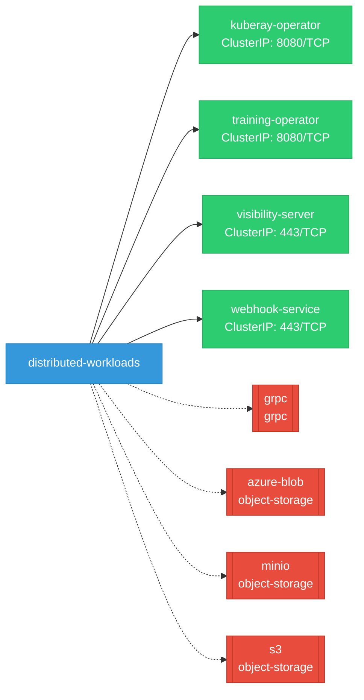

# distributed-workloads: Network

## Service Map

*4 unique services (12 total, duplicates from test fixtures collapsed).*

### Services

| Name | Type | Ports | Source |
|------|------|-------|--------|
| kuberay-operator | ClusterIP | 8080/TCP | [`.gomod-cache/github.com/ray-project/kuberay/ray-operator@v1.5.1/config/manager/service.yaml`](https://github.com/opendatahub-io/distributed-workloads/blob/c968c77b6e79b132962256e9759655e9173d9dd7/.gomod-cache/github.com/ray-project/kuberay/ray-operator@v1.5.1/config/manager/service.yaml) |
| kuberay-operator | ClusterIP | 8080/TCP | [`.gopath-loader/pkg/mod/github.com/ray-project/kuberay/ray-operator@v1.5.1/config/manager/service.yaml`](https://github.com/opendatahub-io/distributed-workloads/blob/c968c77b6e79b132962256e9759655e9173d9dd7/.gopath-loader/pkg/mod/github.com/ray-project/kuberay/ray-operator@v1.5.1/config/manager/service.yaml) |
| training-operator | ClusterIP | 8080/TCP | [`.gomod-cache/github.com/kubeflow/training-operator@v1.7.0/manifests/base/service.yaml`](https://github.com/opendatahub-io/distributed-workloads/blob/c968c77b6e79b132962256e9759655e9173d9dd7/.gomod-cache/github.com/kubeflow/training-operator@v1.7.0/manifests/base/service.yaml) |
| training-operator | ClusterIP | 8080/TCP | [`.gopath-loader/pkg/mod/github.com/kubeflow/training-operator@v1.7.0/manifests/base/service.yaml`](https://github.com/opendatahub-io/distributed-workloads/blob/c968c77b6e79b132962256e9759655e9173d9dd7/.gopath-loader/pkg/mod/github.com/kubeflow/training-operator@v1.7.0/manifests/base/service.yaml) |
| visibility-server | ClusterIP | 443/TCP | [`.gomod-cache/sigs.k8s.io/kueue@v0.15.7/config/components/visibility/service.yaml`](https://github.com/opendatahub-io/distributed-workloads/blob/c968c77b6e79b132962256e9759655e9173d9dd7/.gomod-cache/sigs.k8s.io/kueue@v0.15.7/config/components/visibility/service.yaml) |
| visibility-server | ClusterIP | 443/TCP | [`.gopath-loader/pkg/mod/sigs.k8s.io/kueue@v0.15.7/config/components/visibility/service.yaml`](https://github.com/opendatahub-io/distributed-workloads/blob/c968c77b6e79b132962256e9759655e9173d9dd7/.gopath-loader/pkg/mod/sigs.k8s.io/kueue@v0.15.7/config/components/visibility/service.yaml) |
| webhook-service | ClusterIP | 443/TCP | [`.gomod-cache/github.com/ray-project/kuberay/ray-operator@v1.5.1/config/webhook/service.yaml`](https://github.com/opendatahub-io/distributed-workloads/blob/c968c77b6e79b132962256e9759655e9173d9dd7/.gomod-cache/github.com/ray-project/kuberay/ray-operator@v1.5.1/config/webhook/service.yaml) |
| webhook-service | ClusterIP | 443/TCP | [`.gomod-cache/sigs.k8s.io/jobset@v0.10.1/config/components/webhook/service.yaml`](https://github.com/opendatahub-io/distributed-workloads/blob/c968c77b6e79b132962256e9759655e9173d9dd7/.gomod-cache/sigs.k8s.io/jobset@v0.10.1/config/components/webhook/service.yaml) |
| webhook-service | ClusterIP | 443/TCP | [`.gomod-cache/sigs.k8s.io/kueue@v0.15.7/config/components/webhook/service.yaml`](https://github.com/opendatahub-io/distributed-workloads/blob/c968c77b6e79b132962256e9759655e9173d9dd7/.gomod-cache/sigs.k8s.io/kueue@v0.15.7/config/components/webhook/service.yaml) |
| webhook-service | ClusterIP | 443/TCP | [`.gopath-loader/pkg/mod/github.com/ray-project/kuberay/ray-operator@v1.5.1/config/webhook/service.yaml`](https://github.com/opendatahub-io/distributed-workloads/blob/c968c77b6e79b132962256e9759655e9173d9dd7/.gopath-loader/pkg/mod/github.com/ray-project/kuberay/ray-operator@v1.5.1/config/webhook/service.yaml) |
| webhook-service | ClusterIP | 443/TCP | [`.gopath-loader/pkg/mod/sigs.k8s.io/jobset@v0.10.1/config/components/webhook/service.yaml`](https://github.com/opendatahub-io/distributed-workloads/blob/c968c77b6e79b132962256e9759655e9173d9dd7/.gopath-loader/pkg/mod/sigs.k8s.io/jobset@v0.10.1/config/components/webhook/service.yaml) |
| webhook-service | ClusterIP | 443/TCP | [`.gopath-loader/pkg/mod/sigs.k8s.io/kueue@v0.15.7/config/components/webhook/service.yaml`](https://github.com/opendatahub-io/distributed-workloads/blob/c968c77b6e79b132962256e9759655e9173d9dd7/.gopath-loader/pkg/mod/sigs.k8s.io/kueue@v0.15.7/config/components/webhook/service.yaml) |

!!! warning "No Network Policies"
    No NetworkPolicy resources were found in the analyzed sources. Network policies may exist in overlays, Helm values, or cluster-level configurations not captured by static analysis.

