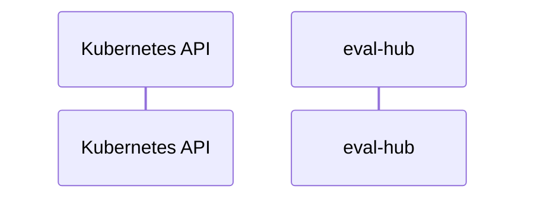

# eval-hub: Dataflow

## Controller Watches

Kubernetes resources this controller monitors for changes. Each watch triggers reconciliation when the watched resource is created, updated, or deleted.

No controller watches found.

## Reconciliation Flow

How the controller interacts with the Kubernetes API during reconciliation.

### HTTP Endpoints

| Method | Path | Source |
|--------|------|--------|
| * | / | [`.gomod-cache/github.com/aws/aws-sdk-go-v2@v1.41.7/internal/awstesting/certificate_utils.go:224`](https://github.com/eval-hub/eval-hub/blob/79e8b93cfef25438d447b3dbbe20a3fba22cfff4/.gomod-cache/github.com/aws/aws-sdk-go-v2@v1.41.7/internal/awstesting/certificate_utils.go#L224) |
| * | / | [`.gopath-loader/pkg/mod/golang.org/x/net@v0.53.0/webdav/litmus_test_server.go:83`](https://github.com/eval-hub/eval-hub/blob/79e8b93cfef25438d447b3dbbe20a3fba22cfff4/.gopath-loader/pkg/mod/golang.org/x/net@v0.53.0/webdav/litmus_test_server.go#L83) |
| * | / | [`.gopath-loader/pkg/mod/golang.org/toolchain@v0.0.1-go1.25.9.linux-amd64/src/cmd/trace/main.go:188`](https://github.com/eval-hub/eval-hub/blob/79e8b93cfef25438d447b3dbbe20a3fba22cfff4/.gopath-loader/pkg/mod/golang.org/toolchain@v0.0.1-go1.25.9.linux-amd64/src/cmd/trace/main.go#L188) |
| * | / | [`.gopath-loader/pkg/mod/github.com/aws/aws-sdk-go-v2@v1.41.7/internal/awstesting/certificate_utils.go:224`](https://github.com/eval-hub/eval-hub/blob/79e8b93cfef25438d447b3dbbe20a3fba22cfff4/.gopath-loader/pkg/mod/github.com/aws/aws-sdk-go-v2@v1.41.7/internal/awstesting/certificate_utils.go#L224) |
| * | / | [`.gopath-loader/pkg/mod/golang.org/toolchain@v0.0.1-go1.25.9.linux-amd64/src/net/http/triv.go:130`](https://github.com/eval-hub/eval-hub/blob/79e8b93cfef25438d447b3dbbe20a3fba22cfff4/.gopath-loader/pkg/mod/golang.org/toolchain@v0.0.1-go1.25.9.linux-amd64/src/net/http/triv.go#L130) |
| * | / | [`.gomod-cache/golang.org/toolchain@v0.0.1-go1.25.9.linux-amd64/src/cmd/trace/main.go:188`](https://github.com/eval-hub/eval-hub/blob/79e8b93cfef25438d447b3dbbe20a3fba22cfff4/.gomod-cache/golang.org/toolchain@v0.0.1-go1.25.9.linux-amd64/src/cmd/trace/main.go#L188) |
| * | / | [`.gomod-cache/golang.org/x/net@v0.53.0/webdav/litmus_test_server.go:83`](https://github.com/eval-hub/eval-hub/blob/79e8b93cfef25438d447b3dbbe20a3fba22cfff4/.gomod-cache/golang.org/x/net@v0.53.0/webdav/litmus_test_server.go#L83) |
| * | / | [`internal/evalhub_mcp/server/server.go:179`](https://github.com/eval-hub/eval-hub/blob/79e8b93cfef25438d447b3dbbe20a3fba22cfff4/internal/evalhub_mcp/server/server.go#L179) |
| * | / | [`.gomod-cache/golang.org/toolchain@v0.0.1-go1.25.9.linux-amd64/src/net/http/triv.go:130`](https://github.com/eval-hub/eval-hub/blob/79e8b93cfef25438d447b3dbbe20a3fba22cfff4/.gomod-cache/golang.org/toolchain@v0.0.1-go1.25.9.linux-amd64/src/net/http/triv.go#L130) |
| GET | / | [`.gomod-cache/k8s.io/apiserver@v0.35.4/pkg/endpoints/discovery/version.go:67`](https://github.com/eval-hub/eval-hub/blob/79e8b93cfef25438d447b3dbbe20a3fba22cfff4/.gomod-cache/k8s.io/apiserver@v0.35.4/pkg/endpoints/discovery/version.go#L67) |
| GET | / | [`.gomod-cache/k8s.io/apiserver@v0.35.4/pkg/endpoints/discovery/group.go:57`](https://github.com/eval-hub/eval-hub/blob/79e8b93cfef25438d447b3dbbe20a3fba22cfff4/.gomod-cache/k8s.io/apiserver@v0.35.4/pkg/endpoints/discovery/group.go#L57) |
| GET | / | [`.gopath-loader/pkg/mod/k8s.io/apiserver@v0.35.4/pkg/server/routes/version.go:44`](https://github.com/eval-hub/eval-hub/blob/79e8b93cfef25438d447b3dbbe20a3fba22cfff4/.gopath-loader/pkg/mod/k8s.io/apiserver@v0.35.4/pkg/server/routes/version.go#L44) |
| GET | / | [`.gomod-cache/k8s.io/apiserver@v0.35.4/pkg/endpoints/discovery/root.go:154`](https://github.com/eval-hub/eval-hub/blob/79e8b93cfef25438d447b3dbbe20a3fba22cfff4/.gomod-cache/k8s.io/apiserver@v0.35.4/pkg/endpoints/discovery/root.go#L154) |
| GET | / | [`.gomod-cache/k8s.io/apiserver@v0.35.4/pkg/endpoints/discovery/aggregated/wrapper.go:73`](https://github.com/eval-hub/eval-hub/blob/79e8b93cfef25438d447b3dbbe20a3fba22cfff4/.gomod-cache/k8s.io/apiserver@v0.35.4/pkg/endpoints/discovery/aggregated/wrapper.go#L73) |
| GET | / | [`.gopath-loader/pkg/mod/k8s.io/apiserver@v0.35.4/pkg/endpoints/discovery/legacy.go:59`](https://github.com/eval-hub/eval-hub/blob/79e8b93cfef25438d447b3dbbe20a3fba22cfff4/.gopath-loader/pkg/mod/k8s.io/apiserver@v0.35.4/pkg/endpoints/discovery/legacy.go#L59) |
| GET | / | [`.gomod-cache/k8s.io/apiserver@v0.35.4/pkg/server/routes/version.go:44`](https://github.com/eval-hub/eval-hub/blob/79e8b93cfef25438d447b3dbbe20a3fba22cfff4/.gomod-cache/k8s.io/apiserver@v0.35.4/pkg/server/routes/version.go#L44) |
| GET | / | [`.gopath-loader/pkg/mod/k8s.io/apiserver@v0.35.4/pkg/endpoints/discovery/root.go:154`](https://github.com/eval-hub/eval-hub/blob/79e8b93cfef25438d447b3dbbe20a3fba22cfff4/.gopath-loader/pkg/mod/k8s.io/apiserver@v0.35.4/pkg/endpoints/discovery/root.go#L154) |
| GET | / | [`.gopath-loader/pkg/mod/k8s.io/apiserver@v0.35.4/pkg/endpoints/discovery/aggregated/wrapper.go:73`](https://github.com/eval-hub/eval-hub/blob/79e8b93cfef25438d447b3dbbe20a3fba22cfff4/.gopath-loader/pkg/mod/k8s.io/apiserver@v0.35.4/pkg/endpoints/discovery/aggregated/wrapper.go#L73) |
| GET | / | [`.gopath-loader/pkg/mod/k8s.io/apiserver@v0.35.4/pkg/endpoints/discovery/group.go:57`](https://github.com/eval-hub/eval-hub/blob/79e8b93cfef25438d447b3dbbe20a3fba22cfff4/.gopath-loader/pkg/mod/k8s.io/apiserver@v0.35.4/pkg/endpoints/discovery/group.go#L57) |
| GET | / | [`.gopath-loader/pkg/mod/k8s.io/apiserver@v0.35.4/pkg/endpoints/discovery/version.go:67`](https://github.com/eval-hub/eval-hub/blob/79e8b93cfef25438d447b3dbbe20a3fba22cfff4/.gopath-loader/pkg/mod/k8s.io/apiserver@v0.35.4/pkg/endpoints/discovery/version.go#L67) |
| GET | / | [`.gomod-cache/k8s.io/apiserver@v0.35.4/pkg/endpoints/discovery/legacy.go:59`](https://github.com/eval-hub/eval-hub/blob/79e8b93cfef25438d447b3dbbe20a3fba22cfff4/.gomod-cache/k8s.io/apiserver@v0.35.4/pkg/endpoints/discovery/legacy.go#L59) |
| * | /.well-known/openid-configuration | [`.gopath-loader/pkg/mod/github.com/modelcontextprotocol/go-sdk@v1.6.0/internal/oauthtest/fake_idp_server.go:64`](https://github.com/eval-hub/eval-hub/blob/79e8b93cfef25438d447b3dbbe20a3fba22cfff4/.gopath-loader/pkg/mod/github.com/modelcontextprotocol/go-sdk@v1.6.0/internal/oauthtest/fake_idp_server.go#L64) |
| * | /.well-known/openid-configuration | [`.gomod-cache/github.com/modelcontextprotocol/go-sdk@v1.6.0/internal/oauthtest/fake_idp_server.go:64`](https://github.com/eval-hub/eval-hub/blob/79e8b93cfef25438d447b3dbbe20a3fba22cfff4/.gomod-cache/github.com/modelcontextprotocol/go-sdk@v1.6.0/internal/oauthtest/fake_idp_server.go#L64) |
| GET | /api/v1/evaluations/collections | [`docs/openapi.yaml`](https://github.com/eval-hub/eval-hub/blob/79e8b93cfef25438d447b3dbbe20a3fba22cfff4/docs/openapi.yaml) |
| POST | /api/v1/evaluations/collections | [`docs/openapi.yaml`](https://github.com/eval-hub/eval-hub/blob/79e8b93cfef25438d447b3dbbe20a3fba22cfff4/docs/openapi.yaml) |
| DELETE | /api/v1/evaluations/collections/{id} | [`docs/openapi.yaml`](https://github.com/eval-hub/eval-hub/blob/79e8b93cfef25438d447b3dbbe20a3fba22cfff4/docs/openapi.yaml) |
| GET | /api/v1/evaluations/collections/{id} | [`docs/openapi.yaml`](https://github.com/eval-hub/eval-hub/blob/79e8b93cfef25438d447b3dbbe20a3fba22cfff4/docs/openapi.yaml) |
| PATCH | /api/v1/evaluations/collections/{id} | [`docs/openapi.yaml`](https://github.com/eval-hub/eval-hub/blob/79e8b93cfef25438d447b3dbbe20a3fba22cfff4/docs/openapi.yaml) |
| PUT | /api/v1/evaluations/collections/{id} | [`docs/openapi.yaml`](https://github.com/eval-hub/eval-hub/blob/79e8b93cfef25438d447b3dbbe20a3fba22cfff4/docs/openapi.yaml) |
| GET | /api/v1/evaluations/jobs | [`docs/openapi.yaml`](https://github.com/eval-hub/eval-hub/blob/79e8b93cfef25438d447b3dbbe20a3fba22cfff4/docs/openapi.yaml) |
| POST | /api/v1/evaluations/jobs | [`docs/openapi.yaml`](https://github.com/eval-hub/eval-hub/blob/79e8b93cfef25438d447b3dbbe20a3fba22cfff4/docs/openapi.yaml) |
| DELETE | /api/v1/evaluations/jobs/{id} | [`docs/openapi.yaml`](https://github.com/eval-hub/eval-hub/blob/79e8b93cfef25438d447b3dbbe20a3fba22cfff4/docs/openapi.yaml) |
| GET | /api/v1/evaluations/jobs/{id} | [`docs/openapi.yaml`](https://github.com/eval-hub/eval-hub/blob/79e8b93cfef25438d447b3dbbe20a3fba22cfff4/docs/openapi.yaml) |
| GET | /api/v1/evaluations/providers | [`docs/openapi.yaml`](https://github.com/eval-hub/eval-hub/blob/79e8b93cfef25438d447b3dbbe20a3fba22cfff4/docs/openapi.yaml) |
| POST | /api/v1/evaluations/providers | [`docs/openapi.yaml`](https://github.com/eval-hub/eval-hub/blob/79e8b93cfef25438d447b3dbbe20a3fba22cfff4/docs/openapi.yaml) |
| DELETE | /api/v1/evaluations/providers/{id} | [`docs/openapi.yaml`](https://github.com/eval-hub/eval-hub/blob/79e8b93cfef25438d447b3dbbe20a3fba22cfff4/docs/openapi.yaml) |
| GET | /api/v1/evaluations/providers/{id} | [`docs/openapi.yaml`](https://github.com/eval-hub/eval-hub/blob/79e8b93cfef25438d447b3dbbe20a3fba22cfff4/docs/openapi.yaml) |
| PATCH | /api/v1/evaluations/providers/{id} | [`docs/openapi.yaml`](https://github.com/eval-hub/eval-hub/blob/79e8b93cfef25438d447b3dbbe20a3fba22cfff4/docs/openapi.yaml) |
| PUT | /api/v1/evaluations/providers/{id} | [`docs/openapi.yaml`](https://github.com/eval-hub/eval-hub/blob/79e8b93cfef25438d447b3dbbe20a3fba22cfff4/docs/openapi.yaml) |
| GET | /api/v1/health | [`docs/openapi.yaml`](https://github.com/eval-hub/eval-hub/blob/79e8b93cfef25438d447b3dbbe20a3fba22cfff4/docs/openapi.yaml) |
| * | /args | [`.gomod-cache/golang.org/toolchain@v0.0.1-go1.25.9.linux-amd64/src/net/http/triv.go:136`](https://github.com/eval-hub/eval-hub/blob/79e8b93cfef25438d447b3dbbe20a3fba22cfff4/.gomod-cache/golang.org/toolchain@v0.0.1-go1.25.9.linux-amd64/src/net/http/triv.go#L136) |
| * | /args | [`.gopath-loader/pkg/mod/golang.org/toolchain@v0.0.1-go1.25.9.linux-amd64/src/net/http/triv.go:136`](https://github.com/eval-hub/eval-hub/blob/79e8b93cfef25438d447b3dbbe20a3fba22cfff4/.gopath-loader/pkg/mod/golang.org/toolchain@v0.0.1-go1.25.9.linux-amd64/src/net/http/triv.go#L136) |
| * | /authorize | [`.gomod-cache/github.com/modelcontextprotocol/go-sdk@v1.6.0/internal/oauthtest/fake_idp_server.go:65`](https://github.com/eval-hub/eval-hub/blob/79e8b93cfef25438d447b3dbbe20a3fba22cfff4/.gomod-cache/github.com/modelcontextprotocol/go-sdk@v1.6.0/internal/oauthtest/fake_idp_server.go#L65) |
| * | /authorize | [`.gopath-loader/pkg/mod/github.com/modelcontextprotocol/go-sdk@v1.6.0/internal/oauthtest/fake_idp_server.go:65`](https://github.com/eval-hub/eval-hub/blob/79e8b93cfef25438d447b3dbbe20a3fba22cfff4/.gopath-loader/pkg/mod/github.com/modelcontextprotocol/go-sdk@v1.6.0/internal/oauthtest/fake_idp_server.go#L65) |
| * | /bar | [`.gomod-cache/golang.org/toolchain@v0.0.1-go1.25.9.linux-amd64/src/net/http/doc.go:67`](https://github.com/eval-hub/eval-hub/blob/79e8b93cfef25438d447b3dbbe20a3fba22cfff4/.gomod-cache/golang.org/toolchain@v0.0.1-go1.25.9.linux-amd64/src/net/http/doc.go#L67) |
| * | /bar | [`.gopath-loader/pkg/mod/golang.org/toolchain@v0.0.1-go1.25.9.linux-amd64/src/net/http/doc.go:67`](https://github.com/eval-hub/eval-hub/blob/79e8b93cfef25438d447b3dbbe20a3fba22cfff4/.gopath-loader/pkg/mod/golang.org/toolchain@v0.0.1-go1.25.9.linux-amd64/src/net/http/doc.go#L67) |
| * | /block | [`.gomod-cache/golang.org/toolchain@v0.0.1-go1.25.9.linux-amd64/src/cmd/trace/main.go:210`](https://github.com/eval-hub/eval-hub/blob/79e8b93cfef25438d447b3dbbe20a3fba22cfff4/.gomod-cache/golang.org/toolchain@v0.0.1-go1.25.9.linux-amd64/src/cmd/trace/main.go#L210) |
| * | /block | [`.gopath-loader/pkg/mod/golang.org/toolchain@v0.0.1-go1.25.9.linux-amd64/src/cmd/trace/main.go:210`](https://github.com/eval-hub/eval-hub/blob/79e8b93cfef25438d447b3dbbe20a3fba22cfff4/.gopath-loader/pkg/mod/golang.org/toolchain@v0.0.1-go1.25.9.linux-amd64/src/cmd/trace/main.go#L210) |
| * | /chan | [`.gomod-cache/golang.org/toolchain@v0.0.1-go1.25.9.linux-amd64/src/net/http/triv.go:134`](https://github.com/eval-hub/eval-hub/blob/79e8b93cfef25438d447b3dbbe20a3fba22cfff4/.gomod-cache/golang.org/toolchain@v0.0.1-go1.25.9.linux-amd64/src/net/http/triv.go#L134) |
| * | /chan | [`.gopath-loader/pkg/mod/golang.org/toolchain@v0.0.1-go1.25.9.linux-amd64/src/net/http/triv.go:134`](https://github.com/eval-hub/eval-hub/blob/79e8b93cfef25438d447b3dbbe20a3fba22cfff4/.gopath-loader/pkg/mod/golang.org/toolchain@v0.0.1-go1.25.9.linux-amd64/src/net/http/triv.go#L134) |
| * | /counter | [`.gomod-cache/golang.org/toolchain@v0.0.1-go1.25.9.linux-amd64/src/net/http/triv.go:129`](https://github.com/eval-hub/eval-hub/blob/79e8b93cfef25438d447b3dbbe20a3fba22cfff4/.gomod-cache/golang.org/toolchain@v0.0.1-go1.25.9.linux-amd64/src/net/http/triv.go#L129) |
| * | /counter | [`.gopath-loader/pkg/mod/golang.org/toolchain@v0.0.1-go1.25.9.linux-amd64/src/net/http/triv.go:129`](https://github.com/eval-hub/eval-hub/blob/79e8b93cfef25438d447b3dbbe20a3fba22cfff4/.gopath-loader/pkg/mod/golang.org/toolchain@v0.0.1-go1.25.9.linux-amd64/src/net/http/triv.go#L129) |
| * | /date | [`.gopath-loader/pkg/mod/golang.org/toolchain@v0.0.1-go1.25.9.linux-amd64/src/net/http/triv.go:138`](https://github.com/eval-hub/eval-hub/blob/79e8b93cfef25438d447b3dbbe20a3fba22cfff4/.gopath-loader/pkg/mod/golang.org/toolchain@v0.0.1-go1.25.9.linux-amd64/src/net/http/triv.go#L138) |
| * | /date | [`.gomod-cache/golang.org/toolchain@v0.0.1-go1.25.9.linux-amd64/src/net/http/triv.go:138`](https://github.com/eval-hub/eval-hub/blob/79e8b93cfef25438d447b3dbbe20a3fba22cfff4/.gomod-cache/golang.org/toolchain@v0.0.1-go1.25.9.linux-amd64/src/net/http/triv.go#L138) |
| * | /debug/flags | [`.gopath-loader/pkg/mod/k8s.io/apiserver@v0.35.4/pkg/server/routes/debugsocket.go:58`](https://github.com/eval-hub/eval-hub/blob/79e8b93cfef25438d447b3dbbe20a3fba22cfff4/.gopath-loader/pkg/mod/k8s.io/apiserver@v0.35.4/pkg/server/routes/debugsocket.go#L58) |
| * | /debug/flags | [`.gomod-cache/k8s.io/apiserver@v0.35.4/pkg/server/routes/debugsocket.go:58`](https://github.com/eval-hub/eval-hub/blob/79e8b93cfef25438d447b3dbbe20a3fba22cfff4/.gomod-cache/k8s.io/apiserver@v0.35.4/pkg/server/routes/debugsocket.go#L58) |
| * | /debug/flags/ | [`.gomod-cache/k8s.io/apiserver@v0.35.4/pkg/server/routes/debugsocket.go:59`](https://github.com/eval-hub/eval-hub/blob/79e8b93cfef25438d447b3dbbe20a3fba22cfff4/.gomod-cache/k8s.io/apiserver@v0.35.4/pkg/server/routes/debugsocket.go#L59) |
| * | /debug/flags/ | [`.gopath-loader/pkg/mod/k8s.io/apiserver@v0.35.4/pkg/server/routes/debugsocket.go:59`](https://github.com/eval-hub/eval-hub/blob/79e8b93cfef25438d447b3dbbe20a3fba22cfff4/.gopath-loader/pkg/mod/k8s.io/apiserver@v0.35.4/pkg/server/routes/debugsocket.go#L59) |
| * | /debug/pprof | [`.gomod-cache/k8s.io/apiserver@v0.35.4/pkg/server/routes/debugsocket.go:47`](https://github.com/eval-hub/eval-hub/blob/79e8b93cfef25438d447b3dbbe20a3fba22cfff4/.gomod-cache/k8s.io/apiserver@v0.35.4/pkg/server/routes/debugsocket.go#L47) |
| * | /debug/pprof | [`.gopath-loader/pkg/mod/k8s.io/apiserver@v0.35.4/pkg/server/routes/debugsocket.go:47`](https://github.com/eval-hub/eval-hub/blob/79e8b93cfef25438d447b3dbbe20a3fba22cfff4/.gopath-loader/pkg/mod/k8s.io/apiserver@v0.35.4/pkg/server/routes/debugsocket.go#L47) |
| * | /debug/pprof/ | [`.gopath-loader/pkg/mod/k8s.io/apiserver@v0.35.4/pkg/server/routes/debugsocket.go:48`](https://github.com/eval-hub/eval-hub/blob/79e8b93cfef25438d447b3dbbe20a3fba22cfff4/.gopath-loader/pkg/mod/k8s.io/apiserver@v0.35.4/pkg/server/routes/debugsocket.go#L48) |
| * | /debug/pprof/ | [`.gomod-cache/k8s.io/apiserver@v0.35.4/pkg/server/routes/debugsocket.go:48`](https://github.com/eval-hub/eval-hub/blob/79e8b93cfef25438d447b3dbbe20a3fba22cfff4/.gomod-cache/k8s.io/apiserver@v0.35.4/pkg/server/routes/debugsocket.go#L48) |
| * | /debug/pprof/cmdline | [`.gopath-loader/pkg/mod/k8s.io/apiserver@v0.35.4/pkg/server/routes/debugsocket.go:49`](https://github.com/eval-hub/eval-hub/blob/79e8b93cfef25438d447b3dbbe20a3fba22cfff4/.gopath-loader/pkg/mod/k8s.io/apiserver@v0.35.4/pkg/server/routes/debugsocket.go#L49) |
| * | /debug/pprof/cmdline | [`.gomod-cache/k8s.io/apiserver@v0.35.4/pkg/server/routes/debugsocket.go:49`](https://github.com/eval-hub/eval-hub/blob/79e8b93cfef25438d447b3dbbe20a3fba22cfff4/.gomod-cache/k8s.io/apiserver@v0.35.4/pkg/server/routes/debugsocket.go#L49) |
| * | /debug/pprof/profile | [`.gomod-cache/k8s.io/apiserver@v0.35.4/pkg/server/routes/debugsocket.go:50`](https://github.com/eval-hub/eval-hub/blob/79e8b93cfef25438d447b3dbbe20a3fba22cfff4/.gomod-cache/k8s.io/apiserver@v0.35.4/pkg/server/routes/debugsocket.go#L50) |
| * | /debug/pprof/profile | [`.gopath-loader/pkg/mod/k8s.io/apiserver@v0.35.4/pkg/server/routes/debugsocket.go:50`](https://github.com/eval-hub/eval-hub/blob/79e8b93cfef25438d447b3dbbe20a3fba22cfff4/.gopath-loader/pkg/mod/k8s.io/apiserver@v0.35.4/pkg/server/routes/debugsocket.go#L50) |
| * | /debug/pprof/symbol | [`.gopath-loader/pkg/mod/k8s.io/apiserver@v0.35.4/pkg/server/routes/debugsocket.go:51`](https://github.com/eval-hub/eval-hub/blob/79e8b93cfef25438d447b3dbbe20a3fba22cfff4/.gopath-loader/pkg/mod/k8s.io/apiserver@v0.35.4/pkg/server/routes/debugsocket.go#L51) |
| * | /debug/pprof/symbol | [`.gomod-cache/k8s.io/apiserver@v0.35.4/pkg/server/routes/debugsocket.go:51`](https://github.com/eval-hub/eval-hub/blob/79e8b93cfef25438d447b3dbbe20a3fba22cfff4/.gomod-cache/k8s.io/apiserver@v0.35.4/pkg/server/routes/debugsocket.go#L51) |
| * | /debug/pprof/trace | [`.gopath-loader/pkg/mod/k8s.io/apiserver@v0.35.4/pkg/server/routes/debugsocket.go:52`](https://github.com/eval-hub/eval-hub/blob/79e8b93cfef25438d447b3dbbe20a3fba22cfff4/.gopath-loader/pkg/mod/k8s.io/apiserver@v0.35.4/pkg/server/routes/debugsocket.go#L52) |
| * | /debug/pprof/trace | [`.gomod-cache/k8s.io/apiserver@v0.35.4/pkg/server/routes/debugsocket.go:52`](https://github.com/eval-hub/eval-hub/blob/79e8b93cfef25438d447b3dbbe20a3fba22cfff4/.gomod-cache/k8s.io/apiserver@v0.35.4/pkg/server/routes/debugsocket.go#L52) |
| * | /debug/vars | [`.gopath-loader/pkg/mod/golang.org/toolchain@v0.0.1-go1.25.9.linux-amd64/src/expvar/expvar.go:382`](https://github.com/eval-hub/eval-hub/blob/79e8b93cfef25438d447b3dbbe20a3fba22cfff4/.gopath-loader/pkg/mod/golang.org/toolchain@v0.0.1-go1.25.9.linux-amd64/src/expvar/expvar.go#L382) |
| * | /debug/vars | [`.gomod-cache/golang.org/toolchain@v0.0.1-go1.25.9.linux-amd64/src/expvar/expvar.go:382`](https://github.com/eval-hub/eval-hub/blob/79e8b93cfef25438d447b3dbbe20a3fba22cfff4/.gomod-cache/golang.org/toolchain@v0.0.1-go1.25.9.linux-amd64/src/expvar/expvar.go#L382) |
| * | /flags | [`.gomod-cache/golang.org/toolchain@v0.0.1-go1.25.9.linux-amd64/src/net/http/triv.go:135`](https://github.com/eval-hub/eval-hub/blob/79e8b93cfef25438d447b3dbbe20a3fba22cfff4/.gomod-cache/golang.org/toolchain@v0.0.1-go1.25.9.linux-amd64/src/net/http/triv.go#L135) |
| * | /flags | [`.gopath-loader/pkg/mod/golang.org/toolchain@v0.0.1-go1.25.9.linux-amd64/src/net/http/triv.go:135`](https://github.com/eval-hub/eval-hub/blob/79e8b93cfef25438d447b3dbbe20a3fba22cfff4/.gopath-loader/pkg/mod/golang.org/toolchain@v0.0.1-go1.25.9.linux-amd64/src/net/http/triv.go#L135) |
| * | /foo | [`.gomod-cache/golang.org/toolchain@v0.0.1-go1.25.9.linux-amd64/src/net/http/doc.go:65`](https://github.com/eval-hub/eval-hub/blob/79e8b93cfef25438d447b3dbbe20a3fba22cfff4/.gomod-cache/golang.org/toolchain@v0.0.1-go1.25.9.linux-amd64/src/net/http/doc.go#L65) |
| * | /foo | [`.gopath-loader/pkg/mod/golang.org/toolchain@v0.0.1-go1.25.9.linux-amd64/src/net/http/doc.go:65`](https://github.com/eval-hub/eval-hub/blob/79e8b93cfef25438d447b3dbbe20a3fba22cfff4/.gopath-loader/pkg/mod/golang.org/toolchain@v0.0.1-go1.25.9.linux-amd64/src/net/http/doc.go#L65) |
| * | /go/ | [`.gomod-cache/golang.org/toolchain@v0.0.1-go1.25.9.linux-amd64/src/net/http/triv.go:132`](https://github.com/eval-hub/eval-hub/blob/79e8b93cfef25438d447b3dbbe20a3fba22cfff4/.gomod-cache/golang.org/toolchain@v0.0.1-go1.25.9.linux-amd64/src/net/http/triv.go#L132) |
| * | /go/ | [`.gopath-loader/pkg/mod/golang.org/toolchain@v0.0.1-go1.25.9.linux-amd64/src/net/http/triv.go:132`](https://github.com/eval-hub/eval-hub/blob/79e8b93cfef25438d447b3dbbe20a3fba22cfff4/.gopath-loader/pkg/mod/golang.org/toolchain@v0.0.1-go1.25.9.linux-amd64/src/net/http/triv.go#L132) |
| * | /go/hello | [`.gomod-cache/golang.org/toolchain@v0.0.1-go1.25.9.linux-amd64/src/net/http/triv.go:137`](https://github.com/eval-hub/eval-hub/blob/79e8b93cfef25438d447b3dbbe20a3fba22cfff4/.gomod-cache/golang.org/toolchain@v0.0.1-go1.25.9.linux-amd64/src/net/http/triv.go#L137) |
| * | /go/hello | [`.gopath-loader/pkg/mod/golang.org/toolchain@v0.0.1-go1.25.9.linux-amd64/src/net/http/triv.go:137`](https://github.com/eval-hub/eval-hub/blob/79e8b93cfef25438d447b3dbbe20a3fba22cfff4/.gopath-loader/pkg/mod/golang.org/toolchain@v0.0.1-go1.25.9.linux-amd64/src/net/http/triv.go#L137) |
| * | /goroutine | [`.gomod-cache/golang.org/toolchain@v0.0.1-go1.25.9.linux-amd64/src/cmd/trace/main.go:203`](https://github.com/eval-hub/eval-hub/blob/79e8b93cfef25438d447b3dbbe20a3fba22cfff4/.gomod-cache/golang.org/toolchain@v0.0.1-go1.25.9.linux-amd64/src/cmd/trace/main.go#L203) |
| * | /goroutine | [`.gopath-loader/pkg/mod/golang.org/toolchain@v0.0.1-go1.25.9.linux-amd64/src/cmd/trace/main.go:203`](https://github.com/eval-hub/eval-hub/blob/79e8b93cfef25438d447b3dbbe20a3fba22cfff4/.gopath-loader/pkg/mod/golang.org/toolchain@v0.0.1-go1.25.9.linux-amd64/src/cmd/trace/main.go#L203) |
| * | /goroutines | [`.gopath-loader/pkg/mod/golang.org/toolchain@v0.0.1-go1.25.9.linux-amd64/src/cmd/trace/main.go:202`](https://github.com/eval-hub/eval-hub/blob/79e8b93cfef25438d447b3dbbe20a3fba22cfff4/.gopath-loader/pkg/mod/golang.org/toolchain@v0.0.1-go1.25.9.linux-amd64/src/cmd/trace/main.go#L202) |
| * | /goroutines | [`.gomod-cache/golang.org/toolchain@v0.0.1-go1.25.9.linux-amd64/src/cmd/trace/main.go:202`](https://github.com/eval-hub/eval-hub/blob/79e8b93cfef25438d447b3dbbe20a3fba22cfff4/.gomod-cache/golang.org/toolchain@v0.0.1-go1.25.9.linux-amd64/src/cmd/trace/main.go#L202) |
| * | /health | [`internal/evalhub_mcp/server/server.go:174`](https://github.com/eval-hub/eval-hub/blob/79e8b93cfef25438d447b3dbbe20a3fba22cfff4/internal/evalhub_mcp/server/server.go#L174) |
| * | /io | [`.gopath-loader/pkg/mod/golang.org/toolchain@v0.0.1-go1.25.9.linux-amd64/src/cmd/trace/main.go:209`](https://github.com/eval-hub/eval-hub/blob/79e8b93cfef25438d447b3dbbe20a3fba22cfff4/.gopath-loader/pkg/mod/golang.org/toolchain@v0.0.1-go1.25.9.linux-amd64/src/cmd/trace/main.go#L209) |
| * | /io | [`.gomod-cache/golang.org/toolchain@v0.0.1-go1.25.9.linux-amd64/src/cmd/trace/main.go:209`](https://github.com/eval-hub/eval-hub/blob/79e8b93cfef25438d447b3dbbe20a3fba22cfff4/.gomod-cache/golang.org/toolchain@v0.0.1-go1.25.9.linux-amd64/src/cmd/trace/main.go#L209) |
| * | /jsontrace | [`.gomod-cache/golang.org/toolchain@v0.0.1-go1.25.9.linux-amd64/src/cmd/trace/main.go:198`](https://github.com/eval-hub/eval-hub/blob/79e8b93cfef25438d447b3dbbe20a3fba22cfff4/.gomod-cache/golang.org/toolchain@v0.0.1-go1.25.9.linux-amd64/src/cmd/trace/main.go#L198) |
| * | /jsontrace | [`.gopath-loader/pkg/mod/golang.org/toolchain@v0.0.1-go1.25.9.linux-amd64/src/cmd/trace/main.go:198`](https://github.com/eval-hub/eval-hub/blob/79e8b93cfef25438d447b3dbbe20a3fba22cfff4/.gopath-loader/pkg/mod/golang.org/toolchain@v0.0.1-go1.25.9.linux-amd64/src/cmd/trace/main.go#L198) |
| * | /mmu | [`.gomod-cache/golang.org/toolchain@v0.0.1-go1.25.9.linux-amd64/src/cmd/trace/main.go:206`](https://github.com/eval-hub/eval-hub/blob/79e8b93cfef25438d447b3dbbe20a3fba22cfff4/.gomod-cache/golang.org/toolchain@v0.0.1-go1.25.9.linux-amd64/src/cmd/trace/main.go#L206) |
| * | /mmu | [`.gopath-loader/pkg/mod/golang.org/toolchain@v0.0.1-go1.25.9.linux-amd64/src/cmd/trace/main.go:206`](https://github.com/eval-hub/eval-hub/blob/79e8b93cfef25438d447b3dbbe20a3fba22cfff4/.gopath-loader/pkg/mod/golang.org/toolchain@v0.0.1-go1.25.9.linux-amd64/src/cmd/trace/main.go#L206) |
| * | /regionblock | [`.gopath-loader/pkg/mod/golang.org/toolchain@v0.0.1-go1.25.9.linux-amd64/src/cmd/trace/main.go:216`](https://github.com/eval-hub/eval-hub/blob/79e8b93cfef25438d447b3dbbe20a3fba22cfff4/.gopath-loader/pkg/mod/golang.org/toolchain@v0.0.1-go1.25.9.linux-amd64/src/cmd/trace/main.go#L216) |
| * | /regionblock | [`.gomod-cache/golang.org/toolchain@v0.0.1-go1.25.9.linux-amd64/src/cmd/trace/main.go:216`](https://github.com/eval-hub/eval-hub/blob/79e8b93cfef25438d447b3dbbe20a3fba22cfff4/.gomod-cache/golang.org/toolchain@v0.0.1-go1.25.9.linux-amd64/src/cmd/trace/main.go#L216) |
| * | /regionio | [`.gomod-cache/golang.org/toolchain@v0.0.1-go1.25.9.linux-amd64/src/cmd/trace/main.go:215`](https://github.com/eval-hub/eval-hub/blob/79e8b93cfef25438d447b3dbbe20a3fba22cfff4/.gomod-cache/golang.org/toolchain@v0.0.1-go1.25.9.linux-amd64/src/cmd/trace/main.go#L215) |
| * | /regionio | [`.gopath-loader/pkg/mod/golang.org/toolchain@v0.0.1-go1.25.9.linux-amd64/src/cmd/trace/main.go:215`](https://github.com/eval-hub/eval-hub/blob/79e8b93cfef25438d447b3dbbe20a3fba22cfff4/.gopath-loader/pkg/mod/golang.org/toolchain@v0.0.1-go1.25.9.linux-amd64/src/cmd/trace/main.go#L215) |
| * | /regionsched | [`.gopath-loader/pkg/mod/golang.org/toolchain@v0.0.1-go1.25.9.linux-amd64/src/cmd/trace/main.go:218`](https://github.com/eval-hub/eval-hub/blob/79e8b93cfef25438d447b3dbbe20a3fba22cfff4/.gopath-loader/pkg/mod/golang.org/toolchain@v0.0.1-go1.25.9.linux-amd64/src/cmd/trace/main.go#L218) |
| * | /regionsched | [`.gomod-cache/golang.org/toolchain@v0.0.1-go1.25.9.linux-amd64/src/cmd/trace/main.go:218`](https://github.com/eval-hub/eval-hub/blob/79e8b93cfef25438d447b3dbbe20a3fba22cfff4/.gomod-cache/golang.org/toolchain@v0.0.1-go1.25.9.linux-amd64/src/cmd/trace/main.go#L218) |
| * | /regionsyscall | [`.gopath-loader/pkg/mod/golang.org/toolchain@v0.0.1-go1.25.9.linux-amd64/src/cmd/trace/main.go:217`](https://github.com/eval-hub/eval-hub/blob/79e8b93cfef25438d447b3dbbe20a3fba22cfff4/.gopath-loader/pkg/mod/golang.org/toolchain@v0.0.1-go1.25.9.linux-amd64/src/cmd/trace/main.go#L217) |
| * | /regionsyscall | [`.gomod-cache/golang.org/toolchain@v0.0.1-go1.25.9.linux-amd64/src/cmd/trace/main.go:217`](https://github.com/eval-hub/eval-hub/blob/79e8b93cfef25438d447b3dbbe20a3fba22cfff4/.gomod-cache/golang.org/toolchain@v0.0.1-go1.25.9.linux-amd64/src/cmd/trace/main.go#L217) |
| * | /sched | [`.gomod-cache/golang.org/toolchain@v0.0.1-go1.25.9.linux-amd64/src/cmd/trace/main.go:212`](https://github.com/eval-hub/eval-hub/blob/79e8b93cfef25438d447b3dbbe20a3fba22cfff4/.gomod-cache/golang.org/toolchain@v0.0.1-go1.25.9.linux-amd64/src/cmd/trace/main.go#L212) |
| * | /sched | [`.gopath-loader/pkg/mod/golang.org/toolchain@v0.0.1-go1.25.9.linux-amd64/src/cmd/trace/main.go:212`](https://github.com/eval-hub/eval-hub/blob/79e8b93cfef25438d447b3dbbe20a3fba22cfff4/.gopath-loader/pkg/mod/golang.org/toolchain@v0.0.1-go1.25.9.linux-amd64/src/cmd/trace/main.go#L212) |
| * | /static/ | [`.gopath-loader/pkg/mod/golang.org/toolchain@v0.0.1-go1.25.9.linux-amd64/src/cmd/trace/main.go:199`](https://github.com/eval-hub/eval-hub/blob/79e8b93cfef25438d447b3dbbe20a3fba22cfff4/.gopath-loader/pkg/mod/golang.org/toolchain@v0.0.1-go1.25.9.linux-amd64/src/cmd/trace/main.go#L199) |
| * | /static/ | [`.gomod-cache/golang.org/toolchain@v0.0.1-go1.25.9.linux-amd64/src/cmd/trace/main.go:199`](https://github.com/eval-hub/eval-hub/blob/79e8b93cfef25438d447b3dbbe20a3fba22cfff4/.gomod-cache/golang.org/toolchain@v0.0.1-go1.25.9.linux-amd64/src/cmd/trace/main.go#L199) |
| * | /syscall | [`.gopath-loader/pkg/mod/golang.org/toolchain@v0.0.1-go1.25.9.linux-amd64/src/cmd/trace/main.go:211`](https://github.com/eval-hub/eval-hub/blob/79e8b93cfef25438d447b3dbbe20a3fba22cfff4/.gopath-loader/pkg/mod/golang.org/toolchain@v0.0.1-go1.25.9.linux-amd64/src/cmd/trace/main.go#L211) |
| * | /syscall | [`.gomod-cache/golang.org/toolchain@v0.0.1-go1.25.9.linux-amd64/src/cmd/trace/main.go:211`](https://github.com/eval-hub/eval-hub/blob/79e8b93cfef25438d447b3dbbe20a3fba22cfff4/.gomod-cache/golang.org/toolchain@v0.0.1-go1.25.9.linux-amd64/src/cmd/trace/main.go#L211) |
| * | /token | [`.gopath-loader/pkg/mod/github.com/modelcontextprotocol/go-sdk@v1.6.0/internal/oauthtest/fake_idp_server.go:66`](https://github.com/eval-hub/eval-hub/blob/79e8b93cfef25438d447b3dbbe20a3fba22cfff4/.gopath-loader/pkg/mod/github.com/modelcontextprotocol/go-sdk@v1.6.0/internal/oauthtest/fake_idp_server.go#L66) |
| * | /token | [`.gomod-cache/github.com/modelcontextprotocol/go-sdk@v1.6.0/internal/oauthtest/fake_idp_server.go:66`](https://github.com/eval-hub/eval-hub/blob/79e8b93cfef25438d447b3dbbe20a3fba22cfff4/.gomod-cache/github.com/modelcontextprotocol/go-sdk@v1.6.0/internal/oauthtest/fake_idp_server.go#L66) |
| * | /trace | [`.gomod-cache/golang.org/toolchain@v0.0.1-go1.25.9.linux-amd64/src/cmd/trace/main.go:197`](https://github.com/eval-hub/eval-hub/blob/79e8b93cfef25438d447b3dbbe20a3fba22cfff4/.gomod-cache/golang.org/toolchain@v0.0.1-go1.25.9.linux-amd64/src/cmd/trace/main.go#L197) |
| * | /trace | [`.gopath-loader/pkg/mod/golang.org/toolchain@v0.0.1-go1.25.9.linux-amd64/src/cmd/trace/main.go:197`](https://github.com/eval-hub/eval-hub/blob/79e8b93cfef25438d447b3dbbe20a3fba22cfff4/.gopath-loader/pkg/mod/golang.org/toolchain@v0.0.1-go1.25.9.linux-amd64/src/cmd/trace/main.go#L197) |
| * | /userregion | [`.gomod-cache/golang.org/toolchain@v0.0.1-go1.25.9.linux-amd64/src/cmd/trace/main.go:222`](https://github.com/eval-hub/eval-hub/blob/79e8b93cfef25438d447b3dbbe20a3fba22cfff4/.gomod-cache/golang.org/toolchain@v0.0.1-go1.25.9.linux-amd64/src/cmd/trace/main.go#L222) |
| * | /userregion | [`.gopath-loader/pkg/mod/golang.org/toolchain@v0.0.1-go1.25.9.linux-amd64/src/cmd/trace/main.go:222`](https://github.com/eval-hub/eval-hub/blob/79e8b93cfef25438d447b3dbbe20a3fba22cfff4/.gopath-loader/pkg/mod/golang.org/toolchain@v0.0.1-go1.25.9.linux-amd64/src/cmd/trace/main.go#L222) |
| * | /userregions | [`.gopath-loader/pkg/mod/golang.org/toolchain@v0.0.1-go1.25.9.linux-amd64/src/cmd/trace/main.go:221`](https://github.com/eval-hub/eval-hub/blob/79e8b93cfef25438d447b3dbbe20a3fba22cfff4/.gopath-loader/pkg/mod/golang.org/toolchain@v0.0.1-go1.25.9.linux-amd64/src/cmd/trace/main.go#L221) |
| * | /userregions | [`.gomod-cache/golang.org/toolchain@v0.0.1-go1.25.9.linux-amd64/src/cmd/trace/main.go:221`](https://github.com/eval-hub/eval-hub/blob/79e8b93cfef25438d447b3dbbe20a3fba22cfff4/.gomod-cache/golang.org/toolchain@v0.0.1-go1.25.9.linux-amd64/src/cmd/trace/main.go#L221) |
| * | /users | [`.gomod-cache/github.com/go-playground/validator/v10@v10.30.2/_examples/http-transalations/main.go:44`](https://github.com/eval-hub/eval-hub/blob/79e8b93cfef25438d447b3dbbe20a3fba22cfff4/.gomod-cache/github.com/go-playground/validator/v10@v10.30.2/_examples/http-transalations/main.go#L44) |
| * | /users | [`.gopath-loader/pkg/mod/github.com/go-playground/validator/v10@v10.30.2/_examples/http-transalations/main.go:44`](https://github.com/eval-hub/eval-hub/blob/79e8b93cfef25438d447b3dbbe20a3fba22cfff4/.gopath-loader/pkg/mod/github.com/go-playground/validator/v10@v10.30.2/_examples/http-transalations/main.go#L44) |
| * | /usertask | [`.gopath-loader/pkg/mod/golang.org/toolchain@v0.0.1-go1.25.9.linux-amd64/src/cmd/trace/main.go:226`](https://github.com/eval-hub/eval-hub/blob/79e8b93cfef25438d447b3dbbe20a3fba22cfff4/.gopath-loader/pkg/mod/golang.org/toolchain@v0.0.1-go1.25.9.linux-amd64/src/cmd/trace/main.go#L226) |
| * | /usertask | [`.gomod-cache/golang.org/toolchain@v0.0.1-go1.25.9.linux-amd64/src/cmd/trace/main.go:226`](https://github.com/eval-hub/eval-hub/blob/79e8b93cfef25438d447b3dbbe20a3fba22cfff4/.gomod-cache/golang.org/toolchain@v0.0.1-go1.25.9.linux-amd64/src/cmd/trace/main.go#L226) |
| * | /usertasks | [`.gopath-loader/pkg/mod/golang.org/toolchain@v0.0.1-go1.25.9.linux-amd64/src/cmd/trace/main.go:225`](https://github.com/eval-hub/eval-hub/blob/79e8b93cfef25438d447b3dbbe20a3fba22cfff4/.gopath-loader/pkg/mod/golang.org/toolchain@v0.0.1-go1.25.9.linux-amd64/src/cmd/trace/main.go#L225) |
| * | /usertasks | [`.gomod-cache/golang.org/toolchain@v0.0.1-go1.25.9.linux-amd64/src/cmd/trace/main.go:225`](https://github.com/eval-hub/eval-hub/blob/79e8b93cfef25438d447b3dbbe20a3fba22cfff4/.gomod-cache/golang.org/toolchain@v0.0.1-go1.25.9.linux-amd64/src/cmd/trace/main.go#L225) |
| GET | /{user-id} | [`.gopath-loader/pkg/mod/github.com/emicklei/go-restful/v3@v3.13.0/doc.go:19`](https://github.com/eval-hub/eval-hub/blob/79e8b93cfef25438d447b3dbbe20a3fba22cfff4/.gopath-loader/pkg/mod/github.com/emicklei/go-restful/v3@v3.13.0/doc.go#L19) |
| GET | /{user-id} | [`.gopath-loader/pkg/mod/github.com/emicklei/go-restful/v3@v3.13.0/doc.go:82`](https://github.com/eval-hub/eval-hub/blob/79e8b93cfef25438d447b3dbbe20a3fba22cfff4/.gopath-loader/pkg/mod/github.com/emicklei/go-restful/v3@v3.13.0/doc.go#L82) |
| GET | /{user-id} | [`.gomod-cache/github.com/emicklei/go-restful/v3@v3.13.0/doc.go:82`](https://github.com/eval-hub/eval-hub/blob/79e8b93cfef25438d447b3dbbe20a3fba22cfff4/.gomod-cache/github.com/emicklei/go-restful/v3@v3.13.0/doc.go#L82) |
| GET | /{user-id} | [`.gomod-cache/github.com/emicklei/go-restful/v3@v3.13.0/doc.go:19`](https://github.com/eval-hub/eval-hub/blob/79e8b93cfef25438d447b3dbbe20a3fba22cfff4/.gomod-cache/github.com/emicklei/go-restful/v3@v3.13.0/doc.go#L19) |
| * | G | [`.gopath-loader/pkg/mod/golang.org/x/exp@v0.0.0-20260410095643-746e56fc9e2f/slog/slogtest/slogtest.go:171`](https://github.com/eval-hub/eval-hub/blob/79e8b93cfef25438d447b3dbbe20a3fba22cfff4/.gopath-loader/pkg/mod/golang.org/x/exp@v0.0.0-20260410095643-746e56fc9e2f/slog/slogtest/slogtest.go#L171) |
| * | G | [`.gomod-cache/golang.org/x/exp@v0.0.0-20260410095643-746e56fc9e2f/slog/slogtest/slogtest.go:113`](https://github.com/eval-hub/eval-hub/blob/79e8b93cfef25438d447b3dbbe20a3fba22cfff4/.gomod-cache/golang.org/x/exp@v0.0.0-20260410095643-746e56fc9e2f/slog/slogtest/slogtest.go#L113) |
| * | G | [`.gopath-loader/pkg/mod/golang.org/toolchain@v0.0.1-go1.25.9.linux-amd64/src/testing/slogtest/slogtest.go:225`](https://github.com/eval-hub/eval-hub/blob/79e8b93cfef25438d447b3dbbe20a3fba22cfff4/.gopath-loader/pkg/mod/golang.org/toolchain@v0.0.1-go1.25.9.linux-amd64/src/testing/slogtest/slogtest.go#L225) |
| * | G | [`.gomod-cache/golang.org/x/exp@v0.0.0-20260410095643-746e56fc9e2f/slog/slogtest/slogtest.go:171`](https://github.com/eval-hub/eval-hub/blob/79e8b93cfef25438d447b3dbbe20a3fba22cfff4/.gomod-cache/golang.org/x/exp@v0.0.0-20260410095643-746e56fc9e2f/slog/slogtest/slogtest.go#L171) |
| * | G | [`.gopath-loader/pkg/mod/golang.org/x/exp@v0.0.0-20260410095643-746e56fc9e2f/slog/slogtest/slogtest.go:102`](https://github.com/eval-hub/eval-hub/blob/79e8b93cfef25438d447b3dbbe20a3fba22cfff4/.gopath-loader/pkg/mod/golang.org/x/exp@v0.0.0-20260410095643-746e56fc9e2f/slog/slogtest/slogtest.go#L102) |
| * | G | [`.gopath-loader/pkg/mod/golang.org/x/exp@v0.0.0-20260410095643-746e56fc9e2f/slog/slogtest/slogtest.go:113`](https://github.com/eval-hub/eval-hub/blob/79e8b93cfef25438d447b3dbbe20a3fba22cfff4/.gopath-loader/pkg/mod/golang.org/x/exp@v0.0.0-20260410095643-746e56fc9e2f/slog/slogtest/slogtest.go#L113) |
| * | G | [`.gopath-loader/pkg/mod/golang.org/toolchain@v0.0.1-go1.25.9.linux-amd64/src/testing/slogtest/slogtest.go:109`](https://github.com/eval-hub/eval-hub/blob/79e8b93cfef25438d447b3dbbe20a3fba22cfff4/.gopath-loader/pkg/mod/golang.org/toolchain@v0.0.1-go1.25.9.linux-amd64/src/testing/slogtest/slogtest.go#L109) |
| * | G | [`.gopath-loader/pkg/mod/golang.org/x/exp@v0.0.0-20260410095643-746e56fc9e2f/slog/slogtest/slogtest.go:191`](https://github.com/eval-hub/eval-hub/blob/79e8b93cfef25438d447b3dbbe20a3fba22cfff4/.gopath-loader/pkg/mod/golang.org/x/exp@v0.0.0-20260410095643-746e56fc9e2f/slog/slogtest/slogtest.go#L191) |
| * | G | [`.gomod-cache/golang.org/x/exp@v0.0.0-20260410095643-746e56fc9e2f/slog/slogtest/slogtest.go:191`](https://github.com/eval-hub/eval-hub/blob/79e8b93cfef25438d447b3dbbe20a3fba22cfff4/.gomod-cache/golang.org/x/exp@v0.0.0-20260410095643-746e56fc9e2f/slog/slogtest/slogtest.go#L191) |
| * | G | [`.gomod-cache/golang.org/toolchain@v0.0.1-go1.25.9.linux-amd64/src/testing/slogtest/slogtest.go:203`](https://github.com/eval-hub/eval-hub/blob/79e8b93cfef25438d447b3dbbe20a3fba22cfff4/.gomod-cache/golang.org/toolchain@v0.0.1-go1.25.9.linux-amd64/src/testing/slogtest/slogtest.go#L203) |
| * | G | [`.gomod-cache/golang.org/x/exp@v0.0.0-20260410095643-746e56fc9e2f/slog/slogtest/slogtest.go:102`](https://github.com/eval-hub/eval-hub/blob/79e8b93cfef25438d447b3dbbe20a3fba22cfff4/.gomod-cache/golang.org/x/exp@v0.0.0-20260410095643-746e56fc9e2f/slog/slogtest/slogtest.go#L102) |
| * | G | [`.gomod-cache/golang.org/toolchain@v0.0.1-go1.25.9.linux-amd64/src/testing/slogtest/slogtest.go:225`](https://github.com/eval-hub/eval-hub/blob/79e8b93cfef25438d447b3dbbe20a3fba22cfff4/.gomod-cache/golang.org/toolchain@v0.0.1-go1.25.9.linux-amd64/src/testing/slogtest/slogtest.go#L225) |
| * | G | [`.gopath-loader/pkg/mod/golang.org/toolchain@v0.0.1-go1.25.9.linux-amd64/src/testing/slogtest/slogtest.go:203`](https://github.com/eval-hub/eval-hub/blob/79e8b93cfef25438d447b3dbbe20a3fba22cfff4/.gopath-loader/pkg/mod/golang.org/toolchain@v0.0.1-go1.25.9.linux-amd64/src/testing/slogtest/slogtest.go#L203) |
| * | G | [`.gopath-loader/pkg/mod/golang.org/toolchain@v0.0.1-go1.25.9.linux-amd64/src/testing/slogtest/slogtest.go:97`](https://github.com/eval-hub/eval-hub/blob/79e8b93cfef25438d447b3dbbe20a3fba22cfff4/.gopath-loader/pkg/mod/golang.org/toolchain@v0.0.1-go1.25.9.linux-amd64/src/testing/slogtest/slogtest.go#L97) |
| * | G | [`.gomod-cache/golang.org/toolchain@v0.0.1-go1.25.9.linux-amd64/src/testing/slogtest/slogtest.go:97`](https://github.com/eval-hub/eval-hub/blob/79e8b93cfef25438d447b3dbbe20a3fba22cfff4/.gomod-cache/golang.org/toolchain@v0.0.1-go1.25.9.linux-amd64/src/testing/slogtest/slogtest.go#L97) |
| * | G | [`.gomod-cache/golang.org/toolchain@v0.0.1-go1.25.9.linux-amd64/src/testing/slogtest/slogtest.go:109`](https://github.com/eval-hub/eval-hub/blob/79e8b93cfef25438d447b3dbbe20a3fba22cfff4/.gomod-cache/golang.org/toolchain@v0.0.1-go1.25.9.linux-amd64/src/testing/slogtest/slogtest.go#L109) |
| * | GET /debug/vars | [`.gomod-cache/golang.org/toolchain@v0.0.1-go1.25.9.linux-amd64/src/expvar/expvar.go:384`](https://github.com/eval-hub/eval-hub/blob/79e8b93cfef25438d447b3dbbe20a3fba22cfff4/.gomod-cache/golang.org/toolchain@v0.0.1-go1.25.9.linux-amd64/src/expvar/expvar.go#L384) |
| * | GET /debug/vars | [`.gopath-loader/pkg/mod/golang.org/toolchain@v0.0.1-go1.25.9.linux-amd64/src/expvar/expvar.go:384`](https://github.com/eval-hub/eval-hub/blob/79e8b93cfef25438d447b3dbbe20a3fba22cfff4/.gopath-loader/pkg/mod/golang.org/toolchain@v0.0.1-go1.25.9.linux-amd64/src/expvar/expvar.go#L384) |
| * | POST | [`.gomod-cache/go.opentelemetry.io/proto/otlp@v1.10.0/collector/logs/v1/logs_service.pb.gw.go:140`](https://github.com/eval-hub/eval-hub/blob/79e8b93cfef25438d447b3dbbe20a3fba22cfff4/.gomod-cache/go.opentelemetry.io/proto/otlp@v1.10.0/collector/logs/v1/logs_service.pb.gw.go#L140) |
| * | POST | [`.gopath-loader/pkg/mod/go.opentelemetry.io/proto/otlp@v1.10.0/collector/trace/v1/trace_service.pb.gw.go:140`](https://github.com/eval-hub/eval-hub/blob/79e8b93cfef25438d447b3dbbe20a3fba22cfff4/.gopath-loader/pkg/mod/go.opentelemetry.io/proto/otlp@v1.10.0/collector/trace/v1/trace_service.pb.gw.go#L140) |
| * | POST | [`.gopath-loader/pkg/mod/go.opentelemetry.io/proto/otlp@v1.10.0/collector/trace/v1/trace_service.pb.gw.go:74`](https://github.com/eval-hub/eval-hub/blob/79e8b93cfef25438d447b3dbbe20a3fba22cfff4/.gopath-loader/pkg/mod/go.opentelemetry.io/proto/otlp@v1.10.0/collector/trace/v1/trace_service.pb.gw.go#L74) |
| * | POST | [`.gopath-loader/pkg/mod/go.opentelemetry.io/proto/otlp@v1.10.0/collector/metrics/v1/metrics_service.pb.gw.go:140`](https://github.com/eval-hub/eval-hub/blob/79e8b93cfef25438d447b3dbbe20a3fba22cfff4/.gopath-loader/pkg/mod/go.opentelemetry.io/proto/otlp@v1.10.0/collector/metrics/v1/metrics_service.pb.gw.go#L140) |
| * | POST | [`.gopath-loader/pkg/mod/go.opentelemetry.io/proto/otlp@v1.10.0/collector/metrics/v1/metrics_service.pb.gw.go:74`](https://github.com/eval-hub/eval-hub/blob/79e8b93cfef25438d447b3dbbe20a3fba22cfff4/.gopath-loader/pkg/mod/go.opentelemetry.io/proto/otlp@v1.10.0/collector/metrics/v1/metrics_service.pb.gw.go#L74) |
| * | POST | [`.gopath-loader/pkg/mod/go.opentelemetry.io/proto/otlp@v1.10.0/collector/logs/v1/logs_service.pb.gw.go:140`](https://github.com/eval-hub/eval-hub/blob/79e8b93cfef25438d447b3dbbe20a3fba22cfff4/.gopath-loader/pkg/mod/go.opentelemetry.io/proto/otlp@v1.10.0/collector/logs/v1/logs_service.pb.gw.go#L140) |
| * | POST | [`.gopath-loader/pkg/mod/go.opentelemetry.io/proto/otlp@v1.10.0/collector/logs/v1/logs_service.pb.gw.go:74`](https://github.com/eval-hub/eval-hub/blob/79e8b93cfef25438d447b3dbbe20a3fba22cfff4/.gopath-loader/pkg/mod/go.opentelemetry.io/proto/otlp@v1.10.0/collector/logs/v1/logs_service.pb.gw.go#L74) |
| * | POST | [`.gomod-cache/go.opentelemetry.io/proto/otlp@v1.10.0/collector/trace/v1/trace_service.pb.gw.go:140`](https://github.com/eval-hub/eval-hub/blob/79e8b93cfef25438d447b3dbbe20a3fba22cfff4/.gomod-cache/go.opentelemetry.io/proto/otlp@v1.10.0/collector/trace/v1/trace_service.pb.gw.go#L140) |
| * | POST | [`.gomod-cache/go.opentelemetry.io/proto/otlp@v1.10.0/collector/trace/v1/trace_service.pb.gw.go:74`](https://github.com/eval-hub/eval-hub/blob/79e8b93cfef25438d447b3dbbe20a3fba22cfff4/.gomod-cache/go.opentelemetry.io/proto/otlp@v1.10.0/collector/trace/v1/trace_service.pb.gw.go#L74) |
| * | POST | [`.gomod-cache/go.opentelemetry.io/proto/otlp@v1.10.0/collector/metrics/v1/metrics_service.pb.gw.go:140`](https://github.com/eval-hub/eval-hub/blob/79e8b93cfef25438d447b3dbbe20a3fba22cfff4/.gomod-cache/go.opentelemetry.io/proto/otlp@v1.10.0/collector/metrics/v1/metrics_service.pb.gw.go#L140) |
| * | POST | [`.gomod-cache/go.opentelemetry.io/proto/otlp@v1.10.0/collector/metrics/v1/metrics_service.pb.gw.go:74`](https://github.com/eval-hub/eval-hub/blob/79e8b93cfef25438d447b3dbbe20a3fba22cfff4/.gomod-cache/go.opentelemetry.io/proto/otlp@v1.10.0/collector/metrics/v1/metrics_service.pb.gw.go#L74) |
| * | POST | [`.gomod-cache/go.opentelemetry.io/proto/otlp@v1.10.0/collector/logs/v1/logs_service.pb.gw.go:74`](https://github.com/eval-hub/eval-hub/blob/79e8b93cfef25438d447b3dbbe20a3fba22cfff4/.gomod-cache/go.opentelemetry.io/proto/otlp@v1.10.0/collector/logs/v1/logs_service.pb.gw.go#L74) |
| * | header | [`.gomod-cache/golang.org/x/net@v0.53.0/quic/qlog.go:267`](https://github.com/eval-hub/eval-hub/blob/79e8b93cfef25438d447b3dbbe20a3fba22cfff4/.gomod-cache/golang.org/x/net@v0.53.0/quic/qlog.go#L267) |
| * | header | [`.gopath-loader/pkg/mod/golang.org/x/net@v0.53.0/quic/qlog.go:267`](https://github.com/eval-hub/eval-hub/blob/79e8b93cfef25438d447b3dbbe20a3fba22cfff4/.gopath-loader/pkg/mod/golang.org/x/net@v0.53.0/quic/qlog.go#L267) |
| * | header | [`.gopath-loader/pkg/mod/golang.org/x/net@v0.53.0/quic/qlog.go:165`](https://github.com/eval-hub/eval-hub/blob/79e8b93cfef25438d447b3dbbe20a3fba22cfff4/.gopath-loader/pkg/mod/golang.org/x/net@v0.53.0/quic/qlog.go#L165) |
| * | header | [`.gopath-loader/pkg/mod/golang.org/x/net@v0.53.0/quic/qlog.go:187`](https://github.com/eval-hub/eval-hub/blob/79e8b93cfef25438d447b3dbbe20a3fba22cfff4/.gopath-loader/pkg/mod/golang.org/x/net@v0.53.0/quic/qlog.go#L187) |
| * | header | [`.gomod-cache/golang.org/x/net@v0.53.0/quic/qlog.go:187`](https://github.com/eval-hub/eval-hub/blob/79e8b93cfef25438d447b3dbbe20a3fba22cfff4/.gomod-cache/golang.org/x/net@v0.53.0/quic/qlog.go#L187) |
| * | header | [`.gomod-cache/golang.org/x/net@v0.53.0/quic/qlog.go:165`](https://github.com/eval-hub/eval-hub/blob/79e8b93cfef25438d447b3dbbe20a3fba22cfff4/.gomod-cache/golang.org/x/net@v0.53.0/quic/qlog.go#L165) |
| * | header | [`.gomod-cache/golang.org/x/net@v0.53.0/quic/qlog.go:211`](https://github.com/eval-hub/eval-hub/blob/79e8b93cfef25438d447b3dbbe20a3fba22cfff4/.gomod-cache/golang.org/x/net@v0.53.0/quic/qlog.go#L211) |
| * | header | [`.gopath-loader/pkg/mod/golang.org/x/net@v0.53.0/quic/qlog.go:211`](https://github.com/eval-hub/eval-hub/blob/79e8b93cfef25438d447b3dbbe20a3fba22cfff4/.gopath-loader/pkg/mod/golang.org/x/net@v0.53.0/quic/qlog.go#L211) |
| * | raw | [`.gomod-cache/golang.org/x/net@v0.53.0/quic/qlog.go:193`](https://github.com/eval-hub/eval-hub/blob/79e8b93cfef25438d447b3dbbe20a3fba22cfff4/.gomod-cache/golang.org/x/net@v0.53.0/quic/qlog.go#L193) |
| * | raw | [`.gomod-cache/golang.org/x/net@v0.53.0/quic/qlog.go:217`](https://github.com/eval-hub/eval-hub/blob/79e8b93cfef25438d447b3dbbe20a3fba22cfff4/.gomod-cache/golang.org/x/net@v0.53.0/quic/qlog.go#L217) |
| * | raw | [`.gopath-loader/pkg/mod/golang.org/x/net@v0.53.0/quic/qlog.go:217`](https://github.com/eval-hub/eval-hub/blob/79e8b93cfef25438d447b3dbbe20a3fba22cfff4/.gopath-loader/pkg/mod/golang.org/x/net@v0.53.0/quic/qlog.go#L217) |
| * | raw | [`.gopath-loader/pkg/mod/golang.org/x/net@v0.53.0/quic/qlog.go:193`](https://github.com/eval-hub/eval-hub/blob/79e8b93cfef25438d447b3dbbe20a3fba22cfff4/.gopath-loader/pkg/mod/golang.org/x/net@v0.53.0/quic/qlog.go#L193) |
| * | raw | [`.gomod-cache/golang.org/x/net@v0.53.0/quic/qlog.go:172`](https://github.com/eval-hub/eval-hub/blob/79e8b93cfef25438d447b3dbbe20a3fba22cfff4/.gomod-cache/golang.org/x/net@v0.53.0/quic/qlog.go#L172) |
| * | raw | [`.gopath-loader/pkg/mod/golang.org/x/net@v0.53.0/quic/qlog.go:172`](https://github.com/eval-hub/eval-hub/blob/79e8b93cfef25438d447b3dbbe20a3fba22cfff4/.gopath-loader/pkg/mod/golang.org/x/net@v0.53.0/quic/qlog.go#L172) |
| * | request | [`.gopath-loader/pkg/mod/golang.org/toolchain@v0.0.1-go1.25.9.linux-amd64/src/log/slog/doc.go:137`](https://github.com/eval-hub/eval-hub/blob/79e8b93cfef25438d447b3dbbe20a3fba22cfff4/.gopath-loader/pkg/mod/golang.org/toolchain@v0.0.1-go1.25.9.linux-amd64/src/log/slog/doc.go#L137) |
| * | request | [`.gomod-cache/golang.org/toolchain@v0.0.1-go1.25.9.linux-amd64/src/log/slog/doc.go:137`](https://github.com/eval-hub/eval-hub/blob/79e8b93cfef25438d447b3dbbe20a3fba22cfff4/.gomod-cache/golang.org/toolchain@v0.0.1-go1.25.9.linux-amd64/src/log/slog/doc.go#L137) |
| * | request | [`.gomod-cache/golang.org/x/exp@v0.0.0-20260410095643-746e56fc9e2f/slog/doc.go:137`](https://github.com/eval-hub/eval-hub/blob/79e8b93cfef25438d447b3dbbe20a3fba22cfff4/.gomod-cache/golang.org/x/exp@v0.0.0-20260410095643-746e56fc9e2f/slog/doc.go#L137) |
| * | request | [`.gopath-loader/pkg/mod/golang.org/x/exp@v0.0.0-20260410095643-746e56fc9e2f/slog/doc.go:137`](https://github.com/eval-hub/eval-hub/blob/79e8b93cfef25438d447b3dbbe20a3fba22cfff4/.gopath-loader/pkg/mod/golang.org/x/exp@v0.0.0-20260410095643-746e56fc9e2f/slog/doc.go#L137) |
| * | vantage_point | [`.gomod-cache/golang.org/x/net@v0.53.0/quic/qlog.go:96`](https://github.com/eval-hub/eval-hub/blob/79e8b93cfef25438d447b3dbbe20a3fba22cfff4/.gomod-cache/golang.org/x/net@v0.53.0/quic/qlog.go#L96) |
| * | vantage_point | [`.gopath-loader/pkg/mod/golang.org/x/net@v0.53.0/quic/qlog.go:96`](https://github.com/eval-hub/eval-hub/blob/79e8b93cfef25438d447b3dbbe20a3fba22cfff4/.gopath-loader/pkg/mod/golang.org/x/net@v0.53.0/quic/qlog.go#L96) |

## Configuration

ConfigMaps and Helm values that control this component's runtime behavior.

