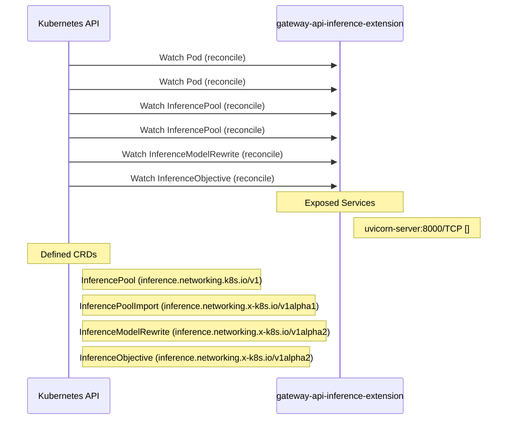

# gateway-api-inference-extension: Dataflow

## Controller Watches

Kubernetes resources this controller monitors for changes. Each watch triggers reconciliation when the watched resource is created, updated, or deleted.

| Type | GVK | Source |
|------|-----|--------|
| For | /v1/Pod | [`pkg/epp/controller/pod_reconciler.go:85`](https://github.com/kubernetes-sigs/gateway-api-inference-extension/blob/c4c8fef6438746226ed1b7d3cab210229d687f2c/pkg/epp/controller/pod_reconciler.go#L85) |
| For | /v1/Pod | [`pkg/lwepp/controller/pod_reconciler.go:85`](https://github.com/kubernetes-sigs/gateway-api-inference-extension/blob/c4c8fef6438746226ed1b7d3cab210229d687f2c/pkg/lwepp/controller/pod_reconciler.go#L85) |
| For | api/v1/InferencePool | [`pkg/epp/controller/inferencepool_reconciler.go:76`](https://github.com/kubernetes-sigs/gateway-api-inference-extension/blob/c4c8fef6438746226ed1b7d3cab210229d687f2c/pkg/epp/controller/inferencepool_reconciler.go#L76) |
| For | api/v1/InferencePool | [`pkg/lwepp/controller/inferencepool_reconciler.go:76`](https://github.com/kubernetes-sigs/gateway-api-inference-extension/blob/c4c8fef6438746226ed1b7d3cab210229d687f2c/pkg/lwepp/controller/inferencepool_reconciler.go#L76) |
| For | apix/v1alpha2/InferenceModelRewrite | [`pkg/epp/controller/inferencemodelrewrite_reconciler.go:78`](https://github.com/kubernetes-sigs/gateway-api-inference-extension/blob/c4c8fef6438746226ed1b7d3cab210229d687f2c/pkg/epp/controller/inferencemodelrewrite_reconciler.go#L78) |
| For | apix/v1alpha2/InferenceObjective | [`pkg/epp/controller/inferenceobjective_reconciler.go:73`](https://github.com/kubernetes-sigs/gateway-api-inference-extension/blob/c4c8fef6438746226ed1b7d3cab210229d687f2c/pkg/epp/controller/inferenceobjective_reconciler.go#L73) |

## Reconciliation Flow

How the controller interacts with the Kubernetes API during reconciliation.

### HTTP Endpoints

| Method | Path | Source |
|--------|------|--------|
| * | / | [`.gopath-loader/pkg/mod/github.com/coreos/go-oidc@v2.3.0+incompatible/example/idtoken/app.go:45`](https://github.com/kubernetes-sigs/gateway-api-inference-extension/blob/c4c8fef6438746226ed1b7d3cab210229d687f2c/.gopath-loader/pkg/mod/github.com/coreos/go-oidc@v2.3.0+incompatible/example/idtoken/app.go#L45) |
| * | / | [`.gopath-loader/pkg/mod/github.com/coreos/go-oidc@v2.3.0+incompatible/example/nonce/app.go:49`](https://github.com/kubernetes-sigs/gateway-api-inference-extension/blob/c4c8fef6438746226ed1b7d3cab210229d687f2c/.gopath-loader/pkg/mod/github.com/coreos/go-oidc@v2.3.0+incompatible/example/nonce/app.go#L49) |
| * | / | [`.gomod-cache/golang.org/toolchain@v0.0.1-go1.25.0.linux-amd64/src/net/http/triv.go:130`](https://github.com/kubernetes-sigs/gateway-api-inference-extension/blob/c4c8fef6438746226ed1b7d3cab210229d687f2c/.gomod-cache/golang.org/toolchain@v0.0.1-go1.25.0.linux-amd64/src/net/http/triv.go#L130) |
| * | / | [`.gopath-loader/pkg/mod/github.com/aws/aws-sdk-go-v2@v1.41.1/internal/awstesting/certificate_utils.go:225`](https://github.com/kubernetes-sigs/gateway-api-inference-extension/blob/c4c8fef6438746226ed1b7d3cab210229d687f2c/.gopath-loader/pkg/mod/github.com/aws/aws-sdk-go-v2@v1.41.1/internal/awstesting/certificate_utils.go#L225) |
| * | / | [`.gopath-loader/pkg/mod/github.com/envoyproxy/go-control-plane@v0.14.0/internal/upstream/main.go:35`](https://github.com/kubernetes-sigs/gateway-api-inference-extension/blob/c4c8fef6438746226ed1b7d3cab210229d687f2c/.gopath-loader/pkg/mod/github.com/envoyproxy/go-control-plane@v0.14.0/internal/upstream/main.go#L35) |
| * | / | [`.gopath-loader/pkg/mod/golang.org/x/net@v0.52.0/webdav/litmus_test_server.go:83`](https://github.com/kubernetes-sigs/gateway-api-inference-extension/blob/c4c8fef6438746226ed1b7d3cab210229d687f2c/.gopath-loader/pkg/mod/golang.org/x/net@v0.52.0/webdav/litmus_test_server.go#L83) |
| * | / | [`.gopath-loader/pkg/mod/golang.org/x/tools@v0.42.0/cmd/present/dir.go:23`](https://github.com/kubernetes-sigs/gateway-api-inference-extension/blob/c4c8fef6438746226ed1b7d3cab210229d687f2c/.gopath-loader/pkg/mod/golang.org/x/tools@v0.42.0/cmd/present/dir.go#L23) |
| * | / | [`.gopath-loader/pkg/mod/github.com/ajstarks/svgo@v0.0.0-20211024235047-1546f124cd8b/svgplay/svgplay.go:40`](https://github.com/kubernetes-sigs/gateway-api-inference-extension/blob/c4c8fef6438746226ed1b7d3cab210229d687f2c/.gopath-loader/pkg/mod/github.com/ajstarks/svgo@v0.0.0-20211024235047-1546f124cd8b/svgplay/svgplay.go#L40) |
| * | / | [`.gopath-loader/pkg/mod/github.com/!shopify/toxiproxy@v2.1.4+incompatible/api.go:77`](https://github.com/kubernetes-sigs/gateway-api-inference-extension/blob/c4c8fef6438746226ed1b7d3cab210229d687f2c/.gopath-loader/pkg/mod/github.com/!shopify/toxiproxy@v2.1.4+incompatible/api.go#L77) |
| * | / | [`.gopath-loader/pkg/mod/github.com/aws/aws-sdk-go@v1.27.0/awstesting/custom_ca_bundle.go:32`](https://github.com/kubernetes-sigs/gateway-api-inference-extension/blob/c4c8fef6438746226ed1b7d3cab210229d687f2c/.gopath-loader/pkg/mod/github.com/aws/aws-sdk-go@v1.27.0/awstesting/custom_ca_bundle.go#L32) |
| * | / | [`.gopath-loader/pkg/mod/golang.org/x/tools@v0.42.0/go/types/internal/play/play.go:47`](https://github.com/kubernetes-sigs/gateway-api-inference-extension/blob/c4c8fef6438746226ed1b7d3cab210229d687f2c/.gopath-loader/pkg/mod/golang.org/x/tools@v0.42.0/go/types/internal/play/play.go#L47) |
| * | / | [`.gopath-loader/pkg/mod/golang.org/toolchain@v0.0.1-go1.25.0.linux-amd64/src/cmd/trace/main.go:188`](https://github.com/kubernetes-sigs/gateway-api-inference-extension/blob/c4c8fef6438746226ed1b7d3cab210229d687f2c/.gopath-loader/pkg/mod/golang.org/toolchain@v0.0.1-go1.25.0.linux-amd64/src/cmd/trace/main.go#L188) |
| * | / | [`.gopath-loader/pkg/mod/golang.org/toolchain@v0.0.1-go1.25.0.linux-amd64/src/net/http/triv.go:130`](https://github.com/kubernetes-sigs/gateway-api-inference-extension/blob/c4c8fef6438746226ed1b7d3cab210229d687f2c/.gopath-loader/pkg/mod/golang.org/toolchain@v0.0.1-go1.25.0.linux-amd64/src/net/http/triv.go#L130) |
| * | / | [`.gopath-loader/pkg/mod/github.com/prometheus/prometheus@v0.310.0/web/web.go:723`](https://github.com/kubernetes-sigs/gateway-api-inference-extension/blob/c4c8fef6438746226ed1b7d3cab210229d687f2c/.gopath-loader/pkg/mod/github.com/prometheus/prometheus@v0.310.0/web/web.go#L723) |
| * | / | [`.gopath-loader/pkg/mod/github.com/aryann/difflib@v0.0.0-20170710044230-e206f873d14a/difflib_server/difflib_demo.go:81`](https://github.com/kubernetes-sigs/gateway-api-inference-extension/blob/c4c8fef6438746226ed1b7d3cab210229d687f2c/.gopath-loader/pkg/mod/github.com/aryann/difflib@v0.0.0-20170710044230-e206f873d14a/difflib_server/difflib_demo.go#L81) |
| * | / | [`.gopath-loader/pkg/mod/github.com/ajstarks/svgo@v0.0.0-20211024235047-1546f124cd8b/picserv/picserv.go:44`](https://github.com/kubernetes-sigs/gateway-api-inference-extension/blob/c4c8fef6438746226ed1b7d3cab210229d687f2c/.gopath-loader/pkg/mod/github.com/ajstarks/svgo@v0.0.0-20211024235047-1546f124cd8b/picserv/picserv.go#L44) |
| * | / | [`.gopath-loader/pkg/mod/github.com/afex/hystrix-go@v0.0.0-20180502004556-fa1af6a1f4f5/loadtest/service/main.go:64`](https://github.com/kubernetes-sigs/gateway-api-inference-extension/blob/c4c8fef6438746226ed1b7d3cab210229d687f2c/.gopath-loader/pkg/mod/github.com/afex/hystrix-go@v0.0.0-20180502004556-fa1af6a1f4f5/loadtest/service/main.go#L64) |
| * | / | [`.gomod-cache/golang.org/toolchain@v0.0.1-go1.25.0.linux-amd64/src/cmd/trace/main.go:188`](https://github.com/kubernetes-sigs/gateway-api-inference-extension/blob/c4c8fef6438746226ed1b7d3cab210229d687f2c/.gomod-cache/golang.org/toolchain@v0.0.1-go1.25.0.linux-amd64/src/cmd/trace/main.go#L188) |
| * | / | [`.gopath-loader/pkg/mod/github.com/coreos/go-oidc@v2.3.0+incompatible/example/userinfo/app.go:40`](https://github.com/kubernetes-sigs/gateway-api-inference-extension/blob/c4c8fef6438746226ed1b7d3cab210229d687f2c/.gopath-loader/pkg/mod/github.com/coreos/go-oidc@v2.3.0+incompatible/example/userinfo/app.go#L40) |
| * | / | [`.gopath-loader/pkg/mod/github.com/ajstarks/deck@v0.0.0-20200831202436-30c9fc6549a9/cmd/deckd/deckd.go:61`](https://github.com/kubernetes-sigs/gateway-api-inference-extension/blob/c4c8fef6438746226ed1b7d3cab210229d687f2c/.gopath-loader/pkg/mod/github.com/ajstarks/deck@v0.0.0-20200831202436-30c9fc6549a9/cmd/deckd/deckd.go#L61) |
| GET | / | [`.gopath-loader/pkg/mod/k8s.io/apiserver@v0.35.5/pkg/endpoints/discovery/aggregated/wrapper.go:73`](https://github.com/kubernetes-sigs/gateway-api-inference-extension/blob/c4c8fef6438746226ed1b7d3cab210229d687f2c/.gopath-loader/pkg/mod/k8s.io/apiserver@v0.35.5/pkg/endpoints/discovery/aggregated/wrapper.go#L73) |
| GET | / | [`.gopath-loader/pkg/mod/k8s.io/apiserver@v0.35.5/pkg/server/routes/version.go:44`](https://github.com/kubernetes-sigs/gateway-api-inference-extension/blob/c4c8fef6438746226ed1b7d3cab210229d687f2c/.gopath-loader/pkg/mod/k8s.io/apiserver@v0.35.5/pkg/server/routes/version.go#L44) |
| GET | / | [`.gopath-loader/pkg/mod/k8s.io/apiserver@v0.35.5/pkg/endpoints/discovery/group.go:57`](https://github.com/kubernetes-sigs/gateway-api-inference-extension/blob/c4c8fef6438746226ed1b7d3cab210229d687f2c/.gopath-loader/pkg/mod/k8s.io/apiserver@v0.35.5/pkg/endpoints/discovery/group.go#L57) |
| GET | / | [`.gopath-loader/pkg/mod/k8s.io/apiserver@v0.35.5/pkg/endpoints/discovery/legacy.go:59`](https://github.com/kubernetes-sigs/gateway-api-inference-extension/blob/c4c8fef6438746226ed1b7d3cab210229d687f2c/.gopath-loader/pkg/mod/k8s.io/apiserver@v0.35.5/pkg/endpoints/discovery/legacy.go#L59) |
| GET | / | [`.gopath-loader/pkg/mod/k8s.io/apiserver@v0.35.5/pkg/endpoints/discovery/root.go:154`](https://github.com/kubernetes-sigs/gateway-api-inference-extension/blob/c4c8fef6438746226ed1b7d3cab210229d687f2c/.gopath-loader/pkg/mod/k8s.io/apiserver@v0.35.5/pkg/endpoints/discovery/root.go#L154) |
| GET | / | [`.gopath-loader/pkg/mod/k8s.io/apiserver@v0.35.5/pkg/endpoints/discovery/version.go:67`](https://github.com/kubernetes-sigs/gateway-api-inference-extension/blob/c4c8fef6438746226ed1b7d3cab210229d687f2c/.gopath-loader/pkg/mod/k8s.io/apiserver@v0.35.5/pkg/endpoints/discovery/version.go#L67) |
| * | /AfterSuiteDidRun | [`.gopath-loader/pkg/mod/github.com/onsi/ginkgo@v1.16.5/internal/remote/server.go:62`](https://github.com/kubernetes-sigs/gateway-api-inference-extension/blob/c4c8fef6438746226ed1b7d3cab210229d687f2c/.gopath-loader/pkg/mod/github.com/onsi/ginkgo@v1.16.5/internal/remote/server.go#L62) |
| * | /BeforeSuiteDidRun | [`.gopath-loader/pkg/mod/github.com/onsi/ginkgo@v1.16.5/internal/remote/server.go:61`](https://github.com/kubernetes-sigs/gateway-api-inference-extension/blob/c4c8fef6438746226ed1b7d3cab210229d687f2c/.gopath-loader/pkg/mod/github.com/onsi/ginkgo@v1.16.5/internal/remote/server.go#L61) |
| * | /BeforeSuiteState | [`.gopath-loader/pkg/mod/github.com/onsi/ginkgo@v1.16.5/internal/remote/server.go:68`](https://github.com/kubernetes-sigs/gateway-api-inference-extension/blob/c4c8fef6438746226ed1b7d3cab210229d687f2c/.gopath-loader/pkg/mod/github.com/onsi/ginkgo@v1.16.5/internal/remote/server.go#L68) |
| * | /RemoteAfterSuiteData | [`.gopath-loader/pkg/mod/github.com/onsi/ginkgo@v1.16.5/internal/remote/server.go:69`](https://github.com/kubernetes-sigs/gateway-api-inference-extension/blob/c4c8fef6438746226ed1b7d3cab210229d687f2c/.gopath-loader/pkg/mod/github.com/onsi/ginkgo@v1.16.5/internal/remote/server.go#L69) |
| * | /SpecDidComplete | [`.gopath-loader/pkg/mod/github.com/onsi/ginkgo@v1.16.5/internal/remote/server.go:64`](https://github.com/kubernetes-sigs/gateway-api-inference-extension/blob/c4c8fef6438746226ed1b7d3cab210229d687f2c/.gopath-loader/pkg/mod/github.com/onsi/ginkgo@v1.16.5/internal/remote/server.go#L64) |
| * | /SpecSuiteDidEnd | [`.gopath-loader/pkg/mod/github.com/onsi/ginkgo@v1.16.5/internal/remote/server.go:65`](https://github.com/kubernetes-sigs/gateway-api-inference-extension/blob/c4c8fef6438746226ed1b7d3cab210229d687f2c/.gopath-loader/pkg/mod/github.com/onsi/ginkgo@v1.16.5/internal/remote/server.go#L65) |
| * | /SpecSuiteWillBegin | [`.gopath-loader/pkg/mod/github.com/onsi/ginkgo@v1.16.5/internal/remote/server.go:60`](https://github.com/kubernetes-sigs/gateway-api-inference-extension/blob/c4c8fef6438746226ed1b7d3cab210229d687f2c/.gopath-loader/pkg/mod/github.com/onsi/ginkgo@v1.16.5/internal/remote/server.go#L60) |
| * | /SpecWillRun | [`.gopath-loader/pkg/mod/github.com/onsi/ginkgo@v1.16.5/internal/remote/server.go:63`](https://github.com/kubernetes-sigs/gateway-api-inference-extension/blob/c4c8fef6438746226ed1b7d3cab210229d687f2c/.gopath-loader/pkg/mod/github.com/onsi/ginkgo@v1.16.5/internal/remote/server.go#L63) |
| * | /abort | [`.gopath-loader/pkg/mod/github.com/onsi/ginkgo/v2@v2.28.1/internal/parallel_support/http_server.go:63`](https://github.com/kubernetes-sigs/gateway-api-inference-extension/blob/c4c8fef6438746226ed1b7d3cab210229d687f2c/.gopath-loader/pkg/mod/github.com/onsi/ginkgo/v2@v2.28.1/internal/parallel_support/http_server.go#L63) |
| * | /aggregated-nonprimary-procs-report | [`.gopath-loader/pkg/mod/github.com/onsi/ginkgo/v2@v2.28.1/internal/parallel_support/http_server.go:60`](https://github.com/kubernetes-sigs/gateway-api-inference-extension/blob/c4c8fef6438746226ed1b7d3cab210229d687f2c/.gopath-loader/pkg/mod/github.com/onsi/ginkgo/v2@v2.28.1/internal/parallel_support/http_server.go#L60) |
| * | /arc/ | [`.gopath-loader/pkg/mod/github.com/ajstarks/svgo@v0.0.0-20211024235047-1546f124cd8b/websvg/websvg.go:23`](https://github.com/kubernetes-sigs/gateway-api-inference-extension/blob/c4c8fef6438746226ed1b7d3cab210229d687f2c/.gopath-loader/pkg/mod/github.com/ajstarks/svgo@v0.0.0-20211024235047-1546f124cd8b/websvg/websvg.go#L23) |
| * | /args | [`.gomod-cache/golang.org/toolchain@v0.0.1-go1.25.0.linux-amd64/src/net/http/triv.go:136`](https://github.com/kubernetes-sigs/gateway-api-inference-extension/blob/c4c8fef6438746226ed1b7d3cab210229d687f2c/.gomod-cache/golang.org/toolchain@v0.0.1-go1.25.0.linux-amd64/src/net/http/triv.go#L136) |
| * | /args | [`.gopath-loader/pkg/mod/golang.org/toolchain@v0.0.1-go1.25.0.linux-amd64/src/net/http/triv.go:136`](https://github.com/kubernetes-sigs/gateway-api-inference-extension/blob/c4c8fef6438746226ed1b7d3cab210229d687f2c/.gopath-loader/pkg/mod/golang.org/toolchain@v0.0.1-go1.25.0.linux-amd64/src/net/http/triv.go#L136) |
| * | /auth/google/callback | [`.gopath-loader/pkg/mod/github.com/coreos/go-oidc@v2.3.0+incompatible/example/nonce/app.go:53`](https://github.com/kubernetes-sigs/gateway-api-inference-extension/blob/c4c8fef6438746226ed1b7d3cab210229d687f2c/.gopath-loader/pkg/mod/github.com/coreos/go-oidc@v2.3.0+incompatible/example/nonce/app.go#L53) |
| * | /auth/google/callback | [`.gopath-loader/pkg/mod/github.com/coreos/go-oidc@v2.3.0+incompatible/example/userinfo/app.go:44`](https://github.com/kubernetes-sigs/gateway-api-inference-extension/blob/c4c8fef6438746226ed1b7d3cab210229d687f2c/.gopath-loader/pkg/mod/github.com/coreos/go-oidc@v2.3.0+incompatible/example/userinfo/app.go#L44) |
| * | /auth/google/callback | [`.gopath-loader/pkg/mod/github.com/coreos/go-oidc@v2.3.0+incompatible/example/idtoken/app.go:49`](https://github.com/kubernetes-sigs/gateway-api-inference-extension/blob/c4c8fef6438746226ed1b7d3cab210229d687f2c/.gopath-loader/pkg/mod/github.com/coreos/go-oidc@v2.3.0+incompatible/example/idtoken/app.go#L49) |
| * | /authority.cer | [`.gopath-loader/pkg/mod/cloud.google.com/go@v0.123.0/httpreplay/cmd/httpr/httpr.go:76`](https://github.com/kubernetes-sigs/gateway-api-inference-extension/blob/c4c8fef6438746226ed1b7d3cab210229d687f2c/.gopath-loader/pkg/mod/cloud.google.com/go@v0.123.0/httpreplay/cmd/httpr/httpr.go#L76) |
| * | /bar | [`.gomod-cache/golang.org/toolchain@v0.0.1-go1.25.0.linux-amd64/src/net/http/doc.go:67`](https://github.com/kubernetes-sigs/gateway-api-inference-extension/blob/c4c8fef6438746226ed1b7d3cab210229d687f2c/.gomod-cache/golang.org/toolchain@v0.0.1-go1.25.0.linux-amd64/src/net/http/doc.go#L67) |
| * | /bar | [`.gopath-loader/pkg/mod/golang.org/toolchain@v0.0.1-go1.25.0.linux-amd64/src/net/http/doc.go:67`](https://github.com/kubernetes-sigs/gateway-api-inference-extension/blob/c4c8fef6438746226ed1b7d3cab210229d687f2c/.gopath-loader/pkg/mod/golang.org/toolchain@v0.0.1-go1.25.0.linux-amd64/src/net/http/doc.go#L67) |
| * | /before-suite-completed | [`.gopath-loader/pkg/mod/github.com/onsi/ginkgo/v2@v2.28.1/internal/parallel_support/http_server.go:57`](https://github.com/kubernetes-sigs/gateway-api-inference-extension/blob/c4c8fef6438746226ed1b7d3cab210229d687f2c/.gopath-loader/pkg/mod/github.com/onsi/ginkgo/v2@v2.28.1/internal/parallel_support/http_server.go#L57) |
| * | /before-suite-state | [`.gopath-loader/pkg/mod/github.com/onsi/ginkgo/v2@v2.28.1/internal/parallel_support/http_server.go:58`](https://github.com/kubernetes-sigs/gateway-api-inference-extension/blob/c4c8fef6438746226ed1b7d3cab210229d687f2c/.gopath-loader/pkg/mod/github.com/onsi/ginkgo/v2@v2.28.1/internal/parallel_support/http_server.go#L58) |
| * | /block | [`.gopath-loader/pkg/mod/golang.org/toolchain@v0.0.1-go1.25.0.linux-amd64/src/cmd/trace/main.go:210`](https://github.com/kubernetes-sigs/gateway-api-inference-extension/blob/c4c8fef6438746226ed1b7d3cab210229d687f2c/.gopath-loader/pkg/mod/golang.org/toolchain@v0.0.1-go1.25.0.linux-amd64/src/cmd/trace/main.go#L210) |
| * | /block | [`.gomod-cache/golang.org/toolchain@v0.0.1-go1.25.0.linux-amd64/src/cmd/trace/main.go:210`](https://github.com/kubernetes-sigs/gateway-api-inference-extension/blob/c4c8fef6438746226ed1b7d3cab210229d687f2c/.gomod-cache/golang.org/toolchain@v0.0.1-go1.25.0.linux-amd64/src/cmd/trace/main.go#L210) |
| * | /chan | [`.gopath-loader/pkg/mod/golang.org/toolchain@v0.0.1-go1.25.0.linux-amd64/src/net/http/triv.go:134`](https://github.com/kubernetes-sigs/gateway-api-inference-extension/blob/c4c8fef6438746226ed1b7d3cab210229d687f2c/.gopath-loader/pkg/mod/golang.org/toolchain@v0.0.1-go1.25.0.linux-amd64/src/net/http/triv.go#L134) |
| * | /chan | [`.gomod-cache/golang.org/toolchain@v0.0.1-go1.25.0.linux-amd64/src/net/http/triv.go:134`](https://github.com/kubernetes-sigs/gateway-api-inference-extension/blob/c4c8fef6438746226ed1b7d3cab210229d687f2c/.gomod-cache/golang.org/toolchain@v0.0.1-go1.25.0.linux-amd64/src/net/http/triv.go#L134) |
| * | /circle | [`.gopath-loader/pkg/mod/github.com/ajstarks/svgo@v0.0.0-20211024235047-1546f124cd8b/doc.go:75`](https://github.com/kubernetes-sigs/gateway-api-inference-extension/blob/c4c8fef6438746226ed1b7d3cab210229d687f2c/.gopath-loader/pkg/mod/github.com/ajstarks/svgo@v0.0.0-20211024235047-1546f124cd8b/doc.go#L75) |
| * | /circle | [`.gopath-loader/pkg/mod/github.com/ajstarks/svgo@v0.0.0-20211024235047-1546f124cd8b/float/doc.go:74`](https://github.com/kubernetes-sigs/gateway-api-inference-extension/blob/c4c8fef6438746226ed1b7d3cab210229d687f2c/.gopath-loader/pkg/mod/github.com/ajstarks/svgo@v0.0.0-20211024235047-1546f124cd8b/float/doc.go#L74) |
| * | /circle/ | [`.gopath-loader/pkg/mod/github.com/ajstarks/svgo@v0.0.0-20211024235047-1546f124cd8b/websvg/websvg.go:21`](https://github.com/kubernetes-sigs/gateway-api-inference-extension/blob/c4c8fef6438746226ed1b7d3cab210229d687f2c/.gopath-loader/pkg/mod/github.com/ajstarks/svgo@v0.0.0-20211024235047-1546f124cd8b/websvg/websvg.go#L21) |
| * | /clock/ | [`.gopath-loader/pkg/mod/github.com/ajstarks/svgo@v0.0.0-20211024235047-1546f124cd8b/picserv/picserv.go:55`](https://github.com/kubernetes-sigs/gateway-api-inference-extension/blob/c4c8fef6438746226ed1b7d3cab210229d687f2c/.gopath-loader/pkg/mod/github.com/ajstarks/svgo@v0.0.0-20211024235047-1546f124cd8b/picserv/picserv.go#L55) |
| * | /compile | [`.gopath-loader/pkg/mod/github.com/ajstarks/svgo@v0.0.0-20211024235047-1546f124cd8b/svgplay/svgplay.go:41`](https://github.com/kubernetes-sigs/gateway-api-inference-extension/blob/c4c8fef6438746226ed1b7d3cab210229d687f2c/.gopath-loader/pkg/mod/github.com/ajstarks/svgo@v0.0.0-20211024235047-1546f124cd8b/svgplay/svgplay.go#L41) |
| * | /compile | [`.gopath-loader/pkg/mod/golang.org/x/tools@v0.42.0/playground/playground.go:23`](https://github.com/kubernetes-sigs/gateway-api-inference-extension/blob/c4c8fef6438746226ed1b7d3cab210229d687f2c/.gopath-loader/pkg/mod/golang.org/x/tools@v0.42.0/playground/playground.go#L23) |
| * | /counter | [`.gopath-loader/pkg/mod/golang.org/toolchain@v0.0.1-go1.25.0.linux-amd64/src/net/http/triv.go:129`](https://github.com/kubernetes-sigs/gateway-api-inference-extension/blob/c4c8fef6438746226ed1b7d3cab210229d687f2c/.gopath-loader/pkg/mod/golang.org/toolchain@v0.0.1-go1.25.0.linux-amd64/src/net/http/triv.go#L129) |
| * | /counter | [`.gomod-cache/golang.org/toolchain@v0.0.1-go1.25.0.linux-amd64/src/net/http/triv.go:129`](https://github.com/kubernetes-sigs/gateway-api-inference-extension/blob/c4c8fef6438746226ed1b7d3cab210229d687f2c/.gomod-cache/golang.org/toolchain@v0.0.1-go1.25.0.linux-amd64/src/net/http/triv.go#L129) |
| * | /counter | [`.gopath-loader/pkg/mod/github.com/onsi/ginkgo@v1.16.5/internal/remote/server.go:70`](https://github.com/kubernetes-sigs/gateway-api-inference-extension/blob/c4c8fef6438746226ed1b7d3cab210229d687f2c/.gopath-loader/pkg/mod/github.com/onsi/ginkgo@v1.16.5/internal/remote/server.go#L70) |
| * | /counter | [`.gopath-loader/pkg/mod/github.com/onsi/ginkgo/v2@v2.28.1/internal/parallel_support/http_server.go:61`](https://github.com/kubernetes-sigs/gateway-api-inference-extension/blob/c4c8fef6438746226ed1b7d3cab210229d687f2c/.gopath-loader/pkg/mod/github.com/onsi/ginkgo/v2@v2.28.1/internal/parallel_support/http_server.go#L61) |
| * | /cube/ | [`.gopath-loader/pkg/mod/github.com/ajstarks/svgo@v0.0.0-20211024235047-1546f124cd8b/picserv/picserv.go:51`](https://github.com/kubernetes-sigs/gateway-api-inference-extension/blob/c4c8fef6438746226ed1b7d3cab210229d687f2c/.gopath-loader/pkg/mod/github.com/ajstarks/svgo@v0.0.0-20211024235047-1546f124cd8b/picserv/picserv.go#L51) |
| * | /date | [`.gomod-cache/golang.org/toolchain@v0.0.1-go1.25.0.linux-amd64/src/net/http/triv.go:138`](https://github.com/kubernetes-sigs/gateway-api-inference-extension/blob/c4c8fef6438746226ed1b7d3cab210229d687f2c/.gomod-cache/golang.org/toolchain@v0.0.1-go1.25.0.linux-amd64/src/net/http/triv.go#L138) |
| * | /date | [`.gopath-loader/pkg/mod/golang.org/toolchain@v0.0.1-go1.25.0.linux-amd64/src/net/http/triv.go:138`](https://github.com/kubernetes-sigs/gateway-api-inference-extension/blob/c4c8fef6438746226ed1b7d3cab210229d687f2c/.gopath-loader/pkg/mod/golang.org/toolchain@v0.0.1-go1.25.0.linux-amd64/src/net/http/triv.go#L138) |
| * | /debug/flags | [`.gopath-loader/pkg/mod/k8s.io/apiserver@v0.35.5/pkg/server/routes/debugsocket.go:58`](https://github.com/kubernetes-sigs/gateway-api-inference-extension/blob/c4c8fef6438746226ed1b7d3cab210229d687f2c/.gopath-loader/pkg/mod/k8s.io/apiserver@v0.35.5/pkg/server/routes/debugsocket.go#L58) |
| * | /debug/flags/ | [`.gopath-loader/pkg/mod/k8s.io/apiserver@v0.35.5/pkg/server/routes/debugsocket.go:59`](https://github.com/kubernetes-sigs/gateway-api-inference-extension/blob/c4c8fef6438746226ed1b7d3cab210229d687f2c/.gopath-loader/pkg/mod/k8s.io/apiserver@v0.35.5/pkg/server/routes/debugsocket.go#L59) |
| * | /debug/pprof | [`.gopath-loader/pkg/mod/k8s.io/apiserver@v0.35.5/pkg/server/routes/debugsocket.go:47`](https://github.com/kubernetes-sigs/gateway-api-inference-extension/blob/c4c8fef6438746226ed1b7d3cab210229d687f2c/.gopath-loader/pkg/mod/k8s.io/apiserver@v0.35.5/pkg/server/routes/debugsocket.go#L47) |
| * | /debug/pprof/ | [`.gopath-loader/pkg/mod/k8s.io/apiserver@v0.35.5/pkg/server/routes/debugsocket.go:48`](https://github.com/kubernetes-sigs/gateway-api-inference-extension/blob/c4c8fef6438746226ed1b7d3cab210229d687f2c/.gopath-loader/pkg/mod/k8s.io/apiserver@v0.35.5/pkg/server/routes/debugsocket.go#L48) |
| * | /debug/pprof/ | [`.gopath-loader/pkg/mod/sigs.k8s.io/controller-runtime@v0.23.3/pkg/manager/internal.go:329`](https://github.com/kubernetes-sigs/gateway-api-inference-extension/blob/c4c8fef6438746226ed1b7d3cab210229d687f2c/.gopath-loader/pkg/mod/sigs.k8s.io/controller-runtime@v0.23.3/pkg/manager/internal.go#L329) |
| * | /debug/pprof/cmdline | [`.gopath-loader/pkg/mod/sigs.k8s.io/controller-runtime@v0.23.3/pkg/manager/internal.go:330`](https://github.com/kubernetes-sigs/gateway-api-inference-extension/blob/c4c8fef6438746226ed1b7d3cab210229d687f2c/.gopath-loader/pkg/mod/sigs.k8s.io/controller-runtime@v0.23.3/pkg/manager/internal.go#L330) |
| * | /debug/pprof/cmdline | [`.gopath-loader/pkg/mod/k8s.io/apiserver@v0.35.5/pkg/server/routes/debugsocket.go:49`](https://github.com/kubernetes-sigs/gateway-api-inference-extension/blob/c4c8fef6438746226ed1b7d3cab210229d687f2c/.gopath-loader/pkg/mod/k8s.io/apiserver@v0.35.5/pkg/server/routes/debugsocket.go#L49) |
| * | /debug/pprof/profile | [`.gopath-loader/pkg/mod/sigs.k8s.io/controller-runtime@v0.23.3/pkg/manager/internal.go:331`](https://github.com/kubernetes-sigs/gateway-api-inference-extension/blob/c4c8fef6438746226ed1b7d3cab210229d687f2c/.gopath-loader/pkg/mod/sigs.k8s.io/controller-runtime@v0.23.3/pkg/manager/internal.go#L331) |
| * | /debug/pprof/profile | [`.gopath-loader/pkg/mod/k8s.io/apiserver@v0.35.5/pkg/server/routes/debugsocket.go:50`](https://github.com/kubernetes-sigs/gateway-api-inference-extension/blob/c4c8fef6438746226ed1b7d3cab210229d687f2c/.gopath-loader/pkg/mod/k8s.io/apiserver@v0.35.5/pkg/server/routes/debugsocket.go#L50) |
| * | /debug/pprof/symbol | [`.gopath-loader/pkg/mod/k8s.io/apiserver@v0.35.5/pkg/server/routes/debugsocket.go:51`](https://github.com/kubernetes-sigs/gateway-api-inference-extension/blob/c4c8fef6438746226ed1b7d3cab210229d687f2c/.gopath-loader/pkg/mod/k8s.io/apiserver@v0.35.5/pkg/server/routes/debugsocket.go#L51) |
| * | /debug/pprof/symbol | [`.gopath-loader/pkg/mod/sigs.k8s.io/controller-runtime@v0.23.3/pkg/manager/internal.go:332`](https://github.com/kubernetes-sigs/gateway-api-inference-extension/blob/c4c8fef6438746226ed1b7d3cab210229d687f2c/.gopath-loader/pkg/mod/sigs.k8s.io/controller-runtime@v0.23.3/pkg/manager/internal.go#L332) |
| * | /debug/pprof/trace | [`.gopath-loader/pkg/mod/k8s.io/apiserver@v0.35.5/pkg/server/routes/debugsocket.go:52`](https://github.com/kubernetes-sigs/gateway-api-inference-extension/blob/c4c8fef6438746226ed1b7d3cab210229d687f2c/.gopath-loader/pkg/mod/k8s.io/apiserver@v0.35.5/pkg/server/routes/debugsocket.go#L52) |
| * | /debug/pprof/trace | [`.gopath-loader/pkg/mod/sigs.k8s.io/controller-runtime@v0.23.3/pkg/manager/internal.go:333`](https://github.com/kubernetes-sigs/gateway-api-inference-extension/blob/c4c8fef6438746226ed1b7d3cab210229d687f2c/.gopath-loader/pkg/mod/sigs.k8s.io/controller-runtime@v0.23.3/pkg/manager/internal.go#L333) |
| * | /debug/vars | [`.gomod-cache/golang.org/toolchain@v0.0.1-go1.25.0.linux-amd64/src/expvar/expvar.go:382`](https://github.com/kubernetes-sigs/gateway-api-inference-extension/blob/c4c8fef6438746226ed1b7d3cab210229d687f2c/.gomod-cache/golang.org/toolchain@v0.0.1-go1.25.0.linux-amd64/src/expvar/expvar.go#L382) |
| * | /debug/vars | [`.gopath-loader/pkg/mod/golang.org/toolchain@v0.0.1-go1.25.0.linux-amd64/src/expvar/expvar.go:382`](https://github.com/kubernetes-sigs/gateway-api-inference-extension/blob/c4c8fef6438746226ed1b7d3cab210229d687f2c/.gopath-loader/pkg/mod/golang.org/toolchain@v0.0.1-go1.25.0.linux-amd64/src/expvar/expvar.go#L382) |
| * | /deck/ | [`.gopath-loader/pkg/mod/github.com/ajstarks/deck@v0.0.0-20200831202436-30c9fc6549a9/cmd/deckd/deckd.go:63`](https://github.com/kubernetes-sigs/gateway-api-inference-extension/blob/c4c8fef6438746226ed1b7d3cab210229d687f2c/.gopath-loader/pkg/mod/github.com/ajstarks/deck@v0.0.0-20200831202436-30c9fc6549a9/cmd/deckd/deckd.go#L63) |
| * | /did-run | [`.gopath-loader/pkg/mod/github.com/onsi/ginkgo/v2@v2.28.1/internal/parallel_support/http_server.go:49`](https://github.com/kubernetes-sigs/gateway-api-inference-extension/blob/c4c8fef6438746226ed1b7d3cab210229d687f2c/.gopath-loader/pkg/mod/github.com/onsi/ginkgo/v2@v2.28.1/internal/parallel_support/http_server.go#L49) |
| * | /emit-output | [`.gopath-loader/pkg/mod/github.com/onsi/ginkgo/v2@v2.28.1/internal/parallel_support/http_server.go:51`](https://github.com/kubernetes-sigs/gateway-api-inference-extension/blob/c4c8fef6438746226ed1b7d3cab210229d687f2c/.gopath-loader/pkg/mod/github.com/onsi/ginkgo/v2@v2.28.1/internal/parallel_support/http_server.go#L51) |
| * | /face/ | [`.gopath-loader/pkg/mod/github.com/ajstarks/svgo@v0.0.0-20211024235047-1546f124cd8b/picserv/picserv.go:49`](https://github.com/kubernetes-sigs/gateway-api-inference-extension/blob/c4c8fef6438746226ed1b7d3cab210229d687f2c/.gopath-loader/pkg/mod/github.com/ajstarks/svgo@v0.0.0-20211024235047-1546f124cd8b/picserv/picserv.go#L49) |
| * | /flags | [`.gomod-cache/golang.org/toolchain@v0.0.1-go1.25.0.linux-amd64/src/net/http/triv.go:135`](https://github.com/kubernetes-sigs/gateway-api-inference-extension/blob/c4c8fef6438746226ed1b7d3cab210229d687f2c/.gomod-cache/golang.org/toolchain@v0.0.1-go1.25.0.linux-amd64/src/net/http/triv.go#L135) |
| * | /flags | [`.gopath-loader/pkg/mod/golang.org/toolchain@v0.0.1-go1.25.0.linux-amd64/src/net/http/triv.go:135`](https://github.com/kubernetes-sigs/gateway-api-inference-extension/blob/c4c8fef6438746226ed1b7d3cab210229d687f2c/.gopath-loader/pkg/mod/golang.org/toolchain@v0.0.1-go1.25.0.linux-amd64/src/net/http/triv.go#L135) |
| * | /flower/ | [`.gopath-loader/pkg/mod/github.com/ajstarks/svgo@v0.0.0-20211024235047-1546f124cd8b/picserv/picserv.go:50`](https://github.com/kubernetes-sigs/gateway-api-inference-extension/blob/c4c8fef6438746226ed1b7d3cab210229d687f2c/.gopath-loader/pkg/mod/github.com/ajstarks/svgo@v0.0.0-20211024235047-1546f124cd8b/picserv/picserv.go#L50) |
| * | /foo | [`.gomod-cache/golang.org/toolchain@v0.0.1-go1.25.0.linux-amd64/src/net/http/doc.go:65`](https://github.com/kubernetes-sigs/gateway-api-inference-extension/blob/c4c8fef6438746226ed1b7d3cab210229d687f2c/.gomod-cache/golang.org/toolchain@v0.0.1-go1.25.0.linux-amd64/src/net/http/doc.go#L65) |
| * | /foo | [`.gopath-loader/pkg/mod/golang.org/toolchain@v0.0.1-go1.25.0.linux-amd64/src/net/http/doc.go:65`](https://github.com/kubernetes-sigs/gateway-api-inference-extension/blob/c4c8fef6438746226ed1b7d3cab210229d687f2c/.gopath-loader/pkg/mod/golang.org/toolchain@v0.0.1-go1.25.0.linux-amd64/src/net/http/doc.go#L65) |
| * | /funnel/ | [`.gopath-loader/pkg/mod/github.com/ajstarks/svgo@v0.0.0-20211024235047-1546f124cd8b/picserv/picserv.go:54`](https://github.com/kubernetes-sigs/gateway-api-inference-extension/blob/c4c8fef6438746226ed1b7d3cab210229d687f2c/.gopath-loader/pkg/mod/github.com/ajstarks/svgo@v0.0.0-20211024235047-1546f124cd8b/picserv/picserv.go#L54) |
| * | /go/ | [`.gomod-cache/golang.org/toolchain@v0.0.1-go1.25.0.linux-amd64/src/net/http/triv.go:132`](https://github.com/kubernetes-sigs/gateway-api-inference-extension/blob/c4c8fef6438746226ed1b7d3cab210229d687f2c/.gomod-cache/golang.org/toolchain@v0.0.1-go1.25.0.linux-amd64/src/net/http/triv.go#L132) |
| * | /go/ | [`.gopath-loader/pkg/mod/golang.org/toolchain@v0.0.1-go1.25.0.linux-amd64/src/net/http/triv.go:132`](https://github.com/kubernetes-sigs/gateway-api-inference-extension/blob/c4c8fef6438746226ed1b7d3cab210229d687f2c/.gopath-loader/pkg/mod/golang.org/toolchain@v0.0.1-go1.25.0.linux-amd64/src/net/http/triv.go#L132) |
| * | /go/hello | [`.gomod-cache/golang.org/toolchain@v0.0.1-go1.25.0.linux-amd64/src/net/http/triv.go:137`](https://github.com/kubernetes-sigs/gateway-api-inference-extension/blob/c4c8fef6438746226ed1b7d3cab210229d687f2c/.gomod-cache/golang.org/toolchain@v0.0.1-go1.25.0.linux-amd64/src/net/http/triv.go#L137) |
| * | /go/hello | [`.gopath-loader/pkg/mod/golang.org/toolchain@v0.0.1-go1.25.0.linux-amd64/src/net/http/triv.go:137`](https://github.com/kubernetes-sigs/gateway-api-inference-extension/blob/c4c8fef6438746226ed1b7d3cab210229d687f2c/.gopath-loader/pkg/mod/golang.org/toolchain@v0.0.1-go1.25.0.linux-amd64/src/net/http/triv.go#L137) |
| * | /goroutine | [`.gomod-cache/golang.org/toolchain@v0.0.1-go1.25.0.linux-amd64/src/cmd/trace/main.go:203`](https://github.com/kubernetes-sigs/gateway-api-inference-extension/blob/c4c8fef6438746226ed1b7d3cab210229d687f2c/.gomod-cache/golang.org/toolchain@v0.0.1-go1.25.0.linux-amd64/src/cmd/trace/main.go#L203) |
| * | /goroutine | [`.gopath-loader/pkg/mod/golang.org/toolchain@v0.0.1-go1.25.0.linux-amd64/src/cmd/trace/main.go:203`](https://github.com/kubernetes-sigs/gateway-api-inference-extension/blob/c4c8fef6438746226ed1b7d3cab210229d687f2c/.gopath-loader/pkg/mod/golang.org/toolchain@v0.0.1-go1.25.0.linux-amd64/src/cmd/trace/main.go#L203) |
| * | /goroutines | [`.gomod-cache/golang.org/toolchain@v0.0.1-go1.25.0.linux-amd64/src/cmd/trace/main.go:202`](https://github.com/kubernetes-sigs/gateway-api-inference-extension/blob/c4c8fef6438746226ed1b7d3cab210229d687f2c/.gomod-cache/golang.org/toolchain@v0.0.1-go1.25.0.linux-amd64/src/cmd/trace/main.go#L202) |
| * | /goroutines | [`.gopath-loader/pkg/mod/golang.org/toolchain@v0.0.1-go1.25.0.linux-amd64/src/cmd/trace/main.go:202`](https://github.com/kubernetes-sigs/gateway-api-inference-extension/blob/c4c8fef6438746226ed1b7d3cab210229d687f2c/.gopath-loader/pkg/mod/golang.org/toolchain@v0.0.1-go1.25.0.linux-amd64/src/cmd/trace/main.go#L202) |
| * | /has-counter | [`.gopath-loader/pkg/mod/github.com/onsi/ginkgo@v1.16.5/internal/remote/server.go:71`](https://github.com/kubernetes-sigs/gateway-api-inference-extension/blob/c4c8fef6438746226ed1b7d3cab210229d687f2c/.gopath-loader/pkg/mod/github.com/onsi/ginkgo@v1.16.5/internal/remote/server.go#L71) |
| * | /have-nonprimary-procs-finished | [`.gopath-loader/pkg/mod/github.com/onsi/ginkgo/v2@v2.28.1/internal/parallel_support/http_server.go:59`](https://github.com/kubernetes-sigs/gateway-api-inference-extension/blob/c4c8fef6438746226ed1b7d3cab210229d687f2c/.gopath-loader/pkg/mod/github.com/onsi/ginkgo/v2@v2.28.1/internal/parallel_support/http_server.go#L59) |
| * | /index/ | [`.gopath-loader/pkg/mod/github.com/ajstarks/svgo@v0.0.0-20211024235047-1546f124cd8b/picserv/picserv.go:45`](https://github.com/kubernetes-sigs/gateway-api-inference-extension/blob/c4c8fef6438746226ed1b7d3cab210229d687f2c/.gopath-loader/pkg/mod/github.com/ajstarks/svgo@v0.0.0-20211024235047-1546f124cd8b/picserv/picserv.go#L45) |
| * | /initial | [`.gopath-loader/pkg/mod/cloud.google.com/go@v0.123.0/httpreplay/cmd/httpr/httpr.go:77`](https://github.com/kubernetes-sigs/gateway-api-inference-extension/blob/c4c8fef6438746226ed1b7d3cab210229d687f2c/.gopath-loader/pkg/mod/cloud.google.com/go@v0.123.0/httpreplay/cmd/httpr/httpr.go#L77) |
| * | /io | [`.gomod-cache/golang.org/toolchain@v0.0.1-go1.25.0.linux-amd64/src/cmd/trace/main.go:209`](https://github.com/kubernetes-sigs/gateway-api-inference-extension/blob/c4c8fef6438746226ed1b7d3cab210229d687f2c/.gomod-cache/golang.org/toolchain@v0.0.1-go1.25.0.linux-amd64/src/cmd/trace/main.go#L209) |
| * | /io | [`.gopath-loader/pkg/mod/golang.org/toolchain@v0.0.1-go1.25.0.linux-amd64/src/cmd/trace/main.go:209`](https://github.com/kubernetes-sigs/gateway-api-inference-extension/blob/c4c8fef6438746226ed1b7d3cab210229d687f2c/.gopath-loader/pkg/mod/golang.org/toolchain@v0.0.1-go1.25.0.linux-amd64/src/cmd/trace/main.go#L209) |
| * | /jsontrace | [`.gopath-loader/pkg/mod/golang.org/toolchain@v0.0.1-go1.25.0.linux-amd64/src/cmd/trace/main.go:198`](https://github.com/kubernetes-sigs/gateway-api-inference-extension/blob/c4c8fef6438746226ed1b7d3cab210229d687f2c/.gopath-loader/pkg/mod/golang.org/toolchain@v0.0.1-go1.25.0.linux-amd64/src/cmd/trace/main.go#L198) |
| * | /jsontrace | [`.gomod-cache/golang.org/toolchain@v0.0.1-go1.25.0.linux-amd64/src/cmd/trace/main.go:198`](https://github.com/kubernetes-sigs/gateway-api-inference-extension/blob/c4c8fef6438746226ed1b7d3cab210229d687f2c/.gomod-cache/golang.org/toolchain@v0.0.1-go1.25.0.linux-amd64/src/cmd/trace/main.go#L198) |
| * | /lewitt/ | [`.gopath-loader/pkg/mod/github.com/ajstarks/svgo@v0.0.0-20211024235047-1546f124cd8b/picserv/picserv.go:52`](https://github.com/kubernetes-sigs/gateway-api-inference-extension/blob/c4c8fef6438746226ed1b7d3cab210229d687f2c/.gopath-loader/pkg/mod/github.com/ajstarks/svgo@v0.0.0-20211024235047-1546f124cd8b/picserv/picserv.go#L52) |
| * | /main.css | [`.gopath-loader/pkg/mod/golang.org/x/tools@v0.42.0/go/types/internal/play/play.go:49`](https://github.com/kubernetes-sigs/gateway-api-inference-extension/blob/c4c8fef6438746226ed1b7d3cab210229d687f2c/.gopath-loader/pkg/mod/golang.org/x/tools@v0.42.0/go/types/internal/play/play.go#L49) |
| * | /main.js | [`.gopath-loader/pkg/mod/golang.org/x/tools@v0.42.0/go/types/internal/play/play.go:48`](https://github.com/kubernetes-sigs/gateway-api-inference-extension/blob/c4c8fef6438746226ed1b7d3cab210229d687f2c/.gopath-loader/pkg/mod/golang.org/x/tools@v0.42.0/go/types/internal/play/play.go#L48) |
| * | /media/ | [`.gopath-loader/pkg/mod/github.com/ajstarks/deck@v0.0.0-20200831202436-30c9fc6549a9/cmd/deckd/deckd.go:66`](https://github.com/kubernetes-sigs/gateway-api-inference-extension/blob/c4c8fef6438746226ed1b7d3cab210229d687f2c/.gopath-loader/pkg/mod/github.com/ajstarks/deck@v0.0.0-20200831202436-30c9fc6549a9/cmd/deckd/deckd.go#L66) |
| * | /mmu | [`.gopath-loader/pkg/mod/golang.org/toolchain@v0.0.1-go1.25.0.linux-amd64/src/cmd/trace/main.go:206`](https://github.com/kubernetes-sigs/gateway-api-inference-extension/blob/c4c8fef6438746226ed1b7d3cab210229d687f2c/.gopath-loader/pkg/mod/golang.org/toolchain@v0.0.1-go1.25.0.linux-amd64/src/cmd/trace/main.go#L206) |
| * | /mmu | [`.gomod-cache/golang.org/toolchain@v0.0.1-go1.25.0.linux-amd64/src/cmd/trace/main.go:206`](https://github.com/kubernetes-sigs/gateway-api-inference-extension/blob/c4c8fef6438746226ed1b7d3cab210229d687f2c/.gomod-cache/golang.org/toolchain@v0.0.1-go1.25.0.linux-amd64/src/cmd/trace/main.go#L206) |
| * | /mondrian/ | [`.gopath-loader/pkg/mod/github.com/ajstarks/svgo@v0.0.0-20211024235047-1546f124cd8b/picserv/picserv.go:53`](https://github.com/kubernetes-sigs/gateway-api-inference-extension/blob/c4c8fef6438746226ed1b7d3cab210229d687f2c/.gopath-loader/pkg/mod/github.com/ajstarks/svgo@v0.0.0-20211024235047-1546f124cd8b/picserv/picserv.go#L53) |
| * | /pacman/ | [`.gopath-loader/pkg/mod/github.com/ajstarks/svgo@v0.0.0-20211024235047-1546f124cd8b/picserv/picserv.go:56`](https://github.com/kubernetes-sigs/gateway-api-inference-extension/blob/c4c8fef6438746226ed1b7d3cab210229d687f2c/.gopath-loader/pkg/mod/github.com/ajstarks/svgo@v0.0.0-20211024235047-1546f124cd8b/picserv/picserv.go#L56) |
| * | /pic256.html | [`.gopath-loader/pkg/mod/github.com/ajstarks/svgo@v0.0.0-20211024235047-1546f124cd8b/picserv/picserv.go:46`](https://github.com/kubernetes-sigs/gateway-api-inference-extension/blob/c4c8fef6438746226ed1b7d3cab210229d687f2c/.gopath-loader/pkg/mod/github.com/ajstarks/svgo@v0.0.0-20211024235047-1546f124cd8b/picserv/picserv.go#L46) |
| * | /play.js | [`.gopath-loader/pkg/mod/golang.org/x/tools@v0.42.0/cmd/present/play.go:43`](https://github.com/kubernetes-sigs/gateway-api-inference-extension/blob/c4c8fef6438746226ed1b7d3cab210229d687f2c/.gopath-loader/pkg/mod/golang.org/x/tools@v0.42.0/cmd/present/play.go#L43) |
| POST | /populate | [`.gopath-loader/pkg/mod/github.com/!shopify/toxiproxy@v2.1.4+incompatible/api.go:65`](https://github.com/kubernetes-sigs/gateway-api-inference-extension/blob/c4c8fef6438746226ed1b7d3cab210229d687f2c/.gopath-loader/pkg/mod/github.com/!shopify/toxiproxy@v2.1.4+incompatible/api.go#L65) |
| * | /progress-report | [`.gopath-loader/pkg/mod/github.com/onsi/ginkgo/v2@v2.28.1/internal/parallel_support/http_server.go:52`](https://github.com/kubernetes-sigs/gateway-api-inference-extension/blob/c4c8fef6438746226ed1b7d3cab210229d687f2c/.gopath-loader/pkg/mod/github.com/onsi/ginkgo/v2@v2.28.1/internal/parallel_support/http_server.go#L52) |
| GET | /proxies | [`.gopath-loader/pkg/mod/github.com/!shopify/toxiproxy@v2.1.4+incompatible/api.go:63`](https://github.com/kubernetes-sigs/gateway-api-inference-extension/blob/c4c8fef6438746226ed1b7d3cab210229d687f2c/.gopath-loader/pkg/mod/github.com/!shopify/toxiproxy@v2.1.4+incompatible/api.go#L63) |
| POST | /proxies | [`.gopath-loader/pkg/mod/github.com/!shopify/toxiproxy@v2.1.4+incompatible/api.go:64`](https://github.com/kubernetes-sigs/gateway-api-inference-extension/blob/c4c8fef6438746226ed1b7d3cab210229d687f2c/.gopath-loader/pkg/mod/github.com/!shopify/toxiproxy@v2.1.4+incompatible/api.go#L64) |
| DELETE | /proxies/{proxy} | [`.gopath-loader/pkg/mod/github.com/!shopify/toxiproxy@v2.1.4+incompatible/api.go:68`](https://github.com/kubernetes-sigs/gateway-api-inference-extension/blob/c4c8fef6438746226ed1b7d3cab210229d687f2c/.gopath-loader/pkg/mod/github.com/!shopify/toxiproxy@v2.1.4+incompatible/api.go#L68) |
| GET | /proxies/{proxy} | [`.gopath-loader/pkg/mod/github.com/!shopify/toxiproxy@v2.1.4+incompatible/api.go:66`](https://github.com/kubernetes-sigs/gateway-api-inference-extension/blob/c4c8fef6438746226ed1b7d3cab210229d687f2c/.gopath-loader/pkg/mod/github.com/!shopify/toxiproxy@v2.1.4+incompatible/api.go#L66) |
| POST | /proxies/{proxy} | [`.gopath-loader/pkg/mod/github.com/!shopify/toxiproxy@v2.1.4+incompatible/api.go:67`](https://github.com/kubernetes-sigs/gateway-api-inference-extension/blob/c4c8fef6438746226ed1b7d3cab210229d687f2c/.gopath-loader/pkg/mod/github.com/!shopify/toxiproxy@v2.1.4+incompatible/api.go#L67) |
| GET | /proxies/{proxy}/toxics | [`.gopath-loader/pkg/mod/github.com/!shopify/toxiproxy@v2.1.4+incompatible/api.go:69`](https://github.com/kubernetes-sigs/gateway-api-inference-extension/blob/c4c8fef6438746226ed1b7d3cab210229d687f2c/.gopath-loader/pkg/mod/github.com/!shopify/toxiproxy@v2.1.4+incompatible/api.go#L69) |
| POST | /proxies/{proxy}/toxics | [`.gopath-loader/pkg/mod/github.com/!shopify/toxiproxy@v2.1.4+incompatible/api.go:70`](https://github.com/kubernetes-sigs/gateway-api-inference-extension/blob/c4c8fef6438746226ed1b7d3cab210229d687f2c/.gopath-loader/pkg/mod/github.com/!shopify/toxiproxy@v2.1.4+incompatible/api.go#L70) |
| DELETE | /proxies/{proxy}/toxics/{toxic} | [`.gopath-loader/pkg/mod/github.com/!shopify/toxiproxy@v2.1.4+incompatible/api.go:73`](https://github.com/kubernetes-sigs/gateway-api-inference-extension/blob/c4c8fef6438746226ed1b7d3cab210229d687f2c/.gopath-loader/pkg/mod/github.com/!shopify/toxiproxy@v2.1.4+incompatible/api.go#L73) |
| GET | /proxies/{proxy}/toxics/{toxic} | [`.gopath-loader/pkg/mod/github.com/!shopify/toxiproxy@v2.1.4+incompatible/api.go:71`](https://github.com/kubernetes-sigs/gateway-api-inference-extension/blob/c4c8fef6438746226ed1b7d3cab210229d687f2c/.gopath-loader/pkg/mod/github.com/!shopify/toxiproxy@v2.1.4+incompatible/api.go#L71) |
| POST | /proxies/{proxy}/toxics/{toxic} | [`.gopath-loader/pkg/mod/github.com/!shopify/toxiproxy@v2.1.4+incompatible/api.go:72`](https://github.com/kubernetes-sigs/gateway-api-inference-extension/blob/c4c8fef6438746226ed1b7d3cab210229d687f2c/.gopath-loader/pkg/mod/github.com/!shopify/toxiproxy@v2.1.4+incompatible/api.go#L72) |
| * | /rect/ | [`.gopath-loader/pkg/mod/github.com/ajstarks/svgo@v0.0.0-20211024235047-1546f124cd8b/websvg/websvg.go:22`](https://github.com/kubernetes-sigs/gateway-api-inference-extension/blob/c4c8fef6438746226ed1b7d3cab210229d687f2c/.gopath-loader/pkg/mod/github.com/ajstarks/svgo@v0.0.0-20211024235047-1546f124cd8b/websvg/websvg.go#L22) |
| * | /regionblock | [`.gomod-cache/golang.org/toolchain@v0.0.1-go1.25.0.linux-amd64/src/cmd/trace/main.go:216`](https://github.com/kubernetes-sigs/gateway-api-inference-extension/blob/c4c8fef6438746226ed1b7d3cab210229d687f2c/.gomod-cache/golang.org/toolchain@v0.0.1-go1.25.0.linux-amd64/src/cmd/trace/main.go#L216) |
| * | /regionblock | [`.gopath-loader/pkg/mod/golang.org/toolchain@v0.0.1-go1.25.0.linux-amd64/src/cmd/trace/main.go:216`](https://github.com/kubernetes-sigs/gateway-api-inference-extension/blob/c4c8fef6438746226ed1b7d3cab210229d687f2c/.gopath-loader/pkg/mod/golang.org/toolchain@v0.0.1-go1.25.0.linux-amd64/src/cmd/trace/main.go#L216) |
| * | /regionio | [`.gopath-loader/pkg/mod/golang.org/toolchain@v0.0.1-go1.25.0.linux-amd64/src/cmd/trace/main.go:215`](https://github.com/kubernetes-sigs/gateway-api-inference-extension/blob/c4c8fef6438746226ed1b7d3cab210229d687f2c/.gopath-loader/pkg/mod/golang.org/toolchain@v0.0.1-go1.25.0.linux-amd64/src/cmd/trace/main.go#L215) |
| * | /regionio | [`.gomod-cache/golang.org/toolchain@v0.0.1-go1.25.0.linux-amd64/src/cmd/trace/main.go:215`](https://github.com/kubernetes-sigs/gateway-api-inference-extension/blob/c4c8fef6438746226ed1b7d3cab210229d687f2c/.gomod-cache/golang.org/toolchain@v0.0.1-go1.25.0.linux-amd64/src/cmd/trace/main.go#L215) |
| * | /regionsched | [`.gomod-cache/golang.org/toolchain@v0.0.1-go1.25.0.linux-amd64/src/cmd/trace/main.go:218`](https://github.com/kubernetes-sigs/gateway-api-inference-extension/blob/c4c8fef6438746226ed1b7d3cab210229d687f2c/.gomod-cache/golang.org/toolchain@v0.0.1-go1.25.0.linux-amd64/src/cmd/trace/main.go#L218) |
| * | /regionsched | [`.gopath-loader/pkg/mod/golang.org/toolchain@v0.0.1-go1.25.0.linux-amd64/src/cmd/trace/main.go:218`](https://github.com/kubernetes-sigs/gateway-api-inference-extension/blob/c4c8fef6438746226ed1b7d3cab210229d687f2c/.gopath-loader/pkg/mod/golang.org/toolchain@v0.0.1-go1.25.0.linux-amd64/src/cmd/trace/main.go#L218) |
| * | /regionsyscall | [`.gopath-loader/pkg/mod/golang.org/toolchain@v0.0.1-go1.25.0.linux-amd64/src/cmd/trace/main.go:217`](https://github.com/kubernetes-sigs/gateway-api-inference-extension/blob/c4c8fef6438746226ed1b7d3cab210229d687f2c/.gopath-loader/pkg/mod/golang.org/toolchain@v0.0.1-go1.25.0.linux-amd64/src/cmd/trace/main.go#L217) |
| * | /regionsyscall | [`.gomod-cache/golang.org/toolchain@v0.0.1-go1.25.0.linux-amd64/src/cmd/trace/main.go:217`](https://github.com/kubernetes-sigs/gateway-api-inference-extension/blob/c4c8fef6438746226ed1b7d3cab210229d687f2c/.gomod-cache/golang.org/toolchain@v0.0.1-go1.25.0.linux-amd64/src/cmd/trace/main.go#L217) |
| * | /report-before-suite-completed | [`.gopath-loader/pkg/mod/github.com/onsi/ginkgo/v2@v2.28.1/internal/parallel_support/http_server.go:55`](https://github.com/kubernetes-sigs/gateway-api-inference-extension/blob/c4c8fef6438746226ed1b7d3cab210229d687f2c/.gopath-loader/pkg/mod/github.com/onsi/ginkgo/v2@v2.28.1/internal/parallel_support/http_server.go#L55) |
| * | /report-before-suite-state | [`.gopath-loader/pkg/mod/github.com/onsi/ginkgo/v2@v2.28.1/internal/parallel_support/http_server.go:56`](https://github.com/kubernetes-sigs/gateway-api-inference-extension/blob/c4c8fef6438746226ed1b7d3cab210229d687f2c/.gopath-loader/pkg/mod/github.com/onsi/ginkgo/v2@v2.28.1/internal/parallel_support/http_server.go#L56) |
| POST | /reset | [`.gopath-loader/pkg/mod/github.com/!shopify/toxiproxy@v2.1.4+incompatible/api.go:62`](https://github.com/kubernetes-sigs/gateway-api-inference-extension/blob/c4c8fef6438746226ed1b7d3cab210229d687f2c/.gopath-loader/pkg/mod/github.com/!shopify/toxiproxy@v2.1.4+incompatible/api.go#L62) |
| * | /rotext/ | [`.gopath-loader/pkg/mod/github.com/ajstarks/svgo@v0.0.0-20211024235047-1546f124cd8b/picserv/picserv.go:47`](https://github.com/kubernetes-sigs/gateway-api-inference-extension/blob/c4c8fef6438746226ed1b7d3cab210229d687f2c/.gopath-loader/pkg/mod/github.com/ajstarks/svgo@v0.0.0-20211024235047-1546f124cd8b/picserv/picserv.go#L47) |
| * | /rshape/ | [`.gopath-loader/pkg/mod/github.com/ajstarks/svgo@v0.0.0-20211024235047-1546f124cd8b/picserv/picserv.go:48`](https://github.com/kubernetes-sigs/gateway-api-inference-extension/blob/c4c8fef6438746226ed1b7d3cab210229d687f2c/.gopath-loader/pkg/mod/github.com/ajstarks/svgo@v0.0.0-20211024235047-1546f124cd8b/picserv/picserv.go#L48) |
| * | /sched | [`.gomod-cache/golang.org/toolchain@v0.0.1-go1.25.0.linux-amd64/src/cmd/trace/main.go:212`](https://github.com/kubernetes-sigs/gateway-api-inference-extension/blob/c4c8fef6438746226ed1b7d3cab210229d687f2c/.gomod-cache/golang.org/toolchain@v0.0.1-go1.25.0.linux-amd64/src/cmd/trace/main.go#L212) |
| * | /sched | [`.gopath-loader/pkg/mod/golang.org/toolchain@v0.0.1-go1.25.0.linux-amd64/src/cmd/trace/main.go:212`](https://github.com/kubernetes-sigs/gateway-api-inference-extension/blob/c4c8fef6438746226ed1b7d3cab210229d687f2c/.gopath-loader/pkg/mod/golang.org/toolchain@v0.0.1-go1.25.0.linux-amd64/src/cmd/trace/main.go#L212) |
| * | /select.json | [`.gopath-loader/pkg/mod/golang.org/x/tools@v0.42.0/go/types/internal/play/play.go:50`](https://github.com/kubernetes-sigs/gateway-api-inference-extension/blob/c4c8fef6438746226ed1b7d3cab210229d687f2c/.gopath-loader/pkg/mod/golang.org/x/tools@v0.42.0/go/types/internal/play/play.go#L50) |
| * | /socket | [`.gopath-loader/pkg/mod/golang.org/x/tools@v0.42.0/cmd/present/play.go:59`](https://github.com/kubernetes-sigs/gateway-api-inference-extension/blob/c4c8fef6438746226ed1b7d3cab210229d687f2c/.gopath-loader/pkg/mod/golang.org/x/tools@v0.42.0/cmd/present/play.go#L59) |
| * | /static/ | [`.gopath-loader/pkg/mod/golang.org/toolchain@v0.0.1-go1.25.0.linux-amd64/src/cmd/trace/main.go:199`](https://github.com/kubernetes-sigs/gateway-api-inference-extension/blob/c4c8fef6438746226ed1b7d3cab210229d687f2c/.gopath-loader/pkg/mod/golang.org/toolchain@v0.0.1-go1.25.0.linux-amd64/src/cmd/trace/main.go#L199) |
| * | /static/ | [`.gomod-cache/golang.org/toolchain@v0.0.1-go1.25.0.linux-amd64/src/cmd/trace/main.go:199`](https://github.com/kubernetes-sigs/gateway-api-inference-extension/blob/c4c8fef6438746226ed1b7d3cab210229d687f2c/.gomod-cache/golang.org/toolchain@v0.0.1-go1.25.0.linux-amd64/src/cmd/trace/main.go#L199) |
| * | /static/ | [`.gopath-loader/pkg/mod/golang.org/x/tools@v0.42.0/cmd/present/main.go:98`](https://github.com/kubernetes-sigs/gateway-api-inference-extension/blob/c4c8fef6438746226ed1b7d3cab210229d687f2c/.gopath-loader/pkg/mod/golang.org/x/tools@v0.42.0/cmd/present/main.go#L98) |
| * | /suite-did-end | [`.gopath-loader/pkg/mod/github.com/onsi/ginkgo/v2@v2.28.1/internal/parallel_support/http_server.go:50`](https://github.com/kubernetes-sigs/gateway-api-inference-extension/blob/c4c8fef6438746226ed1b7d3cab210229d687f2c/.gopath-loader/pkg/mod/github.com/onsi/ginkgo/v2@v2.28.1/internal/parallel_support/http_server.go#L50) |
| * | /suite-will-begin | [`.gopath-loader/pkg/mod/github.com/onsi/ginkgo/v2@v2.28.1/internal/parallel_support/http_server.go:48`](https://github.com/kubernetes-sigs/gateway-api-inference-extension/blob/c4c8fef6438746226ed1b7d3cab210229d687f2c/.gopath-loader/pkg/mod/github.com/onsi/ginkgo/v2@v2.28.1/internal/parallel_support/http_server.go#L48) |
| * | /syscall | [`.gopath-loader/pkg/mod/golang.org/toolchain@v0.0.1-go1.25.0.linux-amd64/src/cmd/trace/main.go:211`](https://github.com/kubernetes-sigs/gateway-api-inference-extension/blob/c4c8fef6438746226ed1b7d3cab210229d687f2c/.gopath-loader/pkg/mod/golang.org/toolchain@v0.0.1-go1.25.0.linux-amd64/src/cmd/trace/main.go#L211) |
| * | /syscall | [`.gomod-cache/golang.org/toolchain@v0.0.1-go1.25.0.linux-amd64/src/cmd/trace/main.go:211`](https://github.com/kubernetes-sigs/gateway-api-inference-extension/blob/c4c8fef6438746226ed1b7d3cab210229d687f2c/.gomod-cache/golang.org/toolchain@v0.0.1-go1.25.0.linux-amd64/src/cmd/trace/main.go#L211) |
| * | /table/ | [`.gopath-loader/pkg/mod/github.com/ajstarks/deck@v0.0.0-20200831202436-30c9fc6549a9/cmd/deckd/deckd.go:65`](https://github.com/kubernetes-sigs/gateway-api-inference-extension/blob/c4c8fef6438746226ed1b7d3cab210229d687f2c/.gopath-loader/pkg/mod/github.com/ajstarks/deck@v0.0.0-20200831202436-30c9fc6549a9/cmd/deckd/deckd.go#L65) |
| * | /test1 | [`.gopath-loader/pkg/mod/github.com/!shopify/toxiproxy@v2.1.4+incompatible/testing/endpoint.go:41`](https://github.com/kubernetes-sigs/gateway-api-inference-extension/blob/c4c8fef6438746226ed1b7d3cab210229d687f2c/.gopath-loader/pkg/mod/github.com/!shopify/toxiproxy@v2.1.4+incompatible/testing/endpoint.go#L41) |
| * | /test2 | [`.gopath-loader/pkg/mod/github.com/!shopify/toxiproxy@v2.1.4+incompatible/testing/endpoint.go:42`](https://github.com/kubernetes-sigs/gateway-api-inference-extension/blob/c4c8fef6438746226ed1b7d3cab210229d687f2c/.gopath-loader/pkg/mod/github.com/!shopify/toxiproxy@v2.1.4+incompatible/testing/endpoint.go#L42) |
| * | /text/ | [`.gopath-loader/pkg/mod/github.com/ajstarks/svgo@v0.0.0-20211024235047-1546f124cd8b/websvg/websvg.go:24`](https://github.com/kubernetes-sigs/gateway-api-inference-extension/blob/c4c8fef6438746226ed1b7d3cab210229d687f2c/.gopath-loader/pkg/mod/github.com/ajstarks/svgo@v0.0.0-20211024235047-1546f124cd8b/websvg/websvg.go#L24) |
| * | /thumb/ | [`.gopath-loader/pkg/mod/github.com/ajstarks/deck@v0.0.0-20200831202436-30c9fc6549a9/cmd/deckd/deckd.go:62`](https://github.com/kubernetes-sigs/gateway-api-inference-extension/blob/c4c8fef6438746226ed1b7d3cab210229d687f2c/.gopath-loader/pkg/mod/github.com/ajstarks/deck@v0.0.0-20200831202436-30c9fc6549a9/cmd/deckd/deckd.go#L62) |
| * | /trace | [`.gomod-cache/golang.org/toolchain@v0.0.1-go1.25.0.linux-amd64/src/cmd/trace/main.go:197`](https://github.com/kubernetes-sigs/gateway-api-inference-extension/blob/c4c8fef6438746226ed1b7d3cab210229d687f2c/.gomod-cache/golang.org/toolchain@v0.0.1-go1.25.0.linux-amd64/src/cmd/trace/main.go#L197) |
| * | /trace | [`.gopath-loader/pkg/mod/golang.org/toolchain@v0.0.1-go1.25.0.linux-amd64/src/cmd/trace/main.go:197`](https://github.com/kubernetes-sigs/gateway-api-inference-extension/blob/c4c8fef6438746226ed1b7d3cab210229d687f2c/.gopath-loader/pkg/mod/golang.org/toolchain@v0.0.1-go1.25.0.linux-amd64/src/cmd/trace/main.go#L197) |
| * | /tux/ | [`.gopath-loader/pkg/mod/github.com/ajstarks/svgo@v0.0.0-20211024235047-1546f124cd8b/picserv/picserv.go:58`](https://github.com/kubernetes-sigs/gateway-api-inference-extension/blob/c4c8fef6438746226ed1b7d3cab210229d687f2c/.gopath-loader/pkg/mod/github.com/ajstarks/svgo@v0.0.0-20211024235047-1546f124cd8b/picserv/picserv.go#L58) |
| * | /ubuntu/ | [`.gopath-loader/pkg/mod/github.com/ajstarks/svgo@v0.0.0-20211024235047-1546f124cd8b/picserv/picserv.go:57`](https://github.com/kubernetes-sigs/gateway-api-inference-extension/blob/c4c8fef6438746226ed1b7d3cab210229d687f2c/.gopath-loader/pkg/mod/github.com/ajstarks/svgo@v0.0.0-20211024235047-1546f124cd8b/picserv/picserv.go#L57) |
| * | /up | [`.gopath-loader/pkg/mod/github.com/onsi/ginkgo/v2@v2.28.1/internal/parallel_support/http_server.go:62`](https://github.com/kubernetes-sigs/gateway-api-inference-extension/blob/c4c8fef6438746226ed1b7d3cab210229d687f2c/.gopath-loader/pkg/mod/github.com/onsi/ginkgo/v2@v2.28.1/internal/parallel_support/http_server.go#L62) |
| * | /upload/ | [`.gopath-loader/pkg/mod/github.com/ajstarks/deck@v0.0.0-20200831202436-30c9fc6549a9/cmd/deckd/deckd.go:64`](https://github.com/kubernetes-sigs/gateway-api-inference-extension/blob/c4c8fef6438746226ed1b7d3cab210229d687f2c/.gopath-loader/pkg/mod/github.com/ajstarks/deck@v0.0.0-20200831202436-30c9fc6549a9/cmd/deckd/deckd.go#L64) |
| * | /userregion | [`.gopath-loader/pkg/mod/golang.org/toolchain@v0.0.1-go1.25.0.linux-amd64/src/cmd/trace/main.go:222`](https://github.com/kubernetes-sigs/gateway-api-inference-extension/blob/c4c8fef6438746226ed1b7d3cab210229d687f2c/.gopath-loader/pkg/mod/golang.org/toolchain@v0.0.1-go1.25.0.linux-amd64/src/cmd/trace/main.go#L222) |
| * | /userregion | [`.gomod-cache/golang.org/toolchain@v0.0.1-go1.25.0.linux-amd64/src/cmd/trace/main.go:222`](https://github.com/kubernetes-sigs/gateway-api-inference-extension/blob/c4c8fef6438746226ed1b7d3cab210229d687f2c/.gomod-cache/golang.org/toolchain@v0.0.1-go1.25.0.linux-amd64/src/cmd/trace/main.go#L222) |
| * | /userregions | [`.gomod-cache/golang.org/toolchain@v0.0.1-go1.25.0.linux-amd64/src/cmd/trace/main.go:221`](https://github.com/kubernetes-sigs/gateway-api-inference-extension/blob/c4c8fef6438746226ed1b7d3cab210229d687f2c/.gomod-cache/golang.org/toolchain@v0.0.1-go1.25.0.linux-amd64/src/cmd/trace/main.go#L221) |
| * | /userregions | [`.gopath-loader/pkg/mod/golang.org/toolchain@v0.0.1-go1.25.0.linux-amd64/src/cmd/trace/main.go:221`](https://github.com/kubernetes-sigs/gateway-api-inference-extension/blob/c4c8fef6438746226ed1b7d3cab210229d687f2c/.gopath-loader/pkg/mod/golang.org/toolchain@v0.0.1-go1.25.0.linux-amd64/src/cmd/trace/main.go#L221) |
| * | /usertask | [`.gomod-cache/golang.org/toolchain@v0.0.1-go1.25.0.linux-amd64/src/cmd/trace/main.go:226`](https://github.com/kubernetes-sigs/gateway-api-inference-extension/blob/c4c8fef6438746226ed1b7d3cab210229d687f2c/.gomod-cache/golang.org/toolchain@v0.0.1-go1.25.0.linux-amd64/src/cmd/trace/main.go#L226) |
| * | /usertask | [`.gopath-loader/pkg/mod/golang.org/toolchain@v0.0.1-go1.25.0.linux-amd64/src/cmd/trace/main.go:226`](https://github.com/kubernetes-sigs/gateway-api-inference-extension/blob/c4c8fef6438746226ed1b7d3cab210229d687f2c/.gopath-loader/pkg/mod/golang.org/toolchain@v0.0.1-go1.25.0.linux-amd64/src/cmd/trace/main.go#L226) |
| * | /usertasks | [`.gomod-cache/golang.org/toolchain@v0.0.1-go1.25.0.linux-amd64/src/cmd/trace/main.go:225`](https://github.com/kubernetes-sigs/gateway-api-inference-extension/blob/c4c8fef6438746226ed1b7d3cab210229d687f2c/.gomod-cache/golang.org/toolchain@v0.0.1-go1.25.0.linux-amd64/src/cmd/trace/main.go#L225) |
| * | /usertasks | [`.gopath-loader/pkg/mod/golang.org/toolchain@v0.0.1-go1.25.0.linux-amd64/src/cmd/trace/main.go:225`](https://github.com/kubernetes-sigs/gateway-api-inference-extension/blob/c4c8fef6438746226ed1b7d3cab210229d687f2c/.gopath-loader/pkg/mod/golang.org/toolchain@v0.0.1-go1.25.0.linux-amd64/src/cmd/trace/main.go#L225) |
| GET | /version | [`.gopath-loader/pkg/mod/github.com/!shopify/toxiproxy@v2.1.4+incompatible/api.go:75`](https://github.com/kubernetes-sigs/gateway-api-inference-extension/blob/c4c8fef6438746226ed1b7d3cab210229d687f2c/.gopath-loader/pkg/mod/github.com/!shopify/toxiproxy@v2.1.4+incompatible/api.go#L75) |
| GET | /{user-id} | [`.gopath-loader/pkg/mod/github.com/emicklei/go-restful/v3@v3.13.0/doc.go:82`](https://github.com/kubernetes-sigs/gateway-api-inference-extension/blob/c4c8fef6438746226ed1b7d3cab210229d687f2c/.gopath-loader/pkg/mod/github.com/emicklei/go-restful/v3@v3.13.0/doc.go#L82) |
| GET | /{user-id} | [`.gopath-loader/pkg/mod/github.com/emicklei/go-restful/v3@v3.13.0/doc.go:19`](https://github.com/kubernetes-sigs/gateway-api-inference-extension/blob/c4c8fef6438746226ed1b7d3cab210229d687f2c/.gopath-loader/pkg/mod/github.com/emicklei/go-restful/v3@v3.13.0/doc.go#L19) |
| * | G | [`.gomod-cache/golang.org/toolchain@v0.0.1-go1.25.0.linux-amd64/src/testing/slogtest/slogtest.go:109`](https://github.com/kubernetes-sigs/gateway-api-inference-extension/blob/c4c8fef6438746226ed1b7d3cab210229d687f2c/.gomod-cache/golang.org/toolchain@v0.0.1-go1.25.0.linux-amd64/src/testing/slogtest/slogtest.go#L109) |
| * | G | [`.gomod-cache/golang.org/toolchain@v0.0.1-go1.25.0.linux-amd64/src/testing/slogtest/slogtest.go:225`](https://github.com/kubernetes-sigs/gateway-api-inference-extension/blob/c4c8fef6438746226ed1b7d3cab210229d687f2c/.gomod-cache/golang.org/toolchain@v0.0.1-go1.25.0.linux-amd64/src/testing/slogtest/slogtest.go#L225) |
| * | G | [`.gopath-loader/pkg/mod/golang.org/toolchain@v0.0.1-go1.25.0.linux-amd64/src/testing/slogtest/slogtest.go:97`](https://github.com/kubernetes-sigs/gateway-api-inference-extension/blob/c4c8fef6438746226ed1b7d3cab210229d687f2c/.gopath-loader/pkg/mod/golang.org/toolchain@v0.0.1-go1.25.0.linux-amd64/src/testing/slogtest/slogtest.go#L97) |
| * | G | [`.gopath-loader/pkg/mod/golang.org/toolchain@v0.0.1-go1.25.0.linux-amd64/src/testing/slogtest/slogtest.go:109`](https://github.com/kubernetes-sigs/gateway-api-inference-extension/blob/c4c8fef6438746226ed1b7d3cab210229d687f2c/.gopath-loader/pkg/mod/golang.org/toolchain@v0.0.1-go1.25.0.linux-amd64/src/testing/slogtest/slogtest.go#L109) |
| * | G | [`.gopath-loader/pkg/mod/golang.org/toolchain@v0.0.1-go1.25.0.linux-amd64/src/testing/slogtest/slogtest.go:203`](https://github.com/kubernetes-sigs/gateway-api-inference-extension/blob/c4c8fef6438746226ed1b7d3cab210229d687f2c/.gopath-loader/pkg/mod/golang.org/toolchain@v0.0.1-go1.25.0.linux-amd64/src/testing/slogtest/slogtest.go#L203) |
| * | G | [`.gopath-loader/pkg/mod/golang.org/toolchain@v0.0.1-go1.25.0.linux-amd64/src/testing/slogtest/slogtest.go:225`](https://github.com/kubernetes-sigs/gateway-api-inference-extension/blob/c4c8fef6438746226ed1b7d3cab210229d687f2c/.gopath-loader/pkg/mod/golang.org/toolchain@v0.0.1-go1.25.0.linux-amd64/src/testing/slogtest/slogtest.go#L225) |
| * | G | [`.gopath-loader/pkg/mod/golang.org/x/exp@v0.0.0-20260112195511-716be5621a96/slog/slogtest/slogtest.go:102`](https://github.com/kubernetes-sigs/gateway-api-inference-extension/blob/c4c8fef6438746226ed1b7d3cab210229d687f2c/.gopath-loader/pkg/mod/golang.org/x/exp@v0.0.0-20260112195511-716be5621a96/slog/slogtest/slogtest.go#L102) |
| * | G | [`.gopath-loader/pkg/mod/golang.org/x/exp@v0.0.0-20260112195511-716be5621a96/slog/slogtest/slogtest.go:113`](https://github.com/kubernetes-sigs/gateway-api-inference-extension/blob/c4c8fef6438746226ed1b7d3cab210229d687f2c/.gopath-loader/pkg/mod/golang.org/x/exp@v0.0.0-20260112195511-716be5621a96/slog/slogtest/slogtest.go#L113) |
| * | G | [`.gomod-cache/golang.org/toolchain@v0.0.1-go1.25.0.linux-amd64/src/testing/slogtest/slogtest.go:97`](https://github.com/kubernetes-sigs/gateway-api-inference-extension/blob/c4c8fef6438746226ed1b7d3cab210229d687f2c/.gomod-cache/golang.org/toolchain@v0.0.1-go1.25.0.linux-amd64/src/testing/slogtest/slogtest.go#L97) |
| * | G | [`.gopath-loader/pkg/mod/golang.org/x/exp@v0.0.0-20260112195511-716be5621a96/slog/slogtest/slogtest.go:191`](https://github.com/kubernetes-sigs/gateway-api-inference-extension/blob/c4c8fef6438746226ed1b7d3cab210229d687f2c/.gopath-loader/pkg/mod/golang.org/x/exp@v0.0.0-20260112195511-716be5621a96/slog/slogtest/slogtest.go#L191) |
| * | G | [`.gomod-cache/golang.org/toolchain@v0.0.1-go1.25.0.linux-amd64/src/testing/slogtest/slogtest.go:203`](https://github.com/kubernetes-sigs/gateway-api-inference-extension/blob/c4c8fef6438746226ed1b7d3cab210229d687f2c/.gomod-cache/golang.org/toolchain@v0.0.1-go1.25.0.linux-amd64/src/testing/slogtest/slogtest.go#L203) |
| * | G | [`.gopath-loader/pkg/mod/golang.org/x/exp@v0.0.0-20260112195511-716be5621a96/slog/slogtest/slogtest.go:171`](https://github.com/kubernetes-sigs/gateway-api-inference-extension/blob/c4c8fef6438746226ed1b7d3cab210229d687f2c/.gopath-loader/pkg/mod/golang.org/x/exp@v0.0.0-20260112195511-716be5621a96/slog/slogtest/slogtest.go#L171) |
| * | GET /debug/vars | [`.gopath-loader/pkg/mod/golang.org/toolchain@v0.0.1-go1.25.0.linux-amd64/src/expvar/expvar.go:384`](https://github.com/kubernetes-sigs/gateway-api-inference-extension/blob/c4c8fef6438746226ed1b7d3cab210229d687f2c/.gopath-loader/pkg/mod/golang.org/toolchain@v0.0.1-go1.25.0.linux-amd64/src/expvar/expvar.go#L384) |
| * | GET /debug/vars | [`.gomod-cache/golang.org/toolchain@v0.0.1-go1.25.0.linux-amd64/src/expvar/expvar.go:384`](https://github.com/kubernetes-sigs/gateway-api-inference-extension/blob/c4c8fef6438746226ed1b7d3cab210229d687f2c/.gomod-cache/golang.org/toolchain@v0.0.1-go1.25.0.linux-amd64/src/expvar/expvar.go#L384) |
| * | POST | [`.gopath-loader/pkg/mod/go.opentelemetry.io/proto/otlp@v1.10.0/collector/metrics/v1/metrics_service.pb.gw.go:74`](https://github.com/kubernetes-sigs/gateway-api-inference-extension/blob/c4c8fef6438746226ed1b7d3cab210229d687f2c/.gopath-loader/pkg/mod/go.opentelemetry.io/proto/otlp@v1.10.0/collector/metrics/v1/metrics_service.pb.gw.go#L74) |
| * | POST | [`.gopath-loader/pkg/mod/github.com/census-instrumentation/opencensus-proto@v0.4.1/gen-go/agent/metrics/v1/metrics_service.pb.gw.go:131`](https://github.com/kubernetes-sigs/gateway-api-inference-extension/blob/c4c8fef6438746226ed1b7d3cab210229d687f2c/.gopath-loader/pkg/mod/github.com/census-instrumentation/opencensus-proto@v0.4.1/gen-go/agent/metrics/v1/metrics_service.pb.gw.go#L131) |
| * | POST | [`.gopath-loader/pkg/mod/go.opentelemetry.io/proto/otlp@v1.10.0/collector/metrics/v1/metrics_service.pb.gw.go:140`](https://github.com/kubernetes-sigs/gateway-api-inference-extension/blob/c4c8fef6438746226ed1b7d3cab210229d687f2c/.gopath-loader/pkg/mod/go.opentelemetry.io/proto/otlp@v1.10.0/collector/metrics/v1/metrics_service.pb.gw.go#L140) |
| * | POST | [`.gopath-loader/pkg/mod/github.com/census-instrumentation/opencensus-proto@v0.4.1/gen-go/agent/trace/v1/trace_service.pb.gw.go:131`](https://github.com/kubernetes-sigs/gateway-api-inference-extension/blob/c4c8fef6438746226ed1b7d3cab210229d687f2c/.gopath-loader/pkg/mod/github.com/census-instrumentation/opencensus-proto@v0.4.1/gen-go/agent/trace/v1/trace_service.pb.gw.go#L131) |
| * | POST | [`.gopath-loader/pkg/mod/github.com/census-instrumentation/opencensus-proto@v0.4.1/gen-go/agent/metrics/v1/metrics_service.pb.gw.go:83`](https://github.com/kubernetes-sigs/gateway-api-inference-extension/blob/c4c8fef6438746226ed1b7d3cab210229d687f2c/.gopath-loader/pkg/mod/github.com/census-instrumentation/opencensus-proto@v0.4.1/gen-go/agent/metrics/v1/metrics_service.pb.gw.go#L83) |
| * | POST | [`.gopath-loader/pkg/mod/go.opentelemetry.io/proto/otlp@v1.10.0/collector/trace/v1/trace_service.pb.gw.go:140`](https://github.com/kubernetes-sigs/gateway-api-inference-extension/blob/c4c8fef6438746226ed1b7d3cab210229d687f2c/.gopath-loader/pkg/mod/go.opentelemetry.io/proto/otlp@v1.10.0/collector/trace/v1/trace_service.pb.gw.go#L140) |
| * | POST | [`.gopath-loader/pkg/mod/go.opentelemetry.io/proto/otlp@v1.10.0/collector/logs/v1/logs_service.pb.gw.go:74`](https://github.com/kubernetes-sigs/gateway-api-inference-extension/blob/c4c8fef6438746226ed1b7d3cab210229d687f2c/.gopath-loader/pkg/mod/go.opentelemetry.io/proto/otlp@v1.10.0/collector/logs/v1/logs_service.pb.gw.go#L74) |
| * | POST | [`.gopath-loader/pkg/mod/go.opentelemetry.io/proto/otlp@v1.10.0/collector/logs/v1/logs_service.pb.gw.go:140`](https://github.com/kubernetes-sigs/gateway-api-inference-extension/blob/c4c8fef6438746226ed1b7d3cab210229d687f2c/.gopath-loader/pkg/mod/go.opentelemetry.io/proto/otlp@v1.10.0/collector/logs/v1/logs_service.pb.gw.go#L140) |
| * | POST | [`.gopath-loader/pkg/mod/github.com/census-instrumentation/opencensus-proto@v0.4.1/gen-go/agent/trace/v1/trace_service.pb.gw.go:83`](https://github.com/kubernetes-sigs/gateway-api-inference-extension/blob/c4c8fef6438746226ed1b7d3cab210229d687f2c/.gopath-loader/pkg/mod/github.com/census-instrumentation/opencensus-proto@v0.4.1/gen-go/agent/trace/v1/trace_service.pb.gw.go#L83) |
| * | POST | [`.gopath-loader/pkg/mod/go.opentelemetry.io/proto/otlp@v1.10.0/collector/trace/v1/trace_service.pb.gw.go:74`](https://github.com/kubernetes-sigs/gateway-api-inference-extension/blob/c4c8fef6438746226ed1b7d3cab210229d687f2c/.gopath-loader/pkg/mod/go.opentelemetry.io/proto/otlp@v1.10.0/collector/trace/v1/trace_service.pb.gw.go#L74) |
| * | header | [`.gopath-loader/pkg/mod/golang.org/x/net@v0.52.0/quic/qlog.go:165`](https://github.com/kubernetes-sigs/gateway-api-inference-extension/blob/c4c8fef6438746226ed1b7d3cab210229d687f2c/.gopath-loader/pkg/mod/golang.org/x/net@v0.52.0/quic/qlog.go#L165) |
| * | header | [`.gopath-loader/pkg/mod/golang.org/x/net@v0.52.0/quic/qlog.go:267`](https://github.com/kubernetes-sigs/gateway-api-inference-extension/blob/c4c8fef6438746226ed1b7d3cab210229d687f2c/.gopath-loader/pkg/mod/golang.org/x/net@v0.52.0/quic/qlog.go#L267) |
| * | header | [`.gopath-loader/pkg/mod/golang.org/x/net@v0.52.0/quic/qlog.go:211`](https://github.com/kubernetes-sigs/gateway-api-inference-extension/blob/c4c8fef6438746226ed1b7d3cab210229d687f2c/.gopath-loader/pkg/mod/golang.org/x/net@v0.52.0/quic/qlog.go#L211) |
| * | header | [`.gopath-loader/pkg/mod/golang.org/x/net@v0.52.0/quic/qlog.go:187`](https://github.com/kubernetes-sigs/gateway-api-inference-extension/blob/c4c8fef6438746226ed1b7d3cab210229d687f2c/.gopath-loader/pkg/mod/golang.org/x/net@v0.52.0/quic/qlog.go#L187) |
| * | raw | [`.gopath-loader/pkg/mod/golang.org/x/net@v0.52.0/quic/qlog.go:172`](https://github.com/kubernetes-sigs/gateway-api-inference-extension/blob/c4c8fef6438746226ed1b7d3cab210229d687f2c/.gopath-loader/pkg/mod/golang.org/x/net@v0.52.0/quic/qlog.go#L172) |
| * | raw | [`.gopath-loader/pkg/mod/golang.org/x/net@v0.52.0/quic/qlog.go:217`](https://github.com/kubernetes-sigs/gateway-api-inference-extension/blob/c4c8fef6438746226ed1b7d3cab210229d687f2c/.gopath-loader/pkg/mod/golang.org/x/net@v0.52.0/quic/qlog.go#L217) |
| * | raw | [`.gopath-loader/pkg/mod/golang.org/x/net@v0.52.0/quic/qlog.go:193`](https://github.com/kubernetes-sigs/gateway-api-inference-extension/blob/c4c8fef6438746226ed1b7d3cab210229d687f2c/.gopath-loader/pkg/mod/golang.org/x/net@v0.52.0/quic/qlog.go#L193) |
| * | request | [`.gopath-loader/pkg/mod/golang.org/x/exp@v0.0.0-20260112195511-716be5621a96/slog/doc.go:137`](https://github.com/kubernetes-sigs/gateway-api-inference-extension/blob/c4c8fef6438746226ed1b7d3cab210229d687f2c/.gopath-loader/pkg/mod/golang.org/x/exp@v0.0.0-20260112195511-716be5621a96/slog/doc.go#L137) |
| * | request | [`.gomod-cache/golang.org/toolchain@v0.0.1-go1.25.0.linux-amd64/src/log/slog/doc.go:137`](https://github.com/kubernetes-sigs/gateway-api-inference-extension/blob/c4c8fef6438746226ed1b7d3cab210229d687f2c/.gomod-cache/golang.org/toolchain@v0.0.1-go1.25.0.linux-amd64/src/log/slog/doc.go#L137) |
| * | request | [`.gopath-loader/pkg/mod/golang.org/toolchain@v0.0.1-go1.25.0.linux-amd64/src/log/slog/doc.go:137`](https://github.com/kubernetes-sigs/gateway-api-inference-extension/blob/c4c8fef6438746226ed1b7d3cab210229d687f2c/.gopath-loader/pkg/mod/golang.org/toolchain@v0.0.1-go1.25.0.linux-amd64/src/log/slog/doc.go#L137) |
| * | vantage_point | [`.gopath-loader/pkg/mod/golang.org/x/net@v0.52.0/quic/qlog.go:96`](https://github.com/kubernetes-sigs/gateway-api-inference-extension/blob/c4c8fef6438746226ed1b7d3cab210229d687f2c/.gopath-loader/pkg/mod/golang.org/x/net@v0.52.0/quic/qlog.go#L96) |

## Configuration

ConfigMaps and Helm values that control this component's runtime behavior.

### ConfigMaps

| Name | Data Keys | Source |
|------|-----------|--------|
| vllm-qwen3-32b-adapters-allowlist | adapters, baseModel | [`config/manifests/bbr/configmap.yaml`](https://github.com/kubernetes-sigs/gateway-api-inference-extension/blob/c4c8fef6438746226ed1b7d3cab210229d687f2c/config/manifests/bbr/configmap.yaml) |

### Helm

**Chart:** inference-perf v0.2.0

