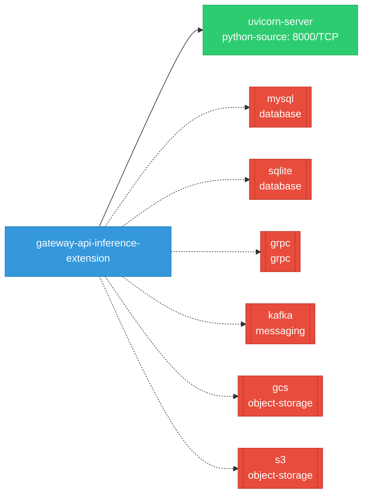

# gateway-api-inference-extension: Network

## Service Map

### Services

| Name | Type | Ports | Source |
|------|------|-------|--------|
| uvicorn-server | python-source | 8000/TCP | [`latencypredictor/training_server.py:2171`](https://github.com/kubernetes-sigs/gateway-api-inference-extension/blob/c4c8fef6438746226ed1b7d3cab210229d687f2c/latencypredictor/training_server.py#L2171) |

### Ingress / Routing

| Kind | Name | Hosts | Paths | TLS | Source |
|------|------|-------|-------|-----|--------|
| Gateway | inference-gateway |  |  | no | [`config/manifests/gateway/agentgateway/gateway.yaml`](https://github.com/kubernetes-sigs/gateway-api-inference-extension/blob/c4c8fef6438746226ed1b7d3cab210229d687f2c/config/manifests/gateway/agentgateway/gateway.yaml) |
| Gateway | inference-gateway |  |  | no | [`config/manifests/gateway/envoyaigateway/gateway.yaml`](https://github.com/kubernetes-sigs/gateway-api-inference-extension/blob/c4c8fef6438746226ed1b7d3cab210229d687f2c/config/manifests/gateway/envoyaigateway/gateway.yaml) |
| Gateway | inference-gateway |  |  | no | [`config/manifests/gateway/gke/gateway.yaml`](https://github.com/kubernetes-sigs/gateway-api-inference-extension/blob/c4c8fef6438746226ed1b7d3cab210229d687f2c/config/manifests/gateway/gke/gateway.yaml) |
| Gateway | inference-gateway |  |  | no | [`config/manifests/gateway/istio/gateway.yaml`](https://github.com/kubernetes-sigs/gateway-api-inference-extension/blob/c4c8fef6438746226ed1b7d3cab210229d687f2c/config/manifests/gateway/istio/gateway.yaml) |
| Gateway | inference-gateway |  |  | no | [`config/manifests/gateway/nginxgatewayfabric/gateway.yaml`](https://github.com/kubernetes-sigs/gateway-api-inference-extension/blob/c4c8fef6438746226ed1b7d3cab210229d687f2c/config/manifests/gateway/nginxgatewayfabric/gateway.yaml) |

!!! warning "No Network Policies"
    No NetworkPolicy resources were found in the analyzed sources. Network policies may exist in overlays, Helm values, or cluster-level configurations not captured by static analysis.

