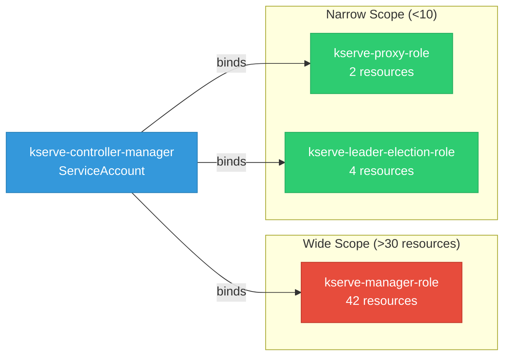

# kserve: RBAC

ServiceAccount bindings, roles, and resource permissions.

## RBAC Overview

This component defines a large RBAC surface (113 diagram lines). The graph below groups roles by permission scope.

## Bindings

Subject-to-role mappings defining who has access to what.

| Binding | Type | Role | Subject |
|---------|------|------|---------|
| kserve-manager-rolebinding | ClusterRoleBinding | kserve-manager-role | ServiceAccount/kserve-controller-manager |
| kserve-proxy-rolebinding | ClusterRoleBinding | kserve-proxy-role | ServiceAccount/kserve-controller-manager |
| kserve-leader-election-rolebinding | RoleBinding | kserve-leader-election-role | ServiceAccount/kserve-controller-manager |

## Role Details

Per-rule breakdown of API groups, resources, and verbs for each role.

| Role | Kind | API Groups | Resources | Verbs |
|------|------|------------|-----------|-------|
| kserve-manager-role | ClusterRole |  | configmaps | create, get, update |
| kserve-manager-role | ClusterRole |  | events, services | create, delete, get, list, patch, update, watch |
| kserve-manager-role | ClusterRole |  | namespaces, pods | get, list, watch |
| kserve-manager-role | ClusterRole |  | secrets, serviceaccounts | get |
| kserve-manager-role | ClusterRole |  | mutatingwebhookconfigurations, validatingwebhookconfigurations | create, delete, get, list, patch, update, watch |
| kserve-manager-role | ClusterRole |  | deployments | create, delete, get, list, patch, update, watch |
| kserve-manager-role | ClusterRole |  | horizontalpodautoscalers | create, delete, get, list, patch, update, watch |
| kserve-manager-role | ClusterRole |  | httproutes | create, delete, get, list, patch, update, watch |
| kserve-manager-role | ClusterRole |  | scaledobjects, scaledobjects/finalizers | create, delete, get, list, patch, update, watch |
| kserve-manager-role | ClusterRole |  | scaledobjects/status | get, patch, update |
| kserve-manager-role | ClusterRole |  | virtualservices, virtualservices/finalizers | create, delete, get, list, patch, update, watch |
| kserve-manager-role | ClusterRole |  | virtualservices/status | get, patch, update |
| kserve-manager-role | ClusterRole |  | ingresses | create, delete, get, list, patch, update, watch |
| kserve-manager-role | ClusterRole |  | opentelemetrycollectors, opentelemetrycollectors/finalizers | create, delete, get, list, patch, update, watch |
| kserve-manager-role | ClusterRole |  | opentelemetrycollectors/status | get, patch, update |
| kserve-manager-role | ClusterRole |  | services, services/finalizers | create, delete, get, list, patch, update, watch |
| kserve-manager-role | ClusterRole |  | services/status | get, patch, update |
| kserve-manager-role | ClusterRole |  | clusterservingruntimes, clusterservingruntimes/finalizers, clusterstoragecontainers, inferencegraphs, inferencegraphs/finalizers, inferenceservices, inferenceservices/finalizers, servingruntimes, servingruntimes/finalizers, trainedmodels | create, delete, get, list, patch, update, watch |
| kserve-manager-role | ClusterRole |  | clusterservingruntimes/status, inferencegraphs/status, inferenceservices/status, servingruntimes/status, trainedmodels/status | get, patch, update |
| kserve-manager-role | ClusterRole |  | localmodelcaches, localmodelnamespacecaches | get, list, watch |
| kserve-proxy-role | ClusterRole |  | tokenreviews | create |
| kserve-proxy-role | ClusterRole |  | subjectaccessreviews | create |
| kserve-leader-election-role | Role |  | leases | create, get, list, update |
| kserve-leader-election-role | Role |  | configmaps | get, list, watch, create, update, patch, delete |
| kserve-leader-election-role | Role |  | configmaps/status | get, update, patch |
| kserve-leader-election-role | Role |  | events | create |

### Cluster Roles

| Name | Resources | Verbs | Source |
|------|-----------|-------|--------|
| kserve-manager-role | configmaps | create, get, update | [`config/rbac/role.yaml`](https://github.com/kserve/kserve/blob/aeb623f55a396dfc7f5ca8ce5ec5d389f3b4af29/config/rbac/role.yaml) |
| kserve-manager-role | events, services | create, delete, get, list, patch, update, watch | [`config/rbac/role.yaml`](https://github.com/kserve/kserve/blob/aeb623f55a396dfc7f5ca8ce5ec5d389f3b4af29/config/rbac/role.yaml) |
| kserve-manager-role | namespaces, pods | get, list, watch | [`config/rbac/role.yaml`](https://github.com/kserve/kserve/blob/aeb623f55a396dfc7f5ca8ce5ec5d389f3b4af29/config/rbac/role.yaml) |
| kserve-manager-role | secrets, serviceaccounts | get | [`config/rbac/role.yaml`](https://github.com/kserve/kserve/blob/aeb623f55a396dfc7f5ca8ce5ec5d389f3b4af29/config/rbac/role.yaml) |
| kserve-manager-role | mutatingwebhookconfigurations, validatingwebhookconfigurations | create, delete, get, list, patch, update, watch | [`config/rbac/role.yaml`](https://github.com/kserve/kserve/blob/aeb623f55a396dfc7f5ca8ce5ec5d389f3b4af29/config/rbac/role.yaml) |
| kserve-manager-role | deployments | create, delete, get, list, patch, update, watch | [`config/rbac/role.yaml`](https://github.com/kserve/kserve/blob/aeb623f55a396dfc7f5ca8ce5ec5d389f3b4af29/config/rbac/role.yaml) |
| kserve-manager-role | horizontalpodautoscalers | create, delete, get, list, patch, update, watch | [`config/rbac/role.yaml`](https://github.com/kserve/kserve/blob/aeb623f55a396dfc7f5ca8ce5ec5d389f3b4af29/config/rbac/role.yaml) |
| kserve-manager-role | httproutes | create, delete, get, list, patch, update, watch | [`config/rbac/role.yaml`](https://github.com/kserve/kserve/blob/aeb623f55a396dfc7f5ca8ce5ec5d389f3b4af29/config/rbac/role.yaml) |
| kserve-manager-role | scaledobjects, scaledobjects/finalizers | create, delete, get, list, patch, update, watch | [`config/rbac/role.yaml`](https://github.com/kserve/kserve/blob/aeb623f55a396dfc7f5ca8ce5ec5d389f3b4af29/config/rbac/role.yaml) |
| kserve-manager-role | scaledobjects/status | get, patch, update | [`config/rbac/role.yaml`](https://github.com/kserve/kserve/blob/aeb623f55a396dfc7f5ca8ce5ec5d389f3b4af29/config/rbac/role.yaml) |
| kserve-manager-role | virtualservices, virtualservices/finalizers | create, delete, get, list, patch, update, watch | [`config/rbac/role.yaml`](https://github.com/kserve/kserve/blob/aeb623f55a396dfc7f5ca8ce5ec5d389f3b4af29/config/rbac/role.yaml) |
| kserve-manager-role | virtualservices/status | get, patch, update | [`config/rbac/role.yaml`](https://github.com/kserve/kserve/blob/aeb623f55a396dfc7f5ca8ce5ec5d389f3b4af29/config/rbac/role.yaml) |
| kserve-manager-role | ingresses | create, delete, get, list, patch, update, watch | [`config/rbac/role.yaml`](https://github.com/kserve/kserve/blob/aeb623f55a396dfc7f5ca8ce5ec5d389f3b4af29/config/rbac/role.yaml) |
| kserve-manager-role | opentelemetrycollectors, opentelemetrycollectors/finalizers | create, delete, get, list, patch, update, watch | [`config/rbac/role.yaml`](https://github.com/kserve/kserve/blob/aeb623f55a396dfc7f5ca8ce5ec5d389f3b4af29/config/rbac/role.yaml) |
| kserve-manager-role | opentelemetrycollectors/status | get, patch, update | [`config/rbac/role.yaml`](https://github.com/kserve/kserve/blob/aeb623f55a396dfc7f5ca8ce5ec5d389f3b4af29/config/rbac/role.yaml) |
| kserve-manager-role | services, services/finalizers | create, delete, get, list, patch, update, watch | [`config/rbac/role.yaml`](https://github.com/kserve/kserve/blob/aeb623f55a396dfc7f5ca8ce5ec5d389f3b4af29/config/rbac/role.yaml) |
| kserve-manager-role | services/status | get, patch, update | [`config/rbac/role.yaml`](https://github.com/kserve/kserve/blob/aeb623f55a396dfc7f5ca8ce5ec5d389f3b4af29/config/rbac/role.yaml) |
| kserve-manager-role | clusterservingruntimes, clusterservingruntimes/finalizers, clusterstoragecontainers, inferencegraphs, inferencegraphs/finalizers, inferenceservices, inferenceservices/finalizers, servingruntimes, servingruntimes/finalizers, trainedmodels | create, delete, get, list, patch, update, watch | [`config/rbac/role.yaml`](https://github.com/kserve/kserve/blob/aeb623f55a396dfc7f5ca8ce5ec5d389f3b4af29/config/rbac/role.yaml) |
| kserve-manager-role | clusterservingruntimes/status, inferencegraphs/status, inferenceservices/status, servingruntimes/status, trainedmodels/status | get, patch, update | [`config/rbac/role.yaml`](https://github.com/kserve/kserve/blob/aeb623f55a396dfc7f5ca8ce5ec5d389f3b4af29/config/rbac/role.yaml) |
| kserve-manager-role | localmodelcaches, localmodelnamespacecaches | get, list, watch | [`config/rbac/role.yaml`](https://github.com/kserve/kserve/blob/aeb623f55a396dfc7f5ca8ce5ec5d389f3b4af29/config/rbac/role.yaml) |
| kserve-proxy-role | tokenreviews | create | [`config/rbac/auth_proxy_role.yaml`](https://github.com/kserve/kserve/blob/aeb623f55a396dfc7f5ca8ce5ec5d389f3b4af29/config/rbac/auth_proxy_role.yaml) |
| kserve-proxy-role | subjectaccessreviews | create | [`config/rbac/auth_proxy_role.yaml`](https://github.com/kserve/kserve/blob/aeb623f55a396dfc7f5ca8ce5ec5d389f3b4af29/config/rbac/auth_proxy_role.yaml) |

### Kubebuilder RBAC Markers

Kubebuilder `+kubebuilder:rbac` markers declare the RBAC requirements of controller reconcilers. These are the source of truth for generated ClusterRole manifests. 74 markers found.

| File | Line | Groups | Resources | Verbs |
|------|------|--------|-----------|-------|
| [`.gomod-cache/github.com/open-telemetry/opentelemetry-operator@v0.113.0/controllers/opampbridge_controller.go:75`](https://github.com/kserve/kserve/blob/aeb623f55a396dfc7f5ca8ce5ec5d389f3b4af29/.gomod-cache/github.com/open-telemetry/opentelemetry-operator@v0.113.0/controllers/opampbridge_controller.go#L75) | 75 | opentelemetry.io | opampbridges | get, list, watch, create, update, patch, delete |
| [`.gomod-cache/github.com/open-telemetry/opentelemetry-operator@v0.113.0/controllers/opampbridge_controller.go:76`](https://github.com/kserve/kserve/blob/aeb623f55a396dfc7f5ca8ce5ec5d389f3b4af29/.gomod-cache/github.com/open-telemetry/opentelemetry-operator@v0.113.0/controllers/opampbridge_controller.go#L76) | 76 | opentelemetry.io | opampbridges/status | get, update, patch |
| [`.gomod-cache/github.com/open-telemetry/opentelemetry-operator@v0.113.0/controllers/opampbridge_controller.go:77`](https://github.com/kserve/kserve/blob/aeb623f55a396dfc7f5ca8ce5ec5d389f3b4af29/.gomod-cache/github.com/open-telemetry/opentelemetry-operator@v0.113.0/controllers/opampbridge_controller.go#L77) | 77 | opentelemetry.io | opampbridges/finalizers | update |
| [`.gomod-cache/sigs.k8s.io/lws@v0.8.0/pkg/cert/cert.go:31`](https://github.com/kserve/kserve/blob/aeb623f55a396dfc7f5ca8ce5ec5d389f3b4af29/.gomod-cache/sigs.k8s.io/lws@v0.8.0/pkg/cert/cert.go#L31) | 31 | "" | secrets | get, list, watch, update |
| [`.gomod-cache/sigs.k8s.io/lws@v0.8.0/pkg/cert/cert.go:32`](https://github.com/kserve/kserve/blob/aeb623f55a396dfc7f5ca8ce5ec5d389f3b4af29/.gomod-cache/sigs.k8s.io/lws@v0.8.0/pkg/cert/cert.go#L32) | 32 | "admissionregistration.k8s.io" | mutatingwebhookconfigurations | get, list, watch, update |
| [`.gomod-cache/sigs.k8s.io/lws@v0.8.0/pkg/cert/cert.go:33`](https://github.com/kserve/kserve/blob/aeb623f55a396dfc7f5ca8ce5ec5d389f3b4af29/.gomod-cache/sigs.k8s.io/lws@v0.8.0/pkg/cert/cert.go#L33) | 33 | "admissionregistration.k8s.io" | validatingwebhookconfigurations | get, list, watch, update |
| [`.gomod-cache/sigs.k8s.io/lws@v0.8.0/pkg/controllers/leaderworkerset_controller.go:85`](https://github.com/kserve/kserve/blob/aeb623f55a396dfc7f5ca8ce5ec5d389f3b4af29/.gomod-cache/sigs.k8s.io/lws@v0.8.0/pkg/controllers/leaderworkerset_controller.go#L85) | 85 | "" | events | create, watch, update, patch |
| [`.gomod-cache/sigs.k8s.io/lws@v0.8.0/pkg/controllers/leaderworkerset_controller.go:86`](https://github.com/kserve/kserve/blob/aeb623f55a396dfc7f5ca8ce5ec5d389f3b4af29/.gomod-cache/sigs.k8s.io/lws@v0.8.0/pkg/controllers/leaderworkerset_controller.go#L86) | 86 | leaderworkerset.x-k8s.io | leaderworkersets | get, list, watch, create, update, patch, delete |
| [`.gomod-cache/sigs.k8s.io/lws@v0.8.0/pkg/controllers/leaderworkerset_controller.go:87`](https://github.com/kserve/kserve/blob/aeb623f55a396dfc7f5ca8ce5ec5d389f3b4af29/.gomod-cache/sigs.k8s.io/lws@v0.8.0/pkg/controllers/leaderworkerset_controller.go#L87) | 87 | leaderworkerset.x-k8s.io | leaderworkersets/status | get, update, patch |
| [`.gomod-cache/sigs.k8s.io/lws@v0.8.0/pkg/controllers/leaderworkerset_controller.go:88`](https://github.com/kserve/kserve/blob/aeb623f55a396dfc7f5ca8ce5ec5d389f3b4af29/.gomod-cache/sigs.k8s.io/lws@v0.8.0/pkg/controllers/leaderworkerset_controller.go#L88) | 88 | leaderworkerset.x-k8s.io | leaderworkersets/finalizers | update |
| [`.gomod-cache/sigs.k8s.io/lws@v0.8.0/pkg/controllers/leaderworkerset_controller.go:89`](https://github.com/kserve/kserve/blob/aeb623f55a396dfc7f5ca8ce5ec5d389f3b4af29/.gomod-cache/sigs.k8s.io/lws@v0.8.0/pkg/controllers/leaderworkerset_controller.go#L89) | 89 | apps | statefulsets | get, list, watch, create, update, patch, delete |
| [`.gomod-cache/sigs.k8s.io/lws@v0.8.0/pkg/controllers/leaderworkerset_controller.go:90`](https://github.com/kserve/kserve/blob/aeb623f55a396dfc7f5ca8ce5ec5d389f3b4af29/.gomod-cache/sigs.k8s.io/lws@v0.8.0/pkg/controllers/leaderworkerset_controller.go#L90) | 90 | apps | statefulsets/status | get, update, patch |
| [`.gomod-cache/sigs.k8s.io/lws@v0.8.0/pkg/controllers/leaderworkerset_controller.go:91`](https://github.com/kserve/kserve/blob/aeb623f55a396dfc7f5ca8ce5ec5d389f3b4af29/.gomod-cache/sigs.k8s.io/lws@v0.8.0/pkg/controllers/leaderworkerset_controller.go#L91) | 91 | apps | statefulsets/finalizers | update |
| [`.gomod-cache/sigs.k8s.io/lws@v0.8.0/pkg/controllers/leaderworkerset_controller.go:92`](https://github.com/kserve/kserve/blob/aeb623f55a396dfc7f5ca8ce5ec5d389f3b4af29/.gomod-cache/sigs.k8s.io/lws@v0.8.0/pkg/controllers/leaderworkerset_controller.go#L92) | 92 | core | services | get, list, watch, create, update, patch, delete |
| [`.gomod-cache/sigs.k8s.io/lws@v0.8.0/pkg/controllers/leaderworkerset_controller.go:93`](https://github.com/kserve/kserve/blob/aeb623f55a396dfc7f5ca8ce5ec5d389f3b4af29/.gomod-cache/sigs.k8s.io/lws@v0.8.0/pkg/controllers/leaderworkerset_controller.go#L93) | 93 | core | events | get, list, watch, create, patch |
| [`.gomod-cache/sigs.k8s.io/lws@v0.8.0/pkg/controllers/leaderworkerset_controller.go:94`](https://github.com/kserve/kserve/blob/aeb623f55a396dfc7f5ca8ce5ec5d389f3b4af29/.gomod-cache/sigs.k8s.io/lws@v0.8.0/pkg/controllers/leaderworkerset_controller.go#L94) | 94 | apps | controllerrevisions | get, list, watch, create, update, patch, delete |
| [`.gomod-cache/sigs.k8s.io/lws@v0.8.0/pkg/controllers/leaderworkerset_controller.go:95`](https://github.com/kserve/kserve/blob/aeb623f55a396dfc7f5ca8ce5ec5d389f3b4af29/.gomod-cache/sigs.k8s.io/lws@v0.8.0/pkg/controllers/leaderworkerset_controller.go#L95) | 95 | apps | controllerrevisions/status | get, update, patch |
| [`.gomod-cache/sigs.k8s.io/lws@v0.8.0/pkg/controllers/leaderworkerset_controller.go:96`](https://github.com/kserve/kserve/blob/aeb623f55a396dfc7f5ca8ce5ec5d389f3b4af29/.gomod-cache/sigs.k8s.io/lws@v0.8.0/pkg/controllers/leaderworkerset_controller.go#L96) | 96 | apps | controllerrevisions/finalizers | update |
| [`.gomod-cache/sigs.k8s.io/lws@v0.8.0/pkg/controllers/pod_controller.go:63`](https://github.com/kserve/kserve/blob/aeb623f55a396dfc7f5ca8ce5ec5d389f3b4af29/.gomod-cache/sigs.k8s.io/lws@v0.8.0/pkg/controllers/pod_controller.go#L63) | 63 | "" | events | create, watch, update, patch |
| [`.gomod-cache/sigs.k8s.io/lws@v0.8.0/pkg/controllers/pod_controller.go:64`](https://github.com/kserve/kserve/blob/aeb623f55a396dfc7f5ca8ce5ec5d389f3b4af29/.gomod-cache/sigs.k8s.io/lws@v0.8.0/pkg/controllers/pod_controller.go#L64) | 64 | core | pods | create, delete, get, list, patch, update, watch |
| [`.gomod-cache/sigs.k8s.io/lws@v0.8.0/pkg/controllers/pod_controller.go:65`](https://github.com/kserve/kserve/blob/aeb623f55a396dfc7f5ca8ce5ec5d389f3b4af29/.gomod-cache/sigs.k8s.io/lws@v0.8.0/pkg/controllers/pod_controller.go#L65) | 65 | core | pods/finalizers | update |
| [`.gomod-cache/sigs.k8s.io/lws@v0.8.0/pkg/controllers/pod_controller.go:66`](https://github.com/kserve/kserve/blob/aeb623f55a396dfc7f5ca8ce5ec5d389f3b4af29/.gomod-cache/sigs.k8s.io/lws@v0.8.0/pkg/controllers/pod_controller.go#L66) | 66 | core | nodes | get, list, watch, update, patch |
| [`.gopath-loader/pkg/mod/github.com/open-telemetry/opentelemetry-operator@v0.113.0/controllers/opampbridge_controller.go:75`](https://github.com/kserve/kserve/blob/aeb623f55a396dfc7f5ca8ce5ec5d389f3b4af29/.gopath-loader/pkg/mod/github.com/open-telemetry/opentelemetry-operator@v0.113.0/controllers/opampbridge_controller.go#L75) | 75 | opentelemetry.io | opampbridges | get, list, watch, create, update, patch, delete |
| [`.gopath-loader/pkg/mod/github.com/open-telemetry/opentelemetry-operator@v0.113.0/controllers/opampbridge_controller.go:76`](https://github.com/kserve/kserve/blob/aeb623f55a396dfc7f5ca8ce5ec5d389f3b4af29/.gopath-loader/pkg/mod/github.com/open-telemetry/opentelemetry-operator@v0.113.0/controllers/opampbridge_controller.go#L76) | 76 | opentelemetry.io | opampbridges/status | get, update, patch |
| [`.gopath-loader/pkg/mod/github.com/open-telemetry/opentelemetry-operator@v0.113.0/controllers/opampbridge_controller.go:77`](https://github.com/kserve/kserve/blob/aeb623f55a396dfc7f5ca8ce5ec5d389f3b4af29/.gopath-loader/pkg/mod/github.com/open-telemetry/opentelemetry-operator@v0.113.0/controllers/opampbridge_controller.go#L77) | 77 | opentelemetry.io | opampbridges/finalizers | update |
| [`.gopath-loader/pkg/mod/sigs.k8s.io/lws@v0.8.0/pkg/cert/cert.go:31`](https://github.com/kserve/kserve/blob/aeb623f55a396dfc7f5ca8ce5ec5d389f3b4af29/.gopath-loader/pkg/mod/sigs.k8s.io/lws@v0.8.0/pkg/cert/cert.go#L31) | 31 | "" | secrets | get, list, watch, update |
| [`.gopath-loader/pkg/mod/sigs.k8s.io/lws@v0.8.0/pkg/cert/cert.go:32`](https://github.com/kserve/kserve/blob/aeb623f55a396dfc7f5ca8ce5ec5d389f3b4af29/.gopath-loader/pkg/mod/sigs.k8s.io/lws@v0.8.0/pkg/cert/cert.go#L32) | 32 | "admissionregistration.k8s.io" | mutatingwebhookconfigurations | get, list, watch, update |
| [`.gopath-loader/pkg/mod/sigs.k8s.io/lws@v0.8.0/pkg/cert/cert.go:33`](https://github.com/kserve/kserve/blob/aeb623f55a396dfc7f5ca8ce5ec5d389f3b4af29/.gopath-loader/pkg/mod/sigs.k8s.io/lws@v0.8.0/pkg/cert/cert.go#L33) | 33 | "admissionregistration.k8s.io" | validatingwebhookconfigurations | get, list, watch, update |
| [`.gopath-loader/pkg/mod/sigs.k8s.io/lws@v0.8.0/pkg/controllers/leaderworkerset_controller.go:85`](https://github.com/kserve/kserve/blob/aeb623f55a396dfc7f5ca8ce5ec5d389f3b4af29/.gopath-loader/pkg/mod/sigs.k8s.io/lws@v0.8.0/pkg/controllers/leaderworkerset_controller.go#L85) | 85 | "" | events | create, watch, update, patch |
| [`.gopath-loader/pkg/mod/sigs.k8s.io/lws@v0.8.0/pkg/controllers/leaderworkerset_controller.go:86`](https://github.com/kserve/kserve/blob/aeb623f55a396dfc7f5ca8ce5ec5d389f3b4af29/.gopath-loader/pkg/mod/sigs.k8s.io/lws@v0.8.0/pkg/controllers/leaderworkerset_controller.go#L86) | 86 | leaderworkerset.x-k8s.io | leaderworkersets | get, list, watch, create, update, patch, delete |
| [`.gopath-loader/pkg/mod/sigs.k8s.io/lws@v0.8.0/pkg/controllers/leaderworkerset_controller.go:87`](https://github.com/kserve/kserve/blob/aeb623f55a396dfc7f5ca8ce5ec5d389f3b4af29/.gopath-loader/pkg/mod/sigs.k8s.io/lws@v0.8.0/pkg/controllers/leaderworkerset_controller.go#L87) | 87 | leaderworkerset.x-k8s.io | leaderworkersets/status | get, update, patch |
| [`.gopath-loader/pkg/mod/sigs.k8s.io/lws@v0.8.0/pkg/controllers/leaderworkerset_controller.go:88`](https://github.com/kserve/kserve/blob/aeb623f55a396dfc7f5ca8ce5ec5d389f3b4af29/.gopath-loader/pkg/mod/sigs.k8s.io/lws@v0.8.0/pkg/controllers/leaderworkerset_controller.go#L88) | 88 | leaderworkerset.x-k8s.io | leaderworkersets/finalizers | update |
| [`.gopath-loader/pkg/mod/sigs.k8s.io/lws@v0.8.0/pkg/controllers/leaderworkerset_controller.go:89`](https://github.com/kserve/kserve/blob/aeb623f55a396dfc7f5ca8ce5ec5d389f3b4af29/.gopath-loader/pkg/mod/sigs.k8s.io/lws@v0.8.0/pkg/controllers/leaderworkerset_controller.go#L89) | 89 | apps | statefulsets | get, list, watch, create, update, patch, delete |
| [`.gopath-loader/pkg/mod/sigs.k8s.io/lws@v0.8.0/pkg/controllers/leaderworkerset_controller.go:90`](https://github.com/kserve/kserve/blob/aeb623f55a396dfc7f5ca8ce5ec5d389f3b4af29/.gopath-loader/pkg/mod/sigs.k8s.io/lws@v0.8.0/pkg/controllers/leaderworkerset_controller.go#L90) | 90 | apps | statefulsets/status | get, update, patch |
| [`.gopath-loader/pkg/mod/sigs.k8s.io/lws@v0.8.0/pkg/controllers/leaderworkerset_controller.go:91`](https://github.com/kserve/kserve/blob/aeb623f55a396dfc7f5ca8ce5ec5d389f3b4af29/.gopath-loader/pkg/mod/sigs.k8s.io/lws@v0.8.0/pkg/controllers/leaderworkerset_controller.go#L91) | 91 | apps | statefulsets/finalizers | update |
| [`.gopath-loader/pkg/mod/sigs.k8s.io/lws@v0.8.0/pkg/controllers/leaderworkerset_controller.go:92`](https://github.com/kserve/kserve/blob/aeb623f55a396dfc7f5ca8ce5ec5d389f3b4af29/.gopath-loader/pkg/mod/sigs.k8s.io/lws@v0.8.0/pkg/controllers/leaderworkerset_controller.go#L92) | 92 | core | services | get, list, watch, create, update, patch, delete |
| [`.gopath-loader/pkg/mod/sigs.k8s.io/lws@v0.8.0/pkg/controllers/leaderworkerset_controller.go:93`](https://github.com/kserve/kserve/blob/aeb623f55a396dfc7f5ca8ce5ec5d389f3b4af29/.gopath-loader/pkg/mod/sigs.k8s.io/lws@v0.8.0/pkg/controllers/leaderworkerset_controller.go#L93) | 93 | core | events | get, list, watch, create, patch |
| [`.gopath-loader/pkg/mod/sigs.k8s.io/lws@v0.8.0/pkg/controllers/leaderworkerset_controller.go:94`](https://github.com/kserve/kserve/blob/aeb623f55a396dfc7f5ca8ce5ec5d389f3b4af29/.gopath-loader/pkg/mod/sigs.k8s.io/lws@v0.8.0/pkg/controllers/leaderworkerset_controller.go#L94) | 94 | apps | controllerrevisions | get, list, watch, create, update, patch, delete |
| [`.gopath-loader/pkg/mod/sigs.k8s.io/lws@v0.8.0/pkg/controllers/leaderworkerset_controller.go:95`](https://github.com/kserve/kserve/blob/aeb623f55a396dfc7f5ca8ce5ec5d389f3b4af29/.gopath-loader/pkg/mod/sigs.k8s.io/lws@v0.8.0/pkg/controllers/leaderworkerset_controller.go#L95) | 95 | apps | controllerrevisions/status | get, update, patch |
| [`.gopath-loader/pkg/mod/sigs.k8s.io/lws@v0.8.0/pkg/controllers/leaderworkerset_controller.go:96`](https://github.com/kserve/kserve/blob/aeb623f55a396dfc7f5ca8ce5ec5d389f3b4af29/.gopath-loader/pkg/mod/sigs.k8s.io/lws@v0.8.0/pkg/controllers/leaderworkerset_controller.go#L96) | 96 | apps | controllerrevisions/finalizers | update |
| [`.gopath-loader/pkg/mod/sigs.k8s.io/lws@v0.8.0/pkg/controllers/pod_controller.go:63`](https://github.com/kserve/kserve/blob/aeb623f55a396dfc7f5ca8ce5ec5d389f3b4af29/.gopath-loader/pkg/mod/sigs.k8s.io/lws@v0.8.0/pkg/controllers/pod_controller.go#L63) | 63 | "" | events | create, watch, update, patch |
| [`.gopath-loader/pkg/mod/sigs.k8s.io/lws@v0.8.0/pkg/controllers/pod_controller.go:64`](https://github.com/kserve/kserve/blob/aeb623f55a396dfc7f5ca8ce5ec5d389f3b4af29/.gopath-loader/pkg/mod/sigs.k8s.io/lws@v0.8.0/pkg/controllers/pod_controller.go#L64) | 64 | core | pods | create, delete, get, list, patch, update, watch |
| [`.gopath-loader/pkg/mod/sigs.k8s.io/lws@v0.8.0/pkg/controllers/pod_controller.go:65`](https://github.com/kserve/kserve/blob/aeb623f55a396dfc7f5ca8ce5ec5d389f3b4af29/.gopath-loader/pkg/mod/sigs.k8s.io/lws@v0.8.0/pkg/controllers/pod_controller.go#L65) | 65 | core | pods/finalizers | update |
| [`.gopath-loader/pkg/mod/sigs.k8s.io/lws@v0.8.0/pkg/controllers/pod_controller.go:66`](https://github.com/kserve/kserve/blob/aeb623f55a396dfc7f5ca8ce5ec5d389f3b4af29/.gopath-loader/pkg/mod/sigs.k8s.io/lws@v0.8.0/pkg/controllers/pod_controller.go#L66) | 66 | core | nodes | get, list, watch, update, patch |
| [`pkg/controller/v1alpha2/llmisvc/controller.go:98`](https://github.com/kserve/kserve/blob/aeb623f55a396dfc7f5ca8ce5ec5d389f3b4af29/pkg/controller/v1alpha2/llmisvc/controller.go#L98) | 98 | serving.kserve.io | llminferenceservices | get, list, watch, create, update, patch, delete |
| [`pkg/controller/v1alpha2/llmisvc/controller.go:99`](https://github.com/kserve/kserve/blob/aeb623f55a396dfc7f5ca8ce5ec5d389f3b4af29/pkg/controller/v1alpha2/llmisvc/controller.go#L99) | 99 | serving.kserve.io | llminferenceservices/status | get, update, patch |
| [`pkg/controller/v1alpha2/llmisvc/controller.go:100`](https://github.com/kserve/kserve/blob/aeb623f55a396dfc7f5ca8ce5ec5d389f3b4af29/pkg/controller/v1alpha2/llmisvc/controller.go#L100) | 100 | serving.kserve.io | llminferenceservices/finalizers | update |
| [`pkg/controller/v1alpha2/llmisvc/controller.go:101`](https://github.com/kserve/kserve/blob/aeb623f55a396dfc7f5ca8ce5ec5d389f3b4af29/pkg/controller/v1alpha2/llmisvc/controller.go#L101) | 101 | serving.kserve.io | llminferenceserviceconfigs | get, list, watch, create, update, patch, delete |
| [`pkg/controller/v1alpha2/llmisvc/controller.go:102`](https://github.com/kserve/kserve/blob/aeb623f55a396dfc7f5ca8ce5ec5d389f3b4af29/pkg/controller/v1alpha2/llmisvc/controller.go#L102) | 102 | serving.kserve.io | llminferenceserviceconfigs/finalizers | update |
| [`pkg/controller/v1alpha2/llmisvc/controller.go:103`](https://github.com/kserve/kserve/blob/aeb623f55a396dfc7f5ca8ce5ec5d389f3b4af29/pkg/controller/v1alpha2/llmisvc/controller.go#L103) | 103 | apps | deployments | get, list, watch, create, update, patch, delete |
| [`pkg/controller/v1alpha2/llmisvc/controller.go:104`](https://github.com/kserve/kserve/blob/aeb623f55a396dfc7f5ca8ce5ec5d389f3b4af29/pkg/controller/v1alpha2/llmisvc/controller.go#L104) | 104 | leaderworkerset.x-k8s.io | leaderworkersets | get, list, watch, create, update, patch, delete |
| [`pkg/controller/v1alpha2/llmisvc/controller.go:105`](https://github.com/kserve/kserve/blob/aeb623f55a396dfc7f5ca8ce5ec5d389f3b4af29/pkg/controller/v1alpha2/llmisvc/controller.go#L105) | 105 | core | services | get, list, watch, create, update, patch, delete |
| [`pkg/controller/v1alpha2/llmisvc/controller.go:106`](https://github.com/kserve/kserve/blob/aeb623f55a396dfc7f5ca8ce5ec5d389f3b4af29/pkg/controller/v1alpha2/llmisvc/controller.go#L106) | 106 | core | secrets | get, list, watch, create, update, patch, delete |
| [`pkg/controller/v1alpha2/llmisvc/controller.go:107`](https://github.com/kserve/kserve/blob/aeb623f55a396dfc7f5ca8ce5ec5d389f3b4af29/pkg/controller/v1alpha2/llmisvc/controller.go#L107) | 107 | networking.k8s.io | ingresses | get, list, watch, create, update, patch, delete |
| [`pkg/controller/v1alpha2/llmisvc/controller.go:108`](https://github.com/kserve/kserve/blob/aeb623f55a396dfc7f5ca8ce5ec5d389f3b4af29/pkg/controller/v1alpha2/llmisvc/controller.go#L108) | 108 | gateway.networking.k8s.io | httproutes, gateways, gatewayclasses | get, list, watch, create, update, patch, delete |
| [`pkg/controller/v1alpha2/llmisvc/controller.go:109`](https://github.com/kserve/kserve/blob/aeb623f55a396dfc7f5ca8ce5ec5d389f3b4af29/pkg/controller/v1alpha2/llmisvc/controller.go#L109) | 109 | inference.networking.x-k8s.io | inferencepools, inferenceobjectives, inferencemodels, inferencemodelrewrites, inferencepoolimports | get, list, watch, create, update, patch, delete |
| [`pkg/controller/v1alpha2/llmisvc/controller.go:110`](https://github.com/kserve/kserve/blob/aeb623f55a396dfc7f5ca8ce5ec5d389f3b4af29/pkg/controller/v1alpha2/llmisvc/controller.go#L110) | 110 | inference.networking.k8s.io | inferencepools, inferenceobjectives, inferencemodels | get, list, watch, create, update, patch, delete |
| [`pkg/controller/v1alpha2/llmisvc/controller.go:111`](https://github.com/kserve/kserve/blob/aeb623f55a396dfc7f5ca8ce5ec5d389f3b4af29/pkg/controller/v1alpha2/llmisvc/controller.go#L111) | 111 | core | pods | get, list, watch |
| [`pkg/controller/v1alpha2/llmisvc/controller.go:112`](https://github.com/kserve/kserve/blob/aeb623f55a396dfc7f5ca8ce5ec5d389f3b4af29/pkg/controller/v1alpha2/llmisvc/controller.go#L112) | 112 | core | serviceaccounts | get, list, watch, create, update, patch, delete |
| [`pkg/controller/v1alpha2/llmisvc/controller.go:113`](https://github.com/kserve/kserve/blob/aeb623f55a396dfc7f5ca8ce5ec5d389f3b4af29/pkg/controller/v1alpha2/llmisvc/controller.go#L113) | 113 | rbac.authorization.k8s.io | roles, rolebindings, clusterrolebindings | get, list, watch, create, update, patch, delete |
| [`pkg/controller/v1alpha2/llmisvc/controller.go:114`](https://github.com/kserve/kserve/blob/aeb623f55a396dfc7f5ca8ce5ec5d389f3b4af29/pkg/controller/v1alpha2/llmisvc/controller.go#L114) | 114 | discovery.k8s.io | endpointslices | get, list, watch |
| [`pkg/controller/v1alpha2/llmisvc/controller.go:115`](https://github.com/kserve/kserve/blob/aeb623f55a396dfc7f5ca8ce5ec5d389f3b4af29/pkg/controller/v1alpha2/llmisvc/controller.go#L115) | 115 | authentication.k8s.io | tokenreviews, subjectaccessreviews | create |
| [`pkg/controller/v1alpha2/llmisvc/controller.go:116`](https://github.com/kserve/kserve/blob/aeb623f55a396dfc7f5ca8ce5ec5d389f3b4af29/pkg/controller/v1alpha2/llmisvc/controller.go#L116) | 116 |  |  | get |
| [`pkg/controller/v1alpha2/llmisvc/controller.go:117`](https://github.com/kserve/kserve/blob/aeb623f55a396dfc7f5ca8ce5ec5d389f3b4af29/pkg/controller/v1alpha2/llmisvc/controller.go#L117) | 117 | "" | events | create, patch, update |
| [`pkg/controller/v1alpha2/llmisvc/controller.go:118`](https://github.com/kserve/kserve/blob/aeb623f55a396dfc7f5ca8ce5ec5d389f3b4af29/pkg/controller/v1alpha2/llmisvc/controller.go#L118) | 118 | "" | configmaps | get, list, watch |
| [`pkg/controller/v1alpha2/llmisvc/controller.go:119`](https://github.com/kserve/kserve/blob/aeb623f55a396dfc7f5ca8ce5ec5d389f3b4af29/pkg/controller/v1alpha2/llmisvc/controller.go#L119) | 119 | apiextensions.k8s.io | customresourcedefinitions | get, list, watch |
| [`pkg/controller/v1alpha2/llmisvc/controller.go:120`](https://github.com/kserve/kserve/blob/aeb623f55a396dfc7f5ca8ce5ec5d389f3b4af29/pkg/controller/v1alpha2/llmisvc/controller.go#L120) | 120 | apiextensions.k8s.io | customresourcedefinitions/status | update, patch |
| [`pkg/controller/v1alpha2/llmisvc/controller.go:121`](https://github.com/kserve/kserve/blob/aeb623f55a396dfc7f5ca8ce5ec5d389f3b4af29/pkg/controller/v1alpha2/llmisvc/controller.go#L121) | 121 | authorization.k8s.io | subjectaccessreviews | create |
| [`pkg/controller/v1alpha2/llmisvc/controller.go:122`](https://github.com/kserve/kserve/blob/aeb623f55a396dfc7f5ca8ce5ec5d389f3b4af29/pkg/controller/v1alpha2/llmisvc/controller.go#L122) | 122 | autoscaling | horizontalpodautoscalers | get, list, watch, create, update, patch, delete |
| [`pkg/controller/v1alpha2/llmisvc/controller.go:123`](https://github.com/kserve/kserve/blob/aeb623f55a396dfc7f5ca8ce5ec5d389f3b4af29/pkg/controller/v1alpha2/llmisvc/controller.go#L123) | 123 | llmd.ai | variantautoscalings | get, list, watch, create, update, patch, delete |
| [`pkg/controller/v1alpha2/llmisvc/controller.go:124`](https://github.com/kserve/kserve/blob/aeb623f55a396dfc7f5ca8ce5ec5d389f3b4af29/pkg/controller/v1alpha2/llmisvc/controller.go#L124) | 124 | keda.sh | scaledobjects | get, list, watch, create, update, patch, delete |
| [`pkg/controller/v1alpha2/llmisvc/controller.go:125`](https://github.com/kserve/kserve/blob/aeb623f55a396dfc7f5ca8ce5ec5d389f3b4af29/pkg/controller/v1alpha2/llmisvc/controller.go#L125) | 125 | serving.kserve.io | localmodelcaches | get, list, watch |
| [`pkg/controller/v1alpha2/llmisvc/controller.go:126`](https://github.com/kserve/kserve/blob/aeb623f55a396dfc7f5ca8ce5ec5d389f3b4af29/pkg/controller/v1alpha2/llmisvc/controller.go#L126) | 126 | serving.kserve.io | localmodelnamespacecaches | get, list, watch |
| [`pkg/controller/v1alpha2/llmisvc/controller.go:127`](https://github.com/kserve/kserve/blob/aeb623f55a396dfc7f5ca8ce5ec5d389f3b4af29/pkg/controller/v1alpha2/llmisvc/controller.go#L127) | 127 | coordination.k8s.io | leases | get, list, watch, create, update, patch, delete |

