# kserve-autogluon-server: Dataflow

## Controller Watches

Kubernetes resources this controller monitors for changes. Each watch triggers reconciliation when the watched resource is created, updated, or deleted.

| Type | GVK | Source |
|------|-----|--------|
| For | /v1/ConfigMap | [`.gomod-cache/sigs.k8s.io/gateway-api-inference-extension@v1.3.0/pkg/bbr/controller/configmap_reconciler.go:63`](https://github.com/kserve/kserve-autogluon-server/blob/a76f496ab482e0d89662855bb12f11f8b8b4b96b/.gomod-cache/sigs.k8s.io/gateway-api-inference-extension@v1.3.0/pkg/bbr/controller/configmap_reconciler.go#L63) |
| For | /v1/ConfigMap | [`.gomod-cache/github.com/llm-d/llm-d-workload-variant-autoscaler@v0.5.1/internal/controller/configmap_reconciler.go:104`](https://github.com/kserve/kserve-autogluon-server/blob/a76f496ab482e0d89662855bb12f11f8b8b4b96b/.gomod-cache/github.com/llm-d/llm-d-workload-variant-autoscaler@v0.5.1/internal/controller/configmap_reconciler.go#L104) |
| For | /v1/ConfigMap | [`.gopath-loader/pkg/mod/sigs.k8s.io/gateway-api-inference-extension@v1.3.0/pkg/bbr/controller/configmap_reconciler.go:63`](https://github.com/kserve/kserve-autogluon-server/blob/a76f496ab482e0d89662855bb12f11f8b8b4b96b/.gopath-loader/pkg/mod/sigs.k8s.io/gateway-api-inference-extension@v1.3.0/pkg/bbr/controller/configmap_reconciler.go#L63) |
| For | /v1/ConfigMap | [`.gopath-loader/pkg/mod/github.com/llm-d/llm-d-workload-variant-autoscaler@v0.5.1/internal/controller/configmap_reconciler.go:104`](https://github.com/kserve/kserve-autogluon-server/blob/a76f496ab482e0d89662855bb12f11f8b8b4b96b/.gopath-loader/pkg/mod/github.com/llm-d/llm-d-workload-variant-autoscaler@v0.5.1/internal/controller/configmap_reconciler.go#L104) |
| For | /v1/Pod | [`.gomod-cache/sigs.k8s.io/lws@v0.7.0/pkg/controllers/pod_controller.go:367`](https://github.com/kserve/kserve-autogluon-server/blob/a76f496ab482e0d89662855bb12f11f8b8b4b96b/.gomod-cache/sigs.k8s.io/lws@v0.7.0/pkg/controllers/pod_controller.go#L367) |
| For | /v1/Pod | [`.gopath-loader/pkg/mod/sigs.k8s.io/gateway-api-inference-extension@v1.3.0/pkg/epp/controller/pod_reconciler.go:86`](https://github.com/kserve/kserve-autogluon-server/blob/a76f496ab482e0d89662855bb12f11f8b8b4b96b/.gopath-loader/pkg/mod/sigs.k8s.io/gateway-api-inference-extension@v1.3.0/pkg/epp/controller/pod_reconciler.go#L86) |
| For | /v1/Pod | [`.gopath-loader/pkg/mod/sigs.k8s.io/lws@v0.7.0/pkg/controllers/pod_controller.go:367`](https://github.com/kserve/kserve-autogluon-server/blob/a76f496ab482e0d89662855bb12f11f8b8b4b96b/.gopath-loader/pkg/mod/sigs.k8s.io/lws@v0.7.0/pkg/controllers/pod_controller.go#L367) |
| For | /v1/Pod | [`.gomod-cache/sigs.k8s.io/gateway-api-inference-extension@v1.3.0/pkg/epp/controller/pod_reconciler.go:86`](https://github.com/kserve/kserve-autogluon-server/blob/a76f496ab482e0d89662855bb12f11f8b8b4b96b/.gomod-cache/sigs.k8s.io/gateway-api-inference-extension@v1.3.0/pkg/epp/controller/pod_reconciler.go#L86) |
| For | api/v1/InferencePool | [`.gomod-cache/github.com/llm-d/llm-d-workload-variant-autoscaler@v0.5.1/internal/controller/inferencepool_reconciler.go:113`](https://github.com/kserve/kserve-autogluon-server/blob/a76f496ab482e0d89662855bb12f11f8b8b4b96b/.gomod-cache/github.com/llm-d/llm-d-workload-variant-autoscaler@v0.5.1/internal/controller/inferencepool_reconciler.go#L113) |
| For | api/v1/InferencePool | [`.gopath-loader/pkg/mod/sigs.k8s.io/gateway-api-inference-extension@v1.3.0/pkg/epp/controller/inferencepool_reconciler.go:105`](https://github.com/kserve/kserve-autogluon-server/blob/a76f496ab482e0d89662855bb12f11f8b8b4b96b/.gopath-loader/pkg/mod/sigs.k8s.io/gateway-api-inference-extension@v1.3.0/pkg/epp/controller/inferencepool_reconciler.go#L105) |
| For | api/v1/InferencePool | [`.gopath-loader/pkg/mod/github.com/llm-d/llm-d-workload-variant-autoscaler@v0.5.1/internal/controller/inferencepool_reconciler.go:113`](https://github.com/kserve/kserve-autogluon-server/blob/a76f496ab482e0d89662855bb12f11f8b8b4b96b/.gopath-loader/pkg/mod/github.com/llm-d/llm-d-workload-variant-autoscaler@v0.5.1/internal/controller/inferencepool_reconciler.go#L113) |
| For | api/v1/InferencePool | [`.gomod-cache/sigs.k8s.io/gateway-api-inference-extension@v1.3.0/pkg/epp/controller/inferencepool_reconciler.go:105`](https://github.com/kserve/kserve-autogluon-server/blob/a76f496ab482e0d89662855bb12f11f8b8b4b96b/.gomod-cache/sigs.k8s.io/gateway-api-inference-extension@v1.3.0/pkg/epp/controller/inferencepool_reconciler.go#L105) |
| For | api/v1alpha1/VariantAutoscaling | [`.gomod-cache/github.com/llm-d/llm-d-workload-variant-autoscaler@v0.5.1/internal/controller/variantautoscaling_controller.go:273`](https://github.com/kserve/kserve-autogluon-server/blob/a76f496ab482e0d89662855bb12f11f8b8b4b96b/.gomod-cache/github.com/llm-d/llm-d-workload-variant-autoscaler@v0.5.1/internal/controller/variantautoscaling_controller.go#L273) |
| For | api/v1alpha1/VariantAutoscaling | [`.gopath-loader/pkg/mod/github.com/llm-d/llm-d-workload-variant-autoscaler@v0.5.1/internal/controller/variantautoscaling_controller.go:273`](https://github.com/kserve/kserve-autogluon-server/blob/a76f496ab482e0d89662855bb12f11f8b8b4b96b/.gopath-loader/pkg/mod/github.com/llm-d/llm-d-workload-variant-autoscaler@v0.5.1/internal/controller/variantautoscaling_controller.go#L273) |
| For | apis/v1alpha1/OpAMPBridge | [`.gopath-loader/pkg/mod/github.com/open-telemetry/opentelemetry-operator@v0.113.0/controllers/opampbridge_controller.go:113`](https://github.com/kserve/kserve-autogluon-server/blob/a76f496ab482e0d89662855bb12f11f8b8b4b96b/.gopath-loader/pkg/mod/github.com/open-telemetry/opentelemetry-operator@v0.113.0/controllers/opampbridge_controller.go#L113) |
| For | apis/v1alpha1/OpAMPBridge | [`.gomod-cache/github.com/open-telemetry/opentelemetry-operator@v0.113.0/controllers/opampbridge_controller.go:113`](https://github.com/kserve/kserve-autogluon-server/blob/a76f496ab482e0d89662855bb12f11f8b8b4b96b/.gomod-cache/github.com/open-telemetry/opentelemetry-operator@v0.113.0/controllers/opampbridge_controller.go#L113) |
| For | apis/v1alpha1/TargetAllocator | [`.gomod-cache/github.com/open-telemetry/opentelemetry-operator@v0.113.0/controllers/targetallocator_controller.go:190`](https://github.com/kserve/kserve-autogluon-server/blob/a76f496ab482e0d89662855bb12f11f8b8b4b96b/.gomod-cache/github.com/open-telemetry/opentelemetry-operator@v0.113.0/controllers/targetallocator_controller.go#L190) |
| For | apis/v1alpha1/TargetAllocator | [`.gopath-loader/pkg/mod/github.com/open-telemetry/opentelemetry-operator@v0.113.0/controllers/targetallocator_controller.go:190`](https://github.com/kserve/kserve-autogluon-server/blob/a76f496ab482e0d89662855bb12f11f8b8b4b96b/.gopath-loader/pkg/mod/github.com/open-telemetry/opentelemetry-operator@v0.113.0/controllers/targetallocator_controller.go#L190) |
| For | apis/v1beta1/OpenTelemetryCollector | [`.gomod-cache/github.com/open-telemetry/opentelemetry-operator@v0.113.0/controllers/opentelemetrycollector_controller.go:309`](https://github.com/kserve/kserve-autogluon-server/blob/a76f496ab482e0d89662855bb12f11f8b8b4b96b/.gomod-cache/github.com/open-telemetry/opentelemetry-operator@v0.113.0/controllers/opentelemetrycollector_controller.go#L309) |
| For | apis/v1beta1/OpenTelemetryCollector | [`.gopath-loader/pkg/mod/github.com/open-telemetry/opentelemetry-operator@v0.113.0/controllers/opentelemetrycollector_controller.go:309`](https://github.com/kserve/kserve-autogluon-server/blob/a76f496ab482e0d89662855bb12f11f8b8b4b96b/.gopath-loader/pkg/mod/github.com/open-telemetry/opentelemetry-operator@v0.113.0/controllers/opentelemetrycollector_controller.go#L309) |
| For | apix/v1alpha2/InferenceModelRewrite | [`.gopath-loader/pkg/mod/sigs.k8s.io/gateway-api-inference-extension@v1.3.0/pkg/epp/controller/inferencemodelrewrite_reconciler.go:78`](https://github.com/kserve/kserve-autogluon-server/blob/a76f496ab482e0d89662855bb12f11f8b8b4b96b/.gopath-loader/pkg/mod/sigs.k8s.io/gateway-api-inference-extension@v1.3.0/pkg/epp/controller/inferencemodelrewrite_reconciler.go#L78) |
| For | apix/v1alpha2/InferenceModelRewrite | [`.gomod-cache/sigs.k8s.io/gateway-api-inference-extension@v1.3.0/pkg/epp/controller/inferencemodelrewrite_reconciler.go:78`](https://github.com/kserve/kserve-autogluon-server/blob/a76f496ab482e0d89662855bb12f11f8b8b4b96b/.gomod-cache/sigs.k8s.io/gateway-api-inference-extension@v1.3.0/pkg/epp/controller/inferencemodelrewrite_reconciler.go#L78) |
| For | apix/v1alpha2/InferenceObjective | [`.gopath-loader/pkg/mod/sigs.k8s.io/gateway-api-inference-extension@v1.3.0/pkg/epp/controller/inferenceobjective_reconciler.go:73`](https://github.com/kserve/kserve-autogluon-server/blob/a76f496ab482e0d89662855bb12f11f8b8b4b96b/.gopath-loader/pkg/mod/sigs.k8s.io/gateway-api-inference-extension@v1.3.0/pkg/epp/controller/inferenceobjective_reconciler.go#L73) |
| For | apix/v1alpha2/InferenceObjective | [`.gomod-cache/sigs.k8s.io/gateway-api-inference-extension@v1.3.0/pkg/epp/controller/inferenceobjective_reconciler.go:73`](https://github.com/kserve/kserve-autogluon-server/blob/a76f496ab482e0d89662855bb12f11f8b8b4b96b/.gomod-cache/sigs.k8s.io/gateway-api-inference-extension@v1.3.0/pkg/epp/controller/inferenceobjective_reconciler.go#L73) |
| For | apix/v1alpha2/InferencePool | [`.gomod-cache/github.com/llm-d/llm-d-workload-variant-autoscaler@v0.5.1/internal/controller/inferencepool_reconciler.go:109`](https://github.com/kserve/kserve-autogluon-server/blob/a76f496ab482e0d89662855bb12f11f8b8b4b96b/.gomod-cache/github.com/llm-d/llm-d-workload-variant-autoscaler@v0.5.1/internal/controller/inferencepool_reconciler.go#L109) |
| For | apix/v1alpha2/InferencePool | [`.gopath-loader/pkg/mod/sigs.k8s.io/gateway-api-inference-extension@v1.3.0/pkg/epp/controller/inferencepool_reconciler.go:101`](https://github.com/kserve/kserve-autogluon-server/blob/a76f496ab482e0d89662855bb12f11f8b8b4b96b/.gopath-loader/pkg/mod/sigs.k8s.io/gateway-api-inference-extension@v1.3.0/pkg/epp/controller/inferencepool_reconciler.go#L101) |
| For | apix/v1alpha2/InferencePool | [`.gomod-cache/sigs.k8s.io/gateway-api-inference-extension@v1.3.0/pkg/epp/controller/inferencepool_reconciler.go:101`](https://github.com/kserve/kserve-autogluon-server/blob/a76f496ab482e0d89662855bb12f11f8b8b4b96b/.gomod-cache/sigs.k8s.io/gateway-api-inference-extension@v1.3.0/pkg/epp/controller/inferencepool_reconciler.go#L101) |
| For | apix/v1alpha2/InferencePool | [`.gopath-loader/pkg/mod/github.com/llm-d/llm-d-workload-variant-autoscaler@v0.5.1/internal/controller/inferencepool_reconciler.go:109`](https://github.com/kserve/kserve-autogluon-server/blob/a76f496ab482e0d89662855bb12f11f8b8b4b96b/.gopath-loader/pkg/mod/github.com/llm-d/llm-d-workload-variant-autoscaler@v0.5.1/internal/controller/inferencepool_reconciler.go#L109) |
| For | eventing/v1alpha1/CloudEventSource | [`.gomod-cache/github.com/kedacore/keda/v2@v2.17.3/controllers/eventing/cloudeventsource_controller.go:70`](https://github.com/kserve/kserve-autogluon-server/blob/a76f496ab482e0d89662855bb12f11f8b8b4b96b/.gomod-cache/github.com/kedacore/keda/v2@v2.17.3/controllers/eventing/cloudeventsource_controller.go#L70) |
| For | eventing/v1alpha1/CloudEventSource | [`.gopath-loader/pkg/mod/github.com/kedacore/keda/v2@v2.17.3/controllers/eventing/cloudeventsource_controller.go:70`](https://github.com/kserve/kserve-autogluon-server/blob/a76f496ab482e0d89662855bb12f11f8b8b4b96b/.gopath-loader/pkg/mod/github.com/kedacore/keda/v2@v2.17.3/controllers/eventing/cloudeventsource_controller.go#L70) |
| For | eventing/v1alpha1/ClusterCloudEventSource | [`.gopath-loader/pkg/mod/github.com/kedacore/keda/v2@v2.17.3/controllers/eventing/clustercloudeventsource_controller.go:69`](https://github.com/kserve/kserve-autogluon-server/blob/a76f496ab482e0d89662855bb12f11f8b8b4b96b/.gopath-loader/pkg/mod/github.com/kedacore/keda/v2@v2.17.3/controllers/eventing/clustercloudeventsource_controller.go#L69) |
| For | eventing/v1alpha1/ClusterCloudEventSource | [`.gomod-cache/github.com/kedacore/keda/v2@v2.17.3/controllers/eventing/clustercloudeventsource_controller.go:69`](https://github.com/kserve/kserve-autogluon-server/blob/a76f496ab482e0d89662855bb12f11f8b8b4b96b/.gomod-cache/github.com/kedacore/keda/v2@v2.17.3/controllers/eventing/clustercloudeventsource_controller.go#L69) |
| For | keda/v1alpha1/ClusterTriggerAuthentication | [`.gomod-cache/github.com/kedacore/keda/v2@v2.17.3/controllers/keda/clustertriggerauthentication_controller.go:98`](https://github.com/kserve/kserve-autogluon-server/blob/a76f496ab482e0d89662855bb12f11f8b8b4b96b/.gomod-cache/github.com/kedacore/keda/v2@v2.17.3/controllers/keda/clustertriggerauthentication_controller.go#L98) |
| For | keda/v1alpha1/ClusterTriggerAuthentication | [`.gopath-loader/pkg/mod/github.com/kedacore/keda/v2@v2.17.3/controllers/keda/clustertriggerauthentication_controller.go:98`](https://github.com/kserve/kserve-autogluon-server/blob/a76f496ab482e0d89662855bb12f11f8b8b4b96b/.gopath-loader/pkg/mod/github.com/kedacore/keda/v2@v2.17.3/controllers/keda/clustertriggerauthentication_controller.go#L98) |
| For | keda/v1alpha1/ScaledJob | [`.gopath-loader/pkg/mod/github.com/kedacore/keda/v2@v2.17.3/controllers/keda/scaledjob_controller.go:91`](https://github.com/kserve/kserve-autogluon-server/blob/a76f496ab482e0d89662855bb12f11f8b8b4b96b/.gopath-loader/pkg/mod/github.com/kedacore/keda/v2@v2.17.3/controllers/keda/scaledjob_controller.go#L91) |
| For | keda/v1alpha1/ScaledJob | [`.gomod-cache/github.com/kedacore/keda/v2@v2.17.3/controllers/keda/scaledjob_controller.go:91`](https://github.com/kserve/kserve-autogluon-server/blob/a76f496ab482e0d89662855bb12f11f8b8b4b96b/.gomod-cache/github.com/kedacore/keda/v2@v2.17.3/controllers/keda/scaledjob_controller.go#L91) |
| For | keda/v1alpha1/ScaledObject | [`.gomod-cache/github.com/kedacore/keda/v2@v2.17.3/controllers/keda/scaledobject_controller.go:130`](https://github.com/kserve/kserve-autogluon-server/blob/a76f496ab482e0d89662855bb12f11f8b8b4b96b/.gomod-cache/github.com/kedacore/keda/v2@v2.17.3/controllers/keda/scaledobject_controller.go#L130) |
| For | keda/v1alpha1/ScaledObject | [`.gopath-loader/pkg/mod/github.com/kedacore/keda/v2@v2.17.3/controllers/keda/scaledobject_controller.go:130`](https://github.com/kserve/kserve-autogluon-server/blob/a76f496ab482e0d89662855bb12f11f8b8b4b96b/.gopath-loader/pkg/mod/github.com/kedacore/keda/v2@v2.17.3/controllers/keda/scaledobject_controller.go#L130) |
| For | keda/v1alpha1/TriggerAuthentication | [`.gomod-cache/github.com/kedacore/keda/v2@v2.17.3/controllers/keda/triggerauthentication_controller.go:99`](https://github.com/kserve/kserve-autogluon-server/blob/a76f496ab482e0d89662855bb12f11f8b8b4b96b/.gomod-cache/github.com/kedacore/keda/v2@v2.17.3/controllers/keda/triggerauthentication_controller.go#L99) |
| For | keda/v1alpha1/TriggerAuthentication | [`.gopath-loader/pkg/mod/github.com/kedacore/keda/v2@v2.17.3/controllers/keda/triggerauthentication_controller.go:99`](https://github.com/kserve/kserve-autogluon-server/blob/a76f496ab482e0d89662855bb12f11f8b8b4b96b/.gopath-loader/pkg/mod/github.com/kedacore/keda/v2@v2.17.3/controllers/keda/triggerauthentication_controller.go#L99) |
| For | leaderworkerset/v1/LeaderWorkerSet | [`.gopath-loader/pkg/mod/sigs.k8s.io/lws@v0.7.0/pkg/controllers/leaderworkerset_controller.go:200`](https://github.com/kserve/kserve-autogluon-server/blob/a76f496ab482e0d89662855bb12f11f8b8b4b96b/.gopath-loader/pkg/mod/sigs.k8s.io/lws@v0.7.0/pkg/controllers/leaderworkerset_controller.go#L200) |
| For | leaderworkerset/v1/LeaderWorkerSet | [`.gomod-cache/sigs.k8s.io/lws@v0.7.0/pkg/controllers/leaderworkerset_controller.go:200`](https://github.com/kserve/kserve-autogluon-server/blob/a76f496ab482e0d89662855bb12f11f8b8b4b96b/.gomod-cache/sigs.k8s.io/lws@v0.7.0/pkg/controllers/leaderworkerset_controller.go#L200) |
| For | serving/v1alpha1/InferenceGraph | [`pkg/controller/v1alpha1/inferencegraph/controller.go:373`](https://github.com/kserve/kserve-autogluon-server/blob/a76f496ab482e0d89662855bb12f11f8b8b4b96b/pkg/controller/v1alpha1/inferencegraph/controller.go#L373) |
| For | serving/v1alpha1/LocalModelCache | [`pkg/controller/v1alpha1/localmodel/reconcilers/localmodelcache_reconciler.go:292`](https://github.com/kserve/kserve-autogluon-server/blob/a76f496ab482e0d89662855bb12f11f8b8b4b96b/pkg/controller/v1alpha1/localmodel/reconcilers/localmodelcache_reconciler.go#L292) |
| For | serving/v1alpha1/LocalModelNamespaceCache | [`pkg/controller/v1alpha1/localmodel/reconcilers/localmodelnamespacecache_reconciler.go:298`](https://github.com/kserve/kserve-autogluon-server/blob/a76f496ab482e0d89662855bb12f11f8b8b4b96b/pkg/controller/v1alpha1/localmodel/reconcilers/localmodelnamespacecache_reconciler.go#L298) |
| For | serving/v1alpha1/LocalModelNode | [`pkg/controller/v1alpha1/localmodelnode/controller.go:612`](https://github.com/kserve/kserve-autogluon-server/blob/a76f496ab482e0d89662855bb12f11f8b8b4b96b/pkg/controller/v1alpha1/localmodelnode/controller.go#L612) |
| For | serving/v1alpha1/TrainedModel | [`pkg/controller/v1alpha1/trainedmodel/controller.go:306`](https://github.com/kserve/kserve-autogluon-server/blob/a76f496ab482e0d89662855bb12f11f8b8b4b96b/pkg/controller/v1alpha1/trainedmodel/controller.go#L306) |
| For | serving/v1alpha2/LLMInferenceService | [`pkg/controller/v1alpha2/llmisvc/controller.go:267`](https://github.com/kserve/kserve-autogluon-server/blob/a76f496ab482e0d89662855bb12f11f8b8b4b96b/pkg/controller/v1alpha2/llmisvc/controller.go#L267) |
| For | serving/v1beta1/InferenceService | [`pkg/controller/v1beta1/inferenceservice/controller.go:657`](https://github.com/kserve/kserve-autogluon-server/blob/a76f496ab482e0d89662855bb12f11f8b8b4b96b/pkg/controller/v1beta1/inferenceservice/controller.go#L657) |
| Owns | /v1/ConfigMap | [`.gomod-cache/github.com/open-telemetry/opentelemetry-operator@v0.113.0/controllers/opentelemetrycollector_controller.go:310`](https://github.com/kserve/kserve-autogluon-server/blob/a76f496ab482e0d89662855bb12f11f8b8b4b96b/.gomod-cache/github.com/open-telemetry/opentelemetry-operator@v0.113.0/controllers/opentelemetrycollector_controller.go#L310) |
| Owns | /v1/ConfigMap | [`.gopath-loader/pkg/mod/github.com/open-telemetry/opentelemetry-operator@v0.113.0/controllers/opampbridge_controller.go:114`](https://github.com/kserve/kserve-autogluon-server/blob/a76f496ab482e0d89662855bb12f11f8b8b4b96b/.gopath-loader/pkg/mod/github.com/open-telemetry/opentelemetry-operator@v0.113.0/controllers/opampbridge_controller.go#L114) |
| Owns | /v1/ConfigMap | [`.gopath-loader/pkg/mod/github.com/open-telemetry/opentelemetry-operator@v0.113.0/controllers/targetallocator_controller.go:191`](https://github.com/kserve/kserve-autogluon-server/blob/a76f496ab482e0d89662855bb12f11f8b8b4b96b/.gopath-loader/pkg/mod/github.com/open-telemetry/opentelemetry-operator@v0.113.0/controllers/targetallocator_controller.go#L191) |
| Owns | /v1/ConfigMap | [`.gomod-cache/github.com/open-telemetry/opentelemetry-operator@v0.113.0/controllers/targetallocator_controller.go:191`](https://github.com/kserve/kserve-autogluon-server/blob/a76f496ab482e0d89662855bb12f11f8b8b4b96b/.gomod-cache/github.com/open-telemetry/opentelemetry-operator@v0.113.0/controllers/targetallocator_controller.go#L191) |
| Owns | /v1/ConfigMap | [`.gopath-loader/pkg/mod/github.com/open-telemetry/opentelemetry-operator@v0.113.0/controllers/opentelemetrycollector_controller.go:310`](https://github.com/kserve/kserve-autogluon-server/blob/a76f496ab482e0d89662855bb12f11f8b8b4b96b/.gopath-loader/pkg/mod/github.com/open-telemetry/opentelemetry-operator@v0.113.0/controllers/opentelemetrycollector_controller.go#L310) |
| Owns | /v1/ConfigMap | [`.gomod-cache/github.com/open-telemetry/opentelemetry-operator@v0.113.0/controllers/opampbridge_controller.go:114`](https://github.com/kserve/kserve-autogluon-server/blob/a76f496ab482e0d89662855bb12f11f8b8b4b96b/.gomod-cache/github.com/open-telemetry/opentelemetry-operator@v0.113.0/controllers/opampbridge_controller.go#L114) |
| Owns | /v1/PersistentVolume | [`pkg/controller/v1alpha1/localmodel/reconcilers/localmodelcache_reconciler.go:293`](https://github.com/kserve/kserve-autogluon-server/blob/a76f496ab482e0d89662855bb12f11f8b8b4b96b/pkg/controller/v1alpha1/localmodel/reconcilers/localmodelcache_reconciler.go#L293) |
| Owns | /v1/PersistentVolumeClaim | [`pkg/controller/v1alpha1/localmodel/reconcilers/localmodelnamespacecache_reconciler.go:299`](https://github.com/kserve/kserve-autogluon-server/blob/a76f496ab482e0d89662855bb12f11f8b8b4b96b/pkg/controller/v1alpha1/localmodel/reconcilers/localmodelnamespacecache_reconciler.go#L299) |
| Owns | /v1/PersistentVolumeClaim | [`pkg/controller/v1alpha1/localmodel/reconcilers/localmodelcache_reconciler.go:294`](https://github.com/kserve/kserve-autogluon-server/blob/a76f496ab482e0d89662855bb12f11f8b8b4b96b/pkg/controller/v1alpha1/localmodel/reconcilers/localmodelcache_reconciler.go#L294) |
| Owns | /v1/Secret | [`pkg/controller/v1alpha2/llmisvc/controller.go:271`](https://github.com/kserve/kserve-autogluon-server/blob/a76f496ab482e0d89662855bb12f11f8b8b4b96b/pkg/controller/v1alpha2/llmisvc/controller.go#L271) |
| Owns | /v1/Service | [`.gomod-cache/github.com/open-telemetry/opentelemetry-operator@v0.113.0/controllers/opampbridge_controller.go:116`](https://github.com/kserve/kserve-autogluon-server/blob/a76f496ab482e0d89662855bb12f11f8b8b4b96b/.gomod-cache/github.com/open-telemetry/opentelemetry-operator@v0.113.0/controllers/opampbridge_controller.go#L116) |
| Owns | /v1/Service | [`.gopath-loader/pkg/mod/github.com/open-telemetry/opentelemetry-operator@v0.113.0/controllers/opampbridge_controller.go:116`](https://github.com/kserve/kserve-autogluon-server/blob/a76f496ab482e0d89662855bb12f11f8b8b4b96b/.gopath-loader/pkg/mod/github.com/open-telemetry/opentelemetry-operator@v0.113.0/controllers/opampbridge_controller.go#L116) |
| Owns | /v1/Service | [`.gomod-cache/github.com/open-telemetry/opentelemetry-operator@v0.113.0/controllers/opentelemetrycollector_controller.go:312`](https://github.com/kserve/kserve-autogluon-server/blob/a76f496ab482e0d89662855bb12f11f8b8b4b96b/.gomod-cache/github.com/open-telemetry/opentelemetry-operator@v0.113.0/controllers/opentelemetrycollector_controller.go#L312) |
| Owns | /v1/Service | [`.gopath-loader/pkg/mod/github.com/open-telemetry/opentelemetry-operator@v0.113.0/controllers/targetallocator_controller.go:193`](https://github.com/kserve/kserve-autogluon-server/blob/a76f496ab482e0d89662855bb12f11f8b8b4b96b/.gopath-loader/pkg/mod/github.com/open-telemetry/opentelemetry-operator@v0.113.0/controllers/targetallocator_controller.go#L193) |
| Owns | /v1/Service | [`pkg/controller/v1alpha2/llmisvc/controller.go:272`](https://github.com/kserve/kserve-autogluon-server/blob/a76f496ab482e0d89662855bb12f11f8b8b4b96b/pkg/controller/v1alpha2/llmisvc/controller.go#L272) |
| Owns | /v1/Service | [`.gopath-loader/pkg/mod/sigs.k8s.io/lws@v0.7.0/pkg/controllers/leaderworkerset_controller.go:202`](https://github.com/kserve/kserve-autogluon-server/blob/a76f496ab482e0d89662855bb12f11f8b8b4b96b/.gopath-loader/pkg/mod/sigs.k8s.io/lws@v0.7.0/pkg/controllers/leaderworkerset_controller.go#L202) |
| Owns | /v1/Service | [`.gomod-cache/sigs.k8s.io/lws@v0.7.0/pkg/controllers/leaderworkerset_controller.go:202`](https://github.com/kserve/kserve-autogluon-server/blob/a76f496ab482e0d89662855bb12f11f8b8b4b96b/.gomod-cache/sigs.k8s.io/lws@v0.7.0/pkg/controllers/leaderworkerset_controller.go#L202) |
| Owns | /v1/Service | [`.gopath-loader/pkg/mod/github.com/open-telemetry/opentelemetry-operator@v0.113.0/controllers/opentelemetrycollector_controller.go:312`](https://github.com/kserve/kserve-autogluon-server/blob/a76f496ab482e0d89662855bb12f11f8b8b4b96b/.gopath-loader/pkg/mod/github.com/open-telemetry/opentelemetry-operator@v0.113.0/controllers/opentelemetrycollector_controller.go#L312) |
| Owns | /v1/Service | [`pkg/controller/v1beta1/inferenceservice/controller.go:659`](https://github.com/kserve/kserve-autogluon-server/blob/a76f496ab482e0d89662855bb12f11f8b8b4b96b/pkg/controller/v1beta1/inferenceservice/controller.go#L659) |
| Owns | /v1/Service | [`.gomod-cache/github.com/open-telemetry/opentelemetry-operator@v0.113.0/controllers/targetallocator_controller.go:193`](https://github.com/kserve/kserve-autogluon-server/blob/a76f496ab482e0d89662855bb12f11f8b8b4b96b/.gomod-cache/github.com/open-telemetry/opentelemetry-operator@v0.113.0/controllers/targetallocator_controller.go#L193) |
| Owns | /v1/ServiceAccount | [`.gomod-cache/github.com/open-telemetry/opentelemetry-operator@v0.113.0/controllers/opampbridge_controller.go:115`](https://github.com/kserve/kserve-autogluon-server/blob/a76f496ab482e0d89662855bb12f11f8b8b4b96b/.gomod-cache/github.com/open-telemetry/opentelemetry-operator@v0.113.0/controllers/opampbridge_controller.go#L115) |
| Owns | /v1/ServiceAccount | [`.gomod-cache/github.com/open-telemetry/opentelemetry-operator@v0.113.0/controllers/opentelemetrycollector_controller.go:311`](https://github.com/kserve/kserve-autogluon-server/blob/a76f496ab482e0d89662855bb12f11f8b8b4b96b/.gomod-cache/github.com/open-telemetry/opentelemetry-operator@v0.113.0/controllers/opentelemetrycollector_controller.go#L311) |
| Owns | /v1/ServiceAccount | [`.gopath-loader/pkg/mod/github.com/open-telemetry/opentelemetry-operator@v0.113.0/controllers/opampbridge_controller.go:115`](https://github.com/kserve/kserve-autogluon-server/blob/a76f496ab482e0d89662855bb12f11f8b8b4b96b/.gopath-loader/pkg/mod/github.com/open-telemetry/opentelemetry-operator@v0.113.0/controllers/opampbridge_controller.go#L115) |
| Owns | /v1/ServiceAccount | [`.gopath-loader/pkg/mod/github.com/open-telemetry/opentelemetry-operator@v0.113.0/controllers/targetallocator_controller.go:192`](https://github.com/kserve/kserve-autogluon-server/blob/a76f496ab482e0d89662855bb12f11f8b8b4b96b/.gopath-loader/pkg/mod/github.com/open-telemetry/opentelemetry-operator@v0.113.0/controllers/targetallocator_controller.go#L192) |
| Owns | /v1/ServiceAccount | [`.gomod-cache/github.com/open-telemetry/opentelemetry-operator@v0.113.0/controllers/targetallocator_controller.go:192`](https://github.com/kserve/kserve-autogluon-server/blob/a76f496ab482e0d89662855bb12f11f8b8b4b96b/.gomod-cache/github.com/open-telemetry/opentelemetry-operator@v0.113.0/controllers/targetallocator_controller.go#L192) |
| Owns | /v1/ServiceAccount | [`.gopath-loader/pkg/mod/github.com/open-telemetry/opentelemetry-operator@v0.113.0/controllers/opentelemetrycollector_controller.go:311`](https://github.com/kserve/kserve-autogluon-server/blob/a76f496ab482e0d89662855bb12f11f8b8b4b96b/.gopath-loader/pkg/mod/github.com/open-telemetry/opentelemetry-operator@v0.113.0/controllers/opentelemetrycollector_controller.go#L311) |
| Owns | api/v1/InferencePool | [`pkg/controller/v1alpha2/llmisvc/controller.go:288`](https://github.com/kserve/kserve-autogluon-server/blob/a76f496ab482e0d89662855bb12f11f8b8b4b96b/pkg/controller/v1alpha2/llmisvc/controller.go#L288) |
| Owns | api/v1alpha1/VariantAutoscaling | [`pkg/controller/v1alpha2/llmisvc/controller.go:296`](https://github.com/kserve/kserve-autogluon-server/blob/a76f496ab482e0d89662855bb12f11f8b8b4b96b/pkg/controller/v1alpha2/llmisvc/controller.go#L296) |
| Owns | apis/v1/HTTPRoute | [`pkg/controller/v1alpha2/llmisvc/controller.go:280`](https://github.com/kserve/kserve-autogluon-server/blob/a76f496ab482e0d89662855bb12f11f8b8b4b96b/pkg/controller/v1alpha2/llmisvc/controller.go#L280) |
| Owns | apis/v1/HTTPRoute | [`pkg/controller/v1beta1/inferenceservice/controller.go:703`](https://github.com/kserve/kserve-autogluon-server/blob/a76f496ab482e0d89662855bb12f11f8b8b4b96b/pkg/controller/v1beta1/inferenceservice/controller.go#L703) |
| Owns | apis/v1beta1/OpenTelemetryCollector | [`pkg/controller/v1beta1/inferenceservice/controller.go:685`](https://github.com/kserve/kserve-autogluon-server/blob/a76f496ab482e0d89662855bb12f11f8b8b4b96b/pkg/controller/v1beta1/inferenceservice/controller.go#L685) |
| Owns | apix/v1alpha2/InferencePool | [`pkg/controller/v1alpha2/llmisvc/controller.go:292`](https://github.com/kserve/kserve-autogluon-server/blob/a76f496ab482e0d89662855bb12f11f8b8b4b96b/pkg/controller/v1alpha2/llmisvc/controller.go#L292) |
| Owns | apps/v1/DaemonSet | [`.gomod-cache/github.com/open-telemetry/opentelemetry-operator@v0.113.0/controllers/opentelemetrycollector_controller.go:314`](https://github.com/kserve/kserve-autogluon-server/blob/a76f496ab482e0d89662855bb12f11f8b8b4b96b/.gomod-cache/github.com/open-telemetry/opentelemetry-operator@v0.113.0/controllers/opentelemetrycollector_controller.go#L314) |
| Owns | apps/v1/DaemonSet | [`.gopath-loader/pkg/mod/github.com/open-telemetry/opentelemetry-operator@v0.113.0/controllers/opentelemetrycollector_controller.go:314`](https://github.com/kserve/kserve-autogluon-server/blob/a76f496ab482e0d89662855bb12f11f8b8b4b96b/.gopath-loader/pkg/mod/github.com/open-telemetry/opentelemetry-operator@v0.113.0/controllers/opentelemetrycollector_controller.go#L314) |
| Owns | apps/v1/Deployment | [`.gopath-loader/pkg/mod/github.com/open-telemetry/opentelemetry-operator@v0.113.0/controllers/targetallocator_controller.go:194`](https://github.com/kserve/kserve-autogluon-server/blob/a76f496ab482e0d89662855bb12f11f8b8b4b96b/.gopath-loader/pkg/mod/github.com/open-telemetry/opentelemetry-operator@v0.113.0/controllers/targetallocator_controller.go#L194) |
| Owns | apps/v1/Deployment | [`pkg/controller/v1alpha2/llmisvc/controller.go:270`](https://github.com/kserve/kserve-autogluon-server/blob/a76f496ab482e0d89662855bb12f11f8b8b4b96b/pkg/controller/v1alpha2/llmisvc/controller.go#L270) |
| Owns | apps/v1/Deployment | [`pkg/controller/v1alpha1/inferencegraph/controller.go:374`](https://github.com/kserve/kserve-autogluon-server/blob/a76f496ab482e0d89662855bb12f11f8b8b4b96b/pkg/controller/v1alpha1/inferencegraph/controller.go#L374) |
| Owns | apps/v1/Deployment | [`.gopath-loader/pkg/mod/github.com/open-telemetry/opentelemetry-operator@v0.113.0/controllers/opentelemetrycollector_controller.go:313`](https://github.com/kserve/kserve-autogluon-server/blob/a76f496ab482e0d89662855bb12f11f8b8b4b96b/.gopath-loader/pkg/mod/github.com/open-telemetry/opentelemetry-operator@v0.113.0/controllers/opentelemetrycollector_controller.go#L313) |
| Owns | apps/v1/Deployment | [`.gomod-cache/github.com/open-telemetry/opentelemetry-operator@v0.113.0/controllers/opampbridge_controller.go:117`](https://github.com/kserve/kserve-autogluon-server/blob/a76f496ab482e0d89662855bb12f11f8b8b4b96b/.gomod-cache/github.com/open-telemetry/opentelemetry-operator@v0.113.0/controllers/opampbridge_controller.go#L117) |
| Owns | apps/v1/Deployment | [`.gomod-cache/github.com/open-telemetry/opentelemetry-operator@v0.113.0/controllers/opentelemetrycollector_controller.go:313`](https://github.com/kserve/kserve-autogluon-server/blob/a76f496ab482e0d89662855bb12f11f8b8b4b96b/.gomod-cache/github.com/open-telemetry/opentelemetry-operator@v0.113.0/controllers/opentelemetrycollector_controller.go#L313) |
| Owns | apps/v1/Deployment | [`pkg/controller/v1beta1/inferenceservice/controller.go:658`](https://github.com/kserve/kserve-autogluon-server/blob/a76f496ab482e0d89662855bb12f11f8b8b4b96b/pkg/controller/v1beta1/inferenceservice/controller.go#L658) |
| Owns | apps/v1/Deployment | [`.gomod-cache/github.com/open-telemetry/opentelemetry-operator@v0.113.0/controllers/targetallocator_controller.go:194`](https://github.com/kserve/kserve-autogluon-server/blob/a76f496ab482e0d89662855bb12f11f8b8b4b96b/.gomod-cache/github.com/open-telemetry/opentelemetry-operator@v0.113.0/controllers/targetallocator_controller.go#L194) |
| Owns | apps/v1/Deployment | [`.gopath-loader/pkg/mod/github.com/open-telemetry/opentelemetry-operator@v0.113.0/controllers/opampbridge_controller.go:117`](https://github.com/kserve/kserve-autogluon-server/blob/a76f496ab482e0d89662855bb12f11f8b8b4b96b/.gopath-loader/pkg/mod/github.com/open-telemetry/opentelemetry-operator@v0.113.0/controllers/opampbridge_controller.go#L117) |
| Owns | apps/v1/StatefulSet | [`.gomod-cache/sigs.k8s.io/lws@v0.7.0/pkg/controllers/leaderworkerset_controller.go:201`](https://github.com/kserve/kserve-autogluon-server/blob/a76f496ab482e0d89662855bb12f11f8b8b4b96b/.gomod-cache/sigs.k8s.io/lws@v0.7.0/pkg/controllers/leaderworkerset_controller.go#L201) |
| Owns | apps/v1/StatefulSet | [`.gopath-loader/pkg/mod/github.com/open-telemetry/opentelemetry-operator@v0.113.0/controllers/opentelemetrycollector_controller.go:315`](https://github.com/kserve/kserve-autogluon-server/blob/a76f496ab482e0d89662855bb12f11f8b8b4b96b/.gopath-loader/pkg/mod/github.com/open-telemetry/opentelemetry-operator@v0.113.0/controllers/opentelemetrycollector_controller.go#L315) |
| Owns | apps/v1/StatefulSet | [`.gopath-loader/pkg/mod/sigs.k8s.io/lws@v0.7.0/pkg/controllers/pod_controller.go:378`](https://github.com/kserve/kserve-autogluon-server/blob/a76f496ab482e0d89662855bb12f11f8b8b4b96b/.gopath-loader/pkg/mod/sigs.k8s.io/lws@v0.7.0/pkg/controllers/pod_controller.go#L378) |
| Owns | apps/v1/StatefulSet | [`.gomod-cache/github.com/open-telemetry/opentelemetry-operator@v0.113.0/controllers/opentelemetrycollector_controller.go:315`](https://github.com/kserve/kserve-autogluon-server/blob/a76f496ab482e0d89662855bb12f11f8b8b4b96b/.gomod-cache/github.com/open-telemetry/opentelemetry-operator@v0.113.0/controllers/opentelemetrycollector_controller.go#L315) |
| Owns | apps/v1/StatefulSet | [`.gopath-loader/pkg/mod/sigs.k8s.io/lws@v0.7.0/pkg/controllers/leaderworkerset_controller.go:201`](https://github.com/kserve/kserve-autogluon-server/blob/a76f496ab482e0d89662855bb12f11f8b8b4b96b/.gopath-loader/pkg/mod/sigs.k8s.io/lws@v0.7.0/pkg/controllers/leaderworkerset_controller.go#L201) |
| Owns | apps/v1/StatefulSet | [`.gomod-cache/sigs.k8s.io/lws@v0.7.0/pkg/controllers/pod_controller.go:378`](https://github.com/kserve/kserve-autogluon-server/blob/a76f496ab482e0d89662855bb12f11f8b8b4b96b/.gomod-cache/sigs.k8s.io/lws@v0.7.0/pkg/controllers/pod_controller.go#L378) |
| Owns | autoscaling/v2/HorizontalPodAutoscaler | [`pkg/controller/v1alpha2/llmisvc/controller.go:273`](https://github.com/kserve/kserve-autogluon-server/blob/a76f496ab482e0d89662855bb12f11f8b8b4b96b/pkg/controller/v1alpha2/llmisvc/controller.go#L273) |
| Owns | autoscaling/v2/HorizontalPodAutoscaler | [`.gopath-loader/pkg/mod/github.com/open-telemetry/opentelemetry-operator@v0.113.0/controllers/opentelemetrycollector_controller.go:317`](https://github.com/kserve/kserve-autogluon-server/blob/a76f496ab482e0d89662855bb12f11f8b8b4b96b/.gopath-loader/pkg/mod/github.com/open-telemetry/opentelemetry-operator@v0.113.0/controllers/opentelemetrycollector_controller.go#L317) |
| Owns | autoscaling/v2/HorizontalPodAutoscaler | [`.gomod-cache/github.com/open-telemetry/opentelemetry-operator@v0.113.0/controllers/opentelemetrycollector_controller.go:317`](https://github.com/kserve/kserve-autogluon-server/blob/a76f496ab482e0d89662855bb12f11f8b8b4b96b/.gomod-cache/github.com/open-telemetry/opentelemetry-operator@v0.113.0/controllers/opentelemetrycollector_controller.go#L317) |
| Owns | autoscaling/v2/HorizontalPodAutoscaler | [`.gopath-loader/pkg/mod/github.com/kedacore/keda/v2@v2.17.3/controllers/keda/scaledobject_controller.go:141`](https://github.com/kserve/kserve-autogluon-server/blob/a76f496ab482e0d89662855bb12f11f8b8b4b96b/.gopath-loader/pkg/mod/github.com/kedacore/keda/v2@v2.17.3/controllers/keda/scaledobject_controller.go#L141) |
| Owns | autoscaling/v2/HorizontalPodAutoscaler | [`.gomod-cache/github.com/kedacore/keda/v2@v2.17.3/controllers/keda/scaledobject_controller.go:141`](https://github.com/kserve/kserve-autogluon-server/blob/a76f496ab482e0d89662855bb12f11f8b8b4b96b/.gomod-cache/github.com/kedacore/keda/v2@v2.17.3/controllers/keda/scaledobject_controller.go#L141) |
| Owns | batch/v1/Job | [`pkg/controller/v1alpha1/localmodelnode/controller.go:613`](https://github.com/kserve/kserve-autogluon-server/blob/a76f496ab482e0d89662855bb12f11f8b8b4b96b/pkg/controller/v1alpha1/localmodelnode/controller.go#L613) |
| Owns | keda/v1alpha1/ScaledObject | [`pkg/controller/v1beta1/inferenceservice/controller.go:668`](https://github.com/kserve/kserve-autogluon-server/blob/a76f496ab482e0d89662855bb12f11f8b8b4b96b/pkg/controller/v1beta1/inferenceservice/controller.go#L668) |
| Owns | keda/v1alpha1/ScaledObject | [`pkg/controller/v1alpha2/llmisvc/controller.go:300`](https://github.com/kserve/kserve-autogluon-server/blob/a76f496ab482e0d89662855bb12f11f8b8b4b96b/pkg/controller/v1alpha2/llmisvc/controller.go#L300) |
| Owns | leaderworkerset/v1/LeaderWorkerSet | [`pkg/controller/v1alpha2/llmisvc/controller.go:304`](https://github.com/kserve/kserve-autogluon-server/blob/a76f496ab482e0d89662855bb12f11f8b8b4b96b/pkg/controller/v1alpha2/llmisvc/controller.go#L304) |
| Owns | monitoring/v1/PodMonitor | [`.gopath-loader/pkg/mod/github.com/open-telemetry/opentelemetry-operator@v0.113.0/controllers/opentelemetrycollector_controller.go:327`](https://github.com/kserve/kserve-autogluon-server/blob/a76f496ab482e0d89662855bb12f11f8b8b4b96b/.gopath-loader/pkg/mod/github.com/open-telemetry/opentelemetry-operator@v0.113.0/controllers/opentelemetrycollector_controller.go#L327) |
| Owns | monitoring/v1/PodMonitor | [`.gomod-cache/github.com/open-telemetry/opentelemetry-operator@v0.113.0/controllers/targetallocator_controller.go:199`](https://github.com/kserve/kserve-autogluon-server/blob/a76f496ab482e0d89662855bb12f11f8b8b4b96b/.gomod-cache/github.com/open-telemetry/opentelemetry-operator@v0.113.0/controllers/targetallocator_controller.go#L199) |
| Owns | monitoring/v1/PodMonitor | [`.gopath-loader/pkg/mod/github.com/open-telemetry/opentelemetry-operator@v0.113.0/controllers/targetallocator_controller.go:199`](https://github.com/kserve/kserve-autogluon-server/blob/a76f496ab482e0d89662855bb12f11f8b8b4b96b/.gopath-loader/pkg/mod/github.com/open-telemetry/opentelemetry-operator@v0.113.0/controllers/targetallocator_controller.go#L199) |
| Owns | monitoring/v1/PodMonitor | [`.gomod-cache/github.com/open-telemetry/opentelemetry-operator@v0.113.0/controllers/opentelemetrycollector_controller.go:327`](https://github.com/kserve/kserve-autogluon-server/blob/a76f496ab482e0d89662855bb12f11f8b8b4b96b/.gomod-cache/github.com/open-telemetry/opentelemetry-operator@v0.113.0/controllers/opentelemetrycollector_controller.go#L327) |
| Owns | monitoring/v1/ServiceMonitor | [`.gomod-cache/github.com/open-telemetry/opentelemetry-operator@v0.113.0/controllers/targetallocator_controller.go:198`](https://github.com/kserve/kserve-autogluon-server/blob/a76f496ab482e0d89662855bb12f11f8b8b4b96b/.gomod-cache/github.com/open-telemetry/opentelemetry-operator@v0.113.0/controllers/targetallocator_controller.go#L198) |
| Owns | monitoring/v1/ServiceMonitor | [`.gopath-loader/pkg/mod/github.com/open-telemetry/opentelemetry-operator@v0.113.0/controllers/targetallocator_controller.go:198`](https://github.com/kserve/kserve-autogluon-server/blob/a76f496ab482e0d89662855bb12f11f8b8b4b96b/.gopath-loader/pkg/mod/github.com/open-telemetry/opentelemetry-operator@v0.113.0/controllers/targetallocator_controller.go#L198) |
| Owns | monitoring/v1/ServiceMonitor | [`.gopath-loader/pkg/mod/github.com/open-telemetry/opentelemetry-operator@v0.113.0/controllers/opentelemetrycollector_controller.go:326`](https://github.com/kserve/kserve-autogluon-server/blob/a76f496ab482e0d89662855bb12f11f8b8b4b96b/.gopath-loader/pkg/mod/github.com/open-telemetry/opentelemetry-operator@v0.113.0/controllers/opentelemetrycollector_controller.go#L326) |
| Owns | monitoring/v1/ServiceMonitor | [`.gomod-cache/github.com/open-telemetry/opentelemetry-operator@v0.113.0/controllers/opentelemetrycollector_controller.go:326`](https://github.com/kserve/kserve-autogluon-server/blob/a76f496ab482e0d89662855bb12f11f8b8b4b96b/.gomod-cache/github.com/open-telemetry/opentelemetry-operator@v0.113.0/controllers/opentelemetrycollector_controller.go#L326) |
| Owns | networking.k8s.io/v1/Ingress | [`.gomod-cache/github.com/open-telemetry/opentelemetry-operator@v0.113.0/controllers/opentelemetrycollector_controller.go:316`](https://github.com/kserve/kserve-autogluon-server/blob/a76f496ab482e0d89662855bb12f11f8b8b4b96b/.gomod-cache/github.com/open-telemetry/opentelemetry-operator@v0.113.0/controllers/opentelemetrycollector_controller.go#L316) |
| Owns | networking.k8s.io/v1/Ingress | [`.gopath-loader/pkg/mod/github.com/open-telemetry/opentelemetry-operator@v0.113.0/controllers/opentelemetrycollector_controller.go:316`](https://github.com/kserve/kserve-autogluon-server/blob/a76f496ab482e0d89662855bb12f11f8b8b4b96b/.gopath-loader/pkg/mod/github.com/open-telemetry/opentelemetry-operator@v0.113.0/controllers/opentelemetrycollector_controller.go#L316) |
| Owns | networking.k8s.io/v1/Ingress | [`pkg/controller/v1beta1/inferenceservice/controller.go:709`](https://github.com/kserve/kserve-autogluon-server/blob/a76f496ab482e0d89662855bb12f11f8b8b4b96b/pkg/controller/v1beta1/inferenceservice/controller.go#L709) |
| Owns | networking.k8s.io/v1/Ingress | [`pkg/controller/v1alpha2/llmisvc/controller.go:269`](https://github.com/kserve/kserve-autogluon-server/blob/a76f496ab482e0d89662855bb12f11f8b8b4b96b/pkg/controller/v1alpha2/llmisvc/controller.go#L269) |
| Owns | networking/v1beta1/VirtualService | [`pkg/controller/v1beta1/inferenceservice/controller.go:691`](https://github.com/kserve/kserve-autogluon-server/blob/a76f496ab482e0d89662855bb12f11f8b8b4b96b/pkg/controller/v1beta1/inferenceservice/controller.go#L691) |
| Owns | policy/v1/PodDisruptionBudget | [`.gopath-loader/pkg/mod/github.com/open-telemetry/opentelemetry-operator@v0.113.0/controllers/opentelemetrycollector_controller.go:318`](https://github.com/kserve/kserve-autogluon-server/blob/a76f496ab482e0d89662855bb12f11f8b8b4b96b/.gopath-loader/pkg/mod/github.com/open-telemetry/opentelemetry-operator@v0.113.0/controllers/opentelemetrycollector_controller.go#L318) |
| Owns | policy/v1/PodDisruptionBudget | [`.gomod-cache/github.com/open-telemetry/opentelemetry-operator@v0.113.0/controllers/opentelemetrycollector_controller.go:318`](https://github.com/kserve/kserve-autogluon-server/blob/a76f496ab482e0d89662855bb12f11f8b8b4b96b/.gomod-cache/github.com/open-telemetry/opentelemetry-operator@v0.113.0/controllers/opentelemetrycollector_controller.go#L318) |
| Owns | policy/v1/PodDisruptionBudget | [`.gomod-cache/github.com/open-telemetry/opentelemetry-operator@v0.113.0/controllers/targetallocator_controller.go:195`](https://github.com/kserve/kserve-autogluon-server/blob/a76f496ab482e0d89662855bb12f11f8b8b4b96b/.gomod-cache/github.com/open-telemetry/opentelemetry-operator@v0.113.0/controllers/targetallocator_controller.go#L195) |
| Owns | policy/v1/PodDisruptionBudget | [`.gopath-loader/pkg/mod/github.com/open-telemetry/opentelemetry-operator@v0.113.0/controllers/targetallocator_controller.go:195`](https://github.com/kserve/kserve-autogluon-server/blob/a76f496ab482e0d89662855bb12f11f8b8b4b96b/.gopath-loader/pkg/mod/github.com/open-telemetry/opentelemetry-operator@v0.113.0/controllers/targetallocator_controller.go#L195) |
| Owns | rbac.authorization.k8s.io/v1/ClusterRole | [`.gopath-loader/pkg/mod/github.com/open-telemetry/opentelemetry-operator@v0.113.0/controllers/opentelemetrycollector_controller.go:322`](https://github.com/kserve/kserve-autogluon-server/blob/a76f496ab482e0d89662855bb12f11f8b8b4b96b/.gopath-loader/pkg/mod/github.com/open-telemetry/opentelemetry-operator@v0.113.0/controllers/opentelemetrycollector_controller.go#L322) |
| Owns | rbac.authorization.k8s.io/v1/ClusterRole | [`.gomod-cache/github.com/open-telemetry/opentelemetry-operator@v0.113.0/controllers/opentelemetrycollector_controller.go:322`](https://github.com/kserve/kserve-autogluon-server/blob/a76f496ab482e0d89662855bb12f11f8b8b4b96b/.gomod-cache/github.com/open-telemetry/opentelemetry-operator@v0.113.0/controllers/opentelemetrycollector_controller.go#L322) |
| Owns | rbac.authorization.k8s.io/v1/ClusterRoleBinding | [`.gopath-loader/pkg/mod/github.com/open-telemetry/opentelemetry-operator@v0.113.0/controllers/opentelemetrycollector_controller.go:321`](https://github.com/kserve/kserve-autogluon-server/blob/a76f496ab482e0d89662855bb12f11f8b8b4b96b/.gopath-loader/pkg/mod/github.com/open-telemetry/opentelemetry-operator@v0.113.0/controllers/opentelemetrycollector_controller.go#L321) |
| Owns | rbac.authorization.k8s.io/v1/ClusterRoleBinding | [`.gomod-cache/github.com/open-telemetry/opentelemetry-operator@v0.113.0/controllers/opentelemetrycollector_controller.go:321`](https://github.com/kserve/kserve-autogluon-server/blob/a76f496ab482e0d89662855bb12f11f8b8b4b96b/.gomod-cache/github.com/open-telemetry/opentelemetry-operator@v0.113.0/controllers/opentelemetrycollector_controller.go#L321) |
| Owns | route/v1/Route | [`.gomod-cache/github.com/open-telemetry/opentelemetry-operator@v0.113.0/controllers/opentelemetrycollector_controller.go:330`](https://github.com/kserve/kserve-autogluon-server/blob/a76f496ab482e0d89662855bb12f11f8b8b4b96b/.gomod-cache/github.com/open-telemetry/opentelemetry-operator@v0.113.0/controllers/opentelemetrycollector_controller.go#L330) |
| Owns | route/v1/Route | [`.gopath-loader/pkg/mod/github.com/open-telemetry/opentelemetry-operator@v0.113.0/controllers/opentelemetrycollector_controller.go:330`](https://github.com/kserve/kserve-autogluon-server/blob/a76f496ab482e0d89662855bb12f11f8b8b4b96b/.gopath-loader/pkg/mod/github.com/open-telemetry/opentelemetry-operator@v0.113.0/controllers/opentelemetrycollector_controller.go#L330) |
| Owns | serving/v1/Service | [`pkg/controller/v1alpha1/inferencegraph/controller.go:377`](https://github.com/kserve/kserve-autogluon-server/blob/a76f496ab482e0d89662855bb12f11f8b8b4b96b/pkg/controller/v1alpha1/inferencegraph/controller.go#L377) |
| Owns | serving/v1/Service | [`pkg/controller/v1beta1/inferenceservice/controller.go:662`](https://github.com/kserve/kserve-autogluon-server/blob/a76f496ab482e0d89662855bb12f11f8b8b4b96b/pkg/controller/v1beta1/inferenceservice/controller.go#L662) |
| Watches | /v1/ConfigMap | [`pkg/controller/v1alpha2/llmisvc/controller.go:274`](https://github.com/kserve/kserve-autogluon-server/blob/a76f496ab482e0d89662855bb12f11f8b8b4b96b/pkg/controller/v1alpha2/llmisvc/controller.go#L274) |
| Watches | /v1/Node | [`pkg/controller/v1alpha1/localmodel/reconcilers/localmodelcache_reconciler.go:301`](https://github.com/kserve/kserve-autogluon-server/blob/a76f496ab482e0d89662855bb12f11f8b8b4b96b/pkg/controller/v1alpha1/localmodel/reconcilers/localmodelcache_reconciler.go#L301) |
| Watches | /v1/Node | [`pkg/controller/v1alpha1/localmodel/reconcilers/localmodelnamespacecache_reconciler.go:306`](https://github.com/kserve/kserve-autogluon-server/blob/a76f496ab482e0d89662855bb12f11f8b8b4b96b/pkg/controller/v1alpha1/localmodel/reconcilers/localmodelnamespacecache_reconciler.go#L306) |
| Watches | /v1/Pod | [`pkg/controller/v1alpha2/llmisvc/controller.go:275`](https://github.com/kserve/kserve-autogluon-server/blob/a76f496ab482e0d89662855bb12f11f8b8b4b96b/pkg/controller/v1alpha2/llmisvc/controller.go#L275) |
| Watches | /v1/Pod | [`pkg/controller/v1beta1/inferenceservice/controller.go:714`](https://github.com/kserve/kserve-autogluon-server/blob/a76f496ab482e0d89662855bb12f11f8b8b4b96b/pkg/controller/v1beta1/inferenceservice/controller.go#L714) |
| Watches | apis/v1/Gateway | [`pkg/controller/v1alpha2/llmisvc/controller.go:284`](https://github.com/kserve/kserve-autogluon-server/blob/a76f496ab482e0d89662855bb12f11f8b8b4b96b/pkg/controller/v1alpha2/llmisvc/controller.go#L284) |
| Watches | apis/v1/HTTPRoute | [`pkg/controller/v1alpha2/llmisvc/controller.go:281`](https://github.com/kserve/kserve-autogluon-server/blob/a76f496ab482e0d89662855bb12f11f8b8b4b96b/pkg/controller/v1alpha2/llmisvc/controller.go#L281) |
| Watches | apps/v1/StatefulSet | [`.gopath-loader/pkg/mod/sigs.k8s.io/lws@v0.7.0/pkg/controllers/leaderworkerset_controller.go:203`](https://github.com/kserve/kserve-autogluon-server/blob/a76f496ab482e0d89662855bb12f11f8b8b4b96b/.gopath-loader/pkg/mod/sigs.k8s.io/lws@v0.7.0/pkg/controllers/leaderworkerset_controller.go#L203) |
| Watches | apps/v1/StatefulSet | [`.gomod-cache/sigs.k8s.io/lws@v0.7.0/pkg/controllers/leaderworkerset_controller.go:203`](https://github.com/kserve/kserve-autogluon-server/blob/a76f496ab482e0d89662855bb12f11f8b8b4b96b/.gomod-cache/sigs.k8s.io/lws@v0.7.0/pkg/controllers/leaderworkerset_controller.go#L203) |
| Watches | serving/v1alpha1/ClusterServingRuntime | [`pkg/controller/v1beta1/inferenceservice/controller.go:713`](https://github.com/kserve/kserve-autogluon-server/blob/a76f496ab482e0d89662855bb12f11f8b8b4b96b/pkg/controller/v1beta1/inferenceservice/controller.go#L713) |
| Watches | serving/v1alpha1/LocalModelNode | [`pkg/controller/v1alpha1/localmodel/reconcilers/localmodelcache_reconciler.go:303`](https://github.com/kserve/kserve-autogluon-server/blob/a76f496ab482e0d89662855bb12f11f8b8b4b96b/pkg/controller/v1alpha1/localmodel/reconcilers/localmodelcache_reconciler.go#L303) |
| Watches | serving/v1alpha1/LocalModelNode | [`pkg/controller/v1alpha1/localmodel/reconcilers/localmodelnamespacecache_reconciler.go:307`](https://github.com/kserve/kserve-autogluon-server/blob/a76f496ab482e0d89662855bb12f11f8b8b4b96b/pkg/controller/v1alpha1/localmodel/reconcilers/localmodelnamespacecache_reconciler.go#L307) |
| Watches | serving/v1alpha1/ServingRuntime | [`pkg/controller/v1beta1/inferenceservice/controller.go:712`](https://github.com/kserve/kserve-autogluon-server/blob/a76f496ab482e0d89662855bb12f11f8b8b4b96b/pkg/controller/v1beta1/inferenceservice/controller.go#L712) |
| Watches | serving/v1alpha2/LLMInferenceServiceConfig | [`pkg/controller/v1alpha2/llmisvc/controller.go:268`](https://github.com/kserve/kserve-autogluon-server/blob/a76f496ab482e0d89662855bb12f11f8b8b4b96b/pkg/controller/v1alpha2/llmisvc/controller.go#L268) |
| Watches | serving/v1beta1/InferenceService | [`pkg/controller/v1alpha1/localmodel/reconcilers/localmodelnamespacecache_reconciler.go:302`](https://github.com/kserve/kserve-autogluon-server/blob/a76f496ab482e0d89662855bb12f11f8b8b4b96b/pkg/controller/v1alpha1/localmodel/reconcilers/localmodelnamespacecache_reconciler.go#L302) |
| Watches | serving/v1beta1/InferenceService | [`pkg/controller/v1alpha1/localmodel/reconcilers/localmodelcache_reconciler.go:297`](https://github.com/kserve/kserve-autogluon-server/blob/a76f496ab482e0d89662855bb12f11f8b8b4b96b/pkg/controller/v1alpha1/localmodel/reconcilers/localmodelcache_reconciler.go#L297) |

### Programmatic Resource Operations

| Verb | Kind | Group | Condition |
|------|------|-------|----------|
| create | ConfigMap |  |  |
| update | ConfigMap |  |  |
| update | LLMInferenceService | serving |  |
| patch | LocalModelCache | serving |  |
| patch | LocalModelNamespaceCache | serving |  |
| create | Deployment | apps |  |
| patch | Deployment | apps |  |
| delete | Deployment | apps |  |
| delete | HTTPRoute | apis |  |
| create | HTTPRoute | apis |  |
| update | HTTPRoute | apis |  |
| create | VirtualService | networking |  |
| update | VirtualService | networking |  |
| delete | VirtualService | networking |  |
| create | Service |  |  |
| update | Service |  |  |
| delete | Service |  |  |
| delete | Ingress | networking.k8s.io |  |
| create | Ingress | networking.k8s.io |  |
| update | Ingress | networking.k8s.io |  |
| create | HorizontalPodAutoscaler | autoscaling |  |
| update | HorizontalPodAutoscaler | autoscaling |  |
| delete | HorizontalPodAutoscaler | autoscaling |  |
| delete | ScaledObject | keda |  |
| create | ScaledObject | keda |  |
| update | ScaledObject | keda |  |
| delete | OpenTelemetryCollector | apis |  |
| create | OpenTelemetryCollector | apis |  |
| update | OpenTelemetryCollector | apis |  |
| delete | Service | serving |  |
| update | Service | serving |  |
| create | Service | serving |  |
| delete | TrainedModel | serving |  |
| update | TrainedModel | serving |  |
| patch | InferenceService | serving |  |

## Reconciliation Flow

How the controller interacts with the Kubernetes API during reconciliation.

```mermaid
sequenceDiagram
    %% Static dataflow for kserve-autogluon-server

    participant KubernetesAPI as Kubernetes API
    participant keda_metrics_apiserver as keda-metrics-apiserver
    participant keda_operator as keda-operator
    participant kserve_controller_manager as kserve-controller-manager
    participant kserve_localmodel_controller_manager as kserve-localmodel-controller-manager
    participant llama_deployment as llama-deployment
    participant llmisvc_controller_manager as llmisvc-controller-manager

    KubernetesAPI->>+keda_metrics_apiserver: Watch ConfigMap (reconcile)
    KubernetesAPI->>+keda_metrics_apiserver: Watch ConfigMap (reconcile)
    KubernetesAPI->>+keda_metrics_apiserver: Watch ConfigMap (reconcile)
    KubernetesAPI->>+keda_metrics_apiserver: Watch ConfigMap (reconcile)
    KubernetesAPI->>+keda_metrics_apiserver: Watch Pod (reconcile)
    KubernetesAPI->>+keda_metrics_apiserver: Watch Pod (reconcile)
    KubernetesAPI->>+keda_metrics_apiserver: Watch Pod (reconcile)
    KubernetesAPI->>+keda_metrics_apiserver: Watch Pod (reconcile)
    KubernetesAPI->>+keda_metrics_apiserver: Watch InferencePool (reconcile)
    KubernetesAPI->>+keda_metrics_apiserver: Watch InferencePool (reconcile)
    KubernetesAPI->>+keda_metrics_apiserver: Watch InferencePool (reconcile)
    KubernetesAPI->>+keda_metrics_apiserver: Watch InferencePool (reconcile)
    KubernetesAPI->>+keda_metrics_apiserver: Watch VariantAutoscaling (reconcile)
    KubernetesAPI->>+keda_metrics_apiserver: Watch VariantAutoscaling (reconcile)
    KubernetesAPI->>+keda_metrics_apiserver: Watch OpAMPBridge (reconcile)
    KubernetesAPI->>+keda_metrics_apiserver: Watch OpAMPBridge (reconcile)
    KubernetesAPI->>+keda_metrics_apiserver: Watch TargetAllocator (reconcile)
    KubernetesAPI->>+keda_metrics_apiserver: Watch TargetAllocator (reconcile)
    KubernetesAPI->>+keda_metrics_apiserver: Watch OpenTelemetryCollector (reconcile)
    KubernetesAPI->>+keda_metrics_apiserver: Watch OpenTelemetryCollector (reconcile)
    KubernetesAPI->>+keda_metrics_apiserver: Watch InferenceModelRewrite (reconcile)
    KubernetesAPI->>+keda_metrics_apiserver: Watch InferenceModelRewrite (reconcile)
    KubernetesAPI->>+keda_metrics_apiserver: Watch InferenceObjective (reconcile)
    KubernetesAPI->>+keda_metrics_apiserver: Watch InferenceObjective (reconcile)
    KubernetesAPI->>+keda_metrics_apiserver: Watch InferencePool (reconcile)
    KubernetesAPI->>+keda_metrics_apiserver: Watch InferencePool (reconcile)
    KubernetesAPI->>+keda_metrics_apiserver: Watch InferencePool (reconcile)
    KubernetesAPI->>+keda_metrics_apiserver: Watch InferencePool (reconcile)
    KubernetesAPI->>+keda_metrics_apiserver: Watch CloudEventSource (reconcile)
    KubernetesAPI->>+keda_metrics_apiserver: Watch CloudEventSource (reconcile)
    KubernetesAPI->>+keda_metrics_apiserver: Watch ClusterCloudEventSource (reconcile)
    KubernetesAPI->>+keda_metrics_apiserver: Watch ClusterCloudEventSource (reconcile)
    KubernetesAPI->>+keda_metrics_apiserver: Watch ClusterTriggerAuthentication (reconcile)
    KubernetesAPI->>+keda_metrics_apiserver: Watch ClusterTriggerAuthentication (reconcile)
    KubernetesAPI->>+keda_metrics_apiserver: Watch ScaledJob (reconcile)
    KubernetesAPI->>+keda_metrics_apiserver: Watch ScaledJob (reconcile)
    KubernetesAPI->>+keda_metrics_apiserver: Watch ScaledObject (reconcile)
    KubernetesAPI->>+keda_metrics_apiserver: Watch ScaledObject (reconcile)
    KubernetesAPI->>+keda_metrics_apiserver: Watch TriggerAuthentication (reconcile)
    KubernetesAPI->>+keda_metrics_apiserver: Watch TriggerAuthentication (reconcile)
    KubernetesAPI->>+keda_metrics_apiserver: Watch LeaderWorkerSet (reconcile)
    KubernetesAPI->>+keda_metrics_apiserver: Watch LeaderWorkerSet (reconcile)
    KubernetesAPI->>+keda_metrics_apiserver: Watch InferenceGraph (reconcile)
    KubernetesAPI->>+keda_metrics_apiserver: Watch LocalModelCache (reconcile)
    KubernetesAPI->>+keda_metrics_apiserver: Watch LocalModelNamespaceCache (reconcile)
    KubernetesAPI->>+keda_metrics_apiserver: Watch LocalModelNode (reconcile)
    KubernetesAPI->>+keda_metrics_apiserver: Watch TrainedModel (reconcile)
    KubernetesAPI->>+keda_metrics_apiserver: Watch LLMInferenceService (reconcile)
    KubernetesAPI->>+keda_metrics_apiserver: Watch InferenceService (reconcile)
    keda_metrics_apiserver->>KubernetesAPI: Create/Update ConfigMap
    keda_metrics_apiserver->>KubernetesAPI: Create/Update ConfigMap
    keda_metrics_apiserver->>KubernetesAPI: Create/Update ConfigMap
    keda_metrics_apiserver->>KubernetesAPI: Create/Update ConfigMap
    keda_metrics_apiserver->>KubernetesAPI: Create/Update ConfigMap
    keda_metrics_apiserver->>KubernetesAPI: Create/Update ConfigMap
    keda_metrics_apiserver->>KubernetesAPI: Create/Update PersistentVolume
    keda_metrics_apiserver->>KubernetesAPI: Create/Update PersistentVolumeClaim
    keda_metrics_apiserver->>KubernetesAPI: Create/Update PersistentVolumeClaim
    keda_metrics_apiserver->>KubernetesAPI: Create/Update Secret
    keda_metrics_apiserver->>KubernetesAPI: Create/Update Service
    keda_metrics_apiserver->>KubernetesAPI: Create/Update Service
    keda_metrics_apiserver->>KubernetesAPI: Create/Update Service
    keda_metrics_apiserver->>KubernetesAPI: Create/Update Service
    keda_metrics_apiserver->>KubernetesAPI: Create/Update Service
    keda_metrics_apiserver->>KubernetesAPI: Create/Update Service
    keda_metrics_apiserver->>KubernetesAPI: Create/Update Service
    keda_metrics_apiserver->>KubernetesAPI: Create/Update Service
    keda_metrics_apiserver->>KubernetesAPI: Create/Update Service
    keda_metrics_apiserver->>KubernetesAPI: Create/Update Service
    keda_metrics_apiserver->>KubernetesAPI: Create/Update ServiceAccount
    keda_metrics_apiserver->>KubernetesAPI: Create/Update ServiceAccount
    keda_metrics_apiserver->>KubernetesAPI: Create/Update ServiceAccount
    keda_metrics_apiserver->>KubernetesAPI: Create/Update ServiceAccount
    keda_metrics_apiserver->>KubernetesAPI: Create/Update ServiceAccount
    keda_metrics_apiserver->>KubernetesAPI: Create/Update ServiceAccount
    keda_metrics_apiserver->>KubernetesAPI: Create/Update InferencePool
    keda_metrics_apiserver->>KubernetesAPI: Create/Update VariantAutoscaling
    keda_metrics_apiserver->>KubernetesAPI: Create/Update HTTPRoute
    keda_metrics_apiserver->>KubernetesAPI: Create/Update HTTPRoute
    keda_metrics_apiserver->>KubernetesAPI: Create/Update OpenTelemetryCollector
    keda_metrics_apiserver->>KubernetesAPI: Create/Update InferencePool
    keda_metrics_apiserver->>KubernetesAPI: Create/Update DaemonSet
    keda_metrics_apiserver->>KubernetesAPI: Create/Update DaemonSet
    keda_metrics_apiserver->>KubernetesAPI: Create/Update Deployment
    keda_metrics_apiserver->>KubernetesAPI: Create/Update Deployment
    keda_metrics_apiserver->>KubernetesAPI: Create/Update Deployment
    keda_metrics_apiserver->>KubernetesAPI: Create/Update Deployment
    keda_metrics_apiserver->>KubernetesAPI: Create/Update Deployment
    keda_metrics_apiserver->>KubernetesAPI: Create/Update Deployment
    keda_metrics_apiserver->>KubernetesAPI: Create/Update Deployment
    keda_metrics_apiserver->>KubernetesAPI: Create/Update Deployment
    keda_metrics_apiserver->>KubernetesAPI: Create/Update Deployment
    keda_metrics_apiserver->>KubernetesAPI: Create/Update StatefulSet
    keda_metrics_apiserver->>KubernetesAPI: Create/Update StatefulSet
    keda_metrics_apiserver->>KubernetesAPI: Create/Update StatefulSet
    keda_metrics_apiserver->>KubernetesAPI: Create/Update StatefulSet
    keda_metrics_apiserver->>KubernetesAPI: Create/Update StatefulSet
    keda_metrics_apiserver->>KubernetesAPI: Create/Update StatefulSet
    keda_metrics_apiserver->>KubernetesAPI: Create/Update HorizontalPodAutoscaler
    keda_metrics_apiserver->>KubernetesAPI: Create/Update HorizontalPodAutoscaler
    keda_metrics_apiserver->>KubernetesAPI: Create/Update HorizontalPodAutoscaler
    keda_metrics_apiserver->>KubernetesAPI: Create/Update HorizontalPodAutoscaler
    keda_metrics_apiserver->>KubernetesAPI: Create/Update HorizontalPodAutoscaler
    keda_metrics_apiserver->>KubernetesAPI: Create/Update Job
    keda_metrics_apiserver->>KubernetesAPI: Create/Update ScaledObject
    keda_metrics_apiserver->>KubernetesAPI: Create/Update ScaledObject
    keda_metrics_apiserver->>KubernetesAPI: Create/Update LeaderWorkerSet
    keda_metrics_apiserver->>KubernetesAPI: Create/Update PodMonitor
    keda_metrics_apiserver->>KubernetesAPI: Create/Update PodMonitor
    keda_metrics_apiserver->>KubernetesAPI: Create/Update PodMonitor
    keda_metrics_apiserver->>KubernetesAPI: Create/Update PodMonitor
    keda_metrics_apiserver->>KubernetesAPI: Create/Update ServiceMonitor
    keda_metrics_apiserver->>KubernetesAPI: Create/Update ServiceMonitor
    keda_metrics_apiserver->>KubernetesAPI: Create/Update ServiceMonitor
    keda_metrics_apiserver->>KubernetesAPI: Create/Update ServiceMonitor
    keda_metrics_apiserver->>KubernetesAPI: Create/Update Ingress
    keda_metrics_apiserver->>KubernetesAPI: Create/Update Ingress
    keda_metrics_apiserver->>KubernetesAPI: Create/Update Ingress
    keda_metrics_apiserver->>KubernetesAPI: Create/Update Ingress
    keda_metrics_apiserver->>KubernetesAPI: Create/Update VirtualService
    keda_metrics_apiserver->>KubernetesAPI: Create/Update PodDisruptionBudget
    keda_metrics_apiserver->>KubernetesAPI: Create/Update PodDisruptionBudget
    keda_metrics_apiserver->>KubernetesAPI: Create/Update PodDisruptionBudget
    keda_metrics_apiserver->>KubernetesAPI: Create/Update PodDisruptionBudget
    keda_metrics_apiserver->>KubernetesAPI: Create/Update ClusterRole
    keda_metrics_apiserver->>KubernetesAPI: Create/Update ClusterRole
    keda_metrics_apiserver->>KubernetesAPI: Create/Update ClusterRoleBinding
    keda_metrics_apiserver->>KubernetesAPI: Create/Update ClusterRoleBinding
    keda_metrics_apiserver->>KubernetesAPI: Create/Update Route
    keda_metrics_apiserver->>KubernetesAPI: Create/Update Route
    keda_metrics_apiserver->>KubernetesAPI: Create/Update Service
    keda_metrics_apiserver->>KubernetesAPI: Create/Update Service
    KubernetesAPI-->>+keda_metrics_apiserver: Watch ConfigMap (informer)
    KubernetesAPI-->>+keda_metrics_apiserver: Watch Node (informer)
    KubernetesAPI-->>+keda_metrics_apiserver: Watch Node (informer)
    KubernetesAPI-->>+keda_metrics_apiserver: Watch Pod (informer)
    KubernetesAPI-->>+keda_metrics_apiserver: Watch Pod (informer)
    KubernetesAPI-->>+keda_metrics_apiserver: Watch Gateway (informer)
    KubernetesAPI-->>+keda_metrics_apiserver: Watch HTTPRoute (informer)
    KubernetesAPI-->>+keda_metrics_apiserver: Watch StatefulSet (informer)
    KubernetesAPI-->>+keda_metrics_apiserver: Watch StatefulSet (informer)
    KubernetesAPI-->>+keda_metrics_apiserver: Watch ClusterServingRuntime (informer)
    KubernetesAPI-->>+keda_metrics_apiserver: Watch LocalModelNode (informer)
    KubernetesAPI-->>+keda_metrics_apiserver: Watch LocalModelNode (informer)
    KubernetesAPI-->>+keda_metrics_apiserver: Watch ServingRuntime (informer)
    KubernetesAPI-->>+keda_metrics_apiserver: Watch LLMInferenceServiceConfig (informer)
    KubernetesAPI-->>+keda_metrics_apiserver: Watch InferenceService (informer)
    KubernetesAPI-->>+keda_metrics_apiserver: Watch InferenceService (informer)

    Note over keda_metrics_apiserver: Exposed Services
    Note right of keda_metrics_apiserver: cli-port-default:80/TCP []
    Note right of keda_metrics_apiserver: keda-admission-webhooks:443/TCP [https]
    Note right of keda_metrics_apiserver: keda-admission-webhooks:8080/TCP [metrics]
    Note right of keda_metrics_apiserver: keda-admission-webhooks:443/TCP [https]
    Note right of keda_metrics_apiserver: keda-admission-webhooks:8080/TCP [metrics]
    Note right of keda_metrics_apiserver: keda-metrics-apiserver:443/TCP [https]
    Note right of keda_metrics_apiserver: keda-metrics-apiserver:8080/TCP [metrics]
    Note right of keda_metrics_apiserver: keda-metrics-apiserver:443/TCP [https]
    Note right of keda_metrics_apiserver: keda-metrics-apiserver:8080/TCP [metrics]
    Note right of keda_metrics_apiserver: keda-operator:9666/TCP [metricsservice]
    Note right of keda_metrics_apiserver: keda-operator:8080/TCP [metrics]
    Note right of keda_metrics_apiserver: keda-operator:9666/TCP [metricsservice]
    Note right of keda_metrics_apiserver: keda-operator:8080/TCP [metrics]
    Note right of keda_metrics_apiserver: kserve-controller-manager-metrics-service:8443/TCP [https]
    Note right of keda_metrics_apiserver: kserve-controller-manager-service:8443/TCP []
    Note right of keda_metrics_apiserver: kserve-webhook-server-service:443/TCP []
    Note right of keda_metrics_apiserver: llmisvc-controller-manager-service:8443/TCP [https]
    Note right of keda_metrics_apiserver: llmisvc-webhook-server-service:443/TCP [https]
    Note right of keda_metrics_apiserver: localmodel-webhook-server-service:443/TCP []
    Note right of keda_metrics_apiserver: uvicorn-server:8000/TCP []
    Note right of keda_metrics_apiserver: webhook-service:443/TCP []
    Note right of keda_metrics_apiserver: webhook-service:443/TCP []
    Note right of keda_metrics_apiserver: webhook-service:443/TCP []
    Note right of keda_metrics_apiserver: webhook-service:443/TCP []

    Note over KubernetesAPI: Defined CRDs
    Note right of KubernetesAPI: ClusterServingRuntime (/v1alpha1)
    Note right of KubernetesAPI: ClusterStorageContainer (/v1alpha1)
    Note right of KubernetesAPI: InferenceGraph (/v1alpha1)
    Note right of KubernetesAPI: LLMInferenceService (/v1alpha1)
    Note right of KubernetesAPI: LLMInferenceServiceConfig (/v1alpha1)
    Note right of KubernetesAPI: LocalModelCache (/v1alpha1)
    Note right of KubernetesAPI: LocalModelNamespaceCache (/v1alpha1)
    Note right of KubernetesAPI: LocalModelNode (/v1alpha1)
    Note right of KubernetesAPI: LocalModelNodeGroup (/v1alpha1)
    Note right of KubernetesAPI: ServingRuntime (/v1alpha1)
    Note right of KubernetesAPI: TrainedModel (/v1alpha1)
    Note right of KubernetesAPI: LLMInferenceService (/v1alpha2)
    Note right of KubernetesAPI: LLMInferenceServiceConfig (/v1alpha2)
    Note right of KubernetesAPI: InferenceService (/v1beta1)
    Note right of KubernetesAPI: ClusterServingRuntime (serving.kserve.io/v1alpha1)
    Note right of KubernetesAPI: ClusterStorageContainer (serving.kserve.io/v1alpha1)
    Note right of KubernetesAPI: InferenceGraph (serving.kserve.io/v1alpha1)
    Note right of KubernetesAPI: LocalModelCache (serving.kserve.io/v1alpha1)
    Note right of KubernetesAPI: LocalModelNamespaceCache (serving.kserve.io/v1alpha1)
    Note right of KubernetesAPI: LocalModelNode (serving.kserve.io/v1alpha1)
    Note right of KubernetesAPI: LocalModelNodeGroup (serving.kserve.io/v1alpha1)
    Note right of KubernetesAPI: ServingRuntime (serving.kserve.io/v1alpha1)
    Note right of KubernetesAPI: TrainedModel (serving.kserve.io/v1alpha1)
    Note right of KubernetesAPI: LLMInferenceService (serving.kserve.io/v1alpha2)
    Note right of KubernetesAPI: LLMInferenceServiceConfig (serving.kserve.io/v1alpha2)
    Note right of KubernetesAPI: InferenceService (serving.kserve.io/v1beta1)
```

### Webhooks

| Name | Type | Path | Failure Policy | Service | Overlays | Enable Condition | Sources |
|------|------|------|----------------|---------|----------|------------------|----------|
| InferenceGraphValidator-webhook | validating | /validate-inferencegraph |  |  |  |  |  |
| InferenceServiceDefaulter-webhook | mutating | /mutate-inferenceservices |  |  |  |  |  |
| InferenceServiceValidator-webhook | validating | /validate-inferenceservices |  |  |  |  |  |
| LocalModelCacheValidator-webhook | validating | /validate-localmodelcaches |  |  |  |  |  |
| LocalModelNamespaceCacheValidator-webhook | validating | /validate-localmodelnamespacecaches |  |  |  |  |  |
| TrainedModelValidator-webhook | validating | /validate-trainedmodel |  |  |  |  |  |
| clusterservingruntime.kserve-webhook-server.validator | validating | /validate-serving-kserve-io-v1alpha1-clusterservingruntime | Fail | kserve/kserve-webhook-server-service | config/overlays/all |  | [`config/webhook/manifests.yaml`](https://github.com/kserve/kserve-autogluon-server/blob/a76f496ab482e0d89662855bb12f11f8b8b4b96b/config/webhook/manifests.yaml), [`kustomize:config/overlays/all (clusterservingruntime.serving.kserve.io)`](https://github.com/kserve/kserve-autogluon-server/blob/a76f496ab482e0d89662855bb12f11f8b8b4b96b/kustomize:config/overlays/all (clusterservingruntime.serving.kserve.io)) |
| conversion-unknown | conversion | /convert |  | kserve/llmisvc-webhook-server-service |  |  | [`config/crd/full/llmisvc/llmisvcconfig_conversion_webhook_patch.yaml`](https://github.com/kserve/kserve-autogluon-server/blob/a76f496ab482e0d89662855bb12f11f8b8b4b96b/config/crd/full/llmisvc/llmisvcconfig_conversion_webhook_patch.yaml), [`.gomod-cache/sigs.k8s.io/controller-runtime@v0.19.7/pkg/builder/webhook.go`](https://github.com/kserve/kserve-autogluon-server/blob/a76f496ab482e0d89662855bb12f11f8b8b4b96b/.gomod-cache/sigs.k8s.io/controller-runtime@v0.19.7/pkg/builder/webhook.go), [`.gopath-loader/pkg/mod/sigs.k8s.io/controller-runtime@v0.19.7/pkg/builder/webhook.go`](https://github.com/kserve/kserve-autogluon-server/blob/a76f496ab482e0d89662855bb12f11f8b8b4b96b/.gopath-loader/pkg/mod/sigs.k8s.io/controller-runtime@v0.19.7/pkg/builder/webhook.go) |
| conversion-unknown | conversion | /convert |  | kserve/llmisvc-webhook-server-service |  |  | [`config/crd/full/llmisvc/llmisvc_conversion_webhook_patch.yaml`](https://github.com/kserve/kserve-autogluon-server/blob/a76f496ab482e0d89662855bb12f11f8b8b4b96b/config/crd/full/llmisvc/llmisvc_conversion_webhook_patch.yaml), [`.gomod-cache/sigs.k8s.io/controller-runtime@v0.19.7/pkg/builder/webhook.go`](https://github.com/kserve/kserve-autogluon-server/blob/a76f496ab482e0d89662855bb12f11f8b8b4b96b/.gomod-cache/sigs.k8s.io/controller-runtime@v0.19.7/pkg/builder/webhook.go), [`.gopath-loader/pkg/mod/sigs.k8s.io/controller-runtime@v0.19.7/pkg/builder/webhook.go`](https://github.com/kserve/kserve-autogluon-server/blob/a76f496ab482e0d89662855bb12f11f8b8b4b96b/.gopath-loader/pkg/mod/sigs.k8s.io/controller-runtime@v0.19.7/pkg/builder/webhook.go) |
| inferencegraph.kserve-webhook-server.validator | validating | /validate-serving-kserve-io-v1alpha1-inferencegraph | Fail | kserve/kserve-webhook-server-service | config/overlays/all |  | [`config/webhook/manifests.yaml`](https://github.com/kserve/kserve-autogluon-server/blob/a76f496ab482e0d89662855bb12f11f8b8b4b96b/config/webhook/manifests.yaml), [`kustomize:config/overlays/all (inferencegraph.serving.kserve.io)`](https://github.com/kserve/kserve-autogluon-server/blob/a76f496ab482e0d89662855bb12f11f8b8b4b96b/kustomize:config/overlays/all (inferencegraph.serving.kserve.io)) |
| inferenceservice.kserve-webhook-server.defaulter | mutating | /mutate-serving-kserve-io-v1beta1-inferenceservice | Fail | kserve/kserve-webhook-server-service | config/overlays/all |  | [`config/webhook/manifests.yaml`](https://github.com/kserve/kserve-autogluon-server/blob/a76f496ab482e0d89662855bb12f11f8b8b4b96b/config/webhook/manifests.yaml), [`kustomize:config/overlays/all (inferenceservice.serving.kserve.io)`](https://github.com/kserve/kserve-autogluon-server/blob/a76f496ab482e0d89662855bb12f11f8b8b4b96b/kustomize:config/overlays/all (inferenceservice.serving.kserve.io)) |
| inferenceservice.kserve-webhook-server.pod-mutator | mutating | /mutate-pods | Fail | kserve/kserve-webhook-server-service | config/overlays/all |  | [`config/webhook/manifests.yaml`](https://github.com/kserve/kserve-autogluon-server/blob/a76f496ab482e0d89662855bb12f11f8b8b4b96b/config/webhook/manifests.yaml), [`kustomize:config/overlays/all (inferenceservice.serving.kserve.io)`](https://github.com/kserve/kserve-autogluon-server/blob/a76f496ab482e0d89662855bb12f11f8b8b4b96b/kustomize:config/overlays/all (inferenceservice.serving.kserve.io)) |
| inferenceservice.kserve-webhook-server.validator | validating | /validate-serving-kserve-io-v1beta1-inferenceservice | Fail | kserve/kserve-webhook-server-service | config/overlays/all |  | [`config/webhook/manifests.yaml`](https://github.com/kserve/kserve-autogluon-server/blob/a76f496ab482e0d89662855bb12f11f8b8b4b96b/config/webhook/manifests.yaml), [`kustomize:config/overlays/all (inferenceservice.serving.kserve.io)`](https://github.com/kserve/kserve-autogluon-server/blob/a76f496ab482e0d89662855bb12f11f8b8b4b96b/kustomize:config/overlays/all (inferenceservice.serving.kserve.io)) |
| llminferenceservice.kserve-webhook-server.v1alpha1.validator | validating | /validate-serving-kserve-io-v1alpha1-llminferenceservice | Fail | kserve/llmisvc-webhook-server-service | config/overlays/all |  | [`kustomize:config/overlays/all (llminferenceservice.serving.kserve.io)`](https://github.com/kserve/kserve-autogluon-server/blob/a76f496ab482e0d89662855bb12f11f8b8b4b96b/kustomize:config/overlays/all (llminferenceservice.serving.kserve.io)) |
| llminferenceservice.kserve-webhook-server.v1alpha2.validator | validating | /validate-serving-kserve-io-v1alpha2-llminferenceservice | Fail | kserve/llmisvc-webhook-server-service | config/overlays/all |  | [`kustomize:config/overlays/all (llminferenceservice.serving.kserve.io)`](https://github.com/kserve/kserve-autogluon-server/blob/a76f496ab482e0d89662855bb12f11f8b8b4b96b/kustomize:config/overlays/all (llminferenceservice.serving.kserve.io)) |
| llminferenceserviceconfig.kserve-webhook-server.v1alpha1.validator | validating | /validate-serving-kserve-io-v1alpha1-llminferenceserviceconfig | Fail | kserve/llmisvc-webhook-server-service | config/overlays/all |  | [`kustomize:config/overlays/all (llminferenceserviceconfig.serving.kserve.io)`](https://github.com/kserve/kserve-autogluon-server/blob/a76f496ab482e0d89662855bb12f11f8b8b4b96b/kustomize:config/overlays/all (llminferenceserviceconfig.serving.kserve.io)) |
| llminferenceserviceconfig.kserve-webhook-server.v1alpha2.validator | validating | /validate-serving-kserve-io-v1alpha2-llminferenceserviceconfig | Fail | kserve/llmisvc-webhook-server-service | config/overlays/all |  | [`kustomize:config/overlays/all (llminferenceserviceconfig.serving.kserve.io)`](https://github.com/kserve/kserve-autogluon-server/blob/a76f496ab482e0d89662855bb12f11f8b8b4b96b/kustomize:config/overlays/all (llminferenceserviceconfig.serving.kserve.io)) |
| localmodelcache.kserve-webhook-server.validator | validating | /validate-serving-kserve-io-v1alpha1-localmodelcache | Fail | kserve/localmodel-webhook-server-service | config/overlays/all |  | [`config/localmodels/webhook_cainjection_patch.yaml`](https://github.com/kserve/kserve-autogluon-server/blob/a76f496ab482e0d89662855bb12f11f8b8b4b96b/config/localmodels/webhook_cainjection_patch.yaml), [`kustomize:config/overlays/all (localmodelcache.serving.kserve.io)`](https://github.com/kserve/kserve-autogluon-server/blob/a76f496ab482e0d89662855bb12f11f8b8b4b96b/kustomize:config/overlays/all (localmodelcache.serving.kserve.io)) |
| mleaderworkerset.kb.io | mutating | /mutate-leaderworkerset-x-k8s-io-v1-leaderworkerset | fail |  |  |  | [`.gopath-loader/pkg/mod/sigs.k8s.io/lws@v0.7.0/pkg/webhooks/leaderworkerset_webhook.go`](https://github.com/kserve/kserve-autogluon-server/blob/a76f496ab482e0d89662855bb12f11f8b8b4b96b/.gopath-loader/pkg/mod/sigs.k8s.io/lws@v0.7.0/pkg/webhooks/leaderworkerset_webhook.go), [`.gopath-loader/pkg/mod/sigs.k8s.io/lws@v0.7.0/pkg/webhooks/leaderworkerset_webhook.go`](https://github.com/kserve/kserve-autogluon-server/blob/a76f496ab482e0d89662855bb12f11f8b8b4b96b/.gopath-loader/pkg/mod/sigs.k8s.io/lws@v0.7.0/pkg/webhooks/leaderworkerset_webhook.go) |
| mleaderworkerset.kb.io | mutating | /mutate-leaderworkerset-x-k8s-io-v1-leaderworkerset | fail |  |  |  | [`.gomod-cache/sigs.k8s.io/lws@v0.7.0/pkg/webhooks/leaderworkerset_webhook.go`](https://github.com/kserve/kserve-autogluon-server/blob/a76f496ab482e0d89662855bb12f11f8b8b4b96b/.gomod-cache/sigs.k8s.io/lws@v0.7.0/pkg/webhooks/leaderworkerset_webhook.go), [`.gomod-cache/sigs.k8s.io/lws@v0.7.0/pkg/webhooks/leaderworkerset_webhook.go`](https://github.com/kserve/kserve-autogluon-server/blob/a76f496ab482e0d89662855bb12f11f8b8b4b96b/.gomod-cache/sigs.k8s.io/lws@v0.7.0/pkg/webhooks/leaderworkerset_webhook.go) |
| mopampbridge.kb.io | mutating | /mutate-opentelemetry-io-v1alpha1-opampbridge | fail |  |  |  | [`.gomod-cache/github.com/open-telemetry/opentelemetry-operator@v0.113.0/apis/v1alpha1/opampbridge_webhook.go`](https://github.com/kserve/kserve-autogluon-server/blob/a76f496ab482e0d89662855bb12f11f8b8b4b96b/.gomod-cache/github.com/open-telemetry/opentelemetry-operator@v0.113.0/apis/v1alpha1/opampbridge_webhook.go), [`.gomod-cache/github.com/open-telemetry/opentelemetry-operator@v0.113.0/apis/v1alpha1/opampbridge_webhook.go`](https://github.com/kserve/kserve-autogluon-server/blob/a76f496ab482e0d89662855bb12f11f8b8b4b96b/.gomod-cache/github.com/open-telemetry/opentelemetry-operator@v0.113.0/apis/v1alpha1/opampbridge_webhook.go) |
| mopampbridge.kb.io | mutating | /mutate-opentelemetry-io-v1alpha1-opampbridge | fail |  |  |  | [`.gopath-loader/pkg/mod/github.com/open-telemetry/opentelemetry-operator@v0.113.0/apis/v1alpha1/opampbridge_webhook.go`](https://github.com/kserve/kserve-autogluon-server/blob/a76f496ab482e0d89662855bb12f11f8b8b4b96b/.gopath-loader/pkg/mod/github.com/open-telemetry/opentelemetry-operator@v0.113.0/apis/v1alpha1/opampbridge_webhook.go), [`.gopath-loader/pkg/mod/github.com/open-telemetry/opentelemetry-operator@v0.113.0/apis/v1alpha1/opampbridge_webhook.go`](https://github.com/kserve/kserve-autogluon-server/blob/a76f496ab482e0d89662855bb12f11f8b8b4b96b/.gopath-loader/pkg/mod/github.com/open-telemetry/opentelemetry-operator@v0.113.0/apis/v1alpha1/opampbridge_webhook.go) |
| mpod.kb.io | mutating | /mutate--v1-pod | fail |  |  |  | [`.gomod-cache/sigs.k8s.io/lws@v0.7.0/pkg/webhooks/pod_webhook.go`](https://github.com/kserve/kserve-autogluon-server/blob/a76f496ab482e0d89662855bb12f11f8b8b4b96b/.gomod-cache/sigs.k8s.io/lws@v0.7.0/pkg/webhooks/pod_webhook.go), [`.gomod-cache/sigs.k8s.io/lws@v0.7.0/pkg/webhooks/pod_webhook.go`](https://github.com/kserve/kserve-autogluon-server/blob/a76f496ab482e0d89662855bb12f11f8b8b4b96b/.gomod-cache/sigs.k8s.io/lws@v0.7.0/pkg/webhooks/pod_webhook.go) |
| mpod.kb.io | mutating | /mutate--v1-pod | fail |  |  |  | [`.gopath-loader/pkg/mod/sigs.k8s.io/lws@v0.7.0/pkg/webhooks/pod_webhook.go`](https://github.com/kserve/kserve-autogluon-server/blob/a76f496ab482e0d89662855bb12f11f8b8b4b96b/.gopath-loader/pkg/mod/sigs.k8s.io/lws@v0.7.0/pkg/webhooks/pod_webhook.go), [`.gopath-loader/pkg/mod/sigs.k8s.io/lws@v0.7.0/pkg/webhooks/pod_webhook.go`](https://github.com/kserve/kserve-autogluon-server/blob/a76f496ab482e0d89662855bb12f11f8b8b4b96b/.gopath-loader/pkg/mod/sigs.k8s.io/lws@v0.7.0/pkg/webhooks/pod_webhook.go) |
| mtargetallocatorbeta.kb.io | mutating | /mutate-opentelemetry-io-v1beta1-targetallocator | fail |  |  |  | [`.gopath-loader/pkg/mod/github.com/open-telemetry/opentelemetry-operator@v0.113.0/apis/v1alpha1/targetallocator_webhook.go`](https://github.com/kserve/kserve-autogluon-server/blob/a76f496ab482e0d89662855bb12f11f8b8b4b96b/.gopath-loader/pkg/mod/github.com/open-telemetry/opentelemetry-operator@v0.113.0/apis/v1alpha1/targetallocator_webhook.go), [`.gopath-loader/pkg/mod/github.com/open-telemetry/opentelemetry-operator@v0.113.0/apis/v1alpha1/targetallocator_webhook.go`](https://github.com/kserve/kserve-autogluon-server/blob/a76f496ab482e0d89662855bb12f11f8b8b4b96b/.gopath-loader/pkg/mod/github.com/open-telemetry/opentelemetry-operator@v0.113.0/apis/v1alpha1/targetallocator_webhook.go) |
| mtargetallocatorbeta.kb.io | mutating | /mutate-opentelemetry-io-v1beta1-targetallocator | fail |  |  |  | [`.gomod-cache/github.com/open-telemetry/opentelemetry-operator@v0.113.0/apis/v1alpha1/targetallocator_webhook.go`](https://github.com/kserve/kserve-autogluon-server/blob/a76f496ab482e0d89662855bb12f11f8b8b4b96b/.gomod-cache/github.com/open-telemetry/opentelemetry-operator@v0.113.0/apis/v1alpha1/targetallocator_webhook.go), [`.gomod-cache/github.com/open-telemetry/opentelemetry-operator@v0.113.0/apis/v1alpha1/targetallocator_webhook.go`](https://github.com/kserve/kserve-autogluon-server/blob/a76f496ab482e0d89662855bb12f11f8b8b4b96b/.gomod-cache/github.com/open-telemetry/opentelemetry-operator@v0.113.0/apis/v1alpha1/targetallocator_webhook.go) |
| servingruntime.kserve-webhook-server.validator | validating | /validate-serving-kserve-io-v1alpha1-servingruntime | Fail | kserve/kserve-webhook-server-service | config/overlays/all |  | [`config/webhook/manifests.yaml`](https://github.com/kserve/kserve-autogluon-server/blob/a76f496ab482e0d89662855bb12f11f8b8b4b96b/config/webhook/manifests.yaml), [`kustomize:config/overlays/all (servingruntime.serving.kserve.io)`](https://github.com/kserve/kserve-autogluon-server/blob/a76f496ab482e0d89662855bb12f11f8b8b4b96b/kustomize:config/overlays/all (servingruntime.serving.kserve.io)) |
| trainedmodel.kserve-webhook-server.validator | validating | /validate-serving-kserve-io-v1alpha1-trainedmodel | Fail | kserve/kserve-webhook-server-service | config/overlays/all |  | [`config/webhook/manifests.yaml`](https://github.com/kserve/kserve-autogluon-server/blob/a76f496ab482e0d89662855bb12f11f8b8b4b96b/config/webhook/manifests.yaml), [`kustomize:config/overlays/all (trainedmodel.serving.kserve.io)`](https://github.com/kserve/kserve-autogluon-server/blob/a76f496ab482e0d89662855bb12f11f8b8b4b96b/kustomize:config/overlays/all (trainedmodel.serving.kserve.io)) |
| vleaderworkerset.kb.io | validating | /validate-leaderworkerset-x-k8s-io-v1-leaderworkerset | fail |  |  |  | [`.gopath-loader/pkg/mod/sigs.k8s.io/lws@v0.7.0/pkg/webhooks/leaderworkerset_webhook.go`](https://github.com/kserve/kserve-autogluon-server/blob/a76f496ab482e0d89662855bb12f11f8b8b4b96b/.gopath-loader/pkg/mod/sigs.k8s.io/lws@v0.7.0/pkg/webhooks/leaderworkerset_webhook.go), [`.gopath-loader/pkg/mod/sigs.k8s.io/lws@v0.7.0/pkg/webhooks/leaderworkerset_webhook.go`](https://github.com/kserve/kserve-autogluon-server/blob/a76f496ab482e0d89662855bb12f11f8b8b4b96b/.gopath-loader/pkg/mod/sigs.k8s.io/lws@v0.7.0/pkg/webhooks/leaderworkerset_webhook.go) |
| vleaderworkerset.kb.io | validating | /validate-leaderworkerset-x-k8s-io-v1-leaderworkerset | fail |  |  |  | [`.gomod-cache/sigs.k8s.io/lws@v0.7.0/pkg/webhooks/leaderworkerset_webhook.go`](https://github.com/kserve/kserve-autogluon-server/blob/a76f496ab482e0d89662855bb12f11f8b8b4b96b/.gomod-cache/sigs.k8s.io/lws@v0.7.0/pkg/webhooks/leaderworkerset_webhook.go), [`.gomod-cache/sigs.k8s.io/lws@v0.7.0/pkg/webhooks/leaderworkerset_webhook.go`](https://github.com/kserve/kserve-autogluon-server/blob/a76f496ab482e0d89662855bb12f11f8b8b4b96b/.gomod-cache/sigs.k8s.io/lws@v0.7.0/pkg/webhooks/leaderworkerset_webhook.go) |
| vopampbridgecreateupdate.kb.io | validating | /validate-opentelemetry-io-v1alpha1-opampbridge | fail |  |  |  | [`.gomod-cache/github.com/open-telemetry/opentelemetry-operator@v0.113.0/apis/v1alpha1/opampbridge_webhook.go`](https://github.com/kserve/kserve-autogluon-server/blob/a76f496ab482e0d89662855bb12f11f8b8b4b96b/.gomod-cache/github.com/open-telemetry/opentelemetry-operator@v0.113.0/apis/v1alpha1/opampbridge_webhook.go), [`.gomod-cache/github.com/open-telemetry/opentelemetry-operator@v0.113.0/apis/v1alpha1/opampbridge_webhook.go`](https://github.com/kserve/kserve-autogluon-server/blob/a76f496ab482e0d89662855bb12f11f8b8b4b96b/.gomod-cache/github.com/open-telemetry/opentelemetry-operator@v0.113.0/apis/v1alpha1/opampbridge_webhook.go) |
| vopampbridgecreateupdate.kb.io | validating | /validate-opentelemetry-io-v1alpha1-opampbridge | fail |  |  |  | [`.gopath-loader/pkg/mod/github.com/open-telemetry/opentelemetry-operator@v0.113.0/apis/v1alpha1/opampbridge_webhook.go`](https://github.com/kserve/kserve-autogluon-server/blob/a76f496ab482e0d89662855bb12f11f8b8b4b96b/.gopath-loader/pkg/mod/github.com/open-telemetry/opentelemetry-operator@v0.113.0/apis/v1alpha1/opampbridge_webhook.go), [`.gopath-loader/pkg/mod/github.com/open-telemetry/opentelemetry-operator@v0.113.0/apis/v1alpha1/opampbridge_webhook.go`](https://github.com/kserve/kserve-autogluon-server/blob/a76f496ab482e0d89662855bb12f11f8b8b4b96b/.gopath-loader/pkg/mod/github.com/open-telemetry/opentelemetry-operator@v0.113.0/apis/v1alpha1/opampbridge_webhook.go) |
| vopampbridgedelete.kb.io | validating | /validate-opentelemetry-io-v1alpha1-opampbridge | ignore |  |  |  | [`.gomod-cache/github.com/open-telemetry/opentelemetry-operator@v0.113.0/apis/v1alpha1/opampbridge_webhook.go`](https://github.com/kserve/kserve-autogluon-server/blob/a76f496ab482e0d89662855bb12f11f8b8b4b96b/.gomod-cache/github.com/open-telemetry/opentelemetry-operator@v0.113.0/apis/v1alpha1/opampbridge_webhook.go), [`.gomod-cache/github.com/open-telemetry/opentelemetry-operator@v0.113.0/apis/v1alpha1/opampbridge_webhook.go`](https://github.com/kserve/kserve-autogluon-server/blob/a76f496ab482e0d89662855bb12f11f8b8b4b96b/.gomod-cache/github.com/open-telemetry/opentelemetry-operator@v0.113.0/apis/v1alpha1/opampbridge_webhook.go) |
| vopampbridgedelete.kb.io | validating | /validate-opentelemetry-io-v1alpha1-opampbridge | ignore |  |  |  | [`.gopath-loader/pkg/mod/github.com/open-telemetry/opentelemetry-operator@v0.113.0/apis/v1alpha1/opampbridge_webhook.go`](https://github.com/kserve/kserve-autogluon-server/blob/a76f496ab482e0d89662855bb12f11f8b8b4b96b/.gopath-loader/pkg/mod/github.com/open-telemetry/opentelemetry-operator@v0.113.0/apis/v1alpha1/opampbridge_webhook.go), [`.gopath-loader/pkg/mod/github.com/open-telemetry/opentelemetry-operator@v0.113.0/apis/v1alpha1/opampbridge_webhook.go`](https://github.com/kserve/kserve-autogluon-server/blob/a76f496ab482e0d89662855bb12f11f8b8b4b96b/.gopath-loader/pkg/mod/github.com/open-telemetry/opentelemetry-operator@v0.113.0/apis/v1alpha1/opampbridge_webhook.go) |
| vpod.kb.io | validating | /validate--v1-pod | fail |  |  |  | [`.gopath-loader/pkg/mod/sigs.k8s.io/lws@v0.7.0/pkg/webhooks/pod_webhook.go`](https://github.com/kserve/kserve-autogluon-server/blob/a76f496ab482e0d89662855bb12f11f8b8b4b96b/.gopath-loader/pkg/mod/sigs.k8s.io/lws@v0.7.0/pkg/webhooks/pod_webhook.go), [`.gopath-loader/pkg/mod/sigs.k8s.io/lws@v0.7.0/pkg/webhooks/pod_webhook.go`](https://github.com/kserve/kserve-autogluon-server/blob/a76f496ab482e0d89662855bb12f11f8b8b4b96b/.gopath-loader/pkg/mod/sigs.k8s.io/lws@v0.7.0/pkg/webhooks/pod_webhook.go) |
| vpod.kb.io | validating | /validate--v1-pod | fail |  |  |  | [`.gomod-cache/sigs.k8s.io/lws@v0.7.0/pkg/webhooks/pod_webhook.go`](https://github.com/kserve/kserve-autogluon-server/blob/a76f496ab482e0d89662855bb12f11f8b8b4b96b/.gomod-cache/sigs.k8s.io/lws@v0.7.0/pkg/webhooks/pod_webhook.go), [`.gomod-cache/sigs.k8s.io/lws@v0.7.0/pkg/webhooks/pod_webhook.go`](https://github.com/kserve/kserve-autogluon-server/blob/a76f496ab482e0d89662855bb12f11f8b8b4b96b/.gomod-cache/sigs.k8s.io/lws@v0.7.0/pkg/webhooks/pod_webhook.go) |
| vtargetallocatorcreateupdatebeta.kb.io | validating | /validate-opentelemetry-io-v1beta1-targetallocator | fail |  |  |  | [`.gopath-loader/pkg/mod/github.com/open-telemetry/opentelemetry-operator@v0.113.0/apis/v1alpha1/targetallocator_webhook.go`](https://github.com/kserve/kserve-autogluon-server/blob/a76f496ab482e0d89662855bb12f11f8b8b4b96b/.gopath-loader/pkg/mod/github.com/open-telemetry/opentelemetry-operator@v0.113.0/apis/v1alpha1/targetallocator_webhook.go), [`.gopath-loader/pkg/mod/github.com/open-telemetry/opentelemetry-operator@v0.113.0/apis/v1alpha1/targetallocator_webhook.go`](https://github.com/kserve/kserve-autogluon-server/blob/a76f496ab482e0d89662855bb12f11f8b8b4b96b/.gopath-loader/pkg/mod/github.com/open-telemetry/opentelemetry-operator@v0.113.0/apis/v1alpha1/targetallocator_webhook.go) |
| vtargetallocatorcreateupdatebeta.kb.io | validating | /validate-opentelemetry-io-v1beta1-targetallocator | fail |  |  |  | [`.gomod-cache/github.com/open-telemetry/opentelemetry-operator@v0.113.0/apis/v1alpha1/targetallocator_webhook.go`](https://github.com/kserve/kserve-autogluon-server/blob/a76f496ab482e0d89662855bb12f11f8b8b4b96b/.gomod-cache/github.com/open-telemetry/opentelemetry-operator@v0.113.0/apis/v1alpha1/targetallocator_webhook.go), [`.gomod-cache/github.com/open-telemetry/opentelemetry-operator@v0.113.0/apis/v1alpha1/targetallocator_webhook.go`](https://github.com/kserve/kserve-autogluon-server/blob/a76f496ab482e0d89662855bb12f11f8b8b4b96b/.gomod-cache/github.com/open-telemetry/opentelemetry-operator@v0.113.0/apis/v1alpha1/targetallocator_webhook.go) |
| vtargetallocatordeletebeta.kb.io | validating | /validate-opentelemetry-io-v1beta1-targetallocator | ignore |  |  |  | [`.gopath-loader/pkg/mod/github.com/open-telemetry/opentelemetry-operator@v0.113.0/apis/v1alpha1/targetallocator_webhook.go`](https://github.com/kserve/kserve-autogluon-server/blob/a76f496ab482e0d89662855bb12f11f8b8b4b96b/.gopath-loader/pkg/mod/github.com/open-telemetry/opentelemetry-operator@v0.113.0/apis/v1alpha1/targetallocator_webhook.go), [`.gopath-loader/pkg/mod/github.com/open-telemetry/opentelemetry-operator@v0.113.0/apis/v1alpha1/targetallocator_webhook.go`](https://github.com/kserve/kserve-autogluon-server/blob/a76f496ab482e0d89662855bb12f11f8b8b4b96b/.gopath-loader/pkg/mod/github.com/open-telemetry/opentelemetry-operator@v0.113.0/apis/v1alpha1/targetallocator_webhook.go) |
| vtargetallocatordeletebeta.kb.io | validating | /validate-opentelemetry-io-v1beta1-targetallocator | ignore |  |  |  | [`.gomod-cache/github.com/open-telemetry/opentelemetry-operator@v0.113.0/apis/v1alpha1/targetallocator_webhook.go`](https://github.com/kserve/kserve-autogluon-server/blob/a76f496ab482e0d89662855bb12f11f8b8b4b96b/.gomod-cache/github.com/open-telemetry/opentelemetry-operator@v0.113.0/apis/v1alpha1/targetallocator_webhook.go), [`.gomod-cache/github.com/open-telemetry/opentelemetry-operator@v0.113.0/apis/v1alpha1/targetallocator_webhook.go`](https://github.com/kserve/kserve-autogluon-server/blob/a76f496ab482e0d89662855bb12f11f8b8b4b96b/.gomod-cache/github.com/open-telemetry/opentelemetry-operator@v0.113.0/apis/v1alpha1/targetallocator_webhook.go) |

#### llminferenceservice.kserve-webhook-server.v1alpha1.validator Behavior

| Field | Operation | Condition |
|-------|-----------|----------|
| spec | invalid |  |
| worker | invalid |  |
| dataLocal | invalid |  |
| data | invalid |  |
| pipeline | invalid |  |
| replicas | invalid |  |
| inline | invalid |  |
| ref.name | invalid |  |

#### llminferenceservice.kserve-webhook-server.v1alpha2.validator Behavior

| Field | Operation | Condition |
|-------|-----------|----------|
| spec | invalid |  |
| worker | invalid |  |
| dataLocal | invalid |  |
| data | invalid |  |
| pipeline | invalid |  |
| replicas | invalid |  |
| inline | invalid |  |
| ref.name | invalid |  |

#### llminferenceserviceconfig.kserve-webhook-server.v1alpha1.validator Behavior

| Field | Operation | Condition |
|-------|-----------|----------|
| spec.baseRefs | forbidden |  |
| replicas | invalid |  |

#### llminferenceserviceconfig.kserve-webhook-server.v1alpha2.validator Behavior

| Field | Operation | Condition |
|-------|-----------|----------|
| spec.baseRefs | forbidden |  |
| replicas | invalid |  |

### HTTP Endpoints

| Method | Path | Source |
|--------|------|--------|
| * | / | [`.gomod-cache/golang.org/x/tools@v0.41.0/cmd/present/dir.go:23`](https://github.com/kserve/kserve-autogluon-server/blob/a76f496ab482e0d89662855bb12f11f8b8b4b96b/.gomod-cache/golang.org/x/tools@v0.41.0/cmd/present/dir.go#L23) |
| * | / | [`.gomod-cache/github.com/google/pprof@v0.0.0-20250923004556-9e5a51aed1e8/internal/driver/webui.go:214`](https://github.com/kserve/kserve-autogluon-server/blob/a76f496ab482e0d89662855bb12f11f8b8b4b96b/.gomod-cache/github.com/google/pprof@v0.0.0-20250923004556-9e5a51aed1e8/internal/driver/webui.go#L214) |
| * | / | [`.gomod-cache/github.com/aws/aws-sdk-go-v2@v1.41.1/internal/awstesting/certificate_utils.go:225`](https://github.com/kserve/kserve-autogluon-server/blob/a76f496ab482e0d89662855bb12f11f8b8b4b96b/.gomod-cache/github.com/aws/aws-sdk-go-v2@v1.41.1/internal/awstesting/certificate_utils.go#L225) |
| * | / | [`.gomod-cache/github.com/aws/aws-sdk-go@v1.55.6/awstesting/certificate_utils.go:218`](https://github.com/kserve/kserve-autogluon-server/blob/a76f496ab482e0d89662855bb12f11f8b8b4b96b/.gomod-cache/github.com/aws/aws-sdk-go@v1.55.6/awstesting/certificate_utils.go#L218) |
| * | / | [`.gomod-cache/golang.org/toolchain@v0.0.1-go1.25.4.linux-amd64/src/cmd/trace/main.go:188`](https://github.com/kserve/kserve-autogluon-server/blob/a76f496ab482e0d89662855bb12f11f8b8b4b96b/.gomod-cache/golang.org/toolchain@v0.0.1-go1.25.4.linux-amd64/src/cmd/trace/main.go#L188) |
| * | / | [`.gomod-cache/github.com/docker/docker@v28.4.0+incompatible/contrib/httpserver/server.go:10`](https://github.com/kserve/kserve-autogluon-server/blob/a76f496ab482e0d89662855bb12f11f8b8b4b96b/.gomod-cache/github.com/docker/docker@v28.4.0+incompatible/contrib/httpserver/server.go#L10) |
| * | / | [`cmd/router/main.go:506`](https://github.com/kserve/kserve-autogluon-server/blob/a76f496ab482e0d89662855bb12f11f8b8b4b96b/cmd/router/main.go#L506) |
| * | / | [`.gomod-cache/golang.org/toolchain@v0.0.1-go1.25.4.linux-amd64/src/net/http/triv.go:130`](https://github.com/kserve/kserve-autogluon-server/blob/a76f496ab482e0d89662855bb12f11f8b8b4b96b/.gomod-cache/golang.org/toolchain@v0.0.1-go1.25.4.linux-amd64/src/net/http/triv.go#L130) |
| * | / | [`.gopath-loader/pkg/mod/golang.org/x/tools@v0.41.0/go/types/internal/play/play.go:47`](https://github.com/kserve/kserve-autogluon-server/blob/a76f496ab482e0d89662855bb12f11f8b8b4b96b/.gopath-loader/pkg/mod/golang.org/x/tools@v0.41.0/go/types/internal/play/play.go#L47) |
| * | / | [`.gopath-loader/pkg/mod/github.com/google/s2a-go@v0.1.9/tools/internal_ci/test_gae/main.go:79`](https://github.com/kserve/kserve-autogluon-server/blob/a76f496ab482e0d89662855bb12f11f8b8b4b96b/.gopath-loader/pkg/mod/github.com/google/s2a-go@v0.1.9/tools/internal_ci/test_gae/main.go#L79) |
| * | / | [`.gopath-loader/pkg/mod/github.com/google/pprof@v0.0.0-20250923004556-9e5a51aed1e8/internal/driver/webui.go:214`](https://github.com/kserve/kserve-autogluon-server/blob/a76f496ab482e0d89662855bb12f11f8b8b4b96b/.gopath-loader/pkg/mod/github.com/google/pprof@v0.0.0-20250923004556-9e5a51aed1e8/internal/driver/webui.go#L214) |
| * | / | [`.gopath-loader/pkg/mod/golang.org/x/tools@v0.41.0/cmd/present/dir.go:23`](https://github.com/kserve/kserve-autogluon-server/blob/a76f496ab482e0d89662855bb12f11f8b8b4b96b/.gopath-loader/pkg/mod/golang.org/x/tools@v0.41.0/cmd/present/dir.go#L23) |
| * | / | [`.gopath-loader/pkg/mod/golang.org/x/net@v0.49.0/webdav/litmus_test_server.go:83`](https://github.com/kserve/kserve-autogluon-server/blob/a76f496ab482e0d89662855bb12f11f8b8b4b96b/.gopath-loader/pkg/mod/golang.org/x/net@v0.49.0/webdav/litmus_test_server.go#L83) |
| * | / | [`.gomod-cache/golang.org/x/net@v0.49.0/webdav/litmus_test_server.go:83`](https://github.com/kserve/kserve-autogluon-server/blob/a76f496ab482e0d89662855bb12f11f8b8b4b96b/.gomod-cache/golang.org/x/net@v0.49.0/webdav/litmus_test_server.go#L83) |
| * | / | [`.gopath-loader/pkg/mod/github.com/aws/aws-sdk-go-v2@v1.41.1/internal/awstesting/certificate_utils.go:225`](https://github.com/kserve/kserve-autogluon-server/blob/a76f496ab482e0d89662855bb12f11f8b8b4b96b/.gopath-loader/pkg/mod/github.com/aws/aws-sdk-go-v2@v1.41.1/internal/awstesting/certificate_utils.go#L225) |
| * | / | [`.gomod-cache/golang.org/x/tools@v0.41.0/go/types/internal/play/play.go:47`](https://github.com/kserve/kserve-autogluon-server/blob/a76f496ab482e0d89662855bb12f11f8b8b4b96b/.gomod-cache/golang.org/x/tools@v0.41.0/go/types/internal/play/play.go#L47) |
| * | / | [`.gopath-loader/pkg/mod/github.com/aws/aws-sdk-go@v1.55.6/awstesting/certificate_utils.go:218`](https://github.com/kserve/kserve-autogluon-server/blob/a76f496ab482e0d89662855bb12f11f8b8b4b96b/.gopath-loader/pkg/mod/github.com/aws/aws-sdk-go@v1.55.6/awstesting/certificate_utils.go#L218) |
| * | / | [`.gomod-cache/knative.dev/pkg@v0.0.0-20260120122510-4a022ed9999a/webhook/webhook.go:245`](https://github.com/kserve/kserve-autogluon-server/blob/a76f496ab482e0d89662855bb12f11f8b8b4b96b/.gomod-cache/knative.dev/pkg@v0.0.0-20260120122510-4a022ed9999a/webhook/webhook.go#L245) |
| * | / | [`.gopath-loader/pkg/mod/knative.dev/serving@v0.48.1/pkg/autoscaler/statserver/server.go:67`](https://github.com/kserve/kserve-autogluon-server/blob/a76f496ab482e0d89662855bb12f11f8b8b4b96b/.gopath-loader/pkg/mod/knative.dev/serving@v0.48.1/pkg/autoscaler/statserver/server.go#L67) |
| * | / | [`.gopath-loader/pkg/mod/knative.dev/pkg@v0.0.0-20260120122510-4a022ed9999a/webhook/webhook.go:245`](https://github.com/kserve/kserve-autogluon-server/blob/a76f496ab482e0d89662855bb12f11f8b8b4b96b/.gopath-loader/pkg/mod/knative.dev/pkg@v0.0.0-20260120122510-4a022ed9999a/webhook/webhook.go#L245) |
| * | / | [`.gomod-cache/knative.dev/serving@v0.48.1/pkg/autoscaler/statserver/server.go:67`](https://github.com/kserve/kserve-autogluon-server/blob/a76f496ab482e0d89662855bb12f11f8b8b4b96b/.gomod-cache/knative.dev/serving@v0.48.1/pkg/autoscaler/statserver/server.go#L67) |
| * | / | [`.gopath-loader/pkg/mod/github.com/docker/docker@v28.4.0+incompatible/contrib/httpserver/server.go:10`](https://github.com/kserve/kserve-autogluon-server/blob/a76f496ab482e0d89662855bb12f11f8b8b4b96b/.gopath-loader/pkg/mod/github.com/docker/docker@v28.4.0+incompatible/contrib/httpserver/server.go#L10) |
| * | / | [`.gopath-loader/pkg/mod/golang.org/toolchain@v0.0.1-go1.25.4.linux-amd64/src/cmd/trace/main.go:188`](https://github.com/kserve/kserve-autogluon-server/blob/a76f496ab482e0d89662855bb12f11f8b8b4b96b/.gopath-loader/pkg/mod/golang.org/toolchain@v0.0.1-go1.25.4.linux-amd64/src/cmd/trace/main.go#L188) |
| * | / | [`.gopath-loader/pkg/mod/golang.org/toolchain@v0.0.1-go1.25.4.linux-amd64/src/net/http/triv.go:130`](https://github.com/kserve/kserve-autogluon-server/blob/a76f496ab482e0d89662855bb12f11f8b8b4b96b/.gopath-loader/pkg/mod/golang.org/toolchain@v0.0.1-go1.25.4.linux-amd64/src/net/http/triv.go#L130) |
| * | / | [`.gomod-cache/github.com/google/s2a-go@v0.1.9/tools/internal_ci/test_gae/main.go:79`](https://github.com/kserve/kserve-autogluon-server/blob/a76f496ab482e0d89662855bb12f11f8b8b4b96b/.gomod-cache/github.com/google/s2a-go@v0.1.9/tools/internal_ci/test_gae/main.go#L79) |
| GET | / | [`.gomod-cache/k8s.io/apiserver@v0.34.3/pkg/endpoints/discovery/aggregated/wrapper.go:58`](https://github.com/kserve/kserve-autogluon-server/blob/a76f496ab482e0d89662855bb12f11f8b8b4b96b/.gomod-cache/k8s.io/apiserver@v0.34.3/pkg/endpoints/discovery/aggregated/wrapper.go#L58) |
| GET | / | [`.gopath-loader/pkg/mod/k8s.io/apiserver@v0.34.3/pkg/server/routes/version.go:44`](https://github.com/kserve/kserve-autogluon-server/blob/a76f496ab482e0d89662855bb12f11f8b8b4b96b/.gopath-loader/pkg/mod/k8s.io/apiserver@v0.34.3/pkg/server/routes/version.go#L44) |
| GET | / | [`.gopath-loader/pkg/mod/k8s.io/apiserver@v0.34.3/pkg/endpoints/discovery/version.go:67`](https://github.com/kserve/kserve-autogluon-server/blob/a76f496ab482e0d89662855bb12f11f8b8b4b96b/.gopath-loader/pkg/mod/k8s.io/apiserver@v0.34.3/pkg/endpoints/discovery/version.go#L67) |
| GET | / | [`.gopath-loader/pkg/mod/k8s.io/apiserver@v0.34.3/pkg/endpoints/discovery/root.go:154`](https://github.com/kserve/kserve-autogluon-server/blob/a76f496ab482e0d89662855bb12f11f8b8b4b96b/.gopath-loader/pkg/mod/k8s.io/apiserver@v0.34.3/pkg/endpoints/discovery/root.go#L154) |
| GET | / | [`.gopath-loader/pkg/mod/k8s.io/apiserver@v0.34.3/pkg/endpoints/discovery/legacy.go:59`](https://github.com/kserve/kserve-autogluon-server/blob/a76f496ab482e0d89662855bb12f11f8b8b4b96b/.gopath-loader/pkg/mod/k8s.io/apiserver@v0.34.3/pkg/endpoints/discovery/legacy.go#L59) |
| GET | / | [`.gopath-loader/pkg/mod/k8s.io/apiserver@v0.34.3/pkg/endpoints/discovery/group.go:57`](https://github.com/kserve/kserve-autogluon-server/blob/a76f496ab482e0d89662855bb12f11f8b8b4b96b/.gopath-loader/pkg/mod/k8s.io/apiserver@v0.34.3/pkg/endpoints/discovery/group.go#L57) |
| GET | / | [`.gopath-loader/pkg/mod/k8s.io/apiserver@v0.34.3/pkg/endpoints/discovery/aggregated/wrapper.go:58`](https://github.com/kserve/kserve-autogluon-server/blob/a76f496ab482e0d89662855bb12f11f8b8b4b96b/.gopath-loader/pkg/mod/k8s.io/apiserver@v0.34.3/pkg/endpoints/discovery/aggregated/wrapper.go#L58) |
| GET | / | [`.gomod-cache/k8s.io/apiserver@v0.34.3/pkg/endpoints/discovery/group.go:57`](https://github.com/kserve/kserve-autogluon-server/blob/a76f496ab482e0d89662855bb12f11f8b8b4b96b/.gomod-cache/k8s.io/apiserver@v0.34.3/pkg/endpoints/discovery/group.go#L57) |
| GET | / | [`.gomod-cache/k8s.io/apiserver@v0.34.3/pkg/endpoints/discovery/legacy.go:59`](https://github.com/kserve/kserve-autogluon-server/blob/a76f496ab482e0d89662855bb12f11f8b8b4b96b/.gomod-cache/k8s.io/apiserver@v0.34.3/pkg/endpoints/discovery/legacy.go#L59) |
| GET | / | [`.gomod-cache/k8s.io/apiserver@v0.34.3/pkg/server/routes/version.go:44`](https://github.com/kserve/kserve-autogluon-server/blob/a76f496ab482e0d89662855bb12f11f8b8b4b96b/.gomod-cache/k8s.io/apiserver@v0.34.3/pkg/server/routes/version.go#L44) |
| GET | / | [`.gomod-cache/k8s.io/apiserver@v0.34.3/pkg/endpoints/discovery/version.go:67`](https://github.com/kserve/kserve-autogluon-server/blob/a76f496ab482e0d89662855bb12f11f8b8b4b96b/.gomod-cache/k8s.io/apiserver@v0.34.3/pkg/endpoints/discovery/version.go#L67) |
| GET | / | [`.gomod-cache/k8s.io/apiserver@v0.34.3/pkg/endpoints/discovery/root.go:154`](https://github.com/kserve/kserve-autogluon-server/blob/a76f496ab482e0d89662855bb12f11f8b8b4b96b/.gomod-cache/k8s.io/apiserver@v0.34.3/pkg/endpoints/discovery/root.go#L154) |
| GET | /*profile | [`.gomod-cache/github.com/open-telemetry/opentelemetry-operator@v0.113.0/cmd/otel-allocator/server/server.go:358`](https://github.com/kserve/kserve-autogluon-server/blob/a76f496ab482e0d89662855bb12f11f8b8b4b96b/.gomod-cache/github.com/open-telemetry/opentelemetry-operator@v0.113.0/cmd/otel-allocator/server/server.go#L358) |
| GET | /*profile | [`.gopath-loader/pkg/mod/github.com/open-telemetry/opentelemetry-operator@v0.113.0/cmd/otel-allocator/server/server.go:358`](https://github.com/kserve/kserve-autogluon-server/blob/a76f496ab482e0d89662855bb12f11f8b8b4b96b/.gopath-loader/pkg/mod/github.com/open-telemetry/opentelemetry-operator@v0.113.0/cmd/otel-allocator/server/server.go#L358) |
| * | /LogDriver.Capabilities | [`.gopath-loader/pkg/mod/github.com/docker/docker@v28.4.0+incompatible/integration/plugin/logging/cmd/discard/driver.go:68`](https://github.com/kserve/kserve-autogluon-server/blob/a76f496ab482e0d89662855bb12f11f8b8b4b96b/.gopath-loader/pkg/mod/github.com/docker/docker@v28.4.0+incompatible/integration/plugin/logging/cmd/discard/driver.go#L68) |
| * | /LogDriver.Capabilities | [`.gomod-cache/github.com/docker/docker@v28.4.0+incompatible/integration/plugin/logging/cmd/discard/driver.go:68`](https://github.com/kserve/kserve-autogluon-server/blob/a76f496ab482e0d89662855bb12f11f8b8b4b96b/.gomod-cache/github.com/docker/docker@v28.4.0+incompatible/integration/plugin/logging/cmd/discard/driver.go#L68) |
| * | /LogDriver.StartLogging | [`.gopath-loader/pkg/mod/github.com/docker/docker@v28.4.0+incompatible/integration/plugin/logging/cmd/discard/driver.go:33`](https://github.com/kserve/kserve-autogluon-server/blob/a76f496ab482e0d89662855bb12f11f8b8b4b96b/.gopath-loader/pkg/mod/github.com/docker/docker@v28.4.0+incompatible/integration/plugin/logging/cmd/discard/driver.go#L33) |
| * | /LogDriver.StartLogging | [`.gomod-cache/github.com/docker/docker@v28.4.0+incompatible/integration/plugin/logging/cmd/discard/driver.go:33`](https://github.com/kserve/kserve-autogluon-server/blob/a76f496ab482e0d89662855bb12f11f8b8b4b96b/.gomod-cache/github.com/docker/docker@v28.4.0+incompatible/integration/plugin/logging/cmd/discard/driver.go#L33) |
| * | /LogDriver.StartLogging | [`.gomod-cache/github.com/docker/docker@v28.4.0+incompatible/integration/plugin/logging/cmd/close_on_start/main.go:23`](https://github.com/kserve/kserve-autogluon-server/blob/a76f496ab482e0d89662855bb12f11f8b8b4b96b/.gomod-cache/github.com/docker/docker@v28.4.0+incompatible/integration/plugin/logging/cmd/close_on_start/main.go#L23) |
| * | /LogDriver.StartLogging | [`.gopath-loader/pkg/mod/github.com/docker/docker@v28.4.0+incompatible/integration/plugin/logging/cmd/close_on_start/main.go:23`](https://github.com/kserve/kserve-autogluon-server/blob/a76f496ab482e0d89662855bb12f11f8b8b4b96b/.gopath-loader/pkg/mod/github.com/docker/docker@v28.4.0+incompatible/integration/plugin/logging/cmd/close_on_start/main.go#L23) |
| * | /LogDriver.StopLogging | [`.gopath-loader/pkg/mod/github.com/docker/docker@v28.4.0+incompatible/integration/plugin/logging/cmd/discard/driver.go:53`](https://github.com/kserve/kserve-autogluon-server/blob/a76f496ab482e0d89662855bb12f11f8b8b4b96b/.gopath-loader/pkg/mod/github.com/docker/docker@v28.4.0+incompatible/integration/plugin/logging/cmd/discard/driver.go#L53) |
| * | /LogDriver.StopLogging | [`.gomod-cache/github.com/docker/docker@v28.4.0+incompatible/integration/plugin/logging/cmd/discard/driver.go:53`](https://github.com/kserve/kserve-autogluon-server/blob/a76f496ab482e0d89662855bb12f11f8b8b4b96b/.gomod-cache/github.com/docker/docker@v28.4.0+incompatible/integration/plugin/logging/cmd/discard/driver.go#L53) |
| * | /Plugin.Activate | [`.gomod-cache/github.com/docker/docker@v28.4.0+incompatible/testutil/fixtures/plugin/basic/basic.go:31`](https://github.com/kserve/kserve-autogluon-server/blob/a76f496ab482e0d89662855bb12f11f8b8b4b96b/.gomod-cache/github.com/docker/docker@v28.4.0+incompatible/testutil/fixtures/plugin/basic/basic.go#L31) |
| * | /Plugin.Activate | [`.gopath-loader/pkg/mod/github.com/docker/docker@v28.4.0+incompatible/testutil/fixtures/plugin/basic/basic.go:31`](https://github.com/kserve/kserve-autogluon-server/blob/a76f496ab482e0d89662855bb12f11f8b8b4b96b/.gopath-loader/pkg/mod/github.com/docker/docker@v28.4.0+incompatible/testutil/fixtures/plugin/basic/basic.go#L31) |
| * | /VolumeDriver.Create | [`.gopath-loader/pkg/mod/github.com/docker/docker@v28.4.0+incompatible/volume/testutils/testutils.go:153`](https://github.com/kserve/kserve-autogluon-server/blob/a76f496ab482e0d89662855bb12f11f8b8b4b96b/.gopath-loader/pkg/mod/github.com/docker/docker@v28.4.0+incompatible/volume/testutils/testutils.go#L153) |
| * | /VolumeDriver.Create | [`.gomod-cache/github.com/docker/docker@v28.4.0+incompatible/volume/testutils/testutils.go:153`](https://github.com/kserve/kserve-autogluon-server/blob/a76f496ab482e0d89662855bb12f11f8b8b4b96b/.gomod-cache/github.com/docker/docker@v28.4.0+incompatible/volume/testutils/testutils.go#L153) |
| * | /abort | [`.gopath-loader/pkg/mod/github.com/onsi/ginkgo/v2@v2.27.3/internal/parallel_support/http_server.go:63`](https://github.com/kserve/kserve-autogluon-server/blob/a76f496ab482e0d89662855bb12f11f8b8b4b96b/.gopath-loader/pkg/mod/github.com/onsi/ginkgo/v2@v2.27.3/internal/parallel_support/http_server.go#L63) |
| * | /abort | [`.gomod-cache/github.com/onsi/ginkgo/v2@v2.27.3/internal/parallel_support/http_server.go:63`](https://github.com/kserve/kserve-autogluon-server/blob/a76f496ab482e0d89662855bb12f11f8b8b4b96b/.gomod-cache/github.com/onsi/ginkgo/v2@v2.27.3/internal/parallel_support/http_server.go#L63) |
| * | /aggregated-nonprimary-procs-report | [`.gopath-loader/pkg/mod/github.com/onsi/ginkgo/v2@v2.27.3/internal/parallel_support/http_server.go:60`](https://github.com/kserve/kserve-autogluon-server/blob/a76f496ab482e0d89662855bb12f11f8b8b4b96b/.gopath-loader/pkg/mod/github.com/onsi/ginkgo/v2@v2.27.3/internal/parallel_support/http_server.go#L60) |
| * | /aggregated-nonprimary-procs-report | [`.gomod-cache/github.com/onsi/ginkgo/v2@v2.27.3/internal/parallel_support/http_server.go:60`](https://github.com/kserve/kserve-autogluon-server/blob/a76f496ab482e0d89662855bb12f11f8b8b4b96b/.gomod-cache/github.com/onsi/ginkgo/v2@v2.27.3/internal/parallel_support/http_server.go#L60) |
| * | /args | [`.gomod-cache/golang.org/toolchain@v0.0.1-go1.25.4.linux-amd64/src/net/http/triv.go:136`](https://github.com/kserve/kserve-autogluon-server/blob/a76f496ab482e0d89662855bb12f11f8b8b4b96b/.gomod-cache/golang.org/toolchain@v0.0.1-go1.25.4.linux-amd64/src/net/http/triv.go#L136) |
| * | /args | [`.gopath-loader/pkg/mod/golang.org/toolchain@v0.0.1-go1.25.4.linux-amd64/src/net/http/triv.go:136`](https://github.com/kserve/kserve-autogluon-server/blob/a76f496ab482e0d89662855bb12f11f8b8b4b96b/.gopath-loader/pkg/mod/golang.org/toolchain@v0.0.1-go1.25.4.linux-amd64/src/net/http/triv.go#L136) |
| * | /authority.cer | [`.gopath-loader/pkg/mod/cloud.google.com/go@v0.120.0/httpreplay/cmd/httpr/httpr.go:76`](https://github.com/kserve/kserve-autogluon-server/blob/a76f496ab482e0d89662855bb12f11f8b8b4b96b/.gopath-loader/pkg/mod/cloud.google.com/go@v0.120.0/httpreplay/cmd/httpr/httpr.go#L76) |
| * | /authority.cer | [`.gomod-cache/cloud.google.com/go@v0.120.0/httpreplay/cmd/httpr/httpr.go:76`](https://github.com/kserve/kserve-autogluon-server/blob/a76f496ab482e0d89662855bb12f11f8b8b4b96b/.gomod-cache/cloud.google.com/go@v0.120.0/httpreplay/cmd/httpr/httpr.go#L76) |
| * | /bar | [`.gopath-loader/pkg/mod/golang.org/toolchain@v0.0.1-go1.25.4.linux-amd64/src/net/http/doc.go:67`](https://github.com/kserve/kserve-autogluon-server/blob/a76f496ab482e0d89662855bb12f11f8b8b4b96b/.gopath-loader/pkg/mod/golang.org/toolchain@v0.0.1-go1.25.4.linux-amd64/src/net/http/doc.go#L67) |
| * | /bar | [`.gomod-cache/golang.org/toolchain@v0.0.1-go1.25.4.linux-amd64/src/net/http/doc.go:67`](https://github.com/kserve/kserve-autogluon-server/blob/a76f496ab482e0d89662855bb12f11f8b8b4b96b/.gomod-cache/golang.org/toolchain@v0.0.1-go1.25.4.linux-amd64/src/net/http/doc.go#L67) |
| * | /before-suite-completed | [`.gomod-cache/github.com/onsi/ginkgo/v2@v2.27.3/internal/parallel_support/http_server.go:57`](https://github.com/kserve/kserve-autogluon-server/blob/a76f496ab482e0d89662855bb12f11f8b8b4b96b/.gomod-cache/github.com/onsi/ginkgo/v2@v2.27.3/internal/parallel_support/http_server.go#L57) |
| * | /before-suite-completed | [`.gopath-loader/pkg/mod/github.com/onsi/ginkgo/v2@v2.27.3/internal/parallel_support/http_server.go:57`](https://github.com/kserve/kserve-autogluon-server/blob/a76f496ab482e0d89662855bb12f11f8b8b4b96b/.gopath-loader/pkg/mod/github.com/onsi/ginkgo/v2@v2.27.3/internal/parallel_support/http_server.go#L57) |
| * | /before-suite-state | [`.gopath-loader/pkg/mod/github.com/onsi/ginkgo/v2@v2.27.3/internal/parallel_support/http_server.go:58`](https://github.com/kserve/kserve-autogluon-server/blob/a76f496ab482e0d89662855bb12f11f8b8b4b96b/.gopath-loader/pkg/mod/github.com/onsi/ginkgo/v2@v2.27.3/internal/parallel_support/http_server.go#L58) |
| * | /before-suite-state | [`.gomod-cache/github.com/onsi/ginkgo/v2@v2.27.3/internal/parallel_support/http_server.go:58`](https://github.com/kserve/kserve-autogluon-server/blob/a76f496ab482e0d89662855bb12f11f8b8b4b96b/.gomod-cache/github.com/onsi/ginkgo/v2@v2.27.3/internal/parallel_support/http_server.go#L58) |
| * | /block | [`.gomod-cache/golang.org/toolchain@v0.0.1-go1.25.4.linux-amd64/src/cmd/trace/main.go:210`](https://github.com/kserve/kserve-autogluon-server/blob/a76f496ab482e0d89662855bb12f11f8b8b4b96b/.gomod-cache/golang.org/toolchain@v0.0.1-go1.25.4.linux-amd64/src/cmd/trace/main.go#L210) |
| * | /block | [`.gopath-loader/pkg/mod/golang.org/toolchain@v0.0.1-go1.25.4.linux-amd64/src/cmd/trace/main.go:210`](https://github.com/kserve/kserve-autogluon-server/blob/a76f496ab482e0d89662855bb12f11f8b8b4b96b/.gopath-loader/pkg/mod/golang.org/toolchain@v0.0.1-go1.25.4.linux-amd64/src/cmd/trace/main.go#L210) |
| * | /chan | [`.gopath-loader/pkg/mod/golang.org/toolchain@v0.0.1-go1.25.4.linux-amd64/src/net/http/triv.go:134`](https://github.com/kserve/kserve-autogluon-server/blob/a76f496ab482e0d89662855bb12f11f8b8b4b96b/.gopath-loader/pkg/mod/golang.org/toolchain@v0.0.1-go1.25.4.linux-amd64/src/net/http/triv.go#L134) |
| * | /chan | [`.gomod-cache/golang.org/toolchain@v0.0.1-go1.25.4.linux-amd64/src/net/http/triv.go:134`](https://github.com/kserve/kserve-autogluon-server/blob/a76f496ab482e0d89662855bb12f11f8b8b4b96b/.gomod-cache/golang.org/toolchain@v0.0.1-go1.25.4.linux-amd64/src/net/http/triv.go#L134) |
| * | /compile | [`.gomod-cache/golang.org/x/tools@v0.41.0/playground/playground.go:23`](https://github.com/kserve/kserve-autogluon-server/blob/a76f496ab482e0d89662855bb12f11f8b8b4b96b/.gomod-cache/golang.org/x/tools@v0.41.0/playground/playground.go#L23) |
| * | /compile | [`.gopath-loader/pkg/mod/golang.org/x/tools@v0.41.0/playground/playground.go:23`](https://github.com/kserve/kserve-autogluon-server/blob/a76f496ab482e0d89662855bb12f11f8b8b4b96b/.gopath-loader/pkg/mod/golang.org/x/tools@v0.41.0/playground/playground.go#L23) |
| * | /counter | [`.gomod-cache/golang.org/toolchain@v0.0.1-go1.25.4.linux-amd64/src/net/http/triv.go:129`](https://github.com/kserve/kserve-autogluon-server/blob/a76f496ab482e0d89662855bb12f11f8b8b4b96b/.gomod-cache/golang.org/toolchain@v0.0.1-go1.25.4.linux-amd64/src/net/http/triv.go#L129) |
| * | /counter | [`.gopath-loader/pkg/mod/github.com/onsi/ginkgo/v2@v2.27.3/internal/parallel_support/http_server.go:61`](https://github.com/kserve/kserve-autogluon-server/blob/a76f496ab482e0d89662855bb12f11f8b8b4b96b/.gopath-loader/pkg/mod/github.com/onsi/ginkgo/v2@v2.27.3/internal/parallel_support/http_server.go#L61) |
| * | /counter | [`.gopath-loader/pkg/mod/golang.org/toolchain@v0.0.1-go1.25.4.linux-amd64/src/net/http/triv.go:129`](https://github.com/kserve/kserve-autogluon-server/blob/a76f496ab482e0d89662855bb12f11f8b8b4b96b/.gopath-loader/pkg/mod/golang.org/toolchain@v0.0.1-go1.25.4.linux-amd64/src/net/http/triv.go#L129) |
| * | /counter | [`.gomod-cache/github.com/onsi/ginkgo/v2@v2.27.3/internal/parallel_support/http_server.go:61`](https://github.com/kserve/kserve-autogluon-server/blob/a76f496ab482e0d89662855bb12f11f8b8b4b96b/.gomod-cache/github.com/onsi/ginkgo/v2@v2.27.3/internal/parallel_support/http_server.go#L61) |
| * | /date | [`.gopath-loader/pkg/mod/golang.org/toolchain@v0.0.1-go1.25.4.linux-amd64/src/net/http/triv.go:138`](https://github.com/kserve/kserve-autogluon-server/blob/a76f496ab482e0d89662855bb12f11f8b8b4b96b/.gopath-loader/pkg/mod/golang.org/toolchain@v0.0.1-go1.25.4.linux-amd64/src/net/http/triv.go#L138) |
| * | /date | [`.gomod-cache/golang.org/toolchain@v0.0.1-go1.25.4.linux-amd64/src/net/http/triv.go:138`](https://github.com/kserve/kserve-autogluon-server/blob/a76f496ab482e0d89662855bb12f11f8b8b4b96b/.gomod-cache/golang.org/toolchain@v0.0.1-go1.25.4.linux-amd64/src/net/http/triv.go#L138) |
| * | /debug/flags | [`.gomod-cache/k8s.io/apiserver@v0.34.3/pkg/server/routes/debugsocket.go:55`](https://github.com/kserve/kserve-autogluon-server/blob/a76f496ab482e0d89662855bb12f11f8b8b4b96b/.gomod-cache/k8s.io/apiserver@v0.34.3/pkg/server/routes/debugsocket.go#L55) |
| * | /debug/flags | [`.gopath-loader/pkg/mod/k8s.io/apiserver@v0.34.3/pkg/server/routes/debugsocket.go:55`](https://github.com/kserve/kserve-autogluon-server/blob/a76f496ab482e0d89662855bb12f11f8b8b4b96b/.gopath-loader/pkg/mod/k8s.io/apiserver@v0.34.3/pkg/server/routes/debugsocket.go#L55) |
| * | /debug/flags/ | [`.gomod-cache/k8s.io/apiserver@v0.34.3/pkg/server/routes/debugsocket.go:56`](https://github.com/kserve/kserve-autogluon-server/blob/a76f496ab482e0d89662855bb12f11f8b8b4b96b/.gomod-cache/k8s.io/apiserver@v0.34.3/pkg/server/routes/debugsocket.go#L56) |
| * | /debug/flags/ | [`.gopath-loader/pkg/mod/k8s.io/apiserver@v0.34.3/pkg/server/routes/debugsocket.go:56`](https://github.com/kserve/kserve-autogluon-server/blob/a76f496ab482e0d89662855bb12f11f8b8b4b96b/.gopath-loader/pkg/mod/k8s.io/apiserver@v0.34.3/pkg/server/routes/debugsocket.go#L56) |
| * | /debug/pprof | [`.gomod-cache/k8s.io/apiserver@v0.34.3/pkg/server/routes/debugsocket.go:44`](https://github.com/kserve/kserve-autogluon-server/blob/a76f496ab482e0d89662855bb12f11f8b8b4b96b/.gomod-cache/k8s.io/apiserver@v0.34.3/pkg/server/routes/debugsocket.go#L44) |
| * | /debug/pprof | [`.gopath-loader/pkg/mod/k8s.io/apiserver@v0.34.3/pkg/server/routes/debugsocket.go:44`](https://github.com/kserve/kserve-autogluon-server/blob/a76f496ab482e0d89662855bb12f11f8b8b4b96b/.gopath-loader/pkg/mod/k8s.io/apiserver@v0.34.3/pkg/server/routes/debugsocket.go#L44) |
| * | /debug/pprof/ | [`.gomod-cache/github.com/open-telemetry/opentelemetry-operator@v0.113.0/cmd/otel-allocator/server/server.go:114`](https://github.com/kserve/kserve-autogluon-server/blob/a76f496ab482e0d89662855bb12f11f8b8b4b96b/.gomod-cache/github.com/open-telemetry/opentelemetry-operator@v0.113.0/cmd/otel-allocator/server/server.go#L114) |
| * | /debug/pprof/ | [`.gopath-loader/pkg/mod/k8s.io/apiserver@v0.34.3/pkg/server/routes/debugsocket.go:45`](https://github.com/kserve/kserve-autogluon-server/blob/a76f496ab482e0d89662855bb12f11f8b8b4b96b/.gopath-loader/pkg/mod/k8s.io/apiserver@v0.34.3/pkg/server/routes/debugsocket.go#L45) |
| * | /debug/pprof/ | [`.gopath-loader/pkg/mod/sigs.k8s.io/controller-runtime@v0.19.7/pkg/manager/internal.go:316`](https://github.com/kserve/kserve-autogluon-server/blob/a76f496ab482e0d89662855bb12f11f8b8b4b96b/.gopath-loader/pkg/mod/sigs.k8s.io/controller-runtime@v0.19.7/pkg/manager/internal.go#L316) |
| * | /debug/pprof/ | [`.gomod-cache/sigs.k8s.io/controller-runtime@v0.19.7/pkg/manager/internal.go:316`](https://github.com/kserve/kserve-autogluon-server/blob/a76f496ab482e0d89662855bb12f11f8b8b4b96b/.gomod-cache/sigs.k8s.io/controller-runtime@v0.19.7/pkg/manager/internal.go#L316) |
| * | /debug/pprof/ | [`.gopath-loader/pkg/mod/github.com/open-telemetry/opentelemetry-operator@v0.113.0/cmd/otel-allocator/server/server.go:114`](https://github.com/kserve/kserve-autogluon-server/blob/a76f496ab482e0d89662855bb12f11f8b8b4b96b/.gopath-loader/pkg/mod/github.com/open-telemetry/opentelemetry-operator@v0.113.0/cmd/otel-allocator/server/server.go#L114) |
| * | /debug/pprof/ | [`.gomod-cache/k8s.io/apiserver@v0.34.3/pkg/server/routes/debugsocket.go:45`](https://github.com/kserve/kserve-autogluon-server/blob/a76f496ab482e0d89662855bb12f11f8b8b4b96b/.gomod-cache/k8s.io/apiserver@v0.34.3/pkg/server/routes/debugsocket.go#L45) |
| * | /debug/pprof/cmdline | [`.gomod-cache/sigs.k8s.io/controller-runtime@v0.19.7/pkg/manager/internal.go:317`](https://github.com/kserve/kserve-autogluon-server/blob/a76f496ab482e0d89662855bb12f11f8b8b4b96b/.gomod-cache/sigs.k8s.io/controller-runtime@v0.19.7/pkg/manager/internal.go#L317) |
| * | /debug/pprof/cmdline | [`.gomod-cache/k8s.io/apiserver@v0.34.3/pkg/server/routes/debugsocket.go:46`](https://github.com/kserve/kserve-autogluon-server/blob/a76f496ab482e0d89662855bb12f11f8b8b4b96b/.gomod-cache/k8s.io/apiserver@v0.34.3/pkg/server/routes/debugsocket.go#L46) |
| * | /debug/pprof/cmdline | [`.gopath-loader/pkg/mod/sigs.k8s.io/controller-runtime@v0.19.7/pkg/manager/internal.go:317`](https://github.com/kserve/kserve-autogluon-server/blob/a76f496ab482e0d89662855bb12f11f8b8b4b96b/.gopath-loader/pkg/mod/sigs.k8s.io/controller-runtime@v0.19.7/pkg/manager/internal.go#L317) |
| * | /debug/pprof/cmdline | [`.gopath-loader/pkg/mod/k8s.io/apiserver@v0.34.3/pkg/server/routes/debugsocket.go:46`](https://github.com/kserve/kserve-autogluon-server/blob/a76f496ab482e0d89662855bb12f11f8b8b4b96b/.gopath-loader/pkg/mod/k8s.io/apiserver@v0.34.3/pkg/server/routes/debugsocket.go#L46) |
| * | /debug/pprof/profile | [`.gomod-cache/k8s.io/apiserver@v0.34.3/pkg/server/routes/debugsocket.go:47`](https://github.com/kserve/kserve-autogluon-server/blob/a76f496ab482e0d89662855bb12f11f8b8b4b96b/.gomod-cache/k8s.io/apiserver@v0.34.3/pkg/server/routes/debugsocket.go#L47) |
| * | /debug/pprof/profile | [`.gopath-loader/pkg/mod/sigs.k8s.io/controller-runtime@v0.19.7/pkg/manager/internal.go:318`](https://github.com/kserve/kserve-autogluon-server/blob/a76f496ab482e0d89662855bb12f11f8b8b4b96b/.gopath-loader/pkg/mod/sigs.k8s.io/controller-runtime@v0.19.7/pkg/manager/internal.go#L318) |
| * | /debug/pprof/profile | [`.gomod-cache/sigs.k8s.io/controller-runtime@v0.19.7/pkg/manager/internal.go:318`](https://github.com/kserve/kserve-autogluon-server/blob/a76f496ab482e0d89662855bb12f11f8b8b4b96b/.gomod-cache/sigs.k8s.io/controller-runtime@v0.19.7/pkg/manager/internal.go#L318) |
| * | /debug/pprof/profile | [`.gopath-loader/pkg/mod/k8s.io/apiserver@v0.34.3/pkg/server/routes/debugsocket.go:47`](https://github.com/kserve/kserve-autogluon-server/blob/a76f496ab482e0d89662855bb12f11f8b8b4b96b/.gopath-loader/pkg/mod/k8s.io/apiserver@v0.34.3/pkg/server/routes/debugsocket.go#L47) |
| * | /debug/pprof/symbol | [`.gomod-cache/sigs.k8s.io/controller-runtime@v0.19.7/pkg/manager/internal.go:319`](https://github.com/kserve/kserve-autogluon-server/blob/a76f496ab482e0d89662855bb12f11f8b8b4b96b/.gomod-cache/sigs.k8s.io/controller-runtime@v0.19.7/pkg/manager/internal.go#L319) |
| * | /debug/pprof/symbol | [`.gopath-loader/pkg/mod/k8s.io/apiserver@v0.34.3/pkg/server/routes/debugsocket.go:48`](https://github.com/kserve/kserve-autogluon-server/blob/a76f496ab482e0d89662855bb12f11f8b8b4b96b/.gopath-loader/pkg/mod/k8s.io/apiserver@v0.34.3/pkg/server/routes/debugsocket.go#L48) |
| * | /debug/pprof/symbol | [`.gomod-cache/k8s.io/apiserver@v0.34.3/pkg/server/routes/debugsocket.go:48`](https://github.com/kserve/kserve-autogluon-server/blob/a76f496ab482e0d89662855bb12f11f8b8b4b96b/.gomod-cache/k8s.io/apiserver@v0.34.3/pkg/server/routes/debugsocket.go#L48) |
| * | /debug/pprof/symbol | [`.gopath-loader/pkg/mod/sigs.k8s.io/controller-runtime@v0.19.7/pkg/manager/internal.go:319`](https://github.com/kserve/kserve-autogluon-server/blob/a76f496ab482e0d89662855bb12f11f8b8b4b96b/.gopath-loader/pkg/mod/sigs.k8s.io/controller-runtime@v0.19.7/pkg/manager/internal.go#L319) |
| * | /debug/pprof/trace | [`.gopath-loader/pkg/mod/sigs.k8s.io/controller-runtime@v0.19.7/pkg/manager/internal.go:320`](https://github.com/kserve/kserve-autogluon-server/blob/a76f496ab482e0d89662855bb12f11f8b8b4b96b/.gopath-loader/pkg/mod/sigs.k8s.io/controller-runtime@v0.19.7/pkg/manager/internal.go#L320) |
| * | /debug/pprof/trace | [`.gomod-cache/k8s.io/apiserver@v0.34.3/pkg/server/routes/debugsocket.go:49`](https://github.com/kserve/kserve-autogluon-server/blob/a76f496ab482e0d89662855bb12f11f8b8b4b96b/.gomod-cache/k8s.io/apiserver@v0.34.3/pkg/server/routes/debugsocket.go#L49) |
| * | /debug/pprof/trace | [`.gomod-cache/sigs.k8s.io/controller-runtime@v0.19.7/pkg/manager/internal.go:320`](https://github.com/kserve/kserve-autogluon-server/blob/a76f496ab482e0d89662855bb12f11f8b8b4b96b/.gomod-cache/sigs.k8s.io/controller-runtime@v0.19.7/pkg/manager/internal.go#L320) |
| * | /debug/pprof/trace | [`.gopath-loader/pkg/mod/k8s.io/apiserver@v0.34.3/pkg/server/routes/debugsocket.go:49`](https://github.com/kserve/kserve-autogluon-server/blob/a76f496ab482e0d89662855bb12f11f8b8b4b96b/.gopath-loader/pkg/mod/k8s.io/apiserver@v0.34.3/pkg/server/routes/debugsocket.go#L49) |
| * | /debug/vars | [`.gomod-cache/golang.org/toolchain@v0.0.1-go1.25.4.linux-amd64/src/expvar/expvar.go:382`](https://github.com/kserve/kserve-autogluon-server/blob/a76f496ab482e0d89662855bb12f11f8b8b4b96b/.gomod-cache/golang.org/toolchain@v0.0.1-go1.25.4.linux-amd64/src/expvar/expvar.go#L382) |
| * | /debug/vars | [`.gopath-loader/pkg/mod/golang.org/toolchain@v0.0.1-go1.25.4.linux-amd64/src/expvar/expvar.go:382`](https://github.com/kserve/kserve-autogluon-server/blob/a76f496ab482e0d89662855bb12f11f8b8b4b96b/.gopath-loader/pkg/mod/golang.org/toolchain@v0.0.1-go1.25.4.linux-amd64/src/expvar/expvar.go#L382) |
| * | /did-run | [`.gomod-cache/github.com/onsi/ginkgo/v2@v2.27.3/internal/parallel_support/http_server.go:49`](https://github.com/kserve/kserve-autogluon-server/blob/a76f496ab482e0d89662855bb12f11f8b8b4b96b/.gomod-cache/github.com/onsi/ginkgo/v2@v2.27.3/internal/parallel_support/http_server.go#L49) |
| * | /did-run | [`.gopath-loader/pkg/mod/github.com/onsi/ginkgo/v2@v2.27.3/internal/parallel_support/http_server.go:49`](https://github.com/kserve/kserve-autogluon-server/blob/a76f496ab482e0d89662855bb12f11f8b8b4b96b/.gopath-loader/pkg/mod/github.com/onsi/ginkgo/v2@v2.27.3/internal/parallel_support/http_server.go#L49) |
| * | /emit-output | [`.gopath-loader/pkg/mod/github.com/onsi/ginkgo/v2@v2.27.3/internal/parallel_support/http_server.go:51`](https://github.com/kserve/kserve-autogluon-server/blob/a76f496ab482e0d89662855bb12f11f8b8b4b96b/.gopath-loader/pkg/mod/github.com/onsi/ginkgo/v2@v2.27.3/internal/parallel_support/http_server.go#L51) |
| * | /emit-output | [`.gomod-cache/github.com/onsi/ginkgo/v2@v2.27.3/internal/parallel_support/http_server.go:51`](https://github.com/kserve/kserve-autogluon-server/blob/a76f496ab482e0d89662855bb12f11f8b8b4b96b/.gomod-cache/github.com/onsi/ginkgo/v2@v2.27.3/internal/parallel_support/http_server.go#L51) |
| * | /flags | [`.gopath-loader/pkg/mod/golang.org/toolchain@v0.0.1-go1.25.4.linux-amd64/src/net/http/triv.go:135`](https://github.com/kserve/kserve-autogluon-server/blob/a76f496ab482e0d89662855bb12f11f8b8b4b96b/.gopath-loader/pkg/mod/golang.org/toolchain@v0.0.1-go1.25.4.linux-amd64/src/net/http/triv.go#L135) |
| * | /flags | [`.gomod-cache/golang.org/toolchain@v0.0.1-go1.25.4.linux-amd64/src/net/http/triv.go:135`](https://github.com/kserve/kserve-autogluon-server/blob/a76f496ab482e0d89662855bb12f11f8b8b4b96b/.gomod-cache/golang.org/toolchain@v0.0.1-go1.25.4.linux-amd64/src/net/http/triv.go#L135) |
| * | /foo | [`.gopath-loader/pkg/mod/golang.org/toolchain@v0.0.1-go1.25.4.linux-amd64/src/net/http/doc.go:65`](https://github.com/kserve/kserve-autogluon-server/blob/a76f496ab482e0d89662855bb12f11f8b8b4b96b/.gopath-loader/pkg/mod/golang.org/toolchain@v0.0.1-go1.25.4.linux-amd64/src/net/http/doc.go#L65) |
| * | /foo | [`.gomod-cache/golang.org/toolchain@v0.0.1-go1.25.4.linux-amd64/src/net/http/doc.go:65`](https://github.com/kserve/kserve-autogluon-server/blob/a76f496ab482e0d89662855bb12f11f8b8b4b96b/.gomod-cache/golang.org/toolchain@v0.0.1-go1.25.4.linux-amd64/src/net/http/doc.go#L65) |
| * | /go/ | [`.gomod-cache/golang.org/toolchain@v0.0.1-go1.25.4.linux-amd64/src/net/http/triv.go:132`](https://github.com/kserve/kserve-autogluon-server/blob/a76f496ab482e0d89662855bb12f11f8b8b4b96b/.gomod-cache/golang.org/toolchain@v0.0.1-go1.25.4.linux-amd64/src/net/http/triv.go#L132) |
| * | /go/ | [`.gopath-loader/pkg/mod/golang.org/toolchain@v0.0.1-go1.25.4.linux-amd64/src/net/http/triv.go:132`](https://github.com/kserve/kserve-autogluon-server/blob/a76f496ab482e0d89662855bb12f11f8b8b4b96b/.gopath-loader/pkg/mod/golang.org/toolchain@v0.0.1-go1.25.4.linux-amd64/src/net/http/triv.go#L132) |
| * | /go/hello | [`.gopath-loader/pkg/mod/golang.org/toolchain@v0.0.1-go1.25.4.linux-amd64/src/net/http/triv.go:137`](https://github.com/kserve/kserve-autogluon-server/blob/a76f496ab482e0d89662855bb12f11f8b8b4b96b/.gopath-loader/pkg/mod/golang.org/toolchain@v0.0.1-go1.25.4.linux-amd64/src/net/http/triv.go#L137) |
| * | /go/hello | [`.gomod-cache/golang.org/toolchain@v0.0.1-go1.25.4.linux-amd64/src/net/http/triv.go:137`](https://github.com/kserve/kserve-autogluon-server/blob/a76f496ab482e0d89662855bb12f11f8b8b4b96b/.gomod-cache/golang.org/toolchain@v0.0.1-go1.25.4.linux-amd64/src/net/http/triv.go#L137) |
| * | /goroutine | [`.gopath-loader/pkg/mod/golang.org/toolchain@v0.0.1-go1.25.4.linux-amd64/src/cmd/trace/main.go:203`](https://github.com/kserve/kserve-autogluon-server/blob/a76f496ab482e0d89662855bb12f11f8b8b4b96b/.gopath-loader/pkg/mod/golang.org/toolchain@v0.0.1-go1.25.4.linux-amd64/src/cmd/trace/main.go#L203) |
| * | /goroutine | [`.gomod-cache/golang.org/toolchain@v0.0.1-go1.25.4.linux-amd64/src/cmd/trace/main.go:203`](https://github.com/kserve/kserve-autogluon-server/blob/a76f496ab482e0d89662855bb12f11f8b8b4b96b/.gomod-cache/golang.org/toolchain@v0.0.1-go1.25.4.linux-amd64/src/cmd/trace/main.go#L203) |
| * | /goroutines | [`.gopath-loader/pkg/mod/golang.org/toolchain@v0.0.1-go1.25.4.linux-amd64/src/cmd/trace/main.go:202`](https://github.com/kserve/kserve-autogluon-server/blob/a76f496ab482e0d89662855bb12f11f8b8b4b96b/.gopath-loader/pkg/mod/golang.org/toolchain@v0.0.1-go1.25.4.linux-amd64/src/cmd/trace/main.go#L202) |
| * | /goroutines | [`.gomod-cache/golang.org/toolchain@v0.0.1-go1.25.4.linux-amd64/src/cmd/trace/main.go:202`](https://github.com/kserve/kserve-autogluon-server/blob/a76f496ab482e0d89662855bb12f11f8b8b4b96b/.gomod-cache/golang.org/toolchain@v0.0.1-go1.25.4.linux-amd64/src/cmd/trace/main.go#L202) |
| * | /have-nonprimary-procs-finished | [`.gomod-cache/github.com/onsi/ginkgo/v2@v2.27.3/internal/parallel_support/http_server.go:59`](https://github.com/kserve/kserve-autogluon-server/blob/a76f496ab482e0d89662855bb12f11f8b8b4b96b/.gomod-cache/github.com/onsi/ginkgo/v2@v2.27.3/internal/parallel_support/http_server.go#L59) |
| * | /have-nonprimary-procs-finished | [`.gopath-loader/pkg/mod/github.com/onsi/ginkgo/v2@v2.27.3/internal/parallel_support/http_server.go:59`](https://github.com/kserve/kserve-autogluon-server/blob/a76f496ab482e0d89662855bb12f11f8b8b4b96b/.gopath-loader/pkg/mod/github.com/onsi/ginkgo/v2@v2.27.3/internal/parallel_support/http_server.go#L59) |
| * | /health | [`.gomod-cache/knative.dev/pkg@v0.0.0-20260120122510-4a022ed9999a/injection/health_check.go:55`](https://github.com/kserve/kserve-autogluon-server/blob/a76f496ab482e0d89662855bb12f11f8b8b4b96b/.gomod-cache/knative.dev/pkg@v0.0.0-20260120122510-4a022ed9999a/injection/health_check.go#L55) |
| * | /health | [`.gopath-loader/pkg/mod/knative.dev/pkg@v0.0.0-20260120122510-4a022ed9999a/injection/health_check.go:55`](https://github.com/kserve/kserve-autogluon-server/blob/a76f496ab482e0d89662855bb12f11f8b8b4b96b/.gopath-loader/pkg/mod/knative.dev/pkg@v0.0.0-20260120122510-4a022ed9999a/injection/health_check.go#L55) |
| * | /initial | [`.gopath-loader/pkg/mod/cloud.google.com/go@v0.120.0/httpreplay/cmd/httpr/httpr.go:77`](https://github.com/kserve/kserve-autogluon-server/blob/a76f496ab482e0d89662855bb12f11f8b8b4b96b/.gopath-loader/pkg/mod/cloud.google.com/go@v0.120.0/httpreplay/cmd/httpr/httpr.go#L77) |
| * | /initial | [`.gomod-cache/cloud.google.com/go@v0.120.0/httpreplay/cmd/httpr/httpr.go:77`](https://github.com/kserve/kserve-autogluon-server/blob/a76f496ab482e0d89662855bb12f11f8b8b4b96b/.gomod-cache/cloud.google.com/go@v0.120.0/httpreplay/cmd/httpr/httpr.go#L77) |
| * | /io | [`.gopath-loader/pkg/mod/golang.org/toolchain@v0.0.1-go1.25.4.linux-amd64/src/cmd/trace/main.go:209`](https://github.com/kserve/kserve-autogluon-server/blob/a76f496ab482e0d89662855bb12f11f8b8b4b96b/.gopath-loader/pkg/mod/golang.org/toolchain@v0.0.1-go1.25.4.linux-amd64/src/cmd/trace/main.go#L209) |
| * | /io | [`.gomod-cache/golang.org/toolchain@v0.0.1-go1.25.4.linux-amd64/src/cmd/trace/main.go:209`](https://github.com/kserve/kserve-autogluon-server/blob/a76f496ab482e0d89662855bb12f11f8b8b4b96b/.gomod-cache/golang.org/toolchain@v0.0.1-go1.25.4.linux-amd64/src/cmd/trace/main.go#L209) |
| GET | /jobs | [`.gopath-loader/pkg/mod/github.com/open-telemetry/opentelemetry-operator@v0.113.0/cmd/otel-allocator/server/server.go:109`](https://github.com/kserve/kserve-autogluon-server/blob/a76f496ab482e0d89662855bb12f11f8b8b4b96b/.gopath-loader/pkg/mod/github.com/open-telemetry/opentelemetry-operator@v0.113.0/cmd/otel-allocator/server/server.go#L109) |
| GET | /jobs | [`.gomod-cache/github.com/open-telemetry/opentelemetry-operator@v0.113.0/cmd/otel-allocator/server/server.go:109`](https://github.com/kserve/kserve-autogluon-server/blob/a76f496ab482e0d89662855bb12f11f8b8b4b96b/.gomod-cache/github.com/open-telemetry/opentelemetry-operator@v0.113.0/cmd/otel-allocator/server/server.go#L109) |
| GET | /jobs/:job_id/targets | [`.gopath-loader/pkg/mod/github.com/open-telemetry/opentelemetry-operator@v0.113.0/cmd/otel-allocator/server/server.go:110`](https://github.com/kserve/kserve-autogluon-server/blob/a76f496ab482e0d89662855bb12f11f8b8b4b96b/.gopath-loader/pkg/mod/github.com/open-telemetry/opentelemetry-operator@v0.113.0/cmd/otel-allocator/server/server.go#L110) |
| GET | /jobs/:job_id/targets | [`.gomod-cache/github.com/open-telemetry/opentelemetry-operator@v0.113.0/cmd/otel-allocator/server/server.go:110`](https://github.com/kserve/kserve-autogluon-server/blob/a76f496ab482e0d89662855bb12f11f8b8b4b96b/.gomod-cache/github.com/open-telemetry/opentelemetry-operator@v0.113.0/cmd/otel-allocator/server/server.go#L110) |
| * | /jsontrace | [`.gomod-cache/golang.org/toolchain@v0.0.1-go1.25.4.linux-amd64/src/cmd/trace/main.go:198`](https://github.com/kserve/kserve-autogluon-server/blob/a76f496ab482e0d89662855bb12f11f8b8b4b96b/.gomod-cache/golang.org/toolchain@v0.0.1-go1.25.4.linux-amd64/src/cmd/trace/main.go#L198) |
| * | /jsontrace | [`.gopath-loader/pkg/mod/golang.org/toolchain@v0.0.1-go1.25.4.linux-amd64/src/cmd/trace/main.go:198`](https://github.com/kserve/kserve-autogluon-server/blob/a76f496ab482e0d89662855bb12f11f8b8b4b96b/.gopath-loader/pkg/mod/golang.org/toolchain@v0.0.1-go1.25.4.linux-amd64/src/cmd/trace/main.go#L198) |
| GET | /livez | [`.gomod-cache/github.com/open-telemetry/opentelemetry-operator@v0.113.0/cmd/otel-allocator/server/server.go:112`](https://github.com/kserve/kserve-autogluon-server/blob/a76f496ab482e0d89662855bb12f11f8b8b4b96b/.gomod-cache/github.com/open-telemetry/opentelemetry-operator@v0.113.0/cmd/otel-allocator/server/server.go#L112) |
| GET | /livez | [`.gopath-loader/pkg/mod/github.com/open-telemetry/opentelemetry-operator@v0.113.0/cmd/otel-allocator/server/server.go:112`](https://github.com/kserve/kserve-autogluon-server/blob/a76f496ab482e0d89662855bb12f11f8b8b4b96b/.gopath-loader/pkg/mod/github.com/open-telemetry/opentelemetry-operator@v0.113.0/cmd/otel-allocator/server/server.go#L112) |
| * | /main.css | [`.gopath-loader/pkg/mod/golang.org/x/tools@v0.41.0/go/types/internal/play/play.go:49`](https://github.com/kserve/kserve-autogluon-server/blob/a76f496ab482e0d89662855bb12f11f8b8b4b96b/.gopath-loader/pkg/mod/golang.org/x/tools@v0.41.0/go/types/internal/play/play.go#L49) |
| * | /main.css | [`.gomod-cache/golang.org/x/tools@v0.41.0/go/types/internal/play/play.go:49`](https://github.com/kserve/kserve-autogluon-server/blob/a76f496ab482e0d89662855bb12f11f8b8b4b96b/.gomod-cache/golang.org/x/tools@v0.41.0/go/types/internal/play/play.go#L49) |
| * | /main.js | [`.gopath-loader/pkg/mod/golang.org/x/tools@v0.41.0/go/types/internal/play/play.go:48`](https://github.com/kserve/kserve-autogluon-server/blob/a76f496ab482e0d89662855bb12f11f8b8b4b96b/.gopath-loader/pkg/mod/golang.org/x/tools@v0.41.0/go/types/internal/play/play.go#L48) |
| * | /main.js | [`.gomod-cache/golang.org/x/tools@v0.41.0/go/types/internal/play/play.go:48`](https://github.com/kserve/kserve-autogluon-server/blob/a76f496ab482e0d89662855bb12f11f8b8b4b96b/.gomod-cache/golang.org/x/tools@v0.41.0/go/types/internal/play/play.go#L48) |
| * | /metrics | [`.gomod-cache/github.com/docker/docker@v28.4.0+incompatible/internal/metrics/plugin_unix.go:119`](https://github.com/kserve/kserve-autogluon-server/blob/a76f496ab482e0d89662855bb12f11f8b8b4b96b/.gomod-cache/github.com/docker/docker@v28.4.0+incompatible/internal/metrics/plugin_unix.go#L119) |
| * | /metrics | [`.gopath-loader/pkg/mod/github.com/docker/docker@v28.4.0+incompatible/cmd/dockerd/metrics.go:26`](https://github.com/kserve/kserve-autogluon-server/blob/a76f496ab482e0d89662855bb12f11f8b8b4b96b/.gopath-loader/pkg/mod/github.com/docker/docker@v28.4.0+incompatible/cmd/dockerd/metrics.go#L26) |
| * | /metrics | [`.gomod-cache/github.com/kedacore/keda/v2@v2.17.3/cmd/adapter/main.go:175`](https://github.com/kserve/kserve-autogluon-server/blob/a76f496ab482e0d89662855bb12f11f8b8b4b96b/.gomod-cache/github.com/kedacore/keda/v2@v2.17.3/cmd/adapter/main.go#L175) |
| * | /metrics | [`.gopath-loader/pkg/mod/github.com/docker/docker@v28.4.0+incompatible/internal/metrics/plugin_unix.go:119`](https://github.com/kserve/kserve-autogluon-server/blob/a76f496ab482e0d89662855bb12f11f8b8b4b96b/.gopath-loader/pkg/mod/github.com/docker/docker@v28.4.0+incompatible/internal/metrics/plugin_unix.go#L119) |
| * | /metrics | [`.gomod-cache/github.com/docker/docker@v28.4.0+incompatible/cmd/dockerd/metrics.go:26`](https://github.com/kserve/kserve-autogluon-server/blob/a76f496ab482e0d89662855bb12f11f8b8b4b96b/.gomod-cache/github.com/docker/docker@v28.4.0+incompatible/cmd/dockerd/metrics.go#L26) |
| * | /metrics | [`.gopath-loader/pkg/mod/github.com/kedacore/keda/v2@v2.17.3/cmd/adapter/main.go:175`](https://github.com/kserve/kserve-autogluon-server/blob/a76f496ab482e0d89662855bb12f11f8b8b4b96b/.gopath-loader/pkg/mod/github.com/kedacore/keda/v2@v2.17.3/cmd/adapter/main.go#L175) |
| GET | /metrics | [`.gomod-cache/github.com/open-telemetry/opentelemetry-operator@v0.113.0/cmd/otel-allocator/server/server.go:111`](https://github.com/kserve/kserve-autogluon-server/blob/a76f496ab482e0d89662855bb12f11f8b8b4b96b/.gomod-cache/github.com/open-telemetry/opentelemetry-operator@v0.113.0/cmd/otel-allocator/server/server.go#L111) |
| GET | /metrics | [`.gopath-loader/pkg/mod/github.com/open-telemetry/opentelemetry-operator@v0.113.0/cmd/otel-allocator/server/server.go:111`](https://github.com/kserve/kserve-autogluon-server/blob/a76f496ab482e0d89662855bb12f11f8b8b4b96b/.gopath-loader/pkg/mod/github.com/open-telemetry/opentelemetry-operator@v0.113.0/cmd/otel-allocator/server/server.go#L111) |
| * | /mmu | [`.gomod-cache/golang.org/toolchain@v0.0.1-go1.25.4.linux-amd64/src/cmd/trace/main.go:206`](https://github.com/kserve/kserve-autogluon-server/blob/a76f496ab482e0d89662855bb12f11f8b8b4b96b/.gomod-cache/golang.org/toolchain@v0.0.1-go1.25.4.linux-amd64/src/cmd/trace/main.go#L206) |
| * | /mmu | [`.gopath-loader/pkg/mod/golang.org/toolchain@v0.0.1-go1.25.4.linux-amd64/src/cmd/trace/main.go:206`](https://github.com/kserve/kserve-autogluon-server/blob/a76f496ab482e0d89662855bb12f11f8b8b4b96b/.gopath-loader/pkg/mod/golang.org/toolchain@v0.0.1-go1.25.4.linux-amd64/src/cmd/trace/main.go#L206) |
| * | /play.js | [`.gopath-loader/pkg/mod/golang.org/x/tools@v0.41.0/cmd/present/play.go:43`](https://github.com/kserve/kserve-autogluon-server/blob/a76f496ab482e0d89662855bb12f11f8b8b4b96b/.gopath-loader/pkg/mod/golang.org/x/tools@v0.41.0/cmd/present/play.go#L43) |
| * | /play.js | [`.gomod-cache/golang.org/x/tools@v0.41.0/cmd/present/play.go:43`](https://github.com/kserve/kserve-autogluon-server/blob/a76f496ab482e0d89662855bb12f11f8b8b4b96b/.gomod-cache/golang.org/x/tools@v0.41.0/cmd/present/play.go#L43) |
| * | /proc/self/fd/ | [`.gomod-cache/github.com/docker/docker@v28.4.0+incompatible/internal/safepath/join_linux.go:47`](https://github.com/kserve/kserve-autogluon-server/blob/a76f496ab482e0d89662855bb12f11f8b8b4b96b/.gomod-cache/github.com/docker/docker@v28.4.0+incompatible/internal/safepath/join_linux.go#L47) |
| * | /proc/self/fd/ | [`.gopath-loader/pkg/mod/github.com/docker/docker@v28.4.0+incompatible/internal/safepath/join_linux.go:47`](https://github.com/kserve/kserve-autogluon-server/blob/a76f496ab482e0d89662855bb12f11f8b8b4b96b/.gopath-loader/pkg/mod/github.com/docker/docker@v28.4.0+incompatible/internal/safepath/join_linux.go#L47) |
| * | /progress-report | [`.gomod-cache/github.com/onsi/ginkgo/v2@v2.27.3/internal/parallel_support/http_server.go:52`](https://github.com/kserve/kserve-autogluon-server/blob/a76f496ab482e0d89662855bb12f11f8b8b4b96b/.gomod-cache/github.com/onsi/ginkgo/v2@v2.27.3/internal/parallel_support/http_server.go#L52) |
| * | /progress-report | [`.gopath-loader/pkg/mod/github.com/onsi/ginkgo/v2@v2.27.3/internal/parallel_support/http_server.go:52`](https://github.com/kserve/kserve-autogluon-server/blob/a76f496ab482e0d89662855bb12f11f8b8b4b96b/.gopath-loader/pkg/mod/github.com/onsi/ginkgo/v2@v2.27.3/internal/parallel_support/http_server.go#L52) |
| * | /readiness | [`.gomod-cache/knative.dev/pkg@v0.0.0-20260120122510-4a022ed9999a/injection/health_check.go:54`](https://github.com/kserve/kserve-autogluon-server/blob/a76f496ab482e0d89662855bb12f11f8b8b4b96b/.gomod-cache/knative.dev/pkg@v0.0.0-20260120122510-4a022ed9999a/injection/health_check.go#L54) |
| * | /readiness | [`.gopath-loader/pkg/mod/knative.dev/pkg@v0.0.0-20260120122510-4a022ed9999a/injection/health_check.go:54`](https://github.com/kserve/kserve-autogluon-server/blob/a76f496ab482e0d89662855bb12f11f8b8b4b96b/.gopath-loader/pkg/mod/knative.dev/pkg@v0.0.0-20260120122510-4a022ed9999a/injection/health_check.go#L54) |
| GET | /readyz | [`.gomod-cache/github.com/open-telemetry/opentelemetry-operator@v0.113.0/cmd/otel-allocator/server/server.go:113`](https://github.com/kserve/kserve-autogluon-server/blob/a76f496ab482e0d89662855bb12f11f8b8b4b96b/.gomod-cache/github.com/open-telemetry/opentelemetry-operator@v0.113.0/cmd/otel-allocator/server/server.go#L113) |
| GET | /readyz | [`.gopath-loader/pkg/mod/github.com/open-telemetry/opentelemetry-operator@v0.113.0/cmd/otel-allocator/server/server.go:113`](https://github.com/kserve/kserve-autogluon-server/blob/a76f496ab482e0d89662855bb12f11f8b8b4b96b/.gopath-loader/pkg/mod/github.com/open-telemetry/opentelemetry-operator@v0.113.0/cmd/otel-allocator/server/server.go#L113) |
| * | /regionblock | [`.gomod-cache/golang.org/toolchain@v0.0.1-go1.25.4.linux-amd64/src/cmd/trace/main.go:216`](https://github.com/kserve/kserve-autogluon-server/blob/a76f496ab482e0d89662855bb12f11f8b8b4b96b/.gomod-cache/golang.org/toolchain@v0.0.1-go1.25.4.linux-amd64/src/cmd/trace/main.go#L216) |
| * | /regionblock | [`.gopath-loader/pkg/mod/golang.org/toolchain@v0.0.1-go1.25.4.linux-amd64/src/cmd/trace/main.go:216`](https://github.com/kserve/kserve-autogluon-server/blob/a76f496ab482e0d89662855bb12f11f8b8b4b96b/.gopath-loader/pkg/mod/golang.org/toolchain@v0.0.1-go1.25.4.linux-amd64/src/cmd/trace/main.go#L216) |
| * | /regionio | [`.gomod-cache/golang.org/toolchain@v0.0.1-go1.25.4.linux-amd64/src/cmd/trace/main.go:215`](https://github.com/kserve/kserve-autogluon-server/blob/a76f496ab482e0d89662855bb12f11f8b8b4b96b/.gomod-cache/golang.org/toolchain@v0.0.1-go1.25.4.linux-amd64/src/cmd/trace/main.go#L215) |
| * | /regionio | [`.gopath-loader/pkg/mod/golang.org/toolchain@v0.0.1-go1.25.4.linux-amd64/src/cmd/trace/main.go:215`](https://github.com/kserve/kserve-autogluon-server/blob/a76f496ab482e0d89662855bb12f11f8b8b4b96b/.gopath-loader/pkg/mod/golang.org/toolchain@v0.0.1-go1.25.4.linux-amd64/src/cmd/trace/main.go#L215) |
| * | /regionsched | [`.gopath-loader/pkg/mod/golang.org/toolchain@v0.0.1-go1.25.4.linux-amd64/src/cmd/trace/main.go:218`](https://github.com/kserve/kserve-autogluon-server/blob/a76f496ab482e0d89662855bb12f11f8b8b4b96b/.gopath-loader/pkg/mod/golang.org/toolchain@v0.0.1-go1.25.4.linux-amd64/src/cmd/trace/main.go#L218) |
| * | /regionsched | [`.gomod-cache/golang.org/toolchain@v0.0.1-go1.25.4.linux-amd64/src/cmd/trace/main.go:218`](https://github.com/kserve/kserve-autogluon-server/blob/a76f496ab482e0d89662855bb12f11f8b8b4b96b/.gomod-cache/golang.org/toolchain@v0.0.1-go1.25.4.linux-amd64/src/cmd/trace/main.go#L218) |
| * | /regionsyscall | [`.gopath-loader/pkg/mod/golang.org/toolchain@v0.0.1-go1.25.4.linux-amd64/src/cmd/trace/main.go:217`](https://github.com/kserve/kserve-autogluon-server/blob/a76f496ab482e0d89662855bb12f11f8b8b4b96b/.gopath-loader/pkg/mod/golang.org/toolchain@v0.0.1-go1.25.4.linux-amd64/src/cmd/trace/main.go#L217) |
| * | /regionsyscall | [`.gomod-cache/golang.org/toolchain@v0.0.1-go1.25.4.linux-amd64/src/cmd/trace/main.go:217`](https://github.com/kserve/kserve-autogluon-server/blob/a76f496ab482e0d89662855bb12f11f8b8b4b96b/.gomod-cache/golang.org/toolchain@v0.0.1-go1.25.4.linux-amd64/src/cmd/trace/main.go#L217) |
| * | /report-before-suite-completed | [`.gomod-cache/github.com/onsi/ginkgo/v2@v2.27.3/internal/parallel_support/http_server.go:55`](https://github.com/kserve/kserve-autogluon-server/blob/a76f496ab482e0d89662855bb12f11f8b8b4b96b/.gomod-cache/github.com/onsi/ginkgo/v2@v2.27.3/internal/parallel_support/http_server.go#L55) |
| * | /report-before-suite-completed | [`.gopath-loader/pkg/mod/github.com/onsi/ginkgo/v2@v2.27.3/internal/parallel_support/http_server.go:55`](https://github.com/kserve/kserve-autogluon-server/blob/a76f496ab482e0d89662855bb12f11f8b8b4b96b/.gopath-loader/pkg/mod/github.com/onsi/ginkgo/v2@v2.27.3/internal/parallel_support/http_server.go#L55) |
| * | /report-before-suite-state | [`.gopath-loader/pkg/mod/github.com/onsi/ginkgo/v2@v2.27.3/internal/parallel_support/http_server.go:56`](https://github.com/kserve/kserve-autogluon-server/blob/a76f496ab482e0d89662855bb12f11f8b8b4b96b/.gopath-loader/pkg/mod/github.com/onsi/ginkgo/v2@v2.27.3/internal/parallel_support/http_server.go#L56) |
| * | /report-before-suite-state | [`.gomod-cache/github.com/onsi/ginkgo/v2@v2.27.3/internal/parallel_support/http_server.go:56`](https://github.com/kserve/kserve-autogluon-server/blob/a76f496ab482e0d89662855bb12f11f8b8b4b96b/.gomod-cache/github.com/onsi/ginkgo/v2@v2.27.3/internal/parallel_support/http_server.go#L56) |
| * | /sched | [`.gomod-cache/golang.org/toolchain@v0.0.1-go1.25.4.linux-amd64/src/cmd/trace/main.go:212`](https://github.com/kserve/kserve-autogluon-server/blob/a76f496ab482e0d89662855bb12f11f8b8b4b96b/.gomod-cache/golang.org/toolchain@v0.0.1-go1.25.4.linux-amd64/src/cmd/trace/main.go#L212) |
| * | /sched | [`.gopath-loader/pkg/mod/golang.org/toolchain@v0.0.1-go1.25.4.linux-amd64/src/cmd/trace/main.go:212`](https://github.com/kserve/kserve-autogluon-server/blob/a76f496ab482e0d89662855bb12f11f8b8b4b96b/.gopath-loader/pkg/mod/golang.org/toolchain@v0.0.1-go1.25.4.linux-amd64/src/cmd/trace/main.go#L212) |
| GET | /scrape_configs | [`.gomod-cache/github.com/open-telemetry/opentelemetry-operator@v0.113.0/cmd/otel-allocator/server/server.go:108`](https://github.com/kserve/kserve-autogluon-server/blob/a76f496ab482e0d89662855bb12f11f8b8b4b96b/.gomod-cache/github.com/open-telemetry/opentelemetry-operator@v0.113.0/cmd/otel-allocator/server/server.go#L108) |
| GET | /scrape_configs | [`.gopath-loader/pkg/mod/github.com/open-telemetry/opentelemetry-operator@v0.113.0/cmd/otel-allocator/server/server.go:108`](https://github.com/kserve/kserve-autogluon-server/blob/a76f496ab482e0d89662855bb12f11f8b8b4b96b/.gopath-loader/pkg/mod/github.com/open-telemetry/opentelemetry-operator@v0.113.0/cmd/otel-allocator/server/server.go#L108) |
| * | /select.json | [`.gomod-cache/golang.org/x/tools@v0.41.0/go/types/internal/play/play.go:50`](https://github.com/kserve/kserve-autogluon-server/blob/a76f496ab482e0d89662855bb12f11f8b8b4b96b/.gomod-cache/golang.org/x/tools@v0.41.0/go/types/internal/play/play.go#L50) |
| * | /select.json | [`.gopath-loader/pkg/mod/golang.org/x/tools@v0.41.0/go/types/internal/play/play.go:50`](https://github.com/kserve/kserve-autogluon-server/blob/a76f496ab482e0d89662855bb12f11f8b8b4b96b/.gopath-loader/pkg/mod/golang.org/x/tools@v0.41.0/go/types/internal/play/play.go#L50) |
| * | /socket | [`.gomod-cache/golang.org/x/tools@v0.41.0/cmd/present/play.go:59`](https://github.com/kserve/kserve-autogluon-server/blob/a76f496ab482e0d89662855bb12f11f8b8b4b96b/.gomod-cache/golang.org/x/tools@v0.41.0/cmd/present/play.go#L59) |
| * | /socket | [`.gopath-loader/pkg/mod/golang.org/x/tools@v0.41.0/cmd/present/play.go:59`](https://github.com/kserve/kserve-autogluon-server/blob/a76f496ab482e0d89662855bb12f11f8b8b4b96b/.gopath-loader/pkg/mod/golang.org/x/tools@v0.41.0/cmd/present/play.go#L59) |
| * | /static/ | [`.gomod-cache/golang.org/x/tools@v0.41.0/cmd/present/main.go:98`](https://github.com/kserve/kserve-autogluon-server/blob/a76f496ab482e0d89662855bb12f11f8b8b4b96b/.gomod-cache/golang.org/x/tools@v0.41.0/cmd/present/main.go#L98) |
| * | /static/ | [`.gomod-cache/golang.org/toolchain@v0.0.1-go1.25.4.linux-amd64/src/cmd/trace/main.go:199`](https://github.com/kserve/kserve-autogluon-server/blob/a76f496ab482e0d89662855bb12f11f8b8b4b96b/.gomod-cache/golang.org/toolchain@v0.0.1-go1.25.4.linux-amd64/src/cmd/trace/main.go#L199) |
| * | /static/ | [`.gopath-loader/pkg/mod/golang.org/x/tools@v0.41.0/cmd/present/main.go:98`](https://github.com/kserve/kserve-autogluon-server/blob/a76f496ab482e0d89662855bb12f11f8b8b4b96b/.gopath-loader/pkg/mod/golang.org/x/tools@v0.41.0/cmd/present/main.go#L98) |
| * | /static/ | [`.gopath-loader/pkg/mod/golang.org/toolchain@v0.0.1-go1.25.4.linux-amd64/src/cmd/trace/main.go:199`](https://github.com/kserve/kserve-autogluon-server/blob/a76f496ab482e0d89662855bb12f11f8b8b4b96b/.gopath-loader/pkg/mod/golang.org/toolchain@v0.0.1-go1.25.4.linux-amd64/src/cmd/trace/main.go#L199) |
| * | /suite-did-end | [`.gopath-loader/pkg/mod/github.com/onsi/ginkgo/v2@v2.27.3/internal/parallel_support/http_server.go:50`](https://github.com/kserve/kserve-autogluon-server/blob/a76f496ab482e0d89662855bb12f11f8b8b4b96b/.gopath-loader/pkg/mod/github.com/onsi/ginkgo/v2@v2.27.3/internal/parallel_support/http_server.go#L50) |
| * | /suite-did-end | [`.gomod-cache/github.com/onsi/ginkgo/v2@v2.27.3/internal/parallel_support/http_server.go:50`](https://github.com/kserve/kserve-autogluon-server/blob/a76f496ab482e0d89662855bb12f11f8b8b4b96b/.gomod-cache/github.com/onsi/ginkgo/v2@v2.27.3/internal/parallel_support/http_server.go#L50) |
| * | /suite-will-begin | [`.gomod-cache/github.com/onsi/ginkgo/v2@v2.27.3/internal/parallel_support/http_server.go:48`](https://github.com/kserve/kserve-autogluon-server/blob/a76f496ab482e0d89662855bb12f11f8b8b4b96b/.gomod-cache/github.com/onsi/ginkgo/v2@v2.27.3/internal/parallel_support/http_server.go#L48) |
| * | /suite-will-begin | [`.gopath-loader/pkg/mod/github.com/onsi/ginkgo/v2@v2.27.3/internal/parallel_support/http_server.go:48`](https://github.com/kserve/kserve-autogluon-server/blob/a76f496ab482e0d89662855bb12f11f8b8b4b96b/.gopath-loader/pkg/mod/github.com/onsi/ginkgo/v2@v2.27.3/internal/parallel_support/http_server.go#L48) |
| * | /syscall | [`.gopath-loader/pkg/mod/golang.org/toolchain@v0.0.1-go1.25.4.linux-amd64/src/cmd/trace/main.go:211`](https://github.com/kserve/kserve-autogluon-server/blob/a76f496ab482e0d89662855bb12f11f8b8b4b96b/.gopath-loader/pkg/mod/golang.org/toolchain@v0.0.1-go1.25.4.linux-amd64/src/cmd/trace/main.go#L211) |
| * | /syscall | [`.gomod-cache/golang.org/toolchain@v0.0.1-go1.25.4.linux-amd64/src/cmd/trace/main.go:211`](https://github.com/kserve/kserve-autogluon-server/blob/a76f496ab482e0d89662855bb12f11f8b8b4b96b/.gomod-cache/golang.org/toolchain@v0.0.1-go1.25.4.linux-amd64/src/cmd/trace/main.go#L211) |
| * | /trace | [`.gomod-cache/golang.org/toolchain@v0.0.1-go1.25.4.linux-amd64/src/cmd/trace/main.go:197`](https://github.com/kserve/kserve-autogluon-server/blob/a76f496ab482e0d89662855bb12f11f8b8b4b96b/.gomod-cache/golang.org/toolchain@v0.0.1-go1.25.4.linux-amd64/src/cmd/trace/main.go#L197) |
| * | /trace | [`.gopath-loader/pkg/mod/golang.org/toolchain@v0.0.1-go1.25.4.linux-amd64/src/cmd/trace/main.go:197`](https://github.com/kserve/kserve-autogluon-server/blob/a76f496ab482e0d89662855bb12f11f8b8b4b96b/.gopath-loader/pkg/mod/golang.org/toolchain@v0.0.1-go1.25.4.linux-amd64/src/cmd/trace/main.go#L197) |
| * | /ui/ | [`.gomod-cache/github.com/google/pprof@v0.0.0-20250923004556-9e5a51aed1e8/internal/driver/webui.go:213`](https://github.com/kserve/kserve-autogluon-server/blob/a76f496ab482e0d89662855bb12f11f8b8b4b96b/.gomod-cache/github.com/google/pprof@v0.0.0-20250923004556-9e5a51aed1e8/internal/driver/webui.go#L213) |
| * | /ui/ | [`.gopath-loader/pkg/mod/github.com/google/pprof@v0.0.0-20250923004556-9e5a51aed1e8/internal/driver/webui.go:213`](https://github.com/kserve/kserve-autogluon-server/blob/a76f496ab482e0d89662855bb12f11f8b8b4b96b/.gopath-loader/pkg/mod/github.com/google/pprof@v0.0.0-20250923004556-9e5a51aed1e8/internal/driver/webui.go#L213) |
| * | /up | [`.gopath-loader/pkg/mod/github.com/onsi/ginkgo/v2@v2.27.3/internal/parallel_support/http_server.go:62`](https://github.com/kserve/kserve-autogluon-server/blob/a76f496ab482e0d89662855bb12f11f8b8b4b96b/.gopath-loader/pkg/mod/github.com/onsi/ginkgo/v2@v2.27.3/internal/parallel_support/http_server.go#L62) |
| * | /up | [`.gomod-cache/github.com/onsi/ginkgo/v2@v2.27.3/internal/parallel_support/http_server.go:62`](https://github.com/kserve/kserve-autogluon-server/blob/a76f496ab482e0d89662855bb12f11f8b8b4b96b/.gomod-cache/github.com/onsi/ginkgo/v2@v2.27.3/internal/parallel_support/http_server.go#L62) |
| * | /userregion | [`.gomod-cache/golang.org/toolchain@v0.0.1-go1.25.4.linux-amd64/src/cmd/trace/main.go:222`](https://github.com/kserve/kserve-autogluon-server/blob/a76f496ab482e0d89662855bb12f11f8b8b4b96b/.gomod-cache/golang.org/toolchain@v0.0.1-go1.25.4.linux-amd64/src/cmd/trace/main.go#L222) |
| * | /userregion | [`.gopath-loader/pkg/mod/golang.org/toolchain@v0.0.1-go1.25.4.linux-amd64/src/cmd/trace/main.go:222`](https://github.com/kserve/kserve-autogluon-server/blob/a76f496ab482e0d89662855bb12f11f8b8b4b96b/.gopath-loader/pkg/mod/golang.org/toolchain@v0.0.1-go1.25.4.linux-amd64/src/cmd/trace/main.go#L222) |
| * | /userregions | [`.gopath-loader/pkg/mod/golang.org/toolchain@v0.0.1-go1.25.4.linux-amd64/src/cmd/trace/main.go:221`](https://github.com/kserve/kserve-autogluon-server/blob/a76f496ab482e0d89662855bb12f11f8b8b4b96b/.gopath-loader/pkg/mod/golang.org/toolchain@v0.0.1-go1.25.4.linux-amd64/src/cmd/trace/main.go#L221) |
| * | /userregions | [`.gomod-cache/golang.org/toolchain@v0.0.1-go1.25.4.linux-amd64/src/cmd/trace/main.go:221`](https://github.com/kserve/kserve-autogluon-server/blob/a76f496ab482e0d89662855bb12f11f8b8b4b96b/.gomod-cache/golang.org/toolchain@v0.0.1-go1.25.4.linux-amd64/src/cmd/trace/main.go#L221) |
| * | /usertask | [`.gomod-cache/golang.org/toolchain@v0.0.1-go1.25.4.linux-amd64/src/cmd/trace/main.go:226`](https://github.com/kserve/kserve-autogluon-server/blob/a76f496ab482e0d89662855bb12f11f8b8b4b96b/.gomod-cache/golang.org/toolchain@v0.0.1-go1.25.4.linux-amd64/src/cmd/trace/main.go#L226) |
| * | /usertask | [`.gopath-loader/pkg/mod/golang.org/toolchain@v0.0.1-go1.25.4.linux-amd64/src/cmd/trace/main.go:226`](https://github.com/kserve/kserve-autogluon-server/blob/a76f496ab482e0d89662855bb12f11f8b8b4b96b/.gopath-loader/pkg/mod/golang.org/toolchain@v0.0.1-go1.25.4.linux-amd64/src/cmd/trace/main.go#L226) |
| * | /usertasks | [`.gomod-cache/golang.org/toolchain@v0.0.1-go1.25.4.linux-amd64/src/cmd/trace/main.go:225`](https://github.com/kserve/kserve-autogluon-server/blob/a76f496ab482e0d89662855bb12f11f8b8b4b96b/.gomod-cache/golang.org/toolchain@v0.0.1-go1.25.4.linux-amd64/src/cmd/trace/main.go#L225) |
| * | /usertasks | [`.gopath-loader/pkg/mod/golang.org/toolchain@v0.0.1-go1.25.4.linux-amd64/src/cmd/trace/main.go:225`](https://github.com/kserve/kserve-autogluon-server/blob/a76f496ab482e0d89662855bb12f11f8b8b4b96b/.gopath-loader/pkg/mod/golang.org/toolchain@v0.0.1-go1.25.4.linux-amd64/src/cmd/trace/main.go#L225) |
| * | /watchedtableentries | [`.gopath-loader/pkg/mod/github.com/docker/docker@v28.4.0+incompatible/libnetwork/cmd/networkdb-test/dummyclient/dummyClient.go:20`](https://github.com/kserve/kserve-autogluon-server/blob/a76f496ab482e0d89662855bb12f11f8b8b4b96b/.gopath-loader/pkg/mod/github.com/docker/docker@v28.4.0+incompatible/libnetwork/cmd/networkdb-test/dummyclient/dummyClient.go#L20) |
| * | /watchedtableentries | [`.gomod-cache/github.com/docker/docker@v28.4.0+incompatible/libnetwork/cmd/networkdb-test/dummyclient/dummyClient.go:20`](https://github.com/kserve/kserve-autogluon-server/blob/a76f496ab482e0d89662855bb12f11f8b8b4b96b/.gomod-cache/github.com/docker/docker@v28.4.0+incompatible/libnetwork/cmd/networkdb-test/dummyclient/dummyClient.go#L20) |
| * | /watchtable | [`.gomod-cache/github.com/docker/docker@v28.4.0+incompatible/libnetwork/cmd/networkdb-test/dummyclient/dummyClient.go:19`](https://github.com/kserve/kserve-autogluon-server/blob/a76f496ab482e0d89662855bb12f11f8b8b4b96b/.gomod-cache/github.com/docker/docker@v28.4.0+incompatible/libnetwork/cmd/networkdb-test/dummyclient/dummyClient.go#L19) |
| * | /watchtable | [`.gopath-loader/pkg/mod/github.com/docker/docker@v28.4.0+incompatible/libnetwork/cmd/networkdb-test/dummyclient/dummyClient.go:19`](https://github.com/kserve/kserve-autogluon-server/blob/a76f496ab482e0d89662855bb12f11f8b8b4b96b/.gopath-loader/pkg/mod/github.com/docker/docker@v28.4.0+incompatible/libnetwork/cmd/networkdb-test/dummyclient/dummyClient.go#L19) |
| GET | /{user-id} | [`.gopath-loader/pkg/mod/github.com/emicklei/go-restful/v3@v3.13.0/doc.go:19`](https://github.com/kserve/kserve-autogluon-server/blob/a76f496ab482e0d89662855bb12f11f8b8b4b96b/.gopath-loader/pkg/mod/github.com/emicklei/go-restful/v3@v3.13.0/doc.go#L19) |
| GET | /{user-id} | [`.gopath-loader/pkg/mod/github.com/emicklei/go-restful/v3@v3.13.0/doc.go:82`](https://github.com/kserve/kserve-autogluon-server/blob/a76f496ab482e0d89662855bb12f11f8b8b4b96b/.gopath-loader/pkg/mod/github.com/emicklei/go-restful/v3@v3.13.0/doc.go#L82) |
| GET | /{user-id} | [`.gomod-cache/github.com/emicklei/go-restful/v3@v3.13.0/doc.go:19`](https://github.com/kserve/kserve-autogluon-server/blob/a76f496ab482e0d89662855bb12f11f8b8b4b96b/.gomod-cache/github.com/emicklei/go-restful/v3@v3.13.0/doc.go#L19) |
| GET | /{user-id} | [`.gomod-cache/github.com/emicklei/go-restful/v3@v3.13.0/doc.go:82`](https://github.com/kserve/kserve-autogluon-server/blob/a76f496ab482e0d89662855bb12f11f8b8b4b96b/.gomod-cache/github.com/emicklei/go-restful/v3@v3.13.0/doc.go#L82) |
| * | G | [`.gopath-loader/pkg/mod/golang.org/toolchain@v0.0.1-go1.25.4.linux-amd64/src/testing/slogtest/slogtest.go:97`](https://github.com/kserve/kserve-autogluon-server/blob/a76f496ab482e0d89662855bb12f11f8b8b4b96b/.gopath-loader/pkg/mod/golang.org/toolchain@v0.0.1-go1.25.4.linux-amd64/src/testing/slogtest/slogtest.go#L97) |
| * | G | [`.gopath-loader/pkg/mod/golang.org/toolchain@v0.0.1-go1.25.4.linux-amd64/src/testing/slogtest/slogtest.go:109`](https://github.com/kserve/kserve-autogluon-server/blob/a76f496ab482e0d89662855bb12f11f8b8b4b96b/.gopath-loader/pkg/mod/golang.org/toolchain@v0.0.1-go1.25.4.linux-amd64/src/testing/slogtest/slogtest.go#L109) |
| * | G | [`.gomod-cache/golang.org/x/exp@v0.0.0-20250808145144-a408d31f581a/slog/slogtest/slogtest.go:102`](https://github.com/kserve/kserve-autogluon-server/blob/a76f496ab482e0d89662855bb12f11f8b8b4b96b/.gomod-cache/golang.org/x/exp@v0.0.0-20250808145144-a408d31f581a/slog/slogtest/slogtest.go#L102) |
| * | G | [`.gomod-cache/golang.org/x/exp@v0.0.0-20250808145144-a408d31f581a/slog/slogtest/slogtest.go:113`](https://github.com/kserve/kserve-autogluon-server/blob/a76f496ab482e0d89662855bb12f11f8b8b4b96b/.gomod-cache/golang.org/x/exp@v0.0.0-20250808145144-a408d31f581a/slog/slogtest/slogtest.go#L113) |
| * | G | [`.gomod-cache/golang.org/x/exp@v0.0.0-20250808145144-a408d31f581a/slog/slogtest/slogtest.go:171`](https://github.com/kserve/kserve-autogluon-server/blob/a76f496ab482e0d89662855bb12f11f8b8b4b96b/.gomod-cache/golang.org/x/exp@v0.0.0-20250808145144-a408d31f581a/slog/slogtest/slogtest.go#L171) |
| * | G | [`.gopath-loader/pkg/mod/golang.org/x/exp@v0.0.0-20250808145144-a408d31f581a/slog/slogtest/slogtest.go:171`](https://github.com/kserve/kserve-autogluon-server/blob/a76f496ab482e0d89662855bb12f11f8b8b4b96b/.gopath-loader/pkg/mod/golang.org/x/exp@v0.0.0-20250808145144-a408d31f581a/slog/slogtest/slogtest.go#L171) |
| * | G | [`.gomod-cache/golang.org/x/exp@v0.0.0-20250808145144-a408d31f581a/slog/slogtest/slogtest.go:191`](https://github.com/kserve/kserve-autogluon-server/blob/a76f496ab482e0d89662855bb12f11f8b8b4b96b/.gomod-cache/golang.org/x/exp@v0.0.0-20250808145144-a408d31f581a/slog/slogtest/slogtest.go#L191) |
| * | G | [`.gopath-loader/pkg/mod/golang.org/x/exp@v0.0.0-20250808145144-a408d31f581a/slog/slogtest/slogtest.go:113`](https://github.com/kserve/kserve-autogluon-server/blob/a76f496ab482e0d89662855bb12f11f8b8b4b96b/.gopath-loader/pkg/mod/golang.org/x/exp@v0.0.0-20250808145144-a408d31f581a/slog/slogtest/slogtest.go#L113) |
| * | G | [`.gopath-loader/pkg/mod/golang.org/x/exp@v0.0.0-20250808145144-a408d31f581a/slog/slogtest/slogtest.go:102`](https://github.com/kserve/kserve-autogluon-server/blob/a76f496ab482e0d89662855bb12f11f8b8b4b96b/.gopath-loader/pkg/mod/golang.org/x/exp@v0.0.0-20250808145144-a408d31f581a/slog/slogtest/slogtest.go#L102) |
| * | G | [`.gomod-cache/golang.org/toolchain@v0.0.1-go1.25.4.linux-amd64/src/testing/slogtest/slogtest.go:203`](https://github.com/kserve/kserve-autogluon-server/blob/a76f496ab482e0d89662855bb12f11f8b8b4b96b/.gomod-cache/golang.org/toolchain@v0.0.1-go1.25.4.linux-amd64/src/testing/slogtest/slogtest.go#L203) |
| * | G | [`.gomod-cache/golang.org/toolchain@v0.0.1-go1.25.4.linux-amd64/src/testing/slogtest/slogtest.go:109`](https://github.com/kserve/kserve-autogluon-server/blob/a76f496ab482e0d89662855bb12f11f8b8b4b96b/.gomod-cache/golang.org/toolchain@v0.0.1-go1.25.4.linux-amd64/src/testing/slogtest/slogtest.go#L109) |
| * | G | [`.gomod-cache/golang.org/toolchain@v0.0.1-go1.25.4.linux-amd64/src/testing/slogtest/slogtest.go:97`](https://github.com/kserve/kserve-autogluon-server/blob/a76f496ab482e0d89662855bb12f11f8b8b4b96b/.gomod-cache/golang.org/toolchain@v0.0.1-go1.25.4.linux-amd64/src/testing/slogtest/slogtest.go#L97) |
| * | G | [`.gomod-cache/golang.org/toolchain@v0.0.1-go1.25.4.linux-amd64/src/testing/slogtest/slogtest.go:225`](https://github.com/kserve/kserve-autogluon-server/blob/a76f496ab482e0d89662855bb12f11f8b8b4b96b/.gomod-cache/golang.org/toolchain@v0.0.1-go1.25.4.linux-amd64/src/testing/slogtest/slogtest.go#L225) |
| * | G | [`.gopath-loader/pkg/mod/golang.org/x/exp@v0.0.0-20250808145144-a408d31f581a/slog/slogtest/slogtest.go:191`](https://github.com/kserve/kserve-autogluon-server/blob/a76f496ab482e0d89662855bb12f11f8b8b4b96b/.gopath-loader/pkg/mod/golang.org/x/exp@v0.0.0-20250808145144-a408d31f581a/slog/slogtest/slogtest.go#L191) |
| * | G | [`.gopath-loader/pkg/mod/golang.org/toolchain@v0.0.1-go1.25.4.linux-amd64/src/testing/slogtest/slogtest.go:203`](https://github.com/kserve/kserve-autogluon-server/blob/a76f496ab482e0d89662855bb12f11f8b8b4b96b/.gopath-loader/pkg/mod/golang.org/toolchain@v0.0.1-go1.25.4.linux-amd64/src/testing/slogtest/slogtest.go#L203) |
| * | G | [`.gopath-loader/pkg/mod/golang.org/toolchain@v0.0.1-go1.25.4.linux-amd64/src/testing/slogtest/slogtest.go:225`](https://github.com/kserve/kserve-autogluon-server/blob/a76f496ab482e0d89662855bb12f11f8b8b4b96b/.gopath-loader/pkg/mod/golang.org/toolchain@v0.0.1-go1.25.4.linux-amd64/src/testing/slogtest/slogtest.go#L225) |
| * | GET /debug/vars | [`.gomod-cache/golang.org/toolchain@v0.0.1-go1.25.4.linux-amd64/src/expvar/expvar.go:384`](https://github.com/kserve/kserve-autogluon-server/blob/a76f496ab482e0d89662855bb12f11f8b8b4b96b/.gomod-cache/golang.org/toolchain@v0.0.1-go1.25.4.linux-amd64/src/expvar/expvar.go#L384) |
| * | GET /debug/vars | [`.gopath-loader/pkg/mod/golang.org/toolchain@v0.0.1-go1.25.4.linux-amd64/src/expvar/expvar.go:384`](https://github.com/kserve/kserve-autogluon-server/blob/a76f496ab482e0d89662855bb12f11f8b8b4b96b/.gopath-loader/pkg/mod/golang.org/toolchain@v0.0.1-go1.25.4.linux-amd64/src/expvar/expvar.go#L384) |
| * | GET /metrics | [`.gopath-loader/pkg/mod/knative.dev/pkg@v0.0.0-20260120122510-4a022ed9999a/observability/metrics/prometheus/server.go:65`](https://github.com/kserve/kserve-autogluon-server/blob/a76f496ab482e0d89662855bb12f11f8b8b4b96b/.gopath-loader/pkg/mod/knative.dev/pkg@v0.0.0-20260120122510-4a022ed9999a/observability/metrics/prometheus/server.go#L65) |
| * | GET /metrics | [`.gomod-cache/knative.dev/pkg@v0.0.0-20260120122510-4a022ed9999a/observability/metrics/prometheus/server.go:65`](https://github.com/kserve/kserve-autogluon-server/blob/a76f496ab482e0d89662855bb12f11f8b8b4b96b/.gomod-cache/knative.dev/pkg@v0.0.0-20260120122510-4a022ed9999a/observability/metrics/prometheus/server.go#L65) |
| * | POST | [`.gopath-loader/pkg/mod/go.opentelemetry.io/proto/otlp@v1.9.0/collector/logs/v1/logs_service.pb.gw.go:140`](https://github.com/kserve/kserve-autogluon-server/blob/a76f496ab482e0d89662855bb12f11f8b8b4b96b/.gopath-loader/pkg/mod/go.opentelemetry.io/proto/otlp@v1.9.0/collector/logs/v1/logs_service.pb.gw.go#L140) |
| * | POST | [`.gomod-cache/go.opentelemetry.io/proto/otlp@v1.9.0/collector/logs/v1/logs_service.pb.gw.go:140`](https://github.com/kserve/kserve-autogluon-server/blob/a76f496ab482e0d89662855bb12f11f8b8b4b96b/.gomod-cache/go.opentelemetry.io/proto/otlp@v1.9.0/collector/logs/v1/logs_service.pb.gw.go#L140) |
| * | POST | [`.gomod-cache/go.opentelemetry.io/proto/otlp@v1.9.0/collector/metrics/v1/metrics_service.pb.gw.go:140`](https://github.com/kserve/kserve-autogluon-server/blob/a76f496ab482e0d89662855bb12f11f8b8b4b96b/.gomod-cache/go.opentelemetry.io/proto/otlp@v1.9.0/collector/metrics/v1/metrics_service.pb.gw.go#L140) |
| * | POST | [`.gomod-cache/go.opentelemetry.io/proto/otlp@v1.9.0/collector/trace/v1/trace_service.pb.gw.go:74`](https://github.com/kserve/kserve-autogluon-server/blob/a76f496ab482e0d89662855bb12f11f8b8b4b96b/.gomod-cache/go.opentelemetry.io/proto/otlp@v1.9.0/collector/trace/v1/trace_service.pb.gw.go#L74) |
| * | POST | [`.gomod-cache/go.opentelemetry.io/proto/otlp@v1.9.0/collector/trace/v1/trace_service.pb.gw.go:140`](https://github.com/kserve/kserve-autogluon-server/blob/a76f496ab482e0d89662855bb12f11f8b8b4b96b/.gomod-cache/go.opentelemetry.io/proto/otlp@v1.9.0/collector/trace/v1/trace_service.pb.gw.go#L140) |
| * | POST | [`.gopath-loader/pkg/mod/go.opentelemetry.io/proto/otlp@v1.9.0/collector/metrics/v1/metrics_service.pb.gw.go:74`](https://github.com/kserve/kserve-autogluon-server/blob/a76f496ab482e0d89662855bb12f11f8b8b4b96b/.gopath-loader/pkg/mod/go.opentelemetry.io/proto/otlp@v1.9.0/collector/metrics/v1/metrics_service.pb.gw.go#L74) |
| * | POST | [`.gopath-loader/pkg/mod/go.opentelemetry.io/proto/otlp@v1.9.0/collector/metrics/v1/metrics_service.pb.gw.go:140`](https://github.com/kserve/kserve-autogluon-server/blob/a76f496ab482e0d89662855bb12f11f8b8b4b96b/.gopath-loader/pkg/mod/go.opentelemetry.io/proto/otlp@v1.9.0/collector/metrics/v1/metrics_service.pb.gw.go#L140) |
| * | POST | [`.gopath-loader/pkg/mod/go.opentelemetry.io/proto/otlp@v1.9.0/collector/trace/v1/trace_service.pb.gw.go:74`](https://github.com/kserve/kserve-autogluon-server/blob/a76f496ab482e0d89662855bb12f11f8b8b4b96b/.gopath-loader/pkg/mod/go.opentelemetry.io/proto/otlp@v1.9.0/collector/trace/v1/trace_service.pb.gw.go#L74) |
| * | POST | [`.gopath-loader/pkg/mod/go.opentelemetry.io/proto/otlp@v1.9.0/collector/trace/v1/trace_service.pb.gw.go:140`](https://github.com/kserve/kserve-autogluon-server/blob/a76f496ab482e0d89662855bb12f11f8b8b4b96b/.gopath-loader/pkg/mod/go.opentelemetry.io/proto/otlp@v1.9.0/collector/trace/v1/trace_service.pb.gw.go#L140) |
| * | POST | [`.gomod-cache/go.opentelemetry.io/proto/otlp@v1.9.0/collector/metrics/v1/metrics_service.pb.gw.go:74`](https://github.com/kserve/kserve-autogluon-server/blob/a76f496ab482e0d89662855bb12f11f8b8b4b96b/.gomod-cache/go.opentelemetry.io/proto/otlp@v1.9.0/collector/metrics/v1/metrics_service.pb.gw.go#L74) |
| * | POST | [`.gomod-cache/go.opentelemetry.io/proto/otlp@v1.9.0/collector/logs/v1/logs_service.pb.gw.go:74`](https://github.com/kserve/kserve-autogluon-server/blob/a76f496ab482e0d89662855bb12f11f8b8b4b96b/.gomod-cache/go.opentelemetry.io/proto/otlp@v1.9.0/collector/logs/v1/logs_service.pb.gw.go#L74) |
| * | POST | [`.gopath-loader/pkg/mod/go.opentelemetry.io/proto/otlp@v1.9.0/collector/logs/v1/logs_service.pb.gw.go:74`](https://github.com/kserve/kserve-autogluon-server/blob/a76f496ab482e0d89662855bb12f11f8b8b4b96b/.gopath-loader/pkg/mod/go.opentelemetry.io/proto/otlp@v1.9.0/collector/logs/v1/logs_service.pb.gw.go#L74) |
| * | gateway.networking.k8s.io | [`pkg/controller/v1alpha2/llmisvc/fixture/gwapi_builders.go:398`](https://github.com/kserve/kserve-autogluon-server/blob/a76f496ab482e0d89662855bb12f11f8b8b4b96b/pkg/controller/v1alpha2/llmisvc/fixture/gwapi_builders.go#L398) |
| * | gateway.networking.k8s.io | [`pkg/controller/v1alpha2/llmisvc/fixture/gwapi_builders.go:700`](https://github.com/kserve/kserve-autogluon-server/blob/a76f496ab482e0d89662855bb12f11f8b8b4b96b/pkg/controller/v1alpha2/llmisvc/fixture/gwapi_builders.go#L700) |
| * | gateway.networking.k8s.io | [`pkg/controller/v1alpha2/llmisvc/config_merge.go:375`](https://github.com/kserve/kserve-autogluon-server/blob/a76f496ab482e0d89662855bb12f11f8b8b4b96b/pkg/controller/v1alpha2/llmisvc/config_merge.go#L375) |
| * | gateway.networking.k8s.io | [`pkg/controller/v1alpha2/llmisvc/fixture/gwapi_builders.go:210`](https://github.com/kserve/kserve-autogluon-server/blob/a76f496ab482e0d89662855bb12f11f8b8b4b96b/pkg/controller/v1alpha2/llmisvc/fixture/gwapi_builders.go#L210) |
| * | gateway.networking.k8s.io | [`pkg/controller/v1alpha2/llmisvc/fixture/gwapi_builders.go:228`](https://github.com/kserve/kserve-autogluon-server/blob/a76f496ab482e0d89662855bb12f11f8b8b4b96b/pkg/controller/v1alpha2/llmisvc/fixture/gwapi_builders.go#L228) |
| * | header | [`.gopath-loader/pkg/mod/golang.org/x/net@v0.49.0/quic/qlog.go:267`](https://github.com/kserve/kserve-autogluon-server/blob/a76f496ab482e0d89662855bb12f11f8b8b4b96b/.gopath-loader/pkg/mod/golang.org/x/net@v0.49.0/quic/qlog.go#L267) |
| * | header | [`.gopath-loader/pkg/mod/golang.org/x/net@v0.49.0/quic/qlog.go:211`](https://github.com/kserve/kserve-autogluon-server/blob/a76f496ab482e0d89662855bb12f11f8b8b4b96b/.gopath-loader/pkg/mod/golang.org/x/net@v0.49.0/quic/qlog.go#L211) |
| * | header | [`.gomod-cache/golang.org/x/net@v0.49.0/quic/qlog.go:267`](https://github.com/kserve/kserve-autogluon-server/blob/a76f496ab482e0d89662855bb12f11f8b8b4b96b/.gomod-cache/golang.org/x/net@v0.49.0/quic/qlog.go#L267) |
| * | header | [`.gomod-cache/golang.org/x/net@v0.49.0/quic/qlog.go:165`](https://github.com/kserve/kserve-autogluon-server/blob/a76f496ab482e0d89662855bb12f11f8b8b4b96b/.gomod-cache/golang.org/x/net@v0.49.0/quic/qlog.go#L165) |
| * | header | [`.gomod-cache/golang.org/x/net@v0.49.0/quic/qlog.go:211`](https://github.com/kserve/kserve-autogluon-server/blob/a76f496ab482e0d89662855bb12f11f8b8b4b96b/.gomod-cache/golang.org/x/net@v0.49.0/quic/qlog.go#L211) |
| * | header | [`.gopath-loader/pkg/mod/golang.org/x/net@v0.49.0/quic/qlog.go:165`](https://github.com/kserve/kserve-autogluon-server/blob/a76f496ab482e0d89662855bb12f11f8b8b4b96b/.gopath-loader/pkg/mod/golang.org/x/net@v0.49.0/quic/qlog.go#L165) |
| * | header | [`.gomod-cache/golang.org/x/net@v0.49.0/quic/qlog.go:187`](https://github.com/kserve/kserve-autogluon-server/blob/a76f496ab482e0d89662855bb12f11f8b8b4b96b/.gomod-cache/golang.org/x/net@v0.49.0/quic/qlog.go#L187) |
| * | header | [`.gopath-loader/pkg/mod/golang.org/x/net@v0.49.0/quic/qlog.go:187`](https://github.com/kserve/kserve-autogluon-server/blob/a76f496ab482e0d89662855bb12f11f8b8b4b96b/.gopath-loader/pkg/mod/golang.org/x/net@v0.49.0/quic/qlog.go#L187) |
| * | inference.networking.k8s.io | [`pkg/controller/v1alpha2/llmisvc/fixture/gwapi_builders.go:290`](https://github.com/kserve/kserve-autogluon-server/blob/a76f496ab482e0d89662855bb12f11f8b8b4b96b/pkg/controller/v1alpha2/llmisvc/fixture/gwapi_builders.go#L290) |
| * | inference.networking.x-k8s.io | [`pkg/controller/v1alpha2/llmisvc/fixture/gwapi_builders.go:304`](https://github.com/kserve/kserve-autogluon-server/blob/a76f496ab482e0d89662855bb12f11f8b8b4b96b/pkg/controller/v1alpha2/llmisvc/fixture/gwapi_builders.go#L304) |
| * | overlay | [`.gomod-cache/github.com/docker/docker@v28.4.0+incompatible/daemon/graphdriver/overlay2/check.go:83`](https://github.com/kserve/kserve-autogluon-server/blob/a76f496ab482e0d89662855bb12f11f8b8b4b96b/.gomod-cache/github.com/docker/docker@v28.4.0+incompatible/daemon/graphdriver/overlay2/check.go#L83) |
| * | overlay | [`.gopath-loader/pkg/mod/github.com/docker/docker@v28.4.0+incompatible/daemon/graphdriver/overlay2/check.go:83`](https://github.com/kserve/kserve-autogluon-server/blob/a76f496ab482e0d89662855bb12f11f8b8b4b96b/.gopath-loader/pkg/mod/github.com/docker/docker@v28.4.0+incompatible/daemon/graphdriver/overlay2/check.go#L83) |
| * | overlay | [`.gomod-cache/github.com/docker/docker@v28.4.0+incompatible/daemon/graphdriver/overlayutils/overlayutils.go:73`](https://github.com/kserve/kserve-autogluon-server/blob/a76f496ab482e0d89662855bb12f11f8b8b4b96b/.gomod-cache/github.com/docker/docker@v28.4.0+incompatible/daemon/graphdriver/overlayutils/overlayutils.go#L73) |
| * | overlay | [`.gopath-loader/pkg/mod/github.com/docker/docker@v28.4.0+incompatible/daemon/graphdriver/overlayutils/overlayutils.go:73`](https://github.com/kserve/kserve-autogluon-server/blob/a76f496ab482e0d89662855bb12f11f8b8b4b96b/.gopath-loader/pkg/mod/github.com/docker/docker@v28.4.0+incompatible/daemon/graphdriver/overlayutils/overlayutils.go#L73) |
| * | raw | [`.gomod-cache/golang.org/x/net@v0.49.0/quic/qlog.go:217`](https://github.com/kserve/kserve-autogluon-server/blob/a76f496ab482e0d89662855bb12f11f8b8b4b96b/.gomod-cache/golang.org/x/net@v0.49.0/quic/qlog.go#L217) |
| * | raw | [`.gomod-cache/golang.org/x/net@v0.49.0/quic/qlog.go:193`](https://github.com/kserve/kserve-autogluon-server/blob/a76f496ab482e0d89662855bb12f11f8b8b4b96b/.gomod-cache/golang.org/x/net@v0.49.0/quic/qlog.go#L193) |
| * | raw | [`.gomod-cache/golang.org/x/net@v0.49.0/quic/qlog.go:172`](https://github.com/kserve/kserve-autogluon-server/blob/a76f496ab482e0d89662855bb12f11f8b8b4b96b/.gomod-cache/golang.org/x/net@v0.49.0/quic/qlog.go#L172) |
| * | raw | [`.gopath-loader/pkg/mod/golang.org/x/net@v0.49.0/quic/qlog.go:172`](https://github.com/kserve/kserve-autogluon-server/blob/a76f496ab482e0d89662855bb12f11f8b8b4b96b/.gopath-loader/pkg/mod/golang.org/x/net@v0.49.0/quic/qlog.go#L172) |
| * | raw | [`.gopath-loader/pkg/mod/golang.org/x/net@v0.49.0/quic/qlog.go:193`](https://github.com/kserve/kserve-autogluon-server/blob/a76f496ab482e0d89662855bb12f11f8b8b4b96b/.gopath-loader/pkg/mod/golang.org/x/net@v0.49.0/quic/qlog.go#L193) |
| * | raw | [`.gopath-loader/pkg/mod/golang.org/x/net@v0.49.0/quic/qlog.go:217`](https://github.com/kserve/kserve-autogluon-server/blob/a76f496ab482e0d89662855bb12f11f8b8b4b96b/.gopath-loader/pkg/mod/golang.org/x/net@v0.49.0/quic/qlog.go#L217) |
| * | request | [`.gopath-loader/pkg/mod/golang.org/x/exp@v0.0.0-20250808145144-a408d31f581a/slog/doc.go:137`](https://github.com/kserve/kserve-autogluon-server/blob/a76f496ab482e0d89662855bb12f11f8b8b4b96b/.gopath-loader/pkg/mod/golang.org/x/exp@v0.0.0-20250808145144-a408d31f581a/slog/doc.go#L137) |
| * | request | [`.gomod-cache/golang.org/x/exp@v0.0.0-20250808145144-a408d31f581a/slog/doc.go:137`](https://github.com/kserve/kserve-autogluon-server/blob/a76f496ab482e0d89662855bb12f11f8b8b4b96b/.gomod-cache/golang.org/x/exp@v0.0.0-20250808145144-a408d31f581a/slog/doc.go#L137) |
| * | request | [`.gopath-loader/pkg/mod/golang.org/toolchain@v0.0.1-go1.25.4.linux-amd64/src/log/slog/doc.go:137`](https://github.com/kserve/kserve-autogluon-server/blob/a76f496ab482e0d89662855bb12f11f8b8b4b96b/.gopath-loader/pkg/mod/golang.org/toolchain@v0.0.1-go1.25.4.linux-amd64/src/log/slog/doc.go#L137) |
| * | request | [`.gomod-cache/golang.org/toolchain@v0.0.1-go1.25.4.linux-amd64/src/log/slog/doc.go:137`](https://github.com/kserve/kserve-autogluon-server/blob/a76f496ab482e0d89662855bb12f11f8b8b4b96b/.gomod-cache/golang.org/toolchain@v0.0.1-go1.25.4.linux-amd64/src/log/slog/doc.go#L137) |
| * | shm | [`.gomod-cache/github.com/docker/docker@v28.4.0+incompatible/daemon/container_operations_unix.go:266`](https://github.com/kserve/kserve-autogluon-server/blob/a76f496ab482e0d89662855bb12f11f8b8b4b96b/.gomod-cache/github.com/docker/docker@v28.4.0+incompatible/daemon/container_operations_unix.go#L266) |
| * | shm | [`.gopath-loader/pkg/mod/github.com/docker/docker@v28.4.0+incompatible/daemon/container_operations_unix.go:266`](https://github.com/kserve/kserve-autogluon-server/blob/a76f496ab482e0d89662855bb12f11f8b8b4b96b/.gopath-loader/pkg/mod/github.com/docker/docker@v28.4.0+incompatible/daemon/container_operations_unix.go#L266) |
| * | sysfs | [`.gomod-cache/github.com/docker/docker@v28.4.0+incompatible/libnetwork/drivers/overlay/ov_network.go:502`](https://github.com/kserve/kserve-autogluon-server/blob/a76f496ab482e0d89662855bb12f11f8b8b4b96b/.gomod-cache/github.com/docker/docker@v28.4.0+incompatible/libnetwork/drivers/overlay/ov_network.go#L502) |
| * | sysfs | [`.gopath-loader/pkg/mod/github.com/docker/docker@v28.4.0+incompatible/libnetwork/drivers/overlay/ov_network.go:502`](https://github.com/kserve/kserve-autogluon-server/blob/a76f496ab482e0d89662855bb12f11f8b8b4b96b/.gopath-loader/pkg/mod/github.com/docker/docker@v28.4.0+incompatible/libnetwork/drivers/overlay/ov_network.go#L502) |
| * | tmpfs | [`.gopath-loader/pkg/mod/github.com/docker/docker@v28.4.0+incompatible/daemon/container_operations_unix.go:437`](https://github.com/kserve/kserve-autogluon-server/blob/a76f496ab482e0d89662855bb12f11f8b8b4b96b/.gopath-loader/pkg/mod/github.com/docker/docker@v28.4.0+incompatible/daemon/container_operations_unix.go#L437) |
| * | tmpfs | [`.gomod-cache/github.com/docker/docker@v28.4.0+incompatible/daemon/container_operations_unix.go:419`](https://github.com/kserve/kserve-autogluon-server/blob/a76f496ab482e0d89662855bb12f11f8b8b4b96b/.gomod-cache/github.com/docker/docker@v28.4.0+incompatible/daemon/container_operations_unix.go#L419) |
| * | tmpfs | [`.gomod-cache/github.com/docker/docker@v28.4.0+incompatible/daemon/container_operations_unix.go:437`](https://github.com/kserve/kserve-autogluon-server/blob/a76f496ab482e0d89662855bb12f11f8b8b4b96b/.gomod-cache/github.com/docker/docker@v28.4.0+incompatible/daemon/container_operations_unix.go#L437) |
| * | tmpfs | [`.gopath-loader/pkg/mod/github.com/docker/docker@v28.4.0+incompatible/daemon/container_operations_unix.go:419`](https://github.com/kserve/kserve-autogluon-server/blob/a76f496ab482e0d89662855bb12f11f8b8b4b96b/.gopath-loader/pkg/mod/github.com/docker/docker@v28.4.0+incompatible/daemon/container_operations_unix.go#L419) |
| * | vantage_point | [`.gomod-cache/golang.org/x/net@v0.49.0/quic/qlog.go:96`](https://github.com/kserve/kserve-autogluon-server/blob/a76f496ab482e0d89662855bb12f11f8b8b4b96b/.gomod-cache/golang.org/x/net@v0.49.0/quic/qlog.go#L96) |
| * | vantage_point | [`.gopath-loader/pkg/mod/golang.org/x/net@v0.49.0/quic/qlog.go:96`](https://github.com/kserve/kserve-autogluon-server/blob/a76f496ab482e0d89662855bb12f11f8b8b4b96b/.gopath-loader/pkg/mod/golang.org/x/net@v0.49.0/quic/qlog.go#L96) |

## Configuration

ConfigMaps and Helm values that control this component's runtime behavior.

### ConfigMaps

| Name | Data Keys | Source |
|------|-----------|--------|
| inferenceservice-config | _example, agent, autoscaler, batcher, credentials, deploy, explainers, inferenceService, ingress, localModel, logger, metricsAggregator, opentelemetryCollector, router, security, storageInitializer | [`charts/kserve-resources/files/common/configmap.yaml`](https://github.com/kserve/kserve-autogluon-server/blob/a76f496ab482e0d89662855bb12f11f8b8b4b96b/charts/kserve-resources/files/common/configmap.yaml) |
| inferenceservice-config | agent, autoscaler, batcher, credentials, deploy, explainers, inferenceService, ingress, localModel, logger, metricsAggregator, opentelemetryCollector, router, security, service, storageInitializer | [`charts/kserve-resources/files/common/configmap-patch.yaml`](https://github.com/kserve/kserve-autogluon-server/blob/a76f496ab482e0d89662855bb12f11f8b8b4b96b/charts/kserve-resources/files/common/configmap-patch.yaml) |
| inferenceservice-config | _example, agent, autoscaler, batcher, credentials, deploy, explainers, inferenceService, ingress, localModel, logger, metricsAggregator, opentelemetryCollector, router, security, storageInitializer | [`charts/kserve-llmisvc-resources/files/common/configmap.yaml`](https://github.com/kserve/kserve-autogluon-server/blob/a76f496ab482e0d89662855bb12f11f8b8b4b96b/charts/kserve-llmisvc-resources/files/common/configmap.yaml) |
| inferenceservice-config | agent, autoscaler, batcher, credentials, deploy, explainers, inferenceService, ingress, localModel, logger, metricsAggregator, opentelemetryCollector, router, security, service, storageInitializer | [`charts/kserve-llmisvc-resources/files/common/configmap-patch.yaml`](https://github.com/kserve/kserve-autogluon-server/blob/a76f496ab482e0d89662855bb12f11f8b8b4b96b/charts/kserve-llmisvc-resources/files/common/configmap-patch.yaml) |
| inferenceservice-config | agent, autoscaler, batcher, credentials, deploy, explainers, inferenceService, ingress, localModel, logger, metricsAggregator, opentelemetryCollector, router, security, service, storageInitializer | [`charts/_common/common-patches/configmap-patch.yaml`](https://github.com/kserve/kserve-autogluon-server/blob/a76f496ab482e0d89662855bb12f11f8b8b4b96b/charts/_common/common-patches/configmap-patch.yaml) |
| saturation-scaling-config | default | [`.gomod-cache/github.com/llm-d/llm-d-workload-variant-autoscaler@v0.5.1/config/manager/configmap-saturation-scaling.yaml`](https://github.com/kserve/kserve-autogluon-server/blob/a76f496ab482e0d89662855bb12f11f8b8b4b96b/.gomod-cache/github.com/llm-d/llm-d-workload-variant-autoscaler@v0.5.1/config/manager/configmap-saturation-scaling.yaml) |
| saturation-scaling-config | default | [`.gopath-loader/pkg/mod/github.com/llm-d/llm-d-workload-variant-autoscaler@v0.5.1/config/manager/configmap-saturation-scaling.yaml`](https://github.com/kserve/kserve-autogluon-server/blob/a76f496ab482e0d89662855bb12f11f8b8b4b96b/.gopath-loader/pkg/mod/github.com/llm-d/llm-d-workload-variant-autoscaler@v0.5.1/config/manager/configmap-saturation-scaling.yaml) |
| service-classes-config | freemium.yaml, premium.yaml | [`.gopath-loader/pkg/mod/github.com/llm-d/llm-d-workload-variant-autoscaler@v0.5.1/deploy/configmap-serviceclass.yaml`](https://github.com/kserve/kserve-autogluon-server/blob/a76f496ab482e0d89662855bb12f11f8b8b4b96b/.gopath-loader/pkg/mod/github.com/llm-d/llm-d-workload-variant-autoscaler@v0.5.1/deploy/configmap-serviceclass.yaml) |
| service-classes-config | freemium.yaml, premium.yaml | [`.gomod-cache/github.com/llm-d/llm-d-workload-variant-autoscaler@v0.5.1/deploy/configmap-serviceclass.yaml`](https://github.com/kserve/kserve-autogluon-server/blob/a76f496ab482e0d89662855bb12f11f8b8b4b96b/.gomod-cache/github.com/llm-d/llm-d-workload-variant-autoscaler@v0.5.1/deploy/configmap-serviceclass.yaml) |
| wva-saturation-scaling-config | default | [`.gomod-cache/github.com/llm-d/llm-d-workload-variant-autoscaler@v0.5.1/deploy/configmap-saturation-scaling.yaml`](https://github.com/kserve/kserve-autogluon-server/blob/a76f496ab482e0d89662855bb12f11f8b8b4b96b/.gomod-cache/github.com/llm-d/llm-d-workload-variant-autoscaler@v0.5.1/deploy/configmap-saturation-scaling.yaml) |
| wva-saturation-scaling-config | default | [`.gopath-loader/pkg/mod/github.com/llm-d/llm-d-workload-variant-autoscaler@v0.5.1/deploy/configmap-saturation-scaling.yaml`](https://github.com/kserve/kserve-autogluon-server/blob/a76f496ab482e0d89662855bb12f11f8b8b4b96b/.gopath-loader/pkg/mod/github.com/llm-d/llm-d-workload-variant-autoscaler@v0.5.1/deploy/configmap-saturation-scaling.yaml) |
| wva-variantautoscaling-config | GLOBAL_OPT_INTERVAL, GLOBAL_OPT_TRIGGER, PROMETHEUS_BASE_URL, PROMETHEUS_METRICS_CACHE_CLEANUP_INTERVAL, PROMETHEUS_METRICS_CACHE_ENABLED, PROMETHEUS_METRICS_CACHE_FETCH_INTERVAL, PROMETHEUS_METRICS_CACHE_FRESH_THRESHOLD, PROMETHEUS_METRICS_CACHE_MAX_SIZE, PROMETHEUS_METRICS_CACHE_STALE_THRESHOLD, PROMETHEUS_METRICS_CACHE_TTL, PROMETHEUS_METRICS_CACHE_UNAVAILABLE_THRESHOLD, PROMETHEUS_TLS_INSECURE_SKIP_VERIFY | [`.gopath-loader/pkg/mod/github.com/llm-d/llm-d-workload-variant-autoscaler@v0.5.1/config/openshift/configmap-patch.yaml`](https://github.com/kserve/kserve-autogluon-server/blob/a76f496ab482e0d89662855bb12f11f8b8b4b96b/.gopath-loader/pkg/mod/github.com/llm-d/llm-d-workload-variant-autoscaler@v0.5.1/config/openshift/configmap-patch.yaml) |
| wva-variantautoscaling-config | GLOBAL_OPT_INTERVAL, PROMETHEUS_BASE_URL, PROMETHEUS_METRICS_CACHE_CLEANUP_INTERVAL, PROMETHEUS_METRICS_CACHE_ENABLED, PROMETHEUS_METRICS_CACHE_FETCH_INTERVAL, PROMETHEUS_METRICS_CACHE_FRESH_THRESHOLD, PROMETHEUS_METRICS_CACHE_MAX_SIZE, PROMETHEUS_METRICS_CACHE_STALE_THRESHOLD, PROMETHEUS_METRICS_CACHE_TTL, PROMETHEUS_METRICS_CACHE_UNAVAILABLE_THRESHOLD, PROMETHEUS_TLS_INSECURE_SKIP_VERIFY, WVA_LIMITED_MODE, WVA_NODE_SELECTOR, WVA_SCALE_TO_ZERO | [`.gopath-loader/pkg/mod/github.com/llm-d/llm-d-workload-variant-autoscaler@v0.5.1/config/manager/configmap.yaml`](https://github.com/kserve/kserve-autogluon-server/blob/a76f496ab482e0d89662855bb12f11f8b8b4b96b/.gopath-loader/pkg/mod/github.com/llm-d/llm-d-workload-variant-autoscaler@v0.5.1/config/manager/configmap.yaml) |
| wva-variantautoscaling-config | GLOBAL_OPT_INTERVAL, GLOBAL_OPT_TRIGGER, PROMETHEUS_BASE_URL, PROMETHEUS_METRICS_CACHE_CLEANUP_INTERVAL, PROMETHEUS_METRICS_CACHE_ENABLED, PROMETHEUS_METRICS_CACHE_FETCH_INTERVAL, PROMETHEUS_METRICS_CACHE_FRESH_THRESHOLD, PROMETHEUS_METRICS_CACHE_MAX_SIZE, PROMETHEUS_METRICS_CACHE_STALE_THRESHOLD, PROMETHEUS_METRICS_CACHE_TTL, PROMETHEUS_METRICS_CACHE_UNAVAILABLE_THRESHOLD, PROMETHEUS_TLS_INSECURE_SKIP_VERIFY | [`.gomod-cache/github.com/llm-d/llm-d-workload-variant-autoscaler@v0.5.1/config/openshift/configmap-patch.yaml`](https://github.com/kserve/kserve-autogluon-server/blob/a76f496ab482e0d89662855bb12f11f8b8b4b96b/.gomod-cache/github.com/llm-d/llm-d-workload-variant-autoscaler@v0.5.1/config/openshift/configmap-patch.yaml) |
| wva-variantautoscaling-config | GLOBAL_OPT_INTERVAL, PROMETHEUS_BASE_URL, PROMETHEUS_METRICS_CACHE_CLEANUP_INTERVAL, PROMETHEUS_METRICS_CACHE_ENABLED, PROMETHEUS_METRICS_CACHE_FETCH_INTERVAL, PROMETHEUS_METRICS_CACHE_FRESH_THRESHOLD, PROMETHEUS_METRICS_CACHE_MAX_SIZE, PROMETHEUS_METRICS_CACHE_STALE_THRESHOLD, PROMETHEUS_METRICS_CACHE_TTL, PROMETHEUS_METRICS_CACHE_UNAVAILABLE_THRESHOLD, PROMETHEUS_TLS_INSECURE_SKIP_VERIFY, WVA_LIMITED_MODE, WVA_NODE_SELECTOR, WVA_SCALE_TO_ZERO | [`.gomod-cache/github.com/llm-d/llm-d-workload-variant-autoscaler@v0.5.1/config/manager/configmap.yaml`](https://github.com/kserve/kserve-autogluon-server/blob/a76f496ab482e0d89662855bb12f11f8b8b4b96b/.gomod-cache/github.com/llm-d/llm-d-workload-variant-autoscaler@v0.5.1/config/manager/configmap.yaml) |

### Helm

**Chart:** workload-variant-autoscaler v0.5.0

