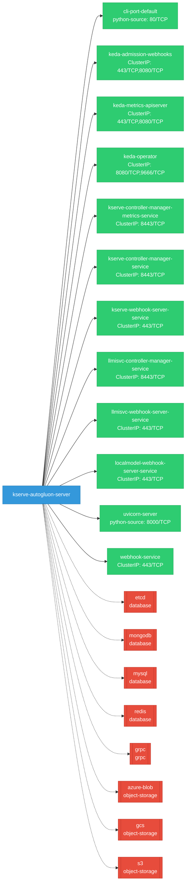

# kserve-autogluon-server: Network

## Service Map

*12 unique services (18 total, duplicates from test fixtures collapsed).*

### Services

| Name | Type | Ports | Source |
|------|------|-------|--------|
| cli-port-default | python-source | 80/TCP | [`docs/samples/v1beta1/tensorflow/grpc_client.py:48`](https://github.com/kserve/kserve-autogluon-server/blob/a76f496ab482e0d89662855bb12f11f8b8b4b96b/docs/samples/v1beta1/tensorflow/grpc_client.py#L48) |
| keda-admission-webhooks | ClusterIP | 443/TCP, 8080/TCP | [`.gopath-loader/pkg/mod/github.com/kedacore/keda/v2@v2.17.3/config/webhooks/service.yaml`](https://github.com/kserve/kserve-autogluon-server/blob/a76f496ab482e0d89662855bb12f11f8b8b4b96b/.gopath-loader/pkg/mod/github.com/kedacore/keda/v2@v2.17.3/config/webhooks/service.yaml) |
| keda-admission-webhooks | ClusterIP | 443/TCP, 8080/TCP | [`.gomod-cache/github.com/kedacore/keda/v2@v2.17.3/config/webhooks/service.yaml`](https://github.com/kserve/kserve-autogluon-server/blob/a76f496ab482e0d89662855bb12f11f8b8b4b96b/.gomod-cache/github.com/kedacore/keda/v2@v2.17.3/config/webhooks/service.yaml) |
| keda-metrics-apiserver | ClusterIP | 443/TCP, 8080/TCP | [`.gomod-cache/github.com/kedacore/keda/v2@v2.17.3/config/metrics-server/service.yaml`](https://github.com/kserve/kserve-autogluon-server/blob/a76f496ab482e0d89662855bb12f11f8b8b4b96b/.gomod-cache/github.com/kedacore/keda/v2@v2.17.3/config/metrics-server/service.yaml) |
| keda-metrics-apiserver | ClusterIP | 443/TCP, 8080/TCP | [`.gopath-loader/pkg/mod/github.com/kedacore/keda/v2@v2.17.3/config/metrics-server/service.yaml`](https://github.com/kserve/kserve-autogluon-server/blob/a76f496ab482e0d89662855bb12f11f8b8b4b96b/.gopath-loader/pkg/mod/github.com/kedacore/keda/v2@v2.17.3/config/metrics-server/service.yaml) |
| keda-operator | ClusterIP | 9666/TCP, 8080/TCP | [`.gomod-cache/github.com/kedacore/keda/v2@v2.17.3/config/manager/service.yaml`](https://github.com/kserve/kserve-autogluon-server/blob/a76f496ab482e0d89662855bb12f11f8b8b4b96b/.gomod-cache/github.com/kedacore/keda/v2@v2.17.3/config/manager/service.yaml) |
| keda-operator | ClusterIP | 9666/TCP, 8080/TCP | [`.gopath-loader/pkg/mod/github.com/kedacore/keda/v2@v2.17.3/config/manager/service.yaml`](https://github.com/kserve/kserve-autogluon-server/blob/a76f496ab482e0d89662855bb12f11f8b8b4b96b/.gopath-loader/pkg/mod/github.com/kedacore/keda/v2@v2.17.3/config/manager/service.yaml) |
| kserve-controller-manager-metrics-service | ClusterIP | 8443/TCP | [`kustomize:config/overlays/all`](https://github.com/kserve/kserve-autogluon-server/blob/a76f496ab482e0d89662855bb12f11f8b8b4b96b/kustomize:config/overlays/all) |
| kserve-controller-manager-service | ClusterIP | 8443/TCP | [`kustomize:config/overlays/all`](https://github.com/kserve/kserve-autogluon-server/blob/a76f496ab482e0d89662855bb12f11f8b8b4b96b/kustomize:config/overlays/all) |
| kserve-webhook-server-service | ClusterIP | 443/TCP | [`kustomize:config/overlays/all`](https://github.com/kserve/kserve-autogluon-server/blob/a76f496ab482e0d89662855bb12f11f8b8b4b96b/kustomize:config/overlays/all) |
| llmisvc-controller-manager-service | ClusterIP | 8443/TCP | [`kustomize:config/overlays/all`](https://github.com/kserve/kserve-autogluon-server/blob/a76f496ab482e0d89662855bb12f11f8b8b4b96b/kustomize:config/overlays/all) |
| llmisvc-webhook-server-service | ClusterIP | 443/TCP | [`kustomize:config/overlays/all`](https://github.com/kserve/kserve-autogluon-server/blob/a76f496ab482e0d89662855bb12f11f8b8b4b96b/kustomize:config/overlays/all) |
| localmodel-webhook-server-service | ClusterIP | 443/TCP | [`kustomize:config/overlays/all`](https://github.com/kserve/kserve-autogluon-server/blob/a76f496ab482e0d89662855bb12f11f8b8b4b96b/kustomize:config/overlays/all) |
| uvicorn-server | python-source | 8000/TCP | [`.gomod-cache/sigs.k8s.io/gateway-api-inference-extension@v1.3.0/latencypredictor/training_server.py:1866`](https://github.com/kserve/kserve-autogluon-server/blob/a76f496ab482e0d89662855bb12f11f8b8b4b96b/.gomod-cache/sigs.k8s.io/gateway-api-inference-extension@v1.3.0/latencypredictor/training_server.py#L1866) |
| webhook-service | ClusterIP | 443/TCP | [`.gomod-cache/sigs.k8s.io/lws@v0.7.0/config/webhook/service.yaml`](https://github.com/kserve/kserve-autogluon-server/blob/a76f496ab482e0d89662855bb12f11f8b8b4b96b/.gomod-cache/sigs.k8s.io/lws@v0.7.0/config/webhook/service.yaml) |
| webhook-service | ClusterIP | 443/TCP | [`.gopath-loader/pkg/mod/sigs.k8s.io/lws@v0.7.0/config/webhook/service.yaml`](https://github.com/kserve/kserve-autogluon-server/blob/a76f496ab482e0d89662855bb12f11f8b8b4b96b/.gopath-loader/pkg/mod/sigs.k8s.io/lws@v0.7.0/config/webhook/service.yaml) |
| webhook-service | ClusterIP | 443/TCP | [`.gopath-loader/pkg/mod/github.com/open-telemetry/opentelemetry-operator@v0.113.0/config/webhook/service.yaml`](https://github.com/kserve/kserve-autogluon-server/blob/a76f496ab482e0d89662855bb12f11f8b8b4b96b/.gopath-loader/pkg/mod/github.com/open-telemetry/opentelemetry-operator@v0.113.0/config/webhook/service.yaml) |
| webhook-service | ClusterIP | 443/TCP | [`.gomod-cache/github.com/open-telemetry/opentelemetry-operator@v0.113.0/config/webhook/service.yaml`](https://github.com/kserve/kserve-autogluon-server/blob/a76f496ab482e0d89662855bb12f11f8b8b4b96b/.gomod-cache/github.com/open-telemetry/opentelemetry-operator@v0.113.0/config/webhook/service.yaml) |

### Ingress / Routing

| Kind | Name | Hosts | Paths | TLS | Source |
|------|------|-------|-------|-----|--------|
| Gateway | inference-gateway |  |  | no | [`.gomod-cache/sigs.k8s.io/gateway-api-inference-extension@v1.3.0/config/manifests/gateway/gke/gateway.yaml`](https://github.com/kserve/kserve-autogluon-server/blob/a76f496ab482e0d89662855bb12f11f8b8b4b96b/.gomod-cache/sigs.k8s.io/gateway-api-inference-extension@v1.3.0/config/manifests/gateway/gke/gateway.yaml) |
| Gateway | inference-gateway |  |  | no | [`.gomod-cache/sigs.k8s.io/gateway-api-inference-extension@v1.3.0/config/manifests/gateway/istio/gateway.yaml`](https://github.com/kserve/kserve-autogluon-server/blob/a76f496ab482e0d89662855bb12f11f8b8b4b96b/.gomod-cache/sigs.k8s.io/gateway-api-inference-extension@v1.3.0/config/manifests/gateway/istio/gateway.yaml) |
| Gateway | inference-gateway |  |  | no | [`.gomod-cache/sigs.k8s.io/gateway-api-inference-extension@v1.3.0/config/manifests/gateway/kgateway/gateway.yaml`](https://github.com/kserve/kserve-autogluon-server/blob/a76f496ab482e0d89662855bb12f11f8b8b4b96b/.gomod-cache/sigs.k8s.io/gateway-api-inference-extension@v1.3.0/config/manifests/gateway/kgateway/gateway.yaml) |
| Gateway | inference-gateway |  |  | no | [`.gomod-cache/sigs.k8s.io/gateway-api-inference-extension@v1.3.0/config/manifests/gateway/nginxgatewayfabric/gateway.yaml`](https://github.com/kserve/kserve-autogluon-server/blob/a76f496ab482e0d89662855bb12f11f8b8b4b96b/.gomod-cache/sigs.k8s.io/gateway-api-inference-extension@v1.3.0/config/manifests/gateway/nginxgatewayfabric/gateway.yaml) |
| Gateway | inference-gateway |  |  | no | [`.gopath-loader/pkg/mod/sigs.k8s.io/gateway-api-inference-extension@v1.3.0/config/manifests/gateway/envoyaigateway/gateway.yaml`](https://github.com/kserve/kserve-autogluon-server/blob/a76f496ab482e0d89662855bb12f11f8b8b4b96b/.gopath-loader/pkg/mod/sigs.k8s.io/gateway-api-inference-extension@v1.3.0/config/manifests/gateway/envoyaigateway/gateway.yaml) |
| Gateway | inference-gateway |  |  | no | [`.gopath-loader/pkg/mod/sigs.k8s.io/gateway-api-inference-extension@v1.3.0/config/manifests/gateway/gke/gateway.yaml`](https://github.com/kserve/kserve-autogluon-server/blob/a76f496ab482e0d89662855bb12f11f8b8b4b96b/.gopath-loader/pkg/mod/sigs.k8s.io/gateway-api-inference-extension@v1.3.0/config/manifests/gateway/gke/gateway.yaml) |
| Gateway | inference-gateway |  |  | no | [`.gopath-loader/pkg/mod/sigs.k8s.io/gateway-api-inference-extension@v1.3.0/config/manifests/gateway/istio/gateway.yaml`](https://github.com/kserve/kserve-autogluon-server/blob/a76f496ab482e0d89662855bb12f11f8b8b4b96b/.gopath-loader/pkg/mod/sigs.k8s.io/gateway-api-inference-extension@v1.3.0/config/manifests/gateway/istio/gateway.yaml) |
| Gateway | inference-gateway |  |  | no | [`.gopath-loader/pkg/mod/sigs.k8s.io/gateway-api-inference-extension@v1.3.0/config/manifests/gateway/kgateway/gateway.yaml`](https://github.com/kserve/kserve-autogluon-server/blob/a76f496ab482e0d89662855bb12f11f8b8b4b96b/.gopath-loader/pkg/mod/sigs.k8s.io/gateway-api-inference-extension@v1.3.0/config/manifests/gateway/kgateway/gateway.yaml) |
| Gateway | inference-gateway |  |  | no | [`.gopath-loader/pkg/mod/sigs.k8s.io/gateway-api-inference-extension@v1.3.0/config/manifests/gateway/nginxgatewayfabric/gateway.yaml`](https://github.com/kserve/kserve-autogluon-server/blob/a76f496ab482e0d89662855bb12f11f8b8b4b96b/.gopath-loader/pkg/mod/sigs.k8s.io/gateway-api-inference-extension@v1.3.0/config/manifests/gateway/nginxgatewayfabric/gateway.yaml) |
| Gateway | inference-gateway |  |  | no | [`.gomod-cache/sigs.k8s.io/gateway-api-inference-extension@v1.3.0/config/manifests/gateway/envoyaigateway/gateway.yaml`](https://github.com/kserve/kserve-autogluon-server/blob/a76f496ab482e0d89662855bb12f11f8b8b4b96b/.gomod-cache/sigs.k8s.io/gateway-api-inference-extension@v1.3.0/config/manifests/gateway/envoyaigateway/gateway.yaml) |
| HTTPRoute | llm-deepseek-route |  | /, /, / | no | [`.gomod-cache/sigs.k8s.io/gateway-api-inference-extension@v1.3.0/config/manifests/bbr-example/httproute_bbr_lora.yaml`](https://github.com/kserve/kserve-autogluon-server/blob/a76f496ab482e0d89662855bb12f11f8b8b4b96b/.gomod-cache/sigs.k8s.io/gateway-api-inference-extension@v1.3.0/config/manifests/bbr-example/httproute_bbr_lora.yaml) |
| HTTPRoute | llm-deepseek-route |  | /, /, / | no | [`.gopath-loader/pkg/mod/sigs.k8s.io/gateway-api-inference-extension@v1.3.0/config/manifests/bbr-example/httproute_bbr_lora.yaml`](https://github.com/kserve/kserve-autogluon-server/blob/a76f496ab482e0d89662855bb12f11f8b8b4b96b/.gopath-loader/pkg/mod/sigs.k8s.io/gateway-api-inference-extension@v1.3.0/config/manifests/bbr-example/httproute_bbr_lora.yaml) |
| HTTPRoute | llm-llama-route |  | / | no | [`.gomod-cache/sigs.k8s.io/gateway-api-inference-extension@v1.3.0/config/manifests/bbr-example/httproute_bbr.yaml`](https://github.com/kserve/kserve-autogluon-server/blob/a76f496ab482e0d89662855bb12f11f8b8b4b96b/.gomod-cache/sigs.k8s.io/gateway-api-inference-extension@v1.3.0/config/manifests/bbr-example/httproute_bbr.yaml) |
| HTTPRoute | llm-llama-route |  | /, / | no | [`.gomod-cache/sigs.k8s.io/gateway-api-inference-extension@v1.3.0/config/manifests/bbr-example/httproute_bbr_lora.yaml`](https://github.com/kserve/kserve-autogluon-server/blob/a76f496ab482e0d89662855bb12f11f8b8b4b96b/.gomod-cache/sigs.k8s.io/gateway-api-inference-extension@v1.3.0/config/manifests/bbr-example/httproute_bbr_lora.yaml) |
| HTTPRoute | llm-llama-route |  | / | no | [`.gopath-loader/pkg/mod/sigs.k8s.io/gateway-api-inference-extension@v1.3.0/config/manifests/bbr-example/httproute_bbr.yaml`](https://github.com/kserve/kserve-autogluon-server/blob/a76f496ab482e0d89662855bb12f11f8b8b4b96b/.gopath-loader/pkg/mod/sigs.k8s.io/gateway-api-inference-extension@v1.3.0/config/manifests/bbr-example/httproute_bbr.yaml) |
| HTTPRoute | llm-llama-route |  | /, / | no | [`.gopath-loader/pkg/mod/sigs.k8s.io/gateway-api-inference-extension@v1.3.0/config/manifests/bbr-example/httproute_bbr_lora.yaml`](https://github.com/kserve/kserve-autogluon-server/blob/a76f496ab482e0d89662855bb12f11f8b8b4b96b/.gopath-loader/pkg/mod/sigs.k8s.io/gateway-api-inference-extension@v1.3.0/config/manifests/bbr-example/httproute_bbr_lora.yaml) |
| HTTPRoute | llm-phi4-route |  | / | no | [`.gopath-loader/pkg/mod/sigs.k8s.io/gateway-api-inference-extension@v1.3.0/config/manifests/bbr-example/httproute_bbr.yaml`](https://github.com/kserve/kserve-autogluon-server/blob/a76f496ab482e0d89662855bb12f11f8b8b4b96b/.gopath-loader/pkg/mod/sigs.k8s.io/gateway-api-inference-extension@v1.3.0/config/manifests/bbr-example/httproute_bbr.yaml) |
| HTTPRoute | llm-phi4-route |  | / | no | [`.gomod-cache/sigs.k8s.io/gateway-api-inference-extension@v1.3.0/config/manifests/bbr-example/httproute_bbr.yaml`](https://github.com/kserve/kserve-autogluon-server/blob/a76f496ab482e0d89662855bb12f11f8b8b4b96b/.gomod-cache/sigs.k8s.io/gateway-api-inference-extension@v1.3.0/config/manifests/bbr-example/httproute_bbr.yaml) |
| Ingress | rbac-inferred |  |  | no | [`rbac/kserve-manager-role`](https://github.com/kserve/kserve-autogluon-server/blob/a76f496ab482e0d89662855bb12f11f8b8b4b96b/rbac/kserve-manager-role) |
| VirtualService | rbac-inferred |  |  | no | [`rbac/kserve-manager-role`](https://github.com/kserve/kserve-autogluon-server/blob/a76f496ab482e0d89662855bb12f11f8b8b4b96b/rbac/kserve-manager-role) |

!!! warning "No Network Policies"
    No NetworkPolicy resources were found in the analyzed sources. Network policies may exist in overlays, Helm values, or cluster-level configurations not captured by static analysis.

