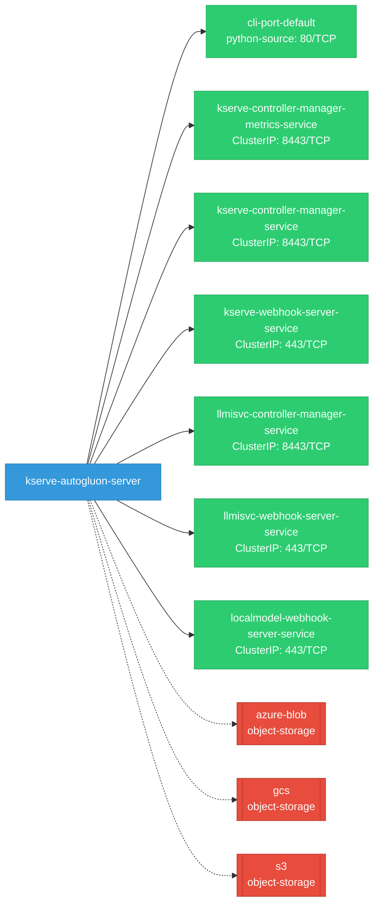

# kserve-autogluon-server: Network

## Service Map

### Services

| Name | Type | Ports | Source |
|------|------|-------|--------|
| cli-port-default | python-source | 80/TCP | [`docs/samples/v1beta1/tensorflow/grpc_client.py:48`](https://github.com/red-hat-data-services/kserve-autogluon-server/blob/047a7264a84c9bc5c2932db3d0e91a02838a4443/docs/samples/v1beta1/tensorflow/grpc_client.py#L48) |
| kserve-controller-manager-metrics-service | ClusterIP | 8443/TCP | [`kustomize:config/overlays/all`](https://github.com/red-hat-data-services/kserve-autogluon-server/blob/047a7264a84c9bc5c2932db3d0e91a02838a4443/kustomize:config/overlays/all) |
| kserve-controller-manager-service | ClusterIP | 8443/TCP | [`kustomize:config/overlays/all`](https://github.com/red-hat-data-services/kserve-autogluon-server/blob/047a7264a84c9bc5c2932db3d0e91a02838a4443/kustomize:config/overlays/all) |
| kserve-webhook-server-service | ClusterIP | 443/TCP | [`kustomize:config/overlays/all`](https://github.com/red-hat-data-services/kserve-autogluon-server/blob/047a7264a84c9bc5c2932db3d0e91a02838a4443/kustomize:config/overlays/all) |
| llmisvc-controller-manager-service | ClusterIP | 8443/TCP | [`kustomize:config/overlays/all`](https://github.com/red-hat-data-services/kserve-autogluon-server/blob/047a7264a84c9bc5c2932db3d0e91a02838a4443/kustomize:config/overlays/all) |
| llmisvc-webhook-server-service | ClusterIP | 443/TCP | [`kustomize:config/overlays/all`](https://github.com/red-hat-data-services/kserve-autogluon-server/blob/047a7264a84c9bc5c2932db3d0e91a02838a4443/kustomize:config/overlays/all) |
| localmodel-webhook-server-service | ClusterIP | 443/TCP | [`kustomize:config/overlays/all`](https://github.com/red-hat-data-services/kserve-autogluon-server/blob/047a7264a84c9bc5c2932db3d0e91a02838a4443/kustomize:config/overlays/all) |

### Ingress / Routing

| Kind | Name | Hosts | Paths | TLS | Source |
|------|------|-------|-------|-----|--------|
| HTTPRoute | rbac-inferred |  |  | no | [`rbac/kserve-manager-role`](https://github.com/red-hat-data-services/kserve-autogluon-server/blob/047a7264a84c9bc5c2932db3d0e91a02838a4443/rbac/kserve-manager-role) |
| Ingress | rbac-inferred |  |  | no | [`rbac/kserve-manager-role`](https://github.com/red-hat-data-services/kserve-autogluon-server/blob/047a7264a84c9bc5c2932db3d0e91a02838a4443/rbac/kserve-manager-role) |
| VirtualService | rbac-inferred |  |  | no | [`rbac/kserve-manager-role`](https://github.com/red-hat-data-services/kserve-autogluon-server/blob/047a7264a84c9bc5c2932db3d0e91a02838a4443/rbac/kserve-manager-role) |

!!! warning "No Network Policies"
    No NetworkPolicy resources found. All pod-to-pod traffic is allowed by default.

