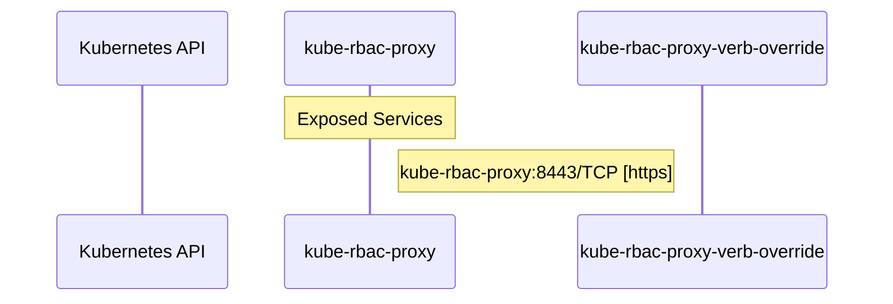

# kube-rbac-proxy: Dataflow

## Controller Watches

Kubernetes resources this controller monitors for changes. Each watch triggers reconciliation when the watched resource is created, updated, or deleted.

No controller watches found.

## Reconciliation Flow

How the controller interacts with the Kubernetes API during reconciliation.

### HTTP Endpoints

| Method | Path | Source |
|--------|------|--------|
| * | / | [`cmd/kube-rbac-proxy/app/kube-rbac-proxy.go:343`](https://github.com/brancz/kube-rbac-proxy/blob/ad283cb8e4e6fe5751f83cbef520c641e74cbf20/cmd/kube-rbac-proxy/app/kube-rbac-proxy.go#L343) |

## Configuration

ConfigMaps and Helm values that control this component's runtime behavior.

