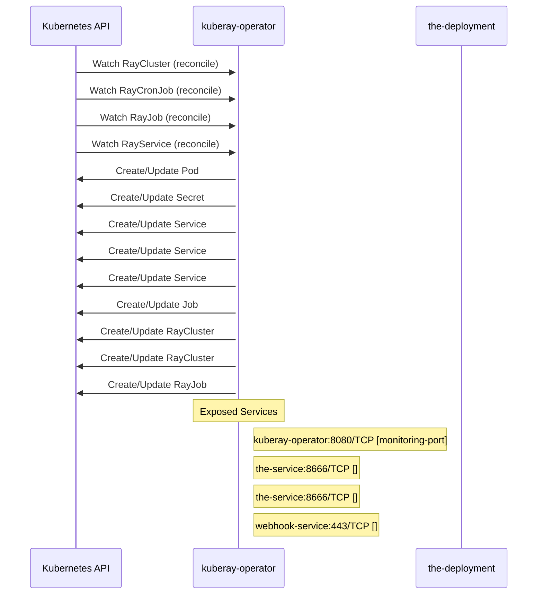

# kuberay: Dataflow

## Controller Watches

Kubernetes resources this controller monitors for changes. Each watch triggers reconciliation when the watched resource is created, updated, or deleted.

| Type | GVK | Source |
|------|-----|--------|
| For | ray/v1/RayCluster | [`ray-operator/controllers/ray/raycluster_controller.go:1526`](https://github.com/ray-project/kuberay/blob/1466289a1bcff3df4b0be5f0c804e178b7aa8e05/ray-operator/controllers/ray/raycluster_controller.go#L1526) |
| For | ray/v1/RayCronJob | [`ray-operator/controllers/ray/raycronjob_controller.go:182`](https://github.com/ray-project/kuberay/blob/1466289a1bcff3df4b0be5f0c804e178b7aa8e05/ray-operator/controllers/ray/raycronjob_controller.go#L182) |
| For | ray/v1/RayJob | [`ray-operator/controllers/ray/rayjob_controller.go:827`](https://github.com/ray-project/kuberay/blob/1466289a1bcff3df4b0be5f0c804e178b7aa8e05/ray-operator/controllers/ray/rayjob_controller.go#L827) |
| For | ray/v1/RayService | [`ray-operator/controllers/ray/rayservice_controller.go:607`](https://github.com/ray-project/kuberay/blob/1466289a1bcff3df4b0be5f0c804e178b7aa8e05/ray-operator/controllers/ray/rayservice_controller.go#L607) |
| Owns | /v1/Pod | [`ray-operator/controllers/ray/raycluster_controller.go:1531`](https://github.com/ray-project/kuberay/blob/1466289a1bcff3df4b0be5f0c804e178b7aa8e05/ray-operator/controllers/ray/raycluster_controller.go#L1531) |
| Owns | /v1/Secret | [`ray-operator/controllers/ray/raycluster_controller.go:1533`](https://github.com/ray-project/kuberay/blob/1466289a1bcff3df4b0be5f0c804e178b7aa8e05/ray-operator/controllers/ray/raycluster_controller.go#L1533) |
| Owns | /v1/Service | [`ray-operator/controllers/ray/rayjob_controller.go:829`](https://github.com/ray-project/kuberay/blob/1466289a1bcff3df4b0be5f0c804e178b7aa8e05/ray-operator/controllers/ray/rayjob_controller.go#L829) |
| Owns | /v1/Service | [`ray-operator/controllers/ray/raycluster_controller.go:1532`](https://github.com/ray-project/kuberay/blob/1466289a1bcff3df4b0be5f0c804e178b7aa8e05/ray-operator/controllers/ray/raycluster_controller.go#L1532) |
| Owns | /v1/Service | [`ray-operator/controllers/ray/rayservice_controller.go:613`](https://github.com/ray-project/kuberay/blob/1466289a1bcff3df4b0be5f0c804e178b7aa8e05/ray-operator/controllers/ray/rayservice_controller.go#L613) |
| Owns | batch/v1/Job | [`ray-operator/controllers/ray/rayjob_controller.go:830`](https://github.com/ray-project/kuberay/blob/1466289a1bcff3df4b0be5f0c804e178b7aa8e05/ray-operator/controllers/ray/rayjob_controller.go#L830) |
| Owns | ray/v1/RayCluster | [`ray-operator/controllers/ray/rayjob_controller.go:828`](https://github.com/ray-project/kuberay/blob/1466289a1bcff3df4b0be5f0c804e178b7aa8e05/ray-operator/controllers/ray/rayjob_controller.go#L828) |
| Owns | ray/v1/RayCluster | [`ray-operator/controllers/ray/rayservice_controller.go:612`](https://github.com/ray-project/kuberay/blob/1466289a1bcff3df4b0be5f0c804e178b7aa8e05/ray-operator/controllers/ray/rayservice_controller.go#L612) |
| Owns | ray/v1/RayJob | [`ray-operator/controllers/ray/raycronjob_controller.go:183`](https://github.com/ray-project/kuberay/blob/1466289a1bcff3df4b0be5f0c804e178b7aa8e05/ray-operator/controllers/ray/raycronjob_controller.go#L183) |

## Reconciliation Flow

How the controller interacts with the Kubernetes API during reconciliation.

### Webhooks

| Name | Type | Path | Failure Policy | Service | Overlays | Enable Condition | Sources |
|------|------|------|----------------|---------|----------|------------------|----------|
| vraycluster.kb.io | validating | /validate-ray-io-v1-raycluster | fail |  |  |  | [`ray-operator/pkg/webhooks/v1/raycluster_webhook.go`](https://github.com/ray-project/kuberay/blob/1466289a1bcff3df4b0be5f0c804e178b7aa8e05/ray-operator/pkg/webhooks/v1/raycluster_webhook.go), [`ray-operator/pkg/webhooks/v1/raycluster_webhook.go`](https://github.com/ray-project/kuberay/blob/1466289a1bcff3df4b0be5f0c804e178b7aa8e05/ray-operator/pkg/webhooks/v1/raycluster_webhook.go) |
| vrayjob.kb.io | validating | /validate-ray-io-v1-rayjob | fail |  |  |  | [`ray-operator/pkg/webhooks/v1/rayjob_webhook.go`](https://github.com/ray-project/kuberay/blob/1466289a1bcff3df4b0be5f0c804e178b7aa8e05/ray-operator/pkg/webhooks/v1/rayjob_webhook.go), [`ray-operator/pkg/webhooks/v1/rayjob_webhook.go`](https://github.com/ray-project/kuberay/blob/1466289a1bcff3df4b0be5f0c804e178b7aa8e05/ray-operator/pkg/webhooks/v1/rayjob_webhook.go) |
| vrayservice.kb.io | validating | /validate-ray-io-v1-rayservice | fail |  |  |  | [`ray-operator/pkg/webhooks/v1/rayservice_webhook.go`](https://github.com/ray-project/kuberay/blob/1466289a1bcff3df4b0be5f0c804e178b7aa8e05/ray-operator/pkg/webhooks/v1/rayservice_webhook.go), [`ray-operator/pkg/webhooks/v1/rayservice_webhook.go`](https://github.com/ray-project/kuberay/blob/1466289a1bcff3df4b0be5f0c804e178b7aa8e05/ray-operator/pkg/webhooks/v1/rayservice_webhook.go) |

### HTTP Endpoints

| Method | Path | Source |
|--------|------|--------|
| * | / | [`.gopath-loader/pkg/mod/golang.org/x/tools@v0.41.0/go/types/internal/play/play.go:47`](https://github.com/ray-project/kuberay/blob/1466289a1bcff3df4b0be5f0c804e178b7aa8e05/.gopath-loader/pkg/mod/golang.org/x/tools@v0.41.0/go/types/internal/play/play.go#L47) |
| * | / | [`.gomod-cache/golang.org/x/tools@v0.41.0/go/types/internal/play/play.go:47`](https://github.com/ray-project/kuberay/blob/1466289a1bcff3df4b0be5f0c804e178b7aa8e05/.gomod-cache/golang.org/x/tools@v0.41.0/go/types/internal/play/play.go#L47) |
| * | / | [`.gomod-cache/golang.org/toolchain@v0.0.1-go1.26.0.linux-amd64/src/net/http/triv.go:130`](https://github.com/ray-project/kuberay/blob/1466289a1bcff3df4b0be5f0c804e178b7aa8e05/.gomod-cache/golang.org/toolchain@v0.0.1-go1.26.0.linux-amd64/src/net/http/triv.go#L130) |
| * | / | [`.gomod-cache/github.com/google/pprof@v0.0.0-20260115054156-294ebfa9ad83/internal/driver/webui.go:214`](https://github.com/ray-project/kuberay/blob/1466289a1bcff3df4b0be5f0c804e178b7aa8e05/.gomod-cache/github.com/google/pprof@v0.0.0-20260115054156-294ebfa9ad83/internal/driver/webui.go#L214) |
| * | / | [`.gopath-loader/pkg/mod/golang.org/toolchain@v0.0.1-go1.26.0.linux-amd64/src/cmd/trace/main.go:188`](https://github.com/ray-project/kuberay/blob/1466289a1bcff3df4b0be5f0c804e178b7aa8e05/.gopath-loader/pkg/mod/golang.org/toolchain@v0.0.1-go1.26.0.linux-amd64/src/cmd/trace/main.go#L188) |
| * | / | [`experimental/cmd/main.go:111`](https://github.com/ray-project/kuberay/blob/1466289a1bcff3df4b0be5f0c804e178b7aa8e05/experimental/cmd/main.go#L111) |
| * | / | [`.gomod-cache/golang.org/x/net@v0.49.0/webdav/litmus_test_server.go:83`](https://github.com/ray-project/kuberay/blob/1466289a1bcff3df4b0be5f0c804e178b7aa8e05/.gomod-cache/golang.org/x/net@v0.49.0/webdav/litmus_test_server.go#L83) |
| * | / | [`.gopath-loader/pkg/mod/golang.org/toolchain@v0.0.1-go1.26.0.linux-amd64/src/net/http/triv.go:130`](https://github.com/ray-project/kuberay/blob/1466289a1bcff3df4b0be5f0c804e178b7aa8e05/.gopath-loader/pkg/mod/golang.org/toolchain@v0.0.1-go1.26.0.linux-amd64/src/net/http/triv.go#L130) |
| * | / | [`.gopath-loader/pkg/mod/github.com/google/pprof@v0.0.0-20260115054156-294ebfa9ad83/internal/driver/webui.go:214`](https://github.com/ray-project/kuberay/blob/1466289a1bcff3df4b0be5f0c804e178b7aa8e05/.gopath-loader/pkg/mod/github.com/google/pprof@v0.0.0-20260115054156-294ebfa9ad83/internal/driver/webui.go#L214) |
| * | / | [`.gomod-cache/golang.org/x/tools@v0.41.0/cmd/present/dir.go:23`](https://github.com/ray-project/kuberay/blob/1466289a1bcff3df4b0be5f0c804e178b7aa8e05/.gomod-cache/golang.org/x/tools@v0.41.0/cmd/present/dir.go#L23) |
| * | / | [`.gomod-cache/golang.org/toolchain@v0.0.1-go1.26.0.linux-amd64/src/cmd/trace/main.go:188`](https://github.com/ray-project/kuberay/blob/1466289a1bcff3df4b0be5f0c804e178b7aa8e05/.gomod-cache/golang.org/toolchain@v0.0.1-go1.26.0.linux-amd64/src/cmd/trace/main.go#L188) |
| * | / | [`.gopath-loader/pkg/mod/golang.org/x/tools@v0.41.0/cmd/present/dir.go:23`](https://github.com/ray-project/kuberay/blob/1466289a1bcff3df4b0be5f0c804e178b7aa8e05/.gopath-loader/pkg/mod/golang.org/x/tools@v0.41.0/cmd/present/dir.go#L23) |
| * | / | [`.gopath-loader/pkg/mod/golang.org/x/net@v0.49.0/webdav/litmus_test_server.go:83`](https://github.com/ray-project/kuberay/blob/1466289a1bcff3df4b0be5f0c804e178b7aa8e05/.gopath-loader/pkg/mod/golang.org/x/net@v0.49.0/webdav/litmus_test_server.go#L83) |
| GET | / | [`.gomod-cache/k8s.io/apiserver@v0.36.0/pkg/server/routes/version.go:44`](https://github.com/ray-project/kuberay/blob/1466289a1bcff3df4b0be5f0c804e178b7aa8e05/.gomod-cache/k8s.io/apiserver@v0.36.0/pkg/server/routes/version.go#L44) |
| GET | / | [`.gopath-loader/pkg/mod/k8s.io/apiserver@v0.36.0/pkg/server/routes/version.go:44`](https://github.com/ray-project/kuberay/blob/1466289a1bcff3df4b0be5f0c804e178b7aa8e05/.gopath-loader/pkg/mod/k8s.io/apiserver@v0.36.0/pkg/server/routes/version.go#L44) |
| GET | / | [`.gomod-cache/k8s.io/apiserver@v0.36.0/pkg/endpoints/discovery/aggregated/wrapper.go:73`](https://github.com/ray-project/kuberay/blob/1466289a1bcff3df4b0be5f0c804e178b7aa8e05/.gomod-cache/k8s.io/apiserver@v0.36.0/pkg/endpoints/discovery/aggregated/wrapper.go#L73) |
| GET | / | [`.gopath-loader/pkg/mod/k8s.io/apiserver@v0.36.0/pkg/endpoints/discovery/version.go:67`](https://github.com/ray-project/kuberay/blob/1466289a1bcff3df4b0be5f0c804e178b7aa8e05/.gopath-loader/pkg/mod/k8s.io/apiserver@v0.36.0/pkg/endpoints/discovery/version.go#L67) |
| GET | / | [`.gopath-loader/pkg/mod/k8s.io/apiserver@v0.36.0/pkg/endpoints/discovery/root.go:154`](https://github.com/ray-project/kuberay/blob/1466289a1bcff3df4b0be5f0c804e178b7aa8e05/.gopath-loader/pkg/mod/k8s.io/apiserver@v0.36.0/pkg/endpoints/discovery/root.go#L154) |
| GET | / | [`.gomod-cache/k8s.io/apiserver@v0.36.0/pkg/endpoints/discovery/version.go:67`](https://github.com/ray-project/kuberay/blob/1466289a1bcff3df4b0be5f0c804e178b7aa8e05/.gomod-cache/k8s.io/apiserver@v0.36.0/pkg/endpoints/discovery/version.go#L67) |
| GET | / | [`historyserver/pkg/historyserver/router.go:64`](https://github.com/ray-project/kuberay/blob/1466289a1bcff3df4b0be5f0c804e178b7aa8e05/historyserver/pkg/historyserver/router.go#L64) |
| GET | / | [`.gomod-cache/k8s.io/apiserver@v0.36.0/pkg/endpoints/discovery/group.go:57`](https://github.com/ray-project/kuberay/blob/1466289a1bcff3df4b0be5f0c804e178b7aa8e05/.gomod-cache/k8s.io/apiserver@v0.36.0/pkg/endpoints/discovery/group.go#L57) |
| GET | / | [`historyserver/pkg/historyserver/router.go:55`](https://github.com/ray-project/kuberay/blob/1466289a1bcff3df4b0be5f0c804e178b7aa8e05/historyserver/pkg/historyserver/router.go#L55) |
| GET | / | [`.gomod-cache/k8s.io/apiserver@v0.36.0/pkg/endpoints/discovery/legacy.go:59`](https://github.com/ray-project/kuberay/blob/1466289a1bcff3df4b0be5f0c804e178b7aa8e05/.gomod-cache/k8s.io/apiserver@v0.36.0/pkg/endpoints/discovery/legacy.go#L59) |
| GET | / | [`.gomod-cache/k8s.io/apiserver@v0.36.0/pkg/endpoints/discovery/root.go:154`](https://github.com/ray-project/kuberay/blob/1466289a1bcff3df4b0be5f0c804e178b7aa8e05/.gomod-cache/k8s.io/apiserver@v0.36.0/pkg/endpoints/discovery/root.go#L154) |
| GET | / | [`.gopath-loader/pkg/mod/k8s.io/apiserver@v0.36.0/pkg/endpoints/discovery/legacy.go:59`](https://github.com/ray-project/kuberay/blob/1466289a1bcff3df4b0be5f0c804e178b7aa8e05/.gopath-loader/pkg/mod/k8s.io/apiserver@v0.36.0/pkg/endpoints/discovery/legacy.go#L59) |
| GET | / | [`historyserver/pkg/historyserver/router.go:102`](https://github.com/ray-project/kuberay/blob/1466289a1bcff3df4b0be5f0c804e178b7aa8e05/historyserver/pkg/historyserver/router.go#L102) |
| GET | / | [`.gopath-loader/pkg/mod/k8s.io/apiserver@v0.36.0/pkg/endpoints/discovery/group.go:57`](https://github.com/ray-project/kuberay/blob/1466289a1bcff3df4b0be5f0c804e178b7aa8e05/.gopath-loader/pkg/mod/k8s.io/apiserver@v0.36.0/pkg/endpoints/discovery/group.go#L57) |
| GET | / | [`.gopath-loader/pkg/mod/k8s.io/apiserver@v0.36.0/pkg/endpoints/discovery/aggregated/wrapper.go:73`](https://github.com/ray-project/kuberay/blob/1466289a1bcff3df4b0be5f0c804e178b7aa8e05/.gopath-loader/pkg/mod/k8s.io/apiserver@v0.36.0/pkg/endpoints/discovery/aggregated/wrapper.go#L73) |
| * | /abort | [`.gopath-loader/pkg/mod/github.com/onsi/ginkgo/v2@v2.28.1/internal/parallel_support/http_server.go:63`](https://github.com/ray-project/kuberay/blob/1466289a1bcff3df4b0be5f0c804e178b7aa8e05/.gopath-loader/pkg/mod/github.com/onsi/ginkgo/v2@v2.28.1/internal/parallel_support/http_server.go#L63) |
| * | /abort | [`.gomod-cache/github.com/onsi/ginkgo/v2@v2.28.1/internal/parallel_support/http_server.go:63`](https://github.com/ray-project/kuberay/blob/1466289a1bcff3df4b0be5f0c804e178b7aa8e05/.gomod-cache/github.com/onsi/ginkgo/v2@v2.28.1/internal/parallel_support/http_server.go#L63) |
| GET | /actors | [`historyserver/pkg/historyserver/router.go:277`](https://github.com/ray-project/kuberay/blob/1466289a1bcff3df4b0be5f0c804e178b7aa8e05/historyserver/pkg/historyserver/router.go#L277) |
| GET | /actors/{single_actor:*} | [`historyserver/pkg/historyserver/router.go:285`](https://github.com/ray-project/kuberay/blob/1466289a1bcff3df4b0be5f0c804e178b7aa8e05/historyserver/pkg/historyserver/router.go#L285) |
| * | /aggregated-nonprimary-procs-report | [`.gopath-loader/pkg/mod/github.com/onsi/ginkgo/v2@v2.28.1/internal/parallel_support/http_server.go:60`](https://github.com/ray-project/kuberay/blob/1466289a1bcff3df4b0be5f0c804e178b7aa8e05/.gopath-loader/pkg/mod/github.com/onsi/ginkgo/v2@v2.28.1/internal/parallel_support/http_server.go#L60) |
| * | /aggregated-nonprimary-procs-report | [`.gomod-cache/github.com/onsi/ginkgo/v2@v2.28.1/internal/parallel_support/http_server.go:60`](https://github.com/ray-project/kuberay/blob/1466289a1bcff3df4b0be5f0c804e178b7aa8e05/.gomod-cache/github.com/onsi/ginkgo/v2@v2.28.1/internal/parallel_support/http_server.go#L60) |
| * | /api/v1/namespaces/{namespace}/services/{service}/proxy | [`apiserversdk/proxy.go:64`](https://github.com/ray-project/kuberay/blob/1466289a1bcff3df4b0be5f0c804e178b7aa8e05/apiserversdk/proxy.go#L64) |
| * | /api/v1/namespaces/{namespace}/services/{service}/proxy/ | [`apiserversdk/proxy.go:65`](https://github.com/ray-project/kuberay/blob/1466289a1bcff3df4b0be5f0c804e178b7aa8e05/apiserversdk/proxy.go#L65) |
| * | /apis/ray.io/v1/ | [`apiserversdk/proxy.go:46`](https://github.com/ray-project/kuberay/blob/1466289a1bcff3df4b0be5f0c804e178b7aa8e05/apiserversdk/proxy.go#L46) |
| * | /args | [`.gopath-loader/pkg/mod/golang.org/toolchain@v0.0.1-go1.26.0.linux-amd64/src/net/http/triv.go:136`](https://github.com/ray-project/kuberay/blob/1466289a1bcff3df4b0be5f0c804e178b7aa8e05/.gopath-loader/pkg/mod/golang.org/toolchain@v0.0.1-go1.26.0.linux-amd64/src/net/http/triv.go#L136) |
| * | /args | [`.gomod-cache/golang.org/toolchain@v0.0.1-go1.26.0.linux-amd64/src/net/http/triv.go:136`](https://github.com/ray-project/kuberay/blob/1466289a1bcff3df4b0be5f0c804e178b7aa8e05/.gomod-cache/golang.org/toolchain@v0.0.1-go1.26.0.linux-amd64/src/net/http/triv.go#L136) |
| * | /bar | [`.gomod-cache/golang.org/toolchain@v0.0.1-go1.26.0.linux-amd64/src/net/http/doc.go:67`](https://github.com/ray-project/kuberay/blob/1466289a1bcff3df4b0be5f0c804e178b7aa8e05/.gomod-cache/golang.org/toolchain@v0.0.1-go1.26.0.linux-amd64/src/net/http/doc.go#L67) |
| * | /bar | [`.gopath-loader/pkg/mod/golang.org/toolchain@v0.0.1-go1.26.0.linux-amd64/src/net/http/doc.go:67`](https://github.com/ray-project/kuberay/blob/1466289a1bcff3df4b0be5f0c804e178b7aa8e05/.gopath-loader/pkg/mod/golang.org/toolchain@v0.0.1-go1.26.0.linux-amd64/src/net/http/doc.go#L67) |
| * | /before-suite-completed | [`.gopath-loader/pkg/mod/github.com/onsi/ginkgo/v2@v2.28.1/internal/parallel_support/http_server.go:57`](https://github.com/ray-project/kuberay/blob/1466289a1bcff3df4b0be5f0c804e178b7aa8e05/.gopath-loader/pkg/mod/github.com/onsi/ginkgo/v2@v2.28.1/internal/parallel_support/http_server.go#L57) |
| * | /before-suite-completed | [`.gomod-cache/github.com/onsi/ginkgo/v2@v2.28.1/internal/parallel_support/http_server.go:57`](https://github.com/ray-project/kuberay/blob/1466289a1bcff3df4b0be5f0c804e178b7aa8e05/.gomod-cache/github.com/onsi/ginkgo/v2@v2.28.1/internal/parallel_support/http_server.go#L57) |
| * | /before-suite-state | [`.gopath-loader/pkg/mod/github.com/onsi/ginkgo/v2@v2.28.1/internal/parallel_support/http_server.go:58`](https://github.com/ray-project/kuberay/blob/1466289a1bcff3df4b0be5f0c804e178b7aa8e05/.gopath-loader/pkg/mod/github.com/onsi/ginkgo/v2@v2.28.1/internal/parallel_support/http_server.go#L58) |
| * | /before-suite-state | [`.gomod-cache/github.com/onsi/ginkgo/v2@v2.28.1/internal/parallel_support/http_server.go:58`](https://github.com/ray-project/kuberay/blob/1466289a1bcff3df4b0be5f0c804e178b7aa8e05/.gomod-cache/github.com/onsi/ginkgo/v2@v2.28.1/internal/parallel_support/http_server.go#L58) |
| * | /block | [`.gomod-cache/golang.org/toolchain@v0.0.1-go1.26.0.linux-amd64/src/cmd/trace/main.go:210`](https://github.com/ray-project/kuberay/blob/1466289a1bcff3df4b0be5f0c804e178b7aa8e05/.gomod-cache/golang.org/toolchain@v0.0.1-go1.26.0.linux-amd64/src/cmd/trace/main.go#L210) |
| * | /block | [`.gopath-loader/pkg/mod/golang.org/toolchain@v0.0.1-go1.26.0.linux-amd64/src/cmd/trace/main.go:210`](https://github.com/ray-project/kuberay/blob/1466289a1bcff3df4b0be5f0c804e178b7aa8e05/.gopath-loader/pkg/mod/golang.org/toolchain@v0.0.1-go1.26.0.linux-amd64/src/cmd/trace/main.go#L210) |
| * | /chan | [`.gomod-cache/golang.org/toolchain@v0.0.1-go1.26.0.linux-amd64/src/net/http/triv.go:134`](https://github.com/ray-project/kuberay/blob/1466289a1bcff3df4b0be5f0c804e178b7aa8e05/.gomod-cache/golang.org/toolchain@v0.0.1-go1.26.0.linux-amd64/src/net/http/triv.go#L134) |
| * | /chan | [`.gopath-loader/pkg/mod/golang.org/toolchain@v0.0.1-go1.26.0.linux-amd64/src/net/http/triv.go:134`](https://github.com/ray-project/kuberay/blob/1466289a1bcff3df4b0be5f0c804e178b7aa8e05/.gopath-loader/pkg/mod/golang.org/toolchain@v0.0.1-go1.26.0.linux-amd64/src/net/http/triv.go#L134) |
| GET | /cluster_status | [`historyserver/pkg/historyserver/router.go:111`](https://github.com/ray-project/kuberay/blob/1466289a1bcff3df4b0be5f0c804e178b7aa8e05/historyserver/pkg/historyserver/router.go#L111) |
| * | /compile | [`.gopath-loader/pkg/mod/golang.org/x/tools@v0.41.0/playground/playground.go:23`](https://github.com/ray-project/kuberay/blob/1466289a1bcff3df4b0be5f0c804e178b7aa8e05/.gopath-loader/pkg/mod/golang.org/x/tools@v0.41.0/playground/playground.go#L23) |
| * | /compile | [`.gomod-cache/golang.org/x/tools@v0.41.0/playground/playground.go:23`](https://github.com/ray-project/kuberay/blob/1466289a1bcff3df4b0be5f0c804e178b7aa8e05/.gomod-cache/golang.org/x/tools@v0.41.0/playground/playground.go#L23) |
| * | /counter | [`.gomod-cache/golang.org/toolchain@v0.0.1-go1.26.0.linux-amd64/src/net/http/triv.go:129`](https://github.com/ray-project/kuberay/blob/1466289a1bcff3df4b0be5f0c804e178b7aa8e05/.gomod-cache/golang.org/toolchain@v0.0.1-go1.26.0.linux-amd64/src/net/http/triv.go#L129) |
| * | /counter | [`.gomod-cache/github.com/onsi/ginkgo/v2@v2.28.1/internal/parallel_support/http_server.go:61`](https://github.com/ray-project/kuberay/blob/1466289a1bcff3df4b0be5f0c804e178b7aa8e05/.gomod-cache/github.com/onsi/ginkgo/v2@v2.28.1/internal/parallel_support/http_server.go#L61) |
| * | /counter | [`.gopath-loader/pkg/mod/golang.org/toolchain@v0.0.1-go1.26.0.linux-amd64/src/net/http/triv.go:129`](https://github.com/ray-project/kuberay/blob/1466289a1bcff3df4b0be5f0c804e178b7aa8e05/.gopath-loader/pkg/mod/golang.org/toolchain@v0.0.1-go1.26.0.linux-amd64/src/net/http/triv.go#L129) |
| * | /counter | [`.gopath-loader/pkg/mod/github.com/onsi/ginkgo/v2@v2.28.1/internal/parallel_support/http_server.go:61`](https://github.com/ray-project/kuberay/blob/1466289a1bcff3df4b0be5f0c804e178b7aa8e05/.gopath-loader/pkg/mod/github.com/onsi/ginkgo/v2@v2.28.1/internal/parallel_support/http_server.go#L61) |
| * | /date | [`.gomod-cache/golang.org/toolchain@v0.0.1-go1.26.0.linux-amd64/src/net/http/triv.go:138`](https://github.com/ray-project/kuberay/blob/1466289a1bcff3df4b0be5f0c804e178b7aa8e05/.gomod-cache/golang.org/toolchain@v0.0.1-go1.26.0.linux-amd64/src/net/http/triv.go#L138) |
| * | /date | [`.gopath-loader/pkg/mod/golang.org/toolchain@v0.0.1-go1.26.0.linux-amd64/src/net/http/triv.go:138`](https://github.com/ray-project/kuberay/blob/1466289a1bcff3df4b0be5f0c804e178b7aa8e05/.gopath-loader/pkg/mod/golang.org/toolchain@v0.0.1-go1.26.0.linux-amd64/src/net/http/triv.go#L138) |
| * | /debug/flags | [`.gomod-cache/k8s.io/apiserver@v0.36.0/pkg/server/routes/debugsocket.go:58`](https://github.com/ray-project/kuberay/blob/1466289a1bcff3df4b0be5f0c804e178b7aa8e05/.gomod-cache/k8s.io/apiserver@v0.36.0/pkg/server/routes/debugsocket.go#L58) |
| * | /debug/flags | [`.gopath-loader/pkg/mod/k8s.io/apiserver@v0.36.0/pkg/server/routes/debugsocket.go:58`](https://github.com/ray-project/kuberay/blob/1466289a1bcff3df4b0be5f0c804e178b7aa8e05/.gopath-loader/pkg/mod/k8s.io/apiserver@v0.36.0/pkg/server/routes/debugsocket.go#L58) |
| * | /debug/flags/ | [`.gomod-cache/k8s.io/apiserver@v0.36.0/pkg/server/routes/debugsocket.go:59`](https://github.com/ray-project/kuberay/blob/1466289a1bcff3df4b0be5f0c804e178b7aa8e05/.gomod-cache/k8s.io/apiserver@v0.36.0/pkg/server/routes/debugsocket.go#L59) |
| * | /debug/flags/ | [`.gopath-loader/pkg/mod/k8s.io/apiserver@v0.36.0/pkg/server/routes/debugsocket.go:59`](https://github.com/ray-project/kuberay/blob/1466289a1bcff3df4b0be5f0c804e178b7aa8e05/.gopath-loader/pkg/mod/k8s.io/apiserver@v0.36.0/pkg/server/routes/debugsocket.go#L59) |
| * | /debug/pprof | [`.gomod-cache/k8s.io/apiserver@v0.36.0/pkg/server/routes/debugsocket.go:47`](https://github.com/ray-project/kuberay/blob/1466289a1bcff3df4b0be5f0c804e178b7aa8e05/.gomod-cache/k8s.io/apiserver@v0.36.0/pkg/server/routes/debugsocket.go#L47) |
| * | /debug/pprof | [`.gopath-loader/pkg/mod/k8s.io/apiserver@v0.36.0/pkg/server/routes/debugsocket.go:47`](https://github.com/ray-project/kuberay/blob/1466289a1bcff3df4b0be5f0c804e178b7aa8e05/.gopath-loader/pkg/mod/k8s.io/apiserver@v0.36.0/pkg/server/routes/debugsocket.go#L47) |
| * | /debug/pprof/ | [`.gopath-loader/pkg/mod/k8s.io/apiserver@v0.36.0/pkg/server/routes/debugsocket.go:48`](https://github.com/ray-project/kuberay/blob/1466289a1bcff3df4b0be5f0c804e178b7aa8e05/.gopath-loader/pkg/mod/k8s.io/apiserver@v0.36.0/pkg/server/routes/debugsocket.go#L48) |
| * | /debug/pprof/ | [`.gomod-cache/sigs.k8s.io/controller-runtime@v0.23.1-0.20260424122448-c8b4b9d61fbd/pkg/manager/internal.go:329`](https://github.com/ray-project/kuberay/blob/1466289a1bcff3df4b0be5f0c804e178b7aa8e05/.gomod-cache/sigs.k8s.io/controller-runtime@v0.23.1-0.20260424122448-c8b4b9d61fbd/pkg/manager/internal.go#L329) |
| * | /debug/pprof/ | [`.gomod-cache/k8s.io/apiserver@v0.36.0/pkg/server/routes/debugsocket.go:48`](https://github.com/ray-project/kuberay/blob/1466289a1bcff3df4b0be5f0c804e178b7aa8e05/.gomod-cache/k8s.io/apiserver@v0.36.0/pkg/server/routes/debugsocket.go#L48) |
| * | /debug/pprof/ | [`.gopath-loader/pkg/mod/sigs.k8s.io/controller-runtime@v0.23.1-0.20260424122448-c8b4b9d61fbd/pkg/manager/internal.go:329`](https://github.com/ray-project/kuberay/blob/1466289a1bcff3df4b0be5f0c804e178b7aa8e05/.gopath-loader/pkg/mod/sigs.k8s.io/controller-runtime@v0.23.1-0.20260424122448-c8b4b9d61fbd/pkg/manager/internal.go#L329) |
| * | /debug/pprof/cmdline | [`.gopath-loader/pkg/mod/k8s.io/apiserver@v0.36.0/pkg/server/routes/debugsocket.go:49`](https://github.com/ray-project/kuberay/blob/1466289a1bcff3df4b0be5f0c804e178b7aa8e05/.gopath-loader/pkg/mod/k8s.io/apiserver@v0.36.0/pkg/server/routes/debugsocket.go#L49) |
| * | /debug/pprof/cmdline | [`.gopath-loader/pkg/mod/sigs.k8s.io/controller-runtime@v0.23.1-0.20260424122448-c8b4b9d61fbd/pkg/manager/internal.go:330`](https://github.com/ray-project/kuberay/blob/1466289a1bcff3df4b0be5f0c804e178b7aa8e05/.gopath-loader/pkg/mod/sigs.k8s.io/controller-runtime@v0.23.1-0.20260424122448-c8b4b9d61fbd/pkg/manager/internal.go#L330) |
| * | /debug/pprof/cmdline | [`.gomod-cache/sigs.k8s.io/controller-runtime@v0.23.1-0.20260424122448-c8b4b9d61fbd/pkg/manager/internal.go:330`](https://github.com/ray-project/kuberay/blob/1466289a1bcff3df4b0be5f0c804e178b7aa8e05/.gomod-cache/sigs.k8s.io/controller-runtime@v0.23.1-0.20260424122448-c8b4b9d61fbd/pkg/manager/internal.go#L330) |
| * | /debug/pprof/cmdline | [`.gomod-cache/k8s.io/apiserver@v0.36.0/pkg/server/routes/debugsocket.go:49`](https://github.com/ray-project/kuberay/blob/1466289a1bcff3df4b0be5f0c804e178b7aa8e05/.gomod-cache/k8s.io/apiserver@v0.36.0/pkg/server/routes/debugsocket.go#L49) |
| * | /debug/pprof/profile | [`.gopath-loader/pkg/mod/sigs.k8s.io/controller-runtime@v0.23.1-0.20260424122448-c8b4b9d61fbd/pkg/manager/internal.go:331`](https://github.com/ray-project/kuberay/blob/1466289a1bcff3df4b0be5f0c804e178b7aa8e05/.gopath-loader/pkg/mod/sigs.k8s.io/controller-runtime@v0.23.1-0.20260424122448-c8b4b9d61fbd/pkg/manager/internal.go#L331) |
| * | /debug/pprof/profile | [`.gomod-cache/sigs.k8s.io/controller-runtime@v0.23.1-0.20260424122448-c8b4b9d61fbd/pkg/manager/internal.go:331`](https://github.com/ray-project/kuberay/blob/1466289a1bcff3df4b0be5f0c804e178b7aa8e05/.gomod-cache/sigs.k8s.io/controller-runtime@v0.23.1-0.20260424122448-c8b4b9d61fbd/pkg/manager/internal.go#L331) |
| * | /debug/pprof/profile | [`.gomod-cache/k8s.io/apiserver@v0.36.0/pkg/server/routes/debugsocket.go:50`](https://github.com/ray-project/kuberay/blob/1466289a1bcff3df4b0be5f0c804e178b7aa8e05/.gomod-cache/k8s.io/apiserver@v0.36.0/pkg/server/routes/debugsocket.go#L50) |
| * | /debug/pprof/profile | [`.gopath-loader/pkg/mod/k8s.io/apiserver@v0.36.0/pkg/server/routes/debugsocket.go:50`](https://github.com/ray-project/kuberay/blob/1466289a1bcff3df4b0be5f0c804e178b7aa8e05/.gopath-loader/pkg/mod/k8s.io/apiserver@v0.36.0/pkg/server/routes/debugsocket.go#L50) |
| * | /debug/pprof/symbol | [`.gomod-cache/sigs.k8s.io/controller-runtime@v0.23.1-0.20260424122448-c8b4b9d61fbd/pkg/manager/internal.go:332`](https://github.com/ray-project/kuberay/blob/1466289a1bcff3df4b0be5f0c804e178b7aa8e05/.gomod-cache/sigs.k8s.io/controller-runtime@v0.23.1-0.20260424122448-c8b4b9d61fbd/pkg/manager/internal.go#L332) |
| * | /debug/pprof/symbol | [`.gomod-cache/k8s.io/apiserver@v0.36.0/pkg/server/routes/debugsocket.go:51`](https://github.com/ray-project/kuberay/blob/1466289a1bcff3df4b0be5f0c804e178b7aa8e05/.gomod-cache/k8s.io/apiserver@v0.36.0/pkg/server/routes/debugsocket.go#L51) |
| * | /debug/pprof/symbol | [`.gopath-loader/pkg/mod/k8s.io/apiserver@v0.36.0/pkg/server/routes/debugsocket.go:51`](https://github.com/ray-project/kuberay/blob/1466289a1bcff3df4b0be5f0c804e178b7aa8e05/.gopath-loader/pkg/mod/k8s.io/apiserver@v0.36.0/pkg/server/routes/debugsocket.go#L51) |
| * | /debug/pprof/symbol | [`.gopath-loader/pkg/mod/sigs.k8s.io/controller-runtime@v0.23.1-0.20260424122448-c8b4b9d61fbd/pkg/manager/internal.go:332`](https://github.com/ray-project/kuberay/blob/1466289a1bcff3df4b0be5f0c804e178b7aa8e05/.gopath-loader/pkg/mod/sigs.k8s.io/controller-runtime@v0.23.1-0.20260424122448-c8b4b9d61fbd/pkg/manager/internal.go#L332) |
| * | /debug/pprof/trace | [`.gomod-cache/sigs.k8s.io/controller-runtime@v0.23.1-0.20260424122448-c8b4b9d61fbd/pkg/manager/internal.go:333`](https://github.com/ray-project/kuberay/blob/1466289a1bcff3df4b0be5f0c804e178b7aa8e05/.gomod-cache/sigs.k8s.io/controller-runtime@v0.23.1-0.20260424122448-c8b4b9d61fbd/pkg/manager/internal.go#L333) |
| * | /debug/pprof/trace | [`.gopath-loader/pkg/mod/sigs.k8s.io/controller-runtime@v0.23.1-0.20260424122448-c8b4b9d61fbd/pkg/manager/internal.go:333`](https://github.com/ray-project/kuberay/blob/1466289a1bcff3df4b0be5f0c804e178b7aa8e05/.gopath-loader/pkg/mod/sigs.k8s.io/controller-runtime@v0.23.1-0.20260424122448-c8b4b9d61fbd/pkg/manager/internal.go#L333) |
| * | /debug/pprof/trace | [`.gomod-cache/k8s.io/apiserver@v0.36.0/pkg/server/routes/debugsocket.go:52`](https://github.com/ray-project/kuberay/blob/1466289a1bcff3df4b0be5f0c804e178b7aa8e05/.gomod-cache/k8s.io/apiserver@v0.36.0/pkg/server/routes/debugsocket.go#L52) |
| * | /debug/pprof/trace | [`.gopath-loader/pkg/mod/k8s.io/apiserver@v0.36.0/pkg/server/routes/debugsocket.go:52`](https://github.com/ray-project/kuberay/blob/1466289a1bcff3df4b0be5f0c804e178b7aa8e05/.gopath-loader/pkg/mod/k8s.io/apiserver@v0.36.0/pkg/server/routes/debugsocket.go#L52) |
| * | /debug/vars | [`.gomod-cache/golang.org/toolchain@v0.0.1-go1.26.0.linux-amd64/src/expvar/expvar.go:382`](https://github.com/ray-project/kuberay/blob/1466289a1bcff3df4b0be5f0c804e178b7aa8e05/.gomod-cache/golang.org/toolchain@v0.0.1-go1.26.0.linux-amd64/src/expvar/expvar.go#L382) |
| * | /debug/vars | [`.gopath-loader/pkg/mod/golang.org/toolchain@v0.0.1-go1.26.0.linux-amd64/src/expvar/expvar.go:382`](https://github.com/ray-project/kuberay/blob/1466289a1bcff3df4b0be5f0c804e178b7aa8e05/.gopath-loader/pkg/mod/golang.org/toolchain@v0.0.1-go1.26.0.linux-amd64/src/expvar/expvar.go#L382) |
| * | /did-run | [`.gopath-loader/pkg/mod/github.com/onsi/ginkgo/v2@v2.28.1/internal/parallel_support/http_server.go:49`](https://github.com/ray-project/kuberay/blob/1466289a1bcff3df4b0be5f0c804e178b7aa8e05/.gopath-loader/pkg/mod/github.com/onsi/ginkgo/v2@v2.28.1/internal/parallel_support/http_server.go#L49) |
| * | /did-run | [`.gomod-cache/github.com/onsi/ginkgo/v2@v2.28.1/internal/parallel_support/http_server.go:49`](https://github.com/ray-project/kuberay/blob/1466289a1bcff3df4b0be5f0c804e178b7aa8e05/.gomod-cache/github.com/onsi/ginkgo/v2@v2.28.1/internal/parallel_support/http_server.go#L49) |
| * | /emit-output | [`.gomod-cache/github.com/onsi/ginkgo/v2@v2.28.1/internal/parallel_support/http_server.go:51`](https://github.com/ray-project/kuberay/blob/1466289a1bcff3df4b0be5f0c804e178b7aa8e05/.gomod-cache/github.com/onsi/ginkgo/v2@v2.28.1/internal/parallel_support/http_server.go#L51) |
| * | /emit-output | [`.gopath-loader/pkg/mod/github.com/onsi/ginkgo/v2@v2.28.1/internal/parallel_support/http_server.go:51`](https://github.com/ray-project/kuberay/blob/1466289a1bcff3df4b0be5f0c804e178b7aa8e05/.gopath-loader/pkg/mod/github.com/onsi/ginkgo/v2@v2.28.1/internal/parallel_support/http_server.go#L51) |
| POST | /events | [`historyserver/pkg/collector/eventcollector/eventcollector.go:91`](https://github.com/ray-project/kuberay/blob/1466289a1bcff3df4b0be5f0c804e178b7aa8e05/historyserver/pkg/collector/eventcollector/eventcollector.go#L91) |
| * | /flags | [`.gomod-cache/golang.org/toolchain@v0.0.1-go1.26.0.linux-amd64/src/net/http/triv.go:135`](https://github.com/ray-project/kuberay/blob/1466289a1bcff3df4b0be5f0c804e178b7aa8e05/.gomod-cache/golang.org/toolchain@v0.0.1-go1.26.0.linux-amd64/src/net/http/triv.go#L135) |
| * | /flags | [`.gopath-loader/pkg/mod/golang.org/toolchain@v0.0.1-go1.26.0.linux-amd64/src/net/http/triv.go:135`](https://github.com/ray-project/kuberay/blob/1466289a1bcff3df4b0be5f0c804e178b7aa8e05/.gopath-loader/pkg/mod/golang.org/toolchain@v0.0.1-go1.26.0.linux-amd64/src/net/http/triv.go#L135) |
| * | /foo | [`.gomod-cache/golang.org/toolchain@v0.0.1-go1.26.0.linux-amd64/src/net/http/doc.go:65`](https://github.com/ray-project/kuberay/blob/1466289a1bcff3df4b0be5f0c804e178b7aa8e05/.gomod-cache/golang.org/toolchain@v0.0.1-go1.26.0.linux-amd64/src/net/http/doc.go#L65) |
| * | /foo | [`.gopath-loader/pkg/mod/golang.org/toolchain@v0.0.1-go1.26.0.linux-amd64/src/net/http/doc.go:65`](https://github.com/ray-project/kuberay/blob/1466289a1bcff3df4b0be5f0c804e178b7aa8e05/.gopath-loader/pkg/mod/golang.org/toolchain@v0.0.1-go1.26.0.linux-amd64/src/net/http/doc.go#L65) |
| * | /go/ | [`.gopath-loader/pkg/mod/golang.org/toolchain@v0.0.1-go1.26.0.linux-amd64/src/net/http/triv.go:132`](https://github.com/ray-project/kuberay/blob/1466289a1bcff3df4b0be5f0c804e178b7aa8e05/.gopath-loader/pkg/mod/golang.org/toolchain@v0.0.1-go1.26.0.linux-amd64/src/net/http/triv.go#L132) |
| * | /go/ | [`.gomod-cache/golang.org/toolchain@v0.0.1-go1.26.0.linux-amd64/src/net/http/triv.go:132`](https://github.com/ray-project/kuberay/blob/1466289a1bcff3df4b0be5f0c804e178b7aa8e05/.gomod-cache/golang.org/toolchain@v0.0.1-go1.26.0.linux-amd64/src/net/http/triv.go#L132) |
| * | /go/hello | [`.gomod-cache/golang.org/toolchain@v0.0.1-go1.26.0.linux-amd64/src/net/http/triv.go:137`](https://github.com/ray-project/kuberay/blob/1466289a1bcff3df4b0be5f0c804e178b7aa8e05/.gomod-cache/golang.org/toolchain@v0.0.1-go1.26.0.linux-amd64/src/net/http/triv.go#L137) |
| * | /go/hello | [`.gopath-loader/pkg/mod/golang.org/toolchain@v0.0.1-go1.26.0.linux-amd64/src/net/http/triv.go:137`](https://github.com/ray-project/kuberay/blob/1466289a1bcff3df4b0be5f0c804e178b7aa8e05/.gopath-loader/pkg/mod/golang.org/toolchain@v0.0.1-go1.26.0.linux-amd64/src/net/http/triv.go#L137) |
| * | /goroutine | [`.gopath-loader/pkg/mod/golang.org/toolchain@v0.0.1-go1.26.0.linux-amd64/src/cmd/trace/main.go:203`](https://github.com/ray-project/kuberay/blob/1466289a1bcff3df4b0be5f0c804e178b7aa8e05/.gopath-loader/pkg/mod/golang.org/toolchain@v0.0.1-go1.26.0.linux-amd64/src/cmd/trace/main.go#L203) |
| * | /goroutine | [`.gomod-cache/golang.org/toolchain@v0.0.1-go1.26.0.linux-amd64/src/cmd/trace/main.go:203`](https://github.com/ray-project/kuberay/blob/1466289a1bcff3df4b0be5f0c804e178b7aa8e05/.gomod-cache/golang.org/toolchain@v0.0.1-go1.26.0.linux-amd64/src/cmd/trace/main.go#L203) |
| * | /goroutines | [`.gomod-cache/golang.org/toolchain@v0.0.1-go1.26.0.linux-amd64/src/cmd/trace/main.go:202`](https://github.com/ray-project/kuberay/blob/1466289a1bcff3df4b0be5f0c804e178b7aa8e05/.gomod-cache/golang.org/toolchain@v0.0.1-go1.26.0.linux-amd64/src/cmd/trace/main.go#L202) |
| * | /goroutines | [`.gopath-loader/pkg/mod/golang.org/toolchain@v0.0.1-go1.26.0.linux-amd64/src/cmd/trace/main.go:202`](https://github.com/ray-project/kuberay/blob/1466289a1bcff3df4b0be5f0c804e178b7aa8e05/.gopath-loader/pkg/mod/golang.org/toolchain@v0.0.1-go1.26.0.linux-amd64/src/cmd/trace/main.go#L202) |
| GET | /grafana_health | [`historyserver/pkg/historyserver/router.go:114`](https://github.com/ray-project/kuberay/blob/1466289a1bcff3df4b0be5f0c804e178b7aa8e05/historyserver/pkg/historyserver/router.go#L114) |
| * | /have-nonprimary-procs-finished | [`.gopath-loader/pkg/mod/github.com/onsi/ginkgo/v2@v2.28.1/internal/parallel_support/http_server.go:59`](https://github.com/ray-project/kuberay/blob/1466289a1bcff3df4b0be5f0c804e178b7aa8e05/.gopath-loader/pkg/mod/github.com/onsi/ginkgo/v2@v2.28.1/internal/parallel_support/http_server.go#L59) |
| * | /have-nonprimary-procs-finished | [`.gomod-cache/github.com/onsi/ginkgo/v2@v2.28.1/internal/parallel_support/http_server.go:59`](https://github.com/ray-project/kuberay/blob/1466289a1bcff3df4b0be5f0c804e178b7aa8e05/.gomod-cache/github.com/onsi/ginkgo/v2@v2.28.1/internal/parallel_support/http_server.go#L59) |
| * | /io | [`.gomod-cache/golang.org/toolchain@v0.0.1-go1.26.0.linux-amd64/src/cmd/trace/main.go:209`](https://github.com/ray-project/kuberay/blob/1466289a1bcff3df4b0be5f0c804e178b7aa8e05/.gomod-cache/golang.org/toolchain@v0.0.1-go1.26.0.linux-amd64/src/cmd/trace/main.go#L209) |
| * | /io | [`.gopath-loader/pkg/mod/golang.org/toolchain@v0.0.1-go1.26.0.linux-amd64/src/cmd/trace/main.go:209`](https://github.com/ray-project/kuberay/blob/1466289a1bcff3df4b0be5f0c804e178b7aa8e05/.gopath-loader/pkg/mod/golang.org/toolchain@v0.0.1-go1.26.0.linux-amd64/src/cmd/trace/main.go#L209) |
| GET | /jobs/ | [`historyserver/pkg/historyserver/router.go:121`](https://github.com/ray-project/kuberay/blob/1466289a1bcff3df4b0be5f0c804e178b7aa8e05/historyserver/pkg/historyserver/router.go#L121) |
| GET | /jobs/{job_id} | [`historyserver/pkg/historyserver/router.go:125`](https://github.com/ray-project/kuberay/blob/1466289a1bcff3df4b0be5f0c804e178b7aa8e05/historyserver/pkg/historyserver/router.go#L125) |
| * | /jsontrace | [`.gomod-cache/golang.org/toolchain@v0.0.1-go1.26.0.linux-amd64/src/cmd/trace/main.go:198`](https://github.com/ray-project/kuberay/blob/1466289a1bcff3df4b0be5f0c804e178b7aa8e05/.gomod-cache/golang.org/toolchain@v0.0.1-go1.26.0.linux-amd64/src/cmd/trace/main.go#L198) |
| * | /jsontrace | [`.gopath-loader/pkg/mod/golang.org/toolchain@v0.0.1-go1.26.0.linux-amd64/src/cmd/trace/main.go:198`](https://github.com/ray-project/kuberay/blob/1466289a1bcff3df4b0be5f0c804e178b7aa8e05/.gopath-loader/pkg/mod/golang.org/toolchain@v0.0.1-go1.26.0.linux-amd64/src/cmd/trace/main.go#L198) |
| * | /livez | [`historyserver/pkg/historyserver/router.go:262`](https://github.com/ray-project/kuberay/blob/1466289a1bcff3df4b0be5f0c804e178b7aa8e05/historyserver/pkg/historyserver/router.go#L262) |
| * | /main.css | [`.gopath-loader/pkg/mod/golang.org/x/tools@v0.41.0/go/types/internal/play/play.go:49`](https://github.com/ray-project/kuberay/blob/1466289a1bcff3df4b0be5f0c804e178b7aa8e05/.gopath-loader/pkg/mod/golang.org/x/tools@v0.41.0/go/types/internal/play/play.go#L49) |
| * | /main.css | [`.gomod-cache/golang.org/x/tools@v0.41.0/go/types/internal/play/play.go:49`](https://github.com/ray-project/kuberay/blob/1466289a1bcff3df4b0be5f0c804e178b7aa8e05/.gomod-cache/golang.org/x/tools@v0.41.0/go/types/internal/play/play.go#L49) |
| * | /main.js | [`.gopath-loader/pkg/mod/golang.org/x/tools@v0.41.0/go/types/internal/play/play.go:48`](https://github.com/ray-project/kuberay/blob/1466289a1bcff3df4b0be5f0c804e178b7aa8e05/.gopath-loader/pkg/mod/golang.org/x/tools@v0.41.0/go/types/internal/play/play.go#L48) |
| * | /main.js | [`.gomod-cache/golang.org/x/tools@v0.41.0/go/types/internal/play/play.go:48`](https://github.com/ray-project/kuberay/blob/1466289a1bcff3df4b0be5f0c804e178b7aa8e05/.gomod-cache/golang.org/x/tools@v0.41.0/go/types/internal/play/play.go#L48) |
| * | /mmu | [`.gopath-loader/pkg/mod/golang.org/toolchain@v0.0.1-go1.26.0.linux-amd64/src/cmd/trace/main.go:206`](https://github.com/ray-project/kuberay/blob/1466289a1bcff3df4b0be5f0c804e178b7aa8e05/.gopath-loader/pkg/mod/golang.org/toolchain@v0.0.1-go1.26.0.linux-amd64/src/cmd/trace/main.go#L206) |
| * | /mmu | [`.gomod-cache/golang.org/toolchain@v0.0.1-go1.26.0.linux-amd64/src/cmd/trace/main.go:206`](https://github.com/ray-project/kuberay/blob/1466289a1bcff3df4b0be5f0c804e178b7aa8e05/.gomod-cache/golang.org/toolchain@v0.0.1-go1.26.0.linux-amd64/src/cmd/trace/main.go#L206) |
| * | /play.js | [`.gomod-cache/golang.org/x/tools@v0.41.0/cmd/present/play.go:43`](https://github.com/ray-project/kuberay/blob/1466289a1bcff3df4b0be5f0c804e178b7aa8e05/.gomod-cache/golang.org/x/tools@v0.41.0/cmd/present/play.go#L43) |
| * | /play.js | [`.gopath-loader/pkg/mod/golang.org/x/tools@v0.41.0/cmd/present/play.go:43`](https://github.com/ray-project/kuberay/blob/1466289a1bcff3df4b0be5f0c804e178b7aa8e05/.gopath-loader/pkg/mod/golang.org/x/tools@v0.41.0/cmd/present/play.go#L43) |
| * | /progress-report | [`.gopath-loader/pkg/mod/github.com/onsi/ginkgo/v2@v2.28.1/internal/parallel_support/http_server.go:52`](https://github.com/ray-project/kuberay/blob/1466289a1bcff3df4b0be5f0c804e178b7aa8e05/.gopath-loader/pkg/mod/github.com/onsi/ginkgo/v2@v2.28.1/internal/parallel_support/http_server.go#L52) |
| * | /progress-report | [`.gomod-cache/github.com/onsi/ginkgo/v2@v2.28.1/internal/parallel_support/http_server.go:52`](https://github.com/ray-project/kuberay/blob/1466289a1bcff3df4b0be5f0c804e178b7aa8e05/.gomod-cache/github.com/onsi/ginkgo/v2@v2.28.1/internal/parallel_support/http_server.go#L52) |
| GET | /prometheus_health | [`historyserver/pkg/historyserver/router.go:117`](https://github.com/ray-project/kuberay/blob/1466289a1bcff3df4b0be5f0c804e178b7aa8e05/historyserver/pkg/historyserver/router.go#L117) |
| * | /readz | [`historyserver/pkg/historyserver/router.go:256`](https://github.com/ray-project/kuberay/blob/1466289a1bcff3df4b0be5f0c804e178b7aa8e05/historyserver/pkg/historyserver/router.go#L256) |
| * | /regionblock | [`.gopath-loader/pkg/mod/golang.org/toolchain@v0.0.1-go1.26.0.linux-amd64/src/cmd/trace/main.go:216`](https://github.com/ray-project/kuberay/blob/1466289a1bcff3df4b0be5f0c804e178b7aa8e05/.gopath-loader/pkg/mod/golang.org/toolchain@v0.0.1-go1.26.0.linux-amd64/src/cmd/trace/main.go#L216) |
| * | /regionblock | [`.gomod-cache/golang.org/toolchain@v0.0.1-go1.26.0.linux-amd64/src/cmd/trace/main.go:216`](https://github.com/ray-project/kuberay/blob/1466289a1bcff3df4b0be5f0c804e178b7aa8e05/.gomod-cache/golang.org/toolchain@v0.0.1-go1.26.0.linux-amd64/src/cmd/trace/main.go#L216) |
| * | /regionio | [`.gomod-cache/golang.org/toolchain@v0.0.1-go1.26.0.linux-amd64/src/cmd/trace/main.go:215`](https://github.com/ray-project/kuberay/blob/1466289a1bcff3df4b0be5f0c804e178b7aa8e05/.gomod-cache/golang.org/toolchain@v0.0.1-go1.26.0.linux-amd64/src/cmd/trace/main.go#L215) |
| * | /regionio | [`.gopath-loader/pkg/mod/golang.org/toolchain@v0.0.1-go1.26.0.linux-amd64/src/cmd/trace/main.go:215`](https://github.com/ray-project/kuberay/blob/1466289a1bcff3df4b0be5f0c804e178b7aa8e05/.gopath-loader/pkg/mod/golang.org/toolchain@v0.0.1-go1.26.0.linux-amd64/src/cmd/trace/main.go#L215) |
| * | /regionsched | [`.gopath-loader/pkg/mod/golang.org/toolchain@v0.0.1-go1.26.0.linux-amd64/src/cmd/trace/main.go:218`](https://github.com/ray-project/kuberay/blob/1466289a1bcff3df4b0be5f0c804e178b7aa8e05/.gopath-loader/pkg/mod/golang.org/toolchain@v0.0.1-go1.26.0.linux-amd64/src/cmd/trace/main.go#L218) |
| * | /regionsched | [`.gomod-cache/golang.org/toolchain@v0.0.1-go1.26.0.linux-amd64/src/cmd/trace/main.go:218`](https://github.com/ray-project/kuberay/blob/1466289a1bcff3df4b0be5f0c804e178b7aa8e05/.gomod-cache/golang.org/toolchain@v0.0.1-go1.26.0.linux-amd64/src/cmd/trace/main.go#L218) |
| * | /regionsyscall | [`.gopath-loader/pkg/mod/golang.org/toolchain@v0.0.1-go1.26.0.linux-amd64/src/cmd/trace/main.go:217`](https://github.com/ray-project/kuberay/blob/1466289a1bcff3df4b0be5f0c804e178b7aa8e05/.gopath-loader/pkg/mod/golang.org/toolchain@v0.0.1-go1.26.0.linux-amd64/src/cmd/trace/main.go#L217) |
| * | /regionsyscall | [`.gomod-cache/golang.org/toolchain@v0.0.1-go1.26.0.linux-amd64/src/cmd/trace/main.go:217`](https://github.com/ray-project/kuberay/blob/1466289a1bcff3df4b0be5f0c804e178b7aa8e05/.gomod-cache/golang.org/toolchain@v0.0.1-go1.26.0.linux-amd64/src/cmd/trace/main.go#L217) |
| * | /report-before-suite-completed | [`.gopath-loader/pkg/mod/github.com/onsi/ginkgo/v2@v2.28.1/internal/parallel_support/http_server.go:55`](https://github.com/ray-project/kuberay/blob/1466289a1bcff3df4b0be5f0c804e178b7aa8e05/.gopath-loader/pkg/mod/github.com/onsi/ginkgo/v2@v2.28.1/internal/parallel_support/http_server.go#L55) |
| * | /report-before-suite-completed | [`.gomod-cache/github.com/onsi/ginkgo/v2@v2.28.1/internal/parallel_support/http_server.go:55`](https://github.com/ray-project/kuberay/blob/1466289a1bcff3df4b0be5f0c804e178b7aa8e05/.gomod-cache/github.com/onsi/ginkgo/v2@v2.28.1/internal/parallel_support/http_server.go#L55) |
| * | /report-before-suite-state | [`.gopath-loader/pkg/mod/github.com/onsi/ginkgo/v2@v2.28.1/internal/parallel_support/http_server.go:56`](https://github.com/ray-project/kuberay/blob/1466289a1bcff3df4b0be5f0c804e178b7aa8e05/.gopath-loader/pkg/mod/github.com/onsi/ginkgo/v2@v2.28.1/internal/parallel_support/http_server.go#L56) |
| * | /report-before-suite-state | [`.gomod-cache/github.com/onsi/ginkgo/v2@v2.28.1/internal/parallel_support/http_server.go:56`](https://github.com/ray-project/kuberay/blob/1466289a1bcff3df4b0be5f0c804e178b7aa8e05/.gomod-cache/github.com/onsi/ginkgo/v2@v2.28.1/internal/parallel_support/http_server.go#L56) |
| * | /sched | [`.gomod-cache/golang.org/toolchain@v0.0.1-go1.26.0.linux-amd64/src/cmd/trace/main.go:212`](https://github.com/ray-project/kuberay/blob/1466289a1bcff3df4b0be5f0c804e178b7aa8e05/.gomod-cache/golang.org/toolchain@v0.0.1-go1.26.0.linux-amd64/src/cmd/trace/main.go#L212) |
| * | /sched | [`.gopath-loader/pkg/mod/golang.org/toolchain@v0.0.1-go1.26.0.linux-amd64/src/cmd/trace/main.go:212`](https://github.com/ray-project/kuberay/blob/1466289a1bcff3df4b0be5f0c804e178b7aa8e05/.gopath-loader/pkg/mod/golang.org/toolchain@v0.0.1-go1.26.0.linux-amd64/src/cmd/trace/main.go#L212) |
| * | /select.json | [`.gomod-cache/golang.org/x/tools@v0.41.0/go/types/internal/play/play.go:50`](https://github.com/ray-project/kuberay/blob/1466289a1bcff3df4b0be5f0c804e178b7aa8e05/.gomod-cache/golang.org/x/tools@v0.41.0/go/types/internal/play/play.go#L50) |
| * | /select.json | [`.gopath-loader/pkg/mod/golang.org/x/tools@v0.41.0/go/types/internal/play/play.go:50`](https://github.com/ray-project/kuberay/blob/1466289a1bcff3df4b0be5f0c804e178b7aa8e05/.gopath-loader/pkg/mod/golang.org/x/tools@v0.41.0/go/types/internal/play/play.go#L50) |
| * | /socket | [`.gomod-cache/golang.org/x/tools@v0.41.0/cmd/present/play.go:59`](https://github.com/ray-project/kuberay/blob/1466289a1bcff3df4b0be5f0c804e178b7aa8e05/.gomod-cache/golang.org/x/tools@v0.41.0/cmd/present/play.go#L59) |
| * | /socket | [`.gopath-loader/pkg/mod/golang.org/x/tools@v0.41.0/cmd/present/play.go:59`](https://github.com/ray-project/kuberay/blob/1466289a1bcff3df4b0be5f0c804e178b7aa8e05/.gopath-loader/pkg/mod/golang.org/x/tools@v0.41.0/cmd/present/play.go#L59) |
| * | /static/ | [`.gopath-loader/pkg/mod/golang.org/toolchain@v0.0.1-go1.26.0.linux-amd64/src/cmd/trace/main.go:199`](https://github.com/ray-project/kuberay/blob/1466289a1bcff3df4b0be5f0c804e178b7aa8e05/.gopath-loader/pkg/mod/golang.org/toolchain@v0.0.1-go1.26.0.linux-amd64/src/cmd/trace/main.go#L199) |
| * | /static/ | [`.gomod-cache/golang.org/x/tools@v0.41.0/cmd/present/main.go:98`](https://github.com/ray-project/kuberay/blob/1466289a1bcff3df4b0be5f0c804e178b7aa8e05/.gomod-cache/golang.org/x/tools@v0.41.0/cmd/present/main.go#L98) |
| * | /static/ | [`.gopath-loader/pkg/mod/golang.org/x/tools@v0.41.0/cmd/present/main.go:98`](https://github.com/ray-project/kuberay/blob/1466289a1bcff3df4b0be5f0c804e178b7aa8e05/.gopath-loader/pkg/mod/golang.org/x/tools@v0.41.0/cmd/present/main.go#L98) |
| * | /static/ | [`.gomod-cache/golang.org/toolchain@v0.0.1-go1.26.0.linux-amd64/src/cmd/trace/main.go:199`](https://github.com/ray-project/kuberay/blob/1466289a1bcff3df4b0be5f0c804e178b7aa8e05/.gomod-cache/golang.org/toolchain@v0.0.1-go1.26.0.linux-amd64/src/cmd/trace/main.go#L199) |
| * | /suite-did-end | [`.gomod-cache/github.com/onsi/ginkgo/v2@v2.28.1/internal/parallel_support/http_server.go:50`](https://github.com/ray-project/kuberay/blob/1466289a1bcff3df4b0be5f0c804e178b7aa8e05/.gomod-cache/github.com/onsi/ginkgo/v2@v2.28.1/internal/parallel_support/http_server.go#L50) |
| * | /suite-did-end | [`.gopath-loader/pkg/mod/github.com/onsi/ginkgo/v2@v2.28.1/internal/parallel_support/http_server.go:50`](https://github.com/ray-project/kuberay/blob/1466289a1bcff3df4b0be5f0c804e178b7aa8e05/.gopath-loader/pkg/mod/github.com/onsi/ginkgo/v2@v2.28.1/internal/parallel_support/http_server.go#L50) |
| * | /suite-will-begin | [`.gopath-loader/pkg/mod/github.com/onsi/ginkgo/v2@v2.28.1/internal/parallel_support/http_server.go:48`](https://github.com/ray-project/kuberay/blob/1466289a1bcff3df4b0be5f0c804e178b7aa8e05/.gopath-loader/pkg/mod/github.com/onsi/ginkgo/v2@v2.28.1/internal/parallel_support/http_server.go#L48) |
| * | /suite-will-begin | [`.gomod-cache/github.com/onsi/ginkgo/v2@v2.28.1/internal/parallel_support/http_server.go:48`](https://github.com/ray-project/kuberay/blob/1466289a1bcff3df4b0be5f0c804e178b7aa8e05/.gomod-cache/github.com/onsi/ginkgo/v2@v2.28.1/internal/parallel_support/http_server.go#L48) |
| * | /syscall | [`.gomod-cache/golang.org/toolchain@v0.0.1-go1.26.0.linux-amd64/src/cmd/trace/main.go:211`](https://github.com/ray-project/kuberay/blob/1466289a1bcff3df4b0be5f0c804e178b7aa8e05/.gomod-cache/golang.org/toolchain@v0.0.1-go1.26.0.linux-amd64/src/cmd/trace/main.go#L211) |
| * | /syscall | [`.gopath-loader/pkg/mod/golang.org/toolchain@v0.0.1-go1.26.0.linux-amd64/src/cmd/trace/main.go:211`](https://github.com/ray-project/kuberay/blob/1466289a1bcff3df4b0be5f0c804e178b7aa8e05/.gopath-loader/pkg/mod/golang.org/toolchain@v0.0.1-go1.26.0.linux-amd64/src/cmd/trace/main.go#L211) |
| * | /trace | [`.gomod-cache/golang.org/toolchain@v0.0.1-go1.26.0.linux-amd64/src/cmd/trace/main.go:197`](https://github.com/ray-project/kuberay/blob/1466289a1bcff3df4b0be5f0c804e178b7aa8e05/.gomod-cache/golang.org/toolchain@v0.0.1-go1.26.0.linux-amd64/src/cmd/trace/main.go#L197) |
| * | /trace | [`.gopath-loader/pkg/mod/golang.org/toolchain@v0.0.1-go1.26.0.linux-amd64/src/cmd/trace/main.go:197`](https://github.com/ray-project/kuberay/blob/1466289a1bcff3df4b0be5f0c804e178b7aa8e05/.gopath-loader/pkg/mod/golang.org/toolchain@v0.0.1-go1.26.0.linux-amd64/src/cmd/trace/main.go#L197) |
| * | /ui/ | [`.gopath-loader/pkg/mod/github.com/google/pprof@v0.0.0-20260115054156-294ebfa9ad83/internal/driver/webui.go:213`](https://github.com/ray-project/kuberay/blob/1466289a1bcff3df4b0be5f0c804e178b7aa8e05/.gopath-loader/pkg/mod/github.com/google/pprof@v0.0.0-20260115054156-294ebfa9ad83/internal/driver/webui.go#L213) |
| * | /ui/ | [`.gomod-cache/github.com/google/pprof@v0.0.0-20260115054156-294ebfa9ad83/internal/driver/webui.go:213`](https://github.com/ray-project/kuberay/blob/1466289a1bcff3df4b0be5f0c804e178b7aa8e05/.gomod-cache/github.com/google/pprof@v0.0.0-20260115054156-294ebfa9ad83/internal/driver/webui.go#L213) |
| * | /up | [`.gopath-loader/pkg/mod/github.com/onsi/ginkgo/v2@v2.28.1/internal/parallel_support/http_server.go:62`](https://github.com/ray-project/kuberay/blob/1466289a1bcff3df4b0be5f0c804e178b7aa8e05/.gopath-loader/pkg/mod/github.com/onsi/ginkgo/v2@v2.28.1/internal/parallel_support/http_server.go#L62) |
| * | /up | [`.gomod-cache/github.com/onsi/ginkgo/v2@v2.28.1/internal/parallel_support/http_server.go:62`](https://github.com/ray-project/kuberay/blob/1466289a1bcff3df4b0be5f0c804e178b7aa8e05/.gomod-cache/github.com/onsi/ginkgo/v2@v2.28.1/internal/parallel_support/http_server.go#L62) |
| * | /userregion | [`.gomod-cache/golang.org/toolchain@v0.0.1-go1.26.0.linux-amd64/src/cmd/trace/main.go:222`](https://github.com/ray-project/kuberay/blob/1466289a1bcff3df4b0be5f0c804e178b7aa8e05/.gomod-cache/golang.org/toolchain@v0.0.1-go1.26.0.linux-amd64/src/cmd/trace/main.go#L222) |
| * | /userregion | [`.gopath-loader/pkg/mod/golang.org/toolchain@v0.0.1-go1.26.0.linux-amd64/src/cmd/trace/main.go:222`](https://github.com/ray-project/kuberay/blob/1466289a1bcff3df4b0be5f0c804e178b7aa8e05/.gopath-loader/pkg/mod/golang.org/toolchain@v0.0.1-go1.26.0.linux-amd64/src/cmd/trace/main.go#L222) |
| * | /userregions | [`.gopath-loader/pkg/mod/golang.org/toolchain@v0.0.1-go1.26.0.linux-amd64/src/cmd/trace/main.go:221`](https://github.com/ray-project/kuberay/blob/1466289a1bcff3df4b0be5f0c804e178b7aa8e05/.gopath-loader/pkg/mod/golang.org/toolchain@v0.0.1-go1.26.0.linux-amd64/src/cmd/trace/main.go#L221) |
| * | /userregions | [`.gomod-cache/golang.org/toolchain@v0.0.1-go1.26.0.linux-amd64/src/cmd/trace/main.go:221`](https://github.com/ray-project/kuberay/blob/1466289a1bcff3df4b0be5f0c804e178b7aa8e05/.gomod-cache/golang.org/toolchain@v0.0.1-go1.26.0.linux-amd64/src/cmd/trace/main.go#L221) |
| * | /usertask | [`.gomod-cache/golang.org/toolchain@v0.0.1-go1.26.0.linux-amd64/src/cmd/trace/main.go:226`](https://github.com/ray-project/kuberay/blob/1466289a1bcff3df4b0be5f0c804e178b7aa8e05/.gomod-cache/golang.org/toolchain@v0.0.1-go1.26.0.linux-amd64/src/cmd/trace/main.go#L226) |
| * | /usertask | [`.gopath-loader/pkg/mod/golang.org/toolchain@v0.0.1-go1.26.0.linux-amd64/src/cmd/trace/main.go:226`](https://github.com/ray-project/kuberay/blob/1466289a1bcff3df4b0be5f0c804e178b7aa8e05/.gopath-loader/pkg/mod/golang.org/toolchain@v0.0.1-go1.26.0.linux-amd64/src/cmd/trace/main.go#L226) |
| * | /usertasks | [`.gopath-loader/pkg/mod/golang.org/toolchain@v0.0.1-go1.26.0.linux-amd64/src/cmd/trace/main.go:225`](https://github.com/ray-project/kuberay/blob/1466289a1bcff3df4b0be5f0c804e178b7aa8e05/.gopath-loader/pkg/mod/golang.org/toolchain@v0.0.1-go1.26.0.linux-amd64/src/cmd/trace/main.go#L225) |
| * | /usertasks | [`.gomod-cache/golang.org/toolchain@v0.0.1-go1.26.0.linux-amd64/src/cmd/trace/main.go:225`](https://github.com/ray-project/kuberay/blob/1466289a1bcff3df4b0be5f0c804e178b7aa8e05/.gomod-cache/golang.org/toolchain@v0.0.1-go1.26.0.linux-amd64/src/cmd/trace/main.go#L225) |
| GET | /v0/cluster_metadata | [`historyserver/pkg/historyserver/router.go:130`](https://github.com/ray-project/kuberay/blob/1466289a1bcff3df4b0be5f0c804e178b7aa8e05/historyserver/pkg/historyserver/router.go#L130) |
| GET | /v0/logs | [`historyserver/pkg/historyserver/router.go:134`](https://github.com/ray-project/kuberay/blob/1466289a1bcff3df4b0be5f0c804e178b7aa8e05/historyserver/pkg/historyserver/router.go#L134) |
| GET | /v0/logs/{media_type} | [`historyserver/pkg/historyserver/router.go:140`](https://github.com/ray-project/kuberay/blob/1466289a1bcff3df4b0be5f0c804e178b7aa8e05/historyserver/pkg/historyserver/router.go#L140) |
| GET | /v0/tasks | [`historyserver/pkg/historyserver/router.go:163`](https://github.com/ray-project/kuberay/blob/1466289a1bcff3df4b0be5f0c804e178b7aa8e05/historyserver/pkg/historyserver/router.go#L163) |
| GET | /v0/tasks/summarize | [`historyserver/pkg/historyserver/router.go:174`](https://github.com/ray-project/kuberay/blob/1466289a1bcff3df4b0be5f0c804e178b7aa8e05/historyserver/pkg/historyserver/router.go#L174) |
| GET | /v0/tasks/timeline | [`historyserver/pkg/historyserver/router.go:182`](https://github.com/ray-project/kuberay/blob/1466289a1bcff3df4b0be5f0c804e178b7aa8e05/historyserver/pkg/historyserver/router.go#L182) |
| GET | /{namespace}/{name}/{session} | [`historyserver/pkg/historyserver/router.go:297`](https://github.com/ray-project/kuberay/blob/1466289a1bcff3df4b0be5f0c804e178b7aa8e05/historyserver/pkg/historyserver/router.go#L297) |
| GET | /{node_id} | [`historyserver/pkg/historyserver/router.go:91`](https://github.com/ray-project/kuberay/blob/1466289a1bcff3df4b0be5f0c804e178b7aa8e05/historyserver/pkg/historyserver/router.go#L91) |
| GET | /{subpath:*} | [`historyserver/pkg/historyserver/router.go:191`](https://github.com/ray-project/kuberay/blob/1466289a1bcff3df4b0be5f0c804e178b7aa8e05/historyserver/pkg/historyserver/router.go#L191) |
| GET | /{user-id} | [`.gomod-cache/github.com/emicklei/go-restful/v3@v3.13.0/doc.go:82`](https://github.com/ray-project/kuberay/blob/1466289a1bcff3df4b0be5f0c804e178b7aa8e05/.gomod-cache/github.com/emicklei/go-restful/v3@v3.13.0/doc.go#L82) |
| GET | /{user-id} | [`.gopath-loader/pkg/mod/github.com/emicklei/go-restful/v3@v3.13.0/doc.go:82`](https://github.com/ray-project/kuberay/blob/1466289a1bcff3df4b0be5f0c804e178b7aa8e05/.gopath-loader/pkg/mod/github.com/emicklei/go-restful/v3@v3.13.0/doc.go#L82) |
| GET | /{user-id} | [`.gopath-loader/pkg/mod/github.com/emicklei/go-restful/v3@v3.13.0/doc.go:19`](https://github.com/ray-project/kuberay/blob/1466289a1bcff3df4b0be5f0c804e178b7aa8e05/.gopath-loader/pkg/mod/github.com/emicklei/go-restful/v3@v3.13.0/doc.go#L19) |
| GET | /{user-id} | [`.gomod-cache/github.com/emicklei/go-restful/v3@v3.13.0/doc.go:19`](https://github.com/ray-project/kuberay/blob/1466289a1bcff3df4b0be5f0c804e178b7aa8e05/.gomod-cache/github.com/emicklei/go-restful/v3@v3.13.0/doc.go#L19) |
| * | G | [`.gopath-loader/pkg/mod/golang.org/toolchain@v0.0.1-go1.26.0.linux-amd64/src/testing/slogtest/slogtest.go:225`](https://github.com/ray-project/kuberay/blob/1466289a1bcff3df4b0be5f0c804e178b7aa8e05/.gopath-loader/pkg/mod/golang.org/toolchain@v0.0.1-go1.26.0.linux-amd64/src/testing/slogtest/slogtest.go#L225) |
| * | G | [`.gomod-cache/golang.org/toolchain@v0.0.1-go1.26.0.linux-amd64/src/testing/slogtest/slogtest.go:203`](https://github.com/ray-project/kuberay/blob/1466289a1bcff3df4b0be5f0c804e178b7aa8e05/.gomod-cache/golang.org/toolchain@v0.0.1-go1.26.0.linux-amd64/src/testing/slogtest/slogtest.go#L203) |
| * | G | [`.gopath-loader/pkg/mod/golang.org/toolchain@v0.0.1-go1.26.0.linux-amd64/src/testing/slogtest/slogtest.go:203`](https://github.com/ray-project/kuberay/blob/1466289a1bcff3df4b0be5f0c804e178b7aa8e05/.gopath-loader/pkg/mod/golang.org/toolchain@v0.0.1-go1.26.0.linux-amd64/src/testing/slogtest/slogtest.go#L203) |
| * | G | [`.gopath-loader/pkg/mod/golang.org/toolchain@v0.0.1-go1.26.0.linux-amd64/src/testing/slogtest/slogtest.go:109`](https://github.com/ray-project/kuberay/blob/1466289a1bcff3df4b0be5f0c804e178b7aa8e05/.gopath-loader/pkg/mod/golang.org/toolchain@v0.0.1-go1.26.0.linux-amd64/src/testing/slogtest/slogtest.go#L109) |
| * | G | [`.gopath-loader/pkg/mod/golang.org/toolchain@v0.0.1-go1.26.0.linux-amd64/src/testing/slogtest/slogtest.go:97`](https://github.com/ray-project/kuberay/blob/1466289a1bcff3df4b0be5f0c804e178b7aa8e05/.gopath-loader/pkg/mod/golang.org/toolchain@v0.0.1-go1.26.0.linux-amd64/src/testing/slogtest/slogtest.go#L97) |
| * | G | [`.gomod-cache/golang.org/toolchain@v0.0.1-go1.26.0.linux-amd64/src/testing/slogtest/slogtest.go:225`](https://github.com/ray-project/kuberay/blob/1466289a1bcff3df4b0be5f0c804e178b7aa8e05/.gomod-cache/golang.org/toolchain@v0.0.1-go1.26.0.linux-amd64/src/testing/slogtest/slogtest.go#L225) |
| * | G | [`.gomod-cache/golang.org/toolchain@v0.0.1-go1.26.0.linux-amd64/src/testing/slogtest/slogtest.go:97`](https://github.com/ray-project/kuberay/blob/1466289a1bcff3df4b0be5f0c804e178b7aa8e05/.gomod-cache/golang.org/toolchain@v0.0.1-go1.26.0.linux-amd64/src/testing/slogtest/slogtest.go#L97) |
| * | G | [`.gomod-cache/golang.org/toolchain@v0.0.1-go1.26.0.linux-amd64/src/testing/slogtest/slogtest.go:109`](https://github.com/ray-project/kuberay/blob/1466289a1bcff3df4b0be5f0c804e178b7aa8e05/.gomod-cache/golang.org/toolchain@v0.0.1-go1.26.0.linux-amd64/src/testing/slogtest/slogtest.go#L109) |
| * | GET /api/v1/namespaces/{namespace}/events | [`apiserversdk/proxy.go:47`](https://github.com/ray-project/kuberay/blob/1466289a1bcff3df4b0be5f0c804e178b7aa8e05/apiserversdk/proxy.go#L47) |
| * | GET /debug/vars | [`.gomod-cache/golang.org/toolchain@v0.0.1-go1.26.0.linux-amd64/src/expvar/expvar.go:384`](https://github.com/ray-project/kuberay/blob/1466289a1bcff3df4b0be5f0c804e178b7aa8e05/.gomod-cache/golang.org/toolchain@v0.0.1-go1.26.0.linux-amd64/src/expvar/expvar.go#L384) |
| * | GET /debug/vars | [`.gopath-loader/pkg/mod/golang.org/toolchain@v0.0.1-go1.26.0.linux-amd64/src/expvar/expvar.go:384`](https://github.com/ray-project/kuberay/blob/1466289a1bcff3df4b0be5f0c804e178b7aa8e05/.gopath-loader/pkg/mod/golang.org/toolchain@v0.0.1-go1.26.0.linux-amd64/src/expvar/expvar.go#L384) |
| * | POST /apis/ray.io/v1/namespaces/{namespace}/rayclusters | [`apiserversdk/proxy.go:53`](https://github.com/ray-project/kuberay/blob/1466289a1bcff3df4b0be5f0c804e178b7aa8e05/apiserversdk/proxy.go#L53) |
| * | POST /apis/ray.io/v1/namespaces/{namespace}/rayjobs | [`apiserversdk/proxy.go:55`](https://github.com/ray-project/kuberay/blob/1466289a1bcff3df4b0be5f0c804e178b7aa8e05/apiserversdk/proxy.go#L55) |
| * | POST /apis/ray.io/v1/namespaces/{namespace}/rayservices | [`apiserversdk/proxy.go:57`](https://github.com/ray-project/kuberay/blob/1466289a1bcff3df4b0be5f0c804e178b7aa8e05/apiserversdk/proxy.go#L57) |
| * | PUT /apis/ray.io/v1/namespaces/{namespace}/rayclusters/{name} | [`apiserversdk/proxy.go:54`](https://github.com/ray-project/kuberay/blob/1466289a1bcff3df4b0be5f0c804e178b7aa8e05/apiserversdk/proxy.go#L54) |
| * | PUT /apis/ray.io/v1/namespaces/{namespace}/rayjobs/{name} | [`apiserversdk/proxy.go:56`](https://github.com/ray-project/kuberay/blob/1466289a1bcff3df4b0be5f0c804e178b7aa8e05/apiserversdk/proxy.go#L56) |
| * | PUT /apis/ray.io/v1/namespaces/{namespace}/rayservices/{name} | [`apiserversdk/proxy.go:58`](https://github.com/ray-project/kuberay/blob/1466289a1bcff3df4b0be5f0c804e178b7aa8e05/apiserversdk/proxy.go#L58) |
| * | header | [`.gomod-cache/golang.org/x/net@v0.49.0/quic/qlog.go:267`](https://github.com/ray-project/kuberay/blob/1466289a1bcff3df4b0be5f0c804e178b7aa8e05/.gomod-cache/golang.org/x/net@v0.49.0/quic/qlog.go#L267) |
| * | header | [`.gopath-loader/pkg/mod/golang.org/x/net@v0.49.0/quic/qlog.go:165`](https://github.com/ray-project/kuberay/blob/1466289a1bcff3df4b0be5f0c804e178b7aa8e05/.gopath-loader/pkg/mod/golang.org/x/net@v0.49.0/quic/qlog.go#L165) |
| * | header | [`.gopath-loader/pkg/mod/golang.org/x/net@v0.49.0/quic/qlog.go:187`](https://github.com/ray-project/kuberay/blob/1466289a1bcff3df4b0be5f0c804e178b7aa8e05/.gopath-loader/pkg/mod/golang.org/x/net@v0.49.0/quic/qlog.go#L187) |
| * | header | [`.gomod-cache/golang.org/x/net@v0.49.0/quic/qlog.go:165`](https://github.com/ray-project/kuberay/blob/1466289a1bcff3df4b0be5f0c804e178b7aa8e05/.gomod-cache/golang.org/x/net@v0.49.0/quic/qlog.go#L165) |
| * | header | [`.gopath-loader/pkg/mod/golang.org/x/net@v0.49.0/quic/qlog.go:211`](https://github.com/ray-project/kuberay/blob/1466289a1bcff3df4b0be5f0c804e178b7aa8e05/.gopath-loader/pkg/mod/golang.org/x/net@v0.49.0/quic/qlog.go#L211) |
| * | header | [`.gomod-cache/golang.org/x/net@v0.49.0/quic/qlog.go:187`](https://github.com/ray-project/kuberay/blob/1466289a1bcff3df4b0be5f0c804e178b7aa8e05/.gomod-cache/golang.org/x/net@v0.49.0/quic/qlog.go#L187) |
| * | header | [`.gopath-loader/pkg/mod/golang.org/x/net@v0.49.0/quic/qlog.go:267`](https://github.com/ray-project/kuberay/blob/1466289a1bcff3df4b0be5f0c804e178b7aa8e05/.gopath-loader/pkg/mod/golang.org/x/net@v0.49.0/quic/qlog.go#L267) |
| * | header | [`.gomod-cache/golang.org/x/net@v0.49.0/quic/qlog.go:211`](https://github.com/ray-project/kuberay/blob/1466289a1bcff3df4b0be5f0c804e178b7aa8e05/.gomod-cache/golang.org/x/net@v0.49.0/quic/qlog.go#L211) |
| * | raw | [`.gomod-cache/golang.org/x/net@v0.49.0/quic/qlog.go:217`](https://github.com/ray-project/kuberay/blob/1466289a1bcff3df4b0be5f0c804e178b7aa8e05/.gomod-cache/golang.org/x/net@v0.49.0/quic/qlog.go#L217) |
| * | raw | [`.gomod-cache/golang.org/x/net@v0.49.0/quic/qlog.go:193`](https://github.com/ray-project/kuberay/blob/1466289a1bcff3df4b0be5f0c804e178b7aa8e05/.gomod-cache/golang.org/x/net@v0.49.0/quic/qlog.go#L193) |
| * | raw | [`.gopath-loader/pkg/mod/golang.org/x/net@v0.49.0/quic/qlog.go:217`](https://github.com/ray-project/kuberay/blob/1466289a1bcff3df4b0be5f0c804e178b7aa8e05/.gopath-loader/pkg/mod/golang.org/x/net@v0.49.0/quic/qlog.go#L217) |
| * | raw | [`.gomod-cache/golang.org/x/net@v0.49.0/quic/qlog.go:172`](https://github.com/ray-project/kuberay/blob/1466289a1bcff3df4b0be5f0c804e178b7aa8e05/.gomod-cache/golang.org/x/net@v0.49.0/quic/qlog.go#L172) |
| * | raw | [`.gopath-loader/pkg/mod/golang.org/x/net@v0.49.0/quic/qlog.go:193`](https://github.com/ray-project/kuberay/blob/1466289a1bcff3df4b0be5f0c804e178b7aa8e05/.gopath-loader/pkg/mod/golang.org/x/net@v0.49.0/quic/qlog.go#L193) |
| * | raw | [`.gopath-loader/pkg/mod/golang.org/x/net@v0.49.0/quic/qlog.go:172`](https://github.com/ray-project/kuberay/blob/1466289a1bcff3df4b0be5f0c804e178b7aa8e05/.gopath-loader/pkg/mod/golang.org/x/net@v0.49.0/quic/qlog.go#L172) |
| * | request | [`.gomod-cache/golang.org/toolchain@v0.0.1-go1.26.0.linux-amd64/src/log/slog/doc.go:137`](https://github.com/ray-project/kuberay/blob/1466289a1bcff3df4b0be5f0c804e178b7aa8e05/.gomod-cache/golang.org/toolchain@v0.0.1-go1.26.0.linux-amd64/src/log/slog/doc.go#L137) |
| * | request | [`.gopath-loader/pkg/mod/golang.org/toolchain@v0.0.1-go1.26.0.linux-amd64/src/log/slog/doc.go:137`](https://github.com/ray-project/kuberay/blob/1466289a1bcff3df4b0be5f0c804e178b7aa8e05/.gopath-loader/pkg/mod/golang.org/toolchain@v0.0.1-go1.26.0.linux-amd64/src/log/slog/doc.go#L137) |
| * | vantage_point | [`.gomod-cache/golang.org/x/net@v0.49.0/quic/qlog.go:96`](https://github.com/ray-project/kuberay/blob/1466289a1bcff3df4b0be5f0c804e178b7aa8e05/.gomod-cache/golang.org/x/net@v0.49.0/quic/qlog.go#L96) |
| * | vantage_point | [`.gopath-loader/pkg/mod/golang.org/x/net@v0.49.0/quic/qlog.go:96`](https://github.com/ray-project/kuberay/blob/1466289a1bcff3df4b0be5f0c804e178b7aa8e05/.gopath-loader/pkg/mod/golang.org/x/net@v0.49.0/quic/qlog.go#L96) |

## Configuration

ConfigMaps and Helm values that control this component's runtime behavior.

### Helm

**Chart:** kuberay-apiserver v1.1.0

