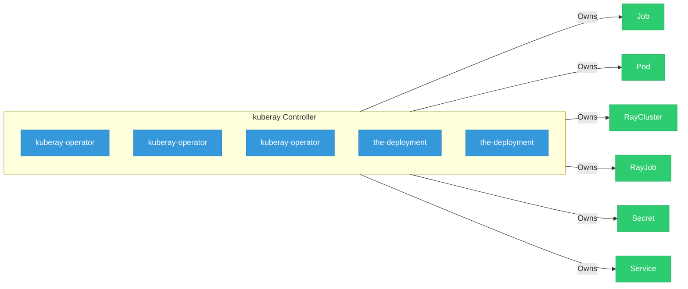

# kuberay

> **Architecture snapshot: 2026-05-20** (2026-05-20)

**Repository:** ray-project/kuberay  
**Analyzer:** arch-analyzer 0.2.0  
**Extracted:** 2026-05-20T04:17:23Z

## Summary

| Metric | Count |
|--------|-------|
| CRDs | 0 |
| Deployments | 5 |
| Services | 4 |
| Secrets | 1 |
| Cluster Roles | 0 |
| Controller Watches | 13 |

## Component Architecture

CRDs, controllers, and owned Kubernetes resources.

### CRDs

No CRDs found in analyzed sources.

## Dependencies

### Key External Dependencies

| Module | Version |
|--------|---------|
| github.com/go-logr/logr | v1.4.3 |
| github.com/go-logr/logr | v1.4.1 |
| github.com/go-logr/logr | v1.4.3 |
| github.com/go-logr/logr | v1.4.3 |
| github.com/go-logr/logr | v1.4.3 |
| github.com/go-logr/logr | v1.4.3 |
| github.com/go-logr/logr | v1.4.3 |
| github.com/go-logr/logr | v1.4.3 |
| github.com/go-logr/logr | v1.4.3 |
| github.com/go-logr/logr | v1.4.3 |
| github.com/go-logr/logr | v1.4.1 |
| github.com/go-logr/logr | v1.4.3 |
| github.com/go-logr/logr | v1.4.3 |
| github.com/go-logr/logr | v1.2.3 |
| github.com/go-logr/logr | v1.4.3 |
| github.com/go-logr/logr | v1.2.3 |
| github.com/go-logr/logr | v1.4.3 |
| github.com/go-logr/logr | v1.4.3 |
| github.com/go-logr/logr | v1.3.0 |
| github.com/go-logr/logr | v1.3.0 |
| github.com/go-logr/stdr | v1.2.2 |
| github.com/go-logr/stdr | v1.2.2 |
| github.com/go-logr/zapr | v1.3.0 |
| github.com/go-logr/zapr | v1.3.0 |
| github.com/go-logr/zapr | v1.3.0 |
| github.com/go-logr/zapr | v1.3.0 |
| github.com/go-logr/zapr | v1.3.0 |
| github.com/go-logr/zerologr | v1.2.3 |
| github.com/prometheus/client_golang | v1.23.2 |
| github.com/prometheus/client_golang | v1.23.2 |
| github.com/prometheus/client_golang | v1.23.2 |
| github.com/prometheus/client_golang | v1.23.2 |
| github.com/prometheus/client_golang | v1.23.2 |
| github.com/prometheus/client_golang | v1.23.2 |
| github.com/prometheus/client_model | v0.6.2 |
| github.com/prometheus/client_model | v0.6.2 |
| github.com/prometheus/client_model | v0.6.2 |
| github.com/prometheus/client_model | v0.6.2 |
| github.com/prometheus/client_model | v0.6.2 |
| github.com/prometheus/client_model | v0.6.2 |
| github.com/prometheus/client_model | v0.6.2 |
| github.com/prometheus/client_model | v0.6.2 |
| github.com/prometheus/common | v0.66.1 |
| github.com/prometheus/common | v0.67.5 |
| github.com/prometheus/common | v0.66.1 |
| github.com/prometheus/common | v0.67.5 |
| github.com/prometheus/procfs | v0.19.2 |
| github.com/prometheus/procfs | v0.16.1 |
| github.com/prometheus/procfs | v0.19.2 |
| github.com/prometheus/procfs | v0.16.1 |
| google.golang.org/grpc | v1.75.1 |
| google.golang.org/grpc | v1.79.3 |
| google.golang.org/grpc | v1.79.3 |
| google.golang.org/grpc | v1.79.3 |
| google.golang.org/grpc | v1.71.0 |
| google.golang.org/grpc | v1.71.0 |
| google.golang.org/grpc | v1.75.1 |
| google.golang.org/grpc | v1.78.0 |
| google.golang.org/grpc | v1.79.3 |
| google.golang.org/grpc | v1.29.1 |
| google.golang.org/grpc | v1.29.1 |
| google.golang.org/grpc | v1.78.0 |
| google.golang.org/grpc | v1.79.3 |
| google.golang.org/grpc/cmd/protoc-gen-go-grpc | v1.5.1 |
| google.golang.org/grpc/cmd/protoc-gen-go-grpc | v1.5.1 |
| k8s.io/api | v0.34.1 |
| k8s.io/api | v0.36.0 |
| k8s.io/api | v0.36.0 |
| k8s.io/api | v0.36.0 |
| k8s.io/api | v0.36.0 |
| k8s.io/api | v0.36.0 |
| k8s.io/api | v0.36.0 |
| k8s.io/api | v0.36.0 |
| k8s.io/api | v0.35.0 |
| k8s.io/api | v0.36.0 |
| k8s.io/api | v0.36.0 |
| k8s.io/api | v0.35.0 |
| k8s.io/api | v0.36.0 |
| k8s.io/api | v0.36.0 |
| k8s.io/api | v0.36.0 |
| k8s.io/api | v0.36.0 |
| k8s.io/api | v0.34.1 |
| k8s.io/api | v0.36.0 |
| k8s.io/api | v0.36.0 |
| k8s.io/api | v0.36.0 |
| k8s.io/apiextensions-apiserver | v0.36.0 |
| k8s.io/apiextensions-apiserver | v0.36.0 |
| k8s.io/apiextensions-apiserver | v0.34.1 |
| k8s.io/apiextensions-apiserver | v0.34.1 |
| k8s.io/apimachinery | v0.35.0 |
| k8s.io/apimachinery | v0.36.0 |
| k8s.io/apimachinery | v0.36.0 |
| k8s.io/apimachinery | v0.36.0 |
| k8s.io/apimachinery | v0.36.0 |
| k8s.io/apimachinery | v0.36.0 |
| k8s.io/apimachinery | v0.36.0 |
| k8s.io/apimachinery | v0.36.0 |
| k8s.io/apimachinery | v0.34.1 |
| k8s.io/apimachinery | v0.34.1 |
| k8s.io/apimachinery | v0.36.0 |
| k8s.io/apimachinery | v0.35.0 |
| k8s.io/apimachinery | v0.36.0 |
| k8s.io/apimachinery | v0.36.0 |
| k8s.io/apimachinery | v0.36.0 |
| k8s.io/apimachinery | v0.36.0 |
| k8s.io/apimachinery | v0.36.0 |
| k8s.io/apimachinery | v0.36.0 |
| k8s.io/apimachinery | v0.36.0 |
| k8s.io/apimachinery | v0.36.0 |
| k8s.io/apimachinery | v0.36.0 |
| k8s.io/apimachinery | v0.36.0 |
| k8s.io/apimachinery | v0.36.0 |
| k8s.io/apimachinery | v0.36.0 |
| k8s.io/apiserver | v0.36.0 |
| k8s.io/apiserver | v0.36.0 |
| k8s.io/apiserver | v0.36.0 |
| k8s.io/apiserver | v0.36.0 |
| k8s.io/apiserver | v0.36.0 |
| k8s.io/client-go | v0.36.0 |
| k8s.io/client-go | v0.36.0 |
| k8s.io/client-go | v0.36.0 |
| k8s.io/client-go | v0.36.0 |
| k8s.io/client-go | v0.36.0 |
| k8s.io/client-go | v0.36.0 |
| k8s.io/client-go | v0.36.0 |
| k8s.io/client-go | v0.34.1 |
| k8s.io/client-go | v0.35.0 |
| k8s.io/client-go | v0.34.1 |
| k8s.io/client-go | v0.36.0 |
| k8s.io/client-go | v0.36.0 |
| k8s.io/client-go | v0.36.0 |
| k8s.io/client-go | v0.36.0 |
| k8s.io/client-go | v0.36.0 |
| k8s.io/client-go | v0.36.0 |
| k8s.io/client-go | v0.35.0 |
| k8s.io/client-go | v0.36.0 |
| k8s.io/client-go | v0.36.0 |
| k8s.io/client-go | v0.36.0 |
| sigs.k8s.io/controller-runtime | v0.22.1 |
| sigs.k8s.io/controller-runtime | v0.22.4 |
| sigs.k8s.io/controller-runtime | v0.22.1 |
| sigs.k8s.io/controller-runtime | v0.23.1-0.20260424122448-c8b4b9d61fbd |
| sigs.k8s.io/controller-runtime | v0.23.1-0.20260424122448-c8b4b9d61fbd |

