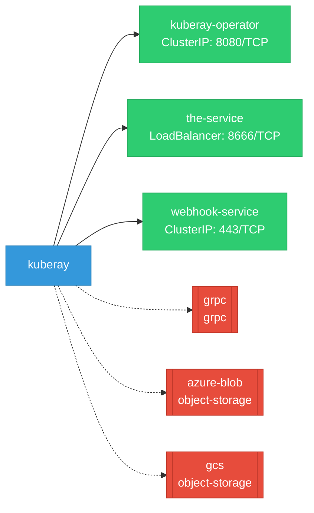

# kuberay: Network

## Service Map

*3 unique services (4 total, duplicates from test fixtures collapsed).*

### Services

| Name | Type | Ports | Source |
|------|------|-------|--------|
| kuberay-operator | ClusterIP | 8080/TCP | [`ray-operator/config/manager/service.yaml`](https://github.com/ray-project/kuberay/blob/1466289a1bcff3df4b0be5f0c804e178b7aa8e05/ray-operator/config/manager/service.yaml) |
| the-service | LoadBalancer | 8666/TCP | [`.gomod-cache/k8s.io/cli-runtime@v0.36.0/artifacts/kustomization/service.yaml`](https://github.com/ray-project/kuberay/blob/1466289a1bcff3df4b0be5f0c804e178b7aa8e05/.gomod-cache/k8s.io/cli-runtime@v0.36.0/artifacts/kustomization/service.yaml) |
| the-service | LoadBalancer | 8666/TCP | [`.gopath-loader/pkg/mod/k8s.io/cli-runtime@v0.36.0/artifacts/kustomization/service.yaml`](https://github.com/ray-project/kuberay/blob/1466289a1bcff3df4b0be5f0c804e178b7aa8e05/.gopath-loader/pkg/mod/k8s.io/cli-runtime@v0.36.0/artifacts/kustomization/service.yaml) |
| webhook-service | ClusterIP | 443/TCP | [`ray-operator/config/webhook/service.yaml`](https://github.com/ray-project/kuberay/blob/1466289a1bcff3df4b0be5f0c804e178b7aa8e05/ray-operator/config/webhook/service.yaml) |

!!! warning "No Network Policies"
    No NetworkPolicy resources were found in the analyzed sources. Network policies may exist in overlays, Helm values, or cluster-level configurations not captured by static analysis.

