# kueue: Dataflow

## Controller Watches

Kubernetes resources this controller monitors for changes. Each watch triggers reconciliation when the watched resource is created, updated, or deleted.

| Type | GVK | Source |
|------|-----|--------|
| For | /v1/Pod | [`pkg/controller/jobs/leaderworkerset/leaderworkerset_pod_reconciler.go:57`](https://github.com/opendatahub-io/kueue/blob/97024bd289d2cc5c9369b40d9f3483ab1483143d/pkg/controller/jobs/leaderworkerset/leaderworkerset_pod_reconciler.go#L57) |
| For | /v1/Pod | [`.gopath-loader/pkg/mod/sigs.k8s.io/lws@v0.5.1/pkg/controllers/pod_controller.go:346`](https://github.com/opendatahub-io/kueue/blob/97024bd289d2cc5c9369b40d9f3483ab1483143d/.gopath-loader/pkg/mod/sigs.k8s.io/lws@v0.5.1/pkg/controllers/pod_controller.go#L346) |
| For | /v1/Pod | [`.gomod-cache/sigs.k8s.io/jobset@v0.8.0/pkg/controllers/pod_controller.go:65`](https://github.com/opendatahub-io/kueue/blob/97024bd289d2cc5c9369b40d9f3483ab1483143d/.gomod-cache/sigs.k8s.io/jobset@v0.8.0/pkg/controllers/pod_controller.go#L65) |
| For | /v1/Pod | [`.gopath-loader/pkg/mod/sigs.k8s.io/jobset@v0.8.0/pkg/controllers/pod_controller.go:65`](https://github.com/opendatahub-io/kueue/blob/97024bd289d2cc5c9369b40d9f3483ab1483143d/.gopath-loader/pkg/mod/sigs.k8s.io/jobset@v0.8.0/pkg/controllers/pod_controller.go#L65) |
| For | /v1/Pod | [`.gomod-cache/sigs.k8s.io/lws@v0.5.1/pkg/controllers/pod_controller.go:346`](https://github.com/opendatahub-io/kueue/blob/97024bd289d2cc5c9369b40d9f3483ab1483143d/.gomod-cache/sigs.k8s.io/lws@v0.5.1/pkg/controllers/pod_controller.go#L346) |
| For | api/v1beta2/AppWrapper | [`.gomod-cache/github.com/project-codeflare/appwrapper@v1.1.0/internal/controller/appwrapper/appwrapper_controller.go:911`](https://github.com/opendatahub-io/kueue/blob/97024bd289d2cc5c9369b40d9f3483ab1483143d/.gomod-cache/github.com/project-codeflare/appwrapper@v1.1.0/internal/controller/appwrapper/appwrapper_controller.go#L911) |
| For | api/v1beta2/AppWrapper | [`.gopath-loader/pkg/mod/github.com/project-codeflare/appwrapper@v1.1.0/internal/controller/appwrapper/appwrapper_controller.go:911`](https://github.com/opendatahub-io/kueue/blob/97024bd289d2cc5c9369b40d9f3483ab1483143d/.gopath-loader/pkg/mod/github.com/project-codeflare/appwrapper@v1.1.0/internal/controller/appwrapper/appwrapper_controller.go#L911) |
| For | apps/v1/StatefulSet | [`pkg/controller/jobs/statefulset/statefulset_reconciler.go:145`](https://github.com/opendatahub-io/kueue/blob/97024bd289d2cc5c9369b40d9f3483ab1483143d/pkg/controller/jobs/statefulset/statefulset_reconciler.go#L145) |
| For | jobset/v1alpha2/JobSet | [`.gopath-loader/pkg/mod/sigs.k8s.io/jobset@v0.8.0/pkg/controllers/jobset_controller.go:232`](https://github.com/opendatahub-io/kueue/blob/97024bd289d2cc5c9369b40d9f3483ab1483143d/.gopath-loader/pkg/mod/sigs.k8s.io/jobset@v0.8.0/pkg/controllers/jobset_controller.go#L232) |
| For | jobset/v1alpha2/JobSet | [`.gomod-cache/sigs.k8s.io/jobset@v0.8.0/pkg/controllers/jobset_controller.go:232`](https://github.com/opendatahub-io/kueue/blob/97024bd289d2cc5c9369b40d9f3483ab1483143d/.gomod-cache/sigs.k8s.io/jobset@v0.8.0/pkg/controllers/jobset_controller.go#L232) |
| For | kubeflow.org/v2alpha1/TrainJob | [`.gomod-cache/github.com/kubeflow/training-operator@v1.9.0/pkg/controller.v2/trainjob_controller.go:227`](https://github.com/opendatahub-io/kueue/blob/97024bd289d2cc5c9369b40d9f3483ab1483143d/.gomod-cache/github.com/kubeflow/training-operator@v1.9.0/pkg/controller.v2/trainjob_controller.go#L227) |
| For | kubeflow.org/v2alpha1/TrainJob | [`.gopath-loader/pkg/mod/github.com/kubeflow/training-operator@v1.9.0/pkg/controller.v2/trainjob_controller.go:227`](https://github.com/opendatahub-io/kueue/blob/97024bd289d2cc5c9369b40d9f3483ab1483143d/.gopath-loader/pkg/mod/github.com/kubeflow/training-operator@v1.9.0/pkg/controller.v2/trainjob_controller.go#L227) |
| For | kueue/v1beta1/AdmissionCheck | [`pkg/controller/admissionchecks/provisioning/controller.go:849`](https://github.com/opendatahub-io/kueue/blob/97024bd289d2cc5c9369b40d9f3483ab1483143d/pkg/controller/admissionchecks/provisioning/controller.go#L849) |
| For | kueue/v1beta1/Workload | [`pkg/controller/admissionchecks/provisioning/controller.go:830`](https://github.com/opendatahub-io/kueue/blob/97024bd289d2cc5c9369b40d9f3483ab1483143d/pkg/controller/admissionchecks/provisioning/controller.go#L830) |
| For | leaderworkerset/v1/LeaderWorkerSet | [`.gopath-loader/pkg/mod/sigs.k8s.io/lws@v0.5.1/pkg/controllers/leaderworkerset_controller.go:195`](https://github.com/opendatahub-io/kueue/blob/97024bd289d2cc5c9369b40d9f3483ab1483143d/.gopath-loader/pkg/mod/sigs.k8s.io/lws@v0.5.1/pkg/controllers/leaderworkerset_controller.go#L195) |
| For | leaderworkerset/v1/LeaderWorkerSet | [`.gomod-cache/sigs.k8s.io/lws@v0.5.1/pkg/controllers/leaderworkerset_controller.go:195`](https://github.com/opendatahub-io/kueue/blob/97024bd289d2cc5c9369b40d9f3483ab1483143d/.gomod-cache/sigs.k8s.io/lws@v0.5.1/pkg/controllers/leaderworkerset_controller.go#L195) |
| For | leaderworkerset/v1/LeaderWorkerSet | [`pkg/controller/jobs/leaderworkerset/leaderworkerset_reconciler.go:83`](https://github.com/opendatahub-io/kueue/blob/97024bd289d2cc5c9369b40d9f3483ab1483143d/pkg/controller/jobs/leaderworkerset/leaderworkerset_reconciler.go#L83) |
| For | ray/v1/RayCluster | [`.gopath-loader/pkg/mod/github.com/ray-project/kuberay/ray-operator@v1.3.1/controllers/ray/raycluster_controller.go:1231`](https://github.com/opendatahub-io/kueue/blob/97024bd289d2cc5c9369b40d9f3483ab1483143d/.gopath-loader/pkg/mod/github.com/ray-project/kuberay/ray-operator@v1.3.1/controllers/ray/raycluster_controller.go#L1231) |
| For | ray/v1/RayCluster | [`.gomod-cache/github.com/ray-project/kuberay/ray-operator@v1.3.1/controllers/ray/raycluster_controller.go:1231`](https://github.com/opendatahub-io/kueue/blob/97024bd289d2cc5c9369b40d9f3483ab1483143d/.gomod-cache/github.com/ray-project/kuberay/ray-operator@v1.3.1/controllers/ray/raycluster_controller.go#L1231) |
| For | ray/v1/RayJob | [`.gopath-loader/pkg/mod/github.com/ray-project/kuberay/ray-operator@v1.3.1/controllers/ray/rayjob_controller.go:677`](https://github.com/opendatahub-io/kueue/blob/97024bd289d2cc5c9369b40d9f3483ab1483143d/.gopath-loader/pkg/mod/github.com/ray-project/kuberay/ray-operator@v1.3.1/controllers/ray/rayjob_controller.go#L677) |
| For | ray/v1/RayJob | [`.gomod-cache/github.com/ray-project/kuberay/ray-operator@v1.3.1/controllers/ray/rayjob_controller.go:677`](https://github.com/opendatahub-io/kueue/blob/97024bd289d2cc5c9369b40d9f3483ab1483143d/.gomod-cache/github.com/ray-project/kuberay/ray-operator@v1.3.1/controllers/ray/rayjob_controller.go#L677) |
| For | ray/v1/RayService | [`.gomod-cache/github.com/ray-project/kuberay/ray-operator@v1.3.1/controllers/ray/rayservice_controller.go:434`](https://github.com/opendatahub-io/kueue/blob/97024bd289d2cc5c9369b40d9f3483ab1483143d/.gomod-cache/github.com/ray-project/kuberay/ray-operator@v1.3.1/controllers/ray/rayservice_controller.go#L434) |
| For | ray/v1/RayService | [`.gopath-loader/pkg/mod/github.com/ray-project/kuberay/ray-operator@v1.3.1/controllers/ray/rayservice_controller.go:434`](https://github.com/opendatahub-io/kueue/blob/97024bd289d2cc5c9369b40d9f3483ab1483143d/.gopath-loader/pkg/mod/github.com/ray-project/kuberay/ray-operator@v1.3.1/controllers/ray/rayservice_controller.go#L434) |
| Owns | /v1/Pod | [`.gopath-loader/pkg/mod/github.com/ray-project/kuberay/ray-operator@v1.3.1/controllers/ray/raycluster_controller.go:1236`](https://github.com/opendatahub-io/kueue/blob/97024bd289d2cc5c9369b40d9f3483ab1483143d/.gopath-loader/pkg/mod/github.com/ray-project/kuberay/ray-operator@v1.3.1/controllers/ray/raycluster_controller.go#L1236) |
| Owns | /v1/Pod | [`.gomod-cache/github.com/ray-project/kuberay/ray-operator@v1.3.1/controllers/ray/raycluster_controller.go:1236`](https://github.com/opendatahub-io/kueue/blob/97024bd289d2cc5c9369b40d9f3483ab1483143d/.gomod-cache/github.com/ray-project/kuberay/ray-operator@v1.3.1/controllers/ray/raycluster_controller.go#L1236) |
| Owns | /v1/Service | [`.gopath-loader/pkg/mod/github.com/ray-project/kuberay/ray-operator@v1.3.1/controllers/ray/rayservice_controller.go:440`](https://github.com/opendatahub-io/kueue/blob/97024bd289d2cc5c9369b40d9f3483ab1483143d/.gopath-loader/pkg/mod/github.com/ray-project/kuberay/ray-operator@v1.3.1/controllers/ray/rayservice_controller.go#L440) |
| Owns | /v1/Service | [`.gomod-cache/github.com/ray-project/kuberay/ray-operator@v1.3.1/controllers/ray/rayservice_controller.go:440`](https://github.com/opendatahub-io/kueue/blob/97024bd289d2cc5c9369b40d9f3483ab1483143d/.gomod-cache/github.com/ray-project/kuberay/ray-operator@v1.3.1/controllers/ray/rayservice_controller.go#L440) |
| Owns | /v1/Service | [`.gopath-loader/pkg/mod/sigs.k8s.io/jobset@v0.8.0/pkg/controllers/jobset_controller.go:234`](https://github.com/opendatahub-io/kueue/blob/97024bd289d2cc5c9369b40d9f3483ab1483143d/.gopath-loader/pkg/mod/sigs.k8s.io/jobset@v0.8.0/pkg/controllers/jobset_controller.go#L234) |
| Owns | /v1/Service | [`.gopath-loader/pkg/mod/github.com/ray-project/kuberay/ray-operator@v1.3.1/controllers/ray/raycluster_controller.go:1237`](https://github.com/opendatahub-io/kueue/blob/97024bd289d2cc5c9369b40d9f3483ab1483143d/.gopath-loader/pkg/mod/github.com/ray-project/kuberay/ray-operator@v1.3.1/controllers/ray/raycluster_controller.go#L1237) |
| Owns | /v1/Service | [`.gopath-loader/pkg/mod/sigs.k8s.io/lws@v0.5.1/pkg/controllers/leaderworkerset_controller.go:197`](https://github.com/opendatahub-io/kueue/blob/97024bd289d2cc5c9369b40d9f3483ab1483143d/.gopath-loader/pkg/mod/sigs.k8s.io/lws@v0.5.1/pkg/controllers/leaderworkerset_controller.go#L197) |
| Owns | /v1/Service | [`.gomod-cache/github.com/ray-project/kuberay/ray-operator@v1.3.1/controllers/ray/raycluster_controller.go:1237`](https://github.com/opendatahub-io/kueue/blob/97024bd289d2cc5c9369b40d9f3483ab1483143d/.gomod-cache/github.com/ray-project/kuberay/ray-operator@v1.3.1/controllers/ray/raycluster_controller.go#L1237) |
| Owns | /v1/Service | [`.gopath-loader/pkg/mod/github.com/ray-project/kuberay/ray-operator@v1.3.1/controllers/ray/rayjob_controller.go:679`](https://github.com/opendatahub-io/kueue/blob/97024bd289d2cc5c9369b40d9f3483ab1483143d/.gopath-loader/pkg/mod/github.com/ray-project/kuberay/ray-operator@v1.3.1/controllers/ray/rayjob_controller.go#L679) |
| Owns | /v1/Service | [`.gomod-cache/github.com/ray-project/kuberay/ray-operator@v1.3.1/controllers/ray/rayjob_controller.go:679`](https://github.com/opendatahub-io/kueue/blob/97024bd289d2cc5c9369b40d9f3483ab1483143d/.gomod-cache/github.com/ray-project/kuberay/ray-operator@v1.3.1/controllers/ray/rayjob_controller.go#L679) |
| Owns | /v1/Service | [`.gomod-cache/sigs.k8s.io/lws@v0.5.1/pkg/controllers/leaderworkerset_controller.go:197`](https://github.com/opendatahub-io/kueue/blob/97024bd289d2cc5c9369b40d9f3483ab1483143d/.gomod-cache/sigs.k8s.io/lws@v0.5.1/pkg/controllers/leaderworkerset_controller.go#L197) |
| Owns | /v1/Service | [`.gomod-cache/sigs.k8s.io/jobset@v0.8.0/pkg/controllers/jobset_controller.go:234`](https://github.com/opendatahub-io/kueue/blob/97024bd289d2cc5c9369b40d9f3483ab1483143d/.gomod-cache/sigs.k8s.io/jobset@v0.8.0/pkg/controllers/jobset_controller.go#L234) |
| Owns | apps/v1/StatefulSet | [`.gomod-cache/sigs.k8s.io/lws@v0.5.1/pkg/controllers/leaderworkerset_controller.go:196`](https://github.com/opendatahub-io/kueue/blob/97024bd289d2cc5c9369b40d9f3483ab1483143d/.gomod-cache/sigs.k8s.io/lws@v0.5.1/pkg/controllers/leaderworkerset_controller.go#L196) |
| Owns | apps/v1/StatefulSet | [`.gopath-loader/pkg/mod/sigs.k8s.io/lws@v0.5.1/pkg/controllers/pod_controller.go:357`](https://github.com/opendatahub-io/kueue/blob/97024bd289d2cc5c9369b40d9f3483ab1483143d/.gopath-loader/pkg/mod/sigs.k8s.io/lws@v0.5.1/pkg/controllers/pod_controller.go#L357) |
| Owns | apps/v1/StatefulSet | [`.gomod-cache/sigs.k8s.io/lws@v0.5.1/pkg/controllers/pod_controller.go:357`](https://github.com/opendatahub-io/kueue/blob/97024bd289d2cc5c9369b40d9f3483ab1483143d/.gomod-cache/sigs.k8s.io/lws@v0.5.1/pkg/controllers/pod_controller.go#L357) |
| Owns | apps/v1/StatefulSet | [`.gopath-loader/pkg/mod/sigs.k8s.io/lws@v0.5.1/pkg/controllers/leaderworkerset_controller.go:196`](https://github.com/opendatahub-io/kueue/blob/97024bd289d2cc5c9369b40d9f3483ab1483143d/.gopath-loader/pkg/mod/sigs.k8s.io/lws@v0.5.1/pkg/controllers/leaderworkerset_controller.go#L196) |
| Owns | autoscaling.x-k8s.io/v1beta1/ProvisioningRequest | [`pkg/controller/admissionchecks/provisioning/controller.go:831`](https://github.com/opendatahub-io/kueue/blob/97024bd289d2cc5c9369b40d9f3483ab1483143d/pkg/controller/admissionchecks/provisioning/controller.go#L831) |
| Owns | batch/v1/Job | [`.gomod-cache/github.com/ray-project/kuberay/ray-operator@v1.3.1/controllers/ray/rayjob_controller.go:680`](https://github.com/opendatahub-io/kueue/blob/97024bd289d2cc5c9369b40d9f3483ab1483143d/.gomod-cache/github.com/ray-project/kuberay/ray-operator@v1.3.1/controllers/ray/rayjob_controller.go#L680) |
| Owns | batch/v1/Job | [`.gopath-loader/pkg/mod/github.com/ray-project/kuberay/ray-operator@v1.3.1/controllers/ray/rayjob_controller.go:680`](https://github.com/opendatahub-io/kueue/blob/97024bd289d2cc5c9369b40d9f3483ab1483143d/.gopath-loader/pkg/mod/github.com/ray-project/kuberay/ray-operator@v1.3.1/controllers/ray/rayjob_controller.go#L680) |
| Owns | batch/v1/Job | [`.gopath-loader/pkg/mod/sigs.k8s.io/jobset@v0.8.0/pkg/controllers/jobset_controller.go:233`](https://github.com/opendatahub-io/kueue/blob/97024bd289d2cc5c9369b40d9f3483ab1483143d/.gopath-loader/pkg/mod/sigs.k8s.io/jobset@v0.8.0/pkg/controllers/jobset_controller.go#L233) |
| Owns | batch/v1/Job | [`.gomod-cache/sigs.k8s.io/jobset@v0.8.0/pkg/controllers/jobset_controller.go:233`](https://github.com/opendatahub-io/kueue/blob/97024bd289d2cc5c9369b40d9f3483ab1483143d/.gomod-cache/sigs.k8s.io/jobset@v0.8.0/pkg/controllers/jobset_controller.go#L233) |
| Owns | kueue/v1beta1/Workload | [`pkg/controller/jobframework/reconciler.go:1281`](https://github.com/opendatahub-io/kueue/blob/97024bd289d2cc5c9369b40d9f3483ab1483143d/pkg/controller/jobframework/reconciler.go#L1281) |
| Owns | ray/v1/RayCluster | [`.gomod-cache/github.com/ray-project/kuberay/ray-operator@v1.3.1/controllers/ray/rayservice_controller.go:439`](https://github.com/opendatahub-io/kueue/blob/97024bd289d2cc5c9369b40d9f3483ab1483143d/.gomod-cache/github.com/ray-project/kuberay/ray-operator@v1.3.1/controllers/ray/rayservice_controller.go#L439) |
| Owns | ray/v1/RayCluster | [`.gopath-loader/pkg/mod/github.com/ray-project/kuberay/ray-operator@v1.3.1/controllers/ray/rayservice_controller.go:439`](https://github.com/opendatahub-io/kueue/blob/97024bd289d2cc5c9369b40d9f3483ab1483143d/.gopath-loader/pkg/mod/github.com/ray-project/kuberay/ray-operator@v1.3.1/controllers/ray/rayservice_controller.go#L439) |
| Owns | ray/v1/RayCluster | [`.gopath-loader/pkg/mod/github.com/ray-project/kuberay/ray-operator@v1.3.1/controllers/ray/rayjob_controller.go:678`](https://github.com/opendatahub-io/kueue/blob/97024bd289d2cc5c9369b40d9f3483ab1483143d/.gopath-loader/pkg/mod/github.com/ray-project/kuberay/ray-operator@v1.3.1/controllers/ray/rayjob_controller.go#L678) |
| Owns | ray/v1/RayCluster | [`.gomod-cache/github.com/ray-project/kuberay/ray-operator@v1.3.1/controllers/ray/rayjob_controller.go:678`](https://github.com/opendatahub-io/kueue/blob/97024bd289d2cc5c9369b40d9f3483ab1483143d/.gomod-cache/github.com/ray-project/kuberay/ray-operator@v1.3.1/controllers/ray/rayjob_controller.go#L678) |
| Watches | /v1/LimitRange | [`pkg/controller/core/workload_controller.go:797`](https://github.com/opendatahub-io/kueue/blob/97024bd289d2cc5c9369b40d9f3483ab1483143d/pkg/controller/core/workload_controller.go#L797) |
| Watches | /v1/Namespace | [`pkg/controller/core/clusterqueue_controller.go:591`](https://github.com/opendatahub-io/kueue/blob/97024bd289d2cc5c9369b40d9f3483ab1483143d/pkg/controller/core/clusterqueue_controller.go#L591) |
| Watches | /v1/Pod | [`pkg/controller/jobs/statefulset/statefulset_reconciler.go:147`](https://github.com/opendatahub-io/kueue/blob/97024bd289d2cc5c9369b40d9f3483ab1483143d/pkg/controller/jobs/statefulset/statefulset_reconciler.go#L147) |
| Watches | /v1/Pod | [`.gomod-cache/github.com/project-codeflare/appwrapper@v1.1.0/internal/controller/appwrapper/appwrapper_controller.go:912`](https://github.com/opendatahub-io/kueue/blob/97024bd289d2cc5c9369b40d9f3483ab1483143d/.gomod-cache/github.com/project-codeflare/appwrapper@v1.1.0/internal/controller/appwrapper/appwrapper_controller.go#L912) |
| Watches | /v1/Pod | [`pkg/controller/jobs/pod/pod_controller.go:131`](https://github.com/opendatahub-io/kueue/blob/97024bd289d2cc5c9369b40d9f3483ab1483143d/pkg/controller/jobs/pod/pod_controller.go#L131) |
| Watches | /v1/Pod | [`.gopath-loader/pkg/mod/github.com/project-codeflare/appwrapper@v1.1.0/internal/controller/appwrapper/appwrapper_controller.go:912`](https://github.com/opendatahub-io/kueue/blob/97024bd289d2cc5c9369b40d9f3483ab1483143d/.gopath-loader/pkg/mod/github.com/project-codeflare/appwrapper@v1.1.0/internal/controller/appwrapper/appwrapper_controller.go#L912) |
| Watches | apps/v1/StatefulSet | [`.gomod-cache/sigs.k8s.io/lws@v0.5.1/pkg/controllers/leaderworkerset_controller.go:198`](https://github.com/opendatahub-io/kueue/blob/97024bd289d2cc5c9369b40d9f3483ab1483143d/.gomod-cache/sigs.k8s.io/lws@v0.5.1/pkg/controllers/leaderworkerset_controller.go#L198) |
| Watches | apps/v1/StatefulSet | [`.gopath-loader/pkg/mod/sigs.k8s.io/lws@v0.5.1/pkg/controllers/leaderworkerset_controller.go:198`](https://github.com/opendatahub-io/kueue/blob/97024bd289d2cc5c9369b40d9f3483ab1483143d/.gopath-loader/pkg/mod/sigs.k8s.io/lws@v0.5.1/pkg/controllers/leaderworkerset_controller.go#L198) |
| Watches | kueue/v1beta1/AdmissionCheck | [`pkg/controller/admissionchecks/provisioning/controller.go:832`](https://github.com/opendatahub-io/kueue/blob/97024bd289d2cc5c9369b40d9f3483ab1483143d/pkg/controller/admissionchecks/provisioning/controller.go#L832) |
| Watches | kueue/v1beta1/ClusterQueue | [`pkg/controller/core/workload_controller.go:799`](https://github.com/opendatahub-io/kueue/blob/97024bd289d2cc5c9369b40d9f3483ab1483143d/pkg/controller/core/workload_controller.go#L799) |
| Watches | kueue/v1beta1/ClusterQueue | [`pkg/controller/core/localqueue_controller.go:338`](https://github.com/opendatahub-io/kueue/blob/97024bd289d2cc5c9369b40d9f3483ab1483143d/pkg/controller/core/localqueue_controller.go#L338) |
| Watches | kueue/v1beta1/LocalQueue | [`pkg/controller/core/workload_controller.go:800`](https://github.com/opendatahub-io/kueue/blob/97024bd289d2cc5c9369b40d9f3483ab1483143d/pkg/controller/core/workload_controller.go#L800) |
| Watches | kueue/v1beta1/ProvisioningRequestConfig | [`pkg/controller/admissionchecks/provisioning/controller.go:833`](https://github.com/opendatahub-io/kueue/blob/97024bd289d2cc5c9369b40d9f3483ab1483143d/pkg/controller/admissionchecks/provisioning/controller.go#L833) |
| Watches | kueue/v1beta1/ProvisioningRequestConfig | [`pkg/controller/admissionchecks/provisioning/controller.go:850`](https://github.com/opendatahub-io/kueue/blob/97024bd289d2cc5c9369b40d9f3483ab1483143d/pkg/controller/admissionchecks/provisioning/controller.go#L850) |
| Watches | kueue/v1beta1/ResourceFlavor | [`pkg/controller/tas/topology_controller.go:82`](https://github.com/opendatahub-io/kueue/blob/97024bd289d2cc5c9369b40d9f3483ab1483143d/pkg/controller/tas/topology_controller.go#L82) |
| Watches | kueue/v1beta1/Workload | [`pkg/controller/jobs/job/job_controller.go:88`](https://github.com/opendatahub-io/kueue/blob/97024bd289d2cc5c9369b40d9f3483ab1483143d/pkg/controller/jobs/job/job_controller.go#L88) |
| Watches | kueue/v1beta1/Workload | [`pkg/controller/jobs/pod/pod_controller.go:132`](https://github.com/opendatahub-io/kueue/blob/97024bd289d2cc5c9369b40d9f3483ab1483143d/pkg/controller/jobs/pod/pod_controller.go#L132) |
| Watches | node/v1/RuntimeClass | [`pkg/controller/core/workload_controller.go:798`](https://github.com/opendatahub-io/kueue/blob/97024bd289d2cc5c9369b40d9f3483ab1483143d/pkg/controller/core/workload_controller.go#L798) |

### Programmatic Resource Operations

| Verb | Kind | Group | Condition |
|------|------|-------|----------|
| patch | Workload | kueue |  |
| update | Workload | kueue |  |
| update | AdmissionCheck | kueue |  |
| create | Workload | kueue |  |
| update | ClusterQueue | kueue |  |
| update | ResourceFlavor | kueue |  |
| update | Topology | kueue |  |

## Reconciliation Flow

How the controller interacts with the Kubernetes API during reconciliation.

```mermaid
sequenceDiagram
    %% Static dataflow for kueue

    participant KubernetesAPI as Kubernetes API
    participant bind as bind
    participant controller_manager as controller-manager
    participant kuberay_operator as kuberay-operator
    participant mpi_operator as mpi-operator
    participant the_deployment as the-deployment
    participant training_operator as training-operator
    participant training_operator_v2 as training-operator-v2

    KubernetesAPI->>+bind: Watch Pod (reconcile)
    KubernetesAPI->>+bind: Watch Pod (reconcile)
    KubernetesAPI->>+bind: Watch Pod (reconcile)
    KubernetesAPI->>+bind: Watch Pod (reconcile)
    KubernetesAPI->>+bind: Watch Pod (reconcile)
    KubernetesAPI->>+bind: Watch AppWrapper (reconcile)
    KubernetesAPI->>+bind: Watch AppWrapper (reconcile)
    KubernetesAPI->>+bind: Watch StatefulSet (reconcile)
    KubernetesAPI->>+bind: Watch JobSet (reconcile)
    KubernetesAPI->>+bind: Watch JobSet (reconcile)
    KubernetesAPI->>+bind: Watch TrainJob (reconcile)
    KubernetesAPI->>+bind: Watch TrainJob (reconcile)
    KubernetesAPI->>+bind: Watch AdmissionCheck (reconcile)
    KubernetesAPI->>+bind: Watch Workload (reconcile)
    KubernetesAPI->>+bind: Watch LeaderWorkerSet (reconcile)
    KubernetesAPI->>+bind: Watch LeaderWorkerSet (reconcile)
    KubernetesAPI->>+bind: Watch LeaderWorkerSet (reconcile)
    KubernetesAPI->>+bind: Watch RayCluster (reconcile)
    KubernetesAPI->>+bind: Watch RayCluster (reconcile)
    KubernetesAPI->>+bind: Watch RayJob (reconcile)
    KubernetesAPI->>+bind: Watch RayJob (reconcile)
    KubernetesAPI->>+bind: Watch RayService (reconcile)
    KubernetesAPI->>+bind: Watch RayService (reconcile)
    bind->>KubernetesAPI: Create/Update Pod
    bind->>KubernetesAPI: Create/Update Pod
    bind->>KubernetesAPI: Create/Update Service
    bind->>KubernetesAPI: Create/Update Service
    bind->>KubernetesAPI: Create/Update Service
    bind->>KubernetesAPI: Create/Update Service
    bind->>KubernetesAPI: Create/Update Service
    bind->>KubernetesAPI: Create/Update Service
    bind->>KubernetesAPI: Create/Update Service
    bind->>KubernetesAPI: Create/Update Service
    bind->>KubernetesAPI: Create/Update Service
    bind->>KubernetesAPI: Create/Update Service
    bind->>KubernetesAPI: Create/Update StatefulSet
    bind->>KubernetesAPI: Create/Update StatefulSet
    bind->>KubernetesAPI: Create/Update StatefulSet
    bind->>KubernetesAPI: Create/Update StatefulSet
    bind->>KubernetesAPI: Create/Update ProvisioningRequest
    bind->>KubernetesAPI: Create/Update Job
    bind->>KubernetesAPI: Create/Update Job
    bind->>KubernetesAPI: Create/Update Job
    bind->>KubernetesAPI: Create/Update Job
    bind->>KubernetesAPI: Create/Update Workload
    bind->>KubernetesAPI: Create/Update RayCluster
    bind->>KubernetesAPI: Create/Update RayCluster
    bind->>KubernetesAPI: Create/Update RayCluster
    bind->>KubernetesAPI: Create/Update RayCluster
    KubernetesAPI-->>+bind: Watch LimitRange (informer)
    KubernetesAPI-->>+bind: Watch Namespace (informer)
    KubernetesAPI-->>+bind: Watch Pod (informer)
    KubernetesAPI-->>+bind: Watch Pod (informer)
    KubernetesAPI-->>+bind: Watch Pod (informer)
    KubernetesAPI-->>+bind: Watch Pod (informer)
    KubernetesAPI-->>+bind: Watch StatefulSet (informer)
    KubernetesAPI-->>+bind: Watch StatefulSet (informer)
    KubernetesAPI-->>+bind: Watch AdmissionCheck (informer)
    KubernetesAPI-->>+bind: Watch ClusterQueue (informer)
    KubernetesAPI-->>+bind: Watch ClusterQueue (informer)
    KubernetesAPI-->>+bind: Watch LocalQueue (informer)
    KubernetesAPI-->>+bind: Watch ProvisioningRequestConfig (informer)
    KubernetesAPI-->>+bind: Watch ProvisioningRequestConfig (informer)
    KubernetesAPI-->>+bind: Watch ResourceFlavor (informer)
    KubernetesAPI-->>+bind: Watch Workload (informer)
    KubernetesAPI-->>+bind: Watch Workload (informer)
    KubernetesAPI-->>+bind: Watch RuntimeClass (informer)

    Note over bind: Exposed Services
    Note right of bind: kuberay-operator:8080/TCP [monitoring-port]
    Note right of bind: kuberay-operator:8080/TCP [monitoring-port]
    Note right of bind: the-service:8666/TCP []
    Note right of bind: the-service:8666/TCP []
    Note right of bind: training-operator:8080/TCP [monitoring-port]
    Note right of bind: training-operator:443/TCP [webhook-server]
    Note right of bind: training-operator:8080/TCP [monitoring-port]
    Note right of bind: training-operator:443/TCP [webhook-server]
    Note right of bind: visibility-server:443/TCP [https]
    Note right of bind: webhook-service:443/TCP []
    Note right of bind: webhook-service:443/TCP []
    Note right of bind: webhook-service:443/TCP []
    Note right of bind: webhook-service:443/TCP []
    Note right of bind: webhook-service:443/TCP []
    Note right of bind: webhook-service:443/TCP []
    Note right of bind: webhook-service:443/TCP []
    Note right of bind: webhook-service:443/TCP []
    Note right of bind: webhook-service:443/TCP []

    Note over KubernetesAPI: Defined CRDs
    Note right of KubernetesAPI: ClusterQueue (visibility.kueue.x-k8s.io/v1beta1)
    Note right of KubernetesAPI: LocalQueue (visibility.kueue.x-k8s.io/v1beta1)
```

### Webhooks

| Name | Type | Path | Failure Policy | Service | Overlays | Enable Condition | Sources |
|------|------|------|----------------|---------|----------|------------------|----------|
| ClusterQueueWebhook-webhook | mutating | /mutate-kueue-x-k8s-io-v1beta1-clusterqueue |  |  |  |  |  |
| ClusterQueueWebhook-webhook | validating | /validate-kueue-x-k8s-io-v1beta1-clusterqueue |  |  |  |  |  |
| JobControl-webhook | mutating | /mutate-kubeflow-org-v1-tfjob |  |  |  |  |  |
| JobControl-webhook | mutating | /mutate-kubeflow-org-v1-pytorchjob |  |  |  |  |  |
| JobControl-webhook | mutating | /mutate-kubeflow-org-v1-paddlejob |  |  |  |  |  |
| JobControl-webhook | validating | /validate-kubeflow-org-v1-pytorchjob |  |  |  |  |  |
| JobControl-webhook | validating | /validate-kubeflow-org-v1-xgboostjob |  |  |  |  |  |
| JobControl-webhook | validating | /validate-kubeflow-org-v1-tfjob |  |  |  |  |  |
| JobControl-webhook | mutating | /mutate-kubeflow-org-v1-xgboostjob |  |  |  |  |  |
| JobControl-webhook | validating | /validate-kubeflow-org-v1-paddlejob |  |  |  |  |  |
| JobWebhook-webhook | validating | /validate-batch-v1-job |  |  |  |  |  |
| JobWebhook-webhook | mutating | /mutate-batch-v1-job |  |  |  |  |  |
| MpiJobWebhook-webhook | validating | /validate-kubeflow-org-v2beta1-mpijob |  |  |  |  |  |
| MpiJobWebhook-webhook | mutating | /mutate-kubeflow-org-v2beta1-mpijob |  |  |  |  |  |
| RayClusterWebhook-webhook | mutating | /mutate-ray-io-v1-raycluster |  |  |  |  |  |
| RayJobWebhook-webhook | mutating | /mutate-ray-io-v1-rayjob |  |  |  |  |  |
| RayJobWebhook-webhook | validating | /validate-ray-io-v1-rayjob |  |  |  |  |  |
| ResourceFlavorWebhook-webhook | mutating | /mutate-kueue-x-k8s-io-v1beta1-resourceflavor |  |  |  |  |  |
| ResourceFlavorWebhook-webhook | validating | /validate-kueue-x-k8s-io-v1beta1-resourceflavor |  |  |  |  |  |
| Webhook-webhook | validating | /validate-apps-v1-statefulset |  |  |  |  |  |
| Webhook-webhook | validating | /validate-apps-v1-deployment |  |  |  |  |  |
| Webhook-webhook | mutating | /mutate-apps-v1-deployment |  |  |  |  |  |
| Webhook-webhook | mutating | /mutate-apps-v1-statefulset |  |  |  |  |  |
| WorkloadWebhook-webhook | validating | /validate-kueue-x-k8s-io-v1beta1-workload |  |  |  |  |  |
| WorkloadWebhook-webhook | mutating | /mutate-kueue-x-k8s-io-v1beta1-workload |  |  |  |  |  |
| mappwrapper.kb.io | mutating | /mutate-workload-codeflare-dev-v1beta2-appwrapper | fail |  |  |  | [`.gopath-loader/pkg/mod/github.com/project-codeflare/appwrapper@v1.1.0/internal/webhook/appwrapper_webhook.go`](https://github.com/opendatahub-io/kueue/blob/97024bd289d2cc5c9369b40d9f3483ab1483143d/.gopath-loader/pkg/mod/github.com/project-codeflare/appwrapper@v1.1.0/internal/webhook/appwrapper_webhook.go), [`.gopath-loader/pkg/mod/github.com/project-codeflare/appwrapper@v1.1.0/internal/webhook/appwrapper_webhook.go`](https://github.com/opendatahub-io/kueue/blob/97024bd289d2cc5c9369b40d9f3483ab1483143d/.gopath-loader/pkg/mod/github.com/project-codeflare/appwrapper@v1.1.0/internal/webhook/appwrapper_webhook.go) |
| mappwrapper.kb.io | mutating | /mutate-workload-codeflare-dev-v1beta2-appwrapper | fail |  |  |  | [`.gomod-cache/github.com/project-codeflare/appwrapper@v1.1.0/internal/webhook/appwrapper_webhook.go`](https://github.com/opendatahub-io/kueue/blob/97024bd289d2cc5c9369b40d9f3483ab1483143d/.gomod-cache/github.com/project-codeflare/appwrapper@v1.1.0/internal/webhook/appwrapper_webhook.go), [`.gomod-cache/github.com/project-codeflare/appwrapper@v1.1.0/internal/webhook/appwrapper_webhook.go`](https://github.com/opendatahub-io/kueue/blob/97024bd289d2cc5c9369b40d9f3483ab1483143d/.gomod-cache/github.com/project-codeflare/appwrapper@v1.1.0/internal/webhook/appwrapper_webhook.go) |
| mdeployment.kb.io | mutating |  |  |  |  |  | [`config/rhoai/mutating_webhook_patch.yaml`](https://github.com/opendatahub-io/kueue/blob/97024bd289d2cc5c9369b40d9f3483ab1483143d/config/rhoai/mutating_webhook_patch.yaml) |
| mjob.kb.io | mutating |  |  |  |  |  | [`config/rhoai/mutating_webhook_patch.yaml`](https://github.com/opendatahub-io/kueue/blob/97024bd289d2cc5c9369b40d9f3483ab1483143d/config/rhoai/mutating_webhook_patch.yaml) |
| mjobset.kb.io | mutating | /mutate-jobset-x-k8s-io-v1alpha2-jobset | fail |  |  |  | [`.gomod-cache/sigs.k8s.io/jobset@v0.8.0/pkg/webhooks/jobset_webhook.go`](https://github.com/opendatahub-io/kueue/blob/97024bd289d2cc5c9369b40d9f3483ab1483143d/.gomod-cache/sigs.k8s.io/jobset@v0.8.0/pkg/webhooks/jobset_webhook.go), [`.gomod-cache/sigs.k8s.io/jobset@v0.8.0/pkg/webhooks/jobset_webhook.go`](https://github.com/opendatahub-io/kueue/blob/97024bd289d2cc5c9369b40d9f3483ab1483143d/.gomod-cache/sigs.k8s.io/jobset@v0.8.0/pkg/webhooks/jobset_webhook.go) |
| mjobset.kb.io | mutating | /mutate-jobset-x-k8s-io-v1alpha2-jobset | fail |  |  |  | [`.gopath-loader/pkg/mod/sigs.k8s.io/jobset@v0.8.0/pkg/webhooks/jobset_webhook.go`](https://github.com/opendatahub-io/kueue/blob/97024bd289d2cc5c9369b40d9f3483ab1483143d/.gopath-loader/pkg/mod/sigs.k8s.io/jobset@v0.8.0/pkg/webhooks/jobset_webhook.go), [`.gopath-loader/pkg/mod/sigs.k8s.io/jobset@v0.8.0/pkg/webhooks/jobset_webhook.go`](https://github.com/opendatahub-io/kueue/blob/97024bd289d2cc5c9369b40d9f3483ab1483143d/.gopath-loader/pkg/mod/sigs.k8s.io/jobset@v0.8.0/pkg/webhooks/jobset_webhook.go) |
| mleaderworkerset.kb.io | mutating | /mutate-leaderworkerset-x-k8s-io-v1-leaderworkerset | fail |  |  |  | [`.gopath-loader/pkg/mod/sigs.k8s.io/lws@v0.5.1/pkg/webhooks/leaderworkerset_webhook.go`](https://github.com/opendatahub-io/kueue/blob/97024bd289d2cc5c9369b40d9f3483ab1483143d/.gopath-loader/pkg/mod/sigs.k8s.io/lws@v0.5.1/pkg/webhooks/leaderworkerset_webhook.go), [`.gopath-loader/pkg/mod/sigs.k8s.io/lws@v0.5.1/pkg/webhooks/leaderworkerset_webhook.go`](https://github.com/opendatahub-io/kueue/blob/97024bd289d2cc5c9369b40d9f3483ab1483143d/.gopath-loader/pkg/mod/sigs.k8s.io/lws@v0.5.1/pkg/webhooks/leaderworkerset_webhook.go) |
| mleaderworkerset.kb.io | mutating | /mutate-leaderworkerset-x-k8s-io-v1-leaderworkerset | fail |  |  |  | [`.gomod-cache/sigs.k8s.io/lws@v0.5.1/pkg/webhooks/leaderworkerset_webhook.go`](https://github.com/opendatahub-io/kueue/blob/97024bd289d2cc5c9369b40d9f3483ab1483143d/.gomod-cache/sigs.k8s.io/lws@v0.5.1/pkg/webhooks/leaderworkerset_webhook.go), [`.gomod-cache/sigs.k8s.io/lws@v0.5.1/pkg/webhooks/leaderworkerset_webhook.go`](https://github.com/opendatahub-io/kueue/blob/97024bd289d2cc5c9369b40d9f3483ab1483143d/.gomod-cache/sigs.k8s.io/lws@v0.5.1/pkg/webhooks/leaderworkerset_webhook.go) |
| mpod.kb.io | mutating | /mutate--v1-pod | fail |  |  |  | [`.gopath-loader/pkg/mod/sigs.k8s.io/lws@v0.5.1/pkg/webhooks/pod_webhook.go`](https://github.com/opendatahub-io/kueue/blob/97024bd289d2cc5c9369b40d9f3483ab1483143d/.gopath-loader/pkg/mod/sigs.k8s.io/lws@v0.5.1/pkg/webhooks/pod_webhook.go), [`.gopath-loader/pkg/mod/sigs.k8s.io/lws@v0.5.1/pkg/webhooks/pod_webhook.go`](https://github.com/opendatahub-io/kueue/blob/97024bd289d2cc5c9369b40d9f3483ab1483143d/.gopath-loader/pkg/mod/sigs.k8s.io/lws@v0.5.1/pkg/webhooks/pod_webhook.go) |
| mpod.kb.io | mutating |  |  |  |  |  | [`config/rhoai/mutating_webhook_patch.yaml`](https://github.com/opendatahub-io/kueue/blob/97024bd289d2cc5c9369b40d9f3483ab1483143d/config/rhoai/mutating_webhook_patch.yaml) |
| mpod.kb.io | mutating | /mutate--v1-pod | fail |  |  |  | [`.gomod-cache/sigs.k8s.io/lws@v0.5.1/pkg/webhooks/pod_webhook.go`](https://github.com/opendatahub-io/kueue/blob/97024bd289d2cc5c9369b40d9f3483ab1483143d/.gomod-cache/sigs.k8s.io/lws@v0.5.1/pkg/webhooks/pod_webhook.go), [`.gomod-cache/sigs.k8s.io/lws@v0.5.1/pkg/webhooks/pod_webhook.go`](https://github.com/opendatahub-io/kueue/blob/97024bd289d2cc5c9369b40d9f3483ab1483143d/.gomod-cache/sigs.k8s.io/lws@v0.5.1/pkg/webhooks/pod_webhook.go) |
| vappwrapper.kb.io | validating | /validate-workload-codeflare-dev-v1beta2-appwrapper | fail |  |  |  | [`.gopath-loader/pkg/mod/github.com/project-codeflare/appwrapper@v1.1.0/internal/webhook/appwrapper_webhook.go`](https://github.com/opendatahub-io/kueue/blob/97024bd289d2cc5c9369b40d9f3483ab1483143d/.gopath-loader/pkg/mod/github.com/project-codeflare/appwrapper@v1.1.0/internal/webhook/appwrapper_webhook.go), [`.gopath-loader/pkg/mod/github.com/project-codeflare/appwrapper@v1.1.0/internal/webhook/appwrapper_webhook.go`](https://github.com/opendatahub-io/kueue/blob/97024bd289d2cc5c9369b40d9f3483ab1483143d/.gopath-loader/pkg/mod/github.com/project-codeflare/appwrapper@v1.1.0/internal/webhook/appwrapper_webhook.go) |
| vappwrapper.kb.io | validating | /validate-workload-codeflare-dev-v1beta2-appwrapper | fail |  |  |  | [`.gomod-cache/github.com/project-codeflare/appwrapper@v1.1.0/internal/webhook/appwrapper_webhook.go`](https://github.com/opendatahub-io/kueue/blob/97024bd289d2cc5c9369b40d9f3483ab1483143d/.gomod-cache/github.com/project-codeflare/appwrapper@v1.1.0/internal/webhook/appwrapper_webhook.go), [`.gomod-cache/github.com/project-codeflare/appwrapper@v1.1.0/internal/webhook/appwrapper_webhook.go`](https://github.com/opendatahub-io/kueue/blob/97024bd289d2cc5c9369b40d9f3483ab1483143d/.gomod-cache/github.com/project-codeflare/appwrapper@v1.1.0/internal/webhook/appwrapper_webhook.go) |
| vcohort.kb.io | validating | /validate-kueue-x-k8s-io-v1alpha1-cohort | fail |  |  |  | [`pkg/webhooks/cohort_webhook.go`](https://github.com/opendatahub-io/kueue/blob/97024bd289d2cc5c9369b40d9f3483ab1483143d/pkg/webhooks/cohort_webhook.go), [`pkg/webhooks/cohort_webhook.go`](https://github.com/opendatahub-io/kueue/blob/97024bd289d2cc5c9369b40d9f3483ab1483143d/pkg/webhooks/cohort_webhook.go) |
| vdeployment.kb.io | validating |  |  |  |  |  | [`config/rhoai/validating_webhook_patch.yaml`](https://github.com/opendatahub-io/kueue/blob/97024bd289d2cc5c9369b40d9f3483ab1483143d/config/rhoai/validating_webhook_patch.yaml) |
| vjob.kb.io | validating |  |  |  |  |  | [`config/rhoai/validating_webhook_patch.yaml`](https://github.com/opendatahub-io/kueue/blob/97024bd289d2cc5c9369b40d9f3483ab1483143d/config/rhoai/validating_webhook_patch.yaml) |
| vjobset.kb.io | validating | /validate-jobset-x-k8s-io-v1alpha2-jobset | fail |  |  |  | [`.gomod-cache/sigs.k8s.io/jobset@v0.8.0/pkg/webhooks/jobset_webhook.go`](https://github.com/opendatahub-io/kueue/blob/97024bd289d2cc5c9369b40d9f3483ab1483143d/.gomod-cache/sigs.k8s.io/jobset@v0.8.0/pkg/webhooks/jobset_webhook.go), [`.gomod-cache/sigs.k8s.io/jobset@v0.8.0/pkg/webhooks/jobset_webhook.go`](https://github.com/opendatahub-io/kueue/blob/97024bd289d2cc5c9369b40d9f3483ab1483143d/.gomod-cache/sigs.k8s.io/jobset@v0.8.0/pkg/webhooks/jobset_webhook.go) |
| vjobset.kb.io | validating | /validate-jobset-x-k8s-io-v1alpha2-jobset | fail |  |  |  | [`.gopath-loader/pkg/mod/sigs.k8s.io/jobset@v0.8.0/pkg/webhooks/jobset_webhook.go`](https://github.com/opendatahub-io/kueue/blob/97024bd289d2cc5c9369b40d9f3483ab1483143d/.gopath-loader/pkg/mod/sigs.k8s.io/jobset@v0.8.0/pkg/webhooks/jobset_webhook.go), [`.gopath-loader/pkg/mod/sigs.k8s.io/jobset@v0.8.0/pkg/webhooks/jobset_webhook.go`](https://github.com/opendatahub-io/kueue/blob/97024bd289d2cc5c9369b40d9f3483ab1483143d/.gopath-loader/pkg/mod/sigs.k8s.io/jobset@v0.8.0/pkg/webhooks/jobset_webhook.go) |
| vleaderworkerset.kb.io | validating | /validate-leaderworkerset-x-k8s-io-v1-leaderworkerset | fail |  |  |  | [`.gopath-loader/pkg/mod/sigs.k8s.io/lws@v0.5.1/pkg/webhooks/leaderworkerset_webhook.go`](https://github.com/opendatahub-io/kueue/blob/97024bd289d2cc5c9369b40d9f3483ab1483143d/.gopath-loader/pkg/mod/sigs.k8s.io/lws@v0.5.1/pkg/webhooks/leaderworkerset_webhook.go), [`.gopath-loader/pkg/mod/sigs.k8s.io/lws@v0.5.1/pkg/webhooks/leaderworkerset_webhook.go`](https://github.com/opendatahub-io/kueue/blob/97024bd289d2cc5c9369b40d9f3483ab1483143d/.gopath-loader/pkg/mod/sigs.k8s.io/lws@v0.5.1/pkg/webhooks/leaderworkerset_webhook.go) |
| vleaderworkerset.kb.io | validating | /validate-leaderworkerset-x-k8s-io-v1-leaderworkerset | fail |  |  |  | [`.gomod-cache/sigs.k8s.io/lws@v0.5.1/pkg/webhooks/leaderworkerset_webhook.go`](https://github.com/opendatahub-io/kueue/blob/97024bd289d2cc5c9369b40d9f3483ab1483143d/.gomod-cache/sigs.k8s.io/lws@v0.5.1/pkg/webhooks/leaderworkerset_webhook.go), [`.gomod-cache/sigs.k8s.io/lws@v0.5.1/pkg/webhooks/leaderworkerset_webhook.go`](https://github.com/opendatahub-io/kueue/blob/97024bd289d2cc5c9369b40d9f3483ab1483143d/.gomod-cache/sigs.k8s.io/lws@v0.5.1/pkg/webhooks/leaderworkerset_webhook.go) |
| vpod.kb.io | validating | /validate--v1-pod | fail |  |  |  | [`.gomod-cache/sigs.k8s.io/lws@v0.5.1/pkg/webhooks/pod_webhook.go`](https://github.com/opendatahub-io/kueue/blob/97024bd289d2cc5c9369b40d9f3483ab1483143d/.gomod-cache/sigs.k8s.io/lws@v0.5.1/pkg/webhooks/pod_webhook.go), [`.gomod-cache/sigs.k8s.io/lws@v0.5.1/pkg/webhooks/pod_webhook.go`](https://github.com/opendatahub-io/kueue/blob/97024bd289d2cc5c9369b40d9f3483ab1483143d/.gomod-cache/sigs.k8s.io/lws@v0.5.1/pkg/webhooks/pod_webhook.go) |
| vpod.kb.io | validating | /validate--v1-pod | fail |  |  |  | [`.gomod-cache/sigs.k8s.io/jobset@v0.8.0/pkg/webhooks/pod_admission_webhook.go`](https://github.com/opendatahub-io/kueue/blob/97024bd289d2cc5c9369b40d9f3483ab1483143d/.gomod-cache/sigs.k8s.io/jobset@v0.8.0/pkg/webhooks/pod_admission_webhook.go), [`.gomod-cache/sigs.k8s.io/jobset@v0.8.0/pkg/webhooks/pod_admission_webhook.go`](https://github.com/opendatahub-io/kueue/blob/97024bd289d2cc5c9369b40d9f3483ab1483143d/.gomod-cache/sigs.k8s.io/jobset@v0.8.0/pkg/webhooks/pod_admission_webhook.go) |
| vpod.kb.io | validating |  |  |  |  |  | [`config/rhoai/validating_webhook_patch.yaml`](https://github.com/opendatahub-io/kueue/blob/97024bd289d2cc5c9369b40d9f3483ab1483143d/config/rhoai/validating_webhook_patch.yaml) |
| vpod.kb.io | validating | /validate--v1-pod | fail |  |  |  | [`.gopath-loader/pkg/mod/sigs.k8s.io/jobset@v0.8.0/pkg/webhooks/pod_admission_webhook.go`](https://github.com/opendatahub-io/kueue/blob/97024bd289d2cc5c9369b40d9f3483ab1483143d/.gopath-loader/pkg/mod/sigs.k8s.io/jobset@v0.8.0/pkg/webhooks/pod_admission_webhook.go), [`.gopath-loader/pkg/mod/sigs.k8s.io/jobset@v0.8.0/pkg/webhooks/pod_admission_webhook.go`](https://github.com/opendatahub-io/kueue/blob/97024bd289d2cc5c9369b40d9f3483ab1483143d/.gopath-loader/pkg/mod/sigs.k8s.io/jobset@v0.8.0/pkg/webhooks/pod_admission_webhook.go) |
| vpod.kb.io | validating | /validate--v1-pod | fail |  |  |  | [`.gopath-loader/pkg/mod/sigs.k8s.io/lws@v0.5.1/pkg/webhooks/pod_webhook.go`](https://github.com/opendatahub-io/kueue/blob/97024bd289d2cc5c9369b40d9f3483ab1483143d/.gopath-loader/pkg/mod/sigs.k8s.io/lws@v0.5.1/pkg/webhooks/pod_webhook.go), [`.gopath-loader/pkg/mod/sigs.k8s.io/lws@v0.5.1/pkg/webhooks/pod_webhook.go`](https://github.com/opendatahub-io/kueue/blob/97024bd289d2cc5c9369b40d9f3483ab1483143d/.gopath-loader/pkg/mod/sigs.k8s.io/lws@v0.5.1/pkg/webhooks/pod_webhook.go) |
| vraycluster.kb.io | validating | /validate-ray-io-v1-raycluster | fail |  |  |  | [`.gomod-cache/github.com/ray-project/kuberay/ray-operator@v1.3.1/pkg/webhooks/v1/raycluster_webhook.go`](https://github.com/opendatahub-io/kueue/blob/97024bd289d2cc5c9369b40d9f3483ab1483143d/.gomod-cache/github.com/ray-project/kuberay/ray-operator@v1.3.1/pkg/webhooks/v1/raycluster_webhook.go), [`.gomod-cache/github.com/ray-project/kuberay/ray-operator@v1.3.1/pkg/webhooks/v1/raycluster_webhook.go`](https://github.com/opendatahub-io/kueue/blob/97024bd289d2cc5c9369b40d9f3483ab1483143d/.gomod-cache/github.com/ray-project/kuberay/ray-operator@v1.3.1/pkg/webhooks/v1/raycluster_webhook.go) |
| vraycluster.kb.io | validating | /validate-ray-io-v1-raycluster | fail |  |  |  | [`.gopath-loader/pkg/mod/github.com/ray-project/kuberay/ray-operator@v1.3.1/pkg/webhooks/v1/raycluster_webhook.go`](https://github.com/opendatahub-io/kueue/blob/97024bd289d2cc5c9369b40d9f3483ab1483143d/.gopath-loader/pkg/mod/github.com/ray-project/kuberay/ray-operator@v1.3.1/pkg/webhooks/v1/raycluster_webhook.go), [`.gopath-loader/pkg/mod/github.com/ray-project/kuberay/ray-operator@v1.3.1/pkg/webhooks/v1/raycluster_webhook.go`](https://github.com/opendatahub-io/kueue/blob/97024bd289d2cc5c9369b40d9f3483ab1483143d/.gopath-loader/pkg/mod/github.com/ray-project/kuberay/ray-operator@v1.3.1/pkg/webhooks/v1/raycluster_webhook.go) |

#### JobWebhook-webhook Behavior

| Field | Operation | Condition |
|-------|-----------|----------|
| spec.completions | invalid |  |

#### RayJobWebhook-webhook Behavior

| Field | Operation | Condition |
|-------|-----------|----------|
| shutdownAfterJobFinishes | invalid |  |
| clusterSelector | invalid |  |
| enableInTreeAutoscaling | invalid |  |
| groupName | forbidden |  |

#### Webhook-webhook Behavior

| Field | Operation | Condition |
|-------|-----------|----------|
| spec.template.annotations | set | suspend && deployment.Spec.Template.Annotations == nil |
| spec.template.labels | set | suspend && deployment.Spec.Template.Labels == nil |

#### Webhook-webhook Behavior

| Field | Operation | Condition |
|-------|-----------|----------|
| spec.template.annotations | set | suspend && ss.Spec.Template.Annotations == nil |
| spec.template.labels | set | suspend && ss.Spec.Template.Labels == nil |

#### mleaderworkerset.kb.io Behavior

| Field | Operation | Condition |
|-------|-----------|----------|
| labels | set | priorityClass != "" && podTemplateSpec.Labels == nil |
| annotations | set | podTemplateSpec.Annotations == nil |

#### vraycluster.kb.io Behavior

| Field | Operation | Condition |
|-------|-----------|----------|
| enableInTreeAutoscaling | invalid |  |
| groupName | forbidden |  |

### HTTP Endpoints

| Method | Path | Source |
|--------|------|--------|
| * | / | [`.gopath-loader/pkg/mod/golang.org/x/tools@v0.31.0/cmd/present/dir.go:23`](https://github.com/opendatahub-io/kueue/blob/97024bd289d2cc5c9369b40d9f3483ab1483143d/.gopath-loader/pkg/mod/golang.org/x/tools@v0.31.0/cmd/present/dir.go#L23) |
| * | / | [`.gopath-loader/pkg/mod/golang.org/x/tools@v0.31.0/godoc/pres.go:130`](https://github.com/opendatahub-io/kueue/blob/97024bd289d2cc5c9369b40d9f3483ab1483143d/.gopath-loader/pkg/mod/golang.org/x/tools@v0.31.0/godoc/pres.go#L130) |
| * | / | [`.gopath-loader/pkg/mod/golang.org/x/tools@v0.31.0/go/types/internal/play/play.go:46`](https://github.com/opendatahub-io/kueue/blob/97024bd289d2cc5c9369b40d9f3483ab1483143d/.gopath-loader/pkg/mod/golang.org/x/tools@v0.31.0/go/types/internal/play/play.go#L46) |
| * | / | [`.gopath-loader/pkg/mod/golang.org/x/net@v0.38.0/webdav/litmus_test_server.go:83`](https://github.com/opendatahub-io/kueue/blob/97024bd289d2cc5c9369b40d9f3483ab1483143d/.gopath-loader/pkg/mod/golang.org/x/net@v0.38.0/webdav/litmus_test_server.go#L83) |
| * | / | [`.gopath-loader/pkg/mod/golang.org/x/tools@v0.31.0/cmd/godoc/handlers.go:31`](https://github.com/opendatahub-io/kueue/blob/97024bd289d2cc5c9369b40d9f3483ab1483143d/.gopath-loader/pkg/mod/golang.org/x/tools@v0.31.0/cmd/godoc/handlers.go#L31) |
| * | / | [`.gopath-loader/pkg/mod/github.com/google/pprof@v0.0.0-20241210010833-40e02aabc2ad/internal/driver/webui.go:212`](https://github.com/opendatahub-io/kueue/blob/97024bd289d2cc5c9369b40d9f3483ab1483143d/.gopath-loader/pkg/mod/github.com/google/pprof@v0.0.0-20241210010833-40e02aabc2ad/internal/driver/webui.go#L212) |
| * | / | [`.gomod-cache/golang.org/x/tools@v0.31.0/go/types/internal/play/play.go:46`](https://github.com/opendatahub-io/kueue/blob/97024bd289d2cc5c9369b40d9f3483ab1483143d/.gomod-cache/golang.org/x/tools@v0.31.0/go/types/internal/play/play.go#L46) |
| * | / | [`.gomod-cache/golang.org/x/tools@v0.31.0/cmd/present/dir.go:23`](https://github.com/opendatahub-io/kueue/blob/97024bd289d2cc5c9369b40d9f3483ab1483143d/.gomod-cache/golang.org/x/tools@v0.31.0/cmd/present/dir.go#L23) |
| * | / | [`.gomod-cache/golang.org/x/tools@v0.31.0/cmd/godoc/handlers.go:42`](https://github.com/opendatahub-io/kueue/blob/97024bd289d2cc5c9369b40d9f3483ab1483143d/.gomod-cache/golang.org/x/tools@v0.31.0/cmd/godoc/handlers.go#L42) |
| * | / | [`.gomod-cache/github.com/google/pprof@v0.0.0-20241210010833-40e02aabc2ad/internal/driver/webui.go:212`](https://github.com/opendatahub-io/kueue/blob/97024bd289d2cc5c9369b40d9f3483ab1483143d/.gomod-cache/github.com/google/pprof@v0.0.0-20241210010833-40e02aabc2ad/internal/driver/webui.go#L212) |
| * | / | [`.gomod-cache/golang.org/x/tools@v0.31.0/cmd/godoc/handlers.go:31`](https://github.com/opendatahub-io/kueue/blob/97024bd289d2cc5c9369b40d9f3483ab1483143d/.gomod-cache/golang.org/x/tools@v0.31.0/cmd/godoc/handlers.go#L31) |
| * | / | [`.gomod-cache/golang.org/x/net@v0.38.0/webdav/litmus_test_server.go:83`](https://github.com/opendatahub-io/kueue/blob/97024bd289d2cc5c9369b40d9f3483ab1483143d/.gomod-cache/golang.org/x/net@v0.38.0/webdav/litmus_test_server.go#L83) |
| * | / | [`.gopath-loader/pkg/mod/golang.org/x/tools@v0.31.0/cmd/godoc/handlers.go:42`](https://github.com/opendatahub-io/kueue/blob/97024bd289d2cc5c9369b40d9f3483ab1483143d/.gopath-loader/pkg/mod/golang.org/x/tools@v0.31.0/cmd/godoc/handlers.go#L42) |
| * | / | [`.gomod-cache/golang.org/x/tools@v0.31.0/godoc/pres.go:130`](https://github.com/opendatahub-io/kueue/blob/97024bd289d2cc5c9369b40d9f3483ab1483143d/.gomod-cache/golang.org/x/tools@v0.31.0/godoc/pres.go#L130) |
| GET | / | [`.gomod-cache/k8s.io/apiserver@v0.32.3/pkg/endpoints/discovery/aggregated/wrapper.go:62`](https://github.com/opendatahub-io/kueue/blob/97024bd289d2cc5c9369b40d9f3483ab1483143d/.gomod-cache/k8s.io/apiserver@v0.32.3/pkg/endpoints/discovery/aggregated/wrapper.go#L62) |
| GET | / | [`.gopath-loader/pkg/mod/k8s.io/apiserver@v0.32.3/pkg/endpoints/discovery/aggregated/wrapper.go:62`](https://github.com/opendatahub-io/kueue/blob/97024bd289d2cc5c9369b40d9f3483ab1483143d/.gopath-loader/pkg/mod/k8s.io/apiserver@v0.32.3/pkg/endpoints/discovery/aggregated/wrapper.go#L62) |
| GET | / | [`.gomod-cache/k8s.io/apiserver@v0.32.3/pkg/server/routes/version.go:44`](https://github.com/opendatahub-io/kueue/blob/97024bd289d2cc5c9369b40d9f3483ab1483143d/.gomod-cache/k8s.io/apiserver@v0.32.3/pkg/server/routes/version.go#L44) |
| GET | / | [`.gomod-cache/k8s.io/apiserver@v0.32.3/pkg/endpoints/discovery/group.go:57`](https://github.com/opendatahub-io/kueue/blob/97024bd289d2cc5c9369b40d9f3483ab1483143d/.gomod-cache/k8s.io/apiserver@v0.32.3/pkg/endpoints/discovery/group.go#L57) |
| GET | / | [`.gopath-loader/pkg/mod/k8s.io/apiserver@v0.32.3/pkg/server/routes/version.go:44`](https://github.com/opendatahub-io/kueue/blob/97024bd289d2cc5c9369b40d9f3483ab1483143d/.gopath-loader/pkg/mod/k8s.io/apiserver@v0.32.3/pkg/server/routes/version.go#L44) |
| GET | / | [`.gopath-loader/pkg/mod/k8s.io/apiserver@v0.32.3/pkg/endpoints/discovery/version.go:67`](https://github.com/opendatahub-io/kueue/blob/97024bd289d2cc5c9369b40d9f3483ab1483143d/.gopath-loader/pkg/mod/k8s.io/apiserver@v0.32.3/pkg/endpoints/discovery/version.go#L67) |
| GET | / | [`.gomod-cache/k8s.io/apiserver@v0.32.3/pkg/endpoints/discovery/legacy.go:59`](https://github.com/opendatahub-io/kueue/blob/97024bd289d2cc5c9369b40d9f3483ab1483143d/.gomod-cache/k8s.io/apiserver@v0.32.3/pkg/endpoints/discovery/legacy.go#L59) |
| GET | / | [`.gopath-loader/pkg/mod/k8s.io/apiserver@v0.32.3/pkg/endpoints/discovery/root.go:154`](https://github.com/opendatahub-io/kueue/blob/97024bd289d2cc5c9369b40d9f3483ab1483143d/.gopath-loader/pkg/mod/k8s.io/apiserver@v0.32.3/pkg/endpoints/discovery/root.go#L154) |
| GET | / | [`.gopath-loader/pkg/mod/k8s.io/apiserver@v0.32.3/pkg/endpoints/discovery/legacy.go:59`](https://github.com/opendatahub-io/kueue/blob/97024bd289d2cc5c9369b40d9f3483ab1483143d/.gopath-loader/pkg/mod/k8s.io/apiserver@v0.32.3/pkg/endpoints/discovery/legacy.go#L59) |
| GET | / | [`.gomod-cache/k8s.io/apiserver@v0.32.3/pkg/endpoints/discovery/root.go:154`](https://github.com/opendatahub-io/kueue/blob/97024bd289d2cc5c9369b40d9f3483ab1483143d/.gomod-cache/k8s.io/apiserver@v0.32.3/pkg/endpoints/discovery/root.go#L154) |
| GET | / | [`.gopath-loader/pkg/mod/k8s.io/apiserver@v0.32.3/pkg/endpoints/discovery/group.go:57`](https://github.com/opendatahub-io/kueue/blob/97024bd289d2cc5c9369b40d9f3483ab1483143d/.gopath-loader/pkg/mod/k8s.io/apiserver@v0.32.3/pkg/endpoints/discovery/group.go#L57) |
| GET | / | [`.gomod-cache/k8s.io/apiserver@v0.32.3/pkg/endpoints/discovery/version.go:67`](https://github.com/opendatahub-io/kueue/blob/97024bd289d2cc5c9369b40d9f3483ab1483143d/.gomod-cache/k8s.io/apiserver@v0.32.3/pkg/endpoints/discovery/version.go#L67) |
| * | /abort | [`.gopath-loader/pkg/mod/github.com/onsi/ginkgo/v2@v2.23.0/internal/parallel_support/http_server.go:63`](https://github.com/opendatahub-io/kueue/blob/97024bd289d2cc5c9369b40d9f3483ab1483143d/.gopath-loader/pkg/mod/github.com/onsi/ginkgo/v2@v2.23.0/internal/parallel_support/http_server.go#L63) |
| * | /abort | [`.gomod-cache/github.com/onsi/ginkgo/v2@v2.23.0/internal/parallel_support/http_server.go:63`](https://github.com/opendatahub-io/kueue/blob/97024bd289d2cc5c9369b40d9f3483ab1483143d/.gomod-cache/github.com/onsi/ginkgo/v2@v2.23.0/internal/parallel_support/http_server.go#L63) |
| * | /aggregated-nonprimary-procs-report | [`.gopath-loader/pkg/mod/github.com/onsi/ginkgo/v2@v2.23.0/internal/parallel_support/http_server.go:60`](https://github.com/opendatahub-io/kueue/blob/97024bd289d2cc5c9369b40d9f3483ab1483143d/.gopath-loader/pkg/mod/github.com/onsi/ginkgo/v2@v2.23.0/internal/parallel_support/http_server.go#L60) |
| * | /aggregated-nonprimary-procs-report | [`.gomod-cache/github.com/onsi/ginkgo/v2@v2.23.0/internal/parallel_support/http_server.go:60`](https://github.com/opendatahub-io/kueue/blob/97024bd289d2cc5c9369b40d9f3483ab1483143d/.gomod-cache/github.com/onsi/ginkgo/v2@v2.23.0/internal/parallel_support/http_server.go#L60) |
| * | /before-suite-completed | [`.gopath-loader/pkg/mod/github.com/onsi/ginkgo/v2@v2.23.0/internal/parallel_support/http_server.go:57`](https://github.com/opendatahub-io/kueue/blob/97024bd289d2cc5c9369b40d9f3483ab1483143d/.gopath-loader/pkg/mod/github.com/onsi/ginkgo/v2@v2.23.0/internal/parallel_support/http_server.go#L57) |
| * | /before-suite-completed | [`.gomod-cache/github.com/onsi/ginkgo/v2@v2.23.0/internal/parallel_support/http_server.go:57`](https://github.com/opendatahub-io/kueue/blob/97024bd289d2cc5c9369b40d9f3483ab1483143d/.gomod-cache/github.com/onsi/ginkgo/v2@v2.23.0/internal/parallel_support/http_server.go#L57) |
| * | /before-suite-state | [`.gopath-loader/pkg/mod/github.com/onsi/ginkgo/v2@v2.23.0/internal/parallel_support/http_server.go:58`](https://github.com/opendatahub-io/kueue/blob/97024bd289d2cc5c9369b40d9f3483ab1483143d/.gopath-loader/pkg/mod/github.com/onsi/ginkgo/v2@v2.23.0/internal/parallel_support/http_server.go#L58) |
| * | /before-suite-state | [`.gomod-cache/github.com/onsi/ginkgo/v2@v2.23.0/internal/parallel_support/http_server.go:58`](https://github.com/opendatahub-io/kueue/blob/97024bd289d2cc5c9369b40d9f3483ab1483143d/.gomod-cache/github.com/onsi/ginkgo/v2@v2.23.0/internal/parallel_support/http_server.go#L58) |
| * | /compile | [`.gopath-loader/pkg/mod/golang.org/x/tools@v0.31.0/playground/playground.go:23`](https://github.com/opendatahub-io/kueue/blob/97024bd289d2cc5c9369b40d9f3483ab1483143d/.gopath-loader/pkg/mod/golang.org/x/tools@v0.31.0/playground/playground.go#L23) |
| * | /compile | [`.gomod-cache/golang.org/x/tools@v0.31.0/playground/playground.go:23`](https://github.com/opendatahub-io/kueue/blob/97024bd289d2cc5c9369b40d9f3483ab1483143d/.gomod-cache/golang.org/x/tools@v0.31.0/playground/playground.go#L23) |
| * | /counter | [`.gomod-cache/github.com/onsi/ginkgo/v2@v2.23.0/internal/parallel_support/http_server.go:61`](https://github.com/opendatahub-io/kueue/blob/97024bd289d2cc5c9369b40d9f3483ab1483143d/.gomod-cache/github.com/onsi/ginkgo/v2@v2.23.0/internal/parallel_support/http_server.go#L61) |
| * | /counter | [`.gopath-loader/pkg/mod/github.com/onsi/ginkgo/v2@v2.23.0/internal/parallel_support/http_server.go:61`](https://github.com/opendatahub-io/kueue/blob/97024bd289d2cc5c9369b40d9f3483ab1483143d/.gopath-loader/pkg/mod/github.com/onsi/ginkgo/v2@v2.23.0/internal/parallel_support/http_server.go#L61) |
| * | /debug/flags | [`.gopath-loader/pkg/mod/k8s.io/apiserver@v0.32.3/pkg/server/routes/debugsocket.go:55`](https://github.com/opendatahub-io/kueue/blob/97024bd289d2cc5c9369b40d9f3483ab1483143d/.gopath-loader/pkg/mod/k8s.io/apiserver@v0.32.3/pkg/server/routes/debugsocket.go#L55) |
| * | /debug/flags | [`.gomod-cache/k8s.io/apiserver@v0.32.3/pkg/server/routes/debugsocket.go:55`](https://github.com/opendatahub-io/kueue/blob/97024bd289d2cc5c9369b40d9f3483ab1483143d/.gomod-cache/k8s.io/apiserver@v0.32.3/pkg/server/routes/debugsocket.go#L55) |
| * | /debug/flags/ | [`.gomod-cache/k8s.io/apiserver@v0.32.3/pkg/server/routes/debugsocket.go:56`](https://github.com/opendatahub-io/kueue/blob/97024bd289d2cc5c9369b40d9f3483ab1483143d/.gomod-cache/k8s.io/apiserver@v0.32.3/pkg/server/routes/debugsocket.go#L56) |
| * | /debug/flags/ | [`.gopath-loader/pkg/mod/k8s.io/apiserver@v0.32.3/pkg/server/routes/debugsocket.go:56`](https://github.com/opendatahub-io/kueue/blob/97024bd289d2cc5c9369b40d9f3483ab1483143d/.gopath-loader/pkg/mod/k8s.io/apiserver@v0.32.3/pkg/server/routes/debugsocket.go#L56) |
| * | /debug/pprof | [`.gopath-loader/pkg/mod/k8s.io/apiserver@v0.32.3/pkg/server/routes/debugsocket.go:44`](https://github.com/opendatahub-io/kueue/blob/97024bd289d2cc5c9369b40d9f3483ab1483143d/.gopath-loader/pkg/mod/k8s.io/apiserver@v0.32.3/pkg/server/routes/debugsocket.go#L44) |
| * | /debug/pprof | [`.gomod-cache/github.com/cert-manager/cert-manager@v1.17.1/pkg/util/profiling/profiling.go:26`](https://github.com/opendatahub-io/kueue/blob/97024bd289d2cc5c9369b40d9f3483ab1483143d/.gomod-cache/github.com/cert-manager/cert-manager@v1.17.1/pkg/util/profiling/profiling.go#L26) |
| * | /debug/pprof | [`.gopath-loader/pkg/mod/github.com/cert-manager/cert-manager@v1.17.1/pkg/util/profiling/profiling.go:26`](https://github.com/opendatahub-io/kueue/blob/97024bd289d2cc5c9369b40d9f3483ab1483143d/.gopath-loader/pkg/mod/github.com/cert-manager/cert-manager@v1.17.1/pkg/util/profiling/profiling.go#L26) |
| * | /debug/pprof | [`.gomod-cache/k8s.io/apiserver@v0.32.3/pkg/server/routes/debugsocket.go:44`](https://github.com/opendatahub-io/kueue/blob/97024bd289d2cc5c9369b40d9f3483ab1483143d/.gomod-cache/k8s.io/apiserver@v0.32.3/pkg/server/routes/debugsocket.go#L44) |
| * | /debug/pprof/ | [`.gomod-cache/k8s.io/apiserver@v0.32.3/pkg/server/routes/debugsocket.go:45`](https://github.com/opendatahub-io/kueue/blob/97024bd289d2cc5c9369b40d9f3483ab1483143d/.gomod-cache/k8s.io/apiserver@v0.32.3/pkg/server/routes/debugsocket.go#L45) |
| * | /debug/pprof/ | [`.gomod-cache/github.com/cert-manager/cert-manager@v1.17.1/pkg/util/profiling/profiling.go:27`](https://github.com/opendatahub-io/kueue/blob/97024bd289d2cc5c9369b40d9f3483ab1483143d/.gomod-cache/github.com/cert-manager/cert-manager@v1.17.1/pkg/util/profiling/profiling.go#L27) |
| * | /debug/pprof/ | [`.gopath-loader/pkg/mod/k8s.io/apiserver@v0.32.3/pkg/server/routes/debugsocket.go:45`](https://github.com/opendatahub-io/kueue/blob/97024bd289d2cc5c9369b40d9f3483ab1483143d/.gopath-loader/pkg/mod/k8s.io/apiserver@v0.32.3/pkg/server/routes/debugsocket.go#L45) |
| * | /debug/pprof/ | [`.gopath-loader/pkg/mod/sigs.k8s.io/controller-runtime@v0.19.4/pkg/manager/internal.go:316`](https://github.com/opendatahub-io/kueue/blob/97024bd289d2cc5c9369b40d9f3483ab1483143d/.gopath-loader/pkg/mod/sigs.k8s.io/controller-runtime@v0.19.4/pkg/manager/internal.go#L316) |
| * | /debug/pprof/ | [`.gopath-loader/pkg/mod/github.com/cert-manager/cert-manager@v1.17.1/pkg/util/profiling/profiling.go:27`](https://github.com/opendatahub-io/kueue/blob/97024bd289d2cc5c9369b40d9f3483ab1483143d/.gopath-loader/pkg/mod/github.com/cert-manager/cert-manager@v1.17.1/pkg/util/profiling/profiling.go#L27) |
| * | /debug/pprof/ | [`.gomod-cache/sigs.k8s.io/controller-runtime@v0.19.4/pkg/manager/internal.go:316`](https://github.com/opendatahub-io/kueue/blob/97024bd289d2cc5c9369b40d9f3483ab1483143d/.gomod-cache/sigs.k8s.io/controller-runtime@v0.19.4/pkg/manager/internal.go#L316) |
| * | /debug/pprof/cmdline | [`.gomod-cache/k8s.io/apiserver@v0.32.3/pkg/server/routes/debugsocket.go:46`](https://github.com/opendatahub-io/kueue/blob/97024bd289d2cc5c9369b40d9f3483ab1483143d/.gomod-cache/k8s.io/apiserver@v0.32.3/pkg/server/routes/debugsocket.go#L46) |
| * | /debug/pprof/cmdline | [`.gopath-loader/pkg/mod/k8s.io/apiserver@v0.32.3/pkg/server/routes/debugsocket.go:46`](https://github.com/opendatahub-io/kueue/blob/97024bd289d2cc5c9369b40d9f3483ab1483143d/.gopath-loader/pkg/mod/k8s.io/apiserver@v0.32.3/pkg/server/routes/debugsocket.go#L46) |
| * | /debug/pprof/cmdline | [`.gomod-cache/sigs.k8s.io/controller-runtime@v0.19.4/pkg/manager/internal.go:317`](https://github.com/opendatahub-io/kueue/blob/97024bd289d2cc5c9369b40d9f3483ab1483143d/.gomod-cache/sigs.k8s.io/controller-runtime@v0.19.4/pkg/manager/internal.go#L317) |
| * | /debug/pprof/cmdline | [`.gopath-loader/pkg/mod/sigs.k8s.io/controller-runtime@v0.19.4/pkg/manager/internal.go:317`](https://github.com/opendatahub-io/kueue/blob/97024bd289d2cc5c9369b40d9f3483ab1483143d/.gopath-loader/pkg/mod/sigs.k8s.io/controller-runtime@v0.19.4/pkg/manager/internal.go#L317) |
| * | /debug/pprof/profile | [`.gopath-loader/pkg/mod/k8s.io/apiserver@v0.32.3/pkg/server/routes/debugsocket.go:47`](https://github.com/opendatahub-io/kueue/blob/97024bd289d2cc5c9369b40d9f3483ab1483143d/.gopath-loader/pkg/mod/k8s.io/apiserver@v0.32.3/pkg/server/routes/debugsocket.go#L47) |
| * | /debug/pprof/profile | [`.gopath-loader/pkg/mod/github.com/cert-manager/cert-manager@v1.17.1/pkg/util/profiling/profiling.go:28`](https://github.com/opendatahub-io/kueue/blob/97024bd289d2cc5c9369b40d9f3483ab1483143d/.gopath-loader/pkg/mod/github.com/cert-manager/cert-manager@v1.17.1/pkg/util/profiling/profiling.go#L28) |
| * | /debug/pprof/profile | [`.gopath-loader/pkg/mod/sigs.k8s.io/controller-runtime@v0.19.4/pkg/manager/internal.go:318`](https://github.com/opendatahub-io/kueue/blob/97024bd289d2cc5c9369b40d9f3483ab1483143d/.gopath-loader/pkg/mod/sigs.k8s.io/controller-runtime@v0.19.4/pkg/manager/internal.go#L318) |
| * | /debug/pprof/profile | [`.gomod-cache/k8s.io/apiserver@v0.32.3/pkg/server/routes/debugsocket.go:47`](https://github.com/opendatahub-io/kueue/blob/97024bd289d2cc5c9369b40d9f3483ab1483143d/.gomod-cache/k8s.io/apiserver@v0.32.3/pkg/server/routes/debugsocket.go#L47) |
| * | /debug/pprof/profile | [`.gomod-cache/github.com/cert-manager/cert-manager@v1.17.1/pkg/util/profiling/profiling.go:28`](https://github.com/opendatahub-io/kueue/blob/97024bd289d2cc5c9369b40d9f3483ab1483143d/.gomod-cache/github.com/cert-manager/cert-manager@v1.17.1/pkg/util/profiling/profiling.go#L28) |
| * | /debug/pprof/profile | [`.gomod-cache/sigs.k8s.io/controller-runtime@v0.19.4/pkg/manager/internal.go:318`](https://github.com/opendatahub-io/kueue/blob/97024bd289d2cc5c9369b40d9f3483ab1483143d/.gomod-cache/sigs.k8s.io/controller-runtime@v0.19.4/pkg/manager/internal.go#L318) |
| * | /debug/pprof/symbol | [`.gomod-cache/github.com/cert-manager/cert-manager@v1.17.1/pkg/util/profiling/profiling.go:29`](https://github.com/opendatahub-io/kueue/blob/97024bd289d2cc5c9369b40d9f3483ab1483143d/.gomod-cache/github.com/cert-manager/cert-manager@v1.17.1/pkg/util/profiling/profiling.go#L29) |
| * | /debug/pprof/symbol | [`.gomod-cache/k8s.io/apiserver@v0.32.3/pkg/server/routes/debugsocket.go:48`](https://github.com/opendatahub-io/kueue/blob/97024bd289d2cc5c9369b40d9f3483ab1483143d/.gomod-cache/k8s.io/apiserver@v0.32.3/pkg/server/routes/debugsocket.go#L48) |
| * | /debug/pprof/symbol | [`.gopath-loader/pkg/mod/sigs.k8s.io/controller-runtime@v0.19.4/pkg/manager/internal.go:319`](https://github.com/opendatahub-io/kueue/blob/97024bd289d2cc5c9369b40d9f3483ab1483143d/.gopath-loader/pkg/mod/sigs.k8s.io/controller-runtime@v0.19.4/pkg/manager/internal.go#L319) |
| * | /debug/pprof/symbol | [`.gomod-cache/sigs.k8s.io/controller-runtime@v0.19.4/pkg/manager/internal.go:319`](https://github.com/opendatahub-io/kueue/blob/97024bd289d2cc5c9369b40d9f3483ab1483143d/.gomod-cache/sigs.k8s.io/controller-runtime@v0.19.4/pkg/manager/internal.go#L319) |
| * | /debug/pprof/symbol | [`.gopath-loader/pkg/mod/github.com/cert-manager/cert-manager@v1.17.1/pkg/util/profiling/profiling.go:29`](https://github.com/opendatahub-io/kueue/blob/97024bd289d2cc5c9369b40d9f3483ab1483143d/.gopath-loader/pkg/mod/github.com/cert-manager/cert-manager@v1.17.1/pkg/util/profiling/profiling.go#L29) |
| * | /debug/pprof/symbol | [`.gopath-loader/pkg/mod/k8s.io/apiserver@v0.32.3/pkg/server/routes/debugsocket.go:48`](https://github.com/opendatahub-io/kueue/blob/97024bd289d2cc5c9369b40d9f3483ab1483143d/.gopath-loader/pkg/mod/k8s.io/apiserver@v0.32.3/pkg/server/routes/debugsocket.go#L48) |
| * | /debug/pprof/trace | [`.gomod-cache/k8s.io/apiserver@v0.32.3/pkg/server/routes/debugsocket.go:49`](https://github.com/opendatahub-io/kueue/blob/97024bd289d2cc5c9369b40d9f3483ab1483143d/.gomod-cache/k8s.io/apiserver@v0.32.3/pkg/server/routes/debugsocket.go#L49) |
| * | /debug/pprof/trace | [`.gomod-cache/github.com/cert-manager/cert-manager@v1.17.1/pkg/util/profiling/profiling.go:30`](https://github.com/opendatahub-io/kueue/blob/97024bd289d2cc5c9369b40d9f3483ab1483143d/.gomod-cache/github.com/cert-manager/cert-manager@v1.17.1/pkg/util/profiling/profiling.go#L30) |
| * | /debug/pprof/trace | [`.gopath-loader/pkg/mod/github.com/cert-manager/cert-manager@v1.17.1/pkg/util/profiling/profiling.go:30`](https://github.com/opendatahub-io/kueue/blob/97024bd289d2cc5c9369b40d9f3483ab1483143d/.gopath-loader/pkg/mod/github.com/cert-manager/cert-manager@v1.17.1/pkg/util/profiling/profiling.go#L30) |
| * | /debug/pprof/trace | [`.gopath-loader/pkg/mod/sigs.k8s.io/controller-runtime@v0.19.4/pkg/manager/internal.go:320`](https://github.com/opendatahub-io/kueue/blob/97024bd289d2cc5c9369b40d9f3483ab1483143d/.gopath-loader/pkg/mod/sigs.k8s.io/controller-runtime@v0.19.4/pkg/manager/internal.go#L320) |
| * | /debug/pprof/trace | [`.gopath-loader/pkg/mod/k8s.io/apiserver@v0.32.3/pkg/server/routes/debugsocket.go:49`](https://github.com/opendatahub-io/kueue/blob/97024bd289d2cc5c9369b40d9f3483ab1483143d/.gopath-loader/pkg/mod/k8s.io/apiserver@v0.32.3/pkg/server/routes/debugsocket.go#L49) |
| * | /debug/pprof/trace | [`.gomod-cache/sigs.k8s.io/controller-runtime@v0.19.4/pkg/manager/internal.go:320`](https://github.com/opendatahub-io/kueue/blob/97024bd289d2cc5c9369b40d9f3483ab1483143d/.gomod-cache/sigs.k8s.io/controller-runtime@v0.19.4/pkg/manager/internal.go#L320) |
| * | /did-run | [`.gomod-cache/github.com/onsi/ginkgo/v2@v2.23.0/internal/parallel_support/http_server.go:49`](https://github.com/opendatahub-io/kueue/blob/97024bd289d2cc5c9369b40d9f3483ab1483143d/.gomod-cache/github.com/onsi/ginkgo/v2@v2.23.0/internal/parallel_support/http_server.go#L49) |
| * | /did-run | [`.gopath-loader/pkg/mod/github.com/onsi/ginkgo/v2@v2.23.0/internal/parallel_support/http_server.go:49`](https://github.com/opendatahub-io/kueue/blob/97024bd289d2cc5c9369b40d9f3483ab1483143d/.gopath-loader/pkg/mod/github.com/onsi/ginkgo/v2@v2.23.0/internal/parallel_support/http_server.go#L49) |
| * | /emit-output | [`.gomod-cache/github.com/onsi/ginkgo/v2@v2.23.0/internal/parallel_support/http_server.go:51`](https://github.com/opendatahub-io/kueue/blob/97024bd289d2cc5c9369b40d9f3483ab1483143d/.gomod-cache/github.com/onsi/ginkgo/v2@v2.23.0/internal/parallel_support/http_server.go#L51) |
| * | /emit-output | [`.gopath-loader/pkg/mod/github.com/onsi/ginkgo/v2@v2.23.0/internal/parallel_support/http_server.go:51`](https://github.com/opendatahub-io/kueue/blob/97024bd289d2cc5c9369b40d9f3483ab1483143d/.gopath-loader/pkg/mod/github.com/onsi/ginkgo/v2@v2.23.0/internal/parallel_support/http_server.go#L51) |
| * | /fmt | [`.gopath-loader/pkg/mod/golang.org/x/tools@v0.31.0/cmd/godoc/handlers.go:39`](https://github.com/opendatahub-io/kueue/blob/97024bd289d2cc5c9369b40d9f3483ab1483143d/.gopath-loader/pkg/mod/golang.org/x/tools@v0.31.0/cmd/godoc/handlers.go#L39) |
| * | /fmt | [`.gomod-cache/golang.org/x/tools@v0.31.0/cmd/godoc/handlers.go:39`](https://github.com/opendatahub-io/kueue/blob/97024bd289d2cc5c9369b40d9f3483ab1483143d/.gomod-cache/golang.org/x/tools@v0.31.0/cmd/godoc/handlers.go#L39) |
| * | /have-nonprimary-procs-finished | [`.gopath-loader/pkg/mod/github.com/onsi/ginkgo/v2@v2.23.0/internal/parallel_support/http_server.go:59`](https://github.com/opendatahub-io/kueue/blob/97024bd289d2cc5c9369b40d9f3483ab1483143d/.gopath-loader/pkg/mod/github.com/onsi/ginkgo/v2@v2.23.0/internal/parallel_support/http_server.go#L59) |
| * | /have-nonprimary-procs-finished | [`.gomod-cache/github.com/onsi/ginkgo/v2@v2.23.0/internal/parallel_support/http_server.go:59`](https://github.com/opendatahub-io/kueue/blob/97024bd289d2cc5c9369b40d9f3483ab1483143d/.gomod-cache/github.com/onsi/ginkgo/v2@v2.23.0/internal/parallel_support/http_server.go#L59) |
| * | /main.css | [`.gomod-cache/golang.org/x/tools@v0.31.0/go/types/internal/play/play.go:48`](https://github.com/opendatahub-io/kueue/blob/97024bd289d2cc5c9369b40d9f3483ab1483143d/.gomod-cache/golang.org/x/tools@v0.31.0/go/types/internal/play/play.go#L48) |
| * | /main.css | [`.gopath-loader/pkg/mod/golang.org/x/tools@v0.31.0/go/types/internal/play/play.go:48`](https://github.com/opendatahub-io/kueue/blob/97024bd289d2cc5c9369b40d9f3483ab1483143d/.gopath-loader/pkg/mod/golang.org/x/tools@v0.31.0/go/types/internal/play/play.go#L48) |
| * | /main.js | [`.gomod-cache/golang.org/x/tools@v0.31.0/go/types/internal/play/play.go:47`](https://github.com/opendatahub-io/kueue/blob/97024bd289d2cc5c9369b40d9f3483ab1483143d/.gomod-cache/golang.org/x/tools@v0.31.0/go/types/internal/play/play.go#L47) |
| * | /main.js | [`.gopath-loader/pkg/mod/golang.org/x/tools@v0.31.0/go/types/internal/play/play.go:47`](https://github.com/opendatahub-io/kueue/blob/97024bd289d2cc5c9369b40d9f3483ab1483143d/.gopath-loader/pkg/mod/golang.org/x/tools@v0.31.0/go/types/internal/play/play.go#L47) |
| * | /metrics | [`.gopath-loader/pkg/mod/github.com/cert-manager/cert-manager@v1.17.1/pkg/metrics/metrics.go:230`](https://github.com/opendatahub-io/kueue/blob/97024bd289d2cc5c9369b40d9f3483ab1483143d/.gopath-loader/pkg/mod/github.com/cert-manager/cert-manager@v1.17.1/pkg/metrics/metrics.go#L230) |
| * | /metrics | [`.gopath-loader/pkg/mod/github.com/kubeflow/mpi-operator@v0.6.0/cmd/mpi-operator/main.go:33`](https://github.com/opendatahub-io/kueue/blob/97024bd289d2cc5c9369b40d9f3483ab1483143d/.gopath-loader/pkg/mod/github.com/kubeflow/mpi-operator@v0.6.0/cmd/mpi-operator/main.go#L33) |
| * | /metrics | [`.gomod-cache/github.com/kubeflow/mpi-operator@v0.6.0/cmd/mpi-operator/main.go:33`](https://github.com/opendatahub-io/kueue/blob/97024bd289d2cc5c9369b40d9f3483ab1483143d/.gomod-cache/github.com/kubeflow/mpi-operator@v0.6.0/cmd/mpi-operator/main.go#L33) |
| * | /metrics | [`.gomod-cache/github.com/cert-manager/cert-manager@v1.17.1/pkg/metrics/metrics.go:230`](https://github.com/opendatahub-io/kueue/blob/97024bd289d2cc5c9369b40d9f3483ab1483143d/.gomod-cache/github.com/cert-manager/cert-manager@v1.17.1/pkg/metrics/metrics.go#L230) |
| * | /opensearch.xml | [`.gomod-cache/golang.org/x/tools@v0.31.0/godoc/pres.go:133`](https://github.com/opendatahub-io/kueue/blob/97024bd289d2cc5c9369b40d9f3483ab1483143d/.gomod-cache/golang.org/x/tools@v0.31.0/godoc/pres.go#L133) |
| * | /opensearch.xml | [`.gopath-loader/pkg/mod/golang.org/x/tools@v0.31.0/godoc/pres.go:133`](https://github.com/opendatahub-io/kueue/blob/97024bd289d2cc5c9369b40d9f3483ab1483143d/.gopath-loader/pkg/mod/golang.org/x/tools@v0.31.0/godoc/pres.go#L133) |
| * | /pkg/C/ | [`.gopath-loader/pkg/mod/golang.org/x/tools@v0.31.0/cmd/godoc/handlers.go:38`](https://github.com/opendatahub-io/kueue/blob/97024bd289d2cc5c9369b40d9f3483ab1483143d/.gopath-loader/pkg/mod/golang.org/x/tools@v0.31.0/cmd/godoc/handlers.go#L38) |
| * | /pkg/C/ | [`.gomod-cache/golang.org/x/tools@v0.31.0/cmd/godoc/handlers.go:38`](https://github.com/opendatahub-io/kueue/blob/97024bd289d2cc5c9369b40d9f3483ab1483143d/.gomod-cache/golang.org/x/tools@v0.31.0/cmd/godoc/handlers.go#L38) |
| * | /play.js | [`.gopath-loader/pkg/mod/golang.org/x/tools@v0.31.0/cmd/present/play.go:43`](https://github.com/opendatahub-io/kueue/blob/97024bd289d2cc5c9369b40d9f3483ab1483143d/.gopath-loader/pkg/mod/golang.org/x/tools@v0.31.0/cmd/present/play.go#L43) |
| * | /play.js | [`.gomod-cache/golang.org/x/tools@v0.31.0/cmd/present/play.go:43`](https://github.com/opendatahub-io/kueue/blob/97024bd289d2cc5c9369b40d9f3483ab1483143d/.gomod-cache/golang.org/x/tools@v0.31.0/cmd/present/play.go#L43) |
| * | /progress-report | [`.gomod-cache/github.com/onsi/ginkgo/v2@v2.23.0/internal/parallel_support/http_server.go:52`](https://github.com/opendatahub-io/kueue/blob/97024bd289d2cc5c9369b40d9f3483ab1483143d/.gomod-cache/github.com/onsi/ginkgo/v2@v2.23.0/internal/parallel_support/http_server.go#L52) |
| * | /progress-report | [`.gopath-loader/pkg/mod/github.com/onsi/ginkgo/v2@v2.23.0/internal/parallel_support/http_server.go:52`](https://github.com/opendatahub-io/kueue/blob/97024bd289d2cc5c9369b40d9f3483ab1483143d/.gopath-loader/pkg/mod/github.com/onsi/ginkgo/v2@v2.23.0/internal/parallel_support/http_server.go#L52) |
| * | /report-before-suite-completed | [`.gomod-cache/github.com/onsi/ginkgo/v2@v2.23.0/internal/parallel_support/http_server.go:55`](https://github.com/opendatahub-io/kueue/blob/97024bd289d2cc5c9369b40d9f3483ab1483143d/.gomod-cache/github.com/onsi/ginkgo/v2@v2.23.0/internal/parallel_support/http_server.go#L55) |
| * | /report-before-suite-completed | [`.gopath-loader/pkg/mod/github.com/onsi/ginkgo/v2@v2.23.0/internal/parallel_support/http_server.go:55`](https://github.com/opendatahub-io/kueue/blob/97024bd289d2cc5c9369b40d9f3483ab1483143d/.gopath-loader/pkg/mod/github.com/onsi/ginkgo/v2@v2.23.0/internal/parallel_support/http_server.go#L55) |
| * | /report-before-suite-state | [`.gopath-loader/pkg/mod/github.com/onsi/ginkgo/v2@v2.23.0/internal/parallel_support/http_server.go:56`](https://github.com/opendatahub-io/kueue/blob/97024bd289d2cc5c9369b40d9f3483ab1483143d/.gopath-loader/pkg/mod/github.com/onsi/ginkgo/v2@v2.23.0/internal/parallel_support/http_server.go#L56) |
| * | /report-before-suite-state | [`.gomod-cache/github.com/onsi/ginkgo/v2@v2.23.0/internal/parallel_support/http_server.go:56`](https://github.com/opendatahub-io/kueue/blob/97024bd289d2cc5c9369b40d9f3483ab1483143d/.gomod-cache/github.com/onsi/ginkgo/v2@v2.23.0/internal/parallel_support/http_server.go#L56) |
| * | /search | [`.gomod-cache/golang.org/x/tools@v0.31.0/godoc/pres.go:131`](https://github.com/opendatahub-io/kueue/blob/97024bd289d2cc5c9369b40d9f3483ab1483143d/.gomod-cache/golang.org/x/tools@v0.31.0/godoc/pres.go#L131) |
| * | /search | [`.gopath-loader/pkg/mod/golang.org/x/tools@v0.31.0/godoc/pres.go:131`](https://github.com/opendatahub-io/kueue/blob/97024bd289d2cc5c9369b40d9f3483ab1483143d/.gopath-loader/pkg/mod/golang.org/x/tools@v0.31.0/godoc/pres.go#L131) |
| * | /select.json | [`.gopath-loader/pkg/mod/golang.org/x/tools@v0.31.0/go/types/internal/play/play.go:49`](https://github.com/opendatahub-io/kueue/blob/97024bd289d2cc5c9369b40d9f3483ab1483143d/.gopath-loader/pkg/mod/golang.org/x/tools@v0.31.0/go/types/internal/play/play.go#L49) |
| * | /select.json | [`.gomod-cache/golang.org/x/tools@v0.31.0/go/types/internal/play/play.go:49`](https://github.com/opendatahub-io/kueue/blob/97024bd289d2cc5c9369b40d9f3483ab1483143d/.gomod-cache/golang.org/x/tools@v0.31.0/go/types/internal/play/play.go#L49) |
| * | /socket | [`.gopath-loader/pkg/mod/golang.org/x/tools@v0.31.0/cmd/present/play.go:59`](https://github.com/opendatahub-io/kueue/blob/97024bd289d2cc5c9369b40d9f3483ab1483143d/.gopath-loader/pkg/mod/golang.org/x/tools@v0.31.0/cmd/present/play.go#L59) |
| * | /socket | [`.gomod-cache/golang.org/x/tools@v0.31.0/cmd/present/play.go:59`](https://github.com/opendatahub-io/kueue/blob/97024bd289d2cc5c9369b40d9f3483ab1483143d/.gomod-cache/golang.org/x/tools@v0.31.0/cmd/present/play.go#L59) |
| * | /src/pkg/ | [`.gopath-loader/pkg/mod/golang.org/x/tools@v0.31.0/godoc/redirect/redirect.go:21`](https://github.com/opendatahub-io/kueue/blob/97024bd289d2cc5c9369b40d9f3483ab1483143d/.gopath-loader/pkg/mod/golang.org/x/tools@v0.31.0/godoc/redirect/redirect.go#L21) |
| * | /src/pkg/ | [`.gomod-cache/golang.org/x/tools@v0.31.0/godoc/redirect/redirect.go:21`](https://github.com/opendatahub-io/kueue/blob/97024bd289d2cc5c9369b40d9f3483ab1483143d/.gomod-cache/golang.org/x/tools@v0.31.0/godoc/redirect/redirect.go#L21) |
| * | /static/ | [`.gopath-loader/pkg/mod/golang.org/x/tools@v0.31.0/cmd/present/main.go:98`](https://github.com/opendatahub-io/kueue/blob/97024bd289d2cc5c9369b40d9f3483ab1483143d/.gopath-loader/pkg/mod/golang.org/x/tools@v0.31.0/cmd/present/main.go#L98) |
| * | /static/ | [`.gomod-cache/golang.org/x/tools@v0.31.0/cmd/present/main.go:98`](https://github.com/opendatahub-io/kueue/blob/97024bd289d2cc5c9369b40d9f3483ab1483143d/.gomod-cache/golang.org/x/tools@v0.31.0/cmd/present/main.go#L98) |
| * | /suite-did-end | [`.gomod-cache/github.com/onsi/ginkgo/v2@v2.23.0/internal/parallel_support/http_server.go:50`](https://github.com/opendatahub-io/kueue/blob/97024bd289d2cc5c9369b40d9f3483ab1483143d/.gomod-cache/github.com/onsi/ginkgo/v2@v2.23.0/internal/parallel_support/http_server.go#L50) |
| * | /suite-did-end | [`.gopath-loader/pkg/mod/github.com/onsi/ginkgo/v2@v2.23.0/internal/parallel_support/http_server.go:50`](https://github.com/opendatahub-io/kueue/blob/97024bd289d2cc5c9369b40d9f3483ab1483143d/.gopath-loader/pkg/mod/github.com/onsi/ginkgo/v2@v2.23.0/internal/parallel_support/http_server.go#L50) |
| * | /suite-will-begin | [`.gopath-loader/pkg/mod/github.com/onsi/ginkgo/v2@v2.23.0/internal/parallel_support/http_server.go:48`](https://github.com/opendatahub-io/kueue/blob/97024bd289d2cc5c9369b40d9f3483ab1483143d/.gopath-loader/pkg/mod/github.com/onsi/ginkgo/v2@v2.23.0/internal/parallel_support/http_server.go#L48) |
| * | /suite-will-begin | [`.gomod-cache/github.com/onsi/ginkgo/v2@v2.23.0/internal/parallel_support/http_server.go:48`](https://github.com/opendatahub-io/kueue/blob/97024bd289d2cc5c9369b40d9f3483ab1483143d/.gomod-cache/github.com/onsi/ginkgo/v2@v2.23.0/internal/parallel_support/http_server.go#L48) |
| * | /ui/ | [`.gopath-loader/pkg/mod/github.com/google/pprof@v0.0.0-20241210010833-40e02aabc2ad/internal/driver/webui.go:211`](https://github.com/opendatahub-io/kueue/blob/97024bd289d2cc5c9369b40d9f3483ab1483143d/.gopath-loader/pkg/mod/github.com/google/pprof@v0.0.0-20241210010833-40e02aabc2ad/internal/driver/webui.go#L211) |
| * | /ui/ | [`.gomod-cache/github.com/google/pprof@v0.0.0-20241210010833-40e02aabc2ad/internal/driver/webui.go:211`](https://github.com/opendatahub-io/kueue/blob/97024bd289d2cc5c9369b40d9f3483ab1483143d/.gomod-cache/github.com/google/pprof@v0.0.0-20241210010833-40e02aabc2ad/internal/driver/webui.go#L211) |
| * | /up | [`.gopath-loader/pkg/mod/github.com/onsi/ginkgo/v2@v2.23.0/internal/parallel_support/http_server.go:62`](https://github.com/opendatahub-io/kueue/blob/97024bd289d2cc5c9369b40d9f3483ab1483143d/.gopath-loader/pkg/mod/github.com/onsi/ginkgo/v2@v2.23.0/internal/parallel_support/http_server.go#L62) |
| * | /up | [`.gomod-cache/github.com/onsi/ginkgo/v2@v2.23.0/internal/parallel_support/http_server.go:62`](https://github.com/opendatahub-io/kueue/blob/97024bd289d2cc5c9369b40d9f3483ab1483143d/.gomod-cache/github.com/onsi/ginkgo/v2@v2.23.0/internal/parallel_support/http_server.go#L62) |
| GET | /ws/cluster-queue/:cluster_queue_name | [`cmd/experimental/kueue-viz/backend/handlers/handlers.go:41`](https://github.com/opendatahub-io/kueue/blob/97024bd289d2cc5c9369b40d9f3483ab1483143d/cmd/experimental/kueue-viz/backend/handlers/handlers.go#L41) |
| GET | /ws/cluster-queues | [`cmd/experimental/kueue-viz/backend/handlers/handlers.go:40`](https://github.com/opendatahub-io/kueue/blob/97024bd289d2cc5c9369b40d9f3483ab1483143d/cmd/experimental/kueue-viz/backend/handlers/handlers.go#L40) |
| GET | /ws/cohort/:cohort_name | [`cmd/experimental/kueue-viz/backend/handlers/handlers.go:45`](https://github.com/opendatahub-io/kueue/blob/97024bd289d2cc5c9369b40d9f3483ab1483143d/cmd/experimental/kueue-viz/backend/handlers/handlers.go#L45) |
| GET | /ws/cohorts | [`cmd/experimental/kueue-viz/backend/handlers/handlers.go:44`](https://github.com/opendatahub-io/kueue/blob/97024bd289d2cc5c9369b40d9f3483ab1483143d/cmd/experimental/kueue-viz/backend/handlers/handlers.go#L44) |
| GET | /ws/local-queue/:namespace/:queue_name | [`cmd/experimental/kueue-viz/backend/handlers/handlers.go:36`](https://github.com/opendatahub-io/kueue/blob/97024bd289d2cc5c9369b40d9f3483ab1483143d/cmd/experimental/kueue-viz/backend/handlers/handlers.go#L36) |
| GET | /ws/local-queue/:namespace/:queue_name/workloads | [`cmd/experimental/kueue-viz/backend/handlers/handlers.go:37`](https://github.com/opendatahub-io/kueue/blob/97024bd289d2cc5c9369b40d9f3483ab1483143d/cmd/experimental/kueue-viz/backend/handlers/handlers.go#L37) |
| GET | /ws/local-queues | [`cmd/experimental/kueue-viz/backend/handlers/handlers.go:35`](https://github.com/opendatahub-io/kueue/blob/97024bd289d2cc5c9369b40d9f3483ab1483143d/cmd/experimental/kueue-viz/backend/handlers/handlers.go#L35) |
| GET | /ws/resource-flavor/:flavor_name | [`cmd/experimental/kueue-viz/backend/handlers/handlers.go:49`](https://github.com/opendatahub-io/kueue/blob/97024bd289d2cc5c9369b40d9f3483ab1483143d/cmd/experimental/kueue-viz/backend/handlers/handlers.go#L49) |
| GET | /ws/resource-flavors | [`cmd/experimental/kueue-viz/backend/handlers/handlers.go:48`](https://github.com/opendatahub-io/kueue/blob/97024bd289d2cc5c9369b40d9f3483ab1483143d/cmd/experimental/kueue-viz/backend/handlers/handlers.go#L48) |
| GET | /ws/workload/:namespace/:workload_name | [`cmd/experimental/kueue-viz/backend/handlers/handlers.go:31`](https://github.com/opendatahub-io/kueue/blob/97024bd289d2cc5c9369b40d9f3483ab1483143d/cmd/experimental/kueue-viz/backend/handlers/handlers.go#L31) |
| GET | /ws/workload/:namespace/:workload_name/events | [`cmd/experimental/kueue-viz/backend/handlers/handlers.go:32`](https://github.com/opendatahub-io/kueue/blob/97024bd289d2cc5c9369b40d9f3483ab1483143d/cmd/experimental/kueue-viz/backend/handlers/handlers.go#L32) |
| GET | /ws/workloads | [`cmd/experimental/kueue-viz/backend/handlers/handlers.go:28`](https://github.com/opendatahub-io/kueue/blob/97024bd289d2cc5c9369b40d9f3483ab1483143d/cmd/experimental/kueue-viz/backend/handlers/handlers.go#L28) |
| GET | /ws/workloads/dashboard | [`cmd/experimental/kueue-viz/backend/handlers/handlers.go:29`](https://github.com/opendatahub-io/kueue/blob/97024bd289d2cc5c9369b40d9f3483ab1483143d/cmd/experimental/kueue-viz/backend/handlers/handlers.go#L29) |
| GET | /{user-id} | [`.gomod-cache/github.com/emicklei/go-restful/v3@v3.12.2/doc.go:83`](https://github.com/opendatahub-io/kueue/blob/97024bd289d2cc5c9369b40d9f3483ab1483143d/.gomod-cache/github.com/emicklei/go-restful/v3@v3.12.2/doc.go#L83) |
| GET | /{user-id} | [`.gomod-cache/github.com/emicklei/go-restful/v3@v3.12.2/doc.go:19`](https://github.com/opendatahub-io/kueue/blob/97024bd289d2cc5c9369b40d9f3483ab1483143d/.gomod-cache/github.com/emicklei/go-restful/v3@v3.12.2/doc.go#L19) |
| GET | /{user-id} | [`.gopath-loader/pkg/mod/github.com/emicklei/go-restful/v3@v3.12.2/doc.go:19`](https://github.com/opendatahub-io/kueue/blob/97024bd289d2cc5c9369b40d9f3483ab1483143d/.gopath-loader/pkg/mod/github.com/emicklei/go-restful/v3@v3.12.2/doc.go#L19) |
| GET | /{user-id} | [`.gopath-loader/pkg/mod/github.com/emicklei/go-restful/v3@v3.12.2/doc.go:83`](https://github.com/opendatahub-io/kueue/blob/97024bd289d2cc5c9369b40d9f3483ab1483143d/.gopath-loader/pkg/mod/github.com/emicklei/go-restful/v3@v3.12.2/doc.go#L83) |
| * | G | [`.gomod-cache/golang.org/x/exp@v0.0.0-20250305212735-054e65f0b394/slog/slogtest/slogtest.go:191`](https://github.com/opendatahub-io/kueue/blob/97024bd289d2cc5c9369b40d9f3483ab1483143d/.gomod-cache/golang.org/x/exp@v0.0.0-20250305212735-054e65f0b394/slog/slogtest/slogtest.go#L191) |
| * | G | [`.gomod-cache/golang.org/x/exp@v0.0.0-20250305212735-054e65f0b394/slog/slogtest/slogtest.go:113`](https://github.com/opendatahub-io/kueue/blob/97024bd289d2cc5c9369b40d9f3483ab1483143d/.gomod-cache/golang.org/x/exp@v0.0.0-20250305212735-054e65f0b394/slog/slogtest/slogtest.go#L113) |
| * | G | [`.gopath-loader/pkg/mod/golang.org/x/exp@v0.0.0-20250305212735-054e65f0b394/slog/slogtest/slogtest.go:171`](https://github.com/opendatahub-io/kueue/blob/97024bd289d2cc5c9369b40d9f3483ab1483143d/.gopath-loader/pkg/mod/golang.org/x/exp@v0.0.0-20250305212735-054e65f0b394/slog/slogtest/slogtest.go#L171) |
| * | G | [`.gopath-loader/pkg/mod/golang.org/x/exp@v0.0.0-20250305212735-054e65f0b394/slog/slogtest/slogtest.go:191`](https://github.com/opendatahub-io/kueue/blob/97024bd289d2cc5c9369b40d9f3483ab1483143d/.gopath-loader/pkg/mod/golang.org/x/exp@v0.0.0-20250305212735-054e65f0b394/slog/slogtest/slogtest.go#L191) |
| * | G | [`.gopath-loader/pkg/mod/golang.org/x/exp@v0.0.0-20250305212735-054e65f0b394/slog/slogtest/slogtest.go:113`](https://github.com/opendatahub-io/kueue/blob/97024bd289d2cc5c9369b40d9f3483ab1483143d/.gopath-loader/pkg/mod/golang.org/x/exp@v0.0.0-20250305212735-054e65f0b394/slog/slogtest/slogtest.go#L113) |
| * | G | [`.gomod-cache/golang.org/x/exp@v0.0.0-20250305212735-054e65f0b394/slog/slogtest/slogtest.go:171`](https://github.com/opendatahub-io/kueue/blob/97024bd289d2cc5c9369b40d9f3483ab1483143d/.gomod-cache/golang.org/x/exp@v0.0.0-20250305212735-054e65f0b394/slog/slogtest/slogtest.go#L171) |
| * | G | [`.gopath-loader/pkg/mod/golang.org/x/exp@v0.0.0-20250305212735-054e65f0b394/slog/slogtest/slogtest.go:102`](https://github.com/opendatahub-io/kueue/blob/97024bd289d2cc5c9369b40d9f3483ab1483143d/.gopath-loader/pkg/mod/golang.org/x/exp@v0.0.0-20250305212735-054e65f0b394/slog/slogtest/slogtest.go#L102) |
| * | G | [`.gomod-cache/golang.org/x/exp@v0.0.0-20250305212735-054e65f0b394/slog/slogtest/slogtest.go:102`](https://github.com/opendatahub-io/kueue/blob/97024bd289d2cc5c9369b40d9f3483ab1483143d/.gomod-cache/golang.org/x/exp@v0.0.0-20250305212735-054e65f0b394/slog/slogtest/slogtest.go#L102) |
| * | POST | [`.gomod-cache/go.etcd.io/etcd/api/v3@v3.5.17/etcdserverpb/gw/rpc.pb.gw.go:3121`](https://github.com/opendatahub-io/kueue/blob/97024bd289d2cc5c9369b40d9f3483ab1483143d/.gomod-cache/go.etcd.io/etcd/api/v3@v3.5.17/etcdserverpb/gw/rpc.pb.gw.go#L3121) |
| * | POST | [`.gopath-loader/pkg/mod/go.etcd.io/etcd/api/v3@v3.5.17/etcdserverpb/gw/rpc.pb.gw.go:2799`](https://github.com/opendatahub-io/kueue/blob/97024bd289d2cc5c9369b40d9f3483ab1483143d/.gopath-loader/pkg/mod/go.etcd.io/etcd/api/v3@v3.5.17/etcdserverpb/gw/rpc.pb.gw.go#L2799) |
| * | POST | [`.gomod-cache/go.etcd.io/etcd/api/v3@v3.5.17/etcdserverpb/gw/rpc.pb.gw.go:1563`](https://github.com/opendatahub-io/kueue/blob/97024bd289d2cc5c9369b40d9f3483ab1483143d/.gomod-cache/go.etcd.io/etcd/api/v3@v3.5.17/etcdserverpb/gw/rpc.pb.gw.go#L1563) |
| * | POST | [`.gomod-cache/go.etcd.io/etcd/api/v3@v3.5.17/etcdserverpb/gw/rpc.pb.gw.go:1583`](https://github.com/opendatahub-io/kueue/blob/97024bd289d2cc5c9369b40d9f3483ab1483143d/.gomod-cache/go.etcd.io/etcd/api/v3@v3.5.17/etcdserverpb/gw/rpc.pb.gw.go#L1583) |
| * | POST | [`.gomod-cache/go.etcd.io/etcd/api/v3@v3.5.17/etcdserverpb/gw/rpc.pb.gw.go:1603`](https://github.com/opendatahub-io/kueue/blob/97024bd289d2cc5c9369b40d9f3483ab1483143d/.gomod-cache/go.etcd.io/etcd/api/v3@v3.5.17/etcdserverpb/gw/rpc.pb.gw.go#L1603) |
| * | POST | [`.gomod-cache/go.etcd.io/etcd/api/v3@v3.5.17/etcdserverpb/gw/rpc.pb.gw.go:1623`](https://github.com/opendatahub-io/kueue/blob/97024bd289d2cc5c9369b40d9f3483ab1483143d/.gomod-cache/go.etcd.io/etcd/api/v3@v3.5.17/etcdserverpb/gw/rpc.pb.gw.go#L1623) |
| * | POST | [`.gomod-cache/go.etcd.io/etcd/api/v3@v3.5.17/etcdserverpb/gw/rpc.pb.gw.go:1643`](https://github.com/opendatahub-io/kueue/blob/97024bd289d2cc5c9369b40d9f3483ab1483143d/.gomod-cache/go.etcd.io/etcd/api/v3@v3.5.17/etcdserverpb/gw/rpc.pb.gw.go#L1643) |
| * | POST | [`.gomod-cache/go.etcd.io/etcd/api/v3@v3.5.17/etcdserverpb/gw/rpc.pb.gw.go:1671`](https://github.com/opendatahub-io/kueue/blob/97024bd289d2cc5c9369b40d9f3483ab1483143d/.gomod-cache/go.etcd.io/etcd/api/v3@v3.5.17/etcdserverpb/gw/rpc.pb.gw.go#L1671) |
| * | POST | [`.gomod-cache/go.etcd.io/etcd/api/v3@v3.5.17/etcdserverpb/gw/rpc.pb.gw.go:1686`](https://github.com/opendatahub-io/kueue/blob/97024bd289d2cc5c9369b40d9f3483ab1483143d/.gomod-cache/go.etcd.io/etcd/api/v3@v3.5.17/etcdserverpb/gw/rpc.pb.gw.go#L1686) |
| * | POST | [`.gomod-cache/go.etcd.io/etcd/api/v3@v3.5.17/etcdserverpb/gw/rpc.pb.gw.go:1706`](https://github.com/opendatahub-io/kueue/blob/97024bd289d2cc5c9369b40d9f3483ab1483143d/.gomod-cache/go.etcd.io/etcd/api/v3@v3.5.17/etcdserverpb/gw/rpc.pb.gw.go#L1706) |
| * | POST | [`.gomod-cache/go.opentelemetry.io/proto/otlp@v1.4.0/collector/trace/v1/trace_service.pb.gw.go:140`](https://github.com/opendatahub-io/kueue/blob/97024bd289d2cc5c9369b40d9f3483ab1483143d/.gomod-cache/go.opentelemetry.io/proto/otlp@v1.4.0/collector/trace/v1/trace_service.pb.gw.go#L140) |
| * | POST | [`.gomod-cache/go.opentelemetry.io/proto/otlp@v1.4.0/collector/trace/v1/trace_service.pb.gw.go:74`](https://github.com/opendatahub-io/kueue/blob/97024bd289d2cc5c9369b40d9f3483ab1483143d/.gomod-cache/go.opentelemetry.io/proto/otlp@v1.4.0/collector/trace/v1/trace_service.pb.gw.go#L74) |
| * | POST | [`.gomod-cache/go.opentelemetry.io/proto/otlp@v1.4.0/collector/profiles/v1development/profiles_service.pb.gw.go:140`](https://github.com/opendatahub-io/kueue/blob/97024bd289d2cc5c9369b40d9f3483ab1483143d/.gomod-cache/go.opentelemetry.io/proto/otlp@v1.4.0/collector/profiles/v1development/profiles_service.pb.gw.go#L140) |
| * | POST | [`.gomod-cache/go.opentelemetry.io/proto/otlp@v1.4.0/collector/profiles/v1development/profiles_service.pb.gw.go:74`](https://github.com/opendatahub-io/kueue/blob/97024bd289d2cc5c9369b40d9f3483ab1483143d/.gomod-cache/go.opentelemetry.io/proto/otlp@v1.4.0/collector/profiles/v1development/profiles_service.pb.gw.go#L74) |
| * | POST | [`.gomod-cache/go.opentelemetry.io/proto/otlp@v1.4.0/collector/metrics/v1/metrics_service.pb.gw.go:140`](https://github.com/opendatahub-io/kueue/blob/97024bd289d2cc5c9369b40d9f3483ab1483143d/.gomod-cache/go.opentelemetry.io/proto/otlp@v1.4.0/collector/metrics/v1/metrics_service.pb.gw.go#L140) |
| * | POST | [`.gomod-cache/go.opentelemetry.io/proto/otlp@v1.4.0/collector/metrics/v1/metrics_service.pb.gw.go:74`](https://github.com/opendatahub-io/kueue/blob/97024bd289d2cc5c9369b40d9f3483ab1483143d/.gomod-cache/go.opentelemetry.io/proto/otlp@v1.4.0/collector/metrics/v1/metrics_service.pb.gw.go#L74) |
| * | POST | [`.gomod-cache/go.opentelemetry.io/proto/otlp@v1.4.0/collector/logs/v1/logs_service.pb.gw.go:140`](https://github.com/opendatahub-io/kueue/blob/97024bd289d2cc5c9369b40d9f3483ab1483143d/.gomod-cache/go.opentelemetry.io/proto/otlp@v1.4.0/collector/logs/v1/logs_service.pb.gw.go#L140) |
| * | POST | [`.gomod-cache/go.opentelemetry.io/proto/otlp@v1.4.0/collector/logs/v1/logs_service.pb.gw.go:74`](https://github.com/opendatahub-io/kueue/blob/97024bd289d2cc5c9369b40d9f3483ab1483143d/.gomod-cache/go.opentelemetry.io/proto/otlp@v1.4.0/collector/logs/v1/logs_service.pb.gw.go#L74) |
| * | POST | [`.gomod-cache/go.etcd.io/etcd/api/v3@v3.5.17/etcdserverpb/gw/rpc.pb.gw.go:3678`](https://github.com/opendatahub-io/kueue/blob/97024bd289d2cc5c9369b40d9f3483ab1483143d/.gomod-cache/go.etcd.io/etcd/api/v3@v3.5.17/etcdserverpb/gw/rpc.pb.gw.go#L3678) |
| * | POST | [`.gomod-cache/go.etcd.io/etcd/api/v3@v3.5.17/etcdserverpb/gw/rpc.pb.gw.go:3658`](https://github.com/opendatahub-io/kueue/blob/97024bd289d2cc5c9369b40d9f3483ab1483143d/.gomod-cache/go.etcd.io/etcd/api/v3@v3.5.17/etcdserverpb/gw/rpc.pb.gw.go#L3658) |
| * | POST | [`.gomod-cache/go.etcd.io/etcd/api/v3@v3.5.17/etcdserverpb/gw/rpc.pb.gw.go:3638`](https://github.com/opendatahub-io/kueue/blob/97024bd289d2cc5c9369b40d9f3483ab1483143d/.gomod-cache/go.etcd.io/etcd/api/v3@v3.5.17/etcdserverpb/gw/rpc.pb.gw.go#L3638) |
| * | POST | [`.gomod-cache/go.etcd.io/etcd/api/v3@v3.5.17/etcdserverpb/gw/rpc.pb.gw.go:3618`](https://github.com/opendatahub-io/kueue/blob/97024bd289d2cc5c9369b40d9f3483ab1483143d/.gomod-cache/go.etcd.io/etcd/api/v3@v3.5.17/etcdserverpb/gw/rpc.pb.gw.go#L3618) |
| * | POST | [`.gomod-cache/go.etcd.io/etcd/api/v3@v3.5.17/etcdserverpb/gw/rpc.pb.gw.go:3598`](https://github.com/opendatahub-io/kueue/blob/97024bd289d2cc5c9369b40d9f3483ab1483143d/.gomod-cache/go.etcd.io/etcd/api/v3@v3.5.17/etcdserverpb/gw/rpc.pb.gw.go#L3598) |
| * | POST | [`.gomod-cache/go.etcd.io/etcd/api/v3@v3.5.17/etcdserverpb/gw/rpc.pb.gw.go:3578`](https://github.com/opendatahub-io/kueue/blob/97024bd289d2cc5c9369b40d9f3483ab1483143d/.gomod-cache/go.etcd.io/etcd/api/v3@v3.5.17/etcdserverpb/gw/rpc.pb.gw.go#L3578) |
| * | POST | [`.gomod-cache/go.etcd.io/etcd/api/v3@v3.5.17/etcdserverpb/gw/rpc.pb.gw.go:3558`](https://github.com/opendatahub-io/kueue/blob/97024bd289d2cc5c9369b40d9f3483ab1483143d/.gomod-cache/go.etcd.io/etcd/api/v3@v3.5.17/etcdserverpb/gw/rpc.pb.gw.go#L3558) |
| * | POST | [`.gomod-cache/go.etcd.io/etcd/api/v3@v3.5.17/etcdserverpb/gw/rpc.pb.gw.go:3538`](https://github.com/opendatahub-io/kueue/blob/97024bd289d2cc5c9369b40d9f3483ab1483143d/.gomod-cache/go.etcd.io/etcd/api/v3@v3.5.17/etcdserverpb/gw/rpc.pb.gw.go#L3538) |
| * | POST | [`.gomod-cache/go.etcd.io/etcd/api/v3@v3.5.17/etcdserverpb/gw/rpc.pb.gw.go:3518`](https://github.com/opendatahub-io/kueue/blob/97024bd289d2cc5c9369b40d9f3483ab1483143d/.gomod-cache/go.etcd.io/etcd/api/v3@v3.5.17/etcdserverpb/gw/rpc.pb.gw.go#L3518) |
| * | POST | [`.gomod-cache/go.etcd.io/etcd/api/v3@v3.5.17/etcdserverpb/gw/rpc.pb.gw.go:3498`](https://github.com/opendatahub-io/kueue/blob/97024bd289d2cc5c9369b40d9f3483ab1483143d/.gomod-cache/go.etcd.io/etcd/api/v3@v3.5.17/etcdserverpb/gw/rpc.pb.gw.go#L3498) |
| * | POST | [`.gomod-cache/go.etcd.io/etcd/api/v3@v3.5.17/etcdserverpb/gw/rpc.pb.gw.go:3478`](https://github.com/opendatahub-io/kueue/blob/97024bd289d2cc5c9369b40d9f3483ab1483143d/.gomod-cache/go.etcd.io/etcd/api/v3@v3.5.17/etcdserverpb/gw/rpc.pb.gw.go#L3478) |
| * | POST | [`.gomod-cache/go.etcd.io/etcd/api/v3@v3.5.17/etcdserverpb/gw/rpc.pb.gw.go:3458`](https://github.com/opendatahub-io/kueue/blob/97024bd289d2cc5c9369b40d9f3483ab1483143d/.gomod-cache/go.etcd.io/etcd/api/v3@v3.5.17/etcdserverpb/gw/rpc.pb.gw.go#L3458) |
| * | POST | [`.gomod-cache/go.etcd.io/etcd/api/v3@v3.5.17/etcdserverpb/gw/rpc.pb.gw.go:3438`](https://github.com/opendatahub-io/kueue/blob/97024bd289d2cc5c9369b40d9f3483ab1483143d/.gomod-cache/go.etcd.io/etcd/api/v3@v3.5.17/etcdserverpb/gw/rpc.pb.gw.go#L3438) |
| * | POST | [`.gomod-cache/go.etcd.io/etcd/api/v3@v3.5.17/etcdserverpb/gw/rpc.pb.gw.go:3418`](https://github.com/opendatahub-io/kueue/blob/97024bd289d2cc5c9369b40d9f3483ab1483143d/.gomod-cache/go.etcd.io/etcd/api/v3@v3.5.17/etcdserverpb/gw/rpc.pb.gw.go#L3418) |
| * | POST | [`.gomod-cache/go.etcd.io/etcd/api/v3@v3.5.17/etcdserverpb/gw/rpc.pb.gw.go:3398`](https://github.com/opendatahub-io/kueue/blob/97024bd289d2cc5c9369b40d9f3483ab1483143d/.gomod-cache/go.etcd.io/etcd/api/v3@v3.5.17/etcdserverpb/gw/rpc.pb.gw.go#L3398) |
| * | POST | [`.gomod-cache/go.etcd.io/etcd/api/v3@v3.5.17/etcdserverpb/gw/rpc.pb.gw.go:3378`](https://github.com/opendatahub-io/kueue/blob/97024bd289d2cc5c9369b40d9f3483ab1483143d/.gomod-cache/go.etcd.io/etcd/api/v3@v3.5.17/etcdserverpb/gw/rpc.pb.gw.go#L3378) |
| * | POST | [`.gomod-cache/go.etcd.io/etcd/api/v3@v3.5.17/etcdserverpb/gw/rpc.pb.gw.go:3358`](https://github.com/opendatahub-io/kueue/blob/97024bd289d2cc5c9369b40d9f3483ab1483143d/.gomod-cache/go.etcd.io/etcd/api/v3@v3.5.17/etcdserverpb/gw/rpc.pb.gw.go#L3358) |
| * | POST | [`.gomod-cache/go.etcd.io/etcd/api/v3@v3.5.17/etcdserverpb/gw/rpc.pb.gw.go:3261`](https://github.com/opendatahub-io/kueue/blob/97024bd289d2cc5c9369b40d9f3483ab1483143d/.gomod-cache/go.etcd.io/etcd/api/v3@v3.5.17/etcdserverpb/gw/rpc.pb.gw.go#L3261) |
| * | POST | [`.gomod-cache/go.etcd.io/etcd/api/v3@v3.5.17/etcdserverpb/gw/rpc.pb.gw.go:3241`](https://github.com/opendatahub-io/kueue/blob/97024bd289d2cc5c9369b40d9f3483ab1483143d/.gomod-cache/go.etcd.io/etcd/api/v3@v3.5.17/etcdserverpb/gw/rpc.pb.gw.go#L3241) |
| * | POST | [`.gomod-cache/go.etcd.io/etcd/api/v3@v3.5.17/etcdserverpb/gw/rpc.pb.gw.go:3221`](https://github.com/opendatahub-io/kueue/blob/97024bd289d2cc5c9369b40d9f3483ab1483143d/.gomod-cache/go.etcd.io/etcd/api/v3@v3.5.17/etcdserverpb/gw/rpc.pb.gw.go#L3221) |
| * | POST | [`.gomod-cache/go.etcd.io/etcd/api/v3@v3.5.17/etcdserverpb/gw/rpc.pb.gw.go:3201`](https://github.com/opendatahub-io/kueue/blob/97024bd289d2cc5c9369b40d9f3483ab1483143d/.gomod-cache/go.etcd.io/etcd/api/v3@v3.5.17/etcdserverpb/gw/rpc.pb.gw.go#L3201) |
| * | POST | [`.gomod-cache/go.etcd.io/etcd/api/v3@v3.5.17/etcdserverpb/gw/rpc.pb.gw.go:3181`](https://github.com/opendatahub-io/kueue/blob/97024bd289d2cc5c9369b40d9f3483ab1483143d/.gomod-cache/go.etcd.io/etcd/api/v3@v3.5.17/etcdserverpb/gw/rpc.pb.gw.go#L3181) |
| * | POST | [`.gomod-cache/go.etcd.io/etcd/api/v3@v3.5.17/etcdserverpb/gw/rpc.pb.gw.go:3161`](https://github.com/opendatahub-io/kueue/blob/97024bd289d2cc5c9369b40d9f3483ab1483143d/.gomod-cache/go.etcd.io/etcd/api/v3@v3.5.17/etcdserverpb/gw/rpc.pb.gw.go#L3161) |
| * | POST | [`.gomod-cache/go.etcd.io/etcd/api/v3@v3.5.17/etcdserverpb/gw/rpc.pb.gw.go:3141`](https://github.com/opendatahub-io/kueue/blob/97024bd289d2cc5c9369b40d9f3483ab1483143d/.gomod-cache/go.etcd.io/etcd/api/v3@v3.5.17/etcdserverpb/gw/rpc.pb.gw.go#L3141) |
| * | POST | [`.gomod-cache/go.etcd.io/etcd/api/v3@v3.5.17/etcdserverpb/gw/rpc.pb.gw.go:3036`](https://github.com/opendatahub-io/kueue/blob/97024bd289d2cc5c9369b40d9f3483ab1483143d/.gomod-cache/go.etcd.io/etcd/api/v3@v3.5.17/etcdserverpb/gw/rpc.pb.gw.go#L3036) |
| * | POST | [`.gomod-cache/go.etcd.io/etcd/api/v3@v3.5.17/etcdserverpb/gw/rpc.pb.gw.go:3016`](https://github.com/opendatahub-io/kueue/blob/97024bd289d2cc5c9369b40d9f3483ab1483143d/.gomod-cache/go.etcd.io/etcd/api/v3@v3.5.17/etcdserverpb/gw/rpc.pb.gw.go#L3016) |
| * | POST | [`.gomod-cache/go.etcd.io/etcd/api/v3@v3.5.17/etcdserverpb/gw/rpc.pb.gw.go:2996`](https://github.com/opendatahub-io/kueue/blob/97024bd289d2cc5c9369b40d9f3483ab1483143d/.gomod-cache/go.etcd.io/etcd/api/v3@v3.5.17/etcdserverpb/gw/rpc.pb.gw.go#L2996) |
| * | POST | [`.gomod-cache/go.etcd.io/etcd/api/v3@v3.5.17/etcdserverpb/gw/rpc.pb.gw.go:2976`](https://github.com/opendatahub-io/kueue/blob/97024bd289d2cc5c9369b40d9f3483ab1483143d/.gomod-cache/go.etcd.io/etcd/api/v3@v3.5.17/etcdserverpb/gw/rpc.pb.gw.go#L2976) |
| * | POST | [`.gomod-cache/go.etcd.io/etcd/api/v3@v3.5.17/etcdserverpb/gw/rpc.pb.gw.go:2956`](https://github.com/opendatahub-io/kueue/blob/97024bd289d2cc5c9369b40d9f3483ab1483143d/.gomod-cache/go.etcd.io/etcd/api/v3@v3.5.17/etcdserverpb/gw/rpc.pb.gw.go#L2956) |
| * | POST | [`.gomod-cache/go.etcd.io/etcd/api/v3@v3.5.17/etcdserverpb/gw/rpc.pb.gw.go:2859`](https://github.com/opendatahub-io/kueue/blob/97024bd289d2cc5c9369b40d9f3483ab1483143d/.gomod-cache/go.etcd.io/etcd/api/v3@v3.5.17/etcdserverpb/gw/rpc.pb.gw.go#L2859) |
| * | POST | [`.gomod-cache/go.etcd.io/etcd/api/v3@v3.5.17/etcdserverpb/gw/rpc.pb.gw.go:2839`](https://github.com/opendatahub-io/kueue/blob/97024bd289d2cc5c9369b40d9f3483ab1483143d/.gomod-cache/go.etcd.io/etcd/api/v3@v3.5.17/etcdserverpb/gw/rpc.pb.gw.go#L2839) |
| * | POST | [`.gomod-cache/go.etcd.io/etcd/api/v3@v3.5.17/etcdserverpb/gw/rpc.pb.gw.go:2819`](https://github.com/opendatahub-io/kueue/blob/97024bd289d2cc5c9369b40d9f3483ab1483143d/.gomod-cache/go.etcd.io/etcd/api/v3@v3.5.17/etcdserverpb/gw/rpc.pb.gw.go#L2819) |
| * | POST | [`.gomod-cache/go.etcd.io/etcd/api/v3@v3.5.17/etcdserverpb/gw/rpc.pb.gw.go:2799`](https://github.com/opendatahub-io/kueue/blob/97024bd289d2cc5c9369b40d9f3483ab1483143d/.gomod-cache/go.etcd.io/etcd/api/v3@v3.5.17/etcdserverpb/gw/rpc.pb.gw.go#L2799) |
| * | POST | [`.gopath-loader/pkg/mod/go.etcd.io/etcd/api/v3@v3.5.17/etcdserverpb/gw/rpc.pb.gw.go:1563`](https://github.com/opendatahub-io/kueue/blob/97024bd289d2cc5c9369b40d9f3483ab1483143d/.gopath-loader/pkg/mod/go.etcd.io/etcd/api/v3@v3.5.17/etcdserverpb/gw/rpc.pb.gw.go#L1563) |
| * | POST | [`.gopath-loader/pkg/mod/go.etcd.io/etcd/api/v3@v3.5.17/etcdserverpb/gw/rpc.pb.gw.go:1583`](https://github.com/opendatahub-io/kueue/blob/97024bd289d2cc5c9369b40d9f3483ab1483143d/.gopath-loader/pkg/mod/go.etcd.io/etcd/api/v3@v3.5.17/etcdserverpb/gw/rpc.pb.gw.go#L1583) |
| * | POST | [`.gopath-loader/pkg/mod/go.etcd.io/etcd/api/v3@v3.5.17/etcdserverpb/gw/rpc.pb.gw.go:1603`](https://github.com/opendatahub-io/kueue/blob/97024bd289d2cc5c9369b40d9f3483ab1483143d/.gopath-loader/pkg/mod/go.etcd.io/etcd/api/v3@v3.5.17/etcdserverpb/gw/rpc.pb.gw.go#L1603) |
| * | POST | [`.gopath-loader/pkg/mod/go.etcd.io/etcd/api/v3@v3.5.17/etcdserverpb/gw/rpc.pb.gw.go:1623`](https://github.com/opendatahub-io/kueue/blob/97024bd289d2cc5c9369b40d9f3483ab1483143d/.gopath-loader/pkg/mod/go.etcd.io/etcd/api/v3@v3.5.17/etcdserverpb/gw/rpc.pb.gw.go#L1623) |
| * | POST | [`.gopath-loader/pkg/mod/go.etcd.io/etcd/api/v3@v3.5.17/etcdserverpb/gw/rpc.pb.gw.go:1643`](https://github.com/opendatahub-io/kueue/blob/97024bd289d2cc5c9369b40d9f3483ab1483143d/.gopath-loader/pkg/mod/go.etcd.io/etcd/api/v3@v3.5.17/etcdserverpb/gw/rpc.pb.gw.go#L1643) |
| * | POST | [`.gopath-loader/pkg/mod/go.etcd.io/etcd/api/v3@v3.5.17/etcdserverpb/gw/rpc.pb.gw.go:1671`](https://github.com/opendatahub-io/kueue/blob/97024bd289d2cc5c9369b40d9f3483ab1483143d/.gopath-loader/pkg/mod/go.etcd.io/etcd/api/v3@v3.5.17/etcdserverpb/gw/rpc.pb.gw.go#L1671) |
| * | POST | [`.gopath-loader/pkg/mod/go.etcd.io/etcd/api/v3@v3.5.17/etcdserverpb/gw/rpc.pb.gw.go:1686`](https://github.com/opendatahub-io/kueue/blob/97024bd289d2cc5c9369b40d9f3483ab1483143d/.gopath-loader/pkg/mod/go.etcd.io/etcd/api/v3@v3.5.17/etcdserverpb/gw/rpc.pb.gw.go#L1686) |
| * | POST | [`.gopath-loader/pkg/mod/go.etcd.io/etcd/api/v3@v3.5.17/etcdserverpb/gw/rpc.pb.gw.go:1706`](https://github.com/opendatahub-io/kueue/blob/97024bd289d2cc5c9369b40d9f3483ab1483143d/.gopath-loader/pkg/mod/go.etcd.io/etcd/api/v3@v3.5.17/etcdserverpb/gw/rpc.pb.gw.go#L1706) |
| * | POST | [`.gopath-loader/pkg/mod/go.etcd.io/etcd/api/v3@v3.5.17/etcdserverpb/gw/rpc.pb.gw.go:1726`](https://github.com/opendatahub-io/kueue/blob/97024bd289d2cc5c9369b40d9f3483ab1483143d/.gopath-loader/pkg/mod/go.etcd.io/etcd/api/v3@v3.5.17/etcdserverpb/gw/rpc.pb.gw.go#L1726) |
| * | POST | [`.gopath-loader/pkg/mod/go.etcd.io/etcd/api/v3@v3.5.17/etcdserverpb/gw/rpc.pb.gw.go:1746`](https://github.com/opendatahub-io/kueue/blob/97024bd289d2cc5c9369b40d9f3483ab1483143d/.gopath-loader/pkg/mod/go.etcd.io/etcd/api/v3@v3.5.17/etcdserverpb/gw/rpc.pb.gw.go#L1746) |
| * | POST | [`.gopath-loader/pkg/mod/go.etcd.io/etcd/api/v3@v3.5.17/etcdserverpb/gw/rpc.pb.gw.go:1753`](https://github.com/opendatahub-io/kueue/blob/97024bd289d2cc5c9369b40d9f3483ab1483143d/.gopath-loader/pkg/mod/go.etcd.io/etcd/api/v3@v3.5.17/etcdserverpb/gw/rpc.pb.gw.go#L1753) |
| * | POST | [`.gopath-loader/pkg/mod/go.etcd.io/etcd/api/v3@v3.5.17/etcdserverpb/gw/rpc.pb.gw.go:1773`](https://github.com/opendatahub-io/kueue/blob/97024bd289d2cc5c9369b40d9f3483ab1483143d/.gopath-loader/pkg/mod/go.etcd.io/etcd/api/v3@v3.5.17/etcdserverpb/gw/rpc.pb.gw.go#L1773) |
| * | POST | [`.gopath-loader/pkg/mod/go.etcd.io/etcd/api/v3@v3.5.17/etcdserverpb/gw/rpc.pb.gw.go:1793`](https://github.com/opendatahub-io/kueue/blob/97024bd289d2cc5c9369b40d9f3483ab1483143d/.gopath-loader/pkg/mod/go.etcd.io/etcd/api/v3@v3.5.17/etcdserverpb/gw/rpc.pb.gw.go#L1793) |
| * | POST | [`.gopath-loader/pkg/mod/go.etcd.io/etcd/api/v3@v3.5.17/etcdserverpb/gw/rpc.pb.gw.go:1813`](https://github.com/opendatahub-io/kueue/blob/97024bd289d2cc5c9369b40d9f3483ab1483143d/.gopath-loader/pkg/mod/go.etcd.io/etcd/api/v3@v3.5.17/etcdserverpb/gw/rpc.pb.gw.go#L1813) |
| * | POST | [`.gopath-loader/pkg/mod/go.etcd.io/etcd/api/v3@v3.5.17/etcdserverpb/gw/rpc.pb.gw.go:1841`](https://github.com/opendatahub-io/kueue/blob/97024bd289d2cc5c9369b40d9f3483ab1483143d/.gopath-loader/pkg/mod/go.etcd.io/etcd/api/v3@v3.5.17/etcdserverpb/gw/rpc.pb.gw.go#L1841) |
| * | POST | [`.gopath-loader/pkg/mod/go.etcd.io/etcd/api/v3@v3.5.17/etcdserverpb/gw/rpc.pb.gw.go:1861`](https://github.com/opendatahub-io/kueue/blob/97024bd289d2cc5c9369b40d9f3483ab1483143d/.gopath-loader/pkg/mod/go.etcd.io/etcd/api/v3@v3.5.17/etcdserverpb/gw/rpc.pb.gw.go#L1861) |
| * | POST | [`.gopath-loader/pkg/mod/go.etcd.io/etcd/api/v3@v3.5.17/etcdserverpb/gw/rpc.pb.gw.go:1881`](https://github.com/opendatahub-io/kueue/blob/97024bd289d2cc5c9369b40d9f3483ab1483143d/.gopath-loader/pkg/mod/go.etcd.io/etcd/api/v3@v3.5.17/etcdserverpb/gw/rpc.pb.gw.go#L1881) |
| * | POST | [`.gopath-loader/pkg/mod/go.etcd.io/etcd/api/v3@v3.5.17/etcdserverpb/gw/rpc.pb.gw.go:1901`](https://github.com/opendatahub-io/kueue/blob/97024bd289d2cc5c9369b40d9f3483ab1483143d/.gopath-loader/pkg/mod/go.etcd.io/etcd/api/v3@v3.5.17/etcdserverpb/gw/rpc.pb.gw.go#L1901) |
| * | POST | [`.gopath-loader/pkg/mod/go.etcd.io/etcd/api/v3@v3.5.17/etcdserverpb/gw/rpc.pb.gw.go:1921`](https://github.com/opendatahub-io/kueue/blob/97024bd289d2cc5c9369b40d9f3483ab1483143d/.gopath-loader/pkg/mod/go.etcd.io/etcd/api/v3@v3.5.17/etcdserverpb/gw/rpc.pb.gw.go#L1921) |
| * | POST | [`.gopath-loader/pkg/mod/go.etcd.io/etcd/api/v3@v3.5.17/etcdserverpb/gw/rpc.pb.gw.go:1949`](https://github.com/opendatahub-io/kueue/blob/97024bd289d2cc5c9369b40d9f3483ab1483143d/.gopath-loader/pkg/mod/go.etcd.io/etcd/api/v3@v3.5.17/etcdserverpb/gw/rpc.pb.gw.go#L1949) |
| * | POST | [`.gopath-loader/pkg/mod/go.etcd.io/etcd/api/v3@v3.5.17/etcdserverpb/gw/rpc.pb.gw.go:1969`](https://github.com/opendatahub-io/kueue/blob/97024bd289d2cc5c9369b40d9f3483ab1483143d/.gopath-loader/pkg/mod/go.etcd.io/etcd/api/v3@v3.5.17/etcdserverpb/gw/rpc.pb.gw.go#L1969) |
| * | POST | [`.gopath-loader/pkg/mod/go.etcd.io/etcd/api/v3@v3.5.17/etcdserverpb/gw/rpc.pb.gw.go:1989`](https://github.com/opendatahub-io/kueue/blob/97024bd289d2cc5c9369b40d9f3483ab1483143d/.gopath-loader/pkg/mod/go.etcd.io/etcd/api/v3@v3.5.17/etcdserverpb/gw/rpc.pb.gw.go#L1989) |
| * | POST | [`.gopath-loader/pkg/mod/go.etcd.io/etcd/api/v3@v3.5.17/etcdserverpb/gw/rpc.pb.gw.go:2009`](https://github.com/opendatahub-io/kueue/blob/97024bd289d2cc5c9369b40d9f3483ab1483143d/.gopath-loader/pkg/mod/go.etcd.io/etcd/api/v3@v3.5.17/etcdserverpb/gw/rpc.pb.gw.go#L2009) |
| * | POST | [`.gopath-loader/pkg/mod/go.etcd.io/etcd/api/v3@v3.5.17/etcdserverpb/gw/rpc.pb.gw.go:2029`](https://github.com/opendatahub-io/kueue/blob/97024bd289d2cc5c9369b40d9f3483ab1483143d/.gopath-loader/pkg/mod/go.etcd.io/etcd/api/v3@v3.5.17/etcdserverpb/gw/rpc.pb.gw.go#L2029) |
| * | POST | [`.gopath-loader/pkg/mod/go.etcd.io/etcd/api/v3@v3.5.17/etcdserverpb/gw/rpc.pb.gw.go:2049`](https://github.com/opendatahub-io/kueue/blob/97024bd289d2cc5c9369b40d9f3483ab1483143d/.gopath-loader/pkg/mod/go.etcd.io/etcd/api/v3@v3.5.17/etcdserverpb/gw/rpc.pb.gw.go#L2049) |
| * | POST | [`.gopath-loader/pkg/mod/go.etcd.io/etcd/api/v3@v3.5.17/etcdserverpb/gw/rpc.pb.gw.go:2056`](https://github.com/opendatahub-io/kueue/blob/97024bd289d2cc5c9369b40d9f3483ab1483143d/.gopath-loader/pkg/mod/go.etcd.io/etcd/api/v3@v3.5.17/etcdserverpb/gw/rpc.pb.gw.go#L2056) |
| * | POST | [`.gopath-loader/pkg/mod/go.etcd.io/etcd/api/v3@v3.5.17/etcdserverpb/gw/rpc.pb.gw.go:2076`](https://github.com/opendatahub-io/kueue/blob/97024bd289d2cc5c9369b40d9f3483ab1483143d/.gopath-loader/pkg/mod/go.etcd.io/etcd/api/v3@v3.5.17/etcdserverpb/gw/rpc.pb.gw.go#L2076) |
| * | POST | [`.gopath-loader/pkg/mod/go.etcd.io/etcd/api/v3@v3.5.17/etcdserverpb/gw/rpc.pb.gw.go:2104`](https://github.com/opendatahub-io/kueue/blob/97024bd289d2cc5c9369b40d9f3483ab1483143d/.gopath-loader/pkg/mod/go.etcd.io/etcd/api/v3@v3.5.17/etcdserverpb/gw/rpc.pb.gw.go#L2104) |
| * | POST | [`.gopath-loader/pkg/mod/go.etcd.io/etcd/api/v3@v3.5.17/etcdserverpb/gw/rpc.pb.gw.go:2124`](https://github.com/opendatahub-io/kueue/blob/97024bd289d2cc5c9369b40d9f3483ab1483143d/.gopath-loader/pkg/mod/go.etcd.io/etcd/api/v3@v3.5.17/etcdserverpb/gw/rpc.pb.gw.go#L2124) |
| * | POST | [`.gopath-loader/pkg/mod/go.etcd.io/etcd/api/v3@v3.5.17/etcdserverpb/gw/rpc.pb.gw.go:2144`](https://github.com/opendatahub-io/kueue/blob/97024bd289d2cc5c9369b40d9f3483ab1483143d/.gopath-loader/pkg/mod/go.etcd.io/etcd/api/v3@v3.5.17/etcdserverpb/gw/rpc.pb.gw.go#L2144) |
| * | POST | [`.gopath-loader/pkg/mod/go.etcd.io/etcd/api/v3@v3.5.17/etcdserverpb/gw/rpc.pb.gw.go:2164`](https://github.com/opendatahub-io/kueue/blob/97024bd289d2cc5c9369b40d9f3483ab1483143d/.gopath-loader/pkg/mod/go.etcd.io/etcd/api/v3@v3.5.17/etcdserverpb/gw/rpc.pb.gw.go#L2164) |
| * | POST | [`.gopath-loader/pkg/mod/go.etcd.io/etcd/api/v3@v3.5.17/etcdserverpb/gw/rpc.pb.gw.go:2184`](https://github.com/opendatahub-io/kueue/blob/97024bd289d2cc5c9369b40d9f3483ab1483143d/.gopath-loader/pkg/mod/go.etcd.io/etcd/api/v3@v3.5.17/etcdserverpb/gw/rpc.pb.gw.go#L2184) |
| * | POST | [`.gopath-loader/pkg/mod/go.etcd.io/etcd/api/v3@v3.5.17/etcdserverpb/gw/rpc.pb.gw.go:2204`](https://github.com/opendatahub-io/kueue/blob/97024bd289d2cc5c9369b40d9f3483ab1483143d/.gopath-loader/pkg/mod/go.etcd.io/etcd/api/v3@v3.5.17/etcdserverpb/gw/rpc.pb.gw.go#L2204) |
| * | POST | [`.gopath-loader/pkg/mod/go.etcd.io/etcd/api/v3@v3.5.17/etcdserverpb/gw/rpc.pb.gw.go:2224`](https://github.com/opendatahub-io/kueue/blob/97024bd289d2cc5c9369b40d9f3483ab1483143d/.gopath-loader/pkg/mod/go.etcd.io/etcd/api/v3@v3.5.17/etcdserverpb/gw/rpc.pb.gw.go#L2224) |
| * | POST | [`.gopath-loader/pkg/mod/go.etcd.io/etcd/api/v3@v3.5.17/etcdserverpb/gw/rpc.pb.gw.go:2244`](https://github.com/opendatahub-io/kueue/blob/97024bd289d2cc5c9369b40d9f3483ab1483143d/.gopath-loader/pkg/mod/go.etcd.io/etcd/api/v3@v3.5.17/etcdserverpb/gw/rpc.pb.gw.go#L2244) |
| * | POST | [`.gopath-loader/pkg/mod/go.etcd.io/etcd/api/v3@v3.5.17/etcdserverpb/gw/rpc.pb.gw.go:2264`](https://github.com/opendatahub-io/kueue/blob/97024bd289d2cc5c9369b40d9f3483ab1483143d/.gopath-loader/pkg/mod/go.etcd.io/etcd/api/v3@v3.5.17/etcdserverpb/gw/rpc.pb.gw.go#L2264) |
| * | POST | [`.gopath-loader/pkg/mod/go.etcd.io/etcd/api/v3@v3.5.17/etcdserverpb/gw/rpc.pb.gw.go:2284`](https://github.com/opendatahub-io/kueue/blob/97024bd289d2cc5c9369b40d9f3483ab1483143d/.gopath-loader/pkg/mod/go.etcd.io/etcd/api/v3@v3.5.17/etcdserverpb/gw/rpc.pb.gw.go#L2284) |
| * | POST | [`.gopath-loader/pkg/mod/go.etcd.io/etcd/api/v3@v3.5.17/etcdserverpb/gw/rpc.pb.gw.go:2304`](https://github.com/opendatahub-io/kueue/blob/97024bd289d2cc5c9369b40d9f3483ab1483143d/.gopath-loader/pkg/mod/go.etcd.io/etcd/api/v3@v3.5.17/etcdserverpb/gw/rpc.pb.gw.go#L2304) |
| * | POST | [`.gopath-loader/pkg/mod/go.etcd.io/etcd/api/v3@v3.5.17/etcdserverpb/gw/rpc.pb.gw.go:2324`](https://github.com/opendatahub-io/kueue/blob/97024bd289d2cc5c9369b40d9f3483ab1483143d/.gopath-loader/pkg/mod/go.etcd.io/etcd/api/v3@v3.5.17/etcdserverpb/gw/rpc.pb.gw.go#L2324) |
| * | POST | [`.gopath-loader/pkg/mod/go.etcd.io/etcd/api/v3@v3.5.17/etcdserverpb/gw/rpc.pb.gw.go:2344`](https://github.com/opendatahub-io/kueue/blob/97024bd289d2cc5c9369b40d9f3483ab1483143d/.gopath-loader/pkg/mod/go.etcd.io/etcd/api/v3@v3.5.17/etcdserverpb/gw/rpc.pb.gw.go#L2344) |
| * | POST | [`.gopath-loader/pkg/mod/go.etcd.io/etcd/api/v3@v3.5.17/etcdserverpb/gw/rpc.pb.gw.go:2364`](https://github.com/opendatahub-io/kueue/blob/97024bd289d2cc5c9369b40d9f3483ab1483143d/.gopath-loader/pkg/mod/go.etcd.io/etcd/api/v3@v3.5.17/etcdserverpb/gw/rpc.pb.gw.go#L2364) |
| * | POST | [`.gopath-loader/pkg/mod/go.etcd.io/etcd/api/v3@v3.5.17/etcdserverpb/gw/rpc.pb.gw.go:2384`](https://github.com/opendatahub-io/kueue/blob/97024bd289d2cc5c9369b40d9f3483ab1483143d/.gopath-loader/pkg/mod/go.etcd.io/etcd/api/v3@v3.5.17/etcdserverpb/gw/rpc.pb.gw.go#L2384) |
| * | POST | [`.gopath-loader/pkg/mod/go.etcd.io/etcd/api/v3@v3.5.17/etcdserverpb/gw/rpc.pb.gw.go:2404`](https://github.com/opendatahub-io/kueue/blob/97024bd289d2cc5c9369b40d9f3483ab1483143d/.gopath-loader/pkg/mod/go.etcd.io/etcd/api/v3@v3.5.17/etcdserverpb/gw/rpc.pb.gw.go#L2404) |
| * | POST | [`.gopath-loader/pkg/mod/go.etcd.io/etcd/api/v3@v3.5.17/etcdserverpb/gw/rpc.pb.gw.go:2424`](https://github.com/opendatahub-io/kueue/blob/97024bd289d2cc5c9369b40d9f3483ab1483143d/.gopath-loader/pkg/mod/go.etcd.io/etcd/api/v3@v3.5.17/etcdserverpb/gw/rpc.pb.gw.go#L2424) |
| * | POST | [`.gopath-loader/pkg/mod/go.etcd.io/etcd/api/v3@v3.5.17/etcdserverpb/gw/rpc.pb.gw.go:2485`](https://github.com/opendatahub-io/kueue/blob/97024bd289d2cc5c9369b40d9f3483ab1483143d/.gopath-loader/pkg/mod/go.etcd.io/etcd/api/v3@v3.5.17/etcdserverpb/gw/rpc.pb.gw.go#L2485) |
| * | POST | [`.gopath-loader/pkg/mod/go.etcd.io/etcd/api/v3@v3.5.17/etcdserverpb/gw/rpc.pb.gw.go:2505`](https://github.com/opendatahub-io/kueue/blob/97024bd289d2cc5c9369b40d9f3483ab1483143d/.gopath-loader/pkg/mod/go.etcd.io/etcd/api/v3@v3.5.17/etcdserverpb/gw/rpc.pb.gw.go#L2505) |
| * | POST | [`.gopath-loader/pkg/mod/go.etcd.io/etcd/api/v3@v3.5.17/etcdserverpb/gw/rpc.pb.gw.go:2525`](https://github.com/opendatahub-io/kueue/blob/97024bd289d2cc5c9369b40d9f3483ab1483143d/.gopath-loader/pkg/mod/go.etcd.io/etcd/api/v3@v3.5.17/etcdserverpb/gw/rpc.pb.gw.go#L2525) |
| * | POST | [`.gopath-loader/pkg/mod/go.etcd.io/etcd/api/v3@v3.5.17/etcdserverpb/gw/rpc.pb.gw.go:2545`](https://github.com/opendatahub-io/kueue/blob/97024bd289d2cc5c9369b40d9f3483ab1483143d/.gopath-loader/pkg/mod/go.etcd.io/etcd/api/v3@v3.5.17/etcdserverpb/gw/rpc.pb.gw.go#L2545) |
| * | POST | [`.gopath-loader/pkg/mod/go.etcd.io/etcd/api/v3@v3.5.17/etcdserverpb/gw/rpc.pb.gw.go:2565`](https://github.com/opendatahub-io/kueue/blob/97024bd289d2cc5c9369b40d9f3483ab1483143d/.gopath-loader/pkg/mod/go.etcd.io/etcd/api/v3@v3.5.17/etcdserverpb/gw/rpc.pb.gw.go#L2565) |
| * | POST | [`.gopath-loader/pkg/mod/go.etcd.io/etcd/api/v3@v3.5.17/etcdserverpb/gw/rpc.pb.gw.go:2650`](https://github.com/opendatahub-io/kueue/blob/97024bd289d2cc5c9369b40d9f3483ab1483143d/.gopath-loader/pkg/mod/go.etcd.io/etcd/api/v3@v3.5.17/etcdserverpb/gw/rpc.pb.gw.go#L2650) |
| * | POST | [`.gopath-loader/pkg/mod/go.etcd.io/etcd/api/v3@v3.5.17/etcdserverpb/gw/rpc.pb.gw.go:2719`](https://github.com/opendatahub-io/kueue/blob/97024bd289d2cc5c9369b40d9f3483ab1483143d/.gopath-loader/pkg/mod/go.etcd.io/etcd/api/v3@v3.5.17/etcdserverpb/gw/rpc.pb.gw.go#L2719) |
| * | POST | [`.gopath-loader/pkg/mod/go.etcd.io/etcd/api/v3@v3.5.17/etcdserverpb/gw/rpc.pb.gw.go:2739`](https://github.com/opendatahub-io/kueue/blob/97024bd289d2cc5c9369b40d9f3483ab1483143d/.gopath-loader/pkg/mod/go.etcd.io/etcd/api/v3@v3.5.17/etcdserverpb/gw/rpc.pb.gw.go#L2739) |
| * | POST | [`.gopath-loader/pkg/mod/go.etcd.io/etcd/api/v3@v3.5.17/etcdserverpb/gw/rpc.pb.gw.go:2759`](https://github.com/opendatahub-io/kueue/blob/97024bd289d2cc5c9369b40d9f3483ab1483143d/.gopath-loader/pkg/mod/go.etcd.io/etcd/api/v3@v3.5.17/etcdserverpb/gw/rpc.pb.gw.go#L2759) |
| * | POST | [`.gopath-loader/pkg/mod/go.etcd.io/etcd/api/v3@v3.5.17/etcdserverpb/gw/rpc.pb.gw.go:2779`](https://github.com/opendatahub-io/kueue/blob/97024bd289d2cc5c9369b40d9f3483ab1483143d/.gopath-loader/pkg/mod/go.etcd.io/etcd/api/v3@v3.5.17/etcdserverpb/gw/rpc.pb.gw.go#L2779) |
| * | POST | [`.gomod-cache/go.etcd.io/etcd/api/v3@v3.5.17/etcdserverpb/gw/rpc.pb.gw.go:1726`](https://github.com/opendatahub-io/kueue/blob/97024bd289d2cc5c9369b40d9f3483ab1483143d/.gomod-cache/go.etcd.io/etcd/api/v3@v3.5.17/etcdserverpb/gw/rpc.pb.gw.go#L1726) |
| * | POST | [`.gopath-loader/pkg/mod/go.etcd.io/etcd/api/v3@v3.5.17/etcdserverpb/gw/rpc.pb.gw.go:2819`](https://github.com/opendatahub-io/kueue/blob/97024bd289d2cc5c9369b40d9f3483ab1483143d/.gopath-loader/pkg/mod/go.etcd.io/etcd/api/v3@v3.5.17/etcdserverpb/gw/rpc.pb.gw.go#L2819) |
| * | POST | [`.gopath-loader/pkg/mod/go.etcd.io/etcd/api/v3@v3.5.17/etcdserverpb/gw/rpc.pb.gw.go:2839`](https://github.com/opendatahub-io/kueue/blob/97024bd289d2cc5c9369b40d9f3483ab1483143d/.gopath-loader/pkg/mod/go.etcd.io/etcd/api/v3@v3.5.17/etcdserverpb/gw/rpc.pb.gw.go#L2839) |
| * | POST | [`.gopath-loader/pkg/mod/go.etcd.io/etcd/api/v3@v3.5.17/etcdserverpb/gw/rpc.pb.gw.go:2859`](https://github.com/opendatahub-io/kueue/blob/97024bd289d2cc5c9369b40d9f3483ab1483143d/.gopath-loader/pkg/mod/go.etcd.io/etcd/api/v3@v3.5.17/etcdserverpb/gw/rpc.pb.gw.go#L2859) |
| * | POST | [`.gopath-loader/pkg/mod/go.etcd.io/etcd/api/v3@v3.5.17/etcdserverpb/gw/rpc.pb.gw.go:2956`](https://github.com/opendatahub-io/kueue/blob/97024bd289d2cc5c9369b40d9f3483ab1483143d/.gopath-loader/pkg/mod/go.etcd.io/etcd/api/v3@v3.5.17/etcdserverpb/gw/rpc.pb.gw.go#L2956) |
| * | POST | [`.gopath-loader/pkg/mod/go.etcd.io/etcd/api/v3@v3.5.17/etcdserverpb/gw/rpc.pb.gw.go:2976`](https://github.com/opendatahub-io/kueue/blob/97024bd289d2cc5c9369b40d9f3483ab1483143d/.gopath-loader/pkg/mod/go.etcd.io/etcd/api/v3@v3.5.17/etcdserverpb/gw/rpc.pb.gw.go#L2976) |
| * | POST | [`.gopath-loader/pkg/mod/go.etcd.io/etcd/api/v3@v3.5.17/etcdserverpb/gw/rpc.pb.gw.go:2996`](https://github.com/opendatahub-io/kueue/blob/97024bd289d2cc5c9369b40d9f3483ab1483143d/.gopath-loader/pkg/mod/go.etcd.io/etcd/api/v3@v3.5.17/etcdserverpb/gw/rpc.pb.gw.go#L2996) |
| * | POST | [`.gopath-loader/pkg/mod/go.etcd.io/etcd/api/v3@v3.5.17/etcdserverpb/gw/rpc.pb.gw.go:3016`](https://github.com/opendatahub-io/kueue/blob/97024bd289d2cc5c9369b40d9f3483ab1483143d/.gopath-loader/pkg/mod/go.etcd.io/etcd/api/v3@v3.5.17/etcdserverpb/gw/rpc.pb.gw.go#L3016) |
| * | POST | [`.gopath-loader/pkg/mod/go.etcd.io/etcd/api/v3@v3.5.17/etcdserverpb/gw/rpc.pb.gw.go:3036`](https://github.com/opendatahub-io/kueue/blob/97024bd289d2cc5c9369b40d9f3483ab1483143d/.gopath-loader/pkg/mod/go.etcd.io/etcd/api/v3@v3.5.17/etcdserverpb/gw/rpc.pb.gw.go#L3036) |
| * | POST | [`.gopath-loader/pkg/mod/go.etcd.io/etcd/api/v3@v3.5.17/etcdserverpb/gw/rpc.pb.gw.go:3121`](https://github.com/opendatahub-io/kueue/blob/97024bd289d2cc5c9369b40d9f3483ab1483143d/.gopath-loader/pkg/mod/go.etcd.io/etcd/api/v3@v3.5.17/etcdserverpb/gw/rpc.pb.gw.go#L3121) |
| * | POST | [`.gopath-loader/pkg/mod/go.etcd.io/etcd/api/v3@v3.5.17/etcdserverpb/gw/rpc.pb.gw.go:3141`](https://github.com/opendatahub-io/kueue/blob/97024bd289d2cc5c9369b40d9f3483ab1483143d/.gopath-loader/pkg/mod/go.etcd.io/etcd/api/v3@v3.5.17/etcdserverpb/gw/rpc.pb.gw.go#L3141) |
| * | POST | [`.gopath-loader/pkg/mod/go.etcd.io/etcd/api/v3@v3.5.17/etcdserverpb/gw/rpc.pb.gw.go:3161`](https://github.com/opendatahub-io/kueue/blob/97024bd289d2cc5c9369b40d9f3483ab1483143d/.gopath-loader/pkg/mod/go.etcd.io/etcd/api/v3@v3.5.17/etcdserverpb/gw/rpc.pb.gw.go#L3161) |
| * | POST | [`.gopath-loader/pkg/mod/go.etcd.io/etcd/api/v3@v3.5.17/etcdserverpb/gw/rpc.pb.gw.go:3181`](https://github.com/opendatahub-io/kueue/blob/97024bd289d2cc5c9369b40d9f3483ab1483143d/.gopath-loader/pkg/mod/go.etcd.io/etcd/api/v3@v3.5.17/etcdserverpb/gw/rpc.pb.gw.go#L3181) |
| * | POST | [`.gopath-loader/pkg/mod/go.etcd.io/etcd/api/v3@v3.5.17/etcdserverpb/gw/rpc.pb.gw.go:3201`](https://github.com/opendatahub-io/kueue/blob/97024bd289d2cc5c9369b40d9f3483ab1483143d/.gopath-loader/pkg/mod/go.etcd.io/etcd/api/v3@v3.5.17/etcdserverpb/gw/rpc.pb.gw.go#L3201) |
| * | POST | [`.gopath-loader/pkg/mod/go.etcd.io/etcd/api/v3@v3.5.17/etcdserverpb/gw/rpc.pb.gw.go:3221`](https://github.com/opendatahub-io/kueue/blob/97024bd289d2cc5c9369b40d9f3483ab1483143d/.gopath-loader/pkg/mod/go.etcd.io/etcd/api/v3@v3.5.17/etcdserverpb/gw/rpc.pb.gw.go#L3221) |
| * | POST | [`.gopath-loader/pkg/mod/go.etcd.io/etcd/api/v3@v3.5.17/etcdserverpb/gw/rpc.pb.gw.go:3241`](https://github.com/opendatahub-io/kueue/blob/97024bd289d2cc5c9369b40d9f3483ab1483143d/.gopath-loader/pkg/mod/go.etcd.io/etcd/api/v3@v3.5.17/etcdserverpb/gw/rpc.pb.gw.go#L3241) |
| * | POST | [`.gopath-loader/pkg/mod/go.etcd.io/etcd/api/v3@v3.5.17/etcdserverpb/gw/rpc.pb.gw.go:3261`](https://github.com/opendatahub-io/kueue/blob/97024bd289d2cc5c9369b40d9f3483ab1483143d/.gopath-loader/pkg/mod/go.etcd.io/etcd/api/v3@v3.5.17/etcdserverpb/gw/rpc.pb.gw.go#L3261) |
| * | POST | [`.gopath-loader/pkg/mod/go.etcd.io/etcd/api/v3@v3.5.17/etcdserverpb/gw/rpc.pb.gw.go:3358`](https://github.com/opendatahub-io/kueue/blob/97024bd289d2cc5c9369b40d9f3483ab1483143d/.gopath-loader/pkg/mod/go.etcd.io/etcd/api/v3@v3.5.17/etcdserverpb/gw/rpc.pb.gw.go#L3358) |
| * | POST | [`.gopath-loader/pkg/mod/go.etcd.io/etcd/api/v3@v3.5.17/etcdserverpb/gw/rpc.pb.gw.go:3378`](https://github.com/opendatahub-io/kueue/blob/97024bd289d2cc5c9369b40d9f3483ab1483143d/.gopath-loader/pkg/mod/go.etcd.io/etcd/api/v3@v3.5.17/etcdserverpb/gw/rpc.pb.gw.go#L3378) |
| * | POST | [`.gopath-loader/pkg/mod/go.etcd.io/etcd/api/v3@v3.5.17/etcdserverpb/gw/rpc.pb.gw.go:3398`](https://github.com/opendatahub-io/kueue/blob/97024bd289d2cc5c9369b40d9f3483ab1483143d/.gopath-loader/pkg/mod/go.etcd.io/etcd/api/v3@v3.5.17/etcdserverpb/gw/rpc.pb.gw.go#L3398) |
| * | POST | [`.gopath-loader/pkg/mod/go.etcd.io/etcd/api/v3@v3.5.17/etcdserverpb/gw/rpc.pb.gw.go:3418`](https://github.com/opendatahub-io/kueue/blob/97024bd289d2cc5c9369b40d9f3483ab1483143d/.gopath-loader/pkg/mod/go.etcd.io/etcd/api/v3@v3.5.17/etcdserverpb/gw/rpc.pb.gw.go#L3418) |
| * | POST | [`.gopath-loader/pkg/mod/go.etcd.io/etcd/api/v3@v3.5.17/etcdserverpb/gw/rpc.pb.gw.go:3438`](https://github.com/opendatahub-io/kueue/blob/97024bd289d2cc5c9369b40d9f3483ab1483143d/.gopath-loader/pkg/mod/go.etcd.io/etcd/api/v3@v3.5.17/etcdserverpb/gw/rpc.pb.gw.go#L3438) |
| * | POST | [`.gopath-loader/pkg/mod/go.etcd.io/etcd/api/v3@v3.5.17/etcdserverpb/gw/rpc.pb.gw.go:3458`](https://github.com/opendatahub-io/kueue/blob/97024bd289d2cc5c9369b40d9f3483ab1483143d/.gopath-loader/pkg/mod/go.etcd.io/etcd/api/v3@v3.5.17/etcdserverpb/gw/rpc.pb.gw.go#L3458) |
| * | POST | [`.gopath-loader/pkg/mod/go.etcd.io/etcd/api/v3@v3.5.17/etcdserverpb/gw/rpc.pb.gw.go:3478`](https://github.com/opendatahub-io/kueue/blob/97024bd289d2cc5c9369b40d9f3483ab1483143d/.gopath-loader/pkg/mod/go.etcd.io/etcd/api/v3@v3.5.17/etcdserverpb/gw/rpc.pb.gw.go#L3478) |
| * | POST | [`.gopath-loader/pkg/mod/go.etcd.io/etcd/api/v3@v3.5.17/etcdserverpb/gw/rpc.pb.gw.go:3498`](https://github.com/opendatahub-io/kueue/blob/97024bd289d2cc5c9369b40d9f3483ab1483143d/.gopath-loader/pkg/mod/go.etcd.io/etcd/api/v3@v3.5.17/etcdserverpb/gw/rpc.pb.gw.go#L3498) |
| * | POST | [`.gopath-loader/pkg/mod/go.etcd.io/etcd/api/v3@v3.5.17/etcdserverpb/gw/rpc.pb.gw.go:3518`](https://github.com/opendatahub-io/kueue/blob/97024bd289d2cc5c9369b40d9f3483ab1483143d/.gopath-loader/pkg/mod/go.etcd.io/etcd/api/v3@v3.5.17/etcdserverpb/gw/rpc.pb.gw.go#L3518) |
| * | POST | [`.gopath-loader/pkg/mod/go.etcd.io/etcd/api/v3@v3.5.17/etcdserverpb/gw/rpc.pb.gw.go:3538`](https://github.com/opendatahub-io/kueue/blob/97024bd289d2cc5c9369b40d9f3483ab1483143d/.gopath-loader/pkg/mod/go.etcd.io/etcd/api/v3@v3.5.17/etcdserverpb/gw/rpc.pb.gw.go#L3538) |
| * | POST | [`.gopath-loader/pkg/mod/go.etcd.io/etcd/api/v3@v3.5.17/etcdserverpb/gw/rpc.pb.gw.go:3558`](https://github.com/opendatahub-io/kueue/blob/97024bd289d2cc5c9369b40d9f3483ab1483143d/.gopath-loader/pkg/mod/go.etcd.io/etcd/api/v3@v3.5.17/etcdserverpb/gw/rpc.pb.gw.go#L3558) |
| * | POST | [`.gopath-loader/pkg/mod/go.etcd.io/etcd/api/v3@v3.5.17/etcdserverpb/gw/rpc.pb.gw.go:3578`](https://github.com/opendatahub-io/kueue/blob/97024bd289d2cc5c9369b40d9f3483ab1483143d/.gopath-loader/pkg/mod/go.etcd.io/etcd/api/v3@v3.5.17/etcdserverpb/gw/rpc.pb.gw.go#L3578) |
| * | POST | [`.gopath-loader/pkg/mod/go.etcd.io/etcd/api/v3@v3.5.17/etcdserverpb/gw/rpc.pb.gw.go:3598`](https://github.com/opendatahub-io/kueue/blob/97024bd289d2cc5c9369b40d9f3483ab1483143d/.gopath-loader/pkg/mod/go.etcd.io/etcd/api/v3@v3.5.17/etcdserverpb/gw/rpc.pb.gw.go#L3598) |
| * | POST | [`.gopath-loader/pkg/mod/go.etcd.io/etcd/api/v3@v3.5.17/etcdserverpb/gw/rpc.pb.gw.go:3618`](https://github.com/opendatahub-io/kueue/blob/97024bd289d2cc5c9369b40d9f3483ab1483143d/.gopath-loader/pkg/mod/go.etcd.io/etcd/api/v3@v3.5.17/etcdserverpb/gw/rpc.pb.gw.go#L3618) |
| * | POST | [`.gopath-loader/pkg/mod/go.etcd.io/etcd/api/v3@v3.5.17/etcdserverpb/gw/rpc.pb.gw.go:3638`](https://github.com/opendatahub-io/kueue/blob/97024bd289d2cc5c9369b40d9f3483ab1483143d/.gopath-loader/pkg/mod/go.etcd.io/etcd/api/v3@v3.5.17/etcdserverpb/gw/rpc.pb.gw.go#L3638) |
| * | POST | [`.gopath-loader/pkg/mod/go.etcd.io/etcd/api/v3@v3.5.17/etcdserverpb/gw/rpc.pb.gw.go:3658`](https://github.com/opendatahub-io/kueue/blob/97024bd289d2cc5c9369b40d9f3483ab1483143d/.gopath-loader/pkg/mod/go.etcd.io/etcd/api/v3@v3.5.17/etcdserverpb/gw/rpc.pb.gw.go#L3658) |
| * | POST | [`.gopath-loader/pkg/mod/go.etcd.io/etcd/api/v3@v3.5.17/etcdserverpb/gw/rpc.pb.gw.go:3678`](https://github.com/opendatahub-io/kueue/blob/97024bd289d2cc5c9369b40d9f3483ab1483143d/.gopath-loader/pkg/mod/go.etcd.io/etcd/api/v3@v3.5.17/etcdserverpb/gw/rpc.pb.gw.go#L3678) |
| * | POST | [`.gopath-loader/pkg/mod/go.opentelemetry.io/proto/otlp@v1.4.0/collector/logs/v1/logs_service.pb.gw.go:74`](https://github.com/opendatahub-io/kueue/blob/97024bd289d2cc5c9369b40d9f3483ab1483143d/.gopath-loader/pkg/mod/go.opentelemetry.io/proto/otlp@v1.4.0/collector/logs/v1/logs_service.pb.gw.go#L74) |
| * | POST | [`.gopath-loader/pkg/mod/go.opentelemetry.io/proto/otlp@v1.4.0/collector/logs/v1/logs_service.pb.gw.go:140`](https://github.com/opendatahub-io/kueue/blob/97024bd289d2cc5c9369b40d9f3483ab1483143d/.gopath-loader/pkg/mod/go.opentelemetry.io/proto/otlp@v1.4.0/collector/logs/v1/logs_service.pb.gw.go#L140) |
| * | POST | [`.gopath-loader/pkg/mod/go.opentelemetry.io/proto/otlp@v1.4.0/collector/metrics/v1/metrics_service.pb.gw.go:74`](https://github.com/opendatahub-io/kueue/blob/97024bd289d2cc5c9369b40d9f3483ab1483143d/.gopath-loader/pkg/mod/go.opentelemetry.io/proto/otlp@v1.4.0/collector/metrics/v1/metrics_service.pb.gw.go#L74) |
| * | POST | [`.gopath-loader/pkg/mod/go.opentelemetry.io/proto/otlp@v1.4.0/collector/metrics/v1/metrics_service.pb.gw.go:140`](https://github.com/opendatahub-io/kueue/blob/97024bd289d2cc5c9369b40d9f3483ab1483143d/.gopath-loader/pkg/mod/go.opentelemetry.io/proto/otlp@v1.4.0/collector/metrics/v1/metrics_service.pb.gw.go#L140) |
| * | POST | [`.gopath-loader/pkg/mod/go.opentelemetry.io/proto/otlp@v1.4.0/collector/profiles/v1development/profiles_service.pb.gw.go:74`](https://github.com/opendatahub-io/kueue/blob/97024bd289d2cc5c9369b40d9f3483ab1483143d/.gopath-loader/pkg/mod/go.opentelemetry.io/proto/otlp@v1.4.0/collector/profiles/v1development/profiles_service.pb.gw.go#L74) |
| * | POST | [`.gopath-loader/pkg/mod/go.opentelemetry.io/proto/otlp@v1.4.0/collector/profiles/v1development/profiles_service.pb.gw.go:140`](https://github.com/opendatahub-io/kueue/blob/97024bd289d2cc5c9369b40d9f3483ab1483143d/.gopath-loader/pkg/mod/go.opentelemetry.io/proto/otlp@v1.4.0/collector/profiles/v1development/profiles_service.pb.gw.go#L140) |
| * | POST | [`.gopath-loader/pkg/mod/go.opentelemetry.io/proto/otlp@v1.4.0/collector/trace/v1/trace_service.pb.gw.go:74`](https://github.com/opendatahub-io/kueue/blob/97024bd289d2cc5c9369b40d9f3483ab1483143d/.gopath-loader/pkg/mod/go.opentelemetry.io/proto/otlp@v1.4.0/collector/trace/v1/trace_service.pb.gw.go#L74) |
| * | POST | [`.gopath-loader/pkg/mod/go.opentelemetry.io/proto/otlp@v1.4.0/collector/trace/v1/trace_service.pb.gw.go:140`](https://github.com/opendatahub-io/kueue/blob/97024bd289d2cc5c9369b40d9f3483ab1483143d/.gopath-loader/pkg/mod/go.opentelemetry.io/proto/otlp@v1.4.0/collector/trace/v1/trace_service.pb.gw.go#L140) |
| * | POST | [`.gomod-cache/go.etcd.io/etcd/api/v3@v3.5.17/etcdserverpb/gw/rpc.pb.gw.go:1746`](https://github.com/opendatahub-io/kueue/blob/97024bd289d2cc5c9369b40d9f3483ab1483143d/.gomod-cache/go.etcd.io/etcd/api/v3@v3.5.17/etcdserverpb/gw/rpc.pb.gw.go#L1746) |
| * | POST | [`.gomod-cache/go.etcd.io/etcd/api/v3@v3.5.17/etcdserverpb/gw/rpc.pb.gw.go:2779`](https://github.com/opendatahub-io/kueue/blob/97024bd289d2cc5c9369b40d9f3483ab1483143d/.gomod-cache/go.etcd.io/etcd/api/v3@v3.5.17/etcdserverpb/gw/rpc.pb.gw.go#L2779) |
| * | POST | [`.gomod-cache/go.etcd.io/etcd/api/v3@v3.5.17/etcdserverpb/gw/rpc.pb.gw.go:2759`](https://github.com/opendatahub-io/kueue/blob/97024bd289d2cc5c9369b40d9f3483ab1483143d/.gomod-cache/go.etcd.io/etcd/api/v3@v3.5.17/etcdserverpb/gw/rpc.pb.gw.go#L2759) |
| * | POST | [`.gomod-cache/go.etcd.io/etcd/api/v3@v3.5.17/etcdserverpb/gw/rpc.pb.gw.go:2739`](https://github.com/opendatahub-io/kueue/blob/97024bd289d2cc5c9369b40d9f3483ab1483143d/.gomod-cache/go.etcd.io/etcd/api/v3@v3.5.17/etcdserverpb/gw/rpc.pb.gw.go#L2739) |
| * | POST | [`.gomod-cache/go.etcd.io/etcd/api/v3@v3.5.17/etcdserverpb/gw/rpc.pb.gw.go:2719`](https://github.com/opendatahub-io/kueue/blob/97024bd289d2cc5c9369b40d9f3483ab1483143d/.gomod-cache/go.etcd.io/etcd/api/v3@v3.5.17/etcdserverpb/gw/rpc.pb.gw.go#L2719) |
| * | POST | [`.gomod-cache/go.etcd.io/etcd/api/v3@v3.5.17/etcdserverpb/gw/rpc.pb.gw.go:1753`](https://github.com/opendatahub-io/kueue/blob/97024bd289d2cc5c9369b40d9f3483ab1483143d/.gomod-cache/go.etcd.io/etcd/api/v3@v3.5.17/etcdserverpb/gw/rpc.pb.gw.go#L1753) |
| * | POST | [`.gomod-cache/go.etcd.io/etcd/api/v3@v3.5.17/etcdserverpb/gw/rpc.pb.gw.go:1773`](https://github.com/opendatahub-io/kueue/blob/97024bd289d2cc5c9369b40d9f3483ab1483143d/.gomod-cache/go.etcd.io/etcd/api/v3@v3.5.17/etcdserverpb/gw/rpc.pb.gw.go#L1773) |
| * | POST | [`.gomod-cache/go.etcd.io/etcd/api/v3@v3.5.17/etcdserverpb/gw/rpc.pb.gw.go:1793`](https://github.com/opendatahub-io/kueue/blob/97024bd289d2cc5c9369b40d9f3483ab1483143d/.gomod-cache/go.etcd.io/etcd/api/v3@v3.5.17/etcdserverpb/gw/rpc.pb.gw.go#L1793) |
| * | POST | [`.gomod-cache/go.etcd.io/etcd/api/v3@v3.5.17/etcdserverpb/gw/rpc.pb.gw.go:1813`](https://github.com/opendatahub-io/kueue/blob/97024bd289d2cc5c9369b40d9f3483ab1483143d/.gomod-cache/go.etcd.io/etcd/api/v3@v3.5.17/etcdserverpb/gw/rpc.pb.gw.go#L1813) |
| * | POST | [`.gomod-cache/go.etcd.io/etcd/api/v3@v3.5.17/etcdserverpb/gw/rpc.pb.gw.go:1841`](https://github.com/opendatahub-io/kueue/blob/97024bd289d2cc5c9369b40d9f3483ab1483143d/.gomod-cache/go.etcd.io/etcd/api/v3@v3.5.17/etcdserverpb/gw/rpc.pb.gw.go#L1841) |
| * | POST | [`.gomod-cache/go.etcd.io/etcd/api/v3@v3.5.17/etcdserverpb/gw/rpc.pb.gw.go:1861`](https://github.com/opendatahub-io/kueue/blob/97024bd289d2cc5c9369b40d9f3483ab1483143d/.gomod-cache/go.etcd.io/etcd/api/v3@v3.5.17/etcdserverpb/gw/rpc.pb.gw.go#L1861) |
| * | POST | [`.gomod-cache/go.etcd.io/etcd/api/v3@v3.5.17/etcdserverpb/gw/rpc.pb.gw.go:1881`](https://github.com/opendatahub-io/kueue/blob/97024bd289d2cc5c9369b40d9f3483ab1483143d/.gomod-cache/go.etcd.io/etcd/api/v3@v3.5.17/etcdserverpb/gw/rpc.pb.gw.go#L1881) |
| * | POST | [`.gomod-cache/go.etcd.io/etcd/api/v3@v3.5.17/etcdserverpb/gw/rpc.pb.gw.go:1901`](https://github.com/opendatahub-io/kueue/blob/97024bd289d2cc5c9369b40d9f3483ab1483143d/.gomod-cache/go.etcd.io/etcd/api/v3@v3.5.17/etcdserverpb/gw/rpc.pb.gw.go#L1901) |
| * | POST | [`.gomod-cache/go.etcd.io/etcd/api/v3@v3.5.17/etcdserverpb/gw/rpc.pb.gw.go:2650`](https://github.com/opendatahub-io/kueue/blob/97024bd289d2cc5c9369b40d9f3483ab1483143d/.gomod-cache/go.etcd.io/etcd/api/v3@v3.5.17/etcdserverpb/gw/rpc.pb.gw.go#L2650) |
| * | POST | [`.gomod-cache/go.etcd.io/etcd/api/v3@v3.5.17/etcdserverpb/gw/rpc.pb.gw.go:2565`](https://github.com/opendatahub-io/kueue/blob/97024bd289d2cc5c9369b40d9f3483ab1483143d/.gomod-cache/go.etcd.io/etcd/api/v3@v3.5.17/etcdserverpb/gw/rpc.pb.gw.go#L2565) |
| * | POST | [`.gomod-cache/go.etcd.io/etcd/api/v3@v3.5.17/etcdserverpb/gw/rpc.pb.gw.go:2545`](https://github.com/opendatahub-io/kueue/blob/97024bd289d2cc5c9369b40d9f3483ab1483143d/.gomod-cache/go.etcd.io/etcd/api/v3@v3.5.17/etcdserverpb/gw/rpc.pb.gw.go#L2545) |
| * | POST | [`.gomod-cache/go.etcd.io/etcd/api/v3@v3.5.17/etcdserverpb/gw/rpc.pb.gw.go:2525`](https://github.com/opendatahub-io/kueue/blob/97024bd289d2cc5c9369b40d9f3483ab1483143d/.gomod-cache/go.etcd.io/etcd/api/v3@v3.5.17/etcdserverpb/gw/rpc.pb.gw.go#L2525) |
| * | POST | [`.gomod-cache/go.etcd.io/etcd/api/v3@v3.5.17/etcdserverpb/gw/rpc.pb.gw.go:2505`](https://github.com/opendatahub-io/kueue/blob/97024bd289d2cc5c9369b40d9f3483ab1483143d/.gomod-cache/go.etcd.io/etcd/api/v3@v3.5.17/etcdserverpb/gw/rpc.pb.gw.go#L2505) |
| * | POST | [`.gomod-cache/go.etcd.io/etcd/api/v3@v3.5.17/etcdserverpb/gw/rpc.pb.gw.go:2485`](https://github.com/opendatahub-io/kueue/blob/97024bd289d2cc5c9369b40d9f3483ab1483143d/.gomod-cache/go.etcd.io/etcd/api/v3@v3.5.17/etcdserverpb/gw/rpc.pb.gw.go#L2485) |
| * | POST | [`.gomod-cache/go.etcd.io/etcd/api/v3@v3.5.17/etcdserverpb/gw/rpc.pb.gw.go:2424`](https://github.com/opendatahub-io/kueue/blob/97024bd289d2cc5c9369b40d9f3483ab1483143d/.gomod-cache/go.etcd.io/etcd/api/v3@v3.5.17/etcdserverpb/gw/rpc.pb.gw.go#L2424) |
| * | POST | [`.gomod-cache/go.etcd.io/etcd/api/v3@v3.5.17/etcdserverpb/gw/rpc.pb.gw.go:2404`](https://github.com/opendatahub-io/kueue/blob/97024bd289d2cc5c9369b40d9f3483ab1483143d/.gomod-cache/go.etcd.io/etcd/api/v3@v3.5.17/etcdserverpb/gw/rpc.pb.gw.go#L2404) |
| * | POST | [`.gomod-cache/go.etcd.io/etcd/api/v3@v3.5.17/etcdserverpb/gw/rpc.pb.gw.go:2384`](https://github.com/opendatahub-io/kueue/blob/97024bd289d2cc5c9369b40d9f3483ab1483143d/.gomod-cache/go.etcd.io/etcd/api/v3@v3.5.17/etcdserverpb/gw/rpc.pb.gw.go#L2384) |
| * | POST | [`.gomod-cache/go.etcd.io/etcd/api/v3@v3.5.17/etcdserverpb/gw/rpc.pb.gw.go:2364`](https://github.com/opendatahub-io/kueue/blob/97024bd289d2cc5c9369b40d9f3483ab1483143d/.gomod-cache/go.etcd.io/etcd/api/v3@v3.5.17/etcdserverpb/gw/rpc.pb.gw.go#L2364) |
| * | POST | [`.gomod-cache/go.etcd.io/etcd/api/v3@v3.5.17/etcdserverpb/gw/rpc.pb.gw.go:2344`](https://github.com/opendatahub-io/kueue/blob/97024bd289d2cc5c9369b40d9f3483ab1483143d/.gomod-cache/go.etcd.io/etcd/api/v3@v3.5.17/etcdserverpb/gw/rpc.pb.gw.go#L2344) |
| * | POST | [`.gomod-cache/go.etcd.io/etcd/api/v3@v3.5.17/etcdserverpb/gw/rpc.pb.gw.go:2324`](https://github.com/opendatahub-io/kueue/blob/97024bd289d2cc5c9369b40d9f3483ab1483143d/.gomod-cache/go.etcd.io/etcd/api/v3@v3.5.17/etcdserverpb/gw/rpc.pb.gw.go#L2324) |
| * | POST | [`.gomod-cache/go.etcd.io/etcd/api/v3@v3.5.17/etcdserverpb/gw/rpc.pb.gw.go:2304`](https://github.com/opendatahub-io/kueue/blob/97024bd289d2cc5c9369b40d9f3483ab1483143d/.gomod-cache/go.etcd.io/etcd/api/v3@v3.5.17/etcdserverpb/gw/rpc.pb.gw.go#L2304) |
| * | POST | [`.gomod-cache/go.etcd.io/etcd/api/v3@v3.5.17/etcdserverpb/gw/rpc.pb.gw.go:2284`](https://github.com/opendatahub-io/kueue/blob/97024bd289d2cc5c9369b40d9f3483ab1483143d/.gomod-cache/go.etcd.io/etcd/api/v3@v3.5.17/etcdserverpb/gw/rpc.pb.gw.go#L2284) |
| * | POST | [`.gomod-cache/go.etcd.io/etcd/api/v3@v3.5.17/etcdserverpb/gw/rpc.pb.gw.go:2264`](https://github.com/opendatahub-io/kueue/blob/97024bd289d2cc5c9369b40d9f3483ab1483143d/.gomod-cache/go.etcd.io/etcd/api/v3@v3.5.17/etcdserverpb/gw/rpc.pb.gw.go#L2264) |
| * | POST | [`.gomod-cache/go.etcd.io/etcd/api/v3@v3.5.17/etcdserverpb/gw/rpc.pb.gw.go:2244`](https://github.com/opendatahub-io/kueue/blob/97024bd289d2cc5c9369b40d9f3483ab1483143d/.gomod-cache/go.etcd.io/etcd/api/v3@v3.5.17/etcdserverpb/gw/rpc.pb.gw.go#L2244) |
| * | POST | [`.gomod-cache/go.etcd.io/etcd/api/v3@v3.5.17/etcdserverpb/gw/rpc.pb.gw.go:2224`](https://github.com/opendatahub-io/kueue/blob/97024bd289d2cc5c9369b40d9f3483ab1483143d/.gomod-cache/go.etcd.io/etcd/api/v3@v3.5.17/etcdserverpb/gw/rpc.pb.gw.go#L2224) |
| * | POST | [`.gomod-cache/go.etcd.io/etcd/api/v3@v3.5.17/etcdserverpb/gw/rpc.pb.gw.go:2204`](https://github.com/opendatahub-io/kueue/blob/97024bd289d2cc5c9369b40d9f3483ab1483143d/.gomod-cache/go.etcd.io/etcd/api/v3@v3.5.17/etcdserverpb/gw/rpc.pb.gw.go#L2204) |
| * | POST | [`.gomod-cache/go.etcd.io/etcd/api/v3@v3.5.17/etcdserverpb/gw/rpc.pb.gw.go:2184`](https://github.com/opendatahub-io/kueue/blob/97024bd289d2cc5c9369b40d9f3483ab1483143d/.gomod-cache/go.etcd.io/etcd/api/v3@v3.5.17/etcdserverpb/gw/rpc.pb.gw.go#L2184) |
| * | POST | [`.gomod-cache/go.etcd.io/etcd/api/v3@v3.5.17/etcdserverpb/gw/rpc.pb.gw.go:2164`](https://github.com/opendatahub-io/kueue/blob/97024bd289d2cc5c9369b40d9f3483ab1483143d/.gomod-cache/go.etcd.io/etcd/api/v3@v3.5.17/etcdserverpb/gw/rpc.pb.gw.go#L2164) |
| * | POST | [`.gomod-cache/go.etcd.io/etcd/api/v3@v3.5.17/etcdserverpb/gw/rpc.pb.gw.go:2144`](https://github.com/opendatahub-io/kueue/blob/97024bd289d2cc5c9369b40d9f3483ab1483143d/.gomod-cache/go.etcd.io/etcd/api/v3@v3.5.17/etcdserverpb/gw/rpc.pb.gw.go#L2144) |
| * | POST | [`.gomod-cache/go.etcd.io/etcd/api/v3@v3.5.17/etcdserverpb/gw/rpc.pb.gw.go:2124`](https://github.com/opendatahub-io/kueue/blob/97024bd289d2cc5c9369b40d9f3483ab1483143d/.gomod-cache/go.etcd.io/etcd/api/v3@v3.5.17/etcdserverpb/gw/rpc.pb.gw.go#L2124) |
| * | POST | [`.gomod-cache/go.etcd.io/etcd/api/v3@v3.5.17/etcdserverpb/gw/rpc.pb.gw.go:2104`](https://github.com/opendatahub-io/kueue/blob/97024bd289d2cc5c9369b40d9f3483ab1483143d/.gomod-cache/go.etcd.io/etcd/api/v3@v3.5.17/etcdserverpb/gw/rpc.pb.gw.go#L2104) |
| * | POST | [`.gomod-cache/go.etcd.io/etcd/api/v3@v3.5.17/etcdserverpb/gw/rpc.pb.gw.go:2076`](https://github.com/opendatahub-io/kueue/blob/97024bd289d2cc5c9369b40d9f3483ab1483143d/.gomod-cache/go.etcd.io/etcd/api/v3@v3.5.17/etcdserverpb/gw/rpc.pb.gw.go#L2076) |
| * | POST | [`.gomod-cache/go.etcd.io/etcd/api/v3@v3.5.17/etcdserverpb/gw/rpc.pb.gw.go:2056`](https://github.com/opendatahub-io/kueue/blob/97024bd289d2cc5c9369b40d9f3483ab1483143d/.gomod-cache/go.etcd.io/etcd/api/v3@v3.5.17/etcdserverpb/gw/rpc.pb.gw.go#L2056) |
| * | POST | [`.gomod-cache/go.etcd.io/etcd/api/v3@v3.5.17/etcdserverpb/gw/rpc.pb.gw.go:2049`](https://github.com/opendatahub-io/kueue/blob/97024bd289d2cc5c9369b40d9f3483ab1483143d/.gomod-cache/go.etcd.io/etcd/api/v3@v3.5.17/etcdserverpb/gw/rpc.pb.gw.go#L2049) |
| * | POST | [`.gomod-cache/go.etcd.io/etcd/api/v3@v3.5.17/etcdserverpb/gw/rpc.pb.gw.go:2029`](https://github.com/opendatahub-io/kueue/blob/97024bd289d2cc5c9369b40d9f3483ab1483143d/.gomod-cache/go.etcd.io/etcd/api/v3@v3.5.17/etcdserverpb/gw/rpc.pb.gw.go#L2029) |
| * | POST | [`.gomod-cache/go.etcd.io/etcd/api/v3@v3.5.17/etcdserverpb/gw/rpc.pb.gw.go:2009`](https://github.com/opendatahub-io/kueue/blob/97024bd289d2cc5c9369b40d9f3483ab1483143d/.gomod-cache/go.etcd.io/etcd/api/v3@v3.5.17/etcdserverpb/gw/rpc.pb.gw.go#L2009) |
| * | POST | [`.gomod-cache/go.etcd.io/etcd/api/v3@v3.5.17/etcdserverpb/gw/rpc.pb.gw.go:1989`](https://github.com/opendatahub-io/kueue/blob/97024bd289d2cc5c9369b40d9f3483ab1483143d/.gomod-cache/go.etcd.io/etcd/api/v3@v3.5.17/etcdserverpb/gw/rpc.pb.gw.go#L1989) |
| * | POST | [`.gomod-cache/go.etcd.io/etcd/api/v3@v3.5.17/etcdserverpb/gw/rpc.pb.gw.go:1969`](https://github.com/opendatahub-io/kueue/blob/97024bd289d2cc5c9369b40d9f3483ab1483143d/.gomod-cache/go.etcd.io/etcd/api/v3@v3.5.17/etcdserverpb/gw/rpc.pb.gw.go#L1969) |
| * | POST | [`.gomod-cache/go.etcd.io/etcd/api/v3@v3.5.17/etcdserverpb/gw/rpc.pb.gw.go:1949`](https://github.com/opendatahub-io/kueue/blob/97024bd289d2cc5c9369b40d9f3483ab1483143d/.gomod-cache/go.etcd.io/etcd/api/v3@v3.5.17/etcdserverpb/gw/rpc.pb.gw.go#L1949) |
| * | POST | [`.gomod-cache/go.etcd.io/etcd/api/v3@v3.5.17/etcdserverpb/gw/rpc.pb.gw.go:1921`](https://github.com/opendatahub-io/kueue/blob/97024bd289d2cc5c9369b40d9f3483ab1483143d/.gomod-cache/go.etcd.io/etcd/api/v3@v3.5.17/etcdserverpb/gw/rpc.pb.gw.go#L1921) |
| * | header | [`.gomod-cache/golang.org/x/net@v0.38.0/quic/qlog.go:167`](https://github.com/opendatahub-io/kueue/blob/97024bd289d2cc5c9369b40d9f3483ab1483143d/.gomod-cache/golang.org/x/net@v0.38.0/quic/qlog.go#L167) |
| * | header | [`.gomod-cache/golang.org/x/net@v0.38.0/quic/qlog.go:269`](https://github.com/opendatahub-io/kueue/blob/97024bd289d2cc5c9369b40d9f3483ab1483143d/.gomod-cache/golang.org/x/net@v0.38.0/quic/qlog.go#L269) |
| * | header | [`.gopath-loader/pkg/mod/golang.org/x/net@v0.38.0/quic/qlog.go:213`](https://github.com/opendatahub-io/kueue/blob/97024bd289d2cc5c9369b40d9f3483ab1483143d/.gopath-loader/pkg/mod/golang.org/x/net@v0.38.0/quic/qlog.go#L213) |
| * | header | [`.gomod-cache/golang.org/x/net@v0.38.0/quic/qlog.go:213`](https://github.com/opendatahub-io/kueue/blob/97024bd289d2cc5c9369b40d9f3483ab1483143d/.gomod-cache/golang.org/x/net@v0.38.0/quic/qlog.go#L213) |
| * | header | [`.gopath-loader/pkg/mod/golang.org/x/net@v0.38.0/quic/qlog.go:189`](https://github.com/opendatahub-io/kueue/blob/97024bd289d2cc5c9369b40d9f3483ab1483143d/.gopath-loader/pkg/mod/golang.org/x/net@v0.38.0/quic/qlog.go#L189) |
| * | header | [`.gomod-cache/golang.org/x/net@v0.38.0/quic/qlog.go:189`](https://github.com/opendatahub-io/kueue/blob/97024bd289d2cc5c9369b40d9f3483ab1483143d/.gomod-cache/golang.org/x/net@v0.38.0/quic/qlog.go#L189) |
| * | header | [`.gopath-loader/pkg/mod/golang.org/x/net@v0.38.0/quic/qlog.go:167`](https://github.com/opendatahub-io/kueue/blob/97024bd289d2cc5c9369b40d9f3483ab1483143d/.gopath-loader/pkg/mod/golang.org/x/net@v0.38.0/quic/qlog.go#L167) |
| * | header | [`.gopath-loader/pkg/mod/golang.org/x/net@v0.38.0/quic/qlog.go:269`](https://github.com/opendatahub-io/kueue/blob/97024bd289d2cc5c9369b40d9f3483ab1483143d/.gopath-loader/pkg/mod/golang.org/x/net@v0.38.0/quic/qlog.go#L269) |
| * | raw | [`.gomod-cache/golang.org/x/net@v0.38.0/quic/qlog.go:174`](https://github.com/opendatahub-io/kueue/blob/97024bd289d2cc5c9369b40d9f3483ab1483143d/.gomod-cache/golang.org/x/net@v0.38.0/quic/qlog.go#L174) |
| * | raw | [`.gopath-loader/pkg/mod/golang.org/x/net@v0.38.0/quic/qlog.go:219`](https://github.com/opendatahub-io/kueue/blob/97024bd289d2cc5c9369b40d9f3483ab1483143d/.gopath-loader/pkg/mod/golang.org/x/net@v0.38.0/quic/qlog.go#L219) |
| * | raw | [`.gopath-loader/pkg/mod/golang.org/x/net@v0.38.0/quic/qlog.go:174`](https://github.com/opendatahub-io/kueue/blob/97024bd289d2cc5c9369b40d9f3483ab1483143d/.gopath-loader/pkg/mod/golang.org/x/net@v0.38.0/quic/qlog.go#L174) |
| * | raw | [`.gomod-cache/golang.org/x/net@v0.38.0/quic/qlog.go:195`](https://github.com/opendatahub-io/kueue/blob/97024bd289d2cc5c9369b40d9f3483ab1483143d/.gomod-cache/golang.org/x/net@v0.38.0/quic/qlog.go#L195) |
| * | raw | [`.gopath-loader/pkg/mod/golang.org/x/net@v0.38.0/quic/qlog.go:195`](https://github.com/opendatahub-io/kueue/blob/97024bd289d2cc5c9369b40d9f3483ab1483143d/.gopath-loader/pkg/mod/golang.org/x/net@v0.38.0/quic/qlog.go#L195) |
| * | raw | [`.gomod-cache/golang.org/x/net@v0.38.0/quic/qlog.go:219`](https://github.com/opendatahub-io/kueue/blob/97024bd289d2cc5c9369b40d9f3483ab1483143d/.gomod-cache/golang.org/x/net@v0.38.0/quic/qlog.go#L219) |
| * | request | [`.gomod-cache/golang.org/x/exp@v0.0.0-20250305212735-054e65f0b394/slog/doc.go:137`](https://github.com/opendatahub-io/kueue/blob/97024bd289d2cc5c9369b40d9f3483ab1483143d/.gomod-cache/golang.org/x/exp@v0.0.0-20250305212735-054e65f0b394/slog/doc.go#L137) |
| * | request | [`.gopath-loader/pkg/mod/golang.org/x/exp@v0.0.0-20250305212735-054e65f0b394/slog/doc.go:137`](https://github.com/opendatahub-io/kueue/blob/97024bd289d2cc5c9369b40d9f3483ab1483143d/.gopath-loader/pkg/mod/golang.org/x/exp@v0.0.0-20250305212735-054e65f0b394/slog/doc.go#L137) |
| * | vantage_point | [`.gomod-cache/golang.org/x/net@v0.38.0/quic/qlog.go:98`](https://github.com/opendatahub-io/kueue/blob/97024bd289d2cc5c9369b40d9f3483ab1483143d/.gomod-cache/golang.org/x/net@v0.38.0/quic/qlog.go#L98) |
| * | vantage_point | [`.gopath-loader/pkg/mod/golang.org/x/net@v0.38.0/quic/qlog.go:98`](https://github.com/opendatahub-io/kueue/blob/97024bd289d2cc5c9369b40d9f3483ab1483143d/.gopath-loader/pkg/mod/golang.org/x/net@v0.38.0/quic/qlog.go#L98) |

## Configuration

ConfigMaps and Helm values that control this component's runtime behavior.

### ConfigMaps

| Name | Data Keys | Source |
|------|-----------|--------|
| bind | db.dns01.example.com, db.http01.example.com, named.conf | [`.gomod-cache/github.com/cert-manager/cert-manager@v1.17.1/make/config/bind/configmap.yaml`](https://github.com/opendatahub-io/kueue/blob/97024bd289d2cc5c9369b40d9f3483ab1483143d/.gomod-cache/github.com/cert-manager/cert-manager@v1.17.1/make/config/bind/configmap.yaml) |
| bind | db.dns01.example.com, db.http01.example.com, named.conf | [`.gopath-loader/pkg/mod/github.com/cert-manager/cert-manager@v1.17.1/make/config/bind/configmap.yaml`](https://github.com/opendatahub-io/kueue/blob/97024bd289d2cc5c9369b40d9f3483ab1483143d/.gopath-loader/pkg/mod/github.com/cert-manager/cert-manager@v1.17.1/make/config/bind/configmap.yaml) |

### Helm

**Chart:** pebble v0.1.1

