# kueue

> **Architecture snapshot: 2026-05-15** (2026-05-15)

**Repository:** opendatahub-io/kueue  
**Analyzer:** arch-analyzer 0.2.0  
**Extracted:** 2026-05-15T11:42:35Z

## Summary

| Metric | Count |
|--------|-------|
| CRDs | 2 |
| Deployments | 43 |
| Services | 16 |
| Secrets | 3 |
| Cluster Roles | 0 |
| Controller Watches | 68 |

## Component Architecture

CRDs, controllers, and owned Kubernetes resources.

```mermaid
graph LR
    %% Component architecture for kueue

    classDef crd fill:#e74c3c,stroke:#c0392b,color:#fff
    classDef controller fill:#3498db,stroke:#2980b9,color:#fff
    classDef owned fill:#2ecc71,stroke:#27ae60,color:#fff
    classDef external fill:#95a5a6,stroke:#7f8c8d,color:#fff
    classDef dep fill:#f39c12,stroke:#e67e22,color:#fff

    subgraph controller["kueue Controller"]
        dep_1["bind"]
        class dep_1 controller
        dep_2["bind"]
        class dep_2 controller
        dep_3["controller-manager"]
        class dep_3 controller
        dep_4["controller-manager"]
        class dep_4 controller
        dep_5["controller-manager"]
        class dep_5 controller
        dep_6["controller-manager"]
        class dep_6 controller
        dep_7["controller-manager"]
        class dep_7 controller
        dep_8["controller-manager"]
        class dep_8 controller
        dep_9["controller-manager"]
        class dep_9 controller
        dep_10["controller-manager"]
        class dep_10 controller
        dep_11["controller-manager"]
        class dep_11 controller
        dep_12["controller-manager"]
        class dep_12 controller
        dep_13["controller-manager"]
        class dep_13 controller
        dep_14["controller-manager"]
        class dep_14 controller
        dep_15["controller-manager"]
        class dep_15 controller
        dep_16["controller-manager"]
        class dep_16 controller
        dep_17["controller-manager"]
        class dep_17 controller
        dep_18["controller-manager"]
        class dep_18 controller
        dep_19["controller-manager"]
        class dep_19 controller
        dep_20["controller-manager"]
        class dep_20 controller
        dep_21["controller-manager"]
        class dep_21 controller
        dep_22["controller-manager"]
        class dep_22 controller
        dep_23["controller-manager"]
        class dep_23 controller
        dep_24["controller-manager"]
        class dep_24 controller
        dep_25["controller-manager"]
        class dep_25 controller
        dep_26["controller-manager"]
        class dep_26 controller
        dep_27["controller-manager"]
        class dep_27 controller
        dep_28["controller-manager"]
        class dep_28 controller
        dep_29["controller-manager"]
        class dep_29 controller
        dep_30["controller-manager"]
        class dep_30 controller
        dep_31["controller-manager"]
        class dep_31 controller
        dep_32["kuberay-operator"]
        class dep_32 controller
        dep_33["kuberay-operator"]
        class dep_33 controller
        dep_34["kuberay-operator"]
        class dep_34 controller
        dep_35["kuberay-operator"]
        class dep_35 controller
        dep_36["mpi-operator"]
        class dep_36 controller
        dep_37["mpi-operator"]
        class dep_37 controller
        dep_38["the-deployment"]
        class dep_38 controller
        dep_39["the-deployment"]
        class dep_39 controller
        dep_40["training-operator"]
        class dep_40 controller
        dep_41["training-operator"]
        class dep_41 controller
        dep_42["training-operator-v2"]
        class dep_42 controller
        dep_43["training-operator-v2"]
        class dep_43 controller
    end

    crd_ClusterQueue{{"ClusterQueue\nvisibility.kueue.x-k8s.io/v1beta1"}}
    class crd_ClusterQueue crd
    crd_LocalQueue{{"LocalQueue\nvisibility.kueue.x-k8s.io/v1beta1"}}
    class crd_LocalQueue crd
    controller -->|"Owns"| owned_44["Job"]
    class owned_44 owned
    controller -->|"Owns"| owned_45["Pod"]
    class owned_45 owned
    controller -->|"Owns"| owned_46["ProvisioningRequest"]
    class owned_46 owned
    controller -->|"Owns"| owned_47["RayCluster"]
    class owned_47 owned
    controller -->|"Owns"| owned_48["Service"]
    class owned_48 owned
    controller -->|"Owns"| owned_49["StatefulSet"]
    class owned_49 owned
    controller -->|"Owns"| owned_50["Workload"]
    class owned_50 owned
    watch_51["AdmissionCheck"] -->|"Watches"| controller
    class watch_51 external
    watch_52["ClusterQueue"] -->|"Watches"| controller
    class watch_52 external
    watch_53["LimitRange"] -->|"Watches"| controller
    class watch_53 external
    watch_54["LocalQueue"] -->|"Watches"| controller
    class watch_54 external
    watch_55["Namespace"] -->|"Watches"| controller
    class watch_55 external
    watch_56["Pod"] -->|"Watches"| controller
    class watch_56 external
    watch_57["ProvisioningRequestConfig"] -->|"Watches"| controller
    class watch_57 external
    watch_58["ResourceFlavor"] -->|"Watches"| controller
    class watch_58 external
    watch_59["RuntimeClass"] -->|"Watches"| controller
    class watch_59 external
    watch_60["StatefulSet"] -->|"Watches"| controller
    class watch_60 external
    watch_61["Workload"] -->|"Watches"| controller
    class watch_61 external
```

### CRDs

| Group | Version | Kind | Scope | Fields | Validation Rules | Discovery | Source |
|-------|---------|------|-------|--------|------------------|-----------|--------|
| visibility.kueue.x-k8s.io | v1beta1 | ClusterQueue | Namespaced | 18 | 0 | Go AST | [`/home/runner/work/_temp/arch-analyzer-repos/kueue/apis/visibility/v1beta1/types.go`](https://github.com/opendatahub-io/kueue/blob/97024bd289d2cc5c9369b40d9f3483ab1483143d//home/runner/work/_temp/arch-analyzer-repos/kueue/apis/visibility/v1beta1/types.go) |
| visibility.kueue.x-k8s.io | v1beta1 | LocalQueue | Namespaced | 18 | 0 | Go AST | [`/home/runner/work/_temp/arch-analyzer-repos/kueue/apis/visibility/v1beta1/types.go`](https://github.com/opendatahub-io/kueue/blob/97024bd289d2cc5c9369b40d9f3483ab1483143d//home/runner/work/_temp/arch-analyzer-repos/kueue/apis/visibility/v1beta1/types.go) |

## Dependencies

### Key External Dependencies

| Module | Version |
|--------|---------|
| github.com/go-logr/logr | v1.3.0 |
| github.com/go-logr/logr | v1.4.2 |
| github.com/go-logr/logr | v1.4.2 |
| github.com/go-logr/logr | v1.4.2 |
| github.com/go-logr/logr | v1.4.2 |
| github.com/go-logr/logr | v1.4.2 |
| github.com/go-logr/logr | v1.4.2 |
| github.com/go-logr/logr | v1.4.2 |
| github.com/go-logr/logr | v1.4.2 |
| github.com/go-logr/logr | v1.4.2 |
| github.com/go-logr/logr | v1.4.2 |
| github.com/go-logr/logr | v1.4.2 |
| github.com/go-logr/logr | v1.4.1 |
| github.com/go-logr/logr | v1.4.2 |
| github.com/go-logr/logr | v1.4.2 |
| github.com/go-logr/logr | v1.4.2 |
| github.com/go-logr/logr | v1.4.2 |
| github.com/go-logr/logr | v1.4.2 |
| github.com/go-logr/logr | v1.4.2 |
| github.com/go-logr/logr | v1.2.2 |
| github.com/go-logr/logr | v1.4.2 |
| github.com/go-logr/logr | v1.4.1 |
| github.com/go-logr/logr | v1.4.2 |
| github.com/go-logr/logr | v1.4.2 |
| github.com/go-logr/logr | v1.2.2 |
| github.com/go-logr/logr | v1.4.2 |
| github.com/go-logr/logr | v1.3.0 |
| github.com/go-logr/stdr | v1.2.2 |
| github.com/go-logr/stdr | v1.2.2 |
| github.com/go-logr/zapr | v1.3.0 |
| github.com/go-logr/zapr | v1.3.0 |
| github.com/go-logr/zapr | v1.3.0 |
| github.com/go-logr/zapr | v1.3.0 |
| github.com/go-logr/zapr | v1.3.0 |
| github.com/go-logr/zapr | v1.3.0 |
| github.com/prometheus/client_golang | v1.19.1 |
| github.com/prometheus/client_golang | v1.20.5 |
| github.com/prometheus/client_golang | v1.20.2 |
| github.com/prometheus/client_golang | v1.20.5 |
| github.com/prometheus/client_golang | v1.21.1 |
| github.com/prometheus/client_golang | v1.21.1 |
| github.com/prometheus/client_golang | v1.20.5 |
| github.com/prometheus/client_golang | v1.19.1 |
| github.com/prometheus/client_golang | v1.11.1 |
| github.com/prometheus/client_golang | v1.21.1 |
| github.com/prometheus/client_golang | v1.21.0 |
| github.com/prometheus/client_golang | v1.20.5 |
| github.com/prometheus/client_golang | v1.21.0 |
| github.com/prometheus/client_golang | v1.19.1 |
| github.com/prometheus/client_golang | v1.11.1 |
| github.com/prometheus/client_golang | v1.19.1 |
| github.com/prometheus/client_golang | v1.19.1 |
| github.com/prometheus/client_golang | v1.20.2 |
| github.com/prometheus/client_golang | v1.11.1 |
| github.com/prometheus/client_golang | v1.11.1 |
| github.com/prometheus/client_golang | v1.19.1 |
| github.com/prometheus/client_model | v0.6.1 |
| github.com/prometheus/client_model | v0.6.1 |
| github.com/prometheus/client_model | v0.6.1 |
| github.com/prometheus/client_model | v0.6.1 |
| github.com/prometheus/client_model | v0.6.1 |
| github.com/prometheus/client_model | v0.6.1 |
| github.com/prometheus/client_model | v0.6.1 |
| github.com/prometheus/client_model | v0.6.1 |
| github.com/prometheus/client_model | v0.6.1 |
| github.com/prometheus/common | v0.62.0 |
| github.com/prometheus/common | v0.55.0 |
| github.com/prometheus/common | v0.62.0 |
| github.com/prometheus/common | v0.55.0 |
| github.com/prometheus/procfs | v0.15.1 |
| github.com/prometheus/procfs | v0.15.1 |
| github.com/prometheus/procfs | v0.15.1 |
| github.com/prometheus/procfs | v0.15.1 |
| google.golang.org/grpc | v1.65.0 |
| google.golang.org/grpc | v1.68.1 |
| google.golang.org/grpc | v1.65.0 |
| google.golang.org/grpc | v1.65.0 |
| google.golang.org/grpc | v1.59.0 |
| google.golang.org/grpc | v1.68.1 |
| google.golang.org/grpc | v1.69.2 |
| google.golang.org/grpc | v1.67.1 |
| google.golang.org/grpc | v1.63.2 |
| google.golang.org/grpc | v1.59.0 |
| google.golang.org/grpc | v1.59.0 |
| google.golang.org/grpc | v1.56.3 |
| google.golang.org/grpc | v1.65.0 |
| google.golang.org/grpc | v1.59.0 |
| google.golang.org/grpc | v1.68.0 |
| google.golang.org/grpc | v1.68.1 |
| google.golang.org/grpc | v1.64.0 |
| google.golang.org/grpc | v1.63.2 |
| google.golang.org/grpc | v1.64.0 |
| google.golang.org/grpc | v1.69.2 |
| google.golang.org/grpc | v1.68.0 |
| google.golang.org/grpc | v1.68.1 |
| google.golang.org/grpc | v1.56.3 |
| google.golang.org/grpc | v1.65.0 |
| google.golang.org/grpc | v1.65.0 |
| google.golang.org/grpc | v1.67.1 |
| google.golang.org/grpc/cmd/protoc-gen-go-grpc | v1.3.0 |
| google.golang.org/grpc/cmd/protoc-gen-go-grpc | v1.3.0 |
| k8s.io/api | v0.32.3 |
| k8s.io/api | v0.31.3 |
| k8s.io/api | v0.32.3 |
| k8s.io/api | v0.31.2 |
| k8s.io/api | v0.32.1 |
| k8s.io/api | v0.32.3 |
| k8s.io/api | v0.32.2 |
| k8s.io/api | v0.32.2 |
| k8s.io/api | v0.31.0 |
| k8s.io/api | v0.31.0 |
| k8s.io/api | v0.32.3 |
| k8s.io/api | v0.31.2 |
| k8s.io/api | v0.32.3 |
| k8s.io/api | v0.31.4 |
| k8s.io/api | v0.32.0 |
| k8s.io/api | v0.32.3 |
| k8s.io/api | v0.32.3 |
| k8s.io/api | v0.32.3 |
| k8s.io/api | v0.31.1 |
| k8s.io/api | v0.32.2 |
| k8s.io/api | v0.32.3 |
| k8s.io/api | v0.31.4 |
| k8s.io/api | v0.32.1 |
| k8s.io/api | v0.32.3 |
| k8s.io/api | v0.30.0 |
| k8s.io/api | v0.32.3 |
| k8s.io/api | v0.32.3 |
| k8s.io/api | v0.32.3 |
| k8s.io/api | v0.31.1 |
| k8s.io/api | v0.32.3 |
| k8s.io/api | v0.32.3 |
| k8s.io/api | v0.32.3 |
| k8s.io/api | v0.30.0 |
| k8s.io/api | v0.32.0 |
| k8s.io/api | v0.31.3 |
| k8s.io/api | v0.32.2 |
| k8s.io/apiextensions-apiserver | v0.32.0 |
| k8s.io/apiextensions-apiserver | v0.30.0 |
| k8s.io/apiextensions-apiserver | v0.31.2 |
| k8s.io/apiextensions-apiserver | v0.32.1 |
| k8s.io/apiextensions-apiserver | v0.32.1 |
| k8s.io/apiextensions-apiserver | v0.31.0 |
| k8s.io/apiextensions-apiserver | v0.31.0 |
| k8s.io/apiextensions-apiserver | v0.30.0 |
| k8s.io/apiextensions-apiserver | v0.31.2 |
| k8s.io/apiextensions-apiserver | v0.31.4 |
| k8s.io/apiextensions-apiserver | v0.32.0 |
| k8s.io/apiextensions-apiserver | v0.31.4 |
| k8s.io/apimachinery | v0.31.0 |
| k8s.io/apimachinery | v0.31.4 |
| k8s.io/apimachinery | v0.32.3 |
| k8s.io/apimachinery | v0.32.3 |
| k8s.io/apimachinery | v0.32.3 |
| k8s.io/apimachinery | v0.31.1 |
| k8s.io/apimachinery | v0.32.3 |
| k8s.io/apimachinery | v0.31.0-alpha.2 |
| k8s.io/apimachinery | v0.32.2 |
| k8s.io/apimachinery | v0.31.1 |
| k8s.io/apimachinery | v0.32.3 |
| k8s.io/apimachinery | v0.32.0 |
| k8s.io/apimachinery | v0.32.2 |
| k8s.io/apimachinery | v0.30.0 |
| k8s.io/apimachinery | v0.30.0 |
| k8s.io/apimachinery | v0.32.3 |
| k8s.io/apimachinery | v0.32.2 |
| k8s.io/apimachinery | v0.32.3 |
| k8s.io/apimachinery | v0.32.3 |
| k8s.io/apimachinery | v0.32.0 |
| k8s.io/apimachinery | v0.32.3 |
| k8s.io/apimachinery | v0.32.3 |
| k8s.io/apimachinery | v0.31.2 |
| k8s.io/apimachinery | v0.32.3 |
| k8s.io/apimachinery | v0.32.3 |
| k8s.io/apimachinery | v0.31.4 |
| k8s.io/apimachinery | v0.32.3 |
| k8s.io/apimachinery | v0.31.2 |
| k8s.io/apimachinery | v0.32.3 |
| k8s.io/apimachinery | v0.32.3 |
| k8s.io/apimachinery | v0.31.0-alpha.2 |
| k8s.io/apimachinery | v0.32.3 |
| k8s.io/apimachinery | v0.32.3 |
| k8s.io/apimachinery | v0.31.0 |
| k8s.io/apimachinery | v0.32.1 |
| k8s.io/apimachinery | v0.32.3 |
| k8s.io/apimachinery | v0.32.2 |
| k8s.io/apimachinery | v0.32.3 |
| k8s.io/apimachinery | v0.32.3 |
| k8s.io/apimachinery | v0.31.3 |
| k8s.io/apimachinery | v0.31.3 |
| k8s.io/apimachinery | v0.32.1 |
| k8s.io/apimachinery | v0.32.3 |
| k8s.io/apimachinery | v0.32.3 |
| k8s.io/apiserver | v0.32.3 |
| k8s.io/apiserver | v0.32.1 |
| k8s.io/apiserver | v0.31.1 |
| k8s.io/apiserver | v0.32.3 |
| k8s.io/apiserver | v0.32.1 |
| k8s.io/apiserver | v0.31.1 |
| k8s.io/apiserver | v0.32.2 |
| k8s.io/apiserver | v0.32.0 |
| k8s.io/apiserver | v0.32.3 |
| k8s.io/apiserver | v0.32.0 |
| k8s.io/apiserver | v0.31.0 |
| k8s.io/apiserver | v0.32.2 |
| k8s.io/apiserver | v0.31.0 |
| k8s.io/client-go | v0.32.1 |
| k8s.io/client-go | v0.31.4 |
| k8s.io/client-go | v0.32.0 |
| k8s.io/client-go | v0.31.2 |
| k8s.io/client-go | v0.32.3 |
| k8s.io/client-go | v0.32.3 |
| k8s.io/client-go | v0.32.3 |
| k8s.io/client-go | v0.32.2 |
| k8s.io/client-go | v0.32.3 |
| k8s.io/client-go | v0.31.3 |
| k8s.io/client-go | v0.32.3 |
| k8s.io/client-go | v0.32.3 |
| k8s.io/client-go | v0.31.3 |
| k8s.io/client-go | v0.32.0 |
| k8s.io/client-go | v0.30.0 |
| k8s.io/client-go | v0.31.0 |
| k8s.io/client-go | v0.32.2 |
| k8s.io/client-go | v0.32.3 |
| k8s.io/client-go | v0.32.3 |
| k8s.io/client-go | v0.31.2 |
| k8s.io/client-go | v0.32.3 |
| k8s.io/client-go | v0.32.3 |
| k8s.io/client-go | v0.32.2 |
| k8s.io/client-go | v0.32.2 |
| k8s.io/client-go | v0.32.3 |
| k8s.io/client-go | v0.31.1 |
| k8s.io/client-go | v0.31.0 |
| k8s.io/client-go | v0.32.1 |
| k8s.io/client-go | v0.31.0-alpha.2 |
| k8s.io/client-go | v0.31.4 |
| k8s.io/client-go | v0.32.3 |
| k8s.io/client-go | v0.30.0 |
| k8s.io/client-go | v0.32.3 |
| k8s.io/client-go | v0.32.3 |
| k8s.io/client-go | v0.31.0-alpha.2 |
| k8s.io/client-go | v0.32.3 |
| k8s.io/client-go | v0.32.3 |
| k8s.io/client-go | v0.31.1 |
| sigs.k8s.io/controller-runtime | v0.20.2 |
| sigs.k8s.io/controller-runtime | v0.19.0 |
| sigs.k8s.io/controller-runtime | v0.19.0 |
| sigs.k8s.io/controller-runtime | v0.18.0 |
| sigs.k8s.io/controller-runtime | v0.19.4 |
| sigs.k8s.io/controller-runtime | v0.19.3 |
| sigs.k8s.io/controller-runtime | v0.20.2 |
| sigs.k8s.io/controller-runtime | v0.19.0 |
| sigs.k8s.io/controller-runtime | v0.19.0 |
| sigs.k8s.io/controller-runtime | v0.19.1 |
| sigs.k8s.io/controller-runtime | v0.19.1 |
| sigs.k8s.io/controller-runtime | v0.20.2 |
| sigs.k8s.io/controller-runtime | v0.19.0 |
| sigs.k8s.io/controller-runtime | v0.19.0 |
| sigs.k8s.io/controller-runtime | v0.19.1 |
| sigs.k8s.io/controller-runtime | v0.19.3 |
| sigs.k8s.io/controller-runtime | v0.20.2 |
| sigs.k8s.io/controller-runtime | v0.19.1 |
| sigs.k8s.io/controller-runtime | v0.18.0 |

