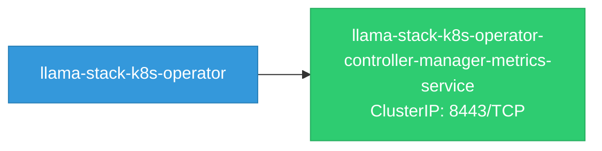
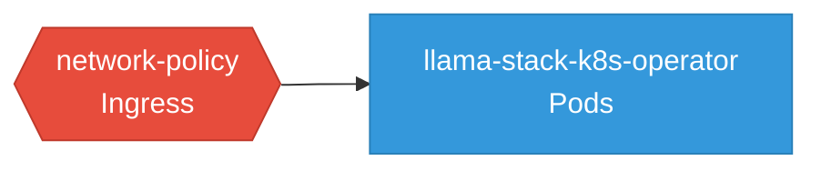

# llama-stack-k8s-operator: Network

## Service Map

### Services

| Name | Type | Ports | Source |
|------|------|-------|--------|
| llama-stack-k8s-operator-controller-manager-metrics-service | ClusterIP | 8443/TCP | [`kustomize:config/overlays/odh`](https://github.com/llamastack/llama-stack-k8s-operator/blob/521ca25391e1deca8e192b010c16f86b3c97fbf8/kustomize:config/overlays/odh) |

### Network Policies

| Name | Policy Types | Source |
|------|-------------|--------|
| network-policy | Ingress | [`controllers/manifests/base/networkpolicy.yaml`](https://github.com/llamastack/llama-stack-k8s-operator/blob/521ca25391e1deca8e192b010c16f86b3c97fbf8/controllers/manifests/base/networkpolicy.yaml) |

## Network Policy Graph

Visual representation of NetworkPolicy rules. Ingress rules show what traffic is allowed into pods, egress rules show what traffic is allowed out.

