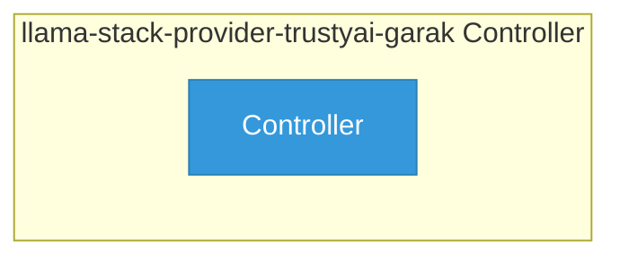

# llama-stack-provider-trustyai-garak

> **Architecture snapshot: 2026-05-19** (2026-05-19)

**Repository:** opendatahub-io/llama-stack-provider-trustyai-garak  
**Analyzer:** arch-analyzer 0.2.0  
**Extracted:** 2026-05-19T04:14:11Z

## Summary

| Metric | Count |
|--------|-------|
| CRDs | 0 |
| Deployments | 0 |
| Services | 0 |
| Secrets | 0 |
| Cluster Roles | 0 |
| Controller Watches | 0 |

## Component Architecture

CRDs, controllers, and owned Kubernetes resources.

### CRDs

No CRDs found in analyzed sources.

## Dependencies

