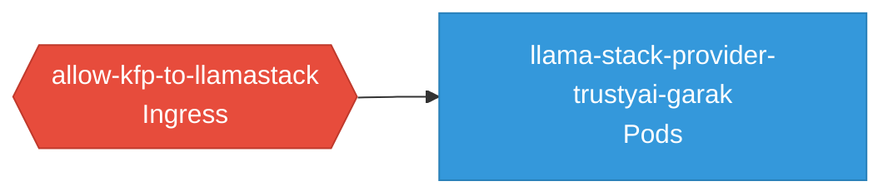

# llama-stack-provider-trustyai-garak: Network

### Services

No services defined.

### Network Policies

| Name | Policy Types | Source |
|------|-------------|--------|
| allow-kfp-to-llamastack | Ingress | [`lsd_remote/kfp-setup/kfp-networkpolicy.yaml`](https://github.com/red-hat-data-services/llama-stack-provider-trustyai-garak/blob/37e9b4476992e8313fbeaa0541867097b3d5e9cc/lsd_remote/kfp-setup/kfp-networkpolicy.yaml) |

## Network Policy Graph

Visual representation of NetworkPolicy rules. Ingress rules show what traffic is allowed into pods, egress rules show what traffic is allowed out.

