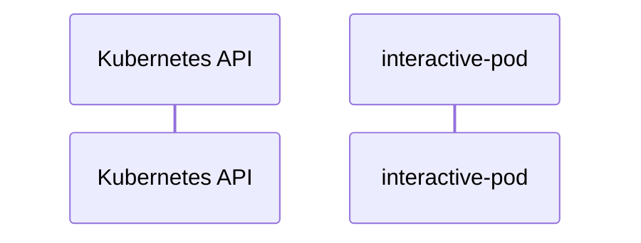

# llm-d: Dataflow

## Controller Watches

Kubernetes resources this controller monitors for changes. Each watch triggers reconciliation when the watched resource is created, updated, or deleted.

No controller watches found in analyzed sources.

## Reconciliation Flow

How the controller interacts with the Kubernetes API during reconciliation.

## Configuration

ConfigMaps and Helm values that control this component's runtime behavior.

### ConfigMaps

| Name | Data Keys | Source |
|------|-----------|--------|
| llm-d-inference-gateway | deployment, service | [`guides/recipes/gateway/istio/configmap.yaml`](https://github.com/llm-d/llm-d/blob/5bc8871217b23586fb778f24bfbcf41bacc7ec4b/guides/recipes/gateway/istio/configmap.yaml) |
| workload-variant-autoscaler-wva-variantautoscaling-config | PROMETHEUS_BASE_URL, PROMETHEUS_TLS_INSECURE_SKIP_VERIFY | [`guides/workload-autoscaling/wva-config/platform/cks/configmap-patch.yaml`](https://github.com/llm-d/llm-d/blob/5bc8871217b23586fb778f24bfbcf41bacc7ec4b/guides/workload-autoscaling/wva-config/platform/cks/configmap-patch.yaml) |
| workload-variant-autoscaler-wva-variantautoscaling-config | PROMETHEUS_BASE_URL, PROMETHEUS_TLS_INSECURE_SKIP_VERIFY | [`guides/workload-autoscaling/wva-config/platform/generic/configmap-patch.yaml`](https://github.com/llm-d/llm-d/blob/5bc8871217b23586fb778f24bfbcf41bacc7ec4b/guides/workload-autoscaling/wva-config/platform/generic/configmap-patch.yaml) |
| workload-variant-autoscaler-wva-variantautoscaling-config | PROMETHEUS_BASE_URL, PROMETHEUS_TLS_INSECURE_SKIP_VERIFY | [`guides/workload-autoscaling/wva-config/platform/gke/configmap-patch.yaml`](https://github.com/llm-d/llm-d/blob/5bc8871217b23586fb778f24bfbcf41bacc7ec4b/guides/workload-autoscaling/wva-config/platform/gke/configmap-patch.yaml) |
| workload-variant-autoscaler-wva-variantautoscaling-config | PROMETHEUS_BASE_URL, PROMETHEUS_CA_CERT_PATH, PROMETHEUS_TLS_INSECURE_SKIP_VERIFY | [`guides/workload-autoscaling/wva-config/platform/ocp/configmap-patch.yaml`](https://github.com/llm-d/llm-d/blob/5bc8871217b23586fb778f24bfbcf41bacc7ec4b/guides/workload-autoscaling/wva-config/platform/ocp/configmap-patch.yaml) |

