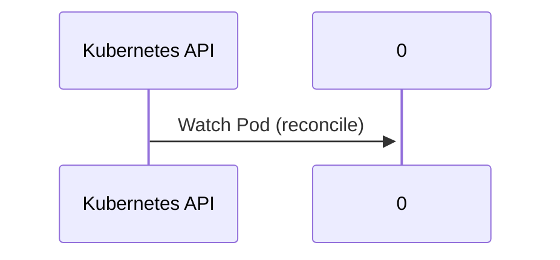

# llm-d-kv-cache: Dataflow

## Controller Watches

Kubernetes resources this controller monitors for changes. Each watch triggers reconciliation when the watched resource is created, updated, or deleted.

| Type | GVK | Source |
|------|-----|--------|
| For | /v1/Pod | [`examples/kv_events/pod_reconciler/pod_reconciler.go:180`](https://github.com/llm-d/llm-d-kv-cache/blob/d54e631afebc240807275fd702a2277448fe4db8/examples/kv_events/pod_reconciler/pod_reconciler.go#L180) |

## Reconciliation Flow

How the controller interacts with the Kubernetes API during reconciliation.

### HTTP Endpoints

| Method | Path | Source |
|--------|------|--------|
| * | /metrics | [`examples/kv_events/online/main.go:244`](https://github.com/llm-d/llm-d-kv-cache/blob/d54e631afebc240807275fd702a2277448fe4db8/examples/kv_events/online/main.go#L244) |
| * | /score_chat_completions | [`examples/kv_events/online/main.go:274`](https://github.com/llm-d/llm-d-kv-cache/blob/d54e631afebc240807275fd702a2277448fe4db8/examples/kv_events/online/main.go#L274) |
| * | /score_completions | [`examples/kv_events/online/main.go:248`](https://github.com/llm-d/llm-d-kv-cache/blob/d54e631afebc240807275fd702a2277448fe4db8/examples/kv_events/online/main.go#L248) |

## Configuration

ConfigMaps and Helm values that control this component's runtime behavior.

### Helm

**Chart:** pvc-evictor v0.1.0

