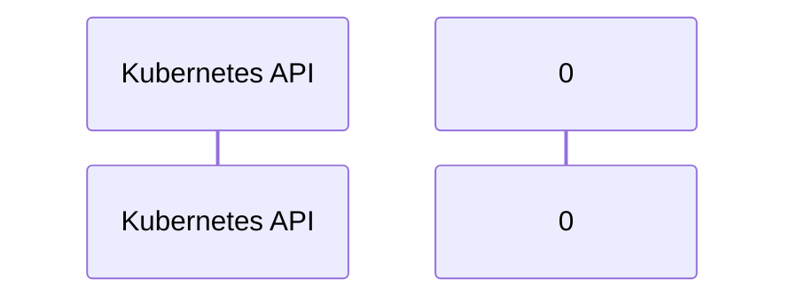

# llm-d-kv-cache: Dataflow

## Controller Watches

Kubernetes resources this controller monitors for changes. Each watch triggers reconciliation when the watched resource is created, updated, or deleted.

No controller watches found.

## Reconciliation Flow

How the controller interacts with the Kubernetes API during reconciliation.

### HTTP Endpoints

| Method | Path | Source |
|--------|------|--------|
| * | / | [`.gomod-cache/github.com/docker/docker@v28.5.1+incompatible/contrib/httpserver/server.go:10`](https://github.com/llm-d/llm-d-kv-cache/blob/4f857211d6dc4623ce306ef446540baedb25b638/.gomod-cache/github.com/docker/docker@v28.5.1+incompatible/contrib/httpserver/server.go#L10) |
| * | / | [`.gomod-cache/golang.org/x/net@v0.47.0/webdav/litmus_test_server.go:83`](https://github.com/llm-d/llm-d-kv-cache/blob/4f857211d6dc4623ce306ef446540baedb25b638/.gomod-cache/golang.org/x/net@v0.47.0/webdav/litmus_test_server.go#L83) |
| * | / | [`.gopath-loader/pkg/mod/github.com/docker/docker@v28.5.1+incompatible/contrib/httpserver/server.go:10`](https://github.com/llm-d/llm-d-kv-cache/blob/4f857211d6dc4623ce306ef446540baedb25b638/.gopath-loader/pkg/mod/github.com/docker/docker@v28.5.1+incompatible/contrib/httpserver/server.go#L10) |
| * | / | [`.gopath-loader/pkg/mod/golang.org/x/net@v0.47.0/webdav/litmus_test_server.go:83`](https://github.com/llm-d/llm-d-kv-cache/blob/4f857211d6dc4623ce306ef446540baedb25b638/.gopath-loader/pkg/mod/golang.org/x/net@v0.47.0/webdav/litmus_test_server.go#L83) |
| * | /LogDriver.Capabilities | [`.gomod-cache/github.com/docker/docker@v28.5.1+incompatible/integration/plugin/logging/cmd/discard/driver.go:68`](https://github.com/llm-d/llm-d-kv-cache/blob/4f857211d6dc4623ce306ef446540baedb25b638/.gomod-cache/github.com/docker/docker@v28.5.1+incompatible/integration/plugin/logging/cmd/discard/driver.go#L68) |
| * | /LogDriver.Capabilities | [`.gopath-loader/pkg/mod/github.com/docker/docker@v28.5.1+incompatible/integration/plugin/logging/cmd/discard/driver.go:68`](https://github.com/llm-d/llm-d-kv-cache/blob/4f857211d6dc4623ce306ef446540baedb25b638/.gopath-loader/pkg/mod/github.com/docker/docker@v28.5.1+incompatible/integration/plugin/logging/cmd/discard/driver.go#L68) |
| * | /LogDriver.StartLogging | [`.gopath-loader/pkg/mod/github.com/docker/docker@v28.5.1+incompatible/integration/plugin/logging/cmd/close_on_start/main.go:23`](https://github.com/llm-d/llm-d-kv-cache/blob/4f857211d6dc4623ce306ef446540baedb25b638/.gopath-loader/pkg/mod/github.com/docker/docker@v28.5.1+incompatible/integration/plugin/logging/cmd/close_on_start/main.go#L23) |
| * | /LogDriver.StartLogging | [`.gopath-loader/pkg/mod/github.com/docker/docker@v28.5.1+incompatible/integration/plugin/logging/cmd/discard/driver.go:33`](https://github.com/llm-d/llm-d-kv-cache/blob/4f857211d6dc4623ce306ef446540baedb25b638/.gopath-loader/pkg/mod/github.com/docker/docker@v28.5.1+incompatible/integration/plugin/logging/cmd/discard/driver.go#L33) |
| * | /LogDriver.StartLogging | [`.gomod-cache/github.com/docker/docker@v28.5.1+incompatible/integration/plugin/logging/cmd/close_on_start/main.go:23`](https://github.com/llm-d/llm-d-kv-cache/blob/4f857211d6dc4623ce306ef446540baedb25b638/.gomod-cache/github.com/docker/docker@v28.5.1+incompatible/integration/plugin/logging/cmd/close_on_start/main.go#L23) |
| * | /LogDriver.StartLogging | [`.gomod-cache/github.com/docker/docker@v28.5.1+incompatible/integration/plugin/logging/cmd/discard/driver.go:33`](https://github.com/llm-d/llm-d-kv-cache/blob/4f857211d6dc4623ce306ef446540baedb25b638/.gomod-cache/github.com/docker/docker@v28.5.1+incompatible/integration/plugin/logging/cmd/discard/driver.go#L33) |
| * | /LogDriver.StopLogging | [`.gopath-loader/pkg/mod/github.com/docker/docker@v28.5.1+incompatible/integration/plugin/logging/cmd/discard/driver.go:53`](https://github.com/llm-d/llm-d-kv-cache/blob/4f857211d6dc4623ce306ef446540baedb25b638/.gopath-loader/pkg/mod/github.com/docker/docker@v28.5.1+incompatible/integration/plugin/logging/cmd/discard/driver.go#L53) |
| * | /LogDriver.StopLogging | [`.gomod-cache/github.com/docker/docker@v28.5.1+incompatible/integration/plugin/logging/cmd/discard/driver.go:53`](https://github.com/llm-d/llm-d-kv-cache/blob/4f857211d6dc4623ce306ef446540baedb25b638/.gomod-cache/github.com/docker/docker@v28.5.1+incompatible/integration/plugin/logging/cmd/discard/driver.go#L53) |
| * | /Plugin.Activate | [`.gomod-cache/github.com/docker/docker@v28.5.1+incompatible/testutil/fixtures/plugin/basic/basic.go:31`](https://github.com/llm-d/llm-d-kv-cache/blob/4f857211d6dc4623ce306ef446540baedb25b638/.gomod-cache/github.com/docker/docker@v28.5.1+incompatible/testutil/fixtures/plugin/basic/basic.go#L31) |
| * | /Plugin.Activate | [`.gopath-loader/pkg/mod/github.com/docker/docker@v28.5.1+incompatible/testutil/fixtures/plugin/basic/basic.go:31`](https://github.com/llm-d/llm-d-kv-cache/blob/4f857211d6dc4623ce306ef446540baedb25b638/.gopath-loader/pkg/mod/github.com/docker/docker@v28.5.1+incompatible/testutil/fixtures/plugin/basic/basic.go#L31) |
| * | /VolumeDriver.Create | [`.gopath-loader/pkg/mod/github.com/docker/docker@v28.5.1+incompatible/volume/testutils/testutils.go:153`](https://github.com/llm-d/llm-d-kv-cache/blob/4f857211d6dc4623ce306ef446540baedb25b638/.gopath-loader/pkg/mod/github.com/docker/docker@v28.5.1+incompatible/volume/testutils/testutils.go#L153) |
| * | /VolumeDriver.Create | [`.gomod-cache/github.com/docker/docker@v28.5.1+incompatible/volume/testutils/testutils.go:153`](https://github.com/llm-d/llm-d-kv-cache/blob/4f857211d6dc4623ce306ef446540baedb25b638/.gomod-cache/github.com/docker/docker@v28.5.1+incompatible/volume/testutils/testutils.go#L153) |
| * | /debug/pprof/ | [`.gomod-cache/sigs.k8s.io/controller-runtime@v0.21.0/pkg/manager/internal.go:316`](https://github.com/llm-d/llm-d-kv-cache/blob/4f857211d6dc4623ce306ef446540baedb25b638/.gomod-cache/sigs.k8s.io/controller-runtime@v0.21.0/pkg/manager/internal.go#L316) |
| * | /debug/pprof/ | [`.gopath-loader/pkg/mod/sigs.k8s.io/controller-runtime@v0.21.0/pkg/manager/internal.go:316`](https://github.com/llm-d/llm-d-kv-cache/blob/4f857211d6dc4623ce306ef446540baedb25b638/.gopath-loader/pkg/mod/sigs.k8s.io/controller-runtime@v0.21.0/pkg/manager/internal.go#L316) |
| * | /debug/pprof/cmdline | [`.gomod-cache/sigs.k8s.io/controller-runtime@v0.21.0/pkg/manager/internal.go:317`](https://github.com/llm-d/llm-d-kv-cache/blob/4f857211d6dc4623ce306ef446540baedb25b638/.gomod-cache/sigs.k8s.io/controller-runtime@v0.21.0/pkg/manager/internal.go#L317) |
| * | /debug/pprof/cmdline | [`.gopath-loader/pkg/mod/sigs.k8s.io/controller-runtime@v0.21.0/pkg/manager/internal.go:317`](https://github.com/llm-d/llm-d-kv-cache/blob/4f857211d6dc4623ce306ef446540baedb25b638/.gopath-loader/pkg/mod/sigs.k8s.io/controller-runtime@v0.21.0/pkg/manager/internal.go#L317) |
| * | /debug/pprof/profile | [`.gomod-cache/sigs.k8s.io/controller-runtime@v0.21.0/pkg/manager/internal.go:318`](https://github.com/llm-d/llm-d-kv-cache/blob/4f857211d6dc4623ce306ef446540baedb25b638/.gomod-cache/sigs.k8s.io/controller-runtime@v0.21.0/pkg/manager/internal.go#L318) |
| * | /debug/pprof/profile | [`.gopath-loader/pkg/mod/sigs.k8s.io/controller-runtime@v0.21.0/pkg/manager/internal.go:318`](https://github.com/llm-d/llm-d-kv-cache/blob/4f857211d6dc4623ce306ef446540baedb25b638/.gopath-loader/pkg/mod/sigs.k8s.io/controller-runtime@v0.21.0/pkg/manager/internal.go#L318) |
| * | /debug/pprof/symbol | [`.gopath-loader/pkg/mod/sigs.k8s.io/controller-runtime@v0.21.0/pkg/manager/internal.go:319`](https://github.com/llm-d/llm-d-kv-cache/blob/4f857211d6dc4623ce306ef446540baedb25b638/.gopath-loader/pkg/mod/sigs.k8s.io/controller-runtime@v0.21.0/pkg/manager/internal.go#L319) |
| * | /debug/pprof/symbol | [`.gomod-cache/sigs.k8s.io/controller-runtime@v0.21.0/pkg/manager/internal.go:319`](https://github.com/llm-d/llm-d-kv-cache/blob/4f857211d6dc4623ce306ef446540baedb25b638/.gomod-cache/sigs.k8s.io/controller-runtime@v0.21.0/pkg/manager/internal.go#L319) |
| * | /debug/pprof/trace | [`.gomod-cache/sigs.k8s.io/controller-runtime@v0.21.0/pkg/manager/internal.go:320`](https://github.com/llm-d/llm-d-kv-cache/blob/4f857211d6dc4623ce306ef446540baedb25b638/.gomod-cache/sigs.k8s.io/controller-runtime@v0.21.0/pkg/manager/internal.go#L320) |
| * | /debug/pprof/trace | [`.gopath-loader/pkg/mod/sigs.k8s.io/controller-runtime@v0.21.0/pkg/manager/internal.go:320`](https://github.com/llm-d/llm-d-kv-cache/blob/4f857211d6dc4623ce306ef446540baedb25b638/.gopath-loader/pkg/mod/sigs.k8s.io/controller-runtime@v0.21.0/pkg/manager/internal.go#L320) |
| * | /metrics | [`.gomod-cache/github.com/docker/docker@v28.5.1+incompatible/internal/metrics/plugin_unix.go:119`](https://github.com/llm-d/llm-d-kv-cache/blob/4f857211d6dc4623ce306ef446540baedb25b638/.gomod-cache/github.com/docker/docker@v28.5.1+incompatible/internal/metrics/plugin_unix.go#L119) |
| * | /metrics | [`.gopath-loader/pkg/mod/github.com/docker/docker@v28.5.1+incompatible/internal/metrics/plugin_unix.go:119`](https://github.com/llm-d/llm-d-kv-cache/blob/4f857211d6dc4623ce306ef446540baedb25b638/.gopath-loader/pkg/mod/github.com/docker/docker@v28.5.1+incompatible/internal/metrics/plugin_unix.go#L119) |
| * | /metrics | [`.gopath-loader/pkg/mod/github.com/docker/docker@v28.5.1+incompatible/cmd/dockerd/metrics.go:26`](https://github.com/llm-d/llm-d-kv-cache/blob/4f857211d6dc4623ce306ef446540baedb25b638/.gopath-loader/pkg/mod/github.com/docker/docker@v28.5.1+incompatible/cmd/dockerd/metrics.go#L26) |
| * | /metrics | [`.gomod-cache/github.com/docker/docker@v28.5.1+incompatible/cmd/dockerd/metrics.go:26`](https://github.com/llm-d/llm-d-kv-cache/blob/4f857211d6dc4623ce306ef446540baedb25b638/.gomod-cache/github.com/docker/docker@v28.5.1+incompatible/cmd/dockerd/metrics.go#L26) |
| * | /proc/self/fd/ | [`.gomod-cache/github.com/docker/docker@v28.5.1+incompatible/internal/safepath/join_linux.go:47`](https://github.com/llm-d/llm-d-kv-cache/blob/4f857211d6dc4623ce306ef446540baedb25b638/.gomod-cache/github.com/docker/docker@v28.5.1+incompatible/internal/safepath/join_linux.go#L47) |
| * | /proc/self/fd/ | [`.gopath-loader/pkg/mod/github.com/docker/docker@v28.5.1+incompatible/internal/safepath/join_linux.go:47`](https://github.com/llm-d/llm-d-kv-cache/blob/4f857211d6dc4623ce306ef446540baedb25b638/.gopath-loader/pkg/mod/github.com/docker/docker@v28.5.1+incompatible/internal/safepath/join_linux.go#L47) |
| * | /watchedtableentries | [`.gopath-loader/pkg/mod/github.com/docker/docker@v28.5.1+incompatible/libnetwork/cmd/networkdb-test/dummyclient/dummyClient.go:20`](https://github.com/llm-d/llm-d-kv-cache/blob/4f857211d6dc4623ce306ef446540baedb25b638/.gopath-loader/pkg/mod/github.com/docker/docker@v28.5.1+incompatible/libnetwork/cmd/networkdb-test/dummyclient/dummyClient.go#L20) |
| * | /watchedtableentries | [`.gomod-cache/github.com/docker/docker@v28.5.1+incompatible/libnetwork/cmd/networkdb-test/dummyclient/dummyClient.go:20`](https://github.com/llm-d/llm-d-kv-cache/blob/4f857211d6dc4623ce306ef446540baedb25b638/.gomod-cache/github.com/docker/docker@v28.5.1+incompatible/libnetwork/cmd/networkdb-test/dummyclient/dummyClient.go#L20) |
| * | /watchtable | [`.gopath-loader/pkg/mod/github.com/docker/docker@v28.5.1+incompatible/libnetwork/cmd/networkdb-test/dummyclient/dummyClient.go:19`](https://github.com/llm-d/llm-d-kv-cache/blob/4f857211d6dc4623ce306ef446540baedb25b638/.gopath-loader/pkg/mod/github.com/docker/docker@v28.5.1+incompatible/libnetwork/cmd/networkdb-test/dummyclient/dummyClient.go#L19) |
| * | /watchtable | [`.gomod-cache/github.com/docker/docker@v28.5.1+incompatible/libnetwork/cmd/networkdb-test/dummyclient/dummyClient.go:19`](https://github.com/llm-d/llm-d-kv-cache/blob/4f857211d6dc4623ce306ef446540baedb25b638/.gomod-cache/github.com/docker/docker@v28.5.1+incompatible/libnetwork/cmd/networkdb-test/dummyclient/dummyClient.go#L19) |
| GET | /{user-id} | [`.gopath-loader/pkg/mod/github.com/emicklei/go-restful/v3@v3.11.0/doc.go:19`](https://github.com/llm-d/llm-d-kv-cache/blob/4f857211d6dc4623ce306ef446540baedb25b638/.gopath-loader/pkg/mod/github.com/emicklei/go-restful/v3@v3.11.0/doc.go#L19) |
| GET | /{user-id} | [`.gopath-loader/pkg/mod/github.com/emicklei/go-restful/v3@v3.11.0/doc.go:83`](https://github.com/llm-d/llm-d-kv-cache/blob/4f857211d6dc4623ce306ef446540baedb25b638/.gopath-loader/pkg/mod/github.com/emicklei/go-restful/v3@v3.11.0/doc.go#L83) |
| GET | /{user-id} | [`.gomod-cache/github.com/emicklei/go-restful/v3@v3.11.0/doc.go:83`](https://github.com/llm-d/llm-d-kv-cache/blob/4f857211d6dc4623ce306ef446540baedb25b638/.gomod-cache/github.com/emicklei/go-restful/v3@v3.11.0/doc.go#L83) |
| GET | /{user-id} | [`.gomod-cache/github.com/emicklei/go-restful/v3@v3.11.0/doc.go:19`](https://github.com/llm-d/llm-d-kv-cache/blob/4f857211d6dc4623ce306ef446540baedb25b638/.gomod-cache/github.com/emicklei/go-restful/v3@v3.11.0/doc.go#L19) |
| * | POST | [`.gomod-cache/go.opentelemetry.io/proto/otlp@v1.9.0/collector/logs/v1/logs_service.pb.gw.go:74`](https://github.com/llm-d/llm-d-kv-cache/blob/4f857211d6dc4623ce306ef446540baedb25b638/.gomod-cache/go.opentelemetry.io/proto/otlp@v1.9.0/collector/logs/v1/logs_service.pb.gw.go#L74) |
| * | POST | [`.gomod-cache/go.opentelemetry.io/proto/otlp@v1.9.0/collector/trace/v1/trace_service.pb.gw.go:140`](https://github.com/llm-d/llm-d-kv-cache/blob/4f857211d6dc4623ce306ef446540baedb25b638/.gomod-cache/go.opentelemetry.io/proto/otlp@v1.9.0/collector/trace/v1/trace_service.pb.gw.go#L140) |
| * | POST | [`.gopath-loader/pkg/mod/go.opentelemetry.io/proto/otlp@v1.9.0/collector/trace/v1/trace_service.pb.gw.go:140`](https://github.com/llm-d/llm-d-kv-cache/blob/4f857211d6dc4623ce306ef446540baedb25b638/.gopath-loader/pkg/mod/go.opentelemetry.io/proto/otlp@v1.9.0/collector/trace/v1/trace_service.pb.gw.go#L140) |
| * | POST | [`.gopath-loader/pkg/mod/go.opentelemetry.io/proto/otlp@v1.9.0/collector/trace/v1/trace_service.pb.gw.go:74`](https://github.com/llm-d/llm-d-kv-cache/blob/4f857211d6dc4623ce306ef446540baedb25b638/.gopath-loader/pkg/mod/go.opentelemetry.io/proto/otlp@v1.9.0/collector/trace/v1/trace_service.pb.gw.go#L74) |
| * | POST | [`.gopath-loader/pkg/mod/go.opentelemetry.io/proto/otlp@v1.9.0/collector/metrics/v1/metrics_service.pb.gw.go:140`](https://github.com/llm-d/llm-d-kv-cache/blob/4f857211d6dc4623ce306ef446540baedb25b638/.gopath-loader/pkg/mod/go.opentelemetry.io/proto/otlp@v1.9.0/collector/metrics/v1/metrics_service.pb.gw.go#L140) |
| * | POST | [`.gopath-loader/pkg/mod/go.opentelemetry.io/proto/otlp@v1.9.0/collector/metrics/v1/metrics_service.pb.gw.go:74`](https://github.com/llm-d/llm-d-kv-cache/blob/4f857211d6dc4623ce306ef446540baedb25b638/.gopath-loader/pkg/mod/go.opentelemetry.io/proto/otlp@v1.9.0/collector/metrics/v1/metrics_service.pb.gw.go#L74) |
| * | POST | [`.gopath-loader/pkg/mod/go.opentelemetry.io/proto/otlp@v1.9.0/collector/logs/v1/logs_service.pb.gw.go:140`](https://github.com/llm-d/llm-d-kv-cache/blob/4f857211d6dc4623ce306ef446540baedb25b638/.gopath-loader/pkg/mod/go.opentelemetry.io/proto/otlp@v1.9.0/collector/logs/v1/logs_service.pb.gw.go#L140) |
| * | POST | [`.gopath-loader/pkg/mod/go.opentelemetry.io/proto/otlp@v1.9.0/collector/logs/v1/logs_service.pb.gw.go:74`](https://github.com/llm-d/llm-d-kv-cache/blob/4f857211d6dc4623ce306ef446540baedb25b638/.gopath-loader/pkg/mod/go.opentelemetry.io/proto/otlp@v1.9.0/collector/logs/v1/logs_service.pb.gw.go#L74) |
| * | POST | [`.gomod-cache/go.opentelemetry.io/proto/otlp@v1.9.0/collector/logs/v1/logs_service.pb.gw.go:140`](https://github.com/llm-d/llm-d-kv-cache/blob/4f857211d6dc4623ce306ef446540baedb25b638/.gomod-cache/go.opentelemetry.io/proto/otlp@v1.9.0/collector/logs/v1/logs_service.pb.gw.go#L140) |
| * | POST | [`.gomod-cache/go.opentelemetry.io/proto/otlp@v1.9.0/collector/metrics/v1/metrics_service.pb.gw.go:74`](https://github.com/llm-d/llm-d-kv-cache/blob/4f857211d6dc4623ce306ef446540baedb25b638/.gomod-cache/go.opentelemetry.io/proto/otlp@v1.9.0/collector/metrics/v1/metrics_service.pb.gw.go#L74) |
| * | POST | [`.gomod-cache/go.opentelemetry.io/proto/otlp@v1.9.0/collector/metrics/v1/metrics_service.pb.gw.go:140`](https://github.com/llm-d/llm-d-kv-cache/blob/4f857211d6dc4623ce306ef446540baedb25b638/.gomod-cache/go.opentelemetry.io/proto/otlp@v1.9.0/collector/metrics/v1/metrics_service.pb.gw.go#L140) |
| * | POST | [`.gomod-cache/go.opentelemetry.io/proto/otlp@v1.9.0/collector/trace/v1/trace_service.pb.gw.go:74`](https://github.com/llm-d/llm-d-kv-cache/blob/4f857211d6dc4623ce306ef446540baedb25b638/.gomod-cache/go.opentelemetry.io/proto/otlp@v1.9.0/collector/trace/v1/trace_service.pb.gw.go#L74) |
| * | header | [`.gomod-cache/golang.org/x/net@v0.47.0/quic/qlog.go:187`](https://github.com/llm-d/llm-d-kv-cache/blob/4f857211d6dc4623ce306ef446540baedb25b638/.gomod-cache/golang.org/x/net@v0.47.0/quic/qlog.go#L187) |
| * | header | [`.gopath-loader/pkg/mod/golang.org/x/net@v0.47.0/quic/qlog.go:211`](https://github.com/llm-d/llm-d-kv-cache/blob/4f857211d6dc4623ce306ef446540baedb25b638/.gopath-loader/pkg/mod/golang.org/x/net@v0.47.0/quic/qlog.go#L211) |
| * | header | [`.gomod-cache/golang.org/x/net@v0.47.0/quic/qlog.go:165`](https://github.com/llm-d/llm-d-kv-cache/blob/4f857211d6dc4623ce306ef446540baedb25b638/.gomod-cache/golang.org/x/net@v0.47.0/quic/qlog.go#L165) |
| * | header | [`.gopath-loader/pkg/mod/golang.org/x/net@v0.47.0/quic/qlog.go:267`](https://github.com/llm-d/llm-d-kv-cache/blob/4f857211d6dc4623ce306ef446540baedb25b638/.gopath-loader/pkg/mod/golang.org/x/net@v0.47.0/quic/qlog.go#L267) |
| * | header | [`.gopath-loader/pkg/mod/golang.org/x/net@v0.47.0/quic/qlog.go:187`](https://github.com/llm-d/llm-d-kv-cache/blob/4f857211d6dc4623ce306ef446540baedb25b638/.gopath-loader/pkg/mod/golang.org/x/net@v0.47.0/quic/qlog.go#L187) |
| * | header | [`.gomod-cache/golang.org/x/net@v0.47.0/quic/qlog.go:267`](https://github.com/llm-d/llm-d-kv-cache/blob/4f857211d6dc4623ce306ef446540baedb25b638/.gomod-cache/golang.org/x/net@v0.47.0/quic/qlog.go#L267) |
| * | header | [`.gopath-loader/pkg/mod/golang.org/x/net@v0.47.0/quic/qlog.go:165`](https://github.com/llm-d/llm-d-kv-cache/blob/4f857211d6dc4623ce306ef446540baedb25b638/.gopath-loader/pkg/mod/golang.org/x/net@v0.47.0/quic/qlog.go#L165) |
| * | header | [`.gomod-cache/golang.org/x/net@v0.47.0/quic/qlog.go:211`](https://github.com/llm-d/llm-d-kv-cache/blob/4f857211d6dc4623ce306ef446540baedb25b638/.gomod-cache/golang.org/x/net@v0.47.0/quic/qlog.go#L211) |
| * | overlay | [`.gomod-cache/github.com/docker/docker@v28.5.1+incompatible/daemon/graphdriver/overlayutils/overlayutils.go:73`](https://github.com/llm-d/llm-d-kv-cache/blob/4f857211d6dc4623ce306ef446540baedb25b638/.gomod-cache/github.com/docker/docker@v28.5.1+incompatible/daemon/graphdriver/overlayutils/overlayutils.go#L73) |
| * | overlay | [`.gopath-loader/pkg/mod/github.com/docker/docker@v28.5.1+incompatible/daemon/graphdriver/overlayutils/overlayutils.go:73`](https://github.com/llm-d/llm-d-kv-cache/blob/4f857211d6dc4623ce306ef446540baedb25b638/.gopath-loader/pkg/mod/github.com/docker/docker@v28.5.1+incompatible/daemon/graphdriver/overlayutils/overlayutils.go#L73) |
| * | overlay | [`.gopath-loader/pkg/mod/github.com/docker/docker@v28.5.1+incompatible/daemon/graphdriver/overlay2/check.go:83`](https://github.com/llm-d/llm-d-kv-cache/blob/4f857211d6dc4623ce306ef446540baedb25b638/.gopath-loader/pkg/mod/github.com/docker/docker@v28.5.1+incompatible/daemon/graphdriver/overlay2/check.go#L83) |
| * | overlay | [`.gomod-cache/github.com/docker/docker@v28.5.1+incompatible/daemon/graphdriver/overlay2/check.go:83`](https://github.com/llm-d/llm-d-kv-cache/blob/4f857211d6dc4623ce306ef446540baedb25b638/.gomod-cache/github.com/docker/docker@v28.5.1+incompatible/daemon/graphdriver/overlay2/check.go#L83) |
| * | raw | [`.gopath-loader/pkg/mod/golang.org/x/net@v0.47.0/quic/qlog.go:193`](https://github.com/llm-d/llm-d-kv-cache/blob/4f857211d6dc4623ce306ef446540baedb25b638/.gopath-loader/pkg/mod/golang.org/x/net@v0.47.0/quic/qlog.go#L193) |
| * | raw | [`.gopath-loader/pkg/mod/golang.org/x/net@v0.47.0/quic/qlog.go:217`](https://github.com/llm-d/llm-d-kv-cache/blob/4f857211d6dc4623ce306ef446540baedb25b638/.gopath-loader/pkg/mod/golang.org/x/net@v0.47.0/quic/qlog.go#L217) |
| * | raw | [`.gomod-cache/golang.org/x/net@v0.47.0/quic/qlog.go:193`](https://github.com/llm-d/llm-d-kv-cache/blob/4f857211d6dc4623ce306ef446540baedb25b638/.gomod-cache/golang.org/x/net@v0.47.0/quic/qlog.go#L193) |
| * | raw | [`.gopath-loader/pkg/mod/golang.org/x/net@v0.47.0/quic/qlog.go:172`](https://github.com/llm-d/llm-d-kv-cache/blob/4f857211d6dc4623ce306ef446540baedb25b638/.gopath-loader/pkg/mod/golang.org/x/net@v0.47.0/quic/qlog.go#L172) |
| * | raw | [`.gomod-cache/golang.org/x/net@v0.47.0/quic/qlog.go:172`](https://github.com/llm-d/llm-d-kv-cache/blob/4f857211d6dc4623ce306ef446540baedb25b638/.gomod-cache/golang.org/x/net@v0.47.0/quic/qlog.go#L172) |
| * | raw | [`.gomod-cache/golang.org/x/net@v0.47.0/quic/qlog.go:217`](https://github.com/llm-d/llm-d-kv-cache/blob/4f857211d6dc4623ce306ef446540baedb25b638/.gomod-cache/golang.org/x/net@v0.47.0/quic/qlog.go#L217) |
| * | shm | [`.gomod-cache/github.com/docker/docker@v28.5.1+incompatible/daemon/container_operations_unix.go:266`](https://github.com/llm-d/llm-d-kv-cache/blob/4f857211d6dc4623ce306ef446540baedb25b638/.gomod-cache/github.com/docker/docker@v28.5.1+incompatible/daemon/container_operations_unix.go#L266) |
| * | shm | [`.gopath-loader/pkg/mod/github.com/docker/docker@v28.5.1+incompatible/daemon/container_operations_unix.go:266`](https://github.com/llm-d/llm-d-kv-cache/blob/4f857211d6dc4623ce306ef446540baedb25b638/.gopath-loader/pkg/mod/github.com/docker/docker@v28.5.1+incompatible/daemon/container_operations_unix.go#L266) |
| * | sysfs | [`.gomod-cache/github.com/docker/docker@v28.5.1+incompatible/libnetwork/drivers/overlay/ov_network.go:502`](https://github.com/llm-d/llm-d-kv-cache/blob/4f857211d6dc4623ce306ef446540baedb25b638/.gomod-cache/github.com/docker/docker@v28.5.1+incompatible/libnetwork/drivers/overlay/ov_network.go#L502) |
| * | sysfs | [`.gopath-loader/pkg/mod/github.com/docker/docker@v28.5.1+incompatible/libnetwork/drivers/overlay/ov_network.go:502`](https://github.com/llm-d/llm-d-kv-cache/blob/4f857211d6dc4623ce306ef446540baedb25b638/.gopath-loader/pkg/mod/github.com/docker/docker@v28.5.1+incompatible/libnetwork/drivers/overlay/ov_network.go#L502) |
| * | tmpfs | [`.gopath-loader/pkg/mod/github.com/docker/docker@v28.5.1+incompatible/daemon/container_operations_unix.go:419`](https://github.com/llm-d/llm-d-kv-cache/blob/4f857211d6dc4623ce306ef446540baedb25b638/.gopath-loader/pkg/mod/github.com/docker/docker@v28.5.1+incompatible/daemon/container_operations_unix.go#L419) |
| * | tmpfs | [`.gopath-loader/pkg/mod/github.com/docker/docker@v28.5.1+incompatible/daemon/container_operations_unix.go:437`](https://github.com/llm-d/llm-d-kv-cache/blob/4f857211d6dc4623ce306ef446540baedb25b638/.gopath-loader/pkg/mod/github.com/docker/docker@v28.5.1+incompatible/daemon/container_operations_unix.go#L437) |
| * | tmpfs | [`.gomod-cache/github.com/docker/docker@v28.5.1+incompatible/daemon/container_operations_unix.go:437`](https://github.com/llm-d/llm-d-kv-cache/blob/4f857211d6dc4623ce306ef446540baedb25b638/.gomod-cache/github.com/docker/docker@v28.5.1+incompatible/daemon/container_operations_unix.go#L437) |
| * | tmpfs | [`.gomod-cache/github.com/docker/docker@v28.5.1+incompatible/daemon/container_operations_unix.go:419`](https://github.com/llm-d/llm-d-kv-cache/blob/4f857211d6dc4623ce306ef446540baedb25b638/.gomod-cache/github.com/docker/docker@v28.5.1+incompatible/daemon/container_operations_unix.go#L419) |
| * | vantage_point | [`.gomod-cache/golang.org/x/net@v0.47.0/quic/qlog.go:96`](https://github.com/llm-d/llm-d-kv-cache/blob/4f857211d6dc4623ce306ef446540baedb25b638/.gomod-cache/golang.org/x/net@v0.47.0/quic/qlog.go#L96) |
| * | vantage_point | [`.gopath-loader/pkg/mod/golang.org/x/net@v0.47.0/quic/qlog.go:96`](https://github.com/llm-d/llm-d-kv-cache/blob/4f857211d6dc4623ce306ef446540baedb25b638/.gopath-loader/pkg/mod/golang.org/x/net@v0.47.0/quic/qlog.go#L96) |

## Configuration

ConfigMaps and Helm values that control this component's runtime behavior.

### Helm

**Chart:** pvc-evictor v0.1.0

