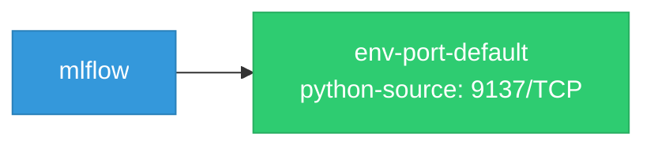

# mlflow: Network

## Service Map

### Services

| Name | Type | Ports | Source |
|------|------|-------|--------|
| env-port-default | python-source | 9137/TCP | [`dev/benchmarks/gateway/fake_server.py:66`](https://github.com/opendatahub-io/mlflow/blob/7520b39df02150c0c274881e62f10a013d5f2b4f/dev/benchmarks/gateway/fake_server.py#L66) |

!!! warning "No Network Policies"
    No NetworkPolicy resources found. All pod-to-pod traffic is allowed by default.

