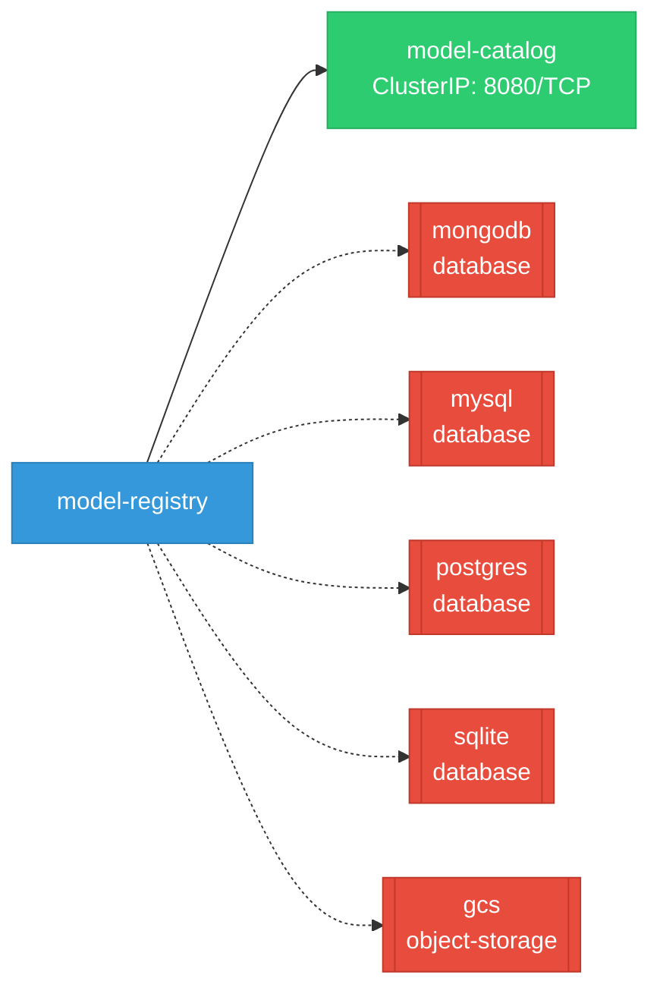

# model-registry: Network

## Service Map

### Services

| Name | Type | Ports | Source |
|------|------|-------|--------|
| model-catalog | ClusterIP | 8080/TCP | [`manifests/kustomize/options/catalog/base/service.yaml`](https://github.com/kubeflow/model-registry/blob/fd68a656951df0e3e5b24b3d5b3489326d8b3c26/manifests/kustomize/options/catalog/base/service.yaml) |

!!! warning "No Network Policies"
    No NetworkPolicy resources were found in the analyzed sources. Network policies may exist in overlays, Helm values, or cluster-level configurations not captured by static analysis.

