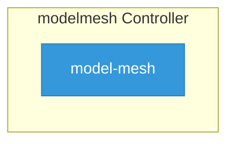

# modelmesh

> **Architecture snapshot: 2026-05-15** (2026-05-15)

**Repository:** opendatahub-io/modelmesh  
**Analyzer:** arch-analyzer 0.2.0  
**Extracted:** 2026-05-15T11:36:25Z

## Summary

| Metric | Count |
|--------|-------|
| CRDs | 0 |
| Deployments | 1 |
| Services | 1 |
| Secrets | 0 |
| Cluster Roles | 0 |
| Controller Watches | 0 |

## Component Architecture

CRDs, controllers, and owned Kubernetes resources.

### CRDs

No CRDs defined.

## Dependencies

