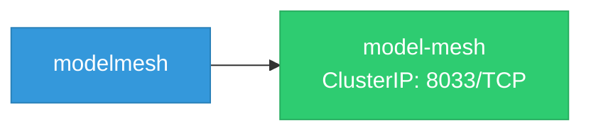
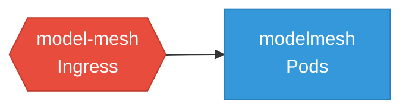

# modelmesh: Network

## Service Map

### Services

| Name | Type | Ports | Source |
|------|------|-------|--------|
| model-mesh | ClusterIP | 8033/TCP | [`config/base/service.yaml`](https://github.com/red-hat-data-services/modelmesh/blob/663e9404150dc48010c5e9263bdbdfd24a561f65/config/base/service.yaml) |

### Network Policies

| Name | Policy Types | Source |
|------|-------------|--------|
| model-mesh | Ingress | [`config/base/networkpolicy.yaml`](https://github.com/red-hat-data-services/modelmesh/blob/663e9404150dc48010c5e9263bdbdfd24a561f65/config/base/networkpolicy.yaml) |

## Network Policy Graph

Visual representation of NetworkPolicy rules. Ingress rules show what traffic is allowed into pods, egress rules show what traffic is allowed out.

