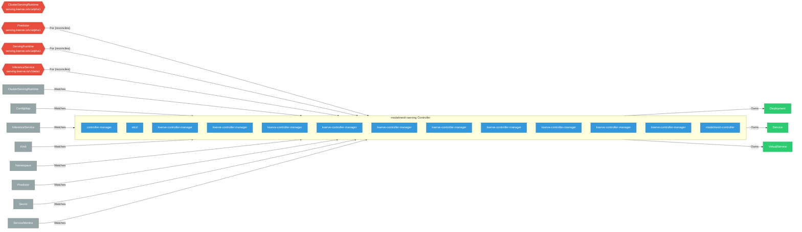

# modelmesh-serving

> **Architecture snapshot: 2026-05-15** (2026-05-15)

**Repository:** kserve/modelmesh-serving  
**Analyzer:** arch-analyzer 0.2.0  
**Extracted:** 2026-05-15T11:38:02Z

## Summary

| Metric | Count |
|--------|-------|
| CRDs | 4 |
| Deployments | 13 |
| Services | 9 |
| Secrets | 2 |
| Cluster Roles | 0 |
| Controller Watches | 48 |

## Component Architecture

CRDs, controllers, and owned Kubernetes resources.

### CRDs

| Group | Version | Kind | Scope | Fields | Validation Rules | Discovery | Source |
|-------|---------|------|-------|--------|------------------|-----------|--------|
| serving.kserve.io | v1alpha1 | ClusterServingRuntime | Cluster | 559 | 0 | YAML | [`config/crd/bases/serving.kserve.io_clusterservingruntimes.yaml`](https://github.com/kserve/modelmesh-serving/blob/1fcf541d867ceb459fbc76aa1e2bef102c4816db/config/crd/bases/serving.kserve.io_clusterservingruntimes.yaml) |
| serving.kserve.io | v1alpha1 | Predictor | Namespaced | 40 | 0 | YAML + Go AST | [`config/crd/bases/serving.kserve.io_predictors.yaml`](https://github.com/kserve/modelmesh-serving/blob/1fcf541d867ceb459fbc76aa1e2bef102c4816db/config/crd/bases/serving.kserve.io_predictors.yaml) |
| serving.kserve.io | v1alpha1 | ServingRuntime | Namespaced | 1140 | 0 | YAML | [`config/crd/bases/serving.kserve.io_servingruntimes.yaml`](https://github.com/kserve/modelmesh-serving/blob/1fcf541d867ceb459fbc76aa1e2bef102c4816db/config/crd/bases/serving.kserve.io_servingruntimes.yaml) |
| serving.kserve.io | v1beta1 | InferenceService | Namespaced | 6195 | 0 | YAML | [`config/crd/bases/serving.kserve.io_inferenceservices.yaml`](https://github.com/kserve/modelmesh-serving/blob/1fcf541d867ceb459fbc76aa1e2bef102c4816db/config/crd/bases/serving.kserve.io_inferenceservices.yaml) |

## Dependencies

### Key External Dependencies

| Module | Version |
|--------|---------|
| github.com/go-logr/logr | v1.2.4 |
| github.com/go-logr/logr | v1.3.0 |
| github.com/go-logr/logr | v1.2.2 |
| github.com/go-logr/logr | v1.2.0 |
| github.com/go-logr/logr | v1.3.0 |
| github.com/go-logr/logr | v1.4.1 |
| github.com/go-logr/logr | v1.3.0 |
| github.com/go-logr/logr | v1.2.4 |
| github.com/go-logr/logr | v1.4.1 |
| github.com/go-logr/logr | v1.2.2 |
| github.com/go-logr/logr | v1.3.0 |
| github.com/go-logr/logr | v1.3.0 |
| github.com/go-logr/logr | v1.3.0 |
| github.com/go-logr/logr | v1.4.1 |
| github.com/go-logr/logr | v1.2.4 |
| github.com/go-logr/logr | v1.2.0 |
| github.com/go-logr/logr | v1.2.4 |
| github.com/go-logr/zapr | v1.2.3 |
| github.com/go-logr/zapr | v1.2.4 |
| github.com/go-logr/zapr | v1.2.3 |
| github.com/go-logr/zapr | v1.2.4 |
| github.com/operator-framework/api | v0.10.0 |
| github.com/operator-framework/api | v0.10.0 |
| github.com/operator-framework/operator-lib | v0.10.0 |
| github.com/prometheus-operator/prometheus-operator/pkg/apis/monitoring | v0.55.0 |
| github.com/prometheus/client_golang | v1.17.0 |
| github.com/prometheus/client_golang | v1.11.1 |
| github.com/prometheus/client_golang | v1.17.0 |
| github.com/prometheus/client_golang | v1.16.0 |
| github.com/prometheus/client_golang | v1.11.1 |
| github.com/prometheus/client_golang | v1.11.0 |
| github.com/prometheus/client_golang | v1.11.0 |
| github.com/prometheus/client_golang | v1.17.0 |
| github.com/prometheus/client_golang | v1.17.0 |
| github.com/prometheus/client_golang | v1.16.0 |
| github.com/prometheus/client_golang | v1.16.0 |
| github.com/prometheus/client_golang | v1.16.0 |
| github.com/prometheus/client_model | v0.4.0 |
| github.com/prometheus/client_model | v0.4.1-0.20230718164431-9a2bf3000d16 |
| github.com/prometheus/client_model | v0.4.1-0.20230718164431-9a2bf3000d16 |
| github.com/prometheus/client_model | v0.4.0 |
| github.com/prometheus/client_model | v0.4.0 |
| github.com/prometheus/client_model | v0.4.1-0.20230718164431-9a2bf3000d16 |
| github.com/prometheus/client_model | v0.4.1-0.20230718164431-9a2bf3000d16 |
| github.com/prometheus/client_model | v0.2.0 |
| github.com/prometheus/client_model | v0.4.0 |
| github.com/prometheus/client_model | v0.2.0 |
| github.com/prometheus/common | v0.44.0 |
| github.com/prometheus/common | v0.45.0 |
| github.com/prometheus/common | v0.44.0 |
| github.com/prometheus/common | v0.44.0 |
| github.com/prometheus/common | v0.44.0 |
| github.com/prometheus/common | v0.45.0 |
| github.com/prometheus/procfs | v0.11.1 |
| github.com/prometheus/procfs | v0.10.1 |
| github.com/prometheus/procfs | v0.11.1 |
| github.com/prometheus/procfs | v0.10.1 |
| google.golang.org/grpc | v1.41.0 |
| google.golang.org/grpc | v1.33.2 |
| google.golang.org/grpc | v1.58.3 |
| google.golang.org/grpc | v1.59.0 |
| google.golang.org/grpc | v1.59.0 |
| google.golang.org/grpc | v1.41.0 |
| google.golang.org/grpc | v1.59.0 |
| google.golang.org/grpc | v1.33.2 |
| google.golang.org/grpc | v1.59.0 |
| google.golang.org/grpc | v1.56.3 |
| google.golang.org/grpc | v1.59.0 |
| google.golang.org/grpc | v1.56.3 |
| google.golang.org/grpc | v1.59.0 |
| google.golang.org/grpc | v1.56.1 |
| google.golang.org/grpc | v1.57.0 |
| google.golang.org/grpc | v1.59.0 |
| google.golang.org/grpc | v1.59.0 |
| google.golang.org/grpc | v1.59.0 |
| google.golang.org/grpc | v1.59.0 |
| google.golang.org/grpc | v1.59.0 |
| google.golang.org/grpc | v1.59.0 |
| google.golang.org/grpc | v1.59.0 |
| google.golang.org/grpc | v1.59.0 |
| google.golang.org/grpc | v1.41.0 |
| google.golang.org/grpc | v1.59.0 |
| google.golang.org/grpc | v1.58.3 |
| google.golang.org/grpc | v1.56.1 |
| google.golang.org/grpc | v1.41.0 |
| google.golang.org/grpc | v1.59.0 |
| google.golang.org/grpc | v1.59.0 |
| google.golang.org/grpc | v1.57.0 |
| google.golang.org/grpc | v1.59.0 |
| google.golang.org/grpc | v1.59.0 |
| k8s.io/api | v0.28.4 |
| k8s.io/api | v0.27.6 |
| k8s.io/api | v0.22.5 |
| k8s.io/api | v0.22.5 |
| k8s.io/api | v0.28.4 |
| k8s.io/api | v0.23.0 |
| k8s.io/api | v0.28.4 |
| k8s.io/api | v0.28.3 |
| k8s.io/api | v0.28.4 |
| k8s.io/api | v0.27.6 |
| k8s.io/api | v0.28.4 |
| k8s.io/api | v0.23.0 |
| k8s.io/api | v0.27.6 |
| k8s.io/api | v0.27.6 |
| k8s.io/api | v0.27.6 |
| k8s.io/api | v0.23.0 |
| k8s.io/api | v0.28.3 |
| k8s.io/api | v0.28.4 |
| k8s.io/api | v0.28.4 |
| k8s.io/api | v0.27.6 |
| k8s.io/api | v0.23.0 |
| k8s.io/apiextensions-apiserver | v0.27.6 |
| k8s.io/apiextensions-apiserver | v0.28.3 |
| k8s.io/apiextensions-apiserver | v0.23.0 |
| k8s.io/apiextensions-apiserver | v0.27.6 |
| k8s.io/apiextensions-apiserver | v0.28.3 |
| k8s.io/apiextensions-apiserver | v0.27.6 |
| k8s.io/apiextensions-apiserver | v0.27.6 |
| k8s.io/apiextensions-apiserver | v0.23.0 |
| k8s.io/apimachinery | v0.27.6 |
| k8s.io/apimachinery | v0.28.4 |
| k8s.io/apimachinery | v0.28.4 |
| k8s.io/apimachinery | v0.23.0 |
| k8s.io/apimachinery | v0.19.7 |
| k8s.io/apimachinery | v0.28.4 |
| k8s.io/apimachinery | v0.28.3 |
| k8s.io/apimachinery | v0.22.5 |
| k8s.io/apimachinery | v0.27.6 |
| k8s.io/apimachinery | v0.28.4 |
| k8s.io/apimachinery | v0.28.4 |
| k8s.io/apimachinery | v0.27.6 |
| k8s.io/apimachinery | v0.27.6 |
| k8s.io/apimachinery | v0.19.7 |
| k8s.io/apimachinery | v0.22.5 |
| k8s.io/apimachinery | v0.27.6 |
| k8s.io/apimachinery | v0.27.6 |
| k8s.io/apimachinery | v0.28.4 |
| k8s.io/apimachinery | v0.23.0 |
| k8s.io/apimachinery | v0.23.0 |
| k8s.io/apimachinery | v0.28.4 |
| k8s.io/apimachinery | v0.28.3 |
| k8s.io/apimachinery | v0.30.13 |
| k8s.io/apimachinery | v0.23.0 |
| k8s.io/apimachinery | v0.28.4 |
| k8s.io/apimachinery | v0.28.4 |
| k8s.io/apimachinery | v0.28.4 |
| k8s.io/apiserver | v0.28.3 |
| k8s.io/apiserver | v0.28.4 |
| k8s.io/apiserver | v0.28.3 |
| k8s.io/apiserver | v0.28.4 |
| k8s.io/client-go | v0.27.6 |
| k8s.io/client-go | v0.27.6 |
| k8s.io/client-go | v0.28.4 |
| k8s.io/client-go | v0.22.5 |
| k8s.io/client-go | v0.27.6 |
| k8s.io/client-go | v0.27.6 |
| k8s.io/client-go | v0.28.4 |
| k8s.io/client-go | v0.28.3 |
| k8s.io/client-go | v0.27.6 |
| k8s.io/client-go | v0.23.0 |
| k8s.io/client-go | v0.23.0 |
| k8s.io/client-go | v0.28.4 |
| k8s.io/client-go | v0.28.4 |
| k8s.io/client-go | v0.27.6 |
| k8s.io/client-go | v0.28.4 |
| k8s.io/client-go | v0.28.4 |
| k8s.io/client-go | v0.28.3 |
| k8s.io/client-go | v0.28.4 |
| k8s.io/client-go | v0.22.5 |
| sigs.k8s.io/controller-runtime | v0.16.3 |
| sigs.k8s.io/controller-runtime | v0.7.2 |
| sigs.k8s.io/controller-runtime | v0.16.3 |
| sigs.k8s.io/controller-runtime | v0.11.0 |
| sigs.k8s.io/controller-runtime | v0.11.0 |
| sigs.k8s.io/controller-runtime | v0.16.3 |
| sigs.k8s.io/controller-runtime | v0.7.2 |

