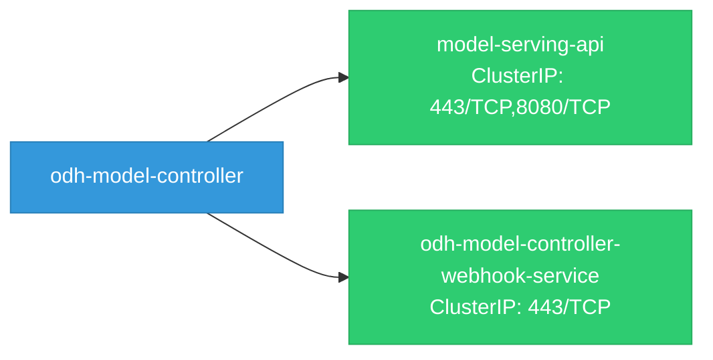

# odh-model-controller: Network

## Service Map

### Services

| Name | Type | Ports | Source |
|------|------|-------|--------|
| model-serving-api | ClusterIP | 443/TCP, 8080/TCP | [`config/server/service.yaml`](https://github.com/opendatahub-io/odh-model-controller/blob/f1f124a8ba8614010feef80eb8ed526e7e7d5e72/config/server/service.yaml) |
| odh-model-controller-webhook-service | ClusterIP | 443/TCP | [`config/webhook/service.yaml`](https://github.com/opendatahub-io/odh-model-controller/blob/f1f124a8ba8614010feef80eb8ed526e7e7d5e72/config/webhook/service.yaml) |

!!! warning "No Network Policies"
    No NetworkPolicy resources found. All pod-to-pod traffic is allowed by default.

