# spark-operator

> **Architecture snapshot: 2026-05-19** (2026-05-19)

**Repository:** kubeflow/spark-operator  
**Analyzer:** arch-analyzer 0.2.0  
**Extracted:** 2026-05-19T04:06:59Z

## Summary

| Metric | Count |
|--------|-------|
| CRDs | 3 |
| Deployments | 13 |
| Services | 3 |
| Secrets | 1 |
| Cluster Roles | 5 |
| Controller Watches | 10 |

## Component Architecture

CRDs, controllers, and owned Kubernetes resources.

```mermaid
graph LR
    %% Component architecture for spark-operator

    classDef crd fill:#e74c3c,stroke:#c0392b,color:#fff
    classDef controller fill:#3498db,stroke:#2980b9,color:#fff
    classDef owned fill:#2ecc71,stroke:#27ae60,color:#fff
    classDef external fill:#95a5a6,stroke:#7f8c8d,color:#fff
    classDef dep fill:#f39c12,stroke:#e67e22,color:#fff

    subgraph controller["spark-operator Controller"]
        dep_1["controller-manager"]
        class dep_1 controller
        dep_2["controller-manager"]
        class dep_2 controller
        dep_3["controller-manager"]
        class dep_3 controller
        dep_4["controller-manager"]
        class dep_4 controller
        dep_5["controller-manager"]
        class dep_5 controller
        dep_6["controller-manager"]
        class dep_6 controller
        dep_7["controller-manager"]
        class dep_7 controller
        dep_8["peaks"]
        class dep_8 controller
        dep_9["peaks"]
        class dep_9 controller
        dep_10["spark-operator-controller"]
        class dep_10 controller
        dep_11["spark-operator-webhook"]
        class dep_11 controller
        dep_12["the-deployment"]
        class dep_12 controller
        dep_13["the-deployment"]
        class dep_13 controller
    end

    crd_SparkConnect{{"SparkConnect\nsparkoperator.k8s.io/v1alpha1"}}
    class crd_SparkConnect crd
    crd_SparkConnect -->|"For (reconciles)"| controller
    crd_ScheduledSparkApplication{{"ScheduledSparkApplication\nsparkoperator.k8s.io/v1beta2"}}
    class crd_ScheduledSparkApplication crd
    crd_SparkApplication{{"SparkApplication\nsparkoperator.k8s.io/v1beta2"}}
    class crd_SparkApplication crd
    watch_14["Pod"] -->|"Watches"| controller
    class watch_14 external
```

### CRDs

| Group | Version | Kind | Scope | Fields | Validation Rules | Discovery | Source |
|-------|---------|------|-------|--------|------------------|-----------|--------|
| sparkoperator.k8s.io | v1alpha1 | SparkConnect | Namespaced | 95 | 0 | YAML | [`config/crd/bases/sparkoperator.k8s.io_sparkconnects.yaml`](https://github.com/kubeflow/spark-operator/blob/bc7885e2d34a9a0293672c1e8155e5446dcc0722/config/crd/bases/sparkoperator.k8s.io_sparkconnects.yaml) |
| sparkoperator.k8s.io | v1beta2 | ScheduledSparkApplication | Namespaced | 1676 | 0 | YAML | [`config/crd/bases/sparkoperator.k8s.io_scheduledsparkapplications.yaml`](https://github.com/kubeflow/spark-operator/blob/bc7885e2d34a9a0293672c1e8155e5446dcc0722/config/crd/bases/sparkoperator.k8s.io_scheduledsparkapplications.yaml) |
| sparkoperator.k8s.io | v1beta2 | SparkApplication | Namespaced | 1679 | 0 | YAML | [`config/crd/bases/sparkoperator.k8s.io_sparkapplications.yaml`](https://github.com/kubeflow/spark-operator/blob/bc7885e2d34a9a0293672c1e8155e5446dcc0722/config/crd/bases/sparkoperator.k8s.io_sparkapplications.yaml) |

## Dependencies

### Key External Dependencies

| Module | Version |
|--------|---------|
| github.com/go-logr/logr | v1.4.2 |
| github.com/go-logr/logr | v1.4.1 |
| github.com/go-logr/logr | v1.4.2 |
| github.com/go-logr/logr | v1.3.0 |
| github.com/go-logr/logr | v1.4.3 |
| github.com/go-logr/logr | v1.4.2 |
| github.com/go-logr/logr | v1.4.3 |
| github.com/go-logr/logr | v1.4.2 |
| github.com/go-logr/logr | v1.4.2 |
| github.com/go-logr/logr | v1.4.2 |
| github.com/go-logr/logr | v1.4.2 |
| github.com/go-logr/logr | v1.4.2 |
| github.com/go-logr/logr | v1.3.0 |
| github.com/go-logr/logr | v1.4.1 |
| github.com/go-logr/logr | v1.4.3 |
| github.com/go-logr/logr | v1.4.2 |
| github.com/go-logr/logr | v1.4.2 |
| github.com/go-logr/stdr | v1.2.2 |
| github.com/go-logr/stdr | v1.2.2 |
| github.com/go-logr/zapr | v1.3.0 |
| github.com/go-logr/zapr | v1.3.0 |
| github.com/go-logr/zapr | v1.3.0 |
| github.com/go-logr/zapr | v1.3.0 |
| github.com/prometheus/client_golang | v1.19.1 |
| github.com/prometheus/client_golang | v1.23.2 |
| github.com/prometheus/client_golang | v1.19.1 |
| github.com/prometheus/client_golang | v1.16.0 |
| github.com/prometheus/client_golang | v1.19.1 |
| github.com/prometheus/client_golang | v1.16.0 |
| github.com/prometheus/client_golang | v1.19.1 |
| github.com/prometheus/client_model | v0.6.1 |
| github.com/prometheus/client_model | v0.6.1 |
| github.com/prometheus/client_model | v0.6.2 |
| github.com/prometheus/client_model | v0.6.1 |
| github.com/prometheus/client_model | v0.6.2 |
| github.com/prometheus/client_model | v0.6.1 |
| github.com/prometheus/client_model | v0.6.2 |
| github.com/prometheus/client_model | v0.6.2 |
| github.com/prometheus/common | v0.55.0 |
| github.com/prometheus/common | v0.66.1 |
| github.com/prometheus/common | v0.66.1 |
| github.com/prometheus/common | v0.55.0 |
| github.com/prometheus/procfs | v0.15.1 |
| github.com/prometheus/procfs | v0.16.1 |
| github.com/prometheus/procfs | v0.15.1 |
| github.com/prometheus/procfs | v0.16.1 |
| google.golang.org/grpc | v1.59.0 |
| google.golang.org/grpc | v1.65.0 |
| google.golang.org/grpc | v1.65.0 |
| google.golang.org/grpc | v1.65.0 |
| google.golang.org/grpc | v1.65.0 |
| google.golang.org/grpc | v1.59.0 |
| k8s.io/api | v0.32.5 |
| k8s.io/api | v0.32.1 |
| k8s.io/api | v0.26.2 |
| k8s.io/api | v0.32.5 |
| k8s.io/api | v0.32.5 |
| k8s.io/api | v0.32.7 |
| k8s.io/api | v0.26.2 |
| k8s.io/api | v0.32.7 |
| k8s.io/api | v0.32.5 |
| k8s.io/api | v0.32.5 |
| k8s.io/api | v0.32.5 |
| k8s.io/api | v0.32.1 |
| k8s.io/api | v0.32.5 |
| k8s.io/api | v0.32.5 |
| k8s.io/api | v0.32.5 |
| k8s.io/api | v0.30.1 |
| k8s.io/api | v0.33.3 |
| k8s.io/api | v0.32.5 |
| k8s.io/api | v0.32.5 |
| k8s.io/api | v0.30.1 |
| k8s.io/api | v0.33.3 |
| k8s.io/apiextensions-apiserver | v0.32.1 |
| k8s.io/apiextensions-apiserver | v0.33.3 |
| k8s.io/apiextensions-apiserver | v0.33.3 |
| k8s.io/apiextensions-apiserver | v0.32.5 |
| k8s.io/apiextensions-apiserver | v0.32.1 |
| k8s.io/apimachinery | v0.30.1 |
| k8s.io/apimachinery | v0.32.5 |
| k8s.io/apimachinery | v0.27.4 |
| k8s.io/apimachinery | v0.32.5 |
| k8s.io/apimachinery | v0.32.5 |
| k8s.io/apimachinery | v0.27.4 |
| k8s.io/apimachinery | v0.32.5 |
| k8s.io/apimachinery | v0.33.3 |
| k8s.io/apimachinery | v0.32.5 |
| k8s.io/apimachinery | v0.32.5 |
| k8s.io/apimachinery | v0.32.5 |
| k8s.io/apimachinery | v0.32.1 |
| k8s.io/apimachinery | v0.30.1 |
| k8s.io/apimachinery | v0.32.5 |
| k8s.io/apimachinery | v0.32.5 |
| k8s.io/apimachinery | v0.32.5 |
| k8s.io/apimachinery | v0.32.5 |
| k8s.io/apimachinery | v0.32.7 |
| k8s.io/apimachinery | v0.32.5 |
| k8s.io/apimachinery | v0.32.5 |
| k8s.io/apimachinery | v0.33.3 |
| k8s.io/apimachinery | v0.32.5 |
| k8s.io/apimachinery | v0.32.5 |
| k8s.io/apimachinery | v0.32.7 |
| k8s.io/apimachinery | v0.32.5 |
| k8s.io/apimachinery | v0.32.5 |
| k8s.io/apimachinery | v0.32.1 |
| k8s.io/apiserver | v0.26.2 |
| k8s.io/apiserver | v0.32.5 |
| k8s.io/apiserver | v0.33.3 |
| k8s.io/apiserver | v0.32.5 |
| k8s.io/apiserver | v0.32.7 |
| k8s.io/apiserver | v0.30.1 |
| k8s.io/apiserver | v0.32.7 |
| k8s.io/apiserver | v0.32.1 |
| k8s.io/apiserver | v0.30.1 |
| k8s.io/apiserver | v0.33.3 |
| k8s.io/apiserver | v0.32.5 |
| k8s.io/apiserver | v0.32.1 |
| k8s.io/apiserver | v0.26.2 |
| k8s.io/client-go | v0.32.5 |
| k8s.io/client-go | v0.33.3 |
| k8s.io/client-go | v0.30.1 |
| k8s.io/client-go | v0.32.7 |
| k8s.io/client-go | v0.26.2 |
| k8s.io/client-go | v0.32.5 |
| k8s.io/client-go | v0.32.5 |
| k8s.io/client-go | v0.32.7 |
| k8s.io/client-go | v0.30.1 |
| k8s.io/client-go | v0.26.2 |
| k8s.io/client-go | v0.32.5 |
| k8s.io/client-go | v0.33.3 |
| k8s.io/client-go | v0.32.5 |
| k8s.io/client-go | v0.32.5 |
| k8s.io/client-go | v0.32.1 |
| k8s.io/client-go | v0.32.1 |
| k8s.io/client-go | v0.32.5 |
| k8s.io/client-go | v0.32.5 |
| k8s.io/client-go | v0.32.5 |
| k8s.io/client-go | v0.32.5 |
| k8s.io/client-go | v0.32.5 |
| sigs.k8s.io/controller-runtime | v0.20.4 |
| sigs.k8s.io/controller-runtime | v0.20.4 |
| sigs.k8s.io/controller-runtime | v0.20.4 |

