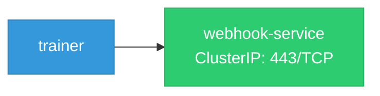

# trainer: Network

## Service Map

*1 unique services (2 total, duplicates from test fixtures collapsed).*

### Services

| Name | Type | Ports | Source |
|------|------|-------|--------|
| webhook-service | ClusterIP | 443/TCP | [`.gomod-cache/sigs.k8s.io/jobset@v0.10.1/config/components/webhook/service.yaml`](https://github.com/kubeflow/trainer/blob/51baadf644cd5d2c1672f1c658be46ad82f01b44/.gomod-cache/sigs.k8s.io/jobset@v0.10.1/config/components/webhook/service.yaml) |
| webhook-service | ClusterIP | 443/TCP | [`.gopath-loader/pkg/mod/sigs.k8s.io/jobset@v0.10.1/config/components/webhook/service.yaml`](https://github.com/kubeflow/trainer/blob/51baadf644cd5d2c1672f1c658be46ad82f01b44/.gopath-loader/pkg/mod/sigs.k8s.io/jobset@v0.10.1/config/components/webhook/service.yaml) |

!!! warning "No Network Policies"
    No NetworkPolicy resources found. All pod-to-pod traffic is allowed by default.

