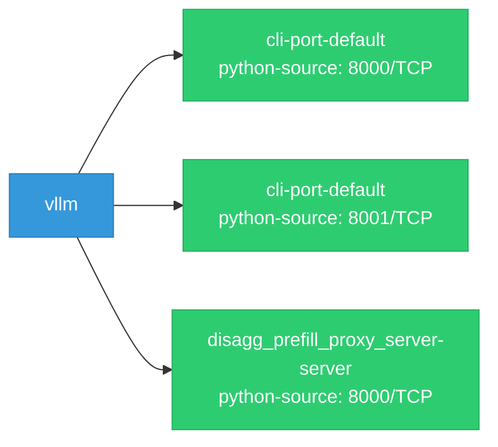

# vllm: Network

## Service Map

### Services

| Name | Type | Ports | Source |
|------|------|-------|--------|
| cli-port-default | python-source | 8000/TCP | [`benchmarks/benchmark_serving.py:1048`](https://github.com/red-hat-data-services/vllm/blob/7f15f7870a38aa1d06906c25156de8b100da140a/benchmarks/benchmark_serving.py#L1048) |
| cli-port-default | python-source | 8001/TCP | [`examples/online_serving/gradio_openai_chatbot_webserver.py:29`](https://github.com/red-hat-data-services/vllm/blob/7f15f7870a38aa1d06906c25156de8b100da140a/examples/online_serving/gradio_openai_chatbot_webserver.py#L29) |
| disagg_prefill_proxy_server-server | python-source | 8000/TCP | [`benchmarks/disagg_benchmarks/disagg_prefill_proxy_server.py:63`](https://github.com/red-hat-data-services/vllm/blob/7f15f7870a38aa1d06906c25156de8b100da140a/benchmarks/disagg_benchmarks/disagg_prefill_proxy_server.py#L63) |

!!! warning "No Network Policies"
    No NetworkPolicy resources found. All pod-to-pod traffic is allowed by default.

