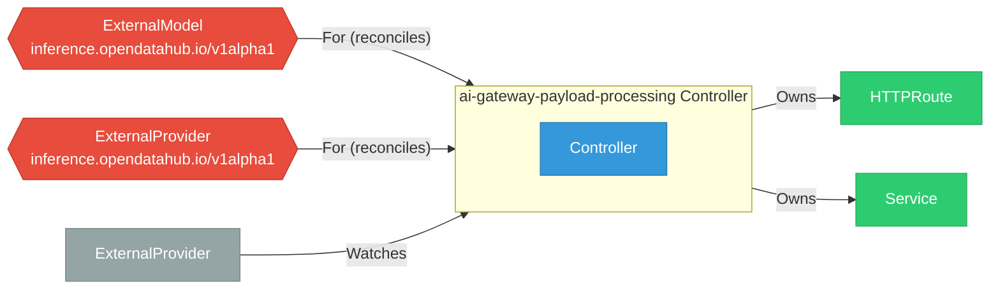

# ai-gateway-payload-processing

> **Architecture snapshot: 2026-05-18** (2026-05-18)

**Repository:** opendatahub-io/ai-gateway-payload-processing  
**Analyzer:** arch-analyzer 0.2.0  
**Extracted:** 2026-05-18T04:24:55Z

## Summary

| Metric | Count |
|--------|-------|
| CRDs | 2 |
| Deployments | 0 |
| Services | 1 |
| Secrets | 0 |
| Cluster Roles | 0 |
| Controller Watches | 17 |

## Component Architecture

CRDs, controllers, and owned Kubernetes resources.

### CRDs

| Group | Version | Kind | Scope | Fields | Validation Rules | Discovery | Source |
|-------|---------|------|-------|--------|------------------|-----------|--------|
| inference.opendatahub.io | v1alpha1 | ExternalModel | Namespaced | 18 | 0 | YAML | [`config/crd/bases/inference.opendatahub.io_externalmodels.yaml`](https://github.com/opendatahub-io/ai-gateway-payload-processing/blob/d873739d504086159cbe9a1bf0c410fbd908196b/config/crd/bases/inference.opendatahub.io_externalmodels.yaml) |
| inference.opendatahub.io | v1alpha1 | ExternalProvider | Namespaced | 19 | 0 | YAML | [`config/crd/bases/inference.opendatahub.io_externalproviders.yaml`](https://github.com/opendatahub-io/ai-gateway-payload-processing/blob/d873739d504086159cbe9a1bf0c410fbd908196b/config/crd/bases/inference.opendatahub.io_externalproviders.yaml) |

## Dependencies

### Key External Dependencies

| Module | Version |
|--------|---------|
| github.com/go-logr/logr | v1.4.3 |
| github.com/go-logr/logr | v1.4.3 |
| github.com/go-logr/logr | v1.4.3 |
| github.com/go-logr/logr | v1.4.1 |
| github.com/go-logr/logr | v1.4.3 |
| github.com/go-logr/logr | v1.3.0 |
| github.com/go-logr/logr | v1.3.0 |
| github.com/go-logr/logr | v1.4.3 |
| github.com/go-logr/logr | v1.4.3 |
| github.com/go-logr/logr | v1.4.1 |
| github.com/go-logr/logr | v1.2.2 |
| github.com/go-logr/logr | v1.4.3 |
| github.com/go-logr/logr | v1.4.3 |
| github.com/go-logr/logr | v1.4.3 |
| github.com/go-logr/logr | v1.2.2 |
| github.com/go-logr/logr | v1.4.3 |
| github.com/go-logr/logr | v1.4.3 |
| github.com/go-logr/logr | v1.4.3 |
| github.com/go-logr/logr | v1.4.3 |
| github.com/go-logr/logr | v1.4.3 |
| github.com/go-logr/logr | v1.4.3 |
| github.com/go-logr/logr | v1.4.3 |
| github.com/go-logr/logr | v1.4.3 |
| github.com/go-logr/stdr | v1.2.2 |
| github.com/go-logr/stdr | v1.2.2 |
| github.com/go-logr/stdr | v1.2.2 |
| github.com/go-logr/stdr | v1.2.2 |
| github.com/go-logr/zapr | v1.3.0 |
| github.com/go-logr/zapr | v1.3.0 |
| github.com/go-logr/zapr | v1.3.0 |
| github.com/go-logr/zapr | v1.3.0 |
| github.com/go-logr/zapr | v1.3.0 |
| github.com/go-logr/zapr | v1.3.0 |
| github.com/prometheus/client_golang | v1.23.2 |
| github.com/prometheus/client_golang | v1.11.1 |
| github.com/prometheus/client_golang | v1.23.2 |
| github.com/prometheus/client_golang | v1.11.1 |
| github.com/prometheus/client_golang | v1.23.2 |
| github.com/prometheus/client_golang | v1.23.2 |
| github.com/prometheus/client_golang | v1.23.2 |
| github.com/prometheus/client_golang | v1.23.2 |
| github.com/prometheus/client_model | v0.6.2 |
| github.com/prometheus/client_model | v0.6.2 |
| github.com/prometheus/client_model | v0.6.2 |
| github.com/prometheus/client_model | v0.6.2 |
| github.com/prometheus/client_model | v0.6.2 |
| github.com/prometheus/client_model | v0.6.2 |
| github.com/prometheus/client_model | v0.6.2 |
| github.com/prometheus/client_model | v0.6.2 |
| github.com/prometheus/client_model | v0.6.2 |
| github.com/prometheus/client_model | v0.6.2 |
| github.com/prometheus/client_model | v0.6.2 |
| github.com/prometheus/client_model | v0.6.2 |
| github.com/prometheus/common | v0.67.5 |
| github.com/prometheus/common | v0.67.5 |
| github.com/prometheus/common | v0.66.1 |
| github.com/prometheus/common | v0.66.1 |
| github.com/prometheus/common | v0.66.1 |
| github.com/prometheus/common | v0.66.1 |
| github.com/prometheus/procfs | v0.16.1 |
| github.com/prometheus/procfs | v0.16.1 |
| github.com/prometheus/procfs | v0.16.1 |
| github.com/prometheus/procfs | v0.16.1 |
| github.com/prometheus/prometheus | v0.310.0 |
| github.com/prometheus/prometheus | v0.310.0 |
| google.golang.org/grpc | v1.80.0 |
| google.golang.org/grpc | v1.79.2 |
| google.golang.org/grpc | v1.79.1 |
| google.golang.org/grpc | v1.56.3 |
| google.golang.org/grpc | v1.72.2 |
| google.golang.org/grpc | v1.80.0 |
| google.golang.org/grpc | v1.56.3 |
| google.golang.org/grpc | v1.78.0 |
| google.golang.org/grpc | v1.79.3 |
| google.golang.org/grpc | v1.72.2 |
| google.golang.org/grpc | v1.72.2 |
| google.golang.org/grpc | v1.79.3 |
| google.golang.org/grpc | v1.68.0 |
| google.golang.org/grpc | v1.78.0 |
| google.golang.org/grpc | v1.79.2 |
| google.golang.org/grpc | v1.79.1 |
| google.golang.org/grpc | v1.58.2 |
| google.golang.org/grpc | v1.72.2 |
| google.golang.org/grpc | v1.58.2 |
| google.golang.org/grpc | v1.68.0 |
| google.golang.org/grpc | v1.80.0 |
| google.golang.org/grpc | v1.80.0 |
| k8s.io/api | v0.35.4 |
| k8s.io/api | v0.35.4 |
| k8s.io/api | v0.35.5 |
| k8s.io/api | v0.35.4 |
| k8s.io/api | v0.35.5 |
| k8s.io/api | v0.35.5 |
| k8s.io/api | v0.35.4 |
| k8s.io/api | v0.35.5 |
| k8s.io/api | v0.35.0 |
| k8s.io/api | v0.35.5 |
| k8s.io/api | v0.35.4 |
| k8s.io/api | v0.35.4 |
| k8s.io/api | v0.35.0 |
| k8s.io/apiextensions-apiserver | v0.35.4 |
| k8s.io/apiextensions-apiserver | v0.35.4 |
| k8s.io/apiextensions-apiserver | v0.35.0 |
| k8s.io/apiextensions-apiserver | v0.35.0 |
| k8s.io/apimachinery | v0.35.4 |
| k8s.io/apimachinery | v0.35.5 |
| k8s.io/apimachinery | v0.35.4 |
| k8s.io/apimachinery | v0.35.1 |
| k8s.io/apimachinery | v0.35.5 |
| k8s.io/apimachinery | v0.35.5 |
| k8s.io/apimachinery | v0.35.5 |
| k8s.io/apimachinery | v0.35.4 |
| k8s.io/apimachinery | v0.35.4 |
| k8s.io/apimachinery | v0.35.4 |
| k8s.io/apimachinery | v0.35.5 |
| k8s.io/apimachinery | v0.35.5 |
| k8s.io/apimachinery | v0.35.0 |
| k8s.io/apimachinery | v0.35.5 |
| k8s.io/apimachinery | v0.35.5 |
| k8s.io/apimachinery | v0.35.5 |
| k8s.io/apimachinery | v0.35.4 |
| k8s.io/apimachinery | v0.35.1 |
| k8s.io/apimachinery | v0.35.0 |
| k8s.io/apiserver | v0.35.0 |
| k8s.io/apiserver | v0.35.4 |
| k8s.io/apiserver | v0.35.0 |
| k8s.io/apiserver | v0.35.4 |
| k8s.io/client-go | v0.35.1 |
| k8s.io/client-go | v0.35.5 |
| k8s.io/client-go | v0.35.1 |
| k8s.io/client-go | v0.35.4 |
| k8s.io/client-go | v0.35.0 |
| k8s.io/client-go | v0.35.5 |
| k8s.io/client-go | v0.35.4 |
| k8s.io/client-go | v0.35.5 |
| k8s.io/client-go | v0.35.4 |
| k8s.io/client-go | v0.35.4 |
| k8s.io/client-go | v0.35.4 |
| k8s.io/client-go | v0.35.5 |
| k8s.io/client-go | v0.35.5 |
| k8s.io/client-go | v0.35.0 |
| k8s.io/client-go | v0.35.4 |
| sigs.k8s.io/controller-runtime | v0.23.3 |
| sigs.k8s.io/controller-runtime | v0.23.3 |
| sigs.k8s.io/controller-runtime | v0.23.3 |

