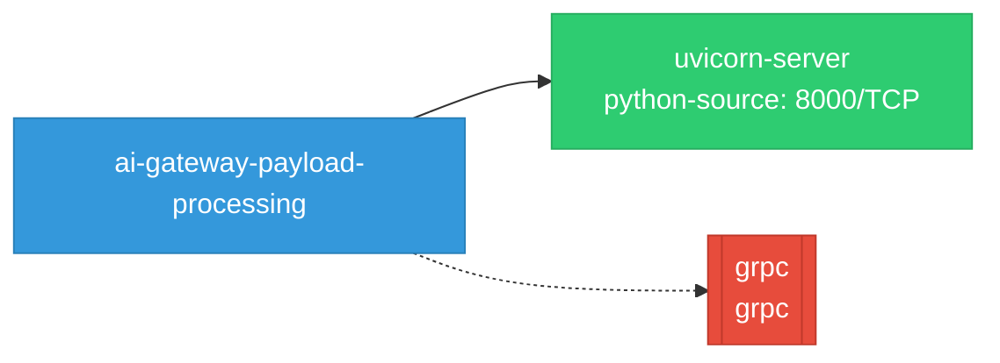

# ai-gateway-payload-processing: Network

## Service Map

### Services

| Name | Type | Ports | Source |
|------|------|-------|--------|
| uvicorn-server | python-source | 8000/TCP | [`.gomod-cache/sigs.k8s.io/gateway-api-inference-extension@v0.0.0-20260429190324-8ed5a0cd5d11/latencypredictor/training_server.py:2171`](https://github.com/opendatahub-io/ai-gateway-payload-processing/blob/cfe4df8b2bcfba56ffff6332e46e31a842ec0639/.gomod-cache/sigs.k8s.io/gateway-api-inference-extension@v0.0.0-20260429190324-8ed5a0cd5d11/latencypredictor/training_server.py#L2171) |

### Ingress / Routing

| Kind | Name | Hosts | Paths | TLS | Source |
|------|------|-------|-------|-----|--------|
| Gateway | inference-gateway |  |  | no | [`.gomod-cache/sigs.k8s.io/gateway-api-inference-extension@v0.0.0-20260429190324-8ed5a0cd5d11/config/manifests/gateway/agentgateway/gateway.yaml`](https://github.com/opendatahub-io/ai-gateway-payload-processing/blob/cfe4df8b2bcfba56ffff6332e46e31a842ec0639/.gomod-cache/sigs.k8s.io/gateway-api-inference-extension@v0.0.0-20260429190324-8ed5a0cd5d11/config/manifests/gateway/agentgateway/gateway.yaml) |
| Gateway | inference-gateway |  |  | no | [`.gomod-cache/sigs.k8s.io/gateway-api-inference-extension@v0.0.0-20260429190324-8ed5a0cd5d11/config/manifests/gateway/envoyaigateway/gateway.yaml`](https://github.com/opendatahub-io/ai-gateway-payload-processing/blob/cfe4df8b2bcfba56ffff6332e46e31a842ec0639/.gomod-cache/sigs.k8s.io/gateway-api-inference-extension@v0.0.0-20260429190324-8ed5a0cd5d11/config/manifests/gateway/envoyaigateway/gateway.yaml) |
| Gateway | inference-gateway |  |  | no | [`.gomod-cache/sigs.k8s.io/gateway-api-inference-extension@v0.0.0-20260429190324-8ed5a0cd5d11/config/manifests/gateway/gke/gateway.yaml`](https://github.com/opendatahub-io/ai-gateway-payload-processing/blob/cfe4df8b2bcfba56ffff6332e46e31a842ec0639/.gomod-cache/sigs.k8s.io/gateway-api-inference-extension@v0.0.0-20260429190324-8ed5a0cd5d11/config/manifests/gateway/gke/gateway.yaml) |
| Gateway | inference-gateway |  |  | no | [`.gomod-cache/sigs.k8s.io/gateway-api-inference-extension@v0.0.0-20260429190324-8ed5a0cd5d11/config/manifests/gateway/istio/gateway.yaml`](https://github.com/opendatahub-io/ai-gateway-payload-processing/blob/cfe4df8b2bcfba56ffff6332e46e31a842ec0639/.gomod-cache/sigs.k8s.io/gateway-api-inference-extension@v0.0.0-20260429190324-8ed5a0cd5d11/config/manifests/gateway/istio/gateway.yaml) |
| Gateway | inference-gateway |  |  | no | [`.gomod-cache/sigs.k8s.io/gateway-api-inference-extension@v0.0.0-20260429190324-8ed5a0cd5d11/config/manifests/gateway/nginxgatewayfabric/gateway.yaml`](https://github.com/opendatahub-io/ai-gateway-payload-processing/blob/cfe4df8b2bcfba56ffff6332e46e31a842ec0639/.gomod-cache/sigs.k8s.io/gateway-api-inference-extension@v0.0.0-20260429190324-8ed5a0cd5d11/config/manifests/gateway/nginxgatewayfabric/gateway.yaml) |
| Gateway | inference-gateway |  |  | no | [`.gopath-loader/pkg/mod/sigs.k8s.io/gateway-api-inference-extension@v0.0.0-20260429190324-8ed5a0cd5d11/config/manifests/gateway/agentgateway/gateway.yaml`](https://github.com/opendatahub-io/ai-gateway-payload-processing/blob/cfe4df8b2bcfba56ffff6332e46e31a842ec0639/.gopath-loader/pkg/mod/sigs.k8s.io/gateway-api-inference-extension@v0.0.0-20260429190324-8ed5a0cd5d11/config/manifests/gateway/agentgateway/gateway.yaml) |
| Gateway | inference-gateway |  |  | no | [`.gopath-loader/pkg/mod/sigs.k8s.io/gateway-api-inference-extension@v0.0.0-20260429190324-8ed5a0cd5d11/config/manifests/gateway/envoyaigateway/gateway.yaml`](https://github.com/opendatahub-io/ai-gateway-payload-processing/blob/cfe4df8b2bcfba56ffff6332e46e31a842ec0639/.gopath-loader/pkg/mod/sigs.k8s.io/gateway-api-inference-extension@v0.0.0-20260429190324-8ed5a0cd5d11/config/manifests/gateway/envoyaigateway/gateway.yaml) |
| Gateway | inference-gateway |  |  | no | [`.gopath-loader/pkg/mod/sigs.k8s.io/gateway-api-inference-extension@v0.0.0-20260429190324-8ed5a0cd5d11/config/manifests/gateway/gke/gateway.yaml`](https://github.com/opendatahub-io/ai-gateway-payload-processing/blob/cfe4df8b2bcfba56ffff6332e46e31a842ec0639/.gopath-loader/pkg/mod/sigs.k8s.io/gateway-api-inference-extension@v0.0.0-20260429190324-8ed5a0cd5d11/config/manifests/gateway/gke/gateway.yaml) |
| Gateway | inference-gateway |  |  | no | [`.gopath-loader/pkg/mod/sigs.k8s.io/gateway-api-inference-extension@v0.0.0-20260429190324-8ed5a0cd5d11/config/manifests/gateway/istio/gateway.yaml`](https://github.com/opendatahub-io/ai-gateway-payload-processing/blob/cfe4df8b2bcfba56ffff6332e46e31a842ec0639/.gopath-loader/pkg/mod/sigs.k8s.io/gateway-api-inference-extension@v0.0.0-20260429190324-8ed5a0cd5d11/config/manifests/gateway/istio/gateway.yaml) |
| Gateway | inference-gateway |  |  | no | [`.gopath-loader/pkg/mod/sigs.k8s.io/gateway-api-inference-extension@v0.0.0-20260429190324-8ed5a0cd5d11/config/manifests/gateway/nginxgatewayfabric/gateway.yaml`](https://github.com/opendatahub-io/ai-gateway-payload-processing/blob/cfe4df8b2bcfba56ffff6332e46e31a842ec0639/.gopath-loader/pkg/mod/sigs.k8s.io/gateway-api-inference-extension@v0.0.0-20260429190324-8ed5a0cd5d11/config/manifests/gateway/nginxgatewayfabric/gateway.yaml) |

!!! warning "No Network Policies"
    No NetworkPolicy resources were found in the analyzed sources. Network policies may exist in overlays, Helm values, or cluster-level configurations not captured by static analysis.

