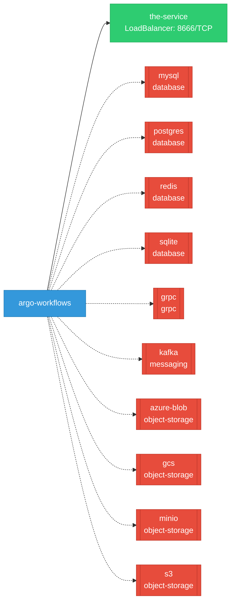

# argo-workflows: Network

## Service Map

*1 unique services (2 total, duplicates from test fixtures collapsed).*

### Services

| Name | Type | Ports | Source |
|------|------|-------|--------|
| the-service | LoadBalancer | 8666/TCP | [`.gomod-cache/k8s.io/cli-runtime@v0.32.2/artifacts/kustomization/service.yaml`](https://github.com/argoproj/argo-workflows/blob/003ed2b35a398772211441cb7c866c51f6f87e2d/.gomod-cache/k8s.io/cli-runtime@v0.32.2/artifacts/kustomization/service.yaml) |
| the-service | LoadBalancer | 8666/TCP | [`.gopath-loader/pkg/mod/k8s.io/cli-runtime@v0.32.2/artifacts/kustomization/service.yaml`](https://github.com/argoproj/argo-workflows/blob/003ed2b35a398772211441cb7c866c51f6f87e2d/.gopath-loader/pkg/mod/k8s.io/cli-runtime@v0.32.2/artifacts/kustomization/service.yaml) |

!!! warning "No Network Policies"
    No NetworkPolicy resources were found in the analyzed sources. Network policies may exist in overlays, Helm values, or cluster-level configurations not captured by static analysis.

