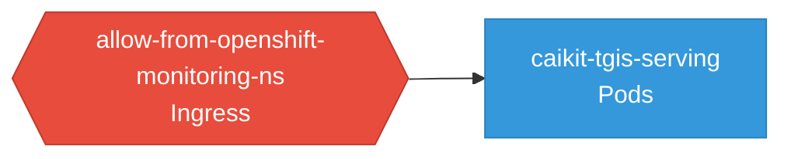

# caikit-tgis-serving: Network

### Services

No services defined.

### Ingress / Routing

| Kind | Name | Hosts | Paths | TLS | Source |
|------|------|-------|-------|-----|--------|
| Gateway | knative-ingress-gateway |  |  | no | [`demo/kserve/custom-manifests/serverless/gateways.yaml`](https://github.com/red-hat-data-services/caikit-tgis-serving/blob/27e5ef01c74822e835e3ae7d55c69d747be718fd/demo/kserve/custom-manifests/serverless/gateways.yaml) |
| Gateway | knative-local-gateway |  |  | no | [`demo/kserve/custom-manifests/serverless/gateways.yaml`](https://github.com/red-hat-data-services/caikit-tgis-serving/blob/27e5ef01c74822e835e3ae7d55c69d747be718fd/demo/kserve/custom-manifests/serverless/gateways.yaml) |

### Network Policies

| Name | Policy Types | Source |
|------|-------------|--------|
| allow-from-openshift-monitoring-ns | Ingress | [`demo/kserve/custom-manifests/metrics/networkpolicy-uwm.yaml`](https://github.com/red-hat-data-services/caikit-tgis-serving/blob/27e5ef01c74822e835e3ae7d55c69d747be718fd/demo/kserve/custom-manifests/metrics/networkpolicy-uwm.yaml) |

## Network Policy Graph

Visual representation of NetworkPolicy rules. Ingress rules show what traffic is allowed into pods, egress rules show what traffic is allowed out.

