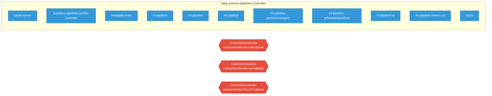

# data-science-pipelines

> **Architecture snapshot: 2026-05-15** (2026-05-15)

**Repository:** kubeflow/data-science-pipelines  
**Analyzer:** arch-analyzer 0.2.0  
**Extracted:** 2026-05-15T11:39:28Z

## Summary

| Metric | Count |
|--------|-------|
| CRDs | 3 |
| Deployments | 11 |
| Services | 2 |
| Secrets | 2 |
| Cluster Roles | 14 |
| Controller Watches | 1 |

## Component Architecture

CRDs, controllers, and owned Kubernetes resources.

### CRDs

| Group | Version | Kind | Scope | Fields | Validation Rules | Discovery | Source |
|-------|---------|------|-------|--------|------------------|-----------|--------|
| metacontroller.k8s.io | v1alpha1 | CompositeController | Cluster | 109 | 0 | YAML | [`manifests/kustomize/third-party/metacontroller/base/crd.yaml`](https://github.com/kubeflow/data-science-pipelines/blob/e61fa54e17eb9a52898792f7554ea3e00dc8eb0b/manifests/kustomize/third-party/metacontroller/base/crd.yaml) |
| metacontroller.k8s.io | v1alpha1 | ControllerRevision | Namespaced | 8 | 0 | YAML | [`manifests/kustomize/third-party/metacontroller/base/crd.yaml`](https://github.com/kubeflow/data-science-pipelines/blob/e61fa54e17eb9a52898792f7554ea3e00dc8eb0b/manifests/kustomize/third-party/metacontroller/base/crd.yaml) |
| metacontroller.k8s.io | v1alpha1 | DecoratorController | Cluster | 75 | 0 | YAML | [`manifests/kustomize/third-party/metacontroller/base/crd.yaml`](https://github.com/kubeflow/data-science-pipelines/blob/e61fa54e17eb9a52898792f7554ea3e00dc8eb0b/manifests/kustomize/third-party/metacontroller/base/crd.yaml) |

## Dependencies

### Key External Dependencies

| Module | Version |
|--------|---------|
| github.com/go-logr/logr | v1.4.3 |
| github.com/go-logr/logr | v1.4.3 |
| github.com/go-logr/logr | v1.4.3 |
| github.com/go-logr/logr | v1.4.1 |
| github.com/go-logr/logr | v1.2.2 |
| github.com/go-logr/logr | v1.4.3 |
| github.com/go-logr/logr | v1.4.3 |
| github.com/go-logr/logr | v1.4.3 |
| github.com/go-logr/logr | v1.4.3 |
| github.com/go-logr/logr | v1.4.3 |
| github.com/go-logr/logr | v1.4.3 |
| github.com/go-logr/logr | v1.4.3 |
| github.com/go-logr/logr | v1.4.3 |
| github.com/go-logr/logr | v1.4.1 |
| github.com/go-logr/logr | v1.2.2 |
| github.com/go-logr/logr | v1.3.0 |
| github.com/go-logr/logr | v1.4.3 |
| github.com/go-logr/logr | v1.3.0 |
| github.com/go-logr/stdr | v1.2.2 |
| github.com/go-logr/stdr | v1.2.2 |
| github.com/go-logr/stdr | v1.2.2 |
| github.com/go-logr/stdr | v1.2.2 |
| github.com/go-logr/zapr | v1.3.0 |
| github.com/go-logr/zapr | v1.3.0 |
| github.com/prometheus/client_golang | v1.23.2 |
| github.com/prometheus/client_golang | v1.23.2 |
| github.com/prometheus/client_golang | v1.22.0 |
| github.com/prometheus/client_golang | v1.22.0 |
| github.com/prometheus/client_golang | v1.23.2 |
| github.com/prometheus/client_golang | v1.22.0 |
| github.com/prometheus/client_golang | v1.22.0 |
| github.com/prometheus/client_model | v0.6.2 |
| github.com/prometheus/client_model | v0.6.2 |
| github.com/prometheus/client_model | v0.6.2 |
| github.com/prometheus/client_model | v0.6.2 |
| github.com/prometheus/client_model | v0.6.2 |
| github.com/prometheus/client_model | v0.6.2 |
| github.com/prometheus/client_model | v0.6.2 |
| github.com/prometheus/client_model | v0.6.2 |
| github.com/prometheus/client_model | v0.6.2 |
| github.com/prometheus/client_model | v0.6.2 |
| github.com/prometheus/client_model | v0.6.2 |
| github.com/prometheus/common | v0.64.0 |
| github.com/prometheus/common | v0.64.0 |
| github.com/prometheus/common | v0.66.1 |
| github.com/prometheus/common | v0.64.0 |
| github.com/prometheus/common | v0.64.0 |
| github.com/prometheus/common | v0.66.1 |
| github.com/prometheus/procfs | v0.16.1 |
| github.com/prometheus/procfs | v0.16.1 |
| google.golang.org/grpc | v1.72.2 |
| google.golang.org/grpc | v1.65.0 |
| google.golang.org/grpc | v1.71.1 |
| google.golang.org/grpc | v1.71.0 |
| google.golang.org/grpc | v1.74.2 |
| google.golang.org/grpc | v1.71.1 |
| google.golang.org/grpc | v1.72.1 |
| google.golang.org/grpc | v1.58.2 |
| google.golang.org/grpc | v1.71.1 |
| google.golang.org/grpc | v1.43.0 |
| google.golang.org/grpc | v1.72.2 |
| google.golang.org/grpc | v1.72.2 |
| google.golang.org/grpc | v1.72.1 |
| google.golang.org/grpc | v1.65.0 |
| google.golang.org/grpc | v1.72.1 |
| google.golang.org/grpc | v1.72.1 |
| google.golang.org/grpc | v1.72.1 |
| google.golang.org/grpc | v1.72.0 |
| google.golang.org/grpc | v1.72.2 |
| google.golang.org/grpc | v1.43.0 |
| google.golang.org/grpc | v1.72.1 |
| google.golang.org/grpc | v1.33.2 |
| google.golang.org/grpc | v1.68.0 |
| google.golang.org/grpc | v1.33.1 |
| google.golang.org/grpc | v1.72.1 |
| google.golang.org/grpc | v1.75.0 |
| google.golang.org/grpc | v1.71.1 |
| google.golang.org/grpc | v1.72.0 |
| google.golang.org/grpc | v1.75.1 |
| google.golang.org/grpc | v1.75.1 |
| google.golang.org/grpc | v1.73.0 |
| google.golang.org/grpc | v1.71.1 |
| google.golang.org/grpc | v1.72.1 |
| google.golang.org/grpc | v1.63.2 |
| google.golang.org/grpc | v1.72.2 |
| google.golang.org/grpc | v1.71.0 |
| google.golang.org/grpc | v1.75.0 |
| google.golang.org/grpc | v1.33.2 |
| google.golang.org/grpc | v1.72.2 |
| google.golang.org/grpc | v1.68.0 |
| google.golang.org/grpc | v1.72.2 |
| google.golang.org/grpc | v1.65.0 |
| google.golang.org/grpc | v1.65.0 |
| google.golang.org/grpc | v1.58.2 |
| google.golang.org/grpc | v1.74.2 |
| google.golang.org/grpc | v1.56.3 |
| google.golang.org/grpc | v1.63.2 |
| google.golang.org/grpc | v1.71.1 |
| google.golang.org/grpc | v1.72.1 |
| google.golang.org/grpc | v1.79.3 |
| google.golang.org/grpc | v1.67.1 |
| google.golang.org/grpc | v1.72.0 |
| google.golang.org/grpc | v1.67.1 |
| google.golang.org/grpc | v1.72.1 |
| google.golang.org/grpc | v1.33.1 |
| google.golang.org/grpc | v1.73.0 |
| google.golang.org/grpc | v1.72.0 |
| google.golang.org/grpc | v1.72.2 |
| google.golang.org/grpc/cmd/protoc-gen-go-grpc | v1.5.1 |
| google.golang.org/grpc/examples | v0.0.0-20250407062114-b368379ef8f6 |
| google.golang.org/grpc/examples | v0.0.0-20250407062114-b368379ef8f6 |
| k8s.io/api | v0.35.2 |
| k8s.io/api | v0.35.2 |
| k8s.io/api | v0.33.1 |
| k8s.io/api | v0.35.2 |
| k8s.io/api | v0.35.2 |
| k8s.io/api | v0.35.0 |
| k8s.io/api | v0.35.0 |
| k8s.io/api | v0.33.1 |
| k8s.io/api | v0.35.2 |
| k8s.io/apiextensions-apiserver | v0.35.0 |
| k8s.io/apiextensions-apiserver | v0.35.0 |
| k8s.io/apimachinery | v0.35.2 |
| k8s.io/apimachinery | v0.35.2 |
| k8s.io/apimachinery | v0.35.2 |
| k8s.io/apimachinery | v0.33.1 |
| k8s.io/apimachinery | v0.33.1 |
| k8s.io/apimachinery | v0.35.2 |
| k8s.io/apimachinery | v0.35.2 |
| k8s.io/apimachinery | v0.35.0 |
| k8s.io/apimachinery | v0.35.0 |
| k8s.io/apimachinery | v0.35.2 |
| k8s.io/apimachinery | v0.35.2 |
| k8s.io/apimachinery | v0.35.2 |
| k8s.io/apimachinery | v0.35.2 |
| k8s.io/apiserver | v0.35.0 |
| k8s.io/apiserver | v0.35.2 |
| k8s.io/apiserver | v0.35.2 |
| k8s.io/apiserver | v0.35.0 |
| k8s.io/client-go | v0.35.0 |
| k8s.io/client-go | v0.35.2 |
| k8s.io/client-go | v0.35.0 |
| k8s.io/client-go | v0.33.1 |
| k8s.io/client-go | v0.35.2 |
| k8s.io/client-go | v0.33.1 |
| k8s.io/client-go | v0.35.2 |
| sigs.k8s.io/controller-runtime | v0.23.3 |

