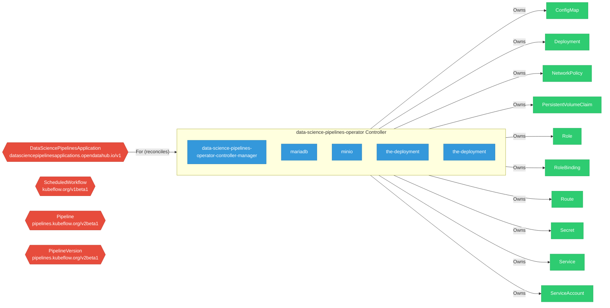

# data-science-pipelines-operator

> **Architecture snapshot: 2026-05-15** (2026-05-15)

**Repository:** opendatahub-io/data-science-pipelines-operator  
**Analyzer:** arch-analyzer 0.2.0  
**Extracted:** 2026-05-15T11:38:34Z

## Summary

| Metric | Count |
|--------|-------|
| CRDs | 4 |
| Deployments | 5 |
| Services | 13 |
| Secrets | 4 |
| Cluster Roles | 4 |
| Controller Watches | 12 |

## Component Architecture

CRDs, controllers, and owned Kubernetes resources.

### CRDs

| Group | Version | Kind | Scope | Fields | Validation Rules | Discovery | Source |
|-------|---------|------|-------|--------|------------------|-----------|--------|
| datasciencepipelinesapplications.opendatahub.io | v1 | DataSciencePipelinesApplication | Namespaced | 205 | 2 | YAML | [`config/crd/bases/datasciencepipelinesapplications.opendatahub.io_datasciencepipelinesapplications.yaml`](https://github.com/opendatahub-io/data-science-pipelines-operator/blob/1e6ce36e03d4d7e8ca3ab52e0026842e035c1ad2/config/crd/bases/datasciencepipelinesapplications.opendatahub.io_datasciencepipelinesapplications.yaml) |
| kubeflow.org | v1beta1 | ScheduledWorkflow | Namespaced | 5 | 0 | YAML | [`config/crd/bases/scheduledworkflows.yaml`](https://github.com/opendatahub-io/data-science-pipelines-operator/blob/1e6ce36e03d4d7e8ca3ab52e0026842e035c1ad2/config/crd/bases/scheduledworkflows.yaml) |
| pipelines.kubeflow.org | v2beta1 | Pipeline | Namespaced | 7 | 0 | YAML | [`config/crd/bases/pipelines.kubeflow.org_pipelines.yaml`](https://github.com/opendatahub-io/data-science-pipelines-operator/blob/1e6ce36e03d4d7e8ca3ab52e0026842e035c1ad2/config/crd/bases/pipelines.kubeflow.org_pipelines.yaml) |
| pipelines.kubeflow.org | v2beta1 | PipelineVersion | Namespaced | 18 | 0 | YAML | [`config/crd/bases/pipelines.kubeflow.org_pipelineversions.yaml`](https://github.com/opendatahub-io/data-science-pipelines-operator/blob/1e6ce36e03d4d7e8ca3ab52e0026842e035c1ad2/config/crd/bases/pipelines.kubeflow.org_pipelineversions.yaml) |

## Dependencies

### Key External Dependencies

| Module | Version |
|--------|---------|
| github.com/go-logr/logr | v1.4.1 |
| github.com/go-logr/logr | v1.4.3 |
| github.com/go-logr/logr | v1.2.2 |
| github.com/go-logr/logr | v1.3.0 |
| github.com/go-logr/logr | v1.4.3 |
| github.com/go-logr/logr | v1.4.3 |
| github.com/go-logr/logr | v1.3.0 |
| github.com/go-logr/logr | v1.4.3 |
| github.com/go-logr/logr | v1.4.3 |
| github.com/go-logr/logr | v1.4.1 |
| github.com/go-logr/logr | v1.2.2 |
| github.com/go-logr/zapr | v1.3.0 |
| github.com/go-logr/zapr | v1.3.0 |
| github.com/prometheus/client_golang | v1.23.2 |
| github.com/prometheus/client_golang | v1.23.2 |
| github.com/prometheus/client_golang | v1.23.2 |
| github.com/prometheus/client_model | v0.6.2 |
| github.com/prometheus/client_model | v0.6.2 |
| github.com/prometheus/client_model | v0.6.2 |
| github.com/prometheus/client_model | v0.6.2 |
| github.com/prometheus/client_model | v0.6.2 |
| github.com/prometheus/client_model | v0.6.2 |
| github.com/prometheus/common | v0.66.1 |
| github.com/prometheus/common | v0.66.1 |
| github.com/prometheus/procfs | v0.16.1 |
| github.com/prometheus/procfs | v0.16.1 |
| google.golang.org/grpc | v1.72.2 |
| google.golang.org/grpc | v1.72.2 |
| k8s.io/api | v0.21.3 |
| k8s.io/api | v0.22.5 |
| k8s.io/api | v0.35.3 |
| k8s.io/api | v0.35.0 |
| k8s.io/api | v0.35.0 |
| k8s.io/api | v0.35.3 |
| k8s.io/api | v0.35.1 |
| k8s.io/api | v0.35.3 |
| k8s.io/api | v0.35.1 |
| k8s.io/api | v0.35.3 |
| k8s.io/api | v0.21.3 |
| k8s.io/api | v0.22.5 |
| k8s.io/api | v0.35.3 |
| k8s.io/api | v0.35.3 |
| k8s.io/api | v0.35.3 |
| k8s.io/apiextensions-apiserver | v0.35.0 |
| k8s.io/apiextensions-apiserver | v0.35.0 |
| k8s.io/apimachinery | v0.35.1 |
| k8s.io/apimachinery | v0.35.0 |
| k8s.io/apimachinery | v0.35.3 |
| k8s.io/apimachinery | v0.22.5 |
| k8s.io/apimachinery | v0.35.3 |
| k8s.io/apimachinery | v0.35.1 |
| k8s.io/apimachinery | v0.22.5 |
| k8s.io/apimachinery | v0.35.3 |
| k8s.io/apimachinery | v0.35.3 |
| k8s.io/apimachinery | v0.35.3 |
| k8s.io/apimachinery | v0.35.3 |
| k8s.io/apimachinery | v0.19.7 |
| k8s.io/apimachinery | v0.21.3 |
| k8s.io/apimachinery | v0.35.3 |
| k8s.io/apimachinery | v0.35.3 |
| k8s.io/apimachinery | v0.35.3 |
| k8s.io/apimachinery | v0.19.7 |
| k8s.io/apimachinery | v0.21.3 |
| k8s.io/apimachinery | v0.35.0 |
| k8s.io/apiserver | v0.35.0 |
| k8s.io/apiserver | v0.35.3 |
| k8s.io/apiserver | v0.35.0 |
| k8s.io/apiserver | v0.35.3 |
| k8s.io/client-go | v0.22.5 |
| k8s.io/client-go | v0.35.0 |
| k8s.io/client-go | v0.21.3 |
| k8s.io/client-go | v0.35.3 |
| k8s.io/client-go | v0.35.3 |
| k8s.io/client-go | v0.21.3 |
| k8s.io/client-go | v0.35.0 |
| k8s.io/client-go | v0.35.3 |
| k8s.io/client-go | v0.35.3 |
| k8s.io/client-go | v0.35.3 |
| k8s.io/client-go | v0.22.5 |
| sigs.k8s.io/controller-runtime | v0.23.3 |
| sigs.k8s.io/controller-runtime | v0.7.2 |
| sigs.k8s.io/controller-runtime | v0.7.2 |

