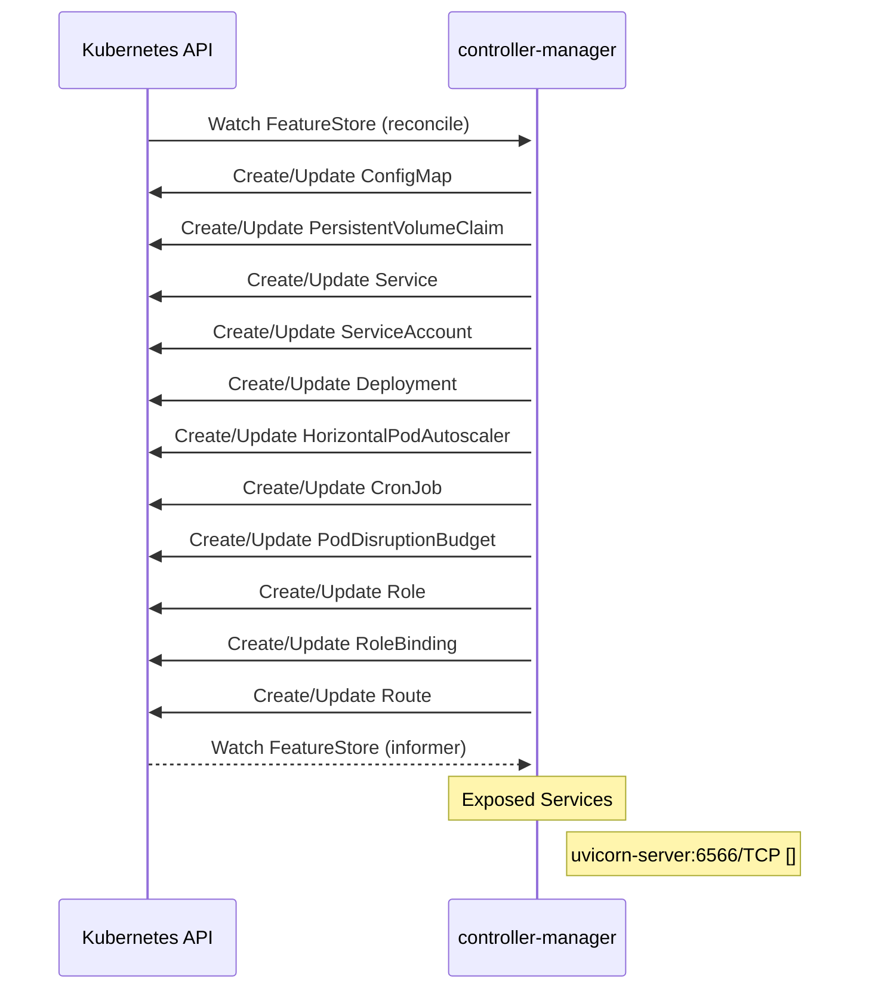

# feast: Dataflow

## Controller Watches

Kubernetes resources this controller monitors for changes. Each watch triggers reconciliation when the watched resource is created, updated, or deleted.

| Type | GVK | Source |
|------|-----|--------|
| For | api/v1/FeatureStore | [`infra/feast-operator/internal/controller/featurestore_controller.go:350`](https://github.com/feast-dev/feast/blob/0ab134e67b808322415520a6f071e722ef5a9b45/infra/feast-operator/internal/controller/featurestore_controller.go#L350) |
| Owns | /v1/ConfigMap | [`infra/feast-operator/internal/controller/featurestore_controller.go:351`](https://github.com/feast-dev/feast/blob/0ab134e67b808322415520a6f071e722ef5a9b45/infra/feast-operator/internal/controller/featurestore_controller.go#L351) |
| Owns | /v1/PersistentVolumeClaim | [`infra/feast-operator/internal/controller/featurestore_controller.go:354`](https://github.com/feast-dev/feast/blob/0ab134e67b808322415520a6f071e722ef5a9b45/infra/feast-operator/internal/controller/featurestore_controller.go#L354) |
| Owns | /v1/Service | [`infra/feast-operator/internal/controller/featurestore_controller.go:353`](https://github.com/feast-dev/feast/blob/0ab134e67b808322415520a6f071e722ef5a9b45/infra/feast-operator/internal/controller/featurestore_controller.go#L353) |
| Owns | /v1/ServiceAccount | [`infra/feast-operator/internal/controller/featurestore_controller.go:355`](https://github.com/feast-dev/feast/blob/0ab134e67b808322415520a6f071e722ef5a9b45/infra/feast-operator/internal/controller/featurestore_controller.go#L355) |
| Owns | apps/v1/Deployment | [`infra/feast-operator/internal/controller/featurestore_controller.go:352`](https://github.com/feast-dev/feast/blob/0ab134e67b808322415520a6f071e722ef5a9b45/infra/feast-operator/internal/controller/featurestore_controller.go#L352) |
| Owns | autoscaling/v2/HorizontalPodAutoscaler | [`infra/feast-operator/internal/controller/featurestore_controller.go:359`](https://github.com/feast-dev/feast/blob/0ab134e67b808322415520a6f071e722ef5a9b45/infra/feast-operator/internal/controller/featurestore_controller.go#L359) |
| Owns | batch/v1/CronJob | [`infra/feast-operator/internal/controller/featurestore_controller.go:358`](https://github.com/feast-dev/feast/blob/0ab134e67b808322415520a6f071e722ef5a9b45/infra/feast-operator/internal/controller/featurestore_controller.go#L358) |
| Owns | policy/v1/PodDisruptionBudget | [`infra/feast-operator/internal/controller/featurestore_controller.go:360`](https://github.com/feast-dev/feast/blob/0ab134e67b808322415520a6f071e722ef5a9b45/infra/feast-operator/internal/controller/featurestore_controller.go#L360) |
| Owns | rbac.authorization.k8s.io/v1/Role | [`infra/feast-operator/internal/controller/featurestore_controller.go:357`](https://github.com/feast-dev/feast/blob/0ab134e67b808322415520a6f071e722ef5a9b45/infra/feast-operator/internal/controller/featurestore_controller.go#L357) |
| Owns | rbac.authorization.k8s.io/v1/RoleBinding | [`infra/feast-operator/internal/controller/featurestore_controller.go:356`](https://github.com/feast-dev/feast/blob/0ab134e67b808322415520a6f071e722ef5a9b45/infra/feast-operator/internal/controller/featurestore_controller.go#L356) |
| Owns | route/v1/Route | [`infra/feast-operator/internal/controller/featurestore_controller.go:364`](https://github.com/feast-dev/feast/blob/0ab134e67b808322415520a6f071e722ef5a9b45/infra/feast-operator/internal/controller/featurestore_controller.go#L364) |
| Watches | api/v1/FeatureStore | [`infra/feast-operator/internal/controller/featurestore_controller.go:361`](https://github.com/feast-dev/feast/blob/0ab134e67b808322415520a6f071e722ef5a9b45/infra/feast-operator/internal/controller/featurestore_controller.go#L361) |

## Reconciliation Flow

How the controller interacts with the Kubernetes API during reconciliation.

### HTTP Endpoints

| Method | Path | Source |
|--------|------|--------|
| * | / | [`.gomod-cache/golang.org/toolchain@v0.0.1-go1.25.0.linux-amd64/src/cmd/trace/main.go:188`](https://github.com/feast-dev/feast/blob/0ab134e67b808322415520a6f071e722ef5a9b45/.gomod-cache/golang.org/toolchain@v0.0.1-go1.25.0.linux-amd64/src/cmd/trace/main.go#L188) |
| * | / | [`.gopath-loader/pkg/mod/golang.org/x/tools@v0.38.0/cmd/present/dir.go:23`](https://github.com/feast-dev/feast/blob/0ab134e67b808322415520a6f071e722ef5a9b45/.gopath-loader/pkg/mod/golang.org/x/tools@v0.38.0/cmd/present/dir.go#L23) |
| * | / | [`.gomod-cache/github.com/aws/aws-sdk-go-v2@v1.36.4/internal/awstesting/certificate_utils.go:225`](https://github.com/feast-dev/feast/blob/0ab134e67b808322415520a6f071e722ef5a9b45/.gomod-cache/github.com/aws/aws-sdk-go-v2@v1.36.4/internal/awstesting/certificate_utils.go#L225) |
| * | / | [`.gomod-cache/github.com/google/s2a-go@v0.1.9/tools/internal_ci/test_gae/main.go:79`](https://github.com/feast-dev/feast/blob/0ab134e67b808322415520a6f071e722ef5a9b45/.gomod-cache/github.com/google/s2a-go@v0.1.9/tools/internal_ci/test_gae/main.go#L79) |
| * | / | [`.gopath-loader/pkg/mod/golang.org/x/tools@v0.38.0/go/types/internal/play/play.go:46`](https://github.com/feast-dev/feast/blob/0ab134e67b808322415520a6f071e722ef5a9b45/.gopath-loader/pkg/mod/golang.org/x/tools@v0.38.0/go/types/internal/play/play.go#L46) |
| * | / | [`.gomod-cache/github.com/googleapis/enterprise-certificate-proxy@v0.3.7/http_proxy/main.go:329`](https://github.com/feast-dev/feast/blob/0ab134e67b808322415520a6f071e722ef5a9b45/.gomod-cache/github.com/googleapis/enterprise-certificate-proxy@v0.3.7/http_proxy/main.go#L329) |
| * | / | [`.gopath-loader/pkg/mod/golang.org/toolchain@v0.0.1-go1.25.0.linux-amd64/src/net/http/triv.go:130`](https://github.com/feast-dev/feast/blob/0ab134e67b808322415520a6f071e722ef5a9b45/.gopath-loader/pkg/mod/golang.org/toolchain@v0.0.1-go1.25.0.linux-amd64/src/net/http/triv.go#L130) |
| * | / | [`.gopath-loader/pkg/mod/golang.org/x/telemetry@v0.0.0-20251008203120-078029d740a8/cmd/gotelemetry/internal/view/view.go:57`](https://github.com/feast-dev/feast/blob/0ab134e67b808322415520a6f071e722ef5a9b45/.gopath-loader/pkg/mod/golang.org/x/telemetry@v0.0.0-20251008203120-078029d740a8/cmd/gotelemetry/internal/view/view.go#L57) |
| * | / | [`.gopath-loader/pkg/mod/golang.org/x/net@v0.47.0/webdav/litmus_test_server.go:83`](https://github.com/feast-dev/feast/blob/0ab134e67b808322415520a6f071e722ef5a9b45/.gopath-loader/pkg/mod/golang.org/x/net@v0.47.0/webdav/litmus_test_server.go#L83) |
| * | / | [`.gomod-cache/golang.org/x/tools@v0.38.0/cmd/present/dir.go:23`](https://github.com/feast-dev/feast/blob/0ab134e67b808322415520a6f071e722ef5a9b45/.gomod-cache/golang.org/x/tools@v0.38.0/cmd/present/dir.go#L23) |
| * | / | [`.gomod-cache/golang.org/x/tools@v0.38.0/go/types/internal/play/play.go:46`](https://github.com/feast-dev/feast/blob/0ab134e67b808322415520a6f071e722ef5a9b45/.gomod-cache/golang.org/x/tools@v0.38.0/go/types/internal/play/play.go#L46) |
| * | / | [`.gomod-cache/golang.org/toolchain@v0.0.1-go1.25.0.linux-amd64/src/net/http/triv.go:130`](https://github.com/feast-dev/feast/blob/0ab134e67b808322415520a6f071e722ef5a9b45/.gomod-cache/golang.org/toolchain@v0.0.1-go1.25.0.linux-amd64/src/net/http/triv.go#L130) |
| * | / | [`.gopath-loader/pkg/mod/github.com/googleapis/enterprise-certificate-proxy@v0.3.7/http_proxy/main.go:329`](https://github.com/feast-dev/feast/blob/0ab134e67b808322415520a6f071e722ef5a9b45/.gopath-loader/pkg/mod/github.com/googleapis/enterprise-certificate-proxy@v0.3.7/http_proxy/main.go#L329) |
| * | / | [`.gomod-cache/golang.org/x/net@v0.47.0/webdav/litmus_test_server.go:83`](https://github.com/feast-dev/feast/blob/0ab134e67b808322415520a6f071e722ef5a9b45/.gomod-cache/golang.org/x/net@v0.47.0/webdav/litmus_test_server.go#L83) |
| * | / | [`.gopath-loader/pkg/mod/github.com/aws/aws-sdk-go-v2@v1.36.4/internal/awstesting/certificate_utils.go:225`](https://github.com/feast-dev/feast/blob/0ab134e67b808322415520a6f071e722ef5a9b45/.gopath-loader/pkg/mod/github.com/aws/aws-sdk-go-v2@v1.36.4/internal/awstesting/certificate_utils.go#L225) |
| * | / | [`.gopath-loader/pkg/mod/golang.org/toolchain@v0.0.1-go1.25.0.linux-amd64/src/cmd/trace/main.go:188`](https://github.com/feast-dev/feast/blob/0ab134e67b808322415520a6f071e722ef5a9b45/.gopath-loader/pkg/mod/golang.org/toolchain@v0.0.1-go1.25.0.linux-amd64/src/cmd/trace/main.go#L188) |
| * | / | [`.gomod-cache/golang.org/x/telemetry@v0.0.0-20251008203120-078029d740a8/cmd/gotelemetry/internal/view/view.go:57`](https://github.com/feast-dev/feast/blob/0ab134e67b808322415520a6f071e722ef5a9b45/.gomod-cache/golang.org/x/telemetry@v0.0.0-20251008203120-078029d740a8/cmd/gotelemetry/internal/view/view.go#L57) |
| * | / | [`.gopath-loader/pkg/mod/github.com/google/s2a-go@v0.1.9/tools/internal_ci/test_gae/main.go:79`](https://github.com/feast-dev/feast/blob/0ab134e67b808322415520a6f071e722ef5a9b45/.gopath-loader/pkg/mod/github.com/google/s2a-go@v0.1.9/tools/internal_ci/test_gae/main.go#L79) |
| * | /args | [`.gomod-cache/golang.org/toolchain@v0.0.1-go1.25.0.linux-amd64/src/net/http/triv.go:136`](https://github.com/feast-dev/feast/blob/0ab134e67b808322415520a6f071e722ef5a9b45/.gomod-cache/golang.org/toolchain@v0.0.1-go1.25.0.linux-amd64/src/net/http/triv.go#L136) |
| * | /args | [`.gopath-loader/pkg/mod/golang.org/toolchain@v0.0.1-go1.25.0.linux-amd64/src/net/http/triv.go:136`](https://github.com/feast-dev/feast/blob/0ab134e67b808322415520a6f071e722ef5a9b45/.gopath-loader/pkg/mod/golang.org/toolchain@v0.0.1-go1.25.0.linux-amd64/src/net/http/triv.go#L136) |
| * | /authority.cer | [`.gopath-loader/pkg/mod/cloud.google.com/go@v0.123.0/httpreplay/cmd/httpr/httpr.go:76`](https://github.com/feast-dev/feast/blob/0ab134e67b808322415520a6f071e722ef5a9b45/.gopath-loader/pkg/mod/cloud.google.com/go@v0.123.0/httpreplay/cmd/httpr/httpr.go#L76) |
| * | /authority.cer | [`.gomod-cache/cloud.google.com/go@v0.123.0/httpreplay/cmd/httpr/httpr.go:76`](https://github.com/feast-dev/feast/blob/0ab134e67b808322415520a6f071e722ef5a9b45/.gomod-cache/cloud.google.com/go@v0.123.0/httpreplay/cmd/httpr/httpr.go#L76) |
| * | /bar | [`.gomod-cache/golang.org/toolchain@v0.0.1-go1.25.0.linux-amd64/src/net/http/doc.go:67`](https://github.com/feast-dev/feast/blob/0ab134e67b808322415520a6f071e722ef5a9b45/.gomod-cache/golang.org/toolchain@v0.0.1-go1.25.0.linux-amd64/src/net/http/doc.go#L67) |
| * | /bar | [`.gopath-loader/pkg/mod/golang.org/toolchain@v0.0.1-go1.25.0.linux-amd64/src/net/http/doc.go:67`](https://github.com/feast-dev/feast/blob/0ab134e67b808322415520a6f071e722ef5a9b45/.gopath-loader/pkg/mod/golang.org/toolchain@v0.0.1-go1.25.0.linux-amd64/src/net/http/doc.go#L67) |
| * | /block | [`.gopath-loader/pkg/mod/golang.org/toolchain@v0.0.1-go1.25.0.linux-amd64/src/cmd/trace/main.go:210`](https://github.com/feast-dev/feast/blob/0ab134e67b808322415520a6f071e722ef5a9b45/.gopath-loader/pkg/mod/golang.org/toolchain@v0.0.1-go1.25.0.linux-amd64/src/cmd/trace/main.go#L210) |
| * | /block | [`.gomod-cache/golang.org/toolchain@v0.0.1-go1.25.0.linux-amd64/src/cmd/trace/main.go:210`](https://github.com/feast-dev/feast/blob/0ab134e67b808322415520a6f071e722ef5a9b45/.gomod-cache/golang.org/toolchain@v0.0.1-go1.25.0.linux-amd64/src/cmd/trace/main.go#L210) |
| * | /chan | [`.gomod-cache/golang.org/toolchain@v0.0.1-go1.25.0.linux-amd64/src/net/http/triv.go:134`](https://github.com/feast-dev/feast/blob/0ab134e67b808322415520a6f071e722ef5a9b45/.gomod-cache/golang.org/toolchain@v0.0.1-go1.25.0.linux-amd64/src/net/http/triv.go#L134) |
| * | /chan | [`.gopath-loader/pkg/mod/golang.org/toolchain@v0.0.1-go1.25.0.linux-amd64/src/net/http/triv.go:134`](https://github.com/feast-dev/feast/blob/0ab134e67b808322415520a6f071e722ef5a9b45/.gopath-loader/pkg/mod/golang.org/toolchain@v0.0.1-go1.25.0.linux-amd64/src/net/http/triv.go#L134) |
| * | /compile | [`.gomod-cache/golang.org/x/tools@v0.38.0/playground/playground.go:23`](https://github.com/feast-dev/feast/blob/0ab134e67b808322415520a6f071e722ef5a9b45/.gomod-cache/golang.org/x/tools@v0.38.0/playground/playground.go#L23) |
| * | /compile | [`.gopath-loader/pkg/mod/golang.org/x/tools@v0.38.0/playground/playground.go:23`](https://github.com/feast-dev/feast/blob/0ab134e67b808322415520a6f071e722ef5a9b45/.gopath-loader/pkg/mod/golang.org/x/tools@v0.38.0/playground/playground.go#L23) |
| * | /counter | [`.gomod-cache/golang.org/toolchain@v0.0.1-go1.25.0.linux-amd64/src/net/http/triv.go:129`](https://github.com/feast-dev/feast/blob/0ab134e67b808322415520a6f071e722ef5a9b45/.gomod-cache/golang.org/toolchain@v0.0.1-go1.25.0.linux-amd64/src/net/http/triv.go#L129) |
| * | /counter | [`.gopath-loader/pkg/mod/golang.org/toolchain@v0.0.1-go1.25.0.linux-amd64/src/net/http/triv.go:129`](https://github.com/feast-dev/feast/blob/0ab134e67b808322415520a6f071e722ef5a9b45/.gopath-loader/pkg/mod/golang.org/toolchain@v0.0.1-go1.25.0.linux-amd64/src/net/http/triv.go#L129) |
| * | /date | [`.gomod-cache/golang.org/toolchain@v0.0.1-go1.25.0.linux-amd64/src/net/http/triv.go:138`](https://github.com/feast-dev/feast/blob/0ab134e67b808322415520a6f071e722ef5a9b45/.gomod-cache/golang.org/toolchain@v0.0.1-go1.25.0.linux-amd64/src/net/http/triv.go#L138) |
| * | /date | [`.gopath-loader/pkg/mod/golang.org/toolchain@v0.0.1-go1.25.0.linux-amd64/src/net/http/triv.go:138`](https://github.com/feast-dev/feast/blob/0ab134e67b808322415520a6f071e722ef5a9b45/.gopath-loader/pkg/mod/golang.org/toolchain@v0.0.1-go1.25.0.linux-amd64/src/net/http/triv.go#L138) |
| * | /debug/vars | [`.gopath-loader/pkg/mod/golang.org/toolchain@v0.0.1-go1.25.0.linux-amd64/src/expvar/expvar.go:382`](https://github.com/feast-dev/feast/blob/0ab134e67b808322415520a6f071e722ef5a9b45/.gopath-loader/pkg/mod/golang.org/toolchain@v0.0.1-go1.25.0.linux-amd64/src/expvar/expvar.go#L382) |
| * | /debug/vars | [`.gomod-cache/golang.org/toolchain@v0.0.1-go1.25.0.linux-amd64/src/expvar/expvar.go:382`](https://github.com/feast-dev/feast/blob/0ab134e67b808322415520a6f071e722ef5a9b45/.gomod-cache/golang.org/toolchain@v0.0.1-go1.25.0.linux-amd64/src/expvar/expvar.go#L382) |
| * | /flags | [`.gopath-loader/pkg/mod/golang.org/toolchain@v0.0.1-go1.25.0.linux-amd64/src/net/http/triv.go:135`](https://github.com/feast-dev/feast/blob/0ab134e67b808322415520a6f071e722ef5a9b45/.gopath-loader/pkg/mod/golang.org/toolchain@v0.0.1-go1.25.0.linux-amd64/src/net/http/triv.go#L135) |
| * | /flags | [`.gomod-cache/golang.org/toolchain@v0.0.1-go1.25.0.linux-amd64/src/net/http/triv.go:135`](https://github.com/feast-dev/feast/blob/0ab134e67b808322415520a6f071e722ef5a9b45/.gomod-cache/golang.org/toolchain@v0.0.1-go1.25.0.linux-amd64/src/net/http/triv.go#L135) |
| * | /foo | [`.gomod-cache/golang.org/toolchain@v0.0.1-go1.25.0.linux-amd64/src/net/http/doc.go:65`](https://github.com/feast-dev/feast/blob/0ab134e67b808322415520a6f071e722ef5a9b45/.gomod-cache/golang.org/toolchain@v0.0.1-go1.25.0.linux-amd64/src/net/http/doc.go#L65) |
| * | /foo | [`.gopath-loader/pkg/mod/golang.org/toolchain@v0.0.1-go1.25.0.linux-amd64/src/net/http/doc.go:65`](https://github.com/feast-dev/feast/blob/0ab134e67b808322415520a6f071e722ef5a9b45/.gopath-loader/pkg/mod/golang.org/toolchain@v0.0.1-go1.25.0.linux-amd64/src/net/http/doc.go#L65) |
| * | /get-online-features | [`go/internal/feast/server/http_server.go:388`](https://github.com/feast-dev/feast/blob/0ab134e67b808322415520a6f071e722ef5a9b45/go/internal/feast/server/http_server.go#L388) |
| * | /get-online-features | [`go/internal/feast/server/http_server.go:402`](https://github.com/feast-dev/feast/blob/0ab134e67b808322415520a6f071e722ef5a9b45/go/internal/feast/server/http_server.go#L402) |
| * | /go/ | [`.gomod-cache/golang.org/toolchain@v0.0.1-go1.25.0.linux-amd64/src/net/http/triv.go:132`](https://github.com/feast-dev/feast/blob/0ab134e67b808322415520a6f071e722ef5a9b45/.gomod-cache/golang.org/toolchain@v0.0.1-go1.25.0.linux-amd64/src/net/http/triv.go#L132) |
| * | /go/ | [`.gopath-loader/pkg/mod/golang.org/toolchain@v0.0.1-go1.25.0.linux-amd64/src/net/http/triv.go:132`](https://github.com/feast-dev/feast/blob/0ab134e67b808322415520a6f071e722ef5a9b45/.gopath-loader/pkg/mod/golang.org/toolchain@v0.0.1-go1.25.0.linux-amd64/src/net/http/triv.go#L132) |
| * | /go/hello | [`.gopath-loader/pkg/mod/golang.org/toolchain@v0.0.1-go1.25.0.linux-amd64/src/net/http/triv.go:137`](https://github.com/feast-dev/feast/blob/0ab134e67b808322415520a6f071e722ef5a9b45/.gopath-loader/pkg/mod/golang.org/toolchain@v0.0.1-go1.25.0.linux-amd64/src/net/http/triv.go#L137) |
| * | /go/hello | [`.gomod-cache/golang.org/toolchain@v0.0.1-go1.25.0.linux-amd64/src/net/http/triv.go:137`](https://github.com/feast-dev/feast/blob/0ab134e67b808322415520a6f071e722ef5a9b45/.gomod-cache/golang.org/toolchain@v0.0.1-go1.25.0.linux-amd64/src/net/http/triv.go#L137) |
| * | /goroutine | [`.gopath-loader/pkg/mod/golang.org/toolchain@v0.0.1-go1.25.0.linux-amd64/src/cmd/trace/main.go:203`](https://github.com/feast-dev/feast/blob/0ab134e67b808322415520a6f071e722ef5a9b45/.gopath-loader/pkg/mod/golang.org/toolchain@v0.0.1-go1.25.0.linux-amd64/src/cmd/trace/main.go#L203) |
| * | /goroutine | [`.gomod-cache/golang.org/toolchain@v0.0.1-go1.25.0.linux-amd64/src/cmd/trace/main.go:203`](https://github.com/feast-dev/feast/blob/0ab134e67b808322415520a6f071e722ef5a9b45/.gomod-cache/golang.org/toolchain@v0.0.1-go1.25.0.linux-amd64/src/cmd/trace/main.go#L203) |
| * | /goroutines | [`.gomod-cache/golang.org/toolchain@v0.0.1-go1.25.0.linux-amd64/src/cmd/trace/main.go:202`](https://github.com/feast-dev/feast/blob/0ab134e67b808322415520a6f071e722ef5a9b45/.gomod-cache/golang.org/toolchain@v0.0.1-go1.25.0.linux-amd64/src/cmd/trace/main.go#L202) |
| * | /goroutines | [`.gopath-loader/pkg/mod/golang.org/toolchain@v0.0.1-go1.25.0.linux-amd64/src/cmd/trace/main.go:202`](https://github.com/feast-dev/feast/blob/0ab134e67b808322415520a6f071e722ef5a9b45/.gopath-loader/pkg/mod/golang.org/toolchain@v0.0.1-go1.25.0.linux-amd64/src/cmd/trace/main.go#L202) |
| * | /health | [`go/internal/feast/server/http_server.go:389`](https://github.com/feast-dev/feast/blob/0ab134e67b808322415520a6f071e722ef5a9b45/go/internal/feast/server/http_server.go#L389) |
| * | /health | [`go/internal/feast/server/http_server.go:403`](https://github.com/feast-dev/feast/blob/0ab134e67b808322415520a6f071e722ef5a9b45/go/internal/feast/server/http_server.go#L403) |
| * | /initial | [`.gomod-cache/cloud.google.com/go@v0.123.0/httpreplay/cmd/httpr/httpr.go:77`](https://github.com/feast-dev/feast/blob/0ab134e67b808322415520a6f071e722ef5a9b45/.gomod-cache/cloud.google.com/go@v0.123.0/httpreplay/cmd/httpr/httpr.go#L77) |
| * | /initial | [`.gopath-loader/pkg/mod/cloud.google.com/go@v0.123.0/httpreplay/cmd/httpr/httpr.go:77`](https://github.com/feast-dev/feast/blob/0ab134e67b808322415520a6f071e722ef5a9b45/.gopath-loader/pkg/mod/cloud.google.com/go@v0.123.0/httpreplay/cmd/httpr/httpr.go#L77) |
| * | /io | [`.gomod-cache/golang.org/toolchain@v0.0.1-go1.25.0.linux-amd64/src/cmd/trace/main.go:209`](https://github.com/feast-dev/feast/blob/0ab134e67b808322415520a6f071e722ef5a9b45/.gomod-cache/golang.org/toolchain@v0.0.1-go1.25.0.linux-amd64/src/cmd/trace/main.go#L209) |
| * | /io | [`.gopath-loader/pkg/mod/golang.org/toolchain@v0.0.1-go1.25.0.linux-amd64/src/cmd/trace/main.go:209`](https://github.com/feast-dev/feast/blob/0ab134e67b808322415520a6f071e722ef5a9b45/.gopath-loader/pkg/mod/golang.org/toolchain@v0.0.1-go1.25.0.linux-amd64/src/cmd/trace/main.go#L209) |
| * | /jsontrace | [`.gomod-cache/golang.org/toolchain@v0.0.1-go1.25.0.linux-amd64/src/cmd/trace/main.go:198`](https://github.com/feast-dev/feast/blob/0ab134e67b808322415520a6f071e722ef5a9b45/.gomod-cache/golang.org/toolchain@v0.0.1-go1.25.0.linux-amd64/src/cmd/trace/main.go#L198) |
| * | /jsontrace | [`.gopath-loader/pkg/mod/golang.org/toolchain@v0.0.1-go1.25.0.linux-amd64/src/cmd/trace/main.go:198`](https://github.com/feast-dev/feast/blob/0ab134e67b808322415520a6f071e722ef5a9b45/.gopath-loader/pkg/mod/golang.org/toolchain@v0.0.1-go1.25.0.linux-amd64/src/cmd/trace/main.go#L198) |
| * | /main.css | [`.gopath-loader/pkg/mod/golang.org/x/tools@v0.38.0/go/types/internal/play/play.go:48`](https://github.com/feast-dev/feast/blob/0ab134e67b808322415520a6f071e722ef5a9b45/.gopath-loader/pkg/mod/golang.org/x/tools@v0.38.0/go/types/internal/play/play.go#L48) |
| * | /main.css | [`.gomod-cache/golang.org/x/tools@v0.38.0/go/types/internal/play/play.go:48`](https://github.com/feast-dev/feast/blob/0ab134e67b808322415520a6f071e722ef5a9b45/.gomod-cache/golang.org/x/tools@v0.38.0/go/types/internal/play/play.go#L48) |
| * | /main.js | [`.gopath-loader/pkg/mod/golang.org/x/tools@v0.38.0/go/types/internal/play/play.go:47`](https://github.com/feast-dev/feast/blob/0ab134e67b808322415520a6f071e722ef5a9b45/.gopath-loader/pkg/mod/golang.org/x/tools@v0.38.0/go/types/internal/play/play.go#L47) |
| * | /main.js | [`.gomod-cache/golang.org/x/tools@v0.38.0/go/types/internal/play/play.go:47`](https://github.com/feast-dev/feast/blob/0ab134e67b808322415520a6f071e722ef5a9b45/.gomod-cache/golang.org/x/tools@v0.38.0/go/types/internal/play/play.go#L47) |
| * | /metrics | [`go/main.go:264`](https://github.com/feast-dev/feast/blob/0ab134e67b808322415520a6f071e722ef5a9b45/go/main.go#L264) |
| * | /metrics | [`go/main.go:204`](https://github.com/feast-dev/feast/blob/0ab134e67b808322415520a6f071e722ef5a9b45/go/main.go#L204) |
| * | /mmu | [`.gopath-loader/pkg/mod/golang.org/toolchain@v0.0.1-go1.25.0.linux-amd64/src/cmd/trace/main.go:206`](https://github.com/feast-dev/feast/blob/0ab134e67b808322415520a6f071e722ef5a9b45/.gopath-loader/pkg/mod/golang.org/toolchain@v0.0.1-go1.25.0.linux-amd64/src/cmd/trace/main.go#L206) |
| * | /mmu | [`.gomod-cache/golang.org/toolchain@v0.0.1-go1.25.0.linux-amd64/src/cmd/trace/main.go:206`](https://github.com/feast-dev/feast/blob/0ab134e67b808322415520a6f071e722ef5a9b45/.gomod-cache/golang.org/toolchain@v0.0.1-go1.25.0.linux-amd64/src/cmd/trace/main.go#L206) |
| * | /play.js | [`.gomod-cache/golang.org/x/tools@v0.38.0/cmd/present/play.go:43`](https://github.com/feast-dev/feast/blob/0ab134e67b808322415520a6f071e722ef5a9b45/.gomod-cache/golang.org/x/tools@v0.38.0/cmd/present/play.go#L43) |
| * | /play.js | [`.gopath-loader/pkg/mod/golang.org/x/tools@v0.38.0/cmd/present/play.go:43`](https://github.com/feast-dev/feast/blob/0ab134e67b808322415520a6f071e722ef5a9b45/.gopath-loader/pkg/mod/golang.org/x/tools@v0.38.0/cmd/present/play.go#L43) |
| * | /readyz | [`.gomod-cache/github.com/googleapis/enterprise-certificate-proxy@v0.3.7/http_proxy/main.go:326`](https://github.com/feast-dev/feast/blob/0ab134e67b808322415520a6f071e722ef5a9b45/.gomod-cache/github.com/googleapis/enterprise-certificate-proxy@v0.3.7/http_proxy/main.go#L326) |
| * | /readyz | [`.gopath-loader/pkg/mod/github.com/googleapis/enterprise-certificate-proxy@v0.3.7/http_proxy/main.go:326`](https://github.com/feast-dev/feast/blob/0ab134e67b808322415520a6f071e722ef5a9b45/.gopath-loader/pkg/mod/github.com/googleapis/enterprise-certificate-proxy@v0.3.7/http_proxy/main.go#L326) |
| * | /regionblock | [`.gopath-loader/pkg/mod/golang.org/toolchain@v0.0.1-go1.25.0.linux-amd64/src/cmd/trace/main.go:216`](https://github.com/feast-dev/feast/blob/0ab134e67b808322415520a6f071e722ef5a9b45/.gopath-loader/pkg/mod/golang.org/toolchain@v0.0.1-go1.25.0.linux-amd64/src/cmd/trace/main.go#L216) |
| * | /regionblock | [`.gomod-cache/golang.org/toolchain@v0.0.1-go1.25.0.linux-amd64/src/cmd/trace/main.go:216`](https://github.com/feast-dev/feast/blob/0ab134e67b808322415520a6f071e722ef5a9b45/.gomod-cache/golang.org/toolchain@v0.0.1-go1.25.0.linux-amd64/src/cmd/trace/main.go#L216) |
| * | /regionio | [`.gomod-cache/golang.org/toolchain@v0.0.1-go1.25.0.linux-amd64/src/cmd/trace/main.go:215`](https://github.com/feast-dev/feast/blob/0ab134e67b808322415520a6f071e722ef5a9b45/.gomod-cache/golang.org/toolchain@v0.0.1-go1.25.0.linux-amd64/src/cmd/trace/main.go#L215) |
| * | /regionio | [`.gopath-loader/pkg/mod/golang.org/toolchain@v0.0.1-go1.25.0.linux-amd64/src/cmd/trace/main.go:215`](https://github.com/feast-dev/feast/blob/0ab134e67b808322415520a6f071e722ef5a9b45/.gopath-loader/pkg/mod/golang.org/toolchain@v0.0.1-go1.25.0.linux-amd64/src/cmd/trace/main.go#L215) |
| * | /regionsched | [`.gomod-cache/golang.org/toolchain@v0.0.1-go1.25.0.linux-amd64/src/cmd/trace/main.go:218`](https://github.com/feast-dev/feast/blob/0ab134e67b808322415520a6f071e722ef5a9b45/.gomod-cache/golang.org/toolchain@v0.0.1-go1.25.0.linux-amd64/src/cmd/trace/main.go#L218) |
| * | /regionsched | [`.gopath-loader/pkg/mod/golang.org/toolchain@v0.0.1-go1.25.0.linux-amd64/src/cmd/trace/main.go:218`](https://github.com/feast-dev/feast/blob/0ab134e67b808322415520a6f071e722ef5a9b45/.gopath-loader/pkg/mod/golang.org/toolchain@v0.0.1-go1.25.0.linux-amd64/src/cmd/trace/main.go#L218) |
| * | /regionsyscall | [`.gopath-loader/pkg/mod/golang.org/toolchain@v0.0.1-go1.25.0.linux-amd64/src/cmd/trace/main.go:217`](https://github.com/feast-dev/feast/blob/0ab134e67b808322415520a6f071e722ef5a9b45/.gopath-loader/pkg/mod/golang.org/toolchain@v0.0.1-go1.25.0.linux-amd64/src/cmd/trace/main.go#L217) |
| * | /regionsyscall | [`.gomod-cache/golang.org/toolchain@v0.0.1-go1.25.0.linux-amd64/src/cmd/trace/main.go:217`](https://github.com/feast-dev/feast/blob/0ab134e67b808322415520a6f071e722ef5a9b45/.gomod-cache/golang.org/toolchain@v0.0.1-go1.25.0.linux-amd64/src/cmd/trace/main.go#L217) |
| * | /sched | [`.gomod-cache/golang.org/toolchain@v0.0.1-go1.25.0.linux-amd64/src/cmd/trace/main.go:212`](https://github.com/feast-dev/feast/blob/0ab134e67b808322415520a6f071e722ef5a9b45/.gomod-cache/golang.org/toolchain@v0.0.1-go1.25.0.linux-amd64/src/cmd/trace/main.go#L212) |
| * | /sched | [`.gopath-loader/pkg/mod/golang.org/toolchain@v0.0.1-go1.25.0.linux-amd64/src/cmd/trace/main.go:212`](https://github.com/feast-dev/feast/blob/0ab134e67b808322415520a6f071e722ef5a9b45/.gopath-loader/pkg/mod/golang.org/toolchain@v0.0.1-go1.25.0.linux-amd64/src/cmd/trace/main.go#L212) |
| * | /select.json | [`.gopath-loader/pkg/mod/golang.org/x/tools@v0.38.0/go/types/internal/play/play.go:49`](https://github.com/feast-dev/feast/blob/0ab134e67b808322415520a6f071e722ef5a9b45/.gopath-loader/pkg/mod/golang.org/x/tools@v0.38.0/go/types/internal/play/play.go#L49) |
| * | /select.json | [`.gomod-cache/golang.org/x/tools@v0.38.0/go/types/internal/play/play.go:49`](https://github.com/feast-dev/feast/blob/0ab134e67b808322415520a6f071e722ef5a9b45/.gomod-cache/golang.org/x/tools@v0.38.0/go/types/internal/play/play.go#L49) |
| * | /socket | [`.gomod-cache/golang.org/x/tools@v0.38.0/cmd/present/play.go:59`](https://github.com/feast-dev/feast/blob/0ab134e67b808322415520a6f071e722ef5a9b45/.gomod-cache/golang.org/x/tools@v0.38.0/cmd/present/play.go#L59) |
| * | /socket | [`.gopath-loader/pkg/mod/golang.org/x/tools@v0.38.0/cmd/present/play.go:59`](https://github.com/feast-dev/feast/blob/0ab134e67b808322415520a6f071e722ef5a9b45/.gopath-loader/pkg/mod/golang.org/x/tools@v0.38.0/cmd/present/play.go#L59) |
| * | /static/ | [`.gomod-cache/golang.org/x/tools@v0.38.0/cmd/present/main.go:98`](https://github.com/feast-dev/feast/blob/0ab134e67b808322415520a6f071e722ef5a9b45/.gomod-cache/golang.org/x/tools@v0.38.0/cmd/present/main.go#L98) |
| * | /static/ | [`.gopath-loader/pkg/mod/golang.org/x/tools@v0.38.0/cmd/present/main.go:98`](https://github.com/feast-dev/feast/blob/0ab134e67b808322415520a6f071e722ef5a9b45/.gopath-loader/pkg/mod/golang.org/x/tools@v0.38.0/cmd/present/main.go#L98) |
| * | /static/ | [`.gomod-cache/golang.org/toolchain@v0.0.1-go1.25.0.linux-amd64/src/cmd/trace/main.go:199`](https://github.com/feast-dev/feast/blob/0ab134e67b808322415520a6f071e722ef5a9b45/.gomod-cache/golang.org/toolchain@v0.0.1-go1.25.0.linux-amd64/src/cmd/trace/main.go#L199) |
| * | /static/ | [`.gopath-loader/pkg/mod/golang.org/toolchain@v0.0.1-go1.25.0.linux-amd64/src/cmd/trace/main.go:199`](https://github.com/feast-dev/feast/blob/0ab134e67b808322415520a6f071e722ef5a9b45/.gopath-loader/pkg/mod/golang.org/toolchain@v0.0.1-go1.25.0.linux-amd64/src/cmd/trace/main.go#L199) |
| * | /syscall | [`.gopath-loader/pkg/mod/golang.org/toolchain@v0.0.1-go1.25.0.linux-amd64/src/cmd/trace/main.go:211`](https://github.com/feast-dev/feast/blob/0ab134e67b808322415520a6f071e722ef5a9b45/.gopath-loader/pkg/mod/golang.org/toolchain@v0.0.1-go1.25.0.linux-amd64/src/cmd/trace/main.go#L211) |
| * | /syscall | [`.gomod-cache/golang.org/toolchain@v0.0.1-go1.25.0.linux-amd64/src/cmd/trace/main.go:211`](https://github.com/feast-dev/feast/blob/0ab134e67b808322415520a6f071e722ef5a9b45/.gomod-cache/golang.org/toolchain@v0.0.1-go1.25.0.linux-amd64/src/cmd/trace/main.go#L211) |
| * | /trace | [`.gopath-loader/pkg/mod/golang.org/toolchain@v0.0.1-go1.25.0.linux-amd64/src/cmd/trace/main.go:197`](https://github.com/feast-dev/feast/blob/0ab134e67b808322415520a6f071e722ef5a9b45/.gopath-loader/pkg/mod/golang.org/toolchain@v0.0.1-go1.25.0.linux-amd64/src/cmd/trace/main.go#L197) |
| * | /trace | [`.gomod-cache/golang.org/toolchain@v0.0.1-go1.25.0.linux-amd64/src/cmd/trace/main.go:197`](https://github.com/feast-dev/feast/blob/0ab134e67b808322415520a6f071e722ef5a9b45/.gomod-cache/golang.org/toolchain@v0.0.1-go1.25.0.linux-amd64/src/cmd/trace/main.go#L197) |
| * | /userregion | [`.gopath-loader/pkg/mod/golang.org/toolchain@v0.0.1-go1.25.0.linux-amd64/src/cmd/trace/main.go:222`](https://github.com/feast-dev/feast/blob/0ab134e67b808322415520a6f071e722ef5a9b45/.gopath-loader/pkg/mod/golang.org/toolchain@v0.0.1-go1.25.0.linux-amd64/src/cmd/trace/main.go#L222) |
| * | /userregion | [`.gomod-cache/golang.org/toolchain@v0.0.1-go1.25.0.linux-amd64/src/cmd/trace/main.go:222`](https://github.com/feast-dev/feast/blob/0ab134e67b808322415520a6f071e722ef5a9b45/.gomod-cache/golang.org/toolchain@v0.0.1-go1.25.0.linux-amd64/src/cmd/trace/main.go#L222) |
| * | /userregions | [`.gomod-cache/golang.org/toolchain@v0.0.1-go1.25.0.linux-amd64/src/cmd/trace/main.go:221`](https://github.com/feast-dev/feast/blob/0ab134e67b808322415520a6f071e722ef5a9b45/.gomod-cache/golang.org/toolchain@v0.0.1-go1.25.0.linux-amd64/src/cmd/trace/main.go#L221) |
| * | /userregions | [`.gopath-loader/pkg/mod/golang.org/toolchain@v0.0.1-go1.25.0.linux-amd64/src/cmd/trace/main.go:221`](https://github.com/feast-dev/feast/blob/0ab134e67b808322415520a6f071e722ef5a9b45/.gopath-loader/pkg/mod/golang.org/toolchain@v0.0.1-go1.25.0.linux-amd64/src/cmd/trace/main.go#L221) |
| * | /usertask | [`.gopath-loader/pkg/mod/golang.org/toolchain@v0.0.1-go1.25.0.linux-amd64/src/cmd/trace/main.go:226`](https://github.com/feast-dev/feast/blob/0ab134e67b808322415520a6f071e722ef5a9b45/.gopath-loader/pkg/mod/golang.org/toolchain@v0.0.1-go1.25.0.linux-amd64/src/cmd/trace/main.go#L226) |
| * | /usertask | [`.gomod-cache/golang.org/toolchain@v0.0.1-go1.25.0.linux-amd64/src/cmd/trace/main.go:226`](https://github.com/feast-dev/feast/blob/0ab134e67b808322415520a6f071e722ef5a9b45/.gomod-cache/golang.org/toolchain@v0.0.1-go1.25.0.linux-amd64/src/cmd/trace/main.go#L226) |
| * | /usertasks | [`.gopath-loader/pkg/mod/golang.org/toolchain@v0.0.1-go1.25.0.linux-amd64/src/cmd/trace/main.go:225`](https://github.com/feast-dev/feast/blob/0ab134e67b808322415520a6f071e722ef5a9b45/.gopath-loader/pkg/mod/golang.org/toolchain@v0.0.1-go1.25.0.linux-amd64/src/cmd/trace/main.go#L225) |
| * | /usertasks | [`.gomod-cache/golang.org/toolchain@v0.0.1-go1.25.0.linux-amd64/src/cmd/trace/main.go:225`](https://github.com/feast-dev/feast/blob/0ab134e67b808322415520a6f071e722ef5a9b45/.gomod-cache/golang.org/toolchain@v0.0.1-go1.25.0.linux-amd64/src/cmd/trace/main.go#L225) |
| * | G | [`.gopath-loader/pkg/mod/golang.org/toolchain@v0.0.1-go1.25.0.linux-amd64/src/testing/slogtest/slogtest.go:203`](https://github.com/feast-dev/feast/blob/0ab134e67b808322415520a6f071e722ef5a9b45/.gopath-loader/pkg/mod/golang.org/toolchain@v0.0.1-go1.25.0.linux-amd64/src/testing/slogtest/slogtest.go#L203) |
| * | G | [`.gopath-loader/pkg/mod/golang.org/x/exp@v0.0.0-20240909161429-701f63a606c0/slog/slogtest/slogtest.go:113`](https://github.com/feast-dev/feast/blob/0ab134e67b808322415520a6f071e722ef5a9b45/.gopath-loader/pkg/mod/golang.org/x/exp@v0.0.0-20240909161429-701f63a606c0/slog/slogtest/slogtest.go#L113) |
| * | G | [`.gomod-cache/golang.org/x/exp@v0.0.0-20240909161429-701f63a606c0/slog/slogtest/slogtest.go:191`](https://github.com/feast-dev/feast/blob/0ab134e67b808322415520a6f071e722ef5a9b45/.gomod-cache/golang.org/x/exp@v0.0.0-20240909161429-701f63a606c0/slog/slogtest/slogtest.go#L191) |
| * | G | [`.gomod-cache/golang.org/x/exp@v0.0.0-20240909161429-701f63a606c0/slog/slogtest/slogtest.go:171`](https://github.com/feast-dev/feast/blob/0ab134e67b808322415520a6f071e722ef5a9b45/.gomod-cache/golang.org/x/exp@v0.0.0-20240909161429-701f63a606c0/slog/slogtest/slogtest.go#L171) |
| * | G | [`.gopath-loader/pkg/mod/golang.org/x/exp@v0.0.0-20240909161429-701f63a606c0/slog/slogtest/slogtest.go:191`](https://github.com/feast-dev/feast/blob/0ab134e67b808322415520a6f071e722ef5a9b45/.gopath-loader/pkg/mod/golang.org/x/exp@v0.0.0-20240909161429-701f63a606c0/slog/slogtest/slogtest.go#L191) |
| * | G | [`.gopath-loader/pkg/mod/golang.org/x/exp@v0.0.0-20240909161429-701f63a606c0/slog/slogtest/slogtest.go:171`](https://github.com/feast-dev/feast/blob/0ab134e67b808322415520a6f071e722ef5a9b45/.gopath-loader/pkg/mod/golang.org/x/exp@v0.0.0-20240909161429-701f63a606c0/slog/slogtest/slogtest.go#L171) |
| * | G | [`.gopath-loader/pkg/mod/golang.org/x/exp@v0.0.0-20240909161429-701f63a606c0/slog/slogtest/slogtest.go:102`](https://github.com/feast-dev/feast/blob/0ab134e67b808322415520a6f071e722ef5a9b45/.gopath-loader/pkg/mod/golang.org/x/exp@v0.0.0-20240909161429-701f63a606c0/slog/slogtest/slogtest.go#L102) |
| * | G | [`.gomod-cache/golang.org/x/exp@v0.0.0-20240909161429-701f63a606c0/slog/slogtest/slogtest.go:113`](https://github.com/feast-dev/feast/blob/0ab134e67b808322415520a6f071e722ef5a9b45/.gomod-cache/golang.org/x/exp@v0.0.0-20240909161429-701f63a606c0/slog/slogtest/slogtest.go#L113) |
| * | G | [`.gopath-loader/pkg/mod/golang.org/toolchain@v0.0.1-go1.25.0.linux-amd64/src/testing/slogtest/slogtest.go:225`](https://github.com/feast-dev/feast/blob/0ab134e67b808322415520a6f071e722ef5a9b45/.gopath-loader/pkg/mod/golang.org/toolchain@v0.0.1-go1.25.0.linux-amd64/src/testing/slogtest/slogtest.go#L225) |
| * | G | [`.gomod-cache/golang.org/x/exp@v0.0.0-20240909161429-701f63a606c0/slog/slogtest/slogtest.go:102`](https://github.com/feast-dev/feast/blob/0ab134e67b808322415520a6f071e722ef5a9b45/.gomod-cache/golang.org/x/exp@v0.0.0-20240909161429-701f63a606c0/slog/slogtest/slogtest.go#L102) |
| * | G | [`.gomod-cache/golang.org/toolchain@v0.0.1-go1.25.0.linux-amd64/src/testing/slogtest/slogtest.go:97`](https://github.com/feast-dev/feast/blob/0ab134e67b808322415520a6f071e722ef5a9b45/.gomod-cache/golang.org/toolchain@v0.0.1-go1.25.0.linux-amd64/src/testing/slogtest/slogtest.go#L97) |
| * | G | [`.gopath-loader/pkg/mod/golang.org/toolchain@v0.0.1-go1.25.0.linux-amd64/src/testing/slogtest/slogtest.go:109`](https://github.com/feast-dev/feast/blob/0ab134e67b808322415520a6f071e722ef5a9b45/.gopath-loader/pkg/mod/golang.org/toolchain@v0.0.1-go1.25.0.linux-amd64/src/testing/slogtest/slogtest.go#L109) |
| * | G | [`.gomod-cache/golang.org/toolchain@v0.0.1-go1.25.0.linux-amd64/src/testing/slogtest/slogtest.go:109`](https://github.com/feast-dev/feast/blob/0ab134e67b808322415520a6f071e722ef5a9b45/.gomod-cache/golang.org/toolchain@v0.0.1-go1.25.0.linux-amd64/src/testing/slogtest/slogtest.go#L109) |
| * | G | [`.gopath-loader/pkg/mod/golang.org/toolchain@v0.0.1-go1.25.0.linux-amd64/src/testing/slogtest/slogtest.go:97`](https://github.com/feast-dev/feast/blob/0ab134e67b808322415520a6f071e722ef5a9b45/.gopath-loader/pkg/mod/golang.org/toolchain@v0.0.1-go1.25.0.linux-amd64/src/testing/slogtest/slogtest.go#L97) |
| * | G | [`.gomod-cache/golang.org/toolchain@v0.0.1-go1.25.0.linux-amd64/src/testing/slogtest/slogtest.go:203`](https://github.com/feast-dev/feast/blob/0ab134e67b808322415520a6f071e722ef5a9b45/.gomod-cache/golang.org/toolchain@v0.0.1-go1.25.0.linux-amd64/src/testing/slogtest/slogtest.go#L203) |
| * | G | [`.gomod-cache/golang.org/toolchain@v0.0.1-go1.25.0.linux-amd64/src/testing/slogtest/slogtest.go:225`](https://github.com/feast-dev/feast/blob/0ab134e67b808322415520a6f071e722ef5a9b45/.gomod-cache/golang.org/toolchain@v0.0.1-go1.25.0.linux-amd64/src/testing/slogtest/slogtest.go#L225) |
| * | GET /debug/vars | [`.gomod-cache/golang.org/toolchain@v0.0.1-go1.25.0.linux-amd64/src/expvar/expvar.go:384`](https://github.com/feast-dev/feast/blob/0ab134e67b808322415520a6f071e722ef5a9b45/.gomod-cache/golang.org/toolchain@v0.0.1-go1.25.0.linux-amd64/src/expvar/expvar.go#L384) |
| * | GET /debug/vars | [`.gopath-loader/pkg/mod/golang.org/toolchain@v0.0.1-go1.25.0.linux-amd64/src/expvar/expvar.go:384`](https://github.com/feast-dev/feast/blob/0ab134e67b808322415520a6f071e722ef5a9b45/.gopath-loader/pkg/mod/golang.org/toolchain@v0.0.1-go1.25.0.linux-amd64/src/expvar/expvar.go#L384) |
| * | POST | [`.gomod-cache/go.opentelemetry.io/proto/otlp@v1.7.1/collector/metrics/v1/metrics_service.pb.gw.go:74`](https://github.com/feast-dev/feast/blob/0ab134e67b808322415520a6f071e722ef5a9b45/.gomod-cache/go.opentelemetry.io/proto/otlp@v1.7.1/collector/metrics/v1/metrics_service.pb.gw.go#L74) |
| * | POST | [`.gopath-loader/pkg/mod/go.opentelemetry.io/proto/otlp@v1.7.1/collector/logs/v1/logs_service.pb.gw.go:74`](https://github.com/feast-dev/feast/blob/0ab134e67b808322415520a6f071e722ef5a9b45/.gopath-loader/pkg/mod/go.opentelemetry.io/proto/otlp@v1.7.1/collector/logs/v1/logs_service.pb.gw.go#L74) |
| * | POST | [`.gopath-loader/pkg/mod/go.opentelemetry.io/proto/otlp@v1.7.1/collector/logs/v1/logs_service.pb.gw.go:140`](https://github.com/feast-dev/feast/blob/0ab134e67b808322415520a6f071e722ef5a9b45/.gopath-loader/pkg/mod/go.opentelemetry.io/proto/otlp@v1.7.1/collector/logs/v1/logs_service.pb.gw.go#L140) |
| * | POST | [`.gopath-loader/pkg/mod/go.opentelemetry.io/proto/otlp@v1.7.1/collector/metrics/v1/metrics_service.pb.gw.go:74`](https://github.com/feast-dev/feast/blob/0ab134e67b808322415520a6f071e722ef5a9b45/.gopath-loader/pkg/mod/go.opentelemetry.io/proto/otlp@v1.7.1/collector/metrics/v1/metrics_service.pb.gw.go#L74) |
| * | POST | [`.gomod-cache/go.opentelemetry.io/proto/otlp@v1.7.1/collector/metrics/v1/metrics_service.pb.gw.go:140`](https://github.com/feast-dev/feast/blob/0ab134e67b808322415520a6f071e722ef5a9b45/.gomod-cache/go.opentelemetry.io/proto/otlp@v1.7.1/collector/metrics/v1/metrics_service.pb.gw.go#L140) |
| * | POST | [`.gomod-cache/go.opentelemetry.io/proto/otlp@v1.7.1/collector/trace/v1/trace_service.pb.gw.go:140`](https://github.com/feast-dev/feast/blob/0ab134e67b808322415520a6f071e722ef5a9b45/.gomod-cache/go.opentelemetry.io/proto/otlp@v1.7.1/collector/trace/v1/trace_service.pb.gw.go#L140) |
| * | POST | [`.gomod-cache/go.opentelemetry.io/proto/otlp@v1.7.1/collector/trace/v1/trace_service.pb.gw.go:74`](https://github.com/feast-dev/feast/blob/0ab134e67b808322415520a6f071e722ef5a9b45/.gomod-cache/go.opentelemetry.io/proto/otlp@v1.7.1/collector/trace/v1/trace_service.pb.gw.go#L74) |
| * | POST | [`.gopath-loader/pkg/mod/go.opentelemetry.io/proto/otlp@v1.7.1/collector/metrics/v1/metrics_service.pb.gw.go:140`](https://github.com/feast-dev/feast/blob/0ab134e67b808322415520a6f071e722ef5a9b45/.gopath-loader/pkg/mod/go.opentelemetry.io/proto/otlp@v1.7.1/collector/metrics/v1/metrics_service.pb.gw.go#L140) |
| * | POST | [`.gopath-loader/pkg/mod/go.opentelemetry.io/proto/otlp@v1.7.1/collector/trace/v1/trace_service.pb.gw.go:74`](https://github.com/feast-dev/feast/blob/0ab134e67b808322415520a6f071e722ef5a9b45/.gopath-loader/pkg/mod/go.opentelemetry.io/proto/otlp@v1.7.1/collector/trace/v1/trace_service.pb.gw.go#L74) |
| * | POST | [`.gopath-loader/pkg/mod/go.opentelemetry.io/proto/otlp@v1.7.1/collector/trace/v1/trace_service.pb.gw.go:140`](https://github.com/feast-dev/feast/blob/0ab134e67b808322415520a6f071e722ef5a9b45/.gopath-loader/pkg/mod/go.opentelemetry.io/proto/otlp@v1.7.1/collector/trace/v1/trace_service.pb.gw.go#L140) |
| * | POST | [`.gomod-cache/go.opentelemetry.io/proto/otlp@v1.7.1/collector/logs/v1/logs_service.pb.gw.go:74`](https://github.com/feast-dev/feast/blob/0ab134e67b808322415520a6f071e722ef5a9b45/.gomod-cache/go.opentelemetry.io/proto/otlp@v1.7.1/collector/logs/v1/logs_service.pb.gw.go#L74) |
| * | POST | [`.gomod-cache/go.opentelemetry.io/proto/otlp@v1.7.1/collector/logs/v1/logs_service.pb.gw.go:140`](https://github.com/feast-dev/feast/blob/0ab134e67b808322415520a6f071e722ef5a9b45/.gomod-cache/go.opentelemetry.io/proto/otlp@v1.7.1/collector/logs/v1/logs_service.pb.gw.go#L140) |
| * | header | [`.gomod-cache/golang.org/x/net@v0.47.0/quic/qlog.go:165`](https://github.com/feast-dev/feast/blob/0ab134e67b808322415520a6f071e722ef5a9b45/.gomod-cache/golang.org/x/net@v0.47.0/quic/qlog.go#L165) |
| * | header | [`.gopath-loader/pkg/mod/golang.org/x/net@v0.47.0/quic/qlog.go:165`](https://github.com/feast-dev/feast/blob/0ab134e67b808322415520a6f071e722ef5a9b45/.gopath-loader/pkg/mod/golang.org/x/net@v0.47.0/quic/qlog.go#L165) |
| * | header | [`.gopath-loader/pkg/mod/golang.org/x/net@v0.47.0/quic/qlog.go:267`](https://github.com/feast-dev/feast/blob/0ab134e67b808322415520a6f071e722ef5a9b45/.gopath-loader/pkg/mod/golang.org/x/net@v0.47.0/quic/qlog.go#L267) |
| * | header | [`.gopath-loader/pkg/mod/golang.org/x/net@v0.47.0/quic/qlog.go:211`](https://github.com/feast-dev/feast/blob/0ab134e67b808322415520a6f071e722ef5a9b45/.gopath-loader/pkg/mod/golang.org/x/net@v0.47.0/quic/qlog.go#L211) |
| * | header | [`.gomod-cache/golang.org/x/net@v0.47.0/quic/qlog.go:267`](https://github.com/feast-dev/feast/blob/0ab134e67b808322415520a6f071e722ef5a9b45/.gomod-cache/golang.org/x/net@v0.47.0/quic/qlog.go#L267) |
| * | header | [`.gopath-loader/pkg/mod/golang.org/x/net@v0.47.0/quic/qlog.go:187`](https://github.com/feast-dev/feast/blob/0ab134e67b808322415520a6f071e722ef5a9b45/.gopath-loader/pkg/mod/golang.org/x/net@v0.47.0/quic/qlog.go#L187) |
| * | header | [`.gomod-cache/golang.org/x/net@v0.47.0/quic/qlog.go:211`](https://github.com/feast-dev/feast/blob/0ab134e67b808322415520a6f071e722ef5a9b45/.gomod-cache/golang.org/x/net@v0.47.0/quic/qlog.go#L211) |
| * | header | [`.gomod-cache/golang.org/x/net@v0.47.0/quic/qlog.go:187`](https://github.com/feast-dev/feast/blob/0ab134e67b808322415520a6f071e722ef5a9b45/.gomod-cache/golang.org/x/net@v0.47.0/quic/qlog.go#L187) |
| * | raw | [`.gopath-loader/pkg/mod/golang.org/x/net@v0.47.0/quic/qlog.go:217`](https://github.com/feast-dev/feast/blob/0ab134e67b808322415520a6f071e722ef5a9b45/.gopath-loader/pkg/mod/golang.org/x/net@v0.47.0/quic/qlog.go#L217) |
| * | raw | [`.gopath-loader/pkg/mod/golang.org/x/net@v0.47.0/quic/qlog.go:172`](https://github.com/feast-dev/feast/blob/0ab134e67b808322415520a6f071e722ef5a9b45/.gopath-loader/pkg/mod/golang.org/x/net@v0.47.0/quic/qlog.go#L172) |
| * | raw | [`.gomod-cache/golang.org/x/net@v0.47.0/quic/qlog.go:193`](https://github.com/feast-dev/feast/blob/0ab134e67b808322415520a6f071e722ef5a9b45/.gomod-cache/golang.org/x/net@v0.47.0/quic/qlog.go#L193) |
| * | raw | [`.gomod-cache/golang.org/x/net@v0.47.0/quic/qlog.go:172`](https://github.com/feast-dev/feast/blob/0ab134e67b808322415520a6f071e722ef5a9b45/.gomod-cache/golang.org/x/net@v0.47.0/quic/qlog.go#L172) |
| * | raw | [`.gomod-cache/golang.org/x/net@v0.47.0/quic/qlog.go:217`](https://github.com/feast-dev/feast/blob/0ab134e67b808322415520a6f071e722ef5a9b45/.gomod-cache/golang.org/x/net@v0.47.0/quic/qlog.go#L217) |
| * | raw | [`.gopath-loader/pkg/mod/golang.org/x/net@v0.47.0/quic/qlog.go:193`](https://github.com/feast-dev/feast/blob/0ab134e67b808322415520a6f071e722ef5a9b45/.gopath-loader/pkg/mod/golang.org/x/net@v0.47.0/quic/qlog.go#L193) |
| * | request | [`.gopath-loader/pkg/mod/golang.org/x/exp@v0.0.0-20240909161429-701f63a606c0/slog/doc.go:137`](https://github.com/feast-dev/feast/blob/0ab134e67b808322415520a6f071e722ef5a9b45/.gopath-loader/pkg/mod/golang.org/x/exp@v0.0.0-20240909161429-701f63a606c0/slog/doc.go#L137) |
| * | request | [`.gomod-cache/golang.org/x/exp@v0.0.0-20240909161429-701f63a606c0/slog/doc.go:137`](https://github.com/feast-dev/feast/blob/0ab134e67b808322415520a6f071e722ef5a9b45/.gomod-cache/golang.org/x/exp@v0.0.0-20240909161429-701f63a606c0/slog/doc.go#L137) |
| * | request | [`.gomod-cache/golang.org/toolchain@v0.0.1-go1.25.0.linux-amd64/src/log/slog/doc.go:137`](https://github.com/feast-dev/feast/blob/0ab134e67b808322415520a6f071e722ef5a9b45/.gomod-cache/golang.org/toolchain@v0.0.1-go1.25.0.linux-amd64/src/log/slog/doc.go#L137) |
| * | request | [`.gopath-loader/pkg/mod/golang.org/toolchain@v0.0.1-go1.25.0.linux-amd64/src/log/slog/doc.go:137`](https://github.com/feast-dev/feast/blob/0ab134e67b808322415520a6f071e722ef5a9b45/.gopath-loader/pkg/mod/golang.org/toolchain@v0.0.1-go1.25.0.linux-amd64/src/log/slog/doc.go#L137) |
| * | vantage_point | [`.gomod-cache/golang.org/x/net@v0.47.0/quic/qlog.go:96`](https://github.com/feast-dev/feast/blob/0ab134e67b808322415520a6f071e722ef5a9b45/.gomod-cache/golang.org/x/net@v0.47.0/quic/qlog.go#L96) |
| * | vantage_point | [`.gopath-loader/pkg/mod/golang.org/x/net@v0.47.0/quic/qlog.go:96`](https://github.com/feast-dev/feast/blob/0ab134e67b808322415520a6f071e722ef5a9b45/.gopath-loader/pkg/mod/golang.org/x/net@v0.47.0/quic/qlog.go#L96) |

## Configuration

ConfigMaps and Helm values that control this component's runtime behavior.

### Helm

**Chart:** feast v0.63.0

