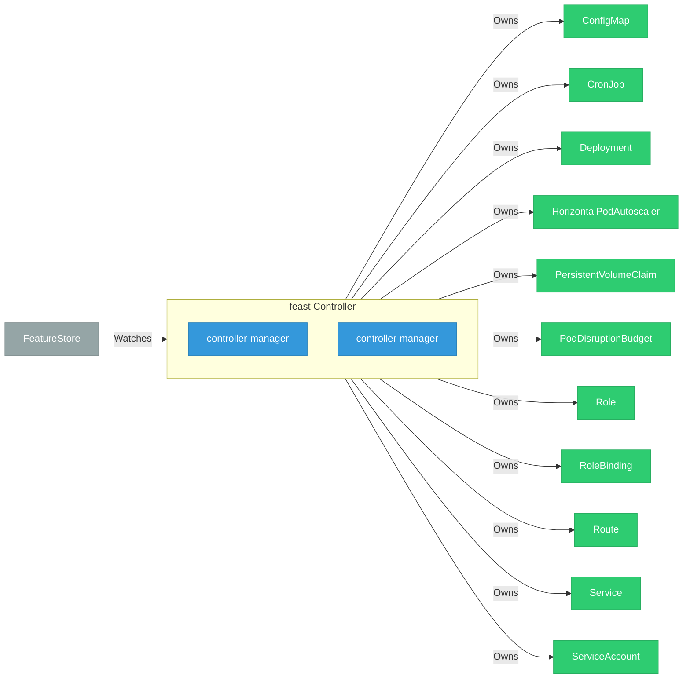

# feast

> **Architecture snapshot: 2026-05-17** (2026-05-17)

**Repository:** feast-dev/feast  
**Analyzer:** arch-analyzer 0.2.0  
**Extracted:** 2026-05-17T04:12:42Z

## Summary

| Metric | Count |
|--------|-------|
| CRDs | 0 |
| Deployments | 2 |
| Services | 1 |
| Secrets | 0 |
| Cluster Roles | 0 |
| Controller Watches | 13 |

## Component Architecture

CRDs, controllers, and owned Kubernetes resources.

### CRDs

No CRDs defined.

## Dependencies

### Key External Dependencies

| Module | Version |
|--------|---------|
| github.com/go-logr/logr | v1.4.3 |
| github.com/go-logr/logr | v1.2.2 |
| github.com/go-logr/logr | v1.2.2 |
| github.com/go-logr/logr | v1.4.3 |
| github.com/go-logr/logr | v1.4.3 |
| github.com/go-logr/logr | v1.4.3 |
| github.com/go-logr/logr | v1.4.3 |
| github.com/go-logr/logr | v1.4.3 |
| github.com/go-logr/stdr | v1.2.2 |
| github.com/go-logr/stdr | v1.2.2 |
| github.com/go-logr/stdr | v1.2.2 |
| github.com/go-logr/stdr | v1.2.2 |
| github.com/prometheus-operator/prometheus-operator/pkg/client | v0.75.0 |
| github.com/prometheus/client_golang | v1.23.2 |
| github.com/prometheus/client_golang | v1.14.0 |
| github.com/prometheus/client_golang | v1.14.0 |
| github.com/prometheus/client_golang | v1.0.0 |
| github.com/prometheus/client_golang | v1.0.0 |
| github.com/prometheus/client_model | v0.3.0 |
| github.com/prometheus/client_model | v0.6.1 |
| github.com/prometheus/client_model | v0.6.2 |
| github.com/prometheus/client_model | v0.3.0 |
| github.com/prometheus/client_model | v0.6.1 |
| github.com/prometheus/client_model | v0.6.2 |
| github.com/prometheus/client_model | v0.6.2 |
| github.com/prometheus/client_model | v0.6.2 |
| github.com/prometheus/common | v0.66.1 |
| github.com/prometheus/common | v0.66.1 |
| github.com/prometheus/procfs | v0.16.1 |
| github.com/prometheus/procfs | v0.16.1 |
| google.golang.org/grpc | v1.70.0 |
| google.golang.org/grpc | v1.74.2 |
| google.golang.org/grpc | v1.74.2 |
| google.golang.org/grpc | v1.75.0 |
| google.golang.org/grpc | v1.59.0 |
| google.golang.org/grpc | v1.75.0 |
| google.golang.org/grpc | v1.76.0 |
| google.golang.org/grpc | v1.63.2 |
| google.golang.org/grpc | v1.71.1 |
| google.golang.org/grpc | v1.74.2 |
| google.golang.org/grpc | v1.74.2 |
| google.golang.org/grpc | v1.63.2 |
| google.golang.org/grpc | v1.74.2 |
| google.golang.org/grpc | v1.74.2 |
| google.golang.org/grpc | v1.76.0 |
| google.golang.org/grpc | v1.74.2 |
| google.golang.org/grpc | v1.61.1 |
| google.golang.org/grpc | v1.70.0 |
| google.golang.org/grpc | v1.76.0 |
| google.golang.org/grpc | v1.74.2 |
| google.golang.org/grpc | v1.75.0 |
| google.golang.org/grpc | v1.63.2 |
| google.golang.org/grpc | v1.59.0 |
| google.golang.org/grpc | v1.73.0 |
| google.golang.org/grpc | v1.71.0 |
| google.golang.org/grpc | v1.71.1 |
| google.golang.org/grpc | v1.63.2 |
| google.golang.org/grpc | v1.75.0 |
| google.golang.org/grpc | v1.58.2 |
| google.golang.org/grpc | v1.75.0 |
| google.golang.org/grpc | v1.73.0 |
| google.golang.org/grpc | v1.63.2 |
| google.golang.org/grpc | v1.61.1 |
| google.golang.org/grpc | v1.63.2 |
| google.golang.org/grpc | v1.70.0 |
| google.golang.org/grpc | v1.70.0 |
| google.golang.org/grpc | v1.75.0 |
| google.golang.org/grpc | v1.74.2 |
| google.golang.org/grpc | v1.76.0 |
| google.golang.org/grpc | v1.75.1 |
| google.golang.org/grpc | v1.75.1 |
| google.golang.org/grpc | v1.76.0 |
| google.golang.org/grpc | v1.74.2 |
| google.golang.org/grpc | v1.71.0 |
| google.golang.org/grpc | v1.58.2 |
| google.golang.org/grpc/examples | v0.0.0-20230224211313-3775f633ce20 |
| google.golang.org/grpc/examples | v0.0.0-20230224211313-3775f633ce20 |
| k8s.io/api | v0.33.0 |
| k8s.io/apiextensions-apiserver | v0.33.0 |
| k8s.io/apimachinery | v0.33.0 |
| k8s.io/client-go | v0.33.0 |
| sigs.k8s.io/controller-runtime | v0.21.0 |

