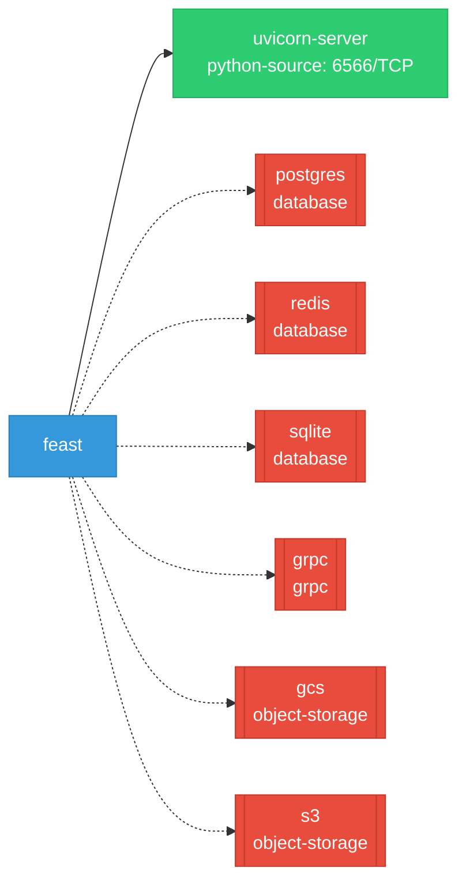

# feast: Network

## Service Map

### Services

| Name | Type | Ports | Source |
|------|------|-------|--------|
| uvicorn-server | python-source | 6566/TCP | [`infra/scripts/feature_server_docker_smoke.py:38`](https://github.com/feast-dev/feast/blob/0ab134e67b808322415520a6f071e722ef5a9b45/infra/scripts/feature_server_docker_smoke.py#L38) |

!!! warning "No Network Policies"
    No NetworkPolicy resources found. All pod-to-pod traffic is allowed by default.

