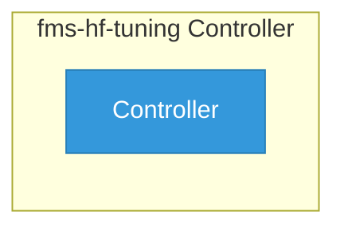

# fms-hf-tuning

> **Architecture snapshot: 2026-05-20** (2026-05-20)

**Repository:** red-hat-data-services/fms-hf-tuning  
**Analyzer:** arch-analyzer 0.2.0  
**Extracted:** 2026-05-20T04:16:47Z

## Summary

| Metric | Count |
|--------|-------|
| CRDs | 0 |
| Deployments | 0 |
| Services | 0 |
| Secrets | 0 |
| Cluster Roles | 0 |
| Controller Watches | 0 |

## Component Architecture

CRDs, controllers, and owned Kubernetes resources.

### CRDs

No CRDs found in analyzed sources.

## Dependencies

