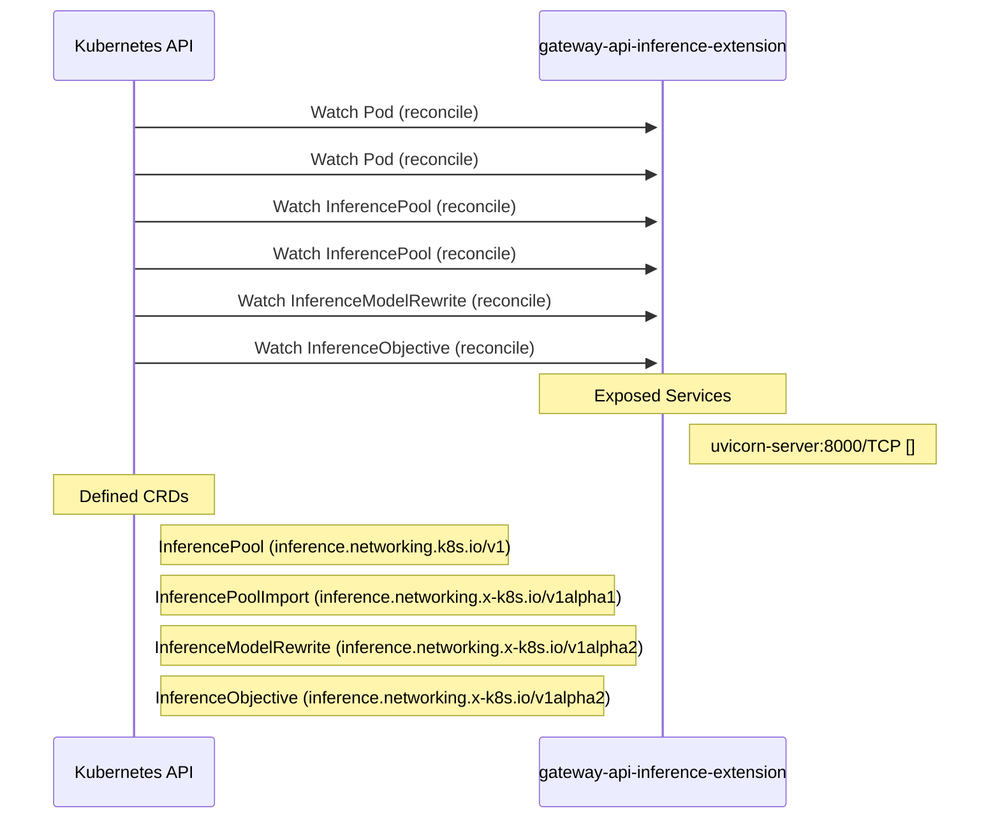

# gateway-api-inference-extension: Dataflow

## Controller Watches

Kubernetes resources this controller monitors for changes. Each watch triggers reconciliation when the watched resource is created, updated, or deleted.

| Type | GVK | Source |
|------|-----|--------|
| For | /v1/Pod | [`pkg/epp/controller/pod_reconciler.go:85`](https://github.com/kubernetes-sigs/gateway-api-inference-extension/blob/c4c8fef6438746226ed1b7d3cab210229d687f2c/pkg/epp/controller/pod_reconciler.go#L85) |
| For | /v1/Pod | [`pkg/lwepp/controller/pod_reconciler.go:85`](https://github.com/kubernetes-sigs/gateway-api-inference-extension/blob/c4c8fef6438746226ed1b7d3cab210229d687f2c/pkg/lwepp/controller/pod_reconciler.go#L85) |
| For | api/v1/InferencePool | [`pkg/epp/controller/inferencepool_reconciler.go:76`](https://github.com/kubernetes-sigs/gateway-api-inference-extension/blob/c4c8fef6438746226ed1b7d3cab210229d687f2c/pkg/epp/controller/inferencepool_reconciler.go#L76) |
| For | api/v1/InferencePool | [`pkg/lwepp/controller/inferencepool_reconciler.go:76`](https://github.com/kubernetes-sigs/gateway-api-inference-extension/blob/c4c8fef6438746226ed1b7d3cab210229d687f2c/pkg/lwepp/controller/inferencepool_reconciler.go#L76) |
| For | apix/v1alpha2/InferenceModelRewrite | [`pkg/epp/controller/inferencemodelrewrite_reconciler.go:78`](https://github.com/kubernetes-sigs/gateway-api-inference-extension/blob/c4c8fef6438746226ed1b7d3cab210229d687f2c/pkg/epp/controller/inferencemodelrewrite_reconciler.go#L78) |
| For | apix/v1alpha2/InferenceObjective | [`pkg/epp/controller/inferenceobjective_reconciler.go:73`](https://github.com/kubernetes-sigs/gateway-api-inference-extension/blob/c4c8fef6438746226ed1b7d3cab210229d687f2c/pkg/epp/controller/inferenceobjective_reconciler.go#L73) |

## Reconciliation Flow

How the controller interacts with the Kubernetes API during reconciliation.

### HTTP Endpoints

| Method | Path | Source |
|--------|------|--------|
| * | / | [`.gopath-loader/pkg/mod/go.etcd.io/etcd@v0.0.0-20191023171146-3cf2f69b5738/etcdmain/grpc_proxy.go:382`](https://github.com/kubernetes-sigs/gateway-api-inference-extension/blob/c4c8fef6438746226ed1b7d3cab210229d687f2c/.gopath-loader/pkg/mod/go.etcd.io/etcd@v0.0.0-20191023171146-3cf2f69b5738/etcdmain/grpc_proxy.go#L382) |
| * | / | [`.gopath-loader/pkg/mod/go.etcd.io/etcd@v0.0.0-20191023171146-3cf2f69b5738/embed/serve.go:293`](https://github.com/kubernetes-sigs/gateway-api-inference-extension/blob/c4c8fef6438746226ed1b7d3cab210229d687f2c/.gopath-loader/pkg/mod/go.etcd.io/etcd@v0.0.0-20191023171146-3cf2f69b5738/embed/serve.go#L293) |
| * | / | [`.gopath-loader/pkg/mod/sourcegraph.com/sourcegraph/appdash@v0.0.0-20190731080439-ebfcffb1b5c0/cmd/appdash/example_app.go:93`](https://github.com/kubernetes-sigs/gateway-api-inference-extension/blob/c4c8fef6438746226ed1b7d3cab210229d687f2c/.gopath-loader/pkg/mod/sourcegraph.com/sourcegraph/appdash@v0.0.0-20190731080439-ebfcffb1b5c0/cmd/appdash/example_app.go#L93) |
| * | / | [`.gopath-loader/pkg/mod/google.golang.org/appengine@v1.6.8/demos/helloworld/helloworld.go:23`](https://github.com/kubernetes-sigs/gateway-api-inference-extension/blob/c4c8fef6438746226ed1b7d3cab210229d687f2c/.gopath-loader/pkg/mod/google.golang.org/appengine@v1.6.8/demos/helloworld/helloworld.go#L23) |
| * | / | [`.gopath-loader/pkg/mod/google.golang.org/appengine@v1.6.8/demos/guestbook/guestbook.go:32`](https://github.com/kubernetes-sigs/gateway-api-inference-extension/blob/c4c8fef6438746226ed1b7d3cab210229d687f2c/.gopath-loader/pkg/mod/google.golang.org/appengine@v1.6.8/demos/guestbook/guestbook.go#L32) |
| * | / | [`.gopath-loader/pkg/mod/golang.org/x/tools@v0.42.0/go/types/internal/play/play.go:47`](https://github.com/kubernetes-sigs/gateway-api-inference-extension/blob/c4c8fef6438746226ed1b7d3cab210229d687f2c/.gopath-loader/pkg/mod/golang.org/x/tools@v0.42.0/go/types/internal/play/play.go#L47) |
| * | / | [`.gopath-loader/pkg/mod/golang.org/x/tools@v0.42.0/cmd/present/dir.go:23`](https://github.com/kubernetes-sigs/gateway-api-inference-extension/blob/c4c8fef6438746226ed1b7d3cab210229d687f2c/.gopath-loader/pkg/mod/golang.org/x/tools@v0.42.0/cmd/present/dir.go#L23) |
| * | / | [`.gopath-loader/pkg/mod/golang.org/x/telemetry@v0.0.0-20260209163413-e7419c687ee4/cmd/gotelemetry/internal/view/view.go:57`](https://github.com/kubernetes-sigs/gateway-api-inference-extension/blob/c4c8fef6438746226ed1b7d3cab210229d687f2c/.gopath-loader/pkg/mod/golang.org/x/telemetry@v0.0.0-20260209163413-e7419c687ee4/cmd/gotelemetry/internal/view/view.go#L57) |
| * | / | [`.gopath-loader/pkg/mod/golang.org/x/net@v0.52.0/webdav/litmus_test_server.go:83`](https://github.com/kubernetes-sigs/gateway-api-inference-extension/blob/c4c8fef6438746226ed1b7d3cab210229d687f2c/.gopath-loader/pkg/mod/golang.org/x/net@v0.52.0/webdav/litmus_test_server.go#L83) |
| * | / | [`.gopath-loader/pkg/mod/golang.org/toolchain@v0.0.1-go1.25.0.linux-amd64/src/net/http/triv.go:130`](https://github.com/kubernetes-sigs/gateway-api-inference-extension/blob/c4c8fef6438746226ed1b7d3cab210229d687f2c/.gopath-loader/pkg/mod/golang.org/toolchain@v0.0.1-go1.25.0.linux-amd64/src/net/http/triv.go#L130) |
| * | / | [`.gopath-loader/pkg/mod/golang.org/toolchain@v0.0.1-go1.25.0.linux-amd64/src/cmd/trace/main.go:188`](https://github.com/kubernetes-sigs/gateway-api-inference-extension/blob/c4c8fef6438746226ed1b7d3cab210229d687f2c/.gopath-loader/pkg/mod/golang.org/toolchain@v0.0.1-go1.25.0.linux-amd64/src/cmd/trace/main.go#L188) |
| * | / | [`.gopath-loader/pkg/mod/go.etcd.io/etcd@v0.0.0-20191023171146-3cf2f69b5738/proxy/httpproxy/proxy.go:61`](https://github.com/kubernetes-sigs/gateway-api-inference-extension/blob/c4c8fef6438746226ed1b7d3cab210229d687f2c/.gopath-loader/pkg/mod/go.etcd.io/etcd@v0.0.0-20191023171146-3cf2f69b5738/proxy/httpproxy/proxy.go#L61) |
| * | / | [`.gopath-loader/pkg/mod/go.etcd.io/etcd@v0.0.0-20191023171146-3cf2f69b5738/functional/cmd/etcd-proxy/main.go:86`](https://github.com/kubernetes-sigs/gateway-api-inference-extension/blob/c4c8fef6438746226ed1b7d3cab210229d687f2c/.gopath-loader/pkg/mod/go.etcd.io/etcd@v0.0.0-20191023171146-3cf2f69b5738/functional/cmd/etcd-proxy/main.go#L86) |
| * | / | [`.gopath-loader/pkg/mod/go.etcd.io/etcd@v0.0.0-20191023171146-3cf2f69b5738/etcdserver/api/v2http/client.go:96`](https://github.com/kubernetes-sigs/gateway-api-inference-extension/blob/c4c8fef6438746226ed1b7d3cab210229d687f2c/.gopath-loader/pkg/mod/go.etcd.io/etcd@v0.0.0-20191023171146-3cf2f69b5738/etcdserver/api/v2http/client.go#L96) |
| * | / | [`.gopath-loader/pkg/mod/go.etcd.io/etcd@v0.0.0-20191023171146-3cf2f69b5738/etcdserver/api/etcdhttp/peer.go:49`](https://github.com/kubernetes-sigs/gateway-api-inference-extension/blob/c4c8fef6438746226ed1b7d3cab210229d687f2c/.gopath-loader/pkg/mod/go.etcd.io/etcd@v0.0.0-20191023171146-3cf2f69b5738/etcdserver/api/etcdhttp/peer.go#L49) |
| * | / | [`.gomod-cache/github.com/!shopify/toxiproxy@v2.1.4+incompatible/api.go:77`](https://github.com/kubernetes-sigs/gateway-api-inference-extension/blob/c4c8fef6438746226ed1b7d3cab210229d687f2c/.gomod-cache/github.com/!shopify/toxiproxy@v2.1.4+incompatible/api.go#L77) |
| * | / | [`.gopath-loader/pkg/mod/go.etcd.io/etcd@v0.0.0-20191023171146-3cf2f69b5738/etcdmain/etcd.go:546`](https://github.com/kubernetes-sigs/gateway-api-inference-extension/blob/c4c8fef6438746226ed1b7d3cab210229d687f2c/.gopath-loader/pkg/mod/go.etcd.io/etcd@v0.0.0-20191023171146-3cf2f69b5738/etcdmain/etcd.go#L546) |
| * | / | [`.gopath-loader/pkg/mod/go.etcd.io/etcd/server/v3@v3.6.5/etcdserver/api/etcdhttp/peer.go:61`](https://github.com/kubernetes-sigs/gateway-api-inference-extension/blob/c4c8fef6438746226ed1b7d3cab210229d687f2c/.gopath-loader/pkg/mod/go.etcd.io/etcd/server/v3@v3.6.5/etcdserver/api/etcdhttp/peer.go#L61) |
| * | / | [`.gomod-cache/github.com/afex/hystrix-go@v0.0.0-20180502004556-fa1af6a1f4f5/loadtest/service/main.go:64`](https://github.com/kubernetes-sigs/gateway-api-inference-extension/blob/c4c8fef6438746226ed1b7d3cab210229d687f2c/.gomod-cache/github.com/afex/hystrix-go@v0.0.0-20180502004556-fa1af6a1f4f5/loadtest/service/main.go#L64) |
| * | / | [`.gomod-cache/github.com/ajstarks/deck@v0.0.0-20200831202436-30c9fc6549a9/cmd/deckd/deckd.go:61`](https://github.com/kubernetes-sigs/gateway-api-inference-extension/blob/c4c8fef6438746226ed1b7d3cab210229d687f2c/.gomod-cache/github.com/ajstarks/deck@v0.0.0-20200831202436-30c9fc6549a9/cmd/deckd/deckd.go#L61) |
| * | / | [`.gopath-loader/pkg/mod/go.etcd.io/etcd/server/v3@v3.6.5/etcdmain/grpc_proxy.go:565`](https://github.com/kubernetes-sigs/gateway-api-inference-extension/blob/c4c8fef6438746226ed1b7d3cab210229d687f2c/.gopath-loader/pkg/mod/go.etcd.io/etcd/server/v3@v3.6.5/etcdmain/grpc_proxy.go#L565) |
| * | / | [`.gopath-loader/pkg/mod/go.etcd.io/etcd/server/v3@v3.6.5/embed/serve.go:413`](https://github.com/kubernetes-sigs/gateway-api-inference-extension/blob/c4c8fef6438746226ed1b7d3cab210229d687f2c/.gopath-loader/pkg/mod/go.etcd.io/etcd/server/v3@v3.6.5/embed/serve.go#L413) |
| * | / | [`.gopath-loader/pkg/mod/github.com/smartystreets/goconvey@v1.6.4/goconvey.go:163`](https://github.com/kubernetes-sigs/gateway-api-inference-extension/blob/c4c8fef6438746226ed1b7d3cab210229d687f2c/.gopath-loader/pkg/mod/github.com/smartystreets/goconvey@v1.6.4/goconvey.go#L163) |
| * | / | [`.gopath-loader/pkg/mod/github.com/prometheus/prometheus@v0.310.0/web/web.go:723`](https://github.com/kubernetes-sigs/gateway-api-inference-extension/blob/c4c8fef6438746226ed1b7d3cab210229d687f2c/.gopath-loader/pkg/mod/github.com/prometheus/prometheus@v0.310.0/web/web.go#L723) |
| * | / | [`.gopath-loader/pkg/mod/github.com/prometheus/alertmanager@v0.31.0/api/api.go:181`](https://github.com/kubernetes-sigs/gateway-api-inference-extension/blob/c4c8fef6438746226ed1b7d3cab210229d687f2c/.gopath-loader/pkg/mod/github.com/prometheus/alertmanager@v0.31.0/api/api.go#L181) |
| * | / | [`.gopath-loader/pkg/mod/github.com/pact-foundation/pact-go@v1.0.4/dsl/pact.go:646`](https://github.com/kubernetes-sigs/gateway-api-inference-extension/blob/c4c8fef6438746226ed1b7d3cab210229d687f2c/.gopath-loader/pkg/mod/github.com/pact-foundation/pact-go@v1.0.4/dsl/pact.go#L646) |
| * | / | [`.gopath-loader/pkg/mod/github.com/gorilla/mux@v1.7.3/doc.go:33`](https://github.com/kubernetes-sigs/gateway-api-inference-extension/blob/c4c8fef6438746226ed1b7d3cab210229d687f2c/.gopath-loader/pkg/mod/github.com/gorilla/mux@v1.7.3/doc.go#L33) |
| * | / | [`.gomod-cache/github.com/ajstarks/svgo@v0.0.0-20211024235047-1546f124cd8b/picserv/picserv.go:44`](https://github.com/kubernetes-sigs/gateway-api-inference-extension/blob/c4c8fef6438746226ed1b7d3cab210229d687f2c/.gomod-cache/github.com/ajstarks/svgo@v0.0.0-20211024235047-1546f124cd8b/picserv/picserv.go#L44) |
| * | / | [`.gopath-loader/pkg/mod/github.com/googleapis/enterprise-certificate-proxy@v0.3.11/http_proxy/main.go:361`](https://github.com/kubernetes-sigs/gateway-api-inference-extension/blob/c4c8fef6438746226ed1b7d3cab210229d687f2c/.gopath-loader/pkg/mod/github.com/googleapis/enterprise-certificate-proxy@v0.3.11/http_proxy/main.go#L361) |
| * | / | [`.gopath-loader/pkg/mod/github.com/google/s2a-go@v0.1.9/tools/internal_ci/test_gae/main.go:79`](https://github.com/kubernetes-sigs/gateway-api-inference-extension/blob/c4c8fef6438746226ed1b7d3cab210229d687f2c/.gopath-loader/pkg/mod/github.com/google/s2a-go@v0.1.9/tools/internal_ci/test_gae/main.go#L79) |
| * | / | [`.gopath-loader/pkg/mod/github.com/google/pprof@v0.0.0-20260202012954-cb029daf43ef/internal/driver/webui.go:214`](https://github.com/kubernetes-sigs/gateway-api-inference-extension/blob/c4c8fef6438746226ed1b7d3cab210229d687f2c/.gopath-loader/pkg/mod/github.com/google/pprof@v0.0.0-20260202012954-cb029daf43ef/internal/driver/webui.go#L214) |
| * | / | [`.gopath-loader/pkg/mod/github.com/envoyproxy/go-control-plane@v0.14.0/internal/upstream/main.go:35`](https://github.com/kubernetes-sigs/gateway-api-inference-extension/blob/c4c8fef6438746226ed1b7d3cab210229d687f2c/.gopath-loader/pkg/mod/github.com/envoyproxy/go-control-plane@v0.14.0/internal/upstream/main.go#L35) |
| * | / | [`.gopath-loader/pkg/mod/github.com/docker/docker@v28.5.2+incompatible/contrib/httpserver/server.go:10`](https://github.com/kubernetes-sigs/gateway-api-inference-extension/blob/c4c8fef6438746226ed1b7d3cab210229d687f2c/.gopath-loader/pkg/mod/github.com/docker/docker@v28.5.2+incompatible/contrib/httpserver/server.go#L10) |
| * | / | [`.gopath-loader/pkg/mod/github.com/coreos/go-oidc@v2.3.0+incompatible/example/userinfo/app.go:40`](https://github.com/kubernetes-sigs/gateway-api-inference-extension/blob/c4c8fef6438746226ed1b7d3cab210229d687f2c/.gopath-loader/pkg/mod/github.com/coreos/go-oidc@v2.3.0+incompatible/example/userinfo/app.go#L40) |
| * | / | [`.gopath-loader/pkg/mod/github.com/coreos/go-oidc@v2.3.0+incompatible/example/nonce/app.go:49`](https://github.com/kubernetes-sigs/gateway-api-inference-extension/blob/c4c8fef6438746226ed1b7d3cab210229d687f2c/.gopath-loader/pkg/mod/github.com/coreos/go-oidc@v2.3.0+incompatible/example/nonce/app.go#L49) |
| * | / | [`.gopath-loader/pkg/mod/github.com/coreos/go-oidc@v2.3.0+incompatible/example/idtoken/app.go:45`](https://github.com/kubernetes-sigs/gateway-api-inference-extension/blob/c4c8fef6438746226ed1b7d3cab210229d687f2c/.gopath-loader/pkg/mod/github.com/coreos/go-oidc@v2.3.0+incompatible/example/idtoken/app.go#L45) |
| * | / | [`.gopath-loader/pkg/mod/github.com/aws/aws-sdk-go@v1.27.0/awstesting/custom_ca_bundle.go:32`](https://github.com/kubernetes-sigs/gateway-api-inference-extension/blob/c4c8fef6438746226ed1b7d3cab210229d687f2c/.gopath-loader/pkg/mod/github.com/aws/aws-sdk-go@v1.27.0/awstesting/custom_ca_bundle.go#L32) |
| * | / | [`.gopath-loader/pkg/mod/github.com/aws/aws-sdk-go-v2@v1.41.1/internal/awstesting/certificate_utils.go:225`](https://github.com/kubernetes-sigs/gateway-api-inference-extension/blob/c4c8fef6438746226ed1b7d3cab210229d687f2c/.gopath-loader/pkg/mod/github.com/aws/aws-sdk-go-v2@v1.41.1/internal/awstesting/certificate_utils.go#L225) |
| * | / | [`.gopath-loader/pkg/mod/github.com/aryann/difflib@v0.0.0-20170710044230-e206f873d14a/difflib_server/difflib_demo.go:81`](https://github.com/kubernetes-sigs/gateway-api-inference-extension/blob/c4c8fef6438746226ed1b7d3cab210229d687f2c/.gopath-loader/pkg/mod/github.com/aryann/difflib@v0.0.0-20170710044230-e206f873d14a/difflib_server/difflib_demo.go#L81) |
| * | / | [`.gopath-loader/pkg/mod/github.com/ajstarks/svgo@v0.0.0-20211024235047-1546f124cd8b/svgplay/svgplay.go:40`](https://github.com/kubernetes-sigs/gateway-api-inference-extension/blob/c4c8fef6438746226ed1b7d3cab210229d687f2c/.gopath-loader/pkg/mod/github.com/ajstarks/svgo@v0.0.0-20211024235047-1546f124cd8b/svgplay/svgplay.go#L40) |
| * | / | [`.gopath-loader/pkg/mod/github.com/ajstarks/svgo@v0.0.0-20211024235047-1546f124cd8b/picserv/picserv.go:44`](https://github.com/kubernetes-sigs/gateway-api-inference-extension/blob/c4c8fef6438746226ed1b7d3cab210229d687f2c/.gopath-loader/pkg/mod/github.com/ajstarks/svgo@v0.0.0-20211024235047-1546f124cd8b/picserv/picserv.go#L44) |
| * | / | [`.gopath-loader/pkg/mod/github.com/ajstarks/deck@v0.0.0-20200831202436-30c9fc6549a9/cmd/deckd/deckd.go:61`](https://github.com/kubernetes-sigs/gateway-api-inference-extension/blob/c4c8fef6438746226ed1b7d3cab210229d687f2c/.gopath-loader/pkg/mod/github.com/ajstarks/deck@v0.0.0-20200831202436-30c9fc6549a9/cmd/deckd/deckd.go#L61) |
| * | / | [`.gomod-cache/github.com/ajstarks/svgo@v0.0.0-20211024235047-1546f124cd8b/svgplay/svgplay.go:40`](https://github.com/kubernetes-sigs/gateway-api-inference-extension/blob/c4c8fef6438746226ed1b7d3cab210229d687f2c/.gomod-cache/github.com/ajstarks/svgo@v0.0.0-20211024235047-1546f124cd8b/svgplay/svgplay.go#L40) |
| * | / | [`.gopath-loader/pkg/mod/github.com/afex/hystrix-go@v0.0.0-20180502004556-fa1af6a1f4f5/loadtest/service/main.go:64`](https://github.com/kubernetes-sigs/gateway-api-inference-extension/blob/c4c8fef6438746226ed1b7d3cab210229d687f2c/.gopath-loader/pkg/mod/github.com/afex/hystrix-go@v0.0.0-20180502004556-fa1af6a1f4f5/loadtest/service/main.go#L64) |
| * | / | [`.gopath-loader/pkg/mod/github.com/!shopify/toxiproxy@v2.1.4+incompatible/api.go:77`](https://github.com/kubernetes-sigs/gateway-api-inference-extension/blob/c4c8fef6438746226ed1b7d3cab210229d687f2c/.gopath-loader/pkg/mod/github.com/!shopify/toxiproxy@v2.1.4+incompatible/api.go#L77) |
| * | / | [`.gomod-cache/sourcegraph.com/sourcegraph/appdash@v0.0.0-20190731080439-ebfcffb1b5c0/cmd/appdash/example_app.go:93`](https://github.com/kubernetes-sigs/gateway-api-inference-extension/blob/c4c8fef6438746226ed1b7d3cab210229d687f2c/.gomod-cache/sourcegraph.com/sourcegraph/appdash@v0.0.0-20190731080439-ebfcffb1b5c0/cmd/appdash/example_app.go#L93) |
| * | / | [`.gomod-cache/google.golang.org/appengine@v1.6.8/demos/helloworld/helloworld.go:23`](https://github.com/kubernetes-sigs/gateway-api-inference-extension/blob/c4c8fef6438746226ed1b7d3cab210229d687f2c/.gomod-cache/google.golang.org/appengine@v1.6.8/demos/helloworld/helloworld.go#L23) |
| * | / | [`.gomod-cache/google.golang.org/appengine@v1.6.8/demos/guestbook/guestbook.go:32`](https://github.com/kubernetes-sigs/gateway-api-inference-extension/blob/c4c8fef6438746226ed1b7d3cab210229d687f2c/.gomod-cache/google.golang.org/appengine@v1.6.8/demos/guestbook/guestbook.go#L32) |
| * | / | [`.gomod-cache/github.com/aryann/difflib@v0.0.0-20170710044230-e206f873d14a/difflib_server/difflib_demo.go:81`](https://github.com/kubernetes-sigs/gateway-api-inference-extension/blob/c4c8fef6438746226ed1b7d3cab210229d687f2c/.gomod-cache/github.com/aryann/difflib@v0.0.0-20170710044230-e206f873d14a/difflib_server/difflib_demo.go#L81) |
| * | / | [`.gomod-cache/github.com/aws/aws-sdk-go-v2@v1.41.1/internal/awstesting/certificate_utils.go:225`](https://github.com/kubernetes-sigs/gateway-api-inference-extension/blob/c4c8fef6438746226ed1b7d3cab210229d687f2c/.gomod-cache/github.com/aws/aws-sdk-go-v2@v1.41.1/internal/awstesting/certificate_utils.go#L225) |
| * | / | [`.gomod-cache/github.com/aws/aws-sdk-go@v1.27.0/awstesting/custom_ca_bundle.go:32`](https://github.com/kubernetes-sigs/gateway-api-inference-extension/blob/c4c8fef6438746226ed1b7d3cab210229d687f2c/.gomod-cache/github.com/aws/aws-sdk-go@v1.27.0/awstesting/custom_ca_bundle.go#L32) |
| * | / | [`.gomod-cache/golang.org/x/tools@v0.42.0/go/types/internal/play/play.go:47`](https://github.com/kubernetes-sigs/gateway-api-inference-extension/blob/c4c8fef6438746226ed1b7d3cab210229d687f2c/.gomod-cache/golang.org/x/tools@v0.42.0/go/types/internal/play/play.go#L47) |
| * | / | [`.gomod-cache/golang.org/x/tools@v0.42.0/cmd/present/dir.go:23`](https://github.com/kubernetes-sigs/gateway-api-inference-extension/blob/c4c8fef6438746226ed1b7d3cab210229d687f2c/.gomod-cache/golang.org/x/tools@v0.42.0/cmd/present/dir.go#L23) |
| * | / | [`.gomod-cache/golang.org/x/telemetry@v0.0.0-20260209163413-e7419c687ee4/cmd/gotelemetry/internal/view/view.go:57`](https://github.com/kubernetes-sigs/gateway-api-inference-extension/blob/c4c8fef6438746226ed1b7d3cab210229d687f2c/.gomod-cache/golang.org/x/telemetry@v0.0.0-20260209163413-e7419c687ee4/cmd/gotelemetry/internal/view/view.go#L57) |
| * | / | [`.gomod-cache/golang.org/x/net@v0.52.0/webdav/litmus_test_server.go:83`](https://github.com/kubernetes-sigs/gateway-api-inference-extension/blob/c4c8fef6438746226ed1b7d3cab210229d687f2c/.gomod-cache/golang.org/x/net@v0.52.0/webdav/litmus_test_server.go#L83) |
| * | / | [`.gomod-cache/github.com/coreos/go-oidc@v2.3.0+incompatible/example/idtoken/app.go:45`](https://github.com/kubernetes-sigs/gateway-api-inference-extension/blob/c4c8fef6438746226ed1b7d3cab210229d687f2c/.gomod-cache/github.com/coreos/go-oidc@v2.3.0+incompatible/example/idtoken/app.go#L45) |
| * | / | [`.gomod-cache/golang.org/toolchain@v0.0.1-go1.25.0.linux-amd64/src/net/http/triv.go:130`](https://github.com/kubernetes-sigs/gateway-api-inference-extension/blob/c4c8fef6438746226ed1b7d3cab210229d687f2c/.gomod-cache/golang.org/toolchain@v0.0.1-go1.25.0.linux-amd64/src/net/http/triv.go#L130) |
| * | / | [`.gomod-cache/github.com/coreos/go-oidc@v2.3.0+incompatible/example/nonce/app.go:49`](https://github.com/kubernetes-sigs/gateway-api-inference-extension/blob/c4c8fef6438746226ed1b7d3cab210229d687f2c/.gomod-cache/github.com/coreos/go-oidc@v2.3.0+incompatible/example/nonce/app.go#L49) |
| * | / | [`.gomod-cache/golang.org/toolchain@v0.0.1-go1.25.0.linux-amd64/src/cmd/trace/main.go:188`](https://github.com/kubernetes-sigs/gateway-api-inference-extension/blob/c4c8fef6438746226ed1b7d3cab210229d687f2c/.gomod-cache/golang.org/toolchain@v0.0.1-go1.25.0.linux-amd64/src/cmd/trace/main.go#L188) |
| * | / | [`.gomod-cache/github.com/coreos/go-oidc@v2.3.0+incompatible/example/userinfo/app.go:40`](https://github.com/kubernetes-sigs/gateway-api-inference-extension/blob/c4c8fef6438746226ed1b7d3cab210229d687f2c/.gomod-cache/github.com/coreos/go-oidc@v2.3.0+incompatible/example/userinfo/app.go#L40) |
| * | / | [`.gomod-cache/go.etcd.io/etcd@v0.0.0-20191023171146-3cf2f69b5738/proxy/httpproxy/proxy.go:61`](https://github.com/kubernetes-sigs/gateway-api-inference-extension/blob/c4c8fef6438746226ed1b7d3cab210229d687f2c/.gomod-cache/go.etcd.io/etcd@v0.0.0-20191023171146-3cf2f69b5738/proxy/httpproxy/proxy.go#L61) |
| * | / | [`.gomod-cache/go.etcd.io/etcd@v0.0.0-20191023171146-3cf2f69b5738/functional/cmd/etcd-proxy/main.go:86`](https://github.com/kubernetes-sigs/gateway-api-inference-extension/blob/c4c8fef6438746226ed1b7d3cab210229d687f2c/.gomod-cache/go.etcd.io/etcd@v0.0.0-20191023171146-3cf2f69b5738/functional/cmd/etcd-proxy/main.go#L86) |
| * | / | [`.gomod-cache/github.com/docker/docker@v28.5.2+incompatible/contrib/httpserver/server.go:10`](https://github.com/kubernetes-sigs/gateway-api-inference-extension/blob/c4c8fef6438746226ed1b7d3cab210229d687f2c/.gomod-cache/github.com/docker/docker@v28.5.2+incompatible/contrib/httpserver/server.go#L10) |
| * | / | [`.gomod-cache/go.etcd.io/etcd@v0.0.0-20191023171146-3cf2f69b5738/etcdserver/api/v2http/client.go:96`](https://github.com/kubernetes-sigs/gateway-api-inference-extension/blob/c4c8fef6438746226ed1b7d3cab210229d687f2c/.gomod-cache/go.etcd.io/etcd@v0.0.0-20191023171146-3cf2f69b5738/etcdserver/api/v2http/client.go#L96) |
| * | / | [`.gomod-cache/go.etcd.io/etcd@v0.0.0-20191023171146-3cf2f69b5738/etcdserver/api/etcdhttp/peer.go:49`](https://github.com/kubernetes-sigs/gateway-api-inference-extension/blob/c4c8fef6438746226ed1b7d3cab210229d687f2c/.gomod-cache/go.etcd.io/etcd@v0.0.0-20191023171146-3cf2f69b5738/etcdserver/api/etcdhttp/peer.go#L49) |
| * | / | [`.gomod-cache/go.etcd.io/etcd@v0.0.0-20191023171146-3cf2f69b5738/etcdmain/grpc_proxy.go:382`](https://github.com/kubernetes-sigs/gateway-api-inference-extension/blob/c4c8fef6438746226ed1b7d3cab210229d687f2c/.gomod-cache/go.etcd.io/etcd@v0.0.0-20191023171146-3cf2f69b5738/etcdmain/grpc_proxy.go#L382) |
| * | / | [`.gomod-cache/go.etcd.io/etcd@v0.0.0-20191023171146-3cf2f69b5738/etcdmain/etcd.go:546`](https://github.com/kubernetes-sigs/gateway-api-inference-extension/blob/c4c8fef6438746226ed1b7d3cab210229d687f2c/.gomod-cache/go.etcd.io/etcd@v0.0.0-20191023171146-3cf2f69b5738/etcdmain/etcd.go#L546) |
| * | / | [`.gomod-cache/go.etcd.io/etcd@v0.0.0-20191023171146-3cf2f69b5738/embed/serve.go:293`](https://github.com/kubernetes-sigs/gateway-api-inference-extension/blob/c4c8fef6438746226ed1b7d3cab210229d687f2c/.gomod-cache/go.etcd.io/etcd@v0.0.0-20191023171146-3cf2f69b5738/embed/serve.go#L293) |
| * | / | [`.gomod-cache/go.etcd.io/etcd/server/v3@v3.6.5/etcdserver/api/etcdhttp/peer.go:61`](https://github.com/kubernetes-sigs/gateway-api-inference-extension/blob/c4c8fef6438746226ed1b7d3cab210229d687f2c/.gomod-cache/go.etcd.io/etcd/server/v3@v3.6.5/etcdserver/api/etcdhttp/peer.go#L61) |
| * | / | [`.gomod-cache/go.etcd.io/etcd/server/v3@v3.6.5/etcdmain/grpc_proxy.go:565`](https://github.com/kubernetes-sigs/gateway-api-inference-extension/blob/c4c8fef6438746226ed1b7d3cab210229d687f2c/.gomod-cache/go.etcd.io/etcd/server/v3@v3.6.5/etcdmain/grpc_proxy.go#L565) |
| * | / | [`.gomod-cache/go.etcd.io/etcd/server/v3@v3.6.5/embed/serve.go:413`](https://github.com/kubernetes-sigs/gateway-api-inference-extension/blob/c4c8fef6438746226ed1b7d3cab210229d687f2c/.gomod-cache/go.etcd.io/etcd/server/v3@v3.6.5/embed/serve.go#L413) |
| * | / | [`.gomod-cache/github.com/smartystreets/goconvey@v1.6.4/goconvey.go:163`](https://github.com/kubernetes-sigs/gateway-api-inference-extension/blob/c4c8fef6438746226ed1b7d3cab210229d687f2c/.gomod-cache/github.com/smartystreets/goconvey@v1.6.4/goconvey.go#L163) |
| * | / | [`.gomod-cache/github.com/prometheus/prometheus@v0.310.0/web/web.go:723`](https://github.com/kubernetes-sigs/gateway-api-inference-extension/blob/c4c8fef6438746226ed1b7d3cab210229d687f2c/.gomod-cache/github.com/prometheus/prometheus@v0.310.0/web/web.go#L723) |
| * | / | [`.gomod-cache/github.com/prometheus/alertmanager@v0.31.0/api/api.go:181`](https://github.com/kubernetes-sigs/gateway-api-inference-extension/blob/c4c8fef6438746226ed1b7d3cab210229d687f2c/.gomod-cache/github.com/prometheus/alertmanager@v0.31.0/api/api.go#L181) |
| * | / | [`.gomod-cache/github.com/pact-foundation/pact-go@v1.0.4/dsl/pact.go:646`](https://github.com/kubernetes-sigs/gateway-api-inference-extension/blob/c4c8fef6438746226ed1b7d3cab210229d687f2c/.gomod-cache/github.com/pact-foundation/pact-go@v1.0.4/dsl/pact.go#L646) |
| * | / | [`.gomod-cache/github.com/gorilla/mux@v1.7.3/doc.go:33`](https://github.com/kubernetes-sigs/gateway-api-inference-extension/blob/c4c8fef6438746226ed1b7d3cab210229d687f2c/.gomod-cache/github.com/gorilla/mux@v1.7.3/doc.go#L33) |
| * | / | [`.gomod-cache/github.com/googleapis/enterprise-certificate-proxy@v0.3.11/http_proxy/main.go:361`](https://github.com/kubernetes-sigs/gateway-api-inference-extension/blob/c4c8fef6438746226ed1b7d3cab210229d687f2c/.gomod-cache/github.com/googleapis/enterprise-certificate-proxy@v0.3.11/http_proxy/main.go#L361) |
| * | / | [`.gomod-cache/github.com/google/s2a-go@v0.1.9/tools/internal_ci/test_gae/main.go:79`](https://github.com/kubernetes-sigs/gateway-api-inference-extension/blob/c4c8fef6438746226ed1b7d3cab210229d687f2c/.gomod-cache/github.com/google/s2a-go@v0.1.9/tools/internal_ci/test_gae/main.go#L79) |
| * | / | [`.gomod-cache/github.com/google/pprof@v0.0.0-20260202012954-cb029daf43ef/internal/driver/webui.go:214`](https://github.com/kubernetes-sigs/gateway-api-inference-extension/blob/c4c8fef6438746226ed1b7d3cab210229d687f2c/.gomod-cache/github.com/google/pprof@v0.0.0-20260202012954-cb029daf43ef/internal/driver/webui.go#L214) |
| * | / | [`.gomod-cache/github.com/envoyproxy/go-control-plane@v0.14.0/internal/upstream/main.go:35`](https://github.com/kubernetes-sigs/gateway-api-inference-extension/blob/c4c8fef6438746226ed1b7d3cab210229d687f2c/.gomod-cache/github.com/envoyproxy/go-control-plane@v0.14.0/internal/upstream/main.go#L35) |
| GET | / | [`.gopath-loader/pkg/mod/k8s.io/apiserver@v0.35.5/pkg/endpoints/discovery/version.go:67`](https://github.com/kubernetes-sigs/gateway-api-inference-extension/blob/c4c8fef6438746226ed1b7d3cab210229d687f2c/.gopath-loader/pkg/mod/k8s.io/apiserver@v0.35.5/pkg/endpoints/discovery/version.go#L67) |
| GET | / | [`.gopath-loader/pkg/mod/k8s.io/apiserver@v0.35.5/pkg/endpoints/discovery/root.go:154`](https://github.com/kubernetes-sigs/gateway-api-inference-extension/blob/c4c8fef6438746226ed1b7d3cab210229d687f2c/.gopath-loader/pkg/mod/k8s.io/apiserver@v0.35.5/pkg/endpoints/discovery/root.go#L154) |
| GET | / | [`.gomod-cache/k8s.io/apiserver@v0.35.5/pkg/endpoints/discovery/aggregated/wrapper.go:73`](https://github.com/kubernetes-sigs/gateway-api-inference-extension/blob/c4c8fef6438746226ed1b7d3cab210229d687f2c/.gomod-cache/k8s.io/apiserver@v0.35.5/pkg/endpoints/discovery/aggregated/wrapper.go#L73) |
| GET | / | [`.gomod-cache/k8s.io/apiserver@v0.35.5/pkg/endpoints/discovery/legacy.go:59`](https://github.com/kubernetes-sigs/gateway-api-inference-extension/blob/c4c8fef6438746226ed1b7d3cab210229d687f2c/.gomod-cache/k8s.io/apiserver@v0.35.5/pkg/endpoints/discovery/legacy.go#L59) |
| GET | / | [`.gopath-loader/pkg/mod/k8s.io/apiserver@v0.35.5/pkg/endpoints/discovery/group.go:57`](https://github.com/kubernetes-sigs/gateway-api-inference-extension/blob/c4c8fef6438746226ed1b7d3cab210229d687f2c/.gopath-loader/pkg/mod/k8s.io/apiserver@v0.35.5/pkg/endpoints/discovery/group.go#L57) |
| GET | / | [`.gomod-cache/k8s.io/apiserver@v0.35.5/pkg/endpoints/discovery/version.go:67`](https://github.com/kubernetes-sigs/gateway-api-inference-extension/blob/c4c8fef6438746226ed1b7d3cab210229d687f2c/.gomod-cache/k8s.io/apiserver@v0.35.5/pkg/endpoints/discovery/version.go#L67) |
| GET | / | [`.gopath-loader/pkg/mod/k8s.io/apiserver@v0.35.5/pkg/endpoints/discovery/aggregated/wrapper.go:73`](https://github.com/kubernetes-sigs/gateway-api-inference-extension/blob/c4c8fef6438746226ed1b7d3cab210229d687f2c/.gopath-loader/pkg/mod/k8s.io/apiserver@v0.35.5/pkg/endpoints/discovery/aggregated/wrapper.go#L73) |
| GET | / | [`.gomod-cache/k8s.io/apiserver@v0.35.5/pkg/endpoints/discovery/root.go:154`](https://github.com/kubernetes-sigs/gateway-api-inference-extension/blob/c4c8fef6438746226ed1b7d3cab210229d687f2c/.gomod-cache/k8s.io/apiserver@v0.35.5/pkg/endpoints/discovery/root.go#L154) |
| GET | / | [`.gomod-cache/k8s.io/apiserver@v0.35.5/pkg/server/routes/version.go:44`](https://github.com/kubernetes-sigs/gateway-api-inference-extension/blob/c4c8fef6438746226ed1b7d3cab210229d687f2c/.gomod-cache/k8s.io/apiserver@v0.35.5/pkg/server/routes/version.go#L44) |
| GET | / | [`.gomod-cache/k8s.io/apiserver@v0.35.5/pkg/endpoints/discovery/group.go:57`](https://github.com/kubernetes-sigs/gateway-api-inference-extension/blob/c4c8fef6438746226ed1b7d3cab210229d687f2c/.gomod-cache/k8s.io/apiserver@v0.35.5/pkg/endpoints/discovery/group.go#L57) |
| GET | / | [`.gopath-loader/pkg/mod/k8s.io/apiserver@v0.35.5/pkg/endpoints/discovery/legacy.go:59`](https://github.com/kubernetes-sigs/gateway-api-inference-extension/blob/c4c8fef6438746226ed1b7d3cab210229d687f2c/.gopath-loader/pkg/mod/k8s.io/apiserver@v0.35.5/pkg/endpoints/discovery/legacy.go#L59) |
| GET | / | [`.gopath-loader/pkg/mod/k8s.io/apiserver@v0.35.5/pkg/server/routes/version.go:44`](https://github.com/kubernetes-sigs/gateway-api-inference-extension/blob/c4c8fef6438746226ed1b7d3cab210229d687f2c/.gopath-loader/pkg/mod/k8s.io/apiserver@v0.35.5/pkg/server/routes/version.go#L44) |
| * | /AfterSuiteDidRun | [`.gomod-cache/github.com/onsi/ginkgo@v1.16.5/internal/remote/server.go:62`](https://github.com/kubernetes-sigs/gateway-api-inference-extension/blob/c4c8fef6438746226ed1b7d3cab210229d687f2c/.gomod-cache/github.com/onsi/ginkgo@v1.16.5/internal/remote/server.go#L62) |
| * | /AfterSuiteDidRun | [`.gopath-loader/pkg/mod/github.com/onsi/ginkgo@v1.16.5/internal/remote/server.go:62`](https://github.com/kubernetes-sigs/gateway-api-inference-extension/blob/c4c8fef6438746226ed1b7d3cab210229d687f2c/.gopath-loader/pkg/mod/github.com/onsi/ginkgo@v1.16.5/internal/remote/server.go#L62) |
| * | /BeforeSuiteDidRun | [`.gomod-cache/github.com/onsi/ginkgo@v1.16.5/internal/remote/server.go:61`](https://github.com/kubernetes-sigs/gateway-api-inference-extension/blob/c4c8fef6438746226ed1b7d3cab210229d687f2c/.gomod-cache/github.com/onsi/ginkgo@v1.16.5/internal/remote/server.go#L61) |
| * | /BeforeSuiteDidRun | [`.gopath-loader/pkg/mod/github.com/onsi/ginkgo@v1.16.5/internal/remote/server.go:61`](https://github.com/kubernetes-sigs/gateway-api-inference-extension/blob/c4c8fef6438746226ed1b7d3cab210229d687f2c/.gopath-loader/pkg/mod/github.com/onsi/ginkgo@v1.16.5/internal/remote/server.go#L61) |
| * | /BeforeSuiteState | [`.gomod-cache/github.com/onsi/ginkgo@v1.16.5/internal/remote/server.go:68`](https://github.com/kubernetes-sigs/gateway-api-inference-extension/blob/c4c8fef6438746226ed1b7d3cab210229d687f2c/.gomod-cache/github.com/onsi/ginkgo@v1.16.5/internal/remote/server.go#L68) |
| * | /BeforeSuiteState | [`.gopath-loader/pkg/mod/github.com/onsi/ginkgo@v1.16.5/internal/remote/server.go:68`](https://github.com/kubernetes-sigs/gateway-api-inference-extension/blob/c4c8fef6438746226ed1b7d3cab210229d687f2c/.gopath-loader/pkg/mod/github.com/onsi/ginkgo@v1.16.5/internal/remote/server.go#L68) |
| * | /LogDriver.Capabilities | [`.gopath-loader/pkg/mod/github.com/docker/docker@v28.5.2+incompatible/integration/plugin/logging/cmd/discard/driver.go:68`](https://github.com/kubernetes-sigs/gateway-api-inference-extension/blob/c4c8fef6438746226ed1b7d3cab210229d687f2c/.gopath-loader/pkg/mod/github.com/docker/docker@v28.5.2+incompatible/integration/plugin/logging/cmd/discard/driver.go#L68) |
| * | /LogDriver.Capabilities | [`.gomod-cache/github.com/docker/docker@v28.5.2+incompatible/integration/plugin/logging/cmd/discard/driver.go:68`](https://github.com/kubernetes-sigs/gateway-api-inference-extension/blob/c4c8fef6438746226ed1b7d3cab210229d687f2c/.gomod-cache/github.com/docker/docker@v28.5.2+incompatible/integration/plugin/logging/cmd/discard/driver.go#L68) |
| * | /LogDriver.StartLogging | [`.gopath-loader/pkg/mod/github.com/docker/docker@v28.5.2+incompatible/integration/plugin/logging/cmd/close_on_start/main.go:23`](https://github.com/kubernetes-sigs/gateway-api-inference-extension/blob/c4c8fef6438746226ed1b7d3cab210229d687f2c/.gopath-loader/pkg/mod/github.com/docker/docker@v28.5.2+incompatible/integration/plugin/logging/cmd/close_on_start/main.go#L23) |
| * | /LogDriver.StartLogging | [`.gopath-loader/pkg/mod/github.com/docker/docker@v28.5.2+incompatible/integration/plugin/logging/cmd/discard/driver.go:33`](https://github.com/kubernetes-sigs/gateway-api-inference-extension/blob/c4c8fef6438746226ed1b7d3cab210229d687f2c/.gopath-loader/pkg/mod/github.com/docker/docker@v28.5.2+incompatible/integration/plugin/logging/cmd/discard/driver.go#L33) |
| * | /LogDriver.StartLogging | [`.gomod-cache/github.com/docker/docker@v28.5.2+incompatible/integration/plugin/logging/cmd/close_on_start/main.go:23`](https://github.com/kubernetes-sigs/gateway-api-inference-extension/blob/c4c8fef6438746226ed1b7d3cab210229d687f2c/.gomod-cache/github.com/docker/docker@v28.5.2+incompatible/integration/plugin/logging/cmd/close_on_start/main.go#L23) |
| * | /LogDriver.StartLogging | [`.gomod-cache/github.com/docker/docker@v28.5.2+incompatible/integration/plugin/logging/cmd/discard/driver.go:33`](https://github.com/kubernetes-sigs/gateway-api-inference-extension/blob/c4c8fef6438746226ed1b7d3cab210229d687f2c/.gomod-cache/github.com/docker/docker@v28.5.2+incompatible/integration/plugin/logging/cmd/discard/driver.go#L33) |
| * | /LogDriver.StopLogging | [`.gopath-loader/pkg/mod/github.com/docker/docker@v28.5.2+incompatible/integration/plugin/logging/cmd/discard/driver.go:53`](https://github.com/kubernetes-sigs/gateway-api-inference-extension/blob/c4c8fef6438746226ed1b7d3cab210229d687f2c/.gopath-loader/pkg/mod/github.com/docker/docker@v28.5.2+incompatible/integration/plugin/logging/cmd/discard/driver.go#L53) |
| * | /LogDriver.StopLogging | [`.gomod-cache/github.com/docker/docker@v28.5.2+incompatible/integration/plugin/logging/cmd/discard/driver.go:53`](https://github.com/kubernetes-sigs/gateway-api-inference-extension/blob/c4c8fef6438746226ed1b7d3cab210229d687f2c/.gomod-cache/github.com/docker/docker@v28.5.2+incompatible/integration/plugin/logging/cmd/discard/driver.go#L53) |
| * | /Plugin.Activate | [`.gopath-loader/pkg/mod/github.com/docker/docker@v28.5.2+incompatible/testutil/fixtures/plugin/basic/basic.go:31`](https://github.com/kubernetes-sigs/gateway-api-inference-extension/blob/c4c8fef6438746226ed1b7d3cab210229d687f2c/.gopath-loader/pkg/mod/github.com/docker/docker@v28.5.2+incompatible/testutil/fixtures/plugin/basic/basic.go#L31) |
| * | /Plugin.Activate | [`.gomod-cache/github.com/docker/docker@v28.5.2+incompatible/testutil/fixtures/plugin/basic/basic.go:31`](https://github.com/kubernetes-sigs/gateway-api-inference-extension/blob/c4c8fef6438746226ed1b7d3cab210229d687f2c/.gomod-cache/github.com/docker/docker@v28.5.2+incompatible/testutil/fixtures/plugin/basic/basic.go#L31) |
| * | /RemoteAfterSuiteData | [`.gomod-cache/github.com/onsi/ginkgo@v1.16.5/internal/remote/server.go:69`](https://github.com/kubernetes-sigs/gateway-api-inference-extension/blob/c4c8fef6438746226ed1b7d3cab210229d687f2c/.gomod-cache/github.com/onsi/ginkgo@v1.16.5/internal/remote/server.go#L69) |
| * | /RemoteAfterSuiteData | [`.gopath-loader/pkg/mod/github.com/onsi/ginkgo@v1.16.5/internal/remote/server.go:69`](https://github.com/kubernetes-sigs/gateway-api-inference-extension/blob/c4c8fef6438746226ed1b7d3cab210229d687f2c/.gopath-loader/pkg/mod/github.com/onsi/ginkgo@v1.16.5/internal/remote/server.go#L69) |
| * | /SpecDidComplete | [`.gomod-cache/github.com/onsi/ginkgo@v1.16.5/internal/remote/server.go:64`](https://github.com/kubernetes-sigs/gateway-api-inference-extension/blob/c4c8fef6438746226ed1b7d3cab210229d687f2c/.gomod-cache/github.com/onsi/ginkgo@v1.16.5/internal/remote/server.go#L64) |
| * | /SpecDidComplete | [`.gopath-loader/pkg/mod/github.com/onsi/ginkgo@v1.16.5/internal/remote/server.go:64`](https://github.com/kubernetes-sigs/gateway-api-inference-extension/blob/c4c8fef6438746226ed1b7d3cab210229d687f2c/.gopath-loader/pkg/mod/github.com/onsi/ginkgo@v1.16.5/internal/remote/server.go#L64) |
| * | /SpecSuiteDidEnd | [`.gomod-cache/github.com/onsi/ginkgo@v1.16.5/internal/remote/server.go:65`](https://github.com/kubernetes-sigs/gateway-api-inference-extension/blob/c4c8fef6438746226ed1b7d3cab210229d687f2c/.gomod-cache/github.com/onsi/ginkgo@v1.16.5/internal/remote/server.go#L65) |
| * | /SpecSuiteDidEnd | [`.gopath-loader/pkg/mod/github.com/onsi/ginkgo@v1.16.5/internal/remote/server.go:65`](https://github.com/kubernetes-sigs/gateway-api-inference-extension/blob/c4c8fef6438746226ed1b7d3cab210229d687f2c/.gopath-loader/pkg/mod/github.com/onsi/ginkgo@v1.16.5/internal/remote/server.go#L65) |
| * | /SpecSuiteWillBegin | [`.gopath-loader/pkg/mod/github.com/onsi/ginkgo@v1.16.5/internal/remote/server.go:60`](https://github.com/kubernetes-sigs/gateway-api-inference-extension/blob/c4c8fef6438746226ed1b7d3cab210229d687f2c/.gopath-loader/pkg/mod/github.com/onsi/ginkgo@v1.16.5/internal/remote/server.go#L60) |
| * | /SpecSuiteWillBegin | [`.gomod-cache/github.com/onsi/ginkgo@v1.16.5/internal/remote/server.go:60`](https://github.com/kubernetes-sigs/gateway-api-inference-extension/blob/c4c8fef6438746226ed1b7d3cab210229d687f2c/.gomod-cache/github.com/onsi/ginkgo@v1.16.5/internal/remote/server.go#L60) |
| * | /SpecWillRun | [`.gopath-loader/pkg/mod/github.com/onsi/ginkgo@v1.16.5/internal/remote/server.go:63`](https://github.com/kubernetes-sigs/gateway-api-inference-extension/blob/c4c8fef6438746226ed1b7d3cab210229d687f2c/.gopath-loader/pkg/mod/github.com/onsi/ginkgo@v1.16.5/internal/remote/server.go#L63) |
| * | /SpecWillRun | [`.gomod-cache/github.com/onsi/ginkgo@v1.16.5/internal/remote/server.go:63`](https://github.com/kubernetes-sigs/gateway-api-inference-extension/blob/c4c8fef6438746226ed1b7d3cab210229d687f2c/.gomod-cache/github.com/onsi/ginkgo@v1.16.5/internal/remote/server.go#L63) |
| * | /VolumeDriver.Create | [`.gopath-loader/pkg/mod/github.com/docker/docker@v28.5.2+incompatible/volume/testutils/testutils.go:153`](https://github.com/kubernetes-sigs/gateway-api-inference-extension/blob/c4c8fef6438746226ed1b7d3cab210229d687f2c/.gopath-loader/pkg/mod/github.com/docker/docker@v28.5.2+incompatible/volume/testutils/testutils.go#L153) |
| * | /VolumeDriver.Create | [`.gomod-cache/github.com/docker/docker@v28.5.2+incompatible/volume/testutils/testutils.go:153`](https://github.com/kubernetes-sigs/gateway-api-inference-extension/blob/c4c8fef6438746226ed1b7d3cab210229d687f2c/.gomod-cache/github.com/docker/docker@v28.5.2+incompatible/volume/testutils/testutils.go#L153) |
| * | /_ah/background | [`.gopath-loader/pkg/mod/google.golang.org/appengine@v1.6.8/runtime/runtime.go:69`](https://github.com/kubernetes-sigs/gateway-api-inference-extension/blob/c4c8fef6438746226ed1b7d3cab210229d687f2c/.gopath-loader/pkg/mod/google.golang.org/appengine@v1.6.8/runtime/runtime.go#L69) |
| * | /_ah/background | [`.gomod-cache/google.golang.org/appengine@v1.6.8/runtime/runtime.go:69`](https://github.com/kubernetes-sigs/gateway-api-inference-extension/blob/c4c8fef6438746226ed1b7d3cab210229d687f2c/.gomod-cache/google.golang.org/appengine@v1.6.8/runtime/runtime.go#L69) |
| * | /_ah/remote_api | [`.gopath-loader/pkg/mod/google.golang.org/appengine@v1.6.8/remote_api/remote_api.go:28`](https://github.com/kubernetes-sigs/gateway-api-inference-extension/blob/c4c8fef6438746226ed1b7d3cab210229d687f2c/.gopath-loader/pkg/mod/google.golang.org/appengine@v1.6.8/remote_api/remote_api.go#L28) |
| * | /_ah/remote_api | [`.gomod-cache/google.golang.org/appengine@v1.6.8/remote_api/remote_api.go:28`](https://github.com/kubernetes-sigs/gateway-api-inference-extension/blob/c4c8fef6438746226ed1b7d3cab210229d687f2c/.gomod-cache/google.golang.org/appengine@v1.6.8/remote_api/remote_api.go#L28) |
| * | /_ah/xmpp/message/chat/ | [`.gopath-loader/pkg/mod/google.golang.org/appengine@v1.6.8/xmpp/xmpp.go:88`](https://github.com/kubernetes-sigs/gateway-api-inference-extension/blob/c4c8fef6438746226ed1b7d3cab210229d687f2c/.gopath-loader/pkg/mod/google.golang.org/appengine@v1.6.8/xmpp/xmpp.go#L88) |
| * | /_ah/xmpp/message/chat/ | [`.gomod-cache/google.golang.org/appengine@v1.6.8/xmpp/xmpp.go:88`](https://github.com/kubernetes-sigs/gateway-api-inference-extension/blob/c4c8fef6438746226ed1b7d3cab210229d687f2c/.gomod-cache/google.golang.org/appengine@v1.6.8/xmpp/xmpp.go#L88) |
| * | /abort | [`.gomod-cache/github.com/onsi/ginkgo/v2@v2.28.1/internal/parallel_support/http_server.go:63`](https://github.com/kubernetes-sigs/gateway-api-inference-extension/blob/c4c8fef6438746226ed1b7d3cab210229d687f2c/.gomod-cache/github.com/onsi/ginkgo/v2@v2.28.1/internal/parallel_support/http_server.go#L63) |
| * | /abort | [`.gopath-loader/pkg/mod/github.com/onsi/ginkgo/v2@v2.28.1/internal/parallel_support/http_server.go:63`](https://github.com/kubernetes-sigs/gateway-api-inference-extension/blob/c4c8fef6438746226ed1b7d3cab210229d687f2c/.gopath-loader/pkg/mod/github.com/onsi/ginkgo/v2@v2.28.1/internal/parallel_support/http_server.go#L63) |
| * | /aggregated-nonprimary-procs-report | [`.gomod-cache/github.com/onsi/ginkgo/v2@v2.28.1/internal/parallel_support/http_server.go:60`](https://github.com/kubernetes-sigs/gateway-api-inference-extension/blob/c4c8fef6438746226ed1b7d3cab210229d687f2c/.gomod-cache/github.com/onsi/ginkgo/v2@v2.28.1/internal/parallel_support/http_server.go#L60) |
| * | /aggregated-nonprimary-procs-report | [`.gopath-loader/pkg/mod/github.com/onsi/ginkgo/v2@v2.28.1/internal/parallel_support/http_server.go:60`](https://github.com/kubernetes-sigs/gateway-api-inference-extension/blob/c4c8fef6438746226ed1b7d3cab210229d687f2c/.gopath-loader/pkg/mod/github.com/onsi/ginkgo/v2@v2.28.1/internal/parallel_support/http_server.go#L60) |
| * | /arc/ | [`.gomod-cache/github.com/ajstarks/svgo@v0.0.0-20211024235047-1546f124cd8b/websvg/websvg.go:23`](https://github.com/kubernetes-sigs/gateway-api-inference-extension/blob/c4c8fef6438746226ed1b7d3cab210229d687f2c/.gomod-cache/github.com/ajstarks/svgo@v0.0.0-20211024235047-1546f124cd8b/websvg/websvg.go#L23) |
| * | /arc/ | [`.gopath-loader/pkg/mod/github.com/ajstarks/svgo@v0.0.0-20211024235047-1546f124cd8b/websvg/websvg.go:23`](https://github.com/kubernetes-sigs/gateway-api-inference-extension/blob/c4c8fef6438746226ed1b7d3cab210229d687f2c/.gopath-loader/pkg/mod/github.com/ajstarks/svgo@v0.0.0-20211024235047-1546f124cd8b/websvg/websvg.go#L23) |
| * | /args | [`.gopath-loader/pkg/mod/golang.org/toolchain@v0.0.1-go1.25.0.linux-amd64/src/net/http/triv.go:136`](https://github.com/kubernetes-sigs/gateway-api-inference-extension/blob/c4c8fef6438746226ed1b7d3cab210229d687f2c/.gopath-loader/pkg/mod/golang.org/toolchain@v0.0.1-go1.25.0.linux-amd64/src/net/http/triv.go#L136) |
| * | /args | [`.gomod-cache/golang.org/toolchain@v0.0.1-go1.25.0.linux-amd64/src/net/http/triv.go:136`](https://github.com/kubernetes-sigs/gateway-api-inference-extension/blob/c4c8fef6438746226ed1b7d3cab210229d687f2c/.gomod-cache/golang.org/toolchain@v0.0.1-go1.25.0.linux-amd64/src/net/http/triv.go#L136) |
| * | /auth/google/callback | [`.gopath-loader/pkg/mod/github.com/coreos/go-oidc@v2.3.0+incompatible/example/nonce/app.go:53`](https://github.com/kubernetes-sigs/gateway-api-inference-extension/blob/c4c8fef6438746226ed1b7d3cab210229d687f2c/.gopath-loader/pkg/mod/github.com/coreos/go-oidc@v2.3.0+incompatible/example/nonce/app.go#L53) |
| * | /auth/google/callback | [`.gomod-cache/github.com/coreos/go-oidc@v2.3.0+incompatible/example/idtoken/app.go:49`](https://github.com/kubernetes-sigs/gateway-api-inference-extension/blob/c4c8fef6438746226ed1b7d3cab210229d687f2c/.gomod-cache/github.com/coreos/go-oidc@v2.3.0+incompatible/example/idtoken/app.go#L49) |
| * | /auth/google/callback | [`.gomod-cache/github.com/coreos/go-oidc@v2.3.0+incompatible/example/userinfo/app.go:44`](https://github.com/kubernetes-sigs/gateway-api-inference-extension/blob/c4c8fef6438746226ed1b7d3cab210229d687f2c/.gomod-cache/github.com/coreos/go-oidc@v2.3.0+incompatible/example/userinfo/app.go#L44) |
| * | /auth/google/callback | [`.gopath-loader/pkg/mod/github.com/coreos/go-oidc@v2.3.0+incompatible/example/userinfo/app.go:44`](https://github.com/kubernetes-sigs/gateway-api-inference-extension/blob/c4c8fef6438746226ed1b7d3cab210229d687f2c/.gopath-loader/pkg/mod/github.com/coreos/go-oidc@v2.3.0+incompatible/example/userinfo/app.go#L44) |
| * | /auth/google/callback | [`.gomod-cache/github.com/coreos/go-oidc@v2.3.0+incompatible/example/nonce/app.go:53`](https://github.com/kubernetes-sigs/gateway-api-inference-extension/blob/c4c8fef6438746226ed1b7d3cab210229d687f2c/.gomod-cache/github.com/coreos/go-oidc@v2.3.0+incompatible/example/nonce/app.go#L53) |
| * | /auth/google/callback | [`.gopath-loader/pkg/mod/github.com/coreos/go-oidc@v2.3.0+incompatible/example/idtoken/app.go:49`](https://github.com/kubernetes-sigs/gateway-api-inference-extension/blob/c4c8fef6438746226ed1b7d3cab210229d687f2c/.gopath-loader/pkg/mod/github.com/coreos/go-oidc@v2.3.0+incompatible/example/idtoken/app.go#L49) |
| * | /authority.cer | [`.gomod-cache/cloud.google.com/go@v0.123.0/httpreplay/cmd/httpr/httpr.go:76`](https://github.com/kubernetes-sigs/gateway-api-inference-extension/blob/c4c8fef6438746226ed1b7d3cab210229d687f2c/.gomod-cache/cloud.google.com/go@v0.123.0/httpreplay/cmd/httpr/httpr.go#L76) |
| * | /authority.cer | [`.gopath-loader/pkg/mod/cloud.google.com/go@v0.123.0/httpreplay/cmd/httpr/httpr.go:76`](https://github.com/kubernetes-sigs/gateway-api-inference-extension/blob/c4c8fef6438746226ed1b7d3cab210229d687f2c/.gopath-loader/pkg/mod/cloud.google.com/go@v0.123.0/httpreplay/cmd/httpr/httpr.go#L76) |
| * | /bar | [`.gomod-cache/golang.org/toolchain@v0.0.1-go1.25.0.linux-amd64/src/net/http/doc.go:67`](https://github.com/kubernetes-sigs/gateway-api-inference-extension/blob/c4c8fef6438746226ed1b7d3cab210229d687f2c/.gomod-cache/golang.org/toolchain@v0.0.1-go1.25.0.linux-amd64/src/net/http/doc.go#L67) |
| * | /bar | [`.gopath-loader/pkg/mod/golang.org/toolchain@v0.0.1-go1.25.0.linux-amd64/src/net/http/doc.go:67`](https://github.com/kubernetes-sigs/gateway-api-inference-extension/blob/c4c8fef6438746226ed1b7d3cab210229d687f2c/.gopath-loader/pkg/mod/golang.org/toolchain@v0.0.1-go1.25.0.linux-amd64/src/net/http/doc.go#L67) |
| * | /before-suite-completed | [`.gomod-cache/github.com/onsi/ginkgo/v2@v2.28.1/internal/parallel_support/http_server.go:57`](https://github.com/kubernetes-sigs/gateway-api-inference-extension/blob/c4c8fef6438746226ed1b7d3cab210229d687f2c/.gomod-cache/github.com/onsi/ginkgo/v2@v2.28.1/internal/parallel_support/http_server.go#L57) |
| * | /before-suite-completed | [`.gopath-loader/pkg/mod/github.com/onsi/ginkgo/v2@v2.28.1/internal/parallel_support/http_server.go:57`](https://github.com/kubernetes-sigs/gateway-api-inference-extension/blob/c4c8fef6438746226ed1b7d3cab210229d687f2c/.gopath-loader/pkg/mod/github.com/onsi/ginkgo/v2@v2.28.1/internal/parallel_support/http_server.go#L57) |
| * | /before-suite-state | [`.gopath-loader/pkg/mod/github.com/onsi/ginkgo/v2@v2.28.1/internal/parallel_support/http_server.go:58`](https://github.com/kubernetes-sigs/gateway-api-inference-extension/blob/c4c8fef6438746226ed1b7d3cab210229d687f2c/.gopath-loader/pkg/mod/github.com/onsi/ginkgo/v2@v2.28.1/internal/parallel_support/http_server.go#L58) |
| * | /before-suite-state | [`.gomod-cache/github.com/onsi/ginkgo/v2@v2.28.1/internal/parallel_support/http_server.go:58`](https://github.com/kubernetes-sigs/gateway-api-inference-extension/blob/c4c8fef6438746226ed1b7d3cab210229d687f2c/.gomod-cache/github.com/onsi/ginkgo/v2@v2.28.1/internal/parallel_support/http_server.go#L58) |
| * | /binlogs | [`.gopath-loader/pkg/mod/github.com/google/martian/v3@v3.3.3/cmd/proxy/main.go:410`](https://github.com/kubernetes-sigs/gateway-api-inference-extension/blob/c4c8fef6438746226ed1b7d3cab210229d687f2c/.gopath-loader/pkg/mod/github.com/google/martian/v3@v3.3.3/cmd/proxy/main.go#L410) |
| * | /binlogs | [`.gomod-cache/github.com/google/martian@v2.1.0+incompatible/cmd/proxy/main.go:390`](https://github.com/kubernetes-sigs/gateway-api-inference-extension/blob/c4c8fef6438746226ed1b7d3cab210229d687f2c/.gomod-cache/github.com/google/martian@v2.1.0+incompatible/cmd/proxy/main.go#L390) |
| * | /binlogs | [`.gopath-loader/pkg/mod/github.com/google/martian@v2.1.0+incompatible/cmd/proxy/main.go:390`](https://github.com/kubernetes-sigs/gateway-api-inference-extension/blob/c4c8fef6438746226ed1b7d3cab210229d687f2c/.gopath-loader/pkg/mod/github.com/google/martian@v2.1.0+incompatible/cmd/proxy/main.go#L390) |
| * | /binlogs | [`.gomod-cache/github.com/google/martian/v3@v3.3.3/cmd/proxy/main.go:410`](https://github.com/kubernetes-sigs/gateway-api-inference-extension/blob/c4c8fef6438746226ed1b7d3cab210229d687f2c/.gomod-cache/github.com/google/martian/v3@v3.3.3/cmd/proxy/main.go#L410) |
| * | /blackhole-rx | [`.gopath-loader/pkg/mod/go.etcd.io/etcd@v0.0.0-20191023171146-3cf2f69b5738/functional/cmd/etcd-proxy/main.go:183`](https://github.com/kubernetes-sigs/gateway-api-inference-extension/blob/c4c8fef6438746226ed1b7d3cab210229d687f2c/.gopath-loader/pkg/mod/go.etcd.io/etcd@v0.0.0-20191023171146-3cf2f69b5738/functional/cmd/etcd-proxy/main.go#L183) |
| * | /blackhole-rx | [`.gomod-cache/go.etcd.io/etcd@v0.0.0-20191023171146-3cf2f69b5738/functional/cmd/etcd-proxy/main.go:183`](https://github.com/kubernetes-sigs/gateway-api-inference-extension/blob/c4c8fef6438746226ed1b7d3cab210229d687f2c/.gomod-cache/go.etcd.io/etcd@v0.0.0-20191023171146-3cf2f69b5738/functional/cmd/etcd-proxy/main.go#L183) |
| * | /blackhole-tx | [`.gomod-cache/go.etcd.io/etcd@v0.0.0-20191023171146-3cf2f69b5738/functional/cmd/etcd-proxy/main.go:171`](https://github.com/kubernetes-sigs/gateway-api-inference-extension/blob/c4c8fef6438746226ed1b7d3cab210229d687f2c/.gomod-cache/go.etcd.io/etcd@v0.0.0-20191023171146-3cf2f69b5738/functional/cmd/etcd-proxy/main.go#L171) |
| * | /blackhole-tx | [`.gopath-loader/pkg/mod/go.etcd.io/etcd@v0.0.0-20191023171146-3cf2f69b5738/functional/cmd/etcd-proxy/main.go:171`](https://github.com/kubernetes-sigs/gateway-api-inference-extension/blob/c4c8fef6438746226ed1b7d3cab210229d687f2c/.gopath-loader/pkg/mod/go.etcd.io/etcd@v0.0.0-20191023171146-3cf2f69b5738/functional/cmd/etcd-proxy/main.go#L171) |
| * | /block | [`.gomod-cache/golang.org/toolchain@v0.0.1-go1.25.0.linux-amd64/src/cmd/trace/main.go:210`](https://github.com/kubernetes-sigs/gateway-api-inference-extension/blob/c4c8fef6438746226ed1b7d3cab210229d687f2c/.gomod-cache/golang.org/toolchain@v0.0.1-go1.25.0.linux-amd64/src/cmd/trace/main.go#L210) |
| * | /block | [`.gopath-loader/pkg/mod/golang.org/toolchain@v0.0.1-go1.25.0.linux-amd64/src/cmd/trace/main.go:210`](https://github.com/kubernetes-sigs/gateway-api-inference-extension/blob/c4c8fef6438746226ed1b7d3cab210229d687f2c/.gopath-loader/pkg/mod/golang.org/toolchain@v0.0.1-go1.25.0.linux-amd64/src/cmd/trace/main.go#L210) |
| * | /chan | [`.gomod-cache/golang.org/toolchain@v0.0.1-go1.25.0.linux-amd64/src/net/http/triv.go:134`](https://github.com/kubernetes-sigs/gateway-api-inference-extension/blob/c4c8fef6438746226ed1b7d3cab210229d687f2c/.gomod-cache/golang.org/toolchain@v0.0.1-go1.25.0.linux-amd64/src/net/http/triv.go#L134) |
| * | /chan | [`.gopath-loader/pkg/mod/golang.org/toolchain@v0.0.1-go1.25.0.linux-amd64/src/net/http/triv.go:134`](https://github.com/kubernetes-sigs/gateway-api-inference-extension/blob/c4c8fef6438746226ed1b7d3cab210229d687f2c/.gopath-loader/pkg/mod/golang.org/toolchain@v0.0.1-go1.25.0.linux-amd64/src/net/http/triv.go#L134) |
| * | /circle | [`.gomod-cache/github.com/ajstarks/svgo@v0.0.0-20211024235047-1546f124cd8b/float/doc.go:74`](https://github.com/kubernetes-sigs/gateway-api-inference-extension/blob/c4c8fef6438746226ed1b7d3cab210229d687f2c/.gomod-cache/github.com/ajstarks/svgo@v0.0.0-20211024235047-1546f124cd8b/float/doc.go#L74) |
| * | /circle | [`.gopath-loader/pkg/mod/github.com/ajstarks/svgo@v0.0.0-20211024235047-1546f124cd8b/doc.go:75`](https://github.com/kubernetes-sigs/gateway-api-inference-extension/blob/c4c8fef6438746226ed1b7d3cab210229d687f2c/.gopath-loader/pkg/mod/github.com/ajstarks/svgo@v0.0.0-20211024235047-1546f124cd8b/doc.go#L75) |
| * | /circle | [`.gopath-loader/pkg/mod/github.com/ajstarks/svgo@v0.0.0-20211024235047-1546f124cd8b/float/doc.go:74`](https://github.com/kubernetes-sigs/gateway-api-inference-extension/blob/c4c8fef6438746226ed1b7d3cab210229d687f2c/.gopath-loader/pkg/mod/github.com/ajstarks/svgo@v0.0.0-20211024235047-1546f124cd8b/float/doc.go#L74) |
| * | /circle | [`.gomod-cache/github.com/ajstarks/svgo@v0.0.0-20211024235047-1546f124cd8b/doc.go:75`](https://github.com/kubernetes-sigs/gateway-api-inference-extension/blob/c4c8fef6438746226ed1b7d3cab210229d687f2c/.gomod-cache/github.com/ajstarks/svgo@v0.0.0-20211024235047-1546f124cd8b/doc.go#L75) |
| * | /circle/ | [`.gopath-loader/pkg/mod/github.com/ajstarks/svgo@v0.0.0-20211024235047-1546f124cd8b/websvg/websvg.go:21`](https://github.com/kubernetes-sigs/gateway-api-inference-extension/blob/c4c8fef6438746226ed1b7d3cab210229d687f2c/.gopath-loader/pkg/mod/github.com/ajstarks/svgo@v0.0.0-20211024235047-1546f124cd8b/websvg/websvg.go#L21) |
| * | /circle/ | [`.gomod-cache/github.com/ajstarks/svgo@v0.0.0-20211024235047-1546f124cd8b/websvg/websvg.go:21`](https://github.com/kubernetes-sigs/gateway-api-inference-extension/blob/c4c8fef6438746226ed1b7d3cab210229d687f2c/.gomod-cache/github.com/ajstarks/svgo@v0.0.0-20211024235047-1546f124cd8b/websvg/websvg.go#L21) |
| * | /clock/ | [`.gopath-loader/pkg/mod/github.com/ajstarks/svgo@v0.0.0-20211024235047-1546f124cd8b/picserv/picserv.go:55`](https://github.com/kubernetes-sigs/gateway-api-inference-extension/blob/c4c8fef6438746226ed1b7d3cab210229d687f2c/.gopath-loader/pkg/mod/github.com/ajstarks/svgo@v0.0.0-20211024235047-1546f124cd8b/picserv/picserv.go#L55) |
| * | /clock/ | [`.gomod-cache/github.com/ajstarks/svgo@v0.0.0-20211024235047-1546f124cd8b/picserv/picserv.go:55`](https://github.com/kubernetes-sigs/gateway-api-inference-extension/blob/c4c8fef6438746226ed1b7d3cab210229d687f2c/.gomod-cache/github.com/ajstarks/svgo@v0.0.0-20211024235047-1546f124cd8b/picserv/picserv.go#L55) |
| * | /compile | [`.gomod-cache/golang.org/x/tools@v0.42.0/playground/playground.go:23`](https://github.com/kubernetes-sigs/gateway-api-inference-extension/blob/c4c8fef6438746226ed1b7d3cab210229d687f2c/.gomod-cache/golang.org/x/tools@v0.42.0/playground/playground.go#L23) |
| * | /compile | [`.gopath-loader/pkg/mod/github.com/ajstarks/svgo@v0.0.0-20211024235047-1546f124cd8b/svgplay/svgplay.go:41`](https://github.com/kubernetes-sigs/gateway-api-inference-extension/blob/c4c8fef6438746226ed1b7d3cab210229d687f2c/.gopath-loader/pkg/mod/github.com/ajstarks/svgo@v0.0.0-20211024235047-1546f124cd8b/svgplay/svgplay.go#L41) |
| * | /compile | [`.gopath-loader/pkg/mod/golang.org/x/tools@v0.42.0/playground/playground.go:23`](https://github.com/kubernetes-sigs/gateway-api-inference-extension/blob/c4c8fef6438746226ed1b7d3cab210229d687f2c/.gopath-loader/pkg/mod/golang.org/x/tools@v0.42.0/playground/playground.go#L23) |
| * | /compile | [`.gomod-cache/github.com/ajstarks/svgo@v0.0.0-20211024235047-1546f124cd8b/svgplay/svgplay.go:41`](https://github.com/kubernetes-sigs/gateway-api-inference-extension/blob/c4c8fef6438746226ed1b7d3cab210229d687f2c/.gomod-cache/github.com/ajstarks/svgo@v0.0.0-20211024235047-1546f124cd8b/svgplay/svgplay.go#L41) |
| * | /counter | [`.gomod-cache/github.com/onsi/ginkgo@v1.16.5/internal/remote/server.go:70`](https://github.com/kubernetes-sigs/gateway-api-inference-extension/blob/c4c8fef6438746226ed1b7d3cab210229d687f2c/.gomod-cache/github.com/onsi/ginkgo@v1.16.5/internal/remote/server.go#L70) |
| * | /counter | [`.gomod-cache/golang.org/toolchain@v0.0.1-go1.25.0.linux-amd64/src/net/http/triv.go:129`](https://github.com/kubernetes-sigs/gateway-api-inference-extension/blob/c4c8fef6438746226ed1b7d3cab210229d687f2c/.gomod-cache/golang.org/toolchain@v0.0.1-go1.25.0.linux-amd64/src/net/http/triv.go#L129) |
| * | /counter | [`.gopath-loader/pkg/mod/github.com/onsi/ginkgo@v1.16.5/internal/remote/server.go:70`](https://github.com/kubernetes-sigs/gateway-api-inference-extension/blob/c4c8fef6438746226ed1b7d3cab210229d687f2c/.gopath-loader/pkg/mod/github.com/onsi/ginkgo@v1.16.5/internal/remote/server.go#L70) |
| * | /counter | [`.gomod-cache/github.com/onsi/ginkgo/v2@v2.28.1/internal/parallel_support/http_server.go:61`](https://github.com/kubernetes-sigs/gateway-api-inference-extension/blob/c4c8fef6438746226ed1b7d3cab210229d687f2c/.gomod-cache/github.com/onsi/ginkgo/v2@v2.28.1/internal/parallel_support/http_server.go#L61) |
| * | /counter | [`.gopath-loader/pkg/mod/golang.org/toolchain@v0.0.1-go1.25.0.linux-amd64/src/net/http/triv.go:129`](https://github.com/kubernetes-sigs/gateway-api-inference-extension/blob/c4c8fef6438746226ed1b7d3cab210229d687f2c/.gopath-loader/pkg/mod/golang.org/toolchain@v0.0.1-go1.25.0.linux-amd64/src/net/http/triv.go#L129) |
| * | /counter | [`.gopath-loader/pkg/mod/github.com/onsi/ginkgo/v2@v2.28.1/internal/parallel_support/http_server.go:61`](https://github.com/kubernetes-sigs/gateway-api-inference-extension/blob/c4c8fef6438746226ed1b7d3cab210229d687f2c/.gopath-loader/pkg/mod/github.com/onsi/ginkgo/v2@v2.28.1/internal/parallel_support/http_server.go#L61) |
| * | /cube/ | [`.gomod-cache/github.com/ajstarks/svgo@v0.0.0-20211024235047-1546f124cd8b/picserv/picserv.go:51`](https://github.com/kubernetes-sigs/gateway-api-inference-extension/blob/c4c8fef6438746226ed1b7d3cab210229d687f2c/.gomod-cache/github.com/ajstarks/svgo@v0.0.0-20211024235047-1546f124cd8b/picserv/picserv.go#L51) |
| * | /cube/ | [`.gopath-loader/pkg/mod/github.com/ajstarks/svgo@v0.0.0-20211024235047-1546f124cd8b/picserv/picserv.go:51`](https://github.com/kubernetes-sigs/gateway-api-inference-extension/blob/c4c8fef6438746226ed1b7d3cab210229d687f2c/.gopath-loader/pkg/mod/github.com/ajstarks/svgo@v0.0.0-20211024235047-1546f124cd8b/picserv/picserv.go#L51) |
| * | /date | [`.gomod-cache/golang.org/toolchain@v0.0.1-go1.25.0.linux-amd64/src/net/http/triv.go:138`](https://github.com/kubernetes-sigs/gateway-api-inference-extension/blob/c4c8fef6438746226ed1b7d3cab210229d687f2c/.gomod-cache/golang.org/toolchain@v0.0.1-go1.25.0.linux-amd64/src/net/http/triv.go#L138) |
| * | /date | [`.gopath-loader/pkg/mod/golang.org/toolchain@v0.0.1-go1.25.0.linux-amd64/src/net/http/triv.go:138`](https://github.com/kubernetes-sigs/gateway-api-inference-extension/blob/c4c8fef6438746226ed1b7d3cab210229d687f2c/.gopath-loader/pkg/mod/golang.org/toolchain@v0.0.1-go1.25.0.linux-amd64/src/net/http/triv.go#L138) |
| * | /debug/flags | [`.gomod-cache/k8s.io/apiserver@v0.35.5/pkg/server/routes/debugsocket.go:58`](https://github.com/kubernetes-sigs/gateway-api-inference-extension/blob/c4c8fef6438746226ed1b7d3cab210229d687f2c/.gomod-cache/k8s.io/apiserver@v0.35.5/pkg/server/routes/debugsocket.go#L58) |
| * | /debug/flags | [`.gopath-loader/pkg/mod/k8s.io/apiserver@v0.35.5/pkg/server/routes/debugsocket.go:58`](https://github.com/kubernetes-sigs/gateway-api-inference-extension/blob/c4c8fef6438746226ed1b7d3cab210229d687f2c/.gopath-loader/pkg/mod/k8s.io/apiserver@v0.35.5/pkg/server/routes/debugsocket.go#L58) |
| * | /debug/flags/ | [`.gomod-cache/k8s.io/apiserver@v0.35.5/pkg/server/routes/debugsocket.go:59`](https://github.com/kubernetes-sigs/gateway-api-inference-extension/blob/c4c8fef6438746226ed1b7d3cab210229d687f2c/.gomod-cache/k8s.io/apiserver@v0.35.5/pkg/server/routes/debugsocket.go#L59) |
| * | /debug/flags/ | [`.gopath-loader/pkg/mod/k8s.io/apiserver@v0.35.5/pkg/server/routes/debugsocket.go:59`](https://github.com/kubernetes-sigs/gateway-api-inference-extension/blob/c4c8fef6438746226ed1b7d3cab210229d687f2c/.gopath-loader/pkg/mod/k8s.io/apiserver@v0.35.5/pkg/server/routes/debugsocket.go#L59) |
| * | /debug/metrics | [`.gomod-cache/github.com/rcrowley/go-metrics@v0.0.0-20181016184325-3113b8401b8a/exp/exp.go:44`](https://github.com/kubernetes-sigs/gateway-api-inference-extension/blob/c4c8fef6438746226ed1b7d3cab210229d687f2c/.gomod-cache/github.com/rcrowley/go-metrics@v0.0.0-20181016184325-3113b8401b8a/exp/exp.go#L44) |
| * | /debug/metrics | [`.gopath-loader/pkg/mod/github.com/rcrowley/go-metrics@v0.0.0-20181016184325-3113b8401b8a/exp/exp.go:44`](https://github.com/kubernetes-sigs/gateway-api-inference-extension/blob/c4c8fef6438746226ed1b7d3cab210229d687f2c/.gopath-loader/pkg/mod/github.com/rcrowley/go-metrics@v0.0.0-20181016184325-3113b8401b8a/exp/exp.go#L44) |
| * | /debug/pprof | [`.gomod-cache/k8s.io/apiserver@v0.35.5/pkg/server/routes/debugsocket.go:47`](https://github.com/kubernetes-sigs/gateway-api-inference-extension/blob/c4c8fef6438746226ed1b7d3cab210229d687f2c/.gomod-cache/k8s.io/apiserver@v0.35.5/pkg/server/routes/debugsocket.go#L47) |
| * | /debug/pprof | [`.gopath-loader/pkg/mod/k8s.io/apiserver@v0.35.5/pkg/server/routes/debugsocket.go:47`](https://github.com/kubernetes-sigs/gateway-api-inference-extension/blob/c4c8fef6438746226ed1b7d3cab210229d687f2c/.gopath-loader/pkg/mod/k8s.io/apiserver@v0.35.5/pkg/server/routes/debugsocket.go#L47) |
| * | /debug/pprof/ | [`.gopath-loader/pkg/mod/github.com/oklog/oklog@v0.3.2/cmd/oklog/main.go:157`](https://github.com/kubernetes-sigs/gateway-api-inference-extension/blob/c4c8fef6438746226ed1b7d3cab210229d687f2c/.gopath-loader/pkg/mod/github.com/oklog/oklog@v0.3.2/cmd/oklog/main.go#L157) |
| * | /debug/pprof/ | [`.gomod-cache/github.com/oklog/oklog@v0.3.2/cmd/oklog/main.go:157`](https://github.com/kubernetes-sigs/gateway-api-inference-extension/blob/c4c8fef6438746226ed1b7d3cab210229d687f2c/.gomod-cache/github.com/oklog/oklog@v0.3.2/cmd/oklog/main.go#L157) |
| * | /debug/pprof/ | [`.gopath-loader/pkg/mod/k8s.io/apiserver@v0.35.5/pkg/server/routes/debugsocket.go:48`](https://github.com/kubernetes-sigs/gateway-api-inference-extension/blob/c4c8fef6438746226ed1b7d3cab210229d687f2c/.gopath-loader/pkg/mod/k8s.io/apiserver@v0.35.5/pkg/server/routes/debugsocket.go#L48) |
| * | /debug/pprof/ | [`.gomod-cache/k8s.io/apiserver@v0.35.5/pkg/server/routes/debugsocket.go:48`](https://github.com/kubernetes-sigs/gateway-api-inference-extension/blob/c4c8fef6438746226ed1b7d3cab210229d687f2c/.gomod-cache/k8s.io/apiserver@v0.35.5/pkg/server/routes/debugsocket.go#L48) |
| * | /debug/pprof/ | [`.gopath-loader/pkg/mod/sigs.k8s.io/controller-runtime@v0.23.3/pkg/manager/internal.go:329`](https://github.com/kubernetes-sigs/gateway-api-inference-extension/blob/c4c8fef6438746226ed1b7d3cab210229d687f2c/.gopath-loader/pkg/mod/sigs.k8s.io/controller-runtime@v0.23.3/pkg/manager/internal.go#L329) |
| * | /debug/pprof/ | [`.gomod-cache/sigs.k8s.io/controller-runtime@v0.23.3/pkg/manager/internal.go:329`](https://github.com/kubernetes-sigs/gateway-api-inference-extension/blob/c4c8fef6438746226ed1b7d3cab210229d687f2c/.gomod-cache/sigs.k8s.io/controller-runtime@v0.23.3/pkg/manager/internal.go#L329) |
| * | /debug/pprof/block | [`.gomod-cache/github.com/oklog/oklog@v0.3.2/cmd/oklog/main.go:162`](https://github.com/kubernetes-sigs/gateway-api-inference-extension/blob/c4c8fef6438746226ed1b7d3cab210229d687f2c/.gomod-cache/github.com/oklog/oklog@v0.3.2/cmd/oklog/main.go#L162) |
| * | /debug/pprof/block | [`.gopath-loader/pkg/mod/github.com/oklog/oklog@v0.3.2/cmd/oklog/main.go:162`](https://github.com/kubernetes-sigs/gateway-api-inference-extension/blob/c4c8fef6438746226ed1b7d3cab210229d687f2c/.gopath-loader/pkg/mod/github.com/oklog/oklog@v0.3.2/cmd/oklog/main.go#L162) |
| * | /debug/pprof/cmdline | [`.gomod-cache/k8s.io/apiserver@v0.35.5/pkg/server/routes/debugsocket.go:49`](https://github.com/kubernetes-sigs/gateway-api-inference-extension/blob/c4c8fef6438746226ed1b7d3cab210229d687f2c/.gomod-cache/k8s.io/apiserver@v0.35.5/pkg/server/routes/debugsocket.go#L49) |
| * | /debug/pprof/cmdline | [`.gomod-cache/github.com/oklog/oklog@v0.3.2/cmd/oklog/main.go:158`](https://github.com/kubernetes-sigs/gateway-api-inference-extension/blob/c4c8fef6438746226ed1b7d3cab210229d687f2c/.gomod-cache/github.com/oklog/oklog@v0.3.2/cmd/oklog/main.go#L158) |
| * | /debug/pprof/cmdline | [`.gopath-loader/pkg/mod/github.com/oklog/oklog@v0.3.2/cmd/oklog/main.go:158`](https://github.com/kubernetes-sigs/gateway-api-inference-extension/blob/c4c8fef6438746226ed1b7d3cab210229d687f2c/.gopath-loader/pkg/mod/github.com/oklog/oklog@v0.3.2/cmd/oklog/main.go#L158) |
| * | /debug/pprof/cmdline | [`.gomod-cache/sigs.k8s.io/controller-runtime@v0.23.3/pkg/manager/internal.go:330`](https://github.com/kubernetes-sigs/gateway-api-inference-extension/blob/c4c8fef6438746226ed1b7d3cab210229d687f2c/.gomod-cache/sigs.k8s.io/controller-runtime@v0.23.3/pkg/manager/internal.go#L330) |
| * | /debug/pprof/cmdline | [`.gopath-loader/pkg/mod/k8s.io/apiserver@v0.35.5/pkg/server/routes/debugsocket.go:49`](https://github.com/kubernetes-sigs/gateway-api-inference-extension/blob/c4c8fef6438746226ed1b7d3cab210229d687f2c/.gopath-loader/pkg/mod/k8s.io/apiserver@v0.35.5/pkg/server/routes/debugsocket.go#L49) |
| * | /debug/pprof/cmdline | [`.gopath-loader/pkg/mod/sigs.k8s.io/controller-runtime@v0.23.3/pkg/manager/internal.go:330`](https://github.com/kubernetes-sigs/gateway-api-inference-extension/blob/c4c8fef6438746226ed1b7d3cab210229d687f2c/.gopath-loader/pkg/mod/sigs.k8s.io/controller-runtime@v0.23.3/pkg/manager/internal.go#L330) |
| * | /debug/pprof/goroutine | [`.gomod-cache/github.com/oklog/oklog@v0.3.2/cmd/oklog/main.go:163`](https://github.com/kubernetes-sigs/gateway-api-inference-extension/blob/c4c8fef6438746226ed1b7d3cab210229d687f2c/.gomod-cache/github.com/oklog/oklog@v0.3.2/cmd/oklog/main.go#L163) |
| * | /debug/pprof/goroutine | [`.gopath-loader/pkg/mod/github.com/oklog/oklog@v0.3.2/cmd/oklog/main.go:163`](https://github.com/kubernetes-sigs/gateway-api-inference-extension/blob/c4c8fef6438746226ed1b7d3cab210229d687f2c/.gopath-loader/pkg/mod/github.com/oklog/oklog@v0.3.2/cmd/oklog/main.go#L163) |
| * | /debug/pprof/heap | [`.gomod-cache/github.com/oklog/oklog@v0.3.2/cmd/oklog/main.go:164`](https://github.com/kubernetes-sigs/gateway-api-inference-extension/blob/c4c8fef6438746226ed1b7d3cab210229d687f2c/.gomod-cache/github.com/oklog/oklog@v0.3.2/cmd/oklog/main.go#L164) |
| * | /debug/pprof/heap | [`.gopath-loader/pkg/mod/github.com/oklog/oklog@v0.3.2/cmd/oklog/main.go:164`](https://github.com/kubernetes-sigs/gateway-api-inference-extension/blob/c4c8fef6438746226ed1b7d3cab210229d687f2c/.gopath-loader/pkg/mod/github.com/oklog/oklog@v0.3.2/cmd/oklog/main.go#L164) |
| * | /debug/pprof/profile | [`.gopath-loader/pkg/mod/github.com/oklog/oklog@v0.3.2/cmd/oklog/main.go:159`](https://github.com/kubernetes-sigs/gateway-api-inference-extension/blob/c4c8fef6438746226ed1b7d3cab210229d687f2c/.gopath-loader/pkg/mod/github.com/oklog/oklog@v0.3.2/cmd/oklog/main.go#L159) |
| * | /debug/pprof/profile | [`.gomod-cache/k8s.io/apiserver@v0.35.5/pkg/server/routes/debugsocket.go:50`](https://github.com/kubernetes-sigs/gateway-api-inference-extension/blob/c4c8fef6438746226ed1b7d3cab210229d687f2c/.gomod-cache/k8s.io/apiserver@v0.35.5/pkg/server/routes/debugsocket.go#L50) |
| * | /debug/pprof/profile | [`.gomod-cache/github.com/oklog/oklog@v0.3.2/cmd/oklog/main.go:159`](https://github.com/kubernetes-sigs/gateway-api-inference-extension/blob/c4c8fef6438746226ed1b7d3cab210229d687f2c/.gomod-cache/github.com/oklog/oklog@v0.3.2/cmd/oklog/main.go#L159) |
| * | /debug/pprof/profile | [`.gopath-loader/pkg/mod/sigs.k8s.io/controller-runtime@v0.23.3/pkg/manager/internal.go:331`](https://github.com/kubernetes-sigs/gateway-api-inference-extension/blob/c4c8fef6438746226ed1b7d3cab210229d687f2c/.gopath-loader/pkg/mod/sigs.k8s.io/controller-runtime@v0.23.3/pkg/manager/internal.go#L331) |
| * | /debug/pprof/profile | [`.gomod-cache/sigs.k8s.io/controller-runtime@v0.23.3/pkg/manager/internal.go:331`](https://github.com/kubernetes-sigs/gateway-api-inference-extension/blob/c4c8fef6438746226ed1b7d3cab210229d687f2c/.gomod-cache/sigs.k8s.io/controller-runtime@v0.23.3/pkg/manager/internal.go#L331) |
| * | /debug/pprof/profile | [`.gopath-loader/pkg/mod/k8s.io/apiserver@v0.35.5/pkg/server/routes/debugsocket.go:50`](https://github.com/kubernetes-sigs/gateway-api-inference-extension/blob/c4c8fef6438746226ed1b7d3cab210229d687f2c/.gopath-loader/pkg/mod/k8s.io/apiserver@v0.35.5/pkg/server/routes/debugsocket.go#L50) |
| * | /debug/pprof/symbol | [`.gopath-loader/pkg/mod/k8s.io/apiserver@v0.35.5/pkg/server/routes/debugsocket.go:51`](https://github.com/kubernetes-sigs/gateway-api-inference-extension/blob/c4c8fef6438746226ed1b7d3cab210229d687f2c/.gopath-loader/pkg/mod/k8s.io/apiserver@v0.35.5/pkg/server/routes/debugsocket.go#L51) |
| * | /debug/pprof/symbol | [`.gomod-cache/k8s.io/apiserver@v0.35.5/pkg/server/routes/debugsocket.go:51`](https://github.com/kubernetes-sigs/gateway-api-inference-extension/blob/c4c8fef6438746226ed1b7d3cab210229d687f2c/.gomod-cache/k8s.io/apiserver@v0.35.5/pkg/server/routes/debugsocket.go#L51) |
| * | /debug/pprof/symbol | [`.gomod-cache/sigs.k8s.io/controller-runtime@v0.23.3/pkg/manager/internal.go:332`](https://github.com/kubernetes-sigs/gateway-api-inference-extension/blob/c4c8fef6438746226ed1b7d3cab210229d687f2c/.gomod-cache/sigs.k8s.io/controller-runtime@v0.23.3/pkg/manager/internal.go#L332) |
| * | /debug/pprof/symbol | [`.gopath-loader/pkg/mod/sigs.k8s.io/controller-runtime@v0.23.3/pkg/manager/internal.go:332`](https://github.com/kubernetes-sigs/gateway-api-inference-extension/blob/c4c8fef6438746226ed1b7d3cab210229d687f2c/.gopath-loader/pkg/mod/sigs.k8s.io/controller-runtime@v0.23.3/pkg/manager/internal.go#L332) |
| * | /debug/pprof/symbol | [`.gopath-loader/pkg/mod/github.com/oklog/oklog@v0.3.2/cmd/oklog/main.go:160`](https://github.com/kubernetes-sigs/gateway-api-inference-extension/blob/c4c8fef6438746226ed1b7d3cab210229d687f2c/.gopath-loader/pkg/mod/github.com/oklog/oklog@v0.3.2/cmd/oklog/main.go#L160) |
| * | /debug/pprof/symbol | [`.gomod-cache/github.com/oklog/oklog@v0.3.2/cmd/oklog/main.go:160`](https://github.com/kubernetes-sigs/gateway-api-inference-extension/blob/c4c8fef6438746226ed1b7d3cab210229d687f2c/.gomod-cache/github.com/oklog/oklog@v0.3.2/cmd/oklog/main.go#L160) |
| * | /debug/pprof/threadcreate | [`.gomod-cache/github.com/oklog/oklog@v0.3.2/cmd/oklog/main.go:165`](https://github.com/kubernetes-sigs/gateway-api-inference-extension/blob/c4c8fef6438746226ed1b7d3cab210229d687f2c/.gomod-cache/github.com/oklog/oklog@v0.3.2/cmd/oklog/main.go#L165) |
| * | /debug/pprof/threadcreate | [`.gopath-loader/pkg/mod/github.com/oklog/oklog@v0.3.2/cmd/oklog/main.go:165`](https://github.com/kubernetes-sigs/gateway-api-inference-extension/blob/c4c8fef6438746226ed1b7d3cab210229d687f2c/.gopath-loader/pkg/mod/github.com/oklog/oklog@v0.3.2/cmd/oklog/main.go#L165) |
| * | /debug/pprof/trace | [`.gomod-cache/sigs.k8s.io/controller-runtime@v0.23.3/pkg/manager/internal.go:333`](https://github.com/kubernetes-sigs/gateway-api-inference-extension/blob/c4c8fef6438746226ed1b7d3cab210229d687f2c/.gomod-cache/sigs.k8s.io/controller-runtime@v0.23.3/pkg/manager/internal.go#L333) |
| * | /debug/pprof/trace | [`.gomod-cache/k8s.io/apiserver@v0.35.5/pkg/server/routes/debugsocket.go:52`](https://github.com/kubernetes-sigs/gateway-api-inference-extension/blob/c4c8fef6438746226ed1b7d3cab210229d687f2c/.gomod-cache/k8s.io/apiserver@v0.35.5/pkg/server/routes/debugsocket.go#L52) |
| * | /debug/pprof/trace | [`.gopath-loader/pkg/mod/k8s.io/apiserver@v0.35.5/pkg/server/routes/debugsocket.go:52`](https://github.com/kubernetes-sigs/gateway-api-inference-extension/blob/c4c8fef6438746226ed1b7d3cab210229d687f2c/.gopath-loader/pkg/mod/k8s.io/apiserver@v0.35.5/pkg/server/routes/debugsocket.go#L52) |
| * | /debug/pprof/trace | [`.gomod-cache/github.com/oklog/oklog@v0.3.2/cmd/oklog/main.go:161`](https://github.com/kubernetes-sigs/gateway-api-inference-extension/blob/c4c8fef6438746226ed1b7d3cab210229d687f2c/.gomod-cache/github.com/oklog/oklog@v0.3.2/cmd/oklog/main.go#L161) |
| * | /debug/pprof/trace | [`.gopath-loader/pkg/mod/github.com/oklog/oklog@v0.3.2/cmd/oklog/main.go:161`](https://github.com/kubernetes-sigs/gateway-api-inference-extension/blob/c4c8fef6438746226ed1b7d3cab210229d687f2c/.gopath-loader/pkg/mod/github.com/oklog/oklog@v0.3.2/cmd/oklog/main.go#L161) |
| * | /debug/pprof/trace | [`.gopath-loader/pkg/mod/sigs.k8s.io/controller-runtime@v0.23.3/pkg/manager/internal.go:333`](https://github.com/kubernetes-sigs/gateway-api-inference-extension/blob/c4c8fef6438746226ed1b7d3cab210229d687f2c/.gopath-loader/pkg/mod/sigs.k8s.io/controller-runtime@v0.23.3/pkg/manager/internal.go#L333) |
| * | /debug/vars | [`.gomod-cache/golang.org/toolchain@v0.0.1-go1.25.0.linux-amd64/src/expvar/expvar.go:382`](https://github.com/kubernetes-sigs/gateway-api-inference-extension/blob/c4c8fef6438746226ed1b7d3cab210229d687f2c/.gomod-cache/golang.org/toolchain@v0.0.1-go1.25.0.linux-amd64/src/expvar/expvar.go#L382) |
| * | /debug/vars | [`.gopath-loader/pkg/mod/golang.org/toolchain@v0.0.1-go1.25.0.linux-amd64/src/expvar/expvar.go:382`](https://github.com/kubernetes-sigs/gateway-api-inference-extension/blob/c4c8fef6438746226ed1b7d3cab210229d687f2c/.gopath-loader/pkg/mod/golang.org/toolchain@v0.0.1-go1.25.0.linux-amd64/src/expvar/expvar.go#L382) |
| * | /deck/ | [`.gomod-cache/github.com/ajstarks/deck@v0.0.0-20200831202436-30c9fc6549a9/cmd/deckd/deckd.go:63`](https://github.com/kubernetes-sigs/gateway-api-inference-extension/blob/c4c8fef6438746226ed1b7d3cab210229d687f2c/.gomod-cache/github.com/ajstarks/deck@v0.0.0-20200831202436-30c9fc6549a9/cmd/deckd/deckd.go#L63) |
| * | /deck/ | [`.gopath-loader/pkg/mod/github.com/ajstarks/deck@v0.0.0-20200831202436-30c9fc6549a9/cmd/deckd/deckd.go:63`](https://github.com/kubernetes-sigs/gateway-api-inference-extension/blob/c4c8fef6438746226ed1b7d3cab210229d687f2c/.gopath-loader/pkg/mod/github.com/ajstarks/deck@v0.0.0-20200831202436-30c9fc6549a9/cmd/deckd/deckd.go#L63) |
| * | /delay-rx | [`.gopath-loader/pkg/mod/go.etcd.io/etcd@v0.0.0-20191023171146-3cf2f69b5738/functional/cmd/etcd-proxy/main.go:118`](https://github.com/kubernetes-sigs/gateway-api-inference-extension/blob/c4c8fef6438746226ed1b7d3cab210229d687f2c/.gopath-loader/pkg/mod/go.etcd.io/etcd@v0.0.0-20191023171146-3cf2f69b5738/functional/cmd/etcd-proxy/main.go#L118) |
| * | /delay-rx | [`.gomod-cache/go.etcd.io/etcd@v0.0.0-20191023171146-3cf2f69b5738/functional/cmd/etcd-proxy/main.go:118`](https://github.com/kubernetes-sigs/gateway-api-inference-extension/blob/c4c8fef6438746226ed1b7d3cab210229d687f2c/.gomod-cache/go.etcd.io/etcd@v0.0.0-20191023171146-3cf2f69b5738/functional/cmd/etcd-proxy/main.go#L118) |
| * | /delay-tx | [`.gopath-loader/pkg/mod/go.etcd.io/etcd@v0.0.0-20191023171146-3cf2f69b5738/functional/cmd/etcd-proxy/main.go:89`](https://github.com/kubernetes-sigs/gateway-api-inference-extension/blob/c4c8fef6438746226ed1b7d3cab210229d687f2c/.gopath-loader/pkg/mod/go.etcd.io/etcd@v0.0.0-20191023171146-3cf2f69b5738/functional/cmd/etcd-proxy/main.go#L89) |
| * | /delay-tx | [`.gomod-cache/go.etcd.io/etcd@v0.0.0-20191023171146-3cf2f69b5738/functional/cmd/etcd-proxy/main.go:89`](https://github.com/kubernetes-sigs/gateway-api-inference-extension/blob/c4c8fef6438746226ed1b7d3cab210229d687f2c/.gomod-cache/go.etcd.io/etcd@v0.0.0-20191023171146-3cf2f69b5738/functional/cmd/etcd-proxy/main.go#L89) |
| * | /did-run | [`.gomod-cache/github.com/onsi/ginkgo/v2@v2.28.1/internal/parallel_support/http_server.go:49`](https://github.com/kubernetes-sigs/gateway-api-inference-extension/blob/c4c8fef6438746226ed1b7d3cab210229d687f2c/.gomod-cache/github.com/onsi/ginkgo/v2@v2.28.1/internal/parallel_support/http_server.go#L49) |
| * | /did-run | [`.gopath-loader/pkg/mod/github.com/onsi/ginkgo/v2@v2.28.1/internal/parallel_support/http_server.go:49`](https://github.com/kubernetes-sigs/gateway-api-inference-extension/blob/c4c8fef6438746226ed1b7d3cab210229d687f2c/.gopath-loader/pkg/mod/github.com/onsi/ginkgo/v2@v2.28.1/internal/parallel_support/http_server.go#L49) |
| * | /emit-output | [`.gomod-cache/github.com/onsi/ginkgo/v2@v2.28.1/internal/parallel_support/http_server.go:51`](https://github.com/kubernetes-sigs/gateway-api-inference-extension/blob/c4c8fef6438746226ed1b7d3cab210229d687f2c/.gomod-cache/github.com/onsi/ginkgo/v2@v2.28.1/internal/parallel_support/http_server.go#L51) |
| * | /emit-output | [`.gopath-loader/pkg/mod/github.com/onsi/ginkgo/v2@v2.28.1/internal/parallel_support/http_server.go:51`](https://github.com/kubernetes-sigs/gateway-api-inference-extension/blob/c4c8fef6438746226ed1b7d3cab210229d687f2c/.gopath-loader/pkg/mod/github.com/onsi/ginkgo/v2@v2.28.1/internal/parallel_support/http_server.go#L51) |
| * | /execute | [`.gomod-cache/github.com/smartystreets/goconvey@v1.6.4/goconvey.go:171`](https://github.com/kubernetes-sigs/gateway-api-inference-extension/blob/c4c8fef6438746226ed1b7d3cab210229d687f2c/.gomod-cache/github.com/smartystreets/goconvey@v1.6.4/goconvey.go#L171) |
| * | /execute | [`.gopath-loader/pkg/mod/github.com/smartystreets/goconvey@v1.6.4/goconvey.go:171`](https://github.com/kubernetes-sigs/gateway-api-inference-extension/blob/c4c8fef6438746226ed1b7d3cab210229d687f2c/.gopath-loader/pkg/mod/github.com/smartystreets/goconvey@v1.6.4/goconvey.go#L171) |
| * | /face/ | [`.gomod-cache/github.com/ajstarks/svgo@v0.0.0-20211024235047-1546f124cd8b/picserv/picserv.go:49`](https://github.com/kubernetes-sigs/gateway-api-inference-extension/blob/c4c8fef6438746226ed1b7d3cab210229d687f2c/.gomod-cache/github.com/ajstarks/svgo@v0.0.0-20211024235047-1546f124cd8b/picserv/picserv.go#L49) |
| * | /face/ | [`.gopath-loader/pkg/mod/github.com/ajstarks/svgo@v0.0.0-20211024235047-1546f124cd8b/picserv/picserv.go:49`](https://github.com/kubernetes-sigs/gateway-api-inference-extension/blob/c4c8fef6438746226ed1b7d3cab210229d687f2c/.gopath-loader/pkg/mod/github.com/ajstarks/svgo@v0.0.0-20211024235047-1546f124cd8b/picserv/picserv.go#L49) |
| * | /flags | [`.gopath-loader/pkg/mod/golang.org/toolchain@v0.0.1-go1.25.0.linux-amd64/src/net/http/triv.go:135`](https://github.com/kubernetes-sigs/gateway-api-inference-extension/blob/c4c8fef6438746226ed1b7d3cab210229d687f2c/.gopath-loader/pkg/mod/golang.org/toolchain@v0.0.1-go1.25.0.linux-amd64/src/net/http/triv.go#L135) |
| * | /flags | [`.gomod-cache/golang.org/toolchain@v0.0.1-go1.25.0.linux-amd64/src/net/http/triv.go:135`](https://github.com/kubernetes-sigs/gateway-api-inference-extension/blob/c4c8fef6438746226ed1b7d3cab210229d687f2c/.gomod-cache/golang.org/toolchain@v0.0.1-go1.25.0.linux-amd64/src/net/http/triv.go#L135) |
| * | /flower/ | [`.gomod-cache/github.com/ajstarks/svgo@v0.0.0-20211024235047-1546f124cd8b/picserv/picserv.go:50`](https://github.com/kubernetes-sigs/gateway-api-inference-extension/blob/c4c8fef6438746226ed1b7d3cab210229d687f2c/.gomod-cache/github.com/ajstarks/svgo@v0.0.0-20211024235047-1546f124cd8b/picserv/picserv.go#L50) |
| * | /flower/ | [`.gopath-loader/pkg/mod/github.com/ajstarks/svgo@v0.0.0-20211024235047-1546f124cd8b/picserv/picserv.go:50`](https://github.com/kubernetes-sigs/gateway-api-inference-extension/blob/c4c8fef6438746226ed1b7d3cab210229d687f2c/.gopath-loader/pkg/mod/github.com/ajstarks/svgo@v0.0.0-20211024235047-1546f124cd8b/picserv/picserv.go#L50) |
| * | /foo | [`.gomod-cache/golang.org/toolchain@v0.0.1-go1.25.0.linux-amd64/src/net/http/doc.go:65`](https://github.com/kubernetes-sigs/gateway-api-inference-extension/blob/c4c8fef6438746226ed1b7d3cab210229d687f2c/.gomod-cache/golang.org/toolchain@v0.0.1-go1.25.0.linux-amd64/src/net/http/doc.go#L65) |
| * | /foo | [`.gopath-loader/pkg/mod/golang.org/toolchain@v0.0.1-go1.25.0.linux-amd64/src/net/http/doc.go:65`](https://github.com/kubernetes-sigs/gateway-api-inference-extension/blob/c4c8fef6438746226ed1b7d3cab210229d687f2c/.gopath-loader/pkg/mod/golang.org/toolchain@v0.0.1-go1.25.0.linux-amd64/src/net/http/doc.go#L65) |
| * | /funnel/ | [`.gomod-cache/github.com/ajstarks/svgo@v0.0.0-20211024235047-1546f124cd8b/picserv/picserv.go:54`](https://github.com/kubernetes-sigs/gateway-api-inference-extension/blob/c4c8fef6438746226ed1b7d3cab210229d687f2c/.gomod-cache/github.com/ajstarks/svgo@v0.0.0-20211024235047-1546f124cd8b/picserv/picserv.go#L54) |
| * | /funnel/ | [`.gopath-loader/pkg/mod/github.com/ajstarks/svgo@v0.0.0-20211024235047-1546f124cd8b/picserv/picserv.go:54`](https://github.com/kubernetes-sigs/gateway-api-inference-extension/blob/c4c8fef6438746226ed1b7d3cab210229d687f2c/.gopath-loader/pkg/mod/github.com/ajstarks/svgo@v0.0.0-20211024235047-1546f124cd8b/picserv/picserv.go#L54) |
| * | /go/ | [`.gomod-cache/golang.org/toolchain@v0.0.1-go1.25.0.linux-amd64/src/net/http/triv.go:132`](https://github.com/kubernetes-sigs/gateway-api-inference-extension/blob/c4c8fef6438746226ed1b7d3cab210229d687f2c/.gomod-cache/golang.org/toolchain@v0.0.1-go1.25.0.linux-amd64/src/net/http/triv.go#L132) |
| * | /go/ | [`.gopath-loader/pkg/mod/golang.org/toolchain@v0.0.1-go1.25.0.linux-amd64/src/net/http/triv.go:132`](https://github.com/kubernetes-sigs/gateway-api-inference-extension/blob/c4c8fef6438746226ed1b7d3cab210229d687f2c/.gopath-loader/pkg/mod/golang.org/toolchain@v0.0.1-go1.25.0.linux-amd64/src/net/http/triv.go#L132) |
| * | /go/hello | [`.gomod-cache/golang.org/toolchain@v0.0.1-go1.25.0.linux-amd64/src/net/http/triv.go:137`](https://github.com/kubernetes-sigs/gateway-api-inference-extension/blob/c4c8fef6438746226ed1b7d3cab210229d687f2c/.gomod-cache/golang.org/toolchain@v0.0.1-go1.25.0.linux-amd64/src/net/http/triv.go#L137) |
| * | /go/hello | [`.gopath-loader/pkg/mod/golang.org/toolchain@v0.0.1-go1.25.0.linux-amd64/src/net/http/triv.go:137`](https://github.com/kubernetes-sigs/gateway-api-inference-extension/blob/c4c8fef6438746226ed1b7d3cab210229d687f2c/.gopath-loader/pkg/mod/golang.org/toolchain@v0.0.1-go1.25.0.linux-amd64/src/net/http/triv.go#L137) |
| * | /goroutine | [`.gopath-loader/pkg/mod/golang.org/toolchain@v0.0.1-go1.25.0.linux-amd64/src/cmd/trace/main.go:203`](https://github.com/kubernetes-sigs/gateway-api-inference-extension/blob/c4c8fef6438746226ed1b7d3cab210229d687f2c/.gopath-loader/pkg/mod/golang.org/toolchain@v0.0.1-go1.25.0.linux-amd64/src/cmd/trace/main.go#L203) |
| * | /goroutine | [`.gomod-cache/golang.org/toolchain@v0.0.1-go1.25.0.linux-amd64/src/cmd/trace/main.go:203`](https://github.com/kubernetes-sigs/gateway-api-inference-extension/blob/c4c8fef6438746226ed1b7d3cab210229d687f2c/.gomod-cache/golang.org/toolchain@v0.0.1-go1.25.0.linux-amd64/src/cmd/trace/main.go#L203) |
| * | /goroutines | [`.gopath-loader/pkg/mod/golang.org/toolchain@v0.0.1-go1.25.0.linux-amd64/src/cmd/trace/main.go:202`](https://github.com/kubernetes-sigs/gateway-api-inference-extension/blob/c4c8fef6438746226ed1b7d3cab210229d687f2c/.gopath-loader/pkg/mod/golang.org/toolchain@v0.0.1-go1.25.0.linux-amd64/src/cmd/trace/main.go#L202) |
| * | /goroutines | [`.gomod-cache/golang.org/toolchain@v0.0.1-go1.25.0.linux-amd64/src/cmd/trace/main.go:202`](https://github.com/kubernetes-sigs/gateway-api-inference-extension/blob/c4c8fef6438746226ed1b7d3cab210229d687f2c/.gomod-cache/golang.org/toolchain@v0.0.1-go1.25.0.linux-amd64/src/cmd/trace/main.go#L202) |
| * | /has-counter | [`.gopath-loader/pkg/mod/github.com/onsi/ginkgo@v1.16.5/internal/remote/server.go:71`](https://github.com/kubernetes-sigs/gateway-api-inference-extension/blob/c4c8fef6438746226ed1b7d3cab210229d687f2c/.gopath-loader/pkg/mod/github.com/onsi/ginkgo@v1.16.5/internal/remote/server.go#L71) |
| * | /has-counter | [`.gomod-cache/github.com/onsi/ginkgo@v1.16.5/internal/remote/server.go:71`](https://github.com/kubernetes-sigs/gateway-api-inference-extension/blob/c4c8fef6438746226ed1b7d3cab210229d687f2c/.gomod-cache/github.com/onsi/ginkgo@v1.16.5/internal/remote/server.go#L71) |
| * | /have-nonprimary-procs-finished | [`.gomod-cache/github.com/onsi/ginkgo/v2@v2.28.1/internal/parallel_support/http_server.go:59`](https://github.com/kubernetes-sigs/gateway-api-inference-extension/blob/c4c8fef6438746226ed1b7d3cab210229d687f2c/.gomod-cache/github.com/onsi/ginkgo/v2@v2.28.1/internal/parallel_support/http_server.go#L59) |
| * | /have-nonprimary-procs-finished | [`.gopath-loader/pkg/mod/github.com/onsi/ginkgo/v2@v2.28.1/internal/parallel_support/http_server.go:59`](https://github.com/kubernetes-sigs/gateway-api-inference-extension/blob/c4c8fef6438746226ed1b7d3cab210229d687f2c/.gopath-loader/pkg/mod/github.com/onsi/ginkgo/v2@v2.28.1/internal/parallel_support/http_server.go#L59) |
| * | /health | [`.gopath-loader/pkg/mod/github.com/oklog/oklog@v0.3.2/cmd/oklog/main.go:146`](https://github.com/kubernetes-sigs/gateway-api-inference-extension/blob/c4c8fef6438746226ed1b7d3cab210229d687f2c/.gopath-loader/pkg/mod/github.com/oklog/oklog@v0.3.2/cmd/oklog/main.go#L146) |
| * | /health | [`.gomod-cache/github.com/oklog/oklog@v0.3.2/cmd/oklog/main.go:146`](https://github.com/kubernetes-sigs/gateway-api-inference-extension/blob/c4c8fef6438746226ed1b7d3cab210229d687f2c/.gomod-cache/github.com/oklog/oklog@v0.3.2/cmd/oklog/main.go#L146) |
| * | /ignore | [`.gomod-cache/github.com/smartystreets/goconvey@v1.6.4/goconvey.go:168`](https://github.com/kubernetes-sigs/gateway-api-inference-extension/blob/c4c8fef6438746226ed1b7d3cab210229d687f2c/.gomod-cache/github.com/smartystreets/goconvey@v1.6.4/goconvey.go#L168) |
| * | /ignore | [`.gopath-loader/pkg/mod/github.com/smartystreets/goconvey@v1.6.4/goconvey.go:168`](https://github.com/kubernetes-sigs/gateway-api-inference-extension/blob/c4c8fef6438746226ed1b7d3cab210229d687f2c/.gopath-loader/pkg/mod/github.com/smartystreets/goconvey@v1.6.4/goconvey.go#L168) |
| * | /index/ | [`.gopath-loader/pkg/mod/github.com/ajstarks/svgo@v0.0.0-20211024235047-1546f124cd8b/picserv/picserv.go:45`](https://github.com/kubernetes-sigs/gateway-api-inference-extension/blob/c4c8fef6438746226ed1b7d3cab210229d687f2c/.gopath-loader/pkg/mod/github.com/ajstarks/svgo@v0.0.0-20211024235047-1546f124cd8b/picserv/picserv.go#L45) |
| * | /index/ | [`.gomod-cache/github.com/ajstarks/svgo@v0.0.0-20211024235047-1546f124cd8b/picserv/picserv.go:45`](https://github.com/kubernetes-sigs/gateway-api-inference-extension/blob/c4c8fef6438746226ed1b7d3cab210229d687f2c/.gomod-cache/github.com/ajstarks/svgo@v0.0.0-20211024235047-1546f124cd8b/picserv/picserv.go#L45) |
| * | /ingest/ | [`.gomod-cache/github.com/oklog/oklog@v0.3.2/cmd/oklog/ingest.go:329`](https://github.com/kubernetes-sigs/gateway-api-inference-extension/blob/c4c8fef6438746226ed1b7d3cab210229d687f2c/.gomod-cache/github.com/oklog/oklog@v0.3.2/cmd/oklog/ingest.go#L329) |
| * | /ingest/ | [`.gopath-loader/pkg/mod/github.com/oklog/oklog@v0.3.2/cmd/oklog/ingest.go:329`](https://github.com/kubernetes-sigs/gateway-api-inference-extension/blob/c4c8fef6438746226ed1b7d3cab210229d687f2c/.gopath-loader/pkg/mod/github.com/oklog/oklog@v0.3.2/cmd/oklog/ingest.go#L329) |
| * | /ingest/ | [`.gopath-loader/pkg/mod/github.com/oklog/oklog@v0.3.2/cmd/oklog/ingeststore.go:452`](https://github.com/kubernetes-sigs/gateway-api-inference-extension/blob/c4c8fef6438746226ed1b7d3cab210229d687f2c/.gopath-loader/pkg/mod/github.com/oklog/oklog@v0.3.2/cmd/oklog/ingeststore.go#L452) |
| * | /ingest/ | [`.gomod-cache/github.com/oklog/oklog@v0.3.2/cmd/oklog/ingeststore.go:452`](https://github.com/kubernetes-sigs/gateway-api-inference-extension/blob/c4c8fef6438746226ed1b7d3cab210229d687f2c/.gomod-cache/github.com/oklog/oklog@v0.3.2/cmd/oklog/ingeststore.go#L452) |
| * | /initial | [`.gopath-loader/pkg/mod/cloud.google.com/go@v0.123.0/httpreplay/cmd/httpr/httpr.go:77`](https://github.com/kubernetes-sigs/gateway-api-inference-extension/blob/c4c8fef6438746226ed1b7d3cab210229d687f2c/.gopath-loader/pkg/mod/cloud.google.com/go@v0.123.0/httpreplay/cmd/httpr/httpr.go#L77) |
| * | /initial | [`.gomod-cache/cloud.google.com/go@v0.123.0/httpreplay/cmd/httpr/httpr.go:77`](https://github.com/kubernetes-sigs/gateway-api-inference-extension/blob/c4c8fef6438746226ed1b7d3cab210229d687f2c/.gomod-cache/cloud.google.com/go@v0.123.0/httpreplay/cmd/httpr/httpr.go#L77) |
| * | /io | [`.gomod-cache/golang.org/toolchain@v0.0.1-go1.25.0.linux-amd64/src/cmd/trace/main.go:209`](https://github.com/kubernetes-sigs/gateway-api-inference-extension/blob/c4c8fef6438746226ed1b7d3cab210229d687f2c/.gomod-cache/golang.org/toolchain@v0.0.1-go1.25.0.linux-amd64/src/cmd/trace/main.go#L209) |
| * | /io | [`.gopath-loader/pkg/mod/golang.org/toolchain@v0.0.1-go1.25.0.linux-amd64/src/cmd/trace/main.go:209`](https://github.com/kubernetes-sigs/gateway-api-inference-extension/blob/c4c8fef6438746226ed1b7d3cab210229d687f2c/.gopath-loader/pkg/mod/golang.org/toolchain@v0.0.1-go1.25.0.linux-amd64/src/cmd/trace/main.go#L209) |
| * | /jsontrace | [`.gomod-cache/golang.org/toolchain@v0.0.1-go1.25.0.linux-amd64/src/cmd/trace/main.go:198`](https://github.com/kubernetes-sigs/gateway-api-inference-extension/blob/c4c8fef6438746226ed1b7d3cab210229d687f2c/.gomod-cache/golang.org/toolchain@v0.0.1-go1.25.0.linux-amd64/src/cmd/trace/main.go#L198) |
| * | /jsontrace | [`.gopath-loader/pkg/mod/golang.org/toolchain@v0.0.1-go1.25.0.linux-amd64/src/cmd/trace/main.go:198`](https://github.com/kubernetes-sigs/gateway-api-inference-extension/blob/c4c8fef6438746226ed1b7d3cab210229d687f2c/.gopath-loader/pkg/mod/golang.org/toolchain@v0.0.1-go1.25.0.linux-amd64/src/cmd/trace/main.go#L198) |
| * | /latest | [`.gomod-cache/github.com/smartystreets/goconvey@v1.6.4/goconvey.go:170`](https://github.com/kubernetes-sigs/gateway-api-inference-extension/blob/c4c8fef6438746226ed1b7d3cab210229d687f2c/.gomod-cache/github.com/smartystreets/goconvey@v1.6.4/goconvey.go#L170) |
| * | /latest | [`.gopath-loader/pkg/mod/github.com/smartystreets/goconvey@v1.6.4/goconvey.go:170`](https://github.com/kubernetes-sigs/gateway-api-inference-extension/blob/c4c8fef6438746226ed1b7d3cab210229d687f2c/.gopath-loader/pkg/mod/github.com/smartystreets/goconvey@v1.6.4/goconvey.go#L170) |
| * | /lewitt/ | [`.gopath-loader/pkg/mod/github.com/ajstarks/svgo@v0.0.0-20211024235047-1546f124cd8b/picserv/picserv.go:52`](https://github.com/kubernetes-sigs/gateway-api-inference-extension/blob/c4c8fef6438746226ed1b7d3cab210229d687f2c/.gopath-loader/pkg/mod/github.com/ajstarks/svgo@v0.0.0-20211024235047-1546f124cd8b/picserv/picserv.go#L52) |
| * | /lewitt/ | [`.gomod-cache/github.com/ajstarks/svgo@v0.0.0-20211024235047-1546f124cd8b/picserv/picserv.go:52`](https://github.com/kubernetes-sigs/gateway-api-inference-extension/blob/c4c8fef6438746226ed1b7d3cab210229d687f2c/.gomod-cache/github.com/ajstarks/svgo@v0.0.0-20211024235047-1546f124cd8b/picserv/picserv.go#L52) |
| * | /main.css | [`.gomod-cache/golang.org/x/tools@v0.42.0/go/types/internal/play/play.go:49`](https://github.com/kubernetes-sigs/gateway-api-inference-extension/blob/c4c8fef6438746226ed1b7d3cab210229d687f2c/.gomod-cache/golang.org/x/tools@v0.42.0/go/types/internal/play/play.go#L49) |
| * | /main.css | [`.gopath-loader/pkg/mod/golang.org/x/tools@v0.42.0/go/types/internal/play/play.go:49`](https://github.com/kubernetes-sigs/gateway-api-inference-extension/blob/c4c8fef6438746226ed1b7d3cab210229d687f2c/.gopath-loader/pkg/mod/golang.org/x/tools@v0.42.0/go/types/internal/play/play.go#L49) |
| * | /main.js | [`.gomod-cache/golang.org/x/tools@v0.42.0/go/types/internal/play/play.go:48`](https://github.com/kubernetes-sigs/gateway-api-inference-extension/blob/c4c8fef6438746226ed1b7d3cab210229d687f2c/.gomod-cache/golang.org/x/tools@v0.42.0/go/types/internal/play/play.go#L48) |
| * | /main.js | [`.gopath-loader/pkg/mod/golang.org/x/tools@v0.42.0/go/types/internal/play/play.go:48`](https://github.com/kubernetes-sigs/gateway-api-inference-extension/blob/c4c8fef6438746226ed1b7d3cab210229d687f2c/.gopath-loader/pkg/mod/golang.org/x/tools@v0.42.0/go/types/internal/play/play.go#L48) |
| * | /media/ | [`.gomod-cache/github.com/ajstarks/deck@v0.0.0-20200831202436-30c9fc6549a9/cmd/deckd/deckd.go:66`](https://github.com/kubernetes-sigs/gateway-api-inference-extension/blob/c4c8fef6438746226ed1b7d3cab210229d687f2c/.gomod-cache/github.com/ajstarks/deck@v0.0.0-20200831202436-30c9fc6549a9/cmd/deckd/deckd.go#L66) |
| * | /media/ | [`.gopath-loader/pkg/mod/github.com/ajstarks/deck@v0.0.0-20200831202436-30c9fc6549a9/cmd/deckd/deckd.go:66`](https://github.com/kubernetes-sigs/gateway-api-inference-extension/blob/c4c8fef6438746226ed1b7d3cab210229d687f2c/.gopath-loader/pkg/mod/github.com/ajstarks/deck@v0.0.0-20200831202436-30c9fc6549a9/cmd/deckd/deckd.go#L66) |
| * | /metrics | [`.gomod-cache/go.etcd.io/etcd@v0.0.0-20191023171146-3cf2f69b5738/functional/tester/cluster.go:103`](https://github.com/kubernetes-sigs/gateway-api-inference-extension/blob/c4c8fef6438746226ed1b7d3cab210229d687f2c/.gomod-cache/go.etcd.io/etcd@v0.0.0-20191023171146-3cf2f69b5738/functional/tester/cluster.go#L103) |
| * | /metrics | [`.gomod-cache/github.com/docker/docker@v28.5.2+incompatible/internal/metrics/plugin_unix.go:119`](https://github.com/kubernetes-sigs/gateway-api-inference-extension/blob/c4c8fef6438746226ed1b7d3cab210229d687f2c/.gomod-cache/github.com/docker/docker@v28.5.2+incompatible/internal/metrics/plugin_unix.go#L119) |
| * | /metrics | [`.gomod-cache/github.com/oklog/oklog@v0.3.2/cmd/oklog/main.go:153`](https://github.com/kubernetes-sigs/gateway-api-inference-extension/blob/c4c8fef6438746226ed1b7d3cab210229d687f2c/.gomod-cache/github.com/oklog/oklog@v0.3.2/cmd/oklog/main.go#L153) |
| * | /metrics | [`.gopath-loader/pkg/mod/go.etcd.io/etcd@v0.0.0-20191023171146-3cf2f69b5738/functional/tester/cluster.go:103`](https://github.com/kubernetes-sigs/gateway-api-inference-extension/blob/c4c8fef6438746226ed1b7d3cab210229d687f2c/.gopath-loader/pkg/mod/go.etcd.io/etcd@v0.0.0-20191023171146-3cf2f69b5738/functional/tester/cluster.go#L103) |
| * | /metrics | [`.gomod-cache/github.com/docker/docker@v28.5.2+incompatible/cmd/dockerd/metrics.go:26`](https://github.com/kubernetes-sigs/gateway-api-inference-extension/blob/c4c8fef6438746226ed1b7d3cab210229d687f2c/.gomod-cache/github.com/docker/docker@v28.5.2+incompatible/cmd/dockerd/metrics.go#L26) |
| * | /metrics | [`.gopath-loader/pkg/mod/github.com/oklog/oklog@v0.3.2/cmd/oklog/main.go:153`](https://github.com/kubernetes-sigs/gateway-api-inference-extension/blob/c4c8fef6438746226ed1b7d3cab210229d687f2c/.gopath-loader/pkg/mod/github.com/oklog/oklog@v0.3.2/cmd/oklog/main.go#L153) |
| * | /metrics | [`.gopath-loader/pkg/mod/github.com/docker/docker@v28.5.2+incompatible/cmd/dockerd/metrics.go:26`](https://github.com/kubernetes-sigs/gateway-api-inference-extension/blob/c4c8fef6438746226ed1b7d3cab210229d687f2c/.gopath-loader/pkg/mod/github.com/docker/docker@v28.5.2+incompatible/cmd/dockerd/metrics.go#L26) |
| * | /metrics | [`.gopath-loader/pkg/mod/github.com/docker/docker@v28.5.2+incompatible/internal/metrics/plugin_unix.go:119`](https://github.com/kubernetes-sigs/gateway-api-inference-extension/blob/c4c8fef6438746226ed1b7d3cab210229d687f2c/.gopath-loader/pkg/mod/github.com/docker/docker@v28.5.2+incompatible/internal/metrics/plugin_unix.go#L119) |
| * | /mmu | [`.gomod-cache/golang.org/toolchain@v0.0.1-go1.25.0.linux-amd64/src/cmd/trace/main.go:206`](https://github.com/kubernetes-sigs/gateway-api-inference-extension/blob/c4c8fef6438746226ed1b7d3cab210229d687f2c/.gomod-cache/golang.org/toolchain@v0.0.1-go1.25.0.linux-amd64/src/cmd/trace/main.go#L206) |
| * | /mmu | [`.gopath-loader/pkg/mod/golang.org/toolchain@v0.0.1-go1.25.0.linux-amd64/src/cmd/trace/main.go:206`](https://github.com/kubernetes-sigs/gateway-api-inference-extension/blob/c4c8fef6438746226ed1b7d3cab210229d687f2c/.gopath-loader/pkg/mod/golang.org/toolchain@v0.0.1-go1.25.0.linux-amd64/src/cmd/trace/main.go#L206) |
| * | /mondrian/ | [`.gomod-cache/github.com/ajstarks/svgo@v0.0.0-20211024235047-1546f124cd8b/picserv/picserv.go:53`](https://github.com/kubernetes-sigs/gateway-api-inference-extension/blob/c4c8fef6438746226ed1b7d3cab210229d687f2c/.gomod-cache/github.com/ajstarks/svgo@v0.0.0-20211024235047-1546f124cd8b/picserv/picserv.go#L53) |
| * | /mondrian/ | [`.gopath-loader/pkg/mod/github.com/ajstarks/svgo@v0.0.0-20211024235047-1546f124cd8b/picserv/picserv.go:53`](https://github.com/kubernetes-sigs/gateway-api-inference-extension/blob/c4c8fef6438746226ed1b7d3cab210229d687f2c/.gopath-loader/pkg/mod/github.com/ajstarks/svgo@v0.0.0-20211024235047-1546f124cd8b/picserv/picserv.go#L53) |
| * | /pacman/ | [`.gopath-loader/pkg/mod/github.com/ajstarks/svgo@v0.0.0-20211024235047-1546f124cd8b/picserv/picserv.go:56`](https://github.com/kubernetes-sigs/gateway-api-inference-extension/blob/c4c8fef6438746226ed1b7d3cab210229d687f2c/.gopath-loader/pkg/mod/github.com/ajstarks/svgo@v0.0.0-20211024235047-1546f124cd8b/picserv/picserv.go#L56) |
| * | /pacman/ | [`.gomod-cache/github.com/ajstarks/svgo@v0.0.0-20211024235047-1546f124cd8b/picserv/picserv.go:56`](https://github.com/kubernetes-sigs/gateway-api-inference-extension/blob/c4c8fef6438746226ed1b7d3cab210229d687f2c/.gomod-cache/github.com/ajstarks/svgo@v0.0.0-20211024235047-1546f124cd8b/picserv/picserv.go#L56) |
| * | /pause | [`.gomod-cache/github.com/smartystreets/goconvey@v1.6.4/goconvey.go:174`](https://github.com/kubernetes-sigs/gateway-api-inference-extension/blob/c4c8fef6438746226ed1b7d3cab210229d687f2c/.gomod-cache/github.com/smartystreets/goconvey@v1.6.4/goconvey.go#L174) |
| * | /pause | [`.gopath-loader/pkg/mod/github.com/smartystreets/goconvey@v1.6.4/goconvey.go:174`](https://github.com/kubernetes-sigs/gateway-api-inference-extension/blob/c4c8fef6438746226ed1b7d3cab210229d687f2c/.gopath-loader/pkg/mod/github.com/smartystreets/goconvey@v1.6.4/goconvey.go#L174) |
| * | /pause-rx | [`.gopath-loader/pkg/mod/go.etcd.io/etcd@v0.0.0-20191023171146-3cf2f69b5738/functional/cmd/etcd-proxy/main.go:159`](https://github.com/kubernetes-sigs/gateway-api-inference-extension/blob/c4c8fef6438746226ed1b7d3cab210229d687f2c/.gopath-loader/pkg/mod/go.etcd.io/etcd@v0.0.0-20191023171146-3cf2f69b5738/functional/cmd/etcd-proxy/main.go#L159) |
| * | /pause-rx | [`.gomod-cache/go.etcd.io/etcd@v0.0.0-20191023171146-3cf2f69b5738/functional/cmd/etcd-proxy/main.go:159`](https://github.com/kubernetes-sigs/gateway-api-inference-extension/blob/c4c8fef6438746226ed1b7d3cab210229d687f2c/.gomod-cache/go.etcd.io/etcd@v0.0.0-20191023171146-3cf2f69b5738/functional/cmd/etcd-proxy/main.go#L159) |
| * | /pause-tx | [`.gopath-loader/pkg/mod/go.etcd.io/etcd@v0.0.0-20191023171146-3cf2f69b5738/functional/cmd/etcd-proxy/main.go:147`](https://github.com/kubernetes-sigs/gateway-api-inference-extension/blob/c4c8fef6438746226ed1b7d3cab210229d687f2c/.gopath-loader/pkg/mod/go.etcd.io/etcd@v0.0.0-20191023171146-3cf2f69b5738/functional/cmd/etcd-proxy/main.go#L147) |
| * | /pause-tx | [`.gomod-cache/go.etcd.io/etcd@v0.0.0-20191023171146-3cf2f69b5738/functional/cmd/etcd-proxy/main.go:147`](https://github.com/kubernetes-sigs/gateway-api-inference-extension/blob/c4c8fef6438746226ed1b7d3cab210229d687f2c/.gomod-cache/go.etcd.io/etcd@v0.0.0-20191023171146-3cf2f69b5738/functional/cmd/etcd-proxy/main.go#L147) |
| * | /pic256.html | [`.gopath-loader/pkg/mod/github.com/ajstarks/svgo@v0.0.0-20211024235047-1546f124cd8b/picserv/picserv.go:46`](https://github.com/kubernetes-sigs/gateway-api-inference-extension/blob/c4c8fef6438746226ed1b7d3cab210229d687f2c/.gopath-loader/pkg/mod/github.com/ajstarks/svgo@v0.0.0-20211024235047-1546f124cd8b/picserv/picserv.go#L46) |
| * | /pic256.html | [`.gomod-cache/github.com/ajstarks/svgo@v0.0.0-20211024235047-1546f124cd8b/picserv/picserv.go:46`](https://github.com/kubernetes-sigs/gateway-api-inference-extension/blob/c4c8fef6438746226ed1b7d3cab210229d687f2c/.gomod-cache/github.com/ajstarks/svgo@v0.0.0-20211024235047-1546f124cd8b/picserv/picserv.go#L46) |
| * | /play.js | [`.gopath-loader/pkg/mod/golang.org/x/tools@v0.42.0/cmd/present/play.go:43`](https://github.com/kubernetes-sigs/gateway-api-inference-extension/blob/c4c8fef6438746226ed1b7d3cab210229d687f2c/.gopath-loader/pkg/mod/golang.org/x/tools@v0.42.0/cmd/present/play.go#L43) |
| * | /play.js | [`.gomod-cache/golang.org/x/tools@v0.42.0/cmd/present/play.go:43`](https://github.com/kubernetes-sigs/gateway-api-inference-extension/blob/c4c8fef6438746226ed1b7d3cab210229d687f2c/.gomod-cache/golang.org/x/tools@v0.42.0/cmd/present/play.go#L43) |
| POST | /populate | [`.gopath-loader/pkg/mod/github.com/!shopify/toxiproxy@v2.1.4+incompatible/api.go:65`](https://github.com/kubernetes-sigs/gateway-api-inference-extension/blob/c4c8fef6438746226ed1b7d3cab210229d687f2c/.gopath-loader/pkg/mod/github.com/!shopify/toxiproxy@v2.1.4+incompatible/api.go#L65) |
| POST | /populate | [`.gomod-cache/github.com/!shopify/toxiproxy@v2.1.4+incompatible/api.go:65`](https://github.com/kubernetes-sigs/gateway-api-inference-extension/blob/c4c8fef6438746226ed1b7d3cab210229d687f2c/.gomod-cache/github.com/!shopify/toxiproxy@v2.1.4+incompatible/api.go#L65) |
| * | /proc/self/fd/ | [`.gomod-cache/github.com/docker/docker@v28.5.2+incompatible/internal/safepath/join_linux.go:47`](https://github.com/kubernetes-sigs/gateway-api-inference-extension/blob/c4c8fef6438746226ed1b7d3cab210229d687f2c/.gomod-cache/github.com/docker/docker@v28.5.2+incompatible/internal/safepath/join_linux.go#L47) |
| * | /proc/self/fd/ | [`.gopath-loader/pkg/mod/github.com/docker/docker@v28.5.2+incompatible/internal/safepath/join_linux.go:47`](https://github.com/kubernetes-sigs/gateway-api-inference-extension/blob/c4c8fef6438746226ed1b7d3cab210229d687f2c/.gopath-loader/pkg/mod/github.com/docker/docker@v28.5.2+incompatible/internal/safepath/join_linux.go#L47) |
| * | /progress-report | [`.gomod-cache/github.com/onsi/ginkgo/v2@v2.28.1/internal/parallel_support/http_server.go:52`](https://github.com/kubernetes-sigs/gateway-api-inference-extension/blob/c4c8fef6438746226ed1b7d3cab210229d687f2c/.gomod-cache/github.com/onsi/ginkgo/v2@v2.28.1/internal/parallel_support/http_server.go#L52) |
| * | /progress-report | [`.gopath-loader/pkg/mod/github.com/onsi/ginkgo/v2@v2.28.1/internal/parallel_support/http_server.go:52`](https://github.com/kubernetes-sigs/gateway-api-inference-extension/blob/c4c8fef6438746226ed1b7d3cab210229d687f2c/.gopath-loader/pkg/mod/github.com/onsi/ginkgo/v2@v2.28.1/internal/parallel_support/http_server.go#L52) |
| GET | /proxies | [`.gomod-cache/github.com/!shopify/toxiproxy@v2.1.4+incompatible/api.go:63`](https://github.com/kubernetes-sigs/gateway-api-inference-extension/blob/c4c8fef6438746226ed1b7d3cab210229d687f2c/.gomod-cache/github.com/!shopify/toxiproxy@v2.1.4+incompatible/api.go#L63) |
| GET | /proxies | [`.gopath-loader/pkg/mod/github.com/!shopify/toxiproxy@v2.1.4+incompatible/api.go:63`](https://github.com/kubernetes-sigs/gateway-api-inference-extension/blob/c4c8fef6438746226ed1b7d3cab210229d687f2c/.gopath-loader/pkg/mod/github.com/!shopify/toxiproxy@v2.1.4+incompatible/api.go#L63) |
| POST | /proxies | [`.gomod-cache/github.com/!shopify/toxiproxy@v2.1.4+incompatible/api.go:64`](https://github.com/kubernetes-sigs/gateway-api-inference-extension/blob/c4c8fef6438746226ed1b7d3cab210229d687f2c/.gomod-cache/github.com/!shopify/toxiproxy@v2.1.4+incompatible/api.go#L64) |
| POST | /proxies | [`.gopath-loader/pkg/mod/github.com/!shopify/toxiproxy@v2.1.4+incompatible/api.go:64`](https://github.com/kubernetes-sigs/gateway-api-inference-extension/blob/c4c8fef6438746226ed1b7d3cab210229d687f2c/.gopath-loader/pkg/mod/github.com/!shopify/toxiproxy@v2.1.4+incompatible/api.go#L64) |
| DELETE | /proxies/{proxy} | [`.gomod-cache/github.com/!shopify/toxiproxy@v2.1.4+incompatible/api.go:68`](https://github.com/kubernetes-sigs/gateway-api-inference-extension/blob/c4c8fef6438746226ed1b7d3cab210229d687f2c/.gomod-cache/github.com/!shopify/toxiproxy@v2.1.4+incompatible/api.go#L68) |
| DELETE | /proxies/{proxy} | [`.gopath-loader/pkg/mod/github.com/!shopify/toxiproxy@v2.1.4+incompatible/api.go:68`](https://github.com/kubernetes-sigs/gateway-api-inference-extension/blob/c4c8fef6438746226ed1b7d3cab210229d687f2c/.gopath-loader/pkg/mod/github.com/!shopify/toxiproxy@v2.1.4+incompatible/api.go#L68) |
| GET | /proxies/{proxy} | [`.gomod-cache/github.com/!shopify/toxiproxy@v2.1.4+incompatible/api.go:66`](https://github.com/kubernetes-sigs/gateway-api-inference-extension/blob/c4c8fef6438746226ed1b7d3cab210229d687f2c/.gomod-cache/github.com/!shopify/toxiproxy@v2.1.4+incompatible/api.go#L66) |
| GET | /proxies/{proxy} | [`.gopath-loader/pkg/mod/github.com/!shopify/toxiproxy@v2.1.4+incompatible/api.go:66`](https://github.com/kubernetes-sigs/gateway-api-inference-extension/blob/c4c8fef6438746226ed1b7d3cab210229d687f2c/.gopath-loader/pkg/mod/github.com/!shopify/toxiproxy@v2.1.4+incompatible/api.go#L66) |
| POST | /proxies/{proxy} | [`.gomod-cache/github.com/!shopify/toxiproxy@v2.1.4+incompatible/api.go:67`](https://github.com/kubernetes-sigs/gateway-api-inference-extension/blob/c4c8fef6438746226ed1b7d3cab210229d687f2c/.gomod-cache/github.com/!shopify/toxiproxy@v2.1.4+incompatible/api.go#L67) |
| POST | /proxies/{proxy} | [`.gopath-loader/pkg/mod/github.com/!shopify/toxiproxy@v2.1.4+incompatible/api.go:67`](https://github.com/kubernetes-sigs/gateway-api-inference-extension/blob/c4c8fef6438746226ed1b7d3cab210229d687f2c/.gopath-loader/pkg/mod/github.com/!shopify/toxiproxy@v2.1.4+incompatible/api.go#L67) |
| GET | /proxies/{proxy}/toxics | [`.gopath-loader/pkg/mod/github.com/!shopify/toxiproxy@v2.1.4+incompatible/api.go:69`](https://github.com/kubernetes-sigs/gateway-api-inference-extension/blob/c4c8fef6438746226ed1b7d3cab210229d687f2c/.gopath-loader/pkg/mod/github.com/!shopify/toxiproxy@v2.1.4+incompatible/api.go#L69) |
| GET | /proxies/{proxy}/toxics | [`.gomod-cache/github.com/!shopify/toxiproxy@v2.1.4+incompatible/api.go:69`](https://github.com/kubernetes-sigs/gateway-api-inference-extension/blob/c4c8fef6438746226ed1b7d3cab210229d687f2c/.gomod-cache/github.com/!shopify/toxiproxy@v2.1.4+incompatible/api.go#L69) |
| POST | /proxies/{proxy}/toxics | [`.gomod-cache/github.com/!shopify/toxiproxy@v2.1.4+incompatible/api.go:70`](https://github.com/kubernetes-sigs/gateway-api-inference-extension/blob/c4c8fef6438746226ed1b7d3cab210229d687f2c/.gomod-cache/github.com/!shopify/toxiproxy@v2.1.4+incompatible/api.go#L70) |
| POST | /proxies/{proxy}/toxics | [`.gopath-loader/pkg/mod/github.com/!shopify/toxiproxy@v2.1.4+incompatible/api.go:70`](https://github.com/kubernetes-sigs/gateway-api-inference-extension/blob/c4c8fef6438746226ed1b7d3cab210229d687f2c/.gopath-loader/pkg/mod/github.com/!shopify/toxiproxy@v2.1.4+incompatible/api.go#L70) |
| DELETE | /proxies/{proxy}/toxics/{toxic} | [`.gopath-loader/pkg/mod/github.com/!shopify/toxiproxy@v2.1.4+incompatible/api.go:73`](https://github.com/kubernetes-sigs/gateway-api-inference-extension/blob/c4c8fef6438746226ed1b7d3cab210229d687f2c/.gopath-loader/pkg/mod/github.com/!shopify/toxiproxy@v2.1.4+incompatible/api.go#L73) |
| DELETE | /proxies/{proxy}/toxics/{toxic} | [`.gomod-cache/github.com/!shopify/toxiproxy@v2.1.4+incompatible/api.go:73`](https://github.com/kubernetes-sigs/gateway-api-inference-extension/blob/c4c8fef6438746226ed1b7d3cab210229d687f2c/.gomod-cache/github.com/!shopify/toxiproxy@v2.1.4+incompatible/api.go#L73) |
| GET | /proxies/{proxy}/toxics/{toxic} | [`.gomod-cache/github.com/!shopify/toxiproxy@v2.1.4+incompatible/api.go:71`](https://github.com/kubernetes-sigs/gateway-api-inference-extension/blob/c4c8fef6438746226ed1b7d3cab210229d687f2c/.gomod-cache/github.com/!shopify/toxiproxy@v2.1.4+incompatible/api.go#L71) |
| GET | /proxies/{proxy}/toxics/{toxic} | [`.gopath-loader/pkg/mod/github.com/!shopify/toxiproxy@v2.1.4+incompatible/api.go:71`](https://github.com/kubernetes-sigs/gateway-api-inference-extension/blob/c4c8fef6438746226ed1b7d3cab210229d687f2c/.gopath-loader/pkg/mod/github.com/!shopify/toxiproxy@v2.1.4+incompatible/api.go#L71) |
| POST | /proxies/{proxy}/toxics/{toxic} | [`.gomod-cache/github.com/!shopify/toxiproxy@v2.1.4+incompatible/api.go:72`](https://github.com/kubernetes-sigs/gateway-api-inference-extension/blob/c4c8fef6438746226ed1b7d3cab210229d687f2c/.gomod-cache/github.com/!shopify/toxiproxy@v2.1.4+incompatible/api.go#L72) |
| POST | /proxies/{proxy}/toxics/{toxic} | [`.gopath-loader/pkg/mod/github.com/!shopify/toxiproxy@v2.1.4+incompatible/api.go:72`](https://github.com/kubernetes-sigs/gateway-api-inference-extension/blob/c4c8fef6438746226ed1b7d3cab210229d687f2c/.gopath-loader/pkg/mod/github.com/!shopify/toxiproxy@v2.1.4+incompatible/api.go#L72) |
| * | /readyz | [`.gomod-cache/github.com/googleapis/enterprise-certificate-proxy@v0.3.11/http_proxy/main.go:358`](https://github.com/kubernetes-sigs/gateway-api-inference-extension/blob/c4c8fef6438746226ed1b7d3cab210229d687f2c/.gomod-cache/github.com/googleapis/enterprise-certificate-proxy@v0.3.11/http_proxy/main.go#L358) |
| * | /readyz | [`.gopath-loader/pkg/mod/github.com/googleapis/enterprise-certificate-proxy@v0.3.11/http_proxy/main.go:358`](https://github.com/kubernetes-sigs/gateway-api-inference-extension/blob/c4c8fef6438746226ed1b7d3cab210229d687f2c/.gopath-loader/pkg/mod/github.com/googleapis/enterprise-certificate-proxy@v0.3.11/http_proxy/main.go#L358) |
| * | /rect/ | [`.gopath-loader/pkg/mod/github.com/ajstarks/svgo@v0.0.0-20211024235047-1546f124cd8b/websvg/websvg.go:22`](https://github.com/kubernetes-sigs/gateway-api-inference-extension/blob/c4c8fef6438746226ed1b7d3cab210229d687f2c/.gopath-loader/pkg/mod/github.com/ajstarks/svgo@v0.0.0-20211024235047-1546f124cd8b/websvg/websvg.go#L22) |
| * | /rect/ | [`.gomod-cache/github.com/ajstarks/svgo@v0.0.0-20211024235047-1546f124cd8b/websvg/websvg.go:22`](https://github.com/kubernetes-sigs/gateway-api-inference-extension/blob/c4c8fef6438746226ed1b7d3cab210229d687f2c/.gomod-cache/github.com/ajstarks/svgo@v0.0.0-20211024235047-1546f124cd8b/websvg/websvg.go#L22) |
| * | /regionblock | [`.gopath-loader/pkg/mod/golang.org/toolchain@v0.0.1-go1.25.0.linux-amd64/src/cmd/trace/main.go:216`](https://github.com/kubernetes-sigs/gateway-api-inference-extension/blob/c4c8fef6438746226ed1b7d3cab210229d687f2c/.gopath-loader/pkg/mod/golang.org/toolchain@v0.0.1-go1.25.0.linux-amd64/src/cmd/trace/main.go#L216) |
| * | /regionblock | [`.gomod-cache/golang.org/toolchain@v0.0.1-go1.25.0.linux-amd64/src/cmd/trace/main.go:216`](https://github.com/kubernetes-sigs/gateway-api-inference-extension/blob/c4c8fef6438746226ed1b7d3cab210229d687f2c/.gomod-cache/golang.org/toolchain@v0.0.1-go1.25.0.linux-amd64/src/cmd/trace/main.go#L216) |
| * | /regionio | [`.gomod-cache/golang.org/toolchain@v0.0.1-go1.25.0.linux-amd64/src/cmd/trace/main.go:215`](https://github.com/kubernetes-sigs/gateway-api-inference-extension/blob/c4c8fef6438746226ed1b7d3cab210229d687f2c/.gomod-cache/golang.org/toolchain@v0.0.1-go1.25.0.linux-amd64/src/cmd/trace/main.go#L215) |
| * | /regionio | [`.gopath-loader/pkg/mod/golang.org/toolchain@v0.0.1-go1.25.0.linux-amd64/src/cmd/trace/main.go:215`](https://github.com/kubernetes-sigs/gateway-api-inference-extension/blob/c4c8fef6438746226ed1b7d3cab210229d687f2c/.gopath-loader/pkg/mod/golang.org/toolchain@v0.0.1-go1.25.0.linux-amd64/src/cmd/trace/main.go#L215) |
| * | /regionsched | [`.gopath-loader/pkg/mod/golang.org/toolchain@v0.0.1-go1.25.0.linux-amd64/src/cmd/trace/main.go:218`](https://github.com/kubernetes-sigs/gateway-api-inference-extension/blob/c4c8fef6438746226ed1b7d3cab210229d687f2c/.gopath-loader/pkg/mod/golang.org/toolchain@v0.0.1-go1.25.0.linux-amd64/src/cmd/trace/main.go#L218) |
| * | /regionsched | [`.gomod-cache/golang.org/toolchain@v0.0.1-go1.25.0.linux-amd64/src/cmd/trace/main.go:218`](https://github.com/kubernetes-sigs/gateway-api-inference-extension/blob/c4c8fef6438746226ed1b7d3cab210229d687f2c/.gomod-cache/golang.org/toolchain@v0.0.1-go1.25.0.linux-amd64/src/cmd/trace/main.go#L218) |
| * | /regionsyscall | [`.gomod-cache/golang.org/toolchain@v0.0.1-go1.25.0.linux-amd64/src/cmd/trace/main.go:217`](https://github.com/kubernetes-sigs/gateway-api-inference-extension/blob/c4c8fef6438746226ed1b7d3cab210229d687f2c/.gomod-cache/golang.org/toolchain@v0.0.1-go1.25.0.linux-amd64/src/cmd/trace/main.go#L217) |
| * | /regionsyscall | [`.gopath-loader/pkg/mod/golang.org/toolchain@v0.0.1-go1.25.0.linux-amd64/src/cmd/trace/main.go:217`](https://github.com/kubernetes-sigs/gateway-api-inference-extension/blob/c4c8fef6438746226ed1b7d3cab210229d687f2c/.gopath-loader/pkg/mod/golang.org/toolchain@v0.0.1-go1.25.0.linux-amd64/src/cmd/trace/main.go#L217) |
| * | /reinstate | [`.gomod-cache/github.com/smartystreets/goconvey@v1.6.4/goconvey.go:169`](https://github.com/kubernetes-sigs/gateway-api-inference-extension/blob/c4c8fef6438746226ed1b7d3cab210229d687f2c/.gomod-cache/github.com/smartystreets/goconvey@v1.6.4/goconvey.go#L169) |
| * | /reinstate | [`.gopath-loader/pkg/mod/github.com/smartystreets/goconvey@v1.6.4/goconvey.go:169`](https://github.com/kubernetes-sigs/gateway-api-inference-extension/blob/c4c8fef6438746226ed1b7d3cab210229d687f2c/.gopath-loader/pkg/mod/github.com/smartystreets/goconvey@v1.6.4/goconvey.go#L169) |
| * | /report-before-suite-completed | [`.gopath-loader/pkg/mod/github.com/onsi/ginkgo/v2@v2.28.1/internal/parallel_support/http_server.go:55`](https://github.com/kubernetes-sigs/gateway-api-inference-extension/blob/c4c8fef6438746226ed1b7d3cab210229d687f2c/.gopath-loader/pkg/mod/github.com/onsi/ginkgo/v2@v2.28.1/internal/parallel_support/http_server.go#L55) |
| * | /report-before-suite-completed | [`.gomod-cache/github.com/onsi/ginkgo/v2@v2.28.1/internal/parallel_support/http_server.go:55`](https://github.com/kubernetes-sigs/gateway-api-inference-extension/blob/c4c8fef6438746226ed1b7d3cab210229d687f2c/.gomod-cache/github.com/onsi/ginkgo/v2@v2.28.1/internal/parallel_support/http_server.go#L55) |
| * | /report-before-suite-state | [`.gomod-cache/github.com/onsi/ginkgo/v2@v2.28.1/internal/parallel_support/http_server.go:56`](https://github.com/kubernetes-sigs/gateway-api-inference-extension/blob/c4c8fef6438746226ed1b7d3cab210229d687f2c/.gomod-cache/github.com/onsi/ginkgo/v2@v2.28.1/internal/parallel_support/http_server.go#L56) |
| * | /report-before-suite-state | [`.gopath-loader/pkg/mod/github.com/onsi/ginkgo/v2@v2.28.1/internal/parallel_support/http_server.go:56`](https://github.com/kubernetes-sigs/gateway-api-inference-extension/blob/c4c8fef6438746226ed1b7d3cab210229d687f2c/.gopath-loader/pkg/mod/github.com/onsi/ginkgo/v2@v2.28.1/internal/parallel_support/http_server.go#L56) |
| POST | /reset | [`.gopath-loader/pkg/mod/github.com/!shopify/toxiproxy@v2.1.4+incompatible/api.go:62`](https://github.com/kubernetes-sigs/gateway-api-inference-extension/blob/c4c8fef6438746226ed1b7d3cab210229d687f2c/.gopath-loader/pkg/mod/github.com/!shopify/toxiproxy@v2.1.4+incompatible/api.go#L62) |
| POST | /reset | [`.gomod-cache/github.com/!shopify/toxiproxy@v2.1.4+incompatible/api.go:62`](https://github.com/kubernetes-sigs/gateway-api-inference-extension/blob/c4c8fef6438746226ed1b7d3cab210229d687f2c/.gomod-cache/github.com/!shopify/toxiproxy@v2.1.4+incompatible/api.go#L62) |
| * | /rotext/ | [`.gopath-loader/pkg/mod/github.com/ajstarks/svgo@v0.0.0-20211024235047-1546f124cd8b/picserv/picserv.go:47`](https://github.com/kubernetes-sigs/gateway-api-inference-extension/blob/c4c8fef6438746226ed1b7d3cab210229d687f2c/.gopath-loader/pkg/mod/github.com/ajstarks/svgo@v0.0.0-20211024235047-1546f124cd8b/picserv/picserv.go#L47) |
| * | /rotext/ | [`.gomod-cache/github.com/ajstarks/svgo@v0.0.0-20211024235047-1546f124cd8b/picserv/picserv.go:47`](https://github.com/kubernetes-sigs/gateway-api-inference-extension/blob/c4c8fef6438746226ed1b7d3cab210229d687f2c/.gomod-cache/github.com/ajstarks/svgo@v0.0.0-20211024235047-1546f124cd8b/picserv/picserv.go#L47) |
| * | /rshape/ | [`.gomod-cache/github.com/ajstarks/svgo@v0.0.0-20211024235047-1546f124cd8b/picserv/picserv.go:48`](https://github.com/kubernetes-sigs/gateway-api-inference-extension/blob/c4c8fef6438746226ed1b7d3cab210229d687f2c/.gomod-cache/github.com/ajstarks/svgo@v0.0.0-20211024235047-1546f124cd8b/picserv/picserv.go#L48) |
| * | /rshape/ | [`.gopath-loader/pkg/mod/github.com/ajstarks/svgo@v0.0.0-20211024235047-1546f124cd8b/picserv/picserv.go:48`](https://github.com/kubernetes-sigs/gateway-api-inference-extension/blob/c4c8fef6438746226ed1b7d3cab210229d687f2c/.gopath-loader/pkg/mod/github.com/ajstarks/svgo@v0.0.0-20211024235047-1546f124cd8b/picserv/picserv.go#L48) |
| * | /sched | [`.gomod-cache/golang.org/toolchain@v0.0.1-go1.25.0.linux-amd64/src/cmd/trace/main.go:212`](https://github.com/kubernetes-sigs/gateway-api-inference-extension/blob/c4c8fef6438746226ed1b7d3cab210229d687f2c/.gomod-cache/golang.org/toolchain@v0.0.1-go1.25.0.linux-amd64/src/cmd/trace/main.go#L212) |
| * | /sched | [`.gopath-loader/pkg/mod/golang.org/toolchain@v0.0.1-go1.25.0.linux-amd64/src/cmd/trace/main.go:212`](https://github.com/kubernetes-sigs/gateway-api-inference-extension/blob/c4c8fef6438746226ed1b7d3cab210229d687f2c/.gopath-loader/pkg/mod/golang.org/toolchain@v0.0.1-go1.25.0.linux-amd64/src/cmd/trace/main.go#L212) |
| * | /select.json | [`.gomod-cache/golang.org/x/tools@v0.42.0/go/types/internal/play/play.go:50`](https://github.com/kubernetes-sigs/gateway-api-inference-extension/blob/c4c8fef6438746226ed1b7d3cab210229d687f2c/.gomod-cache/golang.org/x/tools@v0.42.0/go/types/internal/play/play.go#L50) |
| * | /select.json | [`.gopath-loader/pkg/mod/golang.org/x/tools@v0.42.0/go/types/internal/play/play.go:50`](https://github.com/kubernetes-sigs/gateway-api-inference-extension/blob/c4c8fef6438746226ed1b7d3cab210229d687f2c/.gopath-loader/pkg/mod/golang.org/x/tools@v0.42.0/go/types/internal/play/play.go#L50) |
| * | /setup | [`.gomod-cache/github.com/pact-foundation/pact-go@v1.0.4/doc.go:204`](https://github.com/kubernetes-sigs/gateway-api-inference-extension/blob/c4c8fef6438746226ed1b7d3cab210229d687f2c/.gomod-cache/github.com/pact-foundation/pact-go@v1.0.4/doc.go#L204) |
| * | /setup | [`.gopath-loader/pkg/mod/github.com/pact-foundation/pact-go@v1.0.4/doc.go:204`](https://github.com/kubernetes-sigs/gateway-api-inference-extension/blob/c4c8fef6438746226ed1b7d3cab210229d687f2c/.gopath-loader/pkg/mod/github.com/pact-foundation/pact-go@v1.0.4/doc.go#L204) |
| * | /sign | [`.gomod-cache/google.golang.org/appengine@v1.6.8/demos/guestbook/guestbook.go:33`](https://github.com/kubernetes-sigs/gateway-api-inference-extension/blob/c4c8fef6438746226ed1b7d3cab210229d687f2c/.gomod-cache/google.golang.org/appengine@v1.6.8/demos/guestbook/guestbook.go#L33) |
| * | /sign | [`.gopath-loader/pkg/mod/google.golang.org/appengine@v1.6.8/demos/guestbook/guestbook.go:33`](https://github.com/kubernetes-sigs/gateway-api-inference-extension/blob/c4c8fef6438746226ed1b7d3cab210229d687f2c/.gopath-loader/pkg/mod/google.golang.org/appengine@v1.6.8/demos/guestbook/guestbook.go#L33) |
| * | /socket | [`.gopath-loader/pkg/mod/golang.org/x/tools@v0.42.0/cmd/present/play.go:59`](https://github.com/kubernetes-sigs/gateway-api-inference-extension/blob/c4c8fef6438746226ed1b7d3cab210229d687f2c/.gopath-loader/pkg/mod/golang.org/x/tools@v0.42.0/cmd/present/play.go#L59) |
| * | /socket | [`.gomod-cache/golang.org/x/tools@v0.42.0/cmd/present/play.go:59`](https://github.com/kubernetes-sigs/gateway-api-inference-extension/blob/c4c8fef6438746226ed1b7d3cab210229d687f2c/.gomod-cache/golang.org/x/tools@v0.42.0/cmd/present/play.go#L59) |
| * | /static/ | [`.gomod-cache/golang.org/x/tools@v0.42.0/cmd/present/main.go:98`](https://github.com/kubernetes-sigs/gateway-api-inference-extension/blob/c4c8fef6438746226ed1b7d3cab210229d687f2c/.gomod-cache/golang.org/x/tools@v0.42.0/cmd/present/main.go#L98) |
| * | /static/ | [`.gomod-cache/golang.org/toolchain@v0.0.1-go1.25.0.linux-amd64/src/cmd/trace/main.go:199`](https://github.com/kubernetes-sigs/gateway-api-inference-extension/blob/c4c8fef6438746226ed1b7d3cab210229d687f2c/.gomod-cache/golang.org/toolchain@v0.0.1-go1.25.0.linux-amd64/src/cmd/trace/main.go#L199) |
| * | /static/ | [`.gopath-loader/pkg/mod/golang.org/x/tools@v0.42.0/cmd/present/main.go:98`](https://github.com/kubernetes-sigs/gateway-api-inference-extension/blob/c4c8fef6438746226ed1b7d3cab210229d687f2c/.gopath-loader/pkg/mod/golang.org/x/tools@v0.42.0/cmd/present/main.go#L98) |
| * | /static/ | [`.gopath-loader/pkg/mod/golang.org/toolchain@v0.0.1-go1.25.0.linux-amd64/src/cmd/trace/main.go:199`](https://github.com/kubernetes-sigs/gateway-api-inference-extension/blob/c4c8fef6438746226ed1b7d3cab210229d687f2c/.gopath-loader/pkg/mod/golang.org/toolchain@v0.0.1-go1.25.0.linux-amd64/src/cmd/trace/main.go#L199) |
| * | /status | [`.gomod-cache/github.com/smartystreets/goconvey@v1.6.4/goconvey.go:172`](https://github.com/kubernetes-sigs/gateway-api-inference-extension/blob/c4c8fef6438746226ed1b7d3cab210229d687f2c/.gomod-cache/github.com/smartystreets/goconvey@v1.6.4/goconvey.go#L172) |
| * | /status | [`.gopath-loader/pkg/mod/github.com/smartystreets/goconvey@v1.6.4/goconvey.go:172`](https://github.com/kubernetes-sigs/gateway-api-inference-extension/blob/c4c8fef6438746226ed1b7d3cab210229d687f2c/.gopath-loader/pkg/mod/github.com/smartystreets/goconvey@v1.6.4/goconvey.go#L172) |
| * | /status/poll | [`.gopath-loader/pkg/mod/github.com/smartystreets/goconvey@v1.6.4/goconvey.go:173`](https://github.com/kubernetes-sigs/gateway-api-inference-extension/blob/c4c8fef6438746226ed1b7d3cab210229d687f2c/.gopath-loader/pkg/mod/github.com/smartystreets/goconvey@v1.6.4/goconvey.go#L173) |
| * | /status/poll | [`.gomod-cache/github.com/smartystreets/goconvey@v1.6.4/goconvey.go:173`](https://github.com/kubernetes-sigs/gateway-api-inference-extension/blob/c4c8fef6438746226ed1b7d3cab210229d687f2c/.gomod-cache/github.com/smartystreets/goconvey@v1.6.4/goconvey.go#L173) |
| * | /store/ | [`.gomod-cache/github.com/oklog/oklog@v0.3.2/cmd/oklog/ingeststore.go:476`](https://github.com/kubernetes-sigs/gateway-api-inference-extension/blob/c4c8fef6438746226ed1b7d3cab210229d687f2c/.gomod-cache/github.com/oklog/oklog@v0.3.2/cmd/oklog/ingeststore.go#L476) |
| * | /store/ | [`.gopath-loader/pkg/mod/github.com/oklog/oklog@v0.3.2/cmd/oklog/store.go:323`](https://github.com/kubernetes-sigs/gateway-api-inference-extension/blob/c4c8fef6438746226ed1b7d3cab210229d687f2c/.gopath-loader/pkg/mod/github.com/oklog/oklog@v0.3.2/cmd/oklog/store.go#L323) |
| * | /store/ | [`.gomod-cache/github.com/oklog/oklog@v0.3.2/cmd/oklog/store.go:323`](https://github.com/kubernetes-sigs/gateway-api-inference-extension/blob/c4c8fef6438746226ed1b7d3cab210229d687f2c/.gomod-cache/github.com/oklog/oklog@v0.3.2/cmd/oklog/store.go#L323) |
| * | /store/ | [`.gopath-loader/pkg/mod/github.com/oklog/oklog@v0.3.2/cmd/oklog/ingeststore.go:476`](https://github.com/kubernetes-sigs/gateway-api-inference-extension/blob/c4c8fef6438746226ed1b7d3cab210229d687f2c/.gopath-loader/pkg/mod/github.com/oklog/oklog@v0.3.2/cmd/oklog/ingeststore.go#L476) |
| * | /subscriptionsz | [`.gomod-cache/github.com/nats-io/nats-server/v2@v2.1.2/server/server.go:1584`](https://github.com/kubernetes-sigs/gateway-api-inference-extension/blob/c4c8fef6438746226ed1b7d3cab210229d687f2c/.gomod-cache/github.com/nats-io/nats-server/v2@v2.1.2/server/server.go#L1584) |
| * | /subscriptionsz | [`.gopath-loader/pkg/mod/github.com/nats-io/nats-server/v2@v2.1.2/server/server.go:1584`](https://github.com/kubernetes-sigs/gateway-api-inference-extension/blob/c4c8fef6438746226ed1b7d3cab210229d687f2c/.gopath-loader/pkg/mod/github.com/nats-io/nats-server/v2@v2.1.2/server/server.go#L1584) |
| * | /suite-did-end | [`.gomod-cache/github.com/onsi/ginkgo/v2@v2.28.1/internal/parallel_support/http_server.go:50`](https://github.com/kubernetes-sigs/gateway-api-inference-extension/blob/c4c8fef6438746226ed1b7d3cab210229d687f2c/.gomod-cache/github.com/onsi/ginkgo/v2@v2.28.1/internal/parallel_support/http_server.go#L50) |
| * | /suite-did-end | [`.gopath-loader/pkg/mod/github.com/onsi/ginkgo/v2@v2.28.1/internal/parallel_support/http_server.go:50`](https://github.com/kubernetes-sigs/gateway-api-inference-extension/blob/c4c8fef6438746226ed1b7d3cab210229d687f2c/.gopath-loader/pkg/mod/github.com/onsi/ginkgo/v2@v2.28.1/internal/parallel_support/http_server.go#L50) |
| * | /suite-will-begin | [`.gopath-loader/pkg/mod/github.com/onsi/ginkgo/v2@v2.28.1/internal/parallel_support/http_server.go:48`](https://github.com/kubernetes-sigs/gateway-api-inference-extension/blob/c4c8fef6438746226ed1b7d3cab210229d687f2c/.gopath-loader/pkg/mod/github.com/onsi/ginkgo/v2@v2.28.1/internal/parallel_support/http_server.go#L48) |
| * | /suite-will-begin | [`.gomod-cache/github.com/onsi/ginkgo/v2@v2.28.1/internal/parallel_support/http_server.go:48`](https://github.com/kubernetes-sigs/gateway-api-inference-extension/blob/c4c8fef6438746226ed1b7d3cab210229d687f2c/.gomod-cache/github.com/onsi/ginkgo/v2@v2.28.1/internal/parallel_support/http_server.go#L48) |
| * | /syscall | [`.gopath-loader/pkg/mod/golang.org/toolchain@v0.0.1-go1.25.0.linux-amd64/src/cmd/trace/main.go:211`](https://github.com/kubernetes-sigs/gateway-api-inference-extension/blob/c4c8fef6438746226ed1b7d3cab210229d687f2c/.gopath-loader/pkg/mod/golang.org/toolchain@v0.0.1-go1.25.0.linux-amd64/src/cmd/trace/main.go#L211) |
| * | /syscall | [`.gomod-cache/golang.org/toolchain@v0.0.1-go1.25.0.linux-amd64/src/cmd/trace/main.go:211`](https://github.com/kubernetes-sigs/gateway-api-inference-extension/blob/c4c8fef6438746226ed1b7d3cab210229d687f2c/.gomod-cache/golang.org/toolchain@v0.0.1-go1.25.0.linux-amd64/src/cmd/trace/main.go#L211) |
| * | /table/ | [`.gomod-cache/github.com/ajstarks/deck@v0.0.0-20200831202436-30c9fc6549a9/cmd/deckd/deckd.go:65`](https://github.com/kubernetes-sigs/gateway-api-inference-extension/blob/c4c8fef6438746226ed1b7d3cab210229d687f2c/.gomod-cache/github.com/ajstarks/deck@v0.0.0-20200831202436-30c9fc6549a9/cmd/deckd/deckd.go#L65) |
| * | /table/ | [`.gopath-loader/pkg/mod/github.com/ajstarks/deck@v0.0.0-20200831202436-30c9fc6549a9/cmd/deckd/deckd.go:65`](https://github.com/kubernetes-sigs/gateway-api-inference-extension/blob/c4c8fef6438746226ed1b7d3cab210229d687f2c/.gopath-loader/pkg/mod/github.com/ajstarks/deck@v0.0.0-20200831202436-30c9fc6549a9/cmd/deckd/deckd.go#L65) |
| * | /test1 | [`.gomod-cache/github.com/!shopify/toxiproxy@v2.1.4+incompatible/testing/endpoint.go:41`](https://github.com/kubernetes-sigs/gateway-api-inference-extension/blob/c4c8fef6438746226ed1b7d3cab210229d687f2c/.gomod-cache/github.com/!shopify/toxiproxy@v2.1.4+incompatible/testing/endpoint.go#L41) |
| * | /test1 | [`.gopath-loader/pkg/mod/github.com/!shopify/toxiproxy@v2.1.4+incompatible/testing/endpoint.go:41`](https://github.com/kubernetes-sigs/gateway-api-inference-extension/blob/c4c8fef6438746226ed1b7d3cab210229d687f2c/.gopath-loader/pkg/mod/github.com/!shopify/toxiproxy@v2.1.4+incompatible/testing/endpoint.go#L41) |
| * | /test2 | [`.gomod-cache/github.com/!shopify/toxiproxy@v2.1.4+incompatible/testing/endpoint.go:42`](https://github.com/kubernetes-sigs/gateway-api-inference-extension/blob/c4c8fef6438746226ed1b7d3cab210229d687f2c/.gomod-cache/github.com/!shopify/toxiproxy@v2.1.4+incompatible/testing/endpoint.go#L42) |
| * | /test2 | [`.gopath-loader/pkg/mod/github.com/!shopify/toxiproxy@v2.1.4+incompatible/testing/endpoint.go:42`](https://github.com/kubernetes-sigs/gateway-api-inference-extension/blob/c4c8fef6438746226ed1b7d3cab210229d687f2c/.gopath-loader/pkg/mod/github.com/!shopify/toxiproxy@v2.1.4+incompatible/testing/endpoint.go#L42) |
| * | /text/ | [`.gopath-loader/pkg/mod/github.com/ajstarks/svgo@v0.0.0-20211024235047-1546f124cd8b/websvg/websvg.go:24`](https://github.com/kubernetes-sigs/gateway-api-inference-extension/blob/c4c8fef6438746226ed1b7d3cab210229d687f2c/.gopath-loader/pkg/mod/github.com/ajstarks/svgo@v0.0.0-20211024235047-1546f124cd8b/websvg/websvg.go#L24) |
| * | /text/ | [`.gomod-cache/github.com/ajstarks/svgo@v0.0.0-20211024235047-1546f124cd8b/websvg/websvg.go:24`](https://github.com/kubernetes-sigs/gateway-api-inference-extension/blob/c4c8fef6438746226ed1b7d3cab210229d687f2c/.gomod-cache/github.com/ajstarks/svgo@v0.0.0-20211024235047-1546f124cd8b/websvg/websvg.go#L24) |
| * | /thumb/ | [`.gopath-loader/pkg/mod/github.com/ajstarks/deck@v0.0.0-20200831202436-30c9fc6549a9/cmd/deckd/deckd.go:62`](https://github.com/kubernetes-sigs/gateway-api-inference-extension/blob/c4c8fef6438746226ed1b7d3cab210229d687f2c/.gopath-loader/pkg/mod/github.com/ajstarks/deck@v0.0.0-20200831202436-30c9fc6549a9/cmd/deckd/deckd.go#L62) |
| * | /thumb/ | [`.gomod-cache/github.com/ajstarks/deck@v0.0.0-20200831202436-30c9fc6549a9/cmd/deckd/deckd.go:62`](https://github.com/kubernetes-sigs/gateway-api-inference-extension/blob/c4c8fef6438746226ed1b7d3cab210229d687f2c/.gomod-cache/github.com/ajstarks/deck@v0.0.0-20200831202436-30c9fc6549a9/cmd/deckd/deckd.go#L62) |
| * | /trace | [`.gomod-cache/golang.org/toolchain@v0.0.1-go1.25.0.linux-amd64/src/cmd/trace/main.go:197`](https://github.com/kubernetes-sigs/gateway-api-inference-extension/blob/c4c8fef6438746226ed1b7d3cab210229d687f2c/.gomod-cache/golang.org/toolchain@v0.0.1-go1.25.0.linux-amd64/src/cmd/trace/main.go#L197) |
| * | /trace | [`.gopath-loader/pkg/mod/golang.org/toolchain@v0.0.1-go1.25.0.linux-amd64/src/cmd/trace/main.go:197`](https://github.com/kubernetes-sigs/gateway-api-inference-extension/blob/c4c8fef6438746226ed1b7d3cab210229d687f2c/.gopath-loader/pkg/mod/golang.org/toolchain@v0.0.1-go1.25.0.linux-amd64/src/cmd/trace/main.go#L197) |
| * | /tux/ | [`.gopath-loader/pkg/mod/github.com/ajstarks/svgo@v0.0.0-20211024235047-1546f124cd8b/picserv/picserv.go:58`](https://github.com/kubernetes-sigs/gateway-api-inference-extension/blob/c4c8fef6438746226ed1b7d3cab210229d687f2c/.gopath-loader/pkg/mod/github.com/ajstarks/svgo@v0.0.0-20211024235047-1546f124cd8b/picserv/picserv.go#L58) |
| * | /tux/ | [`.gomod-cache/github.com/ajstarks/svgo@v0.0.0-20211024235047-1546f124cd8b/picserv/picserv.go:58`](https://github.com/kubernetes-sigs/gateway-api-inference-extension/blob/c4c8fef6438746226ed1b7d3cab210229d687f2c/.gomod-cache/github.com/ajstarks/svgo@v0.0.0-20211024235047-1546f124cd8b/picserv/picserv.go#L58) |
| * | /ubuntu/ | [`.gomod-cache/github.com/ajstarks/svgo@v0.0.0-20211024235047-1546f124cd8b/picserv/picserv.go:57`](https://github.com/kubernetes-sigs/gateway-api-inference-extension/blob/c4c8fef6438746226ed1b7d3cab210229d687f2c/.gomod-cache/github.com/ajstarks/svgo@v0.0.0-20211024235047-1546f124cd8b/picserv/picserv.go#L57) |
| * | /ubuntu/ | [`.gopath-loader/pkg/mod/github.com/ajstarks/svgo@v0.0.0-20211024235047-1546f124cd8b/picserv/picserv.go:57`](https://github.com/kubernetes-sigs/gateway-api-inference-extension/blob/c4c8fef6438746226ed1b7d3cab210229d687f2c/.gopath-loader/pkg/mod/github.com/ajstarks/svgo@v0.0.0-20211024235047-1546f124cd8b/picserv/picserv.go#L57) |
| * | /ui/ | [`.gopath-loader/pkg/mod/github.com/oklog/oklog@v0.3.2/cmd/oklog/store.go:324`](https://github.com/kubernetes-sigs/gateway-api-inference-extension/blob/c4c8fef6438746226ed1b7d3cab210229d687f2c/.gopath-loader/pkg/mod/github.com/oklog/oklog@v0.3.2/cmd/oklog/store.go#L324) |
| * | /ui/ | [`.gopath-loader/pkg/mod/github.com/google/pprof@v0.0.0-20260202012954-cb029daf43ef/internal/driver/webui.go:213`](https://github.com/kubernetes-sigs/gateway-api-inference-extension/blob/c4c8fef6438746226ed1b7d3cab210229d687f2c/.gopath-loader/pkg/mod/github.com/google/pprof@v0.0.0-20260202012954-cb029daf43ef/internal/driver/webui.go#L213) |
| * | /ui/ | [`.gomod-cache/github.com/oklog/oklog@v0.3.2/cmd/oklog/store.go:324`](https://github.com/kubernetes-sigs/gateway-api-inference-extension/blob/c4c8fef6438746226ed1b7d3cab210229d687f2c/.gomod-cache/github.com/oklog/oklog@v0.3.2/cmd/oklog/store.go#L324) |
| * | /ui/ | [`.gomod-cache/github.com/google/pprof@v0.0.0-20260202012954-cb029daf43ef/internal/driver/webui.go:213`](https://github.com/kubernetes-sigs/gateway-api-inference-extension/blob/c4c8fef6438746226ed1b7d3cab210229d687f2c/.gomod-cache/github.com/google/pprof@v0.0.0-20260202012954-cb029daf43ef/internal/driver/webui.go#L213) |
| * | /ui/ | [`.gopath-loader/pkg/mod/github.com/oklog/oklog@v0.3.2/cmd/oklog/ingeststore.go:477`](https://github.com/kubernetes-sigs/gateway-api-inference-extension/blob/c4c8fef6438746226ed1b7d3cab210229d687f2c/.gopath-loader/pkg/mod/github.com/oklog/oklog@v0.3.2/cmd/oklog/ingeststore.go#L477) |
| * | /ui/ | [`.gomod-cache/github.com/oklog/oklog@v0.3.2/cmd/oklog/ingeststore.go:477`](https://github.com/kubernetes-sigs/gateway-api-inference-extension/blob/c4c8fef6438746226ed1b7d3cab210229d687f2c/.gomod-cache/github.com/oklog/oklog@v0.3.2/cmd/oklog/ingeststore.go#L477) |
| * | /up | [`.gopath-loader/pkg/mod/github.com/onsi/ginkgo/v2@v2.28.1/internal/parallel_support/http_server.go:62`](https://github.com/kubernetes-sigs/gateway-api-inference-extension/blob/c4c8fef6438746226ed1b7d3cab210229d687f2c/.gopath-loader/pkg/mod/github.com/onsi/ginkgo/v2@v2.28.1/internal/parallel_support/http_server.go#L62) |
| * | /up | [`.gomod-cache/github.com/onsi/ginkgo/v2@v2.28.1/internal/parallel_support/http_server.go:62`](https://github.com/kubernetes-sigs/gateway-api-inference-extension/blob/c4c8fef6438746226ed1b7d3cab210229d687f2c/.gomod-cache/github.com/onsi/ginkgo/v2@v2.28.1/internal/parallel_support/http_server.go#L62) |
| * | /upload/ | [`.gomod-cache/github.com/ajstarks/deck@v0.0.0-20200831202436-30c9fc6549a9/cmd/deckd/deckd.go:64`](https://github.com/kubernetes-sigs/gateway-api-inference-extension/blob/c4c8fef6438746226ed1b7d3cab210229d687f2c/.gomod-cache/github.com/ajstarks/deck@v0.0.0-20200831202436-30c9fc6549a9/cmd/deckd/deckd.go#L64) |
| * | /upload/ | [`.gopath-loader/pkg/mod/github.com/ajstarks/deck@v0.0.0-20200831202436-30c9fc6549a9/cmd/deckd/deckd.go:64`](https://github.com/kubernetes-sigs/gateway-api-inference-extension/blob/c4c8fef6438746226ed1b7d3cab210229d687f2c/.gopath-loader/pkg/mod/github.com/ajstarks/deck@v0.0.0-20200831202436-30c9fc6549a9/cmd/deckd/deckd.go#L64) |
| * | /userregion | [`.gopath-loader/pkg/mod/golang.org/toolchain@v0.0.1-go1.25.0.linux-amd64/src/cmd/trace/main.go:222`](https://github.com/kubernetes-sigs/gateway-api-inference-extension/blob/c4c8fef6438746226ed1b7d3cab210229d687f2c/.gopath-loader/pkg/mod/golang.org/toolchain@v0.0.1-go1.25.0.linux-amd64/src/cmd/trace/main.go#L222) |
| * | /userregion | [`.gomod-cache/golang.org/toolchain@v0.0.1-go1.25.0.linux-amd64/src/cmd/trace/main.go:222`](https://github.com/kubernetes-sigs/gateway-api-inference-extension/blob/c4c8fef6438746226ed1b7d3cab210229d687f2c/.gomod-cache/golang.org/toolchain@v0.0.1-go1.25.0.linux-amd64/src/cmd/trace/main.go#L222) |
| * | /userregions | [`.gomod-cache/golang.org/toolchain@v0.0.1-go1.25.0.linux-amd64/src/cmd/trace/main.go:221`](https://github.com/kubernetes-sigs/gateway-api-inference-extension/blob/c4c8fef6438746226ed1b7d3cab210229d687f2c/.gomod-cache/golang.org/toolchain@v0.0.1-go1.25.0.linux-amd64/src/cmd/trace/main.go#L221) |
| * | /userregions | [`.gopath-loader/pkg/mod/golang.org/toolchain@v0.0.1-go1.25.0.linux-amd64/src/cmd/trace/main.go:221`](https://github.com/kubernetes-sigs/gateway-api-inference-extension/blob/c4c8fef6438746226ed1b7d3cab210229d687f2c/.gopath-loader/pkg/mod/golang.org/toolchain@v0.0.1-go1.25.0.linux-amd64/src/cmd/trace/main.go#L221) |
| * | /usertask | [`.gopath-loader/pkg/mod/golang.org/toolchain@v0.0.1-go1.25.0.linux-amd64/src/cmd/trace/main.go:226`](https://github.com/kubernetes-sigs/gateway-api-inference-extension/blob/c4c8fef6438746226ed1b7d3cab210229d687f2c/.gopath-loader/pkg/mod/golang.org/toolchain@v0.0.1-go1.25.0.linux-amd64/src/cmd/trace/main.go#L226) |
| * | /usertask | [`.gomod-cache/golang.org/toolchain@v0.0.1-go1.25.0.linux-amd64/src/cmd/trace/main.go:226`](https://github.com/kubernetes-sigs/gateway-api-inference-extension/blob/c4c8fef6438746226ed1b7d3cab210229d687f2c/.gomod-cache/golang.org/toolchain@v0.0.1-go1.25.0.linux-amd64/src/cmd/trace/main.go#L226) |
| * | /usertasks | [`.gopath-loader/pkg/mod/golang.org/toolchain@v0.0.1-go1.25.0.linux-amd64/src/cmd/trace/main.go:225`](https://github.com/kubernetes-sigs/gateway-api-inference-extension/blob/c4c8fef6438746226ed1b7d3cab210229d687f2c/.gopath-loader/pkg/mod/golang.org/toolchain@v0.0.1-go1.25.0.linux-amd64/src/cmd/trace/main.go#L225) |
| * | /usertasks | [`.gomod-cache/golang.org/toolchain@v0.0.1-go1.25.0.linux-amd64/src/cmd/trace/main.go:225`](https://github.com/kubernetes-sigs/gateway-api-inference-extension/blob/c4c8fef6438746226ed1b7d3cab210229d687f2c/.gomod-cache/golang.org/toolchain@v0.0.1-go1.25.0.linux-amd64/src/cmd/trace/main.go#L225) |
| * | /v2/config/local/proxy | [`.gopath-loader/pkg/mod/go.etcd.io/etcd@v0.0.0-20191023171146-3cf2f69b5738/proxy/httpproxy/proxy.go:62`](https://github.com/kubernetes-sigs/gateway-api-inference-extension/blob/c4c8fef6438746226ed1b7d3cab210229d687f2c/.gopath-loader/pkg/mod/go.etcd.io/etcd@v0.0.0-20191023171146-3cf2f69b5738/proxy/httpproxy/proxy.go#L62) |
| * | /v2/config/local/proxy | [`.gomod-cache/go.etcd.io/etcd@v0.0.0-20191023171146-3cf2f69b5738/proxy/httpproxy/proxy.go:62`](https://github.com/kubernetes-sigs/gateway-api-inference-extension/blob/c4c8fef6438746226ed1b7d3cab210229d687f2c/.gomod-cache/go.etcd.io/etcd@v0.0.0-20191023171146-3cf2f69b5738/proxy/httpproxy/proxy.go#L62) |
| GET | /version | [`.gopath-loader/pkg/mod/github.com/!shopify/toxiproxy@v2.1.4+incompatible/api.go:75`](https://github.com/kubernetes-sigs/gateway-api-inference-extension/blob/c4c8fef6438746226ed1b7d3cab210229d687f2c/.gopath-loader/pkg/mod/github.com/!shopify/toxiproxy@v2.1.4+incompatible/api.go#L75) |
| GET | /version | [`.gomod-cache/github.com/!shopify/toxiproxy@v2.1.4+incompatible/api.go:75`](https://github.com/kubernetes-sigs/gateway-api-inference-extension/blob/c4c8fef6438746226ed1b7d3cab210229d687f2c/.gomod-cache/github.com/!shopify/toxiproxy@v2.1.4+incompatible/api.go#L75) |
| * | /watch | [`.gopath-loader/pkg/mod/github.com/smartystreets/goconvey@v1.6.4/goconvey.go:167`](https://github.com/kubernetes-sigs/gateway-api-inference-extension/blob/c4c8fef6438746226ed1b7d3cab210229d687f2c/.gopath-loader/pkg/mod/github.com/smartystreets/goconvey@v1.6.4/goconvey.go#L167) |
| * | /watch | [`.gomod-cache/github.com/smartystreets/goconvey@v1.6.4/goconvey.go:167`](https://github.com/kubernetes-sigs/gateway-api-inference-extension/blob/c4c8fef6438746226ed1b7d3cab210229d687f2c/.gomod-cache/github.com/smartystreets/goconvey@v1.6.4/goconvey.go#L167) |
| * | /watchedtableentries | [`.gopath-loader/pkg/mod/github.com/docker/docker@v28.5.2+incompatible/libnetwork/cmd/networkdb-test/dummyclient/dummyClient.go:20`](https://github.com/kubernetes-sigs/gateway-api-inference-extension/blob/c4c8fef6438746226ed1b7d3cab210229d687f2c/.gopath-loader/pkg/mod/github.com/docker/docker@v28.5.2+incompatible/libnetwork/cmd/networkdb-test/dummyclient/dummyClient.go#L20) |
| * | /watchedtableentries | [`.gomod-cache/github.com/docker/docker@v28.5.2+incompatible/libnetwork/cmd/networkdb-test/dummyclient/dummyClient.go:20`](https://github.com/kubernetes-sigs/gateway-api-inference-extension/blob/c4c8fef6438746226ed1b7d3cab210229d687f2c/.gomod-cache/github.com/docker/docker@v28.5.2+incompatible/libnetwork/cmd/networkdb-test/dummyclient/dummyClient.go#L20) |
| * | /watchtable | [`.gomod-cache/github.com/docker/docker@v28.5.2+incompatible/libnetwork/cmd/networkdb-test/dummyclient/dummyClient.go:19`](https://github.com/kubernetes-sigs/gateway-api-inference-extension/blob/c4c8fef6438746226ed1b7d3cab210229d687f2c/.gomod-cache/github.com/docker/docker@v28.5.2+incompatible/libnetwork/cmd/networkdb-test/dummyclient/dummyClient.go#L19) |
| * | /watchtable | [`.gopath-loader/pkg/mod/github.com/docker/docker@v28.5.2+incompatible/libnetwork/cmd/networkdb-test/dummyclient/dummyClient.go:19`](https://github.com/kubernetes-sigs/gateway-api-inference-extension/blob/c4c8fef6438746226ed1b7d3cab210229d687f2c/.gopath-loader/pkg/mod/github.com/docker/docker@v28.5.2+incompatible/libnetwork/cmd/networkdb-test/dummyclient/dummyClient.go#L19) |
| GET | /{user-id} | [`.gomod-cache/github.com/emicklei/go-restful/v3@v3.13.0/doc.go:19`](https://github.com/kubernetes-sigs/gateway-api-inference-extension/blob/c4c8fef6438746226ed1b7d3cab210229d687f2c/.gomod-cache/github.com/emicklei/go-restful/v3@v3.13.0/doc.go#L19) |
| GET | /{user-id} | [`.gopath-loader/pkg/mod/github.com/emicklei/go-restful/v3@v3.13.0/doc.go:82`](https://github.com/kubernetes-sigs/gateway-api-inference-extension/blob/c4c8fef6438746226ed1b7d3cab210229d687f2c/.gopath-loader/pkg/mod/github.com/emicklei/go-restful/v3@v3.13.0/doc.go#L82) |
| GET | /{user-id} | [`.gomod-cache/github.com/emicklei/go-restful/v3@v3.13.0/doc.go:82`](https://github.com/kubernetes-sigs/gateway-api-inference-extension/blob/c4c8fef6438746226ed1b7d3cab210229d687f2c/.gomod-cache/github.com/emicklei/go-restful/v3@v3.13.0/doc.go#L82) |
| GET | /{user-id} | [`.gopath-loader/pkg/mod/github.com/emicklei/go-restful/v3@v3.13.0/doc.go:19`](https://github.com/kubernetes-sigs/gateway-api-inference-extension/blob/c4c8fef6438746226ed1b7d3cab210229d687f2c/.gopath-loader/pkg/mod/github.com/emicklei/go-restful/v3@v3.13.0/doc.go#L19) |
| * | G | [`.gopath-loader/pkg/mod/golang.org/x/exp@v0.0.0-20260112195511-716be5621a96/slog/slogtest/slogtest.go:171`](https://github.com/kubernetes-sigs/gateway-api-inference-extension/blob/c4c8fef6438746226ed1b7d3cab210229d687f2c/.gopath-loader/pkg/mod/golang.org/x/exp@v0.0.0-20260112195511-716be5621a96/slog/slogtest/slogtest.go#L171) |
| * | G | [`.gopath-loader/pkg/mod/golang.org/x/exp@v0.0.0-20260112195511-716be5621a96/slog/slogtest/slogtest.go:113`](https://github.com/kubernetes-sigs/gateway-api-inference-extension/blob/c4c8fef6438746226ed1b7d3cab210229d687f2c/.gopath-loader/pkg/mod/golang.org/x/exp@v0.0.0-20260112195511-716be5621a96/slog/slogtest/slogtest.go#L113) |
| * | G | [`.gomod-cache/golang.org/x/exp@v0.0.0-20260112195511-716be5621a96/slog/slogtest/slogtest.go:171`](https://github.com/kubernetes-sigs/gateway-api-inference-extension/blob/c4c8fef6438746226ed1b7d3cab210229d687f2c/.gomod-cache/golang.org/x/exp@v0.0.0-20260112195511-716be5621a96/slog/slogtest/slogtest.go#L171) |
| * | G | [`.gomod-cache/golang.org/x/exp@v0.0.0-20260112195511-716be5621a96/slog/slogtest/slogtest.go:113`](https://github.com/kubernetes-sigs/gateway-api-inference-extension/blob/c4c8fef6438746226ed1b7d3cab210229d687f2c/.gomod-cache/golang.org/x/exp@v0.0.0-20260112195511-716be5621a96/slog/slogtest/slogtest.go#L113) |
| * | G | [`.gomod-cache/golang.org/x/exp@v0.0.0-20260112195511-716be5621a96/slog/slogtest/slogtest.go:102`](https://github.com/kubernetes-sigs/gateway-api-inference-extension/blob/c4c8fef6438746226ed1b7d3cab210229d687f2c/.gomod-cache/golang.org/x/exp@v0.0.0-20260112195511-716be5621a96/slog/slogtest/slogtest.go#L102) |
| * | G | [`.gopath-loader/pkg/mod/golang.org/x/exp@v0.0.0-20260112195511-716be5621a96/slog/slogtest/slogtest.go:191`](https://github.com/kubernetes-sigs/gateway-api-inference-extension/blob/c4c8fef6438746226ed1b7d3cab210229d687f2c/.gopath-loader/pkg/mod/golang.org/x/exp@v0.0.0-20260112195511-716be5621a96/slog/slogtest/slogtest.go#L191) |
| * | G | [`.gomod-cache/golang.org/toolchain@v0.0.1-go1.25.0.linux-amd64/src/testing/slogtest/slogtest.go:225`](https://github.com/kubernetes-sigs/gateway-api-inference-extension/blob/c4c8fef6438746226ed1b7d3cab210229d687f2c/.gomod-cache/golang.org/toolchain@v0.0.1-go1.25.0.linux-amd64/src/testing/slogtest/slogtest.go#L225) |
| * | G | [`.gopath-loader/pkg/mod/golang.org/toolchain@v0.0.1-go1.25.0.linux-amd64/src/testing/slogtest/slogtest.go:225`](https://github.com/kubernetes-sigs/gateway-api-inference-extension/blob/c4c8fef6438746226ed1b7d3cab210229d687f2c/.gopath-loader/pkg/mod/golang.org/toolchain@v0.0.1-go1.25.0.linux-amd64/src/testing/slogtest/slogtest.go#L225) |
| * | G | [`.gomod-cache/golang.org/toolchain@v0.0.1-go1.25.0.linux-amd64/src/testing/slogtest/slogtest.go:203`](https://github.com/kubernetes-sigs/gateway-api-inference-extension/blob/c4c8fef6438746226ed1b7d3cab210229d687f2c/.gomod-cache/golang.org/toolchain@v0.0.1-go1.25.0.linux-amd64/src/testing/slogtest/slogtest.go#L203) |
| * | G | [`.gomod-cache/golang.org/toolchain@v0.0.1-go1.25.0.linux-amd64/src/testing/slogtest/slogtest.go:109`](https://github.com/kubernetes-sigs/gateway-api-inference-extension/blob/c4c8fef6438746226ed1b7d3cab210229d687f2c/.gomod-cache/golang.org/toolchain@v0.0.1-go1.25.0.linux-amd64/src/testing/slogtest/slogtest.go#L109) |
| * | G | [`.gomod-cache/golang.org/toolchain@v0.0.1-go1.25.0.linux-amd64/src/testing/slogtest/slogtest.go:97`](https://github.com/kubernetes-sigs/gateway-api-inference-extension/blob/c4c8fef6438746226ed1b7d3cab210229d687f2c/.gomod-cache/golang.org/toolchain@v0.0.1-go1.25.0.linux-amd64/src/testing/slogtest/slogtest.go#L97) |
| * | G | [`.gopath-loader/pkg/mod/golang.org/x/exp@v0.0.0-20260112195511-716be5621a96/slog/slogtest/slogtest.go:102`](https://github.com/kubernetes-sigs/gateway-api-inference-extension/blob/c4c8fef6438746226ed1b7d3cab210229d687f2c/.gopath-loader/pkg/mod/golang.org/x/exp@v0.0.0-20260112195511-716be5621a96/slog/slogtest/slogtest.go#L102) |
| * | G | [`.gopath-loader/pkg/mod/golang.org/toolchain@v0.0.1-go1.25.0.linux-amd64/src/testing/slogtest/slogtest.go:97`](https://github.com/kubernetes-sigs/gateway-api-inference-extension/blob/c4c8fef6438746226ed1b7d3cab210229d687f2c/.gopath-loader/pkg/mod/golang.org/toolchain@v0.0.1-go1.25.0.linux-amd64/src/testing/slogtest/slogtest.go#L97) |
| * | G | [`.gomod-cache/golang.org/x/exp@v0.0.0-20260112195511-716be5621a96/slog/slogtest/slogtest.go:191`](https://github.com/kubernetes-sigs/gateway-api-inference-extension/blob/c4c8fef6438746226ed1b7d3cab210229d687f2c/.gomod-cache/golang.org/x/exp@v0.0.0-20260112195511-716be5621a96/slog/slogtest/slogtest.go#L191) |
| * | G | [`.gopath-loader/pkg/mod/golang.org/toolchain@v0.0.1-go1.25.0.linux-amd64/src/testing/slogtest/slogtest.go:109`](https://github.com/kubernetes-sigs/gateway-api-inference-extension/blob/c4c8fef6438746226ed1b7d3cab210229d687f2c/.gopath-loader/pkg/mod/golang.org/toolchain@v0.0.1-go1.25.0.linux-amd64/src/testing/slogtest/slogtest.go#L109) |
| * | G | [`.gopath-loader/pkg/mod/golang.org/toolchain@v0.0.1-go1.25.0.linux-amd64/src/testing/slogtest/slogtest.go:203`](https://github.com/kubernetes-sigs/gateway-api-inference-extension/blob/c4c8fef6438746226ed1b7d3cab210229d687f2c/.gopath-loader/pkg/mod/golang.org/toolchain@v0.0.1-go1.25.0.linux-amd64/src/testing/slogtest/slogtest.go#L203) |
| * | GET | [`.gopath-loader/pkg/mod/github.com/tmc/grpc-websocket-proxy@v0.0.0-20220101234140-673ab2c3ae75/_examples/cmd/wsechoserver/echoserver/echoserver.pb.gw.go:211`](https://github.com/kubernetes-sigs/gateway-api-inference-extension/blob/c4c8fef6438746226ed1b7d3cab210229d687f2c/.gopath-loader/pkg/mod/github.com/tmc/grpc-websocket-proxy@v0.0.0-20220101234140-673ab2c3ae75/_examples/cmd/wsechoserver/echoserver/echoserver.pb.gw.go#L211) |
| * | GET | [`.gomod-cache/github.com/tmc/grpc-websocket-proxy@v0.0.0-20220101234140-673ab2c3ae75/_examples/cmd/wsechoserver/echoserver/echoserver.pb.gw.go:211`](https://github.com/kubernetes-sigs/gateway-api-inference-extension/blob/c4c8fef6438746226ed1b7d3cab210229d687f2c/.gomod-cache/github.com/tmc/grpc-websocket-proxy@v0.0.0-20220101234140-673ab2c3ae75/_examples/cmd/wsechoserver/echoserver/echoserver.pb.gw.go#L211) |
| * | GET /debug/vars | [`.gomod-cache/golang.org/toolchain@v0.0.1-go1.25.0.linux-amd64/src/expvar/expvar.go:384`](https://github.com/kubernetes-sigs/gateway-api-inference-extension/blob/c4c8fef6438746226ed1b7d3cab210229d687f2c/.gomod-cache/golang.org/toolchain@v0.0.1-go1.25.0.linux-amd64/src/expvar/expvar.go#L384) |
| * | GET /debug/vars | [`.gopath-loader/pkg/mod/golang.org/toolchain@v0.0.1-go1.25.0.linux-amd64/src/expvar/expvar.go:384`](https://github.com/kubernetes-sigs/gateway-api-inference-extension/blob/c4c8fef6438746226ed1b7d3cab210229d687f2c/.gopath-loader/pkg/mod/golang.org/toolchain@v0.0.1-go1.25.0.linux-amd64/src/expvar/expvar.go#L384) |
| * | POST | [`.gomod-cache/go.etcd.io/etcd@v0.0.0-20191023171146-3cf2f69b5738/etcdserver/api/v3election/v3electionpb/gw/v3election.pb.gw.go:230`](https://github.com/kubernetes-sigs/gateway-api-inference-extension/blob/c4c8fef6438746226ed1b7d3cab210229d687f2c/.gomod-cache/go.etcd.io/etcd@v0.0.0-20191023171146-3cf2f69b5738/etcdserver/api/v3election/v3electionpb/gw/v3election.pb.gw.go#L230) |
| * | POST | [`.gomod-cache/go.etcd.io/etcd@v0.0.0-20191023171146-3cf2f69b5738/etcdserver/etcdserverpb/gw/rpc.pb.gw.go:1193`](https://github.com/kubernetes-sigs/gateway-api-inference-extension/blob/c4c8fef6438746226ed1b7d3cab210229d687f2c/.gomod-cache/go.etcd.io/etcd@v0.0.0-20191023171146-3cf2f69b5738/etcdserver/etcdserverpb/gw/rpc.pb.gw.go#L1193) |
| * | POST | [`.gomod-cache/go.etcd.io/etcd@v0.0.0-20191023171146-3cf2f69b5738/etcdserver/etcdserverpb/gw/rpc.pb.gw.go:789`](https://github.com/kubernetes-sigs/gateway-api-inference-extension/blob/c4c8fef6438746226ed1b7d3cab210229d687f2c/.gomod-cache/go.etcd.io/etcd@v0.0.0-20191023171146-3cf2f69b5738/etcdserver/etcdserverpb/gw/rpc.pb.gw.go#L789) |
| * | POST | [`.gopath-loader/pkg/mod/go.etcd.io/etcd@v0.0.0-20191023171146-3cf2f69b5738/etcdserver/api/v3election/v3electionpb/gw/v3election.pb.gw.go:143`](https://github.com/kubernetes-sigs/gateway-api-inference-extension/blob/c4c8fef6438746226ed1b7d3cab210229d687f2c/.gopath-loader/pkg/mod/go.etcd.io/etcd@v0.0.0-20191023171146-3cf2f69b5738/etcdserver/api/v3election/v3electionpb/gw/v3election.pb.gw.go#L143) |
| * | POST | [`.gopath-loader/pkg/mod/go.etcd.io/etcd@v0.0.0-20191023171146-3cf2f69b5738/etcdserver/api/v3election/v3electionpb/gw/v3election.pb.gw.go:172`](https://github.com/kubernetes-sigs/gateway-api-inference-extension/blob/c4c8fef6438746226ed1b7d3cab210229d687f2c/.gopath-loader/pkg/mod/go.etcd.io/etcd@v0.0.0-20191023171146-3cf2f69b5738/etcdserver/api/v3election/v3electionpb/gw/v3election.pb.gw.go#L172) |
| * | POST | [`.gopath-loader/pkg/mod/go.etcd.io/etcd@v0.0.0-20191023171146-3cf2f69b5738/etcdserver/api/v3election/v3electionpb/gw/v3election.pb.gw.go:201`](https://github.com/kubernetes-sigs/gateway-api-inference-extension/blob/c4c8fef6438746226ed1b7d3cab210229d687f2c/.gopath-loader/pkg/mod/go.etcd.io/etcd@v0.0.0-20191023171146-3cf2f69b5738/etcdserver/api/v3election/v3electionpb/gw/v3election.pb.gw.go#L201) |
| * | POST | [`.gopath-loader/pkg/mod/go.etcd.io/etcd@v0.0.0-20191023171146-3cf2f69b5738/etcdserver/api/v3election/v3electionpb/gw/v3election.pb.gw.go:230`](https://github.com/kubernetes-sigs/gateway-api-inference-extension/blob/c4c8fef6438746226ed1b7d3cab210229d687f2c/.gopath-loader/pkg/mod/go.etcd.io/etcd@v0.0.0-20191023171146-3cf2f69b5738/etcdserver/api/v3election/v3electionpb/gw/v3election.pb.gw.go#L230) |
| * | POST | [`.gopath-loader/pkg/mod/go.etcd.io/etcd@v0.0.0-20191023171146-3cf2f69b5738/etcdserver/api/v3election/v3electionpb/gw/v3election.pb.gw.go:259`](https://github.com/kubernetes-sigs/gateway-api-inference-extension/blob/c4c8fef6438746226ed1b7d3cab210229d687f2c/.gopath-loader/pkg/mod/go.etcd.io/etcd@v0.0.0-20191023171146-3cf2f69b5738/etcdserver/api/v3election/v3electionpb/gw/v3election.pb.gw.go#L259) |
| * | POST | [`.gopath-loader/pkg/mod/go.etcd.io/etcd@v0.0.0-20191023171146-3cf2f69b5738/etcdserver/api/v3lock/v3lockpb/gw/v3lock.pb.gw.go:96`](https://github.com/kubernetes-sigs/gateway-api-inference-extension/blob/c4c8fef6438746226ed1b7d3cab210229d687f2c/.gopath-loader/pkg/mod/go.etcd.io/etcd@v0.0.0-20191023171146-3cf2f69b5738/etcdserver/api/v3lock/v3lockpb/gw/v3lock.pb.gw.go#L96) |
| * | POST | [`.gopath-loader/pkg/mod/go.etcd.io/etcd@v0.0.0-20191023171146-3cf2f69b5738/etcdserver/api/v3lock/v3lockpb/gw/v3lock.pb.gw.go:125`](https://github.com/kubernetes-sigs/gateway-api-inference-extension/blob/c4c8fef6438746226ed1b7d3cab210229d687f2c/.gopath-loader/pkg/mod/go.etcd.io/etcd@v0.0.0-20191023171146-3cf2f69b5738/etcdserver/api/v3lock/v3lockpb/gw/v3lock.pb.gw.go#L125) |
| * | POST | [`.gopath-loader/pkg/mod/go.etcd.io/etcd@v0.0.0-20191023171146-3cf2f69b5738/etcdserver/etcdserverpb/gw/rpc.pb.gw.go:702`](https://github.com/kubernetes-sigs/gateway-api-inference-extension/blob/c4c8fef6438746226ed1b7d3cab210229d687f2c/.gopath-loader/pkg/mod/go.etcd.io/etcd@v0.0.0-20191023171146-3cf2f69b5738/etcdserver/etcdserverpb/gw/rpc.pb.gw.go#L702) |
| * | POST | [`.gopath-loader/pkg/mod/go.etcd.io/etcd@v0.0.0-20191023171146-3cf2f69b5738/etcdserver/etcdserverpb/gw/rpc.pb.gw.go:731`](https://github.com/kubernetes-sigs/gateway-api-inference-extension/blob/c4c8fef6438746226ed1b7d3cab210229d687f2c/.gopath-loader/pkg/mod/go.etcd.io/etcd@v0.0.0-20191023171146-3cf2f69b5738/etcdserver/etcdserverpb/gw/rpc.pb.gw.go#L731) |
| * | POST | [`.gopath-loader/pkg/mod/go.etcd.io/etcd@v0.0.0-20191023171146-3cf2f69b5738/etcdserver/etcdserverpb/gw/rpc.pb.gw.go:760`](https://github.com/kubernetes-sigs/gateway-api-inference-extension/blob/c4c8fef6438746226ed1b7d3cab210229d687f2c/.gopath-loader/pkg/mod/go.etcd.io/etcd@v0.0.0-20191023171146-3cf2f69b5738/etcdserver/etcdserverpb/gw/rpc.pb.gw.go#L760) |
| * | POST | [`.gopath-loader/pkg/mod/go.etcd.io/etcd@v0.0.0-20191023171146-3cf2f69b5738/etcdserver/etcdserverpb/gw/rpc.pb.gw.go:789`](https://github.com/kubernetes-sigs/gateway-api-inference-extension/blob/c4c8fef6438746226ed1b7d3cab210229d687f2c/.gopath-loader/pkg/mod/go.etcd.io/etcd@v0.0.0-20191023171146-3cf2f69b5738/etcdserver/etcdserverpb/gw/rpc.pb.gw.go#L789) |
| * | POST | [`.gopath-loader/pkg/mod/go.etcd.io/etcd@v0.0.0-20191023171146-3cf2f69b5738/etcdserver/etcdserverpb/gw/rpc.pb.gw.go:818`](https://github.com/kubernetes-sigs/gateway-api-inference-extension/blob/c4c8fef6438746226ed1b7d3cab210229d687f2c/.gopath-loader/pkg/mod/go.etcd.io/etcd@v0.0.0-20191023171146-3cf2f69b5738/etcdserver/etcdserverpb/gw/rpc.pb.gw.go#L818) |
| * | POST | [`.gopath-loader/pkg/mod/go.etcd.io/etcd@v0.0.0-20191023171146-3cf2f69b5738/etcdserver/etcdserverpb/gw/rpc.pb.gw.go:912`](https://github.com/kubernetes-sigs/gateway-api-inference-extension/blob/c4c8fef6438746226ed1b7d3cab210229d687f2c/.gopath-loader/pkg/mod/go.etcd.io/etcd@v0.0.0-20191023171146-3cf2f69b5738/etcdserver/etcdserverpb/gw/rpc.pb.gw.go#L912) |
| * | POST | [`.gopath-loader/pkg/mod/go.etcd.io/etcd@v0.0.0-20191023171146-3cf2f69b5738/etcdserver/etcdserverpb/gw/rpc.pb.gw.go:990`](https://github.com/kubernetes-sigs/gateway-api-inference-extension/blob/c4c8fef6438746226ed1b7d3cab210229d687f2c/.gopath-loader/pkg/mod/go.etcd.io/etcd@v0.0.0-20191023171146-3cf2f69b5738/etcdserver/etcdserverpb/gw/rpc.pb.gw.go#L990) |
| * | POST | [`.gopath-loader/pkg/mod/go.etcd.io/etcd@v0.0.0-20191023171146-3cf2f69b5738/etcdserver/etcdserverpb/gw/rpc.pb.gw.go:1019`](https://github.com/kubernetes-sigs/gateway-api-inference-extension/blob/c4c8fef6438746226ed1b7d3cab210229d687f2c/.gopath-loader/pkg/mod/go.etcd.io/etcd@v0.0.0-20191023171146-3cf2f69b5738/etcdserver/etcdserverpb/gw/rpc.pb.gw.go#L1019) |
| * | POST | [`.gopath-loader/pkg/mod/go.etcd.io/etcd@v0.0.0-20191023171146-3cf2f69b5738/etcdserver/etcdserverpb/gw/rpc.pb.gw.go:1048`](https://github.com/kubernetes-sigs/gateway-api-inference-extension/blob/c4c8fef6438746226ed1b7d3cab210229d687f2c/.gopath-loader/pkg/mod/go.etcd.io/etcd@v0.0.0-20191023171146-3cf2f69b5738/etcdserver/etcdserverpb/gw/rpc.pb.gw.go#L1048) |
| * | POST | [`.gopath-loader/pkg/mod/go.etcd.io/etcd@v0.0.0-20191023171146-3cf2f69b5738/etcdserver/etcdserverpb/gw/rpc.pb.gw.go:1077`](https://github.com/kubernetes-sigs/gateway-api-inference-extension/blob/c4c8fef6438746226ed1b7d3cab210229d687f2c/.gopath-loader/pkg/mod/go.etcd.io/etcd@v0.0.0-20191023171146-3cf2f69b5738/etcdserver/etcdserverpb/gw/rpc.pb.gw.go#L1077) |
| * | POST | [`.gopath-loader/pkg/mod/go.etcd.io/etcd@v0.0.0-20191023171146-3cf2f69b5738/etcdserver/etcdserverpb/gw/rpc.pb.gw.go:1106`](https://github.com/kubernetes-sigs/gateway-api-inference-extension/blob/c4c8fef6438746226ed1b7d3cab210229d687f2c/.gopath-loader/pkg/mod/go.etcd.io/etcd@v0.0.0-20191023171146-3cf2f69b5738/etcdserver/etcdserverpb/gw/rpc.pb.gw.go#L1106) |
| * | POST | [`.gopath-loader/pkg/mod/go.etcd.io/etcd@v0.0.0-20191023171146-3cf2f69b5738/etcdserver/etcdserverpb/gw/rpc.pb.gw.go:1135`](https://github.com/kubernetes-sigs/gateway-api-inference-extension/blob/c4c8fef6438746226ed1b7d3cab210229d687f2c/.gopath-loader/pkg/mod/go.etcd.io/etcd@v0.0.0-20191023171146-3cf2f69b5738/etcdserver/etcdserverpb/gw/rpc.pb.gw.go#L1135) |
| * | POST | [`.gopath-loader/pkg/mod/go.etcd.io/etcd@v0.0.0-20191023171146-3cf2f69b5738/etcdserver/etcdserverpb/gw/rpc.pb.gw.go:1164`](https://github.com/kubernetes-sigs/gateway-api-inference-extension/blob/c4c8fef6438746226ed1b7d3cab210229d687f2c/.gopath-loader/pkg/mod/go.etcd.io/etcd@v0.0.0-20191023171146-3cf2f69b5738/etcdserver/etcdserverpb/gw/rpc.pb.gw.go#L1164) |
| * | POST | [`.gopath-loader/pkg/mod/go.etcd.io/etcd@v0.0.0-20191023171146-3cf2f69b5738/etcdserver/etcdserverpb/gw/rpc.pb.gw.go:1193`](https://github.com/kubernetes-sigs/gateway-api-inference-extension/blob/c4c8fef6438746226ed1b7d3cab210229d687f2c/.gopath-loader/pkg/mod/go.etcd.io/etcd@v0.0.0-20191023171146-3cf2f69b5738/etcdserver/etcdserverpb/gw/rpc.pb.gw.go#L1193) |
| * | POST | [`.gopath-loader/pkg/mod/go.etcd.io/etcd@v0.0.0-20191023171146-3cf2f69b5738/etcdserver/etcdserverpb/gw/rpc.pb.gw.go:1299`](https://github.com/kubernetes-sigs/gateway-api-inference-extension/blob/c4c8fef6438746226ed1b7d3cab210229d687f2c/.gopath-loader/pkg/mod/go.etcd.io/etcd@v0.0.0-20191023171146-3cf2f69b5738/etcdserver/etcdserverpb/gw/rpc.pb.gw.go#L1299) |
| * | POST | [`.gopath-loader/pkg/mod/go.etcd.io/etcd@v0.0.0-20191023171146-3cf2f69b5738/etcdserver/etcdserverpb/gw/rpc.pb.gw.go:1328`](https://github.com/kubernetes-sigs/gateway-api-inference-extension/blob/c4c8fef6438746226ed1b7d3cab210229d687f2c/.gopath-loader/pkg/mod/go.etcd.io/etcd@v0.0.0-20191023171146-3cf2f69b5738/etcdserver/etcdserverpb/gw/rpc.pb.gw.go#L1328) |
| * | POST | [`.gopath-loader/pkg/mod/go.etcd.io/etcd@v0.0.0-20191023171146-3cf2f69b5738/etcdserver/etcdserverpb/gw/rpc.pb.gw.go:1357`](https://github.com/kubernetes-sigs/gateway-api-inference-extension/blob/c4c8fef6438746226ed1b7d3cab210229d687f2c/.gopath-loader/pkg/mod/go.etcd.io/etcd@v0.0.0-20191023171146-3cf2f69b5738/etcdserver/etcdserverpb/gw/rpc.pb.gw.go#L1357) |
| * | POST | [`.gopath-loader/pkg/mod/go.etcd.io/etcd@v0.0.0-20191023171146-3cf2f69b5738/etcdserver/etcdserverpb/gw/rpc.pb.gw.go:1386`](https://github.com/kubernetes-sigs/gateway-api-inference-extension/blob/c4c8fef6438746226ed1b7d3cab210229d687f2c/.gopath-loader/pkg/mod/go.etcd.io/etcd@v0.0.0-20191023171146-3cf2f69b5738/etcdserver/etcdserverpb/gw/rpc.pb.gw.go#L1386) |
| * | POST | [`.gopath-loader/pkg/mod/go.etcd.io/etcd@v0.0.0-20191023171146-3cf2f69b5738/etcdserver/etcdserverpb/gw/rpc.pb.gw.go:1415`](https://github.com/kubernetes-sigs/gateway-api-inference-extension/blob/c4c8fef6438746226ed1b7d3cab210229d687f2c/.gopath-loader/pkg/mod/go.etcd.io/etcd@v0.0.0-20191023171146-3cf2f69b5738/etcdserver/etcdserverpb/gw/rpc.pb.gw.go#L1415) |
| * | POST | [`.gopath-loader/pkg/mod/go.etcd.io/etcd@v0.0.0-20191023171146-3cf2f69b5738/etcdserver/etcdserverpb/gw/rpc.pb.gw.go:1509`](https://github.com/kubernetes-sigs/gateway-api-inference-extension/blob/c4c8fef6438746226ed1b7d3cab210229d687f2c/.gopath-loader/pkg/mod/go.etcd.io/etcd@v0.0.0-20191023171146-3cf2f69b5738/etcdserver/etcdserverpb/gw/rpc.pb.gw.go#L1509) |
| * | POST | [`.gopath-loader/pkg/mod/go.etcd.io/etcd@v0.0.0-20191023171146-3cf2f69b5738/etcdserver/etcdserverpb/gw/rpc.pb.gw.go:1538`](https://github.com/kubernetes-sigs/gateway-api-inference-extension/blob/c4c8fef6438746226ed1b7d3cab210229d687f2c/.gopath-loader/pkg/mod/go.etcd.io/etcd@v0.0.0-20191023171146-3cf2f69b5738/etcdserver/etcdserverpb/gw/rpc.pb.gw.go#L1538) |
| * | POST | [`.gopath-loader/pkg/mod/go.etcd.io/etcd@v0.0.0-20191023171146-3cf2f69b5738/etcdserver/etcdserverpb/gw/rpc.pb.gw.go:1567`](https://github.com/kubernetes-sigs/gateway-api-inference-extension/blob/c4c8fef6438746226ed1b7d3cab210229d687f2c/.gopath-loader/pkg/mod/go.etcd.io/etcd@v0.0.0-20191023171146-3cf2f69b5738/etcdserver/etcdserverpb/gw/rpc.pb.gw.go#L1567) |
| * | POST | [`.gopath-loader/pkg/mod/go.etcd.io/etcd@v0.0.0-20191023171146-3cf2f69b5738/etcdserver/etcdserverpb/gw/rpc.pb.gw.go:1596`](https://github.com/kubernetes-sigs/gateway-api-inference-extension/blob/c4c8fef6438746226ed1b7d3cab210229d687f2c/.gopath-loader/pkg/mod/go.etcd.io/etcd@v0.0.0-20191023171146-3cf2f69b5738/etcdserver/etcdserverpb/gw/rpc.pb.gw.go#L1596) |
| * | POST | [`.gopath-loader/pkg/mod/go.etcd.io/etcd@v0.0.0-20191023171146-3cf2f69b5738/etcdserver/etcdserverpb/gw/rpc.pb.gw.go:1625`](https://github.com/kubernetes-sigs/gateway-api-inference-extension/blob/c4c8fef6438746226ed1b7d3cab210229d687f2c/.gopath-loader/pkg/mod/go.etcd.io/etcd@v0.0.0-20191023171146-3cf2f69b5738/etcdserver/etcdserverpb/gw/rpc.pb.gw.go#L1625) |
| * | POST | [`.gopath-loader/pkg/mod/go.etcd.io/etcd@v0.0.0-20191023171146-3cf2f69b5738/etcdserver/etcdserverpb/gw/rpc.pb.gw.go:1654`](https://github.com/kubernetes-sigs/gateway-api-inference-extension/blob/c4c8fef6438746226ed1b7d3cab210229d687f2c/.gopath-loader/pkg/mod/go.etcd.io/etcd@v0.0.0-20191023171146-3cf2f69b5738/etcdserver/etcdserverpb/gw/rpc.pb.gw.go#L1654) |
| * | POST | [`.gopath-loader/pkg/mod/go.etcd.io/etcd@v0.0.0-20191023171146-3cf2f69b5738/etcdserver/etcdserverpb/gw/rpc.pb.gw.go:1683`](https://github.com/kubernetes-sigs/gateway-api-inference-extension/blob/c4c8fef6438746226ed1b7d3cab210229d687f2c/.gopath-loader/pkg/mod/go.etcd.io/etcd@v0.0.0-20191023171146-3cf2f69b5738/etcdserver/etcdserverpb/gw/rpc.pb.gw.go#L1683) |
| * | POST | [`.gopath-loader/pkg/mod/go.etcd.io/etcd@v0.0.0-20191023171146-3cf2f69b5738/etcdserver/etcdserverpb/gw/rpc.pb.gw.go:1785`](https://github.com/kubernetes-sigs/gateway-api-inference-extension/blob/c4c8fef6438746226ed1b7d3cab210229d687f2c/.gopath-loader/pkg/mod/go.etcd.io/etcd@v0.0.0-20191023171146-3cf2f69b5738/etcdserver/etcdserverpb/gw/rpc.pb.gw.go#L1785) |
| * | POST | [`.gopath-loader/pkg/mod/go.etcd.io/etcd@v0.0.0-20191023171146-3cf2f69b5738/etcdserver/etcdserverpb/gw/rpc.pb.gw.go:1814`](https://github.com/kubernetes-sigs/gateway-api-inference-extension/blob/c4c8fef6438746226ed1b7d3cab210229d687f2c/.gopath-loader/pkg/mod/go.etcd.io/etcd@v0.0.0-20191023171146-3cf2f69b5738/etcdserver/etcdserverpb/gw/rpc.pb.gw.go#L1814) |
| * | POST | [`.gopath-loader/pkg/mod/go.etcd.io/etcd@v0.0.0-20191023171146-3cf2f69b5738/etcdserver/etcdserverpb/gw/rpc.pb.gw.go:1843`](https://github.com/kubernetes-sigs/gateway-api-inference-extension/blob/c4c8fef6438746226ed1b7d3cab210229d687f2c/.gopath-loader/pkg/mod/go.etcd.io/etcd@v0.0.0-20191023171146-3cf2f69b5738/etcdserver/etcdserverpb/gw/rpc.pb.gw.go#L1843) |
| * | POST | [`.gopath-loader/pkg/mod/go.etcd.io/etcd@v0.0.0-20191023171146-3cf2f69b5738/etcdserver/etcdserverpb/gw/rpc.pb.gw.go:1872`](https://github.com/kubernetes-sigs/gateway-api-inference-extension/blob/c4c8fef6438746226ed1b7d3cab210229d687f2c/.gopath-loader/pkg/mod/go.etcd.io/etcd@v0.0.0-20191023171146-3cf2f69b5738/etcdserver/etcdserverpb/gw/rpc.pb.gw.go#L1872) |
| * | POST | [`.gopath-loader/pkg/mod/go.etcd.io/etcd@v0.0.0-20191023171146-3cf2f69b5738/etcdserver/etcdserverpb/gw/rpc.pb.gw.go:1901`](https://github.com/kubernetes-sigs/gateway-api-inference-extension/blob/c4c8fef6438746226ed1b7d3cab210229d687f2c/.gopath-loader/pkg/mod/go.etcd.io/etcd@v0.0.0-20191023171146-3cf2f69b5738/etcdserver/etcdserverpb/gw/rpc.pb.gw.go#L1901) |
| * | POST | [`.gopath-loader/pkg/mod/go.etcd.io/etcd@v0.0.0-20191023171146-3cf2f69b5738/etcdserver/etcdserverpb/gw/rpc.pb.gw.go:1930`](https://github.com/kubernetes-sigs/gateway-api-inference-extension/blob/c4c8fef6438746226ed1b7d3cab210229d687f2c/.gopath-loader/pkg/mod/go.etcd.io/etcd@v0.0.0-20191023171146-3cf2f69b5738/etcdserver/etcdserverpb/gw/rpc.pb.gw.go#L1930) |
| * | POST | [`.gopath-loader/pkg/mod/go.etcd.io/etcd@v0.0.0-20191023171146-3cf2f69b5738/etcdserver/etcdserverpb/gw/rpc.pb.gw.go:1959`](https://github.com/kubernetes-sigs/gateway-api-inference-extension/blob/c4c8fef6438746226ed1b7d3cab210229d687f2c/.gopath-loader/pkg/mod/go.etcd.io/etcd@v0.0.0-20191023171146-3cf2f69b5738/etcdserver/etcdserverpb/gw/rpc.pb.gw.go#L1959) |
| * | POST | [`.gopath-loader/pkg/mod/go.etcd.io/etcd@v0.0.0-20191023171146-3cf2f69b5738/etcdserver/etcdserverpb/gw/rpc.pb.gw.go:1988`](https://github.com/kubernetes-sigs/gateway-api-inference-extension/blob/c4c8fef6438746226ed1b7d3cab210229d687f2c/.gopath-loader/pkg/mod/go.etcd.io/etcd@v0.0.0-20191023171146-3cf2f69b5738/etcdserver/etcdserverpb/gw/rpc.pb.gw.go#L1988) |
| * | POST | [`.gopath-loader/pkg/mod/go.etcd.io/etcd@v0.0.0-20191023171146-3cf2f69b5738/etcdserver/etcdserverpb/gw/rpc.pb.gw.go:2017`](https://github.com/kubernetes-sigs/gateway-api-inference-extension/blob/c4c8fef6438746226ed1b7d3cab210229d687f2c/.gopath-loader/pkg/mod/go.etcd.io/etcd@v0.0.0-20191023171146-3cf2f69b5738/etcdserver/etcdserverpb/gw/rpc.pb.gw.go#L2017) |
| * | POST | [`.gopath-loader/pkg/mod/go.etcd.io/etcd@v0.0.0-20191023171146-3cf2f69b5738/etcdserver/etcdserverpb/gw/rpc.pb.gw.go:2046`](https://github.com/kubernetes-sigs/gateway-api-inference-extension/blob/c4c8fef6438746226ed1b7d3cab210229d687f2c/.gopath-loader/pkg/mod/go.etcd.io/etcd@v0.0.0-20191023171146-3cf2f69b5738/etcdserver/etcdserverpb/gw/rpc.pb.gw.go#L2046) |
| * | POST | [`.gopath-loader/pkg/mod/go.etcd.io/etcd@v0.0.0-20191023171146-3cf2f69b5738/etcdserver/etcdserverpb/gw/rpc.pb.gw.go:2075`](https://github.com/kubernetes-sigs/gateway-api-inference-extension/blob/c4c8fef6438746226ed1b7d3cab210229d687f2c/.gopath-loader/pkg/mod/go.etcd.io/etcd@v0.0.0-20191023171146-3cf2f69b5738/etcdserver/etcdserverpb/gw/rpc.pb.gw.go#L2075) |
| * | POST | [`.gopath-loader/pkg/mod/go.etcd.io/etcd@v0.0.0-20191023171146-3cf2f69b5738/etcdserver/etcdserverpb/gw/rpc.pb.gw.go:2104`](https://github.com/kubernetes-sigs/gateway-api-inference-extension/blob/c4c8fef6438746226ed1b7d3cab210229d687f2c/.gopath-loader/pkg/mod/go.etcd.io/etcd@v0.0.0-20191023171146-3cf2f69b5738/etcdserver/etcdserverpb/gw/rpc.pb.gw.go#L2104) |
| * | POST | [`.gopath-loader/pkg/mod/go.etcd.io/etcd@v0.0.0-20191023171146-3cf2f69b5738/etcdserver/etcdserverpb/gw/rpc.pb.gw.go:2133`](https://github.com/kubernetes-sigs/gateway-api-inference-extension/blob/c4c8fef6438746226ed1b7d3cab210229d687f2c/.gopath-loader/pkg/mod/go.etcd.io/etcd@v0.0.0-20191023171146-3cf2f69b5738/etcdserver/etcdserverpb/gw/rpc.pb.gw.go#L2133) |
| * | POST | [`.gopath-loader/pkg/mod/go.etcd.io/etcd@v0.0.0-20191023171146-3cf2f69b5738/etcdserver/etcdserverpb/gw/rpc.pb.gw.go:2162`](https://github.com/kubernetes-sigs/gateway-api-inference-extension/blob/c4c8fef6438746226ed1b7d3cab210229d687f2c/.gopath-loader/pkg/mod/go.etcd.io/etcd@v0.0.0-20191023171146-3cf2f69b5738/etcdserver/etcdserverpb/gw/rpc.pb.gw.go#L2162) |
| * | POST | [`.gopath-loader/pkg/mod/go.etcd.io/etcd@v0.0.0-20191023171146-3cf2f69b5738/etcdserver/etcdserverpb/gw/rpc.pb.gw.go:2191`](https://github.com/kubernetes-sigs/gateway-api-inference-extension/blob/c4c8fef6438746226ed1b7d3cab210229d687f2c/.gopath-loader/pkg/mod/go.etcd.io/etcd@v0.0.0-20191023171146-3cf2f69b5738/etcdserver/etcdserverpb/gw/rpc.pb.gw.go#L2191) |
| * | POST | [`.gopath-loader/pkg/mod/go.etcd.io/etcd@v0.0.0-20191023171146-3cf2f69b5738/etcdserver/etcdserverpb/gw/rpc.pb.gw.go:2220`](https://github.com/kubernetes-sigs/gateway-api-inference-extension/blob/c4c8fef6438746226ed1b7d3cab210229d687f2c/.gopath-loader/pkg/mod/go.etcd.io/etcd@v0.0.0-20191023171146-3cf2f69b5738/etcdserver/etcdserverpb/gw/rpc.pb.gw.go#L2220) |
| * | POST | [`.gomod-cache/go.etcd.io/etcd@v0.0.0-20191023171146-3cf2f69b5738/etcdserver/etcdserverpb/gw/rpc.pb.gw.go:818`](https://github.com/kubernetes-sigs/gateway-api-inference-extension/blob/c4c8fef6438746226ed1b7d3cab210229d687f2c/.gomod-cache/go.etcd.io/etcd@v0.0.0-20191023171146-3cf2f69b5738/etcdserver/etcdserverpb/gw/rpc.pb.gw.go#L818) |
| * | POST | [`.gomod-cache/go.etcd.io/etcd@v0.0.0-20191023171146-3cf2f69b5738/etcdserver/etcdserverpb/gw/rpc.pb.gw.go:731`](https://github.com/kubernetes-sigs/gateway-api-inference-extension/blob/c4c8fef6438746226ed1b7d3cab210229d687f2c/.gomod-cache/go.etcd.io/etcd@v0.0.0-20191023171146-3cf2f69b5738/etcdserver/etcdserverpb/gw/rpc.pb.gw.go#L731) |
| * | POST | [`.gomod-cache/go.etcd.io/etcd@v0.0.0-20191023171146-3cf2f69b5738/etcdserver/etcdserverpb/gw/rpc.pb.gw.go:702`](https://github.com/kubernetes-sigs/gateway-api-inference-extension/blob/c4c8fef6438746226ed1b7d3cab210229d687f2c/.gomod-cache/go.etcd.io/etcd@v0.0.0-20191023171146-3cf2f69b5738/etcdserver/etcdserverpb/gw/rpc.pb.gw.go#L702) |
| * | POST | [`.gopath-loader/pkg/mod/github.com/tmc/grpc-websocket-proxy@v0.0.0-20220101234140-673ab2c3ae75/_examples/cmd/wsechoserver/echoserver/echoserver.pb.gw.go:239`](https://github.com/kubernetes-sigs/gateway-api-inference-extension/blob/c4c8fef6438746226ed1b7d3cab210229d687f2c/.gopath-loader/pkg/mod/github.com/tmc/grpc-websocket-proxy@v0.0.0-20220101234140-673ab2c3ae75/_examples/cmd/wsechoserver/echoserver/echoserver.pb.gw.go#L239) |
| * | POST | [`.gopath-loader/pkg/mod/github.com/tmc/grpc-websocket-proxy@v0.0.0-20220101234140-673ab2c3ae75/_examples/cmd/wsechoserver/echoserver/echoserver.pb.gw.go:183`](https://github.com/kubernetes-sigs/gateway-api-inference-extension/blob/c4c8fef6438746226ed1b7d3cab210229d687f2c/.gopath-loader/pkg/mod/github.com/tmc/grpc-websocket-proxy@v0.0.0-20220101234140-673ab2c3ae75/_examples/cmd/wsechoserver/echoserver/echoserver.pb.gw.go#L183) |
| * | POST | [`.gomod-cache/go.etcd.io/etcd@v0.0.0-20191023171146-3cf2f69b5738/etcdserver/api/v3lock/v3lockpb/gw/v3lock.pb.gw.go:125`](https://github.com/kubernetes-sigs/gateway-api-inference-extension/blob/c4c8fef6438746226ed1b7d3cab210229d687f2c/.gomod-cache/go.etcd.io/etcd@v0.0.0-20191023171146-3cf2f69b5738/etcdserver/api/v3lock/v3lockpb/gw/v3lock.pb.gw.go#L125) |
| * | POST | [`.gomod-cache/go.etcd.io/etcd@v0.0.0-20191023171146-3cf2f69b5738/etcdserver/api/v3lock/v3lockpb/gw/v3lock.pb.gw.go:96`](https://github.com/kubernetes-sigs/gateway-api-inference-extension/blob/c4c8fef6438746226ed1b7d3cab210229d687f2c/.gomod-cache/go.etcd.io/etcd@v0.0.0-20191023171146-3cf2f69b5738/etcdserver/api/v3lock/v3lockpb/gw/v3lock.pb.gw.go#L96) |
| * | POST | [`.gomod-cache/go.etcd.io/etcd@v0.0.0-20191023171146-3cf2f69b5738/etcdserver/etcdserverpb/gw/rpc.pb.gw.go:912`](https://github.com/kubernetes-sigs/gateway-api-inference-extension/blob/c4c8fef6438746226ed1b7d3cab210229d687f2c/.gomod-cache/go.etcd.io/etcd@v0.0.0-20191023171146-3cf2f69b5738/etcdserver/etcdserverpb/gw/rpc.pb.gw.go#L912) |
| * | POST | [`.gomod-cache/go.etcd.io/etcd@v0.0.0-20191023171146-3cf2f69b5738/etcdserver/etcdserverpb/gw/rpc.pb.gw.go:990`](https://github.com/kubernetes-sigs/gateway-api-inference-extension/blob/c4c8fef6438746226ed1b7d3cab210229d687f2c/.gomod-cache/go.etcd.io/etcd@v0.0.0-20191023171146-3cf2f69b5738/etcdserver/etcdserverpb/gw/rpc.pb.gw.go#L990) |
| * | POST | [`.gomod-cache/go.etcd.io/etcd@v0.0.0-20191023171146-3cf2f69b5738/etcdserver/etcdserverpb/gw/rpc.pb.gw.go:1019`](https://github.com/kubernetes-sigs/gateway-api-inference-extension/blob/c4c8fef6438746226ed1b7d3cab210229d687f2c/.gomod-cache/go.etcd.io/etcd@v0.0.0-20191023171146-3cf2f69b5738/etcdserver/etcdserverpb/gw/rpc.pb.gw.go#L1019) |
| * | POST | [`.gopath-loader/pkg/mod/go.opentelemetry.io/proto/otlp@v1.10.0/collector/logs/v1/logs_service.pb.gw.go:74`](https://github.com/kubernetes-sigs/gateway-api-inference-extension/blob/c4c8fef6438746226ed1b7d3cab210229d687f2c/.gopath-loader/pkg/mod/go.opentelemetry.io/proto/otlp@v1.10.0/collector/logs/v1/logs_service.pb.gw.go#L74) |
| * | POST | [`.gopath-loader/pkg/mod/go.opentelemetry.io/proto/otlp@v1.10.0/collector/logs/v1/logs_service.pb.gw.go:140`](https://github.com/kubernetes-sigs/gateway-api-inference-extension/blob/c4c8fef6438746226ed1b7d3cab210229d687f2c/.gopath-loader/pkg/mod/go.opentelemetry.io/proto/otlp@v1.10.0/collector/logs/v1/logs_service.pb.gw.go#L140) |
| * | POST | [`.gopath-loader/pkg/mod/go.opentelemetry.io/proto/otlp@v1.10.0/collector/metrics/v1/metrics_service.pb.gw.go:74`](https://github.com/kubernetes-sigs/gateway-api-inference-extension/blob/c4c8fef6438746226ed1b7d3cab210229d687f2c/.gopath-loader/pkg/mod/go.opentelemetry.io/proto/otlp@v1.10.0/collector/metrics/v1/metrics_service.pb.gw.go#L74) |
| * | POST | [`.gopath-loader/pkg/mod/go.opentelemetry.io/proto/otlp@v1.10.0/collector/metrics/v1/metrics_service.pb.gw.go:140`](https://github.com/kubernetes-sigs/gateway-api-inference-extension/blob/c4c8fef6438746226ed1b7d3cab210229d687f2c/.gopath-loader/pkg/mod/go.opentelemetry.io/proto/otlp@v1.10.0/collector/metrics/v1/metrics_service.pb.gw.go#L140) |
| * | POST | [`.gopath-loader/pkg/mod/go.opentelemetry.io/proto/otlp@v1.10.0/collector/trace/v1/trace_service.pb.gw.go:74`](https://github.com/kubernetes-sigs/gateway-api-inference-extension/blob/c4c8fef6438746226ed1b7d3cab210229d687f2c/.gopath-loader/pkg/mod/go.opentelemetry.io/proto/otlp@v1.10.0/collector/trace/v1/trace_service.pb.gw.go#L74) |
| * | POST | [`.gopath-loader/pkg/mod/go.opentelemetry.io/proto/otlp@v1.10.0/collector/trace/v1/trace_service.pb.gw.go:140`](https://github.com/kubernetes-sigs/gateway-api-inference-extension/blob/c4c8fef6438746226ed1b7d3cab210229d687f2c/.gopath-loader/pkg/mod/go.opentelemetry.io/proto/otlp@v1.10.0/collector/trace/v1/trace_service.pb.gw.go#L140) |
| * | POST | [`.gomod-cache/go.etcd.io/etcd@v0.0.0-20191023171146-3cf2f69b5738/etcdserver/etcdserverpb/gw/rpc.pb.gw.go:1048`](https://github.com/kubernetes-sigs/gateway-api-inference-extension/blob/c4c8fef6438746226ed1b7d3cab210229d687f2c/.gomod-cache/go.etcd.io/etcd@v0.0.0-20191023171146-3cf2f69b5738/etcdserver/etcdserverpb/gw/rpc.pb.gw.go#L1048) |
| * | POST | [`.gomod-cache/go.etcd.io/etcd@v0.0.0-20191023171146-3cf2f69b5738/etcdserver/etcdserverpb/gw/rpc.pb.gw.go:1077`](https://github.com/kubernetes-sigs/gateway-api-inference-extension/blob/c4c8fef6438746226ed1b7d3cab210229d687f2c/.gomod-cache/go.etcd.io/etcd@v0.0.0-20191023171146-3cf2f69b5738/etcdserver/etcdserverpb/gw/rpc.pb.gw.go#L1077) |
| * | POST | [`.gomod-cache/go.etcd.io/etcd@v0.0.0-20191023171146-3cf2f69b5738/etcdserver/api/v3election/v3electionpb/gw/v3election.pb.gw.go:259`](https://github.com/kubernetes-sigs/gateway-api-inference-extension/blob/c4c8fef6438746226ed1b7d3cab210229d687f2c/.gomod-cache/go.etcd.io/etcd@v0.0.0-20191023171146-3cf2f69b5738/etcdserver/api/v3election/v3electionpb/gw/v3election.pb.gw.go#L259) |
| * | POST | [`.gomod-cache/go.etcd.io/etcd@v0.0.0-20191023171146-3cf2f69b5738/etcdserver/etcdserverpb/gw/rpc.pb.gw.go:1106`](https://github.com/kubernetes-sigs/gateway-api-inference-extension/blob/c4c8fef6438746226ed1b7d3cab210229d687f2c/.gomod-cache/go.etcd.io/etcd@v0.0.0-20191023171146-3cf2f69b5738/etcdserver/etcdserverpb/gw/rpc.pb.gw.go#L1106) |
| * | POST | [`.gomod-cache/go.etcd.io/etcd@v0.0.0-20191023171146-3cf2f69b5738/etcdserver/etcdserverpb/gw/rpc.pb.gw.go:1135`](https://github.com/kubernetes-sigs/gateway-api-inference-extension/blob/c4c8fef6438746226ed1b7d3cab210229d687f2c/.gomod-cache/go.etcd.io/etcd@v0.0.0-20191023171146-3cf2f69b5738/etcdserver/etcdserverpb/gw/rpc.pb.gw.go#L1135) |
| * | POST | [`.gomod-cache/go.etcd.io/etcd@v0.0.0-20191023171146-3cf2f69b5738/etcdserver/api/v3election/v3electionpb/gw/v3election.pb.gw.go:201`](https://github.com/kubernetes-sigs/gateway-api-inference-extension/blob/c4c8fef6438746226ed1b7d3cab210229d687f2c/.gomod-cache/go.etcd.io/etcd@v0.0.0-20191023171146-3cf2f69b5738/etcdserver/api/v3election/v3electionpb/gw/v3election.pb.gw.go#L201) |
| * | POST | [`.gomod-cache/go.etcd.io/etcd@v0.0.0-20191023171146-3cf2f69b5738/etcdserver/etcdserverpb/gw/rpc.pb.gw.go:1164`](https://github.com/kubernetes-sigs/gateway-api-inference-extension/blob/c4c8fef6438746226ed1b7d3cab210229d687f2c/.gomod-cache/go.etcd.io/etcd@v0.0.0-20191023171146-3cf2f69b5738/etcdserver/etcdserverpb/gw/rpc.pb.gw.go#L1164) |
| * | POST | [`.gomod-cache/go.etcd.io/etcd@v0.0.0-20191023171146-3cf2f69b5738/etcdserver/api/v3election/v3electionpb/gw/v3election.pb.gw.go:172`](https://github.com/kubernetes-sigs/gateway-api-inference-extension/blob/c4c8fef6438746226ed1b7d3cab210229d687f2c/.gomod-cache/go.etcd.io/etcd@v0.0.0-20191023171146-3cf2f69b5738/etcdserver/api/v3election/v3electionpb/gw/v3election.pb.gw.go#L172) |
| * | POST | [`.gomod-cache/go.etcd.io/etcd@v0.0.0-20191023171146-3cf2f69b5738/etcdserver/api/v3election/v3electionpb/gw/v3election.pb.gw.go:143`](https://github.com/kubernetes-sigs/gateway-api-inference-extension/blob/c4c8fef6438746226ed1b7d3cab210229d687f2c/.gomod-cache/go.etcd.io/etcd@v0.0.0-20191023171146-3cf2f69b5738/etcdserver/api/v3election/v3electionpb/gw/v3election.pb.gw.go#L143) |
| * | POST | [`.gomod-cache/go.etcd.io/etcd@v0.0.0-20191023171146-3cf2f69b5738/etcdserver/etcdserverpb/gw/rpc.pb.gw.go:760`](https://github.com/kubernetes-sigs/gateway-api-inference-extension/blob/c4c8fef6438746226ed1b7d3cab210229d687f2c/.gomod-cache/go.etcd.io/etcd@v0.0.0-20191023171146-3cf2f69b5738/etcdserver/etcdserverpb/gw/rpc.pb.gw.go#L760) |
| * | POST | [`.gomod-cache/go.etcd.io/etcd@v0.0.0-20191023171146-3cf2f69b5738/etcdserver/etcdserverpb/gw/rpc.pb.gw.go:1299`](https://github.com/kubernetes-sigs/gateway-api-inference-extension/blob/c4c8fef6438746226ed1b7d3cab210229d687f2c/.gomod-cache/go.etcd.io/etcd@v0.0.0-20191023171146-3cf2f69b5738/etcdserver/etcdserverpb/gw/rpc.pb.gw.go#L1299) |
| * | POST | [`.gomod-cache/go.etcd.io/etcd@v0.0.0-20191023171146-3cf2f69b5738/etcdserver/etcdserverpb/gw/rpc.pb.gw.go:1328`](https://github.com/kubernetes-sigs/gateway-api-inference-extension/blob/c4c8fef6438746226ed1b7d3cab210229d687f2c/.gomod-cache/go.etcd.io/etcd@v0.0.0-20191023171146-3cf2f69b5738/etcdserver/etcdserverpb/gw/rpc.pb.gw.go#L1328) |
| * | POST | [`.gomod-cache/go.etcd.io/etcd@v0.0.0-20191023171146-3cf2f69b5738/etcdserver/etcdserverpb/gw/rpc.pb.gw.go:1357`](https://github.com/kubernetes-sigs/gateway-api-inference-extension/blob/c4c8fef6438746226ed1b7d3cab210229d687f2c/.gomod-cache/go.etcd.io/etcd@v0.0.0-20191023171146-3cf2f69b5738/etcdserver/etcdserverpb/gw/rpc.pb.gw.go#L1357) |
| * | POST | [`.gomod-cache/go.etcd.io/etcd@v0.0.0-20191023171146-3cf2f69b5738/etcdserver/etcdserverpb/gw/rpc.pb.gw.go:1386`](https://github.com/kubernetes-sigs/gateway-api-inference-extension/blob/c4c8fef6438746226ed1b7d3cab210229d687f2c/.gomod-cache/go.etcd.io/etcd@v0.0.0-20191023171146-3cf2f69b5738/etcdserver/etcdserverpb/gw/rpc.pb.gw.go#L1386) |
| * | POST | [`.gomod-cache/go.etcd.io/etcd@v0.0.0-20191023171146-3cf2f69b5738/etcdserver/etcdserverpb/gw/rpc.pb.gw.go:1415`](https://github.com/kubernetes-sigs/gateway-api-inference-extension/blob/c4c8fef6438746226ed1b7d3cab210229d687f2c/.gomod-cache/go.etcd.io/etcd@v0.0.0-20191023171146-3cf2f69b5738/etcdserver/etcdserverpb/gw/rpc.pb.gw.go#L1415) |
| * | POST | [`.gomod-cache/go.etcd.io/etcd@v0.0.0-20191023171146-3cf2f69b5738/etcdserver/etcdserverpb/gw/rpc.pb.gw.go:1509`](https://github.com/kubernetes-sigs/gateway-api-inference-extension/blob/c4c8fef6438746226ed1b7d3cab210229d687f2c/.gomod-cache/go.etcd.io/etcd@v0.0.0-20191023171146-3cf2f69b5738/etcdserver/etcdserverpb/gw/rpc.pb.gw.go#L1509) |
| * | POST | [`.gomod-cache/go.etcd.io/etcd@v0.0.0-20191023171146-3cf2f69b5738/etcdserver/etcdserverpb/gw/rpc.pb.gw.go:1538`](https://github.com/kubernetes-sigs/gateway-api-inference-extension/blob/c4c8fef6438746226ed1b7d3cab210229d687f2c/.gomod-cache/go.etcd.io/etcd@v0.0.0-20191023171146-3cf2f69b5738/etcdserver/etcdserverpb/gw/rpc.pb.gw.go#L1538) |
| * | POST | [`.gomod-cache/go.etcd.io/etcd@v0.0.0-20191023171146-3cf2f69b5738/etcdserver/etcdserverpb/gw/rpc.pb.gw.go:1567`](https://github.com/kubernetes-sigs/gateway-api-inference-extension/blob/c4c8fef6438746226ed1b7d3cab210229d687f2c/.gomod-cache/go.etcd.io/etcd@v0.0.0-20191023171146-3cf2f69b5738/etcdserver/etcdserverpb/gw/rpc.pb.gw.go#L1567) |
| * | POST | [`.gomod-cache/go.etcd.io/etcd@v0.0.0-20191023171146-3cf2f69b5738/etcdserver/etcdserverpb/gw/rpc.pb.gw.go:1596`](https://github.com/kubernetes-sigs/gateway-api-inference-extension/blob/c4c8fef6438746226ed1b7d3cab210229d687f2c/.gomod-cache/go.etcd.io/etcd@v0.0.0-20191023171146-3cf2f69b5738/etcdserver/etcdserverpb/gw/rpc.pb.gw.go#L1596) |
| * | POST | [`.gomod-cache/github.com/census-instrumentation/opencensus-proto@v0.4.1/gen-go/agent/metrics/v1/metrics_service.pb.gw.go:83`](https://github.com/kubernetes-sigs/gateway-api-inference-extension/blob/c4c8fef6438746226ed1b7d3cab210229d687f2c/.gomod-cache/github.com/census-instrumentation/opencensus-proto@v0.4.1/gen-go/agent/metrics/v1/metrics_service.pb.gw.go#L83) |
| * | POST | [`.gomod-cache/go.etcd.io/etcd@v0.0.0-20191023171146-3cf2f69b5738/etcdserver/etcdserverpb/gw/rpc.pb.gw.go:1625`](https://github.com/kubernetes-sigs/gateway-api-inference-extension/blob/c4c8fef6438746226ed1b7d3cab210229d687f2c/.gomod-cache/go.etcd.io/etcd@v0.0.0-20191023171146-3cf2f69b5738/etcdserver/etcdserverpb/gw/rpc.pb.gw.go#L1625) |
| * | POST | [`.gomod-cache/github.com/census-instrumentation/opencensus-proto@v0.4.1/gen-go/agent/metrics/v1/metrics_service.pb.gw.go:131`](https://github.com/kubernetes-sigs/gateway-api-inference-extension/blob/c4c8fef6438746226ed1b7d3cab210229d687f2c/.gomod-cache/github.com/census-instrumentation/opencensus-proto@v0.4.1/gen-go/agent/metrics/v1/metrics_service.pb.gw.go#L131) |
| * | POST | [`.gomod-cache/github.com/census-instrumentation/opencensus-proto@v0.4.1/gen-go/agent/trace/v1/trace_service.pb.gw.go:83`](https://github.com/kubernetes-sigs/gateway-api-inference-extension/blob/c4c8fef6438746226ed1b7d3cab210229d687f2c/.gomod-cache/github.com/census-instrumentation/opencensus-proto@v0.4.1/gen-go/agent/trace/v1/trace_service.pb.gw.go#L83) |
| * | POST | [`.gomod-cache/github.com/census-instrumentation/opencensus-proto@v0.4.1/gen-go/agent/trace/v1/trace_service.pb.gw.go:131`](https://github.com/kubernetes-sigs/gateway-api-inference-extension/blob/c4c8fef6438746226ed1b7d3cab210229d687f2c/.gomod-cache/github.com/census-instrumentation/opencensus-proto@v0.4.1/gen-go/agent/trace/v1/trace_service.pb.gw.go#L131) |
| * | POST | [`.gopath-loader/pkg/mod/github.com/census-instrumentation/opencensus-proto@v0.4.1/gen-go/agent/metrics/v1/metrics_service.pb.gw.go:83`](https://github.com/kubernetes-sigs/gateway-api-inference-extension/blob/c4c8fef6438746226ed1b7d3cab210229d687f2c/.gopath-loader/pkg/mod/github.com/census-instrumentation/opencensus-proto@v0.4.1/gen-go/agent/metrics/v1/metrics_service.pb.gw.go#L83) |
| * | POST | [`.gomod-cache/go.etcd.io/etcd@v0.0.0-20191023171146-3cf2f69b5738/etcdserver/etcdserverpb/gw/rpc.pb.gw.go:1654`](https://github.com/kubernetes-sigs/gateway-api-inference-extension/blob/c4c8fef6438746226ed1b7d3cab210229d687f2c/.gomod-cache/go.etcd.io/etcd@v0.0.0-20191023171146-3cf2f69b5738/etcdserver/etcdserverpb/gw/rpc.pb.gw.go#L1654) |
| * | POST | [`.gopath-loader/pkg/mod/github.com/census-instrumentation/opencensus-proto@v0.4.1/gen-go/agent/metrics/v1/metrics_service.pb.gw.go:131`](https://github.com/kubernetes-sigs/gateway-api-inference-extension/blob/c4c8fef6438746226ed1b7d3cab210229d687f2c/.gopath-loader/pkg/mod/github.com/census-instrumentation/opencensus-proto@v0.4.1/gen-go/agent/metrics/v1/metrics_service.pb.gw.go#L131) |
| * | POST | [`.gomod-cache/github.com/tmc/grpc-websocket-proxy@v0.0.0-20220101234140-673ab2c3ae75/_examples/cmd/wsechoserver/echoserver/echoserver.pb.gw.go:239`](https://github.com/kubernetes-sigs/gateway-api-inference-extension/blob/c4c8fef6438746226ed1b7d3cab210229d687f2c/.gomod-cache/github.com/tmc/grpc-websocket-proxy@v0.0.0-20220101234140-673ab2c3ae75/_examples/cmd/wsechoserver/echoserver/echoserver.pb.gw.go#L239) |
| * | POST | [`.gomod-cache/go.etcd.io/etcd@v0.0.0-20191023171146-3cf2f69b5738/etcdserver/etcdserverpb/gw/rpc.pb.gw.go:1683`](https://github.com/kubernetes-sigs/gateway-api-inference-extension/blob/c4c8fef6438746226ed1b7d3cab210229d687f2c/.gomod-cache/go.etcd.io/etcd@v0.0.0-20191023171146-3cf2f69b5738/etcdserver/etcdserverpb/gw/rpc.pb.gw.go#L1683) |
| * | POST | [`.gomod-cache/github.com/tmc/grpc-websocket-proxy@v0.0.0-20220101234140-673ab2c3ae75/_examples/cmd/wsechoserver/echoserver/echoserver.pb.gw.go:183`](https://github.com/kubernetes-sigs/gateway-api-inference-extension/blob/c4c8fef6438746226ed1b7d3cab210229d687f2c/.gomod-cache/github.com/tmc/grpc-websocket-proxy@v0.0.0-20220101234140-673ab2c3ae75/_examples/cmd/wsechoserver/echoserver/echoserver.pb.gw.go#L183) |
| * | POST | [`.gomod-cache/go.etcd.io/etcd@v0.0.0-20191023171146-3cf2f69b5738/etcdserver/etcdserverpb/gw/rpc.pb.gw.go:1785`](https://github.com/kubernetes-sigs/gateway-api-inference-extension/blob/c4c8fef6438746226ed1b7d3cab210229d687f2c/.gomod-cache/go.etcd.io/etcd@v0.0.0-20191023171146-3cf2f69b5738/etcdserver/etcdserverpb/gw/rpc.pb.gw.go#L1785) |
| * | POST | [`.gomod-cache/go.etcd.io/etcd@v0.0.0-20191023171146-3cf2f69b5738/etcdserver/etcdserverpb/gw/rpc.pb.gw.go:1814`](https://github.com/kubernetes-sigs/gateway-api-inference-extension/blob/c4c8fef6438746226ed1b7d3cab210229d687f2c/.gomod-cache/go.etcd.io/etcd@v0.0.0-20191023171146-3cf2f69b5738/etcdserver/etcdserverpb/gw/rpc.pb.gw.go#L1814) |
| * | POST | [`.gomod-cache/go.etcd.io/etcd@v0.0.0-20191023171146-3cf2f69b5738/etcdserver/etcdserverpb/gw/rpc.pb.gw.go:1843`](https://github.com/kubernetes-sigs/gateway-api-inference-extension/blob/c4c8fef6438746226ed1b7d3cab210229d687f2c/.gomod-cache/go.etcd.io/etcd@v0.0.0-20191023171146-3cf2f69b5738/etcdserver/etcdserverpb/gw/rpc.pb.gw.go#L1843) |
| * | POST | [`.gomod-cache/go.etcd.io/etcd@v0.0.0-20191023171146-3cf2f69b5738/etcdserver/etcdserverpb/gw/rpc.pb.gw.go:1872`](https://github.com/kubernetes-sigs/gateway-api-inference-extension/blob/c4c8fef6438746226ed1b7d3cab210229d687f2c/.gomod-cache/go.etcd.io/etcd@v0.0.0-20191023171146-3cf2f69b5738/etcdserver/etcdserverpb/gw/rpc.pb.gw.go#L1872) |
| * | POST | [`.gomod-cache/go.etcd.io/etcd@v0.0.0-20191023171146-3cf2f69b5738/etcdserver/etcdserverpb/gw/rpc.pb.gw.go:1901`](https://github.com/kubernetes-sigs/gateway-api-inference-extension/blob/c4c8fef6438746226ed1b7d3cab210229d687f2c/.gomod-cache/go.etcd.io/etcd@v0.0.0-20191023171146-3cf2f69b5738/etcdserver/etcdserverpb/gw/rpc.pb.gw.go#L1901) |
| * | POST | [`.gomod-cache/go.etcd.io/etcd@v0.0.0-20191023171146-3cf2f69b5738/etcdserver/etcdserverpb/gw/rpc.pb.gw.go:1930`](https://github.com/kubernetes-sigs/gateway-api-inference-extension/blob/c4c8fef6438746226ed1b7d3cab210229d687f2c/.gomod-cache/go.etcd.io/etcd@v0.0.0-20191023171146-3cf2f69b5738/etcdserver/etcdserverpb/gw/rpc.pb.gw.go#L1930) |
| * | POST | [`.gopath-loader/pkg/mod/github.com/census-instrumentation/opencensus-proto@v0.4.1/gen-go/agent/trace/v1/trace_service.pb.gw.go:83`](https://github.com/kubernetes-sigs/gateway-api-inference-extension/blob/c4c8fef6438746226ed1b7d3cab210229d687f2c/.gopath-loader/pkg/mod/github.com/census-instrumentation/opencensus-proto@v0.4.1/gen-go/agent/trace/v1/trace_service.pb.gw.go#L83) |
| * | POST | [`.gomod-cache/go.etcd.io/etcd@v0.0.0-20191023171146-3cf2f69b5738/etcdserver/etcdserverpb/gw/rpc.pb.gw.go:1959`](https://github.com/kubernetes-sigs/gateway-api-inference-extension/blob/c4c8fef6438746226ed1b7d3cab210229d687f2c/.gomod-cache/go.etcd.io/etcd@v0.0.0-20191023171146-3cf2f69b5738/etcdserver/etcdserverpb/gw/rpc.pb.gw.go#L1959) |
| * | POST | [`.gomod-cache/go.etcd.io/etcd@v0.0.0-20191023171146-3cf2f69b5738/etcdserver/etcdserverpb/gw/rpc.pb.gw.go:1988`](https://github.com/kubernetes-sigs/gateway-api-inference-extension/blob/c4c8fef6438746226ed1b7d3cab210229d687f2c/.gomod-cache/go.etcd.io/etcd@v0.0.0-20191023171146-3cf2f69b5738/etcdserver/etcdserverpb/gw/rpc.pb.gw.go#L1988) |
| * | POST | [`.gomod-cache/go.etcd.io/etcd@v0.0.0-20191023171146-3cf2f69b5738/etcdserver/etcdserverpb/gw/rpc.pb.gw.go:2017`](https://github.com/kubernetes-sigs/gateway-api-inference-extension/blob/c4c8fef6438746226ed1b7d3cab210229d687f2c/.gomod-cache/go.etcd.io/etcd@v0.0.0-20191023171146-3cf2f69b5738/etcdserver/etcdserverpb/gw/rpc.pb.gw.go#L2017) |
| * | POST | [`.gomod-cache/go.etcd.io/etcd@v0.0.0-20191023171146-3cf2f69b5738/etcdserver/etcdserverpb/gw/rpc.pb.gw.go:2046`](https://github.com/kubernetes-sigs/gateway-api-inference-extension/blob/c4c8fef6438746226ed1b7d3cab210229d687f2c/.gomod-cache/go.etcd.io/etcd@v0.0.0-20191023171146-3cf2f69b5738/etcdserver/etcdserverpb/gw/rpc.pb.gw.go#L2046) |
| * | POST | [`.gopath-loader/pkg/mod/github.com/census-instrumentation/opencensus-proto@v0.4.1/gen-go/agent/trace/v1/trace_service.pb.gw.go:131`](https://github.com/kubernetes-sigs/gateway-api-inference-extension/blob/c4c8fef6438746226ed1b7d3cab210229d687f2c/.gopath-loader/pkg/mod/github.com/census-instrumentation/opencensus-proto@v0.4.1/gen-go/agent/trace/v1/trace_service.pb.gw.go#L131) |
| * | POST | [`.gomod-cache/go.opentelemetry.io/proto/otlp@v1.10.0/collector/trace/v1/trace_service.pb.gw.go:140`](https://github.com/kubernetes-sigs/gateway-api-inference-extension/blob/c4c8fef6438746226ed1b7d3cab210229d687f2c/.gomod-cache/go.opentelemetry.io/proto/otlp@v1.10.0/collector/trace/v1/trace_service.pb.gw.go#L140) |
| * | POST | [`.gomod-cache/go.opentelemetry.io/proto/otlp@v1.10.0/collector/trace/v1/trace_service.pb.gw.go:74`](https://github.com/kubernetes-sigs/gateway-api-inference-extension/blob/c4c8fef6438746226ed1b7d3cab210229d687f2c/.gomod-cache/go.opentelemetry.io/proto/otlp@v1.10.0/collector/trace/v1/trace_service.pb.gw.go#L74) |
| * | POST | [`.gomod-cache/go.opentelemetry.io/proto/otlp@v1.10.0/collector/metrics/v1/metrics_service.pb.gw.go:140`](https://github.com/kubernetes-sigs/gateway-api-inference-extension/blob/c4c8fef6438746226ed1b7d3cab210229d687f2c/.gomod-cache/go.opentelemetry.io/proto/otlp@v1.10.0/collector/metrics/v1/metrics_service.pb.gw.go#L140) |
| * | POST | [`.gomod-cache/go.opentelemetry.io/proto/otlp@v1.10.0/collector/metrics/v1/metrics_service.pb.gw.go:74`](https://github.com/kubernetes-sigs/gateway-api-inference-extension/blob/c4c8fef6438746226ed1b7d3cab210229d687f2c/.gomod-cache/go.opentelemetry.io/proto/otlp@v1.10.0/collector/metrics/v1/metrics_service.pb.gw.go#L74) |
| * | POST | [`.gomod-cache/go.opentelemetry.io/proto/otlp@v1.10.0/collector/logs/v1/logs_service.pb.gw.go:140`](https://github.com/kubernetes-sigs/gateway-api-inference-extension/blob/c4c8fef6438746226ed1b7d3cab210229d687f2c/.gomod-cache/go.opentelemetry.io/proto/otlp@v1.10.0/collector/logs/v1/logs_service.pb.gw.go#L140) |
| * | POST | [`.gomod-cache/go.opentelemetry.io/proto/otlp@v1.10.0/collector/logs/v1/logs_service.pb.gw.go:74`](https://github.com/kubernetes-sigs/gateway-api-inference-extension/blob/c4c8fef6438746226ed1b7d3cab210229d687f2c/.gomod-cache/go.opentelemetry.io/proto/otlp@v1.10.0/collector/logs/v1/logs_service.pb.gw.go#L74) |
| * | POST | [`.gomod-cache/go.etcd.io/etcd@v0.0.0-20191023171146-3cf2f69b5738/etcdserver/etcdserverpb/gw/rpc.pb.gw.go:2220`](https://github.com/kubernetes-sigs/gateway-api-inference-extension/blob/c4c8fef6438746226ed1b7d3cab210229d687f2c/.gomod-cache/go.etcd.io/etcd@v0.0.0-20191023171146-3cf2f69b5738/etcdserver/etcdserverpb/gw/rpc.pb.gw.go#L2220) |
| * | POST | [`.gomod-cache/go.etcd.io/etcd@v0.0.0-20191023171146-3cf2f69b5738/etcdserver/etcdserverpb/gw/rpc.pb.gw.go:2075`](https://github.com/kubernetes-sigs/gateway-api-inference-extension/blob/c4c8fef6438746226ed1b7d3cab210229d687f2c/.gomod-cache/go.etcd.io/etcd@v0.0.0-20191023171146-3cf2f69b5738/etcdserver/etcdserverpb/gw/rpc.pb.gw.go#L2075) |
| * | POST | [`.gomod-cache/go.etcd.io/etcd@v0.0.0-20191023171146-3cf2f69b5738/etcdserver/etcdserverpb/gw/rpc.pb.gw.go:2104`](https://github.com/kubernetes-sigs/gateway-api-inference-extension/blob/c4c8fef6438746226ed1b7d3cab210229d687f2c/.gomod-cache/go.etcd.io/etcd@v0.0.0-20191023171146-3cf2f69b5738/etcdserver/etcdserverpb/gw/rpc.pb.gw.go#L2104) |
| * | POST | [`.gomod-cache/go.etcd.io/etcd@v0.0.0-20191023171146-3cf2f69b5738/etcdserver/etcdserverpb/gw/rpc.pb.gw.go:2133`](https://github.com/kubernetes-sigs/gateway-api-inference-extension/blob/c4c8fef6438746226ed1b7d3cab210229d687f2c/.gomod-cache/go.etcd.io/etcd@v0.0.0-20191023171146-3cf2f69b5738/etcdserver/etcdserverpb/gw/rpc.pb.gw.go#L2133) |
| * | POST | [`.gomod-cache/go.etcd.io/etcd@v0.0.0-20191023171146-3cf2f69b5738/etcdserver/etcdserverpb/gw/rpc.pb.gw.go:2162`](https://github.com/kubernetes-sigs/gateway-api-inference-extension/blob/c4c8fef6438746226ed1b7d3cab210229d687f2c/.gomod-cache/go.etcd.io/etcd@v0.0.0-20191023171146-3cf2f69b5738/etcdserver/etcdserverpb/gw/rpc.pb.gw.go#L2162) |
| * | POST | [`.gomod-cache/go.etcd.io/etcd@v0.0.0-20191023171146-3cf2f69b5738/etcdserver/etcdserverpb/gw/rpc.pb.gw.go:2191`](https://github.com/kubernetes-sigs/gateway-api-inference-extension/blob/c4c8fef6438746226ed1b7d3cab210229d687f2c/.gomod-cache/go.etcd.io/etcd@v0.0.0-20191023171146-3cf2f69b5738/etcdserver/etcdserverpb/gw/rpc.pb.gw.go#L2191) |
| * | header | [`.gopath-loader/pkg/mod/golang.org/x/net@v0.52.0/quic/qlog.go:165`](https://github.com/kubernetes-sigs/gateway-api-inference-extension/blob/c4c8fef6438746226ed1b7d3cab210229d687f2c/.gopath-loader/pkg/mod/golang.org/x/net@v0.52.0/quic/qlog.go#L165) |
| * | header | [`.gomod-cache/golang.org/x/net@v0.52.0/quic/qlog.go:267`](https://github.com/kubernetes-sigs/gateway-api-inference-extension/blob/c4c8fef6438746226ed1b7d3cab210229d687f2c/.gomod-cache/golang.org/x/net@v0.52.0/quic/qlog.go#L267) |
| * | header | [`.gomod-cache/golang.org/x/net@v0.52.0/quic/qlog.go:211`](https://github.com/kubernetes-sigs/gateway-api-inference-extension/blob/c4c8fef6438746226ed1b7d3cab210229d687f2c/.gomod-cache/golang.org/x/net@v0.52.0/quic/qlog.go#L211) |
| * | header | [`.gopath-loader/pkg/mod/golang.org/x/net@v0.52.0/quic/qlog.go:211`](https://github.com/kubernetes-sigs/gateway-api-inference-extension/blob/c4c8fef6438746226ed1b7d3cab210229d687f2c/.gopath-loader/pkg/mod/golang.org/x/net@v0.52.0/quic/qlog.go#L211) |
| * | header | [`.gomod-cache/golang.org/x/net@v0.52.0/quic/qlog.go:187`](https://github.com/kubernetes-sigs/gateway-api-inference-extension/blob/c4c8fef6438746226ed1b7d3cab210229d687f2c/.gomod-cache/golang.org/x/net@v0.52.0/quic/qlog.go#L187) |
| * | header | [`.gopath-loader/pkg/mod/golang.org/x/net@v0.52.0/quic/qlog.go:187`](https://github.com/kubernetes-sigs/gateway-api-inference-extension/blob/c4c8fef6438746226ed1b7d3cab210229d687f2c/.gopath-loader/pkg/mod/golang.org/x/net@v0.52.0/quic/qlog.go#L187) |
| * | header | [`.gomod-cache/golang.org/x/net@v0.52.0/quic/qlog.go:165`](https://github.com/kubernetes-sigs/gateway-api-inference-extension/blob/c4c8fef6438746226ed1b7d3cab210229d687f2c/.gomod-cache/golang.org/x/net@v0.52.0/quic/qlog.go#L165) |
| * | header | [`.gopath-loader/pkg/mod/golang.org/x/net@v0.52.0/quic/qlog.go:267`](https://github.com/kubernetes-sigs/gateway-api-inference-extension/blob/c4c8fef6438746226ed1b7d3cab210229d687f2c/.gopath-loader/pkg/mod/golang.org/x/net@v0.52.0/quic/qlog.go#L267) |
| * | overlay | [`.gomod-cache/github.com/docker/docker@v28.5.2+incompatible/daemon/graphdriver/overlay2/check.go:83`](https://github.com/kubernetes-sigs/gateway-api-inference-extension/blob/c4c8fef6438746226ed1b7d3cab210229d687f2c/.gomod-cache/github.com/docker/docker@v28.5.2+incompatible/daemon/graphdriver/overlay2/check.go#L83) |
| * | overlay | [`.gopath-loader/pkg/mod/github.com/docker/docker@v28.5.2+incompatible/daemon/graphdriver/overlayutils/overlayutils.go:73`](https://github.com/kubernetes-sigs/gateway-api-inference-extension/blob/c4c8fef6438746226ed1b7d3cab210229d687f2c/.gopath-loader/pkg/mod/github.com/docker/docker@v28.5.2+incompatible/daemon/graphdriver/overlayutils/overlayutils.go#L73) |
| * | overlay | [`.gomod-cache/github.com/docker/docker@v28.5.2+incompatible/daemon/graphdriver/overlayutils/overlayutils.go:73`](https://github.com/kubernetes-sigs/gateway-api-inference-extension/blob/c4c8fef6438746226ed1b7d3cab210229d687f2c/.gomod-cache/github.com/docker/docker@v28.5.2+incompatible/daemon/graphdriver/overlayutils/overlayutils.go#L73) |
| * | overlay | [`.gopath-loader/pkg/mod/github.com/docker/docker@v28.5.2+incompatible/daemon/graphdriver/overlay2/check.go:83`](https://github.com/kubernetes-sigs/gateway-api-inference-extension/blob/c4c8fef6438746226ed1b7d3cab210229d687f2c/.gopath-loader/pkg/mod/github.com/docker/docker@v28.5.2+incompatible/daemon/graphdriver/overlay2/check.go#L83) |
| * | raw | [`.gomod-cache/golang.org/x/net@v0.52.0/quic/qlog.go:217`](https://github.com/kubernetes-sigs/gateway-api-inference-extension/blob/c4c8fef6438746226ed1b7d3cab210229d687f2c/.gomod-cache/golang.org/x/net@v0.52.0/quic/qlog.go#L217) |
| * | raw | [`.gopath-loader/pkg/mod/golang.org/x/net@v0.52.0/quic/qlog.go:172`](https://github.com/kubernetes-sigs/gateway-api-inference-extension/blob/c4c8fef6438746226ed1b7d3cab210229d687f2c/.gopath-loader/pkg/mod/golang.org/x/net@v0.52.0/quic/qlog.go#L172) |
| * | raw | [`.gopath-loader/pkg/mod/golang.org/x/net@v0.52.0/quic/qlog.go:217`](https://github.com/kubernetes-sigs/gateway-api-inference-extension/blob/c4c8fef6438746226ed1b7d3cab210229d687f2c/.gopath-loader/pkg/mod/golang.org/x/net@v0.52.0/quic/qlog.go#L217) |
| * | raw | [`.gomod-cache/golang.org/x/net@v0.52.0/quic/qlog.go:193`](https://github.com/kubernetes-sigs/gateway-api-inference-extension/blob/c4c8fef6438746226ed1b7d3cab210229d687f2c/.gomod-cache/golang.org/x/net@v0.52.0/quic/qlog.go#L193) |
| * | raw | [`.gopath-loader/pkg/mod/golang.org/x/net@v0.52.0/quic/qlog.go:193`](https://github.com/kubernetes-sigs/gateway-api-inference-extension/blob/c4c8fef6438746226ed1b7d3cab210229d687f2c/.gopath-loader/pkg/mod/golang.org/x/net@v0.52.0/quic/qlog.go#L193) |
| * | raw | [`.gomod-cache/golang.org/x/net@v0.52.0/quic/qlog.go:172`](https://github.com/kubernetes-sigs/gateway-api-inference-extension/blob/c4c8fef6438746226ed1b7d3cab210229d687f2c/.gomod-cache/golang.org/x/net@v0.52.0/quic/qlog.go#L172) |
| * | request | [`.gopath-loader/pkg/mod/golang.org/x/exp@v0.0.0-20260112195511-716be5621a96/slog/doc.go:137`](https://github.com/kubernetes-sigs/gateway-api-inference-extension/blob/c4c8fef6438746226ed1b7d3cab210229d687f2c/.gopath-loader/pkg/mod/golang.org/x/exp@v0.0.0-20260112195511-716be5621a96/slog/doc.go#L137) |
| * | request | [`.gomod-cache/golang.org/x/exp@v0.0.0-20260112195511-716be5621a96/slog/doc.go:137`](https://github.com/kubernetes-sigs/gateway-api-inference-extension/blob/c4c8fef6438746226ed1b7d3cab210229d687f2c/.gomod-cache/golang.org/x/exp@v0.0.0-20260112195511-716be5621a96/slog/doc.go#L137) |
| * | request | [`.gomod-cache/golang.org/toolchain@v0.0.1-go1.25.0.linux-amd64/src/log/slog/doc.go:137`](https://github.com/kubernetes-sigs/gateway-api-inference-extension/blob/c4c8fef6438746226ed1b7d3cab210229d687f2c/.gomod-cache/golang.org/toolchain@v0.0.1-go1.25.0.linux-amd64/src/log/slog/doc.go#L137) |
| * | request | [`.gopath-loader/pkg/mod/golang.org/toolchain@v0.0.1-go1.25.0.linux-amd64/src/log/slog/doc.go:137`](https://github.com/kubernetes-sigs/gateway-api-inference-extension/blob/c4c8fef6438746226ed1b7d3cab210229d687f2c/.gopath-loader/pkg/mod/golang.org/toolchain@v0.0.1-go1.25.0.linux-amd64/src/log/slog/doc.go#L137) |
| * | shm | [`.gomod-cache/github.com/docker/docker@v28.5.2+incompatible/daemon/container_operations_unix.go:266`](https://github.com/kubernetes-sigs/gateway-api-inference-extension/blob/c4c8fef6438746226ed1b7d3cab210229d687f2c/.gomod-cache/github.com/docker/docker@v28.5.2+incompatible/daemon/container_operations_unix.go#L266) |
| * | shm | [`.gopath-loader/pkg/mod/github.com/docker/docker@v28.5.2+incompatible/daemon/container_operations_unix.go:266`](https://github.com/kubernetes-sigs/gateway-api-inference-extension/blob/c4c8fef6438746226ed1b7d3cab210229d687f2c/.gopath-loader/pkg/mod/github.com/docker/docker@v28.5.2+incompatible/daemon/container_operations_unix.go#L266) |
| * | sysfs | [`.gopath-loader/pkg/mod/github.com/docker/docker@v28.5.2+incompatible/libnetwork/drivers/overlay/ov_network.go:502`](https://github.com/kubernetes-sigs/gateway-api-inference-extension/blob/c4c8fef6438746226ed1b7d3cab210229d687f2c/.gopath-loader/pkg/mod/github.com/docker/docker@v28.5.2+incompatible/libnetwork/drivers/overlay/ov_network.go#L502) |
| * | sysfs | [`.gomod-cache/github.com/docker/docker@v28.5.2+incompatible/libnetwork/drivers/overlay/ov_network.go:502`](https://github.com/kubernetes-sigs/gateway-api-inference-extension/blob/c4c8fef6438746226ed1b7d3cab210229d687f2c/.gomod-cache/github.com/docker/docker@v28.5.2+incompatible/libnetwork/drivers/overlay/ov_network.go#L502) |
| * | tmpfs | [`.gopath-loader/pkg/mod/github.com/docker/docker@v28.5.2+incompatible/daemon/container_operations_unix.go:419`](https://github.com/kubernetes-sigs/gateway-api-inference-extension/blob/c4c8fef6438746226ed1b7d3cab210229d687f2c/.gopath-loader/pkg/mod/github.com/docker/docker@v28.5.2+incompatible/daemon/container_operations_unix.go#L419) |
| * | tmpfs | [`.gopath-loader/pkg/mod/github.com/docker/docker@v28.5.2+incompatible/daemon/container_operations_unix.go:437`](https://github.com/kubernetes-sigs/gateway-api-inference-extension/blob/c4c8fef6438746226ed1b7d3cab210229d687f2c/.gopath-loader/pkg/mod/github.com/docker/docker@v28.5.2+incompatible/daemon/container_operations_unix.go#L437) |
| * | tmpfs | [`.gomod-cache/github.com/docker/docker@v28.5.2+incompatible/daemon/container_operations_unix.go:437`](https://github.com/kubernetes-sigs/gateway-api-inference-extension/blob/c4c8fef6438746226ed1b7d3cab210229d687f2c/.gomod-cache/github.com/docker/docker@v28.5.2+incompatible/daemon/container_operations_unix.go#L437) |
| * | tmpfs | [`.gomod-cache/github.com/docker/docker@v28.5.2+incompatible/daemon/container_operations_unix.go:419`](https://github.com/kubernetes-sigs/gateway-api-inference-extension/blob/c4c8fef6438746226ed1b7d3cab210229d687f2c/.gomod-cache/github.com/docker/docker@v28.5.2+incompatible/daemon/container_operations_unix.go#L419) |
| * | vantage_point | [`.gopath-loader/pkg/mod/golang.org/x/net@v0.52.0/quic/qlog.go:96`](https://github.com/kubernetes-sigs/gateway-api-inference-extension/blob/c4c8fef6438746226ed1b7d3cab210229d687f2c/.gopath-loader/pkg/mod/golang.org/x/net@v0.52.0/quic/qlog.go#L96) |
| * | vantage_point | [`.gomod-cache/golang.org/x/net@v0.52.0/quic/qlog.go:96`](https://github.com/kubernetes-sigs/gateway-api-inference-extension/blob/c4c8fef6438746226ed1b7d3cab210229d687f2c/.gomod-cache/golang.org/x/net@v0.52.0/quic/qlog.go#L96) |

## Configuration

ConfigMaps and Helm values that control this component's runtime behavior.

### ConfigMaps

| Name | Data Keys | Source |
|------|-----------|--------|
| vllm-qwen3-32b-adapters-allowlist | adapters, baseModel | [`config/manifests/bbr/configmap.yaml`](https://github.com/kubernetes-sigs/gateway-api-inference-extension/blob/c4c8fef6438746226ed1b7d3cab210229d687f2c/config/manifests/bbr/configmap.yaml) |

### Helm

**Chart:** inference-perf v0.2.0

