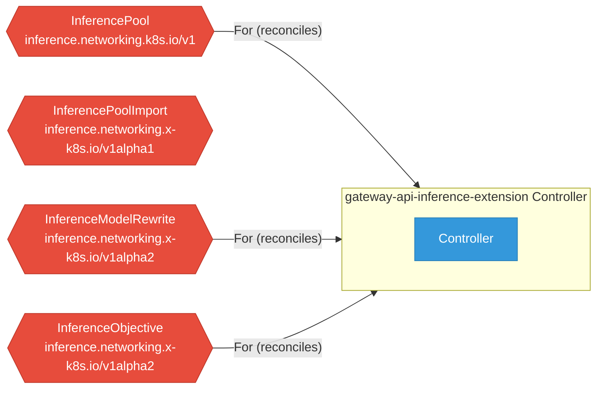

# gateway-api-inference-extension

> **Architecture snapshot: 2026-05-18** (2026-05-18)

**Repository:** kubernetes-sigs/gateway-api-inference-extension  
**Analyzer:** arch-analyzer 0.2.0  
**Extracted:** 2026-05-18T04:26:52Z

## Summary

| Metric | Count |
|--------|-------|
| CRDs | 4 |
| Deployments | 0 |
| Services | 1 |
| Secrets | 0 |
| Cluster Roles | 0 |
| Controller Watches | 6 |

## Component Architecture

CRDs, controllers, and owned Kubernetes resources.

### CRDs

| Group | Version | Kind | Scope | Fields | Validation Rules | Discovery | Source |
|-------|---------|------|-------|--------|------------------|-----------|--------|
| inference.networking.k8s.io | v1 | InferencePool | Namespaced | 31 | 2 | YAML + Go AST | [`config/crd/bases/inference.networking.k8s.io_inferencepools.yaml`](https://github.com/kubernetes-sigs/gateway-api-inference-extension/blob/a75cf430ae8e36c77a633bedd26d65947401da21/config/crd/bases/inference.networking.k8s.io_inferencepools.yaml) |
| inference.networking.x-k8s.io | v1alpha1 | InferencePoolImport | Namespaced | 29 | 0 | YAML + Go AST | [`config/crd/bases/inference.networking.x-k8s.io_inferencepoolimports.yaml`](https://github.com/kubernetes-sigs/gateway-api-inference-extension/blob/a75cf430ae8e36c77a633bedd26d65947401da21/config/crd/bases/inference.networking.x-k8s.io_inferencepoolimports.yaml) |
| inference.networking.x-k8s.io | v1alpha2 | InferenceModelRewrite | Namespaced | 24 | 0 | YAML + Go AST | [`config/crd/bases/inference.networking.x-k8s.io_inferencemodelrewrites.yaml`](https://github.com/kubernetes-sigs/gateway-api-inference-extension/blob/a75cf430ae8e36c77a633bedd26d65947401da21/config/crd/bases/inference.networking.x-k8s.io_inferencemodelrewrites.yaml) |
| inference.networking.x-k8s.io | v1alpha2 | InferenceObjective | Namespaced | 17 | 0 | YAML + Go AST | [`config/crd/bases/inference.networking.x-k8s.io_inferenceobjectives.yaml`](https://github.com/kubernetes-sigs/gateway-api-inference-extension/blob/a75cf430ae8e36c77a633bedd26d65947401da21/config/crd/bases/inference.networking.x-k8s.io_inferenceobjectives.yaml) |

## Dependencies

### Key External Dependencies

| Module | Version |
|--------|---------|
| github.com/go-logr/logr | v1.4.3 |
| github.com/go-logr/logr | v1.4.1 |
| github.com/go-logr/logr | v1.3.0 |
| github.com/go-logr/logr | v1.4.3 |
| github.com/go-logr/logr | v1.4.3 |
| github.com/go-logr/logr | v1.4.3 |
| github.com/go-logr/logr | v1.4.3 |
| github.com/go-logr/logr | v1.4.3 |
| github.com/go-logr/logr | v1.4.3 |
| github.com/go-logr/logr | v1.4.3 |
| github.com/go-logr/logr | v1.4.3 |
| github.com/go-logr/logr | v1.2.2 |
| github.com/go-logr/logr | v0.1.0 |
| github.com/go-logr/logr | v1.4.3 |
| github.com/go-logr/logr | v1.4.3 |
| github.com/go-logr/logr | v1.3.0 |
| github.com/go-logr/logr | v1.4.1 |
| github.com/go-logr/logr | v0.1.0 |
| github.com/go-logr/logr | v1.2.2 |
| github.com/go-logr/logr | v1.4.3 |
| github.com/go-logr/logr | v1.4.3 |
| github.com/go-logr/logr | v1.4.3 |
| github.com/go-logr/logr | v1.4.3 |
| github.com/go-logr/logr | v1.4.3 |
| github.com/go-logr/logr | v1.4.3 |
| github.com/go-logr/logr | v1.4.3 |
| github.com/go-logr/logr | v1.4.3 |
| github.com/go-logr/stdr | v1.2.2 |
| github.com/go-logr/stdr | v1.2.2 |
| github.com/go-logr/stdr | v1.2.2 |
| github.com/go-logr/stdr | v1.2.2 |
| github.com/go-logr/stdr | v1.2.2 |
| github.com/go-logr/zapr | v1.3.0 |
| github.com/go-logr/zapr | v1.3.0 |
| github.com/go-logr/zapr | v1.3.0 |
| github.com/go-logr/zapr | v1.3.0 |
| github.com/go-logr/zapr | v1.3.0 |
| github.com/prometheus/alertmanager | v0.31.0 |
| github.com/prometheus/alertmanager | v0.31.0 |
| github.com/prometheus/client_golang | v1.20.5 |
| github.com/prometheus/client_golang | v1.23.2 |
| github.com/prometheus/client_golang | v1.23.2 |
| github.com/prometheus/client_golang | v1.14.0 |
| github.com/prometheus/client_golang | v1.23.2 |
| github.com/prometheus/client_golang | v1.23.2 |
| github.com/prometheus/client_golang | v1.23.2 |
| github.com/prometheus/client_golang | v1.11.1 |
| github.com/prometheus/client_golang | v1.4.0 |
| github.com/prometheus/client_golang | v1.14.0 |
| github.com/prometheus/client_golang | v1.20.5 |
| github.com/prometheus/client_golang | v1.23.2 |
| github.com/prometheus/client_golang | v1.20.5 |
| github.com/prometheus/client_golang | v1.23.2 |
| github.com/prometheus/client_golang | v1.11.1 |
| github.com/prometheus/client_golang | v1.23.2 |
| github.com/prometheus/client_golang | v1.23.2 |
| github.com/prometheus/client_golang | v1.4.0 |
| github.com/prometheus/client_golang | v1.23.2 |
| github.com/prometheus/client_golang | v1.20.5 |
| github.com/prometheus/client_golang | v1.23.2 |
| github.com/prometheus/client_golang/exp | v0.0.0-20260108101519-fb0838f53562 |
| github.com/prometheus/client_golang/exp | v0.0.0-20260108101519-fb0838f53562 |
| github.com/prometheus/client_model | v0.6.2 |
| github.com/prometheus/client_model | v0.6.2 |
| github.com/prometheus/client_model | v0.2.0 |
| github.com/prometheus/client_model | v0.6.2 |
| github.com/prometheus/client_model | v0.6.2 |
| github.com/prometheus/client_model | v0.6.2 |
| github.com/prometheus/client_model | v0.6.2 |
| github.com/prometheus/client_model | v0.6.1 |
| github.com/prometheus/client_model | v0.6.2 |
| github.com/prometheus/client_model | v0.3.0 |
| github.com/prometheus/client_model | v0.6.2 |
| github.com/prometheus/client_model | v0.6.2 |
| github.com/prometheus/client_model | v0.6.1 |
| github.com/prometheus/client_model | v0.6.2 |
| github.com/prometheus/client_model | v0.6.2 |
| github.com/prometheus/client_model | v0.6.2 |
| github.com/prometheus/client_model | v0.2.0 |
| github.com/prometheus/client_model | v0.6.2 |
| github.com/prometheus/client_model | v0.3.0 |
| github.com/prometheus/common | v0.67.5 |
| github.com/prometheus/common | v0.66.1 |
| github.com/prometheus/common | v0.67.4 |
| github.com/prometheus/common | v0.67.5 |
| github.com/prometheus/common | v0.67.5 |
| github.com/prometheus/common | v0.66.1 |
| github.com/prometheus/common | v0.66.1 |
| github.com/prometheus/common | v0.9.1 |
| github.com/prometheus/common | v0.66.1 |
| github.com/prometheus/common | v0.67.4 |
| github.com/prometheus/common | v0.67.5 |
| github.com/prometheus/common | v0.67.4 |
| github.com/prometheus/common | v0.67.5 |
| github.com/prometheus/common | v0.67.5 |
| github.com/prometheus/common | v0.67.5 |
| github.com/prometheus/common | v0.9.1 |
| github.com/prometheus/common | v0.67.4 |
| github.com/prometheus/common/assets | v0.2.0 |
| github.com/prometheus/common/assets | v0.2.0 |
| github.com/prometheus/exporter-toolkit | v0.15.1 |
| github.com/prometheus/exporter-toolkit | v0.15.1 |
| github.com/prometheus/exporter-toolkit | v0.15.1 |
| github.com/prometheus/exporter-toolkit | v0.15.1 |
| github.com/prometheus/otlptranslator | v1.0.0 |
| github.com/prometheus/otlptranslator | v1.0.0 |
| github.com/prometheus/procfs | v0.16.1 |
| github.com/prometheus/procfs | v0.16.1 |
| github.com/prometheus/procfs | v0.16.1 |
| github.com/prometheus/procfs | v0.16.1 |
| github.com/prometheus/prometheus | v0.310.0 |
| github.com/prometheus/sigv4 | v0.4.0 |
| github.com/prometheus/sigv4 | v0.4.1 |
| github.com/prometheus/sigv4 | v0.4.0 |
| github.com/prometheus/sigv4 | v0.4.1 |
| google.golang.org/grpc | v1.80.0 |
| google.golang.org/grpc | v1.71.0 |
| google.golang.org/grpc | v1.63.2 |
| google.golang.org/grpc | v1.78.0 |
| google.golang.org/grpc | v1.72.2 |
| google.golang.org/grpc | v1.71.1 |
| google.golang.org/grpc | v1.75.0 |
| google.golang.org/grpc | v1.75.1 |
| google.golang.org/grpc | v1.67.1 |
| google.golang.org/grpc | v1.56.3 |
| google.golang.org/grpc | v1.78.0 |
| google.golang.org/grpc | v1.72.2 |
| google.golang.org/grpc | v1.79.2 |
| google.golang.org/grpc | v1.75.1 |
| google.golang.org/grpc | v1.78.0 |
| google.golang.org/grpc | v1.77.0 |
| google.golang.org/grpc | v1.67.1 |
| google.golang.org/grpc | v1.68.0 |
| google.golang.org/grpc | v1.71.1 |
| google.golang.org/grpc | v1.78.0 |
| google.golang.org/grpc | v1.71.1 |
| google.golang.org/grpc | v1.72.2 |
| google.golang.org/grpc | v1.78.0 |
| google.golang.org/grpc | v1.72.2 |
| google.golang.org/grpc | v1.76.0 |
| google.golang.org/grpc | v1.67.1 |
| google.golang.org/grpc | v1.58.2 |
| google.golang.org/grpc | v1.78.0 |
| google.golang.org/grpc | v1.78.0 |
| google.golang.org/grpc | v1.71.1 |
| google.golang.org/grpc | v1.79.3 |
| google.golang.org/grpc | v1.71.1 |
| google.golang.org/grpc | v1.71.0 |
| google.golang.org/grpc | v1.67.0 |
| google.golang.org/grpc | v1.78.0 |
| google.golang.org/grpc | v1.76.0 |
| google.golang.org/grpc | v1.56.3 |
| google.golang.org/grpc | v1.80.0 |
| google.golang.org/grpc | v1.78.0 |
| google.golang.org/grpc | v1.79.3 |
| google.golang.org/grpc | v1.78.0 |
| google.golang.org/grpc | v1.63.2 |
| google.golang.org/grpc | v1.79.1 |
| google.golang.org/grpc | v1.71.1 |
| google.golang.org/grpc | v1.79.2 |
| google.golang.org/grpc | v1.79.1 |
| google.golang.org/grpc | v1.78.0 |
| google.golang.org/grpc | v1.67.1 |
| google.golang.org/grpc | v1.72.2 |
| google.golang.org/grpc | v1.78.0 |
| google.golang.org/grpc | v1.63.2 |
| google.golang.org/grpc | v1.71.1 |
| google.golang.org/grpc | v1.58.2 |
| google.golang.org/grpc | v1.77.0 |
| google.golang.org/grpc | v1.78.0 |
| google.golang.org/grpc | v1.63.2 |
| google.golang.org/grpc | v1.71.1 |
| google.golang.org/grpc | v1.80.0 |
| google.golang.org/grpc | v1.75.0 |
| google.golang.org/grpc | v1.78.0 |
| google.golang.org/grpc | v1.72.2 |
| google.golang.org/grpc | v1.67.0 |
| google.golang.org/grpc | v1.68.0 |
| google.golang.org/grpc/examples | v0.0.0-20250407062114-b368379ef8f6 |
| google.golang.org/grpc/examples | v0.0.0-20250407062114-b368379ef8f6 |
| k8s.io/api | v0.35.4 |
| k8s.io/api | v0.35.0 |
| k8s.io/api | v0.35.4 |
| k8s.io/api | v0.35.4 |
| k8s.io/api | v0.35.4 |
| k8s.io/api | v0.35.1 |
| k8s.io/api | v0.35.0 |
| k8s.io/api | v0.35.0 |
| k8s.io/api | v0.35.4 |
| k8s.io/api | v0.35.4 |
| k8s.io/api | v0.35.4 |
| k8s.io/api | v0.35.0 |
| k8s.io/api | v0.35.0 |
| k8s.io/api | v0.35.1 |
| k8s.io/api | v0.35.0 |
| k8s.io/api | v0.35.4 |
| k8s.io/apiextensions-apiserver | v0.35.0 |
| k8s.io/apiextensions-apiserver | v0.35.1 |
| k8s.io/apiextensions-apiserver | v0.35.0 |
| k8s.io/apiextensions-apiserver | v0.35.4 |
| k8s.io/apiextensions-apiserver | v0.35.0 |
| k8s.io/apiextensions-apiserver | v0.35.4 |
| k8s.io/apiextensions-apiserver | v0.35.1 |
| k8s.io/apiextensions-apiserver | v0.35.0 |
| k8s.io/apimachinery | v0.35.4 |
| k8s.io/apimachinery | v0.35.4 |
| k8s.io/apimachinery | v0.35.4 |
| k8s.io/apimachinery | v0.35.1 |
| k8s.io/apimachinery | v0.35.0 |
| k8s.io/apimachinery | v0.35.0 |
| k8s.io/apimachinery | v0.35.1 |
| k8s.io/apimachinery | v0.35.0 |
| k8s.io/apimachinery | v0.35.4 |
| k8s.io/apimachinery | v0.35.0 |
| k8s.io/apimachinery | v0.35.4 |
| k8s.io/apimachinery | v0.35.0 |
| k8s.io/apimachinery | v0.35.4 |
| k8s.io/apimachinery | v0.35.4 |
| k8s.io/apimachinery | v0.35.1 |
| k8s.io/apimachinery | v0.35.4 |
| k8s.io/apimachinery | v0.35.4 |
| k8s.io/apimachinery | v0.35.4 |
| k8s.io/apimachinery | v0.35.1 |
| k8s.io/apimachinery | v0.35.4 |
| k8s.io/apimachinery | v0.35.0 |
| k8s.io/apimachinery | v0.35.4 |
| k8s.io/apimachinery | v0.35.0 |
| k8s.io/apimachinery | v0.35.0 |
| k8s.io/apimachinery | v0.35.4 |
| k8s.io/apimachinery | v0.35.4 |
| k8s.io/apiserver | v0.35.0 |
| k8s.io/apiserver | v0.35.0 |
| k8s.io/apiserver | v0.35.4 |
| k8s.io/apiserver | v0.35.0 |
| k8s.io/apiserver | v0.35.4 |
| k8s.io/apiserver | v0.35.0 |
| k8s.io/client-go | v0.35.0 |
| k8s.io/client-go | v0.35.1 |
| k8s.io/client-go | v0.35.4 |
| k8s.io/client-go | v0.35.4 |
| k8s.io/client-go | v0.35.4 |
| k8s.io/client-go | v0.35.1 |
| k8s.io/client-go | v0.35.4 |
| k8s.io/client-go | v0.35.0 |
| k8s.io/client-go | v0.35.4 |
| k8s.io/client-go | v0.35.0 |
| k8s.io/client-go | v0.35.4 |
| k8s.io/client-go | v0.35.1 |
| k8s.io/client-go | v0.35.4 |
| k8s.io/client-go | v0.35.0 |
| k8s.io/client-go | v0.35.4 |
| k8s.io/client-go | v0.35.1 |
| sigs.k8s.io/controller-runtime | v0.23.3 |
| sigs.k8s.io/controller-runtime | v0.23.1 |
| sigs.k8s.io/controller-runtime | v0.23.1 |
| sigs.k8s.io/controller-runtime | v0.23.3 |

