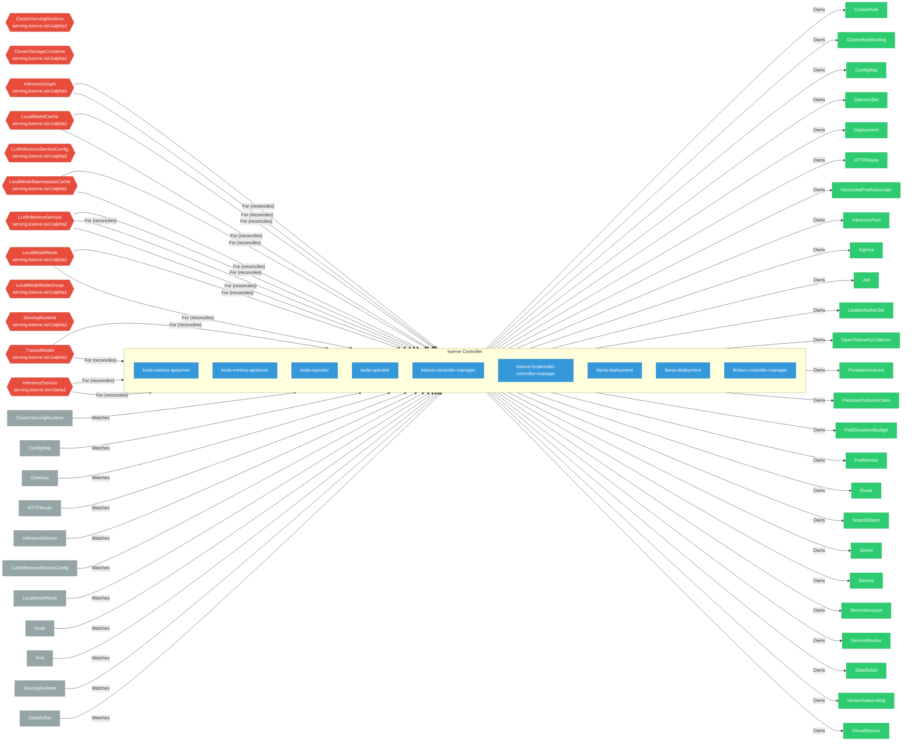

# kserve

> **Architecture snapshot: 2026-05-19** (2026-05-19)

**Repository:** kserve/kserve  
**Analyzer:** arch-analyzer 0.2.0  
**Extracted:** 2026-05-19T04:09:30Z

## Summary

| Metric | Count |
|--------|-------|
| CRDs | 26 |
| Deployments | 9 |
| Services | 18 |
| Secrets | 10 |
| Cluster Roles | 2 |
| Controller Watches | 152 |

## Component Architecture

CRDs, controllers, and owned Kubernetes resources.

### CRDs

| Group | Version | Kind | Scope | Fields | Validation Rules | Discovery | Source |
|-------|---------|------|-------|--------|------------------|-----------|--------|
|  | v1alpha1 | ClusterServingRuntime | Namespaced | 19 | 0 | Go AST | [`/home/runner/work/_temp/arch-analyzer-repos/kserve/pkg/apis/serving/v1alpha1/servingruntime_types.go`](https://github.com/kserve/kserve/blob/c053aa6f71aafc2b91d87553f2df3cad02b5f0d3//home/runner/work/_temp/arch-analyzer-repos/kserve/pkg/apis/serving/v1alpha1/servingruntime_types.go) |
|  | v1alpha1 | ClusterStorageContainer | Namespaced | 19 | 0 | Go AST | [`/home/runner/work/_temp/arch-analyzer-repos/kserve/pkg/apis/serving/v1alpha1/storage_container_types.go`](https://github.com/kserve/kserve/blob/c053aa6f71aafc2b91d87553f2df3cad02b5f0d3//home/runner/work/_temp/arch-analyzer-repos/kserve/pkg/apis/serving/v1alpha1/storage_container_types.go) |
|  | v1alpha1 | InferenceGraph | Namespaced | 19 | 0 | Go AST | [`/home/runner/work/_temp/arch-analyzer-repos/kserve/pkg/apis/serving/v1alpha1/inference_graph.go`](https://github.com/kserve/kserve/blob/c053aa6f71aafc2b91d87553f2df3cad02b5f0d3//home/runner/work/_temp/arch-analyzer-repos/kserve/pkg/apis/serving/v1alpha1/inference_graph.go) |
|  | v1alpha1 | LLMInferenceService | Namespaced | 19 | 0 | Go AST | [`/home/runner/work/_temp/arch-analyzer-repos/kserve/pkg/apis/serving/v1alpha1/llm_inference_service_types.go`](https://github.com/kserve/kserve/blob/c053aa6f71aafc2b91d87553f2df3cad02b5f0d3//home/runner/work/_temp/arch-analyzer-repos/kserve/pkg/apis/serving/v1alpha1/llm_inference_service_types.go) |
|  | v1alpha1 | LLMInferenceServiceConfig | Namespaced | 18 | 0 | Go AST | [`/home/runner/work/_temp/arch-analyzer-repos/kserve/pkg/apis/serving/v1alpha1/llm_inference_service_types.go`](https://github.com/kserve/kserve/blob/c053aa6f71aafc2b91d87553f2df3cad02b5f0d3//home/runner/work/_temp/arch-analyzer-repos/kserve/pkg/apis/serving/v1alpha1/llm_inference_service_types.go) |
|  | v1alpha1 | LocalModelCache | Namespaced | 19 | 0 | Go AST | [`/home/runner/work/_temp/arch-analyzer-repos/kserve/pkg/apis/serving/v1alpha1/local_model_cache_types.go`](https://github.com/kserve/kserve/blob/c053aa6f71aafc2b91d87553f2df3cad02b5f0d3//home/runner/work/_temp/arch-analyzer-repos/kserve/pkg/apis/serving/v1alpha1/local_model_cache_types.go) |
|  | v1alpha1 | LocalModelNamespaceCache | Namespaced | 19 | 0 | Go AST | [`/home/runner/work/_temp/arch-analyzer-repos/kserve/pkg/apis/serving/v1alpha1/local_model_namespace_cache_types.go`](https://github.com/kserve/kserve/blob/c053aa6f71aafc2b91d87553f2df3cad02b5f0d3//home/runner/work/_temp/arch-analyzer-repos/kserve/pkg/apis/serving/v1alpha1/local_model_namespace_cache_types.go) |
|  | v1alpha1 | LocalModelNode | Namespaced | 19 | 0 | Go AST | [`/home/runner/work/_temp/arch-analyzer-repos/kserve/pkg/apis/serving/v1alpha1/local_model_node_types.go`](https://github.com/kserve/kserve/blob/c053aa6f71aafc2b91d87553f2df3cad02b5f0d3//home/runner/work/_temp/arch-analyzer-repos/kserve/pkg/apis/serving/v1alpha1/local_model_node_types.go) |
|  | v1alpha1 | LocalModelNodeGroup | Namespaced | 19 | 0 | Go AST | [`/home/runner/work/_temp/arch-analyzer-repos/kserve/pkg/apis/serving/v1alpha1/local_model_node_group_types.go`](https://github.com/kserve/kserve/blob/c053aa6f71aafc2b91d87553f2df3cad02b5f0d3//home/runner/work/_temp/arch-analyzer-repos/kserve/pkg/apis/serving/v1alpha1/local_model_node_group_types.go) |
|  | v1alpha1 | ServingRuntime | Namespaced | 19 | 0 | Go AST | [`/home/runner/work/_temp/arch-analyzer-repos/kserve/pkg/apis/serving/v1alpha1/servingruntime_types.go`](https://github.com/kserve/kserve/blob/c053aa6f71aafc2b91d87553f2df3cad02b5f0d3//home/runner/work/_temp/arch-analyzer-repos/kserve/pkg/apis/serving/v1alpha1/servingruntime_types.go) |
|  | v1alpha1 | TrainedModel | Namespaced | 19 | 0 | Go AST | [`/home/runner/work/_temp/arch-analyzer-repos/kserve/pkg/apis/serving/v1alpha1/trained_model.go`](https://github.com/kserve/kserve/blob/c053aa6f71aafc2b91d87553f2df3cad02b5f0d3//home/runner/work/_temp/arch-analyzer-repos/kserve/pkg/apis/serving/v1alpha1/trained_model.go) |
|  | v1alpha2 | LLMInferenceService | Namespaced | 19 | 0 | Go AST | [`/home/runner/work/_temp/arch-analyzer-repos/kserve/pkg/apis/serving/v1alpha2/llm_inference_service_types.go`](https://github.com/kserve/kserve/blob/c053aa6f71aafc2b91d87553f2df3cad02b5f0d3//home/runner/work/_temp/arch-analyzer-repos/kserve/pkg/apis/serving/v1alpha2/llm_inference_service_types.go) |
|  | v1alpha2 | LLMInferenceServiceConfig | Namespaced | 18 | 0 | Go AST | [`/home/runner/work/_temp/arch-analyzer-repos/kserve/pkg/apis/serving/v1alpha2/llm_inference_service_types.go`](https://github.com/kserve/kserve/blob/c053aa6f71aafc2b91d87553f2df3cad02b5f0d3//home/runner/work/_temp/arch-analyzer-repos/kserve/pkg/apis/serving/v1alpha2/llm_inference_service_types.go) |
|  | v1beta1 | InferenceService | Namespaced | 19 | 0 | Go AST | [`/home/runner/work/_temp/arch-analyzer-repos/kserve/pkg/apis/serving/v1beta1/inference_service.go`](https://github.com/kserve/kserve/blob/c053aa6f71aafc2b91d87553f2df3cad02b5f0d3//home/runner/work/_temp/arch-analyzer-repos/kserve/pkg/apis/serving/v1beta1/inference_service.go) |
| serving.kserve.io | v1alpha1 | ClusterServingRuntime | Cluster | 1183 | 0 | YAML | [`config/crd/full/serving.kserve.io_clusterservingruntimes.yaml`](https://github.com/kserve/kserve/blob/c053aa6f71aafc2b91d87553f2df3cad02b5f0d3/config/crd/full/serving.kserve.io_clusterservingruntimes.yaml) |
| serving.kserve.io | v1alpha1 | ClusterStorageContainer | Cluster | 216 | 0 | YAML | [`config/crd/full/clusterstoragecontainer/serving.kserve.io_clusterstoragecontainers.yaml`](https://github.com/kserve/kserve/blob/c053aa6f71aafc2b91d87553f2df3cad02b5f0d3/config/crd/full/clusterstoragecontainer/serving.kserve.io_clusterstoragecontainers.yaml) |
| serving.kserve.io | v1alpha1 | InferenceGraph | Namespaced | 150 | 0 | YAML | [`config/crd/full/serving.kserve.io_inferencegraphs.yaml`](https://github.com/kserve/kserve/blob/c053aa6f71aafc2b91d87553f2df3cad02b5f0d3/config/crd/full/serving.kserve.io_inferencegraphs.yaml) |
| serving.kserve.io | v1alpha1 | LocalModelCache | Cluster | 20 | 1 | YAML | [`config/crd/full/localmodel/serving.kserve.io_localmodelcaches.yaml`](https://github.com/kserve/kserve/blob/c053aa6f71aafc2b91d87553f2df3cad02b5f0d3/config/crd/full/localmodel/serving.kserve.io_localmodelcaches.yaml) |
| serving.kserve.io | v1alpha1 | LocalModelNamespaceCache | Namespaced | 20 | 1 | YAML | [`config/crd/full/localmodel/serving.kserve.io_localmodelnamespacecaches.yaml`](https://github.com/kserve/kserve/blob/c053aa6f71aafc2b91d87553f2df3cad02b5f0d3/config/crd/full/localmodel/serving.kserve.io_localmodelnamespacecaches.yaml) |
| serving.kserve.io | v1alpha1 | LocalModelNode | Cluster | 15 | 0 | YAML | [`config/crd/full/localmodel/serving.kserve.io_localmodelnodes.yaml`](https://github.com/kserve/kserve/blob/c053aa6f71aafc2b91d87553f2df3cad02b5f0d3/config/crd/full/localmodel/serving.kserve.io_localmodelnodes.yaml) |
| serving.kserve.io | v1alpha1 | LocalModelNodeGroup | Cluster | 220 | 0 | YAML | [`config/crd/full/localmodel/serving.kserve.io_localmodelnodegroups.yaml`](https://github.com/kserve/kserve/blob/c053aa6f71aafc2b91d87553f2df3cad02b5f0d3/config/crd/full/localmodel/serving.kserve.io_localmodelnodegroups.yaml) |
| serving.kserve.io | v1alpha1 | ServingRuntime | Namespaced | 1183 | 0 | YAML | [`config/crd/full/serving.kserve.io_servingruntimes.yaml`](https://github.com/kserve/kserve/blob/c053aa6f71aafc2b91d87553f2df3cad02b5f0d3/config/crd/full/serving.kserve.io_servingruntimes.yaml) |
| serving.kserve.io | v1alpha1 | TrainedModel | Namespaced | 25 | 0 | YAML | [`config/crd/full/serving.kserve.io_trainedmodels.yaml`](https://github.com/kserve/kserve/blob/c053aa6f71aafc2b91d87553f2df3cad02b5f0d3/config/crd/full/serving.kserve.io_trainedmodels.yaml) |
| serving.kserve.io | v1alpha2 | LLMInferenceService | Namespaced | 5732 | 110 | YAML | [`config/crd/full/llmisvc/serving.kserve.io_llminferenceservices.yaml`](https://github.com/kserve/kserve/blob/c053aa6f71aafc2b91d87553f2df3cad02b5f0d3/config/crd/full/llmisvc/serving.kserve.io_llminferenceservices.yaml) |
| serving.kserve.io | v1alpha2 | LLMInferenceServiceConfig | Namespaced | 5711 | 95 | YAML | [`config/crd/full/llmisvc/serving.kserve.io_llminferenceserviceconfigs.yaml`](https://github.com/kserve/kserve/blob/c053aa6f71aafc2b91d87553f2df3cad02b5f0d3/config/crd/full/llmisvc/serving.kserve.io_llminferenceserviceconfigs.yaml) |
| serving.kserve.io | v1beta1 | InferenceService | Namespaced | 6547 | 0 | YAML | [`config/crd/full/serving.kserve.io_inferenceservices.yaml`](https://github.com/kserve/kserve/blob/c053aa6f71aafc2b91d87553f2df3cad02b5f0d3/config/crd/full/serving.kserve.io_inferenceservices.yaml) |

## Dependencies

### Key External Dependencies

| Module | Version |
|--------|---------|
| github.com/go-logr/logr | v1.4.3 |
| github.com/go-logr/logr | v1.4.3 |
| github.com/go-logr/logr | v1.4.3 |
| github.com/go-logr/logr | v1.4.3 |
| github.com/go-logr/logr | v1.4.3 |
| github.com/go-logr/logr | v1.4.3 |
| github.com/go-logr/logr | v1.4.2 |
| github.com/go-logr/logr | v1.4.2 |
| github.com/go-logr/logr | v1.4.2 |
| github.com/go-logr/logr | v1.2.2 |
| github.com/go-logr/logr | v1.4.3 |
| github.com/go-logr/logr | v1.4.2 |
| github.com/go-logr/logr | v1.4.3 |
| github.com/go-logr/logr | v1.4.3 |
| github.com/go-logr/logr | v1.3.0 |
| github.com/go-logr/logr | v1.3.0 |
| github.com/go-logr/logr | v1.4.2 |
| github.com/go-logr/logr | v1.4.3 |
| github.com/go-logr/logr | v1.4.1 |
| github.com/go-logr/logr | v1.2.2 |
| github.com/go-logr/logr | v1.4.2 |
| github.com/go-logr/logr | v1.4.3 |
| github.com/go-logr/logr | v1.4.1 |
| github.com/go-logr/logr | v1.4.3 |
| github.com/go-logr/logr | v1.4.2 |
| github.com/go-logr/logr | v1.4.2 |
| github.com/go-logr/logr | v1.4.2 |
| github.com/go-logr/logr | v1.4.2 |
| github.com/go-logr/logr | v1.4.3 |
| github.com/go-logr/logr | v1.4.2 |
| github.com/go-logr/logr | v1.4.2 |
| github.com/go-logr/stdr | v1.2.2 |
| github.com/go-logr/stdr | v1.2.2 |
| github.com/go-logr/stdr | v1.2.2 |
| github.com/go-logr/stdr | v1.2.2 |
| github.com/go-logr/zapr | v1.3.0 |
| github.com/go-logr/zapr | v1.3.0 |
| github.com/go-logr/zapr | v1.3.0 |
| github.com/go-logr/zapr | v1.3.0 |
| github.com/go-logr/zapr | v1.3.0 |
| github.com/go-logr/zapr | v1.3.0 |
| github.com/go-logr/zapr | v1.3.0 |
| github.com/go-logr/zapr | v1.3.0 |
| github.com/go-logr/zapr | v1.3.0 |
| github.com/operator-framework/api | v0.27.0 |
| github.com/operator-framework/api | v0.27.0 |
| github.com/operator-framework/operator-lib | v0.15.0 |
| github.com/operator-framework/operator-lib | v0.15.0 |
| github.com/prometheus-operator/prometheus-operator | v0.76.2 |
| github.com/prometheus-operator/prometheus-operator | v0.76.2 |
| github.com/prometheus-operator/prometheus-operator/pkg/apis/monitoring | v0.76.2 |
| github.com/prometheus-operator/prometheus-operator/pkg/apis/monitoring | v0.89.0 |
| github.com/prometheus-operator/prometheus-operator/pkg/apis/monitoring | v0.76.2 |
| github.com/prometheus-operator/prometheus-operator/pkg/apis/monitoring | v0.89.0 |
| github.com/prometheus-operator/prometheus-operator/pkg/apis/monitoring | v0.89.0 |
| github.com/prometheus-operator/prometheus-operator/pkg/client | v0.76.2 |
| github.com/prometheus-operator/prometheus-operator/pkg/client | v0.76.2 |
| github.com/prometheus/client_golang | v1.23.2 |
| github.com/prometheus/client_golang | v1.11.1 |
| github.com/prometheus/client_golang | v1.23.2 |
| github.com/prometheus/client_golang | v1.23.2 |
| github.com/prometheus/client_golang | v1.23.2 |
| github.com/prometheus/client_golang | v1.23.2 |
| github.com/prometheus/client_golang | v1.23.2 |
| github.com/prometheus/client_golang | v1.19.1 |
| github.com/prometheus/client_golang | v1.19.1 |
| github.com/prometheus/client_golang | v1.19.1 |
| github.com/prometheus/client_golang | v1.23.2 |
| github.com/prometheus/client_golang | v1.23.2 |
| github.com/prometheus/client_golang | v1.11.1 |
| github.com/prometheus/client_golang | v1.22.0 |
| github.com/prometheus/client_golang | v1.23.2 |
| github.com/prometheus/client_golang | v1.20.5 |
| github.com/prometheus/client_golang | v1.23.2 |
| github.com/prometheus/client_golang | v1.22.0 |
| github.com/prometheus/client_golang | v1.19.1 |
| github.com/prometheus/client_golang | v1.20.5 |
| github.com/prometheus/client_model | v0.6.2 |
| github.com/prometheus/client_model | v0.6.2 |
| github.com/prometheus/client_model | v0.6.1 |
| github.com/prometheus/client_model | v0.6.2 |
| github.com/prometheus/client_model | v0.6.2 |
| github.com/prometheus/client_model | v0.6.1 |
| github.com/prometheus/client_model | v0.6.1 |
| github.com/prometheus/client_model | v0.6.2 |
| github.com/prometheus/client_model | v0.6.2 |
| github.com/prometheus/client_model | v0.6.1 |
| github.com/prometheus/client_model | v0.6.2 |
| github.com/prometheus/client_model | v0.6.2 |
| github.com/prometheus/client_model | v0.6.2 |
| github.com/prometheus/client_model | v0.6.1 |
| github.com/prometheus/client_model | v0.6.2 |
| github.com/prometheus/client_model | v0.6.1 |
| github.com/prometheus/client_model | v0.6.2 |
| github.com/prometheus/common | v0.65.0 |
| github.com/prometheus/common | v0.65.0 |
| github.com/prometheus/common | v0.67.4 |
| github.com/prometheus/common | v0.67.5 |
| github.com/prometheus/common | v0.55.0 |
| github.com/prometheus/common | v0.62.0 |
| github.com/prometheus/common | v0.55.0 |
| github.com/prometheus/common | v0.67.5 |
| github.com/prometheus/common | v0.67.5 |
| github.com/prometheus/common | v0.66.1 |
| github.com/prometheus/common | v0.60.1 |
| github.com/prometheus/common | v0.67.5 |
| github.com/prometheus/common | v0.67.4 |
| github.com/prometheus/common | v0.60.1 |
| github.com/prometheus/common | v0.67.4 |
| github.com/prometheus/common | v0.62.0 |
| github.com/prometheus/common | v0.66.1 |
| github.com/prometheus/otlptranslator | v1.0.0 |
| github.com/prometheus/otlptranslator | v1.0.0 |
| github.com/prometheus/otlptranslator | v1.0.0 |
| github.com/prometheus/otlptranslator | v1.0.0 |
| github.com/prometheus/procfs | v0.16.1 |
| github.com/prometheus/procfs | v0.15.1 |
| github.com/prometheus/procfs | v0.15.1 |
| github.com/prometheus/procfs | v0.16.1 |
| github.com/prometheus/prometheus | v0.308.1 |
| github.com/prometheus/prometheus | v0.308.1 |
| github.com/prometheus/prometheus | v0.54.0 |
| github.com/prometheus/prometheus | v0.55.0 |
| github.com/prometheus/prometheus | v0.55.0 |
| github.com/prometheus/prometheus | v0.54.0 |
| google.golang.org/grpc | v1.77.0 |
| google.golang.org/grpc | v1.74.2 |
| google.golang.org/grpc | v1.75.1 |
| google.golang.org/grpc | v1.72.1 |
| google.golang.org/grpc | v1.75.1 |
| google.golang.org/grpc | v1.72.1 |
| google.golang.org/grpc | v1.71.0 |
| google.golang.org/grpc | v1.74.2 |
| google.golang.org/grpc | v1.71.0 |
| google.golang.org/grpc | v1.72.1 |
| google.golang.org/grpc | v1.75.1 |
| google.golang.org/grpc | v1.72.1 |
| google.golang.org/grpc | v1.73.0 |
| google.golang.org/grpc | v1.71.0 |
| google.golang.org/grpc | v1.71.1 |
| google.golang.org/grpc | v1.72.1 |
| google.golang.org/grpc | v1.58.2 |
| google.golang.org/grpc | v1.77.0 |
| google.golang.org/grpc | v1.69.4 |
| google.golang.org/grpc | v1.73.0 |
| google.golang.org/grpc | v1.75.1 |
| google.golang.org/grpc | v1.71.1 |
| google.golang.org/grpc | v1.72.1 |
| google.golang.org/grpc | v1.75.1 |
| google.golang.org/grpc | v1.77.0 |
| google.golang.org/grpc | v1.75.1 |
| google.golang.org/grpc | v1.75.1 |
| google.golang.org/grpc | v1.75.1 |
| google.golang.org/grpc | v1.78.0 |
| google.golang.org/grpc | v1.71.0 |
| google.golang.org/grpc | v1.69.4 |
| google.golang.org/grpc | v1.75.1 |
| google.golang.org/grpc | v1.56.3 |
| google.golang.org/grpc | v1.75.0 |
| google.golang.org/grpc | v1.67.3 |
| google.golang.org/grpc | v1.78.0 |
| google.golang.org/grpc | v1.71.1 |
| google.golang.org/grpc | v1.71.1 |
| google.golang.org/grpc | v1.63.2 |
| google.golang.org/grpc | v1.77.0 |
| google.golang.org/grpc | v1.67.3 |
| google.golang.org/grpc | v1.75.0 |
| google.golang.org/grpc | v1.67.0 |
| google.golang.org/grpc | v1.71.0 |
| google.golang.org/grpc | v1.71.0 |
| google.golang.org/grpc | v1.58.2 |
| google.golang.org/grpc | v1.71.0 |
| google.golang.org/grpc | v1.72.1 |
| google.golang.org/grpc | v1.71.1 |
| google.golang.org/grpc | v1.75.1 |
| google.golang.org/grpc | v1.72.1 |
| google.golang.org/grpc | v1.71.1 |
| google.golang.org/grpc | v1.56.3 |
| google.golang.org/grpc | v1.67.0 |
| google.golang.org/grpc | v1.77.0 |
| google.golang.org/grpc | v1.77.0 |
| google.golang.org/grpc | v1.71.0 |
| google.golang.org/grpc | v1.63.2 |
| google.golang.org/grpc/cmd/protoc-gen-go-grpc | v1.5.1 |
| google.golang.org/grpc/cmd/protoc-gen-go-grpc | v1.5.1 |
| google.golang.org/grpc/cmd/protoc-gen-go-grpc | v1.5.1 |
| google.golang.org/grpc/cmd/protoc-gen-go-grpc | v1.5.1 |
| google.golang.org/grpc/examples | v0.0.0-20250407062114-b368379ef8f6 |
| google.golang.org/grpc/examples | v0.0.0-20250407062114-b368379ef8f6 |
| k8s.io/api | v0.34.1 |
| k8s.io/api | v0.34.3 |
| k8s.io/api | v0.34.3 |
| k8s.io/api | v0.34.5 |
| k8s.io/api | v0.34.3 |
| k8s.io/api | v0.34.3 |
| k8s.io/api | v0.34.3 |
| k8s.io/api | v0.34.3 |
| k8s.io/api | v0.31.2 |
| k8s.io/api | v0.34.1 |
| k8s.io/api | v0.34.3 |
| k8s.io/api | v0.34.3 |
| k8s.io/api | v0.34.3 |
| k8s.io/api | v0.29.0 |
| k8s.io/api | v0.31.0 |
| k8s.io/api | v0.34.5 |
| k8s.io/api | v0.34.5 |
| k8s.io/api | v0.34.3 |
| k8s.io/api | v0.34.3 |
| k8s.io/api | v0.31.7 |
| k8s.io/api | v0.34.5 |
| k8s.io/api | v0.34.3 |
| k8s.io/api | v0.34.3 |
| k8s.io/api | v0.34.3 |
| k8s.io/api | v0.31.7 |
| k8s.io/api | v0.34.3 |
| k8s.io/api | v0.34.3 |
| k8s.io/api | v0.34.5 |
| k8s.io/api | v0.29.0 |
| k8s.io/api | v0.34.3 |
| k8s.io/api | v0.34.3 |
| k8s.io/api | v0.31.2 |
| k8s.io/api | v0.31.0 |
| k8s.io/apiextensions-apiserver | v0.31.0 |
| k8s.io/apiextensions-apiserver | v0.34.3 |
| k8s.io/apiextensions-apiserver | v0.34.3 |
| k8s.io/apiextensions-apiserver | v0.31.2 |
| k8s.io/apiextensions-apiserver | v0.31.0 |
| k8s.io/apiextensions-apiserver | v0.34.3 |
| k8s.io/apiextensions-apiserver | v0.34.3 |
| k8s.io/apiextensions-apiserver | v0.34.3 |
| k8s.io/apiextensions-apiserver | v0.34.3 |
| k8s.io/apiextensions-apiserver | v0.31.2 |
| k8s.io/apiextensions-apiserver | v0.34.1 |
| k8s.io/apiextensions-apiserver | v0.34.3 |
| k8s.io/apiextensions-apiserver | v0.34.3 |
| k8s.io/apiextensions-apiserver | v0.34.3 |
| k8s.io/apiextensions-apiserver | v0.34.3 |
| k8s.io/apiextensions-apiserver | v0.34.1 |
| k8s.io/apiextensions-apiserver | v0.34.3 |
| k8s.io/apimachinery | v0.29.0 |
| k8s.io/apimachinery | v0.34.3 |
| k8s.io/apimachinery | v0.34.3 |
| k8s.io/apimachinery | v0.34.3 |
| k8s.io/apimachinery | v0.34.3 |
| k8s.io/apimachinery | v0.34.3 |
| k8s.io/apimachinery | v0.34.5 |
| k8s.io/apimachinery | v0.34.3 |
| k8s.io/apimachinery | v0.34.3 |
| k8s.io/apimachinery | v0.32.1 |
| k8s.io/apimachinery | v0.31.0 |
| k8s.io/apimachinery | v0.31.7 |
| k8s.io/apimachinery | v0.34.5 |
| k8s.io/apimachinery | v0.34.5 |
| k8s.io/apimachinery | v0.32.1 |
| k8s.io/apimachinery | v0.34.1 |
| k8s.io/apimachinery | v0.34.5 |
| k8s.io/apimachinery | v0.34.3 |
| k8s.io/apimachinery | v0.31.2 |
| k8s.io/apimachinery | v0.34.3 |
| k8s.io/apimachinery | v0.34.3 |
| k8s.io/apimachinery | v0.34.3 |
| k8s.io/apimachinery | v0.31.7 |
| k8s.io/apimachinery | v0.31.0 |
| k8s.io/apimachinery | v0.34.3 |
| k8s.io/apimachinery | v0.34.3 |
| k8s.io/apimachinery | v0.34.5 |
| k8s.io/apimachinery | v0.34.3 |
| k8s.io/apimachinery | v0.34.3 |
| k8s.io/apimachinery | v0.34.3 |
| k8s.io/apimachinery | v0.34.1 |
| k8s.io/apimachinery | v0.34.3 |
| k8s.io/apimachinery | v0.34.5 |
| k8s.io/apimachinery | v0.34.5 |
| k8s.io/apimachinery | v0.34.3 |
| k8s.io/apimachinery | v0.31.2 |
| k8s.io/apimachinery | v0.29.0 |
| k8s.io/apimachinery | v0.34.3 |
| k8s.io/apimachinery | v0.34.3 |
| k8s.io/apimachinery | v0.34.3 |
| k8s.io/apimachinery | v0.34.3 |
| k8s.io/apiserver | v0.34.3 |
| k8s.io/apiserver | v0.31.0 |
| k8s.io/apiserver | v0.34.3 |
| k8s.io/apiserver | v0.34.3 |
| k8s.io/apiserver | v0.31.7 |
| k8s.io/apiserver | v0.31.7 |
| k8s.io/apiserver | v0.31.0 |
| k8s.io/apiserver | v0.34.3 |
| k8s.io/client-go | v0.34.3 |
| k8s.io/client-go | v0.34.5 |
| k8s.io/client-go | v0.32.1 |
| k8s.io/client-go | v0.34.3 |
| k8s.io/client-go | v0.34.3 |
| k8s.io/client-go | v0.34.5 |
| k8s.io/client-go | v0.34.3 |
| k8s.io/client-go | v0.34.3 |
| k8s.io/client-go | v0.31.0 |
| k8s.io/client-go | v0.34.3 |
| k8s.io/client-go | v0.34.3 |
| k8s.io/client-go | v0.34.3 |
| k8s.io/client-go | v0.34.3 |
| k8s.io/client-go | v0.31.2 |
| k8s.io/client-go | v0.31.0 |
| k8s.io/client-go | v0.34.3 |
| k8s.io/client-go | v0.34.1 |
| k8s.io/client-go | v0.34.3 |
| k8s.io/client-go | v0.34.3 |
| k8s.io/client-go | v0.34.3 |
| k8s.io/client-go | v0.34.3 |
| k8s.io/client-go | v0.34.3 |
| k8s.io/client-go | v0.31.2 |
| k8s.io/client-go | v0.34.3 |
| k8s.io/client-go | v0.32.1 |
| k8s.io/client-go | v0.34.3 |
| k8s.io/client-go | v0.31.7 |
| k8s.io/client-go | v0.34.5 |
| k8s.io/client-go | v0.31.7 |
| k8s.io/client-go | v0.34.3 |
| k8s.io/client-go | v0.34.1 |
| sigs.k8s.io/controller-runtime | v0.19.7 |
| sigs.k8s.io/controller-runtime | v0.22.4 |
| sigs.k8s.io/controller-runtime | v0.22.5 |
| sigs.k8s.io/controller-runtime | v0.22.4 |
| sigs.k8s.io/controller-runtime | v0.22.3 |
| sigs.k8s.io/controller-runtime | v0.22.4 |
| sigs.k8s.io/controller-runtime | v0.22.5 |
| sigs.k8s.io/controller-runtime | v0.22.1 |
| sigs.k8s.io/controller-runtime | v0.19.7 |
| sigs.k8s.io/controller-runtime | v0.22.4 |
| sigs.k8s.io/controller-runtime | v0.19.1 |
| sigs.k8s.io/controller-runtime | v0.22.3 |
| sigs.k8s.io/controller-runtime | v0.22.1 |
| sigs.k8s.io/controller-runtime | v0.19.1 |
| sigs.k8s.io/controller-runtime | v0.19.7 |
| sigs.k8s.io/controller-runtime/tools/setup-envtest | v0.0.0-20240804232438-89b5deec030c |
| sigs.k8s.io/controller-runtime/tools/setup-envtest | v0.0.0-20240804232438-89b5deec030c |

