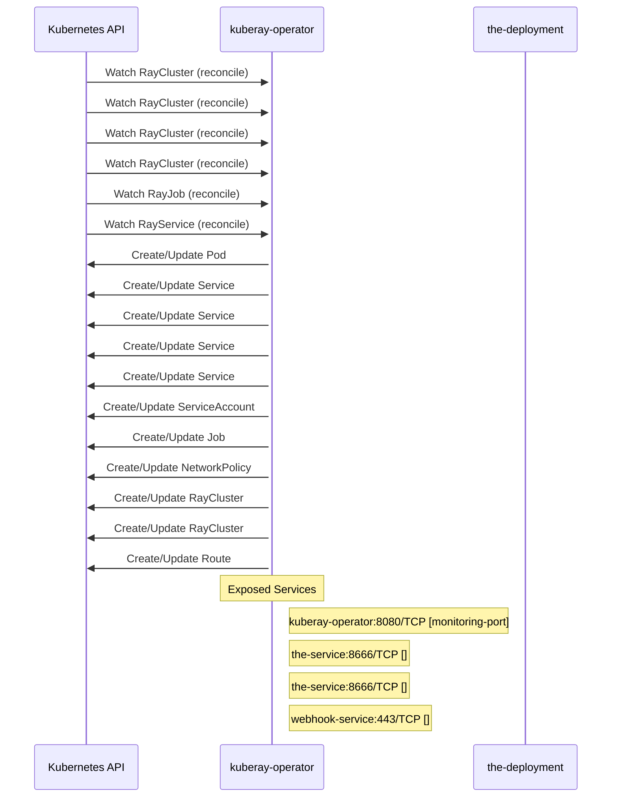

# kuberay: Dataflow

## Controller Watches

Kubernetes resources this controller monitors for changes. Each watch triggers reconciliation when the watched resource is created, updated, or deleted.

| Type | GVK | Source |
|------|-----|--------|
| For | ray/v1/RayCluster | [`ray-operator/controllers/ray/raycluster_mtls_controller.go:834`](https://github.com/ray-project/kuberay/blob/f4df72305aacee3d16dc37ef1f7aa672b16182d1/ray-operator/controllers/ray/raycluster_mtls_controller.go#L834) |
| For | ray/v1/RayCluster | [`ray-operator/controllers/ray/networkpolicy_controller.go:427`](https://github.com/ray-project/kuberay/blob/f4df72305aacee3d16dc37ef1f7aa672b16182d1/ray-operator/controllers/ray/networkpolicy_controller.go#L427) |
| For | ray/v1/RayCluster | [`ray-operator/controllers/ray/authentication_controller.go:1089`](https://github.com/ray-project/kuberay/blob/f4df72305aacee3d16dc37ef1f7aa672b16182d1/ray-operator/controllers/ray/authentication_controller.go#L1089) |
| For | ray/v1/RayCluster | [`ray-operator/controllers/ray/raycluster_controller.go:1574`](https://github.com/ray-project/kuberay/blob/f4df72305aacee3d16dc37ef1f7aa672b16182d1/ray-operator/controllers/ray/raycluster_controller.go#L1574) |
| For | ray/v1/RayJob | [`ray-operator/controllers/ray/rayjob_controller.go:729`](https://github.com/ray-project/kuberay/blob/f4df72305aacee3d16dc37ef1f7aa672b16182d1/ray-operator/controllers/ray/rayjob_controller.go#L729) |
| For | ray/v1/RayService | [`ray-operator/controllers/ray/rayservice_controller.go:434`](https://github.com/ray-project/kuberay/blob/f4df72305aacee3d16dc37ef1f7aa672b16182d1/ray-operator/controllers/ray/rayservice_controller.go#L434) |
| Owns | /v1/Pod | [`ray-operator/controllers/ray/raycluster_controller.go:1579`](https://github.com/ray-project/kuberay/blob/f4df72305aacee3d16dc37ef1f7aa672b16182d1/ray-operator/controllers/ray/raycluster_controller.go#L1579) |
| Owns | /v1/Service | [`ray-operator/controllers/ray/raycluster_controller.go:1580`](https://github.com/ray-project/kuberay/blob/f4df72305aacee3d16dc37ef1f7aa672b16182d1/ray-operator/controllers/ray/raycluster_controller.go#L1580) |
| Owns | /v1/Service | [`ray-operator/controllers/ray/authentication_controller.go:1092`](https://github.com/ray-project/kuberay/blob/f4df72305aacee3d16dc37ef1f7aa672b16182d1/ray-operator/controllers/ray/authentication_controller.go#L1092) |
| Owns | /v1/Service | [`ray-operator/controllers/ray/rayjob_controller.go:731`](https://github.com/ray-project/kuberay/blob/f4df72305aacee3d16dc37ef1f7aa672b16182d1/ray-operator/controllers/ray/rayjob_controller.go#L731) |
| Owns | /v1/Service | [`ray-operator/controllers/ray/rayservice_controller.go:440`](https://github.com/ray-project/kuberay/blob/f4df72305aacee3d16dc37ef1f7aa672b16182d1/ray-operator/controllers/ray/rayservice_controller.go#L440) |
| Owns | /v1/ServiceAccount | [`ray-operator/controllers/ray/authentication_controller.go:1091`](https://github.com/ray-project/kuberay/blob/f4df72305aacee3d16dc37ef1f7aa672b16182d1/ray-operator/controllers/ray/authentication_controller.go#L1091) |
| Owns | batch/v1/Job | [`ray-operator/controllers/ray/rayjob_controller.go:732`](https://github.com/ray-project/kuberay/blob/f4df72305aacee3d16dc37ef1f7aa672b16182d1/ray-operator/controllers/ray/rayjob_controller.go#L732) |
| Owns | networking.k8s.io/v1/NetworkPolicy | [`ray-operator/controllers/ray/networkpolicy_controller.go:428`](https://github.com/ray-project/kuberay/blob/f4df72305aacee3d16dc37ef1f7aa672b16182d1/ray-operator/controllers/ray/networkpolicy_controller.go#L428) |
| Owns | ray/v1/RayCluster | [`ray-operator/controllers/ray/rayjob_controller.go:730`](https://github.com/ray-project/kuberay/blob/f4df72305aacee3d16dc37ef1f7aa672b16182d1/ray-operator/controllers/ray/rayjob_controller.go#L730) |
| Owns | ray/v1/RayCluster | [`ray-operator/controllers/ray/rayservice_controller.go:439`](https://github.com/ray-project/kuberay/blob/f4df72305aacee3d16dc37ef1f7aa672b16182d1/ray-operator/controllers/ray/rayservice_controller.go#L439) |
| Owns | route/v1/Route | [`ray-operator/controllers/ray/authentication_controller.go:1093`](https://github.com/ray-project/kuberay/blob/f4df72305aacee3d16dc37ef1f7aa672b16182d1/ray-operator/controllers/ray/authentication_controller.go#L1093) |

## Reconciliation Flow

How the controller interacts with the Kubernetes API during reconciliation.

### Webhooks

| Name | Type | Path | Failure Policy | Service | Overlays | Enable Condition | Sources |
|------|------|------|----------------|---------|----------|------------------|----------|
| mraycluster.kb.io | mutating | /mutate-ray-io-v1-raycluster | Fail | $(namespace)/kuberay-webhook-service |  |  | [`ray-operator/config/openshift/webhook.yaml`](https://github.com/ray-project/kuberay/blob/f4df72305aacee3d16dc37ef1f7aa672b16182d1/ray-operator/config/openshift/webhook.yaml) |
| mraycluster.kb.io | mutating | /mutate-ray-io-v1-raycluster | fail |  |  |  | [`ray-operator/pkg/webhooks/v1/raycluster_mutating_webhook.go`](https://github.com/ray-project/kuberay/blob/f4df72305aacee3d16dc37ef1f7aa672b16182d1/ray-operator/pkg/webhooks/v1/raycluster_mutating_webhook.go), [`ray-operator/pkg/webhooks/v1/raycluster_mutating_webhook.go`](https://github.com/ray-project/kuberay/blob/f4df72305aacee3d16dc37ef1f7aa672b16182d1/ray-operator/pkg/webhooks/v1/raycluster_mutating_webhook.go) |
| vraycluster.kb.io | validating | /validate-ray-io-v1-raycluster | fail |  |  |  | [`ray-operator/pkg/webhooks/v1/raycluster_validating_webhook.go`](https://github.com/ray-project/kuberay/blob/f4df72305aacee3d16dc37ef1f7aa672b16182d1/ray-operator/pkg/webhooks/v1/raycluster_validating_webhook.go), [`ray-operator/pkg/webhooks/v1/raycluster_validating_webhook.go`](https://github.com/ray-project/kuberay/blob/f4df72305aacee3d16dc37ef1f7aa672b16182d1/ray-operator/pkg/webhooks/v1/raycluster_validating_webhook.go) |

### HTTP Endpoints

| Method | Path | Source |
|--------|------|--------|
| * | / | [`.gomod-cache/golang.org/x/net@v0.43.0/webdav/litmus_test_server.go:83`](https://github.com/ray-project/kuberay/blob/f4df72305aacee3d16dc37ef1f7aa672b16182d1/.gomod-cache/golang.org/x/net@v0.43.0/webdav/litmus_test_server.go#L83) |
| * | / | [`experimental/cmd/main.go:111`](https://github.com/ray-project/kuberay/blob/f4df72305aacee3d16dc37ef1f7aa672b16182d1/experimental/cmd/main.go#L111) |
| * | / | [`.gomod-cache/golang.org/x/tools@v0.36.0/godoc/pres.go:130`](https://github.com/ray-project/kuberay/blob/f4df72305aacee3d16dc37ef1f7aa672b16182d1/.gomod-cache/golang.org/x/tools@v0.36.0/godoc/pres.go#L130) |
| * | / | [`.gomod-cache/github.com/google/pprof@v0.0.0-20250403155104-27863c87afa6/internal/driver/webui.go:212`](https://github.com/ray-project/kuberay/blob/f4df72305aacee3d16dc37ef1f7aa672b16182d1/.gomod-cache/github.com/google/pprof@v0.0.0-20250403155104-27863c87afa6/internal/driver/webui.go#L212) |
| * | / | [`.gomod-cache/golang.org/x/tools@v0.36.0/go/types/internal/play/play.go:46`](https://github.com/ray-project/kuberay/blob/f4df72305aacee3d16dc37ef1f7aa672b16182d1/.gomod-cache/golang.org/x/tools@v0.36.0/go/types/internal/play/play.go#L46) |
| * | / | [`.gopath-loader/pkg/mod/golang.org/x/tools@v0.36.0/go/types/internal/play/play.go:46`](https://github.com/ray-project/kuberay/blob/f4df72305aacee3d16dc37ef1f7aa672b16182d1/.gopath-loader/pkg/mod/golang.org/x/tools@v0.36.0/go/types/internal/play/play.go#L46) |
| * | / | [`.gopath-loader/pkg/mod/github.com/google/pprof@v0.0.0-20250403155104-27863c87afa6/internal/driver/webui.go:212`](https://github.com/ray-project/kuberay/blob/f4df72305aacee3d16dc37ef1f7aa672b16182d1/.gopath-loader/pkg/mod/github.com/google/pprof@v0.0.0-20250403155104-27863c87afa6/internal/driver/webui.go#L212) |
| * | / | [`.gopath-loader/pkg/mod/golang.org/x/tools@v0.36.0/cmd/present/dir.go:23`](https://github.com/ray-project/kuberay/blob/f4df72305aacee3d16dc37ef1f7aa672b16182d1/.gopath-loader/pkg/mod/golang.org/x/tools@v0.36.0/cmd/present/dir.go#L23) |
| * | / | [`.gopath-loader/pkg/mod/golang.org/x/tools@v0.36.0/cmd/godoc/handlers.go:42`](https://github.com/ray-project/kuberay/blob/f4df72305aacee3d16dc37ef1f7aa672b16182d1/.gopath-loader/pkg/mod/golang.org/x/tools@v0.36.0/cmd/godoc/handlers.go#L42) |
| * | / | [`.gopath-loader/pkg/mod/golang.org/x/tools@v0.36.0/cmd/godoc/handlers.go:31`](https://github.com/ray-project/kuberay/blob/f4df72305aacee3d16dc37ef1f7aa672b16182d1/.gopath-loader/pkg/mod/golang.org/x/tools@v0.36.0/cmd/godoc/handlers.go#L31) |
| * | / | [`.gopath-loader/pkg/mod/golang.org/x/net@v0.43.0/webdav/litmus_test_server.go:83`](https://github.com/ray-project/kuberay/blob/f4df72305aacee3d16dc37ef1f7aa672b16182d1/.gopath-loader/pkg/mod/golang.org/x/net@v0.43.0/webdav/litmus_test_server.go#L83) |
| * | / | [`.gomod-cache/golang.org/x/tools@v0.36.0/cmd/present/dir.go:23`](https://github.com/ray-project/kuberay/blob/f4df72305aacee3d16dc37ef1f7aa672b16182d1/.gomod-cache/golang.org/x/tools@v0.36.0/cmd/present/dir.go#L23) |
| * | / | [`.gomod-cache/golang.org/x/tools@v0.36.0/cmd/godoc/handlers.go:42`](https://github.com/ray-project/kuberay/blob/f4df72305aacee3d16dc37ef1f7aa672b16182d1/.gomod-cache/golang.org/x/tools@v0.36.0/cmd/godoc/handlers.go#L42) |
| * | / | [`.gopath-loader/pkg/mod/golang.org/x/tools@v0.36.0/godoc/pres.go:130`](https://github.com/ray-project/kuberay/blob/f4df72305aacee3d16dc37ef1f7aa672b16182d1/.gopath-loader/pkg/mod/golang.org/x/tools@v0.36.0/godoc/pres.go#L130) |
| * | / | [`.gomod-cache/golang.org/x/tools@v0.36.0/cmd/godoc/handlers.go:31`](https://github.com/ray-project/kuberay/blob/f4df72305aacee3d16dc37ef1f7aa672b16182d1/.gomod-cache/golang.org/x/tools@v0.36.0/cmd/godoc/handlers.go#L31) |
| GET | / | [`.gopath-loader/pkg/mod/k8s.io/apiserver@v0.34.1/pkg/server/routes/version.go:44`](https://github.com/ray-project/kuberay/blob/f4df72305aacee3d16dc37ef1f7aa672b16182d1/.gopath-loader/pkg/mod/k8s.io/apiserver@v0.34.1/pkg/server/routes/version.go#L44) |
| GET | / | [`.gomod-cache/k8s.io/apiserver@v0.34.1/pkg/endpoints/discovery/legacy.go:59`](https://github.com/ray-project/kuberay/blob/f4df72305aacee3d16dc37ef1f7aa672b16182d1/.gomod-cache/k8s.io/apiserver@v0.34.1/pkg/endpoints/discovery/legacy.go#L59) |
| GET | / | [`.gopath-loader/pkg/mod/k8s.io/apiserver@v0.34.1/pkg/endpoints/discovery/version.go:67`](https://github.com/ray-project/kuberay/blob/f4df72305aacee3d16dc37ef1f7aa672b16182d1/.gopath-loader/pkg/mod/k8s.io/apiserver@v0.34.1/pkg/endpoints/discovery/version.go#L67) |
| GET | / | [`.gopath-loader/pkg/mod/k8s.io/apiserver@v0.34.1/pkg/endpoints/discovery/aggregated/wrapper.go:58`](https://github.com/ray-project/kuberay/blob/f4df72305aacee3d16dc37ef1f7aa672b16182d1/.gopath-loader/pkg/mod/k8s.io/apiserver@v0.34.1/pkg/endpoints/discovery/aggregated/wrapper.go#L58) |
| GET | / | [`.gomod-cache/k8s.io/apiserver@v0.34.1/pkg/endpoints/discovery/version.go:67`](https://github.com/ray-project/kuberay/blob/f4df72305aacee3d16dc37ef1f7aa672b16182d1/.gomod-cache/k8s.io/apiserver@v0.34.1/pkg/endpoints/discovery/version.go#L67) |
| GET | / | [`.gopath-loader/pkg/mod/k8s.io/apiserver@v0.34.1/pkg/endpoints/discovery/group.go:57`](https://github.com/ray-project/kuberay/blob/f4df72305aacee3d16dc37ef1f7aa672b16182d1/.gopath-loader/pkg/mod/k8s.io/apiserver@v0.34.1/pkg/endpoints/discovery/group.go#L57) |
| GET | / | [`.gomod-cache/k8s.io/apiserver@v0.34.1/pkg/endpoints/discovery/group.go:57`](https://github.com/ray-project/kuberay/blob/f4df72305aacee3d16dc37ef1f7aa672b16182d1/.gomod-cache/k8s.io/apiserver@v0.34.1/pkg/endpoints/discovery/group.go#L57) |
| GET | / | [`.gomod-cache/k8s.io/apiserver@v0.34.1/pkg/endpoints/discovery/aggregated/wrapper.go:58`](https://github.com/ray-project/kuberay/blob/f4df72305aacee3d16dc37ef1f7aa672b16182d1/.gomod-cache/k8s.io/apiserver@v0.34.1/pkg/endpoints/discovery/aggregated/wrapper.go#L58) |
| GET | / | [`.gopath-loader/pkg/mod/k8s.io/apiserver@v0.34.1/pkg/endpoints/discovery/legacy.go:59`](https://github.com/ray-project/kuberay/blob/f4df72305aacee3d16dc37ef1f7aa672b16182d1/.gopath-loader/pkg/mod/k8s.io/apiserver@v0.34.1/pkg/endpoints/discovery/legacy.go#L59) |
| GET | / | [`.gopath-loader/pkg/mod/k8s.io/apiserver@v0.34.1/pkg/endpoints/discovery/root.go:154`](https://github.com/ray-project/kuberay/blob/f4df72305aacee3d16dc37ef1f7aa672b16182d1/.gopath-loader/pkg/mod/k8s.io/apiserver@v0.34.1/pkg/endpoints/discovery/root.go#L154) |
| GET | / | [`.gomod-cache/k8s.io/apiserver@v0.34.1/pkg/endpoints/discovery/root.go:154`](https://github.com/ray-project/kuberay/blob/f4df72305aacee3d16dc37ef1f7aa672b16182d1/.gomod-cache/k8s.io/apiserver@v0.34.1/pkg/endpoints/discovery/root.go#L154) |
| GET | / | [`.gomod-cache/k8s.io/apiserver@v0.34.1/pkg/server/routes/version.go:44`](https://github.com/ray-project/kuberay/blob/f4df72305aacee3d16dc37ef1f7aa672b16182d1/.gomod-cache/k8s.io/apiserver@v0.34.1/pkg/server/routes/version.go#L44) |
| * | /abort | [`.gopath-loader/pkg/mod/github.com/onsi/ginkgo/v2@v2.23.4/internal/parallel_support/http_server.go:63`](https://github.com/ray-project/kuberay/blob/f4df72305aacee3d16dc37ef1f7aa672b16182d1/.gopath-loader/pkg/mod/github.com/onsi/ginkgo/v2@v2.23.4/internal/parallel_support/http_server.go#L63) |
| * | /abort | [`.gomod-cache/github.com/onsi/ginkgo/v2@v2.23.4/internal/parallel_support/http_server.go:63`](https://github.com/ray-project/kuberay/blob/f4df72305aacee3d16dc37ef1f7aa672b16182d1/.gomod-cache/github.com/onsi/ginkgo/v2@v2.23.4/internal/parallel_support/http_server.go#L63) |
| * | /aggregated-nonprimary-procs-report | [`.gomod-cache/github.com/onsi/ginkgo/v2@v2.23.4/internal/parallel_support/http_server.go:60`](https://github.com/ray-project/kuberay/blob/f4df72305aacee3d16dc37ef1f7aa672b16182d1/.gomod-cache/github.com/onsi/ginkgo/v2@v2.23.4/internal/parallel_support/http_server.go#L60) |
| * | /aggregated-nonprimary-procs-report | [`.gopath-loader/pkg/mod/github.com/onsi/ginkgo/v2@v2.23.4/internal/parallel_support/http_server.go:60`](https://github.com/ray-project/kuberay/blob/f4df72305aacee3d16dc37ef1f7aa672b16182d1/.gopath-loader/pkg/mod/github.com/onsi/ginkgo/v2@v2.23.4/internal/parallel_support/http_server.go#L60) |
| * | /api/v1/namespaces/{namespace}/services/{service}/proxy | [`apiserversdk/proxy.go:46`](https://github.com/ray-project/kuberay/blob/f4df72305aacee3d16dc37ef1f7aa672b16182d1/apiserversdk/proxy.go#L46) |
| * | /api/v1/namespaces/{namespace}/services/{service}/proxy/ | [`apiserversdk/proxy.go:47`](https://github.com/ray-project/kuberay/blob/f4df72305aacee3d16dc37ef1f7aa672b16182d1/apiserversdk/proxy.go#L47) |
| * | /apis/ray.io/v1/ | [`apiserversdk/proxy.go:38`](https://github.com/ray-project/kuberay/blob/f4df72305aacee3d16dc37ef1f7aa672b16182d1/apiserversdk/proxy.go#L38) |
| * | /before-suite-completed | [`.gomod-cache/github.com/onsi/ginkgo/v2@v2.23.4/internal/parallel_support/http_server.go:57`](https://github.com/ray-project/kuberay/blob/f4df72305aacee3d16dc37ef1f7aa672b16182d1/.gomod-cache/github.com/onsi/ginkgo/v2@v2.23.4/internal/parallel_support/http_server.go#L57) |
| * | /before-suite-completed | [`.gopath-loader/pkg/mod/github.com/onsi/ginkgo/v2@v2.23.4/internal/parallel_support/http_server.go:57`](https://github.com/ray-project/kuberay/blob/f4df72305aacee3d16dc37ef1f7aa672b16182d1/.gopath-loader/pkg/mod/github.com/onsi/ginkgo/v2@v2.23.4/internal/parallel_support/http_server.go#L57) |
| * | /before-suite-state | [`.gomod-cache/github.com/onsi/ginkgo/v2@v2.23.4/internal/parallel_support/http_server.go:58`](https://github.com/ray-project/kuberay/blob/f4df72305aacee3d16dc37ef1f7aa672b16182d1/.gomod-cache/github.com/onsi/ginkgo/v2@v2.23.4/internal/parallel_support/http_server.go#L58) |
| * | /before-suite-state | [`.gopath-loader/pkg/mod/github.com/onsi/ginkgo/v2@v2.23.4/internal/parallel_support/http_server.go:58`](https://github.com/ray-project/kuberay/blob/f4df72305aacee3d16dc37ef1f7aa672b16182d1/.gopath-loader/pkg/mod/github.com/onsi/ginkgo/v2@v2.23.4/internal/parallel_support/http_server.go#L58) |
| * | /compile | [`.gopath-loader/pkg/mod/golang.org/x/tools@v0.36.0/playground/playground.go:23`](https://github.com/ray-project/kuberay/blob/f4df72305aacee3d16dc37ef1f7aa672b16182d1/.gopath-loader/pkg/mod/golang.org/x/tools@v0.36.0/playground/playground.go#L23) |
| * | /compile | [`.gomod-cache/golang.org/x/tools@v0.36.0/playground/playground.go:23`](https://github.com/ray-project/kuberay/blob/f4df72305aacee3d16dc37ef1f7aa672b16182d1/.gomod-cache/golang.org/x/tools@v0.36.0/playground/playground.go#L23) |
| * | /counter | [`.gomod-cache/github.com/onsi/ginkgo/v2@v2.23.4/internal/parallel_support/http_server.go:61`](https://github.com/ray-project/kuberay/blob/f4df72305aacee3d16dc37ef1f7aa672b16182d1/.gomod-cache/github.com/onsi/ginkgo/v2@v2.23.4/internal/parallel_support/http_server.go#L61) |
| * | /counter | [`.gopath-loader/pkg/mod/github.com/onsi/ginkgo/v2@v2.23.4/internal/parallel_support/http_server.go:61`](https://github.com/ray-project/kuberay/blob/f4df72305aacee3d16dc37ef1f7aa672b16182d1/.gopath-loader/pkg/mod/github.com/onsi/ginkgo/v2@v2.23.4/internal/parallel_support/http_server.go#L61) |
| * | /debug/flags | [`.gomod-cache/k8s.io/apiserver@v0.34.1/pkg/server/routes/debugsocket.go:55`](https://github.com/ray-project/kuberay/blob/f4df72305aacee3d16dc37ef1f7aa672b16182d1/.gomod-cache/k8s.io/apiserver@v0.34.1/pkg/server/routes/debugsocket.go#L55) |
| * | /debug/flags | [`.gopath-loader/pkg/mod/k8s.io/apiserver@v0.34.1/pkg/server/routes/debugsocket.go:55`](https://github.com/ray-project/kuberay/blob/f4df72305aacee3d16dc37ef1f7aa672b16182d1/.gopath-loader/pkg/mod/k8s.io/apiserver@v0.34.1/pkg/server/routes/debugsocket.go#L55) |
| * | /debug/flags/ | [`.gopath-loader/pkg/mod/k8s.io/apiserver@v0.34.1/pkg/server/routes/debugsocket.go:56`](https://github.com/ray-project/kuberay/blob/f4df72305aacee3d16dc37ef1f7aa672b16182d1/.gopath-loader/pkg/mod/k8s.io/apiserver@v0.34.1/pkg/server/routes/debugsocket.go#L56) |
| * | /debug/flags/ | [`.gomod-cache/k8s.io/apiserver@v0.34.1/pkg/server/routes/debugsocket.go:56`](https://github.com/ray-project/kuberay/blob/f4df72305aacee3d16dc37ef1f7aa672b16182d1/.gomod-cache/k8s.io/apiserver@v0.34.1/pkg/server/routes/debugsocket.go#L56) |
| * | /debug/pprof | [`.gomod-cache/k8s.io/apiserver@v0.34.1/pkg/server/routes/debugsocket.go:44`](https://github.com/ray-project/kuberay/blob/f4df72305aacee3d16dc37ef1f7aa672b16182d1/.gomod-cache/k8s.io/apiserver@v0.34.1/pkg/server/routes/debugsocket.go#L44) |
| * | /debug/pprof | [`.gopath-loader/pkg/mod/k8s.io/apiserver@v0.34.1/pkg/server/routes/debugsocket.go:44`](https://github.com/ray-project/kuberay/blob/f4df72305aacee3d16dc37ef1f7aa672b16182d1/.gopath-loader/pkg/mod/k8s.io/apiserver@v0.34.1/pkg/server/routes/debugsocket.go#L44) |
| * | /debug/pprof/ | [`.gopath-loader/pkg/mod/sigs.k8s.io/controller-runtime@v0.22.1/pkg/manager/internal.go:316`](https://github.com/ray-project/kuberay/blob/f4df72305aacee3d16dc37ef1f7aa672b16182d1/.gopath-loader/pkg/mod/sigs.k8s.io/controller-runtime@v0.22.1/pkg/manager/internal.go#L316) |
| * | /debug/pprof/ | [`.gomod-cache/sigs.k8s.io/controller-runtime@v0.22.1/pkg/manager/internal.go:316`](https://github.com/ray-project/kuberay/blob/f4df72305aacee3d16dc37ef1f7aa672b16182d1/.gomod-cache/sigs.k8s.io/controller-runtime@v0.22.1/pkg/manager/internal.go#L316) |
| * | /debug/pprof/ | [`.gopath-loader/pkg/mod/k8s.io/apiserver@v0.34.1/pkg/server/routes/debugsocket.go:45`](https://github.com/ray-project/kuberay/blob/f4df72305aacee3d16dc37ef1f7aa672b16182d1/.gopath-loader/pkg/mod/k8s.io/apiserver@v0.34.1/pkg/server/routes/debugsocket.go#L45) |
| * | /debug/pprof/ | [`.gomod-cache/k8s.io/apiserver@v0.34.1/pkg/server/routes/debugsocket.go:45`](https://github.com/ray-project/kuberay/blob/f4df72305aacee3d16dc37ef1f7aa672b16182d1/.gomod-cache/k8s.io/apiserver@v0.34.1/pkg/server/routes/debugsocket.go#L45) |
| * | /debug/pprof/cmdline | [`.gomod-cache/k8s.io/apiserver@v0.34.1/pkg/server/routes/debugsocket.go:46`](https://github.com/ray-project/kuberay/blob/f4df72305aacee3d16dc37ef1f7aa672b16182d1/.gomod-cache/k8s.io/apiserver@v0.34.1/pkg/server/routes/debugsocket.go#L46) |
| * | /debug/pprof/cmdline | [`.gopath-loader/pkg/mod/sigs.k8s.io/controller-runtime@v0.22.1/pkg/manager/internal.go:317`](https://github.com/ray-project/kuberay/blob/f4df72305aacee3d16dc37ef1f7aa672b16182d1/.gopath-loader/pkg/mod/sigs.k8s.io/controller-runtime@v0.22.1/pkg/manager/internal.go#L317) |
| * | /debug/pprof/cmdline | [`.gopath-loader/pkg/mod/k8s.io/apiserver@v0.34.1/pkg/server/routes/debugsocket.go:46`](https://github.com/ray-project/kuberay/blob/f4df72305aacee3d16dc37ef1f7aa672b16182d1/.gopath-loader/pkg/mod/k8s.io/apiserver@v0.34.1/pkg/server/routes/debugsocket.go#L46) |
| * | /debug/pprof/cmdline | [`.gomod-cache/sigs.k8s.io/controller-runtime@v0.22.1/pkg/manager/internal.go:317`](https://github.com/ray-project/kuberay/blob/f4df72305aacee3d16dc37ef1f7aa672b16182d1/.gomod-cache/sigs.k8s.io/controller-runtime@v0.22.1/pkg/manager/internal.go#L317) |
| * | /debug/pprof/profile | [`.gomod-cache/k8s.io/apiserver@v0.34.1/pkg/server/routes/debugsocket.go:47`](https://github.com/ray-project/kuberay/blob/f4df72305aacee3d16dc37ef1f7aa672b16182d1/.gomod-cache/k8s.io/apiserver@v0.34.1/pkg/server/routes/debugsocket.go#L47) |
| * | /debug/pprof/profile | [`.gopath-loader/pkg/mod/k8s.io/apiserver@v0.34.1/pkg/server/routes/debugsocket.go:47`](https://github.com/ray-project/kuberay/blob/f4df72305aacee3d16dc37ef1f7aa672b16182d1/.gopath-loader/pkg/mod/k8s.io/apiserver@v0.34.1/pkg/server/routes/debugsocket.go#L47) |
| * | /debug/pprof/profile | [`.gomod-cache/sigs.k8s.io/controller-runtime@v0.22.1/pkg/manager/internal.go:318`](https://github.com/ray-project/kuberay/blob/f4df72305aacee3d16dc37ef1f7aa672b16182d1/.gomod-cache/sigs.k8s.io/controller-runtime@v0.22.1/pkg/manager/internal.go#L318) |
| * | /debug/pprof/profile | [`.gopath-loader/pkg/mod/sigs.k8s.io/controller-runtime@v0.22.1/pkg/manager/internal.go:318`](https://github.com/ray-project/kuberay/blob/f4df72305aacee3d16dc37ef1f7aa672b16182d1/.gopath-loader/pkg/mod/sigs.k8s.io/controller-runtime@v0.22.1/pkg/manager/internal.go#L318) |
| * | /debug/pprof/symbol | [`.gopath-loader/pkg/mod/sigs.k8s.io/controller-runtime@v0.22.1/pkg/manager/internal.go:319`](https://github.com/ray-project/kuberay/blob/f4df72305aacee3d16dc37ef1f7aa672b16182d1/.gopath-loader/pkg/mod/sigs.k8s.io/controller-runtime@v0.22.1/pkg/manager/internal.go#L319) |
| * | /debug/pprof/symbol | [`.gomod-cache/sigs.k8s.io/controller-runtime@v0.22.1/pkg/manager/internal.go:319`](https://github.com/ray-project/kuberay/blob/f4df72305aacee3d16dc37ef1f7aa672b16182d1/.gomod-cache/sigs.k8s.io/controller-runtime@v0.22.1/pkg/manager/internal.go#L319) |
| * | /debug/pprof/symbol | [`.gomod-cache/k8s.io/apiserver@v0.34.1/pkg/server/routes/debugsocket.go:48`](https://github.com/ray-project/kuberay/blob/f4df72305aacee3d16dc37ef1f7aa672b16182d1/.gomod-cache/k8s.io/apiserver@v0.34.1/pkg/server/routes/debugsocket.go#L48) |
| * | /debug/pprof/symbol | [`.gopath-loader/pkg/mod/k8s.io/apiserver@v0.34.1/pkg/server/routes/debugsocket.go:48`](https://github.com/ray-project/kuberay/blob/f4df72305aacee3d16dc37ef1f7aa672b16182d1/.gopath-loader/pkg/mod/k8s.io/apiserver@v0.34.1/pkg/server/routes/debugsocket.go#L48) |
| * | /debug/pprof/trace | [`.gomod-cache/sigs.k8s.io/controller-runtime@v0.22.1/pkg/manager/internal.go:320`](https://github.com/ray-project/kuberay/blob/f4df72305aacee3d16dc37ef1f7aa672b16182d1/.gomod-cache/sigs.k8s.io/controller-runtime@v0.22.1/pkg/manager/internal.go#L320) |
| * | /debug/pprof/trace | [`.gopath-loader/pkg/mod/k8s.io/apiserver@v0.34.1/pkg/server/routes/debugsocket.go:49`](https://github.com/ray-project/kuberay/blob/f4df72305aacee3d16dc37ef1f7aa672b16182d1/.gopath-loader/pkg/mod/k8s.io/apiserver@v0.34.1/pkg/server/routes/debugsocket.go#L49) |
| * | /debug/pprof/trace | [`.gomod-cache/k8s.io/apiserver@v0.34.1/pkg/server/routes/debugsocket.go:49`](https://github.com/ray-project/kuberay/blob/f4df72305aacee3d16dc37ef1f7aa672b16182d1/.gomod-cache/k8s.io/apiserver@v0.34.1/pkg/server/routes/debugsocket.go#L49) |
| * | /debug/pprof/trace | [`.gopath-loader/pkg/mod/sigs.k8s.io/controller-runtime@v0.22.1/pkg/manager/internal.go:320`](https://github.com/ray-project/kuberay/blob/f4df72305aacee3d16dc37ef1f7aa672b16182d1/.gopath-loader/pkg/mod/sigs.k8s.io/controller-runtime@v0.22.1/pkg/manager/internal.go#L320) |
| * | /did-run | [`.gomod-cache/github.com/onsi/ginkgo/v2@v2.23.4/internal/parallel_support/http_server.go:49`](https://github.com/ray-project/kuberay/blob/f4df72305aacee3d16dc37ef1f7aa672b16182d1/.gomod-cache/github.com/onsi/ginkgo/v2@v2.23.4/internal/parallel_support/http_server.go#L49) |
| * | /did-run | [`.gopath-loader/pkg/mod/github.com/onsi/ginkgo/v2@v2.23.4/internal/parallel_support/http_server.go:49`](https://github.com/ray-project/kuberay/blob/f4df72305aacee3d16dc37ef1f7aa672b16182d1/.gopath-loader/pkg/mod/github.com/onsi/ginkgo/v2@v2.23.4/internal/parallel_support/http_server.go#L49) |
| * | /emit-output | [`.gomod-cache/github.com/onsi/ginkgo/v2@v2.23.4/internal/parallel_support/http_server.go:51`](https://github.com/ray-project/kuberay/blob/f4df72305aacee3d16dc37ef1f7aa672b16182d1/.gomod-cache/github.com/onsi/ginkgo/v2@v2.23.4/internal/parallel_support/http_server.go#L51) |
| * | /emit-output | [`.gopath-loader/pkg/mod/github.com/onsi/ginkgo/v2@v2.23.4/internal/parallel_support/http_server.go:51`](https://github.com/ray-project/kuberay/blob/f4df72305aacee3d16dc37ef1f7aa672b16182d1/.gopath-loader/pkg/mod/github.com/onsi/ginkgo/v2@v2.23.4/internal/parallel_support/http_server.go#L51) |
| * | /fmt | [`.gomod-cache/golang.org/x/tools@v0.36.0/cmd/godoc/handlers.go:39`](https://github.com/ray-project/kuberay/blob/f4df72305aacee3d16dc37ef1f7aa672b16182d1/.gomod-cache/golang.org/x/tools@v0.36.0/cmd/godoc/handlers.go#L39) |
| * | /fmt | [`.gopath-loader/pkg/mod/golang.org/x/tools@v0.36.0/cmd/godoc/handlers.go:39`](https://github.com/ray-project/kuberay/blob/f4df72305aacee3d16dc37ef1f7aa672b16182d1/.gopath-loader/pkg/mod/golang.org/x/tools@v0.36.0/cmd/godoc/handlers.go#L39) |
| * | /have-nonprimary-procs-finished | [`.gomod-cache/github.com/onsi/ginkgo/v2@v2.23.4/internal/parallel_support/http_server.go:59`](https://github.com/ray-project/kuberay/blob/f4df72305aacee3d16dc37ef1f7aa672b16182d1/.gomod-cache/github.com/onsi/ginkgo/v2@v2.23.4/internal/parallel_support/http_server.go#L59) |
| * | /have-nonprimary-procs-finished | [`.gopath-loader/pkg/mod/github.com/onsi/ginkgo/v2@v2.23.4/internal/parallel_support/http_server.go:59`](https://github.com/ray-project/kuberay/blob/f4df72305aacee3d16dc37ef1f7aa672b16182d1/.gopath-loader/pkg/mod/github.com/onsi/ginkgo/v2@v2.23.4/internal/parallel_support/http_server.go#L59) |
| * | /main.css | [`.gopath-loader/pkg/mod/golang.org/x/tools@v0.36.0/go/types/internal/play/play.go:48`](https://github.com/ray-project/kuberay/blob/f4df72305aacee3d16dc37ef1f7aa672b16182d1/.gopath-loader/pkg/mod/golang.org/x/tools@v0.36.0/go/types/internal/play/play.go#L48) |
| * | /main.css | [`.gomod-cache/golang.org/x/tools@v0.36.0/go/types/internal/play/play.go:48`](https://github.com/ray-project/kuberay/blob/f4df72305aacee3d16dc37ef1f7aa672b16182d1/.gomod-cache/golang.org/x/tools@v0.36.0/go/types/internal/play/play.go#L48) |
| * | /main.js | [`.gopath-loader/pkg/mod/golang.org/x/tools@v0.36.0/go/types/internal/play/play.go:47`](https://github.com/ray-project/kuberay/blob/f4df72305aacee3d16dc37ef1f7aa672b16182d1/.gopath-loader/pkg/mod/golang.org/x/tools@v0.36.0/go/types/internal/play/play.go#L47) |
| * | /main.js | [`.gomod-cache/golang.org/x/tools@v0.36.0/go/types/internal/play/play.go:47`](https://github.com/ray-project/kuberay/blob/f4df72305aacee3d16dc37ef1f7aa672b16182d1/.gomod-cache/golang.org/x/tools@v0.36.0/go/types/internal/play/play.go#L47) |
| * | /opensearch.xml | [`.gomod-cache/golang.org/x/tools@v0.36.0/godoc/pres.go:133`](https://github.com/ray-project/kuberay/blob/f4df72305aacee3d16dc37ef1f7aa672b16182d1/.gomod-cache/golang.org/x/tools@v0.36.0/godoc/pres.go#L133) |
| * | /opensearch.xml | [`.gopath-loader/pkg/mod/golang.org/x/tools@v0.36.0/godoc/pres.go:133`](https://github.com/ray-project/kuberay/blob/f4df72305aacee3d16dc37ef1f7aa672b16182d1/.gopath-loader/pkg/mod/golang.org/x/tools@v0.36.0/godoc/pres.go#L133) |
| * | /pkg/C/ | [`.gopath-loader/pkg/mod/golang.org/x/tools@v0.36.0/cmd/godoc/handlers.go:38`](https://github.com/ray-project/kuberay/blob/f4df72305aacee3d16dc37ef1f7aa672b16182d1/.gopath-loader/pkg/mod/golang.org/x/tools@v0.36.0/cmd/godoc/handlers.go#L38) |
| * | /pkg/C/ | [`.gomod-cache/golang.org/x/tools@v0.36.0/cmd/godoc/handlers.go:38`](https://github.com/ray-project/kuberay/blob/f4df72305aacee3d16dc37ef1f7aa672b16182d1/.gomod-cache/golang.org/x/tools@v0.36.0/cmd/godoc/handlers.go#L38) |
| * | /play.js | [`.gomod-cache/golang.org/x/tools@v0.36.0/cmd/present/play.go:43`](https://github.com/ray-project/kuberay/blob/f4df72305aacee3d16dc37ef1f7aa672b16182d1/.gomod-cache/golang.org/x/tools@v0.36.0/cmd/present/play.go#L43) |
| * | /play.js | [`.gopath-loader/pkg/mod/golang.org/x/tools@v0.36.0/cmd/present/play.go:43`](https://github.com/ray-project/kuberay/blob/f4df72305aacee3d16dc37ef1f7aa672b16182d1/.gopath-loader/pkg/mod/golang.org/x/tools@v0.36.0/cmd/present/play.go#L43) |
| * | /progress-report | [`.gomod-cache/github.com/onsi/ginkgo/v2@v2.23.4/internal/parallel_support/http_server.go:52`](https://github.com/ray-project/kuberay/blob/f4df72305aacee3d16dc37ef1f7aa672b16182d1/.gomod-cache/github.com/onsi/ginkgo/v2@v2.23.4/internal/parallel_support/http_server.go#L52) |
| * | /progress-report | [`.gopath-loader/pkg/mod/github.com/onsi/ginkgo/v2@v2.23.4/internal/parallel_support/http_server.go:52`](https://github.com/ray-project/kuberay/blob/f4df72305aacee3d16dc37ef1f7aa672b16182d1/.gopath-loader/pkg/mod/github.com/onsi/ginkgo/v2@v2.23.4/internal/parallel_support/http_server.go#L52) |
| * | /report-before-suite-completed | [`.gomod-cache/github.com/onsi/ginkgo/v2@v2.23.4/internal/parallel_support/http_server.go:55`](https://github.com/ray-project/kuberay/blob/f4df72305aacee3d16dc37ef1f7aa672b16182d1/.gomod-cache/github.com/onsi/ginkgo/v2@v2.23.4/internal/parallel_support/http_server.go#L55) |
| * | /report-before-suite-completed | [`.gopath-loader/pkg/mod/github.com/onsi/ginkgo/v2@v2.23.4/internal/parallel_support/http_server.go:55`](https://github.com/ray-project/kuberay/blob/f4df72305aacee3d16dc37ef1f7aa672b16182d1/.gopath-loader/pkg/mod/github.com/onsi/ginkgo/v2@v2.23.4/internal/parallel_support/http_server.go#L55) |
| * | /report-before-suite-state | [`.gomod-cache/github.com/onsi/ginkgo/v2@v2.23.4/internal/parallel_support/http_server.go:56`](https://github.com/ray-project/kuberay/blob/f4df72305aacee3d16dc37ef1f7aa672b16182d1/.gomod-cache/github.com/onsi/ginkgo/v2@v2.23.4/internal/parallel_support/http_server.go#L56) |
| * | /report-before-suite-state | [`.gopath-loader/pkg/mod/github.com/onsi/ginkgo/v2@v2.23.4/internal/parallel_support/http_server.go:56`](https://github.com/ray-project/kuberay/blob/f4df72305aacee3d16dc37ef1f7aa672b16182d1/.gopath-loader/pkg/mod/github.com/onsi/ginkgo/v2@v2.23.4/internal/parallel_support/http_server.go#L56) |
| * | /search | [`.gopath-loader/pkg/mod/golang.org/x/tools@v0.36.0/godoc/pres.go:131`](https://github.com/ray-project/kuberay/blob/f4df72305aacee3d16dc37ef1f7aa672b16182d1/.gopath-loader/pkg/mod/golang.org/x/tools@v0.36.0/godoc/pres.go#L131) |
| * | /search | [`.gomod-cache/golang.org/x/tools@v0.36.0/godoc/pres.go:131`](https://github.com/ray-project/kuberay/blob/f4df72305aacee3d16dc37ef1f7aa672b16182d1/.gomod-cache/golang.org/x/tools@v0.36.0/godoc/pres.go#L131) |
| * | /select.json | [`.gopath-loader/pkg/mod/golang.org/x/tools@v0.36.0/go/types/internal/play/play.go:49`](https://github.com/ray-project/kuberay/blob/f4df72305aacee3d16dc37ef1f7aa672b16182d1/.gopath-loader/pkg/mod/golang.org/x/tools@v0.36.0/go/types/internal/play/play.go#L49) |
| * | /select.json | [`.gomod-cache/golang.org/x/tools@v0.36.0/go/types/internal/play/play.go:49`](https://github.com/ray-project/kuberay/blob/f4df72305aacee3d16dc37ef1f7aa672b16182d1/.gomod-cache/golang.org/x/tools@v0.36.0/go/types/internal/play/play.go#L49) |
| * | /socket | [`.gopath-loader/pkg/mod/golang.org/x/tools@v0.36.0/cmd/present/play.go:59`](https://github.com/ray-project/kuberay/blob/f4df72305aacee3d16dc37ef1f7aa672b16182d1/.gopath-loader/pkg/mod/golang.org/x/tools@v0.36.0/cmd/present/play.go#L59) |
| * | /socket | [`.gomod-cache/golang.org/x/tools@v0.36.0/cmd/present/play.go:59`](https://github.com/ray-project/kuberay/blob/f4df72305aacee3d16dc37ef1f7aa672b16182d1/.gomod-cache/golang.org/x/tools@v0.36.0/cmd/present/play.go#L59) |
| * | /src/pkg/ | [`.gopath-loader/pkg/mod/golang.org/x/tools@v0.36.0/godoc/redirect/redirect.go:21`](https://github.com/ray-project/kuberay/blob/f4df72305aacee3d16dc37ef1f7aa672b16182d1/.gopath-loader/pkg/mod/golang.org/x/tools@v0.36.0/godoc/redirect/redirect.go#L21) |
| * | /src/pkg/ | [`.gomod-cache/golang.org/x/tools@v0.36.0/godoc/redirect/redirect.go:21`](https://github.com/ray-project/kuberay/blob/f4df72305aacee3d16dc37ef1f7aa672b16182d1/.gomod-cache/golang.org/x/tools@v0.36.0/godoc/redirect/redirect.go#L21) |
| * | /static/ | [`.gopath-loader/pkg/mod/golang.org/x/tools@v0.36.0/cmd/present/main.go:98`](https://github.com/ray-project/kuberay/blob/f4df72305aacee3d16dc37ef1f7aa672b16182d1/.gopath-loader/pkg/mod/golang.org/x/tools@v0.36.0/cmd/present/main.go#L98) |
| * | /static/ | [`.gomod-cache/golang.org/x/tools@v0.36.0/cmd/present/main.go:98`](https://github.com/ray-project/kuberay/blob/f4df72305aacee3d16dc37ef1f7aa672b16182d1/.gomod-cache/golang.org/x/tools@v0.36.0/cmd/present/main.go#L98) |
| * | /suite-did-end | [`.gopath-loader/pkg/mod/github.com/onsi/ginkgo/v2@v2.23.4/internal/parallel_support/http_server.go:50`](https://github.com/ray-project/kuberay/blob/f4df72305aacee3d16dc37ef1f7aa672b16182d1/.gopath-loader/pkg/mod/github.com/onsi/ginkgo/v2@v2.23.4/internal/parallel_support/http_server.go#L50) |
| * | /suite-did-end | [`.gomod-cache/github.com/onsi/ginkgo/v2@v2.23.4/internal/parallel_support/http_server.go:50`](https://github.com/ray-project/kuberay/blob/f4df72305aacee3d16dc37ef1f7aa672b16182d1/.gomod-cache/github.com/onsi/ginkgo/v2@v2.23.4/internal/parallel_support/http_server.go#L50) |
| * | /suite-will-begin | [`.gomod-cache/github.com/onsi/ginkgo/v2@v2.23.4/internal/parallel_support/http_server.go:48`](https://github.com/ray-project/kuberay/blob/f4df72305aacee3d16dc37ef1f7aa672b16182d1/.gomod-cache/github.com/onsi/ginkgo/v2@v2.23.4/internal/parallel_support/http_server.go#L48) |
| * | /suite-will-begin | [`.gopath-loader/pkg/mod/github.com/onsi/ginkgo/v2@v2.23.4/internal/parallel_support/http_server.go:48`](https://github.com/ray-project/kuberay/blob/f4df72305aacee3d16dc37ef1f7aa672b16182d1/.gopath-loader/pkg/mod/github.com/onsi/ginkgo/v2@v2.23.4/internal/parallel_support/http_server.go#L48) |
| * | /ui/ | [`.gomod-cache/github.com/google/pprof@v0.0.0-20250403155104-27863c87afa6/internal/driver/webui.go:211`](https://github.com/ray-project/kuberay/blob/f4df72305aacee3d16dc37ef1f7aa672b16182d1/.gomod-cache/github.com/google/pprof@v0.0.0-20250403155104-27863c87afa6/internal/driver/webui.go#L211) |
| * | /ui/ | [`.gopath-loader/pkg/mod/github.com/google/pprof@v0.0.0-20250403155104-27863c87afa6/internal/driver/webui.go:211`](https://github.com/ray-project/kuberay/blob/f4df72305aacee3d16dc37ef1f7aa672b16182d1/.gopath-loader/pkg/mod/github.com/google/pprof@v0.0.0-20250403155104-27863c87afa6/internal/driver/webui.go#L211) |
| * | /up | [`.gopath-loader/pkg/mod/github.com/onsi/ginkgo/v2@v2.23.4/internal/parallel_support/http_server.go:62`](https://github.com/ray-project/kuberay/blob/f4df72305aacee3d16dc37ef1f7aa672b16182d1/.gopath-loader/pkg/mod/github.com/onsi/ginkgo/v2@v2.23.4/internal/parallel_support/http_server.go#L62) |
| * | /up | [`.gomod-cache/github.com/onsi/ginkgo/v2@v2.23.4/internal/parallel_support/http_server.go:62`](https://github.com/ray-project/kuberay/blob/f4df72305aacee3d16dc37ef1f7aa672b16182d1/.gomod-cache/github.com/onsi/ginkgo/v2@v2.23.4/internal/parallel_support/http_server.go#L62) |
| GET | /{user-id} | [`.gomod-cache/github.com/emicklei/go-restful/v3@v3.13.0/doc.go:19`](https://github.com/ray-project/kuberay/blob/f4df72305aacee3d16dc37ef1f7aa672b16182d1/.gomod-cache/github.com/emicklei/go-restful/v3@v3.13.0/doc.go#L19) |
| GET | /{user-id} | [`.gomod-cache/github.com/emicklei/go-restful/v3@v3.13.0/doc.go:82`](https://github.com/ray-project/kuberay/blob/f4df72305aacee3d16dc37ef1f7aa672b16182d1/.gomod-cache/github.com/emicklei/go-restful/v3@v3.13.0/doc.go#L82) |
| GET | /{user-id} | [`.gopath-loader/pkg/mod/github.com/emicklei/go-restful/v3@v3.13.0/doc.go:82`](https://github.com/ray-project/kuberay/blob/f4df72305aacee3d16dc37ef1f7aa672b16182d1/.gopath-loader/pkg/mod/github.com/emicklei/go-restful/v3@v3.13.0/doc.go#L82) |
| GET | /{user-id} | [`.gopath-loader/pkg/mod/github.com/emicklei/go-restful/v3@v3.13.0/doc.go:19`](https://github.com/ray-project/kuberay/blob/f4df72305aacee3d16dc37ef1f7aa672b16182d1/.gopath-loader/pkg/mod/github.com/emicklei/go-restful/v3@v3.13.0/doc.go#L19) |
| * | DELETE | [`proto/go_client/job.pb.gw.go:594`](https://github.com/ray-project/kuberay/blob/f4df72305aacee3d16dc37ef1f7aa672b16182d1/proto/go_client/job.pb.gw.go#L594) |
| * | DELETE | [`proto/go_client/config.pb.gw.go:1052`](https://github.com/ray-project/kuberay/blob/f4df72305aacee3d16dc37ef1f7aa672b16182d1/proto/go_client/config.pb.gw.go#L1052) |
| * | DELETE | [`proto/go_client/job.pb.gw.go:450`](https://github.com/ray-project/kuberay/blob/f4df72305aacee3d16dc37ef1f7aa672b16182d1/proto/go_client/job.pb.gw.go#L450) |
| * | DELETE | [`proto/go_client/config.pb.gw.go:907`](https://github.com/ray-project/kuberay/blob/f4df72305aacee3d16dc37ef1f7aa672b16182d1/proto/go_client/config.pb.gw.go#L907) |
| * | DELETE | [`proto/go_client/config.pb.gw.go:763`](https://github.com/ray-project/kuberay/blob/f4df72305aacee3d16dc37ef1f7aa672b16182d1/proto/go_client/config.pb.gw.go#L763) |
| * | DELETE | [`proto/go_client/config.pb.gw.go:662`](https://github.com/ray-project/kuberay/blob/f4df72305aacee3d16dc37ef1f7aa672b16182d1/proto/go_client/config.pb.gw.go#L662) |
| * | DELETE | [`proto/go_client/cluster.pb.gw.go:594`](https://github.com/ray-project/kuberay/blob/f4df72305aacee3d16dc37ef1f7aa672b16182d1/proto/go_client/cluster.pb.gw.go#L594) |
| * | DELETE | [`proto/go_client/cluster.pb.gw.go:450`](https://github.com/ray-project/kuberay/blob/f4df72305aacee3d16dc37ef1f7aa672b16182d1/proto/go_client/cluster.pb.gw.go#L450) |
| * | DELETE | [`proto/go_client/job_submission.pb.gw.go:683`](https://github.com/ray-project/kuberay/blob/f4df72305aacee3d16dc37ef1f7aa672b16182d1/proto/go_client/job_submission.pb.gw.go#L683) |
| * | DELETE | [`proto/go_client/job_submission.pb.gw.go:847`](https://github.com/ray-project/kuberay/blob/f4df72305aacee3d16dc37ef1f7aa672b16182d1/proto/go_client/job_submission.pb.gw.go#L847) |
| * | DELETE | [`proto/go_client/serve.pb.gw.go:561`](https://github.com/ray-project/kuberay/blob/f4df72305aacee3d16dc37ef1f7aa672b16182d1/proto/go_client/serve.pb.gw.go#L561) |
| * | DELETE | [`proto/go_client/serve.pb.gw.go:725`](https://github.com/ray-project/kuberay/blob/f4df72305aacee3d16dc37ef1f7aa672b16182d1/proto/go_client/serve.pb.gw.go#L725) |
| * | GET | [`proto/go_client/job_submission.pb.gw.go:591`](https://github.com/ray-project/kuberay/blob/f4df72305aacee3d16dc37ef1f7aa672b16182d1/proto/go_client/job_submission.pb.gw.go#L591) |
| * | GET | [`proto/go_client/config.pb.gw.go:616`](https://github.com/ray-project/kuberay/blob/f4df72305aacee3d16dc37ef1f7aa672b16182d1/proto/go_client/config.pb.gw.go#L616) |
| * | GET | [`proto/go_client/serve.pb.gw.go:705`](https://github.com/ray-project/kuberay/blob/f4df72305aacee3d16dc37ef1f7aa672b16182d1/proto/go_client/serve.pb.gw.go#L705) |
| * | GET | [`proto/go_client/serve.pb.gw.go:685`](https://github.com/ray-project/kuberay/blob/f4df72305aacee3d16dc37ef1f7aa672b16182d1/proto/go_client/serve.pb.gw.go#L685) |
| * | GET | [`proto/go_client/serve.pb.gw.go:665`](https://github.com/ray-project/kuberay/blob/f4df72305aacee3d16dc37ef1f7aa672b16182d1/proto/go_client/serve.pb.gw.go#L665) |
| * | GET | [`proto/go_client/serve.pb.gw.go:538`](https://github.com/ray-project/kuberay/blob/f4df72305aacee3d16dc37ef1f7aa672b16182d1/proto/go_client/serve.pb.gw.go#L538) |
| * | GET | [`proto/go_client/cluster.pb.gw.go:381`](https://github.com/ray-project/kuberay/blob/f4df72305aacee3d16dc37ef1f7aa672b16182d1/proto/go_client/cluster.pb.gw.go#L381) |
| * | GET | [`proto/go_client/cluster.pb.gw.go:404`](https://github.com/ray-project/kuberay/blob/f4df72305aacee3d16dc37ef1f7aa672b16182d1/proto/go_client/cluster.pb.gw.go#L404) |
| * | GET | [`proto/go_client/cluster.pb.gw.go:427`](https://github.com/ray-project/kuberay/blob/f4df72305aacee3d16dc37ef1f7aa672b16182d1/proto/go_client/cluster.pb.gw.go#L427) |
| * | GET | [`proto/go_client/serve.pb.gw.go:515`](https://github.com/ray-project/kuberay/blob/f4df72305aacee3d16dc37ef1f7aa672b16182d1/proto/go_client/serve.pb.gw.go#L515) |
| * | GET | [`proto/go_client/serve.pb.gw.go:492`](https://github.com/ray-project/kuberay/blob/f4df72305aacee3d16dc37ef1f7aa672b16182d1/proto/go_client/serve.pb.gw.go#L492) |
| * | GET | [`proto/go_client/cluster.pb.gw.go:534`](https://github.com/ray-project/kuberay/blob/f4df72305aacee3d16dc37ef1f7aa672b16182d1/proto/go_client/cluster.pb.gw.go#L534) |
| * | GET | [`proto/go_client/cluster.pb.gw.go:554`](https://github.com/ray-project/kuberay/blob/f4df72305aacee3d16dc37ef1f7aa672b16182d1/proto/go_client/cluster.pb.gw.go#L554) |
| * | GET | [`proto/go_client/cluster.pb.gw.go:574`](https://github.com/ray-project/kuberay/blob/f4df72305aacee3d16dc37ef1f7aa672b16182d1/proto/go_client/cluster.pb.gw.go#L574) |
| * | GET | [`proto/go_client/job_submission.pb.gw.go:807`](https://github.com/ray-project/kuberay/blob/f4df72305aacee3d16dc37ef1f7aa672b16182d1/proto/go_client/job_submission.pb.gw.go#L807) |
| * | GET | [`proto/go_client/job_submission.pb.gw.go:787`](https://github.com/ray-project/kuberay/blob/f4df72305aacee3d16dc37ef1f7aa672b16182d1/proto/go_client/job_submission.pb.gw.go#L787) |
| * | GET | [`proto/go_client/config.pb.gw.go:593`](https://github.com/ray-project/kuberay/blob/f4df72305aacee3d16dc37ef1f7aa672b16182d1/proto/go_client/config.pb.gw.go#L593) |
| * | GET | [`proto/go_client/job.pb.gw.go:404`](https://github.com/ray-project/kuberay/blob/f4df72305aacee3d16dc37ef1f7aa672b16182d1/proto/go_client/job.pb.gw.go#L404) |
| * | GET | [`proto/go_client/config.pb.gw.go:639`](https://github.com/ray-project/kuberay/blob/f4df72305aacee3d16dc37ef1f7aa672b16182d1/proto/go_client/config.pb.gw.go#L639) |
| * | GET | [`proto/go_client/job_submission.pb.gw.go:767`](https://github.com/ray-project/kuberay/blob/f4df72305aacee3d16dc37ef1f7aa672b16182d1/proto/go_client/job_submission.pb.gw.go#L767) |
| * | GET | [`proto/go_client/job_submission.pb.gw.go:637`](https://github.com/ray-project/kuberay/blob/f4df72305aacee3d16dc37ef1f7aa672b16182d1/proto/go_client/job_submission.pb.gw.go#L637) |
| * | GET | [`proto/go_client/config.pb.gw.go:717`](https://github.com/ray-project/kuberay/blob/f4df72305aacee3d16dc37ef1f7aa672b16182d1/proto/go_client/config.pb.gw.go#L717) |
| * | GET | [`proto/go_client/config.pb.gw.go:740`](https://github.com/ray-project/kuberay/blob/f4df72305aacee3d16dc37ef1f7aa672b16182d1/proto/go_client/config.pb.gw.go#L740) |
| * | GET | [`proto/go_client/job_submission.pb.gw.go:614`](https://github.com/ray-project/kuberay/blob/f4df72305aacee3d16dc37ef1f7aa672b16182d1/proto/go_client/job_submission.pb.gw.go#L614) |
| * | GET | [`proto/go_client/job.pb.gw.go:574`](https://github.com/ray-project/kuberay/blob/f4df72305aacee3d16dc37ef1f7aa672b16182d1/proto/go_client/job.pb.gw.go#L574) |
| * | GET | [`proto/go_client/config.pb.gw.go:847`](https://github.com/ray-project/kuberay/blob/f4df72305aacee3d16dc37ef1f7aa672b16182d1/proto/go_client/config.pb.gw.go#L847) |
| * | GET | [`proto/go_client/config.pb.gw.go:867`](https://github.com/ray-project/kuberay/blob/f4df72305aacee3d16dc37ef1f7aa672b16182d1/proto/go_client/config.pb.gw.go#L867) |
| * | GET | [`proto/go_client/config.pb.gw.go:887`](https://github.com/ray-project/kuberay/blob/f4df72305aacee3d16dc37ef1f7aa672b16182d1/proto/go_client/config.pb.gw.go#L887) |
| * | GET | [`proto/go_client/job.pb.gw.go:554`](https://github.com/ray-project/kuberay/blob/f4df72305aacee3d16dc37ef1f7aa672b16182d1/proto/go_client/job.pb.gw.go#L554) |
| * | GET | [`proto/go_client/job.pb.gw.go:534`](https://github.com/ray-project/kuberay/blob/f4df72305aacee3d16dc37ef1f7aa672b16182d1/proto/go_client/job.pb.gw.go#L534) |
| * | GET | [`proto/go_client/config.pb.gw.go:1012`](https://github.com/ray-project/kuberay/blob/f4df72305aacee3d16dc37ef1f7aa672b16182d1/proto/go_client/config.pb.gw.go#L1012) |
| * | GET | [`proto/go_client/config.pb.gw.go:1032`](https://github.com/ray-project/kuberay/blob/f4df72305aacee3d16dc37ef1f7aa672b16182d1/proto/go_client/config.pb.gw.go#L1032) |
| * | GET | [`proto/go_client/job.pb.gw.go:427`](https://github.com/ray-project/kuberay/blob/f4df72305aacee3d16dc37ef1f7aa672b16182d1/proto/go_client/job.pb.gw.go#L427) |
| * | GET | [`proto/go_client/job.pb.gw.go:381`](https://github.com/ray-project/kuberay/blob/f4df72305aacee3d16dc37ef1f7aa672b16182d1/proto/go_client/job.pb.gw.go#L381) |
| * | GET /api/v1/namespaces/{namespace}/events | [`apiserversdk/proxy.go:39`](https://github.com/ray-project/kuberay/blob/f4df72305aacee3d16dc37ef1f7aa672b16182d1/apiserversdk/proxy.go#L39) |
| * | POST | [`proto/go_client/job.pb.gw.go:358`](https://github.com/ray-project/kuberay/blob/f4df72305aacee3d16dc37ef1f7aa672b16182d1/proto/go_client/job.pb.gw.go#L358) |
| * | POST | [`proto/go_client/serve.pb.gw.go:625`](https://github.com/ray-project/kuberay/blob/f4df72305aacee3d16dc37ef1f7aa672b16182d1/proto/go_client/serve.pb.gw.go#L625) |
| * | POST | [`proto/go_client/cluster.pb.gw.go:358`](https://github.com/ray-project/kuberay/blob/f4df72305aacee3d16dc37ef1f7aa672b16182d1/proto/go_client/cluster.pb.gw.go#L358) |
| * | POST | [`proto/go_client/job.pb.gw.go:514`](https://github.com/ray-project/kuberay/blob/f4df72305aacee3d16dc37ef1f7aa672b16182d1/proto/go_client/job.pb.gw.go#L514) |
| * | POST | [`proto/go_client/config.pb.gw.go:992`](https://github.com/ray-project/kuberay/blob/f4df72305aacee3d16dc37ef1f7aa672b16182d1/proto/go_client/config.pb.gw.go#L992) |
| * | POST | [`proto/go_client/cluster.pb.gw.go:514`](https://github.com/ray-project/kuberay/blob/f4df72305aacee3d16dc37ef1f7aa672b16182d1/proto/go_client/cluster.pb.gw.go#L514) |
| * | POST | [`proto/go_client/config.pb.gw.go:827`](https://github.com/ray-project/kuberay/blob/f4df72305aacee3d16dc37ef1f7aa672b16182d1/proto/go_client/config.pb.gw.go#L827) |
| * | POST | [`proto/go_client/config.pb.gw.go:570`](https://github.com/ray-project/kuberay/blob/f4df72305aacee3d16dc37ef1f7aa672b16182d1/proto/go_client/config.pb.gw.go#L570) |
| * | POST | [`proto/go_client/job_submission.pb.gw.go:568`](https://github.com/ray-project/kuberay/blob/f4df72305aacee3d16dc37ef1f7aa672b16182d1/proto/go_client/job_submission.pb.gw.go#L568) |
| * | POST | [`proto/go_client/job_submission.pb.gw.go:827`](https://github.com/ray-project/kuberay/blob/f4df72305aacee3d16dc37ef1f7aa672b16182d1/proto/go_client/job_submission.pb.gw.go#L827) |
| * | POST | [`proto/go_client/serve.pb.gw.go:446`](https://github.com/ray-project/kuberay/blob/f4df72305aacee3d16dc37ef1f7aa672b16182d1/proto/go_client/serve.pb.gw.go#L446) |
| * | POST | [`proto/go_client/config.pb.gw.go:694`](https://github.com/ray-project/kuberay/blob/f4df72305aacee3d16dc37ef1f7aa672b16182d1/proto/go_client/config.pb.gw.go#L694) |
| * | POST | [`proto/go_client/job_submission.pb.gw.go:660`](https://github.com/ray-project/kuberay/blob/f4df72305aacee3d16dc37ef1f7aa672b16182d1/proto/go_client/job_submission.pb.gw.go#L660) |
| * | POST | [`proto/go_client/job_submission.pb.gw.go:747`](https://github.com/ray-project/kuberay/blob/f4df72305aacee3d16dc37ef1f7aa672b16182d1/proto/go_client/job_submission.pb.gw.go#L747) |
| * | PUT | [`proto/go_client/serve.pb.gw.go:645`](https://github.com/ray-project/kuberay/blob/f4df72305aacee3d16dc37ef1f7aa672b16182d1/proto/go_client/serve.pb.gw.go#L645) |
| * | PUT | [`proto/go_client/serve.pb.gw.go:469`](https://github.com/ray-project/kuberay/blob/f4df72305aacee3d16dc37ef1f7aa672b16182d1/proto/go_client/serve.pb.gw.go#L469) |
| * | gateway.networking.k8s.io | [`ray-operator/controllers/ray/authentication_controller.go:432`](https://github.com/ray-project/kuberay/blob/f4df72305aacee3d16dc37ef1f7aa672b16182d1/ray-operator/controllers/ray/authentication_controller.go#L432) |
| * | header | [`.gomod-cache/golang.org/x/net@v0.43.0/quic/qlog.go:165`](https://github.com/ray-project/kuberay/blob/f4df72305aacee3d16dc37ef1f7aa672b16182d1/.gomod-cache/golang.org/x/net@v0.43.0/quic/qlog.go#L165) |
| * | header | [`.gomod-cache/golang.org/x/net@v0.43.0/quic/qlog.go:211`](https://github.com/ray-project/kuberay/blob/f4df72305aacee3d16dc37ef1f7aa672b16182d1/.gomod-cache/golang.org/x/net@v0.43.0/quic/qlog.go#L211) |
| * | header | [`.gopath-loader/pkg/mod/golang.org/x/net@v0.43.0/quic/qlog.go:211`](https://github.com/ray-project/kuberay/blob/f4df72305aacee3d16dc37ef1f7aa672b16182d1/.gopath-loader/pkg/mod/golang.org/x/net@v0.43.0/quic/qlog.go#L211) |
| * | header | [`.gopath-loader/pkg/mod/golang.org/x/net@v0.43.0/quic/qlog.go:267`](https://github.com/ray-project/kuberay/blob/f4df72305aacee3d16dc37ef1f7aa672b16182d1/.gopath-loader/pkg/mod/golang.org/x/net@v0.43.0/quic/qlog.go#L267) |
| * | header | [`.gopath-loader/pkg/mod/golang.org/x/net@v0.43.0/quic/qlog.go:187`](https://github.com/ray-project/kuberay/blob/f4df72305aacee3d16dc37ef1f7aa672b16182d1/.gopath-loader/pkg/mod/golang.org/x/net@v0.43.0/quic/qlog.go#L187) |
| * | header | [`.gomod-cache/golang.org/x/net@v0.43.0/quic/qlog.go:267`](https://github.com/ray-project/kuberay/blob/f4df72305aacee3d16dc37ef1f7aa672b16182d1/.gomod-cache/golang.org/x/net@v0.43.0/quic/qlog.go#L267) |
| * | header | [`.gomod-cache/golang.org/x/net@v0.43.0/quic/qlog.go:187`](https://github.com/ray-project/kuberay/blob/f4df72305aacee3d16dc37ef1f7aa672b16182d1/.gomod-cache/golang.org/x/net@v0.43.0/quic/qlog.go#L187) |
| * | header | [`.gopath-loader/pkg/mod/golang.org/x/net@v0.43.0/quic/qlog.go:165`](https://github.com/ray-project/kuberay/blob/f4df72305aacee3d16dc37ef1f7aa672b16182d1/.gopath-loader/pkg/mod/golang.org/x/net@v0.43.0/quic/qlog.go#L165) |
| * | raw | [`.gomod-cache/golang.org/x/net@v0.43.0/quic/qlog.go:193`](https://github.com/ray-project/kuberay/blob/f4df72305aacee3d16dc37ef1f7aa672b16182d1/.gomod-cache/golang.org/x/net@v0.43.0/quic/qlog.go#L193) |
| * | raw | [`.gopath-loader/pkg/mod/golang.org/x/net@v0.43.0/quic/qlog.go:217`](https://github.com/ray-project/kuberay/blob/f4df72305aacee3d16dc37ef1f7aa672b16182d1/.gopath-loader/pkg/mod/golang.org/x/net@v0.43.0/quic/qlog.go#L217) |
| * | raw | [`.gomod-cache/golang.org/x/net@v0.43.0/quic/qlog.go:172`](https://github.com/ray-project/kuberay/blob/f4df72305aacee3d16dc37ef1f7aa672b16182d1/.gomod-cache/golang.org/x/net@v0.43.0/quic/qlog.go#L172) |
| * | raw | [`.gopath-loader/pkg/mod/golang.org/x/net@v0.43.0/quic/qlog.go:193`](https://github.com/ray-project/kuberay/blob/f4df72305aacee3d16dc37ef1f7aa672b16182d1/.gopath-loader/pkg/mod/golang.org/x/net@v0.43.0/quic/qlog.go#L193) |
| * | raw | [`.gomod-cache/golang.org/x/net@v0.43.0/quic/qlog.go:217`](https://github.com/ray-project/kuberay/blob/f4df72305aacee3d16dc37ef1f7aa672b16182d1/.gomod-cache/golang.org/x/net@v0.43.0/quic/qlog.go#L217) |
| * | raw | [`.gopath-loader/pkg/mod/golang.org/x/net@v0.43.0/quic/qlog.go:172`](https://github.com/ray-project/kuberay/blob/f4df72305aacee3d16dc37ef1f7aa672b16182d1/.gopath-loader/pkg/mod/golang.org/x/net@v0.43.0/quic/qlog.go#L172) |
| * | vantage_point | [`.gopath-loader/pkg/mod/golang.org/x/net@v0.43.0/quic/qlog.go:96`](https://github.com/ray-project/kuberay/blob/f4df72305aacee3d16dc37ef1f7aa672b16182d1/.gopath-loader/pkg/mod/golang.org/x/net@v0.43.0/quic/qlog.go#L96) |
| * | vantage_point | [`.gomod-cache/golang.org/x/net@v0.43.0/quic/qlog.go:96`](https://github.com/ray-project/kuberay/blob/f4df72305aacee3d16dc37ef1f7aa672b16182d1/.gomod-cache/golang.org/x/net@v0.43.0/quic/qlog.go#L96) |

## Configuration

ConfigMaps and Helm values that control this component's runtime behavior.

### Helm

**Chart:** kuberay-apiserver v1.4.2

