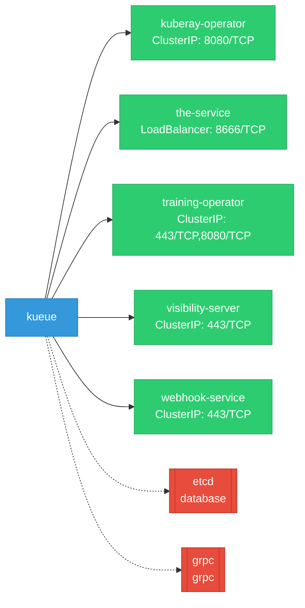

# kueue: Network

## Service Map

*5 unique services (16 total, duplicates from test fixtures collapsed).*

### Services

| Name | Type | Ports | Source |
|------|------|-------|--------|
| kuberay-operator | ClusterIP | 8080/TCP | [`.gomod-cache/github.com/ray-project/kuberay/ray-operator@v1.3.1/config/manager/service.yaml`](https://github.com/red-hat-data-services/kueue/blob/211e5019ceb7a5069b0a2965405f0bde8fa9ebc8/.gomod-cache/github.com/ray-project/kuberay/ray-operator@v1.3.1/config/manager/service.yaml) |
| kuberay-operator | ClusterIP | 8080/TCP | [`.gopath-loader/pkg/mod/github.com/ray-project/kuberay/ray-operator@v1.3.1/config/manager/service.yaml`](https://github.com/red-hat-data-services/kueue/blob/211e5019ceb7a5069b0a2965405f0bde8fa9ebc8/.gopath-loader/pkg/mod/github.com/ray-project/kuberay/ray-operator@v1.3.1/config/manager/service.yaml) |
| the-service | LoadBalancer | 8666/TCP | [`.gopath-loader/pkg/mod/k8s.io/cli-runtime@v0.32.3/artifacts/kustomization/service.yaml`](https://github.com/red-hat-data-services/kueue/blob/211e5019ceb7a5069b0a2965405f0bde8fa9ebc8/.gopath-loader/pkg/mod/k8s.io/cli-runtime@v0.32.3/artifacts/kustomization/service.yaml) |
| the-service | LoadBalancer | 8666/TCP | [`.gomod-cache/k8s.io/cli-runtime@v0.32.3/artifacts/kustomization/service.yaml`](https://github.com/red-hat-data-services/kueue/blob/211e5019ceb7a5069b0a2965405f0bde8fa9ebc8/.gomod-cache/k8s.io/cli-runtime@v0.32.3/artifacts/kustomization/service.yaml) |
| training-operator | ClusterIP | 8080/TCP, 443/TCP | [`.gopath-loader/pkg/mod/github.com/kubeflow/training-operator@v1.9.0/manifests/base/service.yaml`](https://github.com/red-hat-data-services/kueue/blob/211e5019ceb7a5069b0a2965405f0bde8fa9ebc8/.gopath-loader/pkg/mod/github.com/kubeflow/training-operator@v1.9.0/manifests/base/service.yaml) |
| training-operator | ClusterIP | 8080/TCP, 443/TCP | [`.gomod-cache/github.com/kubeflow/training-operator@v1.9.0/manifests/base/service.yaml`](https://github.com/red-hat-data-services/kueue/blob/211e5019ceb7a5069b0a2965405f0bde8fa9ebc8/.gomod-cache/github.com/kubeflow/training-operator@v1.9.0/manifests/base/service.yaml) |
| visibility-server | ClusterIP | 443/TCP | [`config/components/visibility/service.yaml`](https://github.com/red-hat-data-services/kueue/blob/211e5019ceb7a5069b0a2965405f0bde8fa9ebc8/config/components/visibility/service.yaml) |
| webhook-service | ClusterIP | 443/TCP | [`.gopath-loader/pkg/mod/github.com/project-codeflare/appwrapper@v1.1.0/config/webhook/service.yaml`](https://github.com/red-hat-data-services/kueue/blob/211e5019ceb7a5069b0a2965405f0bde8fa9ebc8/.gopath-loader/pkg/mod/github.com/project-codeflare/appwrapper@v1.1.0/config/webhook/service.yaml) |
| webhook-service | ClusterIP | 443/TCP | [`.gomod-cache/sigs.k8s.io/lws@v0.5.1/config/webhook/service.yaml`](https://github.com/red-hat-data-services/kueue/blob/211e5019ceb7a5069b0a2965405f0bde8fa9ebc8/.gomod-cache/sigs.k8s.io/lws@v0.5.1/config/webhook/service.yaml) |
| webhook-service | ClusterIP | 443/TCP | [`.gomod-cache/sigs.k8s.io/jobset@v0.8.0/config/components/webhook/service.yaml`](https://github.com/red-hat-data-services/kueue/blob/211e5019ceb7a5069b0a2965405f0bde8fa9ebc8/.gomod-cache/sigs.k8s.io/jobset@v0.8.0/config/components/webhook/service.yaml) |
| webhook-service | ClusterIP | 443/TCP | [`.gopath-loader/pkg/mod/github.com/ray-project/kuberay/ray-operator@v1.3.1/config/webhook/service.yaml`](https://github.com/red-hat-data-services/kueue/blob/211e5019ceb7a5069b0a2965405f0bde8fa9ebc8/.gopath-loader/pkg/mod/github.com/ray-project/kuberay/ray-operator@v1.3.1/config/webhook/service.yaml) |
| webhook-service | ClusterIP | 443/TCP | [`.gomod-cache/github.com/ray-project/kuberay/ray-operator@v1.3.1/config/webhook/service.yaml`](https://github.com/red-hat-data-services/kueue/blob/211e5019ceb7a5069b0a2965405f0bde8fa9ebc8/.gomod-cache/github.com/ray-project/kuberay/ray-operator@v1.3.1/config/webhook/service.yaml) |
| webhook-service | ClusterIP | 443/TCP | [`.gopath-loader/pkg/mod/sigs.k8s.io/jobset@v0.8.0/config/components/webhook/service.yaml`](https://github.com/red-hat-data-services/kueue/blob/211e5019ceb7a5069b0a2965405f0bde8fa9ebc8/.gopath-loader/pkg/mod/sigs.k8s.io/jobset@v0.8.0/config/components/webhook/service.yaml) |
| webhook-service | ClusterIP | 443/TCP | [`.gopath-loader/pkg/mod/sigs.k8s.io/lws@v0.5.1/config/webhook/service.yaml`](https://github.com/red-hat-data-services/kueue/blob/211e5019ceb7a5069b0a2965405f0bde8fa9ebc8/.gopath-loader/pkg/mod/sigs.k8s.io/lws@v0.5.1/config/webhook/service.yaml) |
| webhook-service | ClusterIP | 443/TCP | [`.gomod-cache/github.com/project-codeflare/appwrapper@v1.1.0/config/webhook/service.yaml`](https://github.com/red-hat-data-services/kueue/blob/211e5019ceb7a5069b0a2965405f0bde8fa9ebc8/.gomod-cache/github.com/project-codeflare/appwrapper@v1.1.0/config/webhook/service.yaml) |
| webhook-service | ClusterIP | 443/TCP | [`config/components/webhook/service.yaml`](https://github.com/red-hat-data-services/kueue/blob/211e5019ceb7a5069b0a2965405f0bde8fa9ebc8/config/components/webhook/service.yaml) |

### Ingress / Routing

| Kind | Name | Hosts | Paths | TLS | Source |
|------|------|-------|-------|-----|--------|
| Gateway | acmesolver |  |  | no | [`.gomod-cache/github.com/cert-manager/cert-manager@v1.17.1/make/config/projectcontour/gateway.yaml`](https://github.com/red-hat-data-services/kueue/blob/211e5019ceb7a5069b0a2965405f0bde8fa9ebc8/.gomod-cache/github.com/cert-manager/cert-manager@v1.17.1/make/config/projectcontour/gateway.yaml) |
| Gateway | acmesolver |  |  | no | [`.gopath-loader/pkg/mod/github.com/cert-manager/cert-manager@v1.17.1/make/config/projectcontour/gateway.yaml`](https://github.com/red-hat-data-services/kueue/blob/211e5019ceb7a5069b0a2965405f0bde8fa9ebc8/.gopath-loader/pkg/mod/github.com/cert-manager/cert-manager@v1.17.1/make/config/projectcontour/gateway.yaml) |

!!! warning "No Network Policies"
    No NetworkPolicy resources found. All pod-to-pod traffic is allowed by default.

