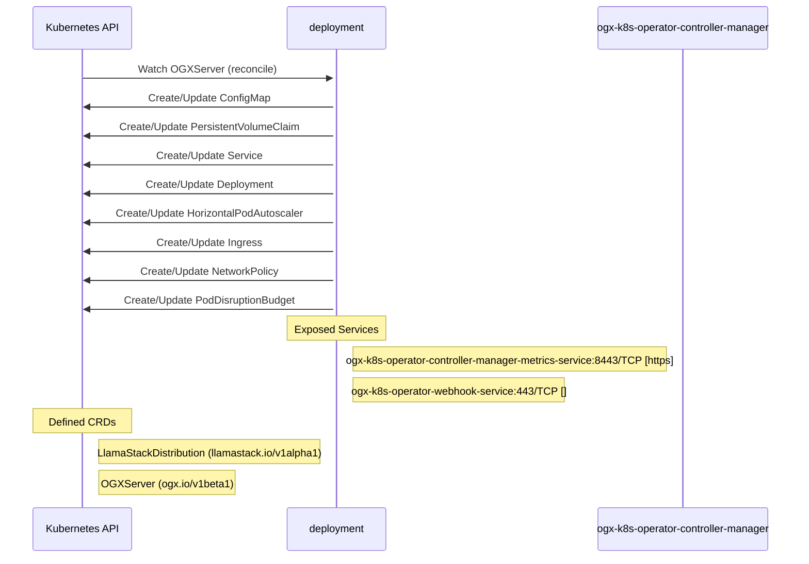

# llama-stack-k8s-operator: Dataflow

## Controller Watches

Kubernetes resources this controller monitors for changes. Each watch triggers reconciliation when the watched resource is created, updated, or deleted.

| Type | GVK | Source |
|------|-----|--------|
| For | api/v1beta1/OGXServer | [`controllers/ogxserver_controller.go:620`](https://github.com/ogx-ai/llama-stack-k8s-operator/blob/2a877300096a0fe4a7499cb9ddeb8c289ab94eb5/controllers/ogxserver_controller.go#L620) |
| Owns | /v1/ConfigMap | [`controllers/ogxserver_controller.go:627`](https://github.com/ogx-ai/llama-stack-k8s-operator/blob/2a877300096a0fe4a7499cb9ddeb8c289ab94eb5/controllers/ogxserver_controller.go#L627) |
| Owns | /v1/PersistentVolumeClaim | [`controllers/ogxserver_controller.go:635`](https://github.com/ogx-ai/llama-stack-k8s-operator/blob/2a877300096a0fe4a7499cb9ddeb8c289ab94eb5/controllers/ogxserver_controller.go#L635) |
| Owns | /v1/Service | [`controllers/ogxserver_controller.go:626`](https://github.com/ogx-ai/llama-stack-k8s-operator/blob/2a877300096a0fe4a7499cb9ddeb8c289ab94eb5/controllers/ogxserver_controller.go#L626) |
| Owns | apps/v1/Deployment | [`controllers/ogxserver_controller.go:623`](https://github.com/ogx-ai/llama-stack-k8s-operator/blob/2a877300096a0fe4a7499cb9ddeb8c289ab94eb5/controllers/ogxserver_controller.go#L623) |
| Owns | autoscaling/v2/HorizontalPodAutoscaler | [`controllers/ogxserver_controller.go:625`](https://github.com/ogx-ai/llama-stack-k8s-operator/blob/2a877300096a0fe4a7499cb9ddeb8c289ab94eb5/controllers/ogxserver_controller.go#L625) |
| Owns | networking.k8s.io/v1/Ingress | [`controllers/ogxserver_controller.go:634`](https://github.com/ogx-ai/llama-stack-k8s-operator/blob/2a877300096a0fe4a7499cb9ddeb8c289ab94eb5/controllers/ogxserver_controller.go#L634) |
| Owns | networking.k8s.io/v1/NetworkPolicy | [`controllers/ogxserver_controller.go:633`](https://github.com/ogx-ai/llama-stack-k8s-operator/blob/2a877300096a0fe4a7499cb9ddeb8c289ab94eb5/controllers/ogxserver_controller.go#L633) |
| Owns | policy/v1/PodDisruptionBudget | [`controllers/ogxserver_controller.go:624`](https://github.com/ogx-ai/llama-stack-k8s-operator/blob/2a877300096a0fe4a7499cb9ddeb8c289ab94eb5/controllers/ogxserver_controller.go#L624) |

### Programmatic Resource Operations

| Verb | Kind | Group | Condition |
|------|------|-------|----------|
| delete | ConfigMap |  |  |
| create | ConfigMap |  |  |
| patch | ConfigMap |  |  |

## Reconciliation Flow

How the controller interacts with the Kubernetes API during reconciliation.

### Webhooks

| Name | Type | Path | Failure Policy | Service | Overlays | Enable Condition | Sources |
|------|------|------|----------------|---------|----------|------------------|----------|
| vogxserver.kb.io | validating | /validate-ogx-io-v1beta1-ogxserver | Fail | opendatahub/ogx-k8s-operator-webhook-service | config/overlays/odh |  | [`config/webhook/manifests.yaml`](https://github.com/ogx-ai/llama-stack-k8s-operator/blob/2a877300096a0fe4a7499cb9ddeb8c289ab94eb5/config/webhook/manifests.yaml), [`kustomize:config/overlays/odh (ogx-k8s-operator-validating-webhook-configuration)`](https://github.com/ogx-ai/llama-stack-k8s-operator/blob/2a877300096a0fe4a7499cb9ddeb8c289ab94eb5/kustomize:config/overlays/odh (ogx-k8s-operator-validating-webhook-configuration)) |

### HTTP Endpoints

| Method | Path | Source |
|--------|------|--------|
| * | / | [`.gomod-cache/golang.org/toolchain@v0.0.1-go1.25.8.linux-amd64/src/net/http/triv.go:130`](https://github.com/ogx-ai/llama-stack-k8s-operator/blob/2a877300096a0fe4a7499cb9ddeb8c289ab94eb5/.gomod-cache/golang.org/toolchain@v0.0.1-go1.25.8.linux-amd64/src/net/http/triv.go#L130) |
| * | / | [`.gopath-loader/pkg/mod/golang.org/x/net@v0.41.0/webdav/litmus_test_server.go:83`](https://github.com/ogx-ai/llama-stack-k8s-operator/blob/2a877300096a0fe4a7499cb9ddeb8c289ab94eb5/.gopath-loader/pkg/mod/golang.org/x/net@v0.41.0/webdav/litmus_test_server.go#L83) |
| * | / | [`.gomod-cache/golang.org/toolchain@v0.0.1-go1.25.8.linux-amd64/src/cmd/trace/main.go:188`](https://github.com/ogx-ai/llama-stack-k8s-operator/blob/2a877300096a0fe4a7499cb9ddeb8c289ab94eb5/.gomod-cache/golang.org/toolchain@v0.0.1-go1.25.8.linux-amd64/src/cmd/trace/main.go#L188) |
| * | / | [`.gopath-loader/pkg/mod/golang.org/toolchain@v0.0.1-go1.25.8.linux-amd64/src/net/http/triv.go:130`](https://github.com/ogx-ai/llama-stack-k8s-operator/blob/2a877300096a0fe4a7499cb9ddeb8c289ab94eb5/.gopath-loader/pkg/mod/golang.org/toolchain@v0.0.1-go1.25.8.linux-amd64/src/net/http/triv.go#L130) |
| * | / | [`.gopath-loader/pkg/mod/golang.org/toolchain@v0.0.1-go1.25.8.linux-amd64/src/cmd/trace/main.go:188`](https://github.com/ogx-ai/llama-stack-k8s-operator/blob/2a877300096a0fe4a7499cb9ddeb8c289ab94eb5/.gopath-loader/pkg/mod/golang.org/toolchain@v0.0.1-go1.25.8.linux-amd64/src/cmd/trace/main.go#L188) |
| * | / | [`.gomod-cache/golang.org/x/net@v0.41.0/webdav/litmus_test_server.go:83`](https://github.com/ogx-ai/llama-stack-k8s-operator/blob/2a877300096a0fe4a7499cb9ddeb8c289ab94eb5/.gomod-cache/golang.org/x/net@v0.41.0/webdav/litmus_test_server.go#L83) |
| * | /args | [`.gopath-loader/pkg/mod/golang.org/toolchain@v0.0.1-go1.25.8.linux-amd64/src/net/http/triv.go:136`](https://github.com/ogx-ai/llama-stack-k8s-operator/blob/2a877300096a0fe4a7499cb9ddeb8c289ab94eb5/.gopath-loader/pkg/mod/golang.org/toolchain@v0.0.1-go1.25.8.linux-amd64/src/net/http/triv.go#L136) |
| * | /args | [`.gomod-cache/golang.org/toolchain@v0.0.1-go1.25.8.linux-amd64/src/net/http/triv.go:136`](https://github.com/ogx-ai/llama-stack-k8s-operator/blob/2a877300096a0fe4a7499cb9ddeb8c289ab94eb5/.gomod-cache/golang.org/toolchain@v0.0.1-go1.25.8.linux-amd64/src/net/http/triv.go#L136) |
| * | /bar | [`.gopath-loader/pkg/mod/golang.org/toolchain@v0.0.1-go1.25.8.linux-amd64/src/net/http/doc.go:67`](https://github.com/ogx-ai/llama-stack-k8s-operator/blob/2a877300096a0fe4a7499cb9ddeb8c289ab94eb5/.gopath-loader/pkg/mod/golang.org/toolchain@v0.0.1-go1.25.8.linux-amd64/src/net/http/doc.go#L67) |
| * | /bar | [`.gomod-cache/golang.org/toolchain@v0.0.1-go1.25.8.linux-amd64/src/net/http/doc.go:67`](https://github.com/ogx-ai/llama-stack-k8s-operator/blob/2a877300096a0fe4a7499cb9ddeb8c289ab94eb5/.gomod-cache/golang.org/toolchain@v0.0.1-go1.25.8.linux-amd64/src/net/http/doc.go#L67) |
| * | /block | [`.gomod-cache/golang.org/toolchain@v0.0.1-go1.25.8.linux-amd64/src/cmd/trace/main.go:210`](https://github.com/ogx-ai/llama-stack-k8s-operator/blob/2a877300096a0fe4a7499cb9ddeb8c289ab94eb5/.gomod-cache/golang.org/toolchain@v0.0.1-go1.25.8.linux-amd64/src/cmd/trace/main.go#L210) |
| * | /block | [`.gopath-loader/pkg/mod/golang.org/toolchain@v0.0.1-go1.25.8.linux-amd64/src/cmd/trace/main.go:210`](https://github.com/ogx-ai/llama-stack-k8s-operator/blob/2a877300096a0fe4a7499cb9ddeb8c289ab94eb5/.gopath-loader/pkg/mod/golang.org/toolchain@v0.0.1-go1.25.8.linux-amd64/src/cmd/trace/main.go#L210) |
| * | /chan | [`.gopath-loader/pkg/mod/golang.org/toolchain@v0.0.1-go1.25.8.linux-amd64/src/net/http/triv.go:134`](https://github.com/ogx-ai/llama-stack-k8s-operator/blob/2a877300096a0fe4a7499cb9ddeb8c289ab94eb5/.gopath-loader/pkg/mod/golang.org/toolchain@v0.0.1-go1.25.8.linux-amd64/src/net/http/triv.go#L134) |
| * | /chan | [`.gomod-cache/golang.org/toolchain@v0.0.1-go1.25.8.linux-amd64/src/net/http/triv.go:134`](https://github.com/ogx-ai/llama-stack-k8s-operator/blob/2a877300096a0fe4a7499cb9ddeb8c289ab94eb5/.gomod-cache/golang.org/toolchain@v0.0.1-go1.25.8.linux-amd64/src/net/http/triv.go#L134) |
| * | /counter | [`.gomod-cache/golang.org/toolchain@v0.0.1-go1.25.8.linux-amd64/src/net/http/triv.go:129`](https://github.com/ogx-ai/llama-stack-k8s-operator/blob/2a877300096a0fe4a7499cb9ddeb8c289ab94eb5/.gomod-cache/golang.org/toolchain@v0.0.1-go1.25.8.linux-amd64/src/net/http/triv.go#L129) |
| * | /counter | [`.gopath-loader/pkg/mod/golang.org/toolchain@v0.0.1-go1.25.8.linux-amd64/src/net/http/triv.go:129`](https://github.com/ogx-ai/llama-stack-k8s-operator/blob/2a877300096a0fe4a7499cb9ddeb8c289ab94eb5/.gopath-loader/pkg/mod/golang.org/toolchain@v0.0.1-go1.25.8.linux-amd64/src/net/http/triv.go#L129) |
| * | /date | [`.gomod-cache/golang.org/toolchain@v0.0.1-go1.25.8.linux-amd64/src/net/http/triv.go:138`](https://github.com/ogx-ai/llama-stack-k8s-operator/blob/2a877300096a0fe4a7499cb9ddeb8c289ab94eb5/.gomod-cache/golang.org/toolchain@v0.0.1-go1.25.8.linux-amd64/src/net/http/triv.go#L138) |
| * | /date | [`.gopath-loader/pkg/mod/golang.org/toolchain@v0.0.1-go1.25.8.linux-amd64/src/net/http/triv.go:138`](https://github.com/ogx-ai/llama-stack-k8s-operator/blob/2a877300096a0fe4a7499cb9ddeb8c289ab94eb5/.gopath-loader/pkg/mod/golang.org/toolchain@v0.0.1-go1.25.8.linux-amd64/src/net/http/triv.go#L138) |
| * | /debug/pprof/ | [`.gomod-cache/sigs.k8s.io/controller-runtime@v0.22.4/pkg/manager/internal.go:316`](https://github.com/ogx-ai/llama-stack-k8s-operator/blob/2a877300096a0fe4a7499cb9ddeb8c289ab94eb5/.gomod-cache/sigs.k8s.io/controller-runtime@v0.22.4/pkg/manager/internal.go#L316) |
| * | /debug/pprof/ | [`.gopath-loader/pkg/mod/sigs.k8s.io/controller-runtime@v0.22.4/pkg/manager/internal.go:316`](https://github.com/ogx-ai/llama-stack-k8s-operator/blob/2a877300096a0fe4a7499cb9ddeb8c289ab94eb5/.gopath-loader/pkg/mod/sigs.k8s.io/controller-runtime@v0.22.4/pkg/manager/internal.go#L316) |
| * | /debug/pprof/cmdline | [`.gopath-loader/pkg/mod/sigs.k8s.io/controller-runtime@v0.22.4/pkg/manager/internal.go:317`](https://github.com/ogx-ai/llama-stack-k8s-operator/blob/2a877300096a0fe4a7499cb9ddeb8c289ab94eb5/.gopath-loader/pkg/mod/sigs.k8s.io/controller-runtime@v0.22.4/pkg/manager/internal.go#L317) |
| * | /debug/pprof/cmdline | [`.gomod-cache/sigs.k8s.io/controller-runtime@v0.22.4/pkg/manager/internal.go:317`](https://github.com/ogx-ai/llama-stack-k8s-operator/blob/2a877300096a0fe4a7499cb9ddeb8c289ab94eb5/.gomod-cache/sigs.k8s.io/controller-runtime@v0.22.4/pkg/manager/internal.go#L317) |
| * | /debug/pprof/profile | [`.gomod-cache/sigs.k8s.io/controller-runtime@v0.22.4/pkg/manager/internal.go:318`](https://github.com/ogx-ai/llama-stack-k8s-operator/blob/2a877300096a0fe4a7499cb9ddeb8c289ab94eb5/.gomod-cache/sigs.k8s.io/controller-runtime@v0.22.4/pkg/manager/internal.go#L318) |
| * | /debug/pprof/profile | [`.gopath-loader/pkg/mod/sigs.k8s.io/controller-runtime@v0.22.4/pkg/manager/internal.go:318`](https://github.com/ogx-ai/llama-stack-k8s-operator/blob/2a877300096a0fe4a7499cb9ddeb8c289ab94eb5/.gopath-loader/pkg/mod/sigs.k8s.io/controller-runtime@v0.22.4/pkg/manager/internal.go#L318) |
| * | /debug/pprof/symbol | [`.gopath-loader/pkg/mod/sigs.k8s.io/controller-runtime@v0.22.4/pkg/manager/internal.go:319`](https://github.com/ogx-ai/llama-stack-k8s-operator/blob/2a877300096a0fe4a7499cb9ddeb8c289ab94eb5/.gopath-loader/pkg/mod/sigs.k8s.io/controller-runtime@v0.22.4/pkg/manager/internal.go#L319) |
| * | /debug/pprof/symbol | [`.gomod-cache/sigs.k8s.io/controller-runtime@v0.22.4/pkg/manager/internal.go:319`](https://github.com/ogx-ai/llama-stack-k8s-operator/blob/2a877300096a0fe4a7499cb9ddeb8c289ab94eb5/.gomod-cache/sigs.k8s.io/controller-runtime@v0.22.4/pkg/manager/internal.go#L319) |
| * | /debug/pprof/trace | [`.gomod-cache/sigs.k8s.io/controller-runtime@v0.22.4/pkg/manager/internal.go:320`](https://github.com/ogx-ai/llama-stack-k8s-operator/blob/2a877300096a0fe4a7499cb9ddeb8c289ab94eb5/.gomod-cache/sigs.k8s.io/controller-runtime@v0.22.4/pkg/manager/internal.go#L320) |
| * | /debug/pprof/trace | [`.gopath-loader/pkg/mod/sigs.k8s.io/controller-runtime@v0.22.4/pkg/manager/internal.go:320`](https://github.com/ogx-ai/llama-stack-k8s-operator/blob/2a877300096a0fe4a7499cb9ddeb8c289ab94eb5/.gopath-loader/pkg/mod/sigs.k8s.io/controller-runtime@v0.22.4/pkg/manager/internal.go#L320) |
| * | /debug/vars | [`.gopath-loader/pkg/mod/golang.org/toolchain@v0.0.1-go1.25.8.linux-amd64/src/expvar/expvar.go:382`](https://github.com/ogx-ai/llama-stack-k8s-operator/blob/2a877300096a0fe4a7499cb9ddeb8c289ab94eb5/.gopath-loader/pkg/mod/golang.org/toolchain@v0.0.1-go1.25.8.linux-amd64/src/expvar/expvar.go#L382) |
| * | /debug/vars | [`.gomod-cache/golang.org/toolchain@v0.0.1-go1.25.8.linux-amd64/src/expvar/expvar.go:382`](https://github.com/ogx-ai/llama-stack-k8s-operator/blob/2a877300096a0fe4a7499cb9ddeb8c289ab94eb5/.gomod-cache/golang.org/toolchain@v0.0.1-go1.25.8.linux-amd64/src/expvar/expvar.go#L382) |
| * | /flags | [`.gopath-loader/pkg/mod/golang.org/toolchain@v0.0.1-go1.25.8.linux-amd64/src/net/http/triv.go:135`](https://github.com/ogx-ai/llama-stack-k8s-operator/blob/2a877300096a0fe4a7499cb9ddeb8c289ab94eb5/.gopath-loader/pkg/mod/golang.org/toolchain@v0.0.1-go1.25.8.linux-amd64/src/net/http/triv.go#L135) |
| * | /flags | [`.gomod-cache/golang.org/toolchain@v0.0.1-go1.25.8.linux-amd64/src/net/http/triv.go:135`](https://github.com/ogx-ai/llama-stack-k8s-operator/blob/2a877300096a0fe4a7499cb9ddeb8c289ab94eb5/.gomod-cache/golang.org/toolchain@v0.0.1-go1.25.8.linux-amd64/src/net/http/triv.go#L135) |
| * | /foo | [`.gopath-loader/pkg/mod/golang.org/toolchain@v0.0.1-go1.25.8.linux-amd64/src/net/http/doc.go:65`](https://github.com/ogx-ai/llama-stack-k8s-operator/blob/2a877300096a0fe4a7499cb9ddeb8c289ab94eb5/.gopath-loader/pkg/mod/golang.org/toolchain@v0.0.1-go1.25.8.linux-amd64/src/net/http/doc.go#L65) |
| * | /foo | [`.gomod-cache/golang.org/toolchain@v0.0.1-go1.25.8.linux-amd64/src/net/http/doc.go:65`](https://github.com/ogx-ai/llama-stack-k8s-operator/blob/2a877300096a0fe4a7499cb9ddeb8c289ab94eb5/.gomod-cache/golang.org/toolchain@v0.0.1-go1.25.8.linux-amd64/src/net/http/doc.go#L65) |
| * | /go/ | [`.gomod-cache/golang.org/toolchain@v0.0.1-go1.25.8.linux-amd64/src/net/http/triv.go:132`](https://github.com/ogx-ai/llama-stack-k8s-operator/blob/2a877300096a0fe4a7499cb9ddeb8c289ab94eb5/.gomod-cache/golang.org/toolchain@v0.0.1-go1.25.8.linux-amd64/src/net/http/triv.go#L132) |
| * | /go/ | [`.gopath-loader/pkg/mod/golang.org/toolchain@v0.0.1-go1.25.8.linux-amd64/src/net/http/triv.go:132`](https://github.com/ogx-ai/llama-stack-k8s-operator/blob/2a877300096a0fe4a7499cb9ddeb8c289ab94eb5/.gopath-loader/pkg/mod/golang.org/toolchain@v0.0.1-go1.25.8.linux-amd64/src/net/http/triv.go#L132) |
| * | /go/hello | [`.gomod-cache/golang.org/toolchain@v0.0.1-go1.25.8.linux-amd64/src/net/http/triv.go:137`](https://github.com/ogx-ai/llama-stack-k8s-operator/blob/2a877300096a0fe4a7499cb9ddeb8c289ab94eb5/.gomod-cache/golang.org/toolchain@v0.0.1-go1.25.8.linux-amd64/src/net/http/triv.go#L137) |
| * | /go/hello | [`.gopath-loader/pkg/mod/golang.org/toolchain@v0.0.1-go1.25.8.linux-amd64/src/net/http/triv.go:137`](https://github.com/ogx-ai/llama-stack-k8s-operator/blob/2a877300096a0fe4a7499cb9ddeb8c289ab94eb5/.gopath-loader/pkg/mod/golang.org/toolchain@v0.0.1-go1.25.8.linux-amd64/src/net/http/triv.go#L137) |
| * | /goroutine | [`.gopath-loader/pkg/mod/golang.org/toolchain@v0.0.1-go1.25.8.linux-amd64/src/cmd/trace/main.go:203`](https://github.com/ogx-ai/llama-stack-k8s-operator/blob/2a877300096a0fe4a7499cb9ddeb8c289ab94eb5/.gopath-loader/pkg/mod/golang.org/toolchain@v0.0.1-go1.25.8.linux-amd64/src/cmd/trace/main.go#L203) |
| * | /goroutine | [`.gomod-cache/golang.org/toolchain@v0.0.1-go1.25.8.linux-amd64/src/cmd/trace/main.go:203`](https://github.com/ogx-ai/llama-stack-k8s-operator/blob/2a877300096a0fe4a7499cb9ddeb8c289ab94eb5/.gomod-cache/golang.org/toolchain@v0.0.1-go1.25.8.linux-amd64/src/cmd/trace/main.go#L203) |
| * | /goroutines | [`.gopath-loader/pkg/mod/golang.org/toolchain@v0.0.1-go1.25.8.linux-amd64/src/cmd/trace/main.go:202`](https://github.com/ogx-ai/llama-stack-k8s-operator/blob/2a877300096a0fe4a7499cb9ddeb8c289ab94eb5/.gopath-loader/pkg/mod/golang.org/toolchain@v0.0.1-go1.25.8.linux-amd64/src/cmd/trace/main.go#L202) |
| * | /goroutines | [`.gomod-cache/golang.org/toolchain@v0.0.1-go1.25.8.linux-amd64/src/cmd/trace/main.go:202`](https://github.com/ogx-ai/llama-stack-k8s-operator/blob/2a877300096a0fe4a7499cb9ddeb8c289ab94eb5/.gomod-cache/golang.org/toolchain@v0.0.1-go1.25.8.linux-amd64/src/cmd/trace/main.go#L202) |
| * | /io | [`.gopath-loader/pkg/mod/golang.org/toolchain@v0.0.1-go1.25.8.linux-amd64/src/cmd/trace/main.go:209`](https://github.com/ogx-ai/llama-stack-k8s-operator/blob/2a877300096a0fe4a7499cb9ddeb8c289ab94eb5/.gopath-loader/pkg/mod/golang.org/toolchain@v0.0.1-go1.25.8.linux-amd64/src/cmd/trace/main.go#L209) |
| * | /io | [`.gomod-cache/golang.org/toolchain@v0.0.1-go1.25.8.linux-amd64/src/cmd/trace/main.go:209`](https://github.com/ogx-ai/llama-stack-k8s-operator/blob/2a877300096a0fe4a7499cb9ddeb8c289ab94eb5/.gomod-cache/golang.org/toolchain@v0.0.1-go1.25.8.linux-amd64/src/cmd/trace/main.go#L209) |
| * | /jsontrace | [`.gomod-cache/golang.org/toolchain@v0.0.1-go1.25.8.linux-amd64/src/cmd/trace/main.go:198`](https://github.com/ogx-ai/llama-stack-k8s-operator/blob/2a877300096a0fe4a7499cb9ddeb8c289ab94eb5/.gomod-cache/golang.org/toolchain@v0.0.1-go1.25.8.linux-amd64/src/cmd/trace/main.go#L198) |
| * | /jsontrace | [`.gopath-loader/pkg/mod/golang.org/toolchain@v0.0.1-go1.25.8.linux-amd64/src/cmd/trace/main.go:198`](https://github.com/ogx-ai/llama-stack-k8s-operator/blob/2a877300096a0fe4a7499cb9ddeb8c289ab94eb5/.gopath-loader/pkg/mod/golang.org/toolchain@v0.0.1-go1.25.8.linux-amd64/src/cmd/trace/main.go#L198) |
| * | /mmu | [`.gopath-loader/pkg/mod/golang.org/toolchain@v0.0.1-go1.25.8.linux-amd64/src/cmd/trace/main.go:206`](https://github.com/ogx-ai/llama-stack-k8s-operator/blob/2a877300096a0fe4a7499cb9ddeb8c289ab94eb5/.gopath-loader/pkg/mod/golang.org/toolchain@v0.0.1-go1.25.8.linux-amd64/src/cmd/trace/main.go#L206) |
| * | /mmu | [`.gomod-cache/golang.org/toolchain@v0.0.1-go1.25.8.linux-amd64/src/cmd/trace/main.go:206`](https://github.com/ogx-ai/llama-stack-k8s-operator/blob/2a877300096a0fe4a7499cb9ddeb8c289ab94eb5/.gomod-cache/golang.org/toolchain@v0.0.1-go1.25.8.linux-amd64/src/cmd/trace/main.go#L206) |
| * | /regionblock | [`.gomod-cache/golang.org/toolchain@v0.0.1-go1.25.8.linux-amd64/src/cmd/trace/main.go:216`](https://github.com/ogx-ai/llama-stack-k8s-operator/blob/2a877300096a0fe4a7499cb9ddeb8c289ab94eb5/.gomod-cache/golang.org/toolchain@v0.0.1-go1.25.8.linux-amd64/src/cmd/trace/main.go#L216) |
| * | /regionblock | [`.gopath-loader/pkg/mod/golang.org/toolchain@v0.0.1-go1.25.8.linux-amd64/src/cmd/trace/main.go:216`](https://github.com/ogx-ai/llama-stack-k8s-operator/blob/2a877300096a0fe4a7499cb9ddeb8c289ab94eb5/.gopath-loader/pkg/mod/golang.org/toolchain@v0.0.1-go1.25.8.linux-amd64/src/cmd/trace/main.go#L216) |
| * | /regionio | [`.gopath-loader/pkg/mod/golang.org/toolchain@v0.0.1-go1.25.8.linux-amd64/src/cmd/trace/main.go:215`](https://github.com/ogx-ai/llama-stack-k8s-operator/blob/2a877300096a0fe4a7499cb9ddeb8c289ab94eb5/.gopath-loader/pkg/mod/golang.org/toolchain@v0.0.1-go1.25.8.linux-amd64/src/cmd/trace/main.go#L215) |
| * | /regionio | [`.gomod-cache/golang.org/toolchain@v0.0.1-go1.25.8.linux-amd64/src/cmd/trace/main.go:215`](https://github.com/ogx-ai/llama-stack-k8s-operator/blob/2a877300096a0fe4a7499cb9ddeb8c289ab94eb5/.gomod-cache/golang.org/toolchain@v0.0.1-go1.25.8.linux-amd64/src/cmd/trace/main.go#L215) |
| * | /regionsched | [`.gomod-cache/golang.org/toolchain@v0.0.1-go1.25.8.linux-amd64/src/cmd/trace/main.go:218`](https://github.com/ogx-ai/llama-stack-k8s-operator/blob/2a877300096a0fe4a7499cb9ddeb8c289ab94eb5/.gomod-cache/golang.org/toolchain@v0.0.1-go1.25.8.linux-amd64/src/cmd/trace/main.go#L218) |
| * | /regionsched | [`.gopath-loader/pkg/mod/golang.org/toolchain@v0.0.1-go1.25.8.linux-amd64/src/cmd/trace/main.go:218`](https://github.com/ogx-ai/llama-stack-k8s-operator/blob/2a877300096a0fe4a7499cb9ddeb8c289ab94eb5/.gopath-loader/pkg/mod/golang.org/toolchain@v0.0.1-go1.25.8.linux-amd64/src/cmd/trace/main.go#L218) |
| * | /regionsyscall | [`.gomod-cache/golang.org/toolchain@v0.0.1-go1.25.8.linux-amd64/src/cmd/trace/main.go:217`](https://github.com/ogx-ai/llama-stack-k8s-operator/blob/2a877300096a0fe4a7499cb9ddeb8c289ab94eb5/.gomod-cache/golang.org/toolchain@v0.0.1-go1.25.8.linux-amd64/src/cmd/trace/main.go#L217) |
| * | /regionsyscall | [`.gopath-loader/pkg/mod/golang.org/toolchain@v0.0.1-go1.25.8.linux-amd64/src/cmd/trace/main.go:217`](https://github.com/ogx-ai/llama-stack-k8s-operator/blob/2a877300096a0fe4a7499cb9ddeb8c289ab94eb5/.gopath-loader/pkg/mod/golang.org/toolchain@v0.0.1-go1.25.8.linux-amd64/src/cmd/trace/main.go#L217) |
| * | /sched | [`.gopath-loader/pkg/mod/golang.org/toolchain@v0.0.1-go1.25.8.linux-amd64/src/cmd/trace/main.go:212`](https://github.com/ogx-ai/llama-stack-k8s-operator/blob/2a877300096a0fe4a7499cb9ddeb8c289ab94eb5/.gopath-loader/pkg/mod/golang.org/toolchain@v0.0.1-go1.25.8.linux-amd64/src/cmd/trace/main.go#L212) |
| * | /sched | [`.gomod-cache/golang.org/toolchain@v0.0.1-go1.25.8.linux-amd64/src/cmd/trace/main.go:212`](https://github.com/ogx-ai/llama-stack-k8s-operator/blob/2a877300096a0fe4a7499cb9ddeb8c289ab94eb5/.gomod-cache/golang.org/toolchain@v0.0.1-go1.25.8.linux-amd64/src/cmd/trace/main.go#L212) |
| * | /static/ | [`.gomod-cache/golang.org/toolchain@v0.0.1-go1.25.8.linux-amd64/src/cmd/trace/main.go:199`](https://github.com/ogx-ai/llama-stack-k8s-operator/blob/2a877300096a0fe4a7499cb9ddeb8c289ab94eb5/.gomod-cache/golang.org/toolchain@v0.0.1-go1.25.8.linux-amd64/src/cmd/trace/main.go#L199) |
| * | /static/ | [`.gopath-loader/pkg/mod/golang.org/toolchain@v0.0.1-go1.25.8.linux-amd64/src/cmd/trace/main.go:199`](https://github.com/ogx-ai/llama-stack-k8s-operator/blob/2a877300096a0fe4a7499cb9ddeb8c289ab94eb5/.gopath-loader/pkg/mod/golang.org/toolchain@v0.0.1-go1.25.8.linux-amd64/src/cmd/trace/main.go#L199) |
| * | /syscall | [`.gopath-loader/pkg/mod/golang.org/toolchain@v0.0.1-go1.25.8.linux-amd64/src/cmd/trace/main.go:211`](https://github.com/ogx-ai/llama-stack-k8s-operator/blob/2a877300096a0fe4a7499cb9ddeb8c289ab94eb5/.gopath-loader/pkg/mod/golang.org/toolchain@v0.0.1-go1.25.8.linux-amd64/src/cmd/trace/main.go#L211) |
| * | /syscall | [`.gomod-cache/golang.org/toolchain@v0.0.1-go1.25.8.linux-amd64/src/cmd/trace/main.go:211`](https://github.com/ogx-ai/llama-stack-k8s-operator/blob/2a877300096a0fe4a7499cb9ddeb8c289ab94eb5/.gomod-cache/golang.org/toolchain@v0.0.1-go1.25.8.linux-amd64/src/cmd/trace/main.go#L211) |
| * | /trace | [`.gopath-loader/pkg/mod/golang.org/toolchain@v0.0.1-go1.25.8.linux-amd64/src/cmd/trace/main.go:197`](https://github.com/ogx-ai/llama-stack-k8s-operator/blob/2a877300096a0fe4a7499cb9ddeb8c289ab94eb5/.gopath-loader/pkg/mod/golang.org/toolchain@v0.0.1-go1.25.8.linux-amd64/src/cmd/trace/main.go#L197) |
| * | /trace | [`.gomod-cache/golang.org/toolchain@v0.0.1-go1.25.8.linux-amd64/src/cmd/trace/main.go:197`](https://github.com/ogx-ai/llama-stack-k8s-operator/blob/2a877300096a0fe4a7499cb9ddeb8c289ab94eb5/.gomod-cache/golang.org/toolchain@v0.0.1-go1.25.8.linux-amd64/src/cmd/trace/main.go#L197) |
| * | /userregion | [`.gomod-cache/golang.org/toolchain@v0.0.1-go1.25.8.linux-amd64/src/cmd/trace/main.go:222`](https://github.com/ogx-ai/llama-stack-k8s-operator/blob/2a877300096a0fe4a7499cb9ddeb8c289ab94eb5/.gomod-cache/golang.org/toolchain@v0.0.1-go1.25.8.linux-amd64/src/cmd/trace/main.go#L222) |
| * | /userregion | [`.gopath-loader/pkg/mod/golang.org/toolchain@v0.0.1-go1.25.8.linux-amd64/src/cmd/trace/main.go:222`](https://github.com/ogx-ai/llama-stack-k8s-operator/blob/2a877300096a0fe4a7499cb9ddeb8c289ab94eb5/.gopath-loader/pkg/mod/golang.org/toolchain@v0.0.1-go1.25.8.linux-amd64/src/cmd/trace/main.go#L222) |
| * | /userregions | [`.gomod-cache/golang.org/toolchain@v0.0.1-go1.25.8.linux-amd64/src/cmd/trace/main.go:221`](https://github.com/ogx-ai/llama-stack-k8s-operator/blob/2a877300096a0fe4a7499cb9ddeb8c289ab94eb5/.gomod-cache/golang.org/toolchain@v0.0.1-go1.25.8.linux-amd64/src/cmd/trace/main.go#L221) |
| * | /userregions | [`.gopath-loader/pkg/mod/golang.org/toolchain@v0.0.1-go1.25.8.linux-amd64/src/cmd/trace/main.go:221`](https://github.com/ogx-ai/llama-stack-k8s-operator/blob/2a877300096a0fe4a7499cb9ddeb8c289ab94eb5/.gopath-loader/pkg/mod/golang.org/toolchain@v0.0.1-go1.25.8.linux-amd64/src/cmd/trace/main.go#L221) |
| * | /usertask | [`.gopath-loader/pkg/mod/golang.org/toolchain@v0.0.1-go1.25.8.linux-amd64/src/cmd/trace/main.go:226`](https://github.com/ogx-ai/llama-stack-k8s-operator/blob/2a877300096a0fe4a7499cb9ddeb8c289ab94eb5/.gopath-loader/pkg/mod/golang.org/toolchain@v0.0.1-go1.25.8.linux-amd64/src/cmd/trace/main.go#L226) |
| * | /usertask | [`.gomod-cache/golang.org/toolchain@v0.0.1-go1.25.8.linux-amd64/src/cmd/trace/main.go:226`](https://github.com/ogx-ai/llama-stack-k8s-operator/blob/2a877300096a0fe4a7499cb9ddeb8c289ab94eb5/.gomod-cache/golang.org/toolchain@v0.0.1-go1.25.8.linux-amd64/src/cmd/trace/main.go#L226) |
| * | /usertasks | [`.gopath-loader/pkg/mod/golang.org/toolchain@v0.0.1-go1.25.8.linux-amd64/src/cmd/trace/main.go:225`](https://github.com/ogx-ai/llama-stack-k8s-operator/blob/2a877300096a0fe4a7499cb9ddeb8c289ab94eb5/.gopath-loader/pkg/mod/golang.org/toolchain@v0.0.1-go1.25.8.linux-amd64/src/cmd/trace/main.go#L225) |
| * | /usertasks | [`.gomod-cache/golang.org/toolchain@v0.0.1-go1.25.8.linux-amd64/src/cmd/trace/main.go:225`](https://github.com/ogx-ai/llama-stack-k8s-operator/blob/2a877300096a0fe4a7499cb9ddeb8c289ab94eb5/.gomod-cache/golang.org/toolchain@v0.0.1-go1.25.8.linux-amd64/src/cmd/trace/main.go#L225) |
| GET | /{user-id} | [`.gomod-cache/github.com/emicklei/go-restful/v3@v3.12.2/doc.go:83`](https://github.com/ogx-ai/llama-stack-k8s-operator/blob/2a877300096a0fe4a7499cb9ddeb8c289ab94eb5/.gomod-cache/github.com/emicklei/go-restful/v3@v3.12.2/doc.go#L83) |
| GET | /{user-id} | [`.gopath-loader/pkg/mod/github.com/emicklei/go-restful/v3@v3.12.2/doc.go:83`](https://github.com/ogx-ai/llama-stack-k8s-operator/blob/2a877300096a0fe4a7499cb9ddeb8c289ab94eb5/.gopath-loader/pkg/mod/github.com/emicklei/go-restful/v3@v3.12.2/doc.go#L83) |
| GET | /{user-id} | [`.gopath-loader/pkg/mod/github.com/emicklei/go-restful/v3@v3.12.2/doc.go:19`](https://github.com/ogx-ai/llama-stack-k8s-operator/blob/2a877300096a0fe4a7499cb9ddeb8c289ab94eb5/.gopath-loader/pkg/mod/github.com/emicklei/go-restful/v3@v3.12.2/doc.go#L19) |
| GET | /{user-id} | [`.gomod-cache/github.com/emicklei/go-restful/v3@v3.12.2/doc.go:19`](https://github.com/ogx-ai/llama-stack-k8s-operator/blob/2a877300096a0fe4a7499cb9ddeb8c289ab94eb5/.gomod-cache/github.com/emicklei/go-restful/v3@v3.12.2/doc.go#L19) |
| * | G | [`.gomod-cache/golang.org/toolchain@v0.0.1-go1.25.8.linux-amd64/src/testing/slogtest/slogtest.go:97`](https://github.com/ogx-ai/llama-stack-k8s-operator/blob/2a877300096a0fe4a7499cb9ddeb8c289ab94eb5/.gomod-cache/golang.org/toolchain@v0.0.1-go1.25.8.linux-amd64/src/testing/slogtest/slogtest.go#L97) |
| * | G | [`.gopath-loader/pkg/mod/golang.org/toolchain@v0.0.1-go1.25.8.linux-amd64/src/testing/slogtest/slogtest.go:225`](https://github.com/ogx-ai/llama-stack-k8s-operator/blob/2a877300096a0fe4a7499cb9ddeb8c289ab94eb5/.gopath-loader/pkg/mod/golang.org/toolchain@v0.0.1-go1.25.8.linux-amd64/src/testing/slogtest/slogtest.go#L225) |
| * | G | [`.gopath-loader/pkg/mod/golang.org/toolchain@v0.0.1-go1.25.8.linux-amd64/src/testing/slogtest/slogtest.go:203`](https://github.com/ogx-ai/llama-stack-k8s-operator/blob/2a877300096a0fe4a7499cb9ddeb8c289ab94eb5/.gopath-loader/pkg/mod/golang.org/toolchain@v0.0.1-go1.25.8.linux-amd64/src/testing/slogtest/slogtest.go#L203) |
| * | G | [`.gopath-loader/pkg/mod/golang.org/toolchain@v0.0.1-go1.25.8.linux-amd64/src/testing/slogtest/slogtest.go:109`](https://github.com/ogx-ai/llama-stack-k8s-operator/blob/2a877300096a0fe4a7499cb9ddeb8c289ab94eb5/.gopath-loader/pkg/mod/golang.org/toolchain@v0.0.1-go1.25.8.linux-amd64/src/testing/slogtest/slogtest.go#L109) |
| * | G | [`.gopath-loader/pkg/mod/golang.org/toolchain@v0.0.1-go1.25.8.linux-amd64/src/testing/slogtest/slogtest.go:97`](https://github.com/ogx-ai/llama-stack-k8s-operator/blob/2a877300096a0fe4a7499cb9ddeb8c289ab94eb5/.gopath-loader/pkg/mod/golang.org/toolchain@v0.0.1-go1.25.8.linux-amd64/src/testing/slogtest/slogtest.go#L97) |
| * | G | [`.gomod-cache/golang.org/toolchain@v0.0.1-go1.25.8.linux-amd64/src/testing/slogtest/slogtest.go:225`](https://github.com/ogx-ai/llama-stack-k8s-operator/blob/2a877300096a0fe4a7499cb9ddeb8c289ab94eb5/.gomod-cache/golang.org/toolchain@v0.0.1-go1.25.8.linux-amd64/src/testing/slogtest/slogtest.go#L225) |
| * | G | [`.gomod-cache/golang.org/toolchain@v0.0.1-go1.25.8.linux-amd64/src/testing/slogtest/slogtest.go:109`](https://github.com/ogx-ai/llama-stack-k8s-operator/blob/2a877300096a0fe4a7499cb9ddeb8c289ab94eb5/.gomod-cache/golang.org/toolchain@v0.0.1-go1.25.8.linux-amd64/src/testing/slogtest/slogtest.go#L109) |
| * | G | [`.gomod-cache/golang.org/toolchain@v0.0.1-go1.25.8.linux-amd64/src/testing/slogtest/slogtest.go:203`](https://github.com/ogx-ai/llama-stack-k8s-operator/blob/2a877300096a0fe4a7499cb9ddeb8c289ab94eb5/.gomod-cache/golang.org/toolchain@v0.0.1-go1.25.8.linux-amd64/src/testing/slogtest/slogtest.go#L203) |
| * | GET /debug/vars | [`.gopath-loader/pkg/mod/golang.org/toolchain@v0.0.1-go1.25.8.linux-amd64/src/expvar/expvar.go:384`](https://github.com/ogx-ai/llama-stack-k8s-operator/blob/2a877300096a0fe4a7499cb9ddeb8c289ab94eb5/.gopath-loader/pkg/mod/golang.org/toolchain@v0.0.1-go1.25.8.linux-amd64/src/expvar/expvar.go#L384) |
| * | GET /debug/vars | [`.gomod-cache/golang.org/toolchain@v0.0.1-go1.25.8.linux-amd64/src/expvar/expvar.go:384`](https://github.com/ogx-ai/llama-stack-k8s-operator/blob/2a877300096a0fe4a7499cb9ddeb8c289ab94eb5/.gomod-cache/golang.org/toolchain@v0.0.1-go1.25.8.linux-amd64/src/expvar/expvar.go#L384) |
| * | header | [`.gomod-cache/golang.org/x/net@v0.41.0/quic/qlog.go:267`](https://github.com/ogx-ai/llama-stack-k8s-operator/blob/2a877300096a0fe4a7499cb9ddeb8c289ab94eb5/.gomod-cache/golang.org/x/net@v0.41.0/quic/qlog.go#L267) |
| * | header | [`.gomod-cache/golang.org/x/net@v0.41.0/quic/qlog.go:211`](https://github.com/ogx-ai/llama-stack-k8s-operator/blob/2a877300096a0fe4a7499cb9ddeb8c289ab94eb5/.gomod-cache/golang.org/x/net@v0.41.0/quic/qlog.go#L211) |
| * | header | [`.gomod-cache/golang.org/x/net@v0.41.0/quic/qlog.go:187`](https://github.com/ogx-ai/llama-stack-k8s-operator/blob/2a877300096a0fe4a7499cb9ddeb8c289ab94eb5/.gomod-cache/golang.org/x/net@v0.41.0/quic/qlog.go#L187) |
| * | header | [`.gomod-cache/golang.org/x/net@v0.41.0/quic/qlog.go:165`](https://github.com/ogx-ai/llama-stack-k8s-operator/blob/2a877300096a0fe4a7499cb9ddeb8c289ab94eb5/.gomod-cache/golang.org/x/net@v0.41.0/quic/qlog.go#L165) |
| * | header | [`.gopath-loader/pkg/mod/golang.org/x/net@v0.41.0/quic/qlog.go:267`](https://github.com/ogx-ai/llama-stack-k8s-operator/blob/2a877300096a0fe4a7499cb9ddeb8c289ab94eb5/.gopath-loader/pkg/mod/golang.org/x/net@v0.41.0/quic/qlog.go#L267) |
| * | header | [`.gopath-loader/pkg/mod/golang.org/x/net@v0.41.0/quic/qlog.go:165`](https://github.com/ogx-ai/llama-stack-k8s-operator/blob/2a877300096a0fe4a7499cb9ddeb8c289ab94eb5/.gopath-loader/pkg/mod/golang.org/x/net@v0.41.0/quic/qlog.go#L165) |
| * | header | [`.gopath-loader/pkg/mod/golang.org/x/net@v0.41.0/quic/qlog.go:211`](https://github.com/ogx-ai/llama-stack-k8s-operator/blob/2a877300096a0fe4a7499cb9ddeb8c289ab94eb5/.gopath-loader/pkg/mod/golang.org/x/net@v0.41.0/quic/qlog.go#L211) |
| * | header | [`.gopath-loader/pkg/mod/golang.org/x/net@v0.41.0/quic/qlog.go:187`](https://github.com/ogx-ai/llama-stack-k8s-operator/blob/2a877300096a0fe4a7499cb9ddeb8c289ab94eb5/.gopath-loader/pkg/mod/golang.org/x/net@v0.41.0/quic/qlog.go#L187) |
| * | raw | [`.gopath-loader/pkg/mod/golang.org/x/net@v0.41.0/quic/qlog.go:193`](https://github.com/ogx-ai/llama-stack-k8s-operator/blob/2a877300096a0fe4a7499cb9ddeb8c289ab94eb5/.gopath-loader/pkg/mod/golang.org/x/net@v0.41.0/quic/qlog.go#L193) |
| * | raw | [`.gopath-loader/pkg/mod/golang.org/x/net@v0.41.0/quic/qlog.go:172`](https://github.com/ogx-ai/llama-stack-k8s-operator/blob/2a877300096a0fe4a7499cb9ddeb8c289ab94eb5/.gopath-loader/pkg/mod/golang.org/x/net@v0.41.0/quic/qlog.go#L172) |
| * | raw | [`.gopath-loader/pkg/mod/golang.org/x/net@v0.41.0/quic/qlog.go:217`](https://github.com/ogx-ai/llama-stack-k8s-operator/blob/2a877300096a0fe4a7499cb9ddeb8c289ab94eb5/.gopath-loader/pkg/mod/golang.org/x/net@v0.41.0/quic/qlog.go#L217) |
| * | raw | [`.gomod-cache/golang.org/x/net@v0.41.0/quic/qlog.go:172`](https://github.com/ogx-ai/llama-stack-k8s-operator/blob/2a877300096a0fe4a7499cb9ddeb8c289ab94eb5/.gomod-cache/golang.org/x/net@v0.41.0/quic/qlog.go#L172) |
| * | raw | [`.gomod-cache/golang.org/x/net@v0.41.0/quic/qlog.go:193`](https://github.com/ogx-ai/llama-stack-k8s-operator/blob/2a877300096a0fe4a7499cb9ddeb8c289ab94eb5/.gomod-cache/golang.org/x/net@v0.41.0/quic/qlog.go#L193) |
| * | raw | [`.gomod-cache/golang.org/x/net@v0.41.0/quic/qlog.go:217`](https://github.com/ogx-ai/llama-stack-k8s-operator/blob/2a877300096a0fe4a7499cb9ddeb8c289ab94eb5/.gomod-cache/golang.org/x/net@v0.41.0/quic/qlog.go#L217) |
| * | request | [`.gopath-loader/pkg/mod/golang.org/toolchain@v0.0.1-go1.25.8.linux-amd64/src/log/slog/doc.go:137`](https://github.com/ogx-ai/llama-stack-k8s-operator/blob/2a877300096a0fe4a7499cb9ddeb8c289ab94eb5/.gopath-loader/pkg/mod/golang.org/toolchain@v0.0.1-go1.25.8.linux-amd64/src/log/slog/doc.go#L137) |
| * | request | [`.gomod-cache/golang.org/toolchain@v0.0.1-go1.25.8.linux-amd64/src/log/slog/doc.go:137`](https://github.com/ogx-ai/llama-stack-k8s-operator/blob/2a877300096a0fe4a7499cb9ddeb8c289ab94eb5/.gomod-cache/golang.org/toolchain@v0.0.1-go1.25.8.linux-amd64/src/log/slog/doc.go#L137) |
| * | vantage_point | [`.gopath-loader/pkg/mod/golang.org/x/net@v0.41.0/quic/qlog.go:96`](https://github.com/ogx-ai/llama-stack-k8s-operator/blob/2a877300096a0fe4a7499cb9ddeb8c289ab94eb5/.gopath-loader/pkg/mod/golang.org/x/net@v0.41.0/quic/qlog.go#L96) |
| * | vantage_point | [`.gomod-cache/golang.org/x/net@v0.41.0/quic/qlog.go:96`](https://github.com/ogx-ai/llama-stack-k8s-operator/blob/2a877300096a0fe4a7499cb9ddeb8c289ab94eb5/.gomod-cache/golang.org/x/net@v0.41.0/quic/qlog.go#L96) |

## Configuration

ConfigMaps and Helm values that control this component's runtime behavior.

