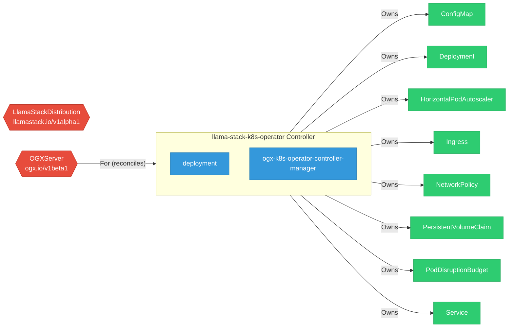

# llama-stack-k8s-operator

> **Architecture snapshot: 2026-05-20** (2026-05-20)

**Repository:** ogx-ai/llama-stack-k8s-operator  
**Analyzer:** arch-analyzer 0.2.0  
**Extracted:** 2026-05-20T04:07:55Z

## Summary

| Metric | Count |
|--------|-------|
| CRDs | 2 |
| Deployments | 2 |
| Services | 2 |
| Secrets | 1 |
| Cluster Roles | 5 |
| Controller Watches | 10 |

## Component Architecture

CRDs, controllers, and owned Kubernetes resources.

### CRDs

| Group | Version | Kind | Scope | Fields | Validation Rules | Discovery | Source |
|-------|---------|------|-------|--------|------------------|-----------|--------|
| llamastack.io | v1alpha1 | LlamaStackDistribution | Namespaced | 371 | 1 | YAML | [`config/crd/bases/llamastack.io_llamastackdistributions.yaml`](https://github.com/ogx-ai/llama-stack-k8s-operator/blob/2a877300096a0fe4a7499cb9ddeb8c289ab94eb5/config/crd/bases/llamastack.io_llamastackdistributions.yaml) |
| ogx.io | v1beta1 | OGXServer | Namespaced | 892 | 118 | YAML | [`config/crd/bases/ogx.io_ogxservers.yaml`](https://github.com/ogx-ai/llama-stack-k8s-operator/blob/2a877300096a0fe4a7499cb9ddeb8c289ab94eb5/config/crd/bases/ogx.io_ogxservers.yaml) |

## Dependencies

### Key External Dependencies

| Module | Version |
|--------|---------|
| github.com/go-logr/logr | v1.4.1 |
| github.com/go-logr/logr | v1.3.0 |
| github.com/go-logr/logr | v1.4.2 |
| github.com/go-logr/logr | v1.4.3 |
| github.com/go-logr/logr | v1.4.1 |
| github.com/go-logr/logr | v1.4.2 |
| github.com/go-logr/logr | v1.4.2 |
| github.com/go-logr/logr | v1.4.2 |
| github.com/go-logr/logr | v1.3.0 |
| github.com/go-logr/zapr | v1.3.0 |
| github.com/go-logr/zapr | v1.3.0 |
| github.com/prometheus/client_golang | v1.22.0 |
| github.com/prometheus/client_golang | v1.22.0 |
| github.com/prometheus/client_model | v0.6.1 |
| github.com/prometheus/client_model | v0.6.1 |
| github.com/prometheus/client_model | v0.6.1 |
| github.com/prometheus/client_model | v0.6.1 |
| github.com/prometheus/client_model | v0.6.1 |
| github.com/prometheus/client_model | v0.6.1 |
| github.com/prometheus/common | v0.62.0 |
| github.com/prometheus/common | v0.62.0 |
| github.com/prometheus/procfs | v0.15.1 |
| github.com/prometheus/procfs | v0.15.1 |
| google.golang.org/grpc | v1.72.1 |
| google.golang.org/grpc | v1.72.1 |
| k8s.io/api | v0.34.3 |
| k8s.io/api | v0.34.1 |
| k8s.io/api | v0.34.3 |
| k8s.io/api | v0.34.1 |
| k8s.io/api | v0.34.3 |
| k8s.io/api | v0.34.3 |
| k8s.io/api | v0.34.3 |
| k8s.io/apiextensions-apiserver | v0.34.1 |
| k8s.io/apiextensions-apiserver | v0.34.3 |
| k8s.io/apiextensions-apiserver | v0.34.1 |
| k8s.io/apimachinery | v0.34.3 |
| k8s.io/apimachinery | v0.34.3 |
| k8s.io/apimachinery | v0.34.1 |
| k8s.io/apimachinery | v0.34.3 |
| k8s.io/apimachinery | v0.34.3 |
| k8s.io/apimachinery | v0.34.3 |
| k8s.io/apimachinery | v0.34.3 |
| k8s.io/apimachinery | v0.34.3 |
| k8s.io/apimachinery | v0.34.1 |
| k8s.io/apiserver | v0.34.1 |
| k8s.io/apiserver | v0.34.3 |
| k8s.io/apiserver | v0.34.1 |
| k8s.io/apiserver | v0.34.3 |
| k8s.io/client-go | v0.34.1 |
| k8s.io/client-go | v0.34.3 |
| k8s.io/client-go | v0.34.1 |
| k8s.io/client-go | v0.34.3 |
| k8s.io/client-go | v0.34.3 |
| sigs.k8s.io/controller-runtime | v0.22.4 |

