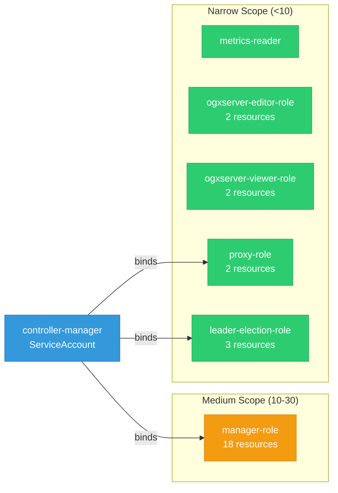

# llama-stack-k8s-operator: RBAC

ServiceAccount bindings, roles, and resource permissions.

## RBAC Overview

This component defines a large RBAC surface (71 diagram lines). The graph below groups roles by permission scope.

## Bindings

Subject-to-role mappings defining who has access to what.

| Binding | Type | Role | Subject |
|---------|------|------|---------|
| manager-rolebinding | ClusterRoleBinding | manager-role | ServiceAccount/controller-manager |
| proxy-rolebinding | ClusterRoleBinding | proxy-role | ServiceAccount/controller-manager |
| leader-election-rolebinding | RoleBinding | leader-election-role | ServiceAccount/controller-manager |

## Role Details

Per-rule breakdown of API groups, resources, and verbs for each role.

| Role | Kind | API Groups | Resources | Verbs |
|------|------|------------|-----------|-------|
| manager-role | ClusterRole |  | configmaps, persistentvolumeclaims | create, get, list, patch, update, watch |
| manager-role | ClusterRole |  | pods | list |
| manager-role | ClusterRole |  | serviceaccounts, services | create, delete, get, list, patch, update, watch |
| manager-role | ClusterRole |  | deployments | create, delete, get, list, patch, update, watch |
| manager-role | ClusterRole |  | horizontalpodautoscalers | create, delete, get, list, patch, update, watch |
| manager-role | ClusterRole |  | ingresses, networkpolicies | create, delete, get, list, patch, update, watch |
| manager-role | ClusterRole |  | ogxservers | create, delete, get, list, patch, update, watch |
| manager-role | ClusterRole |  | ogxservers/finalizers | update |
| manager-role | ClusterRole |  | ogxservers/status | get, patch, update |
| manager-role | ClusterRole |  | poddisruptionbudgets | create, delete, get, list, patch, update, watch |
| manager-role | ClusterRole |  | clusterrolebindings | delete, get, list |
| manager-role | ClusterRole |  | clusterroles | get, list, watch |
| manager-role | ClusterRole |  | rolebindings | create, delete, get, list, patch, update, watch |
| manager-role | ClusterRole |  | securitycontextconstraints | use |
| manager-role | ClusterRole |  | securitycontextconstraints | use |
| metrics-reader | ClusterRole |  |  | get |
| ogxserver-editor-role | ClusterRole |  | ogxservers | create, delete, get, list, patch, update, watch |
| ogxserver-editor-role | ClusterRole |  | ogxservers/status | get |
| ogxserver-viewer-role | ClusterRole |  | ogxservers | get, list, watch |
| ogxserver-viewer-role | ClusterRole |  | ogxservers/status | get |
| proxy-role | ClusterRole |  | tokenreviews | create |
| proxy-role | ClusterRole |  | subjectaccessreviews | create |
| leader-election-role | Role |  | configmaps | get, list, watch, create, update, patch, delete |
| leader-election-role | Role |  | leases | get, list, watch, create, update, patch, delete |
| leader-election-role | Role |  | events | create, patch |

### Cluster Roles

| Name | Resources | Verbs | Source |
|------|-----------|-------|--------|
| manager-role | configmaps, persistentvolumeclaims | create, get, list, patch, update, watch | [`config/rbac/role.yaml`](https://github.com/ogx-ai/llama-stack-k8s-operator/blob/2a877300096a0fe4a7499cb9ddeb8c289ab94eb5/config/rbac/role.yaml) |
| manager-role | pods | list | [`config/rbac/role.yaml`](https://github.com/ogx-ai/llama-stack-k8s-operator/blob/2a877300096a0fe4a7499cb9ddeb8c289ab94eb5/config/rbac/role.yaml) |
| manager-role | serviceaccounts, services | create, delete, get, list, patch, update, watch | [`config/rbac/role.yaml`](https://github.com/ogx-ai/llama-stack-k8s-operator/blob/2a877300096a0fe4a7499cb9ddeb8c289ab94eb5/config/rbac/role.yaml) |
| manager-role | deployments | create, delete, get, list, patch, update, watch | [`config/rbac/role.yaml`](https://github.com/ogx-ai/llama-stack-k8s-operator/blob/2a877300096a0fe4a7499cb9ddeb8c289ab94eb5/config/rbac/role.yaml) |
| manager-role | horizontalpodautoscalers | create, delete, get, list, patch, update, watch | [`config/rbac/role.yaml`](https://github.com/ogx-ai/llama-stack-k8s-operator/blob/2a877300096a0fe4a7499cb9ddeb8c289ab94eb5/config/rbac/role.yaml) |
| manager-role | ingresses, networkpolicies | create, delete, get, list, patch, update, watch | [`config/rbac/role.yaml`](https://github.com/ogx-ai/llama-stack-k8s-operator/blob/2a877300096a0fe4a7499cb9ddeb8c289ab94eb5/config/rbac/role.yaml) |
| manager-role | ogxservers | create, delete, get, list, patch, update, watch | [`config/rbac/role.yaml`](https://github.com/ogx-ai/llama-stack-k8s-operator/blob/2a877300096a0fe4a7499cb9ddeb8c289ab94eb5/config/rbac/role.yaml) |
| manager-role | ogxservers/finalizers | update | [`config/rbac/role.yaml`](https://github.com/ogx-ai/llama-stack-k8s-operator/blob/2a877300096a0fe4a7499cb9ddeb8c289ab94eb5/config/rbac/role.yaml) |
| manager-role | ogxservers/status | get, patch, update | [`config/rbac/role.yaml`](https://github.com/ogx-ai/llama-stack-k8s-operator/blob/2a877300096a0fe4a7499cb9ddeb8c289ab94eb5/config/rbac/role.yaml) |
| manager-role | poddisruptionbudgets | create, delete, get, list, patch, update, watch | [`config/rbac/role.yaml`](https://github.com/ogx-ai/llama-stack-k8s-operator/blob/2a877300096a0fe4a7499cb9ddeb8c289ab94eb5/config/rbac/role.yaml) |
| manager-role | clusterrolebindings | delete, get, list | [`config/rbac/role.yaml`](https://github.com/ogx-ai/llama-stack-k8s-operator/blob/2a877300096a0fe4a7499cb9ddeb8c289ab94eb5/config/rbac/role.yaml) |
| manager-role | clusterroles | get, list, watch | [`config/rbac/role.yaml`](https://github.com/ogx-ai/llama-stack-k8s-operator/blob/2a877300096a0fe4a7499cb9ddeb8c289ab94eb5/config/rbac/role.yaml) |
| manager-role | rolebindings | create, delete, get, list, patch, update, watch | [`config/rbac/role.yaml`](https://github.com/ogx-ai/llama-stack-k8s-operator/blob/2a877300096a0fe4a7499cb9ddeb8c289ab94eb5/config/rbac/role.yaml) |
| manager-role | securitycontextconstraints | use | [`config/rbac/role.yaml`](https://github.com/ogx-ai/llama-stack-k8s-operator/blob/2a877300096a0fe4a7499cb9ddeb8c289ab94eb5/config/rbac/role.yaml) |
| manager-role | securitycontextconstraints | use | [`config/rbac/role.yaml`](https://github.com/ogx-ai/llama-stack-k8s-operator/blob/2a877300096a0fe4a7499cb9ddeb8c289ab94eb5/config/rbac/role.yaml) |
| metrics-reader |  | get | [`config/rbac/auth_proxy_client_clusterrole.yaml`](https://github.com/ogx-ai/llama-stack-k8s-operator/blob/2a877300096a0fe4a7499cb9ddeb8c289ab94eb5/config/rbac/auth_proxy_client_clusterrole.yaml) |
| ogxserver-editor-role | ogxservers | create, delete, get, list, patch, update, watch | [`config/rbac/ogxserver_editor_role.yaml`](https://github.com/ogx-ai/llama-stack-k8s-operator/blob/2a877300096a0fe4a7499cb9ddeb8c289ab94eb5/config/rbac/ogxserver_editor_role.yaml) |
| ogxserver-editor-role | ogxservers/status | get | [`config/rbac/ogxserver_editor_role.yaml`](https://github.com/ogx-ai/llama-stack-k8s-operator/blob/2a877300096a0fe4a7499cb9ddeb8c289ab94eb5/config/rbac/ogxserver_editor_role.yaml) |
| ogxserver-viewer-role | ogxservers | get, list, watch | [`config/rbac/ogxserver_viewer_role.yaml`](https://github.com/ogx-ai/llama-stack-k8s-operator/blob/2a877300096a0fe4a7499cb9ddeb8c289ab94eb5/config/rbac/ogxserver_viewer_role.yaml) |
| ogxserver-viewer-role | ogxservers/status | get | [`config/rbac/ogxserver_viewer_role.yaml`](https://github.com/ogx-ai/llama-stack-k8s-operator/blob/2a877300096a0fe4a7499cb9ddeb8c289ab94eb5/config/rbac/ogxserver_viewer_role.yaml) |
| proxy-role | tokenreviews | create | [`config/rbac/auth_proxy_role.yaml`](https://github.com/ogx-ai/llama-stack-k8s-operator/blob/2a877300096a0fe4a7499cb9ddeb8c289ab94eb5/config/rbac/auth_proxy_role.yaml) |
| proxy-role | subjectaccessreviews | create | [`config/rbac/auth_proxy_role.yaml`](https://github.com/ogx-ai/llama-stack-k8s-operator/blob/2a877300096a0fe4a7499cb9ddeb8c289ab94eb5/config/rbac/auth_proxy_role.yaml) |

### Kubebuilder RBAC Markers

Kubebuilder `+kubebuilder:rbac` markers declare the RBAC requirements of controller reconcilers. These are the source of truth for generated ClusterRole manifests. 18 markers found.

| File | Line | Groups | Resources | Verbs |
|------|------|--------|-----------|-------|
| [`controllers/kubebuilder_rbac.go:4`](https://github.com/ogx-ai/llama-stack-k8s-operator/blob/2a877300096a0fe4a7499cb9ddeb8c289ab94eb5/controllers/kubebuilder_rbac.go#L4) | 4 | ogx.io | ogxservers | get, list, watch, create, update, patch, delete |
| [`controllers/kubebuilder_rbac.go:5`](https://github.com/ogx-ai/llama-stack-k8s-operator/blob/2a877300096a0fe4a7499cb9ddeb8c289ab94eb5/controllers/kubebuilder_rbac.go#L5) | 5 | ogx.io | ogxservers/status | get, update, patch |
| [`controllers/kubebuilder_rbac.go:6`](https://github.com/ogx-ai/llama-stack-k8s-operator/blob/2a877300096a0fe4a7499cb9ddeb8c289ab94eb5/controllers/kubebuilder_rbac.go#L6) | 6 | ogx.io | ogxservers/finalizers | update |
| [`controllers/kubebuilder_rbac.go:9`](https://github.com/ogx-ai/llama-stack-k8s-operator/blob/2a877300096a0fe4a7499cb9ddeb8c289ab94eb5/controllers/kubebuilder_rbac.go#L9) | 9 | apps | deployments | get, list, watch, create, update, patch, delete |
| [`controllers/kubebuilder_rbac.go:12`](https://github.com/ogx-ai/llama-stack-k8s-operator/blob/2a877300096a0fe4a7499cb9ddeb8c289ab94eb5/controllers/kubebuilder_rbac.go#L12) | 12 | "" | services | get, list, watch, create, update, patch, delete |
| [`controllers/kubebuilder_rbac.go:16`](https://github.com/ogx-ai/llama-stack-k8s-operator/blob/2a877300096a0fe4a7499cb9ddeb8c289ab94eb5/controllers/kubebuilder_rbac.go#L16) | 16 | "" | pods | list |
| [`controllers/kubebuilder_rbac.go:19`](https://github.com/ogx-ai/llama-stack-k8s-operator/blob/2a877300096a0fe4a7499cb9ddeb8c289ab94eb5/controllers/kubebuilder_rbac.go#L19) | 19 | "" | serviceaccounts | get, list, watch, create, update, patch, delete |
| [`controllers/kubebuilder_rbac.go:21`](https://github.com/ogx-ai/llama-stack-k8s-operator/blob/2a877300096a0fe4a7499cb9ddeb8c289ab94eb5/controllers/kubebuilder_rbac.go#L21) | 21 | rbac.authorization.k8s.io | clusterrolebindings | get, list, delete |
| [`controllers/kubebuilder_rbac.go:22`](https://github.com/ogx-ai/llama-stack-k8s-operator/blob/2a877300096a0fe4a7499cb9ddeb8c289ab94eb5/controllers/kubebuilder_rbac.go#L22) | 22 | rbac.authorization.k8s.io | clusterroles | get, list, watch |
| [`controllers/kubebuilder_rbac.go:25`](https://github.com/ogx-ai/llama-stack-k8s-operator/blob/2a877300096a0fe4a7499cb9ddeb8c289ab94eb5/controllers/kubebuilder_rbac.go#L25) | 25 | rbac.authorization.k8s.io | rolebindings | get, list, watch, create, update, patch, delete |
| [`controllers/kubebuilder_rbac.go:27`](https://github.com/ogx-ai/llama-stack-k8s-operator/blob/2a877300096a0fe4a7499cb9ddeb8c289ab94eb5/controllers/kubebuilder_rbac.go#L27) | 27 | security.openshift.io | securitycontextconstraints | use |
| [`controllers/kubebuilder_rbac.go:28`](https://github.com/ogx-ai/llama-stack-k8s-operator/blob/2a877300096a0fe4a7499cb9ddeb8c289ab94eb5/controllers/kubebuilder_rbac.go#L28) | 28 | security.openshift.io | securitycontextconstraints | use |
| [`controllers/kubebuilder_rbac.go:30`](https://github.com/ogx-ai/llama-stack-k8s-operator/blob/2a877300096a0fe4a7499cb9ddeb8c289ab94eb5/controllers/kubebuilder_rbac.go#L30) | 30 | "" | persistentvolumeclaims | get, list, watch, create, update, patch |
| [`controllers/kubebuilder_rbac.go:33`](https://github.com/ogx-ai/llama-stack-k8s-operator/blob/2a877300096a0fe4a7499cb9ddeb8c289ab94eb5/controllers/kubebuilder_rbac.go#L33) | 33 | "" | configmaps | get, list, watch, create, update, patch |
| [`controllers/kubebuilder_rbac.go:36`](https://github.com/ogx-ai/llama-stack-k8s-operator/blob/2a877300096a0fe4a7499cb9ddeb8c289ab94eb5/controllers/kubebuilder_rbac.go#L36) | 36 | networking.k8s.io | networkpolicies | get, list, watch, create, update, patch, delete |
| [`controllers/kubebuilder_rbac.go:39`](https://github.com/ogx-ai/llama-stack-k8s-operator/blob/2a877300096a0fe4a7499cb9ddeb8c289ab94eb5/controllers/kubebuilder_rbac.go#L39) | 39 | networking.k8s.io | ingresses | get, list, watch, create, update, patch, delete |
| [`controllers/kubebuilder_rbac.go:42`](https://github.com/ogx-ai/llama-stack-k8s-operator/blob/2a877300096a0fe4a7499cb9ddeb8c289ab94eb5/controllers/kubebuilder_rbac.go#L42) | 42 | policy | poddisruptionbudgets | get, list, watch, create, update, patch, delete |
| [`controllers/kubebuilder_rbac.go:45`](https://github.com/ogx-ai/llama-stack-k8s-operator/blob/2a877300096a0fe4a7499cb9ddeb8c289ab94eb5/controllers/kubebuilder_rbac.go#L45) | 45 | autoscaling | horizontalpodautoscalers | get, list, watch, create, update, patch, delete |

